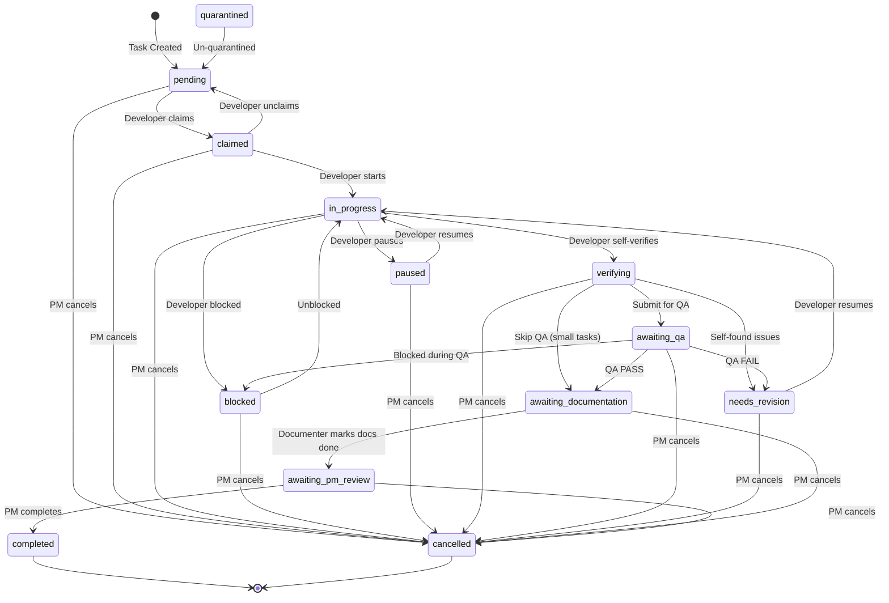
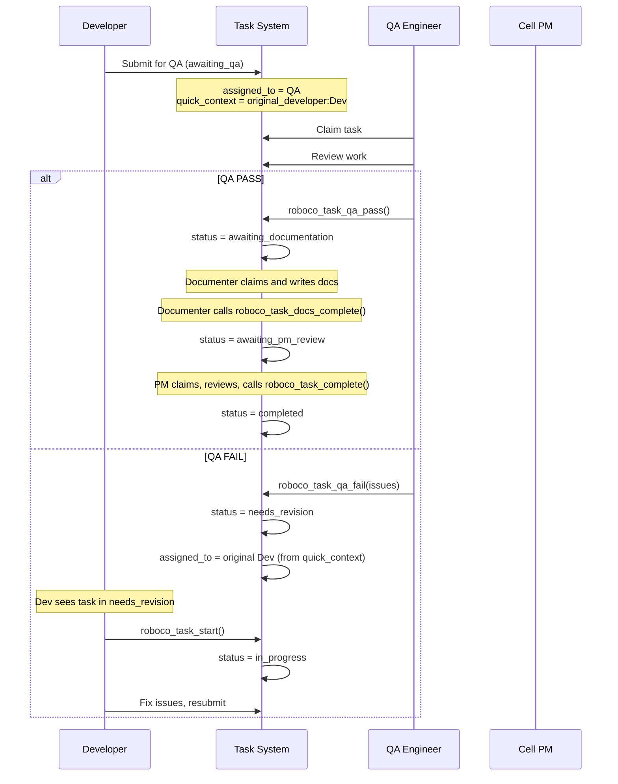
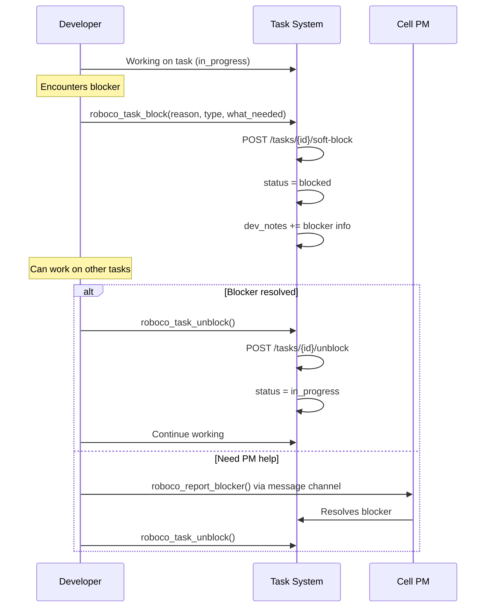

# RoboCo Workflows & Permissions

Visual documentation of task lifecycles, permissions, and workflows.

## 1. Task Lifecycle State Machine



## 2. Agent Hierarchy & Roles

```
                    +-------+
                    |  CEO  |
                    +-------+
                        |
        +---------------+---------------+
        |               |               |
   +---------+    +-----------+    +---------+
   | Product |    |   Head    |    | Auditor |
   | Owner   |    | Marketing |    | (silent)|
   +---------+    +-----------+    +---------+
        |               |               |
        +-------+-------+               |
                |                       |
           +---------+                  |
           | Main PM |<-----------------+
           +---------+      (observes all)
                |
    +-----------+-----------+
    |           |           |
+-------+   +-------+   +-------+
| BE PM |   | FE PM |   | UX PM |
+-------+   +-------+   +-------+
    |           |           |
+-------+   +-------+   +-------+
|Backend|   |Frontend|  | UX/UI |
| Cell  |   | Cell   |  | Cell  |
+-------+   +-------+   +-------+

Each Cell:
  - 2 Developers (BE/FE) or 1 Developer (UX)
  - 1 QA Engineer
  - 1 Documenter
  - 1 Cell PM
```

## 3. Notification Permissions

```
WHO CAN SEND NOTIFICATIONS:

+------------------+-------------+----------------------------------------------+
| Sender Role      | Can Send?   | Scope                                        |
+------------------+-------------+----------------------------------------------+
| CEO              | YES         | Anyone                                       |
| Auditor          | YES         | Anyone                                       |
| Main PM          | YES         | Anyone                                       |
| Product Owner    | YES         | main-pm, head-marketing, auditor, ceo        |
| Head Marketing   | YES         | main-pm, product-owner, auditor, ceo         |
| Cell PM          | YES         | Own cell only                                |
+------------------+-------------+----------------------------------------------+
| Developer        | NO          | -                                            |
| QA               | NO          | -                                            |
| Documenter       | NO          | -                                            |
+------------------+-------------+----------------------------------------------+

TOOLS VISIBILITY:

+----------------------+------------+----------+---------+---------+---------+
| Tool                 | Dev/QA/Doc | Cell PM  | Main PM | Board   | Aud/CEO |
+----------------------+------------+----------+---------+---------+---------+
| roboco_notify_list   | YES        | YES      | YES     | YES     | YES     |
| roboco_notify_get    | YES        | YES      | YES     | YES     | YES     |
| roboco_notify_ack    | YES        | YES      | YES     | YES     | YES     |
| roboco_notify_send   | HIDDEN     | YES      | YES     | YES     | YES     |
| roboco_escalate      | HIDDEN     | YES      | YES     | HIDDEN  | HIDDEN  |
| roboco_request_appr  | HIDDEN     | YES      | YES     | YES     | HIDDEN  |
+----------------------+------------+----------+---------+---------+---------+

Note: "Board" = Product Owner + Head Marketing. Auditor/CEO can send but not escalate or request approval.
```

## 4. QA Fail → Revision Workflow



## 5. Block/Unblock Workflow



## 6. Task Role Restrictions

```
ROLE-BASED TRANSITIONS:

+-------------------------------+-------------------------------------------+
| Transition                    | Allowed Roles                             |
+-------------------------------+-------------------------------------------+
| awaiting_qa → awaiting_doc    | QA only                                   |
| awaiting_qa → needs_rev       | QA only                                   |
| awaiting_doc → awaiting_pm    | Documenter only                           |
| awaiting_pm → completed       | Cell PM, Main PM, Product Owner, Head Mkt |
| * → cancelled                 | Cell PM, Main PM, Product Owner, Head Mkt |
+-------------------------------+-------------------------------------------+

Note: CEO and Auditor are NOT in the cancel/complete roles list - they observe but don't directly act on tasks.

VALID START STATUSES (for roboco_task_start):

+------------------+------------------------------------------+
| Status           | Who Can Start                            |
+------------------+------------------------------------------+
| claimed          | Assigned developer (requires plan)       |
| paused           | Assigned developer (resume)              |
| needs_revision   | Original developer (fix QA issues)       |
+------------------+------------------------------------------+
```

## 7. Escalation Chain

```
Developer/QA/Doc → Cell PM → Main PM → Product Owner → CEO

+------------+     +---------+     +---------+     +---------------+     +-----+
| be-dev-1   |---->|         |     |         |     |               |     |     |
| be-dev-2   |---->|  be-pm  |---->|         |     |               |     |     |
| be-qa      |---->|         |     |         |     |               |     |     |
| be-doc     |---->|         |     |         |     |               |     |     |
+------------+     +---------+     |         |     |               |     |     |
                                   | main-pm |---->| product-owner |---->| CEO |
+------------+     +---------+     |         |     |               |     |     |
| fe-dev-1   |---->|         |     |         |     |               |     |     |
| fe-dev-2   |---->|  fe-pm  |---->|         |     |               |     |     |
| fe-qa      |---->|         |     |         |     |               |     |     |
| fe-doc     |---->|         |     |         |     |               |     |     |
+------------+     +---------+     +---------+     +---------------+     +-----+
```

## 8. Communication vs Notification

```
+-------------------+----------------------------------+----------------------------------+
| Mechanism         | Who Can Use                      | Purpose                          |
+-------------------+----------------------------------+----------------------------------+
| Messages          | Everyone                         | Constant stream, logged          |
| (roboco_message)  |                                  | discussions, updates             |
+-------------------+----------------------------------+----------------------------------+
| Blocker Reports   | Everyone                         | Signal blocked status            |
| (roboco_report_   |                                  | PM auto-notified                 |
| blocker)          |                                  |                                  |
+-------------------+----------------------------------+----------------------------------+
| Notifications     | PM, Board, Auditor, CEO          | Formal signals requiring         |
| (roboco_notify)   |                                  | acknowledgment                   |
+-------------------+----------------------------------+----------------------------------+
| Escalations       | PMs only                         | High-priority issues             |
| (roboco_escalate) |                                  | up the chain                     |
+-------------------+----------------------------------+----------------------------------+
```
