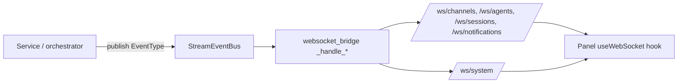

# WebSockets

RoboCo pushes live updates over WebSocket endpoints under `/ws`, served by the orchestrator (`roboco/api/websocket.py`) and routed through nginx alongside the REST API. A single in-process `ConnectionManager` holds per-resource connection sets and broadcasts events to them. The panel consumes all of these through its `useWebSocket("/<endpoint>", …)` hook — you rarely connect to them directly, but they're the same streams an integrator can subscribe to.

## The endpoints

There are four per-resource streams plus one operator-wide stream:

| Endpoint | Stream | Auth |
|----------|--------|------|
| `/ws/channels/{channel_id}` | Live messages in a team channel | `agent_id` query param, validated against the DB + channel access; **CEO panel token required in secure mode** |
| `/ws/agents/{agent_id}` | An agent's output and lifecycle events | `viewer_id`/`agent_id` query param, validated against the DB; **CEO panel token required in secure mode** |
| `/ws/sessions/{session_id}` | Messages in a communication session | `agent_id` query param, validated; **CEO panel token required in secure mode** |
| `/ws/notifications/{agent_id}` | An agent's notifications | `agent_id` query param, validated; **CEO panel token required in secure mode** |
| `/ws/system` | Operator/system-wide stream — no per-agent keying | **Unauthenticated, read-only** (operator-only by design; not token-gated) |

All sockets support a `ping`/`pong` keepalive: send `{"type": "ping"}` and you'll get a `pong` back.

!!! info "Secure mode now covers the per-agent streams"
    When `ROBOCO_AGENT_AUTH_REQUIRED=true`, the four per-resource sockets require the **CEO panel token** (the signed `X-Agent-Token` nginx injects for the panel) on top of their `agent_id`/`viewer_id` DB validation — an agent on the Docker network can no longer subscribe to another agent's stream unauthenticated. `/ws/system` is intentionally left operator-only and read-only. A forged token is rejected even in dev mode. See [Authentication](./auth.md).

## How events reach the sockets

Server-side events are published to an in-process `StreamEventBus`. The bridge in `roboco/api/websocket_bridge.py` subscribes to it and registers a `_handle_*` forwarder per event type, mapping each `EventType` to the right socket broadcast.

To add a new live event you define an `EventType`, publish it to the bus, add a `_handle_*` forwarder in `websocket_bridge`, and consume it on the panel via the same hook — you never stand up a parallel endpoint.

## Event types

| Event | Arrives on | What it carries |
|-------|-----------|-----------------|
| `RATE_LIMIT_HIT` | `/ws/system` | A provider just hit a rate limit / overload and was parked. Drives the panel's amber rate-limit banner. |
| `RATE_LIMIT_LIFTED` | `/ws/system` | A parked provider recovered; queued work resumes. Clears the banner. |
| `USAGE_SNAPSHOT` | `/ws/system` | A fresh token-usage/cost snapshot. Drives the live "Token Usage & Cost" dashboard. |
| `NOTIFICATION_SENT` / `NOTIFICATION_ACKED` | `/ws/notifications/{agent_id}` | A notification was sent to or acknowledged by an agent. |
| `MESSAGE_SENT` | `/ws/sessions/{session_id}` **and** `/ws/channels/{channel_id}` | A chat message was persisted. Forwarded as a `message.new` frame (carrying `message_id`, `agent_id`, `content`, `message_type`, `timestamp`) so the session transcript and channel view update live instead of waiting on a manual refresh. |
| `SESSION_CREATED` / `SESSION_CLOSED` / `SESSION_TIMEOUT` | `/ws/sessions/{session_id}` | Communication-session lifecycle. |
| `AGENT_SPAWNED` / `AGENT_STOPPED` / `AGENT_WAITING` / `AGENT_RESUMED` / `AGENT_ERROR` | `/ws/agents/{agent_id}` | Agent runtime lifecycle transitions. |

Each forwarded message is a JSON object with a `type` field merged with the event's data. The `type` is the event-type name above, except the message forwarder, which sets `type: "message.new"` (the frame the panel's channel/session stream filters on).

## REST fallbacks

The two operator dashboards that ride `/ws/system` fall back to HTTP polling when the socket is down, so the panel keeps working without the stream:

| Live event | HTTP fallback |
|------------|---------------|
| `RATE_LIMIT_HIT` / `RATE_LIMIT_LIFTED` | `GET /api/system/rate-limits` |
| `USAGE_SNAPSHOT` | `GET /api/usage/summary?period=24h\|7d\|30d` |

See [Cost & usage](../operations/cost-and-usage.md) and [Health & metrics](../operations/health-and-metrics.md) for what the panel does with these.

## Next

- [REST API](./rest-api.md) — the `/api/*` route map and the error envelope.
- [Authentication](./auth.md) — the WebSocket-auth caveat in full.
