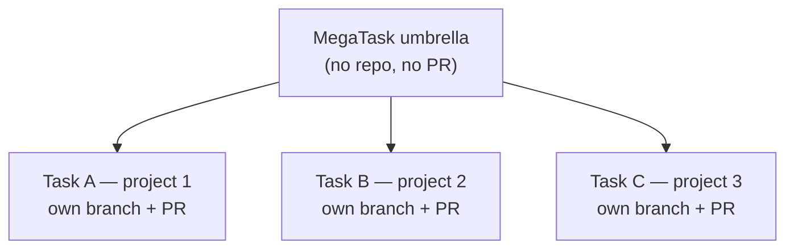

# MegaTask

Most of the time you describe one piece of work and RoboCo builds it. Sometimes you have **several** things you want done at once — and they aren't always in the same repository. A **MegaTask** lets you describe the whole set in a single intake chat and hand it off as one batch that the company sequences and builds for you.

The motivating example: you want to ship a change to a SaaS app, the open-source core engine it depends on, and a framework adapter — three repositories that don't share a codebase. That's one MegaTask.

## Starting a MegaTask

The intake modal has three scopes:

- **Single cell** — one task in one project.
- **Board-led** — a feature spanning the cells of one product.
- **MegaTask** — several tasks across the projects you pick.

Choose **MegaTask** and check every repository the work spans (pick at least two). The intake agent clones and reads all of them, interviews you exactly as usual, and then — instead of proposing one draft — proposes the **whole batch at once**: one task per piece of work, each already assigned to the project it belongs to.

## How the batch is sequenced

For each task it proposes, the agent declares a small **collision surface**: which files or directories it will touch, whether it adds a database migration, and whether it edits a widely-shared component. RoboCo turns those surfaces into conflict-free **waves** with a deterministic analyzer — no guesswork:

- Tasks that touch the same files are **serialized** (the more important one first).
- Tasks that add a migration run in a **serial chain**, never two at once.
- A task that edits a shared surface runs **after** the tasks it overlaps.
- Everything else runs **in parallel**.

The waves are just ordinary task dependencies, so the same dependency-gate that already paces the rest of the company runs them: a wave starts only once the previous wave's tasks have reached a terminal state — normally each one's pull request is merged (a cancelled task releases the next wave too).

The same collision-aware sequencing follows the work **down the chain**, not just at the top level. When a cell PM delegates a root-subtask into developer tasks, the dev-task collision surfaces flow through the same DAG — file-overlap serializes, migration-adders chain, shared-surface edits wait their turn — and cell tasks themselves wave-chain off their sibling root-subtasks. So a batch that spans a shared codebase stays ordered all the way to the leaves, not only at the umbrella. The task hierarchy is capped at four layers (umbrella → root → cell → dev) to fit this MegaTask shape.

## What gets created

When you confirm, RoboCo creates one **umbrella** task that groups the batch, and one **root-subtask** per piece of work:

The **umbrella** is the batch's single review-and-approve unit. It does no git of its own — it spans repositories that have no common `master`, so there is no mega-PR. Each **root-subtask** is a normal piece of work in its own repository, with its own branch and its own pull request, coordinated by the Main PM down to the cells exactly like any other task. The umbrella finishes only when every task in it is done.

## The two start buttons

Like a single task, a MegaTask offers two start paths:

- **Board review & Start** — the Product Owner and Head of Marketing review the **whole batch** first (they see every task and can adjust scope). The work is held until you approve the umbrella, then released wave by wave.
- **Approve & Start** — the batch goes straight to the Main PM and the first wave dispatches immediately.

Either way you review and approve the batch **once**, not task by task. After it launches, the umbrella and its tasks appear in your task views like any other work — you watch the waves progress, and each task lands as its own pull request for you to merge.
