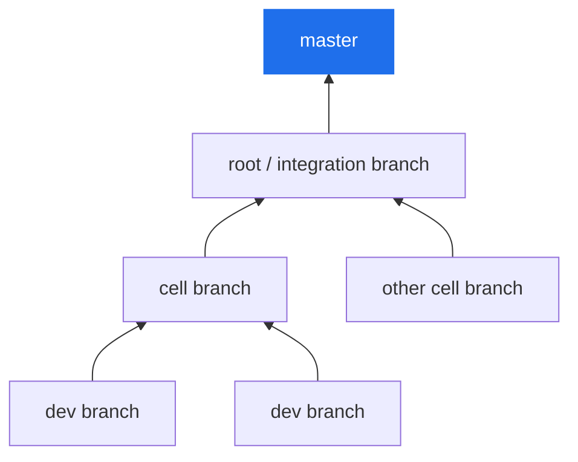

# The merge model

A feature in RoboCo isn't one commit on one branch — it's a small tree of work that converges, as real pull requests, up a fixed chain to your repository's default branch. The rule at the top is simple and absolute: **only you ever merge to `master`.**

## Branches, commits, and PRs are traceable

Every branch, commit, and pull request carries the task ID it belongs to, so your git history reads back to the work that produced it.

- **Branches** follow `{type}/{team}/{task-hierarchy}`, where the hierarchy uses `--` between levels (a `/` would collide with git's ref storage). Types are `feature`, `bug`, `chore`, `docs`, `hotfix`.

    ```text
    feature/backend/ABC12345                    # a root task
    feature/backend/ABC12345--DEF67890           # a subtask
    feature/backend/ABC12345--DEF67890--GHI11111 # a sub-subtask (max depth)
    ```

- **Commits** are auto-prefixed with the short task ID: `[ABC12345] Add the auth endpoint`.
- **Pull requests** are titled the same way: `[ABC12345] <title>`.

A branch is created automatically the moment an agent claims a task, and a **work session** tracks its branch, base, commits, files changed, and pull request from claim to merge.

## Work converges up a chain

Each developer works in their **own clone** and opens a pull request from their branch. Those flow upward:



1. **Developers → cell.** A cell's developers merge their work into the cell's branch.
2. **Cell → root.** The **cell PM** runs `submit_up` to open the cell → root pull request. The Main PM keeps one integration (root) branch per repository.
3. **Root → master.** The **Main PM** runs `submit_root` to open the final root → master pull request.

Each of those assembled pull requests passes through the [in-path PR-review gate](task-lifecycle.md#the-in-path-pr-review-gate) before its PM merges it.

## Only the CEO merges to master

The final pull request — root → master — is the one place the company stops and hands the decision back to you. It lands in your **CEO Approval Queue** and waits.

- The agent-facing merge path **hard-refuses to target the default branch.** A PM can merge a cell PR up to the root, but the merge to `master` is reserved for the CEO action, taken from `awaiting_ceo_approval`.
- **Force-push is CEO-only** too.

From the queue you **Approve & Merge** (it ships to `master`), **Request Changes** (it loops back for another pass), or **Cancel**. This is the second of the only two moments the company needs you — the first being the green light that started the work.

!!! info "Why a squash and one integration branch"
    Cell pull requests are squash-merged, so each cell's work lands as a single verified commit on the integration branch, co-authored by the agent that wrote it. The final pull request then carries one clean commit per cell — three streams of work folded into one reviewable history.

## Pull requests you didn't open

Not every pull request comes from inside the company. When an external contributor or a fork opens one against your repository, the read-only **PR Reviewer** reads the diff against your standards and posts a single change-request on the PR — it never chats, merges, or decides. The PR then surfaces in the **PR Review Queue** on the Command Center, where you **Supersede** it (the company cuts its own branch from the contributor's commits, hardens it, opens its own PR, and links back to the original once that merges) or **Dismiss** it. Either way the call is yours, and the org never pushes to anyone else's fork. *(This inbound-review flow is feature-flagged; see the optional-subsystems reference.)*

## Next

→ **[How agents are sandboxed](agent-gateway.md)** — why a developer agent literally cannot perform the merge.
