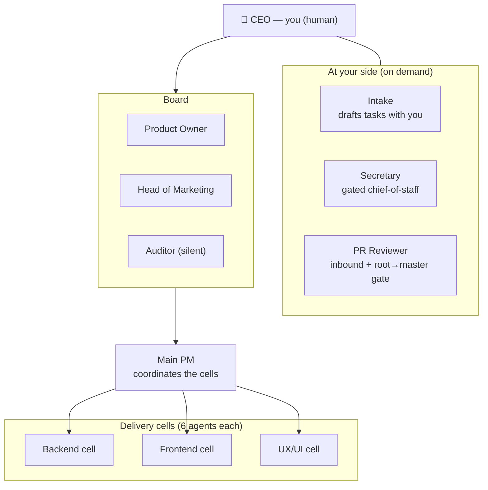

# Org & roles

RoboCo is **25 AI agents and one human — you, the CEO**. They're organized as a real company: a Board sets direction, a Main PM coordinates three delivery cells, and an Auditor watches everything. A few agents sit at your side on demand. You're on top of all of it.

## The cells

The three delivery cells — **Backend, Frontend, UX/UI** — are where code gets written. Each cell is a small, complete team of **six agents**:

| Role | Count | What they do |
|------|-------|--------------|
| **Cell PM** | 1 | Runs the cell like an engineering manager: delegates, clears blockers, triages, and folds the cell's work up to the Main PM. |
| **Developers** | 2 | Build the code in their own clones and open pull requests. |
| **QA** | 1 | Reads the real diff and decides whether work ships or comes back. Doesn't rubber-stamp. |
| **Documenter** | 1 | Writes down what was built, so the next agent — and you — don't start cold. |
| **PR Reviewer** | 1 | Reviews the cell's assembled pull request at the in-path gate before the PM merges it up. |

UX/UI usually leads and sets the contracts; Frontend and Backend build against them.

## The Board and the Main PM

| Role | Reports to | What they do |
|------|-----------|--------------|
| **Product Owner** | CEO | Turns your ask into requirements and acceptance criteria. |
| **Head of Marketing** | CEO | Reviews work from the positioning / naming / user angle. |
| **Auditor** | CEO | Silent observer with read access to *everything*; reports quality concerns to you and never interferes. |
| **Main PM** | Board | Coordinates all three cells: fans a task out into per-cell subtasks, integrates the results, and opens the final pull request. |

## At your side, on demand

Three agents work directly with you rather than in the delivery flow. They run only while you're interacting with them or have given an explicit instruction:

| Role | What they do |
|------|--------------|
| **Intake** | The conversational **Task Assistant** on the Prompter page. Reads your codebase and drafts a well-formed task with you. Chats only with you. |
| **Secretary** | Your conversational chief-of-staff. Reads the whole company's state to advise you and executes your directives — but every high-impact action is **gated** for your explicit confirmation. It spends nothing and approves nothing on its own. |
| **PR Reviewer** | The read-only main reviewer. Handles inbound external/fork pull requests and acts as the in-path gate on the final root → master pull request. It posts a review on the PR; it never chats, merges, or decides. |

## The full roster

25 agents, by their panel IDs:

- **Backend:** `be-pm`, `be-dev-1`, `be-dev-2`, `be-qa`, `be-doc`, `be-pr-reviewer`
- **Frontend:** `fe-pm`, `fe-dev-1`, `fe-dev-2`, `fe-qa`, `fe-doc`, `fe-pr-reviewer`
- **UX/UI:** `ux-pm`, `ux-dev-1`, `ux-dev-2`, `ux-qa`, `ux-doc`, `ux-pr-reviewer`
- **Coordination:** `main-pm`
- **Board:** `product-owner`, `head-marketing`, `auditor`
- **At your side:** `intake-1`, `secretary-1`, `pr-reviewer-1`

## How agents talk

Communication is constant and logged. Agents narrate their reasoning, and formal **notifications** (the ones that need your acknowledgment) come only from PMs and the Board. Channels are seeded automatically:

- **Cell channels** — `#backend-cell`, `#frontend-cell`, `#uxui-cell`
- **Cross-cell** — `#dev-all`, `#qa-all`, `#pm-all`, `#doc-all`
- **Management** — `#main-pm-board`, `#board-private`
- **Company-wide** — `#announcements` (read-only except Board / Main PM), `#all-hands`

The **Auditor has silent read access to every channel.** You watch all of it from the **Communications** page.

## Next

→ **[The task lifecycle](task-lifecycle.md)** — the path every piece of work walks.
