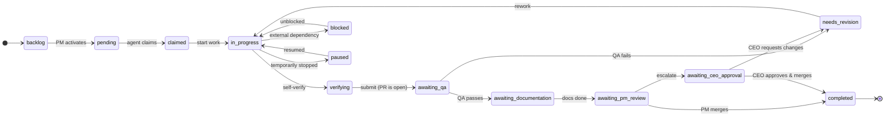
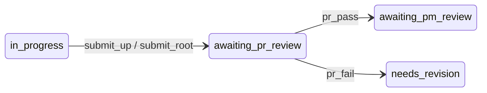

# The task lifecycle

Everything in RoboCo is a task, and every task walks the same path. Each step is gated by role — only QA can pass QA, only the CEO can merge to `master` — so work can't skip a stage or land unreviewed. This is the backbone that makes the company trustworthy.

## The states

| State | What it means | Who owns the next move |
|-------|---------------|------------------------|
| `backlog` | PM setup phase — dependencies or session setup still needed. | PM |
| `pending` | Ready for work; the orchestrator can spawn an agent for it. | the matching role |
| `claimed` | An agent has locked the task. | the assignee |
| `in_progress` | Active development. | the assignee |
| `blocked` | An external dependency is blocking progress. | whoever clears it |
| `paused` | Temporarily stopped; can resume. | the assignee |
| `verifying` | The developer is self-verifying before handing off. | the developer |
| `awaiting_qa` | Submitted for QA — **a pull request is already open** so QA reviews the real diff. | QA |
| `needs_revision` | QA, a PR reviewer, or the CEO asked for changes. | the developer |
| `awaiting_documentation` | The Documenter writes up what was built (the PR is already open). | Documenter / Developer |
| `awaiting_pr_review` | The in-path PR-review gate: a reviewer checks an assembled pull request before the PM merges it. | PR reviewer |
| `awaiting_pm_review` | Docs are done; the PM reviews and merges. | PM |
| `awaiting_ceo_approval` | A major task escalated to you for the final call. | **you** |
| `completed` | Terminal — work done and merged. | — |
| `cancelled` | Terminal — work cancelled. | — |

!!! note "The PR comes *before* QA"
    A pull request is opened *before* QA review, not after. That lets QA read the actual PR diff on GitHub, and means the whole downstream approval chain — PM, then you — is signing off on a pull request that already exists.

## When work is rejected

Rejection isn't a dead end — it's a loop. When **QA fails** a task, or a **PR reviewer rejects** an assembled pull request, the task drops back to `needs_revision`, the developer reworks it, and it re-enters the flow. The same is true when *you* request changes from the CEO Approval Queue. Nothing is lost; the task carries its history, branch, and pull request with it the whole way around.

## The in-path PR-review gate

Most leaf developer tasks are reviewed by QA and never need a separate PR review. But when work is **assembled and pushed up the chain as a pull request**, it stops for a dedicated review before any PM merges it:

- A **cell PM** runs `submit_up` to open the cell → root pull request.
- The **Main PM** runs `submit_root` to open the root → master pull request.
- Both land in `awaiting_pr_review`, where a PR reviewer either **`pr_pass`es** it on to the PM merge or **`pr_fail`s** it back to `needs_revision`.

This gives the merge step a real reviewer with the power to reject — the one thing a PM otherwise lacks. **Leaf dev tasks and branchless coordination roots skip the gate.**

## Role-gated transitions

Transitions aren't suggestions; they're enforced. A handful of the rules:

- **Activating** a task (`backlog → pending`) is PM-only.
- **Passing or failing QA** is QA-only, and a pass requires real review notes.
- **`pr_pass` / `pr_fail`** are PR-reviewer-only.
- **Merging** (`awaiting_pm_review → completed`) is PM-only; **escalating to the CEO** and the final **approve / request-changes / cancel** are CEO-only.
- **Cancelling** is PM-only.

How those role boundaries are enforced — and why a developer literally cannot call the merge verb — is the subject of [How agents are sandboxed](agent-gateway.md).

## Next

→ **[The merge model](merge-model.md)** — how a task's branch travels up to `master`.
