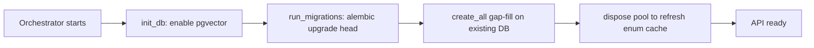

# Data & migrations

RoboCo keeps all of its state in PostgreSQL. There is no separate document store, no schema you have to hand-build, and — in normal operation — no migration command you have to remember. This page gives you the operator's-eye view: the handful of entities worth understanding, the one hard database requirement (pgvector), and how the schema keeps itself up to date.

## The entities you'll actually see

The full data model spans about thirty Pydantic models in `roboco/models/` with matching SQLAlchemy tables in `roboco/db/tables.py`. You don't need most of them. These are the ones that show up across the panel and explain how work flows:

| Entity | What it is |
|--------|------------|
| **Task** | The atomic unit of work. Carries its acceptance criteria, status (the 15-state [lifecycle](../company/task-lifecycle.md)), priority, branch name, PR number/URL, ownership (`created_by` / `assigned_to` / `team`), and its place in the tree (`parent_task_id`, `dependency_ids`, `blocker_ids`). A task points at **exactly one** of a `project_id` or a `product_id` — a single-repo task uses the project, a Board/fan-out coordination task uses the product. A validator enforces "one or the other, never both." |
| **Project** | A git repository configuration: `git_url`, default branch, protected branches, the Fernet-encrypted GitHub PAT (`git_token_encrypted` — the API only ever returns `has_git_token`, never the token), the per-project CI/gate commands, and the assigned cell. See [Register your first project](../get-started/first-project.md). |
| **WorkSession** | The link between an agent, a task, and a branch. One is created each time an agent claims a task. It tracks the base/target branches, the commits made, the files modified, the PR and merge outcome, and (when toolchain matching is on) the resolved Python version and toolchain status. |
| **Agent** | One row per member of the workforce — role, team, status — plus the human CEO. See [Org & roles](../company/org-and-roles.md). |
| **Session / Channel / Message** | The communication substrate. A `Channel` is a room; a `Session` is a live conversation inside it; a `Message` is one extracted line of an agent's stream. |
| **Notification** | A formal signal that requires acknowledgment (sent by PMs and the Board), distinct from the constant message stream. |
| **Journal** | Each agent's personal log of reflections and learnings, with `JournalEntry` rows underneath. |

Two newer entities round out the company-in-a-box features: **Product** (with `ProductProject`, the per-cell repo-routing map for fan-out work) and **Pitch** (a Board proposal that the CEO approves and that can auto-provision a repo). You'll meet these on the [Business](../panel/business.md) page.

## pgvector is required

RoboCo's in-house RAG engine stores embeddings in PostgreSQL using the **pgvector** extension. The orchestrator enables it for you at startup (`CREATE EXTENSION IF NOT EXISTS vector`), so the bundled `postgres` image — which ships pgvector — works out of the box.

!!! warning "If pgvector isn't installed"
    On a bring-your-own PostgreSQL where the `vector` extension isn't available, the orchestrator logs a warning and **RAG features silently disable** — agents lose the knowledge base and mentor lookups, but the rest of the system runs. If you point RoboCo at an external Postgres, make sure pgvector is installed there.

Operationally, **PostgreSQL and Redis are the only two stateful services to back up.** Everything the company knows lives in Postgres; Redis holds the event bus and short-lived coordination state.

!!! danger "The encryption key is not in the database"
    Each project's GitHub PAT is stored encrypted with `ROBOCO_ENCRYPTION_KEY`. A database backup **without that key is useless for the tokens** — you'll be able to restore every project except its credentials. Keep the key safe and separate. See the [environment reference](./env-reference.md).

## The stack migrates itself on startup

You almost never run a migration command by hand. When the orchestrator boots, `init_db()` enables pgvector and then `run_migrations()` runs `alembic upgrade head` in a worker thread:



The practical consequence: **a normal `docker compose up` / restart already applies any new migrations.** A fresh database is built entirely by the migration chain from base; an existing one runs only the pending steps (a pre-Alembic database is auto-stamped at the initial revision first, so it isn't re-built).

!!! tip "The manual command is belt-and-suspenders"
    The documented manual step — after pulling a change that adds a migration —

    ```bash
    docker compose exec orchestrator alembic upgrade head
    ```

    is a safety net, not a routine requirement, since the orchestrator runs the same command on boot. In host-dev mode (no container) the equivalent is `uv run alembic upgrade head`, or `make migrate`.

## A fresh DB is built by migrations, not `create_all` { #fresh-db-gotcha }

This is the one gotcha that bites operators who try to reset state by hand. Several migrations embed **seed data** — most importantly the LLM provider rows (Anthropic, Ollama, self-hosted, Grok). The schema must be built by **running the migration chain**, never by a bare SQLAlchemy `create_all`.

!!! warning "Don't reset a database with `create_all`"
    A `create_all`-only database has empty `provider_configs`, so the Settings → Providers endpoints return **404**. The fix is always the same: let the migrations run (restart the orchestrator, or run `alembic upgrade head`). The orchestrator's own startup uses `create_all` only as a *gap-fill* on an already-migrated database, never as the builder.

## Contributor notes

If you write or review custom migrations:

- **Revision-id length is capped at 32 characters.** PostgreSQL stores `alembic_version.version_num` as `VARCHAR(32)`. A longer id breaks a live `upgrade` even though the test suite (which renders offline / uses `create_all`) never catches it. The chain currently has **44 revisions** (45 files — revision `026` is split into two consecutive steps); the head is `044_convention_findings`, and the longest id in the tree is `015_drop_task_execution_outputs` at 31 characters, deliberately just under the limit.
- **The chain is linear.** Every revision has a single `down_revision`; there are no branches or merges to reconcile.
- **Models, tables, and migrations must stay in sync.** A Pydantic model in `roboco/models/`, its ORM table in `roboco/db/tables.py`, and the migration that creates the column are three layers that move together.

## Next

→ [Bootstrap & seeds](./bootstrap-and-seeds.md) — what `make db-init` puts into a fresh database. → [Environment reference](./env-reference.md) — every `ROBOCO_DATABASE_*` knob and the encryption key.
