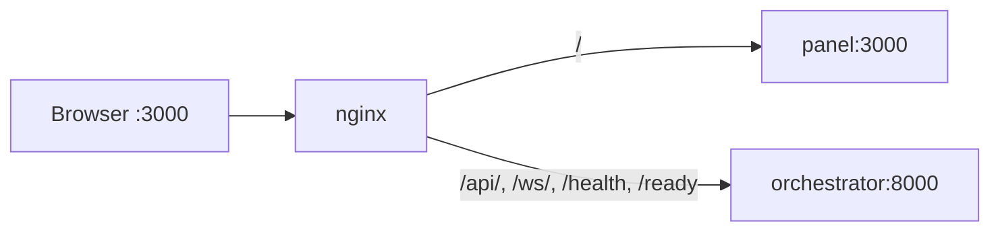
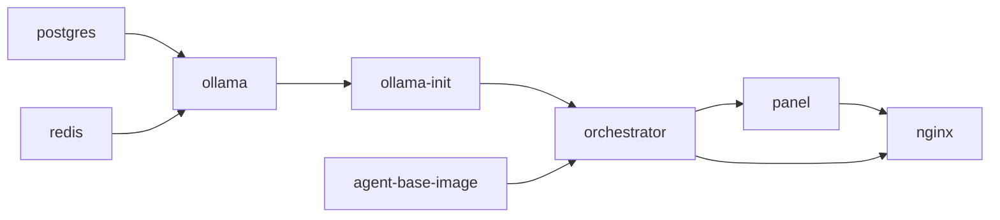

# Production deploy

This is the operator reference for running RoboCo on a NAS or server. If you just want it up on your laptop, the [install quickstart](../get-started/installation.md) is faster — this page assumes you've done that once and now want the durable, server-side setup: the compose files, the host mounts agents need, where data lives, how to back it up, and how to harden it.

!!! warning "Trusted network only"
    RoboCo is built for a private LAN or homelab. Do not expose it directly to the public internet. nginx is the single entry point, but the orchestrator's WebSocket streams and (in header-trust mode) its API assume a trusted network. Put it behind your own VPN if you need remote access.

## The three compose files

There are **three tracked compose files**, and they are not interchangeable:

| File | What it does | Needs a build toolchain? |
|------|--------------|--------------------------|
| `docker-compose.yml` | Builds every image from the Dockerfiles in `docker/`. | Yes |
| `docker-compose.yaml` | **Byte-identical** to `docker-compose.yml`. | Yes |
| `docker-compose.registry.yml` | Pulls and runs the **pre-built published images**. | No |

`docker-compose.yml` and `docker-compose.yaml` are the same file under two names — Docker Compose picks up either, and the NAS deployment runs the `.yaml`. If you fork RoboCo and change a service, keep all three in sync.

### Which one to run

For a server you don't intend to hack on, run the **registry** file — it pulls finished images and needs no source tree or compiler on the host:

```bash
docker compose -f docker-compose.registry.yml pull
docker compose -f docker-compose.registry.yml up -d
```

Two variables choose what you pull (defaults shown):

```bash
ROBOCO_REGISTRY=ghcr.io/rennf93   # or docker.io/renzof93
ROBOCO_VERSION=latest             # or a pinned release, e.g. 0.13.0
```

The orchestrator then spawns the **matching** pre-built agent images on demand (it reads `ROBOCO_AGENT_IMAGE_REGISTRY` / `ROBOCO_AGENT_IMAGE_TAG`, which the registry compose wires to the same registry and version). Pin `ROBOCO_VERSION` to a release tag in production so an upstream `latest` push can't silently change your fleet.

Build from source only when you're modifying RoboCo:

```bash
docker compose up -d   # builds on first run
```

!!! note "Agent images are build/pull-only services"
    The `agent-*-image` services in every compose file are one-shot stubs — they exist so `docker compose build`/`pull` materializes each per-role agent image up front. They never run as long-lived containers. The orchestrator spawns the actual agent containers itself, on demand, over the mounted Docker socket, and tears them down when their work is done.

## The single origin

nginx (`docker/nginx.conf`, rendered from an envsubst template) is the only externally-exposed service. It listens on `localhost:3000` and routes by path:



| Path | Upstream |
|------|----------|
| `/api/`, `/ws/`, `/health`, `/ready` | `roboco-orchestrator:8000` |
| everything else | `roboco-panel:3000` |

The browser only ever sees one origin (`:3000`), so there's no CORS to configure — the panel uses relative `/api` and `/ws` URLs and lets nginx dispatch. The panel container is never published directly; you reach it only through nginx. `/ws/` also gets a long (86400s) read timeout so live sockets stay open.

The backing services *do* publish host ports for direct inspection — Postgres on **15432**, Redis on **16379**, Ollama on **11435**, and the orchestrator on **8000**. You don't route browser traffic at these; they're there for `psql`, `redis-cli`, and the like.

## Required host-path mounts

The orchestrator is Docker-in-Docker: it mounts `/var/run/docker.sock` and spawns agent containers itself. Because those agent bind-mounts resolve on the **host** daemon (not inside the orchestrator container), several paths must be given as **absolute host paths** — the orchestrator passes them straight through to `docker run -v` for each agent.

| Variable | What it points at | Compose default |
|----------|-------------------|-----------------|
| `ROBOCO_HOST_PROJECT_DIR` | The RoboCo project directory on the host. | `/volume1/roboco` |
| `ROBOCO_HOST_CLAUDE_DIR` / `CLAUDE_AUTH_DIR` | The host `~/.claude` Claude Code auth dir, mounted into the orchestrator and each agent. | `/home/renzof/.claude` / `${HOME}/.claude` |
| `ROBOCO_HOST_DATA_DIR` | The host data dir handed to agents for shared volumes (workspaces, logs, grok-usage). | `/volume1/roboco/data` |
| `ROBOCO_DATA_DIR` | Host root for all persistent volumes mounted into the *backing* services and orchestrator (see below). | `./data` |
| `ROBOCO_HOST_GROK_DIR` | Host `~/.grok` SuperGrok auth — only needed if you run any agent on Grok. | `/home/renzof/.grok` |

!!! danger "These must be real, absolute host paths"
    A relative path or a path that only exists *inside* the orchestrator container will make agent spawns fail, because the host Docker daemon resolves the bind. On a NAS the project and data dirs usually live on the RAID volume (e.g. `/volume1/roboco` and `/volume1/roboco/data`).

The host `~/.grok` is mounted **read-write** into the orchestrator (it rewrites the short-lived token in place to keep agents from hanging on an expired login) and **read-only** into each Grok agent. Run `grok login` on the host once before enabling Grok. Provider routing and the Grok runtime are covered in the models section.

## Data persistence and backup

Everything durable lives under `ROBOCO_DATA_DIR` (default `./data`). On a server, point this at a RAID volume:

```bash
ROBOCO_DATA_DIR=/volume1/roboco/data
```

| Subdirectory | Holds |
|--------------|-------|
| `postgres/` | The entire database — tasks, projects, work sessions, journals, encrypted git tokens, the pgvector store. |
| `redis/` | Append-only cache, sessions, rate-limit + event-bus state. |
| `ollama/` | The local model cache (embedding model + local LLM) — large, but re-pullable. |
| `workspaces/` | Each agent's git clone of each project. |
| `logs/` | Per-agent run logs. |
| `mcp-configs/`, `prompts-generated/`, `agent-settings/`, `briefings/`, `manifests/` | Per-agent spawn artifacts the orchestrator writes. |
| `grok-usage/` | Per-agent Grok cost/usage capture. |

For backup, the load-bearing directory is `postgres/` (everything that isn't re-derivable). `ollama/` and `workspaces/` are reconstructible — Ollama re-pulls models, agents re-clone repos — so they're optional in a backup. Take Postgres backups with `pg_dump` against the published port rather than copying the live data directory:

```bash
pg_dump -h localhost -p 15432 -U roboco roboco > roboco-backup.sql
```

!!! danger "Back up `ROBOCO_ENCRYPTION_KEY` with the database"
    Every per-project GitHub token in the database is Fernet-encrypted with `ROBOCO_ENCRYPTION_KEY`. **A database backup is useless without the key.** If you lose or change the key, every stored token becomes undecryptable and must be re-entered project by project. Store the key with your secrets, keep it stable across restarts, and never commit `.env`.

## Secure mode

On a trusted LAN RoboCo runs in **header-trust mode** by default (`ROBOCO_AGENT_AUTH_REQUIRED=false`): callers are identified by role headers, no token required. That's the intended homelab setup.

To harden it so one agent can't spoof another's role, turn on fail-closed auth:

```bash
ROBOCO_AGENT_AUTH_REQUIRED=true
ROBOCO_AGENT_AUTH_SECRET=<your HMAC secret>     # already required for docker compose
ROBOCO_PANEL_AGENT_TOKEN=<from make panel-token>
```

With auth required, every API call must carry a valid `X-Agent-Token`. The panel runs in your browser and can't hold the signing secret, so nginx injects the CEO's token for it: generate the token with `make panel-token` (it signs one using your `ROBOCO_AGENT_AUTH_SECRET`), put it in `ROBOCO_PANEL_AGENT_TOKEN`, and nginx adds it as `X-Agent-Token` on `/api` and `/ws`. The panel keeps working; the secret never reaches the browser.

`ROBOCO_ENCRYPTION_KEY` and `ROBOCO_AGENT_AUTH_SECRET` are both **required** for any docker compose run — the orchestrator service block guards them with compose `:?` so the stack refuses to start if either is unset. See [Security](../troubleshooting/security.md) for the full sandboxing model and [the env reference](./env-reference.md) for every knob.

## Startup sequence

`depends_on` conditions enforce a strict boot order; the effective sequence is:



- **postgres / redis / ollama** must each pass their healthcheck (`pg_isready`, `redis-cli ping`, `ollama list`) before anything downstream starts.
- **ollama-init** is a one-shot that best-effort pulls the embedding model and the local LLM, then gates success on the models being **present** — a degraded model registry can't take down a fully-cached deployment.
- **orchestrator** waits for postgres + redis + ollama healthy, ollama-init completed, and agent-base-image built. On startup it **runs the database migrations itself** (idempotently, to head) and indexes its knowledge base — you do not run `alembic upgrade head` by hand for the compose path.
- **panel** waits for the orchestrator; **nginx** waits for both.

First boot is the slow one: the model pulls (the LLM is a couple of minutes) plus knowledge-base indexing. Watch it come up:

```bash
docker compose logs -f orchestrator
curl http://localhost:8000/health
docker ps --filter name=roboco
```

When the orchestrator reports serving, open `http://localhost:3000`. A boot that hangs is almost always waiting on `ollama-init` (model pull) or a healthcheck — check `docker compose ps` to see which service is still `starting`. Migration and data details are in [Data & migrations](./data-and-migrations.md); recurring boot symptoms are in [Common issues](../troubleshooting/common-issues.md).

## Operator-relevant Makefile targets

The `Makefile` drives the **host** developer workflow (uv-based, for hacking on RoboCo itself) — it is separate from the Docker stack and needs `uv` on the host. The handful that matter operationally:

| Target | Does |
|--------|------|
| `make panel-token` | Prints a signed CEO token for `ROBOCO_PANEL_AGENT_TOKEN` (secure mode). |
| `make infra` | Brings up only postgres + redis (`make infra-down` stops them) — for host-side dev against the backing services. |
| `make migrate` | Runs `alembic upgrade head` on the host (the compose stack self-migrates; this is the host-dev path). |
| `make run` | Runs the API + orchestrator on the host (no `--reload`); `make api` is the reload dev server, `make dev` runs both. |
| `make quality` | The full merge gate: ruff format-check + lint, mypy, pytest with 80% coverage floor, complexity, security, dependency, and migration checks. |
| `make serve-docs` | Serves this documentation locally with `mkdocs serve`. |
| `make status` / `make logs` | Orchestrator status / recent logs against a running instance. |

Run `make help` for the full list.

## Next

- **[Environment reference](./env-reference.md)** — every `ROBOCO_*` setting, with defaults and on/off state.
- **[Data & migrations](./data-and-migrations.md)** — the self-migrating schema and what to back up.
- **[Security](../troubleshooting/security.md)** — the full agent sandboxing and auth model.
