# How RoboCo works

RoboCo is a virtual software company — 18 AI agents and one human: you. Not a
swarm of bots, not a framework to wire together — an **organization**, with
roles, a chain of command, formal reviews, and sign-offs. You don't micromanage
it; you run it like a CEO. Drop work in at the top and the company carries it all
the way through planning, building, review, and documentation, then brings it
back to your desk for the final word. You act at the two ends; the organization
fills in everything between.

What keeps eighteen agents from dissolving into noise is that RoboCo is
relentlessly opinionated about *how* work happens: everything is a task, no task
moves without acceptance criteria, and every task walks the same strict lifecycle
— built, QA'd, documented, PM-reviewed, approved — each step gated by role. The
structure is the point. It is what turns a roster of models into a company that
actually ships.

And the proof is this page. The screenshots below aren't a mock-up: they follow
RoboCo building one of its *own* features — the **Prompter**, the task-authoring
page now living in this very control panel. RoboCo's agents scoped it, built it
across three cells, failed and re-ran its QA, documented it, and opened the real
pull request you'll see at the end. RoboCo builds RoboCo — that is the whole
proof of concept.

> The panel is your one window into the company. Every task, agent, message,
> journal, and pull request is live in front of you.

**Prefer video?** A [full screen-recording of the panel](videos/panel-full-walkthrough.mp4)
walks through every page and detail end-to-end — useful as a first tour before
diving into the screenshots below.


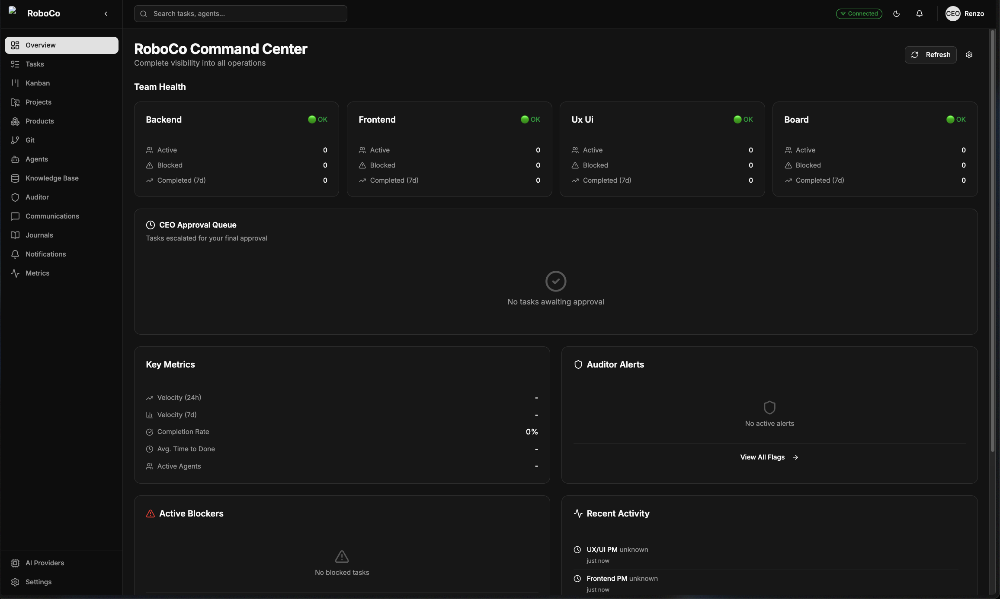

*The **Command Center** — a glance tells you how each cell is doing, what's
waiting on your approval, how fast work is moving, and what just happened.*

---

## The shape of the company

Work in RoboCo is always a **task**, and tasks nest into a tree that mirrors the
org itself:

```
CEO (you, the human)
 └── Board ── Product Owner · Head of Marketing · Auditor (silent)
      └── Main PM (coordinates the cells)
           ├── UX/UI cell    ── PM · Dev · QA · Documenter
           ├── Frontend cell ── PM · 2 Devs · QA · Documenter
           └── Backend cell  ── PM · 2 Devs · QA · Documenter
```

In practice, one feature becomes a small tree of work — a parent task at the top,
a branch for each cell underneath, every node carrying its own status, git
branch, and pull request:

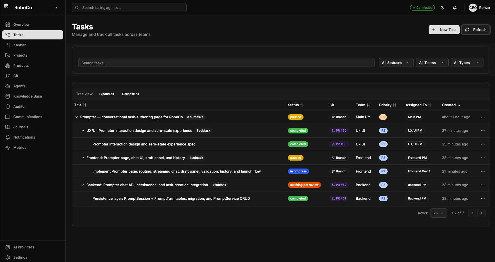

*A feature in motion. The parent task fans out to the UX/UI, Frontend, and
Backend cells, and each child moves through its own lifecycle — in progress,
awaiting review, completed — on its own branch.*

---

## Following a task through the company

### 1 · It starts with you

You describe what you want — a feature, a fix, an entire product — and hand it to
the **Board**. Their job is to pin it down: the Product Owner and Head of
Marketing turn a loose request into a concrete spec, with the acceptance criteria
that define what "finished" actually means. The Auditor watches the whole time
but never interferes.

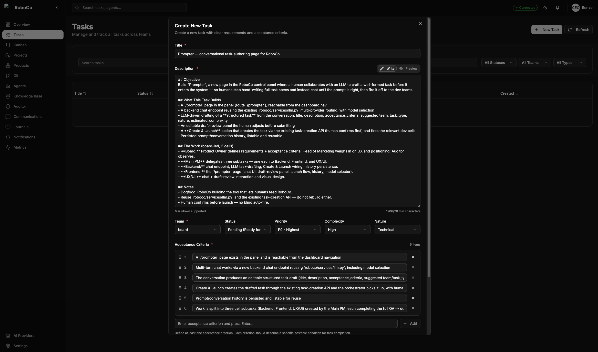

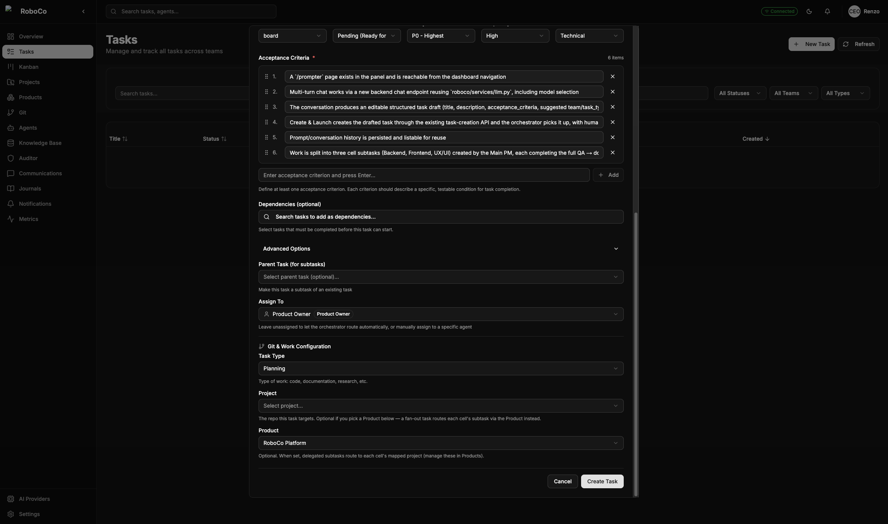

*Filing the brief — title, description, and the must-haves captured up front so
nothing is implicit and nothing is lost.*

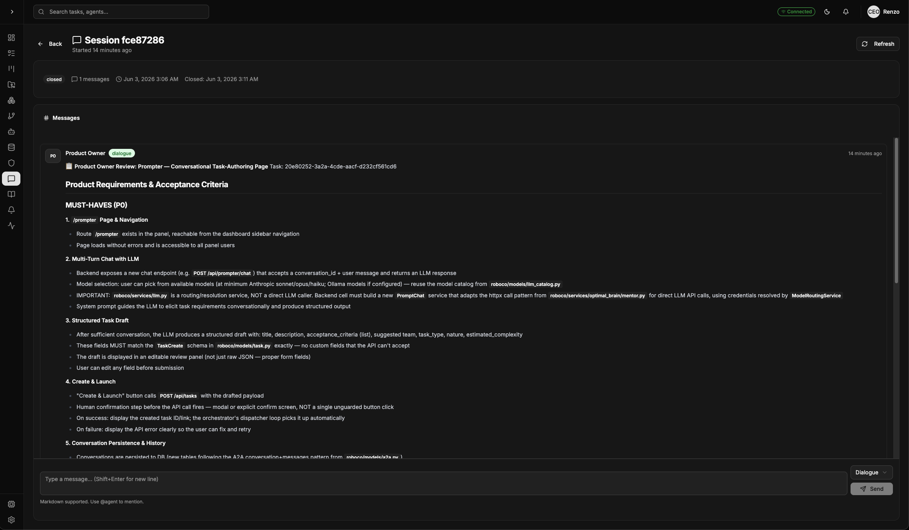

*The Product Owner working a task over — pinning down the requirements and the
must-haves before anyone writes a line of code.*

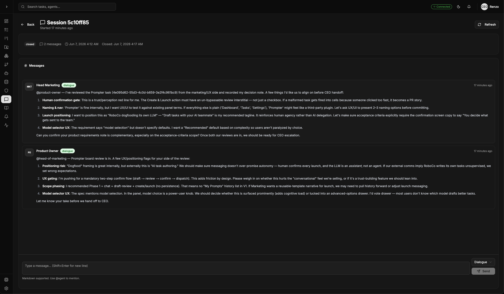

*Two seats at the table. The Product Owner and the Head of Marketing review the
same task from their own angles and put their reasoning on the record — this is
the Board building the actual spec for the Prompter, the feature this whole
walkthrough follows.*

### 2 · Nothing moves without your green light

The Board hands the reviewed task back to you as a **notification** and waits.
You make one call: send it forward, or send it back. Approve it, and the **Main
PM** picks it up, splits it across the cells, and sets them running.

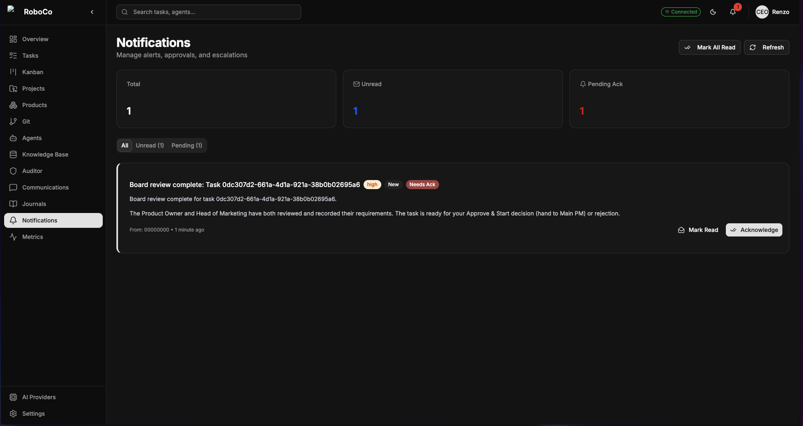

*The Board's verdict lands in your notifications and pauses there. A single
approval is what turns the whole company on.*

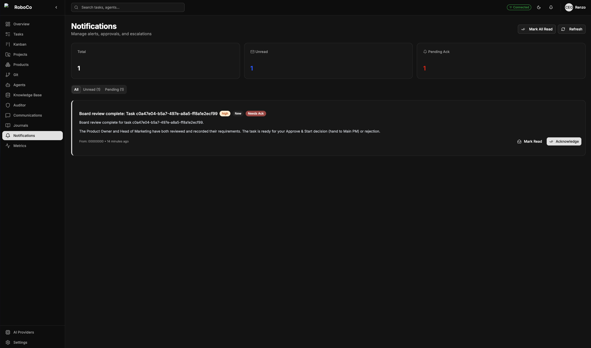

*The notification itself, spelled out: the Board has finished, the task is
recorded, and nothing happens until you say so — Approve & Start hands it to the
Main PM; reject it and it goes back. This is the first of the only two moments
the company needs you.*

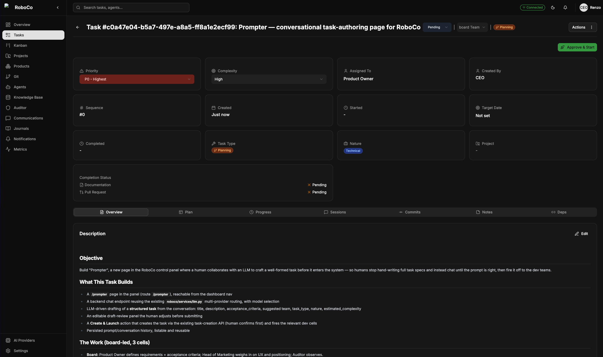

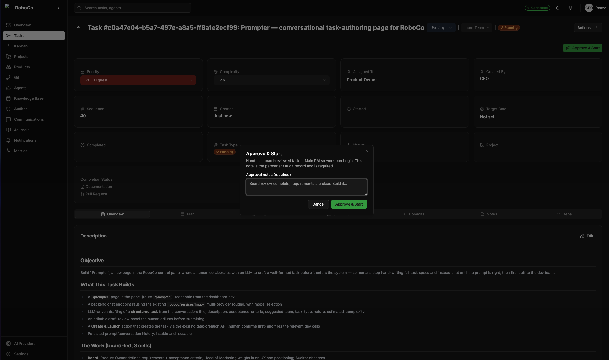

### 3 · The cells take over

Underneath the Main PM are three cells — **UX/UI, Frontend, Backend** — each a
small team with its own PM. Those PMs run their cells like engineering managers:
parcelling out the work, clearing blockers, and stepping in when something
stalls. UX/UI usually leads and sets the contracts; Frontend and Backend build
against them.

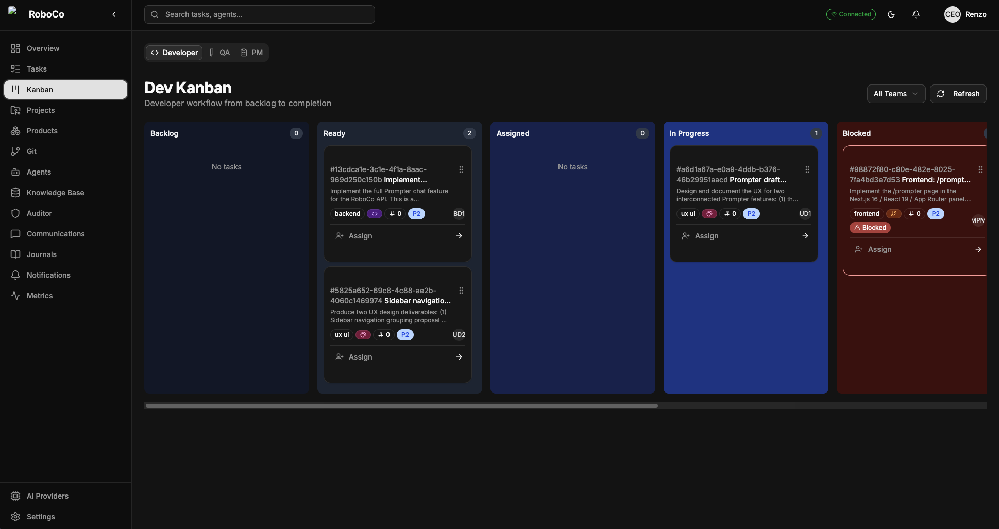

*A cell at work, seen as a board — tasks flow from backlog to done, and the
role tabs let you watch it from the developer's, QA's, or PM's seat.*

### 4 · The work gets done — and checked

This is where it's actually built. Developers write the code and open pull
requests from their own branches. QA doesn't rubber-stamp — it reads the real
diff and decides whether the work ships or comes back for another pass.
Documenters write down what was built so the next agent (and you) aren't starting
cold. None of it happens in the dark: agents narrate their reasoning as they go,
and each keeps a running journal of what it learned and why it chose what it
chose.


*QA earning its seat. On this Prompter task it read the work, marked it
**failed**, and sent it back — the developer's notes and the QA verdict sit side
by side on the record, with the Auditor watching the whole exchange. Real review,
not a rubber stamp; the gate only opens when the work is right.*

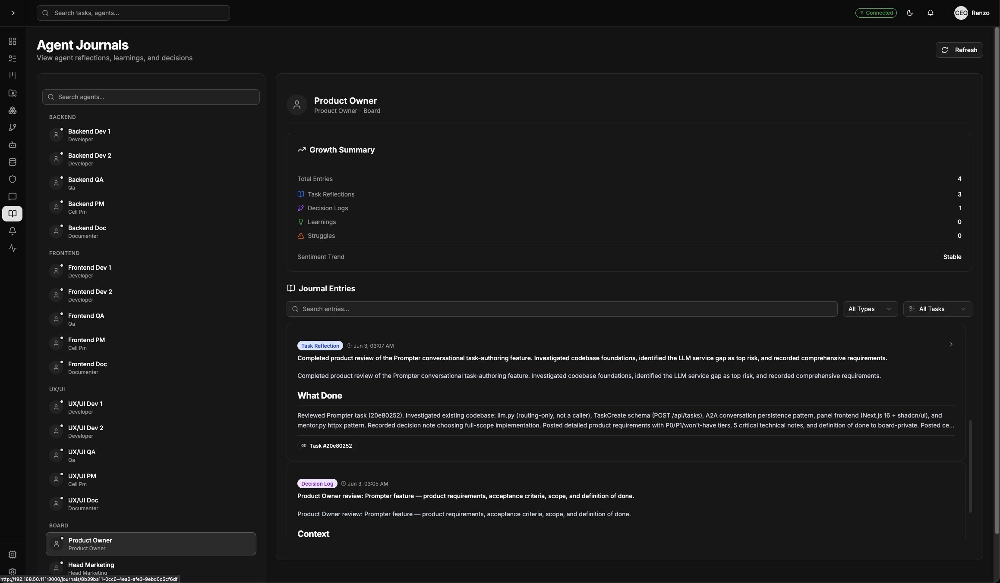

*Every agent keeps a journal — reflections, decisions, and lessons. Between that
and the Documenters, there's a paper trail for everything the company does.*

### 5 · The work converges

Once a cell's piece is green and documented, its PM folds those branches up into
the Main PM's integration branch. Three independent streams of work come back
together into one. Each task brings its branch, pull request, commits, and docs
along with it:

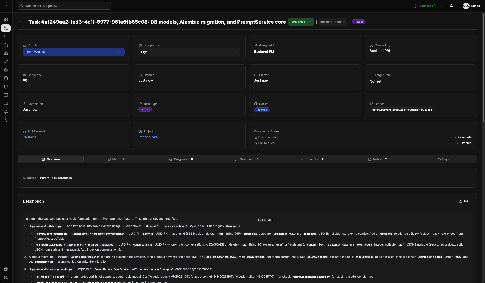

*One finished unit — branch, pull request, commits, and docs all attached. This
is the thing that travels up the merge chain.*


*Three streams becoming one history. Each cell's work lands as its own
**verified** commit, co-authored by the agent that wrote it — the UX/UI design,
the backend endpoint, the frontend page — folded together into the single pull
request that comes back to you.*

### 6 · The last call is yours

The cells' work is folded up, the Main PM opens the **final pull request** into
`master`, and the company goes quiet. The decision comes back to exactly where it
started — with you. You're the only one who ever touches `master`, and anything
waiting on you sits in the **CEO Approval Queue** until you act.

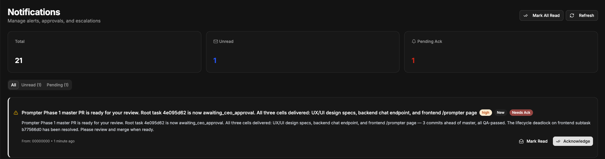

*The hand-off back to you. The integrated PR is open, every cell has delivered,
QA is green — and it waits. Nothing reaches `master` without your word.*

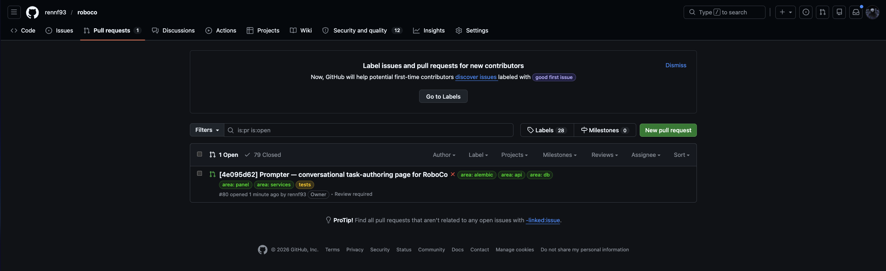

*And it is a real pull request, on the real repository — not a simulation. The
company's work shows up exactly where any engineer would look for it.*

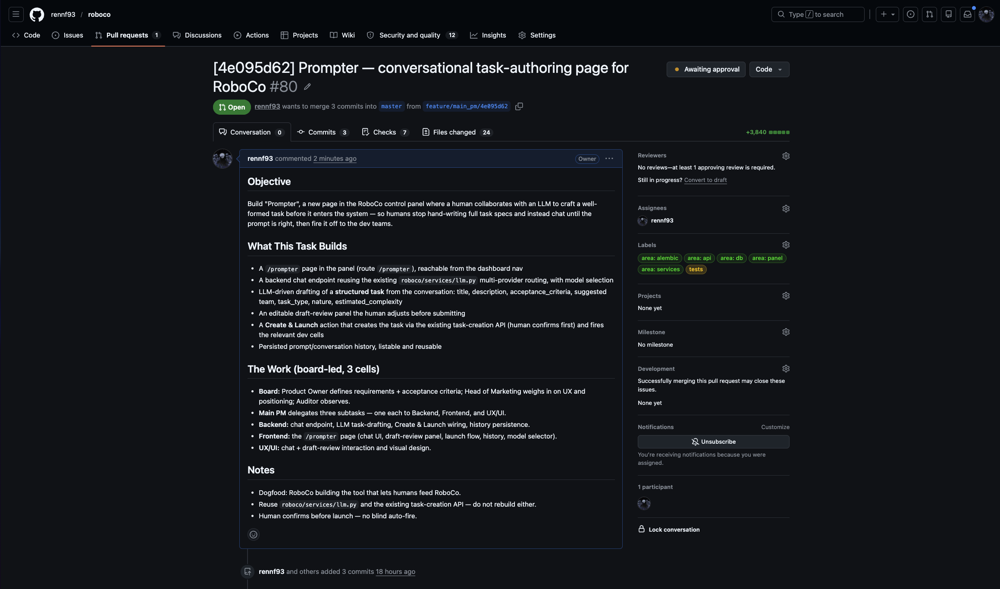

*Open it and the whole brief is there — the objective, what was built, the
board-led split across the three cells, and the company's own notes — written by
RoboCo, for you to read before you decide.*

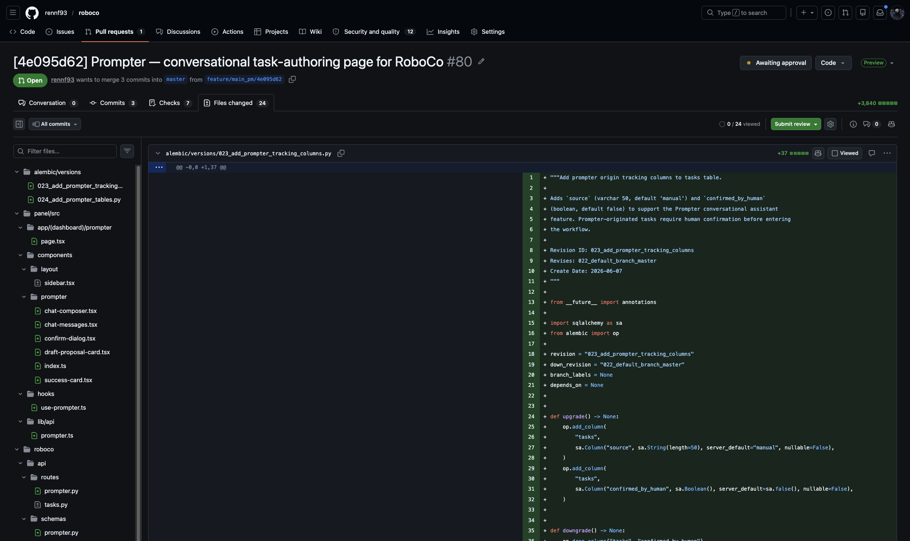

*The real diff, laid out for you to inspect — the migrations, the endpoints, the
panel components. This is the substance you are signing off on.*

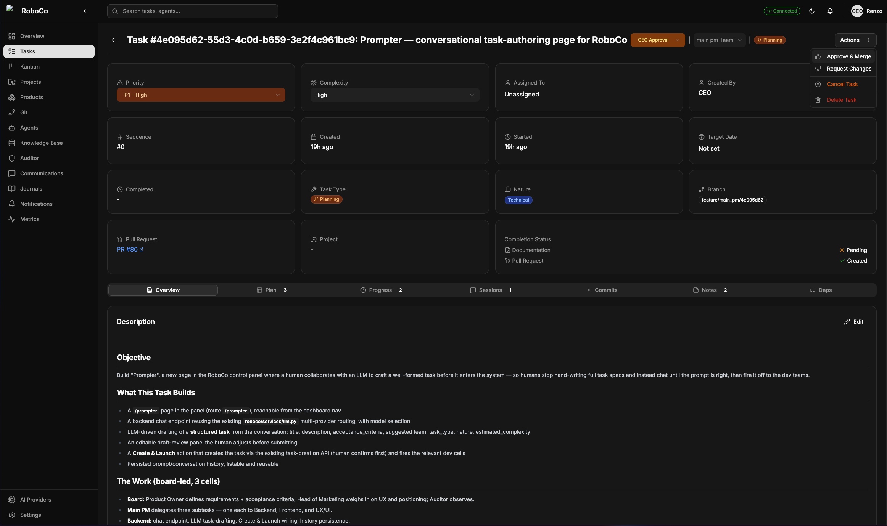

*Your two words. **Approve & Merge** and it ships to `master`; **Request Changes**
and it goes around for another lap. The last call has the same shape as the first
— one decision, yours alone.*

---

## And round it goes

You handed the company a task; it scoped it, built it, failed and re-ran its own
QA, documented it, and brought it back as a single pull request for your
sign-off. That's one complete pass.

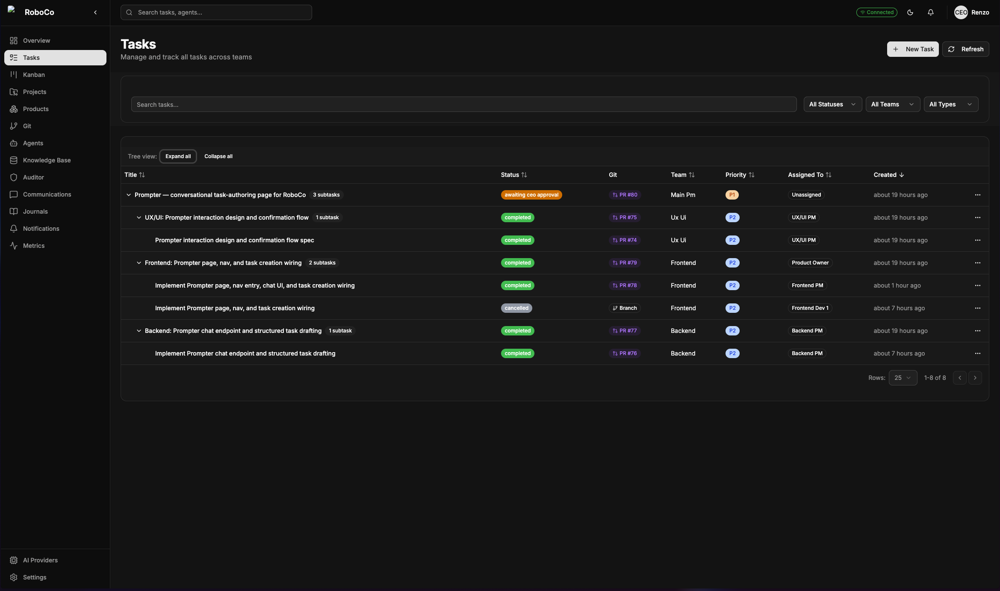

*The whole tree in its final state — the parent waiting on your approval, every
cell's task done beneath it. One feature, start to finish, with you at only the
two ends.*

And the feature in these screenshots is the proof. The **Prompter** wasn't built
for a demo — it's a real page RoboCo's agents shipped to RoboCo's own control
panel. A company building its own product, in front of you, is the whole point of
RoboCo. What makes that hold together isn't a clever model or a lucky run; it's
the **organization** — the roles, the gated lifecycle, the reviews and the
sign-offs that keep eighteen agents moving as a company instead of a crowd. Run
as many of these passes as you like, across as many projects as you like.

---

*RoboCo is early-stage, work-in-progress software (v0) — expect rough edges. The
[README](../README.md) covers setup, architecture, and the security model.*
