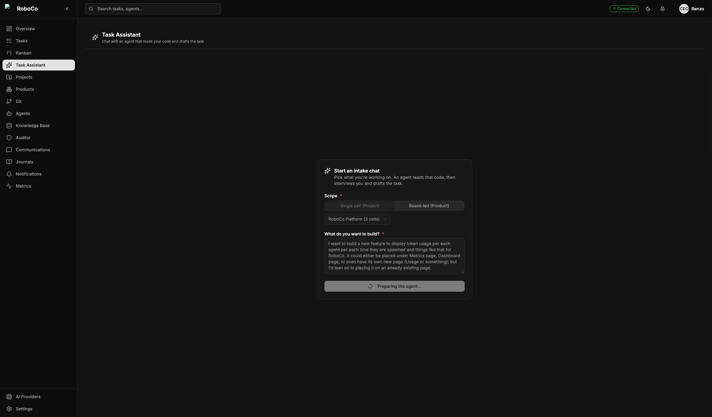
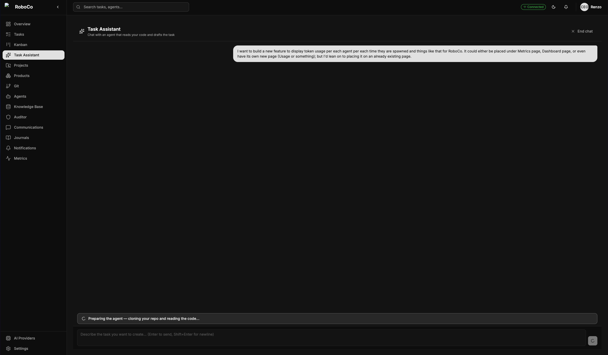
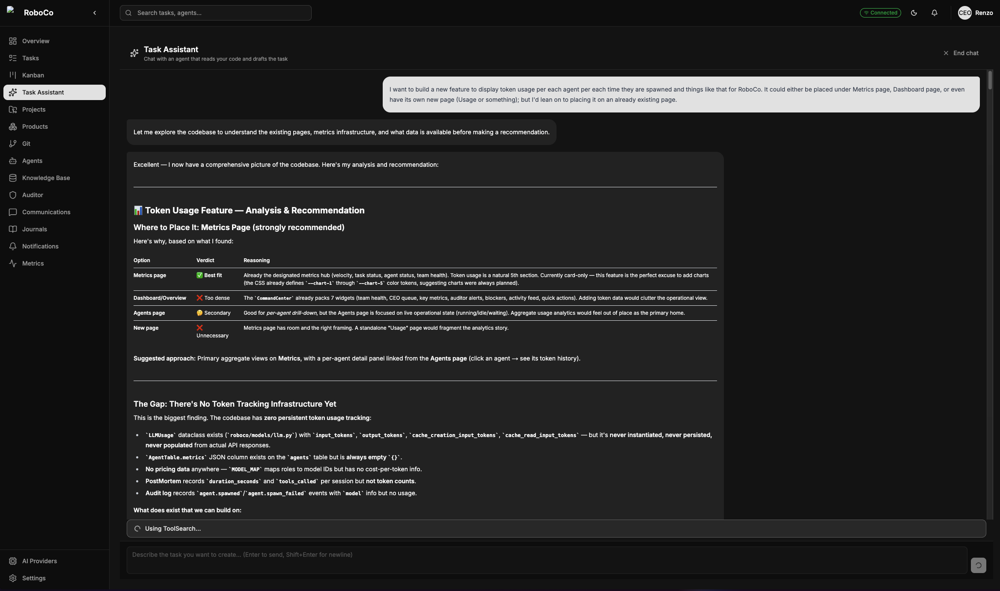
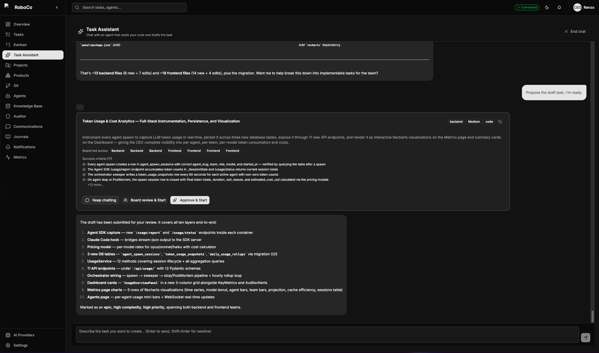
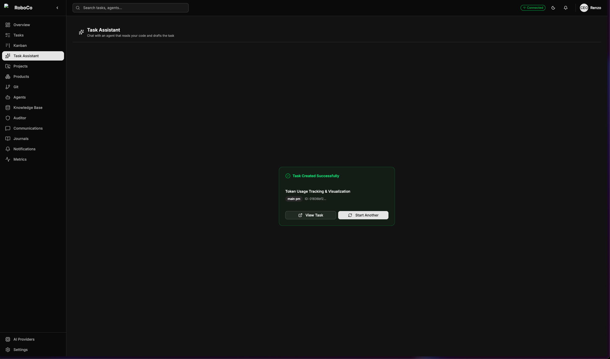
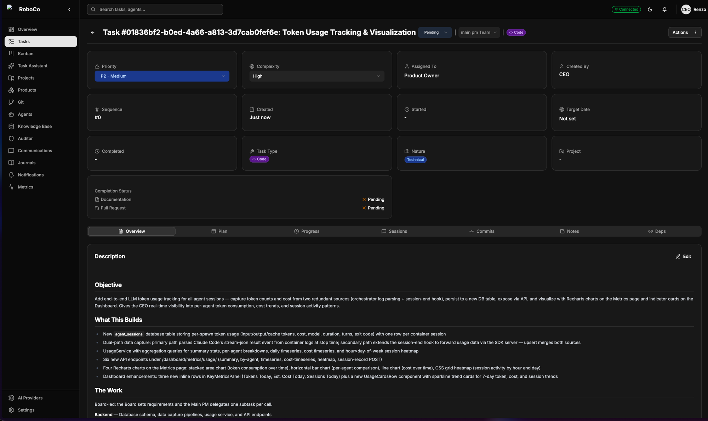

# It starts with you

## 1 · It starts with you

You describe what you want — a feature, a fix, an entire product. The way in is the **Task Assistant** — which is the **Prompter** itself, the very feature whose build the rest of this guide follows. (You're about to use the tool RoboCo built for itself; further on, you'll watch the company build it.) Instead of filling a form from memory, you give it a rough idea and it reads your *actual* codebase, asks a few sharp questions, and hands back a properly-formed task — an objective, a per-cell breakdown, and the acceptance criteria that define what "finished" really means.

*Where it starts — point the assistant at a project (one repo) or a product (several), drop in a rough idea, and it spins up an agent that reads that code before it says a word.*

There is a third scope, **MegaTask**, for when you want several tasks at once across projects that don't share a codebase — the assistant proposes the whole batch and the company sequences it into conflict-free waves. See [MegaTask](../company/megatask.md).

*No canned questions. The agent clones the scope and reads the real surface first, so everything it asks and proposes is grounded in what your code actually does.*

<!-- Optional: re-capture prompter_run_2 after the markdown-rendering fix ships (its headers will render cleanly instead of as raw ###). -->

*It comes back having done the homework — naming the real pages, services, and files, laying out what to build and where, and refining with you over a couple of turns until the spec is right.*

<!-- prompter_draft_card.png is the captured smoke shot; optionally re-capture after the draft-card cell-badge dedupe ships, for cleaner "Board-led across Backend Frontend" badges. -->

*The proposal, ready to launch. Keep chatting to refine it, send it to the **Board** for review, or approve it straight to the Main PM — your call, on one card.*

*From a rough sentence to a real, scoped task in a single chat — acceptance criteria and all, already moving through the company.*

From here, every task follows the path you chose for it. To show that journey end to end, the rest of this guide follows the **Prompter's own** trip through the company — from this same starting point to a merged pull request. Send a task to the **Board** and their job is to pin it down: the Product Owner and Head of Marketing turn the draft into a settled spec, sharpening the requirements and the acceptance criteria before anyone writes a line of code. The Auditor watches the whole time but never interferes.

*The Product Owner working a task over — pinning down the requirements and the must-haves before anyone writes a line of code.*

*Two seats at the table. The Product Owner and the Head of Marketing review the same task from their own angles and put their reasoning on the record — this is the Board building the actual spec for the Prompter, the feature this whole walkthrough follows.*

## 2 · Nothing moves without your green light

The Board hands the reviewed task back to you as a **notification** and waits. You make one call: send it forward, or send it back. Approve it, and the **Main PM** picks it up, splits it across the cells, and sets them running.

*The Board's verdict lands in your notifications and pauses there. A single approval is what turns the whole company on.*

*The notification itself, spelled out: the Board has finished, the task is recorded, and nothing happens until you say so — Approve & Start hands it to the Main PM; reject it and it goes back. This is the first of the only two moments the company needs you.*

---

Previous: **[← The shape of the company](01-the-company.md)** · Next: **[The cells build it →](03-the-cells-build-it.md)**
