# RoboCo Architecture Visual Guide

> Comprehensive visual documentation of the RoboCo AI Agentic Company system.
> Last Updated: December 29, 2025

---

## Table of Contents

1. [System Overview Mind Map](#1-system-overview-mind-map)
2. [Agent Hierarchy Diagram](#2-agent-hierarchy-diagram)
3. [Task Lifecycle Flowchart](#3-task-lifecycle-flowchart)
4. [Permissions Matrix](#4-permissions-matrix)
5. [Communication Flow Diagram](#5-communication-flow-diagram)
6. [Services Dependency Graph](#6-services-dependency-graph)
7. [Data Model Entity Relationships](#7-data-model-entity-relationships)
8. [API Route Structure](#8-api-route-structure)
9. [Workflow Enforcement Diagram](#9-workflow-enforcement-diagram)

---

## 1. System Overview Mind Map

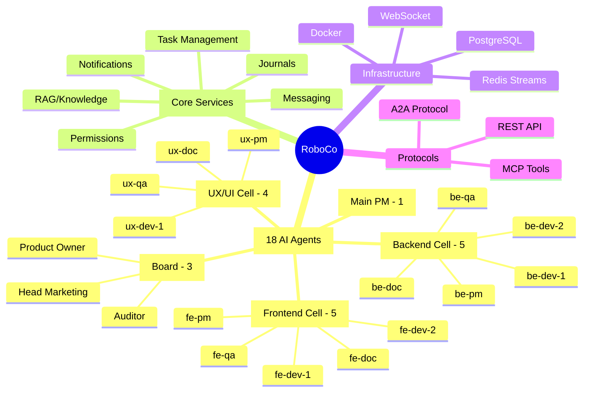

### Architecture Layers

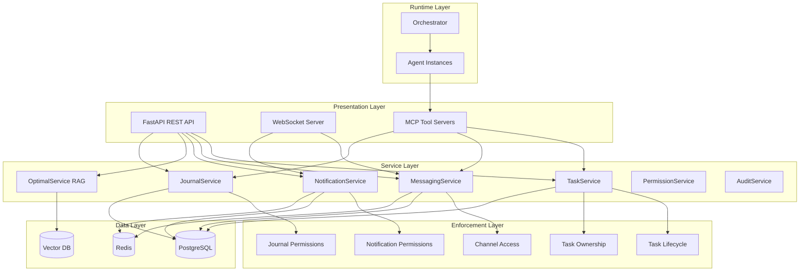

---

## 2. Agent Hierarchy Diagram

### Organizational Structure

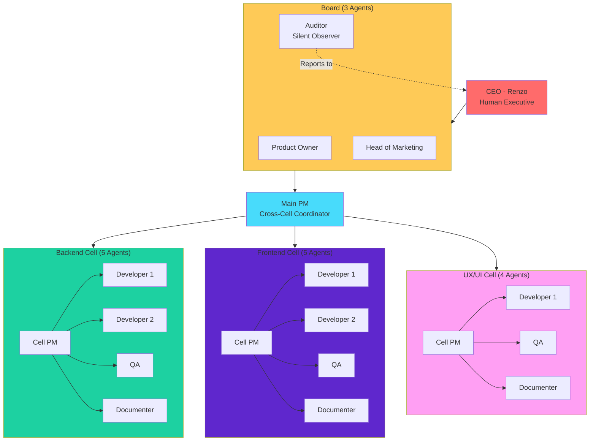

### Escalation Chain

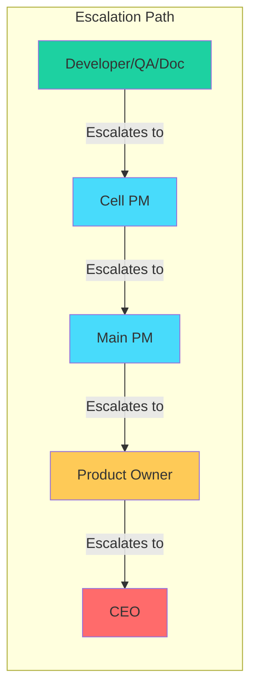

### Agent Roles and Capabilities

| Role | Team | Can Create Tasks | Can Assign | Can Cancel | Can Notify | Permission Level |
|------|------|------------------|------------|------------|------------|------------------|
| CEO | - | Yes | Yes | Yes* | Yes | L0 (Full Access) |
| Product Owner | Board | Yes | Yes | Yes | Yes | L1 (Cross-Org) |
| Head Marketing | Board | Yes | Yes | Yes | Yes | L1 (Cross-Org) |
| Auditor | Board | Yes | Yes | No* | Yes | L99 (Silent Read All) |
| Main PM | - | Yes | Yes | Yes | Yes | L2 (All Cells) |
| Cell PM | Cell | Yes | Yes | Yes | Yes | L3 (Own Cell + PM) |
| Developer | Cell | No | No | No | No | L4 (Own Cell) |
| QA | Cell | No | No | No | No | L4 (Own Cell) |
| Documenter | Cell | No | No | No | No | L4 (Own Cell) |

*CEO and Auditor observe only - they don't actively cancel tasks

---

## 3. Task Lifecycle Flowchart

### Complete State Machine

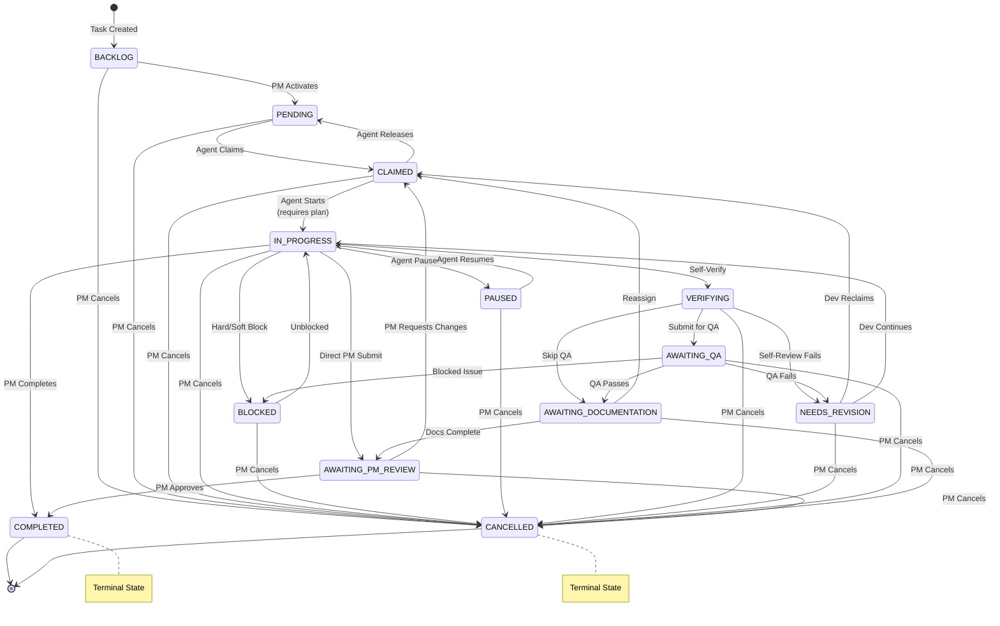

### Simplified Developer Workflow

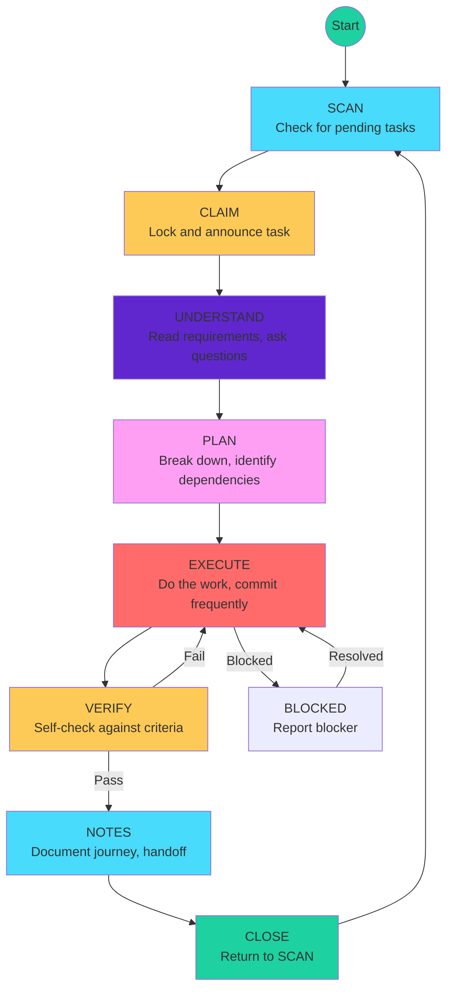

### Role-Based Status Access

| From Status | To Status | Allowed Roles |
|-------------|-----------|---------------|
| BACKLOG | PENDING | Cell PM, Main PM, Product Owner, Head Marketing |
| AWAITING_QA | Any QA transition | QA only |
| AWAITING_DOCUMENTATION | Any Doc transition | Documenter only |
| AWAITING_PM_REVIEW | COMPLETED | Cell PM, Main PM only |
| Any | CANCELLED | Cell PM, Main PM, Product Owner, Head Marketing |
| Any | COMPLETED | Cell PM, Main PM only |

---

## 4. Permissions Matrix

### Channel Access Matrix

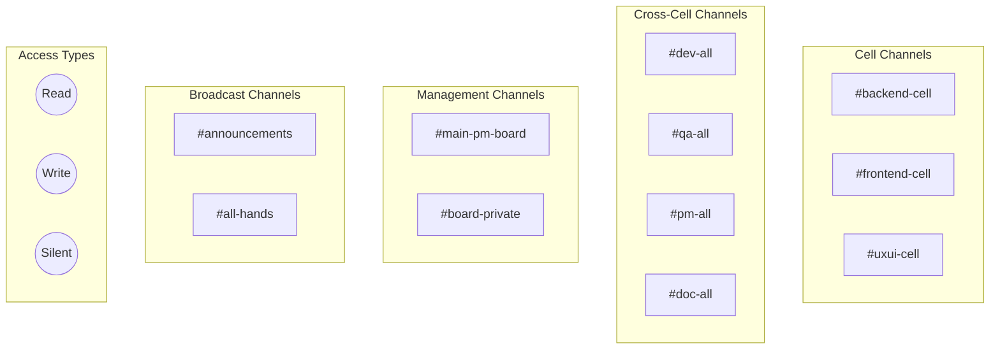

### Detailed Channel Permissions

| Channel | Read Access | Write Access | Silent (Auditor) |
|---------|-------------|--------------|------------------|
| #backend-cell | BE members, Main PM | BE members | Auditor |
| #frontend-cell | FE members, Main PM | FE members | Auditor |
| #uxui-cell | UX members, Main PM | UX members | Auditor |
| #dev-all | All Devs, All PMs | All Devs, Cell PMs, Main PM | Auditor |
| #qa-all | All QA, Cell PMs, Main PM | All QA, Cell PMs | Auditor |
| #pm-all | All PMs | All PMs | Auditor |
| #doc-all | All Docs, Cell PMs, Main PM | All Docs, Cell PMs | Auditor |
| #main-pm-board | Main PM, PO, HM, Auditor | Main PM, PO, HM, Auditor | - |
| #board-private | PO, HM, Auditor, CEO, Main PM | PO, HM, Auditor, CEO | - |
| #announcements | Everyone | Main PM, Board, CEO | - |
| #all-hands | Everyone | Everyone | - |

### Task Permission Matrix

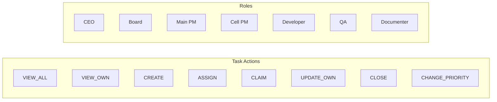

| Role | VIEW_ALL | VIEW_OWN | CREATE | ASSIGN | CLAIM | UPDATE_OWN | CLOSE | CHANGE_PRIORITY |
|------|----------|----------|--------|--------|-------|------------|-------|-----------------|
| CEO | ✓ | ✓ | ✓ | ✓ | - | - | ✓ | ✓ |
| Board | ✓ | ✓ | ✓ | ✓ | - | - | ✓ | ✓ |
| Main PM | ✓ | ✓ | ✓ | ✓ | ✓ | ✓ | ✓ | ✓ |
| Cell PM | - | ✓ | ✓ | ✓ | ✓ | ✓ | ✓ | ✓ |
| Developer | - | ✓ | - | - | ✓ | ✓ | ✓ | - |
| QA | - | ✓ | - | - | ✓ | ✓ | - | - |
| Documenter | - | ✓ | - | - | ✓ | ✓ | ✓ | - |

### Knowledge Base Permission Matrix

| Role | INDEX_CODE | INDEX_DOCS | SEARCH | QUERY | VIEW_STATS | CLEAR_INDEX | REFRESH_INDEX |
|------|------------|------------|--------|-------|------------|-------------|---------------|
| CEO | ✓ | ✓ | ✓ | ✓ | ✓ | ✓ | ✓ |
| Board | - | ✓ | ✓ | ✓ | ✓ | - | - |
| Main PM | ✓ | ✓ | ✓ | ✓ | ✓ | ✓ | ✓ |
| Cell PM | ✓ | ✓ | ✓ | ✓ | ✓ | - | - |
| Developer | ✓ | ✓ | ✓ | ✓ | ✓ | - | - |
| QA | - | - | ✓ | ✓ | ✓ | - | - |
| Documenter | - | ✓ | ✓ | ✓ | ✓ | - | - |

---

## 5. Communication Flow Diagram

### Message Flow Architecture

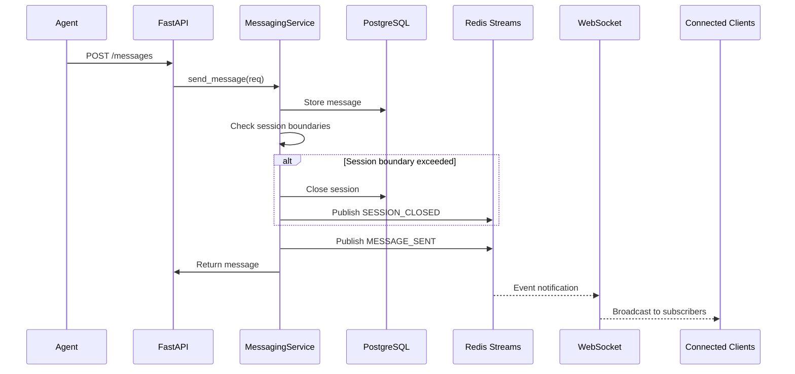

### Notification Flow

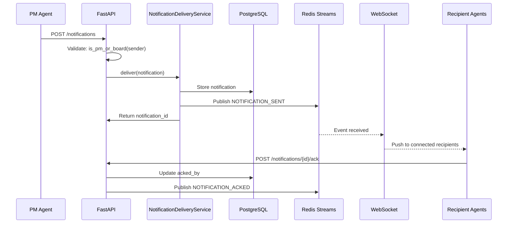

### Channel Hierarchy

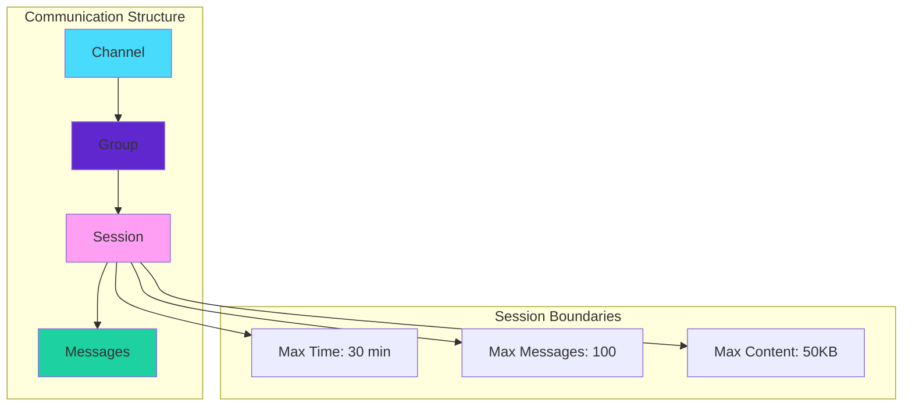

### A2A Protocol Flow

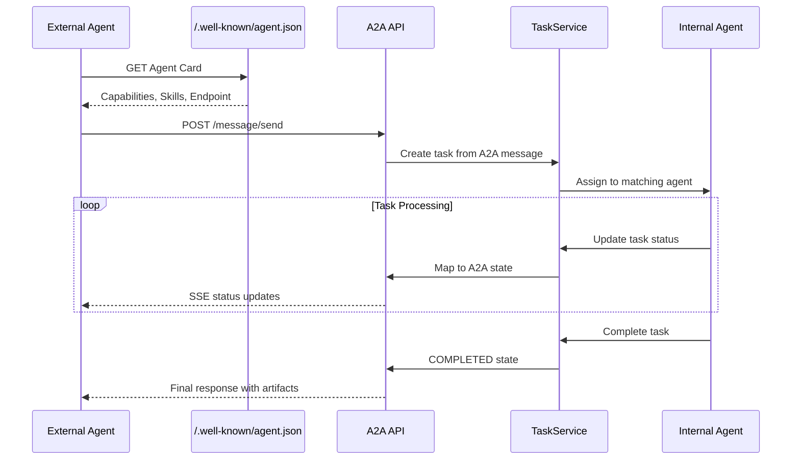

---

## 6. Services Dependency Graph

### Service Architecture

```mermaid
graph TB
    subgraph "Knowledge Layer"
        OS[OptimalService<br/>RAG Engine]
        VS[ValidatorService]
        MEN[MentorService]
        REV[ReviewerService]
        LP[LearningPropagation]
        PK[ProactiveKnowledge]

        OS --> VS & MEN & REV & LP & PK
    end

    subgraph "Plugin Architecture"
        CODE[Code Index]
        DOCS[Docs Index]
        CONV[Conversations]
        JOUR[Journals]
        ERR[Errors]
        STD[Standards]
        DEC[Decisions]
        REVS[Reviews]
        LEARN[Learnings]

        OS --> CODE & DOCS & CONV & JOUR & ERR & STD & DEC & REVS & LEARN
    end

    subgraph "Communication Layer"
        MS[MessagingService]
        NDS[NotificationDeliveryService]
        NS[NotificationService]
        A2A[A2AService]

        NS --> NDS
    end

    subgraph "Task Layer"
        TS[TaskService]
        KS[KanbanService]

        TS --> KS
    end

    subgraph "Agent Layer"
        JS[JournalService]

        JS --> OS
    end

    subgraph "Support Layer"
        PS[PermissionService]
        AS[AuditService]
        MET[MetricsService]
        DASH[DashboardService]
        HS[HealthService]

        DASH --> MET
    end

    subgraph "Enforcement Layer"
        TL[TaskLifecycle]
        TO[TaskOwnership]
        CA[ChannelAccess]
        JP[JournalPerms]
        NP[NotificationPerms]
    end

    TS --> TL & TO
    MS --> CA
    NS --> NP
    JS --> JP

    subgraph "Infrastructure"
        DB[(PostgreSQL)]
        RD[(Redis)]
        SE[SharedEmbedder]
    end

    TS & MS & NS & JS --> DB
    MS & NDS --> RD
    OS --> SE
```

### Service Initialization Order

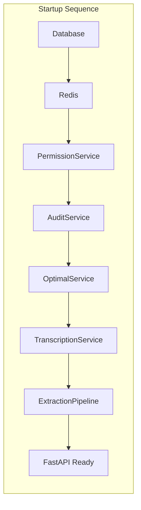

### Service Types

| Service | Type | Stateful | DB Required | Description |
|---------|------|----------|-------------|-------------|
| TaskService | Session-based | No | Yes | Task CRUD and lifecycle |
| MessagingService | Session-based | No | Yes | Channel, Group, Session, Message operations |
| NotificationService | Session-based | No | Yes | Notification creation |
| NotificationDeliveryService | Session-based | No | Yes | Multi-channel delivery |
| JournalService | Session-based | No | Yes | Agent journals |
| OptimalService | Singleton | Yes | Yes | RAG knowledge engine |
| PermissionService | Singleton | No | No | Access control |
| AuditService | Singleton | No | No | Audit logging |
| ValidatorService | Singleton | Yes | No | Standards validation |
| MentorService | Singleton | Yes | No | Conversational RAG |
| ReviewerService | Singleton | No | No | Code review |

---

## 7. Data Model Entity Relationships

### Core Entities

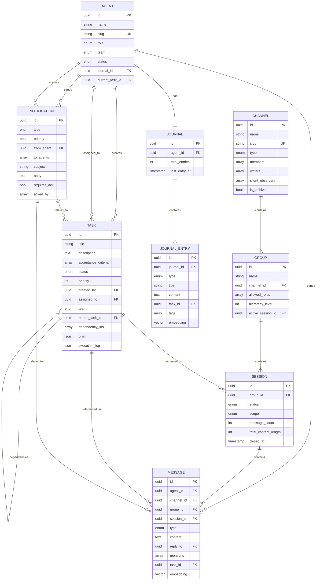

### Enums Summary

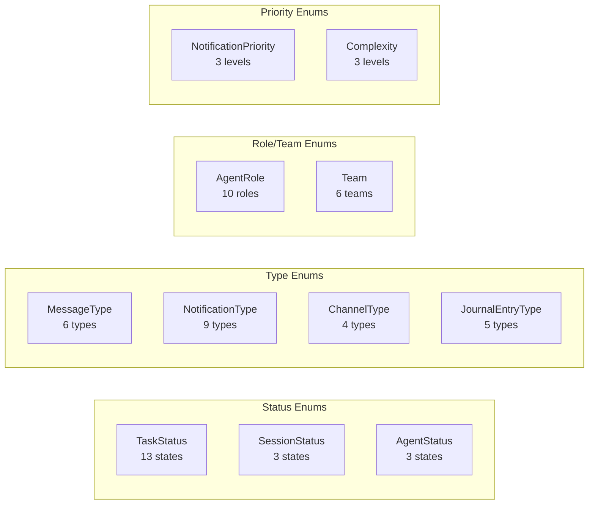

---

## 8. API Route Structure

### Endpoint Map

```mermaid
graph TD
    subgraph "Root"
        H[/health]
        R[/ready]
    end

    subgraph "/api/v1"
        AG[/agents]
        CH[/channels]
        GR[/groups]
        SE[/sessions]
        MS[/messages]
        NO[/notifications]
        ST[/stream]
        OP[/optimal]
        JO[/journals]
        TA[/tasks]
        KA[/kanban]
        DA[/dashboard]
        OR[/orchestrator]
        A2A[/a2a]
    end

    subgraph "Well-Known"
        WK[/.well-known/agent.json]
    end

    subgraph "WebSocket"
        WS[/ws]
    end
```

### Task Endpoints Detail

```mermaid
graph LR
    subgraph "/api/v1/tasks"
        CRUD[CRUD]
        LIFECYCLE[Lifecycle]
        QUERIES[Queries]
        ARTIFACTS[Artifacts]
    end

    subgraph "CRUD Operations"
        POST_T[POST /]
        GET_T[GET /]
        GET_ID[GET /{id}]
        PUT_T[PUT /{id}]
        DEL_T[DELETE /{id}]
    end

    subgraph "Lifecycle Operations"
        CLAIM[POST /{id}/claim]
        START[POST /{id}/start]
        BLOCK[POST /{id}/block]
        UNBLOCK[POST /{id}/unblock]
        PAUSE[POST /{id}/pause]
        RESUME[POST /{id}/resume]
        VERIFY[POST /{id}/verify]
        QA_SUB[POST /{id}/submit-qa]
        QA_PASS[POST /{id}/pass-qa]
        QA_FAIL[POST /{id}/fail-qa]
        DOCS[POST /{id}/docs-complete]
        PM_REV[POST /{id}/submit-pm-review]
        COMPLETE[POST /{id}/complete]
        CANCEL[POST /{id}/cancel]
    end

    subgraph "Query Operations"
        MY[GET /my]
        PENDING[GET /pending]
        BLOCKED_Q[GET /blocked]
        QA_Q[GET /awaiting-qa]
        DOCS_Q[GET /awaiting-docs]
        TEAM[GET /team/{team}]
        STATS[GET /stats]
    end

    CRUD --> POST_T & GET_T & GET_ID & PUT_T & DEL_T
    LIFECYCLE --> CLAIM & START & BLOCK & UNBLOCK & PAUSE & RESUME
    LIFECYCLE --> VERIFY & QA_SUB & QA_PASS & QA_FAIL
    LIFECYCLE --> DOCS & PM_REV & COMPLETE & CANCEL
    QUERIES --> MY & PENDING & BLOCKED_Q & QA_Q & DOCS_Q & TEAM & STATS
```

### API Response Codes

| Code | Meaning | Example |
|------|---------|---------|
| 200 | OK | GET operations, updates |
| 201 | Created | POST new resource |
| 204 | No Content | DELETE, non-returning POST |
| 400 | Bad Request | Validation error |
| 401 | Unauthorized | Missing/invalid auth |
| 403 | Forbidden | Permission denied |
| 404 | Not Found | Resource doesn't exist |
| 409 | Conflict | Invalid state transition |
| 500 | Server Error | Internal error |

---

## 9. Workflow Enforcement Diagram

### Enforcement Architecture

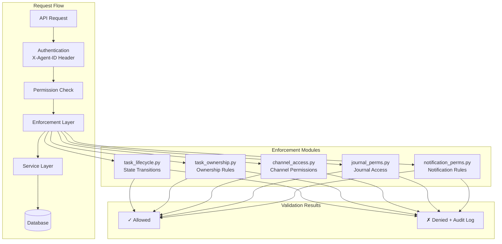

### Task State Enforcement

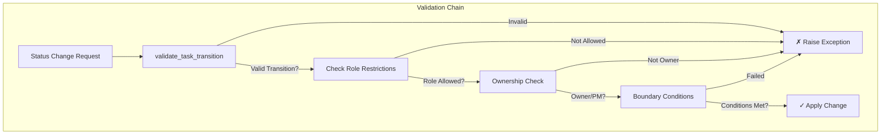

### Self-Review Prevention

```mermaid
sequenceDiagram
    participant DEV as Developer
    participant TS as TaskService
    participant DB as Database

    DEV->>TS: Complete work, submit for QA
    TS->>DB: Store original_developer in quick_context

    Note over DB: quick_context = "original_developer:{dev_uuid}"

    participant QA as QA Agent
    QA->>TS: Claim task for review
    TS->>DB: Fetch task.quick_context

    alt QA == original_developer
        TS-->>QA: ✗ TaskOwnershipError<br/>"Cannot review own work"
    else QA != original_developer
        TS->>DB: Assign to QA
        TS-->>QA: ✓ Task claimed
    end
```

### Claiming Rules Flowchart

```mermaid
flowchart TD
    START([Agent Claims Task]) --> CHECK_STATUS{Task Status<br/>Valid for Role?}

    CHECK_STATUS -->|Yes| CHECK_ACTIVE{Agent has<br/>Active Tasks?}
    CHECK_STATUS -->|No| FAIL1[✗ Invalid status<br/>for role]

    CHECK_ACTIVE -->|No| CHECK_PAUSED{Agent has<br/>Paused Tasks?}
    CHECK_ACTIVE -->|Yes| FAIL2[✗ Must complete<br/>or pause active tasks]

    CHECK_PAUSED -->|No| CHECK_TEAM{Same Team<br/>or Management?}
    CHECK_PAUSED -->|Yes| FAIL3[✗ Must resume<br/>paused tasks first]

    CHECK_TEAM -->|Yes| CHECK_SELF{Is Self-Review?<br/>QA/Doc checking own work}
    CHECK_TEAM -->|No| WARN[⚠ Warning:<br/>Cross-team claim]
    WARN --> CHECK_SELF

    CHECK_SELF -->|No| SUCCESS[✓ Task Claimed]
    CHECK_SELF -->|Yes| FAIL4[✗ Cannot review<br/>own work]

    style SUCCESS fill:#1dd1a1
    style FAIL1 fill:#ff6b6b
    style FAIL2 fill:#ff6b6b
    style FAIL3 fill:#ff6b6b
    style FAIL4 fill:#ff6b6b
    style WARN fill:#feca57
```

---

## Appendix: Quick Reference

### Agent IDs (Static UUIDs)

| Agent | UUID Pattern |
|-------|-------------|
| CEO | 00000000-0000-0000-0000-000000000000 |
| Backend Cell | 00000000-0000-0000-0001-00000000000X |
| Frontend Cell | 00000000-0000-0000-0002-00000000000X |
| UX/UI Cell | 00000000-0000-0000-0003-00000000000X |
| Board/Management | 00000000-0000-0000-0004-00000000000X |

### Common Status Transitions

| From | To | Required By |
|------|-----|-------------|
| PENDING | CLAIMED | Any agent (matching role) |
| CLAIMED | IN_PROGRESS | Assigned agent (requires plan) |
| IN_PROGRESS | VERIFYING | Assigned agent |
| VERIFYING | AWAITING_QA | Assigned agent |
| AWAITING_QA | AWAITING_DOCUMENTATION | QA only |
| AWAITING_DOCUMENTATION | AWAITING_PM_REVIEW | Documenter only |
| AWAITING_PM_REVIEW | COMPLETED | PM only |

### Key Configuration Files

| File | Purpose |
|------|---------|
| `roboco/agents_config.py` | Single source of truth for roles, teams, permissions |
| `roboco/config.py` | Environment-based settings |
| `roboco/enforcement/*.py` | Validation rules |
| `roboco/models/base.py` | Core enums and base models |

---

*This document was generated from deep exploration of the RoboCo codebase and represents the actual implementation as of December 29, 2025.*
