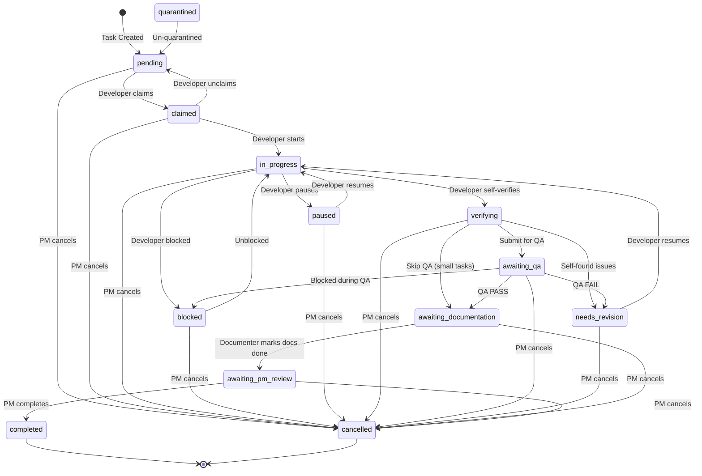
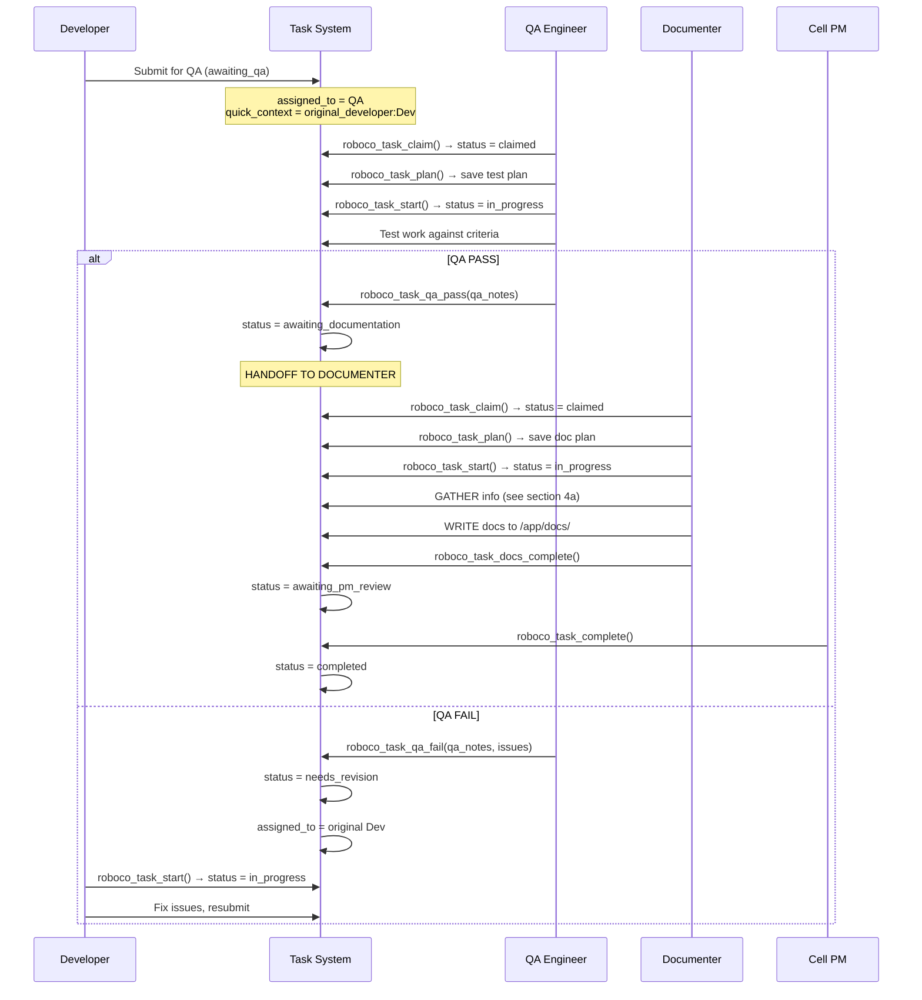
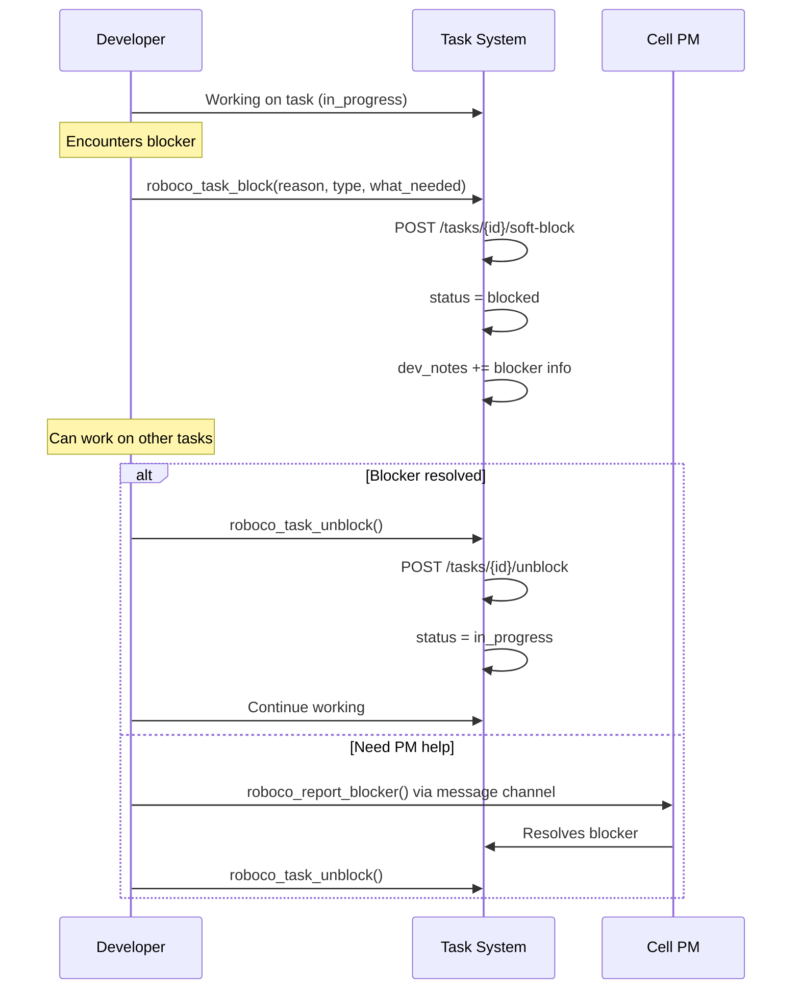

# RoboCo Workflows & Permissions

Visual documentation of task lifecycles, permissions, and workflows.

## 0. Terminology Dictionary

**CRITICAL: Understand these concepts before reading further.**

### Communication Hierarchy

```
Channel → Group → Session → Messages

┌─────────────────────────────────────────────────────────────────────────┐
│ CHANNEL (e.g., "backend-cell")                                          │
│   A named communication space for a team/topic                          │
│                                                                         │
│   ┌───────────────────────────────────────────────────────────────────┐ │
│   │ GROUP (e.g., "Sprint 5 Backend Work")                             │ │
│   │   A collection within a channel (project, sprint, topic)          │ │
│   │                                                                   │ │
│   │   ┌───────────────────────────────────────────────────────────┐   │ │
│   │   │ SESSION (e.g., "TASK-123 Discussion")                     │   │ │
│   │   │   A conversation thread, usually tied to a task           │   │ │
│   │   │                                                           │   │ │
│   │   │   ┌─────────────────────────────────────────────────┐     │   │ │
│   │   │   │ MESSAGES                                        │     │   │ │
│   │   │   │   Individual messages within a session          │     │   │ │
│   │   │   │   Types: action, dialogue, blocker, question    │     │   │ │
│   │   │   └─────────────────────────────────────────────────┘     │   │ │
│   │   └───────────────────────────────────────────────────────────┘   │ │
│   └───────────────────────────────────────────────────────────────────┘ │
└─────────────────────────────────────────────────────────────────────────┘

Tools:
- roboco_channel_list()        → List channels you can access
- roboco_channel_history()     → Get messages from a channel's sessions
- roboco_session_history_for_task() → Get messages for a specific task's session
- roboco_message_send()        → Send to channel (routes via task_id to session)
```

### Journal vs Documentation

```
┌─────────────────────────────────────┬─────────────────────────────────────┐
│           JOURNAL                   │         DOCUMENTATION               │
├─────────────────────────────────────┼─────────────────────────────────────┤
│ WHAT: Agent's personal reflections  │ WHAT: Project/codebase docs         │
│                                     │                                     │
│ WHERE: Database (journal entries)   │ WHERE: /app/docs/ files             │
│                                     │                                     │
│ WHO WRITES: Each agent, for self    │ WHO WRITES: Documenter agents       │
│                                     │                                     │
│ PURPOSE:                            │ PURPOSE:                            │
│ - Track decisions & rationale       │ - API documentation                 │
│ - Record learnings & struggles      │ - README updates                    │
│ - Reflect on task completion        │ - Changelog entries                 │
│ - Build context for future sessions │ - Component/feature docs            │
│                                     │                                     │
│ AUDIENCE: Self + cell members       │ AUDIENCE: All developers, users     │
│                                     │                                     │
│ TOOLS:                              │ TOOLS:                              │
│ - roboco_journal_entry()            │ - Write tool to /app/docs/          │
│ - roboco_journal_reflect()          │ - roboco_task_docs_complete()       │
│ - roboco_journal_decision()         │                                     │
│ - roboco_journal_learning()         │                                     │
│ - roboco_journal_read_team()        │                                     │
└─────────────────────────────────────┴─────────────────────────────────────┘

KEY DISTINCTION:
- Journal = "What I learned/decided while doing this task" (internal notes)
- Documentation = "How this feature works for others" (external docs)

Documenter reads journals to UNDERSTAND what was built, then writes documentation.
```

### Task Notes vs Journals

```
┌─────────────────────────────────────┬─────────────────────────────────────┐
│         TASK NOTES                  │          JOURNALS                   │
│         (dev_notes, qa_notes)       │                                     │
├─────────────────────────────────────┼─────────────────────────────────────┤
│ Attached to the task record         │ Separate entries linked by task_id  │
│                                     │                                     │
│ Brief handoff summaries             │ Detailed journey records            │
│                                     │                                     │
│ Set via:                            │ Set via:                            │
│ - roboco_task_submit_qa(notes)      │ - roboco_journal_*() tools          │
│ - roboco_task_qa_pass(notes)        │                                     │
│ - roboco_task_docs_complete(notes)  │                                     │
│                                     │                                     │
│ Examples:                           │ Examples:                           │
│ "Implemented X, tested Y"           │ "Decided to use pattern X because Y"│
│ "QA passed, verified all criteria"  │ "Struggled with Z, solved via W"    │
└─────────────────────────────────────┴─────────────────────────────────────┘
```

## 1. Task Lifecycle State Machine



## 2. Agent Hierarchy & Roles

```
                    +-------+
                    |  CEO  |
                    +-------+
                        |
        +---------------+---------------+
        |               |               |
   +---------+    +-----------+    +---------+
   | Product |    |   Head    |    | Auditor |
   | Owner   |    | Marketing |    | (silent)|
   +---------+    +-----------+    +---------+
        |               |               |
        +-------+-------+               |
                |                       |
           +---------+                  |
           | Main PM |<-----------------+
           +---------+      (observes all)
                |
    +-----------+-----------+
    |           |           |
+-------+   +-------+   +-------+
| BE PM |   | FE PM |   | UX PM |
+-------+   +-------+   +-------+
    |           |           |
+-------+   +-------+   +-------+
|Backend|   |Frontend|  | UX/UI |
| Cell  |   | Cell   |  | Cell  |
+-------+   +-------+   +-------+

Each Cell:
  - 2 Developers (BE/FE) or 1 Developer (UX)
  - 1 QA Engineer
  - 1 Documenter
  - 1 Cell PM
```

## 3. Notification Permissions

```
WHO CAN SEND NOTIFICATIONS:

+------------------+-------------+----------------------------------------------+
| Sender Role      | Can Send?   | Scope                                        |
+------------------+-------------+----------------------------------------------+
| CEO              | YES         | Anyone                                       |
| Auditor          | YES         | Anyone                                       |
| Main PM          | YES         | Anyone                                       |
| Product Owner    | YES         | main-pm, head-marketing, auditor, ceo        |
| Head Marketing   | YES         | main-pm, product-owner, auditor, ceo         |
| Cell PM          | YES         | Own cell only                                |
+------------------+-------------+----------------------------------------------+
| Developer        | NO          | -                                            |
| QA               | NO          | -                                            |
| Documenter       | NO          | -                                            |
+------------------+-------------+----------------------------------------------+

TOOLS VISIBILITY:

+----------------------+------------+----------+---------+---------+---------+
| Tool                 | Dev/QA/Doc | Cell PM  | Main PM | Board   | Aud/CEO |
+----------------------+------------+----------+---------+---------+---------+
| roboco_notify_list   | YES        | YES      | YES     | YES     | YES     |
| roboco_notify_get    | YES        | YES      | YES     | YES     | YES     |
| roboco_notify_ack    | YES        | YES      | YES     | YES     | YES     |
| roboco_notify_send   | HIDDEN     | YES      | YES     | YES     | YES     |
| roboco_escalate      | HIDDEN     | YES      | YES     | HIDDEN  | HIDDEN  |
| roboco_request_appr  | HIDDEN     | YES      | YES     | YES     | HIDDEN  |
+----------------------+------------+----------+---------+---------+---------+

Note: "Board" = Product Owner + Head Marketing. Auditor/CEO can send but not escalate or request approval.
```

## 4. QA Workflow (Full Detail)

### QA Status Acceptance

QA can call `qa_pass` or `qa_fail` from ANY of these statuses:
- `awaiting_qa` (initial)
- `claimed` (after QA claims)
- `in_progress` (after QA starts)

This allows QA to follow the full workflow: SCAN → CLAIM → PLAN → START → TEST → VERDICT

### QA Workflow Diagram



### 4a. Documenter Information Gathering

```
DOCUMENTER MUST GATHER FROM 3 SOURCES:

┌─────────────────────────────────────────────────────────────────────────────┐
│ SOURCE 1: TASK DETAILS (roboco_task_get)                                    │
│ ─────────────────────────────────────────                                   │
│ • description, acceptance_criteria                                          │
│ • dev_notes (developer's handoff summary)                                   │
│ • qa_notes (QA's verification notes)                                        │
│ • quick_context (original developer, etc.)                                  │
├─────────────────────────────────────────────────────────────────────────────┤
│ SOURCE 2: TEAM JOURNALS (roboco_journal_read_team)                          │
│ ─────────────────────────────────────────────────                           │
│ Read developer's journey:                                                   │
│   roboco_journal_read_team("be-dev-1", task_id=task_id, limit=20)           │
│                                                                             │
│ What to look for:                                                           │
│ • Decisions made and WHY                                                    │
│ • Struggles encountered and how solved                                      │
│ • Learnings documented                                                      │
│ • Design/architecture choices                                               │
├─────────────────────────────────────────────────────────────────────────────┤
│ SOURCE 3: SESSION MESSAGES (roboco_session_history_for_task)                │
│ ────────────────────────────────────────────────────────────                │
│ Read discussion context:                                                    │
│   roboco_session_history_for_task(task_id)                                  │
│                                                                             │
│ What to look for:                                                           │
│ • Questions asked and answers given                                         │
│ • Clarifications from PM/dev                                                │
│ • Blockers discussed and resolutions                                        │
│ • Design decisions made in discussion                                       │
└─────────────────────────────────────────────────────────────────────────────┘

NOTE: Journals are INPUT for understanding. Documentation is OUTPUT to /app/docs/.
```

## 5. Block/Unblock Workflow



## 6. Task Role Restrictions

```
ROLE-BASED TRANSITIONS:

+-------------------------------+-------------------------------------------+
| Transition                    | Allowed Roles                             |
+-------------------------------+-------------------------------------------+
| awaiting_qa → awaiting_doc    | QA only                                   |
| awaiting_qa → needs_rev       | QA only                                   |
| awaiting_doc → awaiting_pm    | Documenter only                           |
| awaiting_pm → completed       | Cell PM, Main PM, Product Owner, Head Mkt |
| * → cancelled                 | Cell PM, Main PM, Product Owner, Head Mkt |
+-------------------------------+-------------------------------------------+

Note: CEO and Auditor are NOT in the cancel/complete roles list - they observe but don't directly act on tasks.

VALID START STATUSES (for roboco_task_start):

+------------------+------------------------------------------+
| Status           | Who Can Start                            |
+------------------+------------------------------------------+
| claimed          | Assigned agent (requires plan)           |
| paused           | Assigned agent (resume)                  |
| needs_revision   | Original developer (fix QA issues)       |
+------------------+------------------------------------------+

QA VERDICT ACCEPTANCE (qa_pass/qa_fail):

+------------------+------------------------------------------+
| Status           | Reason                                   |
+------------------+------------------------------------------+
| awaiting_qa      | Task submitted for QA review             |
| claimed          | QA claimed the task                      |
| in_progress      | QA started working (plan + start)        |
+------------------+------------------------------------------+

All three statuses are valid because QA follows the full workflow:
awaiting_qa → claim → plan → start → test → verdict

DOCUMENTER COMPLETION ACCEPTANCE (docs_complete):

+----------------------+------------------------------------------+
| Status               | Reason                                   |
+----------------------+------------------------------------------+
| awaiting_documentation | Task ready for documentation           |
| claimed              | Documenter claimed the task              |
| in_progress          | Documenter started (plan + start)        |
+----------------------+------------------------------------------+

All three statuses are valid because Documenter follows the full workflow:
awaiting_documentation → claim → plan → start → gather → write → docs_complete
```

## 7. Escalation Chain

```
Developer/QA/Doc → Cell PM → Main PM → Product Owner → CEO

+------------+     +---------+     +---------+     +---------------+     +-----+
| be-dev-1   |---->|         |     |         |     |               |     |     |
| be-dev-2   |---->|  be-pm  |---->|         |     |               |     |     |
| be-qa      |---->|         |     |         |     |               |     |     |
| be-doc     |---->|         |     |         |     |               |     |     |
+------------+     +---------+     |         |     |               |     |     |
                                   | main-pm |---->| product-owner |---->| CEO |
+------------+     +---------+     |         |     |               |     |     |
| fe-dev-1   |---->|         |     |         |     |               |     |     |
| fe-dev-2   |---->|  fe-pm  |---->|         |     |               |     |     |
| fe-qa      |---->|         |     |         |     |               |     |     |
| fe-doc     |---->|         |     |         |     |               |     |     |
+------------+     +---------+     +---------+     +---------------+     +-----+
```

## 8. Communication vs Notification

```
+-------------------+----------------------------------+----------------------------------+
| Mechanism         | Who Can Use                      | Purpose                          |
+-------------------+----------------------------------+----------------------------------+
| Messages          | Everyone                         | Constant stream, logged          |
| (roboco_message)  |                                  | discussions, updates             |
+-------------------+----------------------------------+----------------------------------+
| Blocker Reports   | Everyone                         | Signal blocked status            |
| (roboco_report_   |                                  | PM auto-notified                 |
| blocker)          |                                  |                                  |
+-------------------+----------------------------------+----------------------------------+
| Notifications     | PM, Board, Auditor, CEO          | Formal signals requiring         |
| (roboco_notify)   |                                  | acknowledgment                   |
+-------------------+----------------------------------+----------------------------------+
| Escalations       | PMs only                         | High-priority issues             |
| (roboco_escalate) |                                  | up the chain                     |
+-------------------+----------------------------------+----------------------------------+
```
