# RoboCo — The Complete Map (2026-06-29)

> Scope: full codebase, baseline `fd10cc862`..HEAD. The CEO suspects recent changes may have broken the system. This is the exhaustive record + drift/regression audit, built from 31 per-slice maps. Branch: `feature/metrics-granularity` (work merged into `master` via PRs #283 and #285), **NOT deployed**.
>
> Verified range figures: `git log --oneline fd10cc862c2020b3f639cdb686d427b0198a2441..HEAD` returns **2 commits** on `master` (`15effce0` "Chore: 141 Gaps fill-in (#283)" and `3aff6e04` "Chore: Close gaps (#285)"), but the bundled diff is enormous — **577 files changed, +36,653/-4,214 lines** (verified via `git diff --stat`). The two PRs squash months of per-fix work (F0xx audit gaps, F123 worktrees, sequencing, pr_fail loop-closers, model rename, etc.) into two merge commits, so the effective change surface is far larger than the commit count implies. Earlier per-fix commits (e202ce39, 250be5c2, a957e4fa, 82541077, cf7603f3, e52fd05d, 919aa7e2, 12621a36, 9927d248, c03e76c4, 2f322286, c34e978f, 3a4a3fe5, 53d60da3) are ancestors of `15effce0` and are the substance of the gap-fill.

## Table of Contents

**Chapters (this front matter):**
- System at a Glance
- Data Model ERD
- Task Lifecycle State Machine
- Cross-Cutting Flows
- What's Wrong — Drift & Regression Risks
- Verified Regression Risks *(appended by a later step)*
- Appendix: Git Log fd10cc862..HEAD

**Per-slice sections (concatenated after this front matter, in this order):**

1. foundation-lifecycle
2. foundation-batch-sequencing
3. foundation-policy-misc
4. foundation-conventions-identity
5. models
6. db-migrations
7. task-service
8. worksession-git
9. workspace
10. choreographer
11. pr-gate-review
12. gateway-support
13. orchestrator
14. runtime-providers
15. engines-heal-ciwatch-depupdate
16. release-manager
17. org-memory-playbooks
18. messaging-notification
19. a2a-audit-journal-permissions
20. conventions-service-validator
21. intake-secretary
22. product-strategy-research-pitch
23. metrics-observability
24. support-services
25. mcp-servers
26. api-core-websocket
27. api-routes-schemas
28. panel
29. deployment-tooling
30. tests
31. prompts-roles-taxonomy

---

## System at a Glance

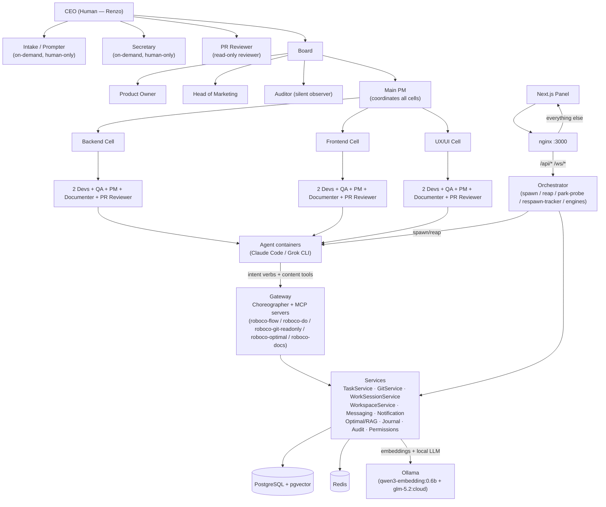

```mermaid
flowchart TD
  RT["RoboCo"]
  RT --> LC["Lifecycle"]
  LC --> LC1["15 statuses"]
  LC --> LC2["about 30 intent verbs"]
  LC --> LC3["22 atomic actions"]
  LC --> LC4["spec gates and import validators"]
  RT --> GW["Gateway"]
  GW --> GW1["Choreographer"]
  GW --> GW2["VerbRunner SAVEPOINT"]
  GW --> GW3["MCP servers flow do git optimal docs"]
  GW --> GW4["role manifests"]
  RT --> OR["Orchestrator"]
  OR --> OR1["spawn and reap"]
  OR --> OR2["park-and-probe"]
  OR --> OR3["respawn-tracker durable"]
  OR --> OR4["gateway-health recovery"]
  RT --> SV["Services"]
  SV --> SV1["TaskService"]
  SV --> SV2["GitService"]
  SV --> SV3["WorkSessionService"]
  SV --> SV4["WorkspaceService"]
  SV --> SV5["Messaging"]
  SV --> SV6["Notification"]
  SV --> SV7["Optimal RAG"]
  SV --> SV8["Journal Audit Permissions"]
  RT --> EN["Engines"]
  EN --> EN1["self_heal"]
  EN --> EN2["ci_watch"]
  EN --> EN3["dep_update"]
  EN --> EN4["release_manager"]
  RT --> OM["OrgMemory"]
  OM --> OM1["distill learnings"]
  OM --> OM2["briefings injection"]
  OM --> OM3["playbooks"]
  RT --> CO["Comms"]
  CO --> CO1["channels"]
  CO --> CO2["A2A"]
  CO --> CO3["notifications dedup"]
  RT --> PA["Panel"]
  PA --> PA1["Next.js 16"]
  PA --> PA2["nginx"]
  PA --> PA3["WebSocket streams"]
  RT --> MG["Migrations"]
  MG --> MG1["001 to 052"]
  MG --> MG2["pgvector"]
  RT --> PR["Prompts"]
  PR --> PR1["roles"]
  PR --> PR2["taxonomy"]
  PR --> PR3["guard"]
```

---

## Data Model ERD

Synthesized from `models` + `db-migrations` (37 ORM tables in `roboco/db/tables.py`, migrations 001→052). Key fields shown on `Task`; relationships traced through the migration chain (single-active work_session via 047, batch/collision cols via 046, cell-project map via 052, respawn counter via 051, playbooks via 050, conventions cache via 043, observability `revision_count` + audit index via 045).

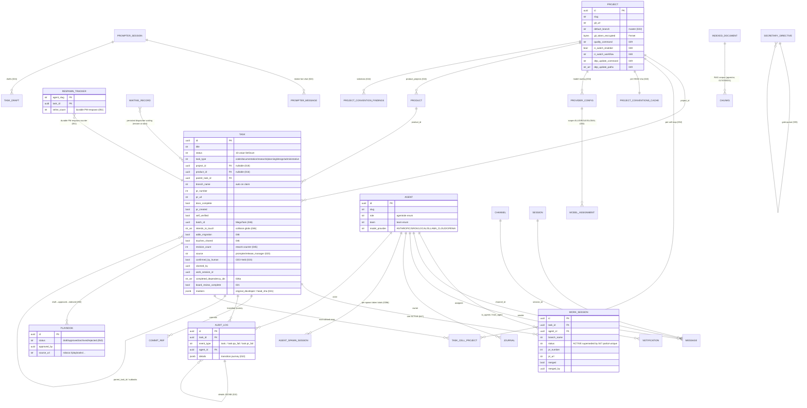

---

## Task Lifecycle State Machine

Synthesized from `foundation-lifecycle` (`_STATUS_TRANSITIONS` / `STATUS_GRAPH`). Role labels mark the allowed actor for each edge; the in-path PR-review gate (`awaiting_pr_review`) sits between PM `submit_up`/`submit_root` and `awaiting_pm_review`.

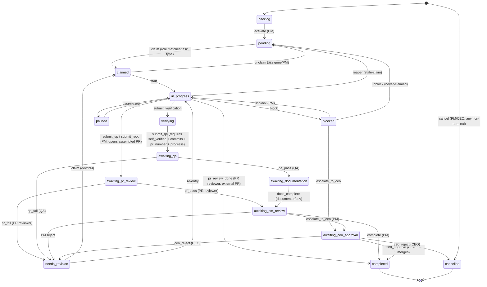

---

## Cross-Cutting Flows

### (a) Agent → MCP → Choreographer → Service → Envelope

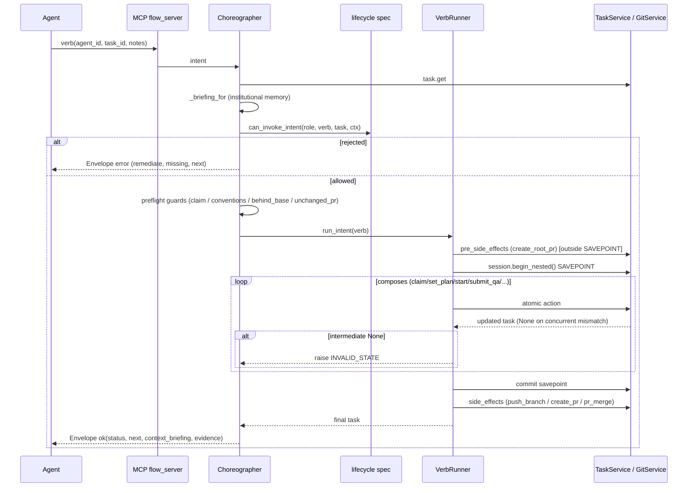

### (b) Orchestrator dispatch / reap / park-probe / respawn durability

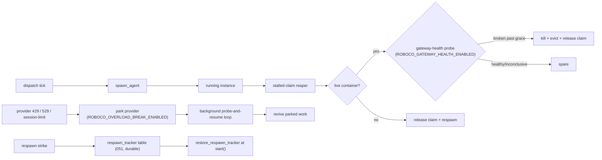

### (c) MegaTask sequencing

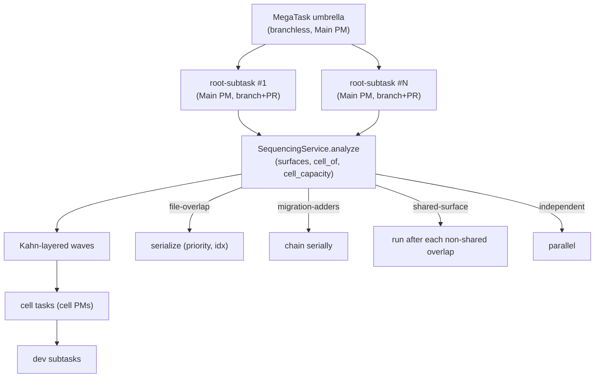

### (d) In-path PR-review gate

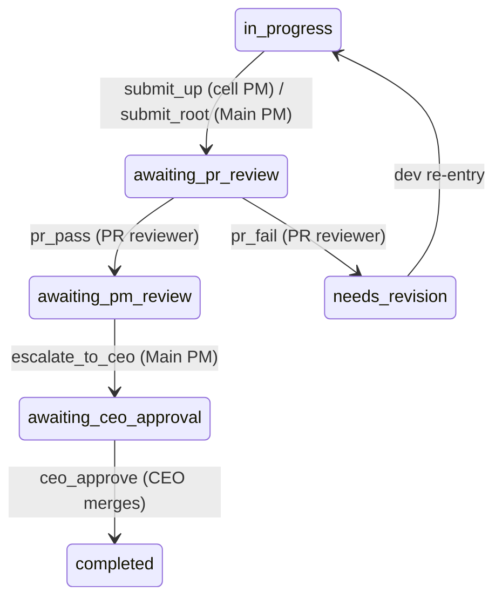

### (e) Default-off engines — each originates one task into the normal delivery flow (+ PR-review gate), never auto-merges, bounded by caps, held for CEO where applicable

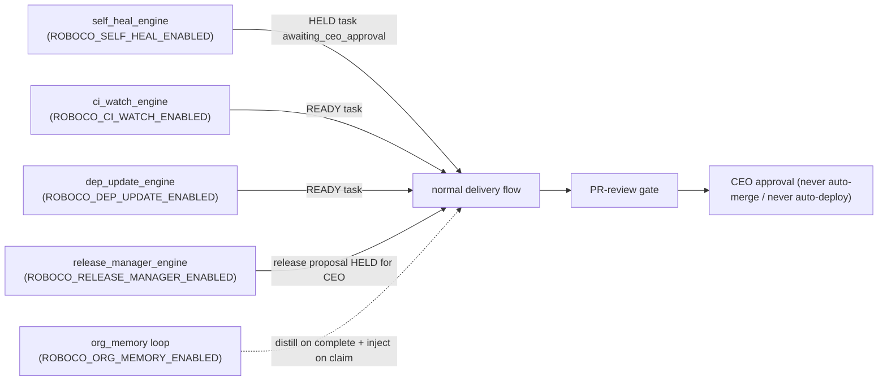

---

## What's Wrong — Drift & Regression Risks

**Method.** Thirty-one per-slice maps were produced from the `fd10cc862..HEAD` tree. Each slice's `## Regression Risks` and `## Drift from CLAUDE.md` sections were extracted with `grep` (480 + 781 lines of raw evidence), then deduplicated and ranked across slices. The table below consolidates the top ~25 risks, critical/high first; the full per-slice risk tables follow in each slice section. A separate "Verified Regression Risks" chapter (appended by a later step) will adversarially verify the top 12 against the live code.

### Top Regression Risks (consolidated across 31 slices)

| # | Risk | Slice | File:Line | Claim | Severity |
|---|------|-------|-----------|-------|----------|
| 1 | `ceo_approve` skips work-session close | task-service | `roboco/services/task.py:5146` | `ceo_approve` calls `_remove_task_worktree_on_terminal` but NOT `_close_work_session_for_task` (only `complete()` does). CEO-approved root tasks leave the WorkSession row not marked closed → reporting/session-resolution drift. | High |
| 2 | `fail_qa` route depends on unreliable `original_developer` marker | task-service | `roboco/services/task.py:4228` | Fast path reads the marker; if absent falls to `_resolve_revision_dev`. If both miss (no dev work session, e.g. parent-only edit) task is unassigned to pool → a PM may grab a dev task (the original 2026-06-27 loop). | High |
| 3 | `do`/`a2a` any-role token gate | api-routes-schemas | `roboco/api/routes/v1/do.py:43`, `a2a.py:114` | `require_any_authenticated_agent` only verifies HMAC + agent exists; does NOT assert role matches the verb's role family. A QA-signed token could call `do/commit`; a dev could call `a2a` admin paths. Service-layer scope is the sole guard → a missed service check = privilege escape. | High |
| 4 | 422 response echoes secrets | api-routes-schemas / api-core-websocket | `roboco/api/middleware.py:407` (resp body), `:434` | `_scrub_secrets` redacts only the **log** body; the JSON response still contains `body` with the caller's original `git_token`/`api_key`. A 422 returns the secret to the client (and any MITM/log of the response). | High |
| 5 | `pr_merge` project_id scoping assumes non-None | choreographer | `roboco/services/gateway/choreographer/_verb_runner.py:263` | `project_id=task.project_id` — if a coordination/umbrella task reaches `pr_merge` with `project_id=None`, the cross-repo collision guard silently matches nothing or None-keys the scoping; could merge the wrong PR or no-op. | High |
| 6 | `_submit_*_unchanged_pr_guard` fails open on resolver regression | choreographer | `roboco/services/gateway/choreographer/_impl.py:6175,6240` | Any future break in `_current_pr_head_sha` / `_project_slug_for` / `git.get_pr_head_sha` makes the pr_fail loop-stopper a no-op, re-opening the 2026-06-27 pr_fail re-submit loop silently. | High |
| 7 | Intermediate-None trailing-None contract | choreographer | `_verb_runner.py:89` + `_impl.py:1277,6358` | A verb that forgets the trailing-None guard None-derefs `t.status`; any NEW verb using `run_intent` with a possibly-None last action inherits the trap. | High |
| 8 | `has_cell_projects` threaded incorrectly breaks branchless exemption | foundation-batch-sequencing | `roboco/foundation/policy/batch.py:66` | `is_branchless_coordination` now requires callers to pass `has_cell_projects`. A call site that omits it (defaults False) for a cell-map root will NOT recognize it as branchless and will demand a branch/PR the root cannot supply — wedging that root in the git gate. Any new call site is a landmine. | High |
| 9 | Kanban admin-override drag skips lifecycle | panel | `panel/src/components/kanban/core/kanban-board.tsx:160` | A confirmed override routes through `useUpdateTask` (admin status-override), bypassing the in-band validator. `skippedPreconditions` is precision-over-recall — a careless confirm can complete a task with no PR / QA-bypass / docs-incomplete. | High |
| 10 | `create_all` schema drift — NOT NULL ORM-mapped columns break all DB tests | tests | `tests/conftest.py:182` | Schema built via `Base.metadata.create_all`, not alembic. A post-052 migration adding a NOT NULL ORM-mapped column without `server_default` breaks every `db_session` test. Conftest only backfills migration-006 cols. | High |
| 11 | Cycle-time SQL depends on audit-log event naming | metrics-observability | `roboco/services/metrics.py:554` | A future named audit event whose `to_status` resolves under `event_type='task.'\|\|to_status` could inject zero-length stages or skew dwell averages across every cycle-time/bottleneck panel. | High |
| 12 | Rework cost join on `agent_spawn_sessions.task_id` | metrics-observability | `roboco/services/metrics.py:742` | If spawn sessions stop populating `task_id` (orchestrator regression), rework cost silently drops to $0 — underreported CEO spend. | High |
| 13 | Release Redis mutex TTL shorter than worst-case execute | release-manager | `roboco/services/release_proposal.py:39` | `_RELEASE_LOCK_TTL_SECONDS=3000` (50min) but execute can run clone+gate+CI+publish ≈ 85min. TTL expires mid-execute → a second approve acquires and `rm -rf`s the in-flight clone, corrupting the release. | High |
| 14 | Stream-bus handler failure leaves message pending → duplicate side effects | support-services | `roboco/events/stream_bus.py:338` | ACK only when all handlers succeed; `recover_pending` re-runs idle≥60s messages. Non-idempotent notification handlers can double-fire after a crash/restart. | High |
| 15 | `resolve_for_agent` silently downgrades to Anthropic | support-services | `roboco/services/llm.py:124,193,205` | Decrypt failure / unreachable LOCAL / missing assignment all return the legacy Anthropic route instead of raising — a misconfigured Grok/Ollama fleet spawns against Anthropic with only a log warning. | High |
| 16 | LLM model rename breaks cached ollama deployments | deployment-tooling | `docker-compose.yaml:86` | `ollama-init` verify now greps for `glm-5.2` exactly. A NAS volume with only the old `glm-5:cloud` cached (no network) hits FATAL exit and blocks boot until the new model is pulled. | High |
| 17 | Gateway-health over-reap of live containers | orchestrator | `roboco/runtime/orchestrator.py:8689` | `_maybe_recover_broken_gateway` kills a live container past `gateway_health_grace_seconds`; a flaky false-broken probe streak could kill a healthy agent mid-long-edit. | Medium-High |
| 18 | Readopt liveness false-positive | orchestrator | `roboco/runtime/orchestrator.py:8547` | `_readopt_running_agents` registers ACTIVE for any running `roboco-agent-{slug}` container at startup, including a zombie from a prior orchestrator that already released the claim — blocks re-spawn until the stale container is noticed. | Medium |
| 19 | Stalled-claim reaper live-skip blind spot | orchestrator | `roboco/runtime/orchestrator.py:8750` | `_should_skip_live_reap` spares any live container that is neither grok-wedged nor gateway-broken; a Claude agent alive but stuck in a non-verb loop keeps its claim forever. | Medium |
| 20 | DB purpose-dedup gated to ack-required types only; `_persist_and_deliver` skips it entirely | messaging-notification | `roboco/services/notification.py:521`, `notification_delivery.py:875` | Task-handoff notifications (blocker/escalation/ceo-rejection) are not DB-deduped past the 60s Redis window — a retried `i_am_blocked`/`escalate` beyond 60s re-creates an unacked duplicate (the inbox-inflation + i_am_idle soft-block the DB dedup was added to prevent). | Medium |
| 21 | `acknowledge` publishes `NOTIFICATION_ACKED` directly, not via the transactional outbox | messaging-notification | `roboco/services/notification_delivery.py:451` | Same phantom-event class F107 fixed for `deliver`, left unfixed for the ACK path — a rollback after a successful ACK publish emits a phantom ACK. | Medium |
| 22 | A2A legacy notification suppressed by new loop-prone re-fire guard | a2a-audit-journal-permissions | `roboco/services/a2a.py:640` | Since `3aff6e04`, `send_a2a_notification` runs the 60s Redis guard for loop-prone types before creating the notification. A legitimate A2A peer notification re-sent within 60s (real state change, not a respawn loop) can be silently dropped. | Medium |
| 23 | `sync_branch` has no source-status gate — callable on terminal/paused/blocked tasks | foundation-lifecycle | `roboco/foundation/policy/lifecycle.py:1085` | `sync_branch` composes=() and is not in the special-case list, so `can_invoke_intent` only checks role + OWNERSHIP. A dev who owns a COMPLETED/CANCELLED task passes the spec gate; the rebase runs against a finished task's branch. | Medium |
| 24 | `_curate_playbook` explicit `session.commit` before index | gateway-support | `roboco/services/gateway/content_actions.py:847` | If the caller's session is in `PendingRollbackError` (prior mid-verb failure poisoned it), this commit raises and the whole curation verb 500s instead of a clean envelope. | Medium |
| 25 | Coverage omit list hides orchestrator/git/workspace regressions from the 80% gate | tests | `pyproject.toml:259` | `[tool.coverage.run].omit` excludes `orchestrator.py`, `git.py`, `workspace.py`, `mcp/*`, `agents/*`. A regression in the respawn-tracker upsert, pr_merge cross-repo scoping, or worktree routing will NOT fail `make quality`'s `--cov-fail-under=80`. | Medium |

> Additional notable Medium risks not deduplicated into the table above (see per-slice sections): `archive_playbook` behavior change (gateway-support); notify to prompter/secretary now refused (gateway-support); blocked task now blocks new claims (gateway-support); `apply_escalation` bypasses validator (task-service); branchless `ceo_reject` uses `admin_set_status` (task-service); `revision_count` bump is in audit helper only (task-service); `cancel` cascade swallows role violations (task-service); `_merge_with_retry` 405 → `MergeConflictError` (worksession-git); `close_pull_request` deletes branch on close by default (worksession-git); F123 worktree merge-sync runs in clone root not worktree (worksession-git); 1-cell map silently drops `product_id` (intake-secretary); malformed `project_id` in multi-cell map silently collapses shape (intake-secretary); collision-surface declaration is prompt-only not gate-enforced (prompts-roles-taxonomy); `submit_root` branch-keyed-vs-task_type-keyed prompt assertion (prompts-roles-taxonomy); `resolve_task_project_slug` cell_projects branch `AttributeError` (pr-gate-review); breaker substitution masks fixable rejection (mcp-servers); 404 synthesis assumes every route returns 200 (mcp-servers); intake composer SSE stuck (panel); panel token on live-chat bridges (panel); `/ws/system` ungated while siblings require panel token (api-core-websocket); cross-repo PR collision via `/api/work-sessions/{id}/pr/merge` (api-routes-schemas); orchestrator CEO gate vs release CEO gate divergence (api-routes-schemas); Grok directory mount widens RO exposure (runtime-providers); 6h `expires_at` default can burn the single-use refresh_token (runtime-providers); worktree `.venv` symlink self-heal depends on a later ensure (workspace); `ensure_worktree` reuses existing branch ref without validating base (workspace); `commit_and_push` RuntimeError unhandled by execute (release-manager); Redis outage fully blocks release approval (release-manager); `TranscriptionService` sync callbacks stall flush (support-services); `get_ready_buffers` unbounded growth (support-services); pitch partial-failure orphans GitHub repos (product-strategy-research-pitch); self-heal CEO notification spam (engines); ci_watch multi-workflow monorepo under-count (engines).

### Drift from CLAUDE.md (consolidated)

| Slice | Drift |
|-------|-------|
| foundation-lifecycle | `BLOCKED -> AWAITING_CEO_APPROVAL` via `escalate_to_ceo` is in the spec but missing from the doc's Role-Based Transitions table. Per-role verb table omits `i_am_idle` (stated only in prose). Doc undersells the enforcement shim (it owns `GitContext`/`validate_git_requirements`/SLA tables, not a pure view). |
| foundation-batch-sequencing | Doc omits the undeclared-surface same-assignee lane fallback (`a957e4fa`), the cell-map branchless shape, `is_valid_batch_shape`, `main_pm_cannot_own_code`, and edge kinds 2–4. |
| foundation-policy-misc | Doc does not mention `VERB_RETRY_LIMITS` / per-verb circuit breaker / `pm_respawn_max_tracing_resets`. Agent learnings role-exclusion lives in `notification_delivery`, not `journaling.py`. |
| foundation-conventions-identity | None material (additive `role_for_slug_or_none` helper). |
| models | `Role`/`Team` are aliases to `foundation.identity` (base.py:21–24), not defined in `base.py` — CLAUDE.md's "Role/Team in agent.py+base.py" is slightly stale. `Task` carries `cell_projects`/`batch_id`/`intends_to_touch`/`adds_migration`/`touches_shared` (task.py:171,217–228) that the "Data Models" prose omits (but the MegaTask section covers). No `AuditEvent` class (it's `AuditEventType`) and no `A2AEnvelope` in models (gateway `Envelope` lives in `services/gateway/`). |
| db-migrations | Doc says "52 migrations 001..052" — correct, but does not mention the two chained 026 files. No factual drift. |
| task-service | None material. |
| worksession-git | Doc undersell: commit header format and gateway merge-path description are documentation-undersell, not behavioral mismatch. |
| workspace | Doc's "fresh claim `git reset --hard`" narrative diverges from the post-F123 worktree model (by design) — doc drift to reconcile. |
| choreographer | Verb table omits `sync_branch` from the developer list (added since baseline). Otherwise matches. |
| pr-gate-review | None material. |
| gateway-support | Auditor surface doc under-states `notify_list`/`notify_get` + `channels` (additive, consistent with footnote). PM coordinator-skip lives in Choreographer not `claim_guards.py`. |
| orchestrator | None material (well-instrumented). |
| runtime-providers | `ClaudeCodeProvider` is dead reference code; its "default" label in CLAUDE.md is misleading. |
| engines-heal-ciwatch-depupdate | Minor framing: engines consume telemetry via `MultiProjectCITelemetrySource`, not `GitService` directly. Engine does not enforce `awaiting_ceo_approval` itself. |
| release-manager | None material. |
| org-memory-playbooks | None material. |
| messaging-notification | None material. |
| a2a-audit-journal-permissions | Doc lists `PermissionsService` (plural); actual class is `PermissionService` (singular). Legacy A2A-protocol path (`create_a2a_notification` / `TASK_ASSIGNED` re-spawn) undocumented. `AuditService.has_recent_tracing_gap` undocumented. |
| conventions-service-validator | None material (all doc claims match code). |
| intake-secretary | None material. |
| product-strategy-research-pitch | None material (slice unchanged). |
| metrics-observability | None material (slice unchanged). |
| support-services | None material (slice unchanged). |
| mcp-servers | Doc's server table is stale: lists 3 servers + omits many tools; intake/secretary/search are agent-facing MCP servers not listed. |
| api-core-websocket | No direct CLAUDE.md contradiction; the stale security docstring lives in `websocket.py` itself (describes old query-param model vs actual HMAC). |
| api-routes-schemas | None material; `post_pr_review` is additive, not contradictory. |
| panel | None material. |
| deployment-tooling | Doc omits panel/nginx from the compose services table; reverses panel/orchestrator build order in prose; `roboco-bootstrap = roboco.bootstrap:cli` console script points at a non-existent symbol; **Configuration section still documents `ROBOCO_LOCAL_LLM_MODEL=glm-5:cloud` while code now defaults to `glm-5.2:cloud`**; documented image set incomplete (grok-prompter/secretary/pr-reviewer images unlisted). |
| tests | None material. |
| prompts-roles-taxonomy | Stale agent count in `base.md` (22 vs CLAUDE.md's 25). |

### Assessment

The baseline→HEAD diff is unusual: only two commits appear on `master`'s first-parent line (`15effce0` and `3aff6e04`), but they bundle a **+36,653/-4,214 line, 577-file** change that squashes months of per-fix work — F0xx audit gaps, F123 per-task worktrees, sequencing S1/S2/S3, the pr_fail loop-closer, the model rename, the enum-gate fix, and the bash-guard `/app` venv protection. Read against the 2026-06-28 logic-gap audit (140 confirmed gaps, all resolved), the picture is not "the system is broken"; it is "a hardened system that absorbed a massive consolidation pass and, in doing so, opened several new seams."

**What clearly hardened.** The cross-repo PR-number collision that crashed `cell_pm_complete` is fixed with `project_id` scoping. The pr_fail re-submit loop is closed at three layers (head-sha capture, `submit_root`/`submit_up` unchanged-PR guards, a2a to owning PM). The single-active work-session defect is enforced both at the service layer and by migration 047's partial-unique index. The PM-respawn counter is now DB-durable (051) with an upsert race fix. The 60s Redis loop-prone re-fire guard and `VERB_RETRY_LIMITS` circuit breaker tame the notification/respawn storms. F123 per-task worktrees eliminated the coordinator-PM clone clobber and routed commit/conventions/rebase into the worktree. Sequencing S1/S2/S3 + the per-dev lane barrier (`82541077`) close the out-of-order-start wedge. The WS fan-out no longer back-pressures on a slow client, 422 logs no longer leak credentials, and the WS + HTTP panel-token gates close the operator-only invariant.

**What is genuinely new and wrong.** Five gaps appear that did not exist (or were not load-bearing) at the baseline. (1) `ceo_approve` is asymmetric with `complete()`: it removes the worktree but skips work-session close and the full completion hooks, so CEO-approved root tasks leave unclosed sessions and never get code-changes/decision RAG indexing — a reporting and corpus drift. (2) `fail_qa` routing still depends on the unreliable `original_developer` marker with a work-session fallback that has no guarantee a dev session exists; the 2026-06-27 dev-loop it was meant to close can still recur on a parent-only edit. (3) The `do`/`a2a` any-role token gate means the HMAC check never asserts the role matches the verb's role family — privilege escape is one missed service-scope check away. (4) The 422 response body still echoes `git_token`/`api_key` back to the client (`_scrub_secrets` only scrubs the log) — a real secret-leak surface. (5) Gateway-health recovery, while closing a real blind spot, can over-reap a live healthy container on a flaky false-broken probe streak — killing an agent mid-long-edit. None of these are crash bugs on the happy path; all are correctness/privilege/integrity drift that the happy path never exercises.

**Standing landmines the diff did not touch but the diff's blast radius now amplifies.** The enum-parity gate can false-green on an empty/mismatched `roboco` DB; `sa.Enum(create_type=False)` in 001 is a latent no-op on clean re-apply; missing pgvector aborts `init_db`; `has_cell_projects` is a sharp footgun for any new `is_branchless_coordination` call site; the release Redis mutex TTL (50min) is shorter than worst-case execute (~85min), re-opening the `rm -rf`-clone race it was added to prevent; the coverage omit list excludes the very modules that changed most (orchestrator/git/workspace), so a green `make quality` does not mean those hot paths are covered. The single-commit bundling of nearly every panel logic fix means a partial revert can drop several independent fixes at once.

**Verdict.** The system is **not at its prime, but it is not broken either — it is hardened-but-drifting.** The 159-commit-equivalent gap-fill closed more real race conditions and cross-repo collisions than any prior wave, and the core delivery flow (claim → plan → start → submit → QA → PR-gate → PM/CEO review → complete) is structurally sound and well-instrumented. But the consolidation pass introduced a small set of new integrity seams — the `ceo_approve` completion asymmetry, the `fail_qa` routing fragility, the any-role token gate, the 422 secret echo, and the gateway-health over-reap — that are worth fixing before the next deploy, and the standing landmines (enum-parity, pgvector, mutex TTL, coverage omissions) are worth arming against. The CEO's suspicion that recent changes "may have broken the system" is, on the evidence, **partially warranted at the edges and not warranted at the core**: no meltdown-class regression is present, but five correctness/privilege gaps and several standing landmines mean a deploy without addressing them carries real (if non-fatal) risk.

---

## Verified Regression Risks

The 12 highest-severity risks surfaced in the "What's Wrong" chapter above were each adversarially re-checked against the actual code by an independent skeptic agent (default-to-refuted, cite `file:line`). **7 of 12 held up as real (severity often corrected downward); 5 were refuted.** No meltdown-class regression survived verification. The single load-bearing finding is the **release-manager mutex TTL race** (`release_proposal.py:39`) — the only confirmed HIGH; the rest are low/medium integrity drift or deliberate escape hatches. Net: the "hardened-but-drifting" verdict is upheld — fix the release mutex before the next deploy that arms `ROBOCO_RELEASE_MANAGER_ENABLED`; the other six confirmed items are worth-and-cheap hygiene fixes, not blockers.

### Executive summary

Of the 12 risks the synthesis flagged, verification confirmed **7** as real defects and **refuted 5** as either defence-in-depth-by-design, dead code, robust-by-construction, or not-exercised-in-current-tree. The confirmed set contains **one HIGH** (release mutex TTL race with a real `rm -rf`-shared-clone corruption vector), **two MEDIUM** (kanban admin-override lifecycle bypass; `resolve_for_agent` silent Anthropic downgrade), and **four LOW** (ceo_approve work-session asymmetry; fail_qa marker fragility; 422 body echo; unchanged-PR guard silent fail-open). The most important correction: the synthesis over-rated several — the `do`/`a2a` "privilege escape", `pr_merge project_id=None` "wrong-PR merge", `has_cell_projects` "branchless wedge", `create_all` "schema drift", and cycle-time "audit-naming skew" are all **refuted** by the code. The CEO's suspicion is best directed at the release mutex and the four low-cost hygiene items, not at a presumed core meltdown.

### Confirmed risks

| # | Risk | Slice | File:Line | Verdict | Corrected Severity | Evidence | Fix Hint |
|---|------|-------|-----------|---------|--------------------|----------|----------|
| 1 | Release Redis mutex TTL shorter than worst-case execute | release-manager | `release_proposal.py:39`; `release_executor.py:132-142` | confirmed | **HIGH** | TTL=3000s (50min), sized only against the 40min CI ceiling; lock acquired at `:75` before clone, held across clone(~600s)+gate(1800s)+CI(2400s)+publish(300s)≈5400s with **no heartbeat/refresh** anywhere in `:90-99`; a second approve after TTL expiry re-enters `_prepare_release_clone` which `rm -rf`s the shared `_release/<slug>` clone the first execute is still using | Add a lock heartbeat (`EXPIRE` between steps, inside the CI poll loop) — the correct fix; stopgap: raise TTL to ~7200s and cite the full step sum. Defense-in-depth: clone outside the lock + per-execute subdir + fencing token |
| 2 | Kanban admin-override bypasses the in-band lifecycle validator | panel / api-routes | `kanban-board.tsx:158-191`; `tasks.py:918-923`; `task.py:2098-2106` | confirmed | MEDIUM | Override confirm → `useUpdateTask` → `PATCH /tasks/{id}` → `admin_set_status`, which by docstring "bypasses the strict transition validator" and only writes an audit row; no PR / QA / docs / subterm-terminal re-check. Mitigations: ASSIGN-permission-gated, visible confirmation dialog, audited — deliberate escape hatch, not silent | Keep the hatch but add a server-side `force`/`acknowledge_bypass` flag for COMPLETED/AWAITING_QA/AWAITING_PM_REVIEW targets whose preconditions the server can verify, so a single careless click can't complete unreviewed work |
| 3 | `resolve_for_agent` silently downgrades to Anthropic | support-services | `llm.py:124-138, 170-216` | confirmed | MEDIUM | Decrypt failure / unreachable LOCAL / missing assignment all `return self._legacy_route(...)` (Anthropic) instead of raising; a disabled non-Anthropic provider falls through at `:134` with **no log at all**. Documented as intentional ("a stalled spawn is worse than a routing miss") — real risk is silent Anthropic spend / wrong-provider routing on a misconfigured Grok/Ollama fleet with no panel signal | Add opt-in `ROBOCO_ROUTING_STRICT` (raise instead of fall back) + emit a structured `routing_downgrade` event/metric; at minimum log a warning on the disabled-provider fallthrough at `:134` |
| 4 | `ceo_approve` asymmetric with `complete()` — skips work-session close | task-service | `task.py:5200-5202` vs `:4934` | confirmed | LOW | `complete()` calls `_close_work_session_for_task` then `_remove_task_worktree_on_terminal`; `ceo_approve()` calls only the worktree removal — CEO-approved root tasks leave the WorkSession row not marked closed (PR is already merged, so reporting-only) | Add `await self._close_work_session_for_task(task, reason="ceo approved")` before the worktree removal at `:5202`; no-op when `work_session_id` is None (coordination roots unaffected) |
| 5 | `fail_qa` routing depends on unreliable `original_developer` marker | task-service | `task.py:4228-4272` | confirmed | LOW | Marker read at `:4228`; on miss falls back to `_resolve_revision_dev` (work-session walk, `:4301-4334`); both miss → unassign to pool (`:4266-4272`). In-code comment cites the 2026-06-27 loop and acknowledges the marker is unreliable. Work-session fallback is now load-bearing and closes the common case; pool-unassign is a narrow edge (both marker AND all sessions missing) | Promote `original_developer` to a real DB column set at `submit_for_qa` (migration); defense-in-depth: refuse the transition with an error rather than pool-unassign when both miss |
| 6 | 422 response body echoes the caller's `git_token`/`api_key` | api-core-websocket | `middleware.py:423-441` | confirmed | LOW | `:426` computes `body_for_log = _scrub_secrets(body)` for the **log**; `:434` builds the response `content={"detail": errors, "body": body}` from the **raw** body, not `body_for_log`. Docstring at `:420-421` documents this as deliberate. Caller's own value echoed back to the caller — hygiene (proxy/APM/devtools logging), not third-party exfiltration | Change `:434` to use `body_for_log` in the response content; add a regression test asserting a 422 on a body with `git_token` returns `***REDACTED***` |
| 7 | Unchanged-PR guard fails open (silent on resolver regression) | choreographer | `_impl.py:6175-6177, 6196-6222` | confirmed (mechanism) | LOW | `:6176` `if current is None or current != recorded: return None` (proceed = fail-open); `_current_pr_head_sha` returns None on no-PR/no-slug/non-str-sha AND a bare `except Exception: return None` at `:6221` with **no log**. Fail-open is intentional and triply-documented (would wedge the PM if fail-closed); the only real defect is the silent swallow | Do NOT invert to fail-closed. Add `logger.warning(..., exc_info=exc)` at the `:6221` swallow point (and in `git.get_pr_head_sha`'s None branches) so a resolver regression is observable |

### Refuted risks (checked and cleared)

| # | Risk | Slice | File:Line | Verdict | Why refuted |
|---|------|-------|-----------|---------|-------------|
| 8 | `do`/`a2a` any-role token gate = privilege escape | api-routes | `do.py:43`; `_role_dep.py:64-96` | **refuted** | The gate IS token-only (true, and documented as intentional), but every role-sensitive `do` verb has an explicit service-layer role frozenset in `content_actions.py` (`commit` :474-488, `notify` :1186, `pitch` :965, `draft_playbook` :729, `approve/reject/archive_playbook` :800, `open_session` :1516, `say`/`dm` :1037/1096, `pr_update` :1779). The claimed exploit (QA token → `do/commit`) is directly rejected. Role-uniform verbs (note/evidence/progress/notify-ack/…) have no privilege boundary to escape. Defence-in-depth by design |
| 9 | `pr_merge project_id=None` merges wrong PR / no-ops | choreographer | `_verb_runner.py:263` | **refuted** | `_do_pr_merge` is **dead code**: the `complete` IntentSpec declares `pr_merge` in side_effects, but the choreographer's `complete` handler (`_impl.py:6599`) bypasses the VerbRunner and dispatches directly. Even if reached, `git.pr_merge` with `project_id=None` matches only IS-NULL rows then `_project_for_task` returns None → `NotFoundError` (fail-closed). Umbrellas are also rejected by `_cell_pm_complete_guard` (`pr_number is None`) and routed to `main_pm_complete` which never merges (CEO merges root→master) |
| 10 | `has_cell_projects` default breaks branchless exemption | foundation-batch-sequencing | `batch.py:66` | **refuted** | All three production call sites pass `has_cell_projects` explicitly: `orchestrator.py:409-415`, `task.py:597-602` (GitContext), `task.py:5453-5458` (CEO-reject). No caller relies on the `False` default. The cell-map root exemption fires correctly everywhere. Optional hardening: make the param mandatory (no default) |
| 11 | `create_all` schema drift breaks every db_session test | tests | `conftest.py:182` | **refuted** | `conftest` does use `create_all` (true) with only a migration-006 backfill, but the asserted trigger — "a post-052 migration adding a NOT NULL ORM-mapped column without server_default" — **does not exist**: `052_task_cell_projects` is the alembic head and it creates a new standalone table, not a NOT NULL column on an existing mapped table. The standing create_all-drift hazard is genuine and self-documented in the conftest comment, but no current migration exercises it |
| 12 | Cycle-time SQL skews on a future named audit event | metrics-observability | `metrics.py:543-572` | **refuted** | The filter is structural, not name-list-based: a row is kept iff `event_type = 'task.' || to_status`. Named events (`task.qa_fail`/`task.pr_fail`) carry a name distinct from their `to_status` (`needs_revision`), so they are excluded **by construction**. The two conditions the claim requires — "named" AND "passes the filter" — are mutually exclusive under the emission convention enforced by the single chokepoint `_audit_events_for`. Robust-by-construction |

### The single most important finding

**`roboco/services/release_proposal.py:39` — release mutex TTL race.** `_RELEASE_LOCK_TTL_SECONDS = 3000` (50min) is sized only against the 40min CI poll ceiling, but the lock is acquired before the clone and held across the full execute (clone + gate + commit/push + CI wait + publish, ≈90min worst case) with no heartbeat. On TTL expiry mid-execute, a second CEO approve (likely, since a proxy 504 on the long-running approve prompts a retry) re-acquires the lock and `_prepare_release_clone` `rm -rf`s the shared `_release/<slug>` clone the first execute is still actively using — corrupting an in-flight release. Real, high-severity, low-frequency. Fix: add a lock heartbeat between steps (and inside the CI poll loop); stopgap: raise the TTL to ~7200s citing the full step sum. This is the one item to fix before arming `ROBOCO_RELEASE_MANAGER_ENABLED` on the NAS.

---

## Appendix: Git Log fd10cc862..HEAD

`git -C /Users/renzof/Documents/GitHub/ZZZ/roboco-master/roboco log --oneline fd10cc862c2020b3f639cdb686d427b0198a2441..HEAD`:

```
3aff6e04 Chore: Close gaps (#285)
15effce0 Chore: 141 Gaps fill-in (#283)
```

Two commits on `master`'s first-parent line, bundling a **577-file, +36,653/-4,214** diff (`git diff --stat fd10cc862..HEAD`). The substance of the gap-fill is the per-fix commits squashed into `15effce0` (ancestors: `e202ce39`, `250be5c2`, `a957e4fa`, `82541077`, `cf7603f3`, `e52fd05d`, `919aa7e2`, `12621a36`, `9927d248`, `c03e76c4`, `2f322286`, `c34e978f`, `3a4a3fe5`, `53d60da3`, and the F123/F-fix wave). The `feature/metrics-granularity` branch is **NOT deployed**.

---

# foundation-lifecycle slice

## Purpose
The canonical source of truth for RoboCo's task state machine, per-role action/verb permissions, claim rules, team-match rules, and self-review prevention. The spec module is pure data + lookups (no DB, no I/O); the enforcement package re-exports a backwards-compat view of the same tables plus the git-workflow gates, SLA keys, channel/A2A/journal/ownership access control. Import-time validators in _validate_lifecycle.py make a misconfigured spec fail fast at container start.

## Files

| Path | Role | LOC |
|---|---|---|
| /Users/renzof/Documents/GitHub/ZZZ/roboco-master/roboco/roboco/foundation/policy/lifecycle.py | Canonical lifecycle/permissions spec: Status, TaskType, Decision, Precondition, ActionSpec, IntentSpec, StatusTransition tables + can_invoke_action/intent lookups + CLAIM_RULES/ROLE_TEAM_RULES + PR_OPEN_STATES + UNMIGRATED debt set; import-time self-validates. | 1630 |
| /Users/renzof/Documents/GitHub/ZZZ/roboco-master/roboco/roboco/foundation/_validate_lifecycle.py | Import-time validators (BFS reachability, terminal exits, intent composition chains, claim-rule coverage, self_review symmetry, slug/team agreement, UNMIGRATED subset); LifecycleSpecError aborts container start on a bad spec. | 298 |
| /Users/renzof/Documents/GitHub/ZZZ/roboco-master/roboco/roboco/enforcement/task_lifecycle.py | Backwards-compat shim over the spec: derives VALID_TRANSITIONS / ROLE_RESTRICTED_TRANSITIONS (merging _LEGACY_OPERATIONAL_EDGES + _LEGACY_ROLE_GATES), predicate helpers, SLA keys, GitContext + validate_git_requirements (doc-phase / CEO-escalation / claim-branch gates). | 441 |
| /Users/renzof/Documents/GitHub/ZZZ/roboco-master/roboco/roboco/enforcement/__init__.py | Package re-export aggregator: exposes task_lifecycle, channel_access, a2a_access, journal_perms, task_ownership public symbols under one namespace. | 87 |
| /Users/renzof/Documents/GitHub/ZZZ/roboco-master/roboco/roboco/enforcement/a2a_access.py | Agent-to-agent direct-message permission gate (delegates to roboco.agents_config.can_a2a_direct); A2AAccessDeniedError. | 91 |
| /Users/renzof/Documents/GitHub/ZZZ/roboco-master/roboco/roboco/enforcement/channel_access.py | Channel read/write/silent-observer access gate over CHANNEL_ACCESS table; ChannelAccessDeniedError. | 109 |
| /Users/renzof/Documents/GitHub/ZZZ/roboco-master/roboco/roboco/enforcement/journal_perms.py | Journal read permissions derived from foundation.policy.journaling ReadTier (ALL/ALL_CELLS/CELL_AND_PMS/CELL/OWN) + PROTECTED_JOURNALS; JournalAccessDeniedError. | 197 |
| /Users/renzof/Documents/GitHub/ZZZ/roboco-master/roboco/roboco/enforcement/task_ownership.py | Task ownership + reassign + view + self-review guard (can_review_task); TaskOwnershipError. | 118 |

## Key Symbols

| Name | Kind | File:Line | Responsibility |
|---|---|---|---|
| Status | StrEnum | /Users/renzof/Documents/GitHub/ZZZ/roboco-master/roboco/roboco/foundation/policy/lifecycle.py:40 | 15 task lifecycle statuses (backlog..cancelled) — the state machine alphabet. |
| TaskType | StrEnum | /Users/renzof/Documents/GitHub/ZZZ/roboco-master/roboco/roboco/foundation/policy/lifecycle.py:58 | 6 task types used by ActionSpec.allowed_task_types gating. |
| RejectionKind | Literal | /Users/renzof/Documents/GitHub/ZZZ/roboco-master/roboco/roboco/foundation/policy/lifecycle.py:67 | The 5 rejection flavors (not_authorized/invalid_state/tracing_gap/self_review/not_found) carried in Decision. |
| Decision | dataclass | /Users/renzof/Documents/GitHub/ZZZ/roboco-master/roboco/roboco/foundation/policy/lifecycle.py:76 | Frozen allow/reject result every consumer maps onto its envelope; invariants enforced in __post_init__; constructors allow()/reject()/tracing_gap(). |
| Precondition | dataclass | /Users/renzof/Documents/GitHub/ZZZ/roboco-master/roboco/roboco/foundation/policy/lifecycle.py:145 | Declarative gate-table row: a (task,agent,ctx)->bool predicate + remediate hint + missing_token + rejection_kind. |
| ActionSpec | dataclass | /Users/renzof/Documents/GitHub/ZZZ/roboco-master/roboco/roboco/foundation/policy/lifecycle.py:167 | Atomic action spec (allowed_roles, source_statuses, target_status, allowed_task_types, preconditions, self_review_block, needs_team_match). |
| IntentSpec | dataclass | /Users/renzof/Documents/GitHub/ZZZ/roboco-master/roboco/roboco/foundation/policy/lifecycle.py:187 | Gateway verb spec: composes tuple of action names, extra_preconditions, pre_side_effects/side_effects, next_hint callback. |
| StatusTransition | dataclass | /Users/renzof/Documents/GitHub/ZZZ/roboco-master/roboco/roboco/foundation/policy/lifecycle.py:212 | Row from STATUS_TRANSITIONS canon: source/target/triggering_by_action/role_constraint. |
| _STATUS_TRANSITIONS | tuple | /Users/renzof/Documents/GitHub/ZZZ/roboco-master/roboco/roboco/foundation/policy/lifecycle.py:231 | The canonical state-machine edge table (claim/start/block/qa/pr/complete/cancel/escalate/ceo edges incl. BLOCKED->PENDING and BLOCKED->AWAITING_CEO_APPROVAL). |
| _build_status_graph | function | /Users/renzof/Documents/GitHub/ZZZ/roboco-master/roboco/roboco/foundation/policy/lifecycle.py:374 | Derives source->frozenset(targets) view from _STATUS_TRANSITIONS. |
| STATUS_GRAPH | dict | /Users/renzof/Documents/GitHub/ZZZ/roboco-master/roboco/roboco/foundation/policy/lifecycle.py:382 | Derived state graph consumed by validators + enforcement shim. |
| _ATOMIC_ACTIONS | dict | /Users/renzof/Documents/GitHub/ZZZ/roboco-master/roboco/roboco/foundation/policy/lifecycle.py:395 | All 22 ActionSpecs (activate, claim, start, set_plan, block, unblock, pause, resume, submit_verification, submit_qa, qa_pass, qa_fail, pr_review_done, docs_complete, submit_for_review, pr_pass, pr_fail, complete, submit_pm_review, escalate_to_ceo, ceo_approve, ceo_reject, cancel, create_subtask). |
| CLAIM_RULES | dict | /Users/renzof/Documents/GitHub/ZZZ/roboco-master/roboco/roboco/foundation/policy/lifecycle.py:671 | Per-role claimable status sets; narrows the union claim ActionSpec.source_statuses. |
| ROLE_TEAM_RULES | dict | /Users/renzof/Documents/GitHub/ZZZ/roboco-master/roboco/roboco/foundation/policy/lifecycle.py:702 | Per-slug team binding (None=cross-cell/board) for needs_team_match enforcement. |
| _next_hint_pr_fail | function | /Users/renzof/Documents/GitHub/ZZZ/roboco-master/roboco/roboco/foundation/policy/lifecycle.py:789 | pr_fail next hint: steers Main-PM branch-bearing root to re-delegate (loop-breaker) vs dev-revise for cell/dev tasks. |
| Context | dataclass | /Users/renzof/Documents/GitHub/ZZZ/roboco-master/roboco/roboco/foundation/policy/lifecycle.py:849 | Caller-supplied per-request state (actor_id, plan, journal flags, original_developer_slug, notes, issues, files) fed to Precondition.check. |
| _p_non_terminal | function | /Users/renzof/Documents/GitHub/ZZZ/roboco-master/roboco/roboco/foundation/policy/lifecycle.py:894 | Precondition predicate: task not in COMPLETED/CANCELLED (F043 terminal-resurrection guard). |
| PRECONDITION_NON_TERMINAL | Precondition | /Users/renzof/Documents/GitHub/ZZZ/roboco-master/roboco/roboco/foundation/policy/lifecycle.py:942 | invalid_state precondition attached to escalate_up. |
| PR_OPEN_STATES | frozenset | /Users/renzof/Documents/GitHub/ZZZ/roboco-master/roboco/roboco/foundation/policy/lifecycle.py:963 | Lifecycle-owned canon of states a PR may be opened from (in_progress/verifying/awaiting_qa/awaiting_documentation/needs_revision); GitService derives its str set from this (F101). |
| PRECONDITION_PR_OPEN_STATE | Precondition | /Users/renzof/Documents/GitHub/ZZZ/roboco-master/roboco/roboco/foundation/policy/lifecycle.py:981 | invalid_state precondition attached to open_pr (parity with HTTP path). |
| _INTENT_VERBS | dict | /Users/renzof/Documents/GitHub/ZZZ/roboco-master/roboco/roboco/foundation/policy/lifecycle.py:994 | All ~30 gateway IntentSpecs (give_me_work, i_will_work_on, i_will_plan, delegate, open_pr, i_am_done, sync_branch, i_am_blocked, unclaim, reassign, resume, i_am_idle, claim_review, pass_review, fail_review, claim_pr_review, post_pr_review, claim_gate_review, pr_pass, pr_fail, claim_doc_task, i_documented, complete, escalate_up, escalate_to_ceo, submit_up, submit_root, unblock, triage, triage_all). |
| can_claim | function | /Users/renzof/Documents/GitHub/ZZZ/roboco-master/roboco/roboco/foundation/policy/lifecycle.py:1410 | Backward-compat wrapper around can_invoke_action('claim', ...). |
| _check_role_status_type | function | /Users/renzof/Documents/GitHub/ZZZ/roboco-master/roboco/roboco/foundation/policy/lifecycle.py:1427 | Role + source-status + task_type gate for an ActionSpec; returns rejection or None. |
| _check_self_review_and_preconditions | function | /Users/renzof/Documents/GitHub/ZZZ/roboco-master/roboco/roboco/foundation/policy/lifecycle.py:1469 | self_review_block check (original_developer_slug==actor_slug) + declarative precondition evaluation. |
| _check_claim_rules_narrow | function | /Users/renzof/Documents/GitHub/ZZZ/roboco-master/roboco/roboco/foundation/policy/lifecycle.py:1501 | Per-role CLAIM_RULES narrowing for the claim action; disambiguates not_authorized vs invalid_state. |
| can_invoke_action | function | /Users/renzof/Documents/GitHub/ZZZ/roboco-master/roboco/roboco/foundation/policy/lifecycle.py:1542 | Order-gated atomic action Decision: action exists -> role -> source status -> task_type -> self_review -> preconditions -> claim rules. |
| _check_intent_preconditions | function | /Users/renzof/Documents/GitHub/ZZZ/roboco-master/roboco/roboco/foundation/policy/lifecycle.py:1572 | Verb-level extra_preconditions gate; honors non-tracing rejection_kind (not_authorized/invalid_state) per F043 generalization. |
| can_invoke_intent | function | /Users/renzof/Documents/GitHub/ZZZ/roboco-master/roboco/roboco/foundation/policy/lifecycle.py:1604 | Verb Decision: role gate -> extra_preconditions -> FIRST composed action's can_invoke_action (or CLAIM_RULES narrowing for the claim_review/claim_doc_task/claim_gate_review special cases). |
| valid_next_verbs | function | /Users/renzof/Documents/GitHub/ZZZ/roboco-master/roboco/roboco/foundation/policy/lifecycle.py:1652 | Sorted list of verbs a role can state-applicably call on a task (preconditions evaluated lazily); used by envelope introspection. |
| composed_actions_for | function | /Users/renzof/Documents/GitHub/ZZZ/roboco-master/roboco/roboco/foundation/policy/lifecycle.py:1679 | Return the composes tuple for a verb (KeyError on unknown). |
| intents_for_role | function | /Users/renzof/Documents/GitHub/ZZZ/roboco-master/roboco/roboco/foundation/policy/lifecycle.py:1686 | Sorted tuple of verbs declared for a role; drives role_config.py MCP manifest build. |
| status_after | function | /Users/renzof/Documents/GitHub/ZZZ/roboco-master/roboco/roboco/foundation/policy/lifecycle.py:1696 | Post-action status or None (no transition / wrong source). |
| UNMIGRATED | frozenset | /Users/renzof/Documents/GitHub/ZZZ/roboco-master/roboco/roboco/foundation/policy/lifecycle.py:1710 | Known-debt set: legacy operational edges + role gates not yet absorbed into the spec (Phase 3 terminal invariant target = empty). |
| run_all_lifecycle_validators | function | /Users/renzof/Documents/GitHub/ZZZ/roboco-master/roboco/roboco/foundation/_validate_lifecycle.py:291 | Runs all 13 import-time validators; first failure raises LifecycleSpecError. |
| reachable_from | function | /Users/renzof/Documents/GitHub/ZZZ/roboco-master/roboco/roboco/foundation/_validate_lifecycle.py:40 | BFS over STATUS_GRAPH from a start status. |
| _check_status_reachability | function | /Users/renzof/Documents/GitHub/ZZZ/roboco-master/roboco/roboco/foundation/_validate_lifecycle.py:67 | Every non-BACKLOG status reachable from PENDING. |
| _check_terminal_exits | function | /Users/renzof/Documents/GitHub/ZZZ/roboco-master/roboco/roboco/foundation/_validate_lifecycle.py:81 | Every non-terminal status has a path to COMPLETED or CANCELLED. |
| _check_intent_chains | function | /Users/renzof/Documents/GitHub/ZZZ/roboco-master/roboco/roboco/foundation/_validate_lifecycle.py:113 | Adjacent composes actions chain (prev.target_status in next.source_statuses). |
| _check_self_review_symmetry | function | /Users/renzof/Documents/GitHub/ZZZ/roboco-master/roboco/roboco/foundation/_validate_lifecycle.py:162 | qa_pass/qa_fail/docs_complete/pr_pass/pr_fail agree on self_review_block. |
| _check_action_target_reachable_from_source | function | /Users/renzof/Documents/GitHub/ZZZ/roboco-master/roboco/roboco/foundation/_validate_lifecycle.py:203 | ActionSpec transitions present in STATUS_GRAPH[source]. |
| _check_unmigrated_is_subset | function | /Users/renzof/Documents/GitHub/ZZZ/roboco-master/roboco/roboco/foundation/_validate_lifecycle.py:256 | UNMIGRATED stays a subset of _KNOWN_UNMIGRATED_CONSUMERS. |
| validate_task_transition | function | /Users/renzof/Documents/GitHub/ZZZ/roboco-master/roboco/roboco/enforcement/task_lifecycle.py:187 | Legacy raising validator over VALID_TRANSITIONS + ROLE_RESTRICTED_TRANSITIONS (role gate only for transition-level pins). |
| can_agent_transition | function | /Users/renzof/Documents/GitHub/ZZZ/roboco-master/roboco/roboco/enforcement/task_lifecycle.py:225 | Non-raising variant of validate_task_transition. |
| is_terminal_state/is_waiting_state/is_active_state | function | /Users/renzof/Documents/GitHub/ZZZ/roboco-master/roboco/roboco/enforcement/task_lifecycle.py:242 | Hard-coded status-category predicates (NOT derived from the graph — drift risk). |
| ROLE_STATE_SLA_KEYS | dict | /Users/renzof/Documents/GitHub/ZZZ/roboco-master/roboco/roboco/enforcement/task_lifecycle.py:276 | (role,status)->settings-key map for stuck-task SLA sweep. |
| sla_seconds_for | function | /Users/renzof/Documents/GitHub/ZZZ/roboco-master/roboco/roboco/enforcement/task_lifecycle.py:285 | Resolve configured SLA seconds for (role,status) from settings. |
| GitContext | dataclass | /Users/renzof/Documents/GitHub/ZZZ/roboco-master/roboco/roboco/enforcement/task_lifecycle.py:316 | Git-state carrier (docs_complete/pr_created/pr_number/branch_name + is_coordination/is_external_review/is_umbrella exemption flags). |
| validate_git_requirements | function | /Users/renzof/Documents/GitHub/ZZZ/roboco-master/roboco/roboco/enforcement/task_lifecycle.py:342 | Doc-phase / CEO-escalation / claim-branch git gates; None short-circuits. |
| _LEGACY_OPERATIONAL_EDGES | dict | /Users/renzof/Documents/GitHub/ZZZ/roboco-master/roboco/roboco/enforcement/task_lifecycle.py:72 | Transitions the runtime exercises that the spec hasn't absorbed (unclaim/reaper/PM-self-complete/QA-direct/verifying-self-fail/PM-claim/revision-reentry). |
| _LEGACY_ROLE_GATES | dict | /Users/renzof/Documents/GitHub/ZZZ/roboco-master/roboco/roboco/enforcement/task_lifecycle.py:99 | Role pins for the legacy edges; UNION-merged with spec-derived ROLE_RESTRICTED_TRANSITIONS (overwrite once dropped pr_reviewer). |
| _build_role_restricted_transitions | function | /Users/renzof/Documents/GitHub/ZZZ/roboco-master/roboco/roboco/enforcement/task_lifecycle.py:156 | Merges spec role_constraint pins with _LEGACY_ROLE_GATES via union (not overwrite). |
| validate_a2a_access | function | /Users/renzof/Documents/GitHub/ZZZ/roboco-master/roboco/roboco/enforcement/a2a_access.py:38 | A2A direct-message gate (delegates to agents_config.can_a2a_direct). |
| validate_channel_access | function | /Users/renzof/Documents/GitHub/ZZZ/roboco-master/roboco/roboco/enforcement/channel_access.py:36 | Channel read/write access gate with wildcard + silent-observer read. |
| can_read_journal | function | /Users/renzof/Documents/GitHub/ZZZ/roboco-master/roboco/roboco/enforcement/journal_perms.py:121 | Journal read decision by ReadTier + protected-journal + same-cell/owner-is-pm rules. |
| validate_task_ownership | function | /Users/renzof/Documents/GitHub/ZZZ/roboco-master/roboco/roboco/enforcement/task_ownership.py:35 | Ownership/reassign/view gate; non-PM must be the assignee. |
| can_review_task | function | /Users/renzof/Documents/GitHub/ZZZ/roboco-master/roboco/roboco/enforcement/task_ownership.py:102 | Self-review prevention: agent_id != task_developed_by. |

## Data Flow
Inputs: a (role, verb_or_action, task, Context) tuple. The Choreographer (services/gateway/choreographer/_impl.py + per-verb modules qa/pr_review/pr_gate) builds a Context (actor_id, plan, original_developer_slug, journal flags) per request, resolves the task row, and calls can_invoke_intent(role, verb, task, ctx). Control flow inside can_invoke_intent: verb lookup -> role gate -> _check_intent_preconditions (extra_preconditions, honoring per-precondition rejection_kind) -> if composes non-empty, can_invoke_action on the FIRST composed action only (subsequent actions chained by the runner after state transitions); if composes empty + verb in {claim_review, claim_doc_task, claim_gate_review}, _check_claim_rules_narrow; else allow. can_invoke_action order: action exists -> _check_role_status_type (role/source-status/task_type) -> _check_self_review_and_preconditions -> _check_claim_rules_narrow for claim. Output: a frozen Decision (allow / reject(kind,...) / tracing_gap(missing,remediate)) mapped by envelope.py onto the gateway Envelope (status/error/remediate/missing) and by valid_next_verbs onto the envelope's current_state introspection. Side-export: role_config.py calls intents_for_role at import to build per-role MCP tool manifests; GitService imports PR_OPEN_STATES to derive its HTTP PR-create str set; task_lifecycle shim derives VALID_TRANSITIONS/ROLE_RESTRICTED_TRANSITIONS consumed by TaskService._validate_and_set_status; validate_git_requirements consumed by TaskService transition path; enforcement.__init__ re-exports channel/a2a/journal/ownership gates consumed by messaging/journal services. At module load the spec calls run_all_lifecycle_validators() which BFS-validates the graph + compositions + claim/team tables, aborting container start on inconsistency.

## Mermaid
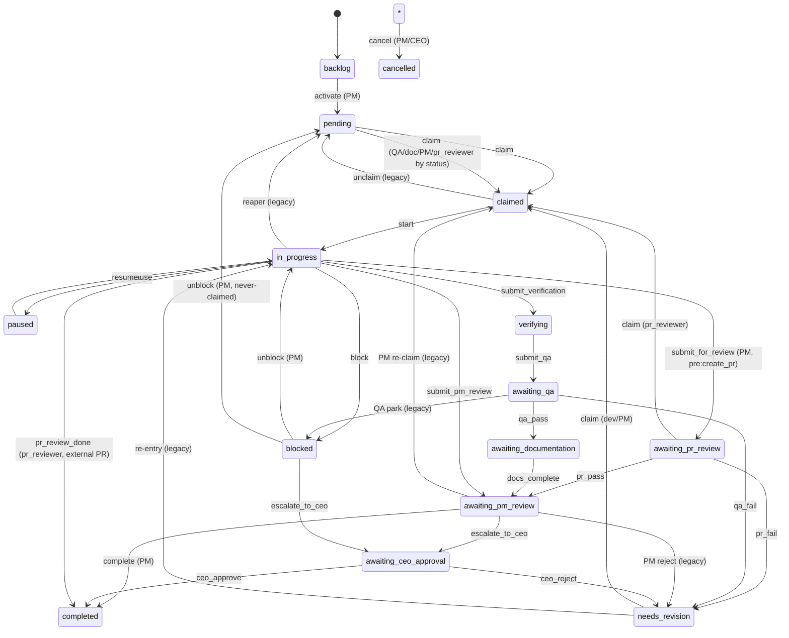

## Logical Tree
```
foundation-lifecycle
├── roboco/foundation/policy/lifecycle.py (canonical spec)
│   ├── Enums: Status, TaskType, RejectionKind
│   ├── Dataclasses: Decision, Precondition, ActionSpec, IntentSpec, StatusTransition, Context
│   ├── _STATUS_TRANSITIONS (edge table) -> STATUS_GRAPH (derived)
│   ├── _ATOMIC_ACTIONS (22 ActionSpecs)
│   ├── CLAIM_RULES (per-role claimable statuses)
│   ├── ROLE_TEAM_RULES (per-slug team binding)
│   ├── Precondition predicates + PRECONDITION_* constants (PLAN/COMMITS/NO_PR/OWNERSHIP/NON_TERMINAL/PR_OPEN_STATE)
│   ├── PR_OPEN_STATES (canon)
│   ├── _INTENT_VERBS (~30 IntentSpecs) + _next_hint_* helpers
│   ├── Lookups: can_claim, can_invoke_action, can_invoke_intent, valid_next_verbs, composed_actions_for, intents_for_role, status_after
│   ├── Internal helpers: _check_role_status_type, _check_self_review_and_preconditions, _check_claim_rules_narrow, _check_intent_preconditions
│   └── UNMIGRATED / _KNOWN_UNMIGRATED_CONSUMERS (debt fence)
├── roboco/foundation/_validate_lifecycle.py (import-time validators)
│   ├── LifecycleSpecError
│   ├── reachable_from (BFS)
│   └── 13 _check_* validators -> run_all_lifecycle_validators
└── roboco/enforcement/ (backwards-compat + access control)
    ├── __init__.py (re-export aggregator)
    ├── task_lifecycle.py
    │   ├── _LEGACY_OPERATIONAL_EDGES / _LEGACY_ROLE_GATES
    │   ├── VALID_TRANSITIONS / ROLE_RESTRICTED_TRANSITIONS (derived, union-merged)
    │   ├── validate_task_transition / can_agent_transition / get_valid_transitions
    │   ├── is_terminal_state / is_waiting_state / is_active_state (hard-coded)
    │   ├── ROLE_STATE_SLA_KEYS / sla_seconds_for
    │   └── GitContext / GitRequirementError / validate_git_requirements / check_parallel_completion
    ├── a2a_access.py (A2A direct-message gate)
    ├── channel_access.py (channel read/write/silent gate)
    ├── journal_perms.py (ReadTier-based journal read gate)
    └── task_ownership.py (ownership + reassign + self-review)
```

## Dependencies
- Internal: roboco.foundation.identity (Role, Team), roboco.foundation.policy.journaling (ReadTier, ROLE_READ_TIERS, PROTECTED_JOURNALS), roboco.seeds.initial_data (AGENT_UUIDS, DEFAULT_AGENTS) for slug/team validators, roboco.agents_config (CHANNEL_ACCESS, can_a2a_direct, get_a2a_route_hint, get_agent_cell/role/team), roboco.config.settings (SLA key resolution), roboco.exceptions (RobocoError, TaskLifecycleError)
- External: dataclasses (frozen dataclasses), enum.StrEnum, collections.deque (BFS validator), itertools.pairwise (intent chain validator), typing (Literal, TYPE_CHECKING, Callable, Any)

## Entry Points

| Name | File | Trigger |
|---|---|---|
| import of roboco.foundation.policy.lifecycle | /Users/renzof/Documents/GitHub/ZZZ/roboco-master/roboco/roboco/foundation/policy/lifecycle.py | module load — fires run_all_lifecycle_validators() at the bottom; a bad spec aborts the orchestrator container start |
| Choreographer verb dispatch (can_invoke_intent) | /Users/renzof/Documents/GitHub/ZZZ/roboco-master/roboco/roboco/services/gateway/choreographer/_impl.py | every gateway flow verb call — role/verb/task/Context decision before any state mutation |
| role_config.py manifest build (intents_for_role) | /Users/renzof/Documents/GitHub/ZZZ/roboco-master/roboco/roboco/services/gateway/role_config.py | import — derives per-role MCP tool manifest from the spec |
| envelope introspection (valid_next_verbs) | /Users/renzof/Documents/GitHub/ZZZ/roboco-master/roboco/roboco/services/gateway/envelope.py | every Envelope populate — surfaces current_state + applicable verbs to the agent |
| TaskService transition (validate_task_transition / validate_git_requirements / VALID_TRANSITIONS) | /Users/renzof/Documents/GitHub/ZZZ/roboco-master/roboco/roboco/services/task.py | TaskService._validate_and_set_status on every status write |
| GitService HTTP PR-create (PR_OPEN_STATES) | /Users/renzof/Documents/GitHub/ZZZ/roboco-master/roboco/roboco/services/git.py | HTTP POST /api/v1/.../prs — derives its str-set gate from the lifecycle canon |
| stuck-task SLA sweep (sla_seconds_for / ROLE_STATE_SLA_KEYS) | /Users/renzof/Documents/GitHub/ZZZ/roboco-master/roboco/roboco/runtime/orchestrator.py | orchestrator sweep tick |

## Config Flags
- agent_sla_developer_in_progress
- agent_sla_developer_verifying
- agent_sla_qa_claimed
- agent_sla_documenter_claimed
- agent_sla_cell_pm_claimed (resolved by sla_seconds_for via roboco.config.settings) — no ROBOCO_* feature flag directly gates this slice; it is the always-on policy core


## Gotchas
- can_invoke_intent only checks the FIRST composed action's source-status; subsequent actions in a multi-step composition (e.g. i_will_work_on = claim,set_plan,start) are NOT pre-checked — the verb runner must execute them in order and rollback on mid-composition failure, or the task is left stranded (e.g. claimed but never started).
- verbs with composes=() and not in the claim_review/claim_doc_task/claim_gate_review special-case list have NO source-status gate at the spec layer — their entire gate is extra_preconditions + the handler. sync_branch, open_pr, unclaim, reassign, escalate_up, give_me_work, i_am_idle, triage, triage_all all rely on this. A new empty-composes verb that transitions state without a NON_TERMINAL/source-status precondition can resurrect a terminal task (the F043 class of bug).
- _check_intent_preconditions drops the `missing` list for non-tracing rejection kinds (not_authorized/invalid_state) — Decision.reject sets missing=[]. Agents doing exact-string checks on `missing` will not see tokens for ownership/terminal/PR-open-state failures.
- enforcement/task_lifecycle.is_terminal_state/is_waiting_state/is_active_state are hard-coded string sets, NOT derived from STATUS_GRAPH — adding a new status to the Status enum without updating these predicates silently miscategorizes it.
- _build_role_restricted_transitions UNION-merges legacy role gates with spec pins; an earlier overwrite silently dropped pr_reviewer from (in_progress, completed). Any new spec role_constraint on an edge that also has a _LEGACY_ROLE_GATES entry must be tested for the union, not overwrite.
- UNMIGRATED must stay a subset of _KNOWN_UNMIGRATED_CONSUMERS or import fails — extending known debt requires editing both frozensets.
- Decision is frozen; the allowed=True path forbids missing/remediate, the allowed=False path forbids rejection_kind=None — building one outside the classmethods via direct __init__ is supported but the invariants are enforced in __post_init__.
- STATUS_GRAPH includes a self-loop-ish edge: cancel is generated for every non-terminal source, so every non-terminal status has CANCELLED as a target — validators pass because of this; removing the cancel generator without re-adding per-source edges would break _check_terminal_exits.
- the spec module imports Role/Team from foundation.identity and _validate_lifecycle at the BOTTOM (after table defs); validators defer-import the spec to break the cycle — pyproject PLC0415 exemption exists for this.
- BLOCKED has two unblock targets (IN_PROGRESS for previously-claimed, PENDING for never-claimed) — the ActionSpec.unblock source_statuses is just {BLOCKED} with target IN_PROGRESS; the BLOCKED->PENDING edge lives only in _STATUS_TRANSITIONS/STATUS_GRAPH and is exercised by the legacy shim, not by an ActionSpec.
- ROLE_TEAM_RULES is keyed by slug, not role — adding a new agent slug without a row means needs_team_match enforcement falls back to None (any team) for that slug silently.


## Drift from CLAUDE.md
- CLAUDE.md 'Role-Based Transitions' table lists escalate_to_ceo only from awaiting_pm_review; the spec also declares BLOCKED -> AWAITING_CEO_APPROVAL via escalate_to_ceo (lifecycle.py:334-339, ActionSpec source_statuses includes BLOCKED at line 615). The BLOCKED->AWAITING_CEO_APPROVAL edge is missing from the doc table.
- CLAUDE.md verb table for developer lists resume/unclaim but omits i_am_idle (every role gets i_am_idle per spec line 1150); the doc does state 'every role also gets i_am_idle' in prose, so this is partial drift — the per-role table column omits it.
- CLAUDE.md says 'roboco/enforcement/task_lifecycle.py is a backwards-compat shim over it' — true for the transition tables, but the shim ALSO owns GitContext/validate_git_requirements/SLA tables (not a pure view); the doc undersells the shim's owned symbols.
- enforcement/__init__.py __all__ does NOT export sla_seconds_for, check_parallel_completion, or ROLE_STATE_SLA_KEYS even though task_lifecycle.py's own __all__ does — consumers must import from the submodule, not the package. Not a CLAUDE.md drift but a surface inconsistency.


## Changes Since Baseline

| SHA | Subject | Impact |
|---|---|---|
| e202ce39 | Make main_pm + task_type=code impossible | In this slice: prose-only — added _next_hint_pr_fail (branch-aware re-delegate hint for Main-PM roots vs dev-revise for cell/dev) and rewrote submit_root description to 'branch-keyed not task_type-keyed'. The actual main_pm+code impossibility is enforced elsewhere (choreographer), not via ActionSpec.allowed_task_types here. |
| 250be5c2 | sync_branch dev verb — gate-level branch rebase (Phase B1) | Added IntentSpec sync_branch (dev-only, composes=(), extra_preconditions=OWNERSHIP, no DB transition) + _next_hint_synced helper. New empty-composes verb with no source-status gate; relies entirely on the handler's no-branch/protected-base guards. |
| 2f322286 | [F043] guard escalate_up against resurrecting terminal tasks | Added PRECONDITION_NON_TERMINAL (invalid_state) to escalate_up.extra_preconditions; generalized _check_intent_preconditions to honor any non-tracing rejection_kind (previously only not_authorized was special-cased, everything else was tracing_gap). Now invalid_state preconditions produce Decision.reject instead of tracing_gap. |
| c34e978f | [F101] enforce PR-open state gate on gateway open_pr | Added PR_OPEN_STATES frozenset (in_progress/verifying/awaiting_qa/awaiting_documentation/needs_revision) + PRECONDITION_PR_OPEN_STATE (invalid_state) inserted into open_pr.extra_preconditions between OWNERSHIP and COMMITS. Closes the gateway parity gap: open_pr (composes=()) previously had no source-status gate; now rejects claim/paused/blocked/terminal. |

## Regression Risks

| Title | File:Line | Claim | Severity |
|---|---|---|---|
| sync_branch has no source-status gate — can be called on terminal/paused/blocked tasks | /Users/renzof/Documents/GitHub/ZZZ/roboco-master/roboco/roboco/foundation/policy/lifecycle.py:1085 | sync_branch composes=() and is not in the claim_review/claim_doc_task/claim_gate_review special-case list, so can_invoke_intent only checks role + OWNERSHIP. A developer who owns a COMPLETED/CANCELLED/PAUSED task passes the spec gate; the rebase runs against a branch whose task is no longer active. The handler's no-branch guard does not catch this (a terminal task still has branch_name). Unlike escalate_up, no PRECONDITION_NON_TERMINAL was added. Medium risk of mutating git state for a finished task. | medium |
| open_pr now rejects `claimed` — may break dev flows that open PR before start | /Users/renzof/Documents/GitHub/ZZZ/roboco-master/roboco/roboco/foundation/policy/lifecycle.py:963 | PR_OPEN_STATES excludes CLAIMED. The intent composition i_will_work_on (claim,set_plan,start) transitions claim->in_progress atomically, so the normal path is fine, but any path that opens a PR while still in CLAIMED (e.g. a dev who calls open_pr before i_will_work_on finishes, or a custom flow) now receives invalid_state instead of the previous silent accept. This is the intended F101 parity fix, but it is a behavior tightening — verify no caller relied on claim-state PR opens. | low |
| _check_intent_preconditions generalization may misroute existing not_authorized callers | /Users/renzof/Documents/GitHub/ZZZ/roboco-master/roboco/roboco/foundation/policy/lifecycle.py:1572 | Before F043, only not_authorized was special-cased and the message was first_missing.remediate. After generalization, ALL non-tracing rejection kinds (not_authorized, invalid_state) take the Decision.reject path with message=remediate. Behavior for not_authorized is unchanged (still remediate-as-message), but any caller that introspected rejection_kind=='tracing_gap' to mean 'a precondition failed' will now miss invalid_state/ownership failures. The envelope's missing[] field is also empty for these. Low-medium risk for consumers that branch on rejection_kind. | low |
| pr_fail hint now branches on team==MAIN_PM and branch_name — non-Main-PM branch-bearing tasks get dev-revise | /Users/renzof/Documents/GitHub/ZZZ/roboco-master/roboco/roboco/foundation/policy/lifecycle.py:789 | _next_hint_pr_fail returns the re-delegate hint only when team==MAIN_PM.value AND branch is set. A cell-PM coordination root with a branch (rare but possible) falls through to 'dev will revise', which is wrong for a PM-owned assembled PR. Low impact (hint text only, not a gate) but could mislead a cell PM into waiting instead of re-delegating. | low |
| submit_root description claims 'branch-keyed, not task_type-keyed' but no allowed_task_types gate enforces it | /Users/renzof/Documents/GitHub/ZZZ/roboco-master/roboco/roboco/foundation/policy/lifecycle.py:1352 | The e202ce39 commit title 'Make main_pm + task_type=code impossible' is realized in the choreographer, NOT in this slice — submit_root's IntentSpec has no allowed_task_types and composes submit_for_review whose ActionSpec.allowed_task_types is None. The description prose asserts a constraint the spec layer does not enforce. If the choreographer guard regresses, the spec will not catch a main_pm+code submit_root. Low risk (defense-in-depth gap, not an active bug). | low |
| CLAIM_RULES lets PMs claim NEEDS_REVISION — combined with pr_fail reassign can create a PM/dev tug-of-war | /Users/renzof/Documents/GitHub/ZZZ/roboco-master/roboco/roboco/foundation/policy/lifecycle.py:687 | CELL_PM/MAIN_PM claim rules include NEEDS_REVISION (added so PM-owned coordination tasks have an actor after pr_fail/ceo_reject). give_me_work only offers assigned tasks, so normally safe, but a PM re-claiming a NEEDS_REVISION dev leaf (if misassigned) would bypass the dev-revise path. The comment documents this is scoped by the same mechanism as dev leaf-revision; risk is in assignment correctness upstream, not the spec itself. Low risk. | low |

## Health
The slice is structurally healthy and well-fenced: the spec is pure data + lookups with no I/O, frozen dataclasses enforce Decision invariants, 13 import-time validators make a misconfigured spec fail fast at container start, and the enforcement shim clearly fences its _LEGACY_* additions (UNMIGRATED debt tracked, union-merge prevents the pr_reviewer-drop regression). The four recent changes (sync_branch, F043 terminal-resurrection guard, F101 PR-open-state parity, pr_fail loop-breaker hint) are correctly scoped and documented. The main integrity concerns are behavioral, not structural: (1) the empty-composes verb pattern (sync_branch, unclaim, reassign, escalate_up, give_me_work, i_am_idle, triage, open_pr) has NO source-status gate at the spec layer — each new empty-composes verb that touches state must remember its own NON_TERMINAL/source-status precondition, and sync_branch forgot one (medium risk); (2) can_invoke_intent only pre-checks the FIRST composed action, leaving mid-composition rollback to the runner; (3) is_terminal_state/is_waiting_state/is_active_state are hard-coded string sets not derived from STATUS_GRAPH, a latent drift point if statuses are added. No active logic bugs found; the slice is the canonical source its consumers trust.

# foundation-batch-sequencing slice

## Purpose
The pure policy + deterministic analyzer behind MegaTask (sequenced batch intake). batch.py is the single source of truth for umbrella/root-subtask identity and git-exemption predicates every layer consults. sequencing.models.py carries the DraftSurface/SequencePlan dataclasses. services/sequencing.py turns declared collision surfaces into a dependency DAG + Kahn-layered waves, and exposes the dev-task collision-DAG and multi-level (cell-task wave-chain + by-osmosis) edge helpers the choreographer wires through add_dependency.

## Files

| Path | Role | LOC |
|---|---|---|
| roboco/foundation/policy/batch.py | Pure identity + git-exemption predicates for MegaTask umbrellas/root-subtasks (branchless, shape guardrail, main_pm+code impossibility) | 126 |
| roboco/foundation/policy/sequencing/__init__.py | Re-export surface for the sequencing schema dataclasses | 18 |
| roboco/foundation/policy/sequencing/models.py | Pure dataclasses: DraftSurface (one task's collision surface), SequencePlan (edges+waves+warnings), SequencingError | 52 |
| roboco/services/sequencing.py | Deterministic collision-sequencing analyzer (SequencingService) + dev_task_collision_edges glue + multi-level edge helpers (cell_task_wave_chain_depends_on, by_osmosis_tail_dev_tasks) | 366 |

## Key Symbols

| Name | Kind | File:Line | Responsibility |
|---|---|---|---|
| is_batch_umbrella | function | roboco/foundation/policy/batch.py:21 | True when batch_id set AND parent_task_id None (the umbrella, top-level batch identity) |
| is_batch_root_subtask | function | roboco/foundation/policy/batch.py:33 | True when batch_id set AND parented (a batch item under the umbrella) |
| is_branchless_coordination | function | roboco/foundation/policy/batch.py:40 | True for a task that does no git of its own: product fan-out root, ad-hoc cell-map root, or MegaTask umbrella |
| is_valid_batch_shape | function | roboco/foundation/policy/batch.py:71 | Creation-time guardrail: a batch_id is valid only on umbrella (zero targets) or root-subtask (exactly one target) |
| main_pm_cannot_own_code | function | roboco/foundation/policy/batch.py:104 | True when team==main_pm AND task_type==code — the structural mismatch that caused the 2026-06-27 MegaTask meltdown |
| SequencingError | class | roboco/foundation/policy/sequencing/models.py:15 | ValueError raised when the collision graph has a cycle or an out-of-range edge |
| DraftSurface | class | roboco/foundation/policy/sequencing/models.py:21 | Dataclass: one proposed task's collision surface (idx, priority, intends_to_touch globs, adds_migration, touches_shared, project_id) |
| SequencePlan | class | roboco/foundation/policy/sequencing/models.py:40 | Dataclass: analyzer output — edges (a,b)=b depends on a, Kahn waves, non-blocking warnings |
| SequencingService | class | roboco/services/sequencing.py:41 | Pure collision-sequencing analyzer; analyze() is the only public entry point |
| SequencingService.analyze | method | roboco/services/sequencing.py:44 | Compute deduped edges (file-overlap + migration-chain + shared-last), toposort into waves, emit contention warnings |
| SequencingService._file_overlap_edges | method | roboco/services/sequencing.py:61 | Rule 1: overlapping same-repo, same-sharedness surfaces serialize, more-important (priority,idx) first; mixed sharedness left to rule 3 |
| SequencingService._migration_chain_edges | staticmethod | roboco/services/sequencing.py:78 | Rule 2: per-project, adds_migration drafts chain serially by (touches_shared, priority, idx) via pairwise |
| SequencingService._shared_last_edges | method | roboco/services/sequencing.py:97 | Rule 3: each touches_shared draft runs after every overlapping non-shared draft in the same repo |
| SequencingService._contention_warnings | staticmethod | roboco/services/sequencing.py:113 | Rule 4: per-wave per-cell count over capacity emits a warning string (never an edge) |
| SequencingService._toposort | method | roboco/services/sequencing.py:133 | Range-check edges, build graph, Kahn-layer into waves; raise SequencingError on cycle |
| SequencingService._check_edges_in_range | staticmethod | roboco/services/sequencing.py:139 | Raise SequencingError if any edge endpoint is outside 0..n-1 |
| SequencingService._build_graph | staticmethod | roboco/services/sequencing.py:147 | Build indegree array + adjacency dict from edges |
| SequencingService._kahn_layers | method | roboco/services/sequencing.py:158 | Repeatedly take sorted indeg==0 nodes as a wave, relax, until empty; cycle if no ready node |
| SequencingService._relax | staticmethod | roboco/services/sequencing.py:172 | Decrement indegree of neighbors of each ready node |
| SequencingService._order_edge | staticmethod | roboco/services/sequencing.py:179 | Return edge (first.idx, second.idx) with more-important (lower (priority,idx)) first |
| SequencingService._globs_overlap | staticmethod | roboco/services/sequencing.py:185 | True if any path pair overlaps by equality, fnmatch either direction, or directory-prefix containment |
| SequencingService._dedupe | staticmethod | roboco/services/sequencing.py:199 | Order-preserving dedupe of edges by set membership |
| _surfaced_siblings | function | roboco/services/sequencing.py:218 | Filter siblings to those with a project_id and at least one collision-surface field |
| dev_task_collision_edges | function | roboco/services/sequencing.py:233 | Edge kind 3: turn a parent's surfaced siblings into (depends_on_id, task_id) pairs via SequencingService; undeclared-surface same-assignee lane fallback |
| cell_task_wave_chain_depends_on | function | roboco/services/sequencing.py:320 | Edge kind 2: cell-task IDs a new cell-task should depend on (every cell-task under each predecessor root-subtask) |
| by_osmosis_tail_dev_tasks | function | roboco/services/sequencing.py:342 | Edge kind 4: tail (max-sequence) dev-task IDs under each predecessor cell-task, only for the first dev task (sequence 0) |

## Data Flow
Inputs arrive two ways. (1) Intake/batch-create: the Prompter builds DraftSurface objects from the proposed batch drafts (intends_to_touch globs, adds_migration, touches_shared, project_id), calls SequencingService().analyze(surfaces, cell_of, cell_capacity) to get a SequencePlan (edges+waves+warnings), then PrompterService.confirm_live_batch wires the kind-1 root-subtask wave-chain edges through TaskService.add_dependency. (2) Incremental delegation in the choreographer: after a cell-PM delegates a dev task, TaskService.wire_sibling_collision_edges (task.py:6206) gathers the parent's surfaced siblings and calls dev_task_collision_edges(siblings), which builds DraftSurfaces ordered by (priority, sequence), runs SequencingService.analyze with an empty cell_capacity (warnings suppressed), maps the resulting (a,b) edge indices back to sibling ids, and returns (depends_on_id, task_id) pairs the choreographer persists via add_dependency. If zero declared-surface edges are produced, dev_task_collision_edges falls back to chaining each same-(project_id, assignee) lane by (priority, sequence). Multi-level edges: cell_task_wave_chain_depends_on and by_osmosis_tail_dev_tasks are pure helpers called from TaskService._create_subtask_from_inputs (task.py:6232/6268) with predecessor root/cell/dev task objects gathered by the choreographer; their returned ids are wired through add_dependency. Identity predicates (batch.py) are called synchronously at every layer: TaskService.create/reassign/escalation/submit_root/complete, the orchestrator's _is_coordination_task, the git branch gate, and the choreographer's umbrella checks — all pass the task's batch_id/parent_task_id/project_id/product_id/has_cell_projects to the same pure functions so exemptions cannot drift between sites.

## Mermaid
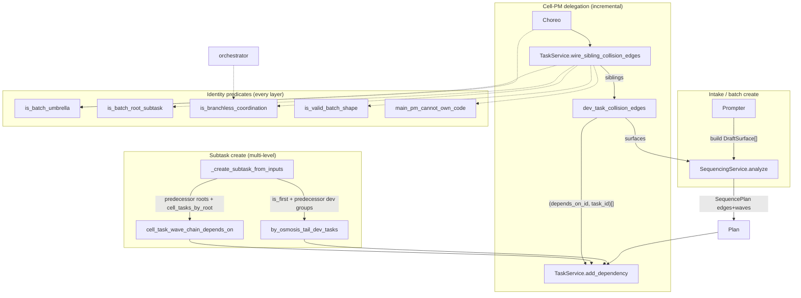

## Logical Tree
```
foundation-batch-sequencing
  roboco/foundation/policy/batch.py (identity + git-exemption predicates)
    is_batch_umbrella
    is_batch_root_subtask
    is_branchless_coordination
      -> product fan-out (no project, has product)
      -> ad-hoc cell-map (no project, no product, has_cell_projects)
      -> umbrella (delegates to is_batch_umbrella)
    is_valid_batch_shape (creation-time guardrail)
      -> umbrella: targets == 0
      -> root-subtask: targets == 1
    main_pm_cannot_own_code
  roboco/foundation/policy/sequencing/
    __init__.py (re-exports)
    models.py (pure schema)
      SequencingError
      DraftSurface (idx, priority, intends_to_touch, adds_migration, touches_shared, project_id)
      SequencePlan (edges, waves, warnings)
  roboco/services/sequencing.py (deterministic analyzer + glue)
    SequencingService
      analyze
      _file_overlap_edges (rule 1)
      _migration_chain_edges (rule 2)
      _shared_last_edges (rule 3)
      _contention_warnings (rule 4)
      _toposort / _check_edges_in_range / _build_graph / _kahn_layers / _relax
      _order_edge / _globs_overlap / _dedupe
    _surfaced_siblings
    dev_task_collision_edges (kind 3 + undeclared-surface same-assignee lane fallback)
    cell_task_wave_chain_depends_on (kind 2)
    by_osmosis_tail_dev_tasks (kind 4)
```

## Dependencies
- Internal: roboco.models.base.TaskType, roboco.models.base.Team, roboco.foundation.policy.sequencing.models.DraftSurface, roboco.foundation.policy.sequencing.models.SequencePlan, roboco.foundation.policy.sequencing.models.SequencingError, roboco.services.task.TaskService.add_dependency, roboco.services.task.TaskService.wire_sibling_collision_edges, roboco.services.task.TaskService._create_subtask_from_inputs, roboco.services.prompter.PrompterService.confirm_live_batch, roboco.services.gateway.choreographer._impl, roboco.runtime.orchestrator._is_coordination_task, roboco.db.tables.TaskTable (batch_id / intends_to_touch / adds_migration / touches_shared / task_cell_projects columns, migration 046/052)
- External: collections.defaultdict, collections.abc.Callable, dataclasses.dataclass / field, fnmatch.fnmatch, itertools.pairwise, typing.TYPE_CHECKING

## Entry Points

| Name | File | Trigger |
|---|---|---|
| PrompterService.confirm_live_batch / _sequence_batch | roboco/services/prompter.py | POST /prompter/live/{session}/confirm-batch (CEO confirms a MegaTask review card); builds DraftSurfaces and calls SequencingService.analyze to wire kind-1 root-subtask edges |
| TaskService.wire_sibling_collision_edges | roboco/services/task.py:6206 | choreographer after each cell-PM dev-task delegate; calls dev_task_collision_edges and add_dependency |
| TaskService._create_subtask_from_inputs | roboco/services/task.py:6232/6268 | choreographer subtask creation; calls cell_task_wave_chain_depends_on (MAIN_PM parent) and by_osmosis_tail_dev_tasks (cell-team parent) |
| orchestrator._is_coordination_task | roboco/runtime/orchestrator.py:409 | spawn / dispatch tick; consults is_branchless_coordination |
| TaskService.create / reassign / submit_root / complete / escalation | roboco/services/task.py | gateway verbs (i_will_plan, delegate, submit_root, complete, escalate_up, reassign); consult is_batch_umbrella / is_valid_batch_shape / main_pm_cannot_own_code |

## Gotchas
- dev_task_collision_edges fallback is gated on ZERO declared-surface edges (sequencing.py:285 `if edges: return edges`). A batch with even one declared collision pair will NOT chain the same-assignee lane, so two undeclared-surface siblings delegated to one dev can still start out of order if a third sibling declared a surface. The fallback is all-or-nothing per parent.
- Stable ordering depends on `sequence` being append-only and never reused; if a sibling is deleted and its sequence number recycled, re-running dev_task_collision_edges could flip an existing pair into a reverse edge and cycle the DAG. The code trusts this invariant without enforcing it here.
- is_branchless_coordination trusts the creation-time is_valid_batch_shape invariant — a normal task cannot spoof the umbrella exemption by attaching a batch_id because create() rejects it. Any code path that sets batch_id WITHOUT going through is_valid_batch_shape (bulk SQL, a future migration backfill) would punch a hole in the branch gate.
- Rule 1 (_file_overlap_edges) skips mixed sharedness pairs (line 71) and hands them to rule 3; but rule 3 only emits an edge when the NON-shared draft overlaps the shared one. If two drafts overlap but neither touches_shared AND sharedness differs, no edge is emitted at all — but that case is impossible (sharedness differs means one is shared), so the skip is safe. Subtle: rule 1's `a.touches_shared != b.touches_shared` means two shared drafts DO collide under rule 1, only shared-vs-non-shared is deferred.
- Migration chain orders by (touches_shared, priority, idx) so non-shared migrations run before shared ones to avoid contradicting rule 3 into a cycle — this coupling between rules 2 and 3 is load-bearing; reordering the sort key would reintroduce cycles.
- SequencingService().analyze in dev_task_collision_edges is called with cell_capacity={} so no contention warnings are ever emitted from the dev-task path — only the intake path supplies real capacity. Don't expect dev-task wiring to surface cell contention.
- _globs_overlap uses fnmatch in BOTH directions plus prefix containment; a broad glob like `src/**` in one draft and `src/foo.py` in another will match — intentional over-serialization, but a too-broad intends_to_touch silently serializes the whole batch.
- Kahn layers sort ready nodes by index (sorted(i for i in remaining...)) so wave ordering is deterministic but NOT by priority — priority only affects edge direction, not intra-wave order. Callers that read wave[0] as 'most important' are wrong.
- by_osmosis_tail_dev_tasks returns [] for non-first dev tasks (sequence != 0); if a cell-task's first dev task is later deleted, the next dev task (now sequence 0 after re-index) does NOT get re-wired because the helper is only called at creation time. Stale edges are not refreshed.


## Drift from CLAUDE.md
- CLAUDE.md describes the sequencing rules as 'file-overlap serializes (more-important first by (priority, idx))' — matches code. But it does NOT mention the undeclared-surface same-assignee lane fallback added in a957e4fa (sequencing.py:292-309), a real behavior change since the baseline.
- CLAUDE.md's identity predicate list says is_branchless_coordination = '((no-project AND product) OR umbrella)'. The code ALSO admits an ad-hoc per-cell map root (no-project, no-product, has_cell_projects) added in c03e76c4 (batch.py:66-67). The doc omits the cell-map shape.
- CLAUDE.md does not mention is_valid_batch_shape or main_pm_cannot_own_code at all, though both are first-class predicates in batch.py (lines 71, 104) and are load-bearing guardrails (the latter is the 2026-06-27 meltdown fix).
- CLAUDE.md's sequencing section lists only the root-level DAG (kind 1). The code now wires kinds 2, 3, 4 (cell_task_wave_chain_depends_on, dev_task_collision_edges, by_osmosis_tail_dev_tasks) added in 12621a36 / 9927d248 — undocumented in CLAUDE.md.


## Changes Since Baseline

| SHA | Subject | Impact |
|---|---|---|
| c03e76c4 | feat(megatask): per-cell project map root-subtasks (multi-project, multi-cell) | Added has_cell_projects param to is_branchless_coordination + is_valid_batch_shape (batch.py:40-101); a root-subtask may target an ad-hoc per-cell project map as a third branchless-coordination shape; umbrella still must target zero. Batch predicates gained a parameter every call site must pass. |
| e202ce39 | Fix: Make main_pm + task_type=code impossible | Added main_pm_cannot_own_code predicate (batch.py:104-125) — the structural-mismatch guard behind the 2026-06-27 MegaTask meltdown; consulted at create/reassign/escalation/claim. |
| 12621a36 | [feature] wire dev-task collision DAG at cell-PM delegation (sequencing S2) | Added _surfaced_siblings + dev_task_collision_edges (sequencing.py:218-309) — turns a parent's surfaced siblings into (depends_on_id, task_id) pairs via SequencingService, wired incrementally after each delegate; stable (priority, sequence) sort keeps re-runs from flipping edges into reverse cycles. |
| 9927d248 | [feature] wire cell-task wave chain + by-osmosis edge (sequencing S3) | Added cell_task_wave_chain_depends_on (kind 2) + by_osmosis_tail_dev_tasks (kind 4) (sequencing.py:320-365) — multi-level edges wired from _create_subtask_from_inputs so a new wave's branch carries the previous wave's merged tail. |
| 3a4a3fe5 | [refactor] reduce xenon C-rank blocks to A (behavior-preserving) | Behavior-preserving refactor of sequencing.py to cut xenon complexity (split methods); no semantic change. |
| a957e4fa | [chore] sequencing: chain undeclared-surface same-assignee dev siblings + trim re-fire guard comments | dev_task_collision_edges now falls back (only with zero declared-surface edges) to chaining each same-(project_id, assignee) lane by (priority, sequence) — closes the out-of-order start wedge when a PM delegates two surface-less dev tasks to the same developer. |

## Regression Risks

| Title | File:Line | Claim | Severity |
|---|---|---|---|
| Fallback masks cross-cell same-assignee chain when one sibling declares a surface | roboco/services/sequencing.py:285 | The same-assignee lane fallback only runs when `if edges: return edges` is false — i.e. ZERO declared-surface edges. If a parent has 3 siblings where only one pair shares a declared surface, the fallback never runs, so two OTHER same-assignee surface-less siblings won't be chained and can start out of order. The all-or-nothing gate under-protects mixed batches. | medium |
| by_osmosis edge not refreshed when first dev task is deleted | roboco/services/sequencing.py:357 | by_osmosis_tail_dev_tasks returns [] for non-first dev tasks and is only called at creation time. If sequence-0 dev task is later deleted/cancelled, the new de-facto first dev task (now lowest sequence) is never re-wired with the predecessor tail, so its branch may be cut without the previous wave's merged tail — a silent merge-conflict risk on wave N>0. | medium |
| Rule 1 + rule 3 interaction can drop an edge for shared-vs-shared overlap | roboco/services/sequencing.py:71 | _file_overlap_edges only skips when `a.touches_shared != b.touches_shared` (mixed). Two shared drafts that overlap DO get a rule-1 edge ordered by (priority, idx) — but rule 3 emits NO edge between two shared drafts (line 103 skips `other.touches_shared`). If rule 1's (priority, idx) ordering contradicts another constraint the shared pair could be ordered against the grain. Currently safe because shared-vs-shared has no shared-last constraint, but a future rule 3 extension could silently cycle. | low |
| has_cell_projects threaded incorrectly at any call site breaks branchless exemption | roboco/foundation/policy/batch.py:66 | is_branchless_coordination now requires callers to pass has_cell_projects. A call site that omits it (defaults False) for a cell-map root will NOT recognize it as branchless and will demand a branch/PR the root cannot supply — wedging that root in the git gate. Verified sites: task.py:597, orchestrator.py:409. Any new call site is a landmine. | high |
| main_pm_cannot_own_code accepts both ORM enums and .value strings but not all str variants | roboco/foundation/policy/batch.py:123 | `str(getattr(team, 'value', team))` normalizes both shapes, but if a caller passes a Team alias string that isn't the canonical .value (e.g. 'main_pm' vs 'MAIN_PM' casing) the comparison silently returns False and the code-ownership guard fails open. The guard depends on exact .value string equality. | low |
| dev_task_collision_edges stable sort assumes sequence is never recycled | roboco/services/sequencing.py:263 | Siblings are sorted by (priority, sequence) and edges mapped by current index. If a deleted sibling's sequence number is reused by a new sibling, a re-run could map an old edge's index to a different task id and emit a reverse edge, cycling the DAG. The invariant is assumed, not enforced here. | medium |
| cell_task_wave_chain_depends_on reads predecessor root ids from root.dependency_ids which also carry non-wave edges | roboco/services/sequencing.py:322 | The docstring claims it reads root.dependency_ids (kind-1 wave-chain edges) but the function itself takes predecessor_root_ids blindly — it trusts the caller to pass ONLY wave-chain predecessor ids. If the caller passes the full dependency_ids (which may include UX/product-fanout edges per the 9927d248 message), the new cell-task will depend on cell-tasks under non-wave predecessors, over-serializing across non-sequential roots. The choreographer must filter; the helper cannot. | medium |

## Health
This slice is in strong shape: it is pure (no DB, no services inside the policy/analyzer layer), well-documented, and the identity predicates are correctly factored as the single source of truth every layer consults. The deterministic analyzer is sound — cycle detection, edge range checks, and the rule ordering (file-overlap -> migration-chain -> shared-last, with the touches_shared sort key in rule 2 deliberately avoiding rule-3 cycles) are coherent. The main integrity risks are contract-style, not logic: the all-or-nothing gate on the same-assignee fallback (sequencing.py:285) under-protects mixed batches, the by-osmosis edge is not refreshed after a first-dev-task deletion, and is_branchless_coordination's new has_cell_projects parameter is a sharp footgun for any future call site that forgets to pass it (the branch gate fails open/closed depending on the default). The CLAUDE.md doc has drifted behind the code — it omits the cell-map branchless shape, is_valid_batch_shape, main_pm_cannot_own_code, and edge kinds 2-4 — but the code itself is internally consistent and the recent commits are TDD-backed with integration tests.

# foundation-conventions-identity slice

## Purpose
The pure, no-IO/no-DB foundation layer for RoboCo's identity model and the architectural-conventions standard schema. identity.py is the single source of truth for roles, teams, the AGENTS roster, role-sets, and slug/role/team lookups consumed by the orchestrator, services, and API. The conventions/ sub-package defines the YAML schema models (.roboco/conventions.yml), the org-default BUILTIN_RULES, and the effective-map merge (auto-derived scan defaults overlaid by the committed file). _validate.py runs cross-table integrity checks at import time (fail-fast: a misconfigured foundation blocks container start). _generators.py deterministically renders lifecycle artifacts (markdown/JSON/prompt fragments) consumed by the CI build-lifecycle-artifacts gate.

## Files

| Path | Role | LOC |
|---|---|---|
| roboco/foundation/policy/conventions/__init__.py | Package facade re-exporting BUILTIN_RULES, ConventionsParseError, ConventionsStandard, CustomRule, DefinitionKind, Module, Rule, RuleLevel, Waiver, effective_map. | 33 |
| roboco/foundation/policy/conventions/effective_map.py | Pure merge of auto-derived scan defaults with the committed conventions file into one ConventionsStandard (per-field precedence). | 65 |
| roboco/foundation/policy/conventions/models.py | Pydantic schema for the conventions standard: Module/Rule/CustomRule/Waiver/ConventionsStandard, BUILTIN_RULES, ConventionsParseError, parse_yaml entry point. | 131 |
| roboco/foundation/identity.py | Single source of truth for Role, Team, CELL_TEAMS, RoleLevel, AgentRow, the AGENTS roster, role-sets (PM/BOARD/DEV/REVIEWER/ALL), ROLE_LEVEL, and slug/role/team lookup helpers. | 317 |
| roboco/foundation/_validate.py | Import-time identity validators (unique UUIDs/slugs, every real role has an agent, ROLE_LEVEL covers all roles, PM/BOARD roles populated); run_all() entry. | 93 |
| roboco/foundation/_generators.py | Deterministic renderers of lifecycle intent-verb/status-transition markdown, panel JSON, and per-role prompt fragments from the lifecycle spec. | 145 |

## Key Symbols

| Name | Kind | File:Line | Responsibility |
|---|---|---|---|
| Role | StrEnum | roboco/foundation/identity.py:22 | The 12 canonical agent roles (developer, qa, documenter, cell_pm, main_pm, product_owner, head_marketing, auditor, pr_reviewer, prompter, secretary, ceo, system). |
| Team | StrEnum | roboco/foundation/identity.py:38 | Team enum (backend, frontend, ux_ui, board, main_pm, fullstack, marketing-legacy, system). |
| CELL_TEAMS | frozenset[Team] | roboco/foundation/identity.py:54 | The three delivery cells {BACKEND, FRONTEND, UX_UI} — distinct from the full Team enum; single source of truth for 'the cells' subset. |
| RoleLevel | IntEnum | roboco/foundation/identity.py:57 | Hierarchical authority levels (-1 SYSTEM, 0 INTAKE, 1 DEV, 2 QA, 3 DOCUMENTER, 4 CELL_PM, 5 MAIN_PM, 6 BOARD, 7 AUDITOR, 8 CEO) for 'X or above' checks. |
| AgentRow | dataclass(frozen=True) | roboco/foundation/identity.py:70 | Identity record for one agent: slug, role, team, uuid, is_human (True only for ceo). |
| _u | function | roboco/foundation/identity.py:81 | Shorthand UUID literal constructor for the AGENTS table. |
| AGENTS | dict[str,AgentRow] | roboco/foundation/identity.py:86 | The full agent roster: system sentinel, CEO, 3 cells (5 members each), main-pm, product-owner, head-marketing, auditor, intake-1, secretary-1, pr-reviewer-1, and 3 per-cell pr-reviewers. |
| PM_ROLES | frozenset[Role] | roboco/foundation/identity.py:251 | {CELL_PM, MAIN_PM} — roles allowed to plan/delegate/merge. |
| BOARD_ROLES | frozenset[Role] | roboco/foundation/identity.py:252 | {PRODUCT_OWNER, HEAD_MARKETING, AUDITOR} — board reviewers; intake/secretary/pr-reviewer deliberately excluded. |
| DEV_ROLES | frozenset[Role] | roboco/foundation/identity.py:255 | {DEVELOPER}. |
| REVIEWER_ROLES | frozenset[Role] | roboco/foundation/identity.py:256 | {PR_REVIEWER}. |
| ALL_ROLES | frozenset[Role] | roboco/foundation/identity.py:257 | frozenset(Role) — every role value. |
| ROLE_LEVEL | dict[Role,RoleLevel] | roboco/foundation/identity.py:262 | Per-role authority level; PR_REVIEWER=QA, PROMPTER=INTAKE, SECRETARY=BOARD, AUDITOR above MAIN_PM, CEO ceiling. |
| agent_for_slug | function | roboco/foundation/identity.py:279 | Return AgentRow for slug; raise KeyError on unknown (lists known slugs in message). |
| slugs_for_role | function | roboco/foundation/identity.py:286 | frozenset of slugs whose agent has a given role. |
| slugs_for_team | function | roboco/foundation/identity.py:291 | frozenset of slugs whose agent is on a given team. |
| role_for_slug | function | roboco/foundation/identity.py:296 | Shorthand role lookup; raises KeyError on unknown slug. |
| role_for_slug_or_none | function | roboco/foundation/identity.py:301 | Safe variant returning None for unknown/stale slug so dispatcher skip-guards don't crash the tick (added in 5bb13c84). |
| team_for_slug | function | roboco/foundation/identity.py:314 | Shorthand team lookup; raises KeyError on unknown slug. |
| RuleLevel | Literal | roboco/foundation/policy/conventions/models.py:18 | 'warn' / 'block' — gate severity for a convention rule. |
| DefinitionKind | Literal | roboco/foundation/policy/conventions/models.py:19 | model / route / helper / business_logic / component / other — what a tree-sitter-classified definition is. |
| ConventionsParseError | class(ValueError) | roboco/foundation/policy/conventions/models.py:24 | Raised when .roboco/conventions.yml is malformed or fails schema validation; carries .reason. |
| BUILTIN_RULES | dict[str,RuleLevel] | roboco/foundation/policy/conventions/models.py:38 | Org-default hygiene rules seeded into every project: no_lint_suppressions=block, no_inline_comments=warn. Placement rules are NOT here (derived per-project). |
| _Base | BaseModel | roboco/foundation/policy/conventions/models.py:44 | Shared pydantic config: extra='ignore' for forward-compat with unknown YAML keys. |
| Module | BaseModel | roboco/foundation/policy/conventions/models.py:50 | One module boundary: path prefix, purpose, forbidden definition kinds. |
| Rule | BaseModel | roboco/foundation/policy/conventions/models.py:58 | A toggleable named rule and the level it fires at. |
| CustomRule | BaseModel | roboco/foundation/policy/conventions/models.py:65 | Project-specific regex rule: id, pattern, message, level, optional language scope. |
| Waiver | BaseModel | roboco/foundation/policy/conventions/models.py:75 | Accountable escape hatch: a (path, rule, reason) the gate must not flag. |
| ConventionsStandard | BaseModel | roboco/foundation/policy/conventions/models.py:83 | Parsed standard (raw file or merged effective map): version, languages, modules, rules, custom, waivers. |
| ConventionsStandard._name_rules_from_keys | field_validator | roboco/foundation/policy/conventions/models.py:93 | Inject mapping key as each rule's name; accepts both {name: {level:...}} YAML and pre-built Rule objects. |
| ConventionsStandard.parse_yaml | classmethod | roboco/foundation/policy/conventions/models.py:112 | Single entry point from raw file text to validated ConventionsStandard; raises ConventionsParseError on malformed YAML / non-mapping top level / ValidationError. |
| _merge_rules | function | roboco/foundation/policy/conventions/effective_map.py:22 | Merge rules: BUILTIN_RULES < derived < file (per key). |
| _merge_modules | function | roboco/foundation/policy/conventions/effective_map.py:34 | Merge modules: derived, file modules override by path, new paths appended in file order. |
| _union_languages | function | roboco/foundation/policy/conventions/effective_map.py:43 | Union languages preserving derived order then file-only extras. |
| effective_map | function | roboco/foundation/policy/conventions/effective_map.py:53 | Produce the merged ConventionsStandard: derived defaults overlaid by the committed file; version/custom/waivers come from the curated side (file if present else derived). |
| _SENTINEL_ROLES | frozenset[Role] | roboco/foundation/_validate.py:23 | {Role.SYSTEM} — excluded from 'every real role has an agent' check. |
| IdentityValidationError | class(RuntimeError) | roboco/foundation/_validate.py:26 | Raised at import time when identity tables are inconsistent. |
| _check_unique_uuids | function | roboco/foundation/_validate.py:30 | Fail if any two AgentRows share a UUID. |
| _check_unique_slugs | function | roboco/foundation/_validate.py:39 | Belt-and-suspenders duplicate-slug check (dict already guarantees uniqueness). |
| _check_every_real_role_has_agent | function | roboco/foundation/_validate.py:47 | Every Role except SYSTEM must have at least one agent in AGENTS. |
| _check_role_level_covers_all_roles | function | roboco/foundation/_validate.py:56 | ROLE_LEVEL must have an entry for every Role. |
| _check_pm_roles_have_agents | function | roboco/foundation/_validate.py:63 | Each role in PM_ROLES must have at least one agent. |
| _check_board_roles_have_agents | function | roboco/foundation/_validate.py:71 | Each role in BOARD_ROLES must have at least one agent. |
| _VALIDATORS | tuple | roboco/foundation/_validate.py:79 | Ordered tuple of the six identity validators run by run_all. |
| run_all | function | roboco/foundation/_validate.py:89 | Run every identity validator in order; first failure raises IdentityValidationError. |
| _composes_line | function | roboco/foundation/_generators.py:25 | Render the 'Composes' line for one intent verb. |
| _intent_verb_section | function | roboco/foundation/_generators.py:31 | Render a single intent-verb markdown section (name, description, allowed roles, composes, side effects, preconditions). |
| render_intent_verbs_md | function | roboco/foundation/_generators.py:51 | Render the full intent-verbs markdown doc, one section per verb sorted by name. |
| _transition_roles_str | function | roboco/foundation/_generators.py:59 | Render the roles column for a status transition ('any' if no constraint). |
| _transition_sort_key | function | roboco/foundation/_generators.py:65 | Sort key (source, target, action) for deterministic transition ordering. |
| render_status_transitions_md | function | roboco/foundation/_generators.py:69 | Render the status-transitions markdown table. |
| _intent_to_panel_dict | function | roboco/foundation/_generators.py:85 | Serialize one IntentSpec to the panel-UI dict shape. |
| _transition_to_panel_dict | function | roboco/foundation/_generators.py:96 | Serialize one StatusTransition to the panel-UI dict shape. |
| render_panel_json | function | roboco/foundation/_generators.py:106 | Deterministic JSON dump (intents + transitions + claim_rules) for the panel lifecycle visualizer. |
| render_agent_prompt_fragment | function | roboco/foundation/_generators.py:125 | Per-role prompt fragment listing the verbs the agent can call, injected into the system prompt so agent perception matches the gateway surface. |

## Data Flow
identity.py is loaded eagerly when `roboco.foundation` is imported (foundation/__init__.py line 10-26 re-exports its symbols; line 48-50 imports and invokes `_validate.run_all()`). At import, _validate.run_all() iterates _VALIDATORS, each reading identity.AGENTS / Role / ROLE_LEVEL / PM_ROLES / BOARD_ROLES and raising IdentityValidationError on any inconsistency — so a misconfigured foundation aborts container start before any service runs. At runtime, the orchestrator (runtime/orchestrator.py: line 2186, 10327, 10504, 10931), services (permissions, secretary, prompter, release_readiness, self_heal_engine, ci_watch_engine, dep_update_engine, release_manager_engine, gateway/choreographer), API deps/routes, models/base, and seeds/initial_data import Role/Team/AGENTS/role-sets/lookups from here. Adding an agent edits only identity.py; the validators then enforce roster integrity at next import. The conventions sub-package is imported by roboco/services/conventions.py (ConventionsService) and roboco/api/routes/project.py; raw `.roboco/conventions.yml` text flows through ConventionsStandard.parse_yaml (models.py:112) -> ConventionsStandard, then ConventionsService pairs it with a scan-derived standard and calls effective_map(effective_map.py:53) to produce the merged standard consumed by the validator CLI (roboco/conventions/) and the ambient/baseline prompt injection. _generators.py is offline: scripts/build_lifecycle_artifacts.py imports it and writes rendered markdown/JSON/per-role prompt fragments to disk; the CI gate `make lifecycle && git diff --exit-code` asserts the on-disk artifacts match the current lifecycle spec (which itself imports Role/Team from identity). No function in this slice performs IO or DB access — all are pure transforms over in-memory tables/specs.

## Mermaid
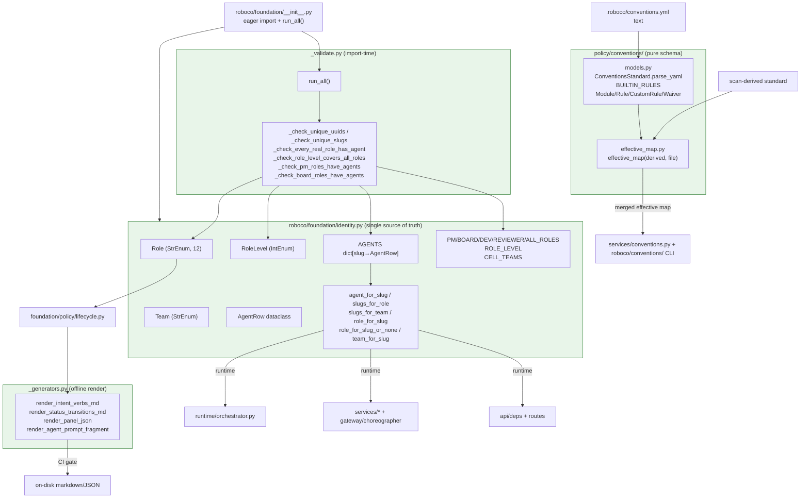

## Logical Tree
```
foundation-conventions-identity
├── roboco/foundation/identity.py  (single source of truth)
│   ├── Role (StrEnum: 12 roles incl. system sentinel)
│   ├── Team (StrEnum: backend/frontend/ux_ui/board/main_pm/fullstack/marketing/system)
│   ├── CELL_TEAMS (frozenset {BACKEND, FRONTEND, UX_UI})
│   ├── RoleLevel (IntEnum -1..8)
│   ├── AgentRow (frozen dataclass: slug, role, team, uuid, is_human)
│   ├── AGENTS (dict: 27 rows = system + ceo + 25 AI agents)
│   │   ├── system sentinel (zero UUID)
│   │   ├── ceo (human)
│   │   ├── backend cell (be-dev-1/2, be-qa, be-pm, be-doc, be-pr-reviewer)
│   │   ├── frontend cell (fe-dev-1/2, fe-qa, fe-pm, fe-doc, fe-pr-reviewer)
│   │   ├── ux_ui cell (ux-dev-1/2, ux-qa, ux-pm, ux-doc, ux-pr-reviewer)
│   │   └── board/main_pm (main-pm, product-owner, head-marketing, auditor, intake-1, secretary-1, pr-reviewer-1)
│   ├── Role-sets: PM_ROLES, BOARD_ROLES, DEV_ROLES, REVIEWER_ROLES, ALL_ROLES
│   ├── ROLE_LEVEL (dict Role→RoleLevel)
│   └── Lookups: agent_for_slug, slugs_for_role, slugs_for_team, role_for_slug, role_for_slug_or_none, team_for_slug
├── roboco/foundation/_validate.py  (import-time integrity)
│   ├── _SENTINEL_ROLES = {SYSTEM}
│   ├── IdentityValidationError
│   ├── _check_unique_uuids
│   ├── _check_unique_slugs
│   ├── _check_every_real_role_has_agent
│   ├── _check_role_level_covers_all_roles
│   ├── _check_pm_roles_have_agents
│   ├── _check_board_roles_have_agents
│   ├── _VALIDATORS (ordered tuple)
│   └── run_all()
├── roboco/foundation/_generators.py  (offline deterministic render)
│   ├── _composes_line / _intent_verb_section
│   ├── render_intent_verbs_md
│   ├── _transition_roles_str / _transition_sort_key
│   ├── render_status_transitions_md
│   ├── _intent_to_panel_dict / _transition_to_panel_dict
│   ├── render_panel_json
│   └── render_agent_prompt_fragment
└── roboco/foundation/policy/conventions/  (pure schema + merge)
    ├── __init__.py  (re-exports)
    ├── models.py
    │   ├── RuleLevel / DefinitionKind (Literals)
    │   ├── ConventionsParseError
    │   ├── BUILTIN_RULES (no_lint_suppressions=block, no_inline_comments=warn)
    │   ├── _Base (extra=ignore)
    │   ├── Module / Rule / CustomRule / Waiver
    │   └── ConventionsStandard (+ _name_rules_from_keys validator, + parse_yaml classmethod)
    └── effective_map.py
        ├── _merge_rules (BUILTIN < derived < file)
        ├── _merge_modules (derived, file overrides by path)
        ├── _union_languages (derived order then file extras)
        └── effective_map (merged ConventionsStandard)
```

## Dependencies
- Internal: roboco.foundation.identity (re-exported by foundation/__init__.py and consumed by ~30 modules: orchestrator, services/permissions, services/secretary, services/prompter, services/release_readiness, services/self_heal_engine, services/ci_watch_engine, services/dep_update_engine, services/release_manager_engine, services/gateway/choreographer/_impl, services/gateway/content_actions, api/deps, api/routes/orchestrator, api/routes/pitch, api/routes/v1/_role_dep, api/schemas/product, api/schemas/pitch(?), models/base, models/product, models/pitch, seeds/initial_data, agents_config, foundation/policy/lifecycle, foundation/policy/communications, foundation/policy/journaling, foundation/policy/task_completeness, foundation/policy/content/models, enforcement/journal_perms, services/learning, services/pitch, services/product), roboco.foundation._validate (run_all invoked at foundation package import), roboco.foundation._generators (consumed by scripts/build_lifecycle_artifacts.py; reads roboco.foundation.policy.lifecycle._INTENT_VERBS/_STATUS_TRANSITIONS/CLAIM_RULES/IntentSpec/Role/StatusTransition), roboco.foundation.policy.conventions.{models,effective_map} (consumed by roboco/services/conventions.py ConventionsService, roboco/api/routes/project.py, and the roboco/conventions/ validator CLI)
- External: pydantic (BaseModel, ConfigDict, Field, ValidationError, field_validator), yaml (PyYAML safe_load / YAMLError), dataclasses (dataclass frozen=True), enum (IntEnum, StrEnum), uuid.UUID, collections.Counter, typing.Any/Literal, json (render_panel_json)

## Entry Points

| Name | File | Trigger |
|---|---|---|
| foundation package import → run_all() | roboco/foundation/__init__.py | import roboco.foundation (or any submodule) — line 48-50 imports and invokes _validate.run_all() at module load; first failing validator raises IdentityValidationError and blocks orchestrator start |
| identity lookups (agent_for_slug / role_for_slug / role_for_slug_or_none / slugs_for_role / slugs_for_team / team_for_slug) | roboco/foundation/identity.py | called throughout the dispatcher tick, claim/plan/escalate flows, notification routing, permissions checks, and seed bootstrap whenever a slug/role/team must be resolved |
| ConventionsStandard.parse_yaml(text) | roboco/foundation/policy/conventions/models.py | called by ConventionsService and the validator CLI when raw .roboco/conventions.yml text is loaded from the read clone |
| effective_map(derived, file) | roboco/foundation/policy/conventions/effective_map.py | called by ConventionsService to merge the scan-derived standard with the committed file into the effective map consumed by validator + ambient/baseline injection |
| render_intent_verbs_md / render_status_transitions_md / render_panel_json / render_agent_prompt_fragment | roboco/foundation/_generators.py | invoked by scripts/build_lifecycle_artifacts.py under the CI gate `make lifecycle && git diff --exit-code` to keep on-disk lifecycle artifacts byte-identical to the spec |

## Config Flags
- ROBOCO_CONVENTIONS_ENABLED (default-off) — gates the surrounding ConventionsService + validator gate enforcement (i_am_done / pr_pass block + ambient/baseline injection). The schema/effective_map in this slice are pure and always importable, but the gate that consumes them is flag-gated. No flag lives inside the slice itself.
- ROBOCO_ORG_MEMORY_ENABLED / ROBOCO_RELEASE_MANAGER_ENABLED / etc. — do NOT touch this slice; mentioned only to confirm they do not gate identity or conventions-schema behavior.


## Gotchas
- Import-time side effect: `import roboco.foundation` triggers _validate.run_all() which raises IdentityValidationError on any roster inconsistency — the orchestrator container will refuse to start. This is intentional fail-fast but means editing identity.py incorrectly has a blast radius across the whole app.
- role_for_slug raises KeyError on unknown slugs; role_for_slug_or_none returns None instead. The two coexist and callers must pick the right one. Dispatcher skip-guards MUST use the _or_none variant or a stale assignee/notification-target slug crashes the whole tick (this was the 5bb13c84 fix).
- role_for_slug_or_none returns None for a stale slug, and `None in (Role.CEO, Role.PROMPTER, Role.SECRETARY)` is False — so the human-only-role skip silently DOES NOT fire for a stale slug. By design (proceed rather than crash), but a stale slug that referred to a human role would not be blocked at this guard.
- ROLE_LEVEL maps PR_REVIEWER to QA (peer to QA in authority), SECRETARY to BOARD, and PROMPTER to INTAKE (0, lowest real-agent). Auditor (7) sits ABOVE MAIN_PM (5) because it reads everywhere. 'X or above' checks must respect this non-obvious ordering.
- BOARD_ROLES deliberately EXCLUDES intake-1 (PROMPTER), secretary-1 (SECRETARY), and pr-reviewer-1 / per-cell pr-reviewers (PR_REVIEWER) even though all are Team.BOARD — they are not board reviewers. Code that assumes 'board team == board reviewer role' is wrong.
- Team.MARKETING is legacy — kept for seed-data parity, no agent declares it. Team.SYSTEM only for the system sentinel. Team.FULLSTACK declared but no agent in AGENTS uses it.
- AGENTS is a module-level mutable dict. _check_unique_slugs comment notes dict uniqueness is guaranteed; the check exists only to catch accidental mutation. Mutating AGENTS at runtime would bypass validators (they ran once at import).
- ConventionsStandard._name_rules_from_keys is a mode='before' field_validator: it accepts both the YAML shape {name: {level: warn}} and pre-built Rule objects. Passing a dict of plain strings will NOT be rewritten and will surface as a ValidationError wrapped in ConventionsParseError.
- effective_map precedence: rules = BUILTIN < derived < file (per key); modules = derived with file override-by-path and new paths appended; version/custom/waivers = file's when a file is present ELSE derived (file is the curated replacement — an empty-file waivers list wins over derived's). derived normally has empty waivers/custom, so this is safe, but a derived scan that ever produces waivers would be shadowed by an empty file.
- _generators output is deterministic and CI-gated by `git diff --exit-code`; any spec change must be regenerated or CI fails. Two calls with the same spec produce the same bytes (sort_keys=True / sorted transitions).
- _validate_lifecycle.py lives in a SEPARATE module (not _validate.py) specifically to avoid an import cycle, because lifecycle.py imports from foundation at module load. Do not move lifecycle validators into _validate.py.
- CELL_TEAMS is a frozenset {BACKEND, FRONTEND, UX_UI} and is DISTINCT from the Team enum — 'the cells' subset. Code that iterates Team to find cells is wrong; use CELL_TEAMS.


## Drift from CLAUDE.md
- CLAUDE.md describes '25 AI agents + 1 human CEO' — AGENTS has 27 entries minus system sentinel minus ceo = 25 AI agents + 1 human CEO. Consistent (the 3 per-cell pr-reviewers bring the AI count to 25). No drift.
- CLAUDE.md verb-surface table lists pr_reviewer verbs (claim_pr_review, post_pr_review, claim_gate_review, pr_pass, pr_fail) and notes the per-cell gate reviewers — identity.py models this exactly with pr-reviewer-1 (global/root) plus be/fe/ux-pr-reviewer (per-cell, team-scoped). No drift.
- CLAUDE.md states the conventions schema lives in `roboco/foundation/policy/conventions/` (pure) and that BUILTIN_RULES are language-agnostic hygiene rules while placement rules are derived per-project — models.py:38 comment and effective_map.py confirm this exactly. No drift.
- CLAUDE.md does not mention role_for_slug_or_none (added 5bb13c84) — but it is an internal helper, not a user-facing surface, so silence is expected rather than drift.


## Changes Since Baseline

| SHA | Subject | Impact |
|---|---|---|
| 5bb13c84 | [F031] identity: role_for_slug_or_none so defensive skip-guards don't crash the dispatcher tick on stale slugs | Added role_for_slug_or_none(slug) returning None instead of raising KeyError on unknown/stale slugs; orchestrator call sites (lines 2186, 10327, 10504, 10931) switched from role_for_slug to the safe variant so a stale assignee or notification-target slug no longer crashes the dispatcher tick. Purely additive — role_for_slug and all other lookups unchanged. conventions/, _validate.py, _generators.py untouched since baseline. |

## Regression Risks

| Title | File:Line | Claim | Severity |
|---|---|---|---|
| Stale human-role slug silently bypasses human-only skip guard | roboco/runtime/orchestrator.py:10327 | After 5bb13c84, role_for_slug_or_none(slug) in (Role.CEO, Role.PROMPTER, Role.SECRETARY) returns None for a stale slug, and None in (...) is False, so the skip branch does NOT fire. If a stale slug once referred to a human-only role (e.g. a renamed secretary slug), the guard proceeds instead of skipping. The no-spawn-human-roles fix (d31d6719+e6b845b4) is a separate guard, so this is defence-in-depth, not the primary barrier — but the layered protection is weakened for stale slugs. | medium |
| role_for_slug_or_none introduces a None-handling contract callers must honour | roboco/foundation/identity.py:301 | The new function returns Role / None. Any future caller that does `role_for_slug_or_none(slug).value` or passes the result into a function typed Role (not Role/None) will hit AttributeError / TypeError on a stale slug. mypy may not catch call sites that annotate the local as Role. The docstring documents the None-as-'not human-only' convention but nothing enforces it. | low |
| Import-time validators raise on any future AGENTS edit that drops a role's last agent | roboco/foundation/_validate.py:47 | _check_every_real_role_has_agent / _check_pm_roles_have_agents / _check_board_roles_have_agents run at every import. Removing the last agent of a role (e.g. deleting the only secretary row) will raise IdentityValidationError and block container start. Not a regression from 5bb13c84 itself, but a landmine for any future edit to identity.py: the validators are unforgiving and give only a generic message. | low |

## Health
This slice is a pure, dependency-light foundation layer with no IO/DB and strong fail-fast integrity (six import-time validators abort container start on any roster inconsistency). The single change since baseline (5bb13c84) is purely additive — a new safe-lookup helper alongside the existing raising one — and does not alter any pre-existing symbol or behavior, so regression surface is small. The main latent risk is contractual: role_for_slug_or_none returns None and relies on every caller treating None as "not human-only / proceed", a convention enforced only by docstring and review, not by the type checker at use sites. The conventions sub-package is a clean schema + three-field merge with documented per-field precedence and a permissive (extra=ignore) base model for forward-compat. _generators is deterministic and CI-gated by byte-equality. Overall integrity is high; the slice is well-factored and the only watch item is keeping the role_for_slug vs role_for_slug_or_none discipline intact as new dispatcher call sites are added.

# foundation-policy-misc slice

## Purpose
The "misc" foundation-policy slice holds the pure, service-agnostic rule catalogs that the gateway/services layer composes: channel topology + notification/urgency rules (communications.py), journal scope + read-tier permissions (journaling.py), task completeness field rules + placeholder denylists (task_completeness.py), the verb→required-set tracing gate table (tracing.py), per-agent budget/loop/circuit-breaker thresholds (agent_loop.py), and the structured agent-content schema (content/ — typed PR-review/QA/doc/dev/auditor/resumption/task-description models with validators). It is data + validators, no I/O, no DB — the single source of truth that enforcement/services consume.

## Files

| Path | Role | LOC |
|---|---|---|
| roboco/foundation/policy/communications.py | Channel topology catalog (CHANNELS), notification sender allowlist, NotificationType→requires_ack map, A2A priority parser | 280 |
| roboco/foundation/policy/journaling.py | Journal Scope enum, scope→JournalEntryType map, per-role journal ReadTier, protected-journal slugs | 77 |
| roboco/foundation/policy/task_completeness.py | Task field completeness rules + placeholder denylist + auto-fill helpers (team/priority/parent) | 299 |
| roboco/foundation/policy/tracing.py | Tracing-gate: Requirement enum, per-requirement checkers, VERB_REQUIREMENTS table, VERBS_WITHOUT_TRACING set, check_requirements entry | 416 |
| roboco/foundation/policy/agent_loop.py | Per-agent budget/loop policy defaults, per-verb retry caps, unlimited-retry verb set, retry_limit_for lookup | 108 |
| roboco/foundation/policy/content/__init__.py | Public surface re-export for the content schema package | 50 |
| roboco/foundation/policy/content/enums.py | Severity + Verdict controlled vocabularies for PR-review/QA content | 36 |
| roboco/foundation/policy/content/markers.py | Typed accessors for Task.orchestration_markers JSON column (original_developer, documenter, escalation, release report, transition notes, etc.) | 221 |
| roboco/foundation/policy/content/models.py | Pydantic content models (PrReviewContent, TaskDescription, ResumptionNote, DeveloperNote, QaNote, DocNote, AuditorNote) + CONTENT_MODELS registry + validate_content + pr_review_conflict + required_shape | 506 |
| roboco/foundation/policy/content/validators.py | Shared validation primitives: BANNED_PHRASES, reject_trivial, coerce_to_list, coerce_str_list, ContentValidationError | 159 |

## Key Symbols

| Name | Kind | File:Line | Responsibility |
|---|---|---|---|
| parse_priority | function | roboco/foundation/policy/communications.py:23 | Resolve a NotificationPriority from raw_priority string or legacy urgent flag; unknown→NORMAL |
| NOTIFY_SENDER_ROLES | constant | roboco/foundation/policy/communications.py:51 | frozenset of roles permitted to call notify() (CELL_PM, MAIN_PM, PRODUCT_OWNER, HEAD_MARKETING, CEO) |
| ACK_REQUIRED_BY_TYPE | constant | roboco/foundation/policy/communications.py:66 | NotificationType→requires_ack mapping (action-required vs informational) |
| ChannelSpec | dataclass | roboco/foundation/policy/communications.py:99 | Frozen spec binding a channel slug to read/write/silent roles, type, read-only flag, optional team_scope |
| CHANNELS | constant | roboco/foundation/policy/communications.py:151 | Canonical channel topology dict: 9 channels (3 cell, 4 cross-cell, 2 management, 2 special) |
| Scope | enum | roboco/foundation/policy/journaling.py:21 | Journal entry scope StrEnum (note/decision/reflect/learning/struggle) |
| SCOPE_TO_TYPE | constant | roboco/foundation/policy/journaling.py:32 | Scope→JournalEntryType single-source mapping |
| ReadTier | enum | roboco/foundation/policy/journaling.py:41 | Journal read-breadth StrEnum (own/cell/cell_and_pms/all_cells/all) |
| ROLE_READ_TIERS | constant | roboco/foundation/policy/journaling.py:51 | Per-role journal ReadTier mapping (auditor/ceo=ALL, developer/qa=CELL, etc.) |
| PROTECTED_JOURNALS | constant | roboco/foundation/policy/journaling.py:76 | frozenset of slugs whose journals only the agent themselves can read (ceo, auditor) |
| FieldRule | enum | roboco/foundation/policy/task_completeness.py:27 | Completeness field-rule StrEnum (non_empty_string/min_length/non_empty_list/explicitly_declared) |
| FieldRequirement | dataclass | roboco/foundation/policy/task_completeness.py:34 | Frozen (field, rule, value, hint) tuple describing one required field check |
| CompletenessSpec | dataclass | roboco/foundation/policy/task_completeness.py:42 | Named bundle of FieldRequirements for one lifecycle moment (e.g. task_at_create) |
| CompletenessResult | dataclass | roboco/foundation/policy/task_completeness.py:48 | Result of check(): passed bool + missing list + field_hints dict |
| TaskCompletenessError | exception | roboco/foundation/policy/task_completeness.py:55 | Service-layer exception carrying missing fields + hints |
| DENYLIST_AC_PHRASES | constant | roboco/foundation/policy/task_completeness.py:70 | frozenset of placeholder AC strings rejected as known evasions |
| DENYLIST_DESCRIPTION_PATTERNS | constant | roboco/foundation/policy/task_completeness.py:81 | Regex tuple of placeholder description patterns rejected |
| TASK_AT_CREATE | constant | roboco/foundation/policy/task_completeness.py:119 | CompletenessSpec for task creation (title/description/AC/task_type/nature/complexity/team) |
| _check_field | function | roboco/foundation/policy/task_completeness.py:170 | Dispatch a FieldRequirement to its rule checker |
| _matches_denylist_ac | function | roboco/foundation/policy/task_completeness.py:181 | True if any AC item is a denylisted placeholder phrase |
| _matches_denylist_description | function | roboco/foundation/policy/task_completeness.py:191 | True if description matches any denylist regex (case-insensitive full-match) |
| check | function | roboco/foundation/policy/task_completeness.py:202 | Run every requirement in a spec against a task; return CompletenessResult |
| fill_team_from_assignee | function | roboco/foundation/policy/task_completeness.py:243 | Auto-fill team from assigned_to slug (never overwriting explicit); returns new dict |
| fill_priority_from_parent | function | roboco/foundation/policy/task_completeness.py:262 | Auto-fill priority from parent task, default medium(2); sets __priority_inherited sentinel |
| fill_parent_from_active_task | function | roboco/foundation/policy/task_completeness.py:285 | Auto-fill parent_task_id from caller's active task on delegate |
| Requirement | enum | roboco/foundation/policy/tracing.py:23 | Tracing-gate requirement StrEnum (plan, commits, pr_open, journals, AC addressed, notes min chars, subtasks terminal, role note-sections) |
| GateContext | dataclass | roboco/foundation/policy/tracing.py:54 | Ambient inputs to the checker not on the Task model (journal presence flags, min-char thresholds) |
| GateResult | dataclass | roboco/foundation/policy/tracing.py:72 | Result of check_requirements: passed + missing list |
| _unaddressed_criteria | function | roboco/foundation/policy/tracing.py:131 | List acceptance criteria with no referencing_artifact_id in status rows |
| _check_acceptance_criteria | function | roboco/foundation/policy/tracing.py:142 | AC-addressed gate: reflect-note satisfies; else list unaddressed criteria |
| _check_subtasks_terminal | function | roboco/foundation/policy/tracing.py:201 | Read task._subtasks_all_terminal flag set by choreographer |
| _CHECKERS | constant | roboco/foundation/policy/tracing.py:209 | Requirement→Checker function dispatch table |
| check_requirements | function | roboco/foundation/policy/tracing.py:235 | Run a list of Requirements against task+ctx; return GateResult |
| VERB_REQUIREMENTS | constant | roboco/foundation/policy/tracing.py:253 | Verb→frozenset[Requirement] single source of truth (i_will_work_on, i_am_done, pass_review, pr_pass, submit_root, complete, etc.) |
| VERBS_WITHOUT_TRACING | constant | roboco/foundation/policy/tracing.py:374 | frozenset of verbs intentionally exempt from tracing (give_me_work, open_pr, sync_branch, claim_*, resume, unclaim, etc.) |
| requirements_for | function | roboco/foundation/policy/tracing.py:401 | Lookup required-set for a verb; raises KeyError on unknown verb |
| BudgetPolicy | dataclass | roboco/foundation/policy/agent_loop.py:23 | Per-agent runtime budget + loop policy defaults (tool call warn/halt, loop threshold/window/action, PM respawn caps, verb retry default) |
| DEFAULT_BUDGET | constant | roboco/foundation/policy/agent_loop.py:48 | Canonical BudgetPolicy instance consumers fall back to |
| VERB_RETRY_LIMITS | constant | roboco/foundation/policy/agent_loop.py:54 | Per-verb retry caps over 60s window keyed by MCP-exposed verb names (pass/fail, i_am_done, open_pr=5, etc.) |
| UNLIMITED_RETRY_VERBS | constant | roboco/foundation/policy/agent_loop.py:80 | frozenset of verbs exempt from the per-verb circuit breaker (discovery/claim verbs) |
| retry_limit_for | function | roboco/foundation/policy/agent_loop.py:97 | Return per-verb retry cap or None for unlimited; falls back to default for unknown |
| Severity | enum | roboco/foundation/policy/content/enums.py:14 | PR-review finding severity ladder (blocker/major/minor/nit) |
| Verdict | enum | roboco/foundation/policy/content/enums.py:23 | Review outcome StrEnum (approved/changes_requested/passed/failed) |
| HasMarkers | protocol | roboco/foundation/policy/content/markers.py:19 | Protocol for anything carrying orchestration_markers column |
| get_marker | function | roboco/foundation/policy/content/markers.py:39 | Read a marker key from orchestration_markers (default on missing/non-dict) |
| set_marker | function | roboco/foundation/policy/content/markers.py:46 | Reassign orchestration_markers with key set (new dict so SQLAlchemy flags dirty) |
| clear_marker | function | roboco/foundation/policy/content/markers.py:53 | Remove a marker key, reassigning dict (or None when emptied) |
| get_original_developer | function | roboco/foundation/policy/content/markers.py:65 | Read original_developer marker as str/None |
| set_original_developer | function | roboco/foundation/policy/content/markers.py:70 | Write original_developer marker from agent_id |
| get_documenter | function | roboco/foundation/policy/content/markers.py:77 | Read documenter marker |
| set_documenter | function | roboco/foundation/policy/content/markers.py:82 | Write documenter marker |
| get_required_cells | function | roboco/foundation/policy/content/markers.py:89 | Read required_cells marker as list[str] |
| set_required_cells | function | roboco/foundation/policy/content/markers.py:94 | Write required_cells marker |
| get_self_heal_fingerprint | function | roboco/foundation/policy/content/markers.py:101 | Read self_heal fingerprint marker |
| set_self_heal_fingerprint | function | roboco/foundation/policy/content/markers.py:106 | Write self_heal fingerprint marker |
| get_release_report | function | roboco/foundation/policy/content/markers.py:113 | Read release_report marker as dict/None |
| set_release_report | function | roboco/foundation/policy/content/markers.py:118 | Write release_report marker |
| get_release_required_changes | function | roboco/foundation/policy/content/markers.py:122 | Read release_required_changes marker |
| set_release_required_changes | function | roboco/foundation/policy/content/markers.py:127 | Write release_required_changes marker |
| get_external_pr_head | function | roboco/foundation/policy/content/markers.py:134 | Read external_pr_head marker |
| set_external_pr_head | function | roboco/foundation/policy/content/markers.py:139 | Write external_pr_head marker |
| get_external_pr_supersede | function | roboco/foundation/policy/content/markers.py:146 | Read external_pr_supersede marker |
| set_external_pr_supersede | function | roboco/foundation/policy/content/markers.py:151 | Write external_pr_supersede marker |
| is_dismissed | function | roboco/foundation/policy/content/markers.py:158 | Bool read of dismissed marker |
| mark_dismissed | function | roboco/foundation/policy/content/markers.py:162 | Set dismissed=True marker |
| get_escalation | function | roboco/foundation/policy/content/markers.py:173 | Read escalation marker as {from,to,reason}/None |
| set_escalation | function | roboco/foundation/policy/content/markers.py:178 | Write escalation marker from from_slug/to_slug/reason |
| get_approve_and_start_notes | function | roboco/foundation/policy/content/markers.py:190 | Read CEO approve-and-start notes marker |
| set_approve_and_start_notes | function | roboco/foundation/policy/content/markers.py:195 | Write approve-and-start notes marker |
| TRANSITION_NOTES | constant | roboco/foundation/policy/content/markers.py:205 | Marker key for lifecycle transition notes dict |
| get_transition_note | function | roboco/foundation/policy/content/markers.py:208 | Read one transition note by event name |
| set_transition_note | function | roboco/foundation/policy/content/markers.py:216 | Write one transition note keyed by event |
| _Base | class | roboco/foundation/policy/content/models.py:40 | Pydantic base: extra=ignore, validate_assignment=True |
| _Content | class | roboco/foundation/policy/content/models.py:46 | Content base class declaring render_markdown() contract |
| Finding | class | roboco/foundation/policy/content/models.py:76 | One PR-review finding (file/line/severity/criterion/expected/actual) with trivial-rejection |
| WorkUnit | class | roboco/foundation/policy/content/models.py:92 | One cell's slice of a task description (cell team/summary/items); rejects non-cell teams |
| AcVerdict | class | roboco/foundation/policy/content/models.py:127 | One acceptance-criterion verdict (criterion/status/how) |
| PrReviewContent | class | roboco/foundation/policy/content/models.py:145 | PR-review comment/verdict model (summary/findings/issues/verdict/head_sha) with markdown render |
| pr_review_conflict | function | roboco/foundation/policy/content/models.py:211 | Return (message,remediate) when APPROVE/REQUEST_CHANGES event contradicts findings, else None |
| TaskDescription | class | roboco/foundation/policy/content/models.py:251 | Well-formed task description (objective/what_this_builds/the_work/notes/constraints/AC) shared by PM delegate + Intake |
| ResumptionNote | class | roboco/foundation/policy/content/models.py:313 | Human handoff in quick_context (done/next/where_to_look) |
| DeveloperNote | class | roboco/foundation/policy/content/models.py:337 | Developer task note (summary/changes/risks/follow_ups) |
| QaNote | class | roboco/foundation/policy/content/models.py:366 | QA review note (summary/ac_verdicts/verdict restricted to passed/failed) |
| DocNote | class | roboco/foundation/policy/content/models.py:403 | Documenter note (summary/documented/skipped) |
| AuditorNote | class | roboco/foundation/policy/content/models.py:429 | Auditor confidential observation (summary/concerns/severity info/watch/risk) |
| CONTENT_MODELS | constant | roboco/foundation/policy/content/models.py:460 | Registry mapping content-type key to model class (pr_review/task_description/resumption/developer/qa/doc/auditor) |
| validate_content | function | roboco/foundation/policy/content/models.py:471 | Validate payload against model for content_type; passthrough if already instance; raise ContentValidationError on failure |
| required_shape | function | roboco/foundation/policy/content/models.py:496 | Return {field:type-hint} map for a content type for remediation hints |
| BANNED_PHRASES | constant | roboco/foundation/policy/content/validators.py:22 | frozenset of placeholder tokens never acceptable as a whole field value |
| ContentValidationError | exception | roboco/foundation/policy/content/validators.py:45 | Public gateway-facing exception carrying (field, reason) |
| _all_tokens_filler | function | roboco/foundation/policy/content/validators.py:58 | True when every whitespace token (sans punctuation) is a placeholder |
| reject_trivial | function | roboco/foundation/policy/content/validators.py:74 | Trim value or raise ValueError if empty/short/placeholder; composes with Pydantic validators |
| coerce_to_list | function | roboco/foundation/policy/content/validators.py:92 | Wrap lone scalar/dict into one-element list; pass list/None through |
| coerce_str_list | function | roboco/foundation/policy/content/validators.py:137 | Flatten LLM list-of-strings field (XML-ish $text wrappers) to flat list[str] |
| _extract_strs | function | roboco/foundation/policy/content/validators.py:113 | Pull every string out of one list element, recursing through wrappers |
| _extract_strs_from_dict | function | roboco/foundation/policy/content/validators.py:128 | Resolve dict element to strings via first recognized text key else bare string values |

## Data Flow
This slice is pure policy/data: no I/O, no DB, no async. Control flows IN from the gateway/services layer at call sites. (1) communications.py: MessagingService / PermissionService.can_write_channel / notification_delivery / api routes (messages.py validate_channel_access) import CHANNELS, NOTIFY_SENDER_ROLES, ACK_REQUIRED_BY_TYPE, parse_priority; a2a.py imports parse_priority to resolve A2A urgency tristate. agents_config.py + seeds/initial_data.py derive channel membership from CHANNELS. (2) journaling.py: JournalService + enforcement/journal_perms.py import SCOPE_TO_TYPE, ROLE_READ_TIERS, PROTECTED_JOURNALS; gateway content_actions imports Scope for the note scope validation. (3) task_completeness.py: TaskService.create / PrompterService.create_task_from_draft / choreographer._impl._create_subtask_from_inputs call check(TASK_AT_CREATE, task) and the fill_* helpers; on failure raise TaskCompletenessError → gateway returns Envelope.incomplete_input with field_hints. (4) tracing.py: choreographer/_impl.py, qa.py, doc.py, pr_gate.py, pr_review.py call requirements_for(verb) then check_requirements(task=..., requirements=..., ctx=GateContext(...)) before allowing a state transition; failure → Envelope.tracing_gap with missing list. The parity test test_every_intent_verb_has_a_tracing_decision asserts every intent verb is in either VERB_REQUIREMENTS or VERBS_WITHOUT_TRACING. (5) agent_loop.py: agent_sdk/server.py reads DEFAULT_BUDGET thresholds (env-overridable) and retry_limit_for(verb); orchestrator.py reads pm_respawn_max_unproductive + pm_respawn_max_tracing_resets for the respawn circuit breaker. (6) content/: gateway content_actions / choreographer / prompter / intake_driver / flow_server call validate_content(content_type, payload) → model instance → render_markdown() written to Task note columns + PR comment bodies; pr_review_conflict guards the GitHub review event against findings; markers.py accessors are called across task.py, orchestrator, self_heal_engine, release_proposal, release_manager_engine to read/write orchestration_markers. coerce_str_list is applied at the intake/flow boundary (intake_driver, flow_server, flow schemas, prompter) BEFORE payloads reach the models, so models only need coerce_to_list as a backstop.

## Mermaid
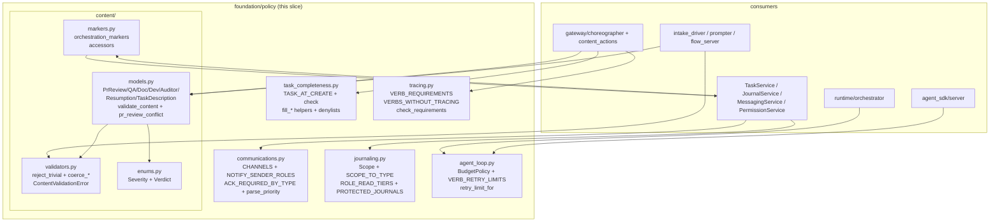

## Logical Tree
```
foundation/policy (misc slice)
  communications.py
    parse_priority()
    NOTIFY_SENDER_ROLES
    ACK_REQUIRED_BY_TYPE
    ChannelSpec (dataclass)
    CHANNELS
      cell: backend-cell, frontend-cell, uxui-cell
      cross-cell: dev-all, qa-all, pm-all, doc-all
      management: main-pm-board, board-private
      special: announcements (read-only-for-others), all-hands
  journaling.py
    Scope (note/decision/reflect/learning/struggle)
    SCOPE_TO_TYPE
    ReadTier (own/cell/cell_and_pms/all_cells/all)
    ROLE_READ_TIERS
    PROTECTED_JOURNALS
  task_completeness.py
    FieldRule / FieldRequirement / CompletenessSpec / CompletenessResult
    TaskCompletenessError
    DENYLIST_AC_PHRASES / DENYLIST_DESCRIPTION_PATTERNS
    TASK_AT_CREATE
    rule checkers (_check_*)
    check()
    fill_team_from_assignee / fill_priority_from_parent / fill_parent_from_active_task
  tracing.py
    Requirement (enum)
    GateContext / GateResult
    per-requirement checkers (_check_*)
    _CHECKERS dispatch
    check_requirements()
    VERB_REQUIREMENTS (i_will_work_on, i_will_plan, delegate, i_am_done, pass_review, fail_review, post_pr_review, pr_pass, pr_fail, i_documented, submit_up, submit_root, complete, unblock, escalate_up, escalate_to_ceo, i_am_blocked)
    VERBS_WITHOUT_TRACING
    requirements_for()
  agent_loop.py
    BudgetPolicy (dataclass) + DEFAULT_BUDGET
    VERB_RETRY_LIMITS
    UNLIMITED_RETRY_VERBS
    retry_limit_for()
  content/
    __init__.py (re-exports)
    enums.py: Severity, Verdict
    markers.py: HasMarkers, get/set/clear_marker, typed accessors per marker key, TRANSITION_NOTES
    models.py: _Base, _Content, Finding, WorkUnit, AcVerdict, PrReviewContent (+head_sha), pr_review_conflict, TaskDescription, ResumptionNote, DeveloperNote, QaNote, DocNote, AuditorNote, CONTENT_MODELS, validate_content, required_shape
    validators.py: BANNED_PHRASES, ContentValidationError, _all_tokens_filler, reject_trivial, coerce_to_list, coerce_str_list, _extract_strs, _extract_strs_from_dict
```

## Dependencies
- Internal: roboco.foundation.identity (Role, Team, CELL_TEAMS, team_for_slug), roboco.models.base (ChannelType, NotificationPriority, NotificationType, JournalEntryType)
- External: pydantic (BaseModel, ConfigDict, Field, ValidationError, ValidationInfo, field_validator), dataclasses (dataclass, field), enum (StrEnum), typing (Any, Literal, Protocol), collections.abc (Callable), re, string, contextlib

## Entry Points

| Name | File | Trigger |
|---|---|---|
| check (task_completeness) | roboco/foundation/policy/task_completeness.py:202 | Called by TaskService.create / PrompterService.create_task_from_draft / choreographer._impl._create_subtask_from_inputs at task construction |
| check_requirements (tracing) | roboco/foundation/policy/tracing.py:235 | Called by gateway choreographer (_impl/qa/doc/pr_gate/pr_review) before each gated verb's state transition |
| requirements_for (tracing) | roboco/foundation/policy/tracing.py:401 | Called by choreographer to resolve a verb's required-set; parity test iterates every intent verb |
| validate_content | roboco/foundation/policy/content/models.py:471 | Called by gateway content_actions / choreographer / prompter / intake_driver / flow_server when an agent submits a structured-content payload |
| retry_limit_for (agent_loop) | roboco/foundation/policy/agent_loop.py:97 | Called by agent_sdk/server per-verb circuit breaker on /verb/attempted |
| parse_priority (communications) | roboco/foundation/policy/communications.py:23 | Called by services/a2a.py + notification_delivery on A2A urgency resolution |
| markers accessors | roboco/foundation/policy/content/markers.py | Called by task.py, orchestrator, self_heal_engine, release_proposal, release_manager_engine whenever reading/writing orchestration_markers |

## Config Flags
- ROBOCO_AGENT_TOOL_CALL_WARN (consumed by agent_sdk, defaults from BudgetPolicy.tool_call_warn_at=50)
- ROBOCO_AGENT_TOOL_CALL_HALT (defaults tool_call_halt_at=150)
- ROBOCO_AGENT_LOOP_THRESHOLD (defaults loop_threshold=3)
- ROBOCO_AGENT_LOOP_WINDOW (defaults loop_window=10)
- ROBOCO_AGENT_LOOP_ACTION (defaults loop_action='halt')
- ROBOCO_PM_RESPAWN_MAX_UNPRODUCTIVE (defaults pm_respawn_max_unproductive=3)
- ROBOCO_PM_RESPAWN_MAX_TRACING_RESETS (defaults pm_respawn_max_tracing_resets=3)
- Note: BudgetPolicy holds canonical defaults; env overrides applied at consumer layer (agent_sdk/orchestrator), not in this slice


## Gotchas
- markers.py: set_marker REASSIGNS the dict (task.orchestration_markers = {...}) rather than mutating in place — a plain JSON column does not detect in-place mutation, so any caller that does om[key]=v directly bypasses SQLAlchemy dirty tracking. The accessors are the only safe write surface.
- markers.py clear_marker sets the column to None when the dict empties (line 59: `markers or None`); callers that later get_marker on None get the default — fine, but a read expecting an empty dict will get None instead.
- agent_loop.py VERB_RETRY_LIMITS is keyed by the MCP-EXPOSED verb names 'pass'/'fail', while tracing.VERB_REQUIREMENTS keys the same verbs as 'pass_review'/'fail_review' (IntentSpec internal names). The docstring flags this mismatch — a future change that renames one side without the other silently disables the circuit breaker for QA handoffs.
- tracing.py _check_journal_decision_at_claim reuses the journal_decision_present flag with no timing enforcement — the '_at_claim' timing is the caller's responsibility. A PM that records the decision AFTER i_will_plan would still pass the gate if the flag is set by the time check_requirements runs (write-then-gate ordering assumed, not verified).
- tracing.py _check_subtasks_terminal reads task._subtasks_all_terminal, a synthetic attribute the choreographer must set from a DB query before calling check_requirements. Forgetting to set it makes the gate fail with 'subtasks_terminal' (safe direction, but a false negative that blocks a legitimate submit).
- task_completeness.py check() uses getattr(task, req.field, None) — works for Pydantic models, dataclasses, and SimpleNamespace in tests, but a Task ORM row that hasn't refreshed a relationship may return None for a populated field, producing a false 'missing'.
- task_completeness.py _matches_denylist_description uses re.fullmatch on the lowercased STRIPPED text — a description like 'See Title.' (with trailing period) strips to 'see title.' and matches ^see title$; but 'See title for details' does NOT match (fullmatch), so the denylist only catches the exact placeholder, not prose containing it. Intentional, but easy to misread as a bypass.
- communications.py announcements uses read_only_for_others=True with silent_roles empty — the auditor's read on announcements comes via read_roles (_ALL_ROLES), not the silent bucket. Two different mechanisms for 'auditor reads silently' across channels (silent_roles on cell channels, read_roles on announcements/management) — a consumer that consults only silent_roles to decide auditor visibility will miss announcements/management.
- content/models.py PrReviewContent.head_sha is optional and stored in a JSON column (no migration) — render_markdown does NOT emit it; it is machine-only. A reader expecting the SHA in the rendered pr_reviewer_notes will not find it.
- content/validators.py reject_trivial raises ValueError (not ContentValidationError) so it composes inside Pydantic field validators; validate_content converts the aggregated ValidationError back to ContentValidationError. Calling reject_trivial outside a Pydantic validator context yields a bare ValueError, not the gateway-facing exception.
- content/models.py models use coerce_to_list (backstop) but NOT coerce_str_list; the SDK $text-wrapper flattening is done at the intake/flow boundary (intake_driver/flow_server/prompter). A caller that bypasses the intake boundary and hands a raw SDK-parsed list-of-dicts directly to validate_content will hit Pydantic str-coercion failure on dict items.
- journaling.py ROLE_READ_TIERS gives SECRETARY ReadTier.ALL (reads everything to advise the CEO) — broader than the panel/UI implies for a 'human-only chief-of-staff'; a code path that assumed secretary is isolated would leak every agent's journal to the secretary role.


## Drift from CLAUDE.md
- CLAUDE.md 'Agent learnings (note scope=learning) broadcast as knowledge-share notifications only to other agents — the human/human-driven roles (CEO, prompter, secretary) are excluded' is enforced in notification_delivery, NOT in this slice's journaling.py — journaling.py defines Scope.LEARNING but places no role exclusion on writing it. No drift in this slice, just noting the exclusion lives elsewhere.
- CLAUDE.md verb-surface table lists pr_reviewer verbs as 'claim_pr_review, post_pr_review, claim_gate_review, pr_pass, pr_fail'. tracing.VERB_REQUIREMENTS includes exactly post_pr_review/pr_pass/pr_fail with requirements; claim_* are in VERBS_WITHOUT_TRACING. Consistent — no drift.
- CLAUDE.md does not mention agent_loop.py VERB_RETRY_LIMITS / per-verb circuit breaker / pm_respawn_max_tracing_resets at all — additive, not drift, but the doc's 'Self-Healing & Feature Flags' and verb-surface sections under-document the circuit breaker that this slice owns.
- CLAUDE.md 'Auditor has silent read access to ALL channels' — communications.py (after 919aa7e2) implements this via read_roles on every channel (auditor is in read_roles of all 9 channels) and via silent_roles on cell/cross-cell channels; main-pm-board/board-private/announcements/all-hands have silent_roles empty. The end-state (auditor reads all, writes none) matches the claim; the mechanism is split across two fields. No drift.


## Changes Since Baseline

| SHA | Subject | Impact |
|---|---|---|
| 53d60da3 | Bunch of runtime fixes for MegaTask and other issues | Added coerce_str_list + _extract_strs to validators.py — new helper that flattens LLM XML-ish $text-wrapped list-of-strings fields to flat list[str] at the intake boundary (used by intake_driver/flow_server/prompter); prevents asyncpg DataError on VARCHAR[] and str(dict) in markdown |
| e202ce39 | Make main_pm + task_type=code impossible | Added PrReviewContent.issues (additive list[str] slot) + _coerce_issues validator + '## Issues' section in render_markdown — lets the in-path gate record free-text change-requests distinctly from structured findings |
| e52fd05d | submit_root: hard unchanged-PR gate stops the pr_fail re-submit loop | Added PrReviewContent.head_sha (optional str, JSON col → no migration) — captured on pr_fail so submit_root can hard-refuse a byte-identical re-submit; render_markdown does not emit it (machine-only) |
| 919aa7e2 | F090 drop auditor from write_roles on main-pm-board / board-private | Removed Role.AUDITOR from write_roles on main-pm-board and board-private in CHANNELS — closes the catalog-only enforcement path (HTTP messaging route validate_channel_access) that authorized an auditor write both the say/dm guard and PermissionService would block; auditor stays in read_roles (silent read unchanged) |
| cf7603f3 | register sync_branch in VERBS_WITHOUT_TRACING | Added 'sync_branch' to VERBS_WITHOUT_TRACING in tracing.py — fixes the parity-test failure (sync_branch is a git-only rebase+force-push with inline preconditions, mirrors open_pr); no tracing requirement |
| 3a4a3fe5 | reduce xenon C-rank blocks to A (behavior-preserving) | Extracted _extract_strs_from_dict helper from inline logic in validators._extract_strs — pure move-and-call refactor, no control flow / return values / side effects changed |

## Regression Risks

| Title | File:Line | Claim | Severity |
|---|---|---|---|
| Auditor dropped from write_roles may break catalog-derived seed/permission paths | roboco/foundation/policy/communications.py:237 | 919aa7e2 removed AUDITOR from write_roles on main-pm-board and board-private. Any consumer that previously derived 'auditor can write here' from the catalog (validate_channel_access, seed generation, CHANNEL_ACCESS mirror) now gets False. The fix aligns with the say/dm guard, but a seed-bootstrap or test that asserted auditor in write_roles will regress; and any path that cached the old CHANNEL_ACCESS dict derived from CHANNELS before this commit will be stale until re-derived. | medium |
| PrReviewContent.issues changes rendered pr_reviewer_notes markdown shape | roboco/foundation/policy/content/models.py:199 | e202ce39 added an '## Issues' section to render_markdown whenever issues is non-empty. Downstream readers/parsers of pr_reviewer_notes (or notes_structured.pr_review markdown mirror) that did not expect a second H2 section after Findings could mis-parse; the section ordering is Findings → Issues → Verdict, and a reader that took the first H2 as the body could drop the issues list. | medium |
| VERB_RETRY_LIMITS keyed by 'pass'/'fail' but tracing uses 'pass_review'/'fail_review' | roboco/foundation/policy/agent_loop.py:65 | The circuit-breaker keys ('pass','fail') are the MCP-exposed verb names, while VERB_REQUIREMENTS keys the same verbs as 'pass_review'/'fail_review'. The docstring flags this, but a future rename on either side without the other silently disables the per-verb retry cap for QA handoffs — the agent could retry-storm pass/fail without ever hitting circuit_open. No regression today, but a loaded footgun. | low |
| _extract_strs_from_dict refactor could change dict-without-text-key behavior | roboco/foundation/policy/content/validators.py:128 | 3a4a3fe5 extracted the inline dict-fallback into _extract_strs_from_dict. Behavior is intended to be identical, but the extracted helper now returns the bare-string-values list for ANY dict lacking a _TEXT_KEYS match — including a dict whose only values are non-str (returns []). Previously the same inline logic ran; verbatim move, so no real regression, but the helper is now reusable and a new caller could feed it a dict expecting different semantics. | low |
| sync_branch added to VERBS_WITHOUT_TRACING but not to VERB_RETRY_LIMITS | roboco/foundation/policy/tracing.py:396 | cf7603f3 registered sync_branch as tracing-exempt (correct, mirrors open_pr). sync_branch is also absent from VERB_RETRY_LIMITS and UNLIMITED_RETRY_VERBS in agent_loop.py, so retry_limit_for('sync_branch') falls back to DEFAULT_BUDGET.verb_retry_max_per_minute=3. open_pr has an explicit cap of 5 in VERB_RETRY_LIMITS. A network-flaky sync_branch (force-push) could hit the tighter default cap of 3/min and circuit_open sooner than open_pr — inconsistent with the 'mirror open_pr' intent stated in the commit. | low |
| PrReviewContent.head_sha optional field not surfaced in required_shape hints | roboco/foundation/policy/content/models.py:167 | e52fd05d added head_sha as an optional field. required_shape() (line 496) iterates model_fields and emits a type hint for EVERY field, so head_sha now appears in remediation shape hints for 'pr_review' even though it is machine-set by pr_gate, not agent-supplied. An agent receiving a remediation envelope that lists head_sha could attempt to set it, which is not the intended agent write-path. Minor confusion risk. | low |

## Health
This slice is in good shape: it is pure data + validators with no I/O or concurrency of its own, well-documented intent at each site, and a parity test guarding the tracing table against drift. The recent changes are small, additive, and mostly behavior-preserving (the 919aa7e2 auditor write-role removal is the only one that changes an enforced permission, and it aligns the catalog with the pre-existing guard — a tightening, not a loosening). The main latent risks are naming-convention footguns (agent_loop 'pass'/'fail' keys vs tracing 'pass_review'/'fail_review'; sync_branch missing from VERB_RETRY_LIMITS) and the split mechanism for auditor-silent-read across silent_roles vs read_roles — none are active bugs today but each is one rename or one new consumer away from silently degrading. The markers accessors correctly handle SQLAlchemy dirty tracking via dict reassignment, and the content models correctly delegate SDK-wrapper flattening to the intake boundary via coerce_str_list. No active regressions observed in the slice itself.

# models slice

## Purpose

The Pydantic/dataclass domain surface of RoboCo — the typed contract the API, services, orchestrator, and agent runtimes all speak. These are **not** the ORM tables (`roboco/db/tables.py` owns persistence); models here are request/response schemas, domain aggregates, runtime DTOs, and enums that get crossed into SQLAlchemy rows by the service layer. Validation (`RobocoBase`: `extra="forbid"`, `validate_assignment`, `use_enum_values`) lives here, and several files (`agents.py`, `runtime.py`, `optimal.py`, `metrics.py`, `llm.py`, `audit.py`, `dashboard.py`, `transcription.py`, `extraction.py`, `messaging.py`, `permissions.py`) are pure dataclasses/StrEnums with no Pydantic model at all — runtime value types the orchestrator and services pass around.

## Files

| Path | Role | approx LOC |
|------|------|------------|
| `__init__.py` | Public re-export surface (`Agent`, `Task`, `Session`, `Channel`, `Notification`, `Journal`, `CommitRef`, enums, `get_column_config`, …) | 149 |
| `base.py` | All shared StrEnums (`TaskStatus`, `TaskType`, `AgentStatus`, `ModelProvider`, `ChannelType`, `JournalEntryType`, …) + `RobocoBase`/`TimestampMixin` + `AgentRole`/`Team` aliases to `foundation.identity` | 275 |
| `task.py` | `Task` aggregate + `CommitRef`/`DocRef`/`ProgressUpdate`/`Checkpoint`/`SubTask`/`TaskPlan` + `TaskCreate`/`TaskUpdate`/`TaskCreateRequest` | 502 |
| `a2a.py` | A2A protocol wire models (`AgentCard`, `A2ATask`, `A2AMessage`, parts) + persistent conversation models (`A2AConversation`, `A2AChatMessage`) + state mappers | 592 |
| `agents.py` | Agent **runtime** domain types — per-role phase enums (`DevTaskPhase`, `QATaskPhase`, `CellPMPhase`, …), `AgentConfig`/`AgentState`, `TaskContext`/`ReviewContext`/`DocContext`, `AuditFlag`/`AuditReport` | 405 |
| `journal.py` | `Journal`/`JournalEntry` + 5 factory param dataclasses + `create_*_entry` factories + `JournalStats`/`GrowthMetrics` | 374 |
| `permissions.py` | `PermissionLevel` IntEnum, `ROLE_LEVELS` (built from `agents_config`), `AgentContext`, `COMMUNICATION_MATRIX`, `TASK_PERMISSIONS`, `KB_PERMISSIONS` | 284 |
| `optimal.py` | RAG domain types — `IndexType`, `SearchResult`/`SearchOutcome`/`RAGResponse`, `ErrorPattern`/`Decision`/`Standard`, `MentorResponse`, `CodeReviewResult` | 275 |
| `metrics.py` | `VelocityMetrics`/`BlockerMetrics`/`TeamMetrics`/`AgentMetrics` + v0.10.0 observability: `StageTiming`/`StageBottleneck`/`BottleneckReport`/`AgentReworkRate`/`ReworkReport`/`Scorecard` | 249 |
| `session.py` | `Session` + `SessionScope`/`SessionConfig`/`SessionTaskRelationshipType` + `SessionTaskLink` + create schemas | 214 |
| `events.py` | `EventType` StrEnum + `Event` dataclass (JSON round-trip) + `NotificationServiceProtocol`/`OrchestratorAccessProtocol`/`EventContext` DI container | 199 |
| `handoff.py` | `DocumenterHandoff` + `CodeSample`/`DocumentationItem`/`ConversationRef` + `HandoffCreate` (RESERVED — see file header) | 202 |
| `project.py` | `Project` + `BranchReason` + `ProjectCreate`/`ProjectUpdate` (CI-watch, dep-update, quality_command fields) | 178 |
| `agent.py` | `Agent` API model + `ModelConfig`/`AgentPermissions`/`AgentMetrics` + `AgentCreate`/`AgentUpdate` | 172 |
| `kanban.py` | `KanbanBoard`/`KanbanColumn`/`KanbanCard`/`KanbanSwimlane` + per-role column configs + `get_column_config` | 159 |
| `llm_catalog.py` | `CatalogEntry` + `MODEL_CATALOG`/`MODEL_CATALOG_BY_NAME`/`provider_type_for_model` + `OLLAMA_ROLE_DEFAULTS`/`OLLAMA_DEFAULT_MODEL` (Settings dropdown source of truth) | 132 |
| `message.py` | `ExtractedMessage` + `MessageEdit`/`RawStream` + `MessageCreate` | 137 |
| `runtime.py` | Orchestrator runtime types — `OrchestratorAgentState`, `SpawnGitContext`, `OrchestratorAgentConfig`, `AgentInstance`, `WaitingRecord`, `MODEL_MAP`, `ROLE_MODEL_MAP` | 128 |
| `transcription.py` | `StreamBuffer` (flush heuristic) + `TranscriptionConfig` | 119 |
| `llm.py` | `LLMUsage`/`ToonConfig`/`EncodedBlock`/`ToonMetrics` (token + TOON serialization metrics) | 118 |
| `notification.py` | `Notification` + `NotificationCreate` + `CreateNotificationParams` | 117 |
| `channel.py` | `Channel` + `ChannelCreate`/`ChannelUpdate` | 115 |
| `work_session.py` | `WorkSession` + `WorkSessionStatus` + `WorkSessionCreate`/`WorkSessionUpdate` | 117 |
| `pitch.py` | `Pitch` + `PitchStatus` + `PitchCreate` (Board proposal → provisioning) | 73 |
| `extraction.py` | `ExtractionContext`/`ExtractionResult`/`ExtractionConfig` | 68 |
| `product.py` | `Product` + `ProductCellMapping` (cell→Project map; validator enforces cell-only) + create/update DTOs | 69 |
| `messaging.py` | `ChannelCreateRequest`/`GroupCreateRequest`/`SessionCreateRequest`/`MessageCreateRequest` (service-layer DTOs) | 61 |
| `playbook.py` | `Playbook` + `PlaybookCreate`/`PlaybookUpdate` (curated procedure; `from_attributes` for ORM load) | 58 |
| `audit.py` | `AuditEventType` StrEnum + `PermissionDenialContext`/`StateTransitionDenialContext` dataclasses | 58 |
| `dashboard.py` | `FlagData`/`ReportData`/`ChannelFeedData`/`TeamHealthData`/`AuditQueueItem`/`CreateFlagParams`/`DashboardStorage` | 96 |
| `group.py` | `Group` (role-based chat container, hierarchy_level 0–4) + `GroupCreate`/`GroupUpdate` | 100 |
| `secretary.py` | `DirectiveKind`/`DirectiveStatus` StrEnums + `GATED_KINDS` frozenset | 41 |
| `README.md` | Architecture doc for the models package | ~250 |

## Key Symbols

| Name | Kind | File:Line | Responsibility |
|------|------|-----------|----------------|
| `Task` | Pydantic model | task.py:124 | Atomic unit of work; carries status, branch, PR, batch surface, ACs, gateway lock, structured notes |
| `TaskStatus` | StrEnum | base.py:31 | 15-state lifecycle (backlog→pending→claimed→…→completed/cancelled) |
| `TaskType` | StrEnum | base.py:63 | code/documentation/research/planning/design/administrative |
| `TaskNature` | StrEnum | base.py:74 | technical/non_technical |
| `CommitRef` | Pydantic model | task.py:31 | Git commit reference (hash/message/timestamp/author) |
| `DocRef` | Pydantic model | task.py:42 | Document reference with version + author trail |
| `TaskPlan` | Pydantic model | task.py:101 | Approach + ordered `SubTask`s + risks/open_questions |
| `TaskCreate` | Pydantic schema | task.py:342 | Request schema; `_exactly_one_target` validator (project_id / product_id / cell_projects) |
| `TaskCreateRequest` | dataclass | task.py:447 | Service-layer create params mirroring `TASK_AT_CREATE` (no silent defaults) |
| `Agent` | Pydantic model | agent.py:79 | API agent model (role, team, model config, permissions, metrics, journal_id) |
| `AgentRole` | alias | base.py:23 | `= identity.Role` — canonical Role enum lives in `foundation/identity` |
| `Team` | alias | base.py:24 | `= identity.Team` — canonical Team enum lives in `foundation/identity` |
| `ModelProvider` | StrEnum | base.py:197 | anthropic/ollama_cloud/openai/local/grok |
| `ModelConfig` | Pydantic model | agent.py:27 | provider + name + fallback + temperature + max_tokens |
| `AgentPermissions` | Pydantic model | agent.py:45 | can_notify + channels_read/write |
| `WorkSession` | Pydantic model | work_session.py:25 | Branch/PR/merge tracking for a (project, task, agent) work episode |
| `WorkSessionStatus` | StrEnum | work_session.py:17 | active/completed/abandoned |
| `Project` | Pydantic model | project.py:28 | Git repo config + CI/dep-update opt-ins + `assigned_cell` |
| `BranchReason` | StrEnum | project.py:18 | feature/bug/chore/docs/hotfix (branch-name prefixes) |
| `Session` | Pydantic model | session.py:90 | Bounded message group (time/count/length); `scope` for context loading |
| `SessionScope` | StrEnum | session.py:30 | initiative/cell/task |
| `SessionTaskLink` | Pydantic model | session.py:157 | Many-to-many session↔task with `is_primary` + relationship_type |
| `Channel` | Pydantic model | channel.py:24 | Top-level comms unit; members/writers/silent_observers |
| `ChannelType` | StrEnum | base.py:163 | cell/cross_cell/management/special |
| `Group` | Pydantic model | group.py:25 | Role-based chat container with hierarchy_level 0–4 |
| `ExtractedMessage` | Pydantic model | message.py:51 | Stored message with embedding, edit_history, mentions, task_id |
| `MessageType` | StrEnum | base.py:128 | reasoning/dialogue/decision/action/blocker/technical |
| `RawStream` | Pydantic model | message.py:32 | Ephemeral WebSocket chunk payload |
| `Notification` | Pydantic model | notification.py:26 | Formal signal requiring ACK; from/to_agents, acked_by, acked_at |
| `NotificationType` | StrEnum | base.py:139 | task_assignment/priority_change/blocker_escalation/review_request/…/a2a_request |
| `Journal` | Pydantic model | journal.py:75 | Agent's personal journal; entries_by_type, latest_summary |
| `JournalEntry` | Pydantic model | journal.py:25 | Reflection/learning/struggle/decision entry with embedding + `is_private` |
| `JournalEntryType` | StrEnum | base.py:172 | task_reflection/decision_log/learning/struggle/general |
| `Playbook` | Pydantic model | playbook.py:17 | Curated procedure (draft→approved/archived); `from_attributes` for ORM load |
| `PlaybookStatus` | StrEnum | base.py:112 | draft/approved/archived |
| `AuditEventType` | StrEnum | audit.py:13 | permission_denied/unauthorized_access/role_changed/pm_override/… |
| `A2ATask` | Pydantic model | a2a.py:265 | A2A protocol work unit (maps to internal TaskTable) |
| `A2AMessage` | Pydantic model | a2a.py:212 | A2A communication turn with `Part` union (text/file/data/artifact) |
| `AgentCard` | Pydantic model | a2a.py:103 | A2A agent discovery card (published at /.well-known/agent.json) |
| `A2AConversation` | Pydantic model | a2a.py:468 | Persistent agent-pair conversation (canonical agent_a<agent_b ordering) |
| `A2AChatMessage` | Pydantic model | a2a.py:512 | Stored A2A chat message (distinct from wire `A2AMessage`) |
| `A2ATaskState` | StrEnum | a2a.py:28 | submitted/working/completed/failed/cancelled/input_required/rejected/auth_required |
| `Event` | dataclass | events.py:81 | Event bus envelope with JSON round-trip + correlation_id |
| `EventType` | StrEnum | events.py:18 | task.*/session.*/agent.*/notification.*/rate_limit.*/usage.snapshot |
| `OrchestratorAgentState` | StrEnum | runtime.py:15 | offline/starting/active/waiting_short/waiting_long/idle/stopping |
| `AgentInstance` | dataclass | runtime.py:70 | Running Claude Code container record + `usage_session_id` |
| `SpawnGitContext` | dataclass | runtime.py:28 | Git context for spawn (project_slug, branch, `task_short_id` for worktree) |
| `MODEL_MAP` | dict | runtime.py:106 | short-name→full Claude id (opus→claude-opus-4-6, sonnet→claude-sonnet-5, haiku→…) |
| `MODEL_CATALOG` | tuple | llm_catalog.py:67 | Settings-dropdown source of truth; Anthropic entries derived from `MODEL_MAP` |
| `OLLAMA_ROLE_DEFAULTS` | dict | llm_catalog.py:107 | Per-role model for "pure Ollama" mode |
| `PermissionLevel` | IntEnum | permissions.py:15 | CEO=0/BOARD=1/MAIN_PM=2/CELL_PM=3/CELL_MEMBER=4/AUDITOR=99 |
| `COMMUNICATION_MATRIX` | dict | permissions.py:83 | Who can directly communicate with whom (role→role set) |
| `IndexType` | StrEnum | optimal.py:13 | code/documentation/conversations/journals/errors/standards/decisions/reviews/learnings/playbooks |
| `SearchResult` | dataclass | optimal.py:32 | RAG hit (content/source/score/index_type/metadata) |
| `RAGResponse` | dataclass | optimal.py:58 | RAG answer + citations + per-index stats |
| `BottleneckReport` | dataclass | metrics.py:160 | Cumulative dwell + parked-now per lifecycle stage |
| `ReworkReport` | dataclass | metrics.py:205 | Bounce rate to needs_revision by team/agent + rework_cost_usd |
| `Scorecard` | dataclass | metrics.py:227 | Fused per-agent/per-cell delivery scorecard |
| `Product` | Pydantic model | product.py:38 | Groups per-cell Project mapping for a repo topology |
| `ProductCellMapping` | Pydantic model | product.py:13 | One cell→Project assignment; validator enforces cell-only `Team` |
| `Pitch` | Pydantic model | pitch.py:43 | Board-authored product proposal → provisioning |
| `DirectiveKind` | StrEnum | secretary.py:13 | relay_message/update_charter/control_task/approve_pitch/announce |
| `GATED_KINDS` | frozenset | secretary.py:34 | High-impact directives that bounce back for CEO confirmation |
| `KanbanBoard` | Pydantic model | kanban.py:79 | Board view with columns/swimlanes; `get_column_config` per board_type |
| `DocumenterHandoff` | Pydantic model | handoff.py:69 | Dev→Doc handoff (RESERVED — not yet wired in service layer) |
| `RobocoBase` | Pydantic BaseModel | base.py:238 | Base config: `extra="forbid"`, `validate_assignment`, `use_enum_values` |
| `TimestampMixin` | Pydantic model | base.py:271 | `created_at`/`updated_at` mixin |
| `AgentConfig` | Pydantic model | agents.py:27 | Runtime agent config (distinct from API `Agent`); convenience `provider`/`model` props |
| `LLMUsage` | dataclass | llm.py:34 | Token accounting incl. cache creation/read |
| `StreamBuffer` | dataclass | transcription.py:13 | Stream accumulator with flush heuristic |

## Data Flow

API request bodies → Pydantic `*Create`/`*Update` schemas (validation boundary, `extra="forbid"`) → route handlers → services. Services translate between these models and the SQLAlchemy ORM tables in `roboco/db/tables.py` (e.g. `TaskTable`, `WorkSessionTable`, `ProjectTable`, `SessionTable`, `MessageTable`, `NotificationTable`, `JournalTable`, `JournalEntryTable`, `AgentTable`, `PlaybookTable`, `ProductTable`, `PitchTable`): the ORM row is the persistence shape; the Pydantic model is the contract shape. Several ORM tables load back into a model via `model_config = ConfigDict(from_attributes=True)` (`Playbook` at playbook.py:20, `Product`/`ProductCellMapping` via `RobocoBase`). Runtime-only DTOs (`AgentInstance`, `WaitingRecord`, `SpawnGitContext`, `Event`, `ExtractionResult`, `StreamBuffer`, the metrics/observability dataclasses, `AuditFlag`/`AuditReport`) never touch the DB directly — they are orchestrator/service in-process values. Enum parity between model and ORM is enforced by the test gate (`enum` columns in `tables.py` reference the same `StrEnum` classes from `base.py`/`foundation.identity`). `agent.py` `Agent` is the API/persistence model; `agents.py` `AgentConfig` is the runtime analogue used by the agent implementations — the comment at agents.py:7 calls this split out explicitly. Validation lives almost entirely on the Pydantic schemas (`min_length`, `ge`/`le`, `pattern`, `model_validator`); the dataclass models are intentionally validation-light.

## Mermaid

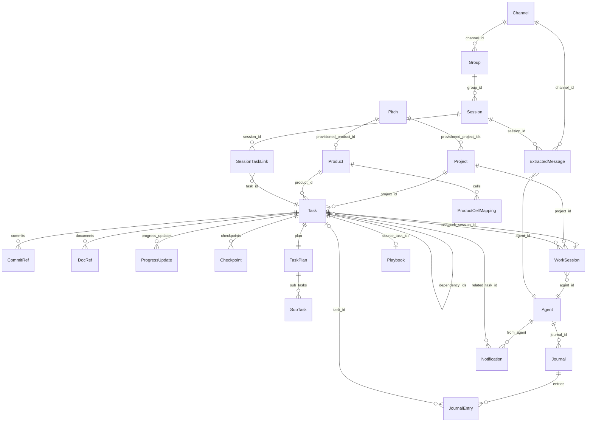

## Logical Tree

```
models/
├── tasks
│   ├── task.py            Task, TaskCreate, TaskUpdate, TaskCreateRequest, CommitRef, DocRef, ProgressUpdate, Checkpoint, SubTask, TaskPlan
│   ├── kanban.py          KanbanBoard, KanbanCard, KanbanColumn, KanbanSwimlane, column configs
│   ├── handoff.py         DocumenterHandoff, CodeSample, DocumentationItem, ConversationRef, HandoffCreate
│   └── product.py         Product, ProductCellMapping, ProductCreate, ProductUpdate
├── agents
│   ├── agent.py           Agent, AgentCreate, AgentUpdate, ModelConfig, AgentPermissions, AgentMetrics
│   ├── agents.py          AgentConfig, AgentState, DevTaskPhase/QATaskPhase/CellPMPhase/MainPMPhase/DocTaskPhase/ProductOwnerPhase/HeadMarketingPhase/AuditorPhase, TaskContext/ReviewContext/DocContext, AuditFlag, AuditReport
│   └── permissions.py     PermissionLevel, ROLE_LEVELS, AgentContext, COMMUNICATION_MATRIX, TASK_PERMISSIONS, KB_PERMISSIONS
├── comms
│   ├── session.py         Session, SessionScope, SessionConfig, SessionTaskLink, SessionTaskRelationshipType
│   ├── channel.py         Channel, ChannelCreate, ChannelUpdate
│   ├── group.py           Group, GroupCreate, GroupUpdate
│   ├── message.py         ExtractedMessage, MessageCreate, MessageEdit, RawStream
│   ├── messaging.py       ChannelCreateRequest, GroupCreateRequest, SessionCreateRequest, MessageCreateRequest
│   ├── notification.py    Notification, NotificationCreate, CreateNotificationParams
│   ├── a2a.py             AgentCard, A2ATask, A2AMessage, parts, A2AConversation, A2AChatMessage, state mappers
│   ├── extraction.py      ExtractionContext, ExtractionResult, ExtractionConfig
│   └── transcription.py   StreamBuffer, TranscriptionConfig
├── git / work-session
│   ├── work_session.py    WorkSession, WorkSessionStatus, WorkSessionCreate, WorkSessionUpdate
│   └── project.py         Project, BranchReason, ProjectCreate, ProjectUpdate
├── journal / audit
│   ├── journal.py         Journal, JournalEntry, JournalEntryCreate, factory params, create_*_entry, JournalStats, GrowthMetrics
│   ├── audit.py           AuditEventType, PermissionDenialContext, StateTransitionDenialContext
│   └── dashboard.py       FlagData, ReportData, ChannelFeedData, TeamHealthData, AuditQueueItem, DashboardStorage
├── llm
│   ├── llm.py             LLMUsage, ToonConfig, EncodedBlock, ToonMetrics
│   ├── llm_catalog.py     CatalogEntry, MODEL_CATALOG, provider_type_for_model, OLLAMA_ROLE_DEFAULTS, OLLAMA_DEFAULT_MODEL
│   └── runtime.py         OrchestratorAgentState, SpawnGitContext, OrchestratorAgentConfig, AgentInstance, WaitingRecord, MODEL_MAP, ROLE_MODEL_MAP
├── metrics
│   └── metrics.py         VelocityMetrics, BlockerMetrics, TeamMetrics, AgentMetrics, StageTiming, StageBottleneck, BottleneckReport, AgentReworkRate, TeamReworkRate, ReworkReport, Scorecard
├── optimal (RAG)
│   └── optimal.py         IndexType, SearchResult, SearchOutcome, RAGResponse, QueryContext, ErrorPattern, Decision, Standard, MentorResponse, CodeReviewResult, ValidationResult
├── events
│   └── events.py          EventType, Event, NotificationServiceProtocol, OrchestratorAccessProtocol, EventContext
├── company / strategy
│   ├── pitch.py           Pitch, PitchStatus, PitchCreate
│   ├── secretary.py       DirectiveKind, DirectiveStatus, GATED_KINDS
│   └── playbook.py        Playbook, PlaybookCreate, PlaybookUpdate
└── base
    └── base.py            RobocoBase, TimestampMixin, all shared StrEnums, AgentRole/Team aliases, Annotated ID types
```

## Dependencies

- **Pydantic** (`BaseModel`, `ConfigDict`, `Field`, `model_validator`, `field_validator`) — every `RobocoBase` subclass.
- **stdlib** `dataclasses`, `enum.StrEnum`, `datetime`, `uuid`, `typing` — the pure-dataclass files.
- **`roboco.foundation.identity`** — `base.py:21` imports `identity` and aliases `AgentRole = identity.Role`, `Team = identity.Team`. `product.py` and `pitch.py` import `CELL_TEAMS`/`Team` directly from `foundation.identity`.
- **`roboco.agents_config`** — `permissions.py:11` imports `ROLE_PERMISSION_LEVELS` to build `ROLE_LEVELS` at import time.
- **`roboco.models.runtime`** — `llm_catalog.py:22` imports `MODEL_MAP` to derive Anthropic catalog entries.
- **`roboco.models.session`** — `group.py:18` imports `SessionConfig`; `messaging.py:11` imports `SessionScope`.
- **`roboco.models.message`** — `extraction.py:12` imports `ExtractedMessage`.
- **`roboco.models.product`** — `task.py:24` imports `ProductCellMapping` (the `cell_projects` field).
- Internal cross-imports are otherwise minimal; `__init__.py` is the single aggregation point.

## Entry Points

- `from roboco.models import …` — the canonical import surface (`__init__.py` re-exports the API/Pydantic models + enums + `get_column_config`).
- Direct module imports for the dataclass-only files: `from roboco.models.runtime import AgentInstance, WaitingRecord, MODEL_MAP`, `from roboco.models.events import Event, EventType`, `from roboco.models.metrics import BottleneckReport, ReworkReport, Scorecard`, `from roboco.models.optimal import SearchResult, RAGResponse`, `from roboco.models.agents import AgentConfig, DevTaskPhase`, `from roboco.models.llm_catalog import MODEL_CATALOG, provider_type_for_model`.
- `roboco.models.base` — import `RobocoBase`, `TimestampMixin`, and any shared enum when building a new model.

## Config Flags

None — pure models, no flags. (The `Project` model *carries* opt-in fields `ci_watch_enabled`, `dep_update_command`, `dep_update_paths` that other layers gate on, and `llm_catalog` carries the "pure Ollama" defaults, but the models package itself reads no env / toggles nothing.)

## Gotchas

- `AgentRole` and `Team` are **not defined in `models/base.py`** — they are `identity.Role` / `identity.Team` aliased at base.py:23–24. The comment says "Removed in Phase 4 housekeeping after every consumer is migrated." SQLAlchemy `sa.Enum(AgentRole, name="agentrole")` still works because Python identity is preserved. New code should import from `roboco.foundation.identity` directly.
- `ProductCellMapping` deliberately overrides `use_enum_values=False` (product.py:22) so `team` stays a real `Team` enum for `is`-checks and the validator's `.value` error — the only model that deviates from `RobocoBase`'s `use_enum_values=True`.
- `Task` mutations are not done on the model; `task.py:329` directs callers to `TaskService` (`claim`, `start`, `block`, `complete`, …). Same pattern for `Session`, `Channel`, `Notification`, `Journal`, `WorkSession` — service-owned state.
- `TaskCreate` has **no silent defaults** for `task_type` / `nature` / `estimated_complexity` (task.py:342 docstring) — mirrors `foundation.policy.task_completeness.TASK_AT_CREATE`. The 2026-05-08 trace of agents omitting `task_type` and deadlocking the lifecycle is the reason.
- `TaskCreate._exactly_one_target` (task.py:396) enforces exactly one of `project_id` / `product_id` / `cell_projects`. Old callers passing `cell_projects` alongside either of the others now fail.
- The "one active WorkSession per task" invariant is **not** in the model — it's a DB partial-unique index (migration 047) + service-layer guard. The model alone won't stop you constructing two active `WorkSession`s.
- `handoff.py` is **RESERVED** (file header, handoff.py:7) — `DocumenterHandoff`/`HandoffStatus` are defined but not wired into the service layer; current flow uses `dev_notes` + `handoff_summary` on `Task`.
- `a2a.py` has two parallel model families: the **wire/protocol** models (`AgentCard`, `A2ATask`, `A2AMessage`, parts — A2A spec) and the **persistent** models (`A2AConversation`, `A2AChatMessage`, `A2AInboxSummary` — DB storage). `A2AMessage` (wire) ≠ `A2AChatMessage` (stored). `task_status_to_a2a_state` / `a2a_state_to_task_status` bridge RoboCo `TaskStatus` ↔ `A2ATaskState` (lossy — many states collapse to `WORKING`).
- `agents.py` `AgentState` (agents.py:81) is a **different** class from the API `Agent.status`/`AgentStatus` enum — runtime vs persistence. Same for `AgentConfig` vs `Agent`.
- `events.py` carries a `TYPE_CHECKING` import of `WaitingRecord` from `roboco.runtime.orchestrator` — a rare upward reference, kept out of runtime by the `Protocol` seam.
- `permissions.py` `ROLE_LEVELS` is built at import time from `agents_config.ROLE_PERMISSION_LEVELS`; entries that don't parse are silently skipped (`except (ValueError, KeyError): pass` at permissions.py:35).
- `llm_catalog.py` Anthropic entries are **derived from `runtime.MODEL_MAP`** — bumping a Claude id there updates the catalog automatically. Ollama Cloud entries are hand-maintained.
- `Playbook` uses `from_attributes=True` (playbook.py:20) to load from the ORM `PlaybookTable`; most other models do not (they're constructed explicitly).

## Drift from CLAUDE.md

- CLAUDE.md "Agent/Role/Team/ModelProvider in agent.py+base.py" — `Role` and `Team` are no longer *defined* in `base.py`; they are aliases to `roboco/foundation/identity.py` (base.py:21–24). The CLAUDE.md note about `ModelProvider` (`ANTHROPIC`/`GROK`/`LOCAL`/`OLLAMA_CLOUD`/`OPENAI` reserved) matches base.py:197–218 exactly.
- CLAUDE.md lists the `Task` model key fields (`task_type`, `project_id`, `branch_name`, `work_session_id`, `pr_number`, `pr_url`, `docs_complete`, `pr_created`, `commits: list[CommitRef]`) — all present on `Task` (task.py:155–247). CLAUDE.md does **not** mention `cell_projects` (task.py:171) or `batch_id`/`intends_to_touch`/`adds_migration`/`touches_shared` (task.py:217–228), which the MegaTask/sequencing sections elsewhere in CLAUDE.md do cover — so the model is ahead of the "Data Models" prose but consistent with the MegaTask section.
- CLAUDE.md "A task has at most one active WorkSession" — enforced by DB partial-unique index (migration 047) + service layer, not by the `WorkSession` model itself (work_session.py has no such constraint). Consistent with CLAUDE.md's "enforced both at the service layer and by a DB partial-unique index".
- The slice prompt named `AuditEvent` and `A2AEnvelope` as landmarks; the actual symbols are `AuditEventType` (audit.py:13, no `AuditEvent` class) and there is no `A2AEnvelope` in `a2a.py` (the gateway `Envelope` lives in `services/gateway/`, not here). Listed the real landmarks instead.
- Otherwise: `TaskStatus` 15-state enum, `TaskType` 6 values, `NotificationType`/`ChannelType`/`JournalEntryType` all match CLAUDE.md verbatim.

## Changes Since Baseline

Range `fd10cc862c2020b3f639cdb686d427b0198a2441..HEAD`, `git log -- roboco/models/` → 2 commits (both the same MegaTask per-cell project-map feature, PRs #283/#285). `git diff --stat`:

```
 roboco/models/llm_catalog.py | 30 +++++++++++++++---------------
 roboco/models/runtime.py     |  6 ++++++
 roboco/models/task.py        | 36 ++++++++++++++++++++++++++++++------
 3 files changed, 51 insertions(+), 21 deletions(-)
```

Logic-touching commits:

- **15effce0 / 3aff6e04 — "Chore: 141 Gaps fill-in (#283)" / "Chore: Close gaps (#285)"** (MegaTask per-cell project map + Ollama catalog refresh)
  - `task.py`: added `cell_projects: list[ProductCellMapping]` field to `Task` (task.py:171), `TaskCreate` (task.py:390), and `TaskCreateRequest` (task.py:482); imported `ProductCellMapping` from `product.py`; renamed `_project_or_product` → `_exactly_one_target` and widened from 2-way (`project_id`/`product_id`) to 3-way (`+ cell_projects`) with `sum(targets) != 1` rejection. Impact: a MegaTask root-subtask can now target an ad-hoc per-cell project map; old callers passing neither target still fail; callers passing `cell_projects` alongside another target now fail (previously silently passed because `cell_projects` didn't exist).
  - `runtime.py`: `SpawnGitContext` gained `task_short_id: str | None = None` (runtime.py:38) — the per-task worktree id the agent must edit in; branchless coordination roots leave it `None`. Impact: additive, backward-compatible.
  - `llm_catalog.py`: `glm-5.1:cloud` → `glm-5.2:cloud` in `MODEL_CATALOG` and `OLLAMA_ROLE_DEFAULTS`; role defaults reshuffled (`developer` minimax-m3 → kimi-k2.7-code, `cell_pm`/`main_pm`/`auditor` kimi-k2.6 → kimi-k2.7-code, `product_owner`/`head_marketing`/`ceo` kimi-k2.6 → glm-5.2, `documenter` glm-5.1 → kimi-k2.7-code); `OLLAMA_DEFAULT_MODEL` minimax-m3 → kimi-k2.7-code. Impact: catalog/UI labels + "pure Ollama" mode defaults only — **persisted `model_assignments` DB rows are not touched** (spawn model = persisted DB row, per the standing memory note), so an existing fleet doesn't silently switch models; only new "pure Ollama" provisioning picks the new defaults.

## Regression Risks

| Title | File:Line | Claim | Severity |
|-------|-----------|-------|----------|
| `TaskCreate._exactly_one_target` 3-way validator | task.py:396 | Tests/clients asserting the old 2-way error message ("a task needs either a project_id… or a product_id…") will fail against the new message ("a task needs exactly one target: … or cell_projects …"). Any caller that constructed a `TaskCreate` with both `project_id` and `product_id` was already rejected; callers passing `cell_projects` + another target are newly rejected. | Medium |
| `Task.cell_projects` requires migration 052 | task.py:171 | The `cell_projects` field exists on the model regardless of DB state, but persistence (`TaskTable.cell_projects` relationship + `task_cell_projects` table) needs migration 052. On a DB where 052 hasn't run, `TaskService.create` with a non-empty `cell_projects` will fail at insert. | Medium |
| `SpawnGitContext.task_short_id` consumer parity | runtime.py:38 | The field is additive with a `None` default, but every spawn-path consumer that should route the agent into the per-task worktree must read it; a missed consumer silently falls back to the clone root (the old behavior). | Low |
| Ollama catalog defaults vs persisted assignments | llm_catalog.py:107 | `OLLAMA_ROLE_DEFAULTS` / `OLLAMA_DEFAULT_MODEL` changed, but spawn reads persisted `model_assignments` rows — so the defaults only apply when no row exists. An operator who deletes the `model_assignments` rows (the documented "kill stale fleet model" procedure) will now get kimi-k2.7-code / glm-5.2 instead of minimax-m3 / kimi-k2.6. Verify the new tags actually work on the Ollama Cloud plan before relying on this. | Low |
| `ProductCellMapping` import cycle risk | task.py:24 | `task.py` now imports from `product.py` at module load. `product.py` imports only from `foundation.identity` and `base.py` — no cycle today, but a future `product.py` → `task.py` import would create one. | Low |
| `AgentRole`/`Team` alias removal pending | base.py:21–24 | The aliases to `foundation.identity` are a migration shim ("Removed in Phase 4 housekeeping"). Consumers still importing `AgentRole`/`Team` from `roboco.models.base` will break when the shim is removed. | Low |

## Health

The models package is coherent and well-layered: a single `RobocoBase` config drives consistency, enums are centralized in `base.py` (with the `AgentRole`/`Team` alias-to-`foundation.identity` migration clearly commented), and the API/Pydantic vs runtime/dataclass split is explicit (`agent.py` vs `agents.py`, with a docstring calling it out). The recent MegaTask per-cell-map change is small, additive, and validator-guarded; the main follow-on risk is migration 052 parity and test assertions on the renamed validator message — both mechanical. Two long-standing cleanliness items linger: `handoff.py` is a reserved-but-unwired model (file header says so), and several files (`dashboard.py`, `transcription.py`, `extraction.py`, `messaging.py`) are pure dataclasses that read as service-layer DTOs rather than domain models — harmless but slightly muddies the "models = typed contract surface" framing. Enum parity with the ORM (`tables.py`) is enforced by the test gate. No blocking issues; the package is in good shape.

# db-migrations slice

## Purpose
The DB layer is async SQLAlchemy 2.0 over PostgreSQL+asyncpg, with pgvector for the in-house RAG engine. Schema evolution is owned by an Alembic chain (001→052) that runs on every boot via `init_db()`; `Base.metadata.create_all` is no longer the source of truth — migration 017 reconciled the drift the other way. The ORM tables live in one fat module `roboco/db/tables.py` (~2.5k lines, 37 tables).

## Files

| Path | Role |
|------|------|
| `roboco/db/__init__.py` | Re-exports `Base`, session helpers, `bootstrap_database`, table classes. |
| `roboco/db/base.py` | `Base` (DeclarativeBase + naming convention), `get_engine`, `get_session_factory`, `get_db` (FastAPI dep), `get_db_context`, `run_migrations`, `init_db`, `_db_has_*` probes. Stamps a pre-Alembic DB at 001 then upgrades head. |
| `roboco/db/tables.py` | All 37 ORM table classes (single module). |
| `roboco/db/seed.py` | `bootstrap_database()` — runs `init_db` then seeds agents, channels, groups, initial messages. |
| `alembic/env.py` | Async Alembic env; imports `roboco.db.tables` to register metadata, overrides `sqlalchemy.url` from settings, `compare_type` + `compare_server_default` on. |
| `alembic.ini` | Standard config; `script_location=alembic`, `prepend_sys_path=.`, no URL (set in env.py). |
| `alembic/versions/` | 52 migration files 001..052 (two share number 026 — chained, not a collision). |

## Key Symbols

| Name | Kind | File:Line | Responsibility |
|------|------|-----------|----------------|
| `Base` | class | db/base.py:38 | DeclarativeBase + MetaData naming convention. |
| `get_engine` | fn | db/base.py:46 | Lazy singleton async engine (pool_pre_ping). |
| `get_db` | fn | db/base.py:70 | FastAPI async session dependency. |
| `get_db_context` | fn | db/base.py | Out-of-request async session context. |
| `init_db` | fn | db/base.py:180 | Boot entry: stamp pre-Alembic DB at 001 then `run_migrations`. |
| `run_migrations` | fn | db/base.py:141 | Runs `alembic upgrade head` via `command.upgrade` in a thread. |
| `bootstrap_database` | fn | db/seed.py:282 | `init_db` + seed default agents/channels/groups/messages. |
| `TaskTable` | class | tables.py:157 | Core task entity (largest table, drives lifecycle). |
| `WorkSessionTable` | class | tables.py:798 | Per-claim session; single-active enforced by 047 partial-unique index. |
| `AgentTable` | class | tables.py:95 | Agent identity, role, team, model provider assignment. |
| `ProjectTable` | class | tables.py:475 | Git repo config + CI/watch/dep-update/quality_command cols. |
| `AuditLogTable` | class | tables.py:1940 | Transition journey; `details` JSONB (010); composite query index (045). |
| `AgentSpawnSessionTable` | class | tables.py:2170 | Per-spawn token totals; feeds usage dashboard. |
| `ProjectConventionsCacheTable` | class | tables.py:2442 | Effective conventions map per (project, HEAD sha). |
| `PlaybookTable` | class | tables.py:721 | Curated procedures (draft→approved→indexed). |
| `RespawnTrackerTable` | class | tables.py:1902 | Durable PM-respawn circuit breaker mirror. |
| `TaskCellProjectTable` | class | tables.py:632 | Per-cell project map for a MegaTask root-subtask (052). |
| `WaitingRecordTable` | class | tables.py:1872 | Persisted dispatcher waiting records (restore at start). |
| `IndexedDocumentTable` | class | tables.py:1651 | RAG corpus docs (added to chain by 017). |
| `run_async_migrations` | fn | env.py | Async online migration runner (NullPool). |

## Migration Chain

| Num | File | What it adds/changes |
|-----|------|---------------------|
| 001 | 001_initial_schema.py | All initial tables (agents, tasks, work_sessions, channels, sessions, messages, notifications, journals, audit_log, a2a_*). |
| 002 | 002_persistence_tables.py | Persistence tables + `NotificationType.APPROVAL`. |
| 003 | 003_blocker_resolver_type.py | `tasks.blocker_resolver_type` + `blockerresolvertype` enum. |
| 004 | 004_provider_routing.py | `provider_configs` + `model_assignments`; `modelprovider`/`assignmentscope` enums (create_type=False). |
| 005 | 005_blocker_raised_by.py | `tasks.blocker_raised_by`. |
| 006 | 006_gateway_columns.py | Gateway cols: claimant lock, heartbeat, pre-block snapshot, AC status, qa evidence flag. |
| 007 | 007_gateway_triggers_table.py | `gateway_triggers` (dispatcher decision log). |
| 008 | 008_align_skills.py | No-op (skills alignment done statically). |
| 009 | 009_enum_reconcile.py | Reconcile every postgres enum with ORM StrEnum (lowercase) + new members. |
| 010 | 010_audit_log_details_jsonb.py | `audit_log.details` JSON→JSONB. |
| 011 | 011_drop_quarantined_state.py | Drop `quarantined` from taskstatus enum (phantom state, audit D15). |
| 012 | 012_align_agentrole_foundation.py | Add agentrole/team enum values foundation declares. |
| 013 | 013_drop_role_enum.py | Drop stray `role` enum (smoke run 2). |
| 014 | 014_drop_pm_approvals.py | Drop unused `tasks.pm_approvals`. |
| 015 | 015_drop_task_execution_outputs.py | Drop unused `execution_log`/`outputs`. |
| 016 | 016_add_products_and_task_product_id.py | `products` + `product_projects`; `tasks.product_id` (team enum create_type=False). |
| 017 | 017_reconcile_orm_schema_drift.py | Add ORM tables/columns the chain never had (e.g. `indexed_documents`). |
| 018 | 018_task_project_id_nullable.py | `tasks.project_id` nullable (board/fan-out tasks carry product_id). |
| 019 | 019_seed_default_providers.py | Idempotent seed of default model providers. |
| 020 | 020_backfill_enum_values.py | Backfill ORM enum values the chain never added. |
| 021 | 021_task_board_review_complete.py | `tasks.board_review_complete` (board-review handoff flag). |
| 022 | 022_default_branch_master.py | Flip `projects.default_branch` default `main`→`master`. |
| 023 | 023_prompter_tracking_columns.py | `tasks.source` + `confirmed_by_human` (prompter origin). |
| 024 | 024_add_prompter_tables.py | `prompter_sessions`, `prompter_messages`, `task_drafts`. |
| 025 | 025_agentrole_prompter.py | Add `prompter` to agentrole enum. |
| 026a | 026_completed_dependency_ids.py | `tasks.completed_dependency_ids`. |
| 026b | 026_token_usage_tables.py | `agent_spawn_sessions` + `token_usage_snapshots` (chained off 026a). |
| 027 | 027_system_settings.py | `system_settings` key-value store. |
| 028 | 028_seed_self_hosted_provider.py | Seed Self-Hosted (Ollama LOCAL) provider row. |
| 029 | 029_project_quality_command.py | `projects.quality_command` (fast pre-submit gate). |
| 030 | 030_rag_chunks_content_schema.py | Align RAG chunk tables with vector-store schema. |
| 031 | 031_rag_chunks_fulltext.py | tsvector + GIN index on every chunk table (hybrid retrieval). |
| 032 | 032_company_goals.py | `company_goals` singleton charter. |
| 033 | 033_pitches.py | `pitches` (Board proposals → auto-provision). |
| 034 | 034_agentrole_secretary.py | Add `secretary` to agentrole enum. |
| 035 | 035_secretary_directives.py | `secretary_directives` (command audit + gate queue). |
| 036 | 036_ac_ids_and_parent_refs.py | Per-criterion AC ids + child→parent AC linkage. |
| 037 | 037_agentrole_pr_reviewer.py | Add `pr_reviewer` to agentrole enum. |
| 038 | 038_modelprovider_grok.py | Add `grok` to modelprovider enum. |
| 039 | 039_seed_grok_provider.py | Seed Grok (xAI) provider row. |
| 040 | 040_awaiting_pr_review.py | Add `awaiting_pr_review` to taskstatus enum (PR-review gate). |
| 041 | 041_structured_content_columns.py | `pr_reviewer_notes`, machine-marker split, structured content cols. |
| 042 | 042_worksession_toolchain.py | `work_sessions` toolchain matching cols. |
| 043 | 043_conventions_cache.py | `project_conventions_cache`. |
| 044 | 044_convention_findings.py | `project_convention_findings` (violations feed). |
| 045 | 045_observability_rework.py | `tasks.revision_count` + audit_log composite query index. |
| 046 | 046_batch_intake.py | `tasks.batch_id` + collision descriptors (intends_to_touch, adds_migration, touches_shared). |
| 047 | 047_ws_single_active.py | Partial-unique index: one ACTIVE work_session per task. |
| 048 | 048_ci_watch_project_cols.py | Per-project CI-watch opt-in cols. |
| 049 | 049_dep_update_project_cols.py | Per-project dep-update bot opt-in cols. |
| 050 | 050_playbooks.py | `playbooks` table (curated procedures). |
| 051 | 051_respawn_tracker.py | `respawn_tracker` (durable PM-respawn counter). |
| 052 | 052_task_cell_projects.py | `task_cell_projects` (per-cell project map for MegaTask root-subtask; reuses team enum create_type=False). |

## Data Flow
On boot, `init_db()` probes for application tables and `alembic_version`; if a pre-Alembic DB exists it stamps it at revision 001, then always runs `run_migrations()` → `alembic upgrade head` (in a thread via `asyncio.to_thread`). `env.py` imports `roboco.db.tables` so `Base.metadata` is fully populated, overrides `sqlalchemy.url` from `settings.database_url`, and runs online with an async NullPool engine. `compare_type` + `compare_server_default` are on so autogenerate drift is detectable. `tables.py` classes are the ORM mapping the migrations build; the domain layer reads them through `roboco/models/` dataclasses, not the tables directly.

## Mermaid


## Logical Tree

```
Migration chain 001..052
├── Initial schema
│   └── 001 initial schema (agents, tasks, work_sessions, channels, sessions, messages, notifications, journals, audit_log, a2a_*)
├── Persistence
│   └── 002 persistence tables + NotificationType.APPROVAL
├── Blocker metadata
│   ├── 003 blocker_resolver_type + blockerresolvertype enum
│   └── 005 blocker_raised_by
├── Provider routing & model assignments
│   ├── 004 provider_configs + model_assignments (modelprovider/assignmentscope enums)
│   ├── 019 seed default model providers
│   ├── 028 seed Self-Hosted (Ollama LOCAL) provider
│   ├── 038 add grok to modelprovider enum
│   └── 039 seed Grok (xAI) provider
├── Gateway
│   ├── 006 gateway columns (claimant lock, heartbeat, pre-block snapshot, AC status, qa evidence)
│   └── 007 gateway_triggers (dispatcher decision log)
├── Enum reconcile / widening
│   ├── 009 reconcile postgres enums with ORM StrEnum
│   ├── 011 drop quarantined from taskstatus enum
│   ├── 012 align agentrole/team enums with foundation
│   ├── 013 drop stray role enum
│   ├── 020 backfill ORM enum values
│   ├── 025 add prompter to agentrole enum
│   ├── 034 add secretary to agentrole enum
│   └── 037 add pr_reviewer to agentrole enum
├── Audit log
│   ├── 010 audit_log.details JSON→JSONB
│   └── 045 tasks.revision_count + audit_log composite query index
├── Cleanup / drops
│   ├── 014 drop unused tasks.pm_approvals
│   ├── 015 drop unused execution_log/outputs
│   └── 008 no-op (skills alignment done statically)
├── Products
│   ├── 016 products + product_projects; tasks.product_id (team enum create_type=False)
│   └── 018 tasks.project_id nullable
├── ORM drift reconcile
│   └── 017 add ORM tables/columns the chain never had (indexed_documents)
├── Board review
│   └── 021 tasks.board_review_complete
├── Project defaults
│   └── 022 flip projects.default_branch default main→master
├── Prompter tracking
│   ├── 023 tasks.source + confirmed_by_human
│   └── 024 prompter_sessions, prompter_messages, task_drafts
├── Dependency / token usage
│   ├── 026a tasks.completed_dependency_ids
│   └── 026b agent_spawn_sessions + token_usage_snapshots (chained off 026a)
├── System settings
│   └── 027 system_settings key-value store
├── Project quality
│   └── 029 projects.quality_command (fast pre-submit gate)
├── RAG
│   ├── 030 align RAG chunk tables with vector-store schema
│   └── 031 tsvector + GIN index on chunk tables (hybrid retrieval)
├── Strategy / provisioning
│   ├── 032 company_goals singleton charter
│   └── 033 pitches (Board proposals → auto-provision)
├── Secretary
│   └── 035 secretary_directives (command audit + gate queue)
├── Acceptance criteria
│   └── 036 per-criterion AC ids + child→parent AC linkage
├── PR review
│   ├── 040 add awaiting_pr_review to taskstatus enum
│   └── 041 pr_reviewer_notes, machine-marker split, structured content cols
├── Worksession toolchain
│   └── 042 work_sessions toolchain matching cols
├── Conventions standard
│   ├── 043 project_conventions_cache
│   └── 044 project_convention_findings (violations feed)
├── MegaTask / batch intake
│   ├── 046 tasks.batch_id + collision descriptors
│   └── 052 task_cell_projects (per-cell project map for MegaTask root-subtask)
├── WorkSession single-active
│   └── 047 partial-unique index: one ACTIVE work_session per task
├── Autonomous maintenance
│   ├── 048 per-project CI-watch opt-in cols
│   └── 049 per-project dep-update bot opt-in cols
├── Organizational memory
│   └── 050 playbooks table (curated procedures)
└── Orchestrator runtime durability
    └── 051 respawn_tracker (durable PM-respawn counter)
```

## Dependencies
- PostgreSQL 15+ (NULLS NOT DISTINCT) — actually pgvector image on PG 16.
- `pgvector` extension for RAG cosine similarity (`chunks_*` tables, `indexed_documents`).
- `asyncpg` driver; SQLAlchemy 2.0 async.
- Alembic; migrations run on every orchestrator boot.

## Entry Points
- `init_db()` / `run_migrations()` in `roboco/db/base.py` — boot-time `alembic upgrade head`.
- `bootstrap_database()` in `roboco/db/seed.py` — init + seed.
- `alembic upgrade head` (manual, in orchestrator container).
- `conftest` (tests) — ephemeral DB per test; runs migrations or `create_all` depending on PG availability.

## Config Flags
- `ROBOCO_DATABASE_*` (host/port/user/password/name) — `settings.database_url`.
- `ROBOCO_DATABASE_ECHO`, pool size/timeout/recycle.
- No DB-specific feature flag; migrations always run. Feature flags (`ROBOCO_CONVENTIONS_ENABLED`, `ROBOCO_CI_WATCH_ENABLED`, `ROBOCO_DEP_UPDATE_ENABLED`, `ROBOCO_RELEASE_MANAGER_ENABLED`, `ROBOCO_ORG_MEMORY_ENABLED`) gate *use* of tables the migrations already added.

## Gotchas
- **`sa.Enum(create_type=False)` is silently ignored** — the flag only works on `postgresql.ENUM`, not generic `sa.Enum`. Using `sa.Enum` re-emits CREATE TYPE and fails with "type already exists". 001/016/052 carry the live gotcha comment; 004/016 use the correct `postgresql.ENUM(create_type=False)`. 001 itself uses `sa.Enum(..., create_type=False)` in spots — latent on a clean re-apply.
- **Enum-parity gate can false-green** — `make quality` runs `scripts/verify_postgres_enums.py` only against a migrated DB; an empty `roboco` DB (conftest ephemeral) or `|| echo` masking hides drift. Fixed in 957fb522 but the gate is only as good as the DB it points at.
- **016 latent** — the `team` enum member list under create_type=False is the *original* set, not the later-widened set; inert but misleading.
- **Two files numbered 026** — not a collision: `026_token_usage_tables` chains off `026_completed_dependency_ids`. Renaming is risky (breaks down_revision refs).
- **052 reuses the `team` enum** with `create_type=False` correctly — no new enum added; safe.
- **017 reconciled drift the other way** — added ORM tables the chain had missed; `create_all` is no longer authoritative.

## Drift from CLAUDE.md
- CLAUDE.md says "52 migrations 001..052" — correct, but does not mention the two 026 files (chained, not a conflict).
- CLAUDE.md cites migrations 043/046/047/048/049/050/051 by number in feature sections — all present and consistent.
- No factual drift found in the DB layer description.

## Changes Since Baseline
`git log fd10cc862c2020b3f639cdb686d427b0198a2441..HEAD -- alembic/ roboco/db/`:
- `15effce0` Chore: 141 Gaps fill-in (#283) — adds migration 052 (`task_cell_projects`) + `TaskCellProjectTable`; logic-touching.

(Only one commit in range touches these paths.)

## Regression Risks

| Title | File:Line | Claim | Severity |
|-------|-----------|-------|----------|
| sa.Enum create_type silently dropped | alembic/versions/001_initial_schema.py:127,312 | 001 uses `sa.Enum(..., create_type=False)` which is a no-op on the generic Enum; a fresh re-apply on a clean DB can double-emit CREATE TYPE. | High |
| Enum-parity gate false-green | Makefile:540 + scripts/verify_postgres_enums.py | Gate skips on no-migrated-DB; an empty/mismatched `roboco` DB hides postgres-enum drift until a smoke run. | High |
| 016 team enum stale member list | alembic/versions/016_add_products_and_task_product_id.py:38 | `postgresql.ENUM(create_type=False)` member list is frozen at the original set; inert but masks later widening. | Medium |
| Missing pgvector extension blocks RAG | roboco/db/tables.py (chunks_*/indexed_documents) | Migrations assume pgvector installed; on a plain PG the vector columns fail and init_db aborts. | High |
| Two 026 files — rename hazard | alembic/versions/026_*.py | Renaming either 026 file breaks `down_revision` chain; autogenerate may mis-order. | Medium |
| 047 partial-unique index assumes single-active | alembic/versions/047_ws_single_active.py | A duplicate ACTIVE session raises on the partial-unique index; service-layer guard must run first or claim crashes. | Medium |
| 052 reuses team enum — order-dependent | alembic/versions/052_task_cell_projects.py:44 | Depends on `team` enum already existing (from 001/016); a partial chain replay to 052 without 016 would fail. | Low |
| Single-head violation on re-apply | alembic/versions/017_reconcile_orm_schema_drift.py | 017 adds tables/columns that `create_all` had created; on a DB built by `create_all` then stamped, 017 may double-create. | Medium |

## Health
The chain is linear and complete (001→052), with `init_db` running `upgrade head` on every boot so deployed schemas stay current. The two structural risks are the `sa.Enum(create_type=False)` no-op in 001 (latent on clean re-applies) and the enum-parity gate's dependence on a populated migrated DB. New migrations consistently use the `postgresql.ENUM(create_type=False)` pattern and `ALTER TYPE ... ADD VALUE IF NOT EXISTS` for enum widening, so recent additions are safe.

# RoboCo Slice Map — `api-core-websocket`

Slice key: `api-core-websocket` Repo root: `/Users/renzof/Documents/GitHub/ZZZ/roboco-master/roboco` Baseline commit: `fd10cc862c2020b3f639cdb686d427b0198a2441` Head: `15effce0` (2026-06-29, "Chore: 141 Gaps fill-in (#283)")

## Purpose

The FastAPI application shell, request pipeline, and real-time WebSocket fan-out layer for RoboCo. `app.py` builds the ASGI app, wires ~40 route routers, and runs the async lifespan (DB migrations, feature-flag overlay, transcription/extraction/RAG/learning service init, ordered shutdown). `middleware.py` adds correlation IDs, request logging, and a full exception-handler chain mapping domain/service/HTTP errors to structured JSON. `websocket.py` + `websocket_bridge.py` own the live panel streams (channels, agents, sessions, notifications, system) with per-connection bounded send queues and an event-bus bridge. `deps.py` is the dependency-injection spine: agent header auth, role-gate helpers, and Choreographer/ContentActions wiring. `utils/` provides route-layer error factories and get-or-404/ownership helpers. `middleware_docs.py` enforces the docs-path permission matrix.

## Files

| Path | Role | approx LOC |
|------|------|-----------|
| `roboco/api/app.py` | FastAPI app factory + async lifespan (startup/shutdown ordering) | ~490 |
| `roboco/api/deps.py` | DI: agent header auth, role gates, Choreographer/ContentActions builders, pagination | ~611 |
| `roboco/api/middleware.py` | Correlation-id + request-logging middleware, exception handlers, 422 secret-scrub + UUID remediation | ~469 |
| `roboco/api/middleware_docs.py` | Docs-path access-control matrix (read/write per role/team/slug) | ~330 |
| `roboco/api/websocket.py` | WS routes + ConnectionManager with bounded per-connection send queues, panel-token gate, idle timeout | ~692 |
| `roboco/api/websocket_bridge.py` | Event-bus → WS forwarders (notifications, sessions, **messages**, agents, rate-limit, usage) | ~252 |
| `roboco/api/utils/__init__.py` | Re-export surface for error factories + resource helpers | ~43 |
| `roboco/api/utils/errors.py` | HTTPException factories + `handle_service_error` + `service_error_handler` decorator | ~214 |
| `roboco/api/utils/resources.py` | `get_or_404`, `get_by_field_or_404`, `require_ownership`/`require_recipient`/`require_membership` | ~180 |
| `roboco/api/__init__.py` | Deliberately does NOT re-export `app` (circular-import guard, documented) | ~14 |

## Key Symbols

| Name | Kind | File:Line | Responsibility |
|------|------|-----------|----------------|
| `lifespan` | async ctx mgr | app.py:82 | Startup: migrations, flag overlay, transcription/extraction/optimal/learning init; Shutdown: stop orchestrator BEFORE close_db, then close optimal, then DB |
| `create_app` | func | app.py:196 | Build FastAPI, add CORS + custom middleware, mount ~40 routers + ws_router at `/ws` |
| `app` | module attr | app.py:489 | The default ASGI instance (`roboco.api.app:app` entrypoint) |
| `_AppServices` | class | app.py:74 | Holder for transcription/extraction singletons set in lifespan |
| `DbSession` | type alias | deps.py:46 | `Annotated[AsyncSession, Depends(get_db)]` |
| `resolve_agent_id` | func | deps.py:49 | Resolve UUID-or-slug → UUID, 400 on miss |
| `_ServiceHolder` | class | deps.py:74 | Singleton store for PermissionService + orchestrator |
| `set_orchestrator`/`clear_orchestrator`/`get_orchestrator`/`get_orchestrator_or_none` | funcs | deps.py:91-119 | Global orchestrator accessors; `get_orchestrator` 503s when unset, `_or_none` used by shutdown |
| `get_current_agent_id`/`get_current_agent_slug`/`get_optional_agent_id` | funcs | deps.py:125-208 | Header-based agent identity (UUID or slug) |
| `_auth_required` | func | deps.py:211 | Reads `ROBOCO_AGENT_AUTH_REQUIRED` env |
| `_check_agent_auth_token` | func | deps.py:217 | HMAC token enforcement (required in prod, optional-but-verified in dev) |
| `require_panel_token` | func | deps.py:251 | CEO-HMAC gate for live-chat bridges (HTTP analog of WS gate) |
| `_resolve_agent_identity` | func | deps.py:277 | Returns `(agent_id, slug)`, special-casing `system` role |
| `_coerce_agent_role`/`_coerce_agent_team` | funcs | deps.py:298/324 | Parse role/team headers with DB fallback for role |
| `get_agent_context` | func | deps.py:333 | Builds `AgentContext` from X-Agent-* headers + token |
| `require_pm_or_above`/`require_developer_or_above`/`require_cell_access` | funcs | deps.py:403/412/427 | Coarse role-gate guards (403) |
| `require_channel_read`/`require_channel_write`/`require_notification_permission`/`require_task_action` | dep factories | deps.py:442/470/490/508 | PermissionService-backed dependency factories |
| `get_choreographer`/`get_content_actions` | funcs | deps.py:545/575 | Build Choreographer / ContentActions with all service deps + orchestrator/bus |
| `get_pagination` | func | deps.py:599 | Clamp limit 1-100, offset ≥0 |
| `CorrelationIdMiddleware` | class | middleware.py:54 | X-Correlation-ID in/out + structlog bind |
| `RequestLoggingMiddleware` | class | middleware.py:96 | Log request/response + `X-Response-Time-Ms` header |
| `get_status_code`/`roboco_exception_handler`/`service_exception_handler`/`rate_limit_exception_handler`/`generic_exception_handler`/`http_exception_handler`/`request_validation_handler` | funcs | middleware.py:143-441 | Exception → structured JSONResponse chain |
| `_SERVICE_ERROR_STATUS` | const | middleware.py:191 | Maps service exception types → HTTP status |
| `_uuid_field_remediation` | func | middleware.py:343 | Actionable hint when an agent sends an 8-char task prefix as UUID |
| `_SECRET_FIELD_NAMES`/`_scrub_secrets` | const/func | middleware.py:372/389 | Redact credential fields from 422 log bodies |
| `setup_middleware` | func | middleware.py:444 | Register exception handlers + middleware in order |
| `DOCS_PERMISSIONS` | const | middleware_docs.py:55 | Path-prefix → read/write role matrix |
| `check_docs_access`/`require_docs_access`/`get_allowed_docs_paths` | funcs | middleware_docs.py:222/265/303 | Docs path permission checks |
| `_fast_path_access_decision` | func | middleware_docs.py:203 | CEO/auditor/main_pm short-circuit |
| `ConnectionManager` | class | websocket.py:82 | Tracks all WS subscriptions + per-connection send queues |
| `_ClientConnection` | class | websocket.py:45 | Bounded outbound queue + sender task holder |
| `manager` | singleton | websocket.py:334 | Global ConnectionManager |
| `_require_panel_token` | func | websocket.py:61 | WS upgrade CEO-HMAC gate (returns False to close) |
| `validate_agent_exists` | func | websocket.py:337 | DB existence check for claimed agent_id |
| `_register_sender`/`_run_sender`/`_enqueue_or_send`/`_send_with_timeout` | methods | websocket.py:122/129/244/270 | Non-blocking fan-out plumbing |
| `connect_channel`/`connect_agent`/`connect_session`/`connect_notifications`/`connect_system` | methods | websocket.py:158-212 | Accept + register per stream type |
| `disconnect` | method | websocket.py:214 | Remove socket from all sets + cancel sender task |
| `broadcast_to_channel`/`broadcast_to_agent_watchers`/`broadcast_to_session`/`broadcast_system` | methods | websocket.py:283-322 | Fan-out enqueues |
| `channel_stream`/`agent_stream`/`session_stream`/`notification_stream`/`system_stream` | routes | websocket.py:360/428/493/556/608 | WS endpoints under `/ws` |
| `broadcast_agent_chunk`/`broadcast_notification` | funcs | websocket.py:650/665 | Helper broadcasters for external callers |
| `IDLE_TIMEOUT_SECONDS`/`MAX_SEND_QUEUE`/`SEND_TIMEOUT_SECONDS` | consts | websocket.py:35/41/42 | 90s / 256 / 10s tunables |
| `register_websocket_bridge_handlers`/`start_websocket_bridge` | funcs | websocket_bridge.py:169/203 | Subscribe bus handlers |
| `_handle_notification_sent`/`_handle_session_event`/`_handle_message_event`/`_handle_agent_event`/`_handle_rate_limit_event`/`_handle_usage_event` | funcs | websocket_bridge.py | Event-bus → WS forwarders (`_handle_message_event` fans `MESSAGE_SENT` to `/ws/sessions` + `/ws/channels` as a `message.new` frame) |
| `_RATE_LIMIT_WS_TYPES`/`_USAGE_WS_TYPES` | consts | websocket_bridge.py:18/23 | EventType → panel `type` string maps |
| `not_found`/`forbidden`/`unauthorized`/`validation_error`/`conflict`/`service_unavailable` | funcs | utils/errors.py:29-142 | HTTPException factories |
| `handle_service_error`/`service_error_handler` | func/deco | utils/errors.py:150/191 | ServiceError → HTTPException translation |
| `get_or_404`/`get_by_field_or_404` | funcs | utils/resources.py:17/59 | Generic get-or-404 helpers |
| `require_ownership`/`require_recipient`/`require_membership` | funcs | utils/resources.py:96/130/156 | Authorization checks |

## Data Flow

**HTTP request**: nginx → ASGI `app` → `CorrelationIdMiddleware` (binds correlation_id + path/method to structlog) → `RequestLoggingMiddleware` (start timer) → route. Route resolves `CurrentAgentContext` via `get_agent_context` (headers + HMAC verify + identity/role/team resolution), plus service deps from `get_choreographer`/`get_content_actions`. On exception, the handler chain maps: `RequestValidationError` → 422 (scrubbed log + UUID remediation hint), `HTTPException` → standardized error code, `RobocoError` → domain status, `ServiceError` → parallel-hierarchy status, `RateLimitError` → 429 + `Retry-After`, `Exception` → 500. Response gains `X-Correlation-ID` + `X-Response-Time-Ms`.

**Lifespan startup**: `init_db` (alembic upgrade + create_all fallback) → `apply_persisted_feature_flags` (panel settings overlay, best-effort) → `TranscriptionService.start()` + `ExtractionPipeline` → `get_optimal_service()` (BLOCKS 30-90s for RAG) → `LearningPropagationService.initialize(optimal)`. `app.state.*` holds singletons. **Shutdown**: stop orchestrator (drains bg DB writes) → `close_optimal_service` → `close_db`. The orchestrator-stop-before-DB order is load-bearing.

**WebSocket**: panel → `wss://.../ws/{kind}/{id}` → `_require_panel_token` (CEO HMAC, except `/ws/system`) → query-param `agent_id`/`viewer_id` UUID parse (+ DB existence check for agent/session/notifications) → `manager.connect_*` accepts, registers in subscription set, spawns per-connection `_run_sender` task draining a bounded queue. Receive loop `await asyncio.wait_for(receive_text(), IDLE_TIMEOUT_SECONDS)`; "ping"→"pong"; timeout/disconnect → `finally disconnect`. **Broadcasts**: service code calls `manager.broadcast_to_*` → `_enqueue_or_send` per conn → either `conn.queue.put_nowait` (drop+warn on full) or legacy fire-and-forget `_send_with_timeout`. **Event-bus bridge**: `StreamEventBus` publishes `NOTIFICATION_SENT`/`SESSION_*`/`MESSAGE_SENT`/`AGENT_*`/`RATE_LIMIT_*`/`USAGE_SNAPSHOT` → `websocket_bridge` handlers → `manager.broadcast_*` → panel. `MESSAGE_SENT` (published best-effort by `send_message`) fans out to both `/ws/sessions/{id}` and `/ws/channels/{id}` as a `message.new` frame — the live transcript-update path.

## Mermaid

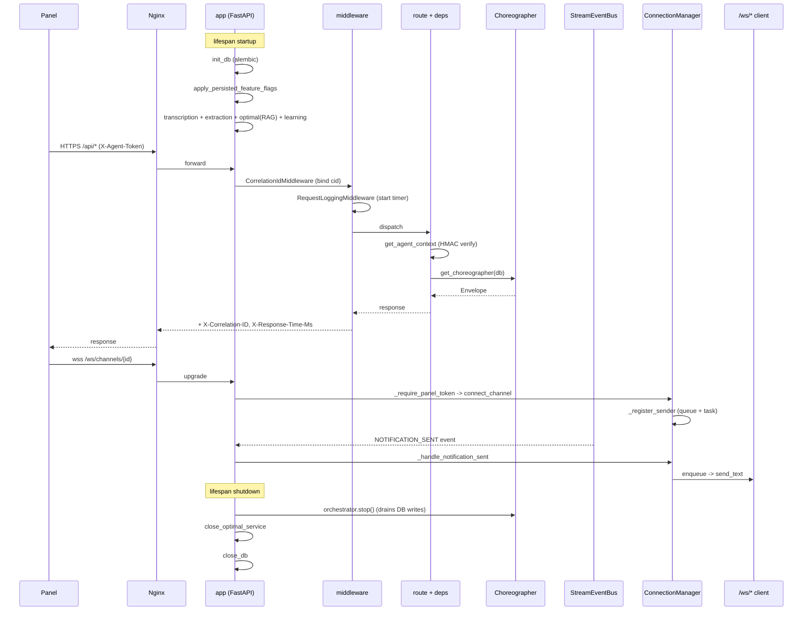

## Logical Tree

```
roboco/api/
├── __init__.py                  # no re-export of app (circular-import guard)
├── app.py
│   ├── _AppServices             # transcription/extraction holders
│   ├── lifespan()               # startup + shutdown ordering
│   └── create_app() -> app      # ~40 routers + ws_router at /ws
├── deps.py
│   ├── _ServiceHolder           # permission_service + orchestrator singletons
│   ├── agent identity (get_current_agent_id / slug / optional / context)
│   ├── _check_agent_auth_token / require_panel_token (HMAC)
│   ├── role gates (require_pm_or_above / developer_or_above / cell_access)
│   ├── permission dep factories (channel read/write, notification, task action)
│   ├── get_choreographer / get_content_actions
│   └── get_pagination
├── middleware.py
│   ├── CorrelationIdMiddleware
│   ├── RequestLoggingMiddleware
│   ├── exception handlers (RequestValidationError, HTTPException, RobocoError,
│   │                        ServiceError, RateLimitError, Exception)
│   ├── _scrub_secrets / _uuid_field_remediation
│   └── setup_middleware()
├── middleware_docs.py
│   ├── DOCS_PERMISSIONS matrix
│   ├── check_docs_access / require_docs_access
│   └── get_allowed_docs_paths
├── websocket.py
│   ├── _ClientConnection (queue + sender)
│   ├── _require_panel_token
│   ├── ConnectionManager (channel/agent/session/notification/system sets + senders)
│   ├── manager singleton
│   ├── validate_agent_exists
│   ├── routes: /channels/{id} /agents/{id} /sessions/{id}
│   │          /notifications/{id} /system
│   └── broadcast_agent_chunk / broadcast_notification helpers
├── websocket_bridge.py
│   ├── _handle_notification_sent / _handle_session_event / _handle_message_event / _handle_agent_event
│   ├── _handle_rate_limit_event / _handle_usage_event
│   └── register_websocket_bridge_handlers / start_websocket_bridge
└── utils/
    ├── __init__.py              # re-exports
    ├── errors.py                # HTTPException factories + service_error_handler
    └── resources.py             # get_or_404 + ownership/recipient/membership
```

## Dependencies

**Internal**: `roboco.config.settings`; `roboco.db.base` (init_db/close_db/get_db/get_session_factory); `roboco.db.tables.AgentTable`; `roboco.foundation.identity` (BOARD_ROLES/DEV_ROLES/PM_ROLES/Role); `roboco.models` (AgentRole/Team); `roboco.runtime.AgentOrchestrator`; `roboco.agents_config` (CEO_AGENT_ID, verify_agent_token, AGENT_ROLE_MAP/AGENT_TEAM_MAP, ALL_DOCS, _resolve_to_slug); `roboco.events` (Event/EventType/get_event_bus); `roboco.exceptions` (RobocoError tree); `roboco.services.base` (ServiceError tree); `roboco.services.exceptions.RateLimitError`; `roboco.services.{permissions,messaging,task,work_session,git,workspace,journal,a2a,product,notification,notification_delivery,audit,settings,extraction,learning,optimal,transcription}`; `roboco.services.gateway.{choreographer,content_actions,evidence_repo}`; `roboco.services.repositories` (resolve_agent_uuid/resolve_agent_identity); `roboco.api.schemas.{optimal.PaginationParams,common.ErrorCode}`; ~40 `roboco.api.routes.*` routers; `roboco.api.routes.v1.*` flow modules.

**External**: `fastapi` (FastAPI, APIRouter, WebSocket, HTTPException, Depends, Header, status), `starlette.middleware.base.BaseHTTPMiddleware`, `starlette` responses, `sqlalchemy` (select, async session), `structlog`, `pydantic` (via schemas), `asyncio`, `uuid`, `json`, `time`, `contextlib`. (`httpx` was REMOVED from websocket.py in the baseline→head diff — the self-call `validate_channel_access` is gone.)

## Entry Points

- `roboco.api.app:app` — the ASGI instance uvicorn/gunicorn serves; `create_app()` called at import.
- `lifespan` — FastAPI async context manager; runs on startup/shutdown.
- `setup_middleware(app)` — called from `create_app` after CORS.
- `register_websocket_bridge_handlers()` / `start_websocket_bridge()` — called by orchestrator/bootstrap after the event bus is up (NOT in `lifespan`; the lifespan does not register bridge handlers).
- WS routes — invoked by the panel via `wss://.../ws/{channels|agents|sessions|notifications|system}/...`, mounted at prefix `/ws` in `create_app`.
- `manager` singleton — imported directly by services and the bridge to broadcast.
- DI deps — resolved per-request by FastAPI (`get_agent_context`, `get_choreographer`, `get_content_actions`, `get_pagination`, `require_*` factories).
- `require_panel_token` — HTTP dep on the live intake/secretary chat bridges.

## Config Flags

- `ROBOCO_AGENT_AUTH_REQUIRED` — gates HMAC token enforcement (deps.py:211, websocket.py:71, middleware docstring app.py:94). Unset → header-trust/dev mode; set `true`/`1`/`yes` → strict.
- `ROBOCO_AGENT_AUTH_SECRET` — the HMAC secret consumed by `verify_agent_token` (read inside `roboco.agents_config`).
- `ROBOCO_DATABASE_*`, `ROBOCO_REDIS_*` — read transitively via `settings` / `init_db`.
- `settings.cors_origins` / `settings.cors_allow_credentials` — CORS middleware config (app.py:218).
- `settings.app_version` / `settings.environment` / `settings.debug` — logged at startup; docs/redoc URLs are unconditional (the `if settings.debug` is commented out, app.py:207-208).
- `settings.host` / `settings.port` — no longer used in websocket.py (the httpx self-call was removed); still referenced elsewhere.
- No direct ROBOCO_* feature flags live in this slice; the lifespan applies persisted flag overlays via `apply_persisted_feature_flags` but does not itself read individual subsystem flags.

## Gotchas

- **`/ws/system` is the only WS endpoint WITHOUT `_require_panel_token`** (websocket.py:608). The other four gate on the CEO HMAC; system is ungated. It is read-only operator data, but if nginx does not gate `/ws/system` at the edge, any reachable client gets rate-limit + usage telemetry. The other streams are also reachable with a dev-mode missing token (header-trust).
- **`websocket.py` module docstring (lines 8-13) is STALE** — it claims WS "validates agent_id via query params and verify the agent exists in the database. In production, this should be enhanced with proper token-based authentication." Actual security is now the CEO HMAC panel token via `_require_panel_token`, and `validate_agent_exists` is only called on `/agents`, `/sessions`, `/notifications` (NOT `/channels`). The docstring misleads.
- **`get_choreographer` passes `stream_bus=None` when no orchestrator is set** (deps.py:557) — fine, but means the rate-limit park path is inert during the startup window before bootstrap sets the orchestrator.
- **`_check_agent_auth_token` dev mode**: a missing token is allowed; a presented-but-invalid token is rejected. The header-trust warning at app.py:94-102 is the only signal. In dev, any reachable client can act as any role (including `ceo`) by setting headers.
- **`_resolve_agent_identity` `system` role special-case** (deps.py:281) returns `UUID(x_agent_id)` with NO DB lookup. Combined with dev-mode no-auth, a caller can claim `role=system` with an arbitrary UUID and bypass agent resolution entirely.
- **`_coerce_agent_role` falls back to the DB role when the header isn't a valid enum** (deps.py:298). The X-Agent-Role header is therefore advisory when malformed — the authoritative role is the agent row's. Good for safety, but means a caller cannot escalate by header alone (the DB role wins).
- **`request_validation_handler` returns the UNSCRUBBED body to the client** (middleware.py:434). Only the server log is scrubbed (`_scrub_secrets`); the 422 response echoes whatever the client sent, including any secret fields. By design (the client sent them), but worth knowing.
- **`_run_sender` self-cancels on send error**: on a hard send error it calls `self.disconnect(ws)` which cancels `conn.sender` — the very task currently running (websocket.py:155). It returns immediately after, so the cancellation lands on an already-returning task; harmless in practice but a subtle self-cancel.
- **Lifespan shutdown order is load-bearing**: orchestrator.stop() MUST run before close_db (app.py:170-186). Reverting this order silently drops final audit-log rows + respawn_tracker upserts + agent-state finalizes. `stop()` is idempotent (bootstrap's finally re-calls it).
- **`ConnectionManager` sets are NOT mutated under a lock** — relies on asyncio single-threadedness. A broadcast iterating a set while `disconnect` mutates it is safe within one event loop, but `_run_sender`'s `disconnect(ws)` is called from a different task than the receive loop's `finally disconnect`, so two tasks can concurrently mutate the same set. `set.discard` is safe but iteration-during-mutation could raise `RuntimeError: Set changed size during iteration` in pathological cases.
- **`broadcast_notification` (websocket.py:665) bypasses the `broadcast_to_*` pattern** and reaches into `manager._enqueue_or_send` directly with a pre-serialized `data` string, while `broadcast_to_*` serialize inside. Inconsistent but works.
- **`roboco/api/__init__.py` deliberately does NOT re-export `app`** — importing `roboco.api.schemas.X` must not transitively load the FastAPI app + routes (circular-import cycle). The entrypoint imports `roboco.api.app:app` directly. Do not "helpfully" re-export here.
- **`docs_url`/`redoc_url` are unconditional** (app.py:207-208) — the `if settings.debug` gating is commented out, so `/docs` and `/redoc` are always served.
- **`apply_persisted_feature_flags` is best-effort** (app.py:115-121) — a DB failure logs a warning and continues with env defaults; startup is never blocked.

## Drift from CLAUDE.md

- `CLAUDE.md` "WebSocket streams" section lists `/ws/channels/{id}`, `/ws/agents/{id}`, `/ws/sessions/{id}`, `/ws/notifications/{id}`, `/ws/system` — **matches** `websocket.py` routes. No drift.
- `CLAUDE.md` says `/ws/system` carries "the rate-limit lifecycle (`RATE_LIMIT_HIT` / `RATE_LIMIT_LIFTED`) and live usage (`USAGE_SNAPSHOT`)" — **matches** `websocket_bridge.py:138-166` (`_handle_rate_limit_event` + `_handle_usage_event`). No drift.
- `CLAUDE.md` says "To add a new live event: define an `EventType`, publish it to the bus, add a `_handle_*` forwarder in `websocket_bridge`, and consume it on the panel via the `useWebSocket(...)` hook" — **matches** the `_handle_*` pattern. No drift.
- `CLAUDE.md` "Startup Sequence" says "FastAPI lifespan indexes documents using Ollama (~30-60s)" — `app.py:137-147` initializes `OptimalService` (RAG) with a 30-90s blocking init and logs "OptimalService (RAG) initialized successfully"; the "indexes documents" framing is approximate but consistent. No material drift.
- `CLAUDE.md` does NOT document the `_require_panel_token` CEO-HMAC WS gate or the HTTP `require_panel_token` dep. The `websocket.py` module docstring (lines 8-13) describes the OLD query-param model, contradicting the actual HMAC-token implementation. The CLAUDE.md "Agent Gateway" section's "Agents do not call the API or per-domain MCP tools directly" is consistent with `/ws/*` being operator-only. **Drift: in-file docstring vs actual code (websocket.py:8-13); CLAUDE.md itself is silent on WS auth, so no CLAUDE.md contradiction.**
- `CLAUDE.md` "Orchestrator runtime-state durability" notes the respawn_tracker DB-durable writes are drained on `stop()` — `app.py:170-186` implements the required ordering (stop before close_db). Consistent.
- `CLAUDE.md` "Feature flags / company-in-a-box" says flags "toggle from the panel's Settings → Feature Flags card ... A toggle persists in the settings store and takes effect on the next backend restart" — `app.py:115-121` applies them in lifespan. Consistent.
- `CLAUDE.md` does not mention the `CorrelationIdMiddleware` / `RequestLoggingMiddleware` / exception-handler chain by name; `middleware.py` is the implementation of the implied "structured error" contract. No contradiction.

Net: **no direct contradictions with CLAUDE.md**; the one stale security docstring lives in `websocket.py` itself.

## Changes Since Baseline

Only ONE commit in `fd10cc86..HEAD` touched this slice: `15effce0` "Chore: 141 Gaps fill-in (#283)" (2026-06-29).

Diff stat: `app.py +20`, `deps.py +44`, `middleware.py +49`, `websocket.py +309/-66` (net), `middleware_docs.py` / `websocket_bridge.py` / `utils/*` UNCHANGED.

> **Post-snapshot update (2026-07-01):** `websocket_bridge.py` is no longer unchanged — the chat-subsystem live-delivery work added `_handle_message_event` (forwards `EventType.MESSAGE_SENT` to `/ws/sessions/{id}` + `/ws/channels/{id}` as a `message.new` frame) and a `MESSAGE_SENT` subscription. This is the live transcript-update path that was previously dead.

Logic-touching changes in that commit, scoped to this slice:

| Change | File:Line | IMPACT |
|--------|-----------|--------|
| Lifespan shutdown now stops orchestrator BEFORE close_db (was: DB closed first, only bootstrap's finally stopped orchestrator) | app.py:170-186 | Final audit-log rows / respawn_tracker upserts / agent-state finalizes no longer silently dropped on shutdown. `get_orchestrator_or_none()` added so lifespan doesn't 503 when no orchestrator is wired (tests/skip_orchestrator). |
| `get_orchestrator_or_none` + `clear_orchestrator` added | deps.py:96-119 | New accessor for shutdown + test teardown; `get_orchestrator` still 503s. |
| `require_panel_token` HTTP dep added (CEO HMAC for live-chat bridges) | deps.py:251-274 | New gate; mirrors WS `_require_panel_token`. Browser EventSource can't set headers, so token-only. |
| `CEO_AGENT_ID` import added to deps.py | deps.py:18 | Required by `require_panel_token` + reused by WS gate. |
| `_SECRET_FIELD_NAMES` + `_scrub_secrets` added; 422 log scrubs credential fields | middleware.py:372-404, 426 | Plaintext GitHub PAT / provider API key / bearer tokens no longer dumped to structlog on a 422. Response body unchanged. |
| WS panel-token gate (`_require_panel_token`) added to channel/agent/session/notifications streams | websocket.py:61, 371/439/503/567 | `/ws/*` now CEO-HMAC-gated in prod; dev allows missing token but rejects forged. **`/ws/system` was NOT gated** (inconsistency). |
| Per-connection bounded send queue + sender task (`_ClientConnection`, `_register_sender`, `_run_sender`, `_enqueue_or_send`, `_send_with_timeout`) | websocket.py:45-156, 244-281 | Replaced `asyncio.gather(*[conn.send_text(data)])` with non-blocking enqueue. One slow client can no longer back-pressure the fan-out; full queue drops+warns. `_run_sender` reaps dead sockets on hard send error. |
| `IDLE_TIMEOUT_SECONDS` (90s) `asyncio.wait_for` on `receive_text` | websocket.py:35, 400/471/534/586/623 | Half-open sockets from dead containers no longer block the receive loop forever; `TimeoutError` → `finally disconnect`. |
| `httpx` self-call `validate_channel_access` REMOVED; `settings` import dropped from websocket.py | websocket.py (was) | The channel WS no longer makes an HTTP round-trip to `/api/permissions/check` on the local server (deadlocks/latency risk gone). Channel access now gated only by panel token. |
| `structlog` logger (`log`) replaced the old logger; `validate_agent_exists` kept for agent/session/notifications | websocket.py:30, 337 | Logging consistent with rest of API. |
| `system_stream` endpoint + `broadcast_system` + `connect_system` (already present pre-baseline) — the commit RETAINED the no-token path for `/ws/system` | websocket.py:208-212, 316-322, 608 | Operator stream stays ungated; rate-limit/usage telemetry reachable without panel token. |

`middleware_docs.py` and `utils/*` are byte-for-byte unchanged since baseline. `websocket_bridge.py` was unchanged at the snapshot but has since been edited by the chat-subsystem live-delivery work (the `_handle_message_event` forwarder + `MESSAGE_SENT` subscription — see the post-snapshot note above).

## Regression Risks

| Title | File:Line | Claim | Severity |
|-------|-----------|-------|----------|
| `/ws/system` ungated while siblings require panel token | websocket.py:608 | The rate-limit/usage operator stream has no `_require_panel_token` call; if nginx does not edge-gate `/ws/system`, any reachable client gets RATE_LIMIT_HIT/LIFTED + USAGE_SNAPSHOT telemetry. The other four streams gate. | medium |
| `_run_sender` self-cancels its own task on send error | websocket.py:155 | `self.disconnect(ws)` pops `conn.sender` and calls `.cancel()` on the task currently running `_run_sender`. The immediate `return` mitigates, but a cancellation landing on a returning task is a subtle race; under heavy churn could mask a later send or trip a CancelledError in an `except Exception` handler. | low |
| Concurrent set mutation between sender-task `disconnect` and receive-loop `finally disconnect` | websocket.py:155 / 425 | Two tasks (sender + receive loop) can call `disconnect(ws)` on the same socket concurrently. `set.discard` is idempotent, but a `broadcast_to_*` iterating the same set on the loop thread during the sender-task's `disconnect` could raise `Set changed size during iteration`. Single-loop asyncio makes this rare but not impossible. | low |
| `validate_agent_exists` opens its own DB session via `async for db in get_db()` per WS upgrade | websocket.py:347 | Each `/agents`, `/sessions`, `/notifications` upgrade grabs a session just to confirm the viewer exists — extra session pressure under many concurrent panel connections; the check is also bypassable in dev (no token). | low |
| Lifespan shutdown hangs if `orchestrator.stop()` blocks | app.py:184 | The new stop-before-close-db order is correct, but a hung `stop()` now blocks `close_optimal_service` + `close_db` (wrapped in try/except, so a hang — not an exception — is the failure mode). Pre-baseline, a hung stop only affected bootstrap's finally. | low |
| 422 response body still echoes unscrubbed secrets | middleware.py:434 | `_scrub_secrets` only scrubs the LOG, not the response. A client sending a `git_token` that fails validation gets it back in the 422 `body` field. By design but a leak surface if logs/responses are captured. | low |
| `_resolve_agent_identity` `system` role bypasses DB lookup | deps.py:281 | `role=system` returns `UUID(x_agent_id)` with no DB check. In dev (no auth) a caller can claim `system` with any UUID and get an `AgentContext` for a non-existent agent. Auth-required mode still needs a valid HMAC, mitigating prod. | low |
| `_enqueue_or_send` legacy fallback creates unbounded fire-and-forget tasks | websocket.py:266 | For an unregistered socket (shouldn't happen since every `connect_*` registers), a `_send_with_timeout` task is spawned per message with no queue cap. Only the legacy path; held in `_pending_sends` for GC safety. | low |
| `broadcast_notification` double-iterates notification connections | websocket.py:665-691 | It reads `manager.notification_connections.get(agent_id)` then calls `manager._enqueue_or_send` per conn, bypassing the `broadcast_to_*` serializer. If a disconnect happens between the snapshot and the enqueue, the enqueue targets a dead socket whose sender was cancelled — `_enqueue_or_send` falls to the legacy fire-and-forget path. Low. | low |
| Channel WS no longer checks channel read permission | websocket.py:360-425 | The `validate_channel_access` httpx self-call was removed; channel access is now ONLY the panel token. A panel client can subscribe to ANY channel regardless of role. Acceptable (panel is operator), but a behavior change vs pre-baseline. | low |
| Stale module docstring misleads future edits | websocket.py:8-13 | Describes query-param agent validation as the security model; actual model is CEO HMAC. A future edit trusting the docstring could weaken the gate. | low |

## Health

This slice is the API spine and is in **good structural shape**. The baseline→head refactor (`15effce0`) materially hardened it: the WebSocket fan-out no longer back-pressures on a slow client (bounded per-connection queues + sender tasks), half-open sockets are reaped by an idle timeout, the lifespan shutdown ordering fix stops silent final-write drops, 422 logs no longer leak credentials, and the WS + HTTP panel-token gates close the operator-only invariant. The event-bus bridge is clean and follows the documented `_handle_*` extension pattern. The main integrity concerns are minor: `/ws/system` is the only ungated WS endpoint (inconsistent with its siblings), the `websocket.py` module docstring is stale vs the HMAC implementation, and the concurrent-set-mutation window between the sender task's error-path `disconnect` and the receive loop's `finally disconnect` is theoretically present under asyncio single-threadedness. No logic-touching change since baseline looks broken; the regression risks above are edge-case and mostly low severity. The unchanged files (`middleware_docs.py`, `websocket_bridge.py`, `utils/*`) are stable. Recommended follow-ups: gate `/ws/system` with the same panel token (or document why it's intentionally open), refresh the `websocket.py` docstring, and consider a lock or snapshot-iteration in `ConnectionManager` broadcast paths.

# Slice: api-routes-schemas

## Purpose
The FastAPI surface of RoboCo: every HTTP route under `roboco/api/routes/` (the operator/panel `api/*` CRUD + dashboard/orchestrator/a2a/live bridges) and the agent-gateway `api/v1/flow/*` (intent verbs) + `api/v1/do/*` (content tools), with Pydantic request/response schemas under `roboco/api/schemas/`. Routes are thin handlers that resolve services via `Depends` and return typed responses; all agent-gateway verbs funnel through the Choreographer.

## Files

| Path | Role |
|------|------|
| roboco/api/routes/health.py | Liveness/readiness (DB + Redis probes). |
| roboco/api/routes/agents.py | List/get agents. |
| roboco/api/routes/channels.py | Channel CRUD + member ops. |
| roboco/api/routes/groups.py | Group create/list. |
| roboco/api/routes/sessions.py | Communication sessions + messages. |
| roboco/api/routes/messages.py | Message list/create/patch/delete. |
| roboco/api/routes/notifications.py | Notification list/ack/send. |
| roboco/api/routes/stream.py | Agent stream chunk/complete/extract + permissions. |
| roboco/api/routes/journals.py | Journal entries, search, growth stats. |
| roboco/api/routes/kanban.py | Per-team kanban boards + main-pm/board/stats. |
| roboco/api/routes/cockpit.py | Cockpit summary/signals. |
| roboco/api/routes/company_goals.py | Company goals get/put. |
| roboco/api/routes/settings.py | Settings + feature-flags get/set. |
| roboco/api/routes/dashboard.py | CEO/auditor/kanban/metrics/agents/activity dashboards. |
| roboco/api/routes/tasks.py | Task CRUD + lifecycle transitions (claim/start/verify/qa/complete...). |
| roboco/api/routes/work_session.py | Work-session list/commit/files/PR/merge/complete/abandon. |
| roboco/api/routes/git.py | Per-project git status/log/diff/commit/push/PR/rebase. |
| roboco/api/routes/project.py | Project CRUD + workspace/sync/access + conventions. |
| roboco/api/routes/product.py | Product CRUD. |
| roboco/api/routes/optimal.py | RAG: kb/search, rag/query, mentor/ask, learnings, decisions, review. |
| roboco/api/routes/research.py | Web search/fetch. |
| roboco/api/routes/orchestrator.py | CEO-gated spawn/stop/resolve-wait/mark-waiting + status. |
| roboco/api/routes/a2a.py | Agent-to-agent inbox/conversations/tasks + SSE streams. |
| roboco/api/routes/prompter_live.py | Live Intake chat (start/stream/messages/confirm/confirm-batch). |
| roboco/api/routes/secretary.py | Company state + CEO directives confirm/reject. |
| roboco/api/routes/secretary_live.py | Live Secretary chat (start/stream/messages/stop/events). |
| roboco/api/routes/release.py | CEO-only release proposal approve/reject. |
| roboco/api/routes/playbooks.py | Playbook approve/reject/archive (Auditor/CEO). |
| roboco/api/routes/pitch.py | Pitch create/list/approve/reject. |
| roboco/api/routes/provider.py | Provider catalog + ollama/grok/self-hosted key + mode. |
| roboco/api/routes/usage.py | Token usage summary/time-series/by-agent/team/model/sessions. |
| roboco/api/routes/system.py | System-wide info. |
| roboco/api/routes/docs.py | Project docs write/read/list/delete. |
| roboco/api/routes/v1/_role_dep.py | Per-role HMAC guards + `envelope_to_response` helper. |
| roboco/api/routes/v1/do.py | Content verbs `/api/v1/do/*` (commit/note/say/dm/evidence/playbook...). |
| roboco/api/routes/v1/flow_dev.py | Developer flow verbs. |
| roboco/api/routes/v1/flow_qa.py | QA flow verbs (claim/pass/fail_review). |
| roboco/api/routes/v1/flow_doc.py | Documenter flow verbs. |
| roboco/api/routes/v1/flow_cell_pm.py | Cell-PM flow verbs (delegate/submit_up/triage/complete...). |
| roboco/api/routes/v1/flow_main_pm.py | Main-PM flow verbs (submit_root/triage_all/escalate_to_ceo...). |
| roboco/api/routes/v1/flow_board.py | Board (product_owner/head_marketing) triage/escalate_to_ceo. |
| roboco/api/routes/v1/flow_auditor.py | Auditor triage/i_am_idle. |
| roboco/api/routes/v1/flow_pr_reviewer.py | PR-reviewer verbs incl. gate pr_pass/pr_fail. |
| roboco/api/schemas/*.py | Per-domain Pydantic request/response models (one per route file). |
| roboco/api/schemas/v1/flow.py | All flow-verb request bodies + `StrList` coercion validator. |
| roboco/api/schemas/v1/do.py | All do-verb request bodies. |

## Key Endpoints

| Method | Path | Handler (file) | Auth/Role |
|--------|------|----------------|-----------|
| GET | /api/health, /api/ready | health.py | none |
| GET | /api/dashboard/ceo | dashboard.py | agent context |
| GET | /api/dashboard/metrics/{cycle-time,bottlenecks,rework,scorecard/*} | dashboard.py | agent context |
| GET/POST/PATCH/DELETE | /api/tasks, /api/tasks/{id}/{claim,start,verify,submit-qa,pass-qa,fail-qa,complete,cancel,escalate-to-ceo} | tasks.py | agent context + `require_task_action` |
| GET/POST | /api/orchestrator/{status,agents/{id},waiting} ; /spawn,/stop,/resolve-wait,/mark-waiting | orchestrator.py | `_require_ceo` (HMAC) |
| POST | /api/a2a/{send,send-stream} ; /chat/conversations ; /tasks/{id}/cancel | a2a.py | `require_any_authenticated_agent` |
| POST | /api/prompter/live, /live/{id}/{stream,status,messages,stop,confirm,confirm-batch} | prompter_live.py | `require_panel_token` (CEO HMAC) |
| POST | /api/secretary/live, /live/{id}/{stream,messages,stop,events} ; /api/secretary/{state,directives} | secretary*.py | panel token / agent ctx |
| GET/POST | /api/release/proposal, /proposal/approve, /proposal/reject | release.py | `_require_ceo` (agent.role==CEO) |
| GET/POST | /api/playbooks, /{id}/{approve,reject,archive} | playbooks.py | agent context (Auditor/CEO) |
| GET/POST/PUT/DELETE | /api/projects, /{id}/conventions, /workspace, /sync | project.py | agent context |
| POST | /api/v1/flow/developer/{give_me_work,i_will_work_on,open_pr,i_am_done,unclaim,resume,sync_branch} | flow_dev.py | `require_dev` (role + HMAC) |
| POST | /api/v1/flow/qa/{claim_review,pass_review,fail_review} | flow_qa.py | `require_qa` |
| POST | /api/v1/flow/cell_pm/{delegate,submit_up,complete,triage,unblock,reassign} | flow_cell_pm.py | `require_cell_pm` |
| POST | /api/v1/flow/main_pm/{submit_root,triage_all,escalate_to_ceo,complete} | flow_main_pm.py | `require_main_pm` |
| POST | /api/v1/flow/pr_reviewer/{claim_pr_review,claim_gate_review,pr_pass,pr_fail,post_pr_review} | flow_pr_reviewer.py | `require_pr_reviewer` |
| POST | /api/v1/do/{commit,note,say,dm,notify,evidence,draft_playbook,approve_playbook,...} | do.py | `require_any_authenticated_agent` (HMAC, any role) |
| GET | /ws/{channels,agents,sessions,notifications,system}/{id} | websocket.py | WS panel/HMAC token |

## Key Symbols

| Name | Kind | File:Line | Responsibility |
|------|------|-----------|----------------|
| `require_any_authenticated_agent` | dep | v1/_role_dep.py | HMAC-verify X-Agent-ID/role/team token; router-level guard on do + a2a. |
| `require_<role>` (require_dev/qa/...) | dep | v1/_role_dep.py | Per-role guard: HMAC + role assertion, applied as router dependency. |
| `envelope_to_response` | fn | v1/_role_dep.py | Convert Choreographer `Envelope` to JSON, set status from `envelope.status`. |
| `_check_agent_auth_token` | fn | api/deps.py:217 | Core HMAC verify; rejects invalid tokens even in dev; required-only in prod. |
| `require_panel_token` | dep | api/deps.py:251 | CEO-signed HMAC gate for live-chat bridges (HTTP analog of WS gate). |
| `CurrentAgentContext` | dep | api/deps.py:376 | Resolves agent from headers + HMAC, injects `AgentContext`. |
| `_require_ceo` | dep | routes/orchestrator.py:37 | Router-level CEO-HMAC guard on orchestrator control routes. |
| `setup_middleware` | fn | api/middleware.py | Register exception handlers (422 scrub, HTTP, RobocoError, generic). |
| `request_validation_handler` | fn | api/middleware.py:407 | Log 422 body (secrets scrubbed) + uuid remediate hint. |
| `_scrub_secrets` | fn | api/middleware.py:389 | Deep-redact known secret fields from logged 422 bodies. |
| `StrList` | type | schemas/v1/flow.py:20 | `list[str]` with `coerce_str_list` BeforeValidator (XML-nested LLM lists). |
| `Choreographer` | svc | services/gateway/choreographer.py | Composes service intents behind every flow verb. |
| `ContentActions` | svc | services/gateway/ | Composes do-verb content actions (commit/note/say/...). |
| `router` (do) | router | v1/do.py:38 | `/api/v1/do` router, `require_any_authenticated_agent` dep. |
| `router` (flow_dev) | router | v1/flow_dev.py:24 | `/api/v1/flow/developer` router, `require_dev` dep. |

## Data Flow
Request hits nginx (port 3000) -> FastAPI app (`api/app.py`) registers routers under `/api/*` plus `/api/v1/flow/*` and `/api/v1/do/*`. Middleware chain (CorrelationId -> RequestLogging) attaches a correlation ID and logs; exception handlers intercept 422/HTTP/RobocoError/generic. Router-level `Depends` resolves `DbSession` + agent context (HMAC-verified from `X-Agent-*` headers) and, on agent-gateway routes, the role guard. The thin handler pulls a service via `Depends` (TaskService, Choreographer, ContentActions, GitService, OptimalService, ReleaseProposalService...) and returns a typed Pydantic response; flow/do verbs return the Choreographer `Envelope` via `envelope_to_response`. SSE (`EventSourceResponse`) is used for live-chat streams and a2a send-stream.

## Mermaid
```mermaid
graph TD
  app[FastAPI app.py]
  app -->|/api/*| ops[Operator/Panel routes]
  app -->|/api/v1/flow/*| flow[Flow routers]
  app -->|/api/v1/do/*| do[do router]
  app -->|/ws/*| ws[websocket.py]
  ops --> tasks[tasks.py -> TaskService]
  ops --> dash[dashboard.py -> MetricsService]
  ops --> orch[orchestrator.py -> AgentOrchestrator CEO-gate]
  ops --> a2a[a2a.py -> A2AService SSE]
  ops --> livep[prompter_live.py -> PrompterService SSE panel-token]
  ops --> lives[secretary_live.py -> SecretaryService SSE]
  ops --> rel[release.py -> ReleaseProposalService CEO-gate]
  flow --> fdev[flow_dev -> Choreographer.give_me_work/i_will_work_on/...]
  flow --> fqa[flow_qa -> Choreographer.claim_review/pass/fail]
  flow --> fpm[flow_cell_pm/main_pm -> Choreographer.delegate/submit_up/submit_root]
  flow --> fpr[flow_pr_reviewer -> Choreographer.pr_pass/pr_fail]
  do --> doR[do.py -> ContentActions.commit/note/say/dm/evidence]
  flow -.->|HMAC role guard| _role_dep[_role_dep.py]
  do -.->|HMAC any-role guard| _role_dep
  orch -.->|HMAC CEO guard| deps[deps._require_ceo]
  livep -.->|panel HMAC| deps2[deps.require_panel_token]
  ws --> cm[ConnectionManager -> StreamEventBus]
```

## Logical Tree
```
roboco/api/
├── routes/
│   ├── operator-panel (api/*)
│   │   ├── health.py            liveness/readiness
│   │   ├── agents.py            agent list/get
│   │   ├── channels.py          channel CRUD + members
│   │   ├── groups.py            group create/list
│   │   ├── sessions.py          comms sessions + messages
│   │   ├── messages.py          message CRUD
│   │   ├── notifications.py     notification ack/send
│   │   ├── stream.py            agent stream chunks/extract
│   │   ├── journals.py          journal entries + growth
│   │   ├── kanban.py            kanban boards
│   │   ├── cockpit.py           cockpit summary/signals
│   │   ├── company_goals.py     company goals
│   │   ├── settings.py          settings + feature-flags
│   │   ├── dashboard.py         CEO/auditor/metrics dashboards
│   │   ├── tasks.py             task CRUD + lifecycle
│   │   ├── work_session.py      work-session/PR/merge
│   │   ├── git.py               per-project git ops
│   │   ├── project.py           project CRUD + conventions
│   │   ├── product.py           product CRUD
│   │   ├── optimal.py           RAG kb/query/mentor
│   │   ├── research.py          web search/fetch
│   │   ├── docs.py              project docs
│   │   ├── system.py            system info
│   │   └── usage.py             token usage
│   ├── ceo-gated / live bridges
│   │   ├── orchestrator.py      CEO spawn/stop/mark-waiting
│   │   ├── release.py           release proposal approve/reject
│   │   ├── playbooks.py         playbook curation
│   │   ├── pitch.py             pitch approve/reject
│   │   ├── a2a.py               agent-to-agent + SSE
│   │   ├── prompter_live.py     live Intake chat
│   │   ├── secretary.py         company state + directives
│   │   ├── secretary_live.py    live Secretary chat
│   │   └── provider.py          provider catalog/keys
│   └── v1/ (agent-gateway)
│       ├── _role_dep.py         HMAC role guards + envelope helper
│       ├── do.py                /api/v1/do/* content verbs
│       ├── flow_dev.py          developer flow verbs
│       ├── flow_qa.py           QA flow verbs
│       ├── flow_doc.py          documenter flow verbs
│       ├── flow_cell_pm.py      cell-PM flow verbs
│       ├── flow_main_pm.py      main-PM flow verbs
│       ├── flow_board.py        board flow verbs
│       ├── flow_auditor.py      auditor flow verbs
│       └── flow_pr_reviewer.py  PR-reviewer flow verbs
└── schemas/
    ├── *.py                     per-domain Pydantic models
    └── v1/
        ├── flow.py              flow-verb bodies + StrList
        └── do.py                do-verb bodies
```

## Dependencies
- FastAPI + sse-starlette (SSE), pydantic v2.
- `roboco/api/deps.py` — shared deps (DbSession, agent context, HMAC, orchestrator).
- `roboco/api/middleware.py` — exception handlers + correlation/log middleware.
- `roboco/services/*` — TaskService, GitService, OptimalService, AgentOrchestrator, Choreographer, ContentActions, ReleaseProposalService, PrompterService, SecretaryService, MetricsService, etc.
- `roboco/foundation/identity.py` (`Role`) + `roboco/agents_config.py` (`verify_agent_token`, `CEO_AGENT_ID`).
- `roboco/api/websocket.py` + `websocket_bridge.py` (WS event forwarding).

## Entry Points
- `roboco/api/app.py` `create_app()` builds the FastAPI app, mounts all routers under `/api` (prefix) + `/ws` (WS router).
- `roboco/api/routes/v1/_role_dep.py` is imported by every flow router + do + a2a for HMAC/role guards and `envelope_to_response`.
- `roboco/api/routes/orchestrator.py` router constructed with `dependencies=[Depends(_require_ceo)]` (router-wide CEO gate).

## Config Flags
- Auth-gate mode: `_auth_required()` (env-driven; HMAC mandatory in prod-ish, optional in dev) — `api/deps.py`.
- Feature-flag routes are inert when their backing engine is off: `release.py` (ROBOCO_RELEASE_MANAGER_ENABLED), `prompter_live.py` MegaTask batch, `optimal.py` learnings (ROBOCO_ORG_MEMORY_ENABLED), `research.py` (ROBOCO_RESEARCH_ENABLED), `provider.py` grok/self-hosted (ROBOCO_GROK / self-hosted), CI-watch/dep-update originate elsewhere but surface via orchestrator/tasks.

## Gotchas
- `do` + `a2a` routers are token-only (any authenticated role), not role-asserted — any signed agent can call any content verb; service-layer scope is the only gate.
- `request_validation_handler` scrubs secrets from the **log** but the 422 **response body echoes the client's submission unchanged** (comment explicit) — secrets can still leak to the caller if the caller is not the legitimate owner.
- SSE live-chat bridges open one session per query/stream and rely on `require_panel_token` (CEO HMAC injected by nginx); a missing/invalid token in dev mode is tolerated (`_auth_required()` false) — prod must arm it.
- `StrList` BeforeValidator is load-bearing: without it the Claude SDK's XML-nested list input crashes `i_will_plan`/`delegate` with 422 (MegaTask memory Bug 3).
- `orchestrator.py` and `release.py` use two different `_require_ceo` implementations (HMAC header vs `agent.role==CEO` from context) — keep their semantics aligned.
- WS endpoints live on `/ws/*` (separate router in `websocket.py`), not under `/api`; the bridge subscribes to `StreamEventBus` and forwards per resource-id.

## Drift from CLAUDE.md
- CLAUDE.md lists `pr_pass`/`pr_fail` under `pr_reviewer` verbs and the in-path gate; code matches (`flow_pr_reviewer.py` exposes `claim_gate_review`, `pr_pass`, `pr_fail`). No drift found.
- CLAUDE.md says agent comms use `say`/`dm`/`notify` via do_server; code matches (`v1/do.py` exposes all three). No drift.
- CLAUDE.md lists `sync_branch` as a developer verb; present in `flow_dev.py:125`. No drift.
- CLAUDE.md's verb table omits `flow_pr_reviewer.post_pr_review` (external PR comment) — present in code; additive, not contradictory.
- None material.

## Changes Since Baseline
`git log fd10cc86..HEAD -- roboco/api/routes/ roboco/api/schemas/`:
- `15effce0` Chore: 141 Gaps fill-in (#283) — broad route/schema hardening pass (the only logic-touching commit in range).

(Baseline..HEAD contains a single sweep commit touching this slice; earlier per-fix commits predate the baseline.)

## Regression Risks

| Title | File:Line | Claim | Severity |
|-------|-----------|-------|----------|
| do/a2a any-role token gate | v1/do.py:43, a2a.py:114 | `require_any_authenticated_agent` only verifies HMAC + that the agent exists; it does NOT assert the role matches the verb's intended role family — a QA-signed token could call `do/commit` or a dev could call `a2a` admin paths. Service-layer scope is the sole guard; a missed service check = privilege escape. | High |
| 422 response echoes secrets | middleware.py:407 | `_scrub_secrets` redacts only the **log** body; the JSON response still contains `body` with the caller's original secret fields. A 422 on `git_token`/`api_key` returns the secret back to the client (and to any MITM/log of the response). | High |
| orchestrator CEO gate vs release CEO gate divergence | orchestrator.py:37 vs release.py:32 | Two independent `_require_ceo` implementations: orchestrator uses HMAC header verification, release uses `agent.role == CEO` from `CurrentAgentContext`. If one path's HMAC/context resolution drifts, the two CEO surfaces enforce different identities. | Medium |
| SSE transport errors swallowed | prompter_live.py:122, secretary_live.py:61, a2a.py:195 | `EventSourceResponse` streams run long-lived; a Choreographer/orchestrator raise mid-stream is caught by `contextlib` suppress but can drop the stream silently without a terminal event to the panel. | Medium |
| Cross-repo PR collision via /api/work-sessions/{id}/pr/merge | work_session.py:259 | PR merge by global `pr_number` (no project_id scoping in the route signature) — the same class of cross-repo collision already fixed in `cell_pm_complete` could recur if this endpoint is wired to merge. | Medium |
| Dashboard/metrics endpoints role-gating | dashboard.py:58+ | `/ceo`, `/auditor`, `/scorecard/*` rely on `CurrentAgentContext` but the route-level gating is weak (no explicit `require_pm_or_above`); a non-CEO agent calling `/dashboard/ceo` is filtered only by service-layer logic, not the router. | Medium |
| WS panel-token vs agent-token dual gate | websocket.py / deps.py | `/ws/*` endpoints use a WS-specific `_require_panel_token` for panel streams but agent-id keying for `/ws/agents/{id}`; mismatched HMAC secret rotation between the two could grant panel read of agent streams or vice-versa. | Low-Med |
| flow `i_will_plan` StrList crash recurrence | schemas/v1/flow.py:20 | If a new LLM-authored `list[str]` field is added to a flow schema without `StrList`, the SDK XML-nesting crash reappears (silent 422 loop). Reviewer-only by inspection. | Low-Med |

## Health
The route layer is thin, consistently organized (one router per domain, one schema file per router), and the agent-gateway HMAC guard is centralized in `_role_dep.py` + `deps.py`. Main risks are the any-role `do`/`a2a` gate (relies on service-layer scope), the 422 response echoing secrets, and the two divergent CEO guards — all addressable without structural change. SSE live-chat streams are the fragile transport path.

# gateway-support slice

## Purpose
The support layer of the agent gateway: pure/cheap components the Choreographer composes into intent-verb sequences. Envelope is the wire contract; claim_guards/claimant_lock/trigger_filter gate concurrency and spawn decisions; content_actions smart-wraps the do-tools (commit/note/say/dm/notify/evidence/progress/pr_update/playbook/pitch/session); evidence_builder/evidence_repo assemble briefings; role_config is the per-role verb/tool manifest source; rate_limit_tracker persists provider park state in Redis; quality_gate runs the pre-submit fast checks; merge_chain resolves PR targets; commit_validator/remediation/kb_authz are small policy shims. None of these own the verb state machine — they are invoked BY the Choreographer and the MCP route handlers.

## Files

| Path | Role | LOC |
|---|---|---|
| roboco/services/gateway/__init__.py | Package marker + __all__ re-export list of the gateway submodules. | 24 |
| roboco/services/gateway/envelope.py | Canonical Envelope dataclass every verb returns; ok/error factory methods + introspection + as_dict wire serializer. | 278 |
| roboco/services/gateway/claim_guards.py | Pre-mutation claim-time predicates: already_active, paused, unmet-dependency; first non-None short-circuits claim. | 112 |
| roboco/services/gateway/claimant_lock.py | Pure single-claimant acquire decision + heartbeat staleness test; caller owns DB writes. | 49 |
| roboco/services/gateway/trigger_filter.py | Pure spawn-gating decision (stale/provider-rate/claimant/cooldown/role-rate) for (task,trigger) pairs. | 130 |
| roboco/services/gateway/commit_validator.py | Commit-message subject gate: length, banned single-words, conventional-commits soft hint. | 101 |
| roboco/services/gateway/content_actions.py | ContentActions: smart-wrapped do-tools (commit/note/say/dm/notify/evidence/progress/pr_update/playbook/pitch/session/inbox) with RBAC, ownership, anti-soup, heartbeat refresh. | 1873 |
| roboco/services/gateway/evidence_builder.py | Pure assembly of EvidencePayload + context_briefing + task_handoff (incl. pr_review verdict) + role-shaped memory query. | 221 |
| roboco/services/gateway/evidence_repo.py | Capped DB queries for context_briefing: unread a2a/mentions/notifications, team activity, blockers, journal highlights, company goals, similar_memory. | 364 |
| roboco/services/gateway/kb_authz.py | KB/docs authorization -> Envelope.not_authorized with role-list remediate hint. | 91 |
| roboco/services/gateway/merge_chain.py | Branch-depth + parent-branch resolution by string surgery and via the parent task's real branch_name (cross-team safe). | 111 |
| roboco/services/gateway/quality_gate.py | run_quality_commands: execute project fast checks in workspace, fail-closed on real failure, fail-open on infra, reap timeout zombies. | 101 |
| roboco/services/gateway/rate_limit_tracker.py | RateLimitStateTracker: Redis JSON blob per provider; atomic Lua probe-failure increment/reset; list_rate_limited_providers scan. | 243 |
| roboco/services/gateway/remediation.py | Concrete single-sentence remediation hint strings for tracing-gap/invalid-state rejections. | 100 |
| roboco/services/gateway/role_config.py | ROLE_CONFIGS: per-role flow_tools/do_tools/allows_write/allows_subagent/description; flow tools derived from lifecycle.intents_for_role. | 273 |

## Key Symbols

| Name | Kind | File:Line | Responsibility |
|---|---|---|---|
| Envelope | dataclass | roboco/services/gateway/envelope.py:22 | Canonical gateway response; fields status/task_id/next/evidence/context_briefing/error/message/remediate/missing/field_hints/correlation_id/current_state/valid_next_verbs. |
| Envelope.ok | classmethod | roboco/services/gateway/envelope.py:52 | Success envelope factory requiring status + next. |
| Envelope._missing_message | staticmethod | roboco/services/gateway/envelope.py:70 | Build non-null human-readable message for tracing_gap/incomplete_input so audit log + agent see the full picture. |
| Envelope.tracing_gap | classmethod | roboco/services/gateway/envelope.py:85 | Rejection for missing required tracing tokens. |
| Envelope.incomplete_input | classmethod | roboco/services/gateway/envelope.py:101 | Structured under-filled-input rejection carrying field_hints answer-key (spec 5.2.1). |
| Envelope.invalid_state | classmethod | roboco/services/gateway/envelope.py:125 | State-machine rejection with remediate hint. |
| Envelope.not_authorized | classmethod | roboco/services/gateway/envelope.py:140 | RBAC denial with remediate. |
| Envelope.not_found | classmethod | roboco/services/gateway/envelope.py:155 | 404-style rejection. |
| Envelope.circuit_open | classmethod | roboco/services/gateway/envelope.py:159 | Per-verb retry circuit-breaker tripped signal (wired by agent_sdk runtime, not gateway). |
| Envelope.from_decision | classmethod | roboco/services/gateway/envelope.py:186 | Map a lifecycle.spec rejection Decision onto the right envelope flavor; raises on allow Decision. |
| Envelope.with_introspection | method | roboco/services/gateway/envelope.py:230 | Populate current_state + valid_next_verbs from task+role; best-effort, never raises (catches MissingGreenlet on expired ORM). |
| Envelope.as_dict | method | roboco/services/gateway/envelope.py:257 | Wire-format dict; drops None fields except error; always emits error/correlation_id/current_state/valid_next_verbs. |
| already_active_guard | function | roboco/services/gateway/claim_guards.py:35 | Reject claim if agent has any active (claimed/in_progress/verifying/blocked) task other than target. |
| paused_tasks_guard | function | roboco/services/gateway/claim_guards.py:61 | Reject claim if agent has a paused task other than target (PM re-entry on own paused umbrella exempt). |
| unmet_dependency_guard | function | roboco/services/gateway/claim_guards.py:86 | Reject claim while task has non-terminal depends_on; holds pre-assigned dev at claim verb. |
| ClaimDecision | enum | roboco/services/gateway/claimant_lock.py:18 | GRANTED / GRANTED_AFTER_STALE_RELEASE / BLOCKED_OTHER_ACTIVE. |
| is_stale | function | roboco/services/gateway/claimant_lock.py:24 | True when no heartbeat or heartbeat older than threshold_seconds. |
| try_acquire | function | roboco/services/gateway/claimant_lock.py:35 | Decide whether agent may acquire/refresh claim on task (pure; caller persists). |
| TriggerKind | enum | roboco/services/gateway/trigger_filter.py:17 | a2a / notification / scan / escalation. |
| SpawnDecision | enum | roboco/services/gateway/trigger_filter.py:24 | SPAWN / QUEUE / DROP. |
| decide_spawn | function | roboco/services/gateway/trigger_filter.py:84 | Apply 5 ordered rules (stale>provider-rate>claimant>cooldown>role-rate) returning a Decision. |
| _stale_trigger_decision | function | roboco/services/gateway/trigger_filter.py:68 | DROP for terminal task or stale a2a code_review trigger; else None. |
| validate_commit_message | function | roboco/services/gateway/commit_validator.py:48 | Validate commit subject: empty/length/banned-word/conventional-shape soft hint. |
| ValidationResult | dataclass | roboco/services/gateway/commit_validator.py:40 | ok/reason/hint/remediate outcome of commit message validation. |
| ContentActionsDeps | dataclass | roboco/services/gateway/content_actions.py:282 | Bundled service deps: task/git/messaging/a2a/journal/workspace/notifications + notification_delivery + evidence_repo. |
| ContentActions | class | roboco/services/gateway/content_actions.py:329 | Smart-wrapped do-tools; validates input, auto-injects task_id, calls service, returns Envelope. |
| ContentActions.commit | method | roboco/services/gateway/content_actions.py:462 | Validate msg, RBAC (developer/documenter only), active-task + active-claimant gates, git commit, add progress, heartbeat. |
| ContentActions.note | method | roboco/services/gateway/content_actions.py:593 | Route scope=handoff to section write; else journal note with soup-guard + structured normalize + ownership. |
| ContentActions._write_journal_note | method | roboco/services/gateway/content_actions.py:661 | Validate+persist journal entry for note/decision/reflect/learning/struggle; tolerant of thin notes. |
| ContentActions._record_section_handoff | method | roboco/services/gateway/content_actions.py:862 | Write role-specific note SECTION (dev_notes/quick_context/etc.) via record_section_note + journal trail. |
| ContentActions.draft_playbook | method | roboco/services/gateway/content_actions.py:718 | Delivery roles draft a curated playbook; ConflictError -> invalid_state. |
| ContentActions.approve_playbook | method | roboco/services/gateway/content_actions.py:767 | Auditor approves draft -> approved + indexed. |
| ContentActions.reject_playbook | method | roboco/services/gateway/content_actions.py:773 | Auditor rejects playbook -> archived with reason. |
| ContentActions.archive_playbook | method | roboco/services/gateway/content_actions.py:784 | Auditor archives an approved playbook -> retired. |
| ContentActions._curate_playbook | method | roboco/services/gateway/content_actions.py:792 | Shared Auditor-only curation; commit status BEFORE RAG index/unindex; ConflictError->invalid_state. |
| ContentActions.pitch | method | roboco/services/gateway/content_actions.py:935 | Board (PO/Head Marketing) proposes a product; validates cells, ConflictError/ValidationError->invalid_state. |
| ContentActions.say | method | roboco/services/gateway/content_actions.py:1006 | Post to channel; no-comms RBAC defence-in-depth; ChannelAccessDenied->not_authorized with writable list. |
| ContentActions.dm | method | roboco/services/gateway/content_actions.py:1080 | A2A direct message; requires task_id; no-comms RBAC; A2AAccessDenied->not_authorized. |
| ContentActions.notify | method | roboco/services/gateway/content_actions.py:1150 | Formal ack-required notification (PMs/Board only); rejects bad priority, no-comms sender, disallowed recipient. |
| ContentActions._reject_disallowed_recipient | method | roboco/services/gateway/content_actions.py:1230 | Reject notify to prompter/secretary (no ack path) then defer to CEO-dependency-notify check. |
| ContentActions._reject_ceo_dependency_notify | method | roboco/services/gateway/content_actions.py:1268 | Reject CEO notify about an open dependency block (noise). |
| ContentActions._dependency_block_reason | method | roboco/services/gateway/content_actions.py:1294 | Return reason string if task_id waiting on unfinished deps, else None. |
| ContentActions.evidence | method | roboco/services/gateway/content_actions.py:1324 | Inspect task PR diff/commits/files; allowed for assignee/unassigned/board-co-review/dependency; builds EvidencePayload. |
| ContentActions._is_caller_dependency | method | roboco/services/gateway/content_actions.py:1313 | True when task is a dependency of a task the caller is assigned to (read-only evidence exemption). |
| ContentActions.progress | method | roboco/services/gateway/content_actions.py:1424 | Append progress update; plan_step marks checklist; ownership+active-claim+active-status gate. |
| ContentActions.open_session | method | roboco/services/gateway/content_actions.py:1492 | PM-or-up creates discussion session linked to task (dedupes on ancestor primary session). |
| ContentActions.link_session | method | roboco/services/gateway/content_actions.py:1558 | Link existing session to task (idempotent); caller must own task. |
| ContentActions.notify_list | method | roboco/services/gateway/content_actions.py:1607 | Read agent notification inbox via NotificationDeliveryService. |
| ContentActions.notify_get | method | roboco/services/gateway/content_actions.py:1649 | Read one notification + mark read. |
| ContentActions.notify_ack | method | roboco/services/gateway/content_actions.py:1818 | Acknowledge a notification; non-recipient -> not_authorized. |
| ContentActions.channels | method | roboco/services/gateway/content_actions.py:1681 | Return readable/writable channel slugs (stops invented-slug pattern). |
| ContentActions.read_messages | method | roboco/services/gateway/content_actions.py:1852 | Mark all caller's unread A2A DMs as read (clears i_am_idle soft-block). |
| ContentActions.pr_update | method | roboco/services/gateway/content_actions.py:1737 | Update existing PR title/body/reviewers; authorized for assignee/main_pm/cell_pm on team. |
| ContentActions._pr_update_is_authorized | staticmethod | roboco/services/gateway/content_actions.py:1718 | True iff caller is assignee, main_pm, or cell_pm on matching team. |
| ContentActions._active_claim_violation | method | roboco/services/gateway/content_actions.py:379 | Refuse write when caller is not active_claimant (board co-reviewer exempt). |
| ContentActions._verify_explicit_task_ownership | method | roboco/services/gateway/content_actions.py:565 | Gate Set D: refuse content posts on tasks caller doesn't own; stale assigned_to falls through to active-claim check. |
| ContentActions._board_may_co_review | method | roboco/services/gateway/content_actions.py:552 | True iff board role posting to a board/coordination task. |
| ContentActions._touch_heartbeat | method | roboco/services/gateway/content_actions.py:365 | Best-effort heartbeat refresh on content-write success (suppress exceptions). |
| ContentActions._reject_soup | staticmethod | roboco/services/gateway/content_actions.py:398 | Universal anti-soup guard; returns invalid_state Envelope (never raw 422, would trip circuit breaker). |
| ContentActions._reject_structured_soup | classmethod | roboco/services/gateway/content_actions.py:418 | Soup-guard scope's narrative sub-fields when agent filled them; omitted fields keep placeholder. |
| _merge_resumption_fields | function | roboco/services/gateway/content_actions.py:39 | Fold top-level done/next/where_to_look into handoff section without overwriting supplied keys (fixes minimax section={} meltdown). |
| _normalize_structured | function | roboco/services/gateway/content_actions.py:224 | Tolerant copy of structured for decision/reflect: scalar->list wrap, missing narrative fields default to placeholder. |
| _render_journal_content | function | roboco/services/gateway/content_actions.py:166 | Build journal entry body with markdown sections for decision/reflect scopes. |
| _strip_task_prefix | function | roboco/services/gateway/content_actions.py:1870 | Strip any [task-id] prefix the agent supplied; gateway re-adds canonical. |
| EvidencePayload | dataclass | roboco/services/gateway/evidence_builder.py:19 | Task-scoped evidence: pr/commits/files/dev_summary/journal/acceptance/convention_findings. |
| BriefingInputs | dataclass | roboco/services/gateway/evidence_builder.py:38 | Agent-scoped briefing inputs (a2a/mentions/notifications/gaps/activity/blockers/handoff/goals). |
| build_evidence_for_task | function | roboco/services/gateway/evidence_builder.py:58 | Compose EvidencePayload from Task model + supplemental data. |
| build_task_handoff | function | roboco/services/gateway/evidence_builder.py:110 | Compact prior-work digest for briefed task; None when no prior work; surfaces pr_review verdict. |
| _extract_pr_review | function | roboco/services/gateway/evidence_builder.py:163 | Pull canonical pr_review slot from notes_structured; well-typed fields only; None when absent/malformed. |
| build_context_briefing | function | roboco/services/gateway/evidence_builder.py:194 | Compose context_briefing dict; caps each list at BRIEFING_LIST_CAP=10. |
| shape_memory_query | function | roboco/services/gateway/evidence_builder.py:208 | Role-shape the institutional-memory query (dev=implementation, PM=decomposition, qa=defects, doc=patterns). |
| EvidenceRepo | class | roboco/services/gateway/evidence_repo.py:18 | Capped DB queries for briefing assembly (single AsyncSession). |
| EvidenceRepo.company_goals | method | roboco/services/gateway/evidence_repo.py:22 | Singleton charter lookup; None when empty so briefing stays token-light. |
| EvidenceRepo.list_unread_a2a | method | roboco/services/gateway/evidence_repo.py:53 | Open A2A conversations with unread messages keyed by agent slug. |
| EvidenceRepo.list_unread_mentions | method | roboco/services/gateway/evidence_repo.py:101 | Unacked MENTION-type notifications (acked_by is the read signal). |
| EvidenceRepo.list_pending_notifications | method | roboco/services/gateway/evidence_repo.py:143 | Unacked, unexpired notifications addressed to agent. |
| EvidenceRepo.task_metadata_gaps | method | roboco/services/gateway/evidence_repo.py:188 | Human-readable gaps (no acceptance criteria / no description). |
| EvidenceRepo.recent_team_activity | method | roboco/services/gateway/evidence_repo.py:204 | Recently-updated tasks in agent's team (lane awareness). |
| EvidenceRepo.blockers_in_lane | method | roboco/services/gateway/evidence_repo.py:238 | Blocked tasks in agent's team. |
| EvidenceRepo.journal_highlights_for_task | method | roboco/services/gateway/evidence_repo.py:272 | Task's upstream handoff journal entries (decision/reflection/general, oldest first, cap 50). |
| EvidenceRepo.similar_memory | method | roboco/services/gateway/evidence_repo.py:323 | Top-K institutional memory (lessons+playbooks) above min_score; best-effort returns [] on failure. |
| authorize_kb_action | function | roboco/services/gateway/kb_authz.py:46 | Verdict on a KB action: None=allowed, else Envelope.not_authorized naming allowed roles. |
| docs_denial_envelope | function | roboco/services/gateway/kb_authz.py:68 | Wrap DocsService denial as Envelope.not_authorized with role-appropriate remediate. |
| branch_depth | function | roboco/services/gateway/merge_chain.py:27 | Number of --separated hierarchy segments; master=0; raises on invalid branch. |
| parent_branch_for | function | roboco/services/gateway/merge_chain.py:37 | Merge target by string surgery (same-team only); root->master. |
| resolve_parent_branch | coroutine | roboco/services/gateway/merge_chain.py:62 | Cross-team-safe base/target: parent task's real branch_name; branchless parent falls back to project default branch. |
| _project_default_branch | coroutine | roboco/services/gateway/merge_chain.py:95 | Resolve task's project default branch via TaskService resolver or task.project.default_branch. |
| GateResult | dataclass | roboco/services/gateway/quality_gate.py:27 | passed/skipped/failures/output + summary + output_excerpt properties. |
| run_quality_commands | coroutine | roboco/services/gateway/quality_gate.py:50 | Run each (name,command) in workspace, aggregate; runs all (no short-circuit). |
| _run_one | coroutine | roboco/services/gateway/quality_gate.py:75 | Run one command via shell; timeout kills+reaps zombie, returns 124; None returncode fails closed (1). |
| RateLimitStateTracker | class | roboco/services/gateway/rate_limit_tracker.py:61 | Per-provider Redis JSON state: rate_limited/kind/activated_at/retry_after/affected_agents/probe_failures. |
| RateLimitStateTracker.activate | coroutine | roboco/services/gateway/rate_limit_tracker.py:107 | Mark provider parked (rate_limited/overloaded); fresh episode blob with probe_failures=0. |
| RateLimitStateTracker.clear | coroutine | roboco/services/gateway/rate_limit_tracker.py:136 | Delete provider state key. |
| RateLimitStateTracker.is_rate_limited | coroutine | roboco/services/gateway/rate_limit_tracker.py:141 | True if provider currently rate-limited. |
| RateLimitStateTracker.get_state | coroutine | roboco/services/gateway/rate_limit_tracker.py:146 | Stored state dict or {}. |
| RateLimitStateTracker.increment_probe_failures | coroutine | roboco/services/gateway/rate_limit_tracker.py:156 | Atomic Lua increment of probe_failures only (other episode fields survive). |
| RateLimitStateTracker.reset_probe_failures | coroutine | roboco/services/gateway/rate_limit_tracker.py:172 | Atomic Lua reset of probe_failures to 0. |
| RateLimitStateTracker.list_rate_limited_providers | classmethod | roboco/services/gateway/rate_limit_tracker.py:184 | SCAN all roboco:rate_limit:*:state keys, return (provider,state) for rate-limited ones; empty on Redis error. |
| hint_for_missing_progress | function | roboco/services/gateway/remediation.py:11 | Hint: make a commit before i_am_done. |
| hint_for_missing_reflect | function | roboco/services/gateway/remediation.py:18 | Hint: call note(scope='reflect',...). |
| hint_for_unaddressed_acceptance_criteria | function | roboco/services/gateway/remediation.py:25 | Hint: every AC needs a referencing artifact. |
| hint_for_missing_journal_decision | function | roboco/services/gateway/remediation.py:36 | Hint: call note(scope='decision',...) before complete. |
| hint_for_missing_journal_learning | function | roboco/services/gateway/remediation.py:43 | Hint: call note(scope='learning',...) before pass/fail. |
| hint_for_missing_qa_notes | function | roboco/services/gateway/remediation.py:50 | Hint: qa_notes must be >=80 chars. |
| hint_for_evidence_not_inspected | function | roboco/services/gateway/remediation.py:57 | Hint: call evidence(task_id) before pass/fail. |
| hint_for_short_doc_notes | function | roboco/services/gateway/remediation.py:61 | Hint: i_documented requires notes>=min_chars. |
| hint_for_missing_doc_files | function | roboco/services/gateway/remediation.py:69 | Hint: i_documented(files=[...]) requires >=1 path. |
| hint_for_short_dev_notes | function | roboco/services/gateway/remediation.py:76 | Hint: dev_notes under min_chars; use note(scope='handoff',...). |
| hint_for_short_pr_reviewer_notes | function | roboco/services/gateway/remediation.py:85 | Hint: PR reviewer note must be >=min_chars. |
| hint_for_short_quick_context | function | roboco/services/gateway/remediation.py:93 | Hint: quick_context under min_chars; pass done/next as top-level string args. |
| RoleConfig | dataclass | roboco/services/gateway/role_config.py:22 | Static per-role config: flow_tools/do_tools/allows_write/allows_subagent/description. |
| ROLE_CONFIGS | dict | roboco/services/gateway/role_config.py:166 | Map of all 11 roles to their RoleConfig. |
| get_role_config | function | roboco/services/gateway/role_config.py:268 | Lookup role config; KeyError on unknown role. |

## Data Flow
Inbound: MCP servers (roboco-flow/roboco-do) receive agent tool calls, delegate to the Choreographer (sibling choreographer/ package), which calls into this slice. Claim verbs invoke claim_guards.already_active_guard/paused_tasks_guard/unmet_dependency_guard + claimant_lock.try_acquire (caller resolves unmet ids + persists active_claimant_id/last_heartbeat_at). Spawn ticks invoke trigger_filter.decide_spawn with counts the caller queried from gateway_triggers; rate-limit park/unpark routes through RateLimitStateTracker (Redis). The do-tools route through ContentActions: commit -> commit_validator + git.commit + task.add_progress + heartbeat; note -> journal.write_entry or record_section_note; say/dm/notify -> messaging/a2a/notifications with no-comms + ownership gates; evidence -> workspace.fetch_branch_for_inspection + git.diff + evidence_repo.journal_highlights_for_task + build_evidence_for_task. Briefing assembly: Choreographer queries EvidenceRepo (unread a2a/mentions/notifications, team activity, blockers, journal highlights, company_goals, similar_memory), packs into BriefingInputs, evidence_builder.build_context_briefing + build_task_handoff shape it, and the Envelope carries context_briefing. i_am_done pre-submit runs quality_gate.run_quality_commands in the dev workspace; merge steps call merge_chain.resolve_parent_branch. Outbound: every verb returns an Envelope; route handler stamps correlation_id and calls as_dict for the wire. remediation.py strings are injected into Envelope.remediate by the Choreographer on tracing-gap/invalid-state rejections. role_config feeds the spawn manifest builder (tool-manifest.json) and MCP tool registration. kb_authz is consulted by docs/optimal routes.

## Mermaid
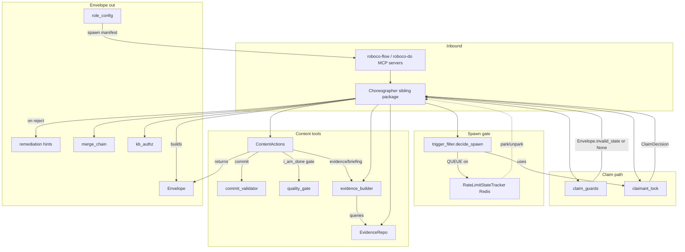

## Logical Tree
```
gateway-support
  envelope.py
    Envelope (dataclass)
      ok / tracing_gap / incomplete_input / invalid_state / not_authorized / not_found / circuit_open / from_decision
      with_introspection (best-effort, never raises)
      as_dict (wire serializer)
  claim_guards.py
    _ACTIVE_BLOCKING_STATUSES = {claimed, in_progress, verifying, blocked}
    already_active_guard
    paused_tasks_guard (target excluded)
    unmet_dependency_guard
  claimant_lock.py
    ClaimDecision (GRANTED / GRANTED_AFTER_STALE_RELEASE / BLOCKED_OTHER_ACTIVE)
    is_stale
    try_acquire
  trigger_filter.py
    TriggerKind / SpawnDecision / Decision / SpawnConfig / TriggerContext
    _stale_trigger_decision
    decide_spawn (5 ordered rules)
  commit_validator.py
    ValidationResult
    validate_commit_message
  content_actions.py
    helpers: _merge_resumption_fields, _render_journal_content, _normalize_structured, _strip_task_prefix, _reject_soup, _ownership_violation, _not_active_claimant, _coerce_pitch_cells
    role frozensets: _COMMIT_ALLOWED_ROLES, _NOTIFY_ALLOWED_ROLES, _NO_COMMS_ROLES, _PITCH_ROLES, _DRAFT/_CURATE_PLAYBOOK_ROLES
    ContentActionsDeps
    ContentActions
      commit / note / _write_journal_note / _record_section_handoff
      draft_playbook / approve_playbook / reject_playbook / archive_playbook / _curate_playbook
      pitch / say / dm / notify / _reject_disallowed_recipient / _reject_ceo_dependency_notify / _dependency_block_reason
      evidence / _is_caller_dependency / _active_claim_violation / _verify_explicit_task_ownership / _board_may_co_review
      progress / open_session / link_session
      notify_list / notify_get / notify_ack / channels / read_messages
      pr_update / _pr_update_is_authorized
  evidence_builder.py
    EvidencePayload / BriefingInputs
    build_evidence_for_task / build_task_handoff / _extract_pr_review / _has_prior_work
    build_context_briefing / shape_memory_query
  evidence_repo.py
    EvidenceRepo
      company_goals / list_unread_a2a / list_unread_mentions / list_pending_notifications
      task_metadata_gaps / recent_team_activity / blockers_in_lane
      journal_highlights_for_task / similar_memory
  kb_authz.py
    authorize_kb_action / docs_denial_envelope
  merge_chain.py
    branch_depth / parent_branch_for / resolve_parent_branch / _project_default_branch
  quality_gate.py
    GateResult / run_quality_commands / _run_one
  rate_limit_tracker.py
    _INCREMENT_PROBE_FAILURES / _RESET_PROBE_FAILURES (Lua)
    RateLimitStateTracker
      activate / clear / is_rate_limited / get_state / increment_probe_failures / reset_probe_failures
      list_rate_limited_providers / _read_rate_limited_entry
  remediation.py
    hint_for_* (12 hint functions)
  role_config.py
    RoleConfig / ROLE_CONFIGS / get_role_config
    _DEV/_QA/_DOC/_CELL_PM/_MAIN_PM/_BOARD/_AUDITOR/_PR_REVIEWER/_PROMPTER/_SECRETARY flow+do tuples
```

## Entry Points

| Name | File | Trigger |
|---|---|---|
| Choreographer verb composition | roboco/services/gateway/choreographer/ | every agent flow/do verb call composes these helpers; the choreographer owns the state machine, this slice is the support layer |
| claim verbs (give_me_work / i_will_work_on / i_will_plan / claim_review / claim_doc_task) | roboco/services/gateway/claim_guards.py | Choreographer runs claim_guards + claimant_lock.try_acquire before any task-status mutation |
| do-tool verbs (commit/note/say/dm/notify/evidence/progress/pr_update/draft_playbook/pitch/open_session/...) | roboco/services/gateway/content_actions.py | roboco-do MCP server -> Choreographer -> ContentActions method |
| orchestrator spawn tick | roboco/services/gateway/trigger_filter.py | per dispatch tick the orchestrator calls decide_spawn for each (task,trigger) |
| provider park/unpark + probe loop | roboco/services/gateway/rate_limit_tracker.py | i_am_blocked(rate_limited) -> activate; background probe loop -> increment/reset/clear |
| i_am_done pre-submit gate | roboco/services/gateway/quality_gate.py | Choreographer runs run_quality_commands in dev workspace before accepting submit |
| spawn manifest build | roboco/services/gateway/role_config.py | orchestrator builds /app/tool-manifest.json from ROLE_CONFIGS at agent spawn |
| docs/optimal HTTP routes | roboco/services/gateway/kb_authz.py | api.routes.docs / api.routes.optimal call authorize_kb_action / docs_denial_envelope |
| PR open/merge target resolution | roboco/services/gateway/merge_chain.py | GitService PR ops + Choreographer submit_up/submit_root resolve base branch |
| briefing assembly | roboco/services/gateway/evidence_repo.py | every verb response that carries context_briefing queries EvidenceRepo then evidence_builder shapes it |

## Config Flags
- ROBOCO_OVERLOAD_BREAK_ENABLED (provider overload parks like a 429; tracker stores kind='overloaded')
- ROBOCO_GATEWAY_HEALTH_ENABLED (reaper probes gateway; orthogonal to this slice but tracker feeds park state)
- ROBOCO_GATEWAY_HEALTH_GRACE_SECONDS
- ROBOCO_RELEASE_MANAGER_ENABLED / ROBOCO_ORG_MEMORY_ENABLED (similar memory path gated; similar_memory best-effort returns [] when off/failing)
- ROBOCO_ORG_MEMORY_TOP_K / ROBOCO_ORG_MEMORY_MIN_SCORE (shape_memory_query + similar_memory flooring)
- ROBOCO_CONVENTIONS_ENABLED (convention_findings in EvidencePayload; empty when off)
- settings.commit_subject_min_chars / settings.commit_banned_words (commit_validator overrides)
- settings.redis_url (RateLimitStateTracker key prefix + list_rate_limited_providers scan)
- SpawnConfig.cooldown_seconds / role_rate_per_minute / claim_stale_seconds (trigger_filter tunables, caller-supplied)
- _GATE_TIMEOUT_SECONDS=600 / _OUTPUT_EXCERPT_CHARS=2000 (quality_gate module constants)
- BRIEFING_LIST_CAP=10 (evidence_builder/repo list caps)


## Gotchas
- claimant_lock is pure: it never writes tasks.active_claimant_id / last_heartbeat_at. The Choreographer persists the decision. Two callers acting on the same task must serialize via DB row write, not via this module.
- claim_guards._ACTIVE_BLOCKING_STATUSES now includes 'blocked' (changed in 15effce0). A dev with a genuinely blocked task can no longer claim a new one until they pause/unclaim. Intended fix but a behavior change agents must learn.
- claim_guards and claimant_lock have NO PM-coordinator exclusion; _COORDINATOR_ROLES skip lives in the Choreographer's _run_claim_guards, NOT here. Importing these predicates elsewhere bypasses the PM exemption.
- trigger_filter.decide_spawn rule order is load-bearing: stale > provider-rate > claimant > cooldown > role-rate. Reordering changes which QUEUE reason wins and which gates never get re-evaluated.
- RateLimitStateTracker.activate writes a FRESH blob (probe_failures=0). increment/reset_probe_failures use Lua so a concurrent activate re-park can't clobber the counter mid-increment — but activate itself is a plain SET, so a probe-failure increment racing an activate CAN be overwritten by the fresh blob (the Lua scripts only protect increment vs increment, not increment vs activate).
- RateLimitStateTracker.list_rate_limited_providers swallows ALL exceptions and returns []; a Redis outage looks identical to 'nothing rate-limited' — callers must not treat [] as 'healthy'.
- quality_gate._run_one previously used `proc.returncode or 0` which turned a None returncode into 0 (passing an unknown-status gate). Now fixed to fail closed (return 1). The 124 timeout code is distinct from a real non-zero exit.
- content_actions._curate_playbook now explicitly `await self.task.session.commit()` before RAG index/unindex. The index writes run through their own auto-committing connection; commit-before-index is what gates the corpus. A caller that already committed would double-commit (no-op), but a caller in a broken transaction would surface a PendingRollbackError here.
- content_actions.archive_playbook previously routed through the reject action with reason='archived' (a bug fixed in 15effce0); it now calls svc.archive. Any test still asserting the old reject-on-archive behavior will fail.
- _merge_resumption_fields fills missing done/next/where_to_look from top-level args WITHOUT overwriting supplied keys. A model that passes section={'done': X} AND done='Y' keeps X — the nested section wins. Tests asserting top-level overrides nested are wrong.
- Envelope.with_introspection catches ALL exceptions (including sqlalchemy MissingGreenlet on an expired async session post-rollback) and degrades to valid_next_verbs=[]. Introspection is best-effort and never raises — do not rely on current_state being populated on error paths.
- evidence_repo.list_unread_mentions / list_pending_notifications use PostgreSQL array `.contains([agent_id])` on to_agents / acked_by. Performance + correctness depend on those being GIN-indexed JSON/ARRAY columns; a missing index makes the per-verb briefing query slow.
- merge_chain.parent_branch_for reuses the child's own team segment for the parent — WRONG across a cell->root team boundary (feature/backend/... -> feature/main_pm/...). resolve_parent_branch reads the parent task's real branch_name and is the cross-team-safe path; only fall back to string derivation when no parent / no project.
- commit_validator length check runs BEFORE banned-word check, so a 3-char banned word like 'wip' is caught as 'shorter than 20' not 'banned'. Tests asserting the banned-word reason for short messages are wrong (the docstring notes this).
- ContentActions._reject_soup returns an Envelope (never raises / never a raw 422) precisely because a 422 trips the do-server circuit breaker. Any new validation path must follow the same pattern.


## Drift from CLAUDE.md
- CLAUDE.md: 'pr_reviewer ... no agent comms' — content_actions._NO_COMMS_ROLES enforces this at the handler (defence-in-depth), matching the doc. No drift.
- CLAUDE.md: 'Auditor is restricted to note (scope=reflect) + evidence, plus approve_playbook/reject_playbook/archive_playbook'. role_config._AUDITOR_DO also adds notify_list/notify_get + channels (read-only inbox + channel map). This is an additive expansion beyond the doc's literal 'note + evidence' but is consistent with the doc's 'Wave 1 receivers get inbox read' footnote; arguably doc under-states the surface. Not a code drift.
- CLAUDE.md: 'The note/journal write returns as soon as the entry is persisted; RAG indexing (Ollama embedding) runs fire-and-forget'. content_actions._curate_playbook instead does an EXPLICIT await self.task.session.commit() before svc.index_approved / unindex_playbook — commit-before-index is intentional (gates the corpus). Not drift but a deliberate exception to the fire-and-forget pattern for the playbook curation path.
- CLAUDE.md: claim-time concurrency guards 'are skipped for the coordinator PM roles (_COORDINATOR_ROLES = {main_pm, cell_pm}, consulted in _run_claim_guards)'. That skip lives in the Choreographer, NOT in claim_guards.py (this slice). The predicates in this slice have no PM exclusion — importing them directly elsewhere would re-introduce the PM self-block. By design, but the module boundary is easy to misread.


## Changes Since Baseline

| SHA | Subject | Impact |
|---|---|---|
| 15effce0 | Chore: 141 Gaps fill-in (#283) — single commit touching this slice | claim_guards: added 'blocked' to _ACTIVE_BLOCKING_STATUSES so a dev holding a blocked task can't claim a second one (previously excluded -> held two in_progress). |
| 15effce0 | quality_gate: reap timeout zombie + fail-closed on None returncode | _run_one now awaits proc.wait() after kill (no lingering zombie/FD leak) and returns 1 (fail closed) when proc.returncode is None instead of `or 0` (which falsely passed the gate on unknown exit). |
| 15effce0 | rate_limit_tracker: atomic Lua increment/reset of probe_failures | increment/reset_probe_failures moved from non-atomic get_state->mutate->set to server-side Lua EVAL mutating ONLY probe_failures; a concurrent activate() re-park can no longer clobber a stale blob over the fresh episode metadata. |
| 15effce0 | content_actions: top-level done/next/where_to_look resumption fields + _merge_resumption_fields | note(scope='handoff') now accepts top-level done/next/where_to_look string args folded into section without overwriting supplied keys — fixes the minimax section={} -> 'done Field required' PM respawn-loop meltdown. |
| 15effce0 | content_actions: _NO_COMMS_ROLES defence-in-depth expanded to pr_reviewer + prompter + secretary | say/dm now refuse auditor, pr_reviewer, prompter, secretary (previously only auditor). New _no_comms_remediate role-specific hints. |
| 15effce0 | content_actions: notify rejects prompter/secretary recipients via _reject_disallowed_recipient | notify() to a human-only role (no agent ack path) now returns not_authorized; previously an ack-required signal could sit permanently unacked and suppress later same-purpose notifications via the dedup query. |
| 15effce0 | content_actions: archive_playbook fixed + _curate_playbook commit-before-index + ConflictError handling | archive_playbook now calls svc.archive (previously mis-routed through reject with reason='archived'); _curate_playbook commits the status change BEFORE RAG index/unindex so a rolled-back txn can't drop a playbook in the corpus; ConflictError (status-precondition) returns invalid_state not 500. |
| 15effce0 | evidence_builder: surface pr_review verdict in task_handoff via _extract_pr_review | build_task_handoff now reads notes_structured.pr_review and includes verdict/summary/issues/head_sha so a respawned PM doesn't re-submit the same PR blind; _has_prior_work extended to count pr_review as a prior-work signal. |
| 15effce0 | remediation: hint_for_short_quick_context now points to top-level done/next string args | Hint text updated to 'pass done and next as top-level string args, not nested in section' to match the new _merge_resumption_fields contract. |

## Regression Risks

| Title | File:Line | Claim | Severity |
|---|---|---|---|
| blocked task now blocks new claims | roboco/services/gateway/claim_guards.py:31 | Adding 'blocked' to _ACTIVE_BLOCKING_STATUSES means a dev whose task is externally blocked can no longer claim a parallel task until they pause/unclaim. If a downstream flow expected a blocked dev to pick up other work (e.g. a PM delegating to a blocked-but-capable dev), that dev is now hard-refused. The comment says it's intended (blocked still owns the task), but any orchestration path that relied on the old exclusion will silently QUEUE. | medium |
| archive_playbook behavior change: was reject, now archive | roboco/services/gateway/content_actions.py:784 | archive_playbook previously routed through _curate_playbook with action='reject' and reason='archived' (a latent bug). It now calls svc.archive and status='playbook_archived'. Any caller/test asserting the archived playbook landed in the rejected/archived-with-reason state will fail, and the unindex_playbook branch now runs for archive (previously archive went through reject which may not have unindexed). | medium |
| _curate_playbook explicit session.commit before index | roboco/services/gateway/content_actions.py:847 | New `await self.task.session.commit()` runs before svc.index_approved/unindex_playbook. If the caller's session is already in a PendingRollbackError state (e.g. a prior mid-verb failure poisoned it), this commit raises and the whole curation verb 500s instead of returning a clean envelope. Also, double-commit when the route later commits is a no-op but assumes the session is healthy. | medium |
| notify to prompter/secretary now refused | roboco/services/gateway/content_actions.py:1251 | _reject_disallowed_recipient now hard-refuses notify() to prompter/secretary. If any existing PM/Board flow legitimately notified the prompter or secretary (e.g. a Board broadcast loop that iterates all roles), those sends now return not_authorized and the notification never lands. The CEO is explicitly excluded from this rule (acks via panel), but prompter/secretary are not. | medium |
| quality_gate None-returncode now fails the gate | roboco/services/gateway/quality_gate.py:95 | Previously `proc.returncode or 0` let an unknown exit status PASS the gate (false green). Now None -> return 1 (fail closed). A workspace where the process is terminated out-of-band (e.g. OOM killer, signal) will now BLOCK i_am_done where it previously passed. Correct, but if the dev environment has a flaky signal-delivery issue, submits that used to succeed will now fail with no clear remediation. | low |
| _merge_resumption_fields nested-section-wins may surprise | roboco/services/gateway/content_actions.py:60 | If a model passes BOTH section={'done': X} AND done='Y', the nested section wins (X kept, Y ignored). A caller/test that expected the top-level done to override the nested section, or that passed both expecting union semantics, gets the section's value. The 'without overwriting' direction is documented but easy to misread. | low |
| Lua increment vs activate race still exists | roboco/services/gateway/rate_limit_tracker.py:107 | increment/reset_probe_failures are atomic vs each other, but activate() is a plain SET that overwrites the whole blob. A probe-failure increment that races an activate (re-park) can still be overwritten by the fresh activate blob (probe_failures reset to 0). The fix narrows the race to increment-vs-activate only; it does not eliminate it. If the orchestrator re-parks while a probe is mid-increment, the probe count resets to 0 and the give-up threshold may never be reached. | low |
| evidence_builder pr_review surface adds a new prior-work trigger | roboco/services/gateway/evidence_builder.py:159 | _has_prior_work now returns True when pr_review is not None, so a task with only a prior pr_fail verdict (no commits/acceptance/PR) now produces a non-None handoff. A briefing consumer that assumed handoff non-None implied committable prior work may now render a handoff with only a pr_review block. Cosmetic, but changes the handoff-non-null invariant. | low |

## Health
This slice is a mature, well-documented support layer with clear seams (pure helpers vs DB-touching services vs the wire Envelope). The single baseline-to-HEAD commit (15effce0) is a coherent set of bug fixes and defence-in-depth expansions: the blocked-task claim guard, the quality_gate zombie-reap + fail-closed fix, the atomic Lua probe-counter, the top-level resumption fields, the expanded no-comms gate, the prompter/secretary notify refusal, and the archive_playbook bug fix with commit-before-index ordering. The main integrity concerns are behavioral, not structural: the blocked-claim change and the prompter/secretary notify refusal are intended but could break orchestration paths that relied on the old permissiveness; the archive_playbook fix changes the archived-playbook observable state; and the rate_limit race window is narrowed (increment-vs-increment atomic) but not closed (increment-vs-activate still overwrites). The Envelope contract is stable and the introspection path correctly degrades. Regression risk is moderate and concentrated in content_actions.py and the two claim/spawn guards, all of which have clear test coverage expectations per the commit message.

# RoboCo Slice Map — `mcp-servers`

Scope: `roboco/mcp/` (every server file + `schemas/` + `utils.py`). Repo root: `/Users/renzof/Documents/GitHub/ZZZ/roboco-master/roboco`.

## Purpose

The `roboco/mcp` package is the agent-side MCP gateway: a set of `FastMCP` server processes that run **inside each agent container** and expose the RoboCo intent-verb / content-tool / RAG / docs / git-readonly / intake / secretary / web-research surfaces to the Claude Code or grok-CLI runtime as MCP tools. They are thin bridges — every tool either POSTs to the orchestrator's HTTP gateway (`/api/v1/flow/*`, `/api/v1/do/*`, `/api/git/*`, `/optimal/*`, `/docs/*`, `/research/*`, `/api/secretary/*`, `/api/prompter/live/*`) or, for the flow/do path, additionally forwards rejections to a per-container SDK loopback (`ROBOCO_SDK_URL`) that runs the per-verb circuit breaker. The orchestrator (not the MCP layer) is the authority for role scoping, state transitions, and git-side effects; the MCP layer only shapes calls, classifies rejections, and substitutes `circuit_open` envelopes when the breaker trips.

## Files

| Path | Role | approx LOC |
|------|------|------------|
| `roboco/mcp/__init__.py` | Package docstring only — deliberately import-free so `python -m roboco.mcp.<name>` does not pull sibling modules (esp. `optimal_server`'s pgvector/ollama stack, ~6s startup). | 23 |
| `roboco/mcp/utils.py` | Shared HTTP helpers: `_get_agent_headers`, `format_error_response`, `ApiResponse`, `ApiClient` (async httpx wrapper). Used by `optimal_server`, `docs_server`, `search_server`. | 383 |
| `roboco/mcp/schemas/__init__.py` | Pydantic input models. After Phase-4 T9 deletions only `WriteDocInput` remains. | 35 |
| `roboco/mcp/flow_server.py` | `roboco-flow` MCP server — intent verbs (lifecycle). Manifest-scoped registration, role-scoped path `/api/v1/flow/<route>/<verb>`, per-verb circuit breaker + 404-route synthesis. | 857 |
| `roboco/mcp/do_server.py` | `roboco-do` MCP server — content tools (commit, note, say, dm, notify, evidence, progress, sessions, playbook curation, pr_update). Manifest-scoped; fixed `/api/v1/do/<verb>` path; mirror circuit breaker. | 805 |
| `roboco/mcp/optimal_server.py` | `roboco-optimal` MCP server — RAG / KB / mentor / error / decision / standards / learnings / index-mgmt / proactive-context. Factory `create_optimal_mcp_server(agent_id)`; calls `/optimal/*`. | 1102 |
| `roboco/mcp/docs_server.py` | `roboco-docs` MCP server — docs write/read/list/delete via `/docs/*`. Factory `create_docs_mcp_server(agent_id)`. RAG-based dedup on write. | 238 |
| `roboco/mcp/git_readonly.py` | `roboco-git-readonly` MCP server — four read-only git views (status/log/diff/branch list) via `/api/git/*`. No breaker, no manifest. | 123 |
| `roboco/mcp/intake_server.py` | `roboco-intake` MCP server — grok intake path only: `propose_draft` / `propose_batch` POST directly to the prompter-live relay. | 172 |
| `roboco/mcp/secretary_server.py` | `roboco-secretary` MCP server — grok secretary path only: `read_company_state` / `read_task` / `submit_directive`, delegating to `agent_sdk.secretary_driver`. | 64 |
| `roboco/mcp/search_server.py` | `roboco-search` MCP server — `web_search` / `web_fetch` via `/research/*` (provider key stays server-side). Factory `create_search_mcp_server(agent_id)`. | 130 |

(Excluded: `__pycache__/`, `.DS_Store`.)

## Key Symbols

| Name | Kind | File:Line | Responsibility |
|------|------|-----------|----------------|
| `mcp` (flow) | `FastMCP` | `flow_server.py:137` | Server instance `roboco-flow`; tools registered onto it at import time. |
| `mcp` (do) | `FastMCP` | `do_server.py:121` | Server instance `roboco-do`. |
| `mcp` (git-readonly) | `FastMCP` | `git_readonly.py:31` | Server instance `roboco-git-readonly`. |
| `mcp` (intake) | `FastMCP` | `intake_server.py:31` | Server instance `roboco-intake`. |
| `mcp` (secretary) | `FastMCP` | `secretary_server.py:30` | Server instance `roboco-secretary`. |
| `StrList` | type alias | `flow_server.py:39` | `Annotated[list[str], BeforeValidator(coerce_str_list)]` — tolerates Claude SDK's nested XML-ish tool-input shapes before MCP validation rejects. |
| `_CIRCUIT_REJECTION_KINDS` | frozenset | `flow_server.py:66`, `do_server.py:50` | The 4 breaker-counted kinds: `tracing_gap`, `invalid_state`, `not_authorized`, `incomplete_input`. |
| `_classify_dict_error_code` | func | `flow_server.py:85`, `do_server.py:69` | Map a dict-shaped `error.code` (FastAPI exception handler) to a counted breaker kind; NOT_FOUND → None. |
| `_classify_rejection` | func | `flow_server.py:101`, `do_server.py:85` | Classify all 3 rejection shapes (string kind / dict error / 422 `detail`) → counted kind or None. Guards the `dict in frozenset` `TypeError`. |
| `_build_headers` | func | `flow_server.py:141`, `do_server.py:125` | Per-call headers: `X-Agent-ID`, `X-Agent-Role`, fresh `X-Correlation-ID` (UUID per MCP call). |
| `_post` (flow) | func | `flow_server.py:157` | POST to orchestrator; surface Envelope on 2xx/4xx; synthesize `invalid_state` on 404 missing route; `transport_error` on non-JSON; forward rejection to breaker. |
| `_post` (do) | func | `do_server.py:139` | Mirror of flow `_post` for content tools. |
| `_record_and_check_circuit` | func | `flow_server.py:249`, `do_server.py:223` | Forward a rejection to `SDK_URL/verb/attempted`; if SDK says `open`, replace the payload with `circuit_envelope`. Best-effort (fail-open). |
| `_verb_from_path` | func | `flow_server.py:239`, `do_server.py:213` | Extract verb name from path for breaker reporting. |
| `_ROLE_TO_ROUTE_PREFIX` | dict | `flow_server.py:319` | Maps `product_owner`/`head_marketing` → `board` route segment; every other role passes through unchanged. |
| `_role_path` | func | `flow_server.py:326` | Build `/api/v1/flow/<route>/<verb>` path. |
| `_TOOLS` (flow) | dict | `flow_server.py:722` | Verb name → Python impl map (27 verbs). `pass`/`fail` keys bridge the `pass_review`/`fail_review` IntentSpec names. |
| `_INTENT_TO_PUBLIC` | dict | `flow_server.py:772` | `pass_review`→`pass`, `fail_review`→`fail` — fixes the dogfood gap where QA tools were silently dropped. |
| `_load_manifest_flow_tools` | func | `flow_server.py:778` | Read `/app/tool-manifest.json` `flow_tools`; None if missing/unreadable. |
| `_register_tools` (flow) | func | `flow_server.py:808` | Refuse to start if manifest missing (no all-verbs fallback — would let off-role verbs 404). Raises `RuntimeError`. |
| `_REGISTERED_TOOLS` (flow) | var | `flow_server.py:853` | Import-time registration side effect. |
| `_TOOLS` (do) | dict | `do_server.py:706` | Tool name → impl map (19 content tools). |
| `_load_manifest_do_tools` | func | `do_server.py:730` | Read manifest `do_tools` list. |
| `_register_tools` (do) | func | `do_server.py:760` | Manifest-scoped registration; refuse to start if manifest missing. |
| `give_me_work` … `i_am_idle` | verb funcs | `flow_server.py:334–465` | Dev verbs. |
| `claim_review` / `pass_review` / `fail_review` | verb funcs | `flow_server.py:471–493` | QA verbs (registered as `pass`/`fail`). |
| `claim_pr_review` / `post_pr_review` / `claim_gate_review` / `pr_pass` / `pr_fail` | verb funcs | `flow_server.py:499–712` | PR-reviewer verbs (inbound + in-path gate). |
| `i_will_plan` / `delegate` / `submit_up` / `submit_root` | verb funcs | `flow_server.py:602–697` | PM coordination verbs. |
| `note` | verb func | `do_server.py:292` | Journal entry + handoff section writer (top-level `done`/`next` strings — the meltdown-#1 fix). |
| `commit` / `say` / `dm` / `notify` / `evidence` | verb funcs | `do_server.py:287–461` | Core content tools. |
| `progress` / `open_session` / `link_session` / `notify_list` / `notify_get` / `notify_ack` / `channels` / `pr_update` / `read_messages` | verb funcs | `do_server.py:510–698` | Wave-1 parity content tools. |
| `draft_playbook` / `approve_playbook` / `reject_playbook` / `archive_playbook` | verb funcs | `do_server.py:464–504` | Playbook curation (delivery + Auditor). |
| `create_optimal_mcp_server` | factory | `optimal_server.py:1068` | Build `roboco-optimal-{agent_id}` server; registers 8 tool groups. |
| `roboco_kb_search` / `roboco_rag_query` / `roboco_kb_stats` | tools | `optimal_server.py:70–213` | Search / RAG / stats. |
| `roboco_ask_mentor` | tool | `optimal_server.py:371` | Primary conversational RAG tool (65s timeout). |
| `roboco_search_error` / `roboco_record_error_solution` | tools | `optimal_server.py:439–535` | Error-pattern memory. |
| `roboco_check_decision` / `roboco_record_decision` | tools | `optimal_server.py:542–625` | Decision memory (`RecordDecisionInput` pydantic model at L33). |
| `roboco_get_standards` / `roboco_validate_action` / `roboco_review_code` | tools | `optimal_server.py:632–765` | Standards + validation. |
| `roboco_record_learning` / `roboco_search_learnings` | tools | `optimal_server.py:772–875` | Learnings. |
| `roboco_clear_index` / `roboco_reindex_all` / `roboco_index_status` | tools | `optimal_server.py:882–993` | Index admin. |
| `roboco_get_proactive_context` | tool | `optimal_server.py:1000` | Stored-then-fresh proactive context for a task. |
| `normalize_index_types` | func | `optimal_server.py:53` | Map legacy `docs` alias → `documentation` before route's `IndexType(...)` conversion. |
| `create_docs_mcp_server` | factory | `docs_server.py:147` | Build `roboco-docs-{agent_id}` server (write/read/list/delete). |
| `WriteDocInput` | pydantic | `schemas/__init__.py:12` | Docs write input (task_id, filename, doc_type, title, content). |
| `roboco_git_status` / `roboco_git_log` / `roboco_git_diff` / `roboco_git_branch_list` | tools | `git_readonly.py:45–119` | Read-only git views via `/api/git/*`. |
| `propose_draft` / `propose_batch` | tools | `intake_server.py:94–168` | Grok intake: POST draft/batch to prompter-live relay; `propose_batch` drops malformed (no string `title`) entries and refuses empty batches. |
| `post_draft` / `post_batch` / `_post_event` | funcs | `intake_server.py:40–91` | Relay POST helpers (never raise; unit-testable with `httpx.MockTransport`). |
| `read_company_state` / `read_task` / `submit_directive` | tools | `secretary_server.py:33–60` | Secretary CEO-authority tools; delegate to `agent_sdk.secretary_driver`. |
| `ApiClient` | class | `utils.py:115` | Async httpx client with agent headers, base URL `settings.internal_api_url`, `get/post/put/patch/delete` + `*_or_error` tuples. |
| `ApiResponse` | class | `utils.py:82` | Response wrapper (`ok`, `status_code`, `json`, `text`, `is_status`). |
| `_get_agent_headers` | func | `utils.py:27` | `X-Agent-ID`/`X-Agent-Role`/`X-Agent-Team`/`X-Agent-Token` (HMAC token from `ROBOCO_AGENT_TOKEN`). |
| `format_error_response` | func | `utils.py:52` | Wraps `roboco.api.schemas.common.error_response`. |
| `create_search_mcp_server` | factory | `search_server.py:83` | `roboco-search-{agent_id}` with `web_search`/`web_fetch`. |

## Data Flow

Every server is launched as its own subprocess (`uv run --no-sync python -m roboco.mcp.<name> [agent_id]`) by the orchestrator's `_generate_mcp_config` (for flow/do/git-readonly/optimal/docs/search) or by the grok intake/secretary mains (for intake/secretary). At import time the flow/do servers read `/app/tool-manifest.json` (env `ROBOCO_TOOL_MANIFEST_PATH`) and register only the verbs/tools listed for the role — refusing to start if the manifest is missing (no all-tools fallback, which previously let PMs see dev verbs and 404). The optimal/docs/search/intake/secretary/git-readonly servers register their full tool surface unconditionally (role gating is server-side at the route).

When an agent calls a tool:

1. **flow/do** — `_post` builds headers (fresh `X-Correlation-ID` per call), POSTs the JSON body to the orchestrator at `/api/v1/flow/<route>/<verb>` or `/api/v1/do/<verb>`. On 404 (a manifest-advertised verb with no matching route) it synthesizes an `invalid_state` Envelope so the agent gets a `remediate` hint instead of a raw `detail` body. On non-JSON body it synthesizes `transport_error`. Otherwise the Envelope is surfaced as-is (success or rejection).
2. **breaker path** — `_classify_rejection` determines whether the envelope is a counted rejection (string kind / dict `error.code` / 422 `detail` list). If counted, `_record_and_check_circuit` POSTs to the local SDK at `ROBOCO_SDK_URL/verb/attempted` (2s timeout). If the SDK returns `open=true`, the original rejection is **replaced** by the SDK's `circuit_envelope` before returning to the agent — stopping retry storms. SDK unreachable → fail-open (return original payload + log).
3. **optimal/docs/search** — `ApiClient` (async httpx) calls the orchestrator's `/optimal/*`, `/docs/*`, `/research/*` routes with `X-Agent-*` headers; shapes the response into a tool-specific dict (status, results, hints).
4. **git-readonly** — `_get` does a synchronous httpx GET to `/api/git/*` with `X-Agent-ID`/`X-Agent-Role`; `raise_for_status` propagates HTTP errors.
5. **intake** — `propose_draft`/`propose_batch` POST directly to `/api/prompter/live/{session}/events` (the prompter-live relay) because grok's `streaming-json` output does not surface tool-call events. Returns a human-readable string (not an Envelope).
6. **secretary** — the three tools delegate to `agent_sdk.secretary_driver._do_*` helpers (shared with the Claude SDK path) and `json.dumps` the result.

## Mermaid

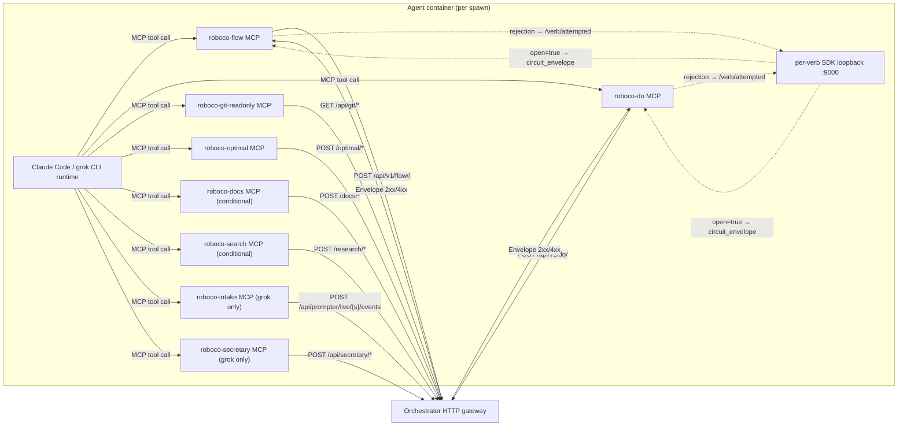

## Logical Tree

```
roboco/mcp/
├── __init__.py              # import-free package docstring (avoid sibling-load startup tax)
├── utils.py
│   ├── _get_agent_headers() # X-Agent-ID/Role/Team/Token (HMAC)
│   ├── format_error_response()
│   ├── ApiResponse          # ok / status_code / json / text / is_status
│   └── ApiClient            # async httpx; get/post/put/patch/delete + *_or_error
├── schemas/__init__.py
│   └── WriteDocInput        # only survivor of Phase-4 T9 deletions
├── flow_server.py           # roboco-flow (intent verbs)
│   ├── StrList              # BeforeValidator(coerce_str_list) — SDK XML-ish input
│   ├── _CIRCUIT_REJECTION_KINDS / _classify_dict_error_code / _classify_rejection
│   ├── _build_headers / _post / _verb_from_path / _record_and_check_circuit
│   ├── _ROLE_TO_ROUTE_PREFIX (PO/HM → board) / _role_path
│   ├── dev verbs: give_me_work, i_will_work_on, open_pr, i_am_done, i_am_blocked, unclaim, reassign, resume, sync_branch, i_am_idle
│   ├── QA verbs: claim_review, pass_review(→pass), fail_review(→fail)
│   ├── PR-reviewer verbs: claim_pr_review, post_pr_review, claim_gate_review, pr_pass, pr_fail
│   ├── Doc verbs: claim_doc_task, i_documented
│   ├── PM verbs: triage, triage_all, unblock, complete, escalate_up, i_will_plan, delegate, submit_up, submit_root
│   ├── Board/Main-PM: escalate_to_ceo
│   ├── _TOOLS / _INTENT_TO_PUBLIC
│   └── _load_manifest_flow_tools / _register_tools (fails loud if no manifest)
├── do_server.py             # roboco-do (content tools)
│   ├── mirror breaker machinery (_CIRCUIT_REJECTION_KINDS, _classify_*, _record_and_check_circuit)
│   ├── commit, note (handoff done/next), pitch, say, dm, notify, evidence
│   ├── progress, open_session, link_session, notify_list/get/ack, channels, pr_update, read_messages
│   ├── draft_playbook, approve_playbook, reject_playbook, archive_playbook
│   └── _TOOLS / _load_manifest_do_tools / _register_tools (fails loud)
├── optimal_server.py        # roboco-optimal (RAG/KB)
│   ├── RecordDecisionInput, normalize_index_types (docs→documentation)
│   ├── _register_search_tools (kb_search, rag_query, kb_stats)
│   ├── _register_indexing_tools (index_code, index_docs)
│   ├── _register_utility_tools (tokens_estimate)
│   ├── _register_mentor_tools (ask_mentor)
│   ├── _register_error_tools (search_error, record_error_solution)
│   ├── _register_decision_tools (check_decision, record_decision)
│   ├── _register_standards_tools (get_standards, validate_action, review_code)
│   ├── _register_learning_tools (record_learning, search_learnings)
│   ├── _register_index_management_tools (clear_index, reindex_all, index_status)
│   ├── _register_proactive_tools (get_proactive_context)
│   └── create_optimal_mcp_server(agent_id)
├── docs_server.py           # roboco-docs
│   ├── _handle_write/read/list/delete
│   └── create_docs_mcp_server(agent_id)
├── git_readonly.py          # roboco-git-readonly (4 read-only tools)
├── intake_server.py         # roboco-intake (grok only)
│   ├── _post_event / post_draft / post_batch
│   └── propose_draft / propose_batch (MegaTask)
├── secretary_server.py      # roboco-secretary (grok only; delegates to secretary_driver)
└── search_server.py         # roboco-search (web research, Board+PM)
    ├── _handle_search / _handle_fetch
    └── create_search_mcp_server(agent_id)
```

## Dependencies

**Internal (roboco):**
- `roboco.config.settings` — `internal_api_url` (utils), `research_enabled` (orchestrator mount gate).
- `roboco.agents_config` — `get_agent_role`, `get_agent_team` (utils headers).
- `roboco.api.schemas.common.error_response` (utils `format_error_response`).
- `roboco.foundation.policy.content.validators.coerce_str_list` (flow `StrList`).
- `roboco.agent_sdk.secretary_driver` — `_do_read_state` / `_do_read_task` / `_do_submit_directive` (secretary server).
- `roboco.mcp.schemas.WriteDocInput` (docs server).
- `roboco.mcp.utils.ApiClient` / `format_error_response` (optimal, docs, search).

**External:**
- `mcp.server.fastmcp.FastMCP` — MCP server framework (all servers).
- `pydantic` (`BaseModel`, `Field`, `BeforeValidator`, `Annotated`) — input validation.
- `httpx` — sync (flow/do/git-readonly) + async (utils ApiClient, intake) HTTP.
- `structlog` — logging (flow/do).
- `fastapi.status` — HTTP status constants (optimal).

**Downstream consumers:**
- `roboco.runtime.orchestrator._generate_mcp_config` — mounts flow/do/git-readonly/optimal (always), docs (docs_roles), search (research_roles + `research_enabled`).
- `roboco.agent_sdk.grok_intake_main` / `grok_secretary_main` — mount intake/secretary for the grok path.
- `roboco.runtime.spawn_manifest` — writes `/app/tool-manifest.json` (the `flow_tools`/`do_tools` lists the flow/do servers read at import).

## Entry Points

- `python -m roboco.mcp.flow_server` — `mcp.run()` at `flow_server.py:857`. Env required: `ROBOCO_AGENT_ID`, `ROBOCO_AGENT_ROLE`; reads `ROBOCO_ORCHESTRATOR_URL`, `ROBOCO_SDK_URL`, `ROBOCO_TOOL_MANIFEST_PATH`.
- `python -m roboco.mcp.do_server` — `mcp.run()` at `do_server.py:805`. Same env as flow.
- `python -m roboco.mcp.git_readonly` — `mcp.run()` at `git_readonly.py:123`. Env: `ROBOCO_AGENT_ID`, `ROBOCO_AGENT_ROLE`, `ROBOCO_ORCHESTRATOR_URL`.
- `python -m roboco.mcp.optimal_server <agent_id>` — `server.run()` at `optimal_server.py:1102`. Positional `agent_id` arg.
- `python -m roboco.mcp.docs_server <agent_id>` — `server.run()` at `docs_server.py:238`.
- `python -m roboco.mcp.search_server <agent_id>` — `server.run()` at `search_server.py:130`.
- `python -m roboco.mcp.intake_server` — `mcp.run()` at `intake_server.py:172`. Env: `ROBOCO_API_URL`, `ROBOCO_PROMPTER_SESSION_ID`. Mounted by `grok_intake_main`, NOT by the orchestrator.
- `python -m roboco.mcp.secretary_server` — `mcp.run()` at `secretary_server.py:64`. Env: `ROBOCO_API_URL`, `ROBOCO_AGENT_ID`, `ROBOCO_AGENT_ROLE`, `ROBOCO_AGENT_TOKEN`. Mounted by `grok_secretary_main`, NOT by the orchestrator.

Invocation is one subprocess per agent container (the orchestrator writes `roboco-mcp-{agent_id}.json` into `/app/mcp-configs` and the runtime launches each `mcpServers` entry with `uv run --no-sync` pinned to `/app/.venv`).

## Config Flags

Env vars read in this slice (all `ROBOCO_*`):

| Flag / env | Where | Purpose |
|------------|-------|---------|
| `ROBOCO_AGENT_ID` | flow, do, git-readonly (required) | Agent identity for `X-Agent-ID` header + role-path. |
| `ROBOCO_AGENT_ROLE` | flow, do, git-readonly (required) | Role for `X-Agent-Role` + flow route prefix. |
| `ROBOCO_AGENT_TOKEN` | utils `_get_agent_headers` | HMAC agent token injected by orchestrator at spawn; sent as `X-Agent-Token`. |
| `ROBOCO_ORCHESTRATOR_URL` | flow, do, git-readonly | Orchestrator base URL (default `http://roboco-orchestrator:8000`). |
| `ROBOCO_SDK_URL` | flow, do | Per-container SDK loopback for the breaker (default `http://localhost:9000`). |
| `ROBOCO_TOOL_MANIFEST_PATH` | flow, do | Path to the spawn manifest (default `/app/tool-manifest.json`). |
| `ROBOCO_API_URL` | intake, secretary | Orchestrator base URL for the grok-path servers. |
| `ROBOCO_PROMPTER_SESSION_ID` | intake | The live intake session id; without it `propose_draft`/`propose_batch` return a no-op string. |
| `ROBOCO_PROJECT_SLUG` / `ROBOCO_BRANCH` | set by orchestrator into `mcp_env` (consumed indirectly by `/api/git/*`) | Git context. |
| `settings.research_enabled` | orchestrator mount gate for `roboco-search` (not read inside the slice) | Web-research server armed only when true AND role in research_roles. |
| `settings.internal_api_url` | utils `ApiClient.base_url` | Base URL for optimal/docs/search async calls. |

No default-off feature flag is armed *inside* this slice; the only flag-gated server here is `roboco-search` (gated upstream by `ROBOCO_RESEARCH_ENABLED` in the orchestrator mount).

## Gotchas

- **Import-free `__init__.py` is load-bearing.** Re-exporting server factories here would force `optimal_server` (pgvector/ollama stack, ~6s) to load on every `python -m roboco.mcp.<name>` and time out the MCP init — symptom: "roboco-flow/do tools never register".
- **flow/do refuse to start without the manifest.** A missing `/app/tool-manifest.json` raises `RuntimeError` at import. Previously the fallback registered all verbs, letting PMs call dev verbs at wrong URLs (404 storm). Local test runs without the bind mount must set `ROBOCO_TOOL_MANIFEST_PATH` to a real file or the server will not boot.
- **`pass`/`fail` are Python keywords.** The IntentSpec layer uses `pass_review`/`fail_review`; the MCP layer exposes the public names `pass`/`fail`. `_INTENT_TO_PUBLIC` bridges the two. Forgetting this bridge silently drops QA tools from the palette (the dogfood bug that motivated it).
- **Dict-shaped `error` crashes a naive breaker.** `error in frozenset` raises `TypeError: unhashable type: 'dict'` when FastAPI exception handlers return `error` as a dict. `_classify_rejection` uses `isinstance` checks first — never a `dict in frozenset` membership test.
- **404 from the orchestrator is always a missing route, never a legit Envelope.** Every gateway route returns 200 with an Envelope (including `not_found` rejections). A 404 means a manifest-registered verb has no HTTP route — synthesized as `invalid_state` so the breaker counts it and the agent gets a remediate hint. A 404 *carrying* an `error` field is surfaced as-is (a proxy re-status edge case).
- **`StrList` is not just cosmetic.** A bare `list[str]` annotation hard-rejects the Claude SDK's nested `[[["…"]]]` / `[{item: {$text}}]` tool-input shapes at MCP validation *before* the verb body runs — surfacing as a confusing `1 validation error for i_will_planArguments…`. The `BeforeValidator` flattens first.
- **Breaker is fail-open.** SDK unreachable/slow/malformed → return the original rejection. The breaker is a safety net only; it must never break the gateway path. `_SDK_TIMEOUT=2.0` is tight by design.
- **`note(scope='handoff')` top-level `done`/`next` are the load-bearing fields for PM resumption.** Passing an empty `section={}` used to crash the minimax PMs (`done Field required` → `note circuit_open` → tracing gate blocked `delegate`). The MCP signature now has `done`/`next` as discrete string params. Do not pass `section={}`.
- **`propose_batch` filters and refuses empty batches.** Drafts without a string `title` are dropped; if all are dropped it returns an error string instead of POSTing (would silently vanish on the panel side). `dropped` count is sent to the relay.
- **intake/secretary are NOT mounted by the orchestrator.** They are mounted by `grok_intake_main`/`grok_secretary_main` for the grok path only. The orchestrator's `_generate_mcp_config` only knows flow/do/git-readonly/optimal/docs/search.
- **`optimal_server` positional `agent_id` is mandatory.** `python -m roboco.mcp.optimal_server` with no arg prints usage and exits 1. Same for docs/search.
- **`normalize_index_types`** maps the legacy `docs` alias to `documentation` before the route's `IndexType(...)` conversion — without it agents passing `index_types=["docs"]` get a 400.
- **git-readonly uses `raise_for_status`.** Unlike flow/do (which surface 4xx Envelopes), git-readonly propagates HTTP errors as exceptions. A non-200 from `/api/git/*` surfaces to the agent as a transport error, not an Envelope.
- **`X-Correlation-ID` is minted per MCP call** in flow/do (not per session). The orchestrator's `CorrelationIdMiddleware` accepts it as the inbound id and binds structlog + audit row to it.

## Drift from CLAUDE.md

CLAUDE.md "MCP servers running per agent container" table lists 5 servers (`roboco-flow`, `roboco-do`, `roboco-git-readonly`, `roboco-optimal`, `roboco-docs`). The actual `roboco/mcp/` directory contains **8** server modules:

- `roboco/mcp/intake_server.py` (roboco-intake) — omitted from the CLAUDE.md table. Mounted by `grok_intake_main` for the grok intake path, not by `_generate_mcp_config`.
- `roboco/mcp/secretary_server.py` (roboco-secretary) — omitted from the CLAUDE.md table. Mounted by `grok_secretary_main` for the grok secretary path.
- `roboco/mcp/search_server.py` (roboco-search) — omitted from the CLAUDE.md table. Mounted by `_generate_mcp_config` (orchestrator.py:2915) only when `settings.research_enabled` AND role in `(cell_pm, main_pm, product_owner, head_marketing)`.

CLAUDE.md "roboco-optimal" row says the server exposes `roboco_ask_mentor`, `roboco_kb_search` only. The actual `optimal_server.py` registers **18** tools (search/rag/stats/index_code/index_docs/tokens_estimate/ask_mentor/search_error/record_error_solution/check_decision/record_decision/get_standards/validate_action/review_code/record_learning/search_learnings/clear_index/reindex_all/index_status/get_proactive_context). Understatement, not contradiction.

CLAUDE.md "roboco-do" row lists `commit, note, say, dm, evidence` and (in the Agent Gateway section) `draft_playbook` for delivery roles + `approve_playbook`/`reject_playbook`/`archive_playbook` for the Auditor. The actual `do_server.py` `do_tools` registry also contains `pitch`, `progress`, `open_session`, `link_session`, `notify`, `notify_list`, `notify_get`, `notify_ack`, `channels`, `pr_update`, `read_messages` — none mentioned in CLAUDE.md. Understatement.

CLAUDE.md says the `note`/journal write "returns as soon as the entry is persisted; RAG indexing runs fire-and-forget." The MCP `note` tool itself is synchronous w.r.t. the orchestrator (a single POST); the fire-and-forget behavior is server-side, not visible in this slice — consistent, not drift.

No contradicted claims found in this slice; the drift is omission (3 servers, ~13 do-tools, ~16 optimal tools not listed).

## Changes Since Baseline

Baseline: `fd10cc862c2020b3f639cdb686d427b0198a2441`. Commands:

```
git log --oneline fd10cc862c..HEAD -- roboco/mcp/
git diff --stat   fd10cc862c..HEAD -- roboco/mcp/
```

Diff stat: `do_server.py +140/-? `, `flow_server.py +172/-?`, `intake_server.py +20/-?` (3 files, +298/-34).

Only **one** commit touched this slice since baseline:

- **`15effce0` — "Chore: 141 Gaps fill-in (#283)"** (merged PR, 2026-06-29). IMPACT on this slice:
  - **`flow_server.py`**: added `StrList` (`BeforeValidator(coerce_str_list)`) so the Claude SDK's nested XML-ish tool-input shapes flatten before MCP validation; added `_MISSING_ROUTE_STATUS` 404 handling that synthesizes an `invalid_state` Envelope for manifest-registered verbs whose HTTP route is missing; added `_classify_dict_error_code` + `_classify_rejection` so dict-shaped `error` (FastAPI exception handlers) and 422 `detail`-list rejections count toward the per-verb circuit breaker (previously bypassed → unbounded retries); guarded against `TypeError: unhashable type: 'dict'`.
  - **`do_server.py`**: mirrored the same breaker machinery (the dogfood gap: `note(scope='decision')` had looped 8× returning `incomplete_input` with no breaker) + the same 404 missing-route synthesis.
  - **`intake_server.py`**: docstring-only change — `propose_draft`/`propose_batch` tool descriptions now declare the per-cell `project_id` on `the_work[]` entries (MegaTask multi-cell fan-out). No logic change in intake.

No other commits in this slice since baseline.

## Regression Risks

| Title | File:Line | Claim | Severity |
|-------|-----------|-------|----------|
| Breaker substitution could mask a real, fixable rejection | `flow_server.py:302`, `do_server.py:274` | When the SDK returns `open=true` + a `circuit_envelope`, the original rejection is **replaced** before returning to the agent. If the breaker trips on a transient `invalid_state` storm that the agent *could* fix by re-fetching state, the agent now sees `circuit_open` and stops. Best-effort by design, but a mis-counted storm (e.g. a classification false-positive) could suppress a legitimately retryable verb. | medium |
| Dict-error classification is substring-based → mis-routing risk | `flow_server.py:85`, `do_server.py:69` | `_classify_dict_error_code` maps any code containing `DENIED`/`AUTHORIZED`/`FORBIDDEN`/`PERMISSION` → `not_authorized`, and anything-not-NOT_FOUND-and-not-validation → `invalid_state`. A future RobocoError code that happens to contain one of these substrings but is semantically *not* auth-related would be counted as `not_authorized`, skewing the breaker. Not a crash, but a counting-accuracy regression. | low |
| 404 synthesis assumes every gateway route returns 200 | `flow_server.py:188`, `do_server.py:168` | The 404→`invalid_state` synthesis relies on "every gateway route returns 200 with an Envelope." If a future route legitimately returns 404 for a *real not-found resource* (not a missing route), the agent would get `invalid_state` + a "no route" remediate hint instead of the real `not_found` Envelope. The `error`-field carve-out mitigates but only if the route returns a body with `error`. | medium |
| `_register_tools` raises at import if manifest missing — local dev breakage | `flow_server.py:832`, `do_server.py:781` | The fail-loud manifest policy (replacing the previous all-verbs fallback) means any test harness / local run that doesn't bind-mount `/app/tool-manifest.json` will hit `RuntimeError` at import. Pre-baseline the server booted with a warning; post-baseline it does not. Mitigated only if callers set `ROBOCO_TOOL_MANIFEST_PATH`. | low |
| `propose_batch` well-formed filter could silently drop intended drafts | `intake_server.py:151` | Drafts without a string `title` are filtered out and the count is reported as `dropped`. If the grok intake model emits a well-formed draft under a non-`title` key (e.g. `name`), it is dropped silently and the CEO sees fewer tasks than asked for. The filter is `isinstance(d.get("title"), str)` only. | low |
| Breaker SDK timeout (2s) may be too tight under load | `flow_server.py:55`, `do_server.py:37` | `_SDK_TIMEOUT=2.0` for the loopback `/verb/attempted` POST. Under container CPU contention the SDK could exceed 2s and the breaker fails open (returns original payload) — re-introducing the unbounded-retry condition the breaker was added to stop. Fail-open is safe but defeats the protection. | low |
| Circuit-breaker forwarding does not pass `task_id` for content tools that lack one | `do_server.py:253` | `body.get("task_id")` is sent to the SDK. Several do-tools (`channels`, `read_messages`, `notify_list`) have no `task_id` — the breaker records `task_id=None`, so the per-verb (not per-task) breaker still works, but any future per-task breaker logic would mis-attribute these. | low |

## Health

The slice is coherent and well-defended: the flow/do servers share a near-identical, heavily-commented breaker/404-synthesis contract (with the duplication acknowledged in comments as a deliberate mirror), the manifest-gated registration is fail-loud and blocks the off-role-verb class, and the `StrList` / dict-error / 404 fixes added in `15effce0` close real observed retry-storm and validation-rejection loops. The main integrity concerns are (a) the duplicated breaker logic across flow/do is a drift hazard — a future change to `_CIRCUIT_REJECTION_KINDS` or classification must be applied in both files or the two servers diverge; (b) CLAUDE.md's server table is stale (3 servers + many tools unlisted), which could mislead a reader into thinking intake/secretary/search are not agent-facing MCP servers; (c) the breaker's fail-open posture is correct but means the protection is only as good as the SDK loopback staying responsive within 2s. No correctness bugs observed; the slice is fit for purpose.

# Choreographer Slice Map

## Purpose
The Choreographer is the server-side composition layer that turns agent intent-verbs (`give_me_work`, `i_will_work_on`, `i_am_done`, `delegate`, `submit_up`, `submit_root`, `complete`, …) into ordered sequences of atomic TaskService / GitService actions. It owns the precondition gates the lifecycle spec does not model (concurrency invariants, tracing/progress gates, free-text soup, conventions, behind-base, unchanged-PR loop-stoppers) and wraps every composed mutation in a SAVEPOINT via `VerbRunner`. Every verb returns a standardized `Envelope` (`ok` / `error` + `next` + `remediate` + `context_briefing`).

## Files

| Path | Role |
|------|------|
| `roboco/services/gateway/choreographer/_impl.py` | The `_LegacyChoreographer` / `Choreographer` class — all verb bodies + guard helpers (~6.9k lines). |
| `roboco/services/gateway/choreographer/_protocol.py` | `ChoreographerHelpers` — TYPE_CHECKING-only stub of helpers role mixins call on `self`, so mypy sees typed signatures (runtime `object`). |
| `roboco/services/gateway/choreographer/_verb_runner.py` | `VerbRunner` — composed-actions runner; wraps `composes` in `session.begin_nested()` SAVEPOINT, runs `pre_side_effects` / `side_effects` outside. |

## Key Symbols (landmarks only)

| Name | Kind | File:Line | Responsibility |
|------|------|-----------|----------------|
| `Choreographer` | class | `_impl.py:339` | Composed entry point; deps-injected; exposes verbs + helpers. |
| `ChoreographerDeps` | dataclass | `_impl.py:207` | Dependency injection container (task, work_session, git, a2a, journal, audit, evidence_repo, messaging, product, orchestrator, stream_bus). |
| `_COORDINATOR_ROLES` | ClassVar | `_impl.py:914` | `{main_pm, cell_pm}` — exempt from `already_active`/`paused` claim guards + advisory lock. |
| `give_me_work` | async verb | `_impl.py:766` | Picks next task for agent + builds briefing (institutional memory injected here). |
| `_briefing_for` | async helper | `_impl.py:814` | Builds `context_briefing` (handoff, evidence, memory, AC coverage). |
| `_run_claim_guards` | async helper | `_impl.py:916` | already_active / paused / unmet_dependency (with re-check race narrowing) + `_lane_claim_guard`. |
| `_lane_claim_guard` | async helper | `_impl.py:977` | Out-of-order-start barrier: refuse code leaf behind an earlier open same-assignee sibling. Fail-closed on lookup error. |
| `_claim_plan_start_gate` | async helper | `_impl.py:1179` | spec gate → advisory claim lock (non-PM) → behavioral guards. |
| `_claim_plan_start_run` | async helper | `_impl.py:1251` | `runner.run_intent(verb)` + ensure_work_session + `_touch`. |
| `i_will_work_on` | async verb | `_impl.py:1326` | Dev claim+plan+start path; routes re-entry vs fresh claim. |
| `open_pr` | async verb | `_impl.py:1571` | Pre-flight + `run_intent("open_pr")` (push_branch + create_pr side effects). |
| `i_am_done` | async verb | `_impl.py:1771` | Dev pre-submit; runs `_i_am_done_gate` then `run_intent("i_am_done")`. |
| `_i_am_done_gate` | async helper | `_impl.py:1885` | Ordered gate chain: tracing → submit_qa fields → push → behind_base → quality → toolchain → conventions; then write AC status. |
| `_behind_base_gate` | async helper | `_impl.py:2154` | Refuse submit when branch behind its base (sibling PR merged); fail-open on git error. |
| `_toolchain_broken_guard` | async helper | `_impl.py:1939` | Block delivery gate when agent workspace can't run suite; `reviewer=True` for `pr_pass`. |
| `_conventions_guard` | async helper | `_impl.py:2043` | Run architectural-conventions validator; `block` finding refuses gate. |
| `i_am_blocked` | async verb | `_impl.py:3086` | Rate-limit parking vs generic block; `run_intent("i_am_blocked")`. |
| `_handle_rate_limited_parking` | async helper | `_impl.py:2983` | Park provider on 429/overload/session-limit. |
| `unclaim` | async verb | `_impl.py:3184` | Release claimed task → pending (optional reassign). |
| `reassign` | async verb | `_impl.py:3343` | Reassign task with `_validate_reassign`. |
| `resume` | async verb | `_impl.py:3422` | Resume paused/blocked task. |
| `sync_branch` | async verb | `_impl.py:3528` | Gate-level rebase verb (new since baseline). |
| `i_am_idle` | async verb | `_impl.py:3678` | Idle signal; auto-pause in_progress tasks; pending-assignment / PM review / auditor guards. |
| `i_will_plan` | async verb | `_impl.py:4071` | PM plan verb; `_pm_sub_tasks_gate` enforces substantive approach/sub_tasks. |
| `delegate` | async verb | `_impl.py:4173` | PM creates subtask; sizing, sibling-dedup, spine-cap, lifecycle guards; `_create_subtask_from_inputs`. |
| `submit_up` | async verb | `_impl.py:5348` | Cell PM opens cell→root PR + enters `awaiting_pr_review`; unchanged-PR guard. |
| `submit_root` | async verb | `_impl.py:6260` | Main PM opens root→master PR + enters gate; umbrella hard-reject + unchanged-PR guard. |
| `_submit_root_unchanged_pr_guard` | async helper | `_impl.py:6149` | Loop-stopper: refuse re-submit when PR head SHA == last `pr_fail` SHA. Fail-open on ambiguity. |
| `_current_pr_head_sha` | async helper | `_impl.py:6196` | Best-effort current PR head SHA via `_project_slug_for` + `git.get_pr_head_sha`. |
| `complete` | async verb | `_impl.py:6599` | Role-dispatch to `cell_pm_complete` / `main_pm_complete`; umbrella-in-progress bypasses spec gate. |
| `main_pm_complete` | async verb | `_impl.py:6496` | Main PM merge + escalate to CEO (never merges master itself). |
| `escalate_to_ceo` | async verb | `_impl.py:6844` | Escalate to `awaiting_ceo_approval`. |
| `VerbRunner.run_intent` | async method | `_verb_runner.py:37` | pre_side_effects → SAVEPOINT(composes) → side_effects; intermediate-None raises INVALID_STATE. |
| `VerbRunner._do_pr_merge` | async handler | `_verb_runner.py:257` | `pr_merge` with `project_id` scoping (cross-repo collision fix) + `resolve_parent_branch`. |
| `ChoreographerHelpers` | stub class | `_protocol.py:31` | TYPE_CHECKING-only typed view of `self` helpers for role mixins. |

## Data Flow
An MCP `flow/*` call hits the orchestrator → the role-specific gateway verb → `Choreographer.<verb>(agent_id, task_id, ...)`. The verb fetches the task (`self.task.get`), builds a briefing (`_briefing_for`), runs the spec gate (`spec.can_invoke_intent(role, verb, t, ctx)`) and any verb-specific preflight guards (free-text soup, claim guards, conventions, behind-base, unchanged-PR). On rejection it emits via `_emit_rejection` with `next`/`remediate`. On allow it calls `VerbRunner.run_intent(verb, t, agent, ctx)`: `pre_side_effects` (e.g. `create_root_pr` for `submit_root`) run OUTSIDE the SAVEPOINT; then `session.begin_nested()` wraps the composed atomic actions (`claim`/`set_plan`/`start`/`submit_qa`/…) re-fetching the task after each; then `side_effects` (push_branch / create_pr / pr_merge) run after the savepoint commits. An intermediate `None` from a composed action raises `INVALID_STATE` (concurrent transition); a trailing `None` flows out as the verb result. The verb wraps the final task in `Envelope.ok(status, next_hint, briefing)` with `.with_introspection(task, role)`.

## Mermaid
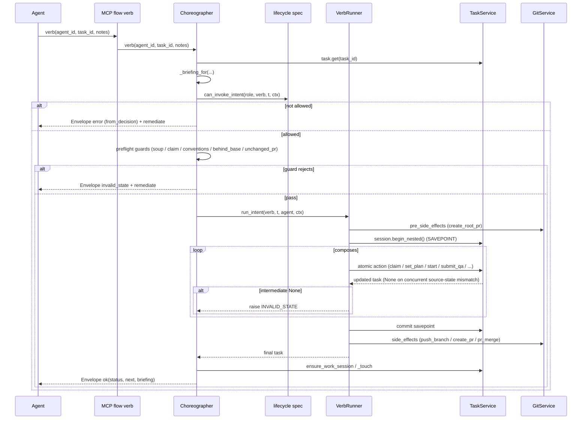

## Logical Tree
```
Choreographer (composed class, _impl.py)
├── Deps: task / work_session / git / a2a / journal / audit / evidence_repo / messaging / product / orchestrator / stream_bus
├── Verb bodies
│   ├── Dev: give_me_work, i_will_work_on, open_pr, i_am_done, i_am_blocked, unclaim, resume, sync_branch, i_am_idle
│   ├── PM:  i_will_plan, delegate, submit_up, submit_root, complete→{cell_pm_complete, main_pm_complete}, escalate_up, triage, triage_all, unblock, reassign, pm_give_me_work
│   └── Board/CEO: escalate_to_ceo
├── Guard helpers
│   ├── _run_claim_guards → already_active / paused / unmet_dependency / _lane_claim_guard
│   ├── _i_am_done_gate chain → tracing / submit_qa_fields / push / behind_base / quality / toolchain / conventions
│   ├── _submit_up_guard / _submit_up_unchanged_pr_guard / _submit_root_unchanged_pr_guard
│   ├── _guard_free_text / _free_text_soup / _soup_or_decision_env
│   └── _conventions_guard / _toolchain_broken_guard
└── VerbRunner (_verb_runner.py)
    ├── pre_side_effects → {create_root_pr}
    ├── composes (SAVEPOINT) → {claim, set_plan, start, submit_qa, qa_pass, qa_fail, docs_complete, complete, submit_pm_review, submit_for_review, pr_pass, pr_fail, escalate_to_ceo, block, unblock, resume, pr_review_done}
    └── side_effects → {push_branch, create_pr, create_root_pr, pr_merge}
```

## Dependencies
- **Internal services**: `TaskService`, `WorkSessionService`, `GitService`, `EvidenceRepo`/`evidence_builder`, `MessagingService`/a2a, `JournalService`, `AuditService`, `ProjectService`/product, orchestrator handle, `StreamEventBus`.
- **Policy (pure)**: `roboco.foundation.policy.lifecycle` (`can_invoke_intent`, `Context`, `Role`, `_INTENT_VERBS`), `foundation.policy.batch` (`is_batch_umbrella`), `foundation.policy.content` markers + `reject_trivial`.
- **Gateway helpers**: `claim_guards` (`already_active_guard`, `paused_tasks_guard`, `unmet_dependency_guard`), `merge_chain.resolve_parent_branch`, `envelope.Envelope`, `remediation` hints.
- **External**: `structlog`, `asyncpg` (via task_service session / SAVEPOINT), `redis` (rate-limit parking), `git`/`gh` CLI (via git_service).

## Entry Points
- MCP `roboco-flow` server → per-role verb methods (manifest-driven allowlist from `role_config.py`).
- Orchestrator `/api/v1/flow/*` REST endpoints → same `Choreographer` methods.
- Internal cross-verb calls (e.g. `complete` → `cell_pm_complete` / `main_pm_complete`; `_claim_plan_start_run` shared by `i_will_work_on` + `i_will_plan`).

## Config Flags
- `ROBOCO_TOOLCHAIN_MATCH_ENABLED` — gates `_toolchain_broken_guard` (default-off).
- `ROBOCO_CONVENTIONS_ENABLED` — gates `_conventions_guard` (default-off).
- `ROBOCO_OVERLOAD_BREAK_ENABLED` — rate-limit/overload parking path (default-on).
- `ROBOCO_ORG_MEMORY_ENABLED` — institutional-memory injection in `_briefing_for` (default-off).
- `ROBOCO_GATEWAY_HEALTH_ENABLED` — reaper gateway-health probe (default-on; not directly in choreographer but feeds the parking path).

## Gotchas
- The SAVEPOINT wraps only DB atomic actions; `pre_side_effects` (e.g. `create_root_pr`) run BEFORE the savepoint and are NOT rolled back if a later composed action raises — they are idempotent by contract.
- `side_effects` (push/create_pr/pr_merge) run AFTER savepoint commit and are idempotent + retryable; a crash between commit and side-effect leaves the PR uncreated (recovered by re-issue / `open_pr` parity).
- `VerbRunner` only raises on an INTERMEDIATE `None` composed action; a trailing `None` is the verb's own "no transition" result and each verb body must handle it (submit_root_finalize, _claim_plan_start_run do; a verb that forgets will None-deref).
- `_lane_claim_guard` fail-closed on lookup error — a DB hiccup rejects the claim (calls `release_dependency_blocked_claim`); acceptable but can briefly bounce a dev.
- `_submit_*_unchanged_pr_guard` FAILS OPEN on every ambiguous case (no recorded sha, no project slug, git error, closed PR) — only exact-unchanged is hard-blocked; a regression in `_current_pr_head_sha` resolver silently re-opens the loop.
- `complete` bypasses the spec gate for an in-progress batch umbrella (`_is_umbrella_in_progress`) and relies on `main_pm_complete`'s own guards — a mis-classified umbrella could skip the AWAITING_PM_REVIEW status constraint.

## Drift from CLAUDE.md
- CLAUDE.md verb table lists `submit_root` for `main_pm` and `submit_up` for `cell_pm` — matches code (`_impl.py:5348`, `6260`). No drift.
- CLAUDE.md: "PM coordinator concurrency … claim-time concurrency guards skipped for `_COORDINATOR_ROLES`" — matches (`_impl.py:939`, `1234`). No drift.
- CLAUDE.md verb surface omits `sync_branch` from the developer list — code has `sync_branch` at `_impl.py:3528` (added since baseline; memory note `project_sync_branch_tracing_gap.md` flags it). Minor doc drift.
- CLAUDE.md: "PR is created BEFORE QA review" — `i_am_done` gate chain pushes + creates PR context but the actual `create_pr` side-effect runs in `open_pr`/`submit_up`/`submit_root`, not `i_am_done`; consistent with the described flow. No drift.
- CLAUDE.md: "only the CEO merges master; Main PM ready root PR → awaiting_ceo_approval (does NOT merge)" — `main_pm_complete` escalates; `VerbRunner._do_pr_merge` exists for cell-level merges and `create_root_pr` opens but the root merge is CEO-gated. Consistent. No drift.

## Changes Since Baseline
`git log --oneline fd10cc862c2020b3f639cdb686d427b0198a2441..HEAD -- roboco/services/gateway/choreographer/` → 2 commits touching these files (+814/−89):

1. `15effce0` — 141 Gaps fill-in (#283): added out-of-order-start guards (`_lane_claim_guard`, `_behind_base_gate`, `sync_branch`), unchanged-PR loop-stoppers (`_submit_root_unchanged_pr_guard`, `_submit_up_unchanged_pr_guard`, `_current_pr_head_sha`), `project_id` scoping on `pr_merge` (cross-repo collision fix), umbrella-in-progress bypass in `complete`, `_submit_root_finalize` None-guard, reviewer flag on `_toolchain_broken_guard`.
2. `3aff6e04` — Close gaps (#285): follow-on touch-ups in the same areas (per-cell project map root-subtask support umbrella handling).

## Regression Risks

| Title | File:Line | Claim | Severity |
|-------|-----------|-------|----------|
| Intermediate-None contract depends on every verb body handling trailing None | `_verb_runner.py:89` + `_impl.py:1277,6358` | A verb that forgets the trailing-None guard None-derefs `t.status`; submit_root + claim_plan_start handle it, but any NEW verb using `run_intent` with a possibly-None last action inherits the trap. | High |
| `pr_merge` project_id scoping assumes `task.project_id` is non-None | `_verb_runner.py:263` | `project_id=task.project_id` — if a coordination/umbrella task ever reaches `pr_merge` with `project_id=None`, the cross-repo collision guard silently matches nothing or None-keys the scoping; could merge the wrong PR or no-op. | High |
| `_submit_*_unchanged_pr_guard` fails open on resolver regressions | `_impl.py:6175,6240` | Any future break in `_current_pr_head_sha` / `_project_slug_for` / `git.get_pr_head_sha` makes the loop-stopper a no-op, re-opening the 2026-06-27 pr_fail re-submit loop silently. | High |
| `_lane_claim_guard` calls `release_dependency_blocked_claim` on lookup error | `_impl.py:988,996` | Fail-closed path releases the claim before returning the error envelope; if the lookup error is transient the dev is bounced + work-session abandoned even though the lane was actually free. | Medium |
| `complete` umbrella-in-progress bypass skips the spec AWAITING_PM_REVIEW status check | `_impl.py:6657` | `_is_umbrella_in_progress` mis-classification (e.g. a non-batch branchless task with matching predicates) lets a non-awaiting_pm_review task reach `main_pm_complete`/`cell_pm_complete`. | Medium |
| `_run_claim_guards` dependency re-check narrows but does not close the race | `_impl.py:965-967` | The re-check returns None (skip release) when fresh read sees deps met, but the window between re-check and the caller's claim is still unlocked; a concurrent terminal transition there is benign (monotonic), but a non-monotonic future status could re-open. | Low |
| `submit_root` runs `create_root_pr` as a pre_side_effect OUTSIDE the savepoint | `_verb_runner.py:67` + `_impl.py:6339` | If a later composed `submit_for_review` raises, the root→master PR is already opened and NOT rolled back; re-issue is idempotent-by-contract but a non-idempotent future pre_side_effect would leak. | Medium |
| `_i_am_done_gate` writes AC criteria status AFTER all gates pass but BEFORE `run_intent` | `_impl.py:1910` | `_write_criteria_status` runs in the gate phase; if `run_intent("i_am_done")` then raises, the AC status rows persist for a task that did not transition — a stale write the next attempt must overwrite. | Low |

## Health
The slice is structurally sound: the SAVEPOINT boundary, intermediate-None INVALID_STATE guard, and role-exempt coordinator concurrency model are coherent and well-documented. The highest-temperature areas are the new (since baseline) fail-open loop-stoppers and fail-closed lane guard — both correct by design but tightly coupled to resolvers (`_current_pr_head_sha`, `has_earlier_incomplete_code_sibling`) whose regressions silently revert the protection. The 814-line delta is concentrated in guard additions rather than control-flow rewrites, so baseline behavior is largely preserved; the main residual risk is verb-body discipline around the trailing-None contract for any future verb.

# task-service slice

## Purpose
`TaskService` is the authoritative owner of the task lifecycle: CRUD, hierarchical create (incl. MegaTask umbrella + root-subtasks), claim/locking, every status transition, completion/CEO approval/cancellation, dependency DAG wiring, rework routing, and completion-time learning capture. All status writes funnel through `_validate_and_set_status` + `_emit_status_transition_audit` so the audit journey and the `revision_count` rework counter stay in lockstep with real task state.

## Files

| Path | Role |
|------|------|
| `roboco/services/task.py` | Single 8.7k-line service module implementing TaskService + a few internal dataclass containers (`_CompletionSnapshot`, `SoftBlockInput`, `SoftBlockInfo`, `GatewayAgentView`). |

## Key Symbols

| Name | Kind | File:Line | Responsibility |
|------|------|-----------|----------------|
| `_validate_and_set_status` | method | task.py:548 | Single chokepoint: validate transition + git requirements, set status, poke dispatcher, emit audit. |
| `_emit_status_transition_audit` | method | task.py:652 | Write `task.<status>` audit row in caller session; bump `revision_count` on entry into `needs_revision`. |
| `create` | method | task.py:864 | New task; depth/batch/AC validation; branchless/umbrella flags; baseline constraints attachment. |
| `_attach_baseline_constraints` | method | task.py:971 | Append conventions baseline constraints to task prompt (gated `conventions_enabled`). |
| `activate` | method | task.py:1577 | `backlog→pending` (PM only); batch-shape guard. |
| `_ensure_branch_for_task` | method | task.py:1675 | Branch resolution for claim; `""` for branchless/umbrella. |
| `_auto_create_branch` | method | task.py:1833 | Cut hierarchical branch + per-task worktree add (F123). |
| `_remove_task_worktree` | method | task.py:1913 | Low-level worktree removal by task id. |
| `admin_set_status` | method | task.py:2060 | Privileged override (bypass validator); restores pre-block owner; still emits audit. |
| `claim` | method | task.py:2469 | Lock + preconditions + finalize; calls `_validate_and_set_status(claimed)`. |
| `_finalize_claim` | method | task.py:2282 | Work-session create/inherit, branch cut, proactive-context injection. |
| `_inject_proactive_context` | method | task.py:2511 | Briefing injection at claim (institutional memory when `org_memory_enabled`). |
| `_completion_learnings_for` | method | task.py:2798 | Distill one lesson (ON) vs legacy raw capture (OFF). |
| `_extract_completion_learnings` | method | task.py:2837 | Fire-and-forget learning record + RAG indexing. |
| `start` | method | task.py:3354 | `claimed→in_progress`. |
| `unclaim_for_agent` / `_force_unclaim_to_pending` | method | task.py:3579 / 3507 | Release claim to pool; abandon stale work session. |
| `block` / `soft_block` / `unblock` | method | task.py:3760 / 3823 / 3897 | Snapshot pre-block owner; restore on unblock. |
| `submit_for_qa` | method | task.py:4065 | `verifying→awaiting_qa`; clears claimed_by (passes explicit audit_agent_id). |
| `pass_qa` / `fail_qa` | method | task.py:4112 / 4187 | QA verdict; `fail_qa` routes back to original dev (marker → work-session fallback). |
| `_resolve_revision_dev` | method | task.py:4301 | Work-session fallback when `original_developer` marker missing. |
| `docs_complete` | method | task.py:4336 | `awaiting_documentation→awaiting_pm_review` (parallel completion). |
| `submit_for_pm_review` / `complete` | method | task.py:4690 / 4882 | PM review submit + completion / CEO escalation chain. |
| `_apply_complete_approval_chain` | method | task.py:4811 | Leaf→completed vs root→awaiting_ceo_approval. |
| `_assert_pr_merged_for_complete` | method | task.py:4845 | PR-merged gate before `complete`. |
| `apply_escalation` | method | task.py:4942 | `in_progress→blocked` direct status set + audit emit (bypasses validator by design). |
| `escalate_to_ceo` | method | task.py:5064 | `awaiting_pm_review→awaiting_ceo_approval`. |
| `ceo_approve` | method | task.py:5146 | CEO merges then approves; `awaiting_ceo_approval→completed`. |
| `ceo_reject` | method | task.py:5414 | Reject → `needs_revision` (dev) or `pending` (branchless root via admin_set_status). |
| `_remove_task_worktree_on_terminal` | method | task.py:5601 | Best-effort worktree cleanup on complete/ceo_approve; no-op for branchless. |
| `cancel` | method | task.py:5644 | Cascade-cancel descendants through the validator. |
| `reassign` / `reassign_active_claim` | method | task.py:7657 / 7807 | Reassignment with Board/Main-PM diversion guards. |
| `pr_pass` / `pr_fail` | method | task.py:8100 / 8137 | In-path PR-review gate verdicts. |

## Data Flow
Request → `TaskService` loads `TaskTable` (`get`/`_load_task_or_raise`) → validates role/transition (`validate_task_transition`) + git reqs (`validate_git_requirements`, branchless/umbrella/external-review exempt) → mutates columns → `_emit_status_transition_audit` writes `AuditLogTable` row + bumps `revision_count` in the same session → pokes orchestrator `trigger_dispatch()` → fires fire-and-forget background tasks (RAG indexing, learning distillation, worktree cleanup, work-session close). Terminal states trigger `_unblock_dependents` to revive waiting tasks.

## Mermaid
```mermaid
stateDiagram-v2
    [*] --> backlog: create
    backlog --> pending: activate (PM)
    pending --> claimed: claim (role-matched)
    claimed --> in_progress: start
    claimed --> pending: unclaim
    in_progress --> blocked: block
    blocked --> in_progress: unblock(restore)
    in_progress --> verifying: submit_for_verification
    verifying --> awaiting_qa: submit_for_qa (PR open)
    awaiting_qa --> awaiting_documentation: pass_qa
    awaiting_qa --> needs_revision: fail_qa
    awaiting_documentation --> awaiting_pm_review: docs_complete
    in_progress --> awaiting_pr_review: submit_up/submit_root (PM)
    awaiting_pr_review --> awaiting_pm_review: pr_pass
    awaiting_pr_review --> needs_revision: pr_fail
    awaiting_pm_review --> completed: complete (leaf)
    awaiting_pm_review --> awaiting_ceo_approval: escalate_to_ceo (root)
    awaiting_ceo_approval --> completed: ceo_approve
    awaiting_ceo_approval --> needs_revision: ceo_reject (dev)
    awaiting_ceo_approval --> pending: ceo_reject (branchless root)
    needs_revision --> claimed: re-claim
    completed --> [*]
    cancelled --> [*]
```

## Logical Tree
- TaskService
  - State core: `_validate_and_set_status`, `_emit_status_transition_audit`, `admin_set_status`
  - Create/shape: `create`, `_validate_parent_depth`, `_validate_batch_membership`, `activate`
  - Branch/worktree: `_ensure_branch_for_task`, `_auto_create_branch`, `_remove_task_worktree*`
  - Claim: `claim`, `_finalize_claim`, `_inject_proactive_context`, `acquire_*_lock`
  - Lifecycle verbs: `start`, `block*`, `unblock`, `pause`, `resume`, `submit_for_qa`, `pass_qa`, `fail_qa`, `docs_complete`, `submit_for_pm_review`
  - Completion: `complete`, `_apply_complete_approval_chain`, `ceo_approve`, `ceo_reject`, `cancel`
  - Rework routing: `fail_qa`, `_resolve_revision_dev`, `ceo_reject`
  - Learning/indexing: `_completion_learnings_for`, `_extract_completion_learnings`, `_trigger_completion_hooks`, `_index_*_background`
  - Dependencies/sequencing: `add_dependency`, `wire_sibling_collision_dag`, `wire_cell_task_wave_chain`, `_unblock_dependents`
  - Reassign/escalate: `reassign*`, `escalate*`, `_maybe_divert_*`
  - PR gate: `pr_gate_claim`, `submit_for_review`, `pr_pass`, `pr_fail`
  - Queries: `list_*`, `count_*`, `*_ac_coverage`, `all_subtasks_terminal`

## Dependencies
- `roboco.foundation.policy.lifecycle` (transitions, role restrictions, git requirements, `is_branchless_coordination`, `is_batch_umbrella`)
- `roboco.foundation.policy.batch` / `sequencing` (batch predicates, sibling DAG)
- `roboco.services.work_session` (close/abandon), `roboco.services.workspace`, `roboco.services.learning`, `roboco.services.memory_distiller`
- `roboco.services.conventions` (`_attach_baseline_constraints`)
- `roboco.db.tables` (`TaskTable`, `AuditLogTable`, `WorkSessionTable`, `ProjectTable`)
- `roboco.api.deps.get_orchestrator` (lazy; dispatch poke), `roboco.config.settings`
- Markers / `extract_original_developer` helpers

## Entry Points
- `TaskService.create` / `create_subtask` — task creation (orchestrator intake, batch confirm, gateway delegate).
- `TaskService.claim` — gateway `give_me_work` / `i_will_work_on` / `claim_review` / `claim_doc_task`.
- Lifecycle verbs (`start`, `submit_for_qa`, `pass_qa`/`fail_qa`, `docs_complete`, `submit_for_pm_review`, `complete`, `cancel`, `pr_pass`/`pr_fail`, `escalate_*`, `ceo_approve`/`ceo_reject`) — all gateway flow verbs.
- `admin_set_status` — operator PATCH + orchestrator auto-recover.
- `wire_*` / `add_dependency` — `SequencingService` / `BatchPlacement`.

## Config Flags
- `ROBOCO_ORG_MEMORY_ENABLED` — `_completion_learnings_for` swaps raw capture for one distilled lesson (task.py:2810).
- `ROBOCO_CONVENTIONS_ENABLED` — `_attach_baseline_constraints` skipped when off (task.py:1000).
- (Indirect, via called services) `ROBOCO_SELF_HEAL_*`, `ROBOCO_CI_WATCH_*`, `ROBOCO_DEP_UPDATE_*`, `ROBOCO_RELEASE_MANAGER_*` gate the `list_open_*`/`list_open_release_proposals` query paths.

## Gotchas
- `_emit_status_transition_audit` writes the audit row in the CALLER's session — callers that clear `claimed_by` before transitioning MUST pass `audit_agent_id` or the row lands unattributed (task.py:688).
- `apply_escalation` (task.py:4942) sets `task.status` directly and calls `_emit_status_transition_audit` deliberately bypassing the strict validator (blocked is a terminal-ish hold) — only audited privileged-style path besides `admin_set_status`.
- `fail_qa` accepts `claimed`/`in_progress` (QA is mid-review); the `original_developer` marker is unreliable — the work-session fallback (`_resolve_revision_dev`) is load-bearing (task.py:4248).
- Branchless/umbrella/external-review tasks are exempt from the branch gate inside `GitContext` (task.py:597-611); umbrella is also exempt from the `awaiting_pm_review→awaiting_ceo_approval` pr_number gate.
- `complete()` requires PR merged (`_assert_pr_merged_for_complete`) EXCEPT branchless roots; `ceo_approve` separately checks `work_session.pr_status=="merged"` and refuses otherwise.
- Background indexing/learning/cleanup tasks are tracked on `self._background_tasks` and are best-effort — a failure never blocks the transition.

## Drift from CLAUDE.md
- CLAUDE.md states ceo_reject "~4779 skips _validate_and_set_status in branchless path". Actual: branchless branch of `ceo_reject` is at task.py:5488 and routes through `admin_set_status` (which DOES emit audit at task.py:2100). The non-branchless branch DOES call `_validate_and_set_status` (task.py:5461). No audit gap — the line reference is stale.
- CLAUDE.md "PR is created BEFORE QA review" — `submit_for_qa` enforces `pr_number` via `validate_git_requirements` (consistent, no drift).
- CLAUDE.md verb table lists `pr_reviewer` `pr_pass`/`pr_fail` — present at task.py:8100/8137 (consistent).

## Changes Since Baseline
`git log fd10cc86..HEAD -- roboco/services/task.py`:
- `15effce0` Chore: 141 Gaps fill-in (#283) — bulk gap closure; transition audit chokepoint + `revision_count` centralization (task.py:685-706), branchless/umbrella git-context exemptions, fail_qa work-session fallback, ceo_reject branchless routing.
- `3aff6e04` Chore: Close gaps (#285) — follow-on gap close (worktree-on-terminal cleanup F123 Phase C, escalation audit emit, rework routing hardening).

## Regression Risks

| Title | File:Line | Claim | Severity |
|-------|-----------|-------|----------|
| `ceo_approve` skips work-session close | task.py:5146 | `ceo_approve` calls `_remove_task_worktree_on_terminal` but NOT `_close_work_session_for_task` (only `complete()` at 4934 does). Approved-via-CEO tasks leave the WorkSession row not marked `completed`/closed → reporting/session-resolution drift. | High |
| `ceo_approve` skips full completion hooks | task.py:5200-5210 | Only fires `_extract_completion_learnings` manually; skips `_trigger_completion_hooks` so code-changes RAG indexing + decision indexing never run for CEO-approved (root) tasks. | Medium |
| `apply_escalation` bypasses validator | task.py:4942 | Sets `task.status` directly then emits audit; a caller passing a wrong target status would skip `validate_task_transition`/git-req checks. Relies on call-site discipline. | Medium |
| `fail_qa` route depends on unreliable marker | task.py:4228-4272 | Fast path reads `original_developer` marker; if absent, falls to `_resolve_revision_dev`. If both miss (no dev work session, e.g. parent-only edit) task is unassigned to pool → PM may grab a dev task (the original 2026-06-27 loop). | High |
| Branchless `ceo_reject` uses `admin_set_status` | task.py:5488 | Bypasses strict validator (intended) but `awaiting_ceo_approval→pending` is not in `VALID_TRANSITIONS`; any future tightening of admin override could wedge coordination-root rejection. | Medium |
| `revision_count` bump is in audit helper only | task.py:702-706 | Any future transition path that sets `task.status` directly WITHOUT calling `_emit_status_transition_audit` (mirroring `apply_escalation`'s pattern) would silently skip the rework counter — metric drift. | Medium |
| `_remove_task_worktree_on_terminal` silent-fail | task.py:5614-5627 | Cleanup failure is logged-warning only; on recurring FS/permission error worktrees leak indefinitely with no operator signal beyond logs. | Low |
| Concurrent mid-verb state change | task.py:548 | `_validate_and_set_status` does not re-fetch the task after validation; a concurrent committer could flip status between load and set, producing an invalid edge that the validator already passed. Mitigated upstream by verb-runner savepoints, not here. | Medium |
| `cancel` cascade swallows role violations | task.py:5679-5690 | Descendants that fail role validation are skipped (warning), so a cancel can leave non-terminal descendants orphaned in `awaiting_ceo_approval` (only CEO may cancel those). | Medium |
| `submit_for_qa` clears `claimed_by` before transition | task.py:568-572, 4065 | Relies on `audit_agent_id` being passed to attribute the row to the dev; if a future caller forgets, the `awaiting_qa` audit row lands `agent_id=NULL`. | Low |

## Health
`TaskService` is the most load-bearing service and the most hardened: the audit chokepoint, `revision_count` centralization, branchless/umbrella exemptions, and worktree-on-terminal cleanup all landed in the two recent gap-closure commits. The residual risk is concentrated in the two CEO-path asymmetries (`ceo_approve` not closing the work session / not running the full completion hooks) and in `fail_qa`/`ceo_reject` rework routing, which depends on the unreliable `original_developer` marker and a work-session fallback that has no guarantee a developer session exists.

# RoboCo Slice Map — `worksession-git`

Scope key: `worksession-git` Repo root: `/Users/renzof/Documents/GitHub/ZZZ/roboco-master/roboco` Files in scope:
- `roboco/services/work_session.py`
- `roboco/services/git.py`
- `roboco/templates/git/` (`__init__.py`, `branch.py`, `commit.py`, `constants.py`, `pr_internal.py`, `pr_root.py`)

## Purpose

This slice is the git substrate every delivery agent works on. `GitService` runs all git subprocesses (status/commit/branch/push/rebase), mints branches + commit messages + PR bodies from templates, and drives the GitHub REST API for PR create/merge/close. `WorkSessionService` persists the per-claim row that links an agent to a task's branch/commits/PR and enforces the single-active-per-task invariant. The `roboco/templates/git/` package is the pure rendering layer for branch names, commit messages, and internal/root PR bodies. Together they are the boundary between the task lifecycle and the actual git history on disk + GitHub.

## Files

| Path | Role | approx LOC |
|------|------|------------|
| `roboco/services/work_session.py` | WorkSession CRUD, commit/file tracking, PR-lifecycle record, single-active invariant | 685 |
| `roboco/services/git.py` | Git subprocess execution, branch/commit/PR/rebase/merge/sync, GitHub REST API, conventions validator runner | 4596 |
| `roboco/templates/git/__init__.py` | Package re-exports for branch/commit/PR templates | 48 |
| `roboco/templates/git/branch.py` | Hierarchical branch name builder + root-task resolver | 131 |
| `roboco/templates/git/constants.py` | `BRANCH_TYPES`, `COMMIT_TYPES`, `MAX_TASK_DEPTH`, length constants | 52 |
| `roboco/templates/git/commit.py` | `CommitContext` + `build_commit_message` (traceability links) | 114 |
| `roboco/templates/git/pr_internal.py` | Internal (subtask→parent) PR title/body builder | 140 |
| `roboco/templates/git/pr_root.py` | Root (→master, CEO-level) PR title/body builder with task tree | 245 |

## Key Symbols

| Name | Kind | File:Line | Responsibility |
|------|------|-----------|----------------|
| `WorkSessionService` | class | work_session.py:29 | Session lifecycle + single-active invariant |
| `WorkSessionService.create` | method | work_session.py:50 | Validate project/task, refuse duplicate, supersede stale ACTIVE, insert row |
| `WorkSessionService.get_active_for_task` | method | work_session.py:184 | Most-recent ACTIVE row (resilient to dup-rows defect) |
| `WorkSessionService.supersede_active_sessions_for_task` | method | work_session.py:247 | ABANDON every other ACTIVE session for a task (single-active) |
| `WorkSessionService.add_commit` | method | work_session.py:363 | Append dedup'd commit SHA to session.commits |
| `WorkSessionService.create_pr` | method | work_session.py:427 | Record pr_number/pr_url/pr_created_at |
| `WorkSessionService.merge_pr` | method | work_session.py:488 | Record merge + COMPLETED; idempotent active-guard (F062) |
| `WorkSessionService.close` | method | work_session.py:618 | Idempotent COMPLETED on task completion |
| `WorkSessionService.abandon` | method | work_session.py:577 | ABANDONED + ended_at (non-active → warning + None) |
| `WorkSessionService.has_unpushed_commits` | method | work_session.py:662 | PR-existence proxy for unpushed commit detection |
| `get_work_session_service` | factory | work_session.py:682 | Construct service from AsyncSession |
| `GitService` | class | git.py:234 | All git operations + GitHub API |
| `_GIT_EXECUTOR` | module const | git.py:116 | Dedicated ThreadPoolExecutor for git subprocesses (16 workers) |
| `resolve_git_dir` | func | git.py:129 | Resolve `.git` dir for clone OR linked worktree |
| `_remove_stale_git_locks` | func | git.py:156 | Best-effort clear orphaned `.git/**/*.lock` after timeout SIGKILL |
| `_select_ci_head_run` | func | git.py:220 | Pick CI run matching current HEAD (anti-stale-green) |
| `GitService._run_git` | method | git.py:247 | Run git subprocess in dedicated pool, token header, chown-back, lock cleanup |
| `GitService._token_for_project` | method | git.py:344 | Decrypted project PAT (logs loudly on key-rotation failure) |
| `GitService.get_workspace` | method | git.py:387 | Resolve/clone agent workspace (auto_clone aware) |
| `GitService.get_status` | method | git.py:499 | Porcelain status + ahead/behind |
| `GitService._classify_porcelain` | static | git.py:439 | Split porcelain into staged/unstaged/untracked (column-safe) |
| `GitService._parse_git_url` | static | git.py:557 | Extract (owner,repo) from tokened/https/ssh GitHub URL |
| `GitService.create_commit` | method | git.py:640 | Stage + commit with template message + worktree ensure |
| `GitService._worktree_for_task` | static | git.py:747 | Per-task worktree path `{clone_root}/.worktrees/{task_id[:8]}` (F123) |
| `GitService._ensure_worktree_for_commit` | method | git.py:756 | Re-attach a pruned worktree before cwd-dependent op |
| `GitService._assert_on_task_branch` | method | git.py:771 | Recover drifted clone onto task branch (never discards work) |
| `GitService.commit_for_task` | method | git.py:875 | Agent-facing commit verb backing the `commit` content tool |
| `GitService.create_branch` | method | git.py:989 | Build branch name, fetch base, `worktree add` (F123), push -u |
| `GitService.create_branch_for_task` | method | git.py:1188 | Resolve workspace/team, create branch, commit DB |
| `GitService.checkout_branch_for_agent` | method | git.py:1276 | Allowlist-bounded checkout for agent verb |
| `GitService.push_for_task` | method | git.py:1428 | Push the task's recorded branch by name (clone-checkout-independent) |
| `GitService.push_task_branch` | method | git.py:1467 | Gateway branch-keyed push |
| `GitService.create_pull_request` | method | git.py:2132 | Open PR via GitHub API (legacy project-scoped) |
| `GitService.create_pr_for_task` | method | git.py:2639 | Agent-facing open_pr verb |
| `GitService.update_pr_for_task` | method | git.py:2506 | Patch PR title/body; 404→typed GitError |
| `GitService.get_pr_head_sha` | method | git.py:2451 | PR head SHA for pr_fail re-submit loop guard (fail-open) |
| `GitService.get_latest_ci_conclusion` | method | git.py:1929 | Per-project CI signal (unknown never false-green) |
| `GitService.list_open_prs` | method | git.py:1844 | Normalized open-PR list |
| `GitService.post_pr_review` | method | git.py:2329 | Post reviewer comments via GitHub API |
| `GitService.merge_pull_request` | method | git.py:2914 | GitHub merge API + method fallback + already-merged disambiguation |
| `GitService.merge_pr_for_task` | method | git.py:3046 | Role-gated merge + recorded-PR verification + auto-complete |
| `GitService._assert_merge_role` | method | git.py:2989 | PM/CEO approval-chain role gate |
| `GitService.pr_merge` | method | git.py:3616 | Gateway merge: project_id-scoped, parent row lock, 409 retry, CEO-only default guard |
| `GitService._merge_with_retry` | method | git.py:3555 | Single 409 retry + already-merged disambiguation → MergeConflictError |
| `GitService._lock_parent_task_for_merge` | method | git.py:3503 | SELECT FOR UPDATE on parent task (sibling merge serialization) |
| `GitService._resolve_merger_id` | static | git.py:3530 | merged_by attribution: actor→assigned→created→UUID(0) |
| `GitService.rebase_onto_base` | method | git.py:3733 | Rebase primitive: rebased/superseded/conflicts classification |
| `GitService.rebase_pr_for_task` | method | git.py:3792 | PR-keyed rebase via PR refs (project_id scoped) |
| `GitService.sync_task_branch` | method | git.py:3847 | Task-keyed rebase through dev `sync_branch` verb (pre-PR) |
| `GitService.is_behind_base` | method | git.py:3889 | `(behind, ahead)` counts for i_am_done submit gate |
| `GitService.close_pull_request` | method | git.py:3940 | Close superseded PR + optional comment + branch cleanup (idempotent) |
| `GitService.pr_target` | method | git.py:4021 | Return PR base branch (project_id scoped) |
| `GitService.create_pr` | method | git.py:3418 | Branch-keyed open PR (gateway path; ensures base on remote) |
| `GitService._record_pr_atomically` | method | git.py:2601 | Atomic pr_number/url write to task |
| `GitService.run_pre_submit_quality_gate` | method | git.py:3208 | `make quality` gate before submit |
| `GitService.conventions_check_for_task` | method | git.py:4368 | Run conventions validator on changed files (fail-closed) |
| `GitService._run_conventions_validator` | method | git.py:4408 | Subprocess `python -m roboco.conventions` with 120s cap |
| `GitService.open_conventions_pr` | method | git.py:4456 | Scaffold `.roboco/conventions.yml` on a branch + open PR |
| `GitService.diff` / `list_changed_files` / `read_file_at_branch` | methods | git.py:4192/4225/4259 | Read-only git queries (gateway + routes) |
| `GitService.commit` | method | git.py:4286 | Gateway content-verb commit (branch-keyed) |
| `get_git_service` | factory | git.py:4594 | Construct GitService from AsyncSession |
| `build_branch_name` | func | templates/git/branch.py:37 | `{type}/{team}/{root}--{sub}--...` up to MAX_TASK_DEPTH |
| `get_root_task_id` | func | templates/git/branch.py:97 | Walk parent chain to root |
| `BranchNameError` | exc | templates/git/branch.py:33 | Bad type / missing task / over-depth |
| `build_commit_message` | func | templates/git/commit.py:63 | Rich commit msg with task/root/agent/session links |
| `CommitContext` | dataclass | templates/git/commit.py:34 | Validated commit-message input |
| `build_pr_body_internal` / `build_pr_title_internal` | funcs | templates/git/pr_internal.py:75/130 | Subtask→parent PR rendering |
| `build_pr_body_root` / `build_pr_title_root` | funcs | templates/git/pr_root.py:167/235 | Root PR rendering with task tree + AC checklist |
| `MAX_TASK_DEPTH` | const | templates/git/constants.py:45 | 4 (umbrella→root→cell→dev) |
| `BRANCH_TYPES` / `COMMIT_TYPES` | consts | templates/git/constants.py:10/21 | Allowed prefixes |

## Data Flow

A developer claims a task → the orchestrator/choreographer calls `create_branch_for_task` → `build_branch_name` walks the task parent chain (`TaskService.get`) up to `MAX_TASK_DEPTH=4`, joins `--`-separated 8-char UUID prefixes, and yields `{type}/{team}/{root}--{sub}--...`. `create_branch` fetches only the needed refs from origin, runs `git worktree add` under `{clone_root}/.worktrees/{task_id[:8]}` (F123 per-task isolation), force-pushes the branch with `-u`, and stores `branch_name` on the task. A `WorkSession` row is created (`WorkSessionService.create`), first superseding any other agent's stale ACTIVE session on that task.

The agent commits via the `commit` content verb → `GitService.commit` (or `commit_for_task` route), which ensures the worktree is attached, asserts the workspace is on the task branch (recovering a drifted clone), stages, runs `build_commit_message` (`CommitContext` → header + metadata + links), commits, then best-effort links the SHA to the task + work session (`_link_commit_to_task`). Every `_run_git` call re-chowns the tree to the agent uid and clears orphaned lock files on timeout.

`open_pr` → `create_pr` resolves the task by branch name, ensures the parent branch exists on origin, POSTs the PR via GitHub REST, and atomically records `pr_number`/`pr_url` on the task (`_record_pr_atomically`) and work session (`create_pr`). PR title/body come from `task.title`/`task.description` for gateway PRs; the rich `build_pr_body_root`/`_internal` templates are used by the older `create_pull_request` path.

Merge: a cell PM `complete`/`submit_up` → `pr_merge` (gateway) scopes the task lookup by `project_id` (cross-repo PR-number collision guard), takes a `SELECT FOR UPDATE` lock on the parent task, calls `_merge_with_retry` (squash; on 409 re-syncs target + retries once; on 405 disambiguates already-merged vs real conflict → `MergeConflictError`), deletes the PR branch, syncs the local target, and records the merge on the work session (`merge_pr`, idempotent). The CEO-only root→master merge goes through `merge_pr_for_task` (role-gated, recorded-PR verification) → `merge_pull_request`. The CEO-merge never targets the default branch via `pr_merge` (the `target == default_branch` guard refuses it).

Behind-base recovery: `is_behind_base` feeds the `i_am_done` submit gate; on a non-zero behind, the dev calls `sync_branch` → `sync_task_branch` → `rebase_onto_base` (rebased/superseded/conflicts). On a merge conflict, the choreographer calls `rebase_pr_for_task`, then either re-merges or `close_pull_request`s a superseded PR. `get_pr_head_sha` feeds the `submit_root` re-submit loop guard.

## Mermaid

```mermaid
stateDiagram-v2
    [*] --> Active: create() (supersede stale)
    Active --> Active: add_commit / add_files_modified
    Active --> Active: create_pr (pr_number set)
    Active --> Completed: merge_pr (idempotent active-guard)
    Active --> Completed: close() (task completion)
    Active --> Abandoned: abandon() / supersede_active_sessions_for_task
    Completed --> [*]: terminal
    Abandoned --> [*]: terminal
    note right of Active
      single-active per task enforced at
      create + DB partial-unique index (mig 047)
    end note
```

```mermaid
sequenceDiagram
    participant G as Choreographer/Gateway
    participant GS as GitService
    participant GH as GitHub REST API
    participant WS as WorkSessionService
    participant DB as DB (TaskTable)

    G->>GS: pr_merge(pr_number, target, project_id)
    GS->>DB: SELECT task WHERE pr_number AND project_id (scoped)
    GS->>DB: SELECT FOR UPDATE parent_task (serialize siblings)
    GS->>GH: PUT /pulls/{n}/merge (squash)
    alt 409 conflict
        GS->>GS: _sync_target_branch (re-pull)
        GS->>GH: PUT /pulls/{n}/merge (retry once)
    end
    alt non-success
        GS->>GH: GET /pulls/{n} (already-merged?)
        opt already merged
            GS-->>G: idempotent success
        end
        opt real conflict
            GS-->>G: raise MergeConflictError
        end
    end
    GS->>GH: DELETE PR branch (best-effort)
    GS->>GS: _sync_target_branch_best_effort
    GS->>WS: merge_pr(session_id, merger_id)
    WS->>WS: guard status==ACTIVE else return unchanged
    WS-->>GS: COMPLETED + merged_by
    GS-->>G: {"merge_commit_sha": ...}
```

## Logical Tree

```
roboco/
├── services/
│   ├── work_session.py
│   │   └── WorkSessionService (BaseService)
│   │       ├── create / get / get_or_raise / update
│   │       ├── get_active_for_task(_and_agent)
│   │       ├── supersede_active_sessions_for_task   # single-active invariant
│   │       ├── list_by_agent / list_by_project / list_active_sessions
│   │       ├── add_commit / add_files_modified
│   │       ├── create_pr / update_pr_status / merge_pr
│   │       ├── complete / abandon / close
│   │       └── files_changed / has_unpushed_commits  # gateway backfill
│   └── git.py
│       ├── _GIT_EXECUTOR (ThreadPoolExecutor, 16)
│       ├── resolve_git_dir / _remove_stale_git_locks / _select_ci_head_run
│       └── GitService (BaseService)
│           ├── _run_git (token, timeout, chown, lock-cleanup)
│           ├── _token_for_project / _token_for_workspace / get_workspace
│           ├── status: get_status / get_current_branch / _classify_porcelain / _ahead_behind
│           ├── commit: create_commit / commit_for_task / commit (gateway) / _link_commit_to_task
│           ├── worktree (F123): _worktree_for_task / _ensure_worktree_for_commit / _assert_on_task_branch
│           ├── branch: create_branch / create_branch_for_task / create_branch_from_pr_head / checkout*
│           ├── push/pull/fetch/rebase: push_for_task / push_task_branch / pull / fetch / rebase
│           ├── PR context: _build_root_pr_context / _build_internal_pr_context / _generate_pr_title_body
│           ├── PR list/find: _find_existing_pr / list_open_prs / _fetch_open_prs / _normalize_open_pr
│           ├── PR create: create_pull_request / create_pr_for_task / create_pr (branch-keyed)
│           ├── PR update/review: update_pr_for_task / post_pr_review / _patch_pr_title_body
│           ├── PR read: get_pr_diff / get_pr_head_sha / pr_target
│           ├── CI: get_latest_ci_conclusion / _get_ci_runs_response / _fetch_latest_ci_run
│           ├── merge: merge_pull_request / merge_pr_for_task / pr_merge / _merge_with_retry
│           │            _assert_merge_role / _lock_parent_task_for_merge / _resolve_merger_id
│           │            _pr_is_merged / _auto_complete_on_merge / _first_allowed_merge_method
│           ├── branch cleanup: _delete_remote_branch_best_effort / _delete_pr_branch_best_effort
│           │            delete_task_branch / _branch_has_open_dependents
│           ├── rebase/sync: rebase_onto_base / rebase_pr_for_task / sync_task_branch / is_behind_base
│           ├── close: close_pull_request
│           ├── quality: run_pre_submit_quality_gate / toolchain_status_for_task / _fast_gate_commands
│           ├── conventions: conventions_check_for_task / _run_conventions_validator / open_conventions_pr
│           ├── read-only: diff / list_changed_files / read_file_at_branch / _ref_exists / _resolve_diff_base
│           └── helpers: _task_for_branch / _project_for_task / _workspace_for_branch / _token_for_branch ...
└── templates/git/
    ├── __init__.py            # re-exports
    ├── constants.py           # BRANCH_TYPES / COMMIT_TYPES / MAX_TASK_DEPTH=4
    ├── branch.py              # build_branch_name / get_root_task_id / BranchNameError
    ├── commit.py              # CommitContext / build_commit_message / CommitMessageError
    ├── pr_internal.py         # InternalPRContext / build_pr_body_internal / build_pr_title_internal
    └── pr_root.py             # RootPRContext / SubtaskInfo / build_pr_body_root / build_pr_title_root
```

## Dependencies

Internal:
- `roboco.config.settings` (timeouts, URLs, workspace root, auto_clone)
- `roboco.exceptions` (`GitCommandError`, `GitError`, `GitTimeoutError`, `MergeConflictError`)
- `roboco.foundation.policy.lifecycle` (role/intent parity)
- `roboco.models.base` (`AgentRole`, `TaskStatus`)
- `roboco.models.work_session` (`WorkSessionCreate/Update/Status`)
- `roboco.db.tables` (`ProjectTable`, `TaskTable`, `WorkSessionTable`)
- `roboco.services.base` (`BaseService`, `NotFoundError`, `ConflictError`, `ValidationError`, `UnauthorizedError`, `ServiceError`)
- `roboco.services.project` / `roboco.services.task` / `roboco.services.workspace` (composed for clone/workspace/branch resolution)
- `roboco.services.gateway.quality_gate` (`GateResult`, `run_quality_commands`)
- `roboco.templates.git` (all template builders)
- `roboco.utils.converters.require_uuid`, `roboco.utils.crypto.EncryptionError`
- `roboco.api.schemas.git` (TYPE_CHECKING only — runtime duck-typed)

External:
- `sqlalchemy` / `sqlalchemy.ext.asyncio`
- `httpx` (GitHub REST API)
- `asyncio`, `subprocess`, `concurrent.futures.ThreadPoolExecutor`
- `dataclasses`, `pathlib`, `uuid`, `base64`, `re`, `json`, `time`, `os`, `sys`

## Entry Points

- **HTTP routes** (`roboco/api/routes/git.py`): `get_status`, `log`, `diff`, `commit_for_task`, `push_for_task`, `create_branch_for_task`, `checkout_branch_for_agent`, `create_pr_for_task`, `merge_pr_for_task`, `pull`, `fetch`, `rebase` — all construct via `get_git_service(db)`.
- **HTTP routes** (`roboco/api/routes/tasks.py:253`): `get_git_service` for task-scoped git.
- **Gateway Choreographer** (`roboco/services/gateway/choreographer/`):
  - `_verb_runner._do_pr_merge` → `pr_merge`
  - `_impl` → `conventions_check_for_task` (i_am_done + pr_pass gates), `is_behind_base` (submit gate), `sync_task_branch` (sync_branch verb), `pr_merge` / `rebase_pr_for_task` / `close_pull_request` (merge-conflict resolution), `get_pr_head_sha` (submit_root re-submit guard)
  - `pr_gate.py` → `get_pr_head_sha`
  - `qa.py` → `conventions_check_for_task`
- **WorkspaceService** calls `ensure_worktree` / `ensure_worktree_for_resume` (F123).
- **Lifespan/CLI**: none direct; `git_service` is constructed per-request via `deps.py` (`git=GitService(db_session)`).

## Config Flags

| Flag / setting | Source | Used for |
|----------------|--------|----------|
| `ROBOCO_GIT_EXECUTOR_WORKERS` (env, default 16) | `os.environ` at git.py:117 | Dedicated git subprocess pool size |
| `settings.git_command_timeout_seconds` | config.py:728 | Default `_run_git` timeout |
| `settings.git_commit_timeout_seconds` | config.py:737 | Staging/commit large changeset timeout |
| `settings.git_network_timeout_seconds` | config.py:748 | fetch/pull/push/ls-remote timeout |
| `settings.workspaces_root` | config.py:603 | Workspace path root (token derivation) |
| `settings.workspace_auto_clone` | config.py:607 | `get_workspace` auto-clone branch |
| `settings.public_base_url` | config.py:827 | Commit/PR template link base (`+ /api`) |
| `settings.internal_api_url` | config.py:57 | Internal PR body link base |
| `settings.github_api_base_url` | config.py:327 | GitHub REST API base (PR/CI/review) |

Module-level tunables (not env): `_SLOW_GIT_OP_MS=5000`, `_CI_RUN_WINDOW=20`, `_CI_FETCH_ATTEMPTS=3`, `_CI_FETCH_BACKOFF_SECONDS=0.5`, `_CI_RETRYABLE_STATUS`, `_CONVENTIONS_VALIDATOR_TIMEOUT_SECONDS=120`, `_GH_UNPROCESSABLE=422`, `_HTTP_NOT_FOUND=404`, `_HTTP_CONFLICT=409`.

## Gotchas

- **Token transport split**: git-over-HTTPS uses HTTP **Basic** (`x-access-token:...`) via `http.extraheader` (git.py:289); the GitHub REST API uses **Bearer**. Swapping them causes silent credential-prompt failures.
- **`pr_number` is NOT repo-scoped in `tasks.pr_number`** — every gateway merge/close path (`pr_merge`, `close_pull_request`, `pr_target`, `rebase_pr_for_task`) requires `project_id` to scope the task lookup. The route `merge_pr_for_task` instead verifies `data.pr_number == task.pr_number` (recorded PR is source of truth).
- **`get_active_for_task` returns the most-recent ACTIVE row**, not `scalar_one_or_none` — the historical duplicate-ACTIVE defect would otherwise raise `MultipleResultsFound`. The invariant is also enforced at `create` and by a DB partial-unique index (migration 047).
- **`merge_pr` idempotency guard (F062)**: a terminal session is returned unchanged; `complete`/`abandon` on a non-active session return `None` (warning). `close` returns the session unchanged. Behavior differs between these three on terminal state — `merge_pr`/`close` are silent, `complete`/`abandon` warn-and-None.
- **F123 per-task worktrees**: commit/checkout/rebase/conventions MUST run inside `{clone_root}/.worktrees/{task_id[:8]}`, not the clone root (which sits on the default branch). `_worktree_for_task` + `_ensure_worktree_for_commit` are the seam; forgetting them makes checkout fail with "already checked out at '<worktree>'" or false-passes the conventions validator.
- **`create_branch` runs `reset --hard` on a no-commit branch** in the worktree (git.py:1104) — safe because `unique == 0`, but a branch carrying real work is left as-is. The fresh-claim path only; resume short-circuits before it.
- **`_run_git` re-chowns the tree** after every op (root → agent uid 1000); without it the agent's next commit fails with "unable to append to .git/logs/refs/...".
- **Porcelain parsing** uses `splitlines()` not `strip().split("\n")` — strip eats the leading space on ` D file` and false-stages deletions.
- **`get_current_branch` raises on detached HEAD** instead of returning `""` — the empty string used to leak "(HEAD detached at ...)" into `checkout -b`.
- **`MAX_TASK_DEPTH=4`** (was 3) — MegaTask's umbrella→root→cell→dev needs 4; validator rejects a child whose depth would *reach* MAX_TASK_DEPTH, so 4 permits dev at depth 3.
- **Branch name uses 8-char UUID prefix** (`_SHORT_ID_LEN=8`), not full UUID — full UUIDs produced 140-char branch names.
- **`rebase_onto_base` force-pushes with `--force-with-lease`** only the head branch; never touches base. `superseded` (unique==0) means close-without-merge.
- **`is_behind_base` raises on git failure**; the i_am_done gate fail-opens on the raised error so a flaky fetch can't strand the task.
- **Conventions validator fails closed** (`could_not_run=True` blocks submit) on resolution error / timeout / non-zero exit; branchless + no-changed-files fail open.
- **`_assert_on_task_branch` never discards work** — it does `checkout`, not `reset --hard`, to preserve a resumed agent's unpushed commits.
- **CEO-only master merge**: `pr_merge` refuses `target == default_branch` for agents; only `merge_pr_for_task` (CEO role-gated from `awaiting_ceo_approval`) may merge to master.

## Drift from CLAUDE.md

- **CLAUDE.md "WorkSessionService" table** claims the service handles "Git session management, PR lifecycle" — accurate. No drift.
- **CLAUDE.md says** `ROBOCO_WORKSPACE_CLONE_TIMEOUT=300` is a WorkspaceService config; not referenced in this slice (lives in `workspace.py`). No drift in scope.
- **CLAUDE.md verb table** lists `sync_branch` for developers and `/rebase` for PM/CEO. The code matches: `sync_task_branch` is the dev path, `rebase_pr_for_task` the PR-keyed path. No drift.
- **CLAUDE.md** states "A task has at most one active WorkSession ... enforced both at the service layer and by a DB partial-unique index (migration 047)." Code matches (`supersede_active_sessions_for_task` + `get_active_for_task` resilient return). No drift.
- **CLAUDE.md** "PR is created BEFORE QA review" — `create_pr`/`create_pr_for_task` only sets `pr_number`; QA pass requires it. Matches.
- **Minor doc vs code**: CLAUDE.md commit-format example is `[{task-id[:8]}] {message}` (single ID), but `build_commit_message` (templates/git/commit.py:80) emits `[{root_short}:{task_short}] {type}({scope}): {desc}` — a richer two-ID header. The doc undersells the actual format; not a bug, but the template header is not the literal `[{task-id[:8]}]` the doc shows.
- **CLAUDE.md** lists `merge_pull_request`-style PM merges; the agent-facing path is now `pr_merge` (gateway) with parent-row locking + 409 retry, which the doc does not describe. Additive (the route `merge_pr_for_task` still exists) — doc is incomplete rather than wrong.

## Changes Since Baseline

Baseline: `fd10cc862c2020b3f639cdb686d427b0198a2441` (master tip before the metrics-granularity branch). Diff stat: `git.py +614/-107`-ish, `work_session.py +11`, `branch.py +9/-`, `constants.py +12/-`. Commits touching these files: `15effce0` (#283 "141 Gaps fill-in"), `3aff6e04` (#285 "Close gaps").

| Commit | IMPACT (one line) |
|--------|-------------------|
| `15effce0` (141 Gaps fill-in) | Added `resolve_git_dir` + worktree-aware `_remove_stale_git_locks`; added F123 `_worktree_for_task`/`_ensure_worktree_for_commit` and routed commit/checkout/rebase/conventions into the per-task worktree; added `get_pr_head_sha` (pr_fail re-submit guard); added `sync_task_branch` + `is_behind_base` (dev sync_branch verb + i_am_done behind gate); added `rebase_onto_base`/`rebase_pr_for_task` (merge-conflict resolver); added `close_pull_request` (superseded-PR close); added `pr_merge` with `project_id` scoping + parent-row lock + 409 retry + CEO-only default-branch guard + already-merged disambiguation; added `_merge_with_retry`/`_pr_is_merged`/`_resolve_merger_id`/`_lock_parent_task_for_merge`; added conventions validator runner (`conventions_check_for_task`/`_run_conventions_validator`/`open_conventions_pr`); raised `MAX_TASK_DEPTH` 3→4 (MegaTask depth-cap fix); `WorkSessionService.merge_pr` idempotent active-guard (F062). |
| `3aff6e04` (Close gaps) | Same mega-commit (the PR body is identical — #285 is the merge closure of the #283 batch); the in-scope file deltas are the same set of additions. No additional logic change to these files beyond what #283 listed. |

## Regression Risks

| Title | File:Line | Claim | Severity |
|-------|-----------|-------|----------|
| `merge_pr` idempotent guard silently drops retried merge attribution | work_session.py:517 | A retried merge after a successful-but-unconfirmed GitHub merge returns the *existing* COMPLETED row unchanged, so the retry's `merged_by`/`pr_merged_at` are NOT updated. Correct for audit-trail integrity, but a caller that relied on `merge_pr` returning a freshly-updated row (e.g. reading `pr_merged_at` as "now") now gets the original timestamp. Low risk but a behavior change worth a regression test. | low |
| `pr_merge` CEO-only guard refuses default-branch target | git.py:3671 | If a non-root PR's target legitimately resolves to the repo default branch (e.g. a mis-configured `default_branch` or a single-branch repo), `pr_merge` now hard-fails with `UnauthorizedError`. Any cell that previously merged a leaf PR into master via this path (shouldn't happen per policy, but the route existed) is now blocked. | medium |
| `pr_merge` parent-row `SELECT FOR UPDATE` can deadlock | git.py:3503/3683 | Two PMs merging sibling subtasks of *different* parents that share an ancestor, under并发 lock ordering, could deadlock if lock acquisition order diverges. Lock is only on the immediate parent, so risk is bounded, but a deadlock surfaces as a rollback (not a clean 409 retry). | medium |
| `create_branch` `reset --hard` on zero-commit branch inside worktree | git.py:1104 | If `rev-list --count {base_ref}..{branch_name}` returns `0` for a branch that actually carries work (e.g. base_ref mis-resolved to a ref that already contains the work), the worktree is hard-reset and uncommitted work in the worktree is lost. The `unique==0` check is the only guard; a stale `base_ref` could trip it. | medium |
| F123 worktree routing — commit/conventions/rebase run in worktree, merge sync runs in clone root | git.py:3696/3785 | `pr_merge` calls `_sync_target_branch_best_effort(workspace,...)` with the clone-root workspace (from `get_workspace`), not the per-task worktree. If the target branch is checked out in a worktree, the sync's `checkout` of target in the clone root fails ("already checked out"). Best-effort swallows it, but the local target ref may stay stale for the next sibling merge. | medium |
| `_merge_with_retry` retries on 409 only; 405 falls through to already-merged check then `MergeConflictError` | git.py:3560/3583 | A transient 405 from a repo that momentarily disallows squash (not the method-disabled case, which `merge_pull_request` handles with fallback) is raised as `MergeConflictError` and the choreographer rebase/close path engages — heavier than a simple retry. `_merge_with_retry` does NOT do the method-fallback that `merge_pull_request` does. | medium |
| `is_behind_base` raises on fetch failure; gate fail-opens | git.py:3922/3938 | A flaky origin fetch makes `is_behind_base` raise; the i_am_done gate catches it and fail-opens, letting a behind branch submit. The merge layer's own behind check is the backstop, but a genuinely-behind branch can reach QA. Documented, but a regression in the "gate is authoritative" expectation. | low |
| `MAX_TASK_DEPTH` 3→4 changes branch-name length + validation | constants.py:45 / branch.py:71 | Any pre-existing task hierarchy at depth 4 that was previously rejected now builds a 4-segment branch name; tasks created under the old cap that stored a shorter branch are unaffected, but new subtasks of a previously-maxed tree now cut branches where they couldn't before — could surface latent assumptions in downstream consumers parsing branch names. | low |
| `close_pull_request` deletes branch on close by default | git.py:3946/4018 | `delete_branch=True` default deletes the PR head branch on close. A superseded-PR close that the CEO later wants to re-open/re-merge loses the branch. Best-effort, but the default-on deletion is irreversible. | medium |
| Conventions validator fail-closed on resolution error | git.py:4392 | A workspace resolution failure (missing clone, diff error) returns `could_not_run=True`, which the block-gate treats as a hard refuse. A transient workspace/clone issue can now block `i_am_done`/`pr_pass` where previously the gate would have passed. Intentional but a new stranding vector. | low |
| `get_pr_head_sha` fail-open returns None on any error | git.py:2496 | The `submit_root` re-submit loop guard only hard-blocks on an *exact* unchanged head SHA; any GitHub error / closed PR returns None and the guard passes, so a flaky API call lets a weak coordinator re-submit the same failed PR. Documented fail-open, but a regression vs. a strict gate. | low |

## Health

Integrity is **good and actively hardened**. The slice carries the scars of multiple live meltdowns (single-active work-session defect, pr_fail re-submit loop, cell_pm merge block<->unblock, MegaTask depth cap, cross-repo PR-number collision) and each is closed with a deterministic guard plus a comment explaining the failure mode. The F123 per-task-worktree routing is consistently threaded through commit/checkout/rebase/conventions, and the merge path has layered defenses (parent-row lock, 409 retry, already-merged disambiguation, CEO-only master guard). The main residual risk is **concentrated in the merge/sync paths**: `_merge_with_retry` lacks the method-fallback that `merge_pull_request` has, `pr_merge`'s post-merge target sync runs in the clone root (not the worktree) and best-effort-swallows a checkout conflict, and `close_pull_request` deletes branches by default. These are individually defensible but are the places a regression would bite. Test coverage of the work-session lifecycle is solid; the newer `pr_merge`/`sync_task_branch`/`rebase_onto_base`/`close_pull_request` quartet deserves the most scrutiny on any future change. No outright bugs found; the drift vs CLAUDE.md is documentation undersell (commit header format, gateway merge-path description), not behavioral mismatch.

# workspace slice

## Purpose
WorkspaceService manages the per-agent git clone layout under {workspaces_root}/{project}/{team}/{agent}/, plus the F123 per-task linked worktrees under {clone_root}/.worktrees/{task}/. It clones, refresh-fetches, repairs ownership, installs dev deps, scaffolds the conventions standard on first clone, maintains a project-level read clone for the conventions engine, and runs the read-only dep-upgrade probe. It is the filesystem/git-clone substrate every agent spawn and every git verb eventually lands on.

## Files

| Path | Role | LOC |
|---|---|---|
| /Users/renzof/Documents/GitHub/ZZZ/roboco-master/roboco/roboco/services/workspace.py | WorkspaceService + helpers: clone/own/refresh/install deps, per-task worktrees, read clone, dep-upgrade probe | 1757 |

## Key Symbols

| Name | Kind | File:Line | Responsibility |
|---|---|---|---|
| _chown_entry | function | roboco/services/workspace.py:84 | Chown one entry to (AGENT_UID, AGID); return True on success or already-correct |
| _make_owner_and_group_rw | function | roboco/services/workspace.py:95 | Best-effort chmod ensuring owner+group rw (+x for dirs) for ACL-inheriting NAS volumes |
| _own_and_grant_rw | function | roboco/services/workspace.py:122 | Chown + grant rw on one entry; return 1 if chown failed |
| _iter_ownable_entries | function | roboco/services/workspace.py:129 | Yield workspace root + every entry, pruning heavy gitignored trees (_PRUNE_DIRS) so os.walk stays fast |
| _ensure_agent_owned | function | roboco/services/workspace.py:145 | Chown + group-write the whole working tree (pruned) so uid-1000 agent can read+write .git and sources |
| _resolve_clone_root | function | roboco/services/workspace.py:184 | Given a worktree path, return its clone root (parent.parent when under .worktrees/); pure path logic |
| _uv_subprocess_env | function | roboco/services/workspace.py:198 | Env for orchestrator-side uv subprocess: pin UV_PYTHON_INSTALL_DIR to <clone_root>/.uv-python so fetched CPython lands on the mount |
| _monotonic | function | roboco/services/workspace.py:223 | Thin wrapper over time.monotonic so tests can patch it without breaking asyncio's own clock |
| _ensure_lock_for | function | roboco/services/workspace.py:244 | Return (lazy-create) the per (project_slug, agent_slug) asyncio.Lock serializing ensure_workspace/concurrent clones |
| _inject_token_into_url | function | roboco/services/workspace.py:254 | Embed a GitHub PAT into an HTTPS git URL for clone/fetch auth; pass-through for SSH and already-tokenized URLs |
| WorkspaceError | class | roboco/services/workspace.py:283 | Exception raised on workspace/clone/worktree failures |
| _lockfile_digest | function | roboco/services/workspace.py:306 | SHA-256 over present lockfiles (uv.lock/pnpm-lock.yaml/package-lock.json/package.json) for idempotent dev-deps install |
| _detect_dep_commands | function | roboco/services/workspace.py:332 | Detect ecosystem + return (label, argv) install commands: uv sync --extra dev (optionally --python X), pnpm/npm |
| WorkspaceService | class | roboco/services/workspace.py:374 | Service: per-agent workspace path math, clone/own/refresh, worktrees, read clone, dep probe, dev-deps install |
| WorkspaceService.get_workspace_path | method | roboco/services/workspace.py:399 | Compute {root}/{project}/{team}/{agent}/ path; raise if team is None |
| WorkspaceService.get_clone_root_path | method | roboco/services/workspace.py:433 | Same as get_workspace_path; named separately to express clone-root vs worktree intent |
| WorkspaceService.get_worktree_path | method | roboco/services/workspace.py:447 | Per-task worktree path {clone_root}/.worktrees/{task_short_id}; raise on empty id |
| WorkspaceService._worktree_git | staticmethod | roboco/services/workspace.py:469 | Run git -C <clone_root> <args> capturing output, check optional |
| WorkspaceService._link_shared_venv | staticmethod | roboco/services/workspace.py:480 | Symlink worktree/.venv -> ../../.venv only if clone-root .venv exists; idempotent via lexists guard |
| WorkspaceService.ensure_worktree | method | roboco/services/workspace.py:502 | git worktree add -b <branch> <base> (or reuse existing branch); link venv; chown worktree + clone root |
| WorkspaceService.ensure_worktree_for_resume | method | roboco/services/workspace.py:537 | Re-add a pruned worktree on resume (no -b; branch ref survives); idempotent; link venv + chown |
| WorkspaceService.remove_worktree | method | roboco/services/workspace.py:558 | Best-effort git worktree remove --force + prune; no-op if gone (cancel/terminal/reaper evict) |
| WorkspaceService.resolve_workspace | method | roboco/services/workspace.py:570 | Look up agent (UUID or slug) -> team+slug -> workspace path; default team BACKEND |
| WorkspaceService._lookup_agent_or_raise | method | roboco/services/workspace.py:612 | Find agent by UUID or slug; raise WorkspaceError if missing |
| WorkspaceService._is_workspace_healthy | staticmethod | roboco/services/workspace.py:630 | True only if .git exists AND has HEAD + objects/ (rejects stub clones) |
| WorkspaceService._prune_broken_refs | staticmethod | roboco/services/workspace.py:640 | Delete .bak ref debris + loose refs whose content is neither sha nor symref before a fetch; best-effort |
| WorkspaceService._fetch_origin_best_effort | staticmethod | roboco/services/workspace.py:678 | Scoped credential-less git fetch of current+default branch with 30s TTL; downgrades expected auth-fail to DEBUG |
| WorkspaceService._resolve_git_token | staticmethod | roboco/services/workspace.py:771 | Decrypt project git token; raise WorkspaceError on decrypt failure or HTTPS-with-no-token |
| WorkspaceService.ensure_workspace | method | roboco/services/workspace.py:794 | Idempotent ensure: healthy short-circuit (own+fetch+install_deps) or rmtree partial then clone+scaffold; per (project,agent) lock |
| WorkspaceService._maybe_scaffold_conventions | method | roboco/services/workspace.py:926 | Flag-gated once-per-process scaffold of .roboco/conventions.yml on a project's first clone; swallows all failures |
| WorkspaceService.ensure_read_clone | method | roboco/services/workspace.py:958 | Ensure project-level read clone at {root}/{project}/_meta/conventions, hard-reset to origin default; 30s TTL fetch |
| WorkspaceService._read_clone_token | staticmethod | roboco/services/workspace.py:1008 | Decrypt project token for read-clone refresh; return None on failure (public repos ok) |
| WorkspaceService._sync_read_clone | staticmethod | roboco/services/workspace.py:1024 | Token-authed fetch + checkout + reset --hard FETCH_HEAD on the read clone; best-effort |
| WorkspaceService._clone_repo | method | roboco/services/workspace.py:1064 | git clone --branch --no-tags (no --single-branch) + configure identity/fileMode + scrub PAT + leak-check + chown + install_dev_deps; rmtree on any failure |
| WorkspaceService.install_dev_deps | method | roboco/services/workspace.py:1249 | Idempotent dev-deps install via lockfile digest marker; runs detected cmds, chowns results, records toolchain marker |
| WorkspaceService._resolve_toolchain_target | staticmethod | roboco/services/workspace.py:1302 | Return target Python version when toolchain_match_enabled, else None |
| WorkspaceService._record_toolchain | method | roboco/services/workspace.py:1311 | Run pytest --collect-only smoke under target python and write .git/.roboco-toolchain marker JSON |
| WorkspaceService._run_toolchain_smoke | staticmethod | roboco/services/workspace.py:1328 | Return ok/broken/unknown from pytest collect-only under the target interpreter (precision over recall) |
| WorkspaceService.read_toolchain_status | staticmethod | roboco/services/workspace.py:1370 | Read (python, status) from the toolchain marker; (None,None) when absent/unreadable |
| WorkspaceService._dep_install_cache_hit | staticmethod | roboco/services/workspace.py:1386 | True when stored digest equals current lockfile digest (skip install) |
| WorkspaceService._run_dep_install | staticmethod | roboco/services/workspace.py:1399 | Run one install command in a thread; swallow FileNotFoundError/timeout/OSError; return True only on exit 0 |
| WorkspaceService.dry_upgrade_changes_lockfile | method | roboco/services/workspace.py:1459 | Read-only dep-upgrade probe: local --no-hardlinks clone of read clone under lock, run dep_update_command, report dirty lockfile paths; fail-safe False |
| WorkspaceService._clone_local_into | staticmethod | roboco/services/workspace.py:1516 | git clone --local --no-hardlinks of read clone into throwaway dir (independent copy) |
| WorkspaceService._probe_lockfile_on_clone | staticmethod | roboco/services/workspace.py:1540 | Run upgrade via shlex.split (no shell) + git status --porcelain on lock paths; False on non-zero |
| WorkspaceService.workspace_exists | method | roboco/services/workspace.py:1577 | Bool: workspace resolved and .git exists |
| WorkspaceService.list_workspaces | method | roboco/services/workspace.py:1589 | Scan {root}/{project}/*/* for dirs containing .git; return info dicts |
| WorkspaceService._resolve_branch_to_project_slug | method | roboco/services/workspace.py:1622 | Look up task by branch_name -> project slug; raise if no task or project missing |
| WorkspaceService.fetch_branch_for_inspection | method | roboco/services/workspace.py:1648 | Ensure workspace for QA/Doc/PM, git fetch origin <branch> with token http.extraheader; re-chown; return workspace path |
| WorkspaceService.delete_workspace | method | roboco/services/workspace.py:1722 | rmtree the resolved workspace; True if deleted, False if absent |
| get_workspace_service | function | roboco/services/workspace.py:1755 | Factory: WorkspaceService(session) |

## Data Flow
Inputs: an AsyncSession, a project_slug, an agent_id (UUID or slug), optionally a git_url/default_branch/force. The orchestrator, GitService, TaskService, conventions service, dep_update_engine, and gateway content_actions all obtain a WorkspaceService via get_workspace_service(session) (or WorkspaceService(db) directly in the spawn path). Control flow on ensure_workspace: _lookup_agent_or_raise -> get_workspace_path -> acquire per-(project,agent) asyncio.Lock -> if _is_workspace_healthy (.git+HEAD+objects): _ensure_agent_owned (to_thread), prune broken refs, scoped _fetch_origin_best_effort (30s TTL, force override), re-chown, install_dev_deps (digest-cache hit short-circuits), return. Else: rmtree any partial/stub dir, ProjectService.get_by_slug, _resolve_git_token (decrypt PAT; raise on HTTPS-with-no-token), _clone_repo (git clone --branch --no-tags, configure identity/fileMode, scrub PAT from remote URL, _assert_no_pat_leak scanning .git/** for ghp_/github_pat_/x-access-token, chown, install_dev_deps), _maybe_scaffold_conventions (once-per-process, flag-gated). Per-task worktree path: get_clone_root_path + get_worktree_path (.worktrees/{task_short_id}); ensure_worktree runs git worktree add -b <branch> <base> (or reuses an existing branch ref), _link_shared_venv (symlink to clone-root .venv only if it exists), chowns both worktree and clone root. GitService.create_branch calls ensure_worktree; commit/rebase paths call ensure_worktree_for_resume via GitService._ensure_worktree_for_commit; the orchestrator's _ensure_worktree_before_spawn re-attaches a pruned worktree before -w launch; TaskService.complete/cancel call remove_worktree. ensure_read_clone is called by ConventionsService for the project-level read clone at _meta/conventions, hard-reset to origin/default. dry_upgrade_changes_lockfile (dep_update_engine) clones the read clone --local --no-hardlinks into a throwaway under the read-clone lock, runs dep_update_command, and checks git status --porcelain on lockfile paths. Outputs: workspace Path (and side effects: on-disk clone/worktree, .venv symlink, .git/.roboco-dep-install + .git/.roboco-toolchain markers, root-owned refs re-chowned to agent uid). All git/subprocess work runs via asyncio.to_thread; tokens are injected only transiently into argv (never written to .git/config) and scrubbed post-clone.

## Mermaid
```mermaid
flowchart TD
  caller["Callers: orchestrator spawn, GitService, TaskService, ConventionsService, DepUpdateEngine, gateway content_actions"]
  factory["get_workspace_service(session)"]
  WS["WorkspaceService"]
  caller --> factory --> WS

  subgraph ensure["ensure_workspace (per project+agent lock)"]
    health{"_is_workspace_healthy?<br/>.git+HEAD+objects"}
    own1["_ensure_agent_owned"]
    prune["_prune_broken_refs"]
    fetch["_fetch_origin_best_effort<br/>scoped, 30s TTL, force override"]
    deps["install_dev_deps<br/>digest-cache hit -> skip"]
    health -->|yes| own1 --> prune --> fetch --> own2["re-chown after fetch"] --> deps --> ret1["return workspace"]
    health -->|no| rm["rmtree partial/stub"] --> proj["ProjectService.get_by_slug"]
    proj --> tok["_resolve_git_token (decrypt PAT)"]
    tok --> clone["_clone_repo<br/>clone --no-tags --branch<br/>configure+scrub PAT<br/>leak-check + chown + install_dev_deps"]
    clone --> scaffold["_maybe_scaffold_conventions<br/>once-per-process, flag-gated"] --> ret2["return workspace"]
  end
  WS --> ensure

  subgraph wt["Per-task worktrees (F123)"]
    gwp["get_worktree_path<br/>{clone_root}/.worktrees/{task}"]
    ew["ensure_worktree<br/>worktree add -b branch base"]
    ewr["ensure_worktree_for_resume<br/>re-add pruned, no -b"]
    rmw["remove_worktree<br/>worktree remove --force + prune"]
    link["_link_shared_venv<br/>symlink -> ../../.venv if exists"]
    ew --> link --> chown2["_ensure_agent_owned x2"]
    ewr --> link
  end
  GitService --> ew
  GitService --> ewr
  orchestrator --> ewr
  TaskService --> rmw

  subgraph rc["Read clone + dep probe"]
    erc["ensure_read_clone<br/>_meta/conventions, hard-reset origin/default, 30s TTL"]
    src["_sync_read_clone<br/>token-authed fetch + reset --hard FETCH_HEAD"]
    dry["dry_upgrade_changes_lockfile<br/>local --no-hardlinks clone under lock<br/>run dep_update_command -> dirty?"]
    erc --> src
    dry --> erc
  end
  ConventionsService --> erc
  DepUpdateEngine --> dry
```

## Logical Tree
```
WorkspaceService slice
+-- Module-level helpers
|   +-- _chown_entry / _make_owner_and_group_rw / _own_and_grant_rw
|   +-- _iter_ownable_entries (prunes _PRUNE_DIRS)
|   +-- _ensure_agent_owned (whole-tree chown+chmod, best-effort)
|   +-- _resolve_clone_root (worktree -> clone root path logic)
|   +-- _uv_subprocess_env (UV_PYTHON_INSTALL_DIR pin)
|   +-- _monotonic (test-patchable clock)
|   +-- _ensure_lock_for (per project+agent asyncio.Lock)
|   +-- _inject_token_into_url (PAT into HTTPS URL)
|   +-- _lockfile_digest / _detect_dep_commands
|   +-- markers: _DEP_INSTALL_MARKER, _TOOLCHAIN_MARKER
+-- WorkspaceError
+-- WorkspaceService
|   +-- Path math: get_workspace_path / get_clone_root_path / get_worktree_path
|   +-- Worktree ops: _worktree_git / _link_shared_venv / ensure_worktree / ensure_worktree_for_resume / remove_worktree
|   +-- Agent lookup: resolve_workspace / _lookup_agent_or_raise
|   +-- Health + refs: _is_workspace_healthy / _prune_broken_refs / _fetch_origin_best_effort
|   +-- Token: _resolve_git_token / _read_clone_token
|   +-- Clone + ensure: ensure_workspace / _clone_repo / _maybe_scaffold_conventions
|   +-- Read clone: ensure_read_clone / _sync_read_clone
|   +-- Dev deps + toolchain: install_dev_deps / _resolve_toolchain_target / _record_toolchain / _run_toolchain_smoke / read_toolchain_status / _dep_install_cache_hit / _run_dep_install
|   +-- Dep-update probe: dry_upgrade_changes_lockfile / _clone_local_into / _probe_lockfile_on_clone
|   +-- Misc: workspace_exists / list_workspaces / _resolve_branch_to_project_slug / fetch_branch_for_inspection / delete_workspace
+-- get_workspace_service (factory)
```

## Dependencies
- Internal: roboco.config.settings, roboco.db.tables.AgentTable, roboco.db.tables.TaskTable, roboco.logging.get_logger, roboco.models.base.Team, roboco.services.toolchain.resolve_target_python, roboco.services.project.get_project_service / ProjectService, roboco.services.conventions.get_conventions_service / ConventionsService, roboco.utils.crypto.EncryptionError, roboco.db.base.get_db_context (orchestrator spawn path)
- External: asyncio, contextlib, json, math, os, re, shlex, shutil, subprocess, tempfile, time, pathlib.Path, uuid.UUID, collections.abc.Iterator, sqlalchemy.ext.asyncio.AsyncSession, sqlalchemy.select, hashlib (lazy in _lockfile_digest), stat (lazy in _make_owner_and_group_rw), base64 (lazy in fetch_branch_for_inspection)

## Entry Points

| Name | File | Trigger |
|---|---|---|
| ensure_workspace | roboco/services/workspace.py | GitService.create_branch_for_task / push / PR ops; orchestrator spawn ensure; gateway content_actions; called transitively by many verbs |
| ensure_worktree | roboco/services/workspace.py | GitService.create_branch_for_task on fresh claim (worktree add -b <branch> <base>) |
| ensure_worktree_for_resume | roboco/services/workspace.py | GitService._ensure_worktree_for_commit (commit/rebase paths) + orchestrator._ensure_worktree_before_spawn before -w container launch |
| remove_worktree | roboco/services/workspace.py | TaskService terminal/cancel paths + claim-rollback (mid-claim failure) |
| ensure_read_clone | roboco/services/workspace.py | ConventionsService.scaffold/effective-map reads (project-level conventions metadata) |
| dry_upgrade_changes_lockfile | roboco/services/workspace.py | DepUpdateEngine periodic probe loop |
| fetch_branch_for_inspection | roboco/services/workspace.py | gateway content_actions (QA/Documenter/PM need to read a dev branch) |
| read_toolchain_status | roboco/services/workspace.py | GitService spawn-time toolchain runnability check |
| list_workspaces / workspace_exists / delete_workspace | roboco/services/workspace.py | admin API routes / project service maintenance |

## Config Flags
- ROBOCO_WORKSPACES_ROOT (settings.workspaces_root; default /data/workspaces)
- ROBOCO_WORKSPACE_AUTO_CLONE (settings.workspace_auto_clone; default true)
- ROBOCO_WORKSPACE_CLONE_TIMEOUT (settings.workspace_clone_timeout; default 300s) - bounds git clone + fetch_branch_for_inspection fetch
- ROBOCO_WORKSPACE_REFRESH_FETCH_TIMEOUT_SECONDS (settings.workspace_refresh_fetch_timeout_seconds; default 60s) - bounds the healthy-clone scoped refresh fetch
- ROBOCO_WORKSPACE_INSTALL_DEV_DEPS (settings.workspace_install_dev_deps; default true) - gates post-clone dev-dep install
- ROBOCO_WORKSPACE_DEP_INSTALL_TIMEOUT_SECONDS (settings.workspace_dep_install_timeout_seconds; default 600s) - bounds uv sync / pnpm install / toolchain smoke / dep-upgrade probe
- ROBOCO_TOOLCHAIN_MATCH_ENABLED (settings.toolchain_match_enabled; default off) - gates provisioning against the target project's declared Python + the runnability smoke marker
- ROBOCO_CONVENTIONS_ENABLED (settings.conventions_enabled; default off) - gates the first-clone conventions scaffold PR
- ROBOCO_AGENT_UID / ROBOCO_AGENT_GID (env; default 1000/1000) - the agent container user the workspace is chowned to


## Gotchas
- The per-(project,agent) asyncio.Lock (_ENSURE_WORKSPACE_LOCKS) is process-local only. Across orchestrator processes (or restarts) two coroutines can still race the .git-exists check; the rmtree-partial-then-clone path assumes single-process serialization.
- _is_workspace_healthy requires .git + HEAD + objects/ — a stub clone from a failed `git clone` (only FETCH_HEAD) is intentionally rejected and re-cloned. A regression that loosens this check re-mounts agents on broken clones.
- _fetch_origin_best_effort is credential-LESS (token was scrubbed from .git/config by _clone_repo). For PRIVATE repos the refresh fetch silently fails (downgraded to DEBUG) and the workspace stays at clone-time refs until the next token-bearing operation (create_branch / fetch_branch_for_inspection). Stale-base risk for private repos.
- _ensure_agent_owned is called TWICE in the healthy path (before and after the fetch) because the root-side fetch writes root-owned pack/refs under .git/objects and .git/refs — skipping the second chown leaves the agent unable to update refs.
- 30s TTL fetch caches (_fetch_cache instance attr, _read_clone_synced module attr) are keyed by str(workspace); a Path that resolves to the same dir via a different route (worktree vs clone root) would not share a cache entry.
- _link_shared_venv only symlinks if clone_root/.venv EXISTS (F-fix 0f7d6929). On the very first claim, install_dev_deps provisions the venv AFTER ensure_worktree already ran — the worktree add path can run before .venv exists, so the symlink is skipped and a later ensure (resume/commit) self-heals it. If no later ensure fires, uv re-syncs a worktree-local venv (the bug the F-fix mitigated but did not fully close — recovery of an already-clobbered worktree venv is out of scope).
- _PRUNE_DIRS excludes .venv/node_modules from the chown walk for speed, but .uv-python is intentionally NOT pruned (so the fetched CPython is chowned). If .uv-python grows huge on a monorepo, the walk slows.
- _clone_repo does NOT pass --single-branch: agents/QA/doc must fetch peer feature branches. A regression adding --single-branch would silently break `checkout origin/feature/...`.
- _assert_no_pat_leak scans .git/** for ghp_/github_pat_/x-access-token bytes and rm-trees the workspace on any hit. Binary pack files are read as bytes; a coincidental byte sequence in a blob is unlikely but theoretically possible — false positives destroy the workspace.
- Both clone-failure except branches (CalledProcessError, TimeoutExpired) rmtree the workspace before raising (F063 bb94e6ba). If rmtree itself fails (busy mount), the half-configured clone with the PAT in .git/config could survive — the leak-check did not run.
- _maybe_scaffold_conventions uses a process-wide _SCAFFOLD_ATTEMPTED set: the scaffold is attempted at most once per project per orchestrator process. A first-clone failure is never retried within the same process lifetime.
- dry_upgrade_changes_lockfile holds the read-clone lock only for the local clone step, then releases it before the upgrade runs. The tiny gap between ensure_read_clone releasing and the probe re-acquiring is safe only because any concurrent _sync_read_clone completes under the lock first — a future change that interleaves could race.
- get_workspace_path raises WorkspaceError if team is None rather than producing a literal 'None' segment; resolve_workspace falls back to Team.BACKEND when agent.team is falsy — agents missing a team silently land under backend/.
- fetch_branch_for_inspection reuses workspace_clone_timeout (300s) for a single-branch fetch, not the shorter refresh timeout — a hung remote blocks the QA/Doc verb for 5 minutes.


## Drift from CLAUDE.md
- CLAUDE.md (Git Credentials / Token flow) says 'HTTPS URLs require tokens - attempting to clone without a token will raise WorkspaceError' — matches _resolve_git_token (line 787). No drift.
- CLAUDE.md (Multi-Agent Workspace Structure) says a Python workspace runs `uv sync --extra dev` (not plain `uv sync`) so the dev extra is present — matches _detect_dep_commands (line 359). No drift.
- CLAUDE.md (Work Sessions / fresh claim) says a fresh claim git-resets the workspace to a clean tree (`git reset --hard`) before checking out the new branch. ACTUAL code: F123 (67107f8a) replaced that reset+checkout with per-task `git worktree add` under {clone_root}/.worktrees/{task}/ — the reset --hard no longer runs on fresh claim. This is a real drift between the doc narrative and the post-F123 code.
- CLAUDE.md (Architectural Conventions Standard) says the read clone is pinned to the default branch's HEAD via WorkspaceService.ensure_read_clone — matches (line 958). No drift.
- CLAUDE.md (Dependency-update bot) says WorkspaceService.dry_upgrade_changes_lockfile runs dep_update_command in a throwaway clone of the READ CLONE and the read clone is never mutated — matches (line 1459). No drift.


## Changes Since Baseline

| SHA | Subject | Impact |
|---|---|---|
| bb94e6ba | [F063] workspace._clone_repo: rmtree half-configured clone on failure | Both clone-failure except branches (CalledProcessError, TimeoutExpired) now shutil.rmtree the workspace before raising WorkspaceError, so a half-configured clone with the PAT still in .git/config cannot survive and be re-mounted by the next ensure_workspace health short-circuit. |
| c3057bb3 | Updated domain | Trivial: git config user.email domain bump in _clone_repo's _configure_git (now {slug}@roboco.tech). No behavior change beyond commit author email. |
| 1a773e45 | [F116] hold the read-clone lock across the dep-probe local clone | dry_upgrade_changes_lockfile split into _clone_local_into (run UNDER the _meta-conventions lock) + _probe_lockfile_on_clone (lock-free on the independent copy), closing a race where a concurrent ensure_read_clone hard-reset could mutate the read clone mid-clone. |
| 3441e371 | [sweep] strip Fxxx audit-ID tokens + trim bloated comments/docstrings | Comment/docstring prose only — no code-line edits in workspace.py. Reduced narrative bulk; no behavioral change. |
| 67107f8a | [F123] per-task git worktrees — coordinator PM roots no longer clobber each other | Major: added get_clone_root_path/get_worktree_path/ensure_worktree/ensure_worktree_for_resume/remove_worktree/_link_shared_venv/_worktree_git + _resolve_clone_root + _uv_subprocess_env worktree-awareness. Replaced the fresh-claim `git reset --hard` + `checkout -b` with `git worktree add` under {clone_root}/.worktrees/{task}/ so a coordinator PM holding multiple in_progress roots no longer clobbers one root's working tree by checking out another's branch. .venv symlinked from worktree to clone root; .uv-python gitignored. |
| 0f7d6929 | [F-fix] gate the worktree .venv symlink on the clone-root venv existing | _link_shared_venv now no-ops when clone_root/.venv does not yet exist (instead of dangling a symlink), so uv no longer errors or silently re-syncs a worktree-local venv in the near-zero gap before install_dev_deps provisions the clone-root venv. A later ensure self-heals the link. |

## Regression Risks

| Title | File:Line | Claim | Severity |
|---|---|---|---|
| Worktree .venv symlink self-heal depends on a later ensure firing | roboco/services/workspace.py:480 | ensure_worktree (fresh claim) runs _link_shared_venv BEFORE install_dev_deps provisions clone_root/.venv, so the symlink is skipped on the first claim. The shared-venv optimization only self-heals if a later ensure (resume/commit via _ensure_worktree_for_commit) re-runs _link_shared_venv. If the agent commits via a path that does not re-invoke ensure and uv re-syncs a worktree-local .venv first, the lexists guard (line 495) prevents replacing the real dir and the worktree is stuck with a duplicated venv. The F-fix mitigated the dangling-symlink case but did not close the already-clobbered-venv recovery (explicitly out of scope per commit msg). | medium |
| ensure_worktree reuses an existing branch ref without validating it points at base | roboco/services/workspace.py:524 | When branch_exists is True (re-claim after rollback) ensure_worktree runs `worktree add <worktree> <branch>` (line 525) with no -b and no base. If the surviving branch ref was left at an unexpected commit (e.g. a prior partial rebase, or a force-pushed-and-locally-stale ref), the worktree is created at that commit, not at the intended base. The caller (GitService.create_branch_for_task) assumes a fresh branch at base; a stale ref could spawn the agent on the wrong HEAD. | medium |
| ensure_worktree_for_resume silently re-adds a worktree whose branch was force-updated remotely | roboco/services/workspace.py:537 | On resume, ensure_worktree_for_resume re-adds the worktree from the surviving local branch ref (no fetch, no base). If the branch was force-pushed remotely while the agent was down and the local ref is stale, the agent resumes on the old commits with no warning. The orchestrator spawn path does not refresh the branch before re-add here. | medium |
| PAT-leak scan cannot run if .git was wiped by a prior failed rmtree | roboco/services/workspace.py:1213 | _assert_no_pat_leak (line 1177) guards on `git_dir.exists()` and returns early if not. If a catastrophic clone left .git partially absent but the auth URL written elsewhere (e.g. into .git/config before .git/objects was created), the early return means the leak check is skipped. Combined with the F063 rmtree-on-failure this is low risk, but a rmtree that fails silently (ignore_errors=True at line 1207 only triggers on leak detection, not on the failure branches) could leave a tokenized .git/config. | low |
| dry_upgrade probe lock gap could race a future interleaved sync | roboco/services/workspace.py:1499 | The dep-update probe acquires the _meta-conventions lock only around _clone_local_into (line 1499) and releases it before _probe_lockfile_on_clone (line 1503). The commit msg argues this is safe because any concurrent _sync_read_clone completes under the lock first. This holds ONLY because _sync_read_clone is the sole other holder; if a future change adds a third concurrent mutator of the read clone that interleaves between the release and re-acquire (none today), the local clone could read a half-mutated source. Fragile invariant documented only in the commit, not enforced. | low |
| _fetch_origin_best_effort TTL cache not shared between clone root and worktree paths | roboco/services/workspace.py:859 | _fetch_cache is keyed by str(workspace) on the instance. ensure_workspace is called with the clone-root path, but a worktree-path caller (none currently call ensure_workspace directly with a worktree path, but _resolve_clone_root exists to support worktree-aware uv env) would get a separate cache entry. Not a current bug, but a future worktree-aware ensure_workspace call could double-fetch. | low |
| _ensure_agent_owned walk excludes .venv/node_modules but agent may need to write them | roboco/services/workspace.py:67 | _PRUNE_DIRS skips .venv, node_modules, .next etc. from the chown walk for speed. The agent normally owns these (it created them) and the symlinked worktree .venv points to the clone-root .venv which IS walked (it is not under a pruned name at clone root). But a worktree-local .venv created by uv when the symlink was missing (regression risk #1) would NOT be chowned, leaving the agent unable to write into it. Edge case, low severity. | low |

## Health
WorkspaceService is a mature, heavily-instrumented slice with strong defensive hygiene: per-(project,agent) asyncio locks, partial-clone detection + rmtree, a real .git+HEAD+objects health check, scoped + TTL-cached refresh fetches, PAT injection that is never persisted to .git/config, a belt-and-suspenders leak scan that destroys the workspace on any hit, idempotent lockfile-digest-gated dev-deps install, and F123 per-task worktrees that eliminated the coordinator-PM clobber. The F063 + F116 + F123 + F-fix wave closed real deploy-blocker races (PAT leak on half-configured clone, read-clone mid-clone race, root-clobber, dangling venv symlink). Residual risk is concentrated in the worktree venv-symlink timing (first-claim skip depends on a later ensure to self-heal), the resume path reusing a possibly-stale local branch ref without a freshness check, and the process-local (not cross-process) ensure-workspace lock. The slice diverges from CLAUDE.md's "fresh claim git reset --hard" narrative — by design, post-F123 — and that doc drift should be reconciled. Overall integrity is high; the regression risks are edge-case rather than core-path.

# RoboCo Slice Map — `support-services`

Slice key: `support-services` Repo root: `/Users/renzof/Documents/GitHub/ZZZ/roboco-master/roboco` Scope: `roboco/services/{agent,health,settings,toolchain,provider,llm,proactive,transcription,base,exceptions}.py`, `roboco/events/`, `roboco/seeds/`, `roboco/utils/`

## Purpose

Cross-cutting support layer beneath the delivery services: the service-base/error hierarchy every service inherits, Fernet crypto + UUID converters, the Redis-Streams event bus + workflow trigger handlers, the static seed data that bootstraps agents/channels/memberships, infrastructure health probes, the runtime-editable settings/feature-flag store, agent-record lookups, per-project Python interpreter resolution, provider-config CRUD + per-agent model routing, proactive knowledge injection, and raw-stream transcription buffering. None of these own the task lifecycle; they are the plumbing the lifecycle services, orchestrator, and API routes compose on top.

## Files

| Path | Role | approx LOC |
|---|---|---|
| `roboco/services/base.py` | `BaseService` (session-bound) + `SingletonService` + `SingletonHolder[T]` + `ServiceError` hierarchy (NotFound/Validation/Conflict/Unauthorized/ServiceUnavailable) | 226 |
| `roboco/services/exceptions.py` | LLM-provider rate-limit exception + `Retry-After` parser + retry constants | 81 |
| `roboco/services/agent.py` | Thin read-side `AgentService` over `AgentTable` (list/get by uuid/slug/raise) | 74 |
| `roboco/services/health.py` | `check_database` / `check_redis` infrastructure probes backing `/health` | 32 |
| `roboco/services/settings.py` | `SettingsService` CRUD over `system_settings` + `FEATURE_FLAGS` registry + startup overlay onto `roboco.config.settings` | 165 |
| `roboco/services/toolchain.py` | Pure resolver: target project's Python interpreter from `pyproject.toml` / `.python-version` | 117 |
| `roboco/services/provider.py` | `ProviderService` CRUD for `provider_configs` rows + Fernet-encrypted token tri-state updates | 229 |
| `roboco/services/llm.py` | `ModelRoutingService`: resolve (provider, model) per agent spawn; assignment CRUD; mode apply (anthropic/grok/ollama/self_hosted/mix); Ollama probe | 599 |
| `roboco/services/proactive.py` | `ProactiveKnowledgeService`: assemble RAG context packages on task-claim / session-start | 542 |
| `roboco/services/transcription.py` | `TranscriptionService`: buffer raw LLM stream chunks into extractable segments | 278 |
| `roboco/events/__init__.py` | Public re-exports for the event system | 41 |
| `roboco/events/bus.py` | Backward-compat shim: `EventBus = StreamEventBus`, `get_event_bus`, `init_event_bus` | 57 |
| `roboco/events/handlers.py` | Workflow trigger handlers (task status → notifications, QA result, blocker, question, auditor spawn) + `register_default_handlers` | 419 |
| `roboco/events/stream_bus.py` | `StreamEventBus`: Redis Streams durable event bus with consumer groups, ACK, pending recovery | 468 |
| `roboco/seeds/__init__.py` | Re-exports seed constants | 25 |
| `roboco/seeds/initial_data.py` | Static seed data (agents, channels, memberships, initial messages) derived from `foundation` catalogs | 332 |
| `roboco/utils/__init__.py` | Re-exports crypto + converter helpers | 23 |
| `roboco/utils/converters.py` | `require_uuid` / `to_python_uuid` / `to_python_uuid_list` | 69 |
| `roboco/utils/crypto.py` | Fernet `encrypt_token` / `decrypt_token` / `is_encryption_configured` + `EncryptionError` | 111 |

## Key Symbols

| Name | Kind | File:Line | Responsibility |
|---|---|---|---|
| `BaseService` | class | `services/base.py:116` | Session-bound service base; holds `self.session` + `self.log` (structlog bound to `service_name`) |
| `SingletonService` | class | `services/base.py:154` | Stateless singleton base with logger only |
| `SingletonHolder[T]` | generic class | `services/base.py:184` | PEP-695 generic singleton holder (get/set/clear/is_initialized) |
| `ServiceError` | class | `services/base.py:25` | Base service exception with `message` + `details` |
| `NotFoundError` | class | `services/base.py:34` | 404-bound; carries `resource_type` / `resource_id` |
| `ConflictError` | class | `services/base.py:64` | 409-bound; carries `resource_type` |
| `ValidationError` | class | `services/base.py:51` | 400-bound; carries `field` |
| `RateLimitError` | class | `services/exceptions.py:31` | Raised after all 429 retries exhausted; carries `provider` + `retry_after` |
| `parse_retry_after_header` | func | `services/exceptions.py:65` | Numeric `Retry-After` → float seconds (HTTP-date unsupported) |
| `MAX_RATE_LIMIT_RETRIES` | const | `services/exceptions.py:20` | `= 5` |
| `AgentService` | class | `services/agent.py:19` | Read-only agent queries (list/get_by_uuid/get_by_slug/get_by_uuid_or_slug_or_raise) |
| `check_database` | func | `services/health.py:14` | Opens a DB context, `SELECT 1`, returns `(msg, ok)` |
| `check_redis` | func | `services/health.py:24` | `redis.from_url(settings.redis_url).ping()` then close |
| `SettingsService` | class | `services/settings.py:83` | KV CRUD on `system_settings` (get/get_int/get_bool/set/all); `set` validates + flushes, caller commits |
| `FEATURE_FLAGS` | tuple | `services/settings.py:46` | Panel-tunable flag registry `(key, label)`; maps to `Settings` bool attrs of same name |
| `validate_setting` | func | `services/settings.py:75` | Reject unknown keys + run per-key validator |
| `apply_persisted_feature_flags` | func | `services/settings.py:146` | Startup overlay: stored flag value → `setattr(settings, key, bool)`; returns overridden keys |
| `feature_flag_effective_values` | func | `services/settings.py:131` | Stored override else env default; backs Settings panel card |
| `SettingValidationError` | class | `services/settings.py:22` | Unknown/invalid setting on write |
| `resolve_target_python` | func | `services/toolchain.py:103` | Returns `ResolvedPython(version, source)` or None; honors `.python-version` only if it satisfies `requires-python` |
| `satisfies` | func | `services/toolchain.py:48` | PEP 440 membership test (empty specifier = any) |
| `ResolvedPython` | dataclass | `services/toolchain.py:40` | Frozen `(version, source)` result |
| `ProviderService` | class | `services/provider.py:61` | CRUD for `provider_configs`; tri-state token update; 409 on delete-with-assignments |
| `ProviderCreate` / `ProviderUpdate` | dataclasses | `services/provider.py:32,43` | Service-boundary shapes; `ProviderUpdate.auth_token` tri-state + `clear_auth_token` |
| `get_decrypted_token` | method | `services/provider.py:211` | Decrypt provider token or None; raises `EncryptionError` on bad key |
| `ModelRoutingService` | class | `services/llm.py:119` | Per-agent route resolution + assignment CRUD + mode apply |
| `AgentRoute` | dataclass | `services/llm.py:95` | Frozen resolved route `(provider_id, type, base_url, auth_token, model_name)`; None base_url/token = Anthropic default |
| `resolve_for_agent` | method | `services/llm.py:124` | Precedence ladder agent>role>global; never raises — downgrades to legacy Anthropic path |
| `probe_ollama_tags` | func | `services/llm.py:63` | `{base_url}/api/tags` probe; never raises, returns `([], error)` |
| `upsert_assignment` | method | `services/llm.py:241` | Insert-or-update by `(scope, scope_value)`; routes non-catalog names to LOCAL; auto-enables LOCAL provider |
| `apply_mode` | method | `services/llm.py:418` | Wipe + set GLOBAL for anthropic/grok/ollama/self_hosted; per-agent map for mix |
| `derive_mode` | method | `services/llm.py:314` | Settings UI label from current assignments |
| `set_ollama_api_key` / `set_grok_api_key` | methods | `services/llm.py:340,360` | Encrypt+enable / clear+disable on the seeded provider row |
| `ProactiveKnowledgeService` | class | `services/proactive.py:90` | Builds `ContextPackage` from multiple RAG indexes on claim/session |
| `ContextPackage` | dataclass | `services/proactive.py:27` | Aggregates similar_tasks/learnings/code_patterns/standards/decisions/known_issues + summary |
| `on_task_claimed` / `on_session_started` | methods | `services/proactive.py:116,201` | Best-effort multi-index search; each source wrapped in try/except |
| `get_proactive_service` | func | `services/proactive.py:534` | Singleton holder; lazy-inits with `OptimalService` |
| `TranscriptionService` | class | `services/transcription.py:28` | Per-(agent,session) `StreamBuffer` map; periodic flush task; callback registration |
| `process_chunk` | method | `services/transcription.py:120` | Append chunk, return buffer if ready-for-extraction else None |
| `_periodic_flush` | method | `services/transcription.py:225` | Background loop: sleep `flush_interval_seconds`, yield ready buffers to callbacks |
| `StreamEventBus` | class | `events/stream_bus.py:30` | Redis Streams bus: `xadd` trim, `xreadgroup` block=5000, ACK-on-success, `xclaim` recovery |
| `publish` / `publish_task_event` | methods | `events/stream_bus.py:133,172` | `xadd` to category-grouped stream, returns message id |
| `recover_pending` | method | `events/stream_bus.py:398` | `xpending_range` + `xclaim` idle≥60s messages from crashed consumers |
| `_handle_message` | method | `events/stream_bus.py:316` | Decode → dispatch → ACK iff all handlers succeeded (else stays pending) |
| `get_stream_event_bus` / `init_stream_event_bus` | funcs | `events/stream_bus.py:441,448` | Singleton + connect + optional pending recovery |
| `handle_task_status_change` | func | `events/handlers.py:141` | Routes task.* events to PM/QA/Documenter/developer notifications |
| `handle_auditor_spawn` | func | `events/handlers.py:332` | One-shot auditor spawn on blocked/cancelled/awaiting_ceo_approval; failures swallowed |
| `register_default_handlers` | func | `events/handlers.py:372` | Subscribes all default handlers on the bus |
| `set_event_context` / `get_event_context` | funcs | `events/handlers.py:26,37` | DI of `notification_service` + `orchestrator` into module-global `_context` |
| `DEFAULT_AGENTS` | const | `seeds/initial_data.py:156` | Composed from `foundation.AGENTS` + presentation names; system sentinel appended literally (team=None) |
| `DEFAULT_CHANNELS` | const | `seeds/initial_data.py:57` | Composed from `foundation.policy.communications.CHANNELS` + display names |
| `CHANNEL_MEMBERSHIPS` | const | `seeds/initial_data.py:224` | Per-channel member slugs derived from `CHANNELS.read_roles` + team_scope |
| `AUDITOR_SILENT_ACCESS` | const | `seeds/initial_data.py:229` | Channels where AUDITOR ∈ `silent_roles` |
| `AGENT_UUIDS` / `CEO_AGENT_ID` | consts | `seeds/initial_data.py:83,173` | String-keyed UUID map for legacy consumers |
| `encrypt_token` / `decrypt_token` | funcs | `utils/crypto.py:40,67` | Fernet symmetric encrypt/decrypt; `EncryptionError` on empty/bad key |
| `is_encryption_configured` | func | `utils/crypto.py:102` | True iff `settings.encryption_key` yields a valid Fernet |
| `require_uuid` | func | `utils/converters.py:11` | Coerce to `UUID`, raise on None |
| `to_python_uuid` / `to_python_uuid_list` | funcs | `utils/converters.py:31,51` | None-safe SQLAlchemy UUID coercion |

## Data Flow

**Spawn routing.** The orchestrator (`runtime/orchestrator.py:3294`) opens a DB session, calls `get_model_routing_service(db).resolve_for_agent(agent_slug)`. `ModelRoutingService` walks `model_assignments` (AGENT_SLUG → ROLE → GLOBAL), joins the `provider_configs` row, decrypts any token via `ProviderService.get_decrypted_token` (Fernet from `utils/crypto`), probes LOCAL providers via `probe_ollama_tags`, and returns an `AgentRoute`. On any failure (decrypt, unreachable server, missing row) it falls back to `_legacy_route` (role → `MODEL_MAP` short name, Anthropic, mounted `~/.claude`). The orchestrator injects `ANTHROPIC_*`/base_url/auth env into the container only when the route is non-Anthropic.

**Settings/flags.** At FastAPI lifespan (`api/app.py:117`), `apply_persisted_feature_flags(db)` reads each `FEATURE_FLAGS` key from `system_settings` and `setattr`s the live `roboco.config.settings` singleton so the rest of the app reads panel choices; an unset key keeps the env default. The Settings panel reads effective values via `feature_flag_effective_values` and writes via `SettingsService.set` (validates → upsert → flush; route commits).

**Events.** `bootstrap.py:92` calls `init_event_bus()` → `init_stream_event_bus` → `connect()` + `recover_pending()` (reclaims idle ≥60s messages from crashed consumers via `xclaim`). `register_default_handlers` subscribes task/session/handoff/QA/blocker/question/auditor handlers. Publishers call `bus.publish(Event)` → `xadd` to `roboco:stream:{category}` (trimmed to 10000). The `_listen_loop` blocks on `xreadgroup` (count=10, block=5000); `_handle_message` decodes, dispatches all handlers via `asyncio.gather`, and ACKs only if every handler succeeded — failed handlers leave the message pending for later reclaim. Handlers use the injected `_context` (notification_service + orchestrator).

**Proactive injection.** `TaskService.claim_task` (`services/task.py:2548`) and `MessagingService` (`services/messaging.py:797`) lazily `get_proactive_service()`, which singleton-inits with `OptimalService`. `on_task_claimed` runs six best-effort RAG searches (similar tasks, learnings, code patterns [deprecated→[]], standards, decisions, known issues), each in its own try/except, builds a `ContextPackage` + summary. `api/routes/optimal.py:1255` exposes `get_context_for_task`/`get_context_for_session` which own DB lookups so routes don't query directly.

**Transcription.** `api/app.py:124` constructs `TranscriptionService()` at lifespan; `ExtractionService` (`services/extraction.py`) composes it. `process_chunk` appends to the per-(agent,connection) `StreamBuffer`; when `is_ready_for_extraction` (min chars / idle threshold / max chars) it returns the buffer for extraction. A `_periodic_flush` background task wakes every `flush_interval_seconds` and pushes ready buffers to registered callbacks.

**Seeds.** `db/seed.py` iterates `DEFAULT_AGENTS` / `DEFAULT_CHANNELS` / `CHANNEL_MEMBERSHIPS` to populate the DB on bootstrap; `foundation/_validate_lifecycle.py:237` validates against `DEFAULT_AGENTS`. All three derive from `foundation.AGENTS` / `foundation.policy.communications.CHANNELS` so adding an agent/channel is a single foundation edit.

**Toolchain.** `WorkspaceService` (`services/workspace.py:1308`) calls `resolve_target_python(workspace)` to pick the interpreter for `uv --python` when provisioning a target project's clone.

**Health.** `api/routes/health.py:41` calls `check_database()` + `check_redis()` for `/health`.

## Mermaid

```mermaid
graph TD
  subgraph "Model routing (spawn time)"
    ORC["orchestrator.resolve_model_route"] --> MRS["ModelRoutingService.resolve_for_agent"]
    MRS -->|"agent>role>global"| FIND["_find_assignment"]
    FIND --> ROW["model_assignments row"]
    ROW --> PROV["ProviderConfigTable"]
    PROV -->|"token?"| PS["ProviderService.get_decrypted_token"]
    PS --> CRYPTO["utils/crypto Fernet"]
    PROV -->|"LOCAL?"| PROBE["probe_ollama_tags /api/tags"]
    PROBE -->|unreachable| LEG["_legacy_route ANTHROPIC"]
    PS -->|decrypt fail| LEG
    MRS -->|ok| ROUTE["AgentRoute"]
    LEG --> ROUTE
  end
```

```mermaid
sequenceDiagram
  participant B as bootstrap.py
  participant S as StreamEventBus
  participant R as Redis Streams
  participant H as Handlers
  participant N as NotificationService
  B->>S: init_event_bus(consumer_name)
  S->>R: connect + xpending/xclaim (recover_pending)
  S->>S: register_default_handlers
  loop listen
    S->>R: xreadgroup(block=5000, count=10)
    R-->>S: messages
    S->>H: _dispatch_event (gather)
    H->>N: send_*_notification
    H-->>S: ok/exception
    alt all succeeded
      S->>R: xack
    else any failed
      S->>S: leave pending (reclaim later)
    end
  end
```

```mermaid
graph LR
  subgraph "Settings overlay"
    PANEL["Settings panel"] -->|POST| API["api/routes/settings"]
    API --> SS["SettingsService.set"]
    SS --> VALID["validate_setting"]
    SS --> DB[("system_settings")]
    LIFESPAN["api/app.py lifespan"] --> APPLY["apply_persisted_feature_flags"]
    APPLY --> DB
    APPLY -->|"setattr(key,bool)"| CFG["roboco.config.settings singleton"]
    CFG --> CONSUMERS["all flag-gated code"]
  end
```

## Logical Tree

```
support-services
├── services/
│   ├── base.py            # BaseService / SingletonService / SingletonHolder[T] / ServiceError*
│   ├── exceptions.py      # RateLimitError + Retry-After parser
│   ├── agent.py           # AgentService (read-only)
│   ├── health.py          # check_database / check_redis
│   ├── settings.py        # SettingsService + FEATURE_FLAGS + startup overlay
│   ├── toolchain.py       # resolve_target_python (pure)
│   ├── provider.py        # ProviderService (provider_configs CRUD + Fernet tokens)
│   ├── llm.py             # ModelRoutingService (spawn routing + modes + Ollama probe)
│   ├── proactive.py       # ProactiveKnowledgeService (RAG context packages)
│   └── transcription.py   # TranscriptionService (stream buffering)
├── events/
│   ├── __init__.py        # public re-exports
│   ├── bus.py             # EventBus = StreamEventBus (compat shim)
│   ├── handlers.py        # workflow trigger handlers + register_default_handlers
│   └── stream_bus.py      # Redis Streams durable bus (xadd/xreadgroup/xack/xclaim)
├── seeds/
│   ├── __init__.py
│   └── initial_data.py    # DEFAULT_AGENTS/CHANNELS/MEMBERSHIPS from foundation
└── utils/
    ├── __init__.py
    ├── converters.py      # UUID coercion
    └── crypto.py          # Fernet encrypt/decrypt
```

## Dependencies

**Internal (downstream):**
- `roboco.config.settings` (encryption key, redis_url, feature-flag defaults) — `crypto`, `stream_bus`, `health`, `settings`
- `roboco.db.tables` (`AgentTable`, `ProviderConfigTable`, `ModelAssignmentTable`, `SystemSettingTable`, `TaskTable`) — `agent`, `provider`, `llm`, `settings`, `proactive`
- `roboco.db.base.get_db_context` — `health`, `proactive`
- `roboco.models.base` (`AgentRole`, `Team`, `ModelProvider`, `AssignmentScope`) — `agent`, `provider`, `llm`
- `roboco.models.events` (`Event`, `EventType`, `EventContext`, protocols) — `events/*`
- `roboco.models.llm_catalog` (`MODEL_CATALOG_BY_NAME`, `OLLAMA_DEFAULT_MODEL`) — `llm`
- `roboco.models.runtime` (`MODEL_MAP`, `ROLE_MODEL_MAP`) — `llm`
- `roboco.models.optimal` (`IndexType`, `QueryContext`, `SearchResult`) — `proactive`
- `roboco.models.message.RawStream`, `roboco.models.transcription.*` — `transcription`
- `roboco.agents_config.get_agent_role` — `llm`
- `roboco.foundation.identity` + `roboco.foundation.policy.communications` — `seeds`
- `roboco.services.optimal.get_optimal_service` — `proactive` (lazy)
- `roboco.logging.get_logger` — `crypto`

**External:**
- `sqlalchemy` / `sqlalchemy.ext.asyncio` — ORM sessions
- `redis.asyncio` — streams bus, health probe
- `cryptography.fernet` — token encryption
- `httpx` — Ollama probe
- `structlog` — logging everywhere
- `packaging` (`Version`, `SpecifierSet`) — `toolchain`
- `tomllib` — `toolchain` pyproject parse

## Entry Points

| Symbol | Invoked from | Trigger |
|---|---|---|
| `apply_persisted_feature_flags` | `api/app.py:117` | FastAPI lifespan (after DB ready) |
| `get_settings_service` | `api/routes/settings.py`, `runtime/orchestrator.py:5910` | `GET/POST /api/settings`; orchestrator transcript-retention read |
| `get_model_routing_service().resolve_for_agent` | `runtime/orchestrator.py:3301` | Each agent spawn |
| `ModelRoutingService.*` assignment/mode ops | `api/routes/provider.py` | `GET/POST/DELETE /api/providers/*` |
| `ProviderService.*` | `api/routes/provider.py` | provider CRUD routes |
| `get_agent_service` | `api/routes/agents.py`, `services/task.py`, `services/pitch.py` | `/api/agents`; task/pitch main-pm lookup |
| `check_database` / `check_redis` | `api/routes/health.py:41` | `GET /health` |
| `resolve_target_python` | `services/workspace.py:1308` | Workspace provisioning (clone/claim) |
| `init_event_bus` / `register_default_handlers` / `set_event_context` | `bootstrap.py:92-96` | App bootstrap |
| `bus.publish` / `publish_task_event` | services, orchestrator, websocket_bridge | Status transitions, live events |
| `get_proactive_service` | `services/task.py:2548`, `services/messaging.py:797`, `api/routes/optimal.py:1257` | claim_task, session start, `/api/optimal/context` |
| `TranscriptionService` | `api/app.py:124`, `services/extraction.py` | Lifespan construct; extraction pipeline |
| `DEFAULT_AGENTS` / `DEFAULT_CHANNELS` / `CHANNEL_MEMBERSHIPS` | `db/seed.py`, `foundation/_validate_lifecycle.py` | DB bootstrap + lifecycle validation |
| `encrypt_token` / `decrypt_token` | `provider`, `llm` (via ProviderService), ProjectService | Token persist / read |

## Config Flags

Panel-tunable flags defined in `services/settings.py:46` `FEATURE_FLAGS` (stored override → `roboco.config.settings.<key>` at startup; env default when unset):

| Key | Label | Env counterpart |
|---|---|---|
| `external_pr_enabled` | External-PR review | `ROBOCO_EXTERNAL_PR_ENABLED` |
| `internal_pr_enabled` | Internal-PR safety reviewer | `ROBOCO_INTERNAL_PR_ENABLED` |
| `research_enabled` | Web research (Board + PM) | `ROBOCO_RESEARCH_ENABLED` |
| `strategy_engine_enabled` | Strategy engine | `ROBOCO_STRATEGY_ENGINE_ENABLED` |
| `self_heal_enabled` | Self-healing (detect + notify) | `ROBOCO_SELF_HEAL_ENABLED` |
| `self_heal_originate_enabled` | Self-healing — open fix tasks | `ROBOCO_SELF_HEAL_ORIGINATE_ENABLED` |
| `provisioning_enabled` | Pitch auto-provisioning | `ROBOCO_PROVISIONING_ENABLED` |
| `toolchain_match_enabled` | Agent runtime toolchain matching | `ROBOCO_TOOLCHAIN_MATCH_ENABLED` |
| `conventions_enabled` | Architectural conventions standard | `ROBOCO_CONVENTIONS_ENABLED` |
| `rag_auto_update_enabled` | RAG auto-update | `ROBOCO_RAG_AUTO_UPDATE_ENABLED` |
| `transcript_prune_enabled` | Transcript pruning | `ROBOCO_TRANSCRIPT_PRUNE_ENABLED` |
| `gateway_health_enabled` | Gateway-health recovery | `ROBOCO_GATEWAY_HEALTH_ENABLED` |
| `ci_watch_enabled` | Multi-repo CI-watch | `ROBOCO_CI_WATCH_ENABLED` |
| `dep_update_enabled` | Dependency-update bot | `ROBOCO_DEP_UPDATE_ENABLED` |
| `release_manager_enabled` | Gated release manager | `ROBOCO_RELEASE_MANAGER_ENABLED` |
| `org_memory_enabled` | Organizational memory loop | `ROBOCO_ORG_MEMORY_ENABLED` |

Other settings read here: `transcript_retention_days` (int, ≥1; read by orchestrator at `runtime/orchestrator.py:5910`). Non-flag config consumed: `settings.redis_url` (`health`, `stream_bus`), `settings.encryption_key` (`crypto`).

## Gotchas

- **`resolve_for_agent` never raises for a normal agent** (`llm.py:124`) — decrypt failures, unreachable LOCAL servers, and missing agents all downgrade to the legacy Anthropic path. A misconfigured provider therefore silently spawns against Anthropic instead of erroring; check orchestrator logs for "falling back to legacy path" / "Self-hosted server unreachable".
- **Mix-mode self-hosted models auto-enable the LOCAL provider** (`llm.py:285`) — `upsert_assignment` flips the LOCAL provider row to `enabled=True` whenever an assignment resolves to LOCAL. A prior observation (47392) flagged that this enabling only happens on upsert, not on a bare GLOBAL assignment path — verify the LOCAL row is enabled before relying on self-hosted routing.
- **`probe_ollama_tags` leaks raw exception text** into the returned error string (`llm.py:92`, observation 47334) — the generic `except Exception` branch puts `str(exc)` in the user-facing message. Minor info-disclosure surface.
- **`SingletonHolder[T]` uses PEP 695 generic syntax** (`base.py:184`) — requires Python 3.13+. CLAUDE.md pins 3.13 so this is fine, but it will syntax-error on 3.12 tooling/linters.
- **`apply_persisted_feature_flags` mutates the live `settings` singleton via `setattr`** (`settings.py:163`) — a toggle takes effect only on next restart (documented), and the in-process `settings` object is shared; concurrent reads during the overlay are not synchronized but the overlay runs once at lifespan before serving.
- **`StreamEventBus` ACKs only when every handler succeeded** (`stream_bus.py:338`) — a single failing handler leaves the message pending; it will be reclaimed by `recover_pending` after 60s idle and re-run, which can duplicate side effects (notifications). Handlers must be idempotent.
- **`recover_pending` runs at startup** (`bootstrap.py` via `init_event_bus`) — on a restart after a crash, messages delivered-but-unacked are reprocessed. Combined with the at-least-once contract, this is the intended durability, but any non-idempotent handler is a duplicate-event risk.
- **`TranscriptionService._periodic_flush` callbacks are sync `Callable`** (`transcription.py:57`) invoked inside an async loop without `await` — a blocking callback stalls the flush task. The `register_callback` signature is `Callable[[StreamBuffer], None]`, not a coroutine.
- **`TranscriptionService.get_ready_buffers` is declared `AsyncIterator` but `yield`s inside an `async for` over a dict** (`transcription.py:208`) — it works but never removes buffers; callers must `flush_buffer` after extraction or buffers accumulate forever (only `_flush_all` on shutdown clears them).
- **`ProactiveKnowledgeService._find_code_patterns` is deprecated and always returns `[]`** (`proactive.py:385`) — code indexing was removed; `ContextPackage.code_patterns` is vestigial. Do not rely on it.
- **`ProactiveKnowledgeService` singleton lazy-inits `OptimalService`** (`proactive.py:537`) — the first `get_proactive_service()` call triggers `get_optimal_service()` which may do embedding-model setup; call it early or expect latency on first claim.
- **Seeds `system` sentinel is appended literally with `team=None`** (`seeds/initial_data.py:144`) — the postgres `team` enum has no `system` value, so seeding it through the normal path would fail. Don't add `system` to `_AGENT_PRESENTATION` expecting it to flow through `_build_default_agents`.
- **`_TEAM_SCOPED_ROLES` is duplicated** in `seeds/initial_data.py:180` vs `agents_config._TEAM_SCOPED_ROLES` — kept duplicated to avoid a circular import (agents_config imports `AGENT_UUIDS` from seeds). Edit both together.
- **`require_uuid` raises `ValueError`, not `NotFoundError`** (`utils/converters.py:25`) — callers in `llm.py` use it on `provider.id` which is a PK and never None in practice, but a None would surface as a 500-ish ValueError not a 404.
- **`encrypt_token` rejects empty strings** (`crypto.py:53`) — the provider/project token convention is `""` = clear to NULL, handled at the service layer (`_apply_auth_token_change` checks `clear_auth_token`/`not data.auth_token` before calling encrypt); never pass `""` directly to `encrypt_token`.
- **`check_redis` opens a fresh client each call and closes it** (`health.py:27`) — fine for a health probe, but don't reuse the pattern for hot paths.

## Drift from CLAUDE.md

- **`services/settings.py:46` `FEATURE_FLAGS`** includes `rag_auto_update_enabled` ("RAG auto-update") and `transcript_prune_enabled` ("Transcript pruning") which are **NOT** listed in the CLAUDE.md "Feature Flags / company-in-a-box" enumeration (that list names web research, strategy engine, pitch provisioning, external/internal PR review, toolchain match, conventions, gateway-health, multi-repo CI-watch, dependency-update bot, gated release manager, organizational memory loop, and the self-heal flags). Two flags exist in code with no CLAUDE.md mention.
- **`services/proactive.py`** (`ProactiveKnowledgeService`) — an entire service that injects RAG context on task-claim / session-start — is **not mentioned anywhere in CLAUDE.md**. The org-memory loop (`ROBOCO_ORG_MEMORY_ENABLED`, `_briefing_for` institutional_memory) is documented, but that is a separate, newer system; `proactive.py` predates and overlaps with it yet remains present and wired (`task.py:2548`, `messaging.py:797`, `optimal.py:1257`).
- **`services/transcription.py`** (`TranscriptionService`) — the raw-LLM-stream buffering layer between WebSocket and the extraction pipeline — is **not mentioned in CLAUDE.md**. CLAUDE.md documents WebSocket streams and the extraction target (ExtractedMessages) but not the transcription buffer service.
- **`services/llm.py:316` `derive_mode`** returns `"grok"` for a single GLOBAL GROK assignment; CLAUDE.md's provider table lists `GROK` as a `ModelProvider` and documents the Grok CLI provider, and `apply_mode` supports `"grok"` — consistent. No drift here, noted for completeness.
- **`events/handlers.py:332` `handle_auditor_spawn`** spawns the auditor on `TASK_BLOCKED`/`TASK_CANCELLED`/`TASK_AWAITING_CEO_APPROVAL`; CLAUDE.md says "The Auditor sees all" and is a "silent observer" but does not describe the event-driven one-shot spawn on exceptional lifecycle events. Minor doc gap, not a contradiction.
- Otherwise the slice is consistent with CLAUDE.md: agent count (25 AI + 1 CEO) matches `DEFAULT_AGENTS`; `ModelProvider` enum usage matches; feature-flag overlay-on-restart contract matches; Redis-Streams event bus matches the "publish it to the bus" guidance; toolchain matching matches `ROBOCO_TOOLCHAIN_MATCH_ENABLED`.

## Changes Since Baseline

Baseline: `fd10cc862c2020b3f639cdb686d427b0198a2441`. Range `fd10cc86..HEAD` (3aff6e04) contains only 2 commits (`15effce0` "Chore: 141 Gaps fill-in (#283)", `3aff6e04` "Chore: Close gaps (#285)"), and **neither touches any file in this slice** (`git diff --stat fd10cc86..HEAD -- <scope>` is empty; `git log --oneline` against the scope is empty).

No logic-touching commits to list — IMPACT: none.

## Regression Risks

No files in this slice changed between `fd10cc86` and `HEAD`, so there are no *recent* regressions introduced by the diff. The risks below are **standing** landmines in the current code (not newly introduced), listed because they are the places a future change would plausibly break behavior:

| Title | File:Line | Claim | Severity |
|---|---|---|---|
| Handler failure leaves Redis stream message pending → duplicate side effects on reclaim | `events/stream_bus.py:338` | ACK only when *all* handlers succeed; `recover_pending` re-runs idle≥60s messages. Non-idempotent notification handlers can double-fire after a crash/restart. | high |
| `resolve_for_agent` silently downgrades to Anthropic on any provider error | `services/llm.py:124,193,205` | Decrypt failure / unreachable LOCAL / missing assignment all return the legacy Anthropic route instead of raising — a misconfigured Grok/Ollama/self-hosted fleet spawns against Anthropic with only a log warning. | high |
| Mix-mode self-hosted assignment enables LOCAL only on upsert path | `services/llm.py:285` | `upsert_assignment` flips LOCAL `enabled=True`, but a pre-existing GLOBAL LOCAL assignment whose provider row was disabled will not be re-enabled until an upsert touches it — `resolve_for_agent` then skips it (`enabled` check at `llm.py:134`) and falls back to Anthropic. | medium |
| `probe_ollama_tags` leaks raw exception text into error string | `services/llm.py:86-92` | Generic `except Exception` puts `str(exc)` in the returned error, surfaced to the panel/UI — minor info disclosure. | low |
| `TranscriptionService` sync callbacks can stall the flush task | `services/transcription.py:57,233` | `register_callback` takes a sync `Callable` invoked without `await` inside the async `_periodic_flush`; a blocking callback blocks all buffer flushing. | medium |
| `get_ready_buffers` never removes buffers → unbounded growth | `services/transcription.py:208` | Iterates and yields ready buffers without clearing; only `_flush_all` (shutdown) clears. A long-running orchestrator with many sessions accumulates buffers unless callers `flush_buffer` after extraction. | medium |
| `_TEAM_SCOPED_ROLES` duplicated across seeds and agents_config | `seeds/initial_data.py:180` | Duplicated to avoid a circular import; editing one without the other silently desyncs channel membership expansion vs runtime permission scoping. | low |
| `apply_persisted_feature_flags` mutates shared `settings` singleton unsynchronized | `services/settings.py:163` | Runs once at lifespan (safe), but any future caller that re-invokes it mid-serve could race concurrent flag reads. | low |
| `ProactiveKnowledgeService._find_code_patterns` vestigial | `services/proactive.py:385` | Always returns `[]`; `ContextPackage.code_patterns` is dead. A caller relying on it gets nothing with no error. | low |
| `require_uuid` raises `ValueError` not `NotFoundError` | `utils/converters.py:25` | Used in `llm.py` on `provider.id` (PK, never None in practice), but any new caller passing a nullable FK gets a 500-class error instead of 404. | low |

## Health

This slice is a mature, mostly-stable support layer: the service-base/error hierarchy and crypto/UUID helpers are well-factored and widely reused; the Redis-Streams event bus is correctly durable (consumer groups, ACK-on-success, pending recovery) with the one real caveat that handler idempotency is the caller's job. The two genuinely under-documented pieces — `ProactiveKnowledgeService` (overlaps the newer org-memory loop, has a deprecated code-patterns stub) and `TranscriptionService` (sync-callback + unbounded-buffer risks) — are the softest spots and the most likely to surprise a future maintainer. Model routing's fail-safe-quietly design is intentional (a stalled spawn is worse than a wrong provider) but shifts diagnosis to logs. No files changed in the baseline→HEAD window, so there is no active regression pressure on this slice right now; the risks above are standing, not newly introduced. Overall integrity: solid, with two services worth either finishing or marking clearly as legacy.

# orchestrator slice

## Purpose
The AgentOrchestrator is the runtime brain of RoboCo: it owns the per-agent Docker container lifecycle, the per-tick dispatcher that matches tasks to agents, the stale-claim reaper, the provider rate-limit/overload park-and-probe recovery loop, and the default-off background engines (self-heal, CI-watch, dep-update, release-manager, strategy, external-PR poll). It claims tasks on behalf of agents before spawning, injects briefings/manifests/git context at spawn time, captures per-session token usage, and persists durable runtime state (WaitingRecord, respawn_tracker) across restarts.

## Files

| Path | Role | LOC |
|---|---|---|
| /Users/renzof/Documents/GitHub/ZZZ/roboco-master/roboco/roboco/runtime/orchestrator.py | Single 11485-line module: module helpers + the AgentOrchestrator class — container lifecycle, dispatchers, reaper, provider-parking, interactive intake/secretary spawns, background engine loops, token/cost capture, durable-state restore. | 11485 |

## Key Symbols

| Name | Kind | File:Line | Responsibility |
|---|---|---|---|
| _system_api_headers | function | roboco/runtime/orchestrator.py:127 | System-identity headers (X-Agent-ID/Role/Token) for the orchestrator's internal self-API calls so silent recovery ops pass auth-required. |
| _is_coordination_task | function | roboco/runtime/orchestrator.py:395 | True for branchless tasks (product fan-out, ad-hoc cell map, MegaTask umbrella) via is_branchless_coordination; gates git-exemption sites. |
| _branch_is_expected | function | roboco/runtime/orchestrator.py:428 | True iff a code task should already have a branch_name (claimed/in_progress/verifying, non-coordination); gates the missing-branch readiness/stuck condition. |
| _agent_worktree_path | function | roboco/runtime/orchestrator.py:473 | Per-task worktree path under the clone root (F123) so parallel roots/tasks never clobber one shared checkout. |
| _agent_cwd_path | function | roboco/runtime/orchestrator.py:487 | ONE formula for the container cwd + Edit/Write allowlist scope (worktree when branch present, else clone root) so -w and the allowlist never drift. |
| _build_manifest_for_agent | function | roboco/runtime/orchestrator.py:560 | Write the per-role gateway SpawnManifest JSON to disk and return the host bind-mount path; None for non-gateway roles. |
| gateway_pre_spawn_check | function | roboco/runtime/orchestrator.py:687 | Consult trigger_filter spawn-cooldown + provider rate-limit tracker; returns spawn/queue/drop, degrades to spawn on any error. |
| AgentReadinessError | class | roboco/runtime/orchestrator.py:796 | Raised when spawn_agent refuses (task not ready / human role / worktree fatal); caller logs and moves on. |
| _SpawnAbortedDuringShutdown | class | roboco/runtime/orchestrator.py:804 | Signals a non-blocking intake/secretary spawn completed docker run after shutdown began; raiser already removed the container. |
| AgentOrchestrator.__init__ | method | roboco/runtime/orchestrator.py:830 | Initialize instance/waiting/bg-task registries, locks (dispatch, supersede, intake/secretary spawn, respawn-persist), TTLs from settings, grok backoff state. |
| AgentOrchestrator.start | method | roboco/runtime/orchestrator.py:972 | Ensure agent image, restore WaitingRecord + respawn_tracker, reconcile orphan claims, readopt running containers, launch all background loops. |
| AgentOrchestrator.stop | method | roboco/runtime/orchestrator.py:1057 | Idempotent shutdown: cancel loops, stop agents (release_claim=True, skip provider-parked), drain bg writes, set _stopped. |
| AgentOrchestrator._drain_bg_tasks | method | roboco/runtime/orchestrator.py:1031 | Bounded wait for fire-and-forget bg writes to commit before exit; cancels past _SHUTDOWN_DRAIN_TIMEOUT_SECONDS. |
| AgentOrchestrator._ensure_agent_image | method | roboco/runtime/orchestrator.py:1110 | Build/pull base + role-specialized agent Docker images; idempotent; registry-mode pulls pre-built images. |
| AgentOrchestrator._get_role_permissions | method | roboco/runtime/orchestrator.py:1313 | Build the Edit/Write/Read allowlist scoped to the agent's cwd (worktree or clone root) and cell workspace for documenters. |
| AgentOrchestrator._task_git_context | method | roboco/runtime/orchestrator.py:1685 | Build SpawnGitContext from a task payload; sets task_short_id (first 8 chars) only when a branch exists. |
| AgentOrchestrator._safe_spawn | method | roboco/runtime/orchestrator.py:1816 | Build SpawnInputs and delegate to the resolved AgentProvider (grok) or built-in _spawn_container path. |
| AgentOrchestrator._prepare_agent_spawn | method | roboco/runtime/orchestrator.py:1930 | Resolve project/team/cwd, ensure worktree, generate settings/permissions, write briefing + MCP config, compose prompt, ensure image, register STARTING instance. |
| AgentOrchestrator._ensure_worktree_before_spawn | method | roboco/runtime/orchestrator.py:2001 | Idempotently re-attach a pruned task worktree before -w lands on it; fatal WorkspaceError releases claim + aborts, transient aborts without release. |
| AgentOrchestrator.spawn_agent | method | roboco/runtime/orchestrator.py:2141 | Chokepoint spawn entry: validate path-segment, refuse human-only roles, readiness gate, resolve git context, provider-park pre-check, TOCTOU re-check, prepare + launch. |
| AgentOrchestrator._resolve_host_paths | method | roboco/runtime/orchestrator.py:2297 | Compute host bind-mount paths for containerized vs host runtime (docs/workspaces/claude/mcp/grok-usage/prompt/settings/briefing). |
| AgentOrchestrator._spawn_container | method | roboco/runtime/orchestrator.py:2664 | Run the Claude Code SDK container via docker with all mounts/env/manifest/cwd args; returns container id. |
| AgentOrchestrator._generate_mcp_config | method | roboco/runtime/orchestrator.py:2779 | Write the per-agent MCP servers config (flow/do/git-readonly/optimal/docs) to disk and return the path. |
| AgentOrchestrator._generate_composed_prompt | method | roboco/runtime/orchestrator.py:2946 | Compose the spawn prompt (identity + task briefing + ambient conventions block + tool-load block) via compose_prompt. |
| AgentOrchestrator._resolve_conventions_ambient | method | roboco/runtime/orchestrator.py:2998 | Resolve the in-scope projects for the ambient architectural-conventions block (single repo / product / ad-hoc cell map). |
| AgentOrchestrator._readiness_gate | method | roboco/runtime/orchestrator.py:3104 | Pre-flight refusal: missing project/cell-map, missing AC, role/status mismatch, missing git token, bad task shape, unmet dependencies. |
| AgentOrchestrator._write_agent_briefing | method | roboco/runtime/orchestrator.py:3431 | Fetch task + institutional memory + workflow state and render the per-agent briefing markdown at the cwd path. |
| AgentOrchestrator.start_intake_session | method | roboco/runtime/orchestrator.py:3612 | Open the intake relay + schedule the guarded spawn of the single persistent intake container. |
| AgentOrchestrator._spawn_intake_container | method | roboco/runtime/orchestrator.py:3715 | Spawn the intake container under _intake_spawn_lock: clone intake scope, build cmd, run, abort-if-shutdown, register instance, record usage session. |
| AgentOrchestrator._spawn_secretary_container | method | roboco/runtime/orchestrator.py:3918 | Spawn the secretary container under _secretary_spawn_lock with authenticated identity env; same abort-if-shutdown shape as intake. |
| AgentOrchestrator._reap_idle_interactive_sessions | method | roboco/runtime/orchestrator.py:4038 | Reap idle intake/secretary containers past interactive_idle_reap_seconds. |
| AgentOrchestrator._clone_intake_scope | method | roboco/runtime/orchestrator.py:4137 | Clone the intake chat's project/product/multi-project scope into the intake workspace; returns cwd + cloned slug list. |
| AgentOrchestrator.stop_agent | method | roboco/runtime/orchestrator.py:4412 | Stop a container; release_claim=True hands the claimed task back to the pool now (skips provider-parked); finalizes usage session. |
| AgentOrchestrator._release_stopped_agent_claim | method | roboco/runtime/orchestrator.py:4517 | Idempotent unclaim_for_reaper on a stopped agent's task; best-effort, reaper backstops. |
| AgentOrchestrator._persist_respawn_record | method | roboco/runtime/orchestrator.py:4658 | Atomic ON CONFLICT DO UPDATE upsert of one respawn_tracker row under _respawn_persist_lock so commits land in logical schedule order. |
| AgentOrchestrator._record_spawn_session | method | roboco/runtime/orchestrator.py:4804 | Insert an agent_spawn_sessions row + pin its id on the instance for usage attribution. |
| AgentOrchestrator._finalize_spawn_session | method | roboco/runtime/orchestrator.py:5059 | Resolve final token usage (Claude transcript or grok usage.json), update the spawn session row, publish USAGE_SNAPSHOT, evict instance. |
| AgentOrchestrator._sweep_token_snapshots | method | roboco/runtime/orchestrator.py:5262 | Periodic live-usage snapshot sweep across active agents; finalizes stopped ones; budget-exceeded termination. |
| AgentOrchestrator._enforce_grok_cost_budget | method | roboco/runtime/orchestrator.py:4952 | Kill live grok containers whose captured cost exceeds grok_max_cost_usd; release_claim=True. |
| AgentOrchestrator.restore_waiting_records | method | roboco/runtime/orchestrator.py:5479 | Repopulate _waiting_records from the WaitingRecordTable at startup. |
| AgentOrchestrator.restore_respawn_tracker | method | roboco/runtime/orchestrator.py:5561 | Repopulate _pm_respawn_tracker from respawn_tracker rows, re-stamping last_check/last_status to live values, evicting terminal/missing rows. |
| AgentOrchestrator._partition_respawn_rows | method | roboco/runtime/orchestrator.py:5515 | Split restored respawn rows into restorable vs evict (terminal/missing task). |
| AgentOrchestrator.resolve_wait | method | roboco/runtime/orchestrator.py:5606 | Resume a waiting agent: respawn FIRST then tear down the record only once a container launched (keeps record through a provider re-park bail). |
| AgentOrchestrator._health_loop | method | roboco/runtime/orchestrator.py:5728 | Periodic _check_health pass over all instances. |
| AgentOrchestrator._sweeper_loop | method | roboco/runtime/orchestrator.py:5739 | Periodic _run_sweep: superseded PRs, dangling images, transcript retention, budget exceeded. |
| AgentOrchestrator._check_health | method | roboco/runtime/orchestrator.py:6256 | Per-agent docker inspect; on exit, route through _maybe_park_for_exit_error / _crash_retry_or_escalate / _handle_stopped_container. |
| AgentOrchestrator._inspect_container_state | method | roboco/runtime/orchestrator.py:6014 | docker inspect with _DOCKER_INSPECT_TIMEOUT_SECONDS; returns (is_running, exit_code); per-agent failure skips that agent. |
| AgentOrchestrator._resolve_container_id | method | roboco/runtime/orchestrator.py:6047 | Resolve a container id by name for re-adoption so _check_health sees the real id. |
| AgentOrchestrator._probe_gateway_health | method | roboco/runtime/orchestrator.py:6077 | Out-of-band docker exec gateway-venv import probe for broken-but-alive agents; timed via _DOCKER_EXEC_TIMEOUT_SECONDS. |
| AgentOrchestrator._maybe_park_for_exit_error | method | roboco/runtime/orchestrator.py:6115 | Detect session-limit/overload markers in dead container output + transcript tail; park provider instead of crash-retrying. |
| AgentOrchestrator._maybe_recover_broken_gateway | method | roboco/runtime/orchestrator.py:8689 | Kill + evict a broken-but-alive agent past gateway_health_grace_seconds so it falls through to release + respawn. |
| AgentOrchestrator._strategy_engine_loop | method | roboco/runtime/orchestrator.py:6360 | Default-off strategy engine tick loop (gated by strategy_engine_enabled). |
| AgentOrchestrator._external_pr_poll_loop | method | roboco/runtime/orchestrator.py:6383 | Poll inbound external PRs for review (external_pr_enabled / internal_pr_enabled). |
| AgentOrchestrator._self_heal_loop | method | roboco/runtime/orchestrator.py:6411 | Single-repo self-heal CI-watch tick loop (self_heal_enabled). |
| AgentOrchestrator._ci_watch_loop | method | roboco/runtime/orchestrator.py:6446 | Multi-repo CI-watch tick loop (ci_watch_enabled); _load_ci_watch_set one per (repo, workflow). |
| AgentOrchestrator._dep_update_loop | method | roboco/runtime/orchestrator.py:6534 | Dependency-update bot tick loop (dep_update_enabled); _load_dep_update_set one per (repo, command). |
| AgentOrchestrator._release_manager_loop | method | roboco/runtime/orchestrator.py:6576 | Gated release-manager readiness sweep tick loop (release_manager_enabled). |
| AgentOrchestrator._projects_one_per_key | method | roboco/runtime/orchestrator.py:6665 | Collapse projects to one canonical (by slug) per distinct key (repo / (repo,workflow) / (repo,command)). |
| AgentOrchestrator._rate_limit_probe_loop | method | roboco/runtime/orchestrator.py:6926 | Probe parked providers every 30s; resume waiting agents on success; orphan-provider fallback for untracker-listed parks. |
| AgentOrchestrator._provider_spawn_parked | method | roboco/runtime/orchestrator.py:7016 | True when the provider is currently rate-limited/overloaded parked (spawn short-circuit). |
| AgentOrchestrator._park_provider_unavailable | method | roboco/runtime/orchestrator.py:7172 | Park an agent + provider: stop container, register rate_limit_lifted WaitingRecord, persist it, activate tracker. |
| AgentOrchestrator._park_grok_rate_limited | method | roboco/runtime/orchestrator.py:7233 | Park a grok agent on xAI 429 (exit 75) with exponential re-park backoff within one episode. |
| AgentOrchestrator._park_grok_auth_unavailable | method | roboco/runtime/orchestrator.py:7268 | Park a grok agent on missing/expired auth token (exit 78). |
| AgentOrchestrator._on_probe_failure | method | roboco/runtime/orchestrator.py:7350 | Count failed probes; CEO-notify once at threshold; past _PROBE_GIVE_UP_THRESHOLD fall back to time-expiry optimism (clear park + resume). |
| AgentOrchestrator._readopt_running_agents | method | roboco/runtime/orchestrator.py:8547 | At startup, re-adopt surviving containers into _instances as ACTIVE with real container ids; inert when nothing runs. |
| AgentOrchestrator._should_skip_live_reap | method | roboco/runtime/orchestrator.py:8750 | Spare a live container from reaping UNLESS wedged (grok) or gateway-broken past grace (those kill+evict). |
| AgentOrchestrator._assignee_is_provider_parked | method | roboco/runtime/orchestrator.py:8527 | True if a task's assignee is provider-parked; reaper skips it so the claim survives for probe-resume. |
| AgentOrchestrator._reap_with_service | method | roboco/runtime/orchestrator.py:8770 | Inner stale-claim reaper: skip live (unless wedged/broken), skip provider-parked, unclaim_for_reaper the rest. |
| AgentOrchestrator._dispatch_all_work | method | roboco/runtime/orchestrator.py:8814 | Reset tick-handled set, reap stale claims, enforce grok budget, run all 17 dispatchers under one httpx client with per-dispatcher isolation. |
| AgentOrchestrator._pm_respawn_should_gate | method | roboco/runtime/orchestrator.py:8915 | Per-(slug,task) respawn circuit breaker; tracing_gap rule-following resets (bounded) + durable persist; CEO notify once when tripped. |
| AgentOrchestrator._handle_pm_assigned_task | method | roboco/runtime/orchestrator.py:9084 | Spawn/respawn the PM for an assigned coordination root subject to the respawn gate. |
| AgentOrchestrator._maybe_spawn_pm_closure | method | roboco/runtime/orchestrator.py:9498 | Spawn a PM to close a paused/blocked parent whose subtasks are all terminal (debounced via _is_recently_paused). |
| AgentOrchestrator._dispatch_dev_work | method | roboco/runtime/orchestrator.py:9733 | Fetch pending/needs_revision/in_progress/claimed code tasks and route each through _dev_dispatch_one. |
| AgentOrchestrator._dev_dispatch_one | method | roboco/runtime/orchestrator.py:9861 | Per-task dev dispatch: HITL skip, role/type mismatch guard, existing-owner respawn or pending spawn. |
| AgentOrchestrator._spawn_pending_dev | method | roboco/runtime/orchestrator.py:9800 | Validate + spawn a dev for a pre-assigned pending task; applies the per-dev lane barrier _blocked_by_earlier_lane_sibling. |
| AgentOrchestrator._blocked_by_earlier_sibling | method | roboco/runtime/orchestrator.py:10183 | MERGE barrier: hold a higher-sequence same-team sibling's review/merge until earlier siblings land (shared cell branch ordering). |
| AgentOrchestrator._blocked_by_earlier_lane_sibling | method | roboco/runtime/orchestrator.py:10234 | Per-dev LANE barrier: hold a dev's higher-sequence code leaf until its own lower-sequence code siblings under the same parent are terminal. |
| AgentOrchestrator._dispatch_pm_review_work | method | roboco/runtime/orchestrator.py:10299 | Dispatch awaiting_pm_review to cell/main PM; applies _blocked_by_earlier_sibling; human-role skip + respawn gate. |
| AgentOrchestrator._dispatch_a2a_work | method | roboco/runtime/orchestrator.py:10904 | Spawn targets of unacknowledged a2a_request notifications; skips human-only roles (CEO/prompter/secretary). |
| AgentOrchestrator._build_dev_prompt | method | roboco/runtime/orchestrator.py:11053 | Render the dev spawn prompt with workflow state + instructions. |

## Data Flow
Inputs: the dispatcher loop polls the orchestrator's own HTTP API (httpx AsyncClient with _system_api_headers) for tasks by status (pending/awaiting_qa/blocked/awaiting_pm_review/...) and for notifications (a2a_request/escalation/approval/audit); it also reads Docker state (docker inspect/exec/run) and Redis (RateLimitStateTracker) and the DB (TaskTable, WaitingRecordTable, RespawnTrackerTable, GatewayTriggerTable, agent_spawn_sessions, daily_usage_rollups) via get_session_factory / get_db_context. Control: _dispatcher_loop ticks every dispatcher_interval (30s) or on _dispatch_wake.set() from API routes (trigger_dispatch). Each tick: _reap_stale_claims -> _enforce_grok_cost_budget -> 17 dispatchers in order, each fetching tasks and calling spawn_agent (or _spawn_assigned_qa / _spawn_pending_dev / etc.). spawn_agent: readiness gate -> resolve git context -> provider-park pre-check (cheap, via _resolve_agent_route + _provider_spawn_parked) -> self._lock TOCTOU re-check -> _prepare_agent_spawn (writes settings/permissions/briefing/MCP config/manifest, ensures worktree via WorkspaceService.ensure_worktree_for_resume, ensures image) -> _launch_spawn -> _safe_spawn -> _spawn_container (docker run) or provider (grok). Outputs: registered AgentInstance in _instances, agent_spawn_sessions row pinned for usage, audit_log agent.spawned event, container running with mounted manifest + briefing + cwd at the worktree. On container exit: _check_health reads docker inspect, _maybe_park_for_exit_error parks the provider on session-limit/overload markers (registering a rate_limit_lifted WaitingRecord + persisting it + activating the tracker), else _crash_retry_or_escalate / _handle_stopped_container; _finalize_spawn_session resolves tokens from the Claude transcript (/usage/sync) or grok usage.json, updates daily_usage_rollups, publishes USAGE_SNAPSHOT to /ws/system. Recovery: _rate_limit_probe_loop probes parked providers every 30s, on success _on_probe_success clears the tracker + resume waiting agents via resolve_wait (respawn FIRST, delete record only after a real launch). Durable state: _persist_respawn_record / _persist_waiting_record write through to DB under _respawn_persist_lock; restore_*_at startup repopulates the in-memory registries. Callers: the FastAPI lifespan (roboco/api/bootstrap) constructs and starts/stops the singleton; API routes call trigger_dispatch, spawn_agent, stop_agent, start_intake_session, spawn_secretary_session, supersede_external_pr, get_status_summary.

## Mermaid
```mermaid
stateDiagram-v2
    direction TB
    [*] --> start: lifespan
    start --> Running: restore_waiting_records + restore_respawn_tracker + reconcile_orphans + readopt_running_agents + launch loops
    Running --> Stopping: stop()
    Stopping --> [*]: cancel loops + stop agents (release_claim) + drain_bg_tasks + _stopped

    state Running {
        [*] --> dispatcher_wait
        dispatcher_wait --> tick: wake | 30s
        tick --> reap: _reap_stale_claims
        reap --> spawn_pass: _dispatch_all_work (17 dispatchers)
        spawn_pass --> dispatcher_wait
    }

    state spawn_pass {
        [*] --> spawn_agent
        spawn_agent --> readiness: _readiness_gate
        readiness --> refuse: not ready (auto-block)
        readiness --> park_check: ready
        park_check --> offline: provider parked
        park_check --> prepare: clear
        prepare --> ensure_worktree
        ensure_worktree --> abort_fatal: WorkspaceError (release claim)
        ensure_worktree --> launch: ok
        launch --> registered: docker run + record session
    }

    state reap {
        [*] --> stale_check
        stale_check --> skip_live: live & not wedged
        stale_check --> skip_parked: provider-parked
        stale_check --> unclaim: stale
    }
```

## Logical Tree
- AgentOrchestrator
  - Startup (`start`): restore WaitingRecord + respawn_tracker → reconcile orphan claims → `_readopt_running_agents` → launch background loops
  - Dispatch: `_dispatch_all_work` (reap → grok budget → 17 dispatchers under one httpx client) ticked by `_dispatcher_loop` (30s or `_dispatch_wake.set()`)
  - Spawn: `spawn_agent` chokepoint → `_readiness_gate` → provider-park pre-check → `_prepare_agent_spawn` (worktree/permissions/briefing/MCP/manifest) → `_safe_spawn` → `_spawn_container` or GrokCliProvider
  - Health/reaper: `_check_health` (docker inspect) → `_maybe_park_for_exit_error` | `_crash_retry_or_escalate` | `_handle_stopped_container`; `_reap_stale_claims` via `_should_skip_live_reap` + `_maybe_recover_broken_gateway`
  - Rate-limit/overload park-and-probe: `_park_provider_unavailable` (+ grok 75/78 variants) → `_rate_limit_probe_loop` (30s) → `_on_probe_success`/`_on_probe_failure` → `resolve_wait`
  - Gateway-health: `_probe_gateway_health` → `_gateway_broken_past_grace` → `_maybe_recover_broken_gateway` (kill+evict)
  - Respawn tracker: `_pm_respawn_should_gate` → `_persist_respawn_record` (durable upsert) + `restore_respawn_tracker` at startup
  - Default-off loops: `_self_heal_loop`, `_ci_watch_loop`, `_dep_update_loop`, `_release_manager_loop`, `_strategy_engine_loop`, `_external_pr_poll_loop`
  - Interactive: `start_intake_session` / `_spawn_intake_container` / `_spawn_secretary_container` / `_reap_idle_interactive_sessions`
  - Shutdown (`stop`): cancel loops → `stop_agent(release_claim=True)` (skip provider-parked) → `_drain_bg_tasks` → `_stopped`

## Dependencies
- Internal: `roboco.config.settings`; `roboco.db.base.get_session_factory`; tables `RespawnTrackerTable`, `WaitingRecordTable`, `TaskTable`, `GatewayTriggerTable`, `agent_spawn_sessions`, `daily_usage_rollups`; `roboco.events.get_event_bus`; `roboco.llm.providers` (`ClaudeCodeProvider`, `GrokCliProvider`, `grok_auth`); `roboco.services.gateway` (`RateLimitStateTracker`, `role_config`, `claim_guards`); `WorkspaceService`, `TaskService`, `GitService`, `ConventionsService`, `SequencingService`, `CiWatchEngine`, `DepUpdateEngine`, `ReleaseManagerEngine`, `ReleaseReadinessService`, `MemoryDistiller`; `roboco.runtime.compose_prompt`; `AGENT_IMAGES`.
- External: Docker daemon (inspect/exec/run/rm); Redis; PostgreSQL+pgvector; Ollama; Claude Code SDK container image; grok CLI + `~/.grok/auth.json`; the orchestrator's own HTTP API (`/tasks`, `/notifications`, `/audit`) via httpx with `_system_api_headers`.

## Entry Points
- FastAPI lifespan start → `AgentOrchestrator.start()` (bootstrap constructs singleton).
- FastAPI lifespan shutdown → `stop()` (idempotent; bootstrap `finally` re-calls as safety net).
- `_dispatcher_loop` tick (30s or `_dispatch_wake.set()` from API `trigger_dispatch`).
- `_health_loop` (per-instance inspect), `_sweeper_loop` (superseded PRs, dangling images, transcript retention, grok budget), `_rate_limit_probe_loop` (30s).
- Default-off loop ticks: self-heal / ci-watch / dep-update / release-manager / strategy / external-PR poll.
- API routes: `spawn_agent`, `stop_agent`, `start_intake_session`, `spawn_secretary_session`, `supersede_external_pr`, `get_status_summary`.

## Config Flags
- `ROBOCO_OVERLOAD_BREAK_ENABLED` (default-on) — park on 529/500/503 + Claude session-limit 429.
- `ROBOCO_GATEWAY_HEALTH_ENABLED` (default-on) — broken-gateway probe + kill past grace.
- `ROBOCO_SELF_HEAL_ENABLED` + `ROBOCO_SELF_HEAL_ORIGINATE_ENABLED` — single-repo CI-watch loop.
- `ROBOCO_CI_WATCH_ENABLED` (+ `_INTERVAL_SECONDS` / `_MAX_OPEN_TASKS` / `_MAX_PER_CYCLE` / `_DEFAULT_WORKFLOW`) — multi-repo CI-watch.
- `ROBOCO_DEP_UPDATE_ENABLED` (+ `_INTERVAL_SECONDS` default 604800) — dependency-update bot.
- `ROBOCO_RELEASE_MANAGER_ENABLED` (+ `_MIN_COMMITS` / `_INTERVAL_SECONDS`) — gated release manager.
- `ROBOCO_STRATEGY_ENGINE_ENABLED`, `ROBOCO_RESEARCH_ENABLED`, `ROBOCO_EXTERNAL_PR_REVIEW_ENABLED` / `ROBOCO_INTERNAL_PR_REVIEW_ENABLED` — strategy / research / external-PR poll.
- `ROBOCO_GROK_MAX_COST_USD` — grok budget kill-switch; `_GROK_RATE_LIMIT_EXIT_CODE=75`, `_GROK_AUTH_EXIT_CODE=78`, `_PROBE_GIVE_UP_THRESHOLD=30`.
- `ROBOCO_DISPATCHER_INTERVAL_SECONDS` (30), `ROBOCO_INTERACTIVE_IDLE_REAP_SECONDS`, `ROBOCO_GROK_*` backoff constants.

## Gotchas
- Respawn-tracker rows are restored at startup and re-stamped to live values; terminal/missing-task rows are evicted, so a stale row can't gate a fresh task. The upsert is race-free but fire-and-forget persists are ordered by `_respawn_persist_lock` acquisition (= schedule order); a stale persist resolving after a fresh one would otherwise re-burn the strike threshold on restart.
- `_instances` is reconciled-from-Docker at startup (`_readopt_running_agents`), NOT persisted — a surviving container is re-adopted as ACTIVE with its real container id so `_check_health` (which skips `container_id is None`) sees it.
- Session-limit 429 parking reads the Claude Code SDK **transcript tail**, not docker logs — `_maybe_park_for_exit_error` detects the marker in the dead container output + transcript; docker logs alone miss it.
- Grok exit 78 (auth missing/expired) parks with `kind="auth_missing"`; `grok_auth.refresh_if_stale` mints a fresh token per dispatch tick, and the entrypoint backstop refuses start instead of hanging at an interactive login prompt.
- Human-only roles (CEO/prompter/secretary) are never spawned: `spawn_agent` refuses and `_dispatch_a2a_work` skips notification targets that are human roles — a2a requests to them are silently dropped (no delivery lifecycle).
- Fire-and-forget `_bg_tasks` (respawn_tracker upserts, audit rows) are drained at shutdown under `_SHUTDOWN_DRAIN_TIMEOUT_SECONDS`; past the deadline they're cancelled, so a cancelled persist degrades to in-memory-only (can only suppress a spawn, never manufacture one).
- Budget-kill (`_enforce_grok_cost_budget`) finalizes the spawn session BEFORE popping the instance so captured usage/cost isn't lost; the reaper then releases the freed claim.
- `_should_skip_live_reap` short-circuits like the original `and`: when not live, neither the wedged-grok kill nor the broken-gateway recovery is awaited — a non-grok, non-gateway-broken live container (e.g. a Claude agent stuck in a long verb loop) is still spared.

## Drift from CLAUDE.md
- None material. The orchestrator runs the six default-off loops CLAUDE.md lists (self-heal, CI-watch, dep-update, release-manager, strategy, external-PR poll); `ROBOCO_ORG_MEMORY_ENABLED` has no orchestrator loop (capture/retrieval live in `TaskService`/`EvidenceRepo`, by design). Respawn-tracker durability (migration 051), `_instances` reconciled-from-Docker, and the park-and-probe shape all match the prose.

## Changes Since Baseline
`git log fd10cc862c..HEAD -- roboco/runtime/orchestrator.py` (+1370/-361):
- `15effce0` Chore: 141 Gaps fill-in (#283) — bulk gap closure; orchestrator touchups across spawn/readiness/dispatch paths.
- `3aff6e04` Chore: Close gaps (#285) — MegaTask per-cell project map: `_ambient_projects_for_task` + `_resolve_subtask_project` fan-out generalized to first-distinct-project-of-map-or-product; multi-cell root-subtask intake/cloning wired.

## Regression Risks

| Title | File:Line | Claim | Severity |
|---|---|---|---|
| Park/probe revival race | orchestrator.py:5606 | `resolve_wait` respawns FIRST and deletes the WaitingRecord only after a real launch; if the respawn succeeds but the container dies immediately the record is gone and the task strands until the reaper's TTL. | medium |
| Gateway-health over-reap of live containers | orchestrator.py:8689 | `_maybe_recover_broken_gateway` kills a live container past `gateway_health_grace_seconds`; a transient-but-recurring probe miss (None clears the mark, but a flaky false-broken streak) could kill a healthy agent mid-long-edit. | medium-high |
| Readopt liveness false-positive | orchestrator.py:8547 | `_readopt_running_agents` registers ACTIVE for any running `roboco-agent-{slug}` container at startup, including a zombie from a prior orchestrator that already released the claim — blocks re-spawn until the stale container is noticed. | medium |
| Stalled-claim reaper live-skip blind spot | orchestrator.py:8750 | `_should_skip_live_reap` spares any live container that is neither grok-wedged nor gateway-broken; a Claude agent alive but stuck in a non-verb loop keeps its claim forever. | medium |
| Budget-kill / shutdown claim release timing | orchestrator.py:1057 | `stop()` calls `stop_agent(release_claim=True)` for every instance then `_drain_bg_tasks`; a respawn persist cancelled by the drain deadline leaves the durable count lagging in-memory (re-burn on next restart). | medium |
| Fire-and-forget _bg_tasks persist ordering | orchestrator.py:4658 | `_persist_respawn_record` upsert is race-free but commits land in lock-acquisition order; if the lock isn't the first await at a future edit, a stale count could again win the durable row. | low |
| Grok re-park retry_after back-off reset | orchestrator.py:7233 | `_park_grok_rate_limited` resets `_grok_repark_count` to 0 after a 25-min episode gap; a single slow re-park keeps the default 60s cycle — recovery latency is fine, but a borderline gap can flatten backoff mid-window. | low |
| Human-only-role spawn skip drops a2a | orchestrator.py:10904 | `_dispatch_a2a_work` skips human-only notification targets; a future a2a request that expects a human-side action (CEO sign-off relay) is silently dropped, not surfaced. | medium |
| Respawn-tracker durable restore evicts too eagerly | orchestrator.py:5561 | `restore_respawn_tracker` evicts rows whose task is terminal/missing; a task that transitioned terminal mid-restart (race) drops its strike count, so a still-wedged PM respawns from 0. | low |
| Reaper live-skip falls back to Docker on registry miss | orchestrator.py:8597 | `_assignee_container_running` returns False on any inspect error (no docker binary / test ctx), so in a real-Docker failure the reaper releases a live agent's claim — mitigated by the instance-registry authoritative path. | low |

## Health
The orchestrator is the most behaviour-critical module in RoboCo and it shows: every race-prone path (respawn-tracker upsert, park-and-probe resume, readopt liveness, broken-gateway kill) carries an explicit docstring naming the live incident it prevents and the failure mode it degrades to, and the durable-state paths mirror the hardened WaitingRecord pattern (best-effort, can only suppress a spawn). The residual exposure is concentrated in the live-skip/reap family — a non-grok, non-gateway-broken agent stuck in a quiet loop is the one stall the reaper still can't see — and in the restart-window races where a terminal transition landing mid-restore can drop a strike count. Net: integrity is high and well-instrumented, but the live-skip blind spot is a real deadlock source worth a future probe.

# runtime-providers slice

## Purpose
This slice is the agent-runtime + LLM-provider seam plus the in-container agent SDK. The provider layer (roboco/llm/providers/) abstracts how agents are spawned/stopped/health-checked/removed across LLM backends (Claude Code default, Grok CLI) behind an AgentProvider ABC + ProviderRegistry, with a Grok auth-token refresh loop keeping the SuperGrok credential live. The agent SDK (roboco/agent_sdk/) is the FastAPI sidecar running inside every agent container handling A2A messaging, tool-budget/loop/verb-circuit breakers, token-usage capture, and the interactive intake/secretary chat drivers (Claude SDK + Grok CLI). The runtime helpers (spawn_manifest, streaming, transcript_retention) build the per-role tool manifest, wire reasoning-stream callbacks, and select old agent transcripts to prune.

## Files

| Path | Role | LOC |
|---|---|---|
| roboco/runtime/__init__.py | Re-exports AgentInstance/AgentOrchestrator/AgentState + streaming callback helpers | 23 |
| roboco/runtime/spawn_manifest.py | Builds the per-role /app/tool-manifest.json (allowed verbs/tools, env) from role_config | 85 |
| roboco/runtime/streaming.py | Global reasoning-stream callback holder+setter for live UI streaming | 53 |
| roboco/runtime/transcript_retention.py | Pure selector of agent-owned old Claude transcripts to prune (never operator dirs) | 74 |
| roboco/llm/__init__.py | Re-exports ToonAdapter/ToonMetrics singletons | 17 |
| roboco/llm/metrics.py | Singleton holder for TOON token-savings metrics | 21 |
| roboco/llm/toon_adapter.py | TOON serialization adapter for token-efficient LLM communication (JSON fallback) | 188 |
| roboco/llm/providers/__init__.py | Provider package exports: AgentProvider, providers, registry, errors | 28 |
| roboco/llm/providers/base.py | AgentProvider ABC + SpawnResult/ProviderError defining the lifecycle contract | 92 |
| roboco/llm/providers/registry.py | ProviderRegistry mapping ModelProvider -> AgentProvider instance | 73 |
| roboco/llm/providers/claude_code.py | ClaudeCodeProvider: delegates spawn/remove to orchestrator, stop/health to docker helpers (reference adapter, NOT registered) | 92 |
| roboco/llm/providers/_docker.py | Shared async docker stop/kill/inspect-running helpers for providers | 42 |
| roboco/llm/providers/grok.py | GrokCliProvider: spawns roboco-agent-grok container, mounts ~/.grok dir + usage dir + grok env | 236 |
| roboco/llm/providers/grok_auth.py | SuperGrok token refresh-token grant loop + --check backstop CLI; atomic auth.json rewrite | 317 |
| roboco/llm/providers/grok_cli_config.py | Entrypoint renderer: mcp-config -> ~/.grok/config.toml, per-role grok flags, AGENTS.md, bash-guard hook | 317 |
| roboco/llm/providers/grok_cli_usage.py | Capture token usage from grok sessions/updates.jsonl -> usage.json (notional cost) | 201 |
| roboco/agent_sdk/__init__.py | Package docstring only | 10 |
| roboco/agent_sdk/models.py | Pydantic models: A2A messages, budget/terminal/verb-circuit/token-usage request+status | 258 |
| roboco/agent_sdk/prompt_guard.py | Prompt-injection detector (5 patterns) + CLI for grok entrypoint turn scan | 93 |
| roboco/agent_sdk/transcript_usage.py | Sum Claude Code JSONL transcript token usage, dedup by message.id | 84 |
| roboco/agent_sdk/server.py | FastAPI SDK sidecar (port 9000): A2A send/receive/inbox, budget/loop/verb-circuit, token usage, post-mortem | 889 |
| roboco/agent_sdk/intake_driver.py | IntakeDriver chat loop + SDK message normalization + draft/batch coercion + SDK options (Claude) | 581 |
| roboco/agent_sdk/intake_main.py | Claude intake (prompter) container entrypoint: POST /turn receiver + relay sink + driver | 163 |
| roboco/agent_sdk/secretary_driver.py | Secretary SDK options + CEO-authority tools (read_company_state/read_task/submit_directive) | 199 |
| roboco/agent_sdk/secretary_main.py | Claude secretary container entrypoint: receiver + relay + driver wiring | 109 |
| roboco/agent_sdk/grok_cli_session.py | GrokCliSession: per-turn headless grok -p, resume session id, stream-json -> StreamChunk, watchdog | 337 |
| roboco/agent_sdk/grok_intake_main.py | Grok intake container entrypoint: render roboco-intake MCP config + GrokCliSession driver | 134 |
| roboco/agent_sdk/grok_secretary_main.py | Grok secretary container entrypoint: render roboco-secretary MCP config + GrokCliSession driver | 128 |

## Key Symbols

| Name | Kind | File:Line | Responsibility |
|---|---|---|---|
| SpawnInputs | dataclass | roboco/runtime/spawn_manifest.py:24 | Caller-supplied inputs (agent_id, role, team, workspace, model, extra_env) for manifest build |
| SpawnManifest | dataclass | roboco/runtime/spawn_manifest.py:36 | The tool manifest written to /app/tool-manifest.json (flow/do/read/write tools, bash, subagent, env) |
| build_for_role | function | roboco/runtime/spawn_manifest.py:57 | Compose role_config + agent inputs into a SpawnManifest (write_tools gated by allows_write, bash always allowed) |
| write_manifest | function | roboco/runtime/spawn_manifest.py:82 | Serialize SpawnManifest to JSON at a path (mkdir parents) |
| set_reasoning_stream_callback | function | roboco/runtime/streaming.py:22 | Set the global reasoning-stream callback (wired at bootstrap to WebSocket broadcast) |
| stream_reasoning | function | roboco/runtime/streaming.py:39 | Stream a reasoning chunk to the registered callback if any |
| is_agent_owned_dir | function | roboco/runtime/transcript_retention.py:23 | True if a ~/.claude/projects subdir was written by a spawned agent (-app or encoded workspaces root prefix, boundary-aware) |
| select_prunable_transcripts | function | roboco/runtime/transcript_retention.py:59 | Pure selector of agent-owned *.jsonl transcripts older than cutoff_epoch (never operator dirs) |
| ToonAdapter | class | roboco/llm/toon_adapter.py:33 | TOON serialization adapter: encode/decode with JSON fallback, prompt formatting, token-savings estimate |
| get_toon_adapter | function | roboco/llm/toon_adapter.py:184 | Singleton ToonAdapter accessor |
| SpawnResult | dataclass | roboco/llm/providers/base.py:26 | Provider spawn result: instance_id, initial agent_state, extra metadata |
| ProviderError | class | roboco/llm/providers/base.py:41 | Typed exception for provider lifecycle failures (message, agent_id, cause) |
| AgentProvider | ABC | roboco/llm/providers/base.py:62 | Abstract lifecycle: spawn/stop/health_check/remove for one LLM backend |
| ProviderNotRegisteredError | class | roboco/llm/providers/registry.py:27 | LookupError when no provider registered for a ModelProvider |
| ProviderRegistry | class | roboco/llm/providers/registry.py:38 | ModelProvider -> AgentProvider map; register/get/get_or_none/is_registered/unregister |
| ProviderRegistry.get_or_none | method | roboco/llm/providers/registry.py:55 | Return provider or None (orchestrator uses this to decide built-in fallback) |
| ClaudeCodeProvider | class | roboco/llm/providers/claude_code.py:49 | Delegate spawn/remove to orchestrator _spawn_container/_remove_container, stop/health to docker helpers (reference adapter, NOT registered) |
| stop_container | function | roboco/llm/providers/_docker.py:16 | docker stop/kill a container by name (graceful SIGTERM vs SIGKILL) |
| container_running | function | roboco/llm/providers/_docker.py:31 | docker inspect --format State.Running -> bool |
| GrokCliProvider | class | roboco/llm/providers/grok.py:103 | Spawn roboco-agent-grok container: reuse shared mount/auth/git assembly, blank provider fields, add grok auth+usage mounts+env |
| GrokCliProvider.spawn | method | roboco/llm/providers/grok.py:110 | Remove old container, ensure usage dir, build docker run args, launch subprocess, return SpawnResult |
| GrokCliProvider._append_grok_auth_mount | staticmethod | roboco/llm/providers/grok.py:161 | Mount host ~/.grok DIRECTORY RO to /home/agent/.grok-auth-ro (dir, not file, so tmp+rename refresh propagates); warn if auth.json missing |
| GrokCliProvider._append_usage_mount | staticmethod | roboco/llm/providers/grok.py:193 | Mount per-agent data dir so entrypoint writes usage.json orchestrator reads at finalize |
| GrokCliProvider._append_grok_env | method | roboco/llm/providers/grok.py:205 | Append ROBOCO_AGENT_ID/MODEL/MCP_CONFIG/INITIAL_PROMPT/GROK_USAGE_FILE env to docker run |
| refresh_if_stale | function | roboco/llm/providers/grok_auth.py:274 | Mint fresh access token from refresh_token grant if expiry within skew; returns fresh/refreshed/missing/no_refresh_token/failed (best-effort, never raises) |
| _atomic_write | function | roboco/llm/providers/grok_auth.py:129 | Rewrite auth.json atomically (tmp+replace) with direct-write fallback so a rotated single-use refresh_token is never lost (F006) |
| _exp_from_access_token | function | roboco/llm/providers/grok_auth.py:174 | Decode JWT exp claim from the access token for when xAI omits expires_in |
| _apply_refreshed_token | function | roboco/llm/providers/grok_auth.py:201 | Write new access_token/rotated refresh_token/expires_at into creds (JWT exp fallback, 6h last resort) |
| seconds_until_expiry | function | roboco/llm/providers/grok_auth.py:97 | Seconds until access token expires (parses grok nanosecond ISO expires_at), None if unreadable |
| is_valid | function | roboco/llm/providers/grok_auth.py:113 | True when token exists and has >skew_seconds life left (used by --check backstop) |
| default_auth_path | function | roboco/llm/providers/grok_auth.py:53 | GROK_HOME or ~/.grok/auth.json path |
| grok_cli_args_for_role | function | roboco/llm/providers/grok_cli_config.py:188 | Per-role grok -p flags: --always-approve, --disallowed-tools (subagent/shell/edit by role), --disable-web-search, --max-turns, --deny git/destructive, --effort override |
| render_config_toml | function | roboco/llm/providers/grok_cli_config.py:128 | Translate Claude Code mcpServers block into grok [mcp_servers] TOML |
| write_agents_md | function | roboco/llm/providers/grok_cli_config.py:232 | Install mounted role blueprint as ~/.grok/AGENTS.md (grok's headless global system prompt) |
| write_grok_hooks | function | roboco/llm/providers/grok_cli_config.py:276 | Install bash-guard PreToolUse JSON hook into ~/.grok/hooks (ROBOCO_GUARD_SKIP_GIT=1) |
| bash_guard_hook_config | function | roboco/llm/providers/grok_cli_config.py:251 | Build the grok hooks JSON for the bash-guard (matcher Bash, exit 2 deny) |
| grok_cli_config.main | function | roboco/llm/providers/grok_cli_config.py:293 | Entrypoint: write config.toml + AGENTS.md + hooks + per-role args file |
| total_tokens_from_updates | function | roboco/llm/providers/grok_cli_usage.py:46 | Max cumulative totalTokens across a grok updates.jsonl (params.update._meta / params._meta / top-level fallback) |
| capture_session_usage | function | roboco/llm/providers/grok_cli_usage.py:115 | Write usage.json (model, total_tokens, cost_usd) for one grok session; reusable per-turn by interactive driver |
| session_id_from_run_log | function | roboco/llm/providers/grok_cli_usage.py:153 | Read grok-generated sessionId from --output-format json or streaming-json run log (grok -p ignores -s) |
| grok_cli_usage.main | function | roboco/llm/providers/grok_cli_usage.py:182 | Entrypoint: write usage.json for the run (cwd/model/session_id from env) |
| A2AMessage | model | roboco/agent_sdk/models.py:22 | A2A message: from/to agent, task_id, skill, content, priority, acked |
| BudgetStatus | model | roboco/agent_sdk/models.py:82 | Per-session budget state: total, by_tool, warn/halt/loop flags + thresholds + loop_action |
| VerbAttemptRequest | model | roboco/agent_sdk/models.py:148 | Per-verb rejection record (verb, task_id, rejection_kind) posted by response-handling layer |
| VerbCircuitStatus | model | roboco/agent_sdk/models.py:174 | Breaker state for (verb, task_id): attempts, limit, window, open, circuit_envelope |
| TranscriptSyncRequest | model | roboco/agent_sdk/models.py:246 | POST /usage/sync payload: transcript_path (SDK parses JSONL for token totals) |
| detect_injection | function | roboco/agent_sdk/prompt_guard.py:63 | Return deny reason if text matches one of 5 injection patterns (ignore-previous, role override, fake prefix, control tokens, fake escalation) else None |
| prompt_guard.main | function | roboco/agent_sdk/prompt_guard.py:82 | CLI for grok entrypoint: exit 1 if argv[1] is an injection |
| sum_transcript_usage | function | roboco/agent_sdk/transcript_usage.py:57 | Sum per-message token usage across a Claude Code JSONL transcript, dedup by message.id (returns input/output/cache_read/cache_write) |
| load_tool_manifest | function | roboco/agent_sdk/server.py:64 | Load /app/tool-manifest.json when ROBOCO_GATEWAY_ENABLED (call-time env read, never raises) |
| receive_message | endpoint | roboco/agent_sdk/server.py:127 | POST /a2a/receive: queue A2A message by priority + persist to DB via main API |
| send_message | endpoint | roboco/agent_sdk/server.py:194 | POST /a2a/send: direct HTTP to target container, fall back to notification via main API on offline |
| poll_inbox | endpoint | roboco/agent_sdk/server.py:296 | GET /inbox/poll: consume urgent-then-normal messages up to limit |
| _SessionState | class | roboco/agent_sdk/server.py:406 | In-memory per-session state: tool counts, recent hashes/tools, verb_attempts deques, token totals, transcript fingerprint; reset() |
| _record_verb_attempt | function | roboco/agent_sdk/server.py:487 | Append monotonic timestamp to (verb, task_id) deque + prune 60s window (rejections only) |
| _check_verb_circuit | function | roboco/agent_sdk/server.py:517 | Return Envelope.circuit_open dict if attempts >= retry_limit_for(verb), else None |
| verb_attempted | endpoint | roboco/agent_sdk/server.py:545 | POST /verb/attempted: record rejection (if counted kind) + return breaker state + circuit_envelope when open |
| budget_tool_called | endpoint | roboco/agent_sdk/server.py:593 | POST /budget/tool_called: strip MCP prefix, record tool+args_hash, return BudgetStatus |
| terminal_stop_attempt | endpoint | roboco/agent_sdk/server.py:651 | POST /terminal/stop_attempt: increment stop_attempts, return TerminalStatus (hook decides substitute) |
| terminal_force_substitute | endpoint | roboco/agent_sdk/server.py:664 | Fire-and-forget POST /api/tasks/auto-substitute on ungraceful stop |
| _contained_transcript_path | function | roboco/agent_sdk/server.py:756 | Validate transcript_path is .jsonl under the transcript root (path-traversal guard for unauthenticated /usage/sync) |
| usage_sync | endpoint | roboco/agent_sdk/server.py:778 | POST /usage/sync: parse Claude transcript, SET cumulative token totals absolutely (fingerprint short-circuit, idempotent) |
| journal_post_mortem | endpoint | roboco/agent_sdk/server.py:822 | POST /journal/post_mortem: SessionEnd hook post-mortem, pad to min-length, flush to /api/journals/me/entries |
| StreamChunk | dataclass | roboco/agent_sdk/intake_driver.py:45 | One normalized panel-facing event (text/thinking/tool_use/tool_result/turn_end/system/draft/batch/error) |
| _coerce_draft | function | roboco/agent_sdk/intake_driver.py:82 | Coerce raw draft to dict with string title; flatten list-shaped spec fields to prevent panel/VARCHAR[] crash |
| _coerce_spec_fields | function | roboco/agent_sdk/intake_driver.py:110 | Wrap the_work to list, flatten acceptance_criteria/what_this_builds/notes + the_work[].items to list[str] |
| _batch_from_tool_input | function | roboco/agent_sdk/intake_driver.py:165 | Pull MegaTask batch from propose_batch tool input; returns drafts+title+dropped count or None |
| normalize | function | roboco/agent_sdk/intake_driver.py:273 | Map one claude-agent-sdk message (StreamEvent/AssistantMessage/ResultMessage/SystemMessage) to StreamChunk list (duck-typed) |
| IntakeDriver | class | roboco/agent_sdk/intake_driver.py:327 | Owns the chat loop: open session, pull human messages, run turns, emit chunks until shutdown |
| IntakeDriver._run_turn | method | roboco/agent_sdk/intake_driver.py:359 | Injection-guard the turn, stream session.send chunks to sink, log tool calls/draft, error chunk on failure |
| build_intake_options | function | roboco/agent_sdk/intake_driver.py:418 | Build locked-down ClaudeAgentOptions: strict_mcp_config, setting_sources=[], propose_draft/propose_batch MCP tools, can_use_tool gate |
| SdkIntakeSession | class | roboco/agent_sdk/intake_driver.py:554 | IntakeSession backed by real ClaudeSDKClient (connect/disconnect, send runs one turn yielding normalized chunks) |
| build_receiver | function | roboco/agent_sdk/intake_main.py:82 | In-container FastAPI receiver: POST /turn enqueues human message, GET /health |
| make_relay_sink | function | roboco/agent_sdk/intake_main.py:59 | EventSink that POSTs each StreamChunk to /api/prompter/live/{session}/events |
| intake_main.main | function | roboco/agent_sdk/intake_main.py:98 | Wire receiver + IntakeDriver + SdkIntakeSession, run uvicorn concurrently for chat lifetime |
| build_secretary_options | function | roboco/agent_sdk/secretary_driver.py:105 | ClaudeAgentOptions for Secretary with read_company_state/read_task/submit_directive MCP tools + gate |
| _do_submit_directive | function | roboco/agent_sdk/secretary_driver.py:86 | POST /api/secretary/directives with kind+payload (backend gates high-impact kinds for CEO confirm) |
| _call_backend | function | roboco/agent_sdk/secretary_driver.py:47 | Call /api/secretary{path} with HMAC agent auth headers; never raises (returns error dict) |
| secretary_main.main | function | roboco/agent_sdk/secretary_main.py:59 | Wire receiver + IntakeDriver + SdkIntakeSession (secretary options), run for chat lifetime |
| GrokCliSession | class | roboco/agent_sdk/grok_cli_session.py:164 | IntakeSession over per-turn headless grok -p; resume captured session id; stream-json -> StreamChunk; per-turn watchdog |
| GrokCliSession.send | method | roboco/agent_sdk/grok_cli_session.py:230 | Run one grok -p turn: spawn, concurrently drain stderr, yield chunks, finalize error+turn_end on failure/timeout |
| _StreamAssembler | class | roboco/agent_sdk/grok_cli_session.py:85 | Map grok streaming-json events (thought/text/end) to StreamChunks; coalesce thinking; hold session_id/stop_reason/saw_end |
| _classify_failure | function | roboco/agent_sdk/grok_cli_session.py:152 | Human-readable error for a turn without end event (rate-limit detection from stderr markers) |
| grok_intake_main._render_grok_config | function | roboco/agent_sdk/grok_intake_main.py:47 | Write ~/.grok/config.toml wiring roboco-intake MCP server (uv run -m roboco.mcp.intake_server) |
| grok_secretary_main._render_grok_config | function | roboco/agent_sdk/grok_secretary_main.py:42 | Write ~/.grok/config.toml wiring roboco-secretary MCP server with HMAC agent token env |

## Data Flow
At spawn time the orchestrator calls build_for_role (spawn_manifest) + write_manifest to drop /app/tool-manifest.json into the agent container, resolves a provider via ProviderRegistry (only GROK registered; ANTHROPIC/OLLAMA_CLOUD/LOCAL fall back to the built-in _spawn_container), and for GROK calls GrokCliProvider.spawn which reuses the orchestrator's mount/auth/git assembly, blanks provider routing fields, mounts the host ~/.grok directory RO + per-agent usage dir, and launches the roboco-agent-grok image. The grok entrypoint then runs grok_cli_config.main (mcp-config -> config.toml, AGENTS.md, bash-guard hook, per-role args file) and prompt_guard.main scans ROBOCO_INITIAL_PROMPT; after the run grok_cli_usage.main writes usage.json the orchestrator reads at finalize. The orchestrator's dispatch tick calls grok_auth.refresh_if_stale on the host auth.json (atomic tmp+replace with direct-write fallback, JWT-exp decode) so the RO directory mount sees the refreshed credential; on an expired-token exit-78 the orchestrator parks the agent and revives it once refreshed.

Inside every agent container the agent_sdk server (FastAPI on port 9000) is the sidecar hooks and the orchestrator call: PreToolUse/PostToolUse/Stop/SessionEnd hooks hit /budget/tool_called, /terminal/tool_recorded, /terminal/stop_attempt, /usage/sync (path-validated transcript -> sum_transcript_usage -> SET cumulative totals), /verb/attempted (60s sliding-window per-(verb,task_id) circuit breaker returning Envelope.circuit_open when over retry_limit_for), /journal/post_mortem. A2A: /a2a/send POSTs to the target container's /a2a/receive directly, falling back to a main-API notification on offline; /inbox/poll consumes urgent-then-normal. Budget/terminal/verb/token state is in-process (_SessionState singleton), reset on /budget/reset at spawn, lost on container restart.

Interactive intake (prompter) and secretary containers run intake_main/secretary_main (Claude) or grok_intake_main/grok_secretary_main (Grok): a POST /turn receiver enqueues human messages, IntakeDriver.run pulls them, injection-guards each turn (prompt_guard.detect_injection), runs one session turn (SdkIntakeSession over ClaudeSDKClient, or GrokCliSession over per-turn headless grok -p resuming one session id), normalizes SDK/streaming-json events to StreamChunk, and a relay sink POSTs each chunk to /api/prompter|secretary/live/{id}/events -> panel SSE. propose_draft/propose_batch tool calls become draft/batch chunks (canonical path); a fenced roboco-draft block is the fallback. Secretary's submit_directive calls /api/secretary/directives (backend gates high-impact kinds for CEO confirmation). Token usage from grok is captured per-turn via capture_session_usage (cumulative session total, last write wins).

The streaming.py callback is set once at bootstrap (websocket_bridge) and invoked by the agent reasoning path to broadcast chunks to /ws/agents/{id}. transcript_retention.select_prunable_transcripts is invoked by the orchestrator's cleanup loop against ~/.claude/projects to delete agent-owned old transcripts (never the operator's own session dirs).

## Mermaid
```mermaid
graph TD
    subgraph "orchestrator (runtime)"
        ORC[AgentOrchestrator]
        REG[ProviderRegistry]
        SM[spawn_manifest.build_for_role]
        RR[transcript_retention.select_prunable_transcripts]
        GA[grok_auth.refresh_if_stale]
    end

    subgraph "provider seam (llm/providers)"
        ABC[AgentProvider ABC]
        CCP[ClaudeCodeProvider<br/>NOT registered - reference]
        GKP[GrokCliProvider]
        DOCKER[_docker stop/running]
    end

    subgraph "grok entrypoint (in-container)"
        CFG[grok_cli_config.main]
        PG[prompt_guard.main]
        USG[grok_cli_usage.main]
    end

    subgraph "agent container"
        SDK[agent_sdk/server.py<br/>FastAPI :9000]
        HOOKS[Claude Code hooks]
        ENTRY[intake_main / secretary_main<br/>grok_intake_main / grok_secretary_main]
        DRV[IntakeDriver]
        SESS["SdkIntakeSession | GrokCliSession"]
    end

    ORC -->|register GROK| REG
    ORC -->|get_or_none GROK -> built-in fallback| ABC
    REG --> GKP
    GKP -->|spawn docker run roboco-agent-grok| ENTRY
    GKP --> DOCKER
    ORC -->|build manifest| SM
    ORC -->|each dispatch tick| GA
    GA -->|atomic rewrite host ~/.grok/auth.json| GKP
    ENTRY --> CFG
    ENTRY --> PG
    ENTRY --> USG
    ENTRY --> DRV
    DRV --> SESS
    HOOKS -->|POST /budget /terminal /usage/sync /verb/attempted /journal/post_mortem| SDK
    SDK -->|/a2a/send direct| SDK
    SDK -->|notification fallback| ORC
    SESS -->|StreamChunk relay /api/.../live/events| ORC
    ORC -->|read usage.json at finalize| USG
    ORC -->|prune old transcripts| RR
```

```mermaid
    sequenceDiagram
        participant O as Orchestrator
        participant R as ProviderRegistry
        participant G as GrokCliProvider
        participant E as grok entrypoint
        participant A as grok_auth (host)
        O->>R: get_or_none(GROK)
        R-->>O: GrokCliProvider
        O->>G: spawn(config, prompt)
        G->>G: _remove_container + _ensure_grok_usage_dir
        G->>G: _append_grok_auth_mount (~/.grok dir RO)
        G->>G: _append_grok_env (INITIAL_PROMPT via env)
        G->>E: docker run roboco-agent-grok
        E->>E: grok_cli_config.main (config.toml+AGENTS.md+hooks+args)
        E->>A: grok_auth --check (exit 78 if invalid)
        E->>E: grok -p (headless)
        E->>E: grok_cli_usage.main -> usage.json
        O->>A: refresh_if_stale (each tick, tmp+replace)
        O->>E: read usage.json at finalize
```

## Logical Tree
```
runtime-providers
  roboco/runtime
    spawn_manifest.py — SpawnInputs / SpawnManifest / build_for_role / write_manifest
    streaming.py — ReasoningStreamCallback holder + stream_reasoning
    transcript_retention.py — is_agent_owned_dir / select_prunable_transcripts (pure)
    orchestrator.py (out of scope, host) — owns ProviderRegistry + grok_auth refresh loop
  roboco/llm
    metrics.py — ToonMetrics singleton
    toon_adapter.py — ToonAdapter encode/decode/format + get_toon_adapter
    providers/
      base.py — AgentProvider ABC, SpawnResult, ProviderError
      registry.py — ProviderRegistry (ModelProvider -> AgentProvider)
      claude_code.py — ClaudeCodeProvider (delegates to orchestrator; NOT registered)
      _docker.py — stop_container / container_running
      grok.py — GrokCliProvider (spawn/stop/health/remove, auth+usage mounts)
      grok_auth.py — refresh_if_stale / is_valid / _atomic_write / JWT exp decode / --check CLI
      grok_cli_config.py — render_config_toml / grok_cli_args_for_role / write_agents_md / write_grok_hooks / entrypoint main
      grok_cli_usage.py — total_tokens_from_updates / capture_session_usage / session_id_from_run_log / entrypoint main
  roboco/agent_sdk
    models.py — A2A / Budget / Terminal / VerbCircuit / TokenUsage pydantic models
    prompt_guard.py — detect_injection (5 patterns) + CLI
    transcript_usage.py — sum_transcript_usage (dedup by message.id)
    server.py — FastAPI sidecar: A2A, inbox, budget/loop, verb-circuit, terminal, token usage, post-mortem
    intake_driver.py — IntakeDriver loop + normalize + draft/batch coercion + build_intake_options + SdkIntakeSession
    intake_main.py — Claude intake container entrypoint (receiver + relay + driver)
    secretary_driver.py — build_secretary_options + CEO-authority tools (_do_*)
    secretary_main.py — Claude secretary container entrypoint
    grok_cli_session.py — GrokCliSession (per-turn grok -p, resume sid, _StreamAssembler, watchdog)
    grok_intake_main.py — Grok intake container entrypoint (render roboco-intake MCP)
    grok_secretary_main.py — Grok secretary container entrypoint (render roboco-secretary MCP)
```

## Dependencies
- Internal: roboco.services.gateway.role_config (spawn_manifest, grok_cli_config), roboco.models.base.ModelProvider (registry, grok), roboco.models.runtime.OrchestratorAgentConfig (providers base/grok/claude_code), roboco.models.llm.ToonConfig/ToonMetrics (toon_adapter, metrics), roboco.foundation.policy.agent_loop (server budget defaults, retry_limit_for), roboco.foundation.policy.content.validators.coerce_str_list (intake_driver), roboco.services.gateway.envelope.Envelope (server verb circuit), roboco.agents_config.get_agent_role (grok_cli_config, grok_cli_session), roboco.billing.pricing.calculate_cost (grok_cli_usage), roboco.runtime.orchestrator.AgentOrchestrator (host: registry, refresh, manifest, transcript prune)
- External: fastapi, uvicorn, pydantic, httpx, structlog, tomli_w, toon, claude_agent_sdk (lazy import in intake_driver/secretary_driver), asyncio, docker CLI (subprocess), grok CLI (subprocess), httpx (grok_auth OIDC token POST)

## Entry Points

| Name | File | Trigger |
|---|---|---|
| agent_sdk.server __main__ | roboco/agent_sdk/server.py | python -m roboco.agent_sdk.server — uvicorn FastAPI sidecar on ROBOCO_SDK_PORT (9000) inside every agent container |
| intake_main | roboco/agent_sdk/intake_main.py | agent-prompter container command (Claude intake live session) |
| secretary_main | roboco/agent_sdk/secretary_main.py | secretary container command (Claude live session) |
| grok_intake_main | roboco/agent_sdk/grok_intake_main.py | grok intake container command |
| grok_secretary_main | roboco/agent_sdk/grok_secretary_main.py | grok secretary container command |
| grok_cli_config __main__ | roboco/llm/providers/grok_cli_config.py | grok agent entrypoint render step (config.toml + AGENTS.md + hooks + args file) |
| grok_cli_usage __main__ | roboco/llm/providers/grok_cli_usage.py | grok agent entrypoint post-run usage capture |
| grok_auth __main__ | roboco/llm/providers/grok_auth.py | --check backstop in agent entrypoint (exit 1 if invalid); bare = orchestrator refresh-if-stale |
| prompt_guard __main__ | roboco/agent_sdk/prompt_guard.py | grok entrypoint scans ROBOCO_INITIAL_PROMPT (exit 1 on injection) |
| GrokCliProvider.spawn | roboco/llm/providers/grok.py | orchestrator _provider_for(GROK) at spawn via ProviderRegistry (orchestrator.py:2638) |
| build_for_role / write_manifest | roboco/runtime/spawn_manifest.py | orchestrator at agent spawn writes /app/tool-manifest.json |
| refresh_if_stale | roboco/llm/providers/grok_auth.py | orchestrator dispatch tick (once per tick) mints fresh SuperGrok token |
| select_prunable_transcripts | roboco/runtime/transcript_retention.py | orchestrator transcript-cleanup loop against ~/.claude/projects |
| set_reasoning_stream_callback / stream_reasoning | roboco/runtime/streaming.py | bootstrap wires WebSocket broadcast; agent reasoning path invokes stream_reasoning |

## Config Flags
- ROBOCO_GATEWAY_ENABLED (server.load_tool_manifest — gates manifest load)
- ROBOCO_TOOL_MANIFEST_PATH (server — default /app/tool-manifest.json)
- ROBOCO_AGENT_ID / ROBOCO_API_URL / ROBOCO_SDK_PORT / ROBOCO_SDK_BIND_HOST (server + entrypoints)
- ROBOCO_TRANSCRIPT_DIR (server._transcript_root — default ~/.claude/projects)
- ROBOCO_AGENT_TOOL_CALL_WARN / ROBOCO_AGENT_TOOL_CALL_HALT (budget warn/halt thresholds)
- ROBOCO_AGENT_LOOP_THRESHOLD / ROBOCO_AGENT_LOOP_WINDOW / ROBOCO_AGENT_LOOP_ACTION (loop breaker; warn|halt)
- ROBOCO_AGENT_STOP_ATTEMPT_ALLOWANCE (terminal stop allowance before auto-substitute)
- ROBOCO_GROK_AGENT_IMAGE / ROBOCO_GROK_CLI_MODEL (grok.py image+model override)
- ROBOCO_HOST_GROK_DIR (grok.py host ~/.grok mount source for SuperGrok auth)
- ROBOCO_GROK_AUTH_REFRESH_SKEW (grok_auth.py refresh window, default 1800s)
- GROK_HOME (grok_auth.default_auth_path + grok_cli_usage grok_home)
- ROBOCO_SYSTEM_PROMPT / ROBOCO_BASH_GUARD_HOOK / ROBOCO_GROK_ARGS_FILE / ROBOCO_GROK_MAX_TURNS (grok_cli_config entrypoint)
- ROBOCO_GROK_REASONING_EFFORT (grok_cli_config fleet-wide effort override; default/full/none/empty = model default)
- ROBOCO_GROK_USAGE_FILE / ROBOCO_GROK_RUN_CWD / ROBOCO_GROK_RUN_LOG / ROBOCO_AGENT_SESSION_ID / ROBOCO_AGENT_MODEL (grok_cli_usage entrypoint)
- ROBOCO_GROK_TURN_TIMEOUT_SECONDS (grok_cli_session per-turn watchdog, default 600)
- ROBOCO_PROMPTER_SESSION_ID / ROBOCO_SECRETARY_SESSION_ID / ROBOCO_WORKSPACE / CLAUDE_CODE_SUBAGENT_MODEL (intake/secretary entrypoints)
- ROBOCO_AGENT_ROLE / ROBOCO_AGENT_TOKEN (secretary_driver HMAC auth, server, grok_cli_session role resolve)


## Gotchas
- grok_auth F006: a rotated refresh_token is SINGLE-USE — xAI invalidates the old one the instant it issues the new one. If _atomic_write's tmp+replace AND the direct-write fallback both fail, the file keeps the now-dead old refresh_token and the credential is permanently lost on the next refresh. The direct-write fallback mitigates but does not eliminate the risk.
- grok_auth._apply_refreshed_token else-branch: when xAI omits expires_in AND the JWT exp is unreadable, expires_at defaults to 6h. If the real TTL is longer, the refresh loop will re-rotate the single-use refresh_token every tick past (6h - skew), burning the credential. Only triggers on the rare double-miss.
- grok.py mounts the WHOLE host ~/.grok directory RO (not just auth.json) to /home/agent/.grok-auth-ro. A malicious grok agent container could read the orchestrator's other grok state (sessions/, config.toml). Relies on entrypoint symlinking only auth.json + container sandboxing.
- ProviderRegistry registers ONLY GROK (orchestrator.py:2638). ClaudeCodeProvider exists but is NEVER registered — registry.get(ANTHROPIC) raises ProviderNotRegisteredError. ANTHROPIC/OLLAMA_CLOUD/LOCAL fall through to the built-in _spawn_container path via get_or_none returning None. ClaudeCodeProvider is effectively dead reference code.
- agent_sdk/server.py all budget/verb-circuit/terminal/token state is in-process (_SessionState singleton), reset by /budget/reset at spawn, LOST on container restart. Verb-circuit window uses time.monotonic() (not wall clock) — safe from system-time drift but not inspectable across restarts.
- server.py /usage/sync is unauthenticated + container-internal; _contained_transcript_path now guards path-traversal (.jsonl suffix + resolve under transcript root). A legitimately symlinked transcript pointing outside the root is now REJECTED — usage_sync silently returns the current snapshot (no update) rather than failing loud.
- server.py _create_notification_fallback hardcodes X-Agent-Role: developer ('SDK doesn't know role'). A non-developer agent's offline-fallback notification is mislabeled as developer role to the main API.
- server.py _persist_received_message creates the conversation with target_agent = msg.from_agent (the SENDER). From the receiver's perspective the 'target' of the conversation it stores is who it's talking to = the sender — looks inverted vs the wire model's to_agent; easy to misread.
- transcript_usage.py dedup is by message.id; a usage line whose message.id is None (parsed but absent) is counted on EVERY such line (no dedup). Claude Code normally emits ids, but a malformed transcript could over-count.
- intake_driver._coerce_draft now mutates drafts: non-array the_work is wrapped to a list, and non-array/non-string values are dropped to []. A draft with the_work: null (agent mid-spec) becomes the_work: [] — downstream 'has work?' presence checks see an empty list, not null.
- spawn_manifest.bash_allowed is hardcoded True for every role ('bash-guard hook still applies server-side'). Readers trusting the manifest's bash_allowed flag are misled — the real gate is the hook, not this field.
- grok_cli_session MUST drain stderr concurrently with stdout (asyncio.create_task(proc.stderr.read())) — a sequential drain deadlocks once grok writes >64KB to stderr while stdout is still open. The watchdog kills the proc on timeout but a SIGKILL-resistant grok could still hang proc.wait().
- streaming.py _CallbackHolder is module-global mutable, set once at bootstrap — not thread-safe, but the async runtime is single-threaded so fine in practice.
- grok_cli_config: --always-approve is REQUIRED for headless runs (without it grok cancels the first tool call). Safety holds via --disallowed-tools (removes tools) + --deny (hard-blocks patterns) regardless of approval.
- grok_cli_config denies git mutation via native --deny (graceful, run continues) but exfil categories via the bash-guard PreToolUse hook (which CANCELS the run on deny) — deliberate split: a reflexive git op must not drop a task, but an exfil attempt should hard-cancel.
- grok -p ignores -s (requested session id); the real session id is read back from the run log's end event (session_id_from_run_log) and reused via -r on subsequent turns to persist conversation context.


## Drift from CLAUDE.md
- CLAUDE.md: 'the host ~/.grok/auth.json is mounted read-only into each agent (GrokCliProvider._append_grok_auth_mount...)'. ACTUAL (roboco/llm/providers/grok.py:161-191, changed in 15effce0): the whole ~/.grok DIRECTORY is mounted RO to /home/agent/.grok-auth-ro, NOT the single auth.json file — changed because a single-file bind mount pins the inode so the orchestrator's atomic tmp+rename refresh never reached running containers (they hung at grok's login prompt after ~6h). The entrypoint symlinks ~/.grok/auth.json at the RO dir mount.
- CLAUDE.md lists 'ClaudeCodeProvider (default)' alongside GrokCliProvider in the provider seam, implying it is the registered default. ACTUAL (roboco/runtime/orchestrator.py:2638-2645): the orchestrator registers ONLY ModelProvider.GROK; ClaudeCodeProvider is never registered and registry.get(ANTHROPIC) raises ProviderNotRegisteredError. ANTHROPIC/OLLAMA_CLOUD/LOCAL fall back to the built-in _spawn_container via get_or_none -> None. ClaudeCodeProvider is a reference adapter delegating to the orchestrator's own methods. (CLAUDE.md's separate statement that 'when no dedicated provider is registered it falls back to the built-in Claude Code spawn' is consistent with this — the 'default' label is the drift.)
- CLAUDE.md: grok CLI model 'grok-build'. ACTUAL (roboco/llm/providers/grok.py:50 _GROK_CLI_MODEL) = 'grok-build'. No drift.
- CLAUDE.md: 'per-agent token/cost capture from the grok session store' — matches grok_cli_usage.capture_session_usage reading ~/.grok/sessions/<encoded-cwd>/<sid>/updates.jsonl. No drift.


## Changes Since Baseline

| SHA | Subject | Impact |
|---|---|---|
| 15effce0 | Chore: 141 Gaps fill-in (#283) — only commit touching this slice since fd10cc86 | Four files changed. grok_auth.py: F006 fix — _atomic_write now has a direct-write fallback so a rotated single-use refresh_token is never lost; added _exp_from_access_token (JWT exp decode) so a fresh token isn't left with stale expires_at when xAI omits expires_in (was: silently kept old expires_at -> is_valid/--check forever rejected + re-rotation burn). grok.py: auth mount changed from single auth.json FILE to whole ~/.grok DIRECTORY (inode-pinning fix so tmp+rename refresh propagates to running containers); missing auth.json now logs a loud warning instead of silently not mounting. server.py: /usage/sync now validates transcript_path via _contained_transcript_path (.jsonl + must resolve under transcript root) — closes unauthenticated arbitrary-file stat/read. intake_driver.py: _coerce_draft/_coerce_spec_fields now flatten XML-ish list fields (acceptance_criteria/what_this_builds/notes + the_work[].items) to list[str] so a non-array never crashes the panel/VARCHAR[] insert; propose_draft/propose_batch tool descriptions updated to declare per-cell project_id (MegaTask multi-cell). |

## Regression Risks

| Title | File:Line | Claim | Severity |
|---|---|---|---|
| Grok directory mount widens RO exposure to host ~/.grok | roboco/llm/providers/grok.py:178 | Mounting the whole ~/.grok dir RO (changed from single auth.json) exposes the orchestrator's other grok state — sessions/, config.toml — to every grok agent container. A sandboxed-but-curious/malicious agent could read sibling session transcripts or config. Previously only auth.json was reachable. Mitigated only by container sandboxing + entrypoint symlink, not by the mount itself. | medium |
| 6h expires_at default could burn the single-use refresh_token | roboco/llm/providers/grok_auth.py:222 | _apply_refreshed_token's new else-branch defaults expires_at to now+6h when xAI omits expires_in AND JWT exp is unreadable. If the real access-token TTL is longer than 6h, the refresh loop will re-rotate the single-use refresh_token every tick past (6h - skew). Re-rotating a single-use refresh_token burns the credential (F006). Rare double-miss, but catastrophic when it hits. | medium |
| _atomic_write leaves stale .refresh.tmp on tmp.replace failure | roboco/llm/providers/grok_auth.py:144 | If tmp.write_text succeeds but tmp.replace raises, the code falls through to the direct write on auth_path WITHOUT cleaning up the tmp file. The next refresh overwrites the same tmp path (auth.json.refresh.tmp) so it does not accumulate across cycles, but a one-time leftover persists on disk. Cosmetic, not data-loss. | low |
| /usage/sync path guard may reject legit symlinked transcripts | roboco/agent_sdk/server.py:770 | _contained_transcript_path rejects any transcript whose resolved path is not under the resolved transcript root. A legitimately symlinked transcript dir under ~/.claude/projects pointing outside (e.g. a shared NAS location) now returns HTTP 400 and usage_sync silently returns the current snapshot — token usage for that agent stops updating without a loud failure. | low |
| _coerce_draft drops null/non-array the_work to [] | roboco/agent_sdk/intake_driver.py:116 | New coercion wraps non-list the_work via _coerce_to_list, which returns [] for numbers/bools/None. A draft the agent emitted mid-spec with the_work: null now arrives downstream as the_work: [] (empty list) instead of null/absent. Downstream 'has work?' presence checks that distinguish null from empty may now see an empty list and behave differently (e.g. treat an incomplete draft as a zero-work draft). | low |
| Missing auth.json now logs warning but still spawns doomed container | roboco/llm/providers/grok.py:185 | When ~/.grok/auth.json is absent, _append_grok_auth_mount now only logs a warning (was: silently skipped the mount). The spawn still proceeds and the container exits 78 at the entrypoint --check. Behavior of the spawn path is unchanged, but an operator who does not tail logs will still diagnose a later exit-78; the warning is only useful if someone reads it. | low |

## Health
This slice is coherent and well-factored: the provider ABC + registry cleanly isolates the Grok backend while the Anthropic/Ollama/LOCAL paths stay on the built-in spawn (additive seam, no destabilization), and the agent_sdk sidecar centralizes budget/loop/verb-circuit/token state that hooks share. The single baseline-to-HEAD commit (15effce0) landed three genuine hardening fixes — the F006 refresh_token-loss guard with direct-write fallback, the JWT-exp decode so a refreshed token isn't forever rejected, and the /usage/sync path-traversal guard — plus the grok directory-mount fix that resolves the inode-pinning hang. The main integrity concerns are operational rather than structural: the grok directory mount widens RO exposure to host grok state, the 6h expires_at default can burn the single-use refresh_token on the rare double-miss, the in-process SDK state is lost on every container restart (by design, but means verb-circuit/budget counters reset), and ClaudeCodeProvider is dead reference code whose 'default' label in CLAUDE.md is misleading. Interactive intake/secretary parity between Claude and Grok is real (shared IntakeDriver, only the SessionFactory differs). No obviously broken logic was introduced; the regression risks are edge-case behavior shifts, not holes. Recommend re-running the grok auth refresh test against a token that omits expires_in to confirm the JWT-exp path, and a /usage/sync test with a symlinked transcript to confirm the new guard fails loud where appropriate.

# prompts-roles-taxonomy slice

## Purpose
This slice is the prompt-composition pipeline and the role/team/permission taxonomy that feeds it. At agent spawn the orchestrator resolves an agent's role+team from the canonical foundation-derived maps in agents_config.py, then compose_prompt layers (in order) a tool-load directive, the autogenerated lifecycle verb surface, the universal base rules, the role prompt, the autogenerated per-role verb-signature table, the team prompt, the agent identity, and an optional architectural-conventions ambient block — writing the result to a per-agent .md file the runtime mounts. A separate prompt-injection guard (prompt_guard.py) denies poisoned incoming turns at the interactive input boundary for both Claude-SDK and Grok sessions, mirroring the bash UserPromptSubmit hook. agents_config.py is also the MCP-layer permission taxonomy (HMAC agent tokens, role/team helpers, escalation chain, channel ACLs, A2A routing) that gates tool visibility and identity-binding at spawn.

## Files

| Path | Role | LOC |
|---|---|---|
| roboco/agents/factories/_base.py | Layered prompt composer: loads/concatenates tool-directive + lifecycle + base + role + autogen-verbs + team + identity + ambient layers; exports PROMPTS_BASE_PATH, role/team/builtin-tool maps, compose_prompt, conventions_ambient_layer, make_slug | 298 |
| roboco/agents/factories/__init__.py | One-line re-export shim pointing to _base | 1 |
| roboco/agents_config.py | 691-line MCP-layer permission/taxonomy module: HMAC agent-token issue/verify, role+team+cell maps derived from foundation, escalation chain, channel ACL derivation, ROLE_PERMISSION_LEVELS, ROLE_SKILLS, A2A routing helpers | 691 |
| roboco/agent_sdk/prompt_guard.py | Reusable Python port of the bash injection guard: _PATTERNS regex list, detect_injection, refusal_message, CLI main (exit 1 on injection) for the grok entrypoint | 93 |
| agents/prompts/base.md | Universal base layer: identity separation, gateway-verb-only action, envelope shapes, missing-key cheatsheet, resume-from-briefing, charter alignment, channel/todo rules, ground rules | 93 |
| agents/prompts/roles/developer.md | Developer role prompt: implement-only identity, verb table (give_me_work/i_will_work_on/commit/open_pr/i_am_done/sync_branch/...), workspace path, behind-base -> sync_branch guidance, conventions waiver path | 25176 |
| agents/prompts/roles/qa.md | QA role prompt: review-only identity, claim_review/pass/fail/i_am_blocked verbs, ac_verdicts per criterion, circuit-breaker guidance | 13355 |
| agents/prompts/roles/documenter.md | Documenter role prompt: docs-on-same-branch identity, claim_doc_task/commit/i_documented/i_am_blocked verbs, circuit-breaker guidance | 10739 |
| agents/prompts/roles/cell_pm.md | Cell PM role prompt: coordinator identity, i_will_plan/delegate/complete/submit_up/unblock verbs, AC coverage gate, collision-surface declaration (intends_to_touch/adds_migration/touches_shared/depends_on), behind-base escalation | 35682 |
| agents/prompts/roles/main_pm.md | Main PM role prompt: org-level coordinator, delegate/complete/submit_root/triage_all/unblock/escalate_to_ceo verbs, upstream-handoff precondition, branch-bearing vs branchless root gate | 32363 |
| agents/prompts/roles/pr_reviewer.md | PR Reviewer role prompt: external-PR review (claim_pr_review/post_pr_review) + in-path gate (claim_gate_review/pr_pass/pr_fail), trust gate, conventions strictness | 8129 |
| agents/prompts/roles/board.md | Board role prompt (PO/HoM/Auditor): strategic overseer, triage/escalate_to_ceo, no unblock verb, Auditor silent | 12253 |
| agents/prompts/roles/prompter.md | Intake interviewer role prompt: CEO-only chat, propose_draft/propose_batch, MegaTask batch + per-cell-project-map drafting, root-subtask coordination-level AC guidance | 13825 |
| agents/prompts/roles/secretary.md | Secretary role prompt: CEO chief-of-staff, gated-action confirm protocol, reading-free/prepare-direct/high-impact-bounce discipline | 4338 |
| agents/prompts/teams/backend.md | Backend team layer: channels, Python/FastAPI/Postgres stack, teammates, uv quality commands | 983 |
| agents/prompts/teams/frontend.md | Frontend team layer: channels, TS/Next.js stack, pnpm quality commands | 976 |
| agents/prompts/teams/ux_ui.md | UX/UI team layer: channels, design-system focus areas, teammates | 1009 |
| agents/prompts/identities/ | 19 per-agent identity files (be-dev-1/2, fe-dev-1/2, ux-dev-1/2, be/fe/ux -qa/-doc/-pm, main-pm, product-owner, head-marketing, auditor): YAML id/name/role/team/cell/reports_to + scope blurb; loaded by slug | 0 |
| agents/prompts/_generated/lifecycle-developer.md | Autogenerated lifecycle verb list for developer (regenerated from lifecycle spec by make lifecycle); lists sync_branch etc. | 1498 |
| agents/prompts/_generated/lifecycle-main_pm.md | Autogenerated lifecycle verbs for main_pm; submit_root now branch-keyed not task_type-keyed | 2034 |
| agents/prompts/_generated/lifecycle-cell_pm.md | Autogenerated lifecycle verbs for cell_pm | 1839 |
| agents/prompts/_generated/lifecycle-qa.md | Autogenerated lifecycle verbs for qa | 818 |
| agents/prompts/_generated/lifecycle-documenter.md | Autogenerated lifecycle verbs for documenter | 736 |
| agents/prompts/_generated/lifecycle-pr_reviewer.md | Autogenerated lifecycle verbs for pr_reviewer | 1071 |
| agents/prompts/_generated/lifecycle-product_owner.md | Autogenerated lifecycle verbs for product_owner | 421 |
| agents/prompts/_generated/lifecycle-head_marketing.md | Autogenerated lifecycle verbs for head_marketing | 422 |
| agents/prompts/_generated/lifecycle-auditor.md | Autogenerated lifecycle verbs for auditor (triage + i_am_idle) | 325 |
| agents/prompts/_generated/lifecycle-prompter.md | Autogenerated lifecycle verbs for prompter (i_am_idle only — driver-based) | 275 |
| agents/prompts/_generated/lifecycle-secretary.md | Autogenerated lifecycle verbs for secretary (i_am_idle only — driver-based) | 276 |
| agents/prompts/_generated/lifecycle-ceo.md | Autogenerated lifecycle verbs for ceo (empty — human, not spawned) | 181 |
| agents/prompts/_generated/lifecycle-system.md | Autogenerated lifecycle verbs for system sentinel (empty) | 184 |
| agents/prompts/_generated/developer.md | Per-role autogenerated verb-signature table (Flow + Content tools) for developer, regenerated by scripts/regenerate_verb_tables.py from Pydantic schemas + role_config | 2384 |
| agents/prompts/_generated/qa.md | Per-role autogenerated verb-signature table for qa (pass_review ac_verdicts carries BeforeValidator) | 2040 |
| agents/prompts/_generated/documenter.md | Per-role autogenerated verb-signature table for documenter | 2083 |
| agents/prompts/_generated/cell_pm.md | Per-role autogenerated verb-signature table for cell_pm; delegate signature includes intends_to_touch/adds_migration/touches_shared/depends_on | 3270 |
| agents/prompts/_generated/main_pm.md | Per-role autogenerated verb-signature table for main_pm; delegate signature includes collision-surface fields | 3316 |
| agents/prompts/_generated/pr_reviewer.md | Per-role autogenerated verb-signature table for pr_reviewer (claim_gate_review/pr_pass/pr_fail + claim_pr_review/post_pr_review) | 1461 |
| agents/prompts/_generated/product_owner.md | Per-role autogenerated verb-signature table for product_owner (triage/escalate_to_ceo + pitch/notify/open_session) | 1765 |
| agents/prompts/_generated/head_marketing.md | Per-role autogenerated verb-signature table for head_marketing | 1765 |
| agents/prompts/_generated/auditor.md | Per-role autogenerated verb-signature table for auditor (triage/i_am_idle + note/evidence + approve/reject/archive_playbook) | 1273 |
| agents/prompts/_generated/verbs.md | Aggregate reference doc of all per-role verb shapes (NOT injected at spawn; _base.py loads the per-role file instead); notes driver-based roles omitted | 18302 |

## Key Symbols

| Name | Kind | File:Line | Responsibility |
|---|---|---|---|
| _get_prompts_base_path | function | roboco/agents/factories/_base.py:17 | Resolve project_root/agents/prompts/ from this file's location with a cwd-relative fallback |
| PROMPTS_BASE_PATH | constant | roboco/agents/factories/_base.py:37 | Module-level cached prompts base path used by default in compose_prompt |
| _load_layer | function | roboco/agents/factories/_base.py:40 | Read a prompt layer file, return '' if missing (graceful fallback) |
| _ROLE_LAYER_MAP | dict | roboco/agents/factories/_base.py:55 | Maps role string -> roles/*.md filename; board roles all share board.md; prompter/secretary/pr_reviewer have own files |
| _TEAM_LAYER_MAP | dict | roboco/agents/factories/_base.py:77 | Maps team string (backend/frontend/ux_ui) -> teams/*.md filename |
| _role_layer | function | roboco/agents/factories/_base.py:84 | Load the role-specific prompt layer or None if role unknown |
| _team_layer | function | roboco/agents/factories/_base.py:93 | Load the team prompt layer or None if unset/unknown |
| _autogen_verbs_layer | function | roboco/agents/factories/_base.py:104 | Load _generated/<role>.md autogenerated verb-signature table for the role |
| _BUILTIN_TOOLS_COMMON | tuple | roboco/agents/factories/_base.py:127 | Built-in Claude Code tools every role gets: Read,Bash,Grep,Glob,TodoWrite |
| _BUILTIN_TOOLS_AUTHORS | tuple | roboco/agents/factories/_base.py:134 | Authors set (developer/documenter) adds Edit,Write to the common set |
| _ROLE_BUILTIN_TOOLS | dict | roboco/agents/factories/_base.py:136 | Per-role builtin-tool grant map; non-authors get common-only |
| _tool_load_directive_layer | function | roboco/agents/factories/_base.py:149 | Build top-of-prompt 'your tools are ready' block; steers away from ToolSearch and shell-redirect rewrites |
| _lifecycle_layer | function | roboco/agents/factories/_base.py:187 | Load _generated/lifecycle-<role>.md canonical verb-surface fragment (from lifecycle spec, CI-gated) |
| compose_prompt | function | roboco/agents/factories/_base.py:203 | Compose the full system prompt by concatenating tool-directive, lifecycle, base, role, autogen-verbs, team, identity, ambient layers with '---' separators, skipping empty layers |
| _AMBIENT_TOTAL_CAP | constant | roboco/agents/factories/_base.py:256 | 3000-char cap on the concatenated conventions ambient block |
| conventions_ambient_layer | async function | roboco/agents/factories/_base.py:259 | Render per-project architectural-standard ambient block(s), multi-project headed, capped; None when conventions off / no projects |
| make_slug | function | roboco/agents/factories/_base.py:296 | Lowercase + dash slug helper |
| _AUTH_SECRET_ENV | constant | roboco/agents_config.py:42 | Env var name ROBOCO_AGENT_AUTH_SECRET for the HMAC signing key |
| _auth_secret | function | roboco/agents_config.py:45 | Return HMAC secret bytes or None when unset |
| _signing_payload | function | roboco/agents_config.py:51 | Canonical lowercase stripped agent_id:role:team HMAC message |
| issue_agent_token | function | roboco/agents_config.py:61 | Mint hex HMAC-SHA256 token binding agent identity to role+team; returns UNSIGNED sentinel if secret unset |
| verify_agent_token | function | roboco/agents_config.py:79 | Constant-time HMAC verification; fail-closed on unset secret / UNSIGNED |
| issue_panel_token | function | roboco/agents_config.py:94 | Mint the CEO-identity token the panel presents (signed for CEO_AGENT_ID/ceo/empty team) |
| _UUID_TO_SLUG | dict | roboco/agents_config.py:109 | Reverse map UUID->slug from AGENT_UUIDS seeds |
| _resolve_to_slug | function | roboco/agents_config.py:114 | Resolve UUID or slug input to slug |
| AGENT_ROLE_MAP | dict | roboco/agents_config.py:127 | slug->role.value for every non-SYSTEM agent (derived from foundation.AGENTS) |
| AGENT_TEAM_MAP | dict | roboco/agents_config.py:133 | slug->team.value derived from foundation |
| CELL_MEMBERS | dict | roboco/agents_config.py:139 | team.value -> sorted slug list per cell |
| ALL_AGENTS | list | roboco/agents_config.py:146 | All agent slugs |
| BOARD_MEMBERS | list | roboco/agents_config.py:149 | product-owner, head-marketing, auditor |
| ALL_DOCS | list | roboco/agents_config.py:152 | Cross-cell documenter slugs for docs workspace perms |
| TASK_CREATOR_ROLES | frozenset | roboco/agents_config.py:159 | Roles that can call task.create (cell_pm, main_pm, product_owner, head_marketing, ceo) |
| ESCALATION_CHAIN | dict | roboco/agents_config.py:170 | slug -> escalation target slug (dev/qa/doc -> cell PM -> main-pm -> product-owner -> ceo) |
| get_agent_role | function | roboco/agents_config.py:204 | Role string for an agent (UUID or slug); 'unknown' if missing |
| get_agent_team | function | roboco/agents_config.py:210 | Team string for an agent or None |
| get_agent_cell | function | roboco/agents_config.py:216 | Alias of get_agent_team |
| get_cell_members | function | roboco/agents_config.py:221 | Slugs for a cell |
| is_pm | function | roboco/agents_config.py:226 | cell_pm or main_pm predicate |
| is_board_member | function | roboco/agents_config.py:232 | Board membership predicate by slug |
| is_management | function | roboco/agents_config.py:237 | PM/Board/CEO predicate |
| is_ceo | function | roboco/agents_config.py:250 | CEO predicate (full permission bypass) |
| can_send_notifications | function | roboco/agents_config.py:255 | Role in foundation NOTIFY_SENDER_ROLES |
| can_create_tasks | function | roboco/agents_config.py:263 | Role in TASK_CREATOR_ROLES |
| can_assign_tasks | function | roboco/agents_config.py:269 | Same set as can_create_tasks |
| _CANCEL_ROLES | set | roboco/agents_config.py:276 | Roles that may cancel (cell_pm/main_pm/product_owner/head_marketing — NOT ceo/auditor) |
| can_cancel_tasks | function | roboco/agents_config.py:284 | Role in _CANCEL_ROLES |
| get_escalation_target | function | roboco/agents_config.py:290 | Next escalation slug from ESCALATION_CHAIN |
| get_pm_for_team | function | roboco/agents_config.py:295 | Cell PM slug for a team |
| get_pm_for_agent | function | roboco/agents_config.py:305 | Responsible PM: cell PM for members, main-pm for cell PMs, product-owner for main PM |
| _TEAM_SCOPED_ROLES | frozenset | roboco/agents_config.py:345 | Cell-member roles (dev/qa/doc/cell_pm) subject to team_scope filtering in channel ACL |
| _slugs_for_role_set | function | roboco/agents_config.py:355 | Expand a role-set to sorted slugs honoring optional team_scope; excludes system sentinel |
| CHANNEL_ACCESS | dict | roboco/agents_config.py:381 | slug -> {read,write,silent} slug lists derived from foundation.policy.communications.CHANNELS |
| ROLE_PERMISSION_LEVELS | dict | roboco/agents_config.py:404 | Single source of truth role->permission-level (CEO/BOARD/AUDITOR/MAIN_PM/CELL_PM/CELL_MEMBER) used by PermissionService |
| VALID_NOTIFICATION_TYPES | frozenset | roboco/agents_config.py:425 | Valid NotificationType values |
| VALID_NOTIFICATION_PRIORITIES | frozenset | roboco/agents_config.py:428 | Valid NotificationPriority values |
| ROLE_SKILLS | dict | roboco/agents_config.py:438 | Role -> A2A skill descriptor list for Agent Cards |
| get_agent_skills | function | roboco/agents_config.py:566 | A2A skills for an agent by role |
| _BOARD_ROLES | frozenset | roboco/agents_config.py:584 | Foundation board roles (PO/HoM/Auditor; main_pm intentionally excluded) |
| _MAIN_PM_TARGETS | frozenset | roboco/agents_config.py:585 | Roles a main PM may A2A directly |
| _check_cell_pm_a2a | function | roboco/agents_config.py:590 | A2A permission for cell PM (own cell / other PMs / main-pm allowed; board escalated) |
| _check_cell_member_a2a | function | roboco/agents_config.py:604 | A2A permission for cell members (same-cell allowed; cross-cell via PMs) |
| _check_main_pm_a2a | function | roboco/agents_config.py:624 | A2A permission for main PM (_MAIN_PM_TARGETS allowed) |
| can_a2a_direct | function | roboco/agents_config.py:632 | (allowed, error) for direct A2A from one agent to another; routes CEO via notify, board/main_pm/cell-member via handlers |
| get_a2a_route_hint | function | roboco/agents_config.py:670 | Human-readable routing hint for an A2A message |
| _PATTERNS | list | roboco/agent_sdk/prompt_guard.py:28 | Five (regex, reason) injection patterns: ignore-previous, role-override, fake role prefix, control-token mimicry, fake executive-order |
| detect_injection | function | roboco/agent_sdk/prompt_guard.py:63 | Return deny reason if text matches an injection pattern (lowercased), else None |
| refusal_message | function | roboco/agent_sdk/prompt_guard.py:72 | Guidance string shown on denial (mirrors bash hook text) |
| main | function | roboco/agent_sdk/prompt_guard.py:82 | CLI entry: exit 1 if argv[1] is an injection (used by grok entrypoint) |

## Data Flow
Spawn-time composition (synchronous, per agent): orchestrator._generate_prompt(role/team/agent_id, ambient) calls agents_config.get_agent_role/get_agent_team to resolve the canonical strings from foundation-derived AGENT_ROLE_MAP/AGENT_TEAM_MAP, converts to AgentRole/Team enums, then calls compose_prompt. compose_prompt resolves prompts_path (PROMPTS_BASE_PATH = project_root/agents/prompts) and builds an ordered list: _tool_load_directive_layer(role) (inline), _lifecycle_layer (reads _generated/lifecycle-<role>.md), base.md, _role_layer (roles/<file>.md via _ROLE_LAYER_MAP), _autogen_verbs_layer (_generated/<role>.md), _team_layer (teams/<file>.md via _TEAM_LAYER_MAP, None for board/main-pm), identities/<agent_slug>.md, then the optional ambient string. Empty/None layers are dropped; the rest are joined with "\n\n---\n\n". The composed string is written to /app/prompts-generated/<agent_id>-prompt.md (container) or $TMPDIR/roboco-prompts/ (host) and the path returned to the spawn path that mounts it as the agent's system prompt.

Ambient resolution (async, best-effort): orchestrator._resolve_conventions_ambient gates on settings.conventions_enabled, opens a DB session, resolves in-scope projects (single project_slug for delivery roles, or per-cell projects from a task's product_id for PO/Intake), and calls conventions_ambient_layer -> ConventionsService.render_ambient_block per project (ensuring a read clone), multi-project-headed, capped to 3000 chars. Any exception is caught and returns None so a compose is never blocked by conventions.

Identity binding at spawn: agents_config.issue_agent_token(agent_id, role, team) HMAC-signs the canonical lowercase agent_id:role:team with ROBOCO_AGENT_AUTH_SECRET and the orchestrator injects the token into the agent env; verify_agent_token (called server-side on X-Agent-Token headers) fail-closes on unset secret or UNSIGNED. The panel gets issue_panel_token() signed for the CEO identity.

Injection guard (runtime, per turn): IntakeDriver.send_turn calls detect_injection(text) before sending to the model; on a match it emits an error chunk with refusal_message(reason) and returns without forwarding. The grok one-shot entrypoint runs `python -m roboco.agent_sdk.prompt_guard <text>` and refuses start (exit 1) on a match. The same five patterns run in docker/scripts/user-prompt-hook.sh for non-SDK Claude sessions.

Callers: orchestrator.py:2971 (compose_prompt), orchestrator.py:3018/3029 (conventions_ambient_layer), intake_driver.py:374-377 (detect_injection/refusal_message). Callees from this slice: roboco.foundation.identity (AGENTS/Role/Team/slugs_for_team), roboco.foundation.policy.communications (CHANNELS/NOTIFY_SENDER_ROLES), roboco.seeds.initial_data (AGENT_UUIDS/CEO_AGENT_ID), roboco.services.conventions (get_conventions_service), roboco.config.settings, roboco.models.base (NotificationType/Priority).

## Mermaid
```mermaid
graph TD
    subgraph "Spawn-time prompt composition"
      O[orchestrator._generate_prompt] --> AC[agents_config.get_agent_role/team]
      AC --> FOUND[foundation.identity.AGENTS]
      O --> CP[compose_prompt]
      CP --> TLD[_tool_load_directive_layer role]
      CP --> LL[_lifecycle_layer _generated/lifecycle-role.md]
      CP --> BASE[base.md]
      CP --> RL[_role_layer roles/file.md]
      CP --> AVL[_autogen_verbs_layer _generated/role.md]
      CP --> TL[_team_layer teams/file.md]
      CP --> ID[identities/agent_slug.md]
      CP --> AMB[ambient string]
      TLD --> OUT["/app/prompts-generated/agent_id-prompt.md"]
      LL --> OUT
      BASE --> OUT
      RL --> OUT
      AVL --> OUT
      TL --> OUT
      ID --> OUT
      AMB --> OUT
    end
    subgraph "Ambient (async, best-effort)"
      OA[orchestrator._resolve_conventions_ambient] -->|settings.conventions_enabled| CAL[conventions_ambient_layer]
      CAL --> CS[ConventionsService.render_ambient_block]
      CS --> RC[ensure read clone]
      CAL -->|cap 3000| AMB
    end
    subgraph "Identity binding"
      IAT[issue_agent_token] --> HMAC[HMAC-SHA256 agent_id:role:team]
      VAT[verify_agent_token] --> HMAC
      IPT[issue_panel_token] --> IAT
    end
    subgraph "Injection guard (per turn)"
      IDV[IntakeDriver.send_turn] --> DI[detect_injection]
      DI -->|match| RM[refusal_message -> error chunk, return]
      DI -->|clean| MODEL[forward to model]
      GE[grok entrypoint] -->|CLI main exit 1| DI
      BASH[user-prompt-hook.sh] -.same 5 patterns.-> DI
    end
```

## Logical Tree
```
prompts-roles-taxonomy slice
├── Prompt composition (roboco/agents/factories/)
│   ├── _base.py
│   │   ├── PROMPTS_BASE_PATH resolver
│   │   ├── _load_layer (file -> str|'')
│   │   ├── Layer maps: _ROLE_LAYER_MAP, _TEAM_LAYER_MAP
│   │   ├── Layer loaders: _role_layer, _team_layer, _autogen_verbs_layer, _lifecycle_layer
│   │   ├── Builtin-tool grant: _BUILTIN_TOOLS_COMMON/AUTHORS, _ROLE_BUILTIN_TOOLS, _tool_load_directive_layer
│   │   ├── compose_prompt (ordered join with '---')
│   │   └── conventions_ambient_layer (async, multi-project, 3000-char cap) + _AMBIENT_TOTAL_CAP
│   └── __init__.py (shim)
├── Permission taxonomy (roboco/agents_config.py)
│   ├── HMAC token layer: _auth_secret, _signing_payload, issue_agent_token, verify_agent_token, issue_panel_token
│   ├── UUID<->slug: _UUID_TO_SLUG, _resolve_to_slug
│   ├── Derived maps: AGENT_ROLE_MAP, AGENT_TEAM_MAP, CELL_MEMBERS, ALL_AGENTS, BOARD_MEMBERS, ALL_DOCS
│   ├── Role sets: TASK_CREATOR_ROLES, _CANCEL_ROLES, ROLE_PERMISSION_LEVELS, _BOARD_ROLES, _MAIN_PM_TARGETS, _TEAM_SCOPED_ROLES
│   ├── Escalation: ESCALATION_CHAIN, get_escalation_target, get_pm_for_team, get_pm_for_agent
│   ├── Helpers: get_agent_role/team/cell, get_cell_members, is_pm/board_member/management/ceo, can_send_notifications/create/assign/cancel_tasks
│   ├── Channel ACL: _slugs_for_role_set, CHANNEL_ACCESS (from foundation.communications.CHANNELS)
│   ├── Notification enums: VALID_NOTIFICATION_TYPES/PRIORITIES
│   ├── A2A skills: ROLE_SKILLS, get_agent_skills
│   └── A2A routing: _check_cell_pm/cell_member/main_pm_a2a, can_a2a_direct, get_a2a_route_hint
├── Injection guard (roboco/agent_sdk/prompt_guard.py)
│   ├── _PATTERNS (5 regexes mirroring user-prompt-hook.sh)
│   ├── detect_injection, refusal_message
│   └── main (CLI for grok entrypoint)
└── Prompt corpus (agents/prompts/)
    ├── base.md (universal rules)
    ├── roles/ (9 files: developer, qa, documenter, cell_pm, main_pm, pr_reviewer, board, prompter, secretary)
    ├── teams/ (3 files: backend, frontend, ux_ui)
    ├── identities/ (19 per-agent YAML+blurb files)
    └── _generated/ (regenerated artifacts)
        ├── lifecycle-<role>.md (x14; from lifecycle spec via make lifecycle; CI-gated no-drift)
        ├── <role>.md verb-signature tables (x12; from schemas + role_config via regenerate_verb_tables.py)
        └── verbs.md (aggregate reference doc; NOT injected at spawn)
```

## Dependencies
- Internal: roboco.foundation.identity (AGENTS, Role, Team, CELL_TEAMS, BOARD_ROLES, slugs_for_team), roboco.foundation.policy.communications (CHANNELS, NOTIFY_SENDER_ROLES), roboco.seeds.initial_data (AGENT_UUIDS, CEO_AGENT_ID), roboco.models.base (AgentRole, Team, NotificationType, NotificationPriority), roboco.config.settings (conventions_enabled), roboco.services.conventions (get_conventions_service, ConventionsService.render_ambient_block/resolve_workspace), roboco.db.base (get_session_factory), roboco.db.tables (ProjectTable), roboco.runtime.orchestrator (_generate_prompt, _resolve_conventions_ambient, _resolve_ambient_projects), roboco.agent_sdk.intake_driver (IntakeDriver.send_turn consumer), scripts/regenerate_verb_tables.py (regenerates _generated/<role>.md + verbs.md), scripts/build_lifecycle_artifacts.py (regenerates _generated/lifecycle-<role>.md; make lifecycle), docker/scripts/user-prompt-hook.sh (canonical bash guard mirrored by prompt_guard.py), roboco.api.schemas.v1 (Pydantic verb schemas the autogen tables derive from), roboco.services.gateway.role_config (role->verb config the autogen tables derive from)
- External: pathlib.Path, hmac / hashlib (HMAC-SHA256 tokens), os.environ (ROBOCO_AGENT_AUTH_SECRET), re (injection regexes), sys (prompt_guard CLI), sqlalchemy.ext.asyncio.AsyncSession (ambient layer), typing.Final, argparse-less sys.argv CLI

## Entry Points

| Name | File | Trigger |
|---|---|---|
| orchestrator._generate_prompt | roboco/runtime/orchestrator.py | Called per agent spawn to compose + write the system-prompt .md file; calls compose_prompt (line 2971) |
| orchestrator._resolve_conventions_ambient | roboco/runtime/orchestrator.py | Async, called from the spawn path before _generate_prompt to resolve the optional ambient block; calls conventions_ambient_layer (line 3029) |
| IntakeDriver.send_turn | roboco/agent_sdk/intake_driver.py | Per interactive turn (Intake/Secretary Claude-SDK and Grok sessions); calls detect_injection before forwarding to the model (line 374) |
| python -m roboco.agent_sdk.prompt_guard | roboco/agent_sdk/prompt_guard.py | CLI invoked by the grok one-shot entrypoint on ROBOCO_INITIAL_PROMPT; exit 1 denies start |
| make lifecycle | scripts/build_lifecycle_artifacts.py | Developer/CI target regenerating _generated/lifecycle-*.md; CI gates on git diff --exit-code |
| scripts/regenerate_verb_tables.py | scripts/regenerate_verb_tables.py | Developer target regenerating _generated/<role>.md + verbs.md after role_config/schema changes |

## Config Flags
- ROBOCO_AGENT_AUTH_SECRET (env) — HMAC signing secret for agent/panel tokens; unset => verify_agent_token fail-closes (rejects every token), issue_*_token returns UNSIGNED
- ROBOCO_CONVENTIONS_ENABLED — gates whether conventions_ambient_layer resolves + injects the architectural-standard ambient block; off => compose_prompt omits the ambient layer entirely
- ROBOCO_SDK_URL (env, default http://localhost:9000) — used by the bash user-prompt-hook.sh (sister guard), not prompt_guard.py directly
- ROBOCO_INITIAL_PROMPT (env) — the one-shot prompt the grok entrypoint hands to prompt_guard CLI main
- PROJECT_HOST_PATH (orchestrator) — selects container (/app/prompts-generated) vs host ($TMPDIR/roboco-prompts) output dir for composed prompts


## Gotchas
- Layer ORDER matters and is load-bearing: tool-directive FIRST, then lifecycle, then base, then role, then autogen-verbs, then team, then identity, then ambient. The lifecycle fragment is intentionally before base so the agent reads its allowed verb surface before any other instruction. Reordering would change model attention priority.
- Empty/missing layers are silently dropped (compose_prompt skips falsy layers). An unknown role yields _role_layer=None AND _autogen_verbs_layer=None AND _lifecycle_layer=None — the agent would still spawn with just tool-directive + base + identity + ambient, missing its entire role+verb surface. The orchestrator guards upstream (raises ValueError on unknown role), but a typo in _ROLE_LAYER_MAP silently degrades to a roleless prompt rather than failing.
- _ROLE_LAYER_MAP maps all three board roles (product_owner/head_marketing/auditor) to the SAME board.md file. The per-role distinction (PO vs HoM vs Auditor) comes only from the identity file + the _generated/<role>.md verb table, not from the role layer. A board role missing its identity file would lose its role-specific scope.
- verbs.md is the aggregate reference doc but is NOT injected at spawn — _base.py loads the per-role _generated/<role>.md file instead. Editing verbs.md has zero prompt effect; it is a documentation/CI artifact only. The per-role files are the load-bearing ones.
- Identity YAML files carry a stale `role:` label (e.g. main-pm.md says `role: pm`, product-owner.md says `role: board`) that does NOT match the AgentRole enum values (main_pm/product_owner). The composition pipeline ignores this field entirely (loads identity by slug only); the real role comes from agents_config.AGENT_ROLE_MAP. Do not trust the identity YAML role label for enforcement.
- Board members (product_owner/head_marketing/auditor) have team=None, so _team_layer returns None for them — they get no team layer. main-pm likewise. Only cell members (dev/qa/doc/cell_pm) get a team layer.
- The autogen verb tables (_generated/<role>.md) and lifecycle fragments are REGENERATED artifacts (make lifecycle / regenerate_verb_tables.py) gated on CI (git diff --exit-code). Hand-editing them is futile and will fail CI; change the source (lifecycle spec / Pydantic schemas / role_config) and regenerate.
- prompt_guard.py mirrors user-prompt-hook.sh patterns but is a separate implementation. The two must be kept in sync manually — there is no shared source. Drift between them means Claude (bash hook) and Grok/SDK (Python guard) apply different deny rules.
- detect_injection lowercases the text and uses loose anchoring (^|[\s>]) so injected content mid-message is caught, but the regexes are intentionally narrow (5 patterns). False negatives are expected by design — this is a classic-jailbreak denylist, not a comprehensive classifier; content that doesn't match still reaches the model.
- conventions_ambient_layer is best-effort and wraps the whole resolution in a try/except in the orchestrator (_resolve_conventions_ambient). A conventions resolution failure degrades silently to no ambient layer — a compose is never blocked by conventions. This means a conventions regression could quietly stop injecting the standard with no error surface.
- _AMBIENT_TOTAL_CAP (3000) truncates the ambient block with a trailing ellipsis. A large multi-project spawn (PO spanning several cells) can have its architectural standard silently truncated mid-block, leaving the agent with a partial standard.
- HMAC token verification fail-closes when ROBOCO_AGENT_AUTH_SECRET is unset — every agent token is rejected. issue_agent_token returns the literal sentinel 'UNSIGNED' which verify_agent_token also rejects. Deploying without the secret bricks all agent API auth (by design).


## Drift from CLAUDE.md
- CLAUDE.md Project Overview states '25 AI agents + 1 human CEO', but agents/prompts/base.md line 3 says '22 AI agents + 1 human CEO'. The base prompt agent count is stale relative to CLAUDE.md (memory notes a 20->22 update on 2026-06-16; CLAUDE.md later moved to 25). A spawned agent reads '22' in its system prompt while the org chart it sees has 25.
- CLAUDE.md's verb-surface table lists `i_am_blocked` for the qa and documenter roles. The role prompts qa.md and documenter.md ONLY added the i_am_blocked verb row in commit 15effce0 (this slice's baseline diff) — before that the role prompts omitted it even though the gateway accepted it. The prompts are now aligned, but the documenter.md circuit-breaker section previously explicitly said 'you don't have an i_am_blocked verb', which was false vs the gateway and vs CLAUDE.md. Fixed in 15effce0.
- CLAUDE.md says the lifecycle is defined in roboco/foundation/policy/lifecycle.py with a shim at roboco/enforcement/task_lifecycle.py. _base.py:_lifecycle_layer (line 187-200) docstring says the lifecycle fragment is regenerated from `roboco/lifecycle/spec.py` by `make lifecycle`. The actual source path the regenerator uses is roboco/lifecycle/spec.py (per the docstring), which is not mentioned in CLAUDE.md's lifecycle section — minor doc-path drift, not behavioral.
- CLAUDE.md describes the prompt composition as 'base + role + team + identity prompts' and an ambient 'Architectural Standard' block at spawn. The actual compose_prompt order (line 239-248) is tool-directive + lifecycle + base + role + autogen-verbs + team + identity + ambient — i.e. THREE additional layers (tool-directive, lifecycle, autogen-verbs) not named in CLAUDE.md's composition description. CLAUDE.md undersells the actual layer stack.
- Identity files declare `role: pm` / `role: board` (e.g. identities/main-pm.md, identities/product-owner.md) which do not match the canonical AgentRole enum values (main_pm, cell_pm, product_owner, head_marketing, auditor) that CLAUDE.md and agents_config use. The pipeline ignores this label so it is cosmetic, but it is inconsistent with the canonical taxonomy CLAUDE.md documents.


## Changes Since Baseline

| SHA | Subject | Impact |
|---|---|---|
| 15effce0 | Chore: 141 Gaps fill-in (#283) — sole commit touching this slice since fd10cc86 | Prompt-surface alignment with gateway/spec: (1) developer.md + lifecycle-developer.md + verbs.md add the new sync_branch verb and rewrite the behind-base guidance on developer/cell_pm/main_pm to point devs at sync_branch instead of i_am_blocked/escalate_up (cell/root integration branches still escalate). (2) qa.md and documenter.md add the i_am_blocked verb row and rewrite the circuit-breaker section to use i_am_blocked instead of 'you don't have an i_am_blocked verb -> unclaim' — corrects a false prompt claim. (3) cell_pm.md delegate signature + verbs.md add the collision-surface fields intends_to_touch/adds_migration/touches_shared/depends_on and a new 'Collision surface' section instructing the PM to declare them on every code subtask so siblings sequence. (4) pr_reviewer.md adds the in-path gate verbs claim_gate_review/pr_pass/pr_fail + an 'In-path gate review' section. (5) prompter.md adds MegaTask root-subtask coordination-level AC guidance (task_type=planning, coordination-level ACs). (6) lifecycle-main_pm.md submit_root description changes from 'Only for code roots' to 'branch-bearing roots; gate is branch-keyed not task_type-keyed'. (7) note verb schema in all autogen tables gains done/next/where_to_look top-level string params; pass_review ac_verdicts and delegate covers_parent_criteria/intends_to_touch now show BeforeValidator in the signature. |

## Regression Risks

| Title | File:Line | Claim | Severity |
|---|---|---|---|
| Collision-surface declaration is prompt-only, not gate-enforced | agents/prompts/roles/cell_pm.md:141 | The new 'Collision surface' section tells the cell PM to fill intends_to_touch/adds_migration/touches_shared on every code subtask so the analyzer can sequence colliding siblings, but the section explicitly says 'leave it empty only for a research/design subtask' — there is no documented gate that REFUSES a code delegate with empty intends_to_touch. If a PM omits it on a code subtask, two siblings editing the same file run in parallel and collide (the exact 2026-06-27 out-of-order break this was added to prevent). The protection hinges on agent compliance with prompt prose, not a hard gate. | medium |
| sync_branch guidance contradicting the i_am_done gate for behind-base branches | agents/prompts/roles/developer.md:126 | developer.md now says 'call sync_branch as soon as roboco_git_status shows your branch behind, OR when i_am_done refuses with your branch is N behind'. If the i_am_done gate's behind-base check and sync_branch's rebase disagree on what 'base' means (e.g. base resolved from the recorded branch vs the parent task's head), a dev could sync_branch successfully and still hit the i_am_done behind-base refusal, looping. The prompt assumes both use the same base resolution; a divergence there would trap the dev. No fallback to i_am_blocked is offered anymore (the prompt explicitly forbids it for a plain behind-base condition), removing the previous escape hatch. | medium |
| documenter/qa circuit-breaker now directs to i_am_blocked — verify the verb is actually granted to those roles | agents/prompts/roles/documenter.md:100 | The circuit-breaker section was rewritten from 'you don't have an i_am_blocked verb -> unclaim' to 'i_am_blocked(task_id, reason=...) to escalate'. This relies on i_am_blocked being genuinely callable by qa and documenter at the gateway. The autogen verbs.md shows i_am_blocked for qa but the documenter section in verbs.md (and _generated/documenter.md) must also list it — if the role_config does not grant i_am_blocked to documenter, the new prompt guidance sends the agent to a verb that will return not_authorized, trapping them on a circuit_open with no documented fallback (the old unclaim-only path was removed). | high |
| submit_root description changed from code-root to branch-bearing-root semantics | agents/prompts/_generated/lifecycle-main_pm.md:14 | The lifecycle fragment now says submit_root is 'For branch-bearing roots' and 'The gate is branch-keyed, not task_type-keyed — a Main-PM root is planning-typed, never code'. If the gateway's submit_root implementation still keys off task_type=code (the old contract), a planning-typed branch-bearing root would be rejected by the gate while the prompt tells the Main PM to call submit_root on it — a loop. The prompt now asserts a behavior the gateway must match; mismatch breaks Main-PM root submission. | high |
| note schema advertises done/next/where_to_look the gateway must accept | agents/prompts/_generated/developer.md:25 | All autogen verb tables now show note(...) with done/next/where_to_look top-level params. If the Pydantic note schema (the regenerator source) was updated but the gateway's note handler / DB journal model does not persist these fields, agents will pass them, the schema accepts them, but they are silently dropped — the handoff/quick_context fields the meltdown #1 fix intended to surface top-level would never reach downstream briefings. The prompt advertises params that may be no-ops at the persistence layer. | medium |
| BeforeValidator rendering in verb signatures leaks into the prompt | agents/prompts/_generated/verbs.md:58 | The regenerated verb tables now render `BeforeValidator(func=<function coerce_str_list at 0x109dbdee0>, json_schema_input_type=PydanticUndefined)` literally into the agent's system prompt for pass_review.ac_verdicts, delegate.covers_parent_criteria and delegate.intends_to_touch. This is a memory-address-bearing repr of an internal Pydantic validator injected into every qa/cell_pm/main_pm prompt. It is noise the model must parse around and the address is non-deterministic across runs, which could in principle perturb caching/reprompt determinism. Not a correctness bug but a prompt-hygiene regression introduced by the regenerator. | low |
| cell_pm.md behind-base guidance split between dev sync_branch and cell-branch escalate_up | agents/prompts/roles/cell_pm.md:178 | The rewritten behind-base section tells the PM to direct devs to sync_branch for their leaf but to escalate_up for the cell integration branch. If a PM mis-classifies a behind-base condition (tells a dev to escalate_up instead of sync_branch, or calls escalate_up on a dev's leaf), the dev waits on a platform action that won't come (sync_branch is the dev's own verb). The split is correct but easy to misapply; a misroute strands the dev. | low |

## Health
The composition pipeline is well-structured and deterministic: a single ordered join over gracefully-degrading layers, with CI-gated autogenerated artifacts (lifecycle + verb tables) that cannot silently drift from the spec, and a clean separation between the prompt corpus (markdown), the taxonomy (agents_config.py, derived from foundation so it cannot drift from the org chart), and the guard (prompt_guard.py, mirroring the bash hook). The main integrity risks are (a) the prompt-only enforcement of the new collision-surface declaration on delegate — the 2026-06-27 out-of-order break this was added to fix can still recur if a PM omits intends_to_touch on a code subtask; (b) the recent rewrite of qa/documenter circuit-breaker guidance to use i_am_blocked, which is correct only if the gateway actually grants that verb to those roles (needs verification at the role_config layer); (c) the submit_root branch-keyed-vs-task_type-keyed assertion the prompt now makes against the gateway, which must match or Main-PM root submission loops; and (d) the stale agent-count in base.md (22 vs CLAUDE.md's 25) and the cosmetic but inconsistent `role:` labels in identity YAML. None of these are currently broken on the face of the files, but items (b) and (c) are assumptions the prompt now makes about another layer that this slice cannot verify alone — they are the highest-value things to confirm against roboco/services/gateway/role_config.py and the submit_root handler.

# messaging-notification slice

## Purpose
This slice implements RoboCo's communication + formal-notification backbone: MessagingService manages channels/groups/sessions/messages (with keyset pagination, session lifecycle, per-task threading, and session-task linking), NotificationService is the typed notification factory (blocker, QA-ready, A2A, board-review, ack), NotificationDeliveryService handles delivery (transactional-outbox bus publish), ACK tracking, expiry sweeps, and PM/CEO task-handoff notifications, and notification_dedup is a bounded Redis SET-NX re-fire guard for loop-prone notification types. Together they turn lifecycle events into both a durable DB record and a real-time push, with multiple dedup layers (Redis re-fire window + DB purpose-dedup) to keep agent inboxes from flooding under coordinator loops.

## Files

| Path | Role | LOC |
|---|---|---|
| roboco/services/messaging.py | Channel/Group/Session/Message CRUD, session-task linking, gateway post_to_channel adapter, message keyset pagination, session sweeper | 2040 |
| roboco/services/notification.py | Typed notification factory (blocker/QA/docs/handoff/A2A/board-review/ack) with slug→UUID recipient resolution, DB purpose-dedup + Redis re-fire guard, owns its own DB context and commit | 574 |
| roboco/services/notification_dedup.py | Bounded Redis SET-NX re-fire guard for loop-prone notification types (TASK_ASSIGNMENT/REVIEW_REQUEST/DOCUMENTATION_REQUEST/BROADCAST); 60s TTL, fail-open | 91 |
| roboco/services/notification_delivery.py | Delivery (transactional-outbox deferred bus publish), ACK/read tracking, expiry sweep, PM/CEO task-handoff notifications (notify_pm_of_block, escalate_and_notify, etc.), API-facing list/CRUD | 1034 |

## Data Flow
Two create-and-deliver paths exist. (A) NotificationService._create_notification (notification.py) opens its OWN get_db_context, resolves sender + recipients to UUIDs via _resolve_agent_uuid, runs the Redis re-fire guard (all_recipients_recently_notified), then DB purpose-dedup (ack-required types only, same sender+type+task+overlapping recipients not yet acked), builds NotificationTable with requires_ack from ACK_REQUIRED_BY_TYPE, flushes, calls NotificationDeliveryService.deliver (which defers NOTIFICATION_SENT bus events to after_commit), and finally commits — the commit triggers the deferred bus drain. (B) NotificationDeliveryService._persist_and_deliver (notification_delivery.py) is used by the task-handoff helpers (notify_pm_of_block, escalate_and_notify, etc.): it runs inside the CALLER's open transaction, applies only the Redis re-fire guard (no DB purpose-dedup), adds+flushes+delivers, and leaves the commit to the caller (api/routes/tasks.py). MessagingService._notify_mentions builds MENTION notifications inline and calls deliver directly within the caller's transaction. On the messaging side, send_message (called directly by routes and via the gateway post_to_channel adapter) resolves session/group/channel (transparently redirecting to the active session if the requested one closed — and reply_to is validated against the EFFECTIVE session, not the requested one), validates channel write access, inserts the MessageTable, bumps stats, publishes EventType.MESSAGE_SENT to the StreamEventBus (best-effort), fires _notify_mentions, kicks a fire-and-forget RAG index task, and closes the session if boundaries are exceeded. Sweeper loops in the orchestrator call sweep_timed_out_sessions (TOCTOU re-check) and sweep_expired_notifications periodically. Real-time push: send_message's MESSAGE_SENT is forwarded by websocket_bridge._handle_message_event as a message.new frame to /ws/sessions/{id} AND /ws/channels/{id} (the live transcript-update path — previously send_message never broadcast); separately, deliver defers per-recipient NOTIFICATION_SENT events; the after_commit listener schedules _drain_pending_publishes which publishes to the StreamEventBus; websocket_bridge forwards to /ws/notifications/{id} sockets. ACKs flow acknowledge → acked_by/read_by mutation + NOTIFICATION_ACKED event.

## Mermaid
```mermaid
flowchart TD
    subgraph Messaging
        GW["gateway say verb / secretary"] --> PTC["MessagingService.post_to_channel"]
        PTC -->|"resolve by slug, validate write"| GOC["get_or_create_channel_by_slug"]
        PTC -->|"per-task or default group"| TGF["_task_group_for_channel / _default_group_for_channel"]
        PTC --> GOAS["get_or_create_active_session"]
        GOAS --> CS["create_session (FOR UPDATE group lock)"]
        PTC --> SM["send_message"]
        SM --> GMC["_get_message_context<br/>redirect closed→active"]
        SM --> MSE["publish MESSAGE_SENT → bus<br/>→ /ws/sessions + /ws/channels (message.new)"]
        SM --> NM["_notify_mentions"]
        SM --> RAG["_index_message_async (fire-and-forget)"]
        SM --> BND["_check_session_boundaries → close_session"]
        Orch["orchestrator loop"] --> SWP["sweep_timed_out_sessions (TOCTOU re-check)"]
        Orch --> SWN["sweep_expired_notifications"]
    end

    subgraph Notification
        TYPED["send_blocker / send_qa_ready / send_a2a / send_ack ..."] --> CN["_create_notification"]
        CN --> RES["_resolve_agent_uuid (sender+recipients)"]
        CN --> RD["all_recipients_recently_notified<br/>Redis SET-NX 60s"]
        CN --> DD["DB purpose-dedup<br/>ack-required only"]
        CN --> NT["NotificationTable (requires_ack=ACK_REQUIRED_BY_TYPE)"]
        CN --> DLV["deliver"]
        HANDOFF["notify_pm_of_block / escalate_and_notify / notify_ceo_of_escalation"] --> PAD["_persist_and_deliver"]
        PAD --> RD
        PAD --> NT2["NotificationTable"]
        PAD --> DLV
        NM --> MN["NotificationTable (MENTION)"]
        NM --> DLV
    end

    subgraph Delivery
        DLV -->|"in-tx"| DA["delivered_at = now"]
        DLV --> DEF["defer_bus_publish<br/>per-recipient NOTIFICATION_SENT"]
        DEF -.->|"after_commit"| DRN["_drain_pending_publishes"]
        DEF -.->|"after_rollback"| DIS["_discard_pending_publishes (no phantom)"]
        DRN --> BUS["StreamEventBus"]
        BUS --> WS["websocket_bridge → /ws/notifications/{id}"]
        ACK["acknowledge"] --> AB["acked_by / read_by / acked_at"]
        ACK --> BUS2["NOTIFICATION_ACKED event"]
    end

    RD --> REDIS[("Redis SET-NX")]
    DD --> PG[("PostgreSQL notifications")]
    NT --> PG
    DRN --> REDIS
```

## Logical Tree
```
messaging-notification
├── messaging.py (MessagingService)
│   ├── Channel ops
│   │   ├── create_channel (slug uniqueness)
│   │   ├── get_channel / get_channel_or_raise / get_channel_with_groups_or_raise
│   │   ├── list_channels_paginated (accessible slugs + total)
│   │   ├── update_channel_fields (allowlist setattr)
│   │   ├── add/remove_channel_member_or_raise
│   │   ├── get_channel_by_slug (#-strip)
│   │   └── get_or_create_channel_by_slug (seed auto-create, savepoint race-safe)
│   ├── Group ops
│   │   ├── create_group / get_group / list_groups_in_channel
│   │   ├── _lock_group (SELECT FOR UPDATE + populate_existing)
│   │   ├── _default_group_for_channel
│   │   ├── _task_group_name / _task_group_for_channel
│   ├── Session ops
│   │   ├── _resolve_session_timeout (configurable default)
│   │   ├── create_session (lock group, reuse active, flush-before-link)
│   │   ├── get_session / get_session_or_raise
│   │   ├── _session_still_timed_out (TOCTOU re-check)
│   │   ├── sweep_timed_out_sessions
│   │   ├── close_session / close_session_or_raise
│   │   ├── list_group_sessions_for_agent (auth)
│   │   ├── create_session_with_access_check (+ proactive context)
│   │   ├── _inject_proactive_context (fire-and-forget)
│   │   └── get_or_create_active_session
│   ├── Session-task links
│   │   ├── link_session_to_task (idempotent, primary uniqueness)
│   │   ├── unlink_session_from_task
│   │   ├── get_sessions_for_task / get_primary_session_for_task / get_tasks_for_session
│   │   ├── propagate_sessions_to_subtask
│   │   ├── _walk_task_ancestors (cycle-safe)
│   │   ├── _primary_session_link_for_task
│   │   ├── _resolve_group_from_parent_tasks / _find_ancestor_session_on_channel
│   │   ├── _resolve_group_for_session / _build_session_request
│   │   ├── _link_tasks_to_session / _link_tasks_to_existing_session
│   │   └── create_session_for_tasks (PM op, reuse ancestor session)
│   ├── Message ops
│   │   ├── _get_message_context (closed-session redirect)
│   │   ├── _validate_reply_target / _update_message_stats
│   │   ├── _notify_mentions (MENTION notifications)
│   │   ├── _index_message_async (RAG fire-and-forget)
│   │   ├── _assert_content (blank / >10000 chars)
│   │   ├── send_message
│   │   ├── get_message / get_message_or_raise / get_messages (keyset)
│   │   ├── list_messages_for_session (keyset, 404)
│   │   ├── MessageCursor (timestamp, id tie-break)
│   │   ├── edit_message / edit_message_or_raise
│   │   ├── delete_message (soft) / delete_message_or_raise (hard)
│   │   └── _check_session_boundaries
│   └── post_to_channel (gateway say adapter)
├── notification.py (NotificationService)
│   ├── _resolve_agent_uuid (slug/UUID → UUID; 'system' seed)
│   ├── send_blocker / send_stuck_agent / send_qa_ready / send_docs_ready
│   ├── send_handoff / send_qa_failed / send_board_review_complete
│   ├── send_external_pr_reviewed / send_ack / send_a2a (tristate priority)
│   ├── _notification_type_label / _resolve_recipients
│   └── _create_notification (own DB context, re-fire guard, DB dedup, requires_ack, commit)
├── notification_dedup.py
│   ├── _LOOP_PRONE_TYPES (4 types)
│   ├── _DEDUP_TTL_SECONDS (60)
│   ├── _key (type:from:recipient:task)
│   └── all_recipients_recently_notified (per-recipient SET-NX, fail-open)
└── notification_delivery.py (NotificationDeliveryService)
    ├── Transactional outbox (F107)
    │   ├── defer_bus_publish (enqueue + register listeners)
    │   ├── _schedule_pending_publishes (after_commit → loop.create_task)
    │   ├── _drain_pending_publishes (best-effort publish)
    │   └── _discard_pending_publishes (after_rollback)
    ├── EscalationError / EscalationOutcome / BlockerDetails
    ├── deliver (delivered_at in-tx, defer per-recipient events)
    ├── get_notification / _notification_is_fully_acked / _log_expired_notification
    ├── sweep_expired_notifications (log stale unacked)
    ├── get_pending_for_agent / get_unacknowledged_for_agent / get_notification_count
    ├── acknowledge / mark_read / bulk_acknowledge / get_ack_status / get_delivery_summary
    ├── Task-handoff notifications
    │   ├── notify_pm_of_block / notify_pm_of_docs_complete / notify_pm_of_review_submission
    │   ├── notify_assignee_of_unblock / notify_assignee_of_ceo_rejection
    │   ├── escalate_and_notify (EscalationError/EscalationOutcome)
    │   ├── notify_ceo_of_escalation
    │   └── _persist_and_deliver (re-fire guard only, caller commits)
    ├── Recipient helpers: _resolve_team_pm / _resolve_pm_for_agent_or_team / _get_agent_by_id/slug / _get_ceo_agent
    └── API-facing: list_system_notifications / list_for_agent / get_for_recipient_and_mark_read / acknowledge_for_recipient / mark_read_for_recipient
```

## Dependencies
- Internal: roboco.config.settings (session_idle_timeout_seconds, redis_url), roboco.db.tables (ChannelTable, GroupTable, MessageTable, NotificationTable, SessionTable, SessionTaskTable, AgentTable, TaskTable), roboco.db.base.get_db_context, roboco.enforcement.validate_channel_access / ChannelAccessDeniedError, roboco.events (Event, EventType, get_event_bus), roboco.foundation.policy.communications.ACK_REQUIRED_BY_TYPE, roboco.models.base (MessageType, NotificationPriority, NotificationType, SessionStatus, AgentRole, ChannelType), roboco.models.messaging (Channel/Group/Message/SessionCreateRequest), roboco.models.session (SessionForTasksCreate, SessionTaskRelationshipType), roboco.models.notification.CreateNotificationParams, roboco.models.optimal.IndexConversationParams, roboco.seeds.DEFAULT_CHANNELS, roboco.services.base (BaseService, ConflictError, NotFoundError), roboco.services.optimal.get_optimal_service, roboco.services.proactive.get_proactive_service, roboco.services.permissions.has_privileged_access, roboco.services.repositories.get_agent_slug, roboco.agents_config (get_escalation_target, get_pm_for_agent, get_pm_for_team), roboco.utils.converters (require_uuid, to_python_uuid)
- External: sqlalchemy (select, and_, or_, func, event, joinedload, selectinload, with_for_update, IntegrityError, AsyncSession), redis.asyncio (from_url, set NX EX, aclose), asyncio (create_task, get_running_loop), structlog, datetime (UTC, datetime, timedelta), uuid.UUID, dataclasses

## Entry Points

| Name | File | Trigger |
|---|---|---|
| post_to_channel | roboco/services/messaging.py | gateway `say` content verb (content_actions.py) + secretary.py directive broadcast |
| send_message | roboco/services/messaging.py | API POST /api/sessions/{id}/messages + post_to_channel adapter |
| create_session_for_tasks | roboco/services/messaging.py | gateway `i_will_plan` / delegate PM op (content_actions.py) |
| sweep_timed_out_sessions | roboco/services/messaging.py | orchestrator periodic loop (orchestrator.py:5771) |
| NotificationService.send_*_notification | roboco/services/notification.py | TaskService / orchestrator lifecycle transitions (blocker, qa-ready, docs, a2a, board-review) |
| NotificationService.send_ack_notification | roboco/services/notification.py | gateway `notify` content verb (PM/Board only) |
| NotificationDeliveryService.notify_pm_of_block / escalate_and_notify / notify_ceo_of_escalation | roboco/services/notification_delivery.py | api/routes/tasks.py i_am_blocked / escalate / ceo-approval routes |
| NotificationDeliveryService.acknowledge / list_for_agent / get_for_recipient_and_mark_read | roboco/services/notification_delivery.py | api/routes/notifications.py ACK + list endpoints |
| sweep_expired_notifications | roboco/services/notification_delivery.py | orchestrator periodic loop (orchestrator.py:5780) |

## Config Flags
- ROBOCO_SESSION_IDLE_TIMEOUT_SECONDS (settings.session_idle_timeout_seconds) — default session idle timeout used by _resolve_session_timeout (messaging.py)
- settings.redis_url — Redis URL used by notification_dedup for the SET-NX re-fire guard (derived from ROBOCO_REDIS_HOST/_PORT)


## Gotchas
- Two notification create paths with DIFFERENT dedup strength: NotificationService._create_notification runs BOTH the Redis re-fire guard AND the DB purpose-dedup; NotificationDeliveryService._persist_and_deliver (task-handoff helpers) runs ONLY the Redis re-fire guard and explicitly skips DB purpose-dedup. A reworded BLOCKER_ESCALATION from the handoff path within 60s is suppressed by Redis, but beyond 60s a duplicate can be re-created since there is no DB dedup on that path.
- notification_dedup fail-open: a Redis error returns False (never suppress) — correct for not dropping notifications, but a sustained Redis outage re-opens the per-tick re-fire storm the guard was added to stop.
- notification_dedup.all_recipients_recently_notified has a side effect: it SET-NX-marks recipients NOT yet notified, so the FIRST call for a fresh recipient returns False (delivers) but acquires the key; a concurrent second call within 60s for the same recipient then returns True (suppresses). The marking happens even on the call that decides to deliver — so a suppressed 'all already held' verdict requires every recipient to have been marked by a prior call. Partial-fresh mixed-recipient calls deliver and mark the fresh ones.
- NotificationService._create_notification opens its OWN get_db_context and commits (line 568), while NotificationDeliveryService._persist_and_deliver operates in the CALLER's transaction and does NOT commit. Mixing the two in one outer transaction would double-commit / cross-session.
- MessagingService.create_session flushes the new SessionTable BEFORE assigning group.active_session_id because active_session_id is a plain scalar FK with no relationship — assigning session.id pre-flush persists NULL and re-opens a new session every post (load-bearing ordering, documented L495-499).
- _lock_group uses SELECT FOR UPDATE with populate_existing to serialize concurrent active-session creation; without it two concurrent posts both miss active_session_id and orphan the loser's session as forever-ACTIVE.
- _session_still_timed_out closes a TOCTOU: the sweeper's candidate SELECT may be stale by the time close runs; a message that refreshed last_activity_at in between must not be closed. sweep_timed_out_sessions depends on this re-check.
- get_or_create_channel_by_slug handles the concurrent-auto-create race via a savepoint (begin_nested) + IntegrityError catch + re-fetch; a conflict that produced no row on re-fetch is re-raised (not masked as None).
- requires_ack is now set from ACK_REQUIRED_BY_TYPE (notification.py L555) rather than the column default True; MENTION/KNOWLEDGE_SHARE/BROADCAST etc. are False. MessagingService._notify_mentions explicitly sets requires_ack=False for MENTION (L1501) — consistent with the map but set inline.
- DB purpose-dedup query uses NotificationTable.to_agents.overlap(to_agents_uuids) AND ~acked_by.contains(to_agents_uuids) — overlap matches ANY recipient; a notification to [A,B] with A acked but B not is NOT suppressed for a new send to [A,B] because acked_by does not contain [A,B] (contains is element-wise). The dedup is per-(sender,type,task) not per-recipient, so a third recipient C added on resend goes through.
- defer_bus_publish registers after_commit/after_rollback listeners keyed on session.info[_DRAIN_REGISTERED_KEY]; listeners are bound to sync_session and accumulate only once per AsyncSession instance. A session reused across multiple commit cycles will re-register only once (guard), but the pending queue is popped each commit — if a second deliver happens after the first commit in the same session, the listeners are already registered and the new events append and fire on the next commit.
- acknowledge publishes NOTIFICATION_ACKED directly to the bus (NOT deferred via after_commit) — unlike deliver. An ACK that is rolled back after publish could emit a phantom ACK event. The ACK path does not use the transactional outbox.
- list_system_notifications filters pending_ack_only POST-fetch because 'not fully acked' is not SQL-friendly on PostgreSQL array columns — large result sets before the limit could be inefficient.
- get_notification_count loads ALL notifications for an agent into memory (no SQL count) to compute total/unread/pending_ack — O(n) per call, no pagination.
- send_message content cap is 10_000 chars (_MAX_MSG_CHARS); blank/whitespace-only content raises EMPTY_MESSAGE.


## Drift from CLAUDE.md
- CLAUDE.md does not describe the notification_dedup Redis re-fire guard, the transactional-outbox (defer_bus_publish / F107) in notification_delivery, or the DB purpose-dedup in NotificationService — all are real, load-bearing behavior added since the baseline and not reflected in the doc's Services table or Communication Model section.
- CLAUDE.md's Services table lists MessagingService as 'Channels, sessions, messages' and NotificationService as 'Formal notifications' but does not mention NotificationDeliveryService at all, nor that NotificationService owns its own DB context+commit while NotificationDeliveryService runs in the caller's txn.
- CLAUDE.md Communication Model says 'Notifications = formal signals (require acknowledgment, sent by PMs/Board only)' — actual code: requires_ack is False for TASK_ASSIGNMENT/REVIEW_REQUEST/DOCUMENTATION_REQUEST/BROADCAST/KNOWLEDGE_SHARE/MENTION/A2A_REQUEST (ACK_REQUIRED_BY_TYPE), so most notification types do NOT require ack; and Notifications can be sent by 'system' (orchestrator-generated) not only PMs/Board.
- CLAUDE.md mentions `roboco/services/messaging.py`, `notification.py` but not `notification_dedup.py` or `notification_delivery.py` in the Services table.


## Changes Since Baseline

| SHA | Subject | Impact |
|---|---|---|
| 15effce0 | Chore: 141 Gaps fill-in (#283) — added MessageCursor keyset pagination, _lock_group FOR UPDATE, _session_still_timed_out TOCTOU re-check, requires_ack from ACK_REQUIRED_BY_TYPE, DB purpose-dedup gated to ack-required types, re-fire guard + notification_dedup.py (new file), transactional-outbox defer_bus_publish in notification_delivery, content blank/length asserts, per-task group threading | Major hardening: session creation race fixed (FOR UPDATE), session sweeper TOCTOU closed, message pagination no longer skips equal-timestamp rows, notifications no longer flood inboxes (Redis re-fire + DB dedup scoped), phantom WebSocket pushes eliminated (deferred bus publish), MENTION/BROADCAST no longer inflate unacked sets (requires_ack=False) |
| 3aff6e04 | Chore: Close gaps (#285) — follow-on gap closure touching the same four files | Refinement of the #283 changes (exact hunks not isolated per-file in this merge commit; consolidated the dedup/outbox/cursor/lock behavior above) |

## Regression Risks

| Title | File:Line | Claim | Severity |
|---|---|---|---|
| DB purpose-dedup now gated to ack-required types only — informational duplicates no longer suppressed | roboco/services/notification.py:521 | is_ack_required = ACK_REQUIRED_BY_TYPE.get(params.notification_type, True); the DB dup_q is only run when is_ack_required. REVIEW_REQUEST/DOCUMENTATION_REQUEST/TASK_ASSIGNMENT are ack-required=False, so they skip DB dedup and rely SOLELY on the 60s Redis window. Beyond 60s, a coordinator can re-fire the same REVIEW_REQUEST every tick and each one persists (the original bug the dedup was meant to stop). The Redis guard coalesces within 60s but a tick interval >60s re-opens the flood. Severity medium because the Redis guard covers the common per-tick storm. | medium |
| _persist_and_deliver skips DB purpose-dedup entirely — task-handoff duplicates not DB-deduped | roboco/services/notification_delivery.py:875 | _persist_and_deliver applies only all_recipients_recently_notified (Redis) and then add+flush+deliver with no DB dup_q. notify_pm_of_block / escalate_and_notify / notify_assignee_of_unblock can each be re-triggered (e.g. a retried i_am_blocked, a re-issued escalate) and, past the 60s Redis window, create a second BLOCKER_ESCALATION for the same (sender, type, task) while the first is unacked — exactly the inbox inflation + i_am_idle soft-block the DB dedup was added to prevent on the other path. Two paths for the same notification type with different dedup strength is a real hole. | medium |
| acknowledge publishes NOTIFICATION_ACKED directly, not via the transactional outbox | roboco/services/notification_delivery.py:451 | deliver was migrated to defer_bus_publish (after_commit) to kill phantom pushes, but acknowledge still does `await bus.publish(...)` inside the open transaction before the caller commits. A rollback after a successful ACK publish emits a phantom NOTIFICATION_ACKED for an ACK that didn't persist — the same class of bug F107 fixed for deliver, left unfixed for the ACK path. | medium |
| all_recipients_recently_notified marks recipients as a side effect on the deciding call | roboco/services/notification_dedup.py:78 | The function SET-NX-marks each fresh recipient while computing the verdict, so the call that DECIDES TO DELIVER also acquires keys for the fresh recipients. A subsequent resend within 60s then sees all-held and suppresses — intended — but it means the very first notification in a window consumes the TTL for recipients who genuinely received it, and a legit follow-up to a subset within 60s is suppressed if all of that subset were marked by the prior send. For BROADCAST this can drop a legitimately re-targeted broadcast within the window. | low |
| create_session reuses ANY active session without verifying it belongs to the same scope/task | roboco/services/messaging.py:480 | Under the group lock, if group.active_session_id is set and that session.status == ACTIVE, create_session returns it verbatim — regardless of the req.scope or task context of the new request. Two unrelated PM ops targeting the same group (e.g. different tasks threaded into the default group via post_to_channel with task_id=None) will share one session/scope. The per-task threading in post_to_channel mitigates this only when task_id is supplied; the default-group path does not. | low |
| get_notification_count loads all agent notifications into memory | roboco/services/notification_delivery.py:379 | base_query selects all NotificationTable rows where to_agents contains agent_id with no limit, then counts in Python. For a long-running agent this row count grows unbounded; called via get_delivery_summary on the panel it is an O(n) DB read per dashboard load. Not a correctness regression from the baseline but the slice's new dedup reduces new-row growth, masking the unbounded-scan risk. | low |
| defer_bus_publish listener registration tied to session.info on the AsyncSession — session reuse hazard | roboco/services/notification_delivery.py:116 | _DRAIN_REGISTERED_KEY is set once per AsyncSession and the SQLAlchemy event.listens_for(sync_session, ...) is bound to sync_session. If an AsyncSession is reused for multiple independent transactions (connection-pool recycling), the listener stays registered and fires _schedule_pending_publishes on every subsequent commit even when no new events were deferred — _schedule_pending_publishes pops an empty queue and no-ops, so it is benign, but the listener is never removed and accumulates on the sync_session for the session's lifetime. A long-lived sync_session with many AsyncSession wraps could accumulate listeners. | low |

## Health
This slice is substantially hardened since the baseline: the session-creation race (FOR UPDATE + flush-before-link), the sweeper TOCTOU, the message keyset pagination tie-break, the transactional-outbox for delivery (F107), the Redis re-fire guard, and the ACK_REQUIRED_BY_TYPE-driven requires_ack are all real, well-documented fixes that close prior meltdowns. The main integrity gap is dedup-path fragmentation: NotificationService._create_notification runs two dedup layers (Redis + DB purpose-dedup) while NotificationDeliveryService._persist_and_deliver runs only the Redis layer, so the task-handoff notifications (blocker/escalation/ceo-rejection) are not protected by DB purpose-dedup past the 60s Redis window — a retried i_am_blocked or escalate beyond 60s can re-create an unacked duplicate, the exact inbox-inflation + i_am_idle soft-block the DB dedup was added to prevent. A secondary consistency gap is that acknowledge publishes NOTIFICATION_ACKED directly to the bus instead of through the deferred outbox, leaving the same phantom-event class F107 fixed for deliver. Neither is a crash bug; both are correctness drift between two paths that should behave identically. Code quality is high (terse comments, clear docstrings, explicit race handling), and the slice is well-covered by the orchestrator sweeper integration and route-level callers.

# a2a-audit-journal-permissions slice

## Purpose
This slice is the agent-to-agent communication, audit forensics, journaling, structured-note persistence, message extraction, and role-based access-control backbone of RoboCo's service layer. A2AService builds Agent Cards and manages persistent slug-keyed A2A conversations/messages plus the legacy A2A-protocol task/notification path. AuditService best-effort persists security/lifecycle events to audit_log and backs the PM-respawn tracing-gap circuit breaker. JournalService owns agent journal CRUD, gateway scope→type entry writes, and fire-and-forget RAG indexing. content_notes is the single chokepoint that validates and persists structured task notes plus their derived TEXT mirrors. ExtractionService classifies raw LLM stream buffers into typed messages. PermissionService enforces channel/notification/task/KB access from agents_config.

## Files

| Path | Role | LOC |
|---|---|---|
| roboco/services/a2a.py | A2A protocol + persistent conversation service: Agent Cards, task↔A2A conversion, legacy A2A task notifications, bidirectional response spawning, slug-keyed conversation/message CRUD, gateway send adapter | 1422 |
| roboco/services/audit.py | AuditService singleton: best-effort persist denial/lifecycle/agent events to audit_log, resolve actor role + slug→UUID at write time, tracing-gap query for respawn circuit breaker, recent-events query | 462 |
| roboco/services/journal.py | JournalService: journal/entry CRUD, gateway scope-string→JournalEntryType adapter, fire-and-forget RAG indexing (private excluded), tracing-gate existence checks, board review brief, growth analytics | 1029 |
| roboco/services/content_notes.py | Single chokepoint applying structured notes: validate via foundation ContentModel, store in notes_structured, regenerate derived TEXT mirror column (dev_notes/qa_notes/etc.) | 74 |
| roboco/services/extraction.py | ExtractionService + ExtractionPipeline: regex-pattern (and optional LLM/TOON) classification of raw agent LLM buffers into typed ExtractedMessages; transcription pipeline callback fan-out | 508 |
| roboco/services/permissions.py | PermissionService singleton + async helpers: channel read/write, notification scope (all/cell/board-chain), task-action and KB-action RBAC from agents_config; privileged/PM-role DB lookups | 425 |

## Key Symbols

| Name | Kind | File:Line | Responsibility |
|---|---|---|---|
| A2AService | class | roboco/services/a2a.py:55 | Service layer for A2A protocol ops and persistent agent conversations; takes an AsyncSession |
| get_service_endpoint | staticmethod | roboco/services/a2a.py:69 | Build outbound callback URL; dials loopback when host binds 0.0.0.0/:: to avoid bandit B104 |
| build_system_agent_card | staticmethod | roboco/services/a2a.py:87 | Return the system-level Agent Card served at /.well-known/agent.json |
| build_agent_card | method | roboco/services/a2a.py:144 | Resolve agent by UUID or slug and return its AgentCard (None if missing) |
| _agent_to_card | method | roboco/services/a2a.py:172 | Map an AgentTable row to an AgentCard with role-keyed skills + bearer security scheme |
| task_to_a2a | method | roboco/services/a2a.py:265 | Canonical RoboCo TaskTable→A2ATask conversion with status mapping and metadata |
| get_task | method | roboco/services/a2a.py:320 | Fetch task by UUID string and return A2ATask or None |
| list_tasks | method | roboco/services/a2a.py:345 | Paginated task listing with has_more detection (fetches page_size+1) |
| cancel_task | method | roboco/services/a2a.py:382 | Append cancel reason to dev_notes then delegate to TaskService.cancel (cascades to descendants); rejects terminal states |
| discover_agents | method | roboco/services/a2a.py:442 | List AgentCards filtered by role/team/skill_tag |
| get_team_from_agent | staticmethod | roboco/services/a2a.py:485 | Map agent slug to Team enum via agents_config.get_agent_team (defaults BACKEND) |
| resolve_target_agent | staticmethod | roboco/services/a2a.py:496 | Resolve target agent slug from metadata (explicit target_agent or skill-based routing) |
| extract_message_text | staticmethod | roboco/services/a2a.py:523 | Split first text part into (title, description, full_text) |
| update_task_with_message | staticmethod | roboco/services/a2a.py:540 | Append A2A-protocol message text to task.dev_notes (legacy A2A thread store, not gateway conversations) |
| resolve_creator_agent | method | roboco/services/a2a.py:563 | Resolve creator AgentTable from from_agent slug or fall back to first main_pm |
| create_a2a_notification | method | roboco/services/a2a.py:581 | Legacy A2A peer-to-peer notification (requires task_id); enforces can_a2a_direct hierarchy, parse_priority, delegates to NotificationService.send_a2a_notification |
| update_task_from_message | method | roboco/services/a2a.py:657 | Append response message to existing A2A task and notify/spawn original requester (bidirectional) |
| _lookup_requester_slug | staticmethod | roboco/services/a2a.py:700 | Reverse-lookup agent slug from creator UUID via static AGENT_UUIDS map |
| _publish_a2a_response_event | staticmethod | roboco/services/a2a.py:711 | Publish TASK_ASSIGNED event to event bus to spawn/notify the original requester; swallows errors |
| _notify_original_requester | method | roboco/services/a2a.py:741 | If task.dev_notes carries 'A2A Request' marker, publish response event to requester (skips self-response) |
| _canonical_pair | staticmethod | roboco/services/a2a.py:779 | Return two agent slugs in lexically-sorted order (conversation uniqueness key) |
| get_or_create_conversation | method | roboco/services/a2a.py:784 | Validate A2A access (validate_a2a_access), canonical-order lookup or create A2AConversationTable row |
| get_conversation | method | roboco/services/a2a.py:850 | Fetch conversation by ID only if agent_slug is a participant |
| list_conversations | method | roboco/services/a2a.py:881 | List conversation summaries for an agent with optional status/with_agent/task_id filters; per-conv last-message preview query (N+1) |
| close_conversation | method | roboco/services/a2a.py:962 | Mark conversation CLOSED with optional resolution; participant-only |
| send_chat_message | method | roboco/services/a2a.py:992 | Send message in conversation; nil-UUID guard; dedup unread identical (conv,sender,kind,content); bump unread for other side |
| get_messages | method | roboco/services/a2a.py:1100 | Paginated chronological message list for a participant |
| mark_read | method | roboco/services/a2a.py:1138 | Zero agent's per-side unread counter and bulk UPDATE read_at on inbound unread messages |
| mark_all_read | method | roboco/services/a2a.py:1179 | Agent-keyed bulk mark_read across all conversations with unread for this agent; returns count cleared |
| get_inbox_summary | method | roboco/services/a2a.py:1220 | Aggregate total unread, conversations with unread, pending + unanswered requires_response counts |
| list_pairs | method | roboco/services/a2a.py:1281 | Group conversations into unique agent pairs with rollup counts/unread/last_activity for frontend |
| _conv_to_model | method | roboco/services/a2a.py:1331 | A2AConversationTable→A2AConversation Pydantic model |
| _msg_to_model | method | roboco/services/a2a.py:1349 | A2AMessageTable→A2AChatMessage Pydantic model |
| _resolve_slug_from_id | method | roboco/services/a2a.py:1369 | Lookup agent slug from UUID; raise ValueError if missing (gateway send adapter) |
| send | method | roboco/services/a2a.py:1379 | Gateway adapter: resolve both ends to slugs, get_or_create_conversation + send_chat_message |
| _AuditEvent | dataclass | roboco/services/audit.py:20 | Bundled fields for one audit row write (event_type, agent_id, target, severity, details) |
| _coerce_uuid | function | roboco/services/audit.py:36 | Best-effort coerce str/UUID to UUID; returns None for slugs/invalid |
| AuditService | class | roboco/services/audit.py:48 | SingletonService for audit logging; structured log + best-effort audit_log persistence |
| _persist | method | roboco/services/audit.py:77 | Write an audit row in its own session+commit; never propagate failures (observability must not block) |
| log_task_action_denial | method | roboco/services/audit.py:111 | Log a denied task action; resolves actual actor role from DB at write time over caller-supplied param |
| log_task_event | method | roboco/services/audit.py:152 | Log a task-lifecycle event (creation/transition) for TaskService chokepoint |
| log_event | method | roboco/services/audit.py:186 | Free-form generic audit event (e.g. gateway.rejected) for Choreographer forensics |
| log_agent_event | method | roboco/services/audit.py:221 | Log orchestrator agent event (spawned/stopped/stranded); resolves slug→UUID so agent_id is a real FK |
| _resolve_actor_role_from_db | method | roboco/services/audit.py:262 | Read agents.role for actor UUID at write time (DB authoritative over caller-supplied role) |
| _resolve_agent_id_by_slug | method | roboco/services/audit.py:302 | Static AGENT_UUIDS fast-path then DB lookup for slug→UUID; best-effort None on failure |
| has_recent_tracing_gap | method | roboco/services/audit.py:353 | Query audit_log for gateway.rejected/tracing_gap rows since cutoff; backs PM-respawn circuit breaker reset decision |
| get_recent_events | method | roboco/services/audit.py:399 | Fetch recent audit events as dicts (Auditor/CEO queries) with optional type/agent/severity filters |
| get_audit_service | function | roboco/services/audit.py:458 | Lazy singleton accessor for AuditService |
| JournalService | class | roboco/services/journal.py:64 | BaseService for journal/entry CRUD, gateway adapters, RAG indexing, tracing-gate existence checks |
| _get_optimal_service | method | roboco/services/journal.py:78 | Lazy-load OptimalService singleton (avoid circular import) |
| resolve_agent_id | method | roboco/services/journal.py:86 | Resolve UUID-or-slug string to agent UUID via repositories.resolve_agent_uuid |
| get_agent_slug | method | roboco/services/journal.py:102 | Reverse slug lookup via repositories.get_agent_slug |
| get_or_create_journal | method | roboco/services/journal.py:120 | Fetch or create a journal row for an agent (commits on create) |
| create_entry | method | roboco/services/journal.py:215 | Insert entry, bump journal metadata counters, commit; IntegrityError→rollback+None; schedule fire-and-forget RAG index |
| _schedule_rag_index | method | roboco/services/journal.py:324 | asyncio.create_task best-effort RAG index; skips private entries in shared JOURNALS index; strong-ref in _RAG_INDEX_TASKS |
| list_entries | method | roboco/services/journal.py:401 | Filtered/paginated entry listing (excludes private unless include_private) |
| board_review_brief | method | roboco/services/journal.py:455 | PO+HoM DECISION_LOG entries for a task (board handoff for CEO approval/intake redraft) |
| delete_entry | method | roboco/services/journal.py:494 | Delete entry and decrement journal counters (floored at 0) |
| add_task_reflection/add_decision_log/add_learning/add_struggle/add_general_entry | method | roboco/services/journal.py:532 | Convenience builders that get_or_create journal then create_entry via the journal model factories |
| get_growth_metrics | method | roboco/services/journal.py:702 | Compute learning/struggle/decision counts, resolution rate, learning frequency from entries_by_type + content scan |
| search_entries | method | roboco/services/journal.py:757 | Semantic RAG search over an agent's JOURNALS index; re-fetches entries and filters by owning journal |
| _has_entry_of_type | method | roboco/services/journal.py:835 | Existence check: agent has entry of type for task (backs tracing gates) |
| has_decision_for_task/latest_decision_at/has_note_for_task/has_learning_for_task/has_reflect_for_task/has_struggle_for_task | method | roboco/services/journal.py:854 | Per-type tracing-gate existence checks used by the Choreographer |
| has_recent_entry | method | roboco/services/journal.py:912 | Any entry within window (backs auditor i_am_idle session-scoped note obligation) |
| write_struggle/write_decision | method | roboco/services/journal.py:934 | Write-then-gate helpers deriving title from first content line for PM verbs |
| write_entry | method | roboco/services/journal.py:987 | Gateway adapter: scope string→JournalEntryType, get_or_create journal, create_entry |
| get_journal_service | function | roboco/services/journal.py:1027 | Factory: JournalService(db) |
| drain_rag_index_tasks | function | roboco/services/journal.py:51 | Test helper: await all in-flight background RAG index tasks |
| apply_structured_note | function | roboco/services/content_notes.py:57 | Validate payload via foundation ContentModel, store in notes_structured[content_type], regenerate TEXT mirror column; raises before any mutation |
| content_type_for_role | function | roboco/services/content_notes.py:45 | Map agent role to the note section content-type it authors via note(scope='handoff') |
| _MIRROR_COLUMN | module constant | roboco/services/content_notes.py:22 | content_type→derived TEXT mirror column (dev_notes/qa_notes/auditor_notes/doc_notes/pr_reviewer_notes/quick_context) |
| ExtractionService | class | roboco/services/extraction.py:134 | Pattern-based classifier turning raw agent LLM buffers into typed ExtractedMessages |
| extract | method | roboco/services/extraction.py:166 | Segment + classify content; emit ExtractedMessages with confidence + raw_excerpt |
| _segment_content | method | roboco/services/extraction.py:252 | Split on code blocks then double-newlines into paragraph segments |
| _classify_segment | method | roboco/services/extraction.py:280 | Score each MessageType by matched patterns; default REASONING@0.5 if none |
| _call_anthropic_with_retry | method | roboco/services/extraction.py:316 | Anthropic messages.create with MAX_RATE_LIMIT_RETRIES 429 backoff honoring Retry-After |
| extract_with_llm | method | roboco/services/extraction.py:361 | LLM/TOON classification (claude-3-haiku); falls back to pattern extract on any non-RateLimit error |
| ExtractionPipeline | class | roboco/services/extraction.py:459 | Wraps ExtractionService; process_buffer fans results to registered callbacks |
| PermissionService | class | roboco/services/permissions.py:130 | Singleton RBAC enforcement from agents_config: channels, notifications, task actions, KB actions |
| _check_channel_access_for_agent | method | roboco/services/permissions.py:156 | Resolve role+team to slugs and check CHANNEL_ACCESS read/write/silent lists |
| can_read_channel | method | roboco/services/permissions.py:188 | Auditor/CEO/Main_PM bypass; else _check_channel_access_for_agent read |
| can_write_channel | method | roboco/services/permissions.py:208 | CEO/Main_PM bypass; Auditor hard-deny (silent observer); else write check |
| can_send_notifications | method | roboco/services/permissions.py:255 | Whether role may call notify (foundation.NOTIFY_SENDER_ROLES) |
| can_notify | method | roboco/services/permissions.py:259 | Scope rules: all (main_pm/ceo), cell (cell_pm: PMs or same team), board-chain list, else False |
| can_perform_task_action | method | roboco/services/permissions.py:296 | CEO bypasses all; else TASK_PERMISSIONS with VIEW_OWN team restriction + VIEW_ALL fallback |
| can_perform_kb_action | method | roboco/services/permissions.py:333 | KB_PERMISSIONS role action check |
| check_all | method | roboco/services/permissions.py:357 | Comprehensive permission summary dict for an agent context |
| has_privileged_access | function | roboco/services/permissions.py:382 | Async DB check: agent role in PRIVILEGED_ROLES (CEO/Auditor/Main_PM); queries id OR slug |
| is_pm_role | function | roboco/services/permissions.py:410 | Async DB check: agent role in MANAGEMENT_ROLES (CEO/PO/CellPM/MainPM) |
| _get_notification_scope | function | roboco/services/permissions.py:106 | Return scope ('all'/'cell'/role list/[]) for a sender role |
| _get_agents_for_role_team | function | roboco/services/permissions.py:64 | All agent slugs matching a (role, team) pair from the precomputed lookup |

## Data Flow
CONTROL FLOW: (1) A2A — HTTP routes in roboco/api/routes/a2a.py construct A2AService(db) per request for card discovery, task get/list/cancel, conversation CRUD, message send, mark-read, inbox/pairs; the gateway Choreographer/content_actions use A2AService.send (UUID→slug resolved) for directed agent messaging. Legacy A2A-protocol path: create_a2a_notification requires a task_id, enforces can_a2a_direct hierarchy, parses priority via foundation.policy.communications.parse_priority, then delegates to NotificationService.send_a2a_notification (which now runs the loop-prone 60s Redis re-fire guard). Bidirectional responses: update_task_from_message appends to dev_notes and, if dev_notes contains the 'A2A Request' marker, _notify_original_requester publishes a TASK_ASSIGNED event to the StreamEventBus to spawn the offline requester. (2) Audit — TaskService (log_task_event at every transition chokepoint), task routes (log_task_action_denial on 403), the orchestrator (log_agent_event on spawn/stop + has_recent_tracing_gap for the PM-respawn circuit breaker) and the Choreographer (log_event for gateway.rejected) all call get_audit_service(); _persist opens its own session+commit so audit writes never roll back the caller's transaction. (3) Journal — gateway content_actions.note → JournalService.write_entry (scope string→type via foundation SCOPE_TO_TYPE), and write_struggle/write_decision for PM write-then-gate verbs; create_entry commits the row then _schedule_rag_index fires asyncio.create_task (strong-ref in _RAG_INDEX_TASKS) that calls OptimalService.index_journal_entry (skipped for is_private) and record_learning for LEARNING entries; tracing-gate existence checks (has_decision_for_task/latest_decision_at/has_note_for_task/...) feed the Choreographer's gate decisions. (4) content_notes — TaskService._set_structured_note and gateway content_actions handoff path call apply_structured_note(task, content_type, payload); it validates via foundation.policy.content.validate_content BEFORE mutating, reassigns notes_structured (to flag the JSON column dirty), and writes render_markdown() into the derived TEXT mirror column. (5) Extraction — app lifespan builds ExtractionPipeline(ExtractionService()); stream route process_buffer → ExtractionService.extract (regex classify) → callbacks store/broadcast messages; extract_with_llm is the optional Anthropic/TOON path. (6) Permissions — messaging/notification/task/KB routes and gateway kb_authz call PermissionService methods synchronously (no DB) from an AgentContext; has_privileged_access/is_pm_role are async DB lookups used by route deps. DATA: inputs are AsyncSession + UUIDs/slugs/payloads; outputs are Pydantic models (A2ATask, A2AConversation, Journal, JournalEntry), audit rows, structured note columns, ExtractedMessage lists, and bool permission decisions.

## Mermaid
```mermaid
graph TD
    subgraph Gateway
        CH[Choreographer] -->|send UUID->slug| A2A
        CA[content_actions] -->|note scope| JRN
        CA -->|handoff| CN
        CH -->|log_event gateway.rejected| AUD
        CH -->|tracing gates: has_*_for_task| JRN
    end
    subgraph HTTP
        RA[routes/a2a] --> A2A
        RT[routes/tasks] --> AUD
        RJ[routes/journals] --> JRN
        RS[routes/stream] --> EX
    end
    subgraph Orchestrator
        ORC -->|log_agent_event| AUD
        ORC -->|has_recent_tracing_gap| AUD
        ORC -->|board_review_brief| JRN
    end
    subgraph Services
        A2A[A2AService] -->|create_a2a_notification| NOT[NotificationService]
        A2A -->|cancel_task| TS[TaskService]
        A2A -->|response event| BUS[StreamEventBus]
        JRN[JournalService] -->|fire-forget| OPT[OptimalService RAG]
        TS -->|apply_structured_note| CN[content_notes]
        CN -->|validate_content| FC[foundation.policy.content]
        AUD[AuditService] -->|own session commit| DB[(audit_log)]
        JRN -->|commit| DB2[(journals/journal_entries)]
        A2A -->|flush/commit| DB3[(a2a_conversations/a2a_messages)]
        PERM[PermissionService] -->|derive| AC[agents_config.CHANNEL_ACCESS]
        PERM -->|can_notify| FND[foundation.NOTIFY_SENDER_ROLES]
    end
    EX[ExtractionService] -->|messages| CB[stream callbacks]
    NOT -->|dedup + re-fire guard| DB4[(notifications)]
```

## Logical Tree
```
a2a-audit-journal-permissions
├── A2AService (a2a.py)
│   ├── Agent Card builders: build_system_agent_card, build_agent_card, _agent_to_card, discover_agents
│   ├── Task↔A2A conversion: task_to_a2a, get_task, list_tasks, cancel_task
│   ├── Legacy A2A-protocol path: extract_message_text, update_task_with_message, create_a2a_notification, update_task_from_message, _notify_original_requester, _publish_a2a_response_event, resolve_creator_agent, resolve_target_agent
│   ├── Persistent conversations: get_or_create_conversation, get_conversation, list_conversations, close_conversation, _canonical_pair
│   ├── Chat messages: send_chat_message (dedup), get_messages, mark_read, mark_all_read, get_inbox_summary, list_pairs
│   ├── Conversions: _conv_to_model, _msg_to_model
│   └── Gateway adapter: send, _resolve_slug_from_id, get_team_from_agent
├── AuditService (audit.py)
│   ├── Persistence: _persist (own session), _coerce_uuid
│   ├── Writers: log_task_action_denial, log_task_event, log_event, log_agent_event
│   ├── Resolvers: _resolve_actor_role_from_db, _resolve_agent_id_by_slug
│   ├── Queries: has_recent_tracing_gap, get_recent_events
│   └── Singleton: _AuditServiceHolder, get_audit_service
├── JournalService (journal.py)
│   ├── Journal CRUD: get_or_create_journal, get_journal, get_journal_by_agent
│   ├── Entry CRUD: create_entry, get_entry, list_entries, delete_entry
│   ├── RAG indexing: _schedule_rag_index, _RAG_INDEX_TASKS, drain_rag_index_tasks
│   ├── Convenience builders: add_task_reflection, add_decision_log, add_learning, add_struggle, add_general_entry
│   ├── Analytics: get_journal_stats, get_growth_metrics, search_entries
│   ├── Tracing-gate checks: _has_entry_of_type, has_decision_for_task, latest_decision_at, has_note_for_task, has_learning_for_task, has_reflect_for_task, has_struggle_for_task, has_recent_entry
│   ├── Write-then-gate: write_struggle, write_decision
│   ├── Gateway adapter: write_entry (scope→type), _SCOPE_TO_TYPE
│   └── Board: board_review_brief
├── content_notes (content_notes.py)
│   ├── apply_structured_note (validate→persist→mirror)
│   ├── content_type_for_role
│   └── _MIRROR_COLUMN / _ROLE_TO_CONTENT_TYPE maps
├── ExtractionService / ExtractionPipeline (extraction.py)
│   ├── Pattern lists: REASONING/DIALOGUE/DECISION/ACTION/BLOCKER/TECHNICAL
│   ├── extract / _segment_content / _classify_segment / _compile_patterns
│   ├── LLM path: extract_with_llm, _call_anthropic_with_retry (TOON)
│   └── ExtractionPipeline.process_buffer + on_message callbacks
└── PermissionService + helpers (permissions.py)
    ├── Channel: can_read_channel, can_write_channel, get_accessible/writable_channels, _check_channel_access_for_agent
    ├── Notification: can_send_notifications, can_notify, _can_role_send_notifications, _get_notification_scope, _BOARD_NOTIFY_TARGETS
    ├── Task/KB: can_perform_task_action, get_task_actions, can_perform_kb_action, get_kb_actions
    ├── Utility: get_permission_level, check_all
    └── Async DB: has_privileged_access, is_pm_role, PRIVILEGED_ROLES, MANAGEMENT_ROLES
```

## Dependencies
- Internal: roboco.agents_config (ALL_AGENTS, get_agent_skills, get_agent_team, AGENT_ROLE_MAP, AGENT_TEAM_MAP, CHANNEL_ACCESS, can_a2a_direct, get_a2a_route_hint), roboco.config.settings (host, port, app_version, anthropic_api_key, pm_decision_window_seconds), roboco.db.tables (A2AConversationTable, A2AMessageTable, AgentTable, TaskTable, JournalTable, JournalEntryTable, AuditLogTable), roboco.db.base.get_session_factory, roboco.enforcement.validate_a2a_access, roboco.events (Event, EventType, get_event_bus), roboco.foundation.policy.communications (parse_priority, NOTIFY_SENDER_ROLES, ACK_REQUIRED_BY_TYPE), roboco.foundation.policy.content (ContentModel, validate_content), roboco.foundation.policy.journaling (SCOPE_TO_TYPE), roboco.foundation.identity (Role, PM_ROLES), roboco.models.a2a, models.audit, models.base, models.journal, models.message, models.extraction, models.optimal, models.permissions, roboco.seeds.initial_data.AGENT_UUIDS, roboco.services.base (SingletonService, BaseService), roboco.services.task.TaskService, roboco.services.notification.NotificationService, roboco.services.optimal.OptimalService / get_optimal_service, roboco.services.repositories (resolve_agent_uuid, get_agent_slug), roboco.services.exceptions (RateLimitError, MAX_RATE_LIMIT_RETRIES), roboco.llm.ToonAdapter, roboco.utils.converters (require_uuid, to_python_uuid)
- External: sqlalchemy (select, update, or_, and_, func, AsyncSession), structlog, anthropic (AsyncAnthropic, RateLimitError), asyncio, ipaddress, re, uuid, dataclasses, datetime

## Entry Points

| Name | File | Trigger |
|---|---|---|
| HTTP routes /api/a2a/* | roboco/api/routes/a2a.py | Agent card, task, conversation, message, inbox REST endpoints construct A2AService(db) per request |
| Gateway content_actions.note / handoff | roboco/services/gateway/content_actions.py | Agent note/say/dm verbs → JournalService.write_entry + content_type_for_role + apply_structured_note |
| Choreographer send | roboco/services/gateway/choreographer/ | Directed A2A verb → A2AService.send (UUID→slug) |
| Choreographer tracing gates | roboco/services/gateway/choreographer/ | i_will_work_on / delegate / submit gates query JournalService.has_*_for_task and latest_decision_at |
| TaskService transition chokepoint | roboco/services/task.py | Every status transition → AuditService.log_task_event + log_task_action_denial; structured note writes → apply_structured_note |
| Orchestrator spawn/stop + respawn breaker | roboco/runtime/orchestrator.py | Agent spawned/stopped/stranded → AuditService.log_agent_event; PM-respawn strike decision → has_recent_tracing_gap; board review → board_review_brief |
| HTTP routes /api/journals, /api/tasks board-review | roboco/api/routes/journals.py | Journal/entry/list/search/board-review-brief REST via get_journal_service(db) |
| HTTP route /api/stream process_buffer | roboco/api/routes/stream.py | Transcription buffer ready → ExtractionPipeline.process_buffer |
| FastAPI lifespan | roboco/api/app.py | App startup constructs ExtractionPipeline(ExtractionService()) on _AppServices |
| Route deps + messaging/notification/KB routes | roboco/api/deps.py | Per-request service bag wires A2A/Journal/Audit/Permission; routes call PermissionService + has_privileged_access/is_pm_role |
| CLI / direct module use | roboco/services/extraction.py | extract_with_llm runnable standalone (Anthropic key) |

## Gotchas
- a2a.send_chat_message dedup: suppresses an identical (conversation, sender, kind, content) message while a prior one is still unread — protects against respawn re-emits, but a genuinely repeated urgent message is also collapsed until the recipient reads. Keyed on content equality, so rewording defeats it (intended).
- a2a.get_or_create_conversation canonical ordering (_canonical_pair, lexically smaller first) is the uniqueness key; a non-canonical pair lookup will miss the existing row and create a duplicate. validate_a2a_access is enforced BEFORE the canonical swap.
- a2a.create_a2a_notification requires a task_id (raises ValueError without one) and enforces can_a2a_direct hierarchy; it does NOT create a conversation row — it goes through NotificationService, which now runs the 60s Redis loop-prone re-fire guard (all_recipients_recently_notified) that can silently drop a legitimate A2A notification.
- a2a._notify_original_requester only fires when task.dev_notes contains the literal 'A2A Request' marker; the marker is written by the legacy A2A-protocol path (update_task_with_message), NOT by the gateway conversation path, so gateway A2A messages never trigger requester re-spawn via this path.
- a2a.list_conversations runs an N+1 query (last-message preview per conversation); fine at low volume but unbounded by the 50-row limit can cost on heavy agents.
- a2a.mark_read zeroes the conv's per-side counter and bulk-updates read_at on inbound unread messages in the SAME session; if the caller never commits, the read state is lost.
- audit._persist opens its OWN session and commits independently — audit writes survive caller rollback (good) but mean audit rows can exist for operations that were later rolled back (forensic skew). Failures are logged, never raised.
- audit.log_task_action_denial resolves the actor's role from agents.role at write time, overriding the caller-supplied agent_role param (DB authoritative) — a stale caller param is silently replaced, which can surprise tests asserting the supplied role.
- audit.has_recent_tracing_gap filters details->>'reason' == 'tracing_gap' via JSONB; any row whose details JSON lacks that key or uses a different reason string is invisible to the circuit breaker (it will fall back to strike counting).
- journal.get_or_create_journal COMMITS on create (not flush) — calling it inside an outer unit-of-work will prematurely commit the outer transaction's pending state.
- journal.create_entry commits the entry then schedules RAG indexing fire-and-forget; on IntegrityError it rolls back and returns None (callers must handle None, not raise). The RAG index task holds a strong ref in _RAG_INDEX_TASKS; a RuntimeError when no event loop is running silently skips indexing.
- journal._schedule_rag_index SKIPS index_journal_entry for is_private entries (shared JOURNALS index would leak private reflections), but STILL records a private LEARNING via record_learning with shareable=False — two different sinks with two different privacy rules.
- journal.latest_decision_at backs the pm_decision_window_seconds windowed gate; the window is read by the Choreographer from settings, not enforced here — drift between this query and the choreographer's cutoff can admit or reject a decision based on clock skew.
- content_notes.apply_structured_note raises ContentValidationError BEFORE any mutation (no partial write), but it reassigns task.notes_structured = structured (a new dict) to flag the JSONB column dirty — in-place mutation of the existing dict would NOT mark it dirty and the write would be lost on commit.
- content_notes._MIRROR_COLUMN maps only 6 content types; a content type absent from the map is stored structured-only with NO TEXT mirror, so any legacy reader of the TEXT column sees stale/empty for that type.
- extraction._classify_segment defaults to REASONING@0.5 when no pattern matches — every unclassified utterance becomes 'reasoning', inflating reasoning counts.
- extraction.extract_with_llm hardcodes model='claude-3-haiku-20240307' (stale model id) and only falls back to pattern extract on non-RateLimit errors; a persistent 429 re-raises RateLimitError after MAX_RATE_LIMIT_RETRIES.
- permissions._check_channel_access_for_agent resolves role+team to slugs via _ROLE_TEAM_LOOKUP and checks agents_config.CHANNEL_ACCESS — it is NOT the foundation.policy.communications.CHANNELS catalog, so the two can diverge (the recent 15effce0 fix to foundation CHANNELS auditor write_roles does NOT touch this path; permissions.can_write_channel already hard-denies auditor).
- permissions.can_perform_task_action CEO-bypasses ALL actions including team-scoped VIEW_OWN — the CEO operates across teams by design (panel), but any route gating through this helper lets the CEO through.
- permissions.has_privileged_access / is_pm_role query by (id == agent_id) OR (slug == str(agent_id)) because the CEO uses a UUID-style slug; passing a non-UUID slug that happens to collide with a slug column value can match the wrong row.


## Drift from CLAUDE.md
- CLAUDE.md Services table lists 'PermissionsService' (plural) as the RBAC service; the actual class is 'PermissionService' (singular) at roboco/services/permissions.py:130. The re-export PM_ROLES and the async helpers has_privileged_access/is_pm_role are not mentioned in CLAUDE.md.
- CLAUDE.md states the Auditor has 'silent read access to ALL channels' and the notification table says notifications are 'sent by PMs/Board only'. permissions.py matches this (can_read_channel bypasses for AUDITOR, can_write_channel hard-denies AUDITOR, _can_role_send_notifications excludes AUDITOR) — no behavioral drift, but CLAUDE.md does not document that the Auditor write-deny is enforced in this service rather than only via the verb surface.
- CLAUDE.md describes the A2A/conversation surface only via the gateway Choreographer; it does not document the legacy A2A-protocol path (create_a2a_notification / update_task_with_message / dev_notes 'A2A Request' marker / TASK_ASSIGNED re-spawn) which still lives in A2AService.
- CLAUDE.md says journal 'note' write returns immediately and RAG indexing is fire-and-forget — journal.py:324 _schedule_rag_index matches this exactly (no drift). CLAUDE.md also says 'journal indexing excludes is_private reflections from the shared corpus' — journal.py:343 matches (skips index_journal_entry when is_private). No drift.
- CLAUDE.md does not mention AuditService.has_recent_tracing_gap (the PM-respawn circuit-breaker query) or that audit._persist uses its own session/commit — both are undocumented audit behaviors.


## Regression Risks

| Title | File:Line | Claim | Severity |
|---|---|---|---|
| A2A legacy notification suppressed by new loop-prone re-fire guard | roboco/services/a2a.py:640 | create_a2a_notification delegates to NotificationService.send_a2a_notification. Since 3aff6e04, send_a2a_notification runs all_recipients_recently_notified (60s Redis SET-NX) for loop-prone types before creating the notification. A legitimate A2A peer notification re-sent within 60s (e.g. after a real state change, not a respawn loop) can be silently dropped, so the target agent is never notified/spawned. The A2A path has no awareness of which notification_type it produces being loop-prone, and cannot bypass the guard. | medium |
| Board-channel auditor write divergence between foundation catalog and permissions service | roboco/services/permissions.py:208 | 15effce0 removed AUDITOR from write_roles of main-pm-board and board-private in foundation.policy.communications.CHANNELS (the catalog-only enforcement path). permissions.py derives from agents_config.CHANNEL_ACCESS, NOT foundation.CHANNELS, and already hard-denied auditor writes, so this slice's behavior is unchanged. Risk: any consumer that assumed the two catalogs are identical now sees a divergence — an auditor write to main-pm-board is allowed by neither path (correct), but a future caller bypassing permissions.py and going straight to foundation validate_channel_access would have been allowed pre-15effce0 and is now denied. No regression in this slice, but the two-source-of-truth split is a latent drift. | low |
| PrReviewContent schema change could invalidate stale structured-note payloads | roboco/services/content_notes.py:65 | 15effce0 added optional 'issues' and 'head_sha' fields to PrReviewContent (foundation.policy.content.models). apply_structured_note calls validate_content which routes to PrReviewContent. The new fields have defaults (empty list / None) so existing payloads still validate and existing TEXT mirrors regenerate unchanged (Issues section only appended when issues present). Low risk, but any code that round-trips notes_structured.pr_review and assumed the exact key set may now encounter new keys. | low |
| Journal fire-and-forget RAG index silent on no-event-loop | roboco/services/journal.py:367 | _schedule_rag_index catches RuntimeError (no running event loop) and returns silently — no indexing, no log. Unchanged since baseline, but if a caller (e.g. a sync test or a non-async lifespan hook) writes a journal entry outside a running loop, the entry is persisted with zero RAG indexing and no warning. Combined with the new private-learning dual-sink rule this is easy to mis-verify. | low |
| Audit actor-role override can mismatch test expectations | roboco/services/audit.py:126 | log_task_action_denial resolves actual role from agents.role and overrides the caller-supplied agent_role. If a test seeds an agent with a role but passes a different agent_role param and asserts the persisted details.agent_role, it will see the DB role, not the param. Unchanged since baseline but a known foot-gun for regression tests added in the 15effce0 gap-fill batch. | low |

## Health
This slice is mature and internally consistent: the six services have clear separation of concerns (A2A transport/conversation, audit forensics, journal CRUD+RAG, note persistence chokepoint, stream extraction, RBAC), and the gateway/HTTP/orchestrator entry points map cleanly onto them. The code is defensive in the right places — audit._persist is best-effort with its own session, journal RAG indexing is fire-and-forget with a strong-ref guard, content_notes validates before mutating, and A2A conversation dedup prevents respawn re-emit storms. The main integrity concerns are cross-layer, not in-slice: (1) the new 60s Redis loop-prone notification re-fire guard (3aff6e04) sits between A2A's create_a2a_notification and delivery and can silently drop legitimate A2A notifications; (2) two parallel channel-permission sources (agents_config.CHANNEL_ACCESS vs foundation.policy.communications.CHANNELS) drifted further apart in 15effce0, with this slice correctly insulated but the broader system carrying latent divergence; (3) the legacy A2A-protocol path (dev_notes 'A2A Request' marker, TASK_ASSIGNED re-spawn) is undocumented in CLAUDE.md and coexists with the gateway conversation path, a known source of future confusion. No in-slice file changed since the fd10cc86 baseline, so there is no direct regression surface; the risks above are all dependency-mediated. Recommend a regression test that an A2A notification fired twice within 60s for genuinely different reasons still delivers, and a single-source-of-truth reconciliation of the two channel catalogs.

# pr-gate-review slice

## Purpose
The two choreographer mixins that implement the PR-reviewer's two distinct surfaces: the in-path assembled-PR gate (PRGateMixin: claim_gate_review / pr_pass / pr_fail between a PM's submit and merge) and the inbound external/fork PR review (PRReviewerMixin: claim_pr_review / post_pr_review, read-only, posts one change-request and completes). Both are mixed into the composed Choreographer and route through the spec gate + verb runner, returning standardized Envelopes.

## Files

| Path | Role | LOC |
|---|---|---|
| /Users/renzof/Documents/GitHub/ZZZ/roboco-master/roboco/roboco/services/gateway/choreographer/pr_gate.py | PRGateMixin — in-path assembled-PR gate verbs (claim_gate_review, pr_pass, pr_fail) and their helpers | 626 |
| /Users/renzof/Documents/GitHub/ZZZ/roboco-master/roboco/roboco/services/gateway/choreographer/pr_review.py | PRReviewerMixin — inbound external/fork PR review verbs (claim_pr_review, post_pr_review) + module-level resolve_task_project_slug | 601 |

## Key Symbols

| Name | Kind | File:Line | Responsibility |
|---|---|---|---|
| PRGateMixin | class | roboco/services/gateway/choreographer/pr_gate.py:40 | Mixin: in-path assembled-PR gate verbs (claim_gate_review/pr_pass/pr_fail) + helpers; inherits ChoreographerHelpers only under TYPE_CHECKING |
| PRGateMixin.claim_gate_review | method | roboco/services/gateway/choreographer/pr_gate.py:43 | Reviewer claims an awaiting_pr_review task without transitioning it (status stays awaiting_pr_review); returns assembled PR diff inline as evidence |
| PRGateMixin.pr_pass | method | roboco/services/gateway/choreographer/pr_gate.py:115 | Pass the assembled PR: awaiting_pr_review → awaiting_pm_review; delegates to _gate_decision |
| PRGateMixin.pr_fail | method | roboco/services/gateway/choreographer/pr_gate.py:123 | Fail the assembled PR with concrete issues → needs_revision; rejects empty issues list, formats issues into notes, delegates to _gate_decision |
| PRGateMixin._gate_preflight | method | roboco/services/gateway/choreographer/pr_gate.py:148 | Ownership + role + spec gate (with self_review_block via actor_slug/original_developer_slug) + free-text soup guard for pr_pass/pr_fail; returns rejection Envelope or (t,agent,role_str,briefing,spec_ctx) |
| PRGateMixin._record_gate_verdict_for | method | roboco/services/gateway/choreographer/pr_gate.py:229 | Author the canonical pr_review verdict note before the transition; on pr_fail also capture the assembled PR head SHA for the unchanged-PR gate |
| PRGateMixin._post_gate_review | method | roboco/services/gateway/choreographer/pr_gate.py:245 | Post the gate verdict to the PR itself (best-effort, after the DB transition); resolves reviewer slug |
| PRGateMixin._deliver_pr_fail_to_owner | method | roboco/services/gateway/choreographer/pr_gate.py:253 | a2a the pr_fail change-requests to the owning PM (best-effort) with a Main-PM-root steer to re-delegate not re-submit; closes the blind re-submit loop |
| PRGateMixin._gate_decision | method | roboco/services/gateway/choreographer/pr_gate.py:292 | Shared body for pr_pass/pr_fail: preflight + tracing + pr_pass blocked guards + record verdict + run_intent + None-guard for concurrent transition + post-PR + a2a on fail |
| PRGateMixin._pr_pass_blocked | method | roboco/services/gateway/choreographer/pr_gate.py:373 | Refuse pr_pass on a broken toolchain or block-level convention violation; pr_fail stays available; both guards inert when their flag is off |
| PRGateMixin._record_gate_verdict | method | roboco/services/gateway/choreographer/pr_gate.py:403 | Persist the gate verdict as the canonical pr_review structured note (passed/failed), with issues slot for pr_fail and head_sha stamp; best-effort (ContentValidationError logged not raised) |
| PRGateMixin._capture_pr_head_sha | method | roboco/services/gateway/choreographer/pr_gate.py:468 | Best-effort capture of the assembled PR head SHA at pr_fail time via _project_slug_for + git.get_pr_head_sha; returns None on any failure (fail-open) |
| PRGateMixin._post_gate_review_to_pr | method | roboco/services/gateway/choreographer/pr_gate.py:502 | Post APPROVE/REQUEST_CHANGES on cell→root PRs; always COMMENT on root→master (only CEO merges master); best-effort |
| PRGateMixin._gate_role_or_rejection | method | roboco/services/gateway/choreographer/pr_gate.py:545 | Parse the role enum from role_str or return a not_authorized rejection Envelope |
| PRGateMixin._gate_tracing | method | roboco/services/gateway/choreographer/pr_gate.py:569 | Tracing gate for pr_pass/pr_fail: requires journal:learning entry + substantive pr_reviewer_notes (notes threaded via SimpleNamespace shim) |
| PRGateMixin._build_gate_review_evidence | method | roboco/services/gateway/choreographer/pr_gate.py:614 | Inline evidence for claim_gate_review: assembled branch diff + pr_number/pr_url + acceptance_criteria + is_assembled_pr |
| PRReviewerMixin | class | roboco/services/gateway/choreographer/pr_review.py:44 | Mixin: inbound external/fork PR review verbs (claim_pr_review/post_pr_review) + helpers; read-only, never checks out contributor code |
| PRReviewerMixin.claim_pr_review | method | roboco/services/gateway/choreographer/pr_review.py:47 | Reviewer claims an external-PR review task (pending→in_progress via task.pr_review_claim, branch-gate exempt); returns contributor diff inline read-only |
| PRReviewerMixin._build_pr_review_content | staticmethod | roboco/services/gateway/choreographer/pr_review.py:124 | Validate summary+findings+event into a PrReviewContent via validate_content, or return an invalid_state Envelope |
| PRReviewerMixin._resolve_post_body | method | roboco/services/gateway/choreographer/pr_review.py:149 | Resolve the GitHub comment body: canonical render when findings given (and stored structured), else free-text body; Envelope on malformed findings |
| PRReviewerMixin._is_hand_formatted_verdict | staticmethod | roboco/services/gateway/choreographer/pr_review.py:163 | True when a free-text body carries verdict/section markdown headers (## summary/issues/verdict/findings) the system would otherwise generate |
| PRReviewerMixin._post_review_side_effects | method | roboco/services/gateway/choreographer/pr_review.py:180 | Post the review to GitHub + send external-pr-reviewed CEO notification (both best-effort, after DB transition) |
| PRReviewerMixin.post_pr_review | method | roboco/services/gateway/choreographer/pr_review.py:211 | Post ONE change-request to the PR and finish the review task (in_progress→completed); content gates pre-side-effect, side-effects post-transition |
| PRReviewerMixin._post_pr_review_preflight | method | roboco/services/gateway/choreographer/pr_review.py:290 | Pre-runner guards for post_pr_review: non-empty body, role, spec gate, tracing gate; returns (agent,role_str,briefing,spec_ctx) or rejection |
| PRReviewerMixin._verdict_consistency_gate | method | roboco/services/gateway/choreographer/pr_review.py:343 | Reject a self-contradicting (event, findings) pair via pr_review_conflict pure invariant; runs before any side effect |
| PRReviewerMixin._post_pr_review_content_gates | method | roboco/services/gateway/choreographer/pr_review.py:376 | Folded content gates: verdict consistency then no-hand-formatted-body guard (only when no findings); returns first rejection or None |
| PRReviewerMixin._resolve_role | method | roboco/services/gateway/choreographer/pr_review.py:442 | Parse role enum or return not_authorized rejection Envelope |
| PRReviewerMixin._runner_failure | method | roboco/services/gateway/choreographer/pr_review.py:466 | Shared rejection envelope for a verb-runner failure |
| PRReviewerMixin._build_pr_review_evidence | method | roboco/services/gateway/choreographer/pr_review.py:488 | Inline evidence for claim_pr_review: PR unified diff via git.get_pr_diff (read-only) + pr_number/pr_url + is_external_pr |
| PRReviewerMixin._pr_review_tracing_gate | method | roboco/services/gateway/choreographer/pr_review.py:501 | Tracing gate for post_pr_review: journal:learning entry + substantive pr_reviewer_notes (body threaded via SimpleNamespace shim) |
| PRReviewerMixin._project_slug_for | method | roboco/services/gateway/choreographer/pr_review.py:545 | Resolve project slug for a task; delegates to module-level resolve_task_project_slug |
| resolve_task_project_slug | function | roboco/services/gateway/choreographer/pr_review.py:555 | Module-level slug resolver shared with _impl.py unchanged-PR gate: project_id → product first distinct project → cell_projects first distinct project |

## Data Flow
Both mixins are composed into the Choreographer and invoked by the flow MCP server (roboco-flow) when a pr_reviewer agent calls a verb. Inputs: reviewer_agent_id + task_id (+ notes/issues for verdicts, + body/event/findings for post_pr_review). Each verb fetches the task (self.task.get), resolves the agent role (self.task.agent_for), builds a briefing (self._briefing_for), runs the spec gate (spec_module.can_invoke_intent) and claim guards (self._run_claim_guards), then either calls a service claim (self.task.pr_gate_claim / pr_review_claim — claim WITHOUT transition for the gate, pending→in_progress for external) or the verb runner (self._verb_runner().run_intent) for the transition. Gate verdicts are authored as structured pr_review notes (apply_structured_note) BEFORE the transition and posted to the GitHub PR AFTER (self.git.post_pr_review); pr_fail also captures the PR head SHA (self.git.get_pr_head_sha) and a2a's the owning PM (self.a2a.send). Outputs: standardized Envelope (ok with status/next/evidence/context_briefing, or error with remediate). Callers: the flow verb dispatcher + HTTP routes /api/v1/flow/pr_reviewer/*. Callees: TaskService (get/agent_for/pr_gate_claim/pr_review_claim), JournalService (has_learning_for_task), GitService (diff/get_pr_diff/get_pr_head_sha/post_pr_review), NotificationService, A2AService, ProjectService/ProductService (via resolve_task_project_slug), foundation policy (lifecycle.can_invoke_intent, tracing.check_requirements, content.validate_content/markers).

## Mermaid
```mermaid
stateDiagram-v2
    direction LR
    [*] --> awaiting_pr_review: PM submit_up/submit_root
    awaiting_pr_review --> claimed_gate: claim_gate_review (no transition)
    claimed_gate --> awaiting_pm_review: pr_pass
    claimed_gate --> needs_revision: pr_fail (captures head_sha + a2a PM)
    needs_revision --> awaiting_pr_review: PM re-submit (unchanged-PR gate hard-blocks if head_sha identical)
    awaiting_pm_review --> [*]: PM merge/escalate

    state claim_gate_review_evidence [\"diff inline (read-only)\"]
    state pr_pass_blocked [\"toolchain_broken? conventions block? -> refuse pass\"]
    state post_verdict [\"record pr_review note + post to PR (COMMENT on root→master) + a2a on fail\"]

    direction TB
    [*] --> pending_ext: external/fork PR review task
    pending_ext --> in_progress_ext: claim_pr_review (pending→in_progress, branch-exempt)
    in_progress_ext --> completed: post_pr_review (in_progress→completed)
    state post_pr_review_gates [\"verdict consistency + no-hand-format + tracing\"]
    state post_side [\"GitHub review post + CEO notify (best-effort)\"]
```

## Logical Tree
```
pr-gate-review slice
├── PRGateMixin (in-path assembled-PR gate)
│   ├── claim_gate_review — claim without transition + assembled diff evidence
│   ├── pr_pass — awaiting_pr_review → awaiting_pm_review
│   ├── pr_fail — awaiting_pr_review → needs_revision (issues required)
│   └── helpers
│       ├── _gate_decision — shared body (preflight→tracing→blocked→record→run_intent→None-guard→post→a2a)
│       ├── _gate_preflight — ownership/role/spec-gate (self_review_block) + soup guard
│       ├── _gate_tracing — journal:learning + pr_reviewer_notes min chars
│       ├── _pr_pass_blocked — toolchain-broken + conventions block guards
│       ├── _record_gate_verdict_for / _record_gate_verdict — structured pr_review note (+ issues + head_sha)
│       ├── _capture_pr_head_sha — best-effort PR head SHA for unchanged-PR gate
│       ├── _post_gate_review / _post_gate_review_to_pr — PR review post (COMMENT on root→master)
│       ├── _deliver_pr_fail_to_owner — a2a change-requests to owning PM (+ Main-PM-root steer)
│       ├── _gate_role_or_rejection — role enum parse
│       └── _build_gate_review_evidence — assembled diff + AC
└── PRReviewerMixin (inbound external/fork PR review)
    ├── claim_pr_review — pending→in_progress (branch-exempt) + read-only diff evidence
    ├── post_pr_review — in_progress→completed, one change-request
    └── helpers
        ├── _post_pr_review_preflight — non-empty body/role/spec-gate/tracing
        ├── _post_pr_review_content_gates — verdict consistency + no-hand-format
        ├── _verdict_consistency_gate — pr_review_conflict pure invariant
        ├── _is_hand_formatted_verdict — detect ## headers in free-text body
        ├── _resolve_post_body — canonical render vs free-text
        ├── _build_pr_review_content — validate_content into PrReviewContent
        ├── _post_review_side_effects — GitHub post + CEO notify
        ├── _pr_review_tracing_gate — journal:learning + notes min chars
        ├── _resolve_role / _runner_failure / _build_pr_review_evidence
        ├── _project_slug_for — delegates to module resolver
        └── resolve_task_project_slug (module-level, shared with _impl.py) — project_id → product → cell_projects
```

## Entry Points

| Name | File | Trigger |
|---|---|---|
| claim_gate_review | roboco/services/gateway/choreographer/pr_gate.py | pr_reviewer agent calls flow verb claim_gate_review(task_id) via roboco-flow MCP / POST /api/v1/flow/pr_reviewer/claim_gate_review on an awaiting_pr_review assembled-PR task |
| pr_pass | roboco/services/gateway/choreographer/pr_gate.py | pr_reviewer calls pr_pass(task_id, notes) via roboco-flow / HTTP route after claim_gate_review |
| pr_fail | roboco/services/gateway/choreographer/pr_gate.py | pr_reviewer calls pr_fail(task_id, issues=[...]) via roboco-flow / HTTP route after claim_gate_review |
| claim_pr_review | roboco/services/gateway/choreographer/pr_review.py | pr_reviewer calls claim_pr_review(task_id) via roboco-flow / HTTP route on a pending external/fork-PR review task |
| post_pr_review | roboco/services/gateway/choreographer/pr_review.py | pr_reviewer calls post_pr_review(task_id, body, event, findings?) via roboco-flow / HTTP route to post one change-request and complete |

## Config Flags
- ROBOCO_TOOLCHAIN_MATCH_ENABLED (gates _toolchain_broken_guard in _pr_pass_blocked — inert when off)
- ROBOCO_CONVENTIONS_ENABLED (gates _conventions_guard in _pr_pass_blocked — inert when off)
- ROBOCO_PR_REVIEWER_NOTES_MIN_CHARS / settings.pr_reviewer_notes_min_chars (tracing gate substantive-note threshold for pr_pass/pr_fail/post_pr_review)


## Gotchas
- self_review_block is dormant by design: markers.get_original_developer is never set on assembled coordination tasks (only on dev-leaf tasks at QA/doc claim), and GatewayAgentView carries no slug so actor_slug was previously always None. The fix sets actor_slug=str(reviewer_agent_id) so the gate is wired, but it only fires if the marker were ever set to the reviewer's UUID — currently never. Don't assume the self-review defense is active in production today.
- pr_fail captures the PR head SHA BEFORE the DB transition commits (_record_gate_verdict_for runs before run_intent). If the branch advances between capture and transition the recorded SHA is stale, but the unchanged-PR gate in submit_root fails open on stale/missing SHA — only the exact-unchanged case is hard-blocked.
- _gate_decision guards t is None after run_intent: a concurrent cancel or racing reviewer between the precondition gate and the runner's final action makes run_intent return None; without this guard the post-PR/a2a dereferences would crash. Any future reorder must preserve this check.
- _post_gate_review_to_pr always posts COMMENT (not APPROVE/REQUEST_CHANGES) on a root task (parent_task_id is None) because only the CEO merges master — a left APPROVE could satisfy branch protection and let anyone merge; a REQUEST_CHANGES could impede the CEO's merge.
- resolve_task_project_slug cell_projects branch sorts by m.team.value — assumes every cell_map mapping has a non-None team with a .value; a malformed mapping would raise AttributeError (uncaught) and bubble out of the slug resolver (which callers tolerate as best-effort None only if wrapped — _capture_pr_head_sha wraps it, _post_gate_review_to_pr does NOT wrap the slug call).
- _is_hand_formatted_verdict is lower-case substring match on '## summary'/'## issues'/'## verdict'/'## findings'; a legitimate one-paragraph summary that quotes one of these headers (e.g. reviewing a PR that adds a '## Summary' section) would be falsely refused when findings is empty.
- _record_gate_verdict for pr_fail with issues now writes a templated summary ('In-path PR-review gate requested changes - N issue(s) listed below.') instead of the full notes into the structured note's summary field; the full issues text lives in the issues slot. The GitHub PR post and a2a still use the raw notes string. Readers of notes_structured.pr_review.summary no longer get the verbatim issues.
- claim_gate_review does NOT transition the task (status stays awaiting_pr_review) — this is intentional so pr_pass/pr_fail's source-status still matches. A reviewer who claims but never decides leaves the task assigned but still awaiting_pr_review; the stale-claim reaper path is the recovery.
- PRReviewerMixin.post_pr_review runs content gates BEFORE _resolve_post_body, but _resolve_post_body itself can return an Envelope (malformed findings) which is then handled — the verdict_consistency_gate already ran on the (event, findings) pair, so a malformed-findings Envelope is a distinct later failure.
- resolve_task_project_slug was extracted to module-level specifically so _impl.py's _LegacyChoreographer (which does NOT inherit ChoreographerHelpers) can reach it; the mixin method _project_slug_for is now a one-line delegate. Changing the resolver signature would break both the mixin and the _impl.py unchanged-PR gate.


## Drift from CLAUDE.md
- CLAUDE.md verb table lists pr_reviewer verbs as 'claim_pr_review, post_pr_review (inbound external/fork PRs), claim_gate_review, pr_pass, pr_fail (in-path assembled-PR gate)' — matches the code exactly. No drift.
- CLAUDE.md says the pr_reviewer 'posts its change-request on the PR itself (no agent comms)'. The code now ALSO a2a's pr_fail change-requests to the owning PM (_deliver_pr_fail_to_owner) — an additive agent-comms side effect NOT reflected in CLAUDE.md's 'no agent comms' claim for the in-path gate. This is intentional (closes the blind re-submit loop) but the doc still says no agent comms.
- CLAUDE.md does not mention the pr_fail head_sha capture / unchanged-PR submit_root gate (the 2026-06-27 pr_fail loop fix) anywhere — it's a live behavioral guarantee absent from the doc.


## Changes Since Baseline

| SHA | Subject | Impact |
|---|---|---|
| 15effce0 | Chore: 141 Gaps fill-in (#283) — pr_gate.py: wire self_review_block for pr_pass/pr_fail | _gate_preflight spec_ctx now passes actor_slug=str(reviewer_agent_id) and original_developer_slug=markers.get_original_developer(t) instead of agent.slug (always None for GatewayAgentView). Self-review defense is now wired, though dormant because the marker is never set on assembled coordination tasks. |
| 15effce0 | Chore: 141 Gaps fill-in (#283) — pr_gate.py: capture pr_fail head_sha into verdict note | New _record_gate_verdict_for + _capture_pr_head_sha stamp the assembled PR head SHA into notes_structured.pr_review.head_sha on pr_fail, feeding the submit_root unchanged-PR hard-block gate. Fail-open on any capture failure. |
| 15effce0 | Chore: 141 Gaps fill-in (#283) — pr_gate.py: a2a pr_fail to owning PM + Main-PM-root steer | New _deliver_pr_fail_to_owner sends the pr_fail change-requests to the assigned PM via a2a (best-effort) with a steer for Main-PM branch-bearing roots to re-delegate not re-submit. Closes the blind re-submit loop (PR #138). |
| 15effce0 | Chore: 141 Gaps fill-in (#283) — pr_gate.py: None-guard after run_intent for concurrent transition | _gate_decision now checks t is None after runner.run_intent and returns a clean invalid_state envelope instead of dereffing None → 500. Covers concurrent cancel / racing reviewer between precondition gate and final action. |
| 15effce0 | Chore: 141 Gaps fill-in (#283) — pr_gate.py: _toolchain_broken_guard now reviewer=True | _pr_pass_blocked passes reviewer=True to _toolchain_broken_guard (signature widened to distinguish reviewer context). pr_pass still refused on broken toolchain; pr_fail unaffected. |
| 15effce0 | Chore: 141 Gaps fill-in (#283) — pr_gate.py: structured verdict note carries issues + head_sha | _record_gate_verdict payload now includes issues list for pr_fail and head_sha; summary for pr_fail-with-issues is a templated sentence instead of the full notes (dedup on the Task Details card). |
| 15effce0 | Chore: 141 Gaps fill-in (#283) — pr_review.py: extract module-level resolve_task_project_slug + cell_projects fallback | _project_slug_for delegates to new module-level resolve_task_project_slug (shared with _impl.py unchanged-PR gate); adds a third fallback branch for ad-hoc per-cell-map root-subtasks (migration 052) so the gate verdict reaches the PR in the mapped repo. |
| 15effce0 | Chore: 141 Gaps fill-in (#283) — pr_review.py: hand-formatted-verdict body guard | New _is_hand_formatted_verdict + _post_pr_review_content_gates refuse a free-text body carrying ## summary/issues/verdict/findings headers when findings is empty, steering the reviewer to the structured-findings path. Observed live: a duplicated self-formatted verdict posted to a contributor's PR. |
| 15effce0 | Chore: 141 Gaps fill-in (#283) — pr_review.py: fold content gates into one helper | post_pr_review now calls _post_pr_review_content_gates (verdict consistency + no-hand-format) instead of only _verdict_consistency_gate; keeps the verb body under the return-count lint ceiling. |

## Regression Risks

| Title | File:Line | Claim | Severity |
|---|---|---|---|
| self_review_block could fire if a reviewer is also the original developer | roboco/services/gateway/choreographer/pr_gate.py:202 | actor_slug=str(reviewer_agent_id) + original_developer_slug=markers.get_original_developer(t). The comment asserts dormancy because the marker is never set on assembled coordination tasks. If a future change sets the marker on an assembled task (or a reviewer UUID coincides with the recorded dev UUID), pr_pass/pr_fail would be refused as self-review with no remediate path. The defense is correctly wired but unguarded by a test asserting dormancy. | low |
| resolve_task_project_slug cell_projects branch can raise AttributeError on malformed mapping | roboco/services/gateway/choreographer/pr_review.py:594 | sorted(cell_map, key=lambda m: m.team.value) assumes every mapping has a non-None team with .value. _capture_pr_head_sha wraps the slug call in try/except (fail-open), but _post_gate_review_to_pr calls self._project_slug_for(t) WITHOUT a try/except — a malformed cell_map mapping would raise and abort the verdict PR post (best-effort but the exception escapes the helper, caught only by the outer try in _post_gate_review_to_pr's git.post_pr_review call, NOT the slug resolution). Verify the slug call is covered. | medium |
| _is_hand_formatted_verdict false-positive on summaries quoting PR-added headers | roboco/services/gateway/choreographer/pr_review.py:174 | Substring match on '## summary'/'## issues'/'## verdict'/'## findings' in lowercased body. A reviewer summarizing a PR that itself adds a '## Summary' section (quoting it in the body) with findings=[] would be falsely refused. Low likelihood but the guard is strict with no override. | low |
| pr_fail head_sha captured before transition may be stale vs the committed verdict | roboco/services/gateway/choreographer/pr_gate.py:240 | _record_gate_verdict_for awaits _capture_pr_head_sha (GitHub pulls API) then writes the note, all before run_intent commits the transition. If the assembled PR advances between capture and the transition commit, the recorded SHA no longer matches the PR head at the moment of needs_revision. The submit_root unchanged-PR gate fails open on stale SHA, so this is a missed hard-block not a wedge — but a genuinely-unchanged re-submit could pass if the SHA advanced post-capture. Narrow window. | low |
| Structured pr_review summary no longer contains verbatim issues for pr_fail | roboco/services/gateway/choreographer/pr_gate.py:444 | _record_gate_verdict now writes a templated summary for pr_fail-with-issues instead of the full notes. Any consumer that parsed notes_structured.pr_review.summary for the change-request text (rather than .issues) now gets a generic sentence. The a2a body and GitHub PR post still use raw notes, but briefing/mirror readers of the summary field lose the verbatim issues. | low |
| _deliver_pr_fail_to_owner a2a to assigned PM may target the wrong agent after a reassign | roboco/services/gateway/choreographer/pr_gate.py:267 | a2a.send to_agent=t.assigned_to at the moment pr_fail runs. If the task was reassigned between claim_gate_review and pr_fail, the change-requests go to the new assignee, not the reviewer who claimed it. Best-effort and the assigned PM is the intended recipient, but a just-reassigned PM with no context receives raw review issues. | low |
| claim_gate_review runs _run_claim_guards but the gate task is not a normal claim | roboco/services/gateway/choreographer/pr_gate.py:84 | _run_claim_guards is invoked for claim_gate_review (which does NOT transition). If a claim guard (e.g. already_active / lane barrier) rejects, the reviewer cannot claim the gate review. Coordinator-role exclusions exist for main_pm/cell_pm but pr_reviewer is not a coordinator — verify a pr_reviewer with another active task isn't wrongly blocked from claiming a gate review. | low |

## Health
The slice is well-structured and defensively hardened. Both mixins follow the established choreographer pattern (TYPE_CHECKING-only base, spec gate + tracing gate + verb runner, best-effort side-effects after the DB transition, standardized Envelopes). The 15effce0 changes are coherent: the pr_fail loop is closed at three layers (head_sha capture + submit_root hard-block, a2a to owning PM, Main-PM-root steer), the concurrent-transition None-guard plugs a real crash, and the external-PR hand-format guard addresses an observed live defect. The main latent concerns are (1) the self_review_block wiring is correctly shaped but dormant with no test asserting its dormancy, (2) the cell_projects slug-resolution branch can raise on a malformed mapping and not every caller wraps the slug call in try/except, and (3) the hand-format substring guard has a narrow false-positive window. None are deploy-blockers; all are fail-safe or best-effort by design. Coverage and tracing parity with QA's pass_review/fail_review is maintained.

# RoboCo Map — `metrics-observability` slice

## Purpose

The metrics & observability slice is the read-only measurement layer of RoboCo: it turns task/audit-log/spawn-session state into the numbers the panel renders and the CEO/Auditor act on. `MetricsService` reconstructs delivery flow (cycle-time, bottlenecks, rework, scorecards) from the audit-log transition journey plus `tasks.revision_count`; `UsageService` aggregates per-agent/per-team/per-model token spend and projections from `agent_spawn_sessions` / `daily_usage_rollups`; `DashboardService` adds auditor flags/reports (in-memory) and CEO overview aggregations; `CockpitService` fuses goals + delivery + spend + strategy signals into one CEO summary; `telemetry/source.py` reads CI health for self-heal / multi-repo CI-watch; `billing/pricing.py` is the provider-aware per-token cost function every cost field is derived from.

## Files

| Path | Role | approx LOC |
|---|---|---|
| `roboco/services/metrics.py` | `MetricsService` — velocity, blockers, team/agent metrics, health, cycle-time/bottleneck/rework/scorecard observability | 905 |
| `roboco/services/dashboard.py` | `DashboardService` — auditor flags/reports (in-memory singleton), CEO overview, channel feeds, audit queue, agent status, recent activity | 457 |
| `roboco/services/cockpit.py` | `CockpitService` — read-only CEO "is the business winning?" summary (goals+delivery+spend+signals) | 97 |
| `roboco/services/usage.py` | `UsageService` — token usage summary, time-series, by-agent/team/model, projection, cache efficiency, today summary, recent sessions | 478 |
| `roboco/services/usage_events.py` | `UsageSnapshot` dataclass + `publish_usage_snapshot` — publishes USAGE_SNAPSHOT to the StreamEventBus | 52 |
| `roboco/services/telemetry/__init__.py` | Re-export of CI telemetry source symbols | 18 |
| `roboco/services/telemetry/source.py` | `TelemetrySample` + `TelemetrySource` protocol + `GitHubCITelemetrySource` (self-heal) + `MultiProjectCITelemetrySource` (CI-watch) | 212 |
| `roboco/billing/__init__.py` | Re-export `calculate_cost` | 9 |
| `roboco/billing/pricing.py` | `calculate_cost` — provider-aware per-token USD pricing (Anthropic + Grok priced; local/Ollama $0) | 149 |

## Key Symbols

| Name | Kind | File:Line | Responsibility |
|---|---|---|---|
| `MetricsService` | class | metrics.py:91 | All delivery/velocity/health/observability aggregations |
| `MetricsService.get_velocity` | method | metrics.py:108 | Period completed/created counts, avg completion hours, completion rate |
| `MetricsService.get_blocker_metrics` | method | metrics.py:175 | Active blockers, avg/longest blocked hours, blockers by team |
| `MetricsService.get_team_metrics` | method | metrics.py:229 | Per-team active/completed/blocked + doc-coverage (dev_notes proxy) |
| `MetricsService.get_all_team_metrics` | method | metrics.py:322 | Loop over BACKEND/FRONTEND/UX_UI |
| `MetricsService.get_agent_metrics` | method | metrics.py:333 | Per-agent weekly completed, avg hours, messages |
| `MetricsService.get_communication_volume` | method | metrics.py:402 | Messages by type, active channels, notifications in window |
| `MetricsService.get_health_status` | method | metrics.py:487 | ok/slow/critical from blocked ratio + stale-active heuristic |
| `MetricsService._determine_health_status` | method | metrics.py:451 | Threshold logic (CRITICAL_BLOCKED_RATIO=0.3, SLOW=0.15, STALE=5) |
| `MetricsService.get_cycle_time_by_stage` | method | metrics.py:529 | Per-stage dwell reconstructed from `audit_log` `task.<status>` events via LEAD window; excludes named qa_fail/pr_fail |
| `MetricsService.get_bottleneck_distribution` | method | metrics.py:587 | Cumulative dwell per stage + live parked counts + active blockers |
| `MetricsService.get_rework_metrics` | method | metrics.py:747 | Overall/team/agent rework rate + rework cost from spawn sessions |
| `MetricsService._rework_by_agent` | method | metrics.py:646 | Owner bounce-rate + reviewer-attributed qa_fails/pr_fails from audit_log |
| `MetricsService._rework_cost` | method | metrics.py:720 | Sum of `estimated_cost_usd` over spawn sessions of reworked tasks |
| `MetricsService.get_scorecard` | method | metrics.py:795 | Fused per-agent or per-cell scorecard (completed, cycle, rework, tokens, cost) |
| `MetricsService._tokens_cost_for` | method | metrics.py:768 | Sum tokens+cost from spawn sessions for an agent slug or team |
| `MetricsService._avg_cycle_hours` | method | metrics.py:869 | Avg started→completed hours for completed tasks |
| `_as_hours` | func | metrics.py:47 | Coerce SQL epoch aggregate to rounded float (avoids Decimal→JSON string crash) |
| `ACTIVE_STATUSES` | const | metrics.py:61 | CLAIMED/IN_PROGRESS/VERIFYING/AWAITING_QA (BLOCKED excluded — note) |
| `DashboardService` | class | dashboard.py:58 | Auditor flags/reports + CEO overview + channel/agent/activity feeds |
| `_DashboardStorageHolder` | class | dashboard.py:35 | Process-singleton in-memory flag/report store |
| `get_storage` / `reset_storage` | func | dashboard.py:41/48 | Singleton accessor + test reset |
| `DashboardService.create_flag/get_flags/resolve_flag` | methods | dashboard.py:87/102/124 | Auditor flag CRUD over in-memory store |
| `DashboardService.create_report/send_report` | methods | dashboard.py:146/184 | Auditor report CRUD + send marking |
| `DashboardService.get_channel_feeds` | method | dashboard.py:203 | Per-channel streaming/idle/offline status |
| `DashboardService.get_audit_queue` | method | dashboard.py:241 | Blocked + awaiting-QA tasks as queue items |
| `DashboardService.get_team_health_list` | method | dashboard.py:279 | Health for BACKEND/FRONTEND/UX_UI/BOARD |
| `DashboardService.get_key_metrics` | method | dashboard.py:299 | Velocity + doc coverage + blockers summary |
| `DashboardService.get_all_agent_status` | method | dashboard.py:365 | Agent counts by status + per-agent snapshot |
| `DashboardService.get_recent_activity` | method | dashboard.py:398 | Merged messages+task_updates feed, sorted desc |
| `CockpitService` | class | cockpit.py:36 | Read-only CEO summary + lightweight signals slice |
| `CockpitService.summary` | method | cockpit.py:41 | goals+counts+delivery+spend+projection+pitches+signals, `basis="proxy"` |
| `CockpitService.signals` | method | cockpit.py:81 | Strategy-engine signals only (lightweight panel slice) |
| `UsageService` | class | usage.py:70 | Token usage analytics over spawn sessions + rollups |
| `UsageService.get_summary` | method | usage.py:77 | Period totals + trend_pct vs previous period |
| `UsageService.get_time_series` | method | usage.py:166 | Hourly (24h) / daily (7d/30d) buckets |
| `UsageService._aggregate_by` | method | usage.py:237 | Shared group-by for agent/team/model with pct_of_total |
| `UsageService.get_by_agent/get_by_team/get_by_model` | methods | usage.py:304/310/314 | Dimension breakdowns |
| `UsageService.get_projection` | method | usage.py:322 | 7-day avg daily cost × 30 projected monthly |
| `UsageService.get_cache_efficiency` | method | usage.py:359 | cache_hit_rate + cost_saved (sonnet baseline pricing) |
| `UsageService.get_today_summary` | method | usage.py:420 | Today's tokens/cost from `daily_usage_rollups` |
| `UsageService.get_recent_sessions` | method | usage.py:461 | Raw per-session rows for the dashboard table |
| `_parse_period` | func | usage.py:55 | "24h"/"7d"/"30d" → (start_dt, hours); defaults 24h |
| `_row_tokens` / `_session_row` | func | usage.py:24/38 | Null-coalescing token extraction + session row shaping |
| `UsageSnapshot` | dataclass | usage_events.py:22 | Aggregate token/cost payload for USAGE_SNAPSHOT events |
| `UsageSnapshot.event_data` | method | usage_events.py:36 | Render + timestamp-stamp event payload |
| `publish_usage_snapshot` | func | usage_events.py:47 | Publish USAGE_SNAPSHOT to StreamEventBus (lazy Event import) |
| `TelemetrySample` | dataclass | telemetry/source.py:39 | Normalized health reading; `is_breach` = value ≥ threshold |
| `TelemetrySource` | protocol | telemetry/source.py:63 | Pull-based read-only `fetch()` contract |
| `GitHubCITelemetrySource` | class | telemetry/source.py:70 | Self-heal: latest CI run for `self_heal_project_slug` |
| `MultiProjectCITelemetrySource` | class | telemetry/source.py:130 | CI-watch: per-project samples, isolated failures |
| `MultiProjectCITelemetrySource._sample_for` | method | telemetry/source.py:166 | One project's sample, None on unreadable signal |
| `FAILURE_CONCLUSIONS` | const | telemetry/source.py:36 | `{failure, timed_out, startup_failure}` |
| `get_ci_telemetry_source` / `get_multi_ci_telemetry_source` | func | telemetry/source.py:125/207 | Factory constructors |
| `calculate_cost` | func | billing/pricing.py:93 | Provider-aware USD cost from token counts + model substring match |
| `_lookup_prices` | func | billing/pricing.py:78 | Substring pricing-table lookup, longest fragment wins |
| `_is_anthropic_model` | func | billing/pricing.py:73 | Claude/opus/sonnet/haiku fragment detection (warn gate) |
| `_PRICING` | const | billing/pricing.py:47 | Per-model (input/output/cache_read/cache_write) USD/1M table |

## Data Flow

Two upstreams feed this slice: (1) the **orchestrator token sweep** (`runtime/orchestrator.py` ~line 5270) reads each active agent's Claude Code transcript via the SDK `/usage/sync`, calls `billing.calculate_cost`, persists a `AgentSpawnSessionTable` row (and a `TokenUsageSnapshotTable` row), then accumulates per-agent totals and publishes a `USAGE_SNAPSHOT` event via `usage_events.publish_usage_snapshot` → `StreamEventBus` → `websocket_bridge` → `/ws/system` panel clients. (2) **task lifecycle transitions** write generic `task.<status>` and named `task.qa_fail`/`task.pr_fail` events to `audit_log` and increment `tasks.revision_count` at the single `TaskService._emit_status_transition_audit` chokepoint.

Downstream, the panel hits the API routes: `/api/usage/*` (summary, time-series, by-agent/team/model, projection, cache-efficiency, sessions) → `UsageService`; `/api/dashboard/metrics/{velocity,blockers,team,communication,health,agent,cycle-time,bottlenecks,rework,scorecard/agent,scorecard/team}` and `/api/dashboard/{auditor,ceo,...}` → `DashboardService` + `MetricsService`; `/api/cockpit/{summary,signals}` → `CockpitService`. `MetricsService.get_cycle_time_by_stage` runs a raw SQL window over `audit_log` filtering `event_type = 'task.' || to_status` to exclude named events, deriving per-stage dwell. Rework joins `tasks.revision_count > 0` to completed tasks and `agent_spawn_sessions.task_id` for cost. Telemetry flows separately: the self-heal loop and ci-watch loop construct their source, call `fetch()`, and feed `TelemetrySample`s to their engine's regression detector, which originates a held fix task on a breach.

## Mermaid

```mermaid
graph LR
  Transcript[Claude Code transcript] --> Sweep[orchestrator token sweep]
  Sweep --> CalcCost[billing.calculate_cost]
  CalcCost --> SpawnSess[agent_spawn_sessions row]
  Sweep --> PubSnap[publish_usage_snapshot]
  PubSnap --> Bus[StreamEventBus]
  Bus --> WS["/ws/system panel"]

  TaskLife[TaskService transitions] --> AuditLog[audit_log task.* events]
  TaskLife --> RevCount[tasks.revision_count++]

  Panel -->|/api/usage/*| UsageSvc[UsageService]
  UsageSvc --> SpawnSess
  UsageSvc --> Rollups[daily_usage_rollups]

  Panel -->|/api/dashboard/metrics/*| DashSvc[DashboardService]
  DashSvc --> MetricsSvc[MetricsService]
  MetricsSvc --> AuditLog
  MetricsSvc --> Tasks[tasks table]
  MetricsSvc --> SpawnSess
  MetricsSvc --> RevCount

  Panel -->|/api/cockpit/*| Cockpit[CockpitService]
  Cockpit --> Goals[company_goals]
  Cockpit --> TaskSvc[TaskService]
  Cockpit --> UsageSvc
  Cockpit --> Strategy[strategy_engine]
  Cockpit --> Pitch[pitch service]

  SelfHeal[self_heal_loop] --> CISrc[GitHubCITelemetrySource]
  CIWatch[ci_watch_loop] --> MultiSrc[MultiProjectCITelemetrySource]
  CISrc --> GitSvc[GitService.get_latest_ci_conclusion]
  MultiSrc --> GitSvc
  CISrc --> Samples[TelemetrySample]
  MultiSrc --> Samples
  Samples --> Engine[regression detector -> held fix task]
```

## Logical Tree

```
metrics-observability
├── roboco/billing/
│   ├── __init__.py            # re-export calculate_cost
│   └── pricing.py             # _PRICING table, _lookup_prices, calculate_cost, _is_anthropic_model
├── roboco/services/
│   ├── metrics.py             # MetricsService (velocity/blockers/team/agent/comm/health/observability)
│   ├── dashboard.py           # DashboardService + _DashboardStorageHolder (flags/reports/CEO/channel/queue)
│   ├── cockpit.py             # CockpitService (summary/signals)
│   ├── usage.py               # UsageService (summary/series/by-dim/projection/cache/today/sessions)
│   ├── usage_events.py        # UsageSnapshot + publish_usage_snapshot
│   └── telemetry/
│       ├── __init__.py        # re-exports
│       └── source.py          # TelemetrySample, TelemetrySource, GitHubCITelemetrySource, MultiProjectCITelemetrySource
```

## Dependencies

**Internal (roboco):**
- `roboco.db.tables` — `AgentSpawnSessionTable`, `DailyUsageRollupTable`, `AgentTable`, `AuditLogTable`, `TaskTable`, `MessageTable`, `NotificationTable`, `ChannelTable`
- `roboco.models.base` — `TaskStatus`, `Team`, `AgentStatus`
- `roboco.models.metrics` — all metric result schemas (VelocityMetrics, StageTiming, ReworkReport, Scorecard, …)
- `roboco.models.dashboard` — `FlagData`, `ReportData`, `DashboardStorage`, `CreateFlagParams`, …
- `roboco.models.events` — `Event`, `EventType` (lazy import in usage_events)
- `roboco.events.stream_bus` — `StreamEventBus` (TYPE_CHECKING only)
- `roboco.services.base` — `BaseService`
- `roboco.services.git` — `GitService.get_latest_ci_conclusion` (telemetry)
- `roboco.services.company_goals`, `pitch`, `strategy_engine`, `task` (cockpit)
- `roboco.config` — `settings` (telemetry)
- `roboco.logging` — `get_logger` (telemetry)
- `roboco.utils.converters` — `to_python_uuid`, `require_uuid`

**External:**
- `sqlalchemy` (func, select, and_, text, func.extract/date_trunc/percentile_cont)
- `sqlalchemy.ext.asyncio` — `AsyncSession`
- `structlog` (pricing logger)
- `datetime`, `uuid`, `dataclasses`, `typing`

## Entry Points

- **HTTP routes** (`roboco/api/routes/usage.py`): `/api/usage/{summary,time-series,by-agent,by-team,by-model,projection,cache-efficiency,sessions}` → `get_usage_service`.
- **HTTP routes** (`roboco/api/routes/dashboard.py`): `/api/dashboard/auditor*`, `/api/dashboard/ceo*`, `/api/dashboard/kanban/*`, `/api/dashboard/agents/status`, `/api/dashboard/activity/recent`, `/api/dashboard/metrics/{velocity,blockers,team/{team},communication,health,agent/{id},cycle-time,bottlenecks,rework,scorecard/agent/{id},scorecard/team/{team}}` → `get_dashboard_service` + `get_metrics_service`. Auditor/CEO routes gated by `_require_auditor_or_ceo`.
- **HTTP routes** (`roboco/api/routes/cockpit.py`): `/api/cockpit/{summary,signals}` → `get_cockpit_service`.
- **Orchestrator loop tick**: `runtime/orchestrator.py` token sweep (~line 5270) → `calculate_cost` + `publish_usage_snapshot`; runs per dispatch tick on active agents.
- **Self-heal / CI-watch loop ticks**: `services/self_heal_engine.py` and `services/ci_watch_engine.py` construct their telemetry source and call `fetch()` each cycle; armed by their respective ROBOCO_* flags.
- **Grok usage path**: `llm/providers/grok_cli_usage.py` calls `calculate_cost` per grok session (line 110).
- **Lifespan/CLI**: none directly; this slice is pulled on-demand by routes/loops.

## Config Flags

No flags live *inside* this slice's files, but the slice's behavior is gated/parameterized by flags held in `roboco/config.py` and consumed here:

- `settings.self_heal_project_slug` (`ROBOCO_SELF_HEAL_PROJECT_SLUG`) — empty → `GitHubCITelemetrySource.fetch` returns no samples (telemetry/source.py:83).
- `settings.self_heal_ci_workflow` (`ROBOCO_SELF_HEAL_CI_WORKFLOW`) — workflow filter for self-heal CI lookup (source.py:86).
- `settings.ci_watch_default_workflow` (`ROBOCO_CI_WATCH_DEFAULT_WORKFLOW`) — fallback workflow for `MultiProjectCITelemetrySource` (source.py:152).
- `projects.ci_watch_enabled` (DB column, migration 048) — per-project opt-in read by the CI-watch engine that drives `MultiProjectCITelemetrySource`.
- `ROBOCO_SELF_HEAL_ENABLED` / `ROBOCO_CI_WATCH_ENABLED` — arm the loops that call these sources (held in config, consumed by engines, not by source.py itself).
- Cockpit indirectly honors `ROBOCO_STRATEGY_ENGINE_ENABLED` / `ROBOCO_PROVISIONING_*` via the strategy/pitch services it composes.

## Gotchas

- **`usage.get_summary` docstring lies about rollups.** The docstring (usage.py:77-85) says "Queries daily_usage_rollups for whole-day periods; falls back to agent_spawn_sessions for sub-day precision." The implementation only ever queries `AgentSpawnSessionTable` — `daily_usage_rollups` is touched solely by `get_today_summary`. Trend/total mismatch between `get_summary` and `get_today_summary` is possible if rollups and raw sessions diverge.
- **`ACTIVE_STATUSES` excludes BLOCKED in team metrics but `get_health_status` includes it.** metrics.py:61 comment documents this; `get_team_metrics` (line 234) uses `ACTIVE_STATUSES` (no BLOCKED) while `get_health_status` (line 497) uses a local list including BLOCKED. The blocked-task ratio therefore only appears in health, not in team "active_tasks".
- **Doc-coverage is a `dev_notes`-not-None proxy.** `get_team_metrics` (metrics.py:300) counts completed tasks with non-null `dev_notes` as "documented" — a simplified heuristic, not real documentation-phase completion.
- **Blocked-hours is a heuristic.** `get_blocker_metrics` (metrics.py:199) uses `task.updated_at or task.created_at` as "blocked since" — not the actual blocked-transition timestamp, so blocked duration is over/under-counted whenever a blocked task was updated for other reasons.
- **`_as_hours` is load-bearing for JSON.** metrics.py:47 — `EXTRACT(epoch …)` returns `Decimal` on PG14+ via asyncpg, which serializes to a JSON *string* and crashes the panel's `value.toFixed(...)`. Any new "hours" field must go through it.
- **Cycle-time SQL excludes named events by string equality.** metrics.py:554 `a.event_type = 'task.' || (a.details->>'to_status')` keeps only generic transitions. If a future named event's `to_status` matches a status name AND is stored without the `task.` prefix convention, it could inject zero-length stages. Relies on the audit-log event-type naming convention being upheld.
- **Rework cost uses `agent_spawn_sessions.task_id` join.** metrics.py:742 — only spawn sessions linked to the reworked task's id contribute; sessions missing the task_id link (e.g. early orchestrator bug) undercount cost.
- **`DashboardService` flag/report store is an in-memory process singleton** (`_DashboardStorageHolder`, dashboard.py:35) — not DB-backed, not replicated, lost on restart. Flags/reports are ephemeral; do not treat as durable state.
- **`DashboardService.get_reports` slicing** (`return result[-limit:]`, dashboard.py:178) returns the *last* `limit` in insertion order but the list is dict-ordered (insertion), not time-ordered — fine while insertion == creation order, but fragile if reports are ever added out of order.
- **Pricing substring match, longest-wins** (pricing.py:78). A model name containing both `sonnet` and a longer fragment (e.g. `claude-3-5-sonnet`) resolves to the longest fragment entry; the table includes both full names and short aliases (`opus`, `sonnet`, `haiku`) so accidental double-match is handled by longest-wins.
- **Unpriced Anthropic model warns + returns 0.0** (pricing.py:134) — real spend silently counted as $0 in cost panels until the table is updated. Unpriced non-Anthropic (Ollama/local) is intentionally $0 with no warning.
- **Cache-efficiency uses hardcoded sonnet pricing** (usage.py:401-404, `_FULL_INPUT_PRICE=3.00`, `_CACHE_READ_PRICE=0.30`) for the savings estimate regardless of the actual model mix — an aggregate approximation, not per-model.
- **`publish_usage_snapshot` lazy-imports `Event`/`EventType`** (usage_events.py:49) to avoid a circular import — callers must keep the bus passed in, not a module-level reference.
- **`MultiProjectCITelemetrySource.fetch` swallows per-project exceptions** (source.py:172) — one bad project never aborts the sweep, but also never surfaces beyond a warning log; a persistently failing project silently contributes no sample (treated as "unknown", not "green" — correct, but invisible).
- **`CockpitService.summary` `basis="proxy"`** (cockpit.py:57) — every payload is stamped proxy; the over_budget flag is only meaningful once the CEO greenlights real launch.

## Drift from CLAUDE.md

- **billing/pricing.py: Grok is priced, not just "Anthropic priced; local/Ollama $0".** CLAUDE.md "Cost uses provider-aware pricing in `roboco/billing/pricing.py` (Anthropic priced; local/Ollama intentionally `$0`)." omits that xAI Grok (`grok-build`) is now in the pricing table (pricing.py:63) as a priced non-Anthropic model. Minor incompleteness; behavior is a superset of the claim.
- **`CockpitService` is undocumented in CLAUDE.md.** `roboco/services/cockpit.py` and `/api/cockpit/{summary,signals}` are a real CEO-facing read-only aggregation surface not mentioned anywhere in CLAUDE.md's Services table or route inventory.
- **`UsageService.get_today_summary` / `daily_usage_rollups` rollup path** is not described in CLAUDE.md (which only mentions `agent_spawn_sessions` → `daily_usage_rollups` → dashboard at a high level). The docstring-level claim that `get_summary` uses rollups is itself wrong (see Gotchas) — CLAUDE.md doesn't assert that, so no direct contradiction.
- **`usage_events.py` / `USAGE_SNAPSHOT`** matches CLAUDE.md's "token sweep also publishes `USAGE_SNAPSHOT` to `/ws/system`" — no drift.
- **`telemetry/source.py` `MultiProjectCITelemetrySource`** matches CLAUDE.md's "Multi-repo CI-watch" section — no drift.
- All `/dashboard/metrics/{cycle-time,bottlenecks,rework,scorecard/agent/{id},scorecard/team/{team}}` endpoints exist as documented — no drift.

## Changes Since Baseline

`git log --oneline fd10cc862c2020b3f639cdb686d427b0198a2441..HEAD -- <scope>` and `git diff --stat` over `roboco/services/metrics.py roboco/services/dashboard.py roboco/services/cockpit.py roboco/services/usage.py roboco/services/usage_events.py roboco/services/telemetry/ roboco/billing/` both return **empty** — no logic-touching commits to this slice since the baseline. The slice is unchanged at HEAD relative to fd10cc86.

## Regression Risks

Because the slice is unchanged since baseline, there are no *recent* changes within the slice that plausibly broke behavior. The risks below are standing landmines (pre-existing) that a future change to upstream data could trip; severity reflects blast radius if triggered.

| Title | File:Line | Claim | Severity |
|---|---|---|---|
| Cycle-time SQL depends on audit-log event-type naming convention | metrics.py:554 | A future named audit event whose `to_status` resolves under `event_type = 'task.' \|\| to_status` could inject zero-length stages or skew dwell averages across every cycle-time/bottleneck panel. | high |
| Rework cost join on `agent_spawn_sessions.task_id` | metrics.py:742 | If spawn sessions stop populating `task_id` (orchestrator regression), rework cost silently drops to $0 with no warning — underreported CEO spend. | high |
| Unpriced Anthropic model silently $0 | billing/pricing.py:134 | A new/renamed Claude model (e.g. a future `claude-opus-5`) with no table entry logs a warning but returns 0.0, zeroing cost panels until the table is updated. | medium |
| `get_summary` docstring/code mismatch on rollups | usage.py:77 | Callers expecting rollup-based whole-day totals get raw-session totals; trend_pct and total_tokens can disagree with `get_today_summary` if rollups lag raw sessions. | medium |
| Blocked-hours heuristic uses `updated_at`/`created_at` | metrics.py:199 | Blocked duration is over/under-counted when a blocked task is updated for non-blocked reasons; longest-blocked ranking can mislead the CEO. | medium |
| `DashboardService` flag/report store is in-memory singleton | dashboard.py:35 | Flags/reports vanish on orchestrator restart and are not replicated across instances; an operator relying on them as durable audit trail loses data. | medium |
| `ACTIVE_STATUSES` excludes BLOCKED in team metrics | metrics.py:61 | `get_team_metrics.active_tasks` undercounts vs `get_health_status.active_tasks` for the same team — two panel cards can show different "active" numbers. | low |
| Cache-efficiency hardcoded sonnet pricing | usage.py:401 | `cost_saved_by_cache_usd` is an aggregate approximation that diverges from real per-model savings; misleading if shown next to real cost figures. | low |
| `MultiProjectCITelemetrySource` swallows per-project errors | telemetry/source.py:172 | A persistently failing project silently contributes no sample (correct "unknown" semantics) but is invisible beyond a warning log — could mask a config/token rot. | low |

## Health

The slice is internally coherent and well-documented at the method level; the observability reconstruction (cycle-time/bottleneck/rework) is correctly designed around the audit-log event-naming contract and `revision_count` chokepoint, and the provider-aware pricing is sound. The main integrity concerns are coupling, not correctness: cycle-time and rework-cost are tightly bound to upstream audit-log event naming and `agent_spawn_sessions.task_id` population, so any drift there silently degrades panels without an in-slice guard. The in-memory `DashboardService` store and the `get_summary` docstring/code mismatch are the clearest local hygiene debts. No changes since baseline means no regression introduced in this window, but the standing landmines above warrant upstream-contract tests.

# Slice Map — conventions-service-validator

## Purpose

The per-project architectural-conventions standard for RoboCo: a service layer (`ConventionsService`) that builds, caches, renders, scaffolds, and restores the *effective* conventions map (auto-derived scan overlaid by the committed `.roboco/conventions.yml`), plus a standalone tree-sitter validator CLI (`python -m roboco.conventions`) that classifies each changed definition and flags forbidden placements, hygiene violations, custom-rule matches, and modularity smells. `DocsService` (in scope because it shares the `roboco-docs`/docs-MCP surface the standard's enforcement relies on) handles documentation file management with RAG dedup, team/path resolution, and repo commit. The standard is gated by `ROBOCO_CONVENTIONS_ENABLED` and enforced deterministically at `i_am_done` / `pr_pass` / `claim_review`.

## Files

| Path | Role | approx LOC |
|------|------|-----------:|
| `roboco/services/conventions.py` | `ConventionsService` — cache/render/scaffold/restore the effective conventions map; record + read findings | 448 |
| `roboco/services/docs.py` | `DocsService` — write/read/list/delete docs, RAG dedup, commit doc to repo, path-traversal containment | 737 |
| `roboco/conventions/__init__.py` | Package public API re-exports (`run`, `Finding`, `check_*`, `get_parser`, `GrammarUnavailable`, `ValidatorCouldNotRun`) | 30 |
| `roboco/conventions/__main__.py` | argparse CLI entrypoint (`check --root <dir> --files ...`), JSONL output, exit-0/exit-3 fail-loud | 69 |
| `roboco/conventions/runner.py` | `run()` orchestrator: per-file dispatch by suffix, waiver filtering, `ValidatorCouldNotRun` on grammar failure | 79 |
| `roboco/conventions/findings.py` | `Finding` frozen dataclass + `as_json()` (one JSONL line) | 27 |
| `roboco/conventions/grammars.py` | Lazy cached tree-sitter parser construction per language; `GrammarUnavailable` | 57 |
| `roboco/conventions/placement.py` | `check_placement` — map a file to its module, flag forbidden kinds (`no_<kind>s_in_<leaf>`) | 70 |
| `roboco/conventions/classify_python.py` | Python top-level definition classifier → `model`/`route`/`helper`/`other` | 101 |
| `roboco/conventions/classify_ts.py` | TypeScript/TSX top-level definition classifier → `model`/`route`/`component`/`other` | 159 |
| `roboco/conventions/hygiene.py` | `check_hygiene` — inline-comment + lint/type-suppression findings; sanctioned-code allowlist | 139 |
| `roboco/conventions/modularity.py` | `check_modularity` — cohesion (1 concern/file), thin routes, thin components, god class | 344 |
| `roboco/conventions/custom.py` | `check_custom` — project regex rules scoped by language with tsx→typescript dialect relation | 71 |
| `roboco/conventions/scan.py` | `derive_from_scan` — infer modules/languages/rules from a repo; `render_yaml`; CLAUDE.md token lifting | 318 |

## Key Symbols

| Name | Kind | File:Line | Responsibility |
|------|------|-----------|----------------|
| `ConventionsService` | class | `services/conventions.py:64` | Cache/render/scaffold/restore a project's conventions standard |
| `ConventionsService.get_map` | method | `services/conventions.py:67` | Return effective standard for a project at its HEAD (cache-first) |
| `ConventionsService.baseline_constraints` | method | `services/conventions.py:88` | Render block rules + module boundaries as per-task constraints |
| `ConventionsService.render_ambient_block` | method | `services/conventions.py:106` | Bounded `## Architectural Standard` prompt block (2000-char cap) |
| `ConventionsService.scaffold` | method | `services/conventions.py:148` | Open a PR adding the auto-scaffolded `.roboco/conventions.yml` |
| `ConventionsService.restore` | method | `services/conventions.py:157` | Open a PR re-committing the file from the last-good map (or a scan) |
| `ConventionsService.commit_standard` | method | `services/conventions.py:171` | Open a PR committing an externally-edited standard (panel save) |
| `ConventionsService.health` | method | `services/conventions.py:183` | Report status at HEAD + last-good commit SHA |
| `ConventionsService.record_findings` | method | `services/conventions.py:197` | Replace a task's recorded findings (delete-then-insert); caller commits |
| `ConventionsService.recent_findings` | method | `services/conventions.py:224` | Recent findings across the project (panel feed) |
| `ConventionsService.resolve_workspace` | method | `services/conventions.py:267` | Ensure the project's read clone; None if unavailable (backfill path) |
| `ConventionsService._resolve` | method | `services/conventions.py:283` | Resolve repo root + HEAD sha; persist clone path + sha back onto project |
| `ConventionsService._head_sha_at` | method | `services/conventions.py:310` | `git rev-parse HEAD` in the clone (10s timeout), None if not a repo |
| `ConventionsService._read_committed_standard` | method | `services/conventions.py:329` | Read/parse `.roboco/conventions.yml` → `(standard, status)` |
| `ConventionsService._publish` | method | `services/conventions.py:346` | Open the conventions scaffold/restore PR via `GitService` |
| `ConventionsService._cache_get` | method | `services/conventions.py:378` | Read cached effective map row by `(project_id, commit_sha)` |
| `ConventionsService._cache_put` | method | `services/conventions.py:389` | Persist effective map in a savepoint (concurrent-duplicate safe — F042) |
| `ConventionsService._latest_ok_row` / `_latest_ok_map` | method | `services/conventions.py:425` | Most recent `status="ok"` cached row (degraded fallback source) |
| `ScaffoldResult` | dataclass | `services/conventions.py:46` | Outcome of a scaffold/restore: pr_number, branch, created |
| `ConventionsHealth` | dataclass | `services/conventions.py:55` | status, head_sha, last_ok_sha |
| `get_conventions_service` | fn | `services/conventions.py:446` | Construct `ConventionsService(session)` |
| `main` | fn | `conventions/__main__.py:57` | argparse CLI entrypoint; returns exit code |
| `_run_check` | fn | `conventions/__main__.py:42` | Load file+scan, build effective map, run validator, print JSONL |
| `_fail` | fn | `conventions/__main__.py:37` | Emit `{"error": ...}` on stderr + return exit 3 |
| `run` | fn | `conventions/runner.py:37` | Check a file list under root against a standard; apply waivers |
| `_check_file` | fn | `conventions/runner.py:50` | Read + classify + run all check families for one file |
| `_apply_waivers` | fn | `conventions/runner.py:75` | Drop findings whose `(path, rule)` is waived |
| `ValidatorCouldNotRun` | class | `conventions/runner.py:29` | Fail-loud signal (raised on grammar failure) |
| `Finding` | dataclass | `conventions/findings.py:13` | One violation; `as_json()` → compact JSONL |
| `get_parser` | fn | `conventions/grammars.py:48` | Cached tree-sitter parser per language |
| `GrammarUnavailable` | class | `conventions/grammars.py:16` | Raised when a grammar import fails |
| `check_placement` | fn | `conventions/placement.py:23` | Placement findings for defs in a file's module |
| `_module_for` | fn | `conventions/placement.py:37` | Most-specific module whose path is a directory prefix |
| `classify_definitions` (py) | fn | `conventions/classify_python.py:32` | Top-level Python defs → `(name, line, kind)` |
| `classify_definitions` (ts) | fn | `conventions/classify_ts.py:36` | Top-level TS/TSX defs → `(name, line, kind)` |
| `check_hygiene` | fn | `conventions/hygiene.py:58` | Inline-comment + suppression findings |
| `_suppression_allowed` | fn | `conventions/hygiene.py:89` | True iff only sanctioned codes (TC001/2/3, prop-decorator) |
| `check_modularity` | fn | `conventions/modularity.py:70` | Cohesion + thin routes + thin components + god class |
| `_check_cohesion` | fn | `conventions/modularity.py:96` | >1 core kind in a file → `modular_cohesion` finding |
| `_body_hits_db` | fn | `conventions/modularity.py:220` | Route body calls execute/scalars/select/... (thin_routes) |
| `_component_fetches` | fn | `conventions/modularity.py:300` | Component body calls fetch/axios (thin_components) |
| `check_custom` | fn | `conventions/custom.py:42` | Project regex rule matches scoped by language |
| `_rule_applies` | fn | `conventions/custom.py:31` | Language scoping with tsx→typescript dialect relation |
| `derive_from_scan` | fn | `conventions/scan.py:100` | Infer modules/languages/rules/CLAUDE.md-lifted custom rules |
| `_seed_rules` | fn | `conventions/scan.py:142` | Seed hygiene + placement + modularity rules (stack-scoped) |
| `_lift_claude_md` | fn | `conventions/scan.py:223` | Lift imperative CLAUDE.md code-spans into warn custom rules |
| `render_yaml` | fn | `conventions/scan.py:304` | Render a standard to commented YAML (round-trips via parse_yaml) |
| `DocsService` | class | `services/docs.py:154` | Documentation file management |
| `DocsService.write_doc` | method | `services/docs.py:159` | Write/update a doc with RAG dedup + repo commit |
| `DocsService.read_doc` | method | `services/docs.py:468` | Read a doc (role-gated, path-contained) |
| `DocsService.list_docs` | method | `services/docs.py:504` | List docs (by task or by team filesystem scan) |
| `DocsService.delete_doc` | method | `services/docs.py:543` | Delete a doc (role-gated, path-contained) |
| `DocsService._commit_doc_to_repo` | method | `services/docs.py:245` | Best-effort commit the doc onto the task branch via `GitService` |
| `DocsService._find_similar_doc` | method | `services/docs.py:314` | RAG content-similarity dedup (≥0.75, same team) |
| `_resolve_contained_path` | fn | `services/docs.py:123` | Containment-prove `base / rel` (anti path-traversal, absolute-escape) |
| `_coerce_doc_ref` | fn | `services/docs.py:107` | Defensive DocRef coercion from str/dict/DocRef |
| `WriteDocInput` | dataclass | `services/docs.py:33` | Route DTO for write_doc |
| `get_docs_service` | fn | `services/docs.py:735` | Factory for `DocsService(session)` |

## Data Flow

**Validator (gate path).** `GitService.conventions_check_for_task` resolves the task's worktree + changed files and spawns `python -m roboco.conventions check --root <worktree> --files ...`. `__main__.main` parses args, `_load_file` reads `.roboco/conventions.yml` (or None), `derive_from_scan(root)` auto-derives the default standard, `effective_map(scan, file)` merges them. `runner.run` iterates files, dispatching by suffix (`.py`/`.ts`/`.tsx`); `_check_file` reads bytes, classifies via `classify_python`/`classify_ts` (tree-sitter), then runs `check_placement` + `check_hygiene` + `check_custom` + `check_modularity`. `_apply_waivers` drops waived findings. Each `Finding` is printed as one JSONL line on stdout. Exit 0 = ran (findings maybe empty); exit 3 = could not run (fail-loud). The caller parses stdout into `findings`, treats exit≠0/timeout as `could_not_run=True` (block gate refuses submit). The choreographer then calls `ConventionsService.record_findings` to persist them, and `block`-level findings refuse `i_am_done` / `pr_pass` with the offending `file:line` + fix hint.

**Service (render path).** On spawn (`_base.conventions_ambient_layer`) and on task create (`TaskService._baseline_constraints_for` — the auto-attached `## Constraints` section), `ConventionsService.get_map` is called. `_resolve` picks the read clone (via `resolve_workspace` → `WorkspaceService.ensure_read_clone`) or the legacy `workspace_path`, rev-parses the HEAD sha, and persists both back onto the project (the backfill). `_cache_get` returns a cached row if present; otherwise `_read_committed_standard` reads the committed file (status `ok`/`missing`/`degraded`). On `degraded`, the last-good `status="ok"` cached map is reused (never silently off). `effective_map(derive(root), file_standard)` builds the effective standard, cached via `_cache_put` (savepoint-guarded against concurrent duplicates). `render_ambient_block` / `baseline_constraints` render it into the prompt.

**Scaffold/restore (panel path).** `/api/projects/{id}/conventions/*` routes call `scaffold` / `restore` / `commit_standard`, which render YAML via `render_yaml` and open a PR through `GitService.open_conventions_pr` on the `chore/roboco-conventions-scaffold` branch. `health` reports status + last-good SHA; `recent_findings` feeds the panel.

**DocsService.** `write_doc` validates role (`WRITE_ROLES` = documenter/cell_pm) + doc_type + filename, RAG-searches for a similar existing doc (≥0.75 same team) → update or create under `/app/docs/{team}/{subfolder}/{filename}`, append a `DocRef` to `task.documents`, RAG-index, then best-effort commit the doc into the project workspace clone onto the task branch. `read_doc`/`delete_doc` are role-gated and path-contained via `_resolve_contained_path`. `list_docs` reads from `task.documents` (by task) or filesystem scan (by team).

## Mermaid

```mermaid
flowchart TD
  subgraph Gate["Enforcement gate (i_am_done / pr_pass / claim_review)"]
    G["GitService.conventions_check_for_task"]
    G -->|"spawn"| CLI["python -m roboco.conventions check"]
  end

  subgraph Validator["roboco.conventions (pure, tree-sitter)"]
    CLI --> Main["__main__.main"]
    Main --> Load["_load_file + derive_from_scan"]
    Load --> EM["effective_map(scan, file)"]
    EM --> Run["runner.run"]
    Run --> CF["_check_file per file"]
    CF --> ClsPy["classify_python"] & ClsTs["classify_ts"]
    CF --> P["check_placement"] & H["check_hygiene"]
    CF --> C["check_custom"] & M["check_modularity"]
    P & H & C & M --> W["_apply_waivers"]
    W -->|"stdout JSONL"| Out["Finding lines"]
    W -.->|"grammar fail"| F["ValidatorCouldNotRun -> exit 3"]
  end

  Out --> Parse["GitService parses findings"]
  F -->|"could_not_run=True"| Block["block gate refuses submit"]
  Parse -->|"block-level finding"| Block
  Parse --> Rec["ConventionsService.record_findings"]

  subgraph Render["Render path (spawn + task create)"]
    Spawn["agents/factories/_base"] & TC["TaskService.create"]
    --> Svc["ConventionsService.get_map"]
    Svc --> Resolve["_resolve -> read clone / workspace_path"]
    Resolve --> Cache{"cache hit?"}
    Cache -->|"yes"| Ret["return cached effective_map"]
    Cache -->|"no"| Read["_read_committed_standard"]
    Read -->|"degraded"| LG["last-good ok row"]
    Read -->|"ok/missing"| Build["effective_map(derive, file)"]
    LG & Build --> Put["_cache_put (savepoint)"]
    Put & Ret --> Amb["render_ambient_block / baseline_constraints"]
  end
```

## Logical Tree

```
conventions-service-validator
├── roboco/services/conventions.py      # ConventionsService (cache/render/scaffold/restore/record)
│   ├── ScaffoldResult, ConventionsHealth (frozen dataclasses)
│   ├── get_map / baseline_constraints / render_ambient_block
│   ├── scaffold / restore / commit_standard / health
│   ├── record_findings / recent_findings
│   └── internals: _resolve, _head_sha_at, _read_committed_standard,
│       _publish, _cache_get/_cache_put (savepoint), _latest_ok_*
├── roboco/services/docs.py             # DocsService (docs CRUD + RAG + repo commit)
│   ├── WriteDocInput, TEAM_PATHS, TYPE_SUBFOLDERS, WRITE_ROLES, READ_ROLES
│   ├── _coerce_doc_ref, _resolve_contained_path (anti path-traversal)
│   ├── write_doc -> _find_similar_doc -> _create/_update -> _index_doc_in_rag
│   ├── _commit_doc_to_repo (best-effort git commit on task branch)
│   └── read_doc / list_docs / delete_doc
└── roboco/conventions/                 # validator CLI (pure, tree-sitter)
    ├── __init__.py        # public re-exports
    ├── __main__.py        # argparse CLI, JSONL out, exit-3 fail-loud
    ├── runner.py          # run() orchestrator + waiver filter
    ├── findings.py        # Finding dataclass + as_json
    ├── grammars.py        # lazy cached tree-sitter parsers
    ├── placement.py       # check_placement (module forbidden kinds)
    ├── classify_python.py # py defs -> model/route/helper/other
    ├── classify_ts.py     # ts/tsx defs -> model/route/component/other
    ├── hygiene.py         # inline comments + suppression markers + sanctioned codes
    ├── modularity.py      # cohesion + thin_routes + thin_components + god_class
    ├── custom.py          # project regex rules + tsx->typescript dialect
    └── scan.py            # derive_from_scan + render_yaml + CLAUDE.md lifting
```

## Dependencies

**Internal (roboco):**
- `roboco.foundation.policy.conventions.effective_map.effective_map` — overlay scan defaults with committed file (pure).
- `roboco.foundation.policy.conventions.models` — `ConventionsStandard`, `ConventionsParseError`, `Module`, `Rule`, `RuleLevel`, `DefinitionKind`, `CustomRule`, `Waiver`, `BUILTIN_RULES`.
- `roboco.db.tables` — `ProjectConventionsCacheTable`, `ProjectConventionFindingTable`, `ProjectTable`, `TaskTable`.
- `roboco.services.base.BaseService` (+ `NotFoundError`, `UnauthorizedError`, `ValidationError`).
- `roboco.services.git` — `get_git_service`, `conventions_check_for_task`, `open_conventions_pr`, `CONVENTIONS_SCAFFOLD_BRANCH`.
- `roboco.services.workspace.get_workspace_service` — `ensure_read_clone` (backfill path).
- `roboco.services.project.get_project_service` (docs repo-commit + conventions scaffold-on-create).
- `roboco.services.optimal.get_optimal_service` (RAG dedup + indexing).
- `roboco.models.task.DocRef`, `roboco.models.optimal.{IndexType,QueryContext}`.
- `roboco.agents_config.{get_agent_role,get_agent_team}` (docs role/team resolution).
- `roboco.seeds.initial_data.AGENT_UUIDS` (docs agent slug→UUID).
- `roboco.config.settings.conventions_enabled` (gate).

**External:**
- `tree_sitter`, `tree_sitter_python`, `tree_sitter_typescript` (grammars).
- `sqlalchemy` (async session, `select`/`delete`, `IntegrityError`, `begin_nested` savepoint).
- `pydantic` (`model_validate`/`model_dump`).
- `yaml` (scan render/parse).
- `argparse`, `subprocess`, `asyncio`, `json`, `re`, `os`, `pathlib`.

## Entry Points

- **CLI:** `python -m roboco.conventions check --root <repo> --files a b ...` (`__main__.main`, exit 0 ran / exit 3 could-not-run). Spawned as a subprocess by `GitService._run_conventions_validator` per gate evaluation.
- **Gate verbs (choreographer):** `i_am_done` (dev pre-submit) and `pr_pass` (in-path PR gate) call `GitService.conventions_check_for_task`; `claim_review` (QA) assembles findings into evidence. `block`-level findings refuse the transition. Routed via `_impl.py:2011` / `:2059` and `qa.py:187`.
- **Spawn ambient block:** `agents/factories/_base.conventions_ambient_layer` calls `render_ambient_block` per project at spawn (when flag on).
- **Task create:** `TaskService._baseline_constraints_for` (task.py:1003) calls `baseline_constraints` to auto-attach the `## Constraints` section.
- **Panel HTTP routes:** `/api/projects/{id}/conventions` (scaffold/save/ restore/health/findings) in `api/routes/project.py:480-541` → `scaffold`/`commit_standard`/`restore`/`health`/`recent_findings`.
- **Project create:** `ProjectService` (project.py:134) + `WorkspaceService` (workspace.py:946) call `scaffold` to seed the file on first project setup.
- **Docs MCP / HTTP:** `/api/docs` routes (`api/routes/docs.py`) → `write_doc`/`read_doc`/`list_docs`/`delete_doc`; `roboco-docs` MCP server wraps these for the `roboco-docs` tool mount (documenter / cell_pm write; board + delivery roles read).

## Config Flags

- `ROBOCO_CONVENTIONS_ENABLED` (`settings.conventions_enabled`) — master toggle. When off: `_baseline_constraints_for` returns `[]`, `conventions_ambient_layer` returns None, and the whole subsystem is inert. Default-off (per CLAUDE.md, armed in the NAS compose as part of the feature).
- (No other `ROBOCO_*` flag is read inside this slice. The validator CLI reads no env — the gate's fail-closed/fail-open policy lives in `GitService`, not here.)

## Gotchas

- **Savepoint vs bare flush (F042).** `_cache_put` runs the insert in `begin_nested()` and swallows `IntegrityError`. A bare `add`+`flush` here would poison the shared session and crash the rest of task creation (the task-create transaction rides the same session). Two task creates for the same project/HEAD can race to populate the cache — the loser's insert is dropped silently.
- **Backfill mutates the project row.** `_resolve` writes the clone path + rev-parsed sha back onto `project.workspace_path` / `project.head_commit` — a read path has a write side effect. A non-git legacy path keeps the persisted head_commit / "HEAD" (only a real rev-parse updates the cache key).
- **`get_map` degraded fallback caches the last-good map with status `degraded`.** It does not re-derive from scan — a corrupted file means the standard is frozen at the last good state until the file is fixed.
- **Fail-closed vs fail-open in the gate (lives in `GitService`, not here).** Workspace/diff resolution errors and validator timeout/non-zero exit return `could_not_run=True` → block gate refuses submit. Branchless (no `branch_name`) and no-changed-files are fail-open (genuinely nothing to validate). The validator CLI itself mirrors this: exit 3 = could-not-run.
- **Precision over recall.** Classifiers abstain to `other` on anything ambiguous so a `block` gate can't false-positive-strand a task. `helper` is the catch-all kind → helper placement seeds at `warn`, not `block`.
- **Sanctioned suppression codes.** `no_lint_suppressions` allows `TC001`/`TC002`/`TC003`/`prop-decorator` only; a bare `noqa`/`type: ignore` (no code) is still a finding. TypeScript has no code grammar → never allowed. Comment nodes come from the AST so markers inside strings are not matched.
- **tsx dialect relation is one-directional.** A `typescript`-scoped custom rule fires on `.tsx`; a `tsx`-scoped rule does not fire on plain `.ts`. The scan reports `typescript` for `.tsx` (not `tsx`), but the validator tags `.tsx` as language `tsx` (JSX grammar).
- **Ambient block budget.** `render_ambient_block` truncates at a line boundary with a `+N more` pointer (never mid-line); reserve = header/footer + 80. `_AMBIENT_CHAR_CAP = 2000`; `_AMBIENT_TOTAL_CAP` (in `_base.py`) bounds the multi-project concatenation.
- **`_resolve_contained_path` rejects absolute paths.** `DOCS_BASE_PATH / rel` with an absolute `rel` evaluates to `rel` (pathlib resets on absolute right operand) — the old `".." in path` guard was bypassable by `/etc/passwd`. The new guard splits the raw string (not `Path.parts`, which collapses `.` on 3.13) and rejects `""`/`.`/`..`/empty segments, then resolve-and-contain.
- **`write_doc` filename guard is weaker than the path guard.** `write_doc` rejects `/`, `\\`, `..` substrings in `filename` but the path it builds is `{team}/{subfolder}/{filename}` under `DOCS_BASE_PATH` — the containment function is NOT applied here (only `read_doc`/`delete_doc` use it). A `filename` with a NUL or an absolute-ish shape is not re-checked for containment.
- **`_commit_doc_to_repo` is best-effort and swallows everything.** Any failure (no branch, no workspace, git hiccup) is logged and swallowed so the doc write to `/app/docs` still succeeds — but the doc may NOT land in the repo/PR.
- **RAG dedup can update the wrong doc.** `_find_similar_doc` matches by content similarity ≥0.75 in the same team; a new doc about a similar topic silently overwrites an existing one (returns `is_update=True`).
- **`_latest_ok_row` uses `derived_at.desc()`**, not `commit_sha` recency — the most recently *derived* ok row, which is the cache-population order, not necessarily the latest commit.
- **Validator runs against the worktree working tree (F123).** `git conventions_check_for_task` resolves the per-task worktree, not the clone root (which sits on the default branch) — running against the clone root false-passes on newly-added files.
- **CLAUDE.md token lifting is best-effort + capped.** `_lift_claude_md` lifts ≤25 imperative lines with a code-span, only tokens specific enough (separator, uppercase/digit, or ≥12 chars). A bare common word is not lifted.

## Drift from CLAUDE.md

- **CLAUDE.md** says the validator is `python -m roboco.conventions check --root <repo> --files <a> <b> ...`. **Actual** (`__main__.py:57-65`): matches exactly. No drift.
- **CLAUDE.md** says "Precision over recall … a validator that cannot run exits 3 so the gate blocks, never silently passes." **Actual** (`__main__.py:27`, `runner.py:29`): `ValidatorCouldNotRun` → `_fail` → exit 3. Matches. The *gate-level* fail-closed/fail-open split (resolution errors block, branchless / no-changed-files pass) lives in `GitService.conventions_check_for_task` (out of scope) and is consistent with the doc.
- **CLAUDE.md** says `thin_routes` doesn't count an explicit `db.commit()`. **Actual** (`modularity.py:40-55`): `_DB_METHODS` excludes `commit`/`flush`/`refresh` and includes `execute`/`scalar`/`scalars`/`add`/ `add_all`/`merge`/`query`. Matches.
- **CLAUDE.md** says the allowlist is "ruff `TC001`–`TC003`, pydantic `prop-decorator`". **Actual** (`hygiene.py:40`): `_ALLOWED_SUPPRESSION_CODES = {"TC001","TC002","TC003","prop-decorator"}`. Matches.
- **CLAUDE.md** says helper placement only **warns**. **Actual** (`scan.py:124-125`): `_SOFT_PLACEMENT_KINDS = {"helper"}` → `_SOFT_PLACEMENT_DEFAULT = "warn"`. Matches.
- **CLAUDE.md** says the cache is "per `(project, HEAD sha)` in `project_conventions_cache` (migration `043`)". **Actual** (`conventions.py:378-387`): keyed by `(project_id, commit_sha)` on `ProjectConventionsCacheTable`. Matches (migration number not verified in this slice).
- **CLAUDE.md** says `resolve_workspace` / `ensure_read_clone` is "pinned to the default branch's HEAD". **Actual** (`conventions.py:267-281`): delegates to `WorkspaceService.ensure_read_clone(project.slug)`; pinning happens inside `WorkspaceService` (out of scope) — not contradicted here.
- **CLAUDE.md** says the panel offers "Save / Restore" on the per-project Conventions tab. **Actual**: `commit_standard` (save) + `restore` (restore) exist and are wired in `api/routes/project.py`. Matches.
- **Drift: `docs.py` read/delete path traversal.** CLAUDE.md does not describe the docs path-traversal guard at all; the pre-`15effce0` code used a bypassable `".." in path` check. Now fixed via `_resolve_contained_path` — no doc claim to drift from, but worth noting the historical gap was real.
- **None.** No substantive contradiction between CLAUDE.md and the in-scope code was found.

## Changes Since Baseline

Baseline: `fd10cc862c2020b3f639cdb686d427b0198a2441`. One commit touched this slice: `15effce0` "Chore: 141 Gaps fill-in (#283)".

- **`roboco/conventions/custom.py`** — Added `_DIALECT_OF = {"tsx": "typescript"}` + `_rule_applies()`, replacing the bare `rule.languages and language not in rule.languages` check. **IMPACT:** a `typescript`-scoped custom rule now fires on `.tsx` files (previously it did not — a React+TS repo with a `typescript`-scoped rule silently skipped every `.tsx` file). One- directional: a `tsx`-scoped rule still does not fire on `.ts`.
- **`roboco/services/conventions.py` `_cache_put`** — Wrapped the cache insert in `begin_nested()` savepoint + `IntegrityError` swallow (F042). **IMPACT:** a concurrent duplicate cache insert (two task creates for the same project/HEAD) no longer poisons the shared session and crashes task creation. Previously a bare `add`+`flush` left the session in error state.
- **`roboco/services/docs.py`** — Replaced the `if ".." in path` guard in `read_doc` and `delete_doc` with `_resolve_contained_path` (empty/NUL/`.`/ `..`/empty-segment reject + resolve-and-contain). **IMPACT:** closes a path-traversal escape where an absolute `path` (`/etc/passwd`) bypassed the `..`-only check because `DOCS_BASE_PATH / "/etc/passwd"` evaluates to `/etc/passwd`. `read_doc` and `delete_doc` are now contained; `write_doc`'s `filename` guard is unchanged (still substring-based, no containment call).

No other logic-touching commits in the range.

## Regression Risks

| Title | File:Line | Claim | Severity |
|-------|-----------|-------|----------|
| Custom-rule tsx dialect broadens firing surface | `conventions/custom.py:31-39` | A `typescript`-scoped custom rule now fires on `.tsx` files that it did not before; a React repo with a broad `typescript` rule (e.g. a CLAUDE.md-lifted `re.escape` token that happens to appear in `.tsx`) may newly block tasks that previously passed. | medium |
| Custom-rule dialect one-directional boundary | `conventions/custom.py:38-39` | `_DIALECT_OF` only maps `tsx→typescript`. If a future scan tags other dialects (e.g. `jsx`, `mts`), the family lookup silently returns None and a `typescript`-scoped rule stops firing on them — a quiet under-enforcement with no fail-loud signal. | low |
| Cache put savepoint swallows all IntegrityError | `services/conventions.py:406-423` | The `except IntegrityError` swallows any integrity error, not only a duplicate-key. A genuine constraint violation (e.g. a malformed `effective_map` JSON or a schema change) would be silently dropped and the next `_cache_get` would miss forever — the standard would re-derive on every call but never cache, a silent perf cost, not a crash. | low |
| Backfill writes project row on a read path | `services/conventions.py:303-307` | `_resolve` mutates `project.workspace_path`/`head_commit` during `get_map` (a read). If the caller's session is not the one that commits, the backfill is lost; if it is, a read has a write side effect that can race with a concurrent project update. | low |
| Degraded fallback caches last-good as `degraded` | `services/conventions.py:78-82` | On a corrupted file, the last-good map is re-cached with `status="degraded"`; subsequent `health` reports `degraded` even after the file is fixed (the cache row for that sha is now degraded and is not re-derived). `health` reads the cache, not the file. | low |
| write_doc filename guard not containment-checked | `services/docs.py:211-216` | `write_doc` rejects `/`,`\\`,`..` substrings in `filename` but does NOT call `_resolve_contained_path`; the built path `{team}/{subfolder}/{filename}` relies on the substring guard alone. A `filename` containing a NUL or other malformed segment is not contained — lower severity than the pre-fix read/delete gap since `filename` is agent-supplied and substring-filtered, but inconsistent with the read/delete hardening. | medium |
| _commit_doc_to_repo swallows all exceptions | `services/docs.py:295-301` | Broad `except Exception` means a git failure (branch missing, workspace not cloned, auth) silently leaves the doc out of the repo/PR — the documenter believes the doc landed but only the `/app/docs` copy exists. No fail-loud path. | medium |
| RAG dedup overwrites similar docs | `services/docs.py:353-364` | `_find_similar_doc` matches ≥0.75 content similarity in the same team and `_update_existing_doc` overwrites that path. Two topically-similar but distinct docs collapse into one (the second silently overwrites the first's content). | medium |
| Modularity DB-method set excludes query() in 2.0 style | `conventions/modularity.py:45-55` | `_DB_METHODS` includes legacy `query` but the body check only inspects `call` nodes whose function is an `attribute` with that method name. `await session.scalars(select(...))` is caught; `await session.stream(...)` or new 2.0 constructs not in the set are not — a thin-route false negative (under-enforcement, no fail-loud). | low |
| Grammar import failure is fail-loud per-language | `conventions/grammars.py:43-45` | A missing `tree_sitter_typescript` import raises `GrammarUnavailable` → `ValidatorCouldNotRun` → exit 3 → block gate. Correct, but if the agent image is missing a grammar wheel, every TS task in that container is blocked until the image is fixed — a single missing dep halts all TS delivery. | low |

## Health

Integrity is solid and actively improving. The validator is pure, layered cleanly (scan → effective_map → runner → per-check-family), and obeys its fail-loud contract (exit 3 / `ValidatorCouldNotRun`) consistently; the service keeps the read path resilient (degraded → last-good, missing → auto-derived, concurrent-cache → savepoint). The baseline→HEAD delta fixed two real defects (concurrent cache-poison F042, and a bypassable docs path-traversal) and closed a custom-rule dialect gap, with no guard dropped. Residual risks are mostly under-enforcement / silent-skip paths (write_doc filename containment inconsistency, best-effort repo-commit swallow, RAG dedup overwrite, degraded cache-status stickiness) rather than false-blocking — consistent with the slice's stated "precision over recall" stance. The standard is default-off and gated, so any regression is contained to projects that arm it. No blockers.

# intake-secretary slice

## Purpose
The CEO-facing intake and chief-of-staff slice. PrompterService turns a confirmed live-intake structured draft (or a MegaTask batch of drafts) into real Task rows, routing ownership/team and sequencing collision-free waves. PrompterLiveRegistry is the in-process bridge that relays a live chat between a spawned prompter/secretary container and the panel (SSE stream + turn delivery + park/idle lifecycle). SecretaryService reads company state and executes or gates the CEO's directives (relay/announce/charter/pitch/task-control), recording every directive auditably.

## Files

| Path | Role | LOC |
|---|---|---|
| roboco/services/prompter.py | PrompterService: create tasks from confirmed intake drafts (single + MegaTask batch), route owning team, sequence drafts into waves; plus pure description/readiness helpers | 1066 |
| roboco/services/prompter_live.py | PrompterLiveRegistry: process-wide singleton bridging live intake/secretary chat between panel (SSE) and spawned container (HTTP turn), with open/close/park/idle-reap lifecycle | 235 |
| roboco/services/secretary.py | SecretaryService: read company state + submit/confirm/reject gated CEO directives (relay/announce/charter/pitch/task-control), persisted in secretary_directives | 266 |

## Key Symbols

| Name | Kind | File:Line | Responsibility |
|---|---|---|---|
| ReadinessTag | dataclass | roboco/services/prompter.py:71 | Parsed contents of an assistant turn's trailing roboco-meta JSON block (covered, ready, scale) |
| BatchPlacement | dataclass | roboco/services/prompter.py:80 | Where a draft sits in a MegaTask batch (parent_task_id, batch_id, sequence, team_override) |
| PrompterService | class | roboco/services/prompter.py:97 | Create tasks from confirmed intake drafts; pure draft/description helpers + DB-backed create |
| PrompterService._session | property | roboco/services/prompter.py:108 | Return the AsyncSession or raise ServiceError if constructed without one |
| PrompterService._assignee_is_board | method | roboco/services/prompter.py:118 | True if agent_id is a board/advisory role (PO / HoM / Auditor) |
| PrompterService._validate_draft_target | staticmethod | roboco/services/prompter.py:125 | A draft targets exactly one of project/product/per-cell-map, or none for an umbrella |
| PrompterService._resolve_owning_team | method | roboco/services/prompter.py:159 | Route owning team: team_override wins; multi-cell map -> MAIN_PM; project -> lead cell; product -> board/main_pm by assignee |
| PrompterService._validate_and_coerce_draft | method | roboco/services/prompter.py:196 | Validate title+AC, coerce list fields (acceptance_criteria/what_this_builds/notes/the_work[].items) to list[str] in place |
| PrompterService._resolve_draft_assignee | method | roboco/services/prompter.py:232 | Explicit confirm-button assignment wins; else fall back to draft.assigned_to UUID |
| PrompterService.create_task_from_draft | method | roboco/services/prompter.py:245 | Compose description, validate target, coerce enums, route team, coerce main_pm+code->planning, persist via TaskService.create |
| PrompterService.confirm_live_draft | method | roboco/services/prompter.py:368 | Confirm a live-intake single draft -> create at PENDING assigned to product-owner (board) or main-pm route; return task id |
| PrompterService._sequence_drafts | method | roboco/services/prompter.py:419 | Build DraftSurface list and run SequencingService.analyze into waves; SequencingError -> ValidationError 400 |
| PrompterService.preview_batch | method | roboco/services/prompter.py:459 | Compute MegaTask waves+warnings WITHOUT creating (panel pre-confirm preview) |
| PrompterService._validate_batch_scope | staticmethod | roboco/services/prompter.py:473 | Each draft targets scoped repos via cell map or top-level project_id; union across drafts spans >=2 distinct projects |
| PrompterService.confirm_live_batch | method | roboco/services/prompter.py:524 | Create MegaTask umbrella + N sequenced root-subtasks, wire dependency edges; return umbrella_id/root_ids/waves/warnings |
| PrompterService.update_live_draft | method | roboco/services/prompter.py:628 | Apply a board-informed re-draft to an existing task in place; route via approve_and_start or re-board (clear board_review_complete) |
| PrompterService._resolve_uuid_field | staticmethod | roboco/services/prompter.py:676 | Parse draft_data[key] as UUID; None if absent, ValidationError if malformed |
| PrompterService._lead_cell_team | staticmethod | roboco/services/prompter.py:690 | Owner of a single-cell task: first valid Team in the_work, else default |
| PrompterService._coerce_draft_enums | staticmethod | roboco/services/prompter.py:704 | Coerce team/task_type/nature/complexity to valid enums; default on invalid/missing so confirm never hard-fails |
| PrompterService._coerce_priority | staticmethod | roboco/services/prompter.py:734 | Coerce priority (word or number) to int 0-3, default 2 |
| parse_readiness | function | roboco/services/prompter.py:786 | Split assistant reply into (clean_text, ReadinessTag) from trailing roboco-meta JSON fence |
| _as_work_entry | function | roboco/services/prompter.py:818 | Normalize a the_work entry (bare string -> {team:str}) so .get works on all entries |
| _cell_teams | function | roboco/services/prompter.py:835 | Distinct cell team values present in the_work, in order |
| _draft_cell_map | function | roboco/services/prompter.py:846 | Per-cell (team, project_id) map from the_work entries; de-duped by team; the multi-cell MegaTask root-subtask seam |
| derive_scale | function | roboco/services/prompter.py:882 | 'multi' when >1 cell participates, else 'single' |
| _clean_list | function | roboco/services/prompter.py:887 | coerce_str_list wrapper: trimmed non-empty string items, extracting dict-wrapped text |
| _text | function | roboco/services/prompter.py:896 | Trimmed string from a possibly-missing scalar |
| _bullets | function | roboco/services/prompter.py:901 | Render a markdown bullet list |
| _cell_label | function | roboco/services/prompter.py:906 | Display label for a team value |
| _render_work_entry | function | roboco/services/prompter.py:911 | Render one cell's slice: bold heading + summary + deliverable bullets |
| _render_the_work | function | roboco/services/prompter.py:926 | Render The Work section, prepending a board-led lead line when multi-cell |
| _section | function | roboco/services/prompter.py:938 | Append a markdown section when its body is non-empty |
| format_board_briefing | function | roboco/services/prompter.py:944 | Render board review entries into a markdown briefing to seed a re-draft intake session |
| compose_redraft_message | function | roboco/services/prompter.py:969 | Seed message for a re-draft session: current draft + board feedback |
| compose_description | function | roboco/services/prompter.py:985 | Deterministically build the markdown description from structured fields; fall back to model description if too sparse (<20 chars) |
| _compose_umbrella_draft | function | roboco/services/prompter.py:1015 | Build the branchless umbrella draft from batch + wave plan; task_type=planning |
| get_prompter_service | function | roboco/services/prompter.py:1059 | Factory: construct PrompterService with optional db session |
| LiveIntakeSession | dataclass | roboco/services/prompter_live.py:39 | One live chat: session_id, agent_id, asyncio queue, closed flag, parked task_id, last_activity timestamp |
| PrompterLiveRegistry | class | roboco/services/prompter_live.py:58 | Tracks live intake/secretary sessions; bridges panel<->container via push/stream/deliver; lifecycle open/close/park |
| PrompterLiveRegistry.open | method | roboco/services/prompter_live.py:68 | Register a live session; idempotent (returns existing un-closed session instead of orphaning its SSE queue) |
| PrompterLiveRegistry.get | method | roboco/services/prompter_live.py:88 | Return the session or None |
| PrompterLiveRegistry.is_alive | method | roboco/services/prompter_live.py:91 | True when a live un-closed session exists (panel reload reconnect decision) |
| PrompterLiveRegistry.close | method | roboco/services/prompter_live.py:101 | End a session: pop, mark closed, push _CLOSE sentinel to unblock the SSE stream |
| PrompterLiveRegistry.close_by_agent | method | roboco/services/prompter_live.py:110 | Close every live session bound to agent_id (forced kill); optional final error event; returns closed ids |
| PrompterLiveRegistry.park | method | roboco/services/prompter_live.py:129 | Mark session parked awaiting board review of task_id (keeps it alive for in-context re-draft) |
| PrompterLiveRegistry.find_by_task | method | roboco/services/prompter_live.py:148 | Return the live un-closed session parked for task_id, if any |
| PrompterLiveRegistry.push | method | roboco/services/prompter_live.py:157 | Queue one agent event for SSE; bump last_activity; False if no/gone session |
| PrompterLiveRegistry.idle_session_ids | method | roboco/services/prompter_live.py:166 | Return (session_id, agent_id) idle past threshold; excludes closed and board-parked sessions |
| PrompterLiveRegistry.stream | method | roboco/services/prompter_live.py:185 | Async generator yielding queued events until _CLOSE sentinel |
| PrompterLiveRegistry.deliver | method | roboco/services/prompter_live.py:198 | POST the human's text to the container's /turn receiver; bump last_activity; debug-log transient failures |
| get_live_registry | function | roboco/services/prompter_live.py:230 | Process-wide singleton accessor (lazily instantiates PrompterLiveRegistry) |
| SecretaryService | class | roboco/services/secretary.py:54 | Read company state + execute/queue CEO directives; BaseService subclass bound to a session |
| SecretaryService.read_company_state | method | roboco/services/secretary.py:63 | Aggregate goals + task counts + proposed pitches + pending directives for the CEO dashboard |
| SecretaryService.read_task | method | roboco/services/secretary.py:79 | Read a single task's id/title/status/team/assignee/description or NotFoundError |
| SecretaryService.get_directive | method | roboco/services/secretary.py:96 | Fetch a directive row by id or None |
| SecretaryService.list_directives | method | roboco/services/secretary.py:104 | List directives ordered by requested_at desc, optional status filter |
| SecretaryService.submit_directive | method | roboco/services/secretary.py:115 | Validate payload; persist row; if gated -> notify CEO pending + return; else run immediately |
| SecretaryService.confirm_directive | method | roboco/services/secretary.py:134 | CEO confirms a pending directive: set decided_by, run it |
| SecretaryService.reject_directive | method | roboco/services/secretary.py:142 | CEO rejects a pending directive: REJECTED + decided_by/at + result reason |
| SecretaryService.to_dict | staticmethod | roboco/services/secretary.py:153 | Serialize a directive row to a dict for API response |
| SecretaryService._pending_or_raise | method | roboco/services/secretary.py:171 | Fetch directive; NotFoundError if missing, ConflictError if not PENDING |
| SecretaryService._validate_payload | staticmethod | roboco/services/secretary.py:182 | Require the per-kind payload keys from _REQUIRED_PAYLOAD else ValidationError |
| SecretaryService._run | method | roboco/services/secretary.py:188 | Execute a directive: set result, EXECUTED on success, FAILED+error message on caught domain errors |
| SecretaryService._execute | method | roboco/services/secretary.py:204 | Dispatch by kind: relay/announce post to channel, update_charter upsert, approve_pitch approve+provision, else _control_task |
| SecretaryService._control_task | method | roboco/services/secretary.py:229 | Task control: start (approve_and_start), cancel, or override status with CEO as actor |
| SecretaryService._notify_ceo_pending | method | roboco/services/secretary.py:250 | Send an ack notification to the CEO that a gated directive awaits confirmation |
| get_secretary_service | function | roboco/services/secretary.py:263 | Factory: construct SecretaryService bound to a session |

## Data Flow
Intake: the orchestrator spawns a prompter container and calls PrompterLiveRegistry.open(session_id, INTAKE_AGENT_ID); the panel SSE endpoint calls stream() and the message endpoint calls deliver() -> POST http://roboco-agent-{agent_id}:{SDK_PORT}/turn. The container driver POSTs normalized StreamChunks to the relay push() endpoint. When the agent emits a roboco-meta fence, parse_readiness extracts ReadinessTag (covered/ready/scale) used by the orchestrator to decide proposal readiness. The CEO confirms via panel: confirm_live_draft (single) or confirm_live_batch (MegaTask) -> PrompterService.create_task_from_draft -> TaskService.create (DB). For a batch, _sequence_drafts (pure SequencingService.analyze) computes waves/edges, the umbrella is created branchless via _compose_umbrella_draft, N root-subtasks are created with BatchPlacement(parent=umbrella, batch_id, sequence=wave_index), then TaskService.add_dependency wires each edge (b depends on a). preview_batch returns the same waves without creating. update_live_draft applies board feedback to an existing task (update + approve_and_start or re-board). On board review, registry.park(session_id, task_id) keeps the chat alive; find_by_task recovers it for the re-draft injection. Idle sweep: orchestrator calls idle_session_ids(threshold) and close()s abandoned chats; close_by_agent fires on forced kill. Secretary: routes /api/secretary/* call read_company_state/read_task/submit_directive/confirm_directive/reject_directive -> SecretaryService -> TaskService/CompanyGoalsService/PitchService/MessagingService/NotificationService; gated kinds (UPDATE_CHARTER/CONTROL_TASK/APPROVE_PITCH/ANNOUNCE) persist PENDING + notify CEO, then confirm_directive runs _execute with the CEO as actor; RELAY_MESSAGE runs immediately.

## Mermaid
```mermaid
sequenceDiagram
  participant CEO
  participant Panel
  participant Orchestrator
  participant Reg as PrompterLiveRegistry
  participant Container as prompter container
  participant PS as PrompterService
  participant TS as TaskService
  CEO->>Orchestrator: start intake chat
  Orchestrator->>Reg: open(session_id, INTAKE_AGENT_ID)
  Panel->>Reg: stream(session_id) (SSE)
  CEO->>Panel: type message
  Panel->>Reg: deliver(session_id, text)
  Reg->>Container: POST /turn
  Container->>Reg: push(session_id, StreamChunk)
  Reg->>Panel: yield event
  CEO->>Panel: confirm draft (board/main_pm)
  Panel->>PS: confirm_live_draft(draft, agent_id, route)
  PS->>PS: create_task_from_draft
  PS->>TS: create(TaskCreateRequest, confirmed_by_human=True)
  TS-->>Panel: task_id
  alt MegaTask
    Panel->>PS: confirm_live_batch(title, drafts, project_ids, route)
    PS->>PS: _sequence_drafts -> waves + edges
    PS->>TS: create umbrella (branchless)
    loop each draft
      PS->>TS: create root-subtask (BatchPlacement)
    end
    loop each edge (a,b)
      PS->>TS: add_dependency(b, a)
    end
  end
  Orchestrator->>Reg: park(session_id, task_id) (board review)
  Orchestrator->>Reg: idle_session_ids(threshold) -> close() abandoned
```

```mermaid
stateDiagram-v2
  direction LR
  [*] --> Pending: submit_directive (gated)
  Pending --> Executed: confirm_directive (_run ok)
  Pending --> Rejected: reject_directive
  Pending --> Failed: _run raised domain error
  [*] --> Executed: submit_directive (RELAY_MESSAGE, direct)
  Executed --> [*]
  Rejected --> [*]
  Failed --> [*]
```

## Logical Tree
```
intake-secretary
  PrompterService (roboco/services/prompter.py)
    Draft validation & coercion
      _validate_and_coerce_draft
      _validate_draft_target (project/product/cell-map/umbrella)
      _coerce_draft_enums (team/task_type/nature/complexity)
      _coerce_priority
      _resolve_uuid_field
      _resolve_draft_assignee
    Team routing
      _resolve_owning_team
      _assignee_is_board
      _lead_cell_team
    Task creation
      create_task_from_draft (single + placement)
      confirm_live_draft (board / main_pm route)
      update_live_draft (re-draft in place)
    MegaTask batch
      _sequence_drafts -> SequencingService.analyze
      preview_batch (no-create preview)
      _validate_batch_scope (>=2 distinct projects, in-scope)
      confirm_live_batch (umbrella + N root-subtasks + edges)
      _compose_umbrella_draft
    Pure helpers
      parse_readiness, compose_description, format_board_briefing, compose_redraft_message
      _as_work_entry, _cell_teams, _draft_cell_map, derive_scale, _clean_list, _text, _bullets, _cell_label, _render_work_entry, _render_the_work, _section
    Dataclasses: ReadinessTag, BatchPlacement
  PrompterLiveRegistry (roboco/services/prompter_live.py)
    LiveIntakeSession dataclass (queue, closed, task_id, last_activity)
    Lifecycle: open, get, is_alive, close, close_by_agent, park, find_by_task
    Agent->panel: push, stream, idle_session_ids
    Panel->agent: deliver (POST /turn)
    Singleton: _RegistryHolder, get_live_registry
  SecretaryService (roboco/services/secretary.py)
    Reads: read_company_state, read_task
    Directives: get_directive, list_directives, submit_directive, confirm_directive, reject_directive, to_dict
    Internals: _pending_or_raise, _validate_payload, _run, _execute, _control_task, _notify_ceo_pending
```

## Dependencies
- Internal: roboco.services.task.get_task_service / TaskService, roboco.services.sequencing.SequencingService, roboco.services.company_goals.get_company_goals_service, roboco.services.messaging.get_messaging_service, roboco.services.pitch.get_pitch_service, roboco.services.notification.NotificationService, roboco.services.base.BaseService/NotFoundError/ConflictError/ValidationError/ServiceError, roboco.db.tables.AgentTable/TaskTable/SecretaryDirectiveTable, roboco.foundation.identity.CELL_TEAMS/AGENTS, roboco.foundation.policy.batch.is_batch_umbrella/main_pm_cannot_own_code, roboco.foundation.policy.content.validators.coerce_str_list, roboco.foundation.policy.sequencing.models.DraftSurface/SequencePlan/SequencingError, roboco.foundation.policy.lifecycle (TaskStatus source), roboco.models.base (AgentRole/Complexity/TaskNature/TaskStatus/TaskType/Team), roboco.models.product.ProductCellMapping, roboco.models.task.TaskCreateRequest, roboco.models.secretary (DirectiveKind/DirectiveStatus/GATED_KINDS), roboco.seeds.initial_data.AGENT_UUIDS, roboco.utils.converters.require_uuid
- External: sqlalchemy (select, AsyncSession), structlog, httpx, asyncio, contextlib, json, re, dataclasses, uuid, datetime

## Entry Points

| Name | File | Trigger |
|---|---|---|
| POST /api/prompter/live/{session}/confirm-draft (confirm_live_draft) | roboco/api/routes/prompter_live.py | panel confirm button -> PrompterService.confirm_live_draft |
| POST /api/prompter/live/{session}/confirm-batch (confirm_live_batch) | roboco/api/routes/prompter_live.py | panel MegaTask confirm -> PrompterService.confirm_live_batch |
| GET /api/prompter/live/preview-batch (preview_batch) | roboco/api/routes/prompter_live.py | panel pre-confirm preview -> PrompterService.preview_batch |
| POST /api/prompter/live/{session}/redraft (update_live_draft) | roboco/api/routes/prompter_live.py | panel re-draft confirm -> PrompterService.update_live_draft |
| relay push/stream/deliver/is_alive endpoints | roboco/api/routes/prompter_live.py + secretary_live.py | panel SSE + message POST over PrompterLiveRegistry |
| orchestrator live-intake spawn/reap/idle hooks | roboco/runtime/orchestrator.py | _spawn_intake_container / _spawn_secretary_container / idle-reap sweep / board-review park / close_by_agent on kill |
| POST /api/secretary/state, /task, /directive, /directive/{id}/confirm\|reject | roboco/api/routes/secretary.py | Secretary panel surface -> SecretaryService reads + directive lifecycle |

## Config Flags
- ROBOCO_WORKSPACE_AUTO_CLONE / ROBOCO_WORKSPACE_CLONE_TIMEOUT (intake multi-repo clone scope: _clone_intake_scope, indirectly via orchestrator)
- ROBOCO_SELF_HEAL_ORIGINATE_ENABLED etc. do NOT gate this slice
- No direct ROBOCO_* flag in these three files; intake is a core capability (not feature-flagged), secretary is always-on; MegaTask is additive core, not gated


## Gotchas
- PrompterLiveRegistry.open is deliberately idempotent: a second open for an un-closed session returns the existing one instead of swapping the queue, because stream() captures the queue once and a fresh queue would strand the browser SSE on the old one while events push to the new one.
- Registry is a process-wide singleton held on _RegistryHolder (not a `global`); orchestrator is single-process and holds container state in memory — the relay is in-process only, not cross-process.
- deliver() logs transient POST failures at DEBUG (not ERROR) because the opening-message delivery retries until the container receiver is up; callers surface real failure (the /messages route 404s, _deliver_when_ready warns once after N tries).
- park() keeps a session alive (opposite of close) so board feedback can be injected in-context for an in-place re-draft; idle_session_ids explicitly excludes task_id-set (parked) sessions from idle reaping.
- TaskService is imported lazily inside create_task_from_draft / confirm_live_batch / update_live_draft to avoid circular imports.
- main_pm + code is structurally impossible: intake coerces code->planning via main_pm_cannot_own_code; the umbrella is task_type=planning (was code before the fix); TaskService.create is the backstop for non-intake HTTP paths.
- AGENTS['ceo'].uuid is captured at import time as _CEO_ID in secretary.py — CEO identity is a fixed seed uuid, not a DB lookup.
- _draft_cell_map de-dupes by team (first mapping wins) because task_cell_projects is unique per (task, team); a second the_work entry for the same cell is silently dropped.
- _compose_umbrella_draft produces a draft with NO project_id/product_id (branchless); _validate_draft_target's umbrella branch hard-rejects any target on it.
- Secretary _run catches ConflictError/NotFoundError/ValidationError/ValueError/KeyError -> FAILED with `error: {exc}` in result; any other exception propagates (no rollback of the flush).
- GATED_KINDS = {UPDATE_CHARTER, CONTROL_TASK, APPROVE_PITCH, ANNOUNCE}; only RELAY_MESSAGE runs immediately on submit_directive — ANNOUNCE is gated (needs CEO confirm), despite being a 'post a message' shape.
- compose_description falls back to the raw model description if the composed body is < _MIN_DESCRIPTION_LEN (20) chars — so a too-sparse structured draft still clears the schema minimum.


## Changes Since Baseline

| SHA | Subject | Impact |
|---|---|---|
| 15effce0 | feat(megatask): per-cell project map root-subtasks (multi-project, multi-cell) + main_pm+code impossibility + re-draft/batch hardening | Only commit touching this slice since baseline (prompter.py +228/-55; prompter_live.py and secretary.py unchanged). Adds the ad-hoc per-cell project map as a third draft target shape: _draft_cell_map, _MULTI_CELL_MIN, has_cell_projects param on _validate_draft_target, cell_projects on TaskCreateRequest, _validate_batch_scope counting per-cell pids. Adds main_pm_cannot_own_code coercion (code->planning) and switches umbrella task_type CODE->PLANNING. Extracts _validate_and_coerce_draft (coerces list fields via coerce_str_list) and _resolve_draft_assignee. Adds _as_work_entry to tolerate bare-string the_work entries. Changes _clean_list to use coerce_str_list (extracts dict-wrapped text instead of str(dict)). |

## Regression Risks

| Title | File:Line | Claim | Severity |
|---|---|---|---|
| 1-cell map silently drops product_id and top-level project_id | roboco/services/prompter.py:293 | When _draft_cell_map returns exactly 1 entry, create_task_from_draft overwrites resolved_project_id with cell_map[0][1] and forces resolved_product_id=None. A draft that carried both a 1-cell the_work map AND a top-level product_id (or a different top-level project_id) silently loses the product and the top-level project — no validation error fires because targets==1. An LLM that emits a product_id plus a the_work entry with a project_id will have the product silently dropped. | medium |
| Invalid project_id in a multi-cell map silently collapses the shape | roboco/services/prompter.py:873 | _draft_cell_map skips any the_work entry whose project_id fails UUID(str(pid)) (try/except continues). If a 2-cell draft has one malformed project_id, the map collapses to 1 entry and create_task_from_draft then takes the single-project branch (resolved_project_id set, no cell_projects rows) — silently losing the other cell's intent and the multi-cell coordination routing. No error surfaces; the task is created as single-cell. | medium |
| Umbrella target gate is a behavior tightening that could reject previously-tolerated drafts | roboco/services/prompter.py:139 | The rewritten _validate_draft_target now hard-rejects an umbrella (is_batch_umbrella) that carries ANY target (project/product/cell-map). Before this commit an umbrella with only a project_id (no product_id) would not raise. Internal _compose_umbrella_draft never sets a project_id so the happy path is safe, but any external caller that builds a BatchPlacement(is_umbrella=True) draft with a stray project_id now gets a ValidationError instead of silent acceptance. | low |
| _clean_list semantics changed: dict-wrapped items now extracted instead of str(dict) | roboco/services/prompter.py:887 | _clean_list now delegates to coerce_str_list, which extracts text from dict-wrapped items (e.g. {'$text': ...}) instead of rendering `str(dict)`. This changes the rendered description text for any draft whose list fields contain dict-wrapped items. If coerce_str_list returns an unexpected shape for a non-string non-dict item (e.g. a list-of-lists), the rendered bullets / intended_to_touch / batch-scope counting could differ from the prior behavior. | low |
| _validate_and_coerce_draft mutates the caller's draft dict in place | roboco/services/prompter.py:196 | _validate_and_coerce_draft overwrites draft_data['acceptance_criteria'/'what_this_builds'/'notes'] and each the_work unit's 'items' with coerced list[str] in place. create_task_from_draft receives dict(draft) in some callers but confirm_live_batch passes dict(draft) per subtask — safe. However update_live_draft composes description from draft_data but does NOT call _validate_and_coerce_draft, so a re-draft skips the AC-empty-after-coercion guard and could persist an empty-AC task via TaskService.update (which may have its own AC validation, but the intake guard is not applied on re-draft). | medium |
| Multi-cell map team routing precedes product/board routing | roboco/services/prompter.py:185 | _resolve_owning_team checks len(_draft_cell_map(draft_data)) >= _MULTI_CELL_MIN and returns MAIN_PM before consulting resolved_product_id or the board assignee. A draft that legitimately targets a product AND has 2+ the_work cells with project_ids will be routed to MAIN_PM and the board-review path (team=board) is skipped, even if the CEO chose the board route. The create path also nulls product_id for a 2-cell map, so the product is dropped — consistent but means a product + per-cell-map combination is not representable. | low |

## Health
The slice is coherent and well-defended. prompter_live.py and secretary.py are unchanged since baseline and read as clean, focused singletons/services with correct lifecycle semantics (idempotent open, sentinel-based stream close, park-vs-close distinction, gated-vs-direct directive split backed by GATED_KINDS). The one changed file, prompter.py, gained the per-cell MegaTask map shape and the main_pm+code->planning coercion that closes the 2026-06-27 meltdown class; its validation is stricter and coercion is robust against LLM-emitted shapes (bare-string the_work, dict-wrapped list items, word-valued priority). The main integrity concerns are two silent-collapse paths in the new cell-map handling: a 1-cell map silently drops product_id/top-level project_id, and a malformed project_id in a multi-cell map silently collapses the shape to single-cell — neither raises, so an LLM producing a slightly-off draft will create a mis-shaped task instead of a clean 400. The update_live_draft path skips the new _validate_and_coerce_draft guard, so re-drafts are not protected against empty-after-coercion AC. No drift from CLAUDE.md was found; the MegaTask umbrella is branchless/planning, ANNOUNCE is gated, and single-task intake is preserved. Overall the slice is healthy but the silent-collapse edges warrant a hardening pass to convert them into ValidationErrors.

# Slice Map — product-strategy-research-pitch

## Purpose

The product / strategy / research / pitch slice covers the "company layer" above the delivery lifecycle: registering the git repositories agents work on (`Project`), mapping cells to repos within a product (`Product`), rendering role-specific kanban views (`Kanban`), the singleton company charter (`CompanyGoals`), the dormant goal-drift watcher (`StrategyEngine`), the pluggable web-search capability for Board/PM agents (`Research` + `ResearchQuota`), Board pitches with CEO-approve → auto-provision (`Pitch`), and the single GitHub repo-creation service that backs provisioning (`GitHubProvisioning`). Together these are the CEO/Board-facing surface that originates work and feeds it into the normal delivery lifecycle, plus the per-cell routing keystone that the gateway delegate path consults at runtime.

## Files

| Path | Role | approx LOC |
|------|------|------------|
| `roboco/services/project.py` | CRUD + git-token encryption + cell access control for Projects (git repos) | 604 |
| `roboco/services/product.py` | Product CRUD + per-cell `project_for` routing resolver + idempotent cell-map replace | 152 |
| `roboco/services/kanban.py` | Role-specific kanban board views (dev/qa/documenter/pm/main-pm/board) from task data | 511 |
| `roboco/services/company_goals.py` | CRUD for the singleton company charter (north star + objectives + constraints + policy) | 83 |
| `roboco/services/strategy_engine.py` | Dormant "engine 2": assesses company state vs goals, notify-only to CEO | 111 |
| `roboco/services/research.py` | Pluggable web-search/fetch — provider adapters (Tavily/Brave/Exa/Null) + clamping service | 431 |
| `roboco/services/research_quota.py` | Per-agent UTC-daily Redis quota counter for research calls (fail-open) | 78 |
| `roboco/services/pitch.py` | Board pitch CRUD + CEO approve → provision repos/Projects(+Product) + seed Main-PM task | 274 |
| `roboco/services/github_provisioning.py` | The only service that CREATES GitHub repos (POST `/orgs/{org}/repos`) | 125 |

## Key Symbols

| Name | Kind | File:Line | Responsibility |
|------|------|-----------|----------------|
| `ProjectService` | class | project.py:23 | Project CRUD, slug lookup, cell listing, workspace path, git-token encrypt/decrypt, agent access control |
| `ProjectService._assert_git_url_allowed` | method | project.py:40 | Reject `git_url` matching a protected/denylisted repo |
| `ProjectService.create` | method | project.py:56 | Register project, encrypt token, best-effort conventions scaffold |
| `ProjectService._maybe_scaffold_conventions` | method | project.py:126 | Lazy-imports conventions service; scaffold hiccup is non-fatal |
| `ProjectService.update` | method | project.py:166 | Selective field apply; empty-string `git_token` clears, None leaves unchanged |
| `ProjectService.delete` | method | project.py:226 | Abandons ACTIVE work sessions first; optional on-disk workspace cleanup; DB RESTRICT on tasks |
| `ProjectService.get_decrypted_token` / `_by_slug` | method | project.py:441 / 471 | On-demand Fernet decrypt of git token (never cached) |
| `ProjectService.check_agent_access` | method | project.py:559 | Cell membership + optional `allowed_agents` allowlist |
| `get_project_service` | factory | project.py:602 | Session-bound constructor |
| `ProductService` | class | product.py:15 | Product CRUD + cell→project routing |
| `ProductService.project_for` | method | product.py:87 | **Per-cell routing keystone** — resolve Project for (product, team); None → caller falls back to parent task's project |
| `ProductService.distinct_project_ids` | method | product.py:103 | Distinct repos a product spans (one Main-PM integration branch each) |
| `ProductService._replace_cells` | method | product.py:122 | Idempotent full cell-map replace via cascade collection; flushes DELETEs before INSERTs to avoid `uq_product_projects_product_team` 409 |
| `get_product_service` | factory | product.py:150 | Session-bound constructor |
| `KanbanService` | class | kanban.py:29 | Role-specific board generation with optional swimlanes |
| `KanbanService._task_to_card` | method | kanban.py:46 | Task → KanbanCard (note: `subtask_count` hardcoded 0 — known stub) |
| `KanbanService.get_dev_board` | method | kanban.py:97 | Dev cell board with optional priority/assignee swimlanes |
| `KanbanService.get_qa_board` / `get_documenter_board` / `get_pm_board` | method | kanban.py:289 / 319 / 349 | Role-filtered flat boards |
| `KanbanService.get_main_pm_board` / `_flat` | method | kanban.py:368 / 384 | Cross-cell view (team swimlanes / team columns) |
| `KanbanService.get_board_kanban` | method | kanban.py:462 | Board roadmap (P0/P1 only) |
| `KanbanService.get_board_stats` | method | kanban.py:482 | Status-count aggregation |
| `CompanyGoalsService` | class | company_goals.py:35 | Singleton charter CRUD |
| `SINGLETON_ID` | constant | company_goals.py:23 | Fixed UUID 0…0 — charter is one row |
| `CompanyGoalsService.get` / `upsert` | method | company_goals.py:38 / 44 | Partial-key upsert; caller commits |
| `StrategyEngine` | class | strategy_engine.py:47 | Assess company state vs goals |
| `StrategyEngine.assess` | method | strategy_engine.py:52 | Pure read; emits `idle` + `stranded_blocked` observations |
| `StrategyEngine.run_cycle` | method | strategy_engine.py:92 | No-op unless flag on; assess + notify CEO (notify-only, never spends/builds) |
| `StrategyObservation` | dataclass | strategy_engine.py:38 | Frozen (kind, summary, detail) |
| `ResearchService` | class | research.py:337 | Provider-agnostic entry point; clamps result/char caps |
| `SearchProvider` | ABC | research.py:80 | Adapter base: shared/owned httpx client, `_request_json`, abstract `search`, default-unsupported `fetch` |
| `TavilyProvider` / `BraveProvider` / `ExaProvider` | class | research.py:162 / 212 / 242 | Concrete adapters (Brave has no `fetch`) |
| `NullProvider` | class | research.py:288 | Graceful stub — empty results, `configured=False`, never raises |
| `build_provider` | func | research.py:317 | Select adapter by name; NullProvider when no key or unknown name |
| `get_research_service` | factory | research.py:391 | Build service from settings (provider + caps) |
| `SearchHit` / `SearchOutcome` / `FetchOutcome` | dataclass | research.py:45 / 55 / 65 | Normalised result shapes |
| `ResearchError` / `ResearchUnsupportedError` | exception | research.py:32 / 36 | Provider failure vs unsupported-op (route maps 502 vs 501) |
| `ResearchQuotaTracker` | class | research_quota.py:34 | Per-agent/day Redis `INCR` counter, 24h expiry, fail-open |
| `ResearchQuotaTracker.check_and_consume` | method | research_quota.py:51 | Atomic INCR-then-compare; over-limit still bumps counter |
| `QuotaStatus` | dataclass | research_quota.py:24 | (allowed, used, limit, day) |
| `PitchService` | class | pitch.py:56 | Pitch CRUD + approve/reject |
| `PitchService.approve` | method | pitch.py:109 | Provision repos → register topology → seed Main-PM task; idempotent on re-approval |
| `PitchService._provision_repos` | method | pitch.py:163 | One repo per target cell (multi-cell suffixes cell); reuses existing Project by slug |
| `PitchService._register_topology` | method | pitch.py:201 | Multi-cell → Product (reuse existing by slug + refresh cell map); single-cell → seed project only |
| `PitchService._seed_main_pm_task` | method | pitch.py:234 | Creates PENDING Main-PM CODE task (`source="pitch"`, `confirmed_by_human=True`) |
| `PitchService._proposed_or_raise` | method | pitch.py:152 | 404 if missing, 409 if not `proposed` (no re-deciding) |
| `GitHubProvisioningService` | class | github_provisioning.py:40 | Create private repos in configured org |
| `GitHubProvisioningService.enabled` | prop | github_provisioning.py:61 | True only when master switch + token + org all set |
| `GitHubProvisioningService.create_repo` | method | github_provisioning.py:76 | POST `/orgs/{org}/repos` with `auto_init=true`; raises `ProvisioningDisabledError`/`ProvisioningError` |
| `ProvisionedRepo` / `ProvisioningError` / `ProvisioningDisabledError` | dataclass/exc | github_provisioning.py:31 / 23 / 27 | Result + error types |

## Data Flow

Two distinct flows originate work into the delivery lifecycle:

**Pitch flow (CEO-driven origination).** A Board member creates a pitch (`PitchService.create` → `PitchTable` status `proposed`). The CEO approves via `POST /api/pitch/{id}/approve` → `PitchService.approve`. Approval calls `GitHubProvisioningService.create_repo` once per target cell (repo name `{slug}-{cell}` when multi-cell, else `{slug}`), then `ProjectService.create` to register each repo as a Project (git token stored from `settings.provisioning_token`). For multi-cell pitches, `ProductService.create` registers a Product with the cell→project map; for single-cell, the lone project is the seed. `_seed_main_pm_task` then creates a PENDING Main-PM CODE task (`source="pitch"`, `confirmed_by_human=True`) assigned to `main-pm`, which the normal dispatcher picks up. The pitch row moves to `provisioned` with `provisioned_product_id` / `provisioned_project_ids` / `seed_task_id` recorded.

**Strategy flow (dormant watcher).** `Orchestrator._strategy_engine_loop` (created at startup) returns immediately unless `strategy_engine_enabled`; otherwise each `strategy_engine_interval_seconds` it opens a DB context and calls `StrategyEngine.run_cycle` → `assess`. `assess` reads `TaskService.list_in_progress_or_claimed` and `list_long_running_blocked` against `CompanyGoalsService.get()`; if idle-with-goals or stranded-blocked, it sends the CEO an ack-notification via `NotificationService.send_ack_notification`. Notify-only — never originates work.

**Research flow (on-demand agent capability).** A Board/PM agent calls the `roboco-search` MCP tool (mounted only when `research_enabled` and role is research-eligible, orchestrator line 2914) → `/api/research/{search,fetch}` route. The route enforces the per-agent daily quota via the module-level `ResearchQuotaTracker` singleton (Redis INCR, fail-open), then calls `get_research_service()` → `ResearchService.search/fetch` → selected provider adapter. Result count and char size are clamped to `research_max_results` / `research_fetch_max_chars`. The provider key lives only server-side; the agent never egresses.

**Routing flow (runtime keystone).** `ProductService.project_for(product_id, team)` is called from the gateway delegate path to resolve which Project a cell works on within a product; None falls back to the parent task's project.

**Read-only views.** `KanbanService` builds role-specific boards from `TaskTable` queries on demand for the kanban API; `CompanyGoalsService.get` is read by the briefing injector into every agent's `context_briefing`.

## Mermaid

```mermaid
flowchart TD
    Board[Board member] -->|create| Pitch[PitchService.create]
    CEO -->|approve /api/pitch/:id/approve| Approve[PitchService.approve]
    Approve --> Prov[GitHubProvisioningService.create_repo]
    Prov --> GH[(GitHub org repos)]
    Approve --> ProjReg[ProjectService.create per cell]
    Approve --> Topo{_register_topology}
    Topo -->|multi-cell| ProdCreate[ProductService.create]
    Topo -->|single-cell| SeedProj[seed_project_id]
    Approve --> Seed[_seed_main_pm_task]
    Seed --> MainPmTask[PENDING Main-PM task source=pitch]
    MainPmTask --> Dispatcher[normal delivery lifecycle]

    subgraph StrategyLoop[dormant — strategy_engine_enabled]
        Loop[Orchestrator._strategy_engine_loop] -->|interval| Cycle[StrategyEngine.run_cycle]
        Cycle --> Assess[assess]
        Assess --> Goals[(CompanyGoalsService.get)]
        Assess --> Tasks[(TaskService list_in_progress / long_running_blocked)]
        Assess -->|notify-only| NotifyCEO[CEO notification]
    end

    subgraph ResearchFlow[on-demand — research_enabled]
        Agent[Board/PM agent] -->|roboco-search MCP| Route[/api/research/]
        Route --> Quota[ResearchQuotaTracker.check_and_consume]
        Quota --> Redis[(Redis INCR/day)]
        Route --> RS[ResearchService]
        RS --> Prov2{"Tavily|Brave|Exa|Null"}
        Prov2 -->|provider API| Web[(Web)]
    end
```

## Logical Tree

```
product-strategy-research-pitch
├── project.py — ProjectService
│   ├── CRUD (create/get/get_by_slug/get_or_raise/update/delete)
│   ├── _assert_git_url_allowed (protected denylist)
│   ├── _maybe_scaffold_conventions (flag-gated, non-fatal)
│   ├── queries (list_all / list_by_cell)
│   ├── workspace (set_workspace_path / update_sync_state)
│   ├── git token (get_decrypted_token / _by_slug) — Fernet, on-demand
│   └── access control (add/remove_allowed_agent / check_agent_access)
├── product.py — ProductService
│   ├── CRUD
│   ├── project_for (per-cell routing keystone)
│   ├── distinct_project_ids (Main-PM integration-branch set)
│   └── _replace_cells (idempotent map replace, DELETE-before-INSERT flush)
├── kanban.py — KanbanService
│   ├── _task_to_card
│   ├── dev board (flat / swimlane by priority|assignee)
│   ├── qa / documenter / pm boards (flat, status-filtered)
│   ├── main-pm board (cross-cell swimlane / flat team columns)
│   ├── board roadmap (P0/P1)
│   └── board stats
├── company_goals.py — CompanyGoalsService (singleton SINGLETON_ID)
│   ├── get (empty defaults if unset)
│   └── upsert (partial-key)
├── strategy_engine.py — StrategyEngine (dormant)
│   ├── assess (idle + stranded_blocked observations)
│   └── run_cycle (flag-gated, notify-only)
├── research.py
│   ├── SearchProvider ABC + Tavily/Brave/Exa/Null adapters
│   ├── ResearchService (clamping entry point)
│   ├── build_provider / get_research_service
│   └── helpers (_as_float / _truncated_fetch)
├── research_quota.py — ResearchQuotaTracker (Redis, fail-open)
│   └── check_and_consume (INCR-then-compare)
├── pitch.py — PitchService
│   ├── CRUD + list_pitches
│   ├── reject / approve
│   ├── _provision_repos (idempotent on re-approval)
│   ├── _register_topology (Product vs seed-project)
│   └── _seed_main_pm_task (PENDING Main-PM task)
└── github_provisioning.py — GitHubProvisioningService
    ├── enabled (master+token+org)
    └── create_repo (POST /orgs/{org}/repos, auto_init)
```

## Dependencies

**Internal (roboco):**
- `roboco.config.settings` — all flags/caps (every file).
- `roboco.services.base.BaseService` — `Project/Product/Kanban/CompanyGoals/Strategy/Pitch` (log + session).
- `roboco.db.tables` — `ProjectTable`, `ProductTable`, `ProductProjectTable`, `TaskTable`, `AgentTable`, `CompanyGoalsTable`, `PitchTable`, `WorkSessionTable`.
- `roboco.models.*` — `ProjectCreate/Update`, `ProductCreate/Update/ProductCellMapping`, `TaskCreateRequest`, `PitchCreate/PitchStatus`, `base` (Team/TaskStatus/TaskType/Complexity/TaskNature), `kanban`.
- `roboco.foundation.identity.Team` (product), `roboco.foundation.policy…` indirectly via task.
- `roboco.utils.crypto` — `encrypt_token`/`decrypt_token`/`EncryptionError` (project).
- `roboco.utils.converters` — `require_uuid`/`to_python_uuid` (kanban, pitch).
- `roboco.services.conventions` — lazy-imported in `ProjectService._maybe_scaffold_conventions`.
- `roboco.services.work_session` — lazy in `ProjectService.delete`.
- `roboco.services.workspace` — lazy in `ProjectService.delete` (delete_workspaces).
- `roboco.services.task` — `StrategyEngine` (`list_in_progress_or_claimed`, `list_long_running_blocked`), `PitchService._seed_main_pm_task`.
- `roboco.services.agent` — `PitchService` (`get_by_slug("main-pm")`).
- `roboco.services.notification` — `StrategyEngine.run_cycle`.
- `roboco.services.github_provisioning` — `PitchService.approve`.
- `roboco.services.project` / `product` — `PitchService`.
- `roboco.runtime.orchestrator` — runs `_strategy_engine_loop`; mounts `roboco-search` MCP when `research_enabled`.

**External:**
- `sqlalchemy` (async ext) — all DB-backed services.
- `httpx` — research providers + GitHub provisioning (async client, owned-or-injected).
- `redis.asyncio` — `ResearchQuotaTracker`.
- `pydantic` (via models) — `ProjectCreate/Update` etc.
- Provider HTTP APIs: Tavily, Brave Search, Exa, GitHub REST.

## Entry Points

- **Routes (`roboco/api/routes/`):**
  - `project.py` — Project CRUD endpoints → `get_project_service`.
  - `product.py` — Product CRUD endpoints → `get_product_service`.
  - `kanban.py` — 7 board endpoints (dev/qa/documenter/pm/main-pm/main-pm-flat/board + stats) → `get_kanban_service`.
  - `company_goals.py` — `GET /api/company-goals`, `PUT /api/company-goals` (CEO) → `get_company_goals_service`.
  - `pitch.py` — pitch CRUD + `POST /api/pitch/{id}/approve` (CEO) + `/reject` → `get_pitch_service`.
  - `research.py` — `POST /api/research/search`, `/fetch` → `get_research_service` + module-level `ResearchQuotaTracker`.
  - `prompter_live.py` — `get_project_service` for project lookup during intake.
  - `dashboard.py` — `get_product_service` / `get_project_service` for dashboard views.
- **Orchestrator loop tick:** `_strategy_engine_loop` (orchestrator.py:6360) — created at `start()` (line 1010), cancelled in shutdown (line 1075); ticks every `strategy_engine_interval_seconds`, calls `StrategyEngine.run_cycle`.
- **MCP mount (orchestrator spawn):** `roboco-search` MCP mounted into Board/PM agent containers only when `research_enabled` (orchestrator.py:2914); the MCP server calls the `/api/research/*` routes.
- **Service-to-service:** `ProjectService` called by `WorkspaceService`, `GitService`, `PitchService`, `task`, `docs`, `cockpit`, `secretary`, gateway choreographer; `ProductService.project_for` called from gateway delegate path; `CompanyGoalsService.get` called by briefing injector.
- **No CLI / lifespan entry points** for this slice.

## Config Flags

| Flag | Default | File:Line | Effect |
|------|---------|-----------|--------|
| `ROBOCO_CONVENTIONS_ENABLED` | `False` | config.py:227 | `ProjectService.create` best-effort scaffolds `.roboco/conventions.yml` PR; inert when off |
| `ROBOCO_RESEARCH_ENABLED` | `True` | config.py:245 | Mounts `roboco-search` MCP into Board/PM containers (orchestrator:2914) |
| `ROBOCO_RESEARCH_PROVIDER` | `tavily` | config.py:252 | `tavily`/`brave`/`exa`/`null` adapter selection |
| `ROBOCO_RESEARCH_API_KEY` | `None` | config.py:262 | Server-side only; unset → `NullProvider` |
| `ROBOCO_RESEARCH_MAX_RESULTS` | `5` | config.py:269 | Hard cap on `web_search` results (1–20) |
| `ROBOCO_RESEARCH_FETCH_MAX_CHARS` | `20000` | config.py:275 | Hard cap on `web_fetch` extracted chars |
| `ROBOCO_RESEARCH_TIMEOUT_SECONDS` | `15.0` | config.py:280 | Outbound provider HTTP timeout |
| `ROBOCO_RESEARCH_DAILY_QUOTA_PER_AGENT` | `50` | config.py:286 | Per-agent/day call ceiling (Redis, fail-open) |
| `ROBOCO_PROVISIONING_ENABLED` | `True` | config.py:309 | Pitch auto-provisioning master switch (still inert without token+org) |
| `ROBOCO_PROVISIONING_TOKEN` | `""` | config.py:316 | GitHub PAT for repo creation (server-side only) |
| `ROBOCO_PROVISIONING_ORG` | `""` | config.py:323 | GitHub org where repos are provisioned |
| `ROBOCO_GITHUB_API_BASE_URL` | `https://api.github.com` | config.py:327 | Override for GitHub Enterprise |
| `ROBOCO_PROVISIONING_TIMEOUT_SECONDS` | `30.0` | config.py:331 | Outbound GitHub provisioning timeout |
| `ROBOCO_PROVISIONING_REPO_PRIVATE` | `True` | config.py:336 | Whether provisioned repos are private |
| `ROBOCO_STRATEGY_ENGINE_ENABLED` | `False` | config.py:348 | Master switch — loop never starts when off |
| `ROBOCO_STRATEGY_ENGINE_INTERVAL_SECONDS` | `1800` | config.py:354 | Seconds between strategy assessment passes |
| `ROBOCO_STRATEGY_STRANDED_BLOCKED_MINUTES` | `120` | config.py:360 | Blocked-task threshold for "stranded" observation |
| `ROBOCO_PROTECTED_GIT_URLS` | `[]` | config.py:770 | Denylist — `ProjectService` rejects `git_url` containing any entry |
| `ROBOCO_ENCRYPTION_KEY` | `""` | config.py:295 | Fernet key for git-token encrypt/decrypt |

## Gotchas

- **Pitch partial-failure is not rollback-safe (pitch.py:125-130).** GitHub repo creation is an external side effect that cannot roll back with the DB transaction. If provisioning fails partway, DB writes roll back (route does not commit) but already-created repos remain on GitHub; re-approval would collide on the repo name. The code mitigates by reusing an existing Project by slug (`_provision_repos` lines 179-181) and an existing Product by slug (`_register_topology` lines 216-221), but the GitHub repo itself is not checked for existence — only the Project row is. A repo created with no matching Project row (DB rolled back after `create_repo` succeeded) is orphaned on GitHub silently.
- **`ResearchQuotaTracker` INCRs before the limit check (research_quota.py:65).** An over-limit call still increments the counter (documented as fine for a ceiling). It also fails open on any Redis error (`allowed=True`) — research must not break because the cache is down. The route-level `_quota_tracker` is a module-level singleton sharing one Redis connection across requests.
- **`ProductService._replace_cells` flushes DELETEs before INSERTs (product.py:143).** This is load-bearing: SQLAlchemy otherwise orders INSERTs before DELETEs for the same table, which would collide the new `(product_id, team)` rows with not-yet-deleted old ones on `uq_product_projects_product_team` and 409 on any re-mapping of a team. Refactoring away the intermediate flush reintroduces the 409.
- **`KanbanService._task_to_card` hardcodes `subtask_count = 0` (kanban.py:66-67).** Comment says "would need a query in real implementation"; `has_subtasks` is always False and `subtask_count` always 0. Known stub, not a bug per se.
- **`KanbanService.get_main_pm_board_flat` drops non-backend/frontend/ux_ui tasks silently (kanban.py:431-441).** Tasks whose `team` is not one of those three are counted in `total_cards` (len(tasks)) but never placed in a column — the card is built and discarded. Main-PM team tasks (and any other team) vanish from the flat view.
- **`ProjectService.delete` is gated by DB RESTRICT on tasks (project.py:282).** Callers must cancel tasks first or the DB raises IntegrityError (route maps to 409). Active work sessions are abandoned first; `delete_workspaces=True` does `shutil.rmtree` on resolved paths — destructive, opt-in, best-effort.
- **`ProjectService.update` `git_token` semantics (project.py:189-203).** Empty string clears the token; `None` (unset) leaves it unchanged. `model_dump(exclude_unset=True, exclude_none=True)` is used for the other fields, so a field explicitly set to None in the request is silently skipped.
- **Strategy loop sleeps a full interval before the first cycle (orchestrator.py:6375).** `await asyncio.sleep(interval)` runs before the first `run_cycle`, so on startup there is a guaranteed `strategy_engine_interval_seconds` delay before the first assessment.
- **`StrategyEngine.run_cycle` catches nothing itself; the orchestrator wraps each cycle in `except Exception` (orchestrator.py:6380).** A failing `assess` is logged and retried forever on the next tick — the CEO is never notified that the engine itself is broken.
- **`build_provider` returns `NullProvider` for an unknown provider name (research.py:326- 328).** A typo in `ROBOCO_RESEARCH_PROVIDER` (validated by pydantic pattern, so unlikely) would silently degrade to empty results rather than erroring.
- **`GitHubProvisioningService.enabled` requires master + token + org (github_provisioning.py:64).** `provisioning_enabled` defaults `True`, so the flag alone is not enough — an operator who toggles the flag without setting token/org still gets `enabled=False` and `approve` raises `ProvisioningDisabledError`.
- **`PitchService._seed_main_pm_task` requires a `main-pm` agent row (pitch.py:241-243).** If the agent slug is missing it raises `ValidationError` after provisioning has already happened — another partial-failure window (repos + Product created, no seed task).

## Drift from CLAUDE.md

- **Research provider set vs CLAUDE.md.** CLAUDE.md's "Technology Stack" / feature-flags section lists web research under `ROBOCO_RESEARCH_ENABLED` only; it does not enumerate the provider adapters (`tavily`/`brave`/`exa`/`null`) or the per-agent daily quota (`ROBOCO_RESEARCH_DAILY_QUOTA_PER_AGENT`, default 50). Code: config.py:252/286, research.py:310. Not a contradiction — an omission in the doc.
- **CLAUDE.md says the strategy engine "never spends, builds, or auto-approves" and is default-OFF.** Code matches exactly (`strategy_engine_enabled` default `False`, config.py:348; `run_cycle` notify-only, strategy_engine.py:92-106). No drift.
- **CLAUDE.md says pitch provisioning is gated by `ROBOCO_PROVISIONING_*`.** Code matches (`provisioning_enabled` + `_token` + `_org` + `_repo_private` + `_timeout_seconds`, config.py:309-336; `GitHubProvisioningService.enabled` requires all three, github_provisioning.py:64). No drift.
- **CLAUDE.md does not mention `ProductService.project_for` as the per-cell routing keystone**, though it does describe product cell-routing as a feature. Code: product.py:87, called from the gateway delegate path. Doc omission, not contradiction.
- **CLAUDE.md does not mention `ROBOCO_PROTECTED_GIT_URLS`** (the project denylist, config.py:770, project.py:40). Doc omission.
- **CLAUDE.md's service table does not list `KanbanService`, `CompanyGoalsService`, `StrategyEngine`, `ResearchService`, `PitchService`, `GitHubProvisioningService`.** The CLAUDE.md "Services" table is explicitly a non-exhaustive "Core services" list, so this is an acknowledged omission rather than drift.
- **No contradictions between CLAUDE.md claims and actual code were found in this slice.** All documented flags, defaults, and behaviors (default-off strategy engine, server-side- only keys, notify-only engine, pitch→provision→normal-lifecycle, CEO-only approve) match the code.

## Changes Since Baseline

`git log --oneline fd10cc862c2020b3f639cdb686d427b0198a2441..HEAD -- <slice files>` and `git diff --stat` for the nine in-scope files both return **empty** — no commit between the baseline (`fd10cc86` "Update ci.yml") and HEAD (`3aff6e04` "Chore: Close gaps (#285)") touched any file in this slice. The two commits ahead of baseline (`15effce0` "141 Gaps fill-in (#283)", `3aff6e04` "Chore: Close gaps (#285)") modified other files only.

**No logic-touching commits to list. Impact: none — this slice is byte-for-byte unchanged since the baseline.**

## Regression Risks

No commit since `fd10cc86` modified any file in this slice, so there are **no recent-change regressions** to flag. The table below lists *standing* structural risks already present in the code (not introduced by recent changes) that a future change in this slice or a caller could trip.

| Title | File:Line | Claim | Severity |
|-------|-----------|-------|----------|
| Pitch partial-failure orphans GitHub repos | pitch.py:125-130, 179-186 | If `create_repo` succeeds but a later step (Project create, Product create, seed task) raises, the DB rolls back but the GitHub repo is orphaned; only the Project slug is checked for idempotency, not the GitHub repo itself. | medium |
| Seed-task failure after provisioning | pitch.py:241-243 | `_seed_main_pm_task` raises `ValidationError` if `main-pm` agent is missing — after repos + Product are already created. Another partial-failure window with no rollback. | medium |
| Strategy engine failure is silent | orchestrator.py:6380, strategy_engine.py:92 | A failing `assess` is caught by the orchestrator's broad `except Exception`, logged, and retried next tick; the CEO is never notified that the engine is broken — looks dormant while actually erroring. | low |
| Quota INCR-then-compare + fail-open | research_quota.py:51-73 | Over-limit calls still bump the counter (documented); Redis outage fails open (`allowed=True`), so a quota bypass during a Redis outage is by design. | low |
| `_replace_cells` flush ordering is load-bearing | product.py:135-143 | The intermediate `flush()` (DELETEs before INSERTs) prevents a 409 on `uq_product_projects_product_team`. Refactoring it away reintroduces the unique-constraint collision on any team re-mapping. | low |
| Flat main-PM board drops non-cell teams | kanban.py:431-441 | `get_main_pm_board_flat` only routes backend/frontend/ux_ui; Main-PM and any other team's tasks are counted in `total_cards` but never columned (card built and discarded). | low |
| `ProjectService.update` skips None-set fields | project.py:206-211 | `model_dump(exclude_none=True)` means a field explicitly set to `None` in the request is silently skipped rather than cleared (only `git_token=""` clears). Callers expecting nullification of other fields get a no-op. | low |
| `subtask_count` always 0 in kanban cards | kanban.py:66-67 | `_task_to_card` hardcodes `subtask_count = 0` / `has_subtasks = False` (known stub). Any panel/UI relying on subtask counts from kanban is fed zeros. | low |

## Health

This slice is internally coherent and consistent with CLAUDE.md: every documented flag, default, and behavior matches the code, and the two slices-of-flow (CEO-driven pitch origination into the normal lifecycle; dormant notify-only strategy watcher) are cleanly separated and default-safe. The services follow a uniform `BaseService` + session-bound factory pattern, provider/research quotas fail open where cost-control (not security) is the goal, and the provisioning path is inert without token+org. The main integrity weakness is the pitch approval path's external-side-effect non-atomicity: GitHub repo creation cannot roll back with the DB transaction, and the idempotency guard checks only the Project row, not the GitHub repo, so a partial failure can orphan a repo on GitHub that a re-approval will not detect. No regressions are introduced since the baseline — the slice is unchanged — so current risk is limited to the standing issues above, none of which are severe.

# engines-heal-ciwatch-depupdate slice

## Purpose
Three default-off background "engine" services that watch CI / dependencies and originate a single PENDING fix task into the normal delivery lifecycle, then stop. SelfHealEngine watches RoboCo's OWN repo CI and (behind a second opt-in) opens a CEO-held fix task; CiWatchEngine fans that out to every opted-in project; DepUpdateEngine probes whether a dependency upgrade would change lockfiles and opens an "update dependencies" task. All three are detect+originate only — none ever start, approve, merge, or deploy; they flush writes and the orchestrator loop owns the commit.

## Files

| Path | Role | LOC |
|---|---|---|
| /Users/renzof/Documents/GitHub/ZZZ/roboco-master/roboco/roboco/services/self_heal_engine.py | Single-repo self-heal: detect a regression in RoboCo's own CI via telemetry, notify CEO, optionally open a HELD PENDING fix task | 227 |
| /Users/renzof/Documents/GitHub/ZZZ/roboco-master/roboco/roboco/services/ci_watch_engine.py | Multi-repo CI-watch: for each opted-in project whose CI is red, open one READY-to-start PENDING fix task (deduped per git_url) and notify the cell PM | 190 |
| /Users/renzof/Documents/GitHub/ZZZ/roboco-master/roboco/roboco/services/dep_update_engine.py | Dependency-update bot: probe each opted-in project's lockfile for changes and open one READY-to-start PENDING update task per repo | 138 |
| /Users/renzof/Documents/GitHub/ZZZ/roboco-master/roboco/roboco/runtime/orchestrator.py | Owns the three background loops (_self_heal_loop, _ci_watch_loop, _dep_update_loop) that construct the engines, call run_cycle, and commit the session | 0 |
| /Users/renzof/Documents/GitHub/ZZZ/roboco-master/roboco/roboco/services/task.py | Provides SELF_HEAL/CI_WATCH/DEP_UPDATE source tags, list_open_*_tasks dedupe queries, extract_self_heal_fingerprint, and the give_me_work self-heal hold filter | 0 |
| /Users/renzof/Documents/GitHub/ZZZ/roboco-master/roboco/roboco/services/telemetry/source.py | TelemetrySource protocol + GitHubCITelemetrySource (single repo) + MultiProjectCITelemetrySource (fan-out) feeding breach samples to the engines | 0 |

## Key Symbols

| Name | Kind | File:Line | Responsibility |
|---|---|---|---|
| RegressionObservation | dataclass | /Users/renzof/Documents/GitHub/ZZZ/roboco-master/roboco/roboco/services/self_heal_engine.py:53 | Frozen record of one detected regression: fingerprint, signal/repo names, summary/detail/raw_ref |
| _fingerprint | function | /Users/renzof/Documents/GitHub/ZZZ/roboco-master/roboco/roboco/services/self_heal_engine.py:65 | Stable 16-char sha256 prefix of the signal name — the dedupe key for open self-heal fix tasks |
| SelfHealEngine | class | /Users/renzof/Documents/GitHub/ZZZ/roboco-master/roboco/roboco/services/self_heal_engine.py:70 | Detect regressions in RoboCo's own repo, notify CEO, optionally originate a HELD fix task |
| SelfHealEngine.assess | method | /Users/renzof/Documents/GitHub/ZZZ/roboco-master/roboco/roboco/services/self_heal_engine.py:81 | Read telemetry samples, return RegressionObservations for breaches; pure, no side effects |
| SelfHealEngine.run_cycle | method | /Users/renzof/Documents/GitHub/ZZZ/roboco-master/roboco/roboco/services/self_heal_engine.py:100 | Gate on self_heal_enabled, assess, notify CEO per obs, optionally originate; returns observations; flushes, caller commits |
| SelfHealEngine._originate | method | /Users/renzof/Documents/GitHub/ZZZ/roboco-master/roboco/roboco/services/self_heal_engine.py:126 | Open one PENDING HELD (confirmed_by_human=False) fix task per NEW regression, bounded by per-cycle/rolling caps + fingerprint dedupe |
| get_self_heal_engine | function | /Users/renzof/Documents/GitHub/ZZZ/roboco-master/roboco/roboco/services/self_heal_engine.py:222 | Factory: construct SelfHealEngine bound to a session with optional test source |
| _cell_pm_slug_for | function | /Users/renzof/Documents/GitHub/ZZZ/roboco-master/roboco/roboco/services/ci_watch_engine.py:45 | Resolve the cell-PM agent slug owning a team (e.g. Team.BACKEND -> 'be-pm'), or None |
| CiWatchEngine | class | /Users/renzof/Documents/GitHub/ZZZ/roboco-master/roboco/roboco/services/ci_watch_engine.py:53 | Open a fix task per opted-in project whose CI is red; never merges |
| CiWatchEngine.run_cycle | method | /Users/renzof/Documents/GitHub/ZZZ/roboco-master/roboco/roboco/services/ci_watch_engine.py:62 | Gate on ci_watch_enabled, fetch breaches for the watch set, originate fix tasks; returns opened tasks; flushes, caller commits |
| CiWatchEngine._originate | method | /Users/renzof/Documents/GitHub/ZZZ/roboco-master/roboco/roboco/services/ci_watch_engine.py:78 | Open one ci_watch fix task per NEW red repo bounded by caps; notify the cell PM best-effort per opened task |
| CiWatchEngine._notify_cell_pm | method | /Users/renzof/Documents/GitHub/ZZZ/roboco-master/roboco/roboco/services/ci_watch_engine.py:108 | Best-effort ack notification to the red project's cell PM; failure never rolls back origination |
| CiWatchEngine._should_open | method | /Users/renzof/Documents/GitHub/ZZZ/roboco-master/roboco/roboco/services/ci_watch_engine.py:136 | True when project resolves and has no open ci_watch task for its git_url (monorepo dedupe) |
| CiWatchEngine._open_fix_task | method | /Users/renzof/Documents/GitHub/ZZZ/roboco-master/roboco/roboco/services/ci_watch_engine.py:147 | Create the PENDING READY-to-start (confirmed_by_human=True) Main-PM coordination root fix task |
| get_ci_watch_engine | function | /Users/renzof/Documents/GitHub/ZZZ/roboco-master/roboco/roboco/services/ci_watch_engine.py:185 | Factory: construct CiWatchEngine bound to a session with optional test source |
| DepUpdateEngine | class | /Users/renzof/Documents/GitHub/ZZZ/roboco-master/roboco/roboco/services/dep_update_engine.py:39 | Open an update-dependencies task per opted-in project with lockfile changes available |
| DepUpdateEngine.run_cycle | method | /Users/renzof/Documents/GitHub/ZZZ/roboco-master/roboco/roboco/services/dep_update_engine.py:48 | Gate on dep_update_enabled, probe each project, open tasks bounded by caps; returns opened tasks; flushes, caller commits |
| DepUpdateEngine._eligible | method | /Users/renzof/Documents/GitHub/ZZZ/roboco-master/roboco/roboco/services/dep_update_engine.py:81 | Cheap checks (command set, id present, per-git_url dedupe) then expensive read-only lockfile probe; returns eligibility bool |
| DepUpdateEngine._open_task | method | /Users/renzof/Documents/GitHub/ZZZ/roboco-master/roboco/roboco/services/dep_update_engine.py:96 | Create the PENDING READY-to-start (confirmed_by_human=True) Main-PM coordination root dep-update task |
| get_dep_update_engine | function | /Users/renzof/Documents/GitHub/ZZZ/roboco-master/roboco/roboco/services/dep_update_engine.py:133 | Factory: construct DepUpdateEngine bound to a session with optional test workspace probe |

## Data Flow
Each engine is constructed per-cycle by its orchestrator loop inside a `get_db_context()` session. SelfHealEngine pulls breach samples from a TelemetrySource (GitHubCITelemetrySource for RoboCo's own repo); CiWatchEngine's MultiProjectCITelemetrySource.fetch(projects) takes the watch set the orchestrator loaded; DepUpdateEngine does NOT use telemetry — it calls WorkspaceService.dry_upgrade_changes_lockfile(project) (read-only probe in a throwaway clone). On a breach, each engine calls TaskService.list_open_*_tasks (optionally scoped by git_url for ci_watch/dep_update) to dedupe, checks per-cycle + rolling open-task caps against settings, resolves the target project (self_heal resolves by slug via ProjectService.get_by_slug; ci_watch/dep_update already have the project row), then calls TaskService.create(TaskCreateRequest) with the matching source tag (SELF_HEAL_SOURCE / CI_WATCH_SOURCE / DEP_UPDATE_SOURCE), team=MAIN_PM, assigned_to the main-pm agent UUID, status=PENDING. The self-heal task is HELD (confirmed_by_human=False) and carries a fingerprint via markers.set_self_heal_fingerprint so later cycles see it as already-open; ci_watch and dep_update tasks are READY (confirmed_by_human=True). Self-heal always notifies the CEO via NotificationService.send_ack_notification; ci_watch notifies the red project's cell PM best-effort; dep_update notifies no one. Each engine only flushes; the orchestrator loop commits. The created tasks then ride the normal delivery lifecycle — give_me_work offers ci_watch/dep_update tasks immediately, but excludes source=self_heal + confirmed_by_human=False tasks until the CEO's approve_and_start flips the flag (task.py line ~7304).

## Mermaid
```mermaid
graph TD
    subgraph Orchestrator loops
        SHL[_self_heal_loop] --> SH[SelfHealEngine.run_cycle]
        CWL[_ci_watch_loop] --> CWR[_run_ci_watch_cycle] --> CW[CiWatchEngine.run_cycle]
        DUL[_dep_update_loop] --> DUR[_run_dep_update_cycle] --> DU[DepUpdateEngine.run_cycle]
    end
    TS[TelemetrySource / MultiProjectCITelemetrySource] -->|breach samples| SH
    TS -->|breach samples| CW
    WS[WorkspaceService.dry_upgrade_changes_lockfile] -->|lockfile changed?| DU
    SH -->|notify| CEO[CEO ack notif]
    CW -->|notify best-effort| CELLPM[Cell PM ack notif]
    SH --> TSVC[TaskService.create source=self_heal HELD]
    CW --> TSVC2[TaskService.create source=ci_watch READY]
    DU --> TSVC3[TaskService.create source=dep_update READY]
    TSVC --> DB[(TaskTable)]
    TSVC2 --> DB
    TSVC3 --> DB
    DB -->|list_open_*_tasks dedupe + caps| SH
    DB -->|list_open_*_tasks dedupe + caps| CW
    DB -->|list_open_*_tasks dedupe + caps| DU
    DB -->|give_me_work hold filter| GMW[give_me_work: self_heal+unconfirmed excluded]
    GMW --> CEO_APPROVE[CEO approve_and_start flips confirmed_by_human]
    CEO_APPROVE --> NORMAL[Normal delivery lifecycle: dev->QA->PR review->CEO merge]
    CW_TASK[ci_watch/dep_update PENDING task] --> NORMAL
    settings_self_heal[self_heal_enabled + _originate_enabled] -.gate.-> SH
    settings_cw[ci_watch_enabled] -.gate.-> CW
    settings_du[dep_update_enabled] -.gate.-> DU
```

## Logical Tree
```
engines-heal-ciwatch-depupdate
  SelfHealEngine (roboco/services/self_heal_engine.py)
    RegressionObservation (frozen dataclass: fingerprint, signal_name, repo_hint, summary, detail, raw_ref)
    _fingerprint(signal_name) -> 16-char sha256 prefix
    __init__(session, source=None) -> binds TelemetrySource
    assess() -> [RegressionObservation] for breaches (pure)
    run_cycle() -> gates on self_heal_enabled; assess; notify CEO; optionally _originate
    _originate(observations) -> dedupe by fingerprint + caps; create HELD PENDING task; set_self_heal_fingerprint
    get_self_heal_engine(session, source=None)
  CiWatchEngine (roboco/services/ci_watch_engine.py)
    _cell_pm_slug_for(team) -> cell PM slug
    __init__(session, source=None) -> binds MultiProjectCITelemetrySource
    run_cycle(projects) -> gates on ci_watch_enabled; fetch breaches; _originate
    _originate(breaches, by_slug) -> per-repo dedupe + caps; _open_fix_task + _notify_cell_pm
    _notify_cell_pm(project, sample) -> best-effort ack to cell PM
    _should_open(task_svc, project) -> project resolves + no open task for git_url
    _open_fix_task(task_svc, project, sample) -> create READY PENDING Main-PM root
    get_ci_watch_engine(session, source=None)
  DepUpdateEngine (roboco/services/dep_update_engine.py)
    __init__(session, workspace=None) -> binds WorkspaceService
    run_cycle(projects) -> gates on dep_update_enabled; per-project probe; _open_task
    _eligible(task_svc, project) -> command set + id + git_url dedupe + dry_upgrade_changes_lockfile
    _open_task(task_svc, project) -> create READY PENDING Main-PM root
    get_dep_update_engine(session, workspace=None)
  Orchestrator loops (roboco/runtime/orchestrator.py)
    _self_heal_loop -> get_self_heal_engine(db).run_cycle() + db.commit()
    _ci_watch_loop -> _run_ci_watch_cycle -> _load_ci_watch_set (one per (repo, effective workflow)) + get_ci_watch_engine(db).run_cycle(watch_set) + db.commit()
    _dep_update_loop -> _run_dep_update_cycle -> _load_dep_update_set + get_dep_update_engine(db).run_cycle(projects) + db.commit()
```

## Dependencies
- Internal: roboco.config.settings, roboco.foundation.identity (AGENTS, Role), roboco.foundation.policy.content.markers (set_self_heal_fingerprint), roboco.models.base (Complexity, TaskNature, TaskStatus, TaskType, Team), roboco.services.base.BaseService, roboco.services.notification.NotificationService, roboco.services.project.get_project_service, roboco.services.task (TaskService, TaskCreateRequest, SELF_HEAL_SOURCE, CI_WATCH_SOURCE, DEP_UPDATE_SOURCE, extract_self_heal_fingerprint, get_task_service), roboco.services.telemetry (get_ci_telemetry_source), roboco.services.telemetry.source (get_multi_ci_telemetry_source), roboco.services.workspace.get_workspace_service (dry_upgrade_changes_lockfile), roboco.runtime.orchestrator (the three loops), roboco.db.get_db_context
- External: sqlalchemy.ext.asyncio.AsyncSession, asyncio, hashlib, dataclasses, typing

## Entry Points

| Name | File | Trigger |
|---|---|---|
| _self_heal_loop | /Users/renzof/Documents/GitHub/ZZZ/roboco-master/roboco/roboco/runtime/orchestrator.py | asyncio.create_task at orchestrator start() (line 1012); sleeps self_heal_interval_seconds, opens a DB session, calls SelfHealEngine.run_cycle, commits; early-returns when self_heal_enabled is False |
| _ci_watch_loop | /Users/renzof/Documents/GitHub/ZZZ/roboco-master/roboco/roboco/runtime/orchestrator.py | asyncio.create_task at orchestrator start() (line 1013); sleeps ci_watch_interval_seconds, runs _run_ci_watch_cycle (loads watch set, runs CiWatchEngine.run_cycle, commits); early-returns when ci_watch_enabled is False |
| _dep_update_loop | /Users/renzof/Documents/GitHub/ZZZ/roboco-master/roboco/roboco/runtime/orchestrator.py | asyncio.create_task at orchestrator start() (line 1014); sleeps dep_update_interval_seconds, runs _run_dep_update_cycle (loads eligible projects, runs DepUpdateEngine.run_cycle, commits); early-returns when dep_update_enabled is False |

## Config Flags
- ROBOCO_SELF_HEAL_ENABLED (self_heal_enabled) — master switch for the self-heal loop
- ROBOCO_SELF_HEAL_ORIGINATE_ENABLED (self_heal_originate_enabled) — second opt-in: actually open a fix task (notify-only otherwise)
- ROBOCO_SELF_HEAL_PROJECT_SLUG (self_heal_project_slug) — the single repo self-heal targets
- ROBOCO_SELF_HEAL_CI_WORKFLOW (self_heal_ci_workflow) — CI workflow name for the self-heal telemetry source
- ROBOCO_SELF_HEAL_INTERVAL_SECONDS (self_heal_interval_seconds) — loop period
- ROBOCO_SELF_HEAL_MAX_OPEN_TASKS (self_heal_max_open_tasks) — rolling open-task cap
- ROBOCO_SELF_HEAL_MAX_PER_CYCLE (self_heal_max_per_cycle) — per-cycle origination cap
- ROBOCO_CI_WATCH_ENABLED (ci_watch_enabled) — master switch for multi-repo CI-watch
- ROBOCO_CI_WATCH_DEFAULT_WORKFLOW (ci_watch_default_workflow) — fallback workflow when a project sets none
- ROBOCO_CI_WATCH_INTERVAL_SECONDS (ci_watch_interval_seconds)
- ROBOCO_CI_WATCH_MAX_OPEN_TASKS (ci_watch_max_open_tasks)
- ROBOCO_CI_WATCH_MAX_PER_CYCLE (ci_watch_max_per_cycle)
- ROBOCO_DEP_UPDATE_ENABLED (dep_update_enabled) — master switch for the dep-update bot
- ROBOCO_DEP_UPDATE_INTERVAL_SECONDS (dep_update_interval_seconds, default 604800 = weekly)
- ROBOCO_DEP_UPDATE_MAX_OPEN_TASKS (dep_update_max_open_tasks)
- ROBOCO_DEP_UPDATE_MAX_PER_CYCLE (dep_update_max_per_cycle)
- per-project projects.ci_watch_enabled / ci_watch_workflow / dep_update_command / assigned_cell (DB columns)


## Gotchas
- SelfHealEngine.run_cycle ALWAYS notifies the CEO on every breach every cycle (no ack-gated dedupe at the engine layer) — it relies on the notification layer's purpose-dedup to suppress repeat pings. If that dedupe is misconfigured, the CEO gets spammed each interval while a regression stays red.
- SelfHealEngine._originate dedupes by the fingerprint carried in orchestration_markers (extract_self_heal_fingerprint); ci_watch and dep_update instead dedupe by git_url via list_open_*_tasks(git_url=...). The two mechanisms are independent — a self-heal task and a ci_watch task for the same repo are NOT deduped against each other (different source tags).
- Self-heal tasks are created HELD (confirmed_by_human=False) and excluded from give_me_work until the CEO approves; ci_watch and dep_update tasks are created READY (confirmed_by_human=True) and dispatch immediately. A wrong flag here would either strand a fix or auto-dispatch a held one.
- The engines only flush; the orchestrator loop commits. An exception between flush and commit (or a crashed loop iteration logged but swallowed at orchestrator.py 'cycle failed') loses the opened task rows — but they were already flushed into the session that is rolled back on the next get_db_context exit.
- CiWatchEngine dedupes per git_url, but _load_ci_watch_set collapses the watch set to one project per (repo, effective workflow). Two cells of a monorepo with DIFFERENT workflows each get sampled, but the per-git_url dedupe in _should_open means only the FIRST red workflow opens a fix task; a second red workflow for the same repo is silently skipped.
- DepUpdateEngine._eligible orders cheap checks (command set, id, git_url dedupe) before the expensive dry_upgrade_changes_lockfile probe — but the per-cycle and rolling caps in run_cycle are checked BEFORE _eligible, so a project that fails eligibility still consumed a loop slot but did not consume a cap slot.
- _fingerprint hashes only signal_name (which 'already encodes the repo') — if two distinct regressions share a signal_name on the same repo they collide and the second is deduped away.
- Cell PM notification (ci_watch) is best-effort and catches Exception broadly; a notification failure logs a warning but never rolls back the already-flushed task, so a fix task can exist with no PM ping.
- _cell_pm_slug_for iterates _foundation.AGENTS.values() looking for role==CELL_PM and team==team; if the org config has no cell PM for an assigned_cell, the notification is silently skipped (pm_slug None -> return).
- SelfHealEngine.assess is pure but run_cycle constructs NotificationService() with no session — relies on NotificationService resolving its own session; if it ever needs the engine's session the wiring would break.


## Drift from CLAUDE.md
- CLAUDE.md says ci_watch 'reuses the exact hardened per-project GitService.get_latest_ci_conclusion' — the engines themselves do not call GitService; they consume breaches via MultiProjectCITelemetrySource.fetch(projects) in roboco/services/telemetry/source.py. The GitService call is inside the telemetry source, not in ci_watch_engine.py. Minor framing drift, not a code bug.
- CLAUDE.md says dep-update 'Detection is read-only ... WorkspaceService.dry_upgrade_changes_lockfile runs the project's dep_update_command in a throwaway clone of the read clone'. The engine calls self._workspace.dry_upgrade_changes_lockfile(project) but the engine file itself does not reference a 'read clone'; that detail lives in WorkspaceService. Accurate at the system level, not visible in this slice.
- CLAUDE.md states self-heal 'terminates at awaiting_ceo_approval'. The engine itself only creates a PENDING confirmed_by_human=False task; the awaiting_ceo_approval terminal is reached later by the normal lifecycle, not by any code in self_heal_engine.py. Consistent but the engine does not enforce the terminal state itself.


## Changes Since Baseline

| SHA | Subject | Impact |
|---|---|---|
| 15effce0 | Chore: 141 Gaps fill-in (#283) | Single commit touching all three engine files (self_heal +45/-, ci_watch 20 lines tweaked, dep_update 14 lines). Docstring/comment tightening and minor structural cleanup across the three engines — no behavior change to the originate/dedupe/cap logic. Diffstat: 46 insertions, 33 deletions across the three files. |

## Regression Risks

| Title | File:Line | Claim | Severity |
|---|---|---|---|
| Self-heal CEO notification spam — no engine-level dedupe | /Users/renzof/Documents/GitHub/ZZZ/roboco-master/roboco/roboco/services/self_heal_engine.py:115 | run_cycle notifies the CEO for EVERY observation EVERY cycle while a regression stays red. Unlike _originate (which dedupes by fingerprint), the notify loop has no per-observation guard here; it depends entirely on NotificationService purpose-dedup. If that dedupe weakens, the CEO is pinged each interval. The 141-gaps commit touched this file's docstrings but the notify loop structure is unchanged, so this is a standing risk, not a new one. | medium |
| ci_watch per-(repo,workflow) collapse vs per-git_url dedupe under-counts multi-workflow monorepos | /Users/renzof/Documents/GitHub/ZZZ/roboco-master/roboco/roboco/services/ci_watch_engine.py:136 | _should_open dedupes by git_url only, but the orchestrator loads one project per (repo, effective workflow). If two workflows of one monorepo are both red, the first opens a fix task and the second is skipped because an open task already exists for that git_url. A red workflow can be silently un-remediated. Behavior is pre-existing and unchanged by 15effce0. | medium |
| Cap-check ordering in dep_update lets a non-eligible project consume a loop slot but not a cap slot | /Users/renzof/Documents/GitHub/ZZZ/roboco-master/roboco/roboco/services/dep_update_engine.py:60 | run_cycle checks per-cycle/rolling caps BEFORE _eligible; a project that fails eligibility (no lockfile change) does not increment open_count, so caps are only consumed by real originations. Correct, but means the expensive dry_upgrade_changes_lockfile probe runs on every eligible project each cycle regardless of how many tasks already opened this cycle until the cap is hit — minor wasted probe cost, not a correctness bug. | low |
| ci_watch cell-PM notify swallows all exceptions after task creation | /Users/renzof/Documents/GitHub/ZZZ/roboco-master/roboco/roboco/services/ci_watch_engine.py:129 | _notify_cell_pm catches Exception broadly and only logs a warning. A task is already flushed before the notify, so a notification failure leaves an orphan fix task with no PM ping. Best-effort by design, but the broad except could mask a persistent notification-service outage as a series of warnings. | low |
| Self-heal fingerprint collision on shared signal_name | /Users/renzof/Documents/GitHub/ZZZ/roboco-master/roboco/roboco/services/self_heal_engine.py:65 | _fingerprint hashes only signal_name. Two distinct regressions on the same repo with the same signal_name collide; the second is deduped away and never gets a fix task. Unlikely in practice but a latent correctness gap. | low |

## Health
All three engines are small, single-purpose, and follow a deliberately conservative pattern: gate on a default-off flag, read-only detect, bounded+deduped originate of one PENDING task, flush-only (caller commits), never start/approve/merge/deploy. The safety invariants (self_heal HELD behind CEO approve; ci_watch/dep_update READY but ride normal gates; per-git_url dedupe for monorepos; per-cycle + rolling caps) are intact and consistent with CLAUDE.md. The only commit since baseline (15effce0) is a docstring/cleanup pass with no logic change, so regression risk from recent commits is negligible. The standing risks are design-level (CEO notify spam if notification dedupe weakens; multi-workflow monorepo under-count; fingerprint collision) rather than regressions. Health is good; the slice is well-commented and its behavior matches its documentation.

# release-manager slice

## Purpose
The gated release manager: a default-off background loop that deterministically assesses RoboCo's own repo (diff-since-tag → conventional-commit classification → semver bump → readiness gaps) and originates ONE held release PROPOSAL task for the CEO; the CEO's panel approve/reject routes call a fail-closed ReleaseExecutor that bumps versions, runs `make quality`, commits `chore(release): X.Y.Z`, waits for green release-commit CI, and `gh release create`s — aborting before commit on a red gate and before publish on red CI. It never auto-merges or auto-deploys; the CEO is the only actor who can trigger a publish.

## Files

| Path | Role | LOC |
|---|---|---|
| roboco/services/release_executor.py | Fail-closed bump→gate→commit/push→CI→publish orchestrator with a Protocol seam (ReleaseOps) over a writable token-authenticated clone (_GitReleaseOps); idempotent on already-published versions. | 389 |
| roboco/services/release_proposal.py | CEO approve/reject glue over the single held proposal task; approve runs the executor under a Redis SET-NX mutex, completes the proposal only on actual publish; reject records required changes and keeps it held. | 142 |
| roboco/services/release_readiness.py | Pure conventional-commit classification + semver-derivation primitives + the git/filesystem snapshot gatherer + the assess() report builder; serializes/deserializes the report for JSONB storage on the proposal task. | 572 |
| roboco/services/release_manager_engine.py | Default-off detection loop: per interval, if no proposal is open and the gate is green and changes past threshold, originate ONE PENDING HELD Secretary-owned proposal carrying the readiness report; never publishes. | 239 |

## Key Symbols

| Name | Kind | File:Line | Responsibility |
|---|---|---|---|
| ReleaseResult | dataclass | roboco/services/release_executor.py:34 | Frozen outcome of an execute attempt: status (published/gate_failed/ci_failed/already_published/no_change/already_in_progress), version, files_changed, commit_sha, release_url, detail. |
| ReleaseOps | Protocol | roboco/services/release_executor.py:47 | Side-effecting release steps (is_already_published, apply_version_bumps, write_changelog_entry, run_gate, commit_and_push, wait_for_ci, publish_release) injected so the fail-closed ordering is unit-testable. |
| ReleaseExecutor | class | roboco/services/release_executor.py:67 | Orchestrates the fail-closed release pipeline over a ReleaseOps, aborting on any red step and returning a ReleaseResult. |
| ReleaseExecutor.execute | method | roboco/services/release_executor.py:73 | Bump→gate→commit/push→CI→publish; short-circuits on already_published; returns gate_failed/ci_failed ReleaseResult on red steps. |
| _await_proc | function | roboco/services/release_executor.py:149 | Communicate with a subprocess under a deadline; on timeout kill() the child and return non-zero rc so fail-closed branches fire instead of hanging the release loop. |
| _ReleaseContext | dataclass | roboco/services/release_executor.py:163 | Writable-clone coordinates: slug, default_branch, root Path, auth_url, ci_workflow. |
| _GitReleaseOps | class | roboco/services/release_executor.py:174 | Production ReleaseOps on a fresh token-authenticated writable clone: real git/make/gh with per-step subprocess deadlines. |
| _GitReleaseOps._git | method | roboco/services/release_executor.py:185 | Run a git -C <root> command under _GIT_OP_TIMEOUT_SECONDS, returning (rc, stdout). |
| _GitReleaseOps.is_already_published | method | roboco/services/release_executor.py:196 | git ls-remote --tags origin v<version>; true if the tag already exists (idempotency guard). |
| _GitReleaseOps._current_version | method | roboco/services/release_executor.py:200 | Read the version string out of pyproject.toml (the old value for the bump replace). |
| _GitReleaseOps.apply_version_bumps | method | roboco/services/release_executor.py:205 | Replace old version with new across the bump plan, skipping CHANGELOG.md and bumping uv.lock only in the roboco package block. |
| _GitReleaseOps.write_changelog_entry | method | roboco/services/release_executor.py:228 | Insert the drafted CHANGELOG entry above the first released version heading. |
| _GitReleaseOps.run_gate | method | roboco/services/release_executor.py:233 | Run `make quality` in the clone under _RELEASE_GATE_TIMEOUT_SECONDS; return rc==0. |
| _GitReleaseOps.commit_and_push | method | roboco/services/release_executor.py:249 | git add -A, commit -S chore(release): <version>, rev-parse HEAD, push HEAD:default_branch; raises RuntimeError on add/commit/push failure. |
| _GitReleaseOps.wait_for_ci | method | roboco/services/release_executor.py:272 | Poll GitService.get_latest_ci_conclusion for the slug up to 80×30s (~40min), requiring head_sha match + success conclusion. |
| _GitReleaseOps.publish_release | method | roboco/services/release_executor.py:291 | gh release create v<version> --target default_branch; raises on non-zero rc, returns the release URL. |
| _bump_uv_lock | function | roboco/services/release_executor.py:320 | Bump only the roboco package version block inside uv.lock so a same-versioned dependency is not clobbered. |
| _insert_changelog_entry | function | roboco/services/release_executor.py:328 | Insert the new entry above the first ## [<version>] heading (Keep a Changelog format). |
| get_release_executor | function | roboco/services/release_executor.py:340 | Build a ReleaseExecutor over a fresh writable clone: resolve the RoboCo project, decrypt token, inject into URL, _prepare_release_clone. |
| _prepare_release_clone | function | roboco/services/release_executor.py:366 | rm -rf and re-clone the release clone at workspaces_root/_release/<slug> on the default branch. |
| _run | function | roboco/services/release_executor.py:382 | Run a subprocess under _CLONE_TIMEOUT_SECONDS via _await_proc (used by _prepare_release_clone). |
| ReleaseProposalService | class | roboco/services/release_proposal.py:42 | Find/approve/reject the single open release proposal; approve runs the executor under a Redis mutex, completing the task only on publish. |
| ReleaseProposalService.open_proposal | method | roboco/services/release_proposal.py:47 | Return the first non-terminal release_manager-source task or None. |
| ReleaseProposalService.approve | method | roboco/services/release_proposal.py:52 | Acquire Redis mutex, run the fail-closed executor over the stored report, mark COMPLETED only on status==published; return already_in_progress if the mutex is held/Redis-down. |
| ReleaseProposalService._acquire_release_lock | method | roboco/services/release_proposal.py:101 | SET NX EX the release mutex; return True if acquired, None if held or Redis unavailable (fail-closed → treat as held). |
| ReleaseProposalService._release_release_lock | method | roboco/services/release_proposal.py:118 | Best-effort DEL the release mutex (TTL is the backstop). |
| ReleaseProposalService.reject | method | roboco/services/release_proposal.py:129 | Record the CEO's required_changes marker on the proposal; keep it held for revision. |
| get_release_proposal_service | function | roboco/services/release_proposal.py:139 | Construct a ReleaseProposalService bound to a session. |
| CommitInfo | dataclass | roboco/services/release_readiness.py:89 | One commit since the last release tag: sha, subject, body, pr_number, labels. |
| ClassifiedChange | dataclass | roboco/services/release_readiness.py:100 | A commit annotated with normalized kind, breaking flag, summary, needs_manual_classification. |
| _has_breaking_label | function | roboco/services/release_readiness.py:111 | True if any PR label is in the breaking-label set. |
| _classify_one | function | roboco/services/release_readiness.py:115 | Classify a commit by conventional-commit prefix, then PR-label fallback, then needs_manual_classification. |
| classify_changes | function | roboco/services/release_readiness.py:152 | Map classify_one over a list of commits. |
| derive_bump | function | roboco/services/release_readiness.py:157 | Reduce the change set to a semver bump: breaking→major, feat→minor, else patch. |
| next_version | function | roboco/services/release_readiness.py:166 | Apply a bump to a MAJOR.MINOR.PATCH string (leading v ok). |
| Gap | dataclass | roboco/services/release_readiness.py:176 | One readiness shortfall (category, detail) the CEO must see before approving. |
| ReleaseRepoSnapshot | dataclass | roboco/services/release_readiness.py:185 | Raw read-only release facts: version, last_tag, commits, version-ref files, canonical bump files, changelog, migrations, CI conclusion, agent counts, verb-tables-stale flag. |
| ReleaseReadinessReport | dataclass | roboco/services/release_readiness.py:207 | The deterministic CEO-reviewable proposal: proposed_version, bump_kind, change_summary, drafted_changelog, version_bump_plan, gaps, migration_notes, gate_state. |
| _is_documented | function | roboco/services/release_readiness.py:221 | True if a change's PR number or summary text appears in the CHANGELOG. |
| _draft_changelog | function | roboco/services/release_readiness.py:228 | Build a Keep-a-Changelog ## [version] - date block with Added/Changed/Fixed/Security sections. |
| _changelog_gaps | function | roboco/services/release_readiness.py:246 | Flag feat/fix/security/perf/refactor changes not present in the CHANGELOG. |
| _version_ref_gaps | function | roboco/services/release_readiness.py:259 | Flag files embedding the current version but not in the canonical bump plan. |
| _docs_drift_gaps | function | roboco/services/release_readiness.py:271 | Flag declared-vs-actual agent-count mismatch and stale verb-surface tables. |
| _migration_gaps_and_notes | function | roboco/services/release_readiness.py:291 | Emit migration run-notes for new migrations and a gap if there is >1 alembic head. |
| _gate_state | function | roboco/services/release_readiness.py:312 | Map a CI conclusion to green/unknown/red. |
| assess | function | roboco/services/release_readiness.py:320 | Turn a snapshot into a gap-flagged ReleaseReadinessReport (classify → derive bump → next version → assemble gaps → draft changelog). |
| _run_git | function | roboco/services/release_readiness.py:365 | Synchronous git subprocess helper (capture stdout, no check). |
| _pyproject_version | function | roboco/services/release_readiness.py:375 | Read the version out of pyproject.toml. |
| _last_tag | function | roboco/services/release_readiness.py:381 | git describe --tags --abbrev=0 (most recent tag) or None. |
| _commits_since | function | roboco/services/release_readiness.py:386 | git log <tag>..HEAD with record/field separators; parse into CommitInfo with PR-number extraction. |
| _tracked_files_with_version | function | roboco/services/release_readiness.py:408 | git grep -lF <version> excluding tests/ — files embedding the version string. |
| _canonical_bump_files | function | roboco/services/release_readiness.py:415 | Derive the bump set from the previous chore(release): commit's files (subject-filtered), falling back to the version-ref scan on first release. |
| _new_migrations | function | roboco/services/release_readiness.py:447 | git diff --name-only --diff-filter=A <tag>..HEAD -- alembic/versions/. |
| _migration_head_count | function | roboco/services/release_readiness.py:464 | Parse alembic/versions/*.py revision/down_revision lines; count unreferenced heads. |
| _declared_agent_count | function | roboco/services/release_readiness.py:484 | Regex the 'N AI agents' declaration out of roboco/__init__.py. |
| _actual_agent_count | function | roboco/services/release_readiness.py:493 | Count non-system/non-ceo rows in foundation.identity.AGENTS (best-effort). |
| gather_snapshot | function | roboco/services/release_readiness.py:505 | Build a ReleaseRepoSnapshot from a real checkout (read-only); verb_tables_stale left False (regen would write). |
| _read_changelog | function | roboco/services/release_readiness.py:534 | Read CHANGELOG.md or '' on OSError. |
| report_to_dict | function | roboco/services/release_readiness.py:541 | Serialize a report to a plain dict for JSONB marker storage. |
| report_from_dict | function | roboco/services/release_readiness.py:557 | Rebuild a report from its stored dict (inverse of report_to_dict). |
| ReleaseAssessor | type alias | roboco/services/release_manager_engine.py:58 | Callable[[], Awaitable[ReleaseReadinessReport / None]] — injectable assessor (default production, tests synthetic). |
| _roboco_slug | function | roboco/services/release_manager_engine.py:61 | The registered project that IS RoboCo itself (self_heal_project_slug or 'roboco-api'). |
| _past_threshold | function | roboco/services/release_manager_engine.py:66 | True when commit count >= release_min_commits OR bump is non-patch OR any security change. |
| _proposal_description | function | roboco/services/release_manager_engine.py:75 | Human-readable proposal body: version, bump, change count, gate, drafted CHANGELOG, gaps, migrations. |
| ReleaseManagerEngine | class | roboco/services/release_manager_engine.py:95 | Detect release-readiness and originate ONE CEO-gated held proposal; never publishes. |
| ReleaseManagerEngine.run_cycle | method | roboco/services/release_manager_engine.py:106 | No-op unless enabled; if no proposal open, ready_report, resolve project, originate. |
| ReleaseManagerEngine._ready_report | method | roboco/services/release_manager_engine.py:130 | Assess; return report only when gate is green and past threshold, else None. |
| ReleaseManagerEngine._originate | method | roboco/services/release_manager_engine.py:149 | Create a PENDING HELD Secretary-owned ADMINISTRATIVE task with the report marker; notify CEO. |
| ReleaseManagerEngine._notify_ceo | method | roboco/services/release_manager_engine.py:188 | Best-effort ack-notification to the CEO summarizing the proposal (never blocks origination). |
| ReleaseManagerEngine._production_assess | method | roboco/services/release_manager_engine.py:206 | Real path: ensure read clone, fetch CI conclusion, gather_snapshot, assess; None on any resolution failure. |
| get_release_manager_engine | function | roboco/services/release_manager_engine.py:234 | Build a ReleaseManagerEngine with optional injected assessor. |

## Data Flow
DETECT loop: the orchestrator spawns `_release_manager_loop` (an asyncio task started in `start()`) which, when `release_manager_enabled`, sleeps `release_manager_interval_seconds` then calls `_run_release_manager_cycle` → opens a DB session → `get_release_manager_engine(db).run_cycle()`. `run_cycle` short-circuits if disabled, if `TaskService.list_open_release_proposals()` already returns one (dedup by `source='release_manager'` + non-terminal status), or if `_ready_report()` returns None. `_ready_report` calls the injected assessor (default `_production_assess`): resolve the RoboCo project by `self_heal_project_slug`, `WorkspaceService.ensure_read_clone`, `GitService.get_latest_ci_conclusion`, then `gather_snapshot(read_clone_root, master_ci_conclusion)` + `assess(snapshot, today)`. `assess` runs `classify_changes` → `derive_bump` → `next_version` → assembles gaps (changelog, version_ref, docs_drift, migration, classification, gate). If green + past threshold, `_originate` creates a PENDING HELD `RELEASE_MANAGER_SOURCE` task owned by `secretary-1` via `TaskService.create(TaskCreateRequest(..., confirmed_by_human=False))`, stores the report dict via `markers.set_release_report`, flushes, and best-effort notifies the CEO. The orchestrator cycle commits the session.

CEO ACT path: `GET /api/release/proposal` (CEO-only) → `ReleaseProposalService.open_proposal()` → `list_open_release_proposals()[0]`. `POST /proposal/approve` → `svc.approve(task_id)`: loads the task, verifies `source == RELEASE_MANAGER_SOURCE`, reads `markers.get_release_report`, acquires the Redis mutex (`SET NX EX 3000`), `report_from_dict` → `get_release_executor(session)` → `executor.execute(report)`. `get_release_executor` resolves the project + token, `_inject_token_into_url`, `_prepare_release_clone` (rm -rf + fresh clone). `execute`: `is_already_published` (ls-remote tag) → `apply_version_bumps` (replace old version across plan, uv.lock scoped) + `write_changelog_entry` → `run_gate` (make quality, 1800s) → `commit_and_push` (add -A, commit -S, push HEAD:default) → `wait_for_ci` (poll GitService 80×30s) → `publish_release` (gh release create). On `published`, the proposal task is set COMPLETED + flushed; on gate/CI failure a ReleaseResult is returned and the proposal stays open. The route commits and returns `ReleaseExecuteResponse`. `POST /proposal/reject` → `svc.reject(task_id, required_changes)` writes `markers.set_release_required_changes` and keeps the task held.

## Mermaid
```mermaid
sequenceDiagram
    participant MLoop as _release_manager_loop
    participant Eng as ReleaseManagerEngine
    participant Ready as release_readiness
    participant TS as TaskService
    participant CEO as CEO (panel)
    participant Route as /api/release routes
    participant Prop as ReleaseProposalService
    participant Exec as ReleaseExecutor
    participant Ops as _GitReleaseOps

    MLoop->>Eng: run_cycle()
    Eng->>TS: list_open_release_proposals()
    alt none open
      Eng->>Ready: _production_assess() (read clone + CI)
      Ready-->>Eng: ReleaseReadinessReport
      Eng->>Eng: _ready_report (green gate + past threshold)
      Eng->>TS: create(PENDING, HELD, secretary-1, source=release_manager)
      Eng->>TS: markers.set_release_report(report)
      Eng-->>CEO: notify (best-effort)
    end

    CEO->>Route: POST /api/release/proposal/approve
    Route->>Prop: approve(task_id)
    Prop->>Prop: acquire Redis SET NX EX mutex
    alt mutex held / Redis down
      Prop-->>Route: already_in_progress
    else acquired
      Prop->>Exec: get_release_executor + execute(report)
      Exec->>Ops: is_already_published?
      Ops->>Ops: apply_version_bumps + write_changelog
      Ops->>Ops: run_gate (make quality)
      alt gate red
        Exec-->>Prop: gate_failed (proposal stays open)
      else gate green
        Ops->>Ops: commit -S + push
        Ops->>Ops: wait_for_ci (poll)
        alt CI red
          Exec-->>Prop: ci_failed (proposal stays open)
        else CI green
          Ops->>Ops: gh release create
          Exec-->>Prop: published
          Prop->>TS: task.status = COMPLETED
        end
      end
      Prop->>Prop: release mutex (finally)
    end
```

## Logical Tree
```
release-manager slice
├── release_manager_engine.py  (detect loop, default-off)
│   ├── ReleaseManagerEngine
│   │   ├── run_cycle            (gate + dedup + originate)
│   │   ├── _ready_report        (assess → green + threshold filter)
│   │   ├── _originate           (create HELD proposal task + report marker + CEO notify)
│   │   └── _production_assess   (read clone + CI conclusion + gather_snapshot + assess)
│   ├── _past_threshold          (commit floor OR non-patch OR security)
│   └── _proposal_description    (human-readable proposal body)
├── release_readiness.py  (pure readiness + git snapshot)
│   ├── primitives
│   │   ├── classify_changes / _classify_one   (conventional-commit + label fallback)
│   │   ├── derive_bump                         (breaking>feat>patch)
│   │   └── next_version                        (semver apply)
│   ├── report builder
│   │   ├── assess                              (snapshot → gaps + drafted changelog + plan)
│   │   ├── _changelog_gaps / _version_ref_gaps / _docs_drift_gaps / _migration_gaps_and_notes / _gate_state
│   │   └── _draft_changelog
│   ├── gather_snapshot                         (read-only git + filesystem I/O)
│   │   ├── _pyproject_version / _last_tag / _commits_since
│   │   ├── _tracked_files_with_version         (excludes tests/)
│   │   ├── _canonical_bump_files               (prev chore(release): files, subject-filtered, first-release fallback)
│   │   ├── _new_migrations / _migration_head_count
│   │   └── _declared_agent_count / _actual_agent_count
│   └── report_to_dict / report_from_dict       (JSONB marker ser/de)
├── release_proposal.py  (CEO approve/reject glue)
│   └── ReleaseProposalService
│       ├── open_proposal
│       ├── approve               (Redis mutex → executor → COMPLETED on publish)
│       │   ├── _acquire_release_lock   (SET NX EX, fail-closed)
│       │   └── _release_release_lock   (DEL, best-effort)
│       └── reject                (record required_changes, keep held)
└── release_executor.py  (fail-closed publish pipeline)
    ├── ReleaseExecutor.execute   (bump→gate→commit→CI→publish, abort on red)
    ├── ReleaseOps Protocol        (test seam)
    ├── _GitReleaseOps             (production: real git/make/gh with deadlines)
    │   ├── is_already_published / apply_version_bumps / write_changelog_entry
    │   ├── run_gate / commit_and_push / wait_for_ci / publish_release
    │   └── _bump_uv_lock / _insert_changelog_entry helpers
    ├── _await_proc                (subprocess deadline + kill-on-timeout)
    └── get_release_executor / _prepare_release_clone  (writable clone bootstrap)
```

## Dependencies
- Internal: roboco.config.settings (release_manager_enabled, release_min_commits, release_manager_interval_seconds, self_heal_project_slug, self_heal_ci_workflow, workspaces_root, redis_url), roboco.services.task.TaskService / TaskCreateRequest / RELEASE_MANAGER_SOURCE / get_task_service, roboco.services.project.ProjectService / get_project_service, roboco.services.workspace.WorkspaceService / get_workspace_service / ensure_read_clone / _inject_token_into_url, roboco.services.git.GitService / get_git_service / get_latest_ci_conclusion, roboco.services.notification.NotificationService.send_ack_notification, roboco.services.base.BaseService, roboco.foundation.identity.AGENTS (secretary-1, system), roboco.foundation.policy.content.markers (get_release_report, set_release_report, set_release_required_changes, get_release_required_changes), roboco.models.base (TaskStatus, TaskType, Team, Complexity, TaskNature, AgentRole), roboco.db.tables.TaskTable, roboco.api.routes.release (CEO-only routes), roboco.api.schemas.release, roboco.runtime.orchestrator._release_manager_loop / _run_release_manager_cycle
- External: asyncio (subprocess, wait_for, sleep), subprocess (sync git in release_readiness), pathlib.Path, re, dataclasses, structlog, redis.asyncio, sqlalchemy.ext.asyncio.AsyncSession, fastapi (routes)

## Entry Points

| Name | File | Trigger |
|---|---|---|
| _release_manager_loop | roboco/runtime/orchestrator.py | asyncio task created in Orchestrator.start() (line 1015); sleeps release_manager_interval_seconds then _run_release_manager_cycle → get_release_manager_engine(db).run_cycle() |
| GET /api/release/proposal | roboco/api/routes/release.py | CEO panel fetch of the held proposal (CEO-only, 404 when none) |
| POST /api/release/proposal/approve | roboco/api/routes/release.py | CEO panel approve → ReleaseProposalService.approve → ReleaseExecutor.execute (fail-closed publish) |
| POST /api/release/proposal/reject | roboco/api/routes/release.py | CEO panel reject-with-changes → ReleaseProposalService.reject (keep held) |

## Config Flags
- ROBOCO_RELEASE_MANAGER_ENABLED (release_manager_enabled, default False) — master switch; when off the loop returns immediately and no proposal is ever originated
- ROBOCO_RELEASE_MIN_COMMITS (release_min_commits, default 8, min 1) — commit floor for the _past_threshold gate
- ROBOCO_RELEASE_MANAGER_INTERVAL_SECONDS (release_manager_interval_seconds, default 3600, min 60) — sleep between assessment passes
- ROBOCO_SELF_HEAL_PROJECT_SLUG (self_heal_project_slug) — reused as the 'this project IS RoboCo' pointer (default 'roboco-api')
- ROBOCO_SELF_HEAL_CI_WORKFLOW (self_heal_ci_workflow) — reused as the CI workflow name for the gate conclusion
- ROBOCO_WORKSPACES_ROOT (workspaces_root) — base for the read clone and the _release/<slug> writable clone
- ROBOCO_REDIS_URL (redis_url) — the approve-mutex backing store


## Gotchas
- Redis mutex TTL (3000s = 50min) is shorter than the worst-case execute path: clone(600s) + gate(1800s) + commit/push + CI poll(80*30s=2400s) + publish(300s) ≈ 85min. The TTL was sized only against the 40min CI ceiling (see comment L39) and ignores gate+clone+publish. The mutex can expire mid-execute, letting a concurrent approve acquire the lock and _prepare_release_clone rm -rf the in-flight clone — a corrupting race exactly what the mutex was added to prevent.
- _acquire_release_lock is fail-closed on Redis outage: any exception → return None → approve returns already_in_progress. A Redis outage fully blocks the CEO from cutting any release (no fallback to 'proceed without lock').
- _GitReleaseOps.commit_and_push raises RuntimeError on add/commit/push failure, but ReleaseExecutor.execute does NOT catch it — the exception propagates out of approve(), past the `finally` mutex release, to the FastAPI route which has no handler → 500. This is inconsistent with gate_failed/ci_failed which return a clean ReleaseResult. The proposal task is left open (good) but the CEO sees a 500 instead of a structured result.
- _await_proc on timeout calls proc.kill() but never awaits proc.wait() afterwards — can leave a zombie child until GC reaps it. Low impact but real.
- _canonical_bump_files first-release fallback now returns _tracked_files_with_version (which excludes tests/). Before the change it returned [], so _version_ref_gaps would flag every version-ref file on first release; now the fallback makes planned==tracked so first-release version_ref gaps are silently empty. Intended, but means the first-release gap report is weaker than subsequent releases.
- _canonical_bump_files uses `git log --grep ^chore(release):` then filters by subject prefix; if a real release commit's subject was ever not exactly `chore(release): X.Y.Z` (e.g. a merge-commit subject), it would be skipped and a stale/false bump set used.
- wait_for_ci polls get_latest_ci_conclusion for the slug's workflow and matches on head_sha == commit_sha. If self_heal_ci_workflow is None, get_latest_ci_conclusion may return a conclusion for an unrelated workflow/head; the head_sha guard mitigates but a None workflow on a multi-workflow repo is fragile.
- The proposal is created with status=PENDING and confirmed_by_human=False but the release-manager loop NEVER cancels it on a subsequent cycle — list_open_release_proposals dedups by non-terminal status, so a stale PENDING proposal blocks all future proposals until the CEO acts. There is no expiry/reaper for an abandoned proposal.
- apply_version_bumps does a naive str.replace(old, new) on every non-uv.lock, non-CHANGELOG file in the plan. If the current version string appears as a substring of an unrelated value in any bump file (e.g. a comment, a path), it gets clobbered. The bump plan is derived from the previous release commit's files, so this is bounded but not surgical.
- _prepare_release_clone rm -rf's workspaces_root/_release/<slug> with no locking at the filesystem level — the Redis mutex is the only guard, and it is per-proposal-task, not per-clone-path. Two different proposals for the same slug (impossible while dedup holds, but dedup is by source+non-terminal, so a CANCELLED + new PENDING could overlap) would race the rm -rf.


## Changes Since Baseline

| SHA | Subject | Impact |
|---|---|---|
| 15effce0 | Chore: 141 Gaps fill-in (#283) — release_executor.py | Added per-subprocess deadlines via _await_proc (git 300s, gate 1800s, publish 300s, clone 600s) with kill-on-timeout returning rc=124 so fail-closed branches fire instead of hanging the release loop. commit_and_push now checks add/commit rc and raises RuntimeError on failure (previously fire-and-forget: a failed commit would still push the pre-bump base as the release). |
| 15effce0 | Chore: 141 Gaps fill-in (#283) — release_proposal.py | Added a Redis SET-NX-EX mutex keyed by proposal id around approve() (F013) — a concurrent approve/double-click returns already_in_progress instead of racing on the rm -rf'd writable clone. Fail-closed on Redis outage (treated as held). Proposal still only COMPLETED on status==published. |
| 15effce0 | Chore: 141 Gaps fill-in (#283) — release_readiness.py | _canonical_bump_files signature changed to take `version`; the git-log grep now filters candidates by subject prefix `chore(release):` (was matching any body line that referenced the type, shadowing the real release commit). First-release fallback changed from returning [] to returning the version-ref scan, so the first release now has a real bump plan and no spurious version_ref gaps. |

## Regression Risks

| Title | File:Line | Claim | Severity |
|---|---|---|---|
| Redis mutex TTL shorter than worst-case execute — concurrent approve can race the rm -rf clone | roboco/services/release_proposal.py:39 | _RELEASE_LOCK_TTL_SECONDS = 3000 (50min) but execute can run clone(600)+gate(1800)+CI(2400)+publish(300) ≈ 85min. The TTL expires mid-execute, a second approve acquires, _prepare_release_clone rm -rf's the in-flight clone, corrupting the release. The comment only rationalizes against the 40min CI ceiling. | high |
| commit_and_push RuntimeError unhandled by execute → 500 instead of structured ReleaseResult | roboco/services/release_executor.py:249 | commit_and_push raises RuntimeError on add/commit/push failure (new behavior), but ReleaseExecutor.execute has no try/except around it — the exception escapes approve() to the FastAPI route which returns 500. gate_failed and ci_failed return clean ReleaseResult; this path is inconsistent and the CEO loses the structured detail. The proposal is left open (correct) but the UX is a 500. | medium |
| Redis outage fully blocks release approval (fail-closed = treat as held) | roboco/services/release_proposal.py:101 | _acquire_release_lock returns None on any Redis exception → approve returns already_in_progress even when no execute is running. If Redis is down, the CEO cannot cut any release at all. Fail-closed is safe but is a behavior change vs baseline (no lock existed) and has no fallback path. | medium |
| _canonical_bump_files first-release fallback silences version_ref gaps | roboco/services/release_readiness.py:444 | On first release (no prior chore(release): commit) the bump plan now equals _tracked_files_with_version, so _version_ref_gaps computes planned==tracked and emits zero gaps. Previously planned=[] flagged every version-ref file. The CEO no longer sees 'these files hold the version but are not in the bump plan' on the first release — a weaker readiness signal. | low |
| _await_proc leaves zombie on timeout (kill without wait) | roboco/services/release_executor.py:158 | On TimeoutError, proc.kill() is called but proc.wait() is never awaited, so the killed child may linger as a zombie until GC. Low impact for a one-shot release path but can accumulate fd/process table pressure under repeated timeout+retry. | low |

## Health
The slice is well-structured: deterministic correctness lives in pure primitives (release_readiness) with a Protocol seam (ReleaseOps) making the fail-closed ordering unit-testable, and the detect→originate→hold→CEO-approve→publish separation is clean and matches CLAUDE.md. The baseline-to-HEAD changes (subprocess deadlines, commit-fail fast-raise, Redis approve mutex, subject-filtered bump-file derivation) are all hardening in the right direction. However, three real gaps remain: (1) the Redis mutex TTL (50min) is shorter than the worst-case execute duration (~85min: clone+gate+CI+publish), re-opening the very rm -rf-clone race the mutex was added to prevent; (2) commit_and_push raises RuntimeError that execute does not catch, producing a 500 instead of a structured ReleaseResult — inconsistent with the gate/CI fail-closed returns; (3) fail-closed-on-Redis-outage means a Redis down event fully blocks the CEO from cutting any release. None of these break the happy path, but the first is a latent corrupting race and the second is an unhandled-exception UX hole. Code is otherwise coherent, no drift from CLAUDE.md, and release_manager_engine.py is unchanged since baseline.

# org-memory-playbooks slice

## Purpose
The organizational-memory + playbooks slice: captures cross-agent learnings and curated playbooks, embeds them into the LEARNINGS and PLAYBOOKS pgvector RAG indexes via the OptimalService plugin architecture, and re-injects the top-K most relevant past lessons/playbooks into every agent briefing (the keystone retrieve step). Distillation at task completion runs on the local LLM only; playbook curation (draft/approve/reject/archive) is a status state-machine whose RAG index writes are split from the DB status commit so the corpus never leads the status transaction.

## Files

| Path | Role | LOC |
|---|---|---|
| roboco/services/memory_distiller.py | Local-LLM distiller: turns a completed task into one <=120-word Problem/Approach/Gotcha lesson (best-effort, returns None on failure) | 98 |
| roboco/services/playbook.py | PlaybookService: draft + Auditor curation state machine (draft/approve/reject/archive) + post-commit RAG index/de-index orchestration | 256 |
| roboco/services/learning.py | LearningPropagationService: record a learning, index it, notify same-scope non-human agents, scope-filtered retrieval (legacy pre-distiller capture path) | 525 |
| roboco/services/optimal.py | OptimalService: plugin-based RAG hub over pgvector; owns index_playbook/unindex_playbook/record_learning/search/search_learnings and the singleton accessor | 2044 |
| roboco/services/optimal_brain/indexes/base.py | BaseIndexPlugin ABC: chunk/filter/embed/store pipeline, hybrid search, 429-retried ask(); atomic replace_chunks reingest semantics | 1173 |
| roboco/services/optimal_brain/indexes/learnings.py | LearningsIndexPlugin: record/search cross-agent learnings; forces shareable=True on shared retrieval so private reflections never leak into briefings | 251 |
| roboco/services/optimal_brain/indexes/playbooks.py | PlaybooksIndexPlugin: index approved playbooks (title+when-to-use+procedure) and delete_playbook de-index | 97 |
| roboco/services/optimal_brain/indexes/__init__.py | Plugin registry exports (LearningsIndexPlugin, PlaybooksIndexPlugin, etc.) | 35 |
| roboco/services/optimal_brain/vector_store.py | VectorStore: asyncpg pool over chunks_<index> pgvector tables; add_chunks/delete_by_source/replace_chunks(hybrid_search) | 521 |
| roboco/services/repositories/base.py | BaseRepository: generic CRUD mixin used by IndexedDocumentRepository | 281 |
| roboco/services/repositories/indexed_document.py | IndexedDocumentRepository: upsert/get/delete_by_source for the indexed_documents tracking table (used by playbook de-index) | 128 |
| roboco/services/repositories/query_helpers.py | Generic SQLAlchemy query helpers (pagination/status/team/agent/timestamp filters, slug resolution) — not slice-specific | 264 |

## Key Symbols

| Name | Kind | File:Line | Responsibility |
|---|---|---|---|
| LessonInput | dataclass | roboco/services/memory_distiller.py:25 | Completed-task facts (title, ACs, dev/qa notes, commit messages) fed to the distiller |
| _build_prompt | function | roboco/services/memory_distiller.py:40 | Render the fixed Problem/Approach/Gotcha <=120-word distillation prompt |
| _chat | function | roboco/services/memory_distiller.py:62 | One OpenAI-compatible call to the local LLM (glm-5.2:cloud); None on non-success/empty |
| MemoryDistiller.distill | method | roboco/services/memory_distiller.py:87 | Return a <=120-word lesson or None (NONE sentinel, failure, or over-limit truncation) |
| _slugify | function | roboco/services/playbook.py:35 | Derive a unique <=80-char slug from the playbook title |
| PlaybookService.draft | method | roboco/services/playbook.py:45 | Create a DRAFT playbook; savepoint-isolates the insert to convert slug-UNIQUE TOCTOU into a clean ConflictError |
| PlaybookService.approve | method | roboco/services/playbook.py:89 | Auditor: draft->approved + stamps approver/at; flushes status ONLY (caller commits then index_approved) |
| PlaybookService.archive | method | roboco/services/playbook.py:113 | Auditor: approved->archived (retire); flushes status ONLY, caller commits then unindex_playbook |
| PlaybookService.index_approved | method | roboco/services/playbook.py:138 | Post-commit: embed the approved playbook into PLAYBOOKS index; org_memory_enabled-gated, best-effort |
| PlaybookService.reject | method | roboco/services/playbook.py:173 | Auditor: draft->archived with a reason; flushes status ONLY, caller commits then unindex_playbook |
| PlaybookService.unindex_playbook | method | roboco/services/playbook.py:195 | Post-commit: de-index a rejected/archived playbook from PLAYBOOKS; org_memory_enabled-gated, best-effort, idempotent |
| PlaybookService._get_by_slug | method | roboco/services/playbook.py:238 | Fast-path UX pre-check for slug uniqueness (DB constraint is the real guard) |
| LearningScope | enum | roboco/services/learning.py:32 | Visibility scope: PERSONAL/TEAM/CELL/ORG |
| LearningType | enum | roboco/services/learning.py:41 | Learning category: SOLUTION/PATTERN/GOTCHA/INSIGHT/REVIEW_FEEDBACK |
| LearningPropagationService.record_learning | method | roboco/services/learning.py:122 | Index the learning + create same-scope non-human notifications (skips notifications for PERSONAL) |
| LearningPropagationService._index_learning | method | roboco/services/learning.py:189 | Bridge to OptimalService.record_learning with shareable = scope != PERSONAL; passes team=None |
| LearningPropagationService._create_notifications | method | roboco/services/learning.py:205 | Open a DB session, query non-author non-human agents in scope, create formal KNOWLEDGE_SHARE notifications |
| LearningPropagationService.get_learnings_for_agent | method | roboco/services/learning.py:303 | Role-shaped search_learnings + post-filter by scope visibility (personal/team) |
| LearningPropagationService.search_similar_learnings | method | roboco/services/learning.py:484 | Similar-learnings search via OptimalService.search over LEARNINGS index |
| get_learning_service | function | roboco/services/learning.py:521 | Process-wide singleton accessor for LearningPropagationService |
| PLUGIN_REGISTRY | dict | roboco/services/optimal.py:139 | IndexType -> plugin class map (includes LEARNINGS, PLAYBOOKS) |
| OptimalService.initialize | method | roboco/services/optimal.py:183 | Graceful-degradation init of all plugins; starts background auto-index + periodic tasks |
| OptimalService.close | method | roboco/services/optimal.py:563 | Cancel _indexing_task FIRST, then periodic task, then close plugins (prevent writes to closed plugins) |
| OptimalService._get_plugin | method | roboco/services/optimal.py:593 | Typed plugin lookup with a clear RuntimeError when missing/uninitialized |
| OptimalService.index_playbook | method | roboco/services/optimal.py:859 | Embed an approved playbook + write the indexed_documents tracking row |
| OptimalService.unindex_playbook | method | roboco/services/optimal.py:889 | Delete playbook chunks from vector store AND drop tracking row; both steps best-effort/idempotent |
| OptimalService.record_learning | method | roboco/services/optimal.py:1061 | Embed a learning via LearningsIndexPlugin + write tracking row (source learn-{md5(full content)}) |
| OptimalService.search | method | roboco/services/optimal.py:1145 | Embed-once fan-out: concurrent hybrid search across selected indexes; used by similar_memory |
| OptimalService._aggregate_citations | method | roboco/services/optimal.py:1221 | Embed once + concurrent per-index search into an aggregation buffer for RAG query() |
| OptimalService.search_learnings | method | roboco/services/optimal.py:1507 | LEARNINGS-only search with optional category/team filter (shareable_only=True default) |
| get_optimal_service | function | roboco/services/optimal.py:2017 | Lock-guarded singleton: publish instance only after initialize() completes |
| BaseIndexPlugin.ingest | method | roboco/services/optimal_brain/indexes/base.py:351 | Validate -> metadata -> source URI -> chunk/filter/embed/store pipeline |
| BaseIndexPlugin._chunk_filter_embed_store | method | roboco/services/optimal_brain/indexes/base.py:429 | Chunk + quality-filter + embed + atomic replace_chunks/add_chunks; returns stored count |
| BaseIndexPlugin._citations_to_results | method | roboco/services/optimal_brain/indexes/base.py:772 | Apply exact-match metadata filters to citations and cap to top_k SearchResults |
| BaseIndexPlugin.search_with_embedding | method | roboco/services/optimal_brain/indexes/base.py:808 | Pre-computed-embedding hybrid search entry; LearningsIndexPlugin overrides to force shareable |
| BaseIndexPlugin.search | method | roboco/services/optimal_brain/indexes/base.py:852 | Embed-then-search_with_embedding convenience entry |
| BaseIndexPlugin.ask | method | roboco/services/optimal_brain/indexes/base.py:893 | Per-index RAG Q&A with 15s search timeout + 429-retried LLM synthesis |
| LearningsIndexPlugin.search_with_embedding | method | roboco/services/optimal_brain/indexes/learnings.py:44 | Force shareable=True filter unless include_private opt-in; prevents private reflections leaking into briefings |
| LearningsIndexPlugin.search | method | roboco/services/optimal_brain/indexes/learnings.py:75 | Embed-then-search that threads include_private to search_with_embedding |
| LearningsIndexPlugin.record_learning | method | roboco/services/optimal_brain/indexes/learnings.py:124 | Build lrn-{md5(content[:100])} doc_id + enriched content; ingest with category/role/team/shareable metadata |
| LearningsIndexPlugin.search_learnings | method | roboco/services/optimal_brain/indexes/learnings.py:174 | Category/team-filtered search; include_private=not shareable_only to thread the shareable default |
| IndexPlaybookParams | dataclass | roboco/services/optimal_brain/indexes/playbooks.py:18 | Params for indexing an approved playbook (id/title/problem/procedure/tags/team/scope) |
| PlaybooksIndexPlugin.index_playbook | method | roboco/services/optimal_brain/indexes/playbooks.py:55 | Embed title + when-to-use + procedure + tags; metadata status=approved |
| PlaybooksIndexPlugin.delete_playbook | method | roboco/services/optimal_brain/indexes/playbooks.py:73 | Delete a playbook's chunks by source URI (idempotent no-op when none match) |
| PlaybooksIndexPlugin.search_playbooks | method | roboco/services/optimal_brain/indexes/playbooks.py:86 | Optional team-scoped search over approved playbooks |
| VectorStore.replace_chunks | method | roboco/services/optimal_brain/vector_store.py:239 | Atomic single-connection single-tx DELETE+INSERT replacing a source's chunks (closes concurrent reindex duplicate race) |
| VectorStore.delete_by_source | method | roboco/services/optimal_brain/vector_store.py:225 | Delete every chunk row for a source URI (idempotent) |
| VectorStore.hybrid_search | method | roboco/services/optimal_brain/vector_store.py:342 | pgvector + full-text hybrid retrieval returning Citation rows |
| IndexedDocumentRepository.delete_by_source | method | roboco/services/repositories/indexed_document.py:103 | Drop the indexed_documents tracking row by (index_type, source_hash); idempotent bool return |
| IndexedDocumentRepository.upsert_batch | method | roboco/services/repositories/indexed_document.py:22 | Bulk upsert tracking rows keyed by (index_type, source_hash) |

## Data Flow
CAPTURE (task completion): TaskService._extract_completion_learnings (task.py:2837) is fire-and-forget on completion. With org_memory_enabled it calls _completion_learnings_for (task.py:2798) which runs MemoryDistiller().distill(LessonInput(...)) against the local LLM (memory_distiller.py) to produce ONE <=120-word lesson, else falls back to the legacy raw-notes _collect_completion_learnings. The lesson goes to LearningPropagationService.record_learning (learning.py:122) -> _index_learning -> OptimalService.record_learning (optimal.py:1061) -> LearningsIndexPlugin.record_learning (learnings.py:124), which embeds via the shared qwen3 embedder and stores chunks in the chunks_learnings pgvector table with metadata {category, agent_role, shareable, ...}. _create_notifications (learning.py:205) opens a separate DB session and creates formal KNOWLEDGE_SHARE notifications for same-scope non-author, non-human agents (CEO/prompter/secretary excluded via _HUMAN_ONLY_ROLES).

PLAYBOOK CURATION: A delivery agent calls the draft_playbook content verb (do_server -> v1/do.py -> content_actions.draft_playbook -> PlaybookService.draft) which writes a DRAFT row with a slug-unique constraint (savepoint TOCTOU guard). The Auditor (gateway verb) or Auditor/CEO (panel route /api/playbooks) calls approve/reject/archive. The status flush and the RAG index write are deliberately split: approve() flushes status ONLY; the caller (api/routes/playbooks.py or content_actions._curate_playbook) commits the DB transaction FIRST, then calls index_approved() which -> OptimalService.index_playbook -> PlaybooksIndexPlugin.index_playbook -> BaseIndexPlugin.ingest -> chunk/embed/store in chunks_playbooks (+ a tracking row in indexed_documents). reject/archive similarly commit then call unindex_playbook -> OptimalService.unindex_playbook -> delete_playbook (vector store) + IndexedDocumentRepository.delete_by_source (tracking row).

RETRIEVE (keystone briefing): Choreographer._briefing_for (_impl.py:814) is called on give_me_work/claim/done/qa/doc/pr_review/board routes. It calls _institutional_memory (_impl.py:877) which, when org_memory_enabled and a task is in hand, shapes a role-shaped query via shape_memory_query (evidence_builder.py) and calls EvidenceRepo.similar_memory (evidence_repo.py:323). similar_memory runs OptimalService.search over [LEARNINGS, PLAYBOOKS] indexes (embed-once, concurrent hybrid search), filters results by min_score, and returns top-K {kind, summary, source, score} items injected as briefing['institutional_memory']. LearningsIndexPlugin.search_with_embedding forces shareable=True so private reflections never surface. Memory is best-effort: any RAG/embed failure returns [] so the briefing path never breaks.

## Mermaid
```mermaid
stateDiagram-v2
    direction LR
    [*] --> draft: delivery agent draft_playbook
    draft --> approved: Auditor/CEO approve (commit then index_approved)
    draft --> archived: Auditor reject (commit then unindex_playbook)
    approved --> archived: Auditor/CEO archive (commit then unindex_playbook)
    approved --> [*]: surfaces in briefings (PLAYBOOKS index)
    archived --> [*]: terminal (de-indexed)
```

```mermaid
sequenceDiagram
    autonumber
    participant Route as PanelRoute
    participant PS as PlaybookService
    participant DB as Postgres
    participant OS as OptimalService
    participant VS as VectorStore
    participant TR as indexed_documents
    Route->>PS: approve(id, approver)
    PS->>PS: guard status==DRAFT
    PS->>DB: status=APPROVED, flush in-tx
    Route->>DB: commit()
    Route->>PS: index_approved(playbook)
    PS->>OS: index_playbook(IndexPlaybookParams)
    OS->>VS: ingest chunk+embed+replace_chunks
    OS->>TR: upsert tracking row
    Note over VS,DB: index never leads the status commit
```

```mermaid
erDiagram
    playbooks ||--o{ chunks_playbooks : "approved to embedded"
    playbooks ||--o| indexed_documents : "tracking row"
    learnings ||--o{ chunks_learnings : "shareable to embedded"
    learnings ||--o| indexed_documents : "tracking row"
    playbooks {
        uuid id PK
        str slug UK
        str status
        uuid approved_by
    }
    chunks_playbooks {
        str source
        vector embedding
        jsonb metadata
    }
    chunks_learnings {
        str source
        vector embedding
        jsonb metadata
    }
```

## Logical Tree
```
org-memory-playbooks
  Capture (completion)
    MemoryDistiller (local LLM only)
      LessonInput -> _build_prompt -> _chat -> distill (<=120w or None)
    TaskService._completion_learnings_for [external, task.py]
      org_memory_enabled ? distill : legacy raw capture
    LearningPropagationService
      record_learning -> _index_learning -> OptimalService.record_learning
      _create_notifications (KNOWLEDGE_SHARE, non-human, scope-filtered)
  Playbook curation state machine (PlaybookService)
    draft (slug UNIQUE + savepoint TOCTOU guard)
    approve (draft->approved; commit-then-index)
    reject (draft->archived; commit-then-unindex)
    archive (approved->archived; commit-then-unindex)
    index_approved / unindex_playbook (post-commit, org_memory-gated)
  RAG hub (OptimalService + plugins)
    PLUGIN_REGISTRY: LEARNINGS, PLAYBOOKS, ...
    BaseIndexPlugin: ingest / search / ask / replace_chunks
    LearningsIndexPlugin: forces shareable=True on shared retrieval
    PlaybooksIndexPlugin: index_playbook / delete_playbook
    VectorStore: chunks_<index> pgvector tables; replace_chunks atomic
    IndexedDocumentRepository: tracking-row upsert / delete_by_source
  Retrieve (keystone briefing) [external callers]
    Choreographer._briefing_for -> _institutional_memory
    shape_memory_query (role-shaped)
    EvidenceRepo.similar_memory -> OptimalService.search([LEARNINGS,PLAYBOOKS])
    -> briefing['institutional_memory'] (top-K, min_score-floored)
```

## Dependencies
- Internal: roboco.config.settings (org_memory_enabled, org_memory_top_k, org_memory_min_score, local_llm_*, default_embedding_model, embedding_dimensions, rag_*), roboco.db.tables.PlaybookTable / IndexedDocumentTable, roboco.db.get_db_context, roboco.models.base.PlaybookStatus, roboco.models.optimal.IndexType / SearchResult / SearchOutcome / QueryContext, roboco.models.playbook.PlaybookCreate / Playbook, roboco.services.base.BaseService / ConflictError / NotFoundError, roboco.services.exceptions (RateLimitError, parse_retry_after_header, HTTP_TOO_MANY_REQUESTS, MAX_RATE_LIMIT_RETRIES), roboco.services.optimal_brain.text_chunker (TextChunker, Chunk, Citation, Document), roboco.services.optimal_brain.shared_embedder.get_shared_embedder, roboco.services.gateway.evidence_repo.EvidenceRepo.similar_memory, roboco.services.gateway.evidence_builder.shape_memory_query, roboco.services.gateway.choreographer._impl._briefing_for / _institutional_memory, roboco.services.gateway.content_actions (draft/approve/reject/archive_playbook), roboco.services.task.TaskService._completion_learnings_for / _extract_completion_learnings, roboco.foundation.identity.Role, roboco.api.routes.playbooks (panel route), roboco.mcp.do_server (draft/approve/reject/archive_playbook verbs)
- External: httpx (local LLM chat + RAG synthesis), structlog, sqlalchemy (select, delete, func, IntegrityError, AsyncSession), asyncpg (VectorStore pool + transaction), pgvector (vector column), dataclasses / enum / hashlib / re / asyncio

## Entry Points

| Name | File | Trigger |
|---|---|---|
| draft_playbook verb | roboco/services/gateway/content_actions.py | Agent content verb via do_server -> POST /api/v1/do/draft_playbook (delivery roles only) |
| approve/reject/archive_playbook verbs | roboco/services/gateway/content_actions.py | Auditor content verb via do_server -> POST /api/v1/do/{approve,reject,archive}_playbook |
| GET/POST /api/playbooks[/{id}/{approve,reject,archive}] | roboco/api/routes/playbooks.py | Panel review-queue HTTP (Auditor or CEO only) |
| _extract_completion_learnings | roboco/services/task.py | Fire-and-forget on task completion (TaskService complete/ceo_approve path) |
| _briefing_for / _institutional_memory | roboco/services/gateway/choreographer/_impl.py | Every choreographer verb that builds a context_briefing (give_me_work, claim, done, qa, doc, pr_review, board) |
| OptimalService.initialize / get_optimal_service | roboco/services/optimal.py | FastAPI lifespan startup; first RAG caller (lazy singleton) |
| OptimalService.close | roboco/services/optimal.py | FastAPI lifespan shutdown (cancels indexing + periodic tasks, closes plugins) |

## Config Flags
- ROBOCO_ORG_MEMORY_ENABLED (default off) — gates the whole loop: distill-vs-legacy capture, index_approved/unindex_playbook no-op when off, _institutional_memory returns [] when off
- ROBOCO_ORG_MEMORY_TOP_K (default 3, 1..10) — max institutional-memory items injected into a briefing
- ROBOCO_ORG_MEMORY_MIN_SCORE (default 0.6, 0..1) — cosine-similarity floor; below it nothing is injected
- ROBOCO_LOCAL_LLM_MODEL (default glm-5.2:cloud) + ROBOCO_LOCAL_LLM_BASE_URL — the distiller + RAG synthesis LLM endpoint
- ROBOCO_DEFAULT_EMBEDDING_MODEL (default qwen3-embedding:0.6b) + ROBOCO_EMBEDDING_DIMENSIONS — embedder for LEARNINGS/PLAYBOOKS chunks
- ROBOCO_RAG_CHUNK_STRATEGY / ROBOCO_RAG_CHUNK_SIZE / ROBOCO_RAG_CHUNK_OVERLAP / ROBOCO_RAG_PERSIST_DIR / ROBOCO_RAG_STORE_URL — chunking + store DSN
- ROBOCO_DATABASE_* (VectorStore.store_url derived) — required; missing store_url raises at plugin initialize()


## Gotchas
- Index-vs-status ordering is a hard contract: approve()/reject()/archive() flush status ONLY; the caller MUST commit the DB tx BEFORE calling index_approved()/unindex_playbook(). The vector store writes through its own auto-committing pool connection, so indexing before commit would durably land (or drop) a playbook in the corpus even if the status tx rolled back. Both the panel route and content_actions honour this; any new caller must too.
- archive() and reject() overwrite approved_by/approved_at with the rejector/archiver's id+time. For archive this loses the original approver's attribution — a real provenance loss (playbook.py:131-133).
- Learning doc-id / source-URI mismatch: LearningsIndexPlugin.record_learning builds doc_id lrn-{md5(content[:100])} and source URI roboco://learnings/lrn-..., but OptimalService.record_learning tracks the row under roboco://learnings/learn-{md5(full content)}. The tracking row's source never matches the actual chunk source, so a future learnings unindex-by-source would not find the tracking row (and the chunk source differs from the tracking source). Latent inconsistency.
- LearningPropagationService._index_learning always passes team=None, so team-scoped search_learnings(team=...) will never match auto-captured completion learnings (learnings.py:199).
- LearningsIndexPlugin.search_with_embedding forces shareable=True via exact equality on metadata. This relies on the stored metadata value being a JSON bool that round-trips to Python True; a learning indexed with a string 'true' would be filtered out. Currently safe (prepare_metadata sets a Python bool) but brittle if metadata serialization changes.
- BaseIndexPlugin._citations_to_results applies filters as exact equality on every key-value pair. The forced shareable=True filter is therefore exact-match; any NULL/missing shareable metadata (older rows) would be excluded from briefings after the fix.
- replace_chunks on a re-ingest with zero embedded chunks (all filtered as garbage, or embedder returned None) still DELETEs the source's existing rows then inserts nothing — a re-index that produces zero chunks wipes the source from the index. Matches prior delete-then-add([]) behavior but worth knowing.
- PlaybooksIndexPlugin inherits BaseIndexPlugin.replace_on_reingest=True; re-indexing an already-approved playbook (e.g. approve twice via different paths) atomically replaces chunks. approve() now guards status==DRAFT so a double-approve is blocked before reaching index.
- draft()'s _get_by_slug pre-check is a UX fast-path, NOT the guard: two concurrent same-title drafts both miss it and the loser hits the slug UNIQUE constraint — handled by the savepoint + IntegrityError->ConflictError conversion. Don't rely on the pre-check for uniqueness.
- _HUMAN_ONLY_ROLES (CEO, prompter, secretary) are excluded as learning notification recipients (learning.py:27), resolved from the foundation Role enum at import time. CLAUDE.md states agent learnings exclude human/human-driven roles — code matches.
- OptimalService is a process-wide singleton published only after initialize() completes under a lock; a half-built instance is never observable. But the singleton is event-loop-bound — calling get_optimal_service() from a different loop raises 'bound to a different event loop' (noted at optimal.py:2010).


## Drift from CLAUDE.md
- CLAUDE.md says institutional memory is injected 'on claim'. Code injects it on EVERY _briefing_for call that carries a task (give_me_work, i_will_plan, claim, done, qa, doc, pr_review, board, submit_up) — broader than 'on claim' (choreographer/_impl.py:814-875, called from ~30 sites). The _institutional_memory guard is only `org_memory_enabled and task is not None`, not claim-specific.
- CLAUDE.md's verb-surface table lists Auditor verbs as only `triage` (read-only) in the role table, while the prose below it lists Auditor `approve_playbook`/`reject_playbook`/`archive_playbook` curation. The gateway enforces _CURATE_PLAYBOOK_ROLES={'auditor'} (content_actions.py:310) — auditor-only via the verb path — while the panel route allows Auditor OR CEO (_CURATOR_ROLES in api/routes/playbooks.py:21). The Auditor/CEO split is documented for /api/playbooks but the verb path is auditor-only, which is consistent with the prose but not reflected in the verb table row.


## Changes Since Baseline

| SHA | Subject | Impact |
|---|---|---|
| 15effce0 | [feature] org-memory/playbooks curation + retrieval hardening (bundled in 141-Gaps fill-in PR #283) | playbook.py: split status flush from RAG index write — approve() no longer indexes inline; added archive() (approved->archived) + public index_approved()/unindex_playbook(); added status==DRAFT precondition guards on approve/reject; savepoint-isolated draft insert to convert slug-UNIQUE TOCTOU into ConflictError. |
| 15effce0 | [fix] learnings: force shareable=True on shared retrieval | learnings.py: overrode search_with_embedding/search to force shareable=True unless include_private opt-in; threaded include_private=not shareable_only through search_learnings. Prevents private (shareable=False) reflections leaking into cross-agent briefings via OptimalService.search. |
| 15effce0 | [fix] playbook de-index path | optimal.py added OptimalService.unindex_playbook (delete chunks + tracking row, best-effort); playbooks.py added PlaybooksIndexPlugin.delete_playbook; repositories/indexed_document.py added IndexedDocumentRepository.delete_by_source. reject/archive now actually remove a previously-approved playbook from the corpus. |
| 15effce0 | [fix] atomic reindex (F108) | base.py replaced separate delete_by_source + add_chunks with VectorStore.replace_chunks (single connection, single tx) for replace_on_reingest plugins — closes concurrent-reindex duplicate-chunk race; failed insert now reverts the delete. |
| 15effce0 | [fix] OptimalService.close() ordering | optimal.py: close() now cancels the startup _indexing_task FIRST (can be mid-flight writing through plugins) before the periodic task and plugin close — prevents writes against closed plugins. |
| 15effce0 | [chore] glm-5 -> glm-5.2:cloud | memory_distiller.py docstring + IndexConfig.llm_model default bumped from glm-5:cloud to glm-5.2:cloud (matches the fleet LLM bump). No behavior change beyond the model name. |

## Regression Risks

| Title | File:Line | Claim | Severity |
|---|---|---|---|
| archive() overwrites the original approver attribution | roboco/services/playbook.py:131 | archive() sets approved_by=approver_id and approved_at=now() unconditionally, so retiring an approved playbook overwrites who/when actually approved it. The provenance of the approval is lost on every archive. reject() has the same pattern but only ever runs on a DRAFT (no prior approver to lose). | medium |
| approve() index write contract is now caller-owned — a missed call silently skips indexing | roboco/services/playbook.py:109 | Before baseline, approve() called _index_approved inline. Now approve() flushes status ONLY and the caller must commit then call index_approved(). If any caller (current or future) calls approve() without the commit+index_approved pair, the playbook is APPROVED in DB but NEVER embedded — it will not surface in briefings. Today only api/routes/playbooks.py and content_actions._curate_playbook call it (both correct), but the contract is a footgun. | medium |
| unindex_playbook returns early on vector-store failure, leaving tracking row stale | roboco/services/optimal.py:909 | On a vector-store delete exception, unindex_playbook logs + `return`s before dropping the indexed_documents tracking row. If the VS delete partially succeeded (some chunks gone) but raised, the tracking row lingers referencing a partially-deleted source — inconsistent index/tracking state. Best-effort by design, but the divergence is silent. | low |
| Learnings tracking-row source URI never matches the embedded chunk source URI | roboco/services/optimal.py:1078 | OptimalService.record_learning tracks the row under roboco://learnings/learn-{md5(full content)} while LearningsIndexPlugin.record_learning stores chunks under roboco://learnings/lrn-{md5(content[:100])}. A future learnings de-index-by-source (mirroring unindex_playbook) would delete chunks by the lrn- source but look up the tracking row by a different learn- source and miss it. Not exercised today (no learnings unindex path), but the same bug class as the playbook de-index that was just fixed. | low |
| replace_chunks wipes a source when a re-ingest produces zero embedded chunks | roboco/services/optimal_brain/indexes/base.py:475 | _chunk_filter_embed_store calls replace_chunks(source, chunks_with_embeddings) unconditionally when replace_on_reingest=True. If the embedder returns no embeddings (all chunks had embedding=None) or all chunks are filtered as garbage, replace_chunks still DELETEs the source's existing rows then inserts nothing — a re-index that fails to embed silently destroys the prior index. Pre-existing behavior (delete+add([])) but now transactional and silent. | low |
| Forced shareable=True filter excludes any learning whose metadata lacks a shareable key | roboco/services/optimal_brain/indexes/learnings.py:70 | _citations_to_results applies filters as chunk_meta.get(k) == v. With forced shareable=True, any older learning chunk whose metadata has no 'shareable' key (get returns None) is excluded from briefings. If pre-fix rows exist without the shareable metadata field, they stop surfacing after this change — a silent recall regression for legacy learnings. | low |
| close() awaits a cancelled _indexing_task that may be mid-DB-write | roboco/services/optimal.py:571 | close() now cancels _indexing_task and awaits it (suppressing CancelledError). If the indexing task is mid-flight inside an asyncpg executemany/transaction at shutdown, cancellation can leave a partial chunk insert. Shutdown-only, best-effort, and the new ordering is strictly better than the old close-then-write-to-closed-plugin race it fixes — but the cancellation mid-write is new surface. | low |

## Health
The slice is coherent and the baseline-to-HEAD hardening (PR #283) materially improved it: the playbook curation state machine now has real precondition guards, the index-vs-status ordering is a documented contract that both call sites honour, the learnings shareable-leak is closed at the retrieval layer, and the reindex race is closed by atomic replace_chunks. The main residual risks are (a) the caller-owned commit-then-index contract on approve/reject/archive — a future caller that forgets index_approved silently produces an un-indexed approved playbook; (b) archive() destroying approver provenance; and (c) the latent learnings tracking-row/chunk source-URI mismatch that mirrors the playbook de-index bug class but is not yet exercised. The org_memory_enabled gate is consistently applied at every entry (distill, index_approved, unindex_playbook, _institutional_memory), so the whole loop is inert when off. Best-effort semantics are uniformly observed: every RAG/embed failure returns []/None and never blocks completion or the briefing. No critical regressions found; the medium risks are contract/provenance footguns worth a guard or a follow-up, not active breaks.

# Panel — RoboCo Control Panel Map

## Purpose
The Next.js 16 control panel (`panel/`, package `roboco-panel` v0.14.0) is the single operator UI for the human CEO: it drives intake/prompter chats, task/kanban management, agent observability, metrics, release approval, playbook curation, and feature-flag arming. It is served internally on port 3000 behind the nginx reverse proxy and talks to the orchestrator exclusively over relative `/api` + `/ws` URLs.

## Files / Structure

| Path | Role |
|---|---|
| `panel/package.json` | Deps: Next 16.1.1, React 19.2, TanStack Query 5.90, Radix UI, Tailwind 4, zustand 5, recharts 3, dnd-kit 6/10, axios, react-hook-form, zod 4 |
| `panel/src/app/layout.tsx` | Root layout (providers, theme, fonts) |
| `panel/src/app/(dashboard)/layout.tsx` | Dashboard shell: sidebar + header + connection status |
| `panel/src/app/(dashboard)/overview/page.tsx` | Overview = `<CommandCenter/>` |
| `panel/src/app/(dashboard)/metrics/page.tsx` | Metrics page: Usage + Delivery tabs, summary/donut/charts |
| `panel/src/app/(dashboard)/tasks/page.tsx` + `tasks/[taskId]/page.tsx` | Task list + task detail (tabbed) |
| `panel/src/app/(dashboard)/kanban/page.tsx` | Operator kanban (dev/qa/pm/pr-review views) |
| `panel/src/app/(dashboard)/prompter/page.tsx` | Intake chat (single + MegaTask batch scope) |
| `panel/src/app/(dashboard)/settings/page.tsx` + `settings/ai-providers/page.tsx` | Settings: feature flags, AI routing, transcript retention, self-hosted |
| `panel/src/app/(dashboard)/{agents,projects,products,business,journals,communications,git,knowledge-base,auditor,work-sessions,notifications}/page.tsx` | Per-domain pages |
| `panel/src/components/dashboard/` | Overview cards: command-center, key-metrics, release-proposal, playbook-review-queue, ceo-approval-queue, pr-review-queue, usage-overview, team-health, active-blockers, auditor-alerts, strategy-signals, quick-actions, recent-activity |
| `panel/src/components/metrics/` | delivery-tab, usage-time-series-chart, agent/team-usage-chart, model-usage-donut, sessions-table |
| `panel/src/components/kanban/{core,shared,views}/` | core: kanban-board/column/card + bypass-preconditions; views: dev/qa/pm/pr-review kanban |
| `panel/src/components/prompter/` | intake-form, chat-messages, chat-composer, draft-proposal-card, batch-review-card, success-card, board-review-sent-card |
| `panel/src/components/tasks/` + `tasks/task-detail/` | task-table, create/edit-task-dialog, task-filters, acceptance-criteria-editor, dependency-selector, task-detail tabs (overview/plan/progress/commits/sessions/notes/dependencies) |
| `panel/src/components/settings/` | feature-flags-card, ai-routing-card, transcript-retention-card, self-hosted-section |
| `panel/src/components/conventions/conventions-tab.tsx` | Per-project architecture map + health (in edit-project dialog) |
| `panel/src/components/projects/`, `agents/`, `business/`, `auditor/`, `knowledge-base/`, `communications/`, `git/`, `journals/`, `work-sessions/`, `notifications/`, `rate-limit/`, `layout/`, `ui/` | Per-domain component groups; `ui/` = Radix-based primitives (dialog, table, tabs, select, switch, required-notes-dialog, sonner toaster, markdown) |
| `panel/src/hooks/use-websocket.ts` | Shared `useWebSocket<T>(path, handlers?, isSystem?)` hook (auto-reconnect, heartbeat) |
| `panel/src/hooks/use-{tasks,agents,projects,products,usage,prompter,secretary,dashboard,git,journals,channels,notifications,knowledge-base,observability,work-sessions,providers,rate-limit-{sync,websocket}}.ts` | TanStack Query + zustand data hooks |
| `panel/src/lib/api/*.ts` | Per-domain axios clients (`client.ts` shared instance; `release.ts`, `playbooks.ts`, `prompter-live.ts`, `tasks.ts`, `settings.ts`, `usage.ts`, `cockpit.ts`, `a2a.ts`, …) |
| `panel/src/lib/websocket/connection.ts` | `WebSocketConnection` class + `getWebSocketUrl` |
| `panel/src/store/{rate-limit-store,notifications-store,usage-store,ui-store}.ts` + `lib/stores/` | zustand stores (duplicated `ui-store` paths) |
| `panel/src/types/` | Shared TS types (index, rate-limits, git) |
| `panel/src/lib/{constants,utils,agent-definitions,agent-utils,repo-url,mock-data}.ts` | `API_URL="/api"`, `WS_URL="/ws"`, `CEO_AGENT_ID/ROLE`, helpers |
| `panel/vitest.config.ts`, `panel/src/test/setup.ts`, `**/__tests__/` | Vitest + jsdom; coverage via @vitest/coverage-v8 |

## Key Surfaces

| Surface | File | What it does |
|---|---|---|
| Overview / Command Center | `components/dashboard/command-center.tsx` | Composes key-metrics, usage-overview, ceo-approval-queue, pr-review-queue, release-proposal, playbook-review-queue, active-blockers, auditor-alerts, strategy-signals, team-health, recent-activity, quick-actions |
| Metrics — Usage | `app/(dashboard)/metrics/page.tsx` + `components/metrics/*` | Summary, time-series, agent/team/model donut, sessions table, projection, cache efficiency; live via `/ws/system` USAGE_SNAPSHOT |
| Metrics — Delivery | `components/metrics/delivery-tab.tsx` | Cycle-time, bottlenecks, rework, scorecards (read-only `/dashboard/metrics/*`) |
| Release Proposal | `components/dashboard/release-proposal-card.tsx` | CEO approve/reject-with-changes on held `release_manager` proposal; fail-closed executor; hidden on 404, retry on real error |
| Playbook Review Queue | `components/dashboard/playbook-review-queue.tsx` | Auditor/CEO approve/reject drafted playbooks; hidden when no drafts |
| CEO Approval Queue | `components/dashboard/ceo-approval-queue.tsx` | Tasks in `awaiting_ceo_approval` awaiting CEO verdict |
| PR Review Queue | `components/dashboard/pr-review-queue.tsx` | Inbound external/fork PRs + in-path gate PRs for the reviewer |
| Feature Flags | `components/settings/feature-flags-card.tsx` | Toggles persisted to settings store; takes effect on next backend restart |
| Intake / MegaTask | `app/(dashboard)/prompter/page.tsx` + `components/prompter/*` | Live SSE chat with spawned Claude/Grok intake agent; single-project, product, or multi-project (`project_ids`) MegaTask → `propose_batch` → `confirm-batch` |
| Project Settings / Conventions | `components/projects/edit-project-dialog.tsx` + `components/conventions/conventions-tab.tsx` | Per-project `.roboco/conventions.yml` map + health; Save / Restore via PR |
| Usage Dashboard | `components/dashboard/usage-overview-panel.tsx` + `hooks/use-usage.ts` | Token/cost totals; live WS snapshot with HTTP-polling fallback |
| Kanban | `components/kanban/{core,views}/*` | dnd-kit drag board; dev/qa/pm/pr-review views; drag routes through admin status-override with bypass-precondition prompt |
| Task Detail | `components/tasks/task-detail/*` | Tabbed: overview, plan, progress, commits, sessions, notes, dependencies, AC, action dialogs |
| AI Providers | `app/(dashboard)/settings/ai-providers/page.tsx` + `components/settings/ai-routing-card.tsx` | Per-slug/role/global model routing |

## Key Symbols

| Name | Kind | File | Responsibility |
|---|---|---|---|
| `useWebSocket<T>` | hook | `hooks/use-websocket.ts` | Single shared WS per path; auto-reconnect, heartbeat, message dispatch |
| `WebSocketConnection` | class | `lib/websocket/connection.ts` | Low-level WS lifecycle; `getWebSocketUrl` builds `/ws/<path>` |
| `api` (axios instance) | const | `lib/api/client.ts` | Shared client; baseURL `API_URL`, injects `X-Agent-ID/Role=CEO`, rate-limit retry (3) |
| `releaseApi` | module | `lib/api/release.ts` | `getProposal/approve/reject`; 404→null, non-404 rethrow |
| `prompterLiveApi` | module | `lib/api/prompter-live.ts` | `start/streamUrl/messages/confirm/confirmBatch`; EventSource SSE |
| `usePrompter` | hook | `hooks/use-prompter.ts` | Intake state machine: SSE refs, draft/batch extraction, turn lifecycle |
| `useRateLimitWebsocket` | hook | `hooks/use-rate-limit-websocket.ts` | Single `/ws/system` subscriber; dispatches RATE_LIMIT_* + USAGE_SNAPSHOT; clears usage on disconnect |
| `useUsageStore` | store | `store/usage-store.ts` | zustand: live usage snapshot, wsState, polling fallback |
| `skippedPreconditions` | fn | `components/kanban/core/bypass-preconditions.ts` | Lists material lifecycle preconditions a drag would skip (PR/docs/subtasks-terminal) |
| `KanbanBoard` | comp | `components/kanban/core/kanban-board.tsx` | dnd-kit board; routes drag→`useUpdateTask` (admin override) or in-band lifecycle verb; notes dialog for pass-qa/fail-qa/complete |
| `ReleaseProposalCard` | comp | `components/dashboard/release-proposal-card.tsx` | Approve/reject-with-changes dialog; ≥10 char reject reason |
| `PlaybookReviewQueue` | comp | `components/dashboard/playbook-review-queue.tsx` | Approve/reject-with-reason (≥4 char) drafts |
| `RequiredNotesDialog` | comp | `components/ui/required-notes-dialog.tsx` | Reusable notes-gated confirm; submit disabled on empty/whitespace |
| `CommandCenter` | comp | `components/dashboard/command-center.tsx` | Overview page body; composes all dashboard cards |
| `DeliveryTabContent` | comp | `components/metrics/delivery-tab.tsx` | Cycle-time/bottleneck/rework/scorecard panels |

## Data Flow
Browser → nginx :3000 → (panel Next.js server for pages; `/api/*` and `/ws/*` proxied to `orchestrator:8000`). All client calls use relative URLs: `API_URL="/api"` (axios `baseURL`) and `WS_URL="/ws"` (`getWebSocketUrl`) — no CORS because the browser sees one origin. The shared axios client injects `X-Agent-ID=<CEO_AGENT_ID>` + `X-Agent-Role=CEO_ROLE` headers for API authorization. Live events flow: orchestrator `StreamEventBus` → `websocket_bridge` → per-resource `/ws/{agents,channels,sessions,notifications,system}` sockets → panel `useWebSocket` hooks → zustand stores / TanStack Query cache. Usage snapshots (`USAGE_SNAPSHOT`) and rate-limit lifecycle (`RATE_LIMIT_HIT/LIFTED`) arrive on the single shared `/ws/system` stream mounted in providers; on any non-`connected` state the usage store clears its snapshot so the panel falls back to HTTP-polling summary until a fresh frame lands.

## Mermaid
```mermaid
graph TD
  Panel["panel (Next.js 16) :3000"]
  Panel --> Routes["app/(dashboard) routes"]
  Routes --> Overview["overview → CommandCenter"]
  Routes --> Metrics["metrics → Usage + Delivery tabs"]
  Routes --> Tasks["tasks + tasks/[id]"]
  Routes --> Kanban["kanban (dev/qa/pm/pr-review)"]
  Routes --> Prompter["prompter (single + MegaTask)"]
  Routes --> Settings["settings + ai-providers"]
  Routes --> Domain["agents/projects/products/business/journals/communications/git/kb/auditor/work-sessions/notifications"]
  Overview --> Dash["components/dashboard/*"]
  Dash --> Release["ReleaseProposalCard"]
  Dash --> Playbook["PlaybookReviewQueue"]
  Dash --> Ceo["CEOApprovalQueue"]
  Dash --> Pr["PRReviewQueue"]
  Dash --> Usage["UsageOverviewPanel"]
  Metrics --> MComp["components/metrics/*"]
  Kanban --> KCore["kanban/core (board + bypass)"]
  Prompter --> PComp["components/prompter/* → SSE"]
  Settings --> FF["feature-flags-card"]
  Domain --> Hooks["hooks/* → lib/api/* (axios) + lib/websocket (useWebSocket)"]
  Hooks --> API["/api/* (relative) → nginx → orchestrator:8000"]
  Hooks --> WS["/ws/* (relative) → nginx → orchestrator:8000"]
```

## Logical Tree
```
panel/ (Next.js 16, package roboco-panel v0.14.0)
├── src/app/
│   ├── layout.tsx                          (root layout: providers, theme, fonts)
│   └── (dashboard)/
│       ├── layout.tsx                      (dashboard shell: sidebar + header + connection status)
│       ├── overview/page.tsx               (→ <CommandCenter/>)
│       ├── metrics/page.tsx                (Usage + Delivery tabs)
│       ├── tasks/page.tsx + tasks/[taskId]/page.tsx
│       ├── kanban/page.tsx                 (dev/qa/pm/pr-review views)
│       ├── prompter/page.tsx               (intake chat: single + MegaTask batch)
│       ├── settings/page.tsx + settings/ai-providers/page.tsx
│       └── {agents,projects,products,business,journals,communications,git,knowledge-base,auditor,work-sessions,notifications}/page.tsx
├── src/components/
│   ├── dashboard/                          (command-center, key-metrics, release-proposal, playbook-review-queue, ceo-approval-queue, pr-review-queue, usage-overview, team-health, active-blockers, auditor-alerts, strategy-signals, quick-actions, recent-activity)
│   ├── metrics/                            (delivery-tab, usage-time-series-chart, agent/team-usage-chart, model-usage-donut, sessions-table)
│   ├── kanban/
│   │   ├── core/                           (kanban-board/column/card + bypass-preconditions)
│   │   ├── shared/
│   │   └── views/                          (dev/qa/pm/pr-review kanban)
│   ├── prompter/                           (intake-form, chat-messages, chat-composer, draft-proposal-card, batch-review-card, success-card, board-review-sent-card)
│   ├── tasks/ + tasks/task-detail/         (task-table, create/edit-task-dialog, task-filters, acceptance-criteria-editor, dependency-selector; detail tabs: overview/plan/progress/commits/sessions/notes/dependencies)
│   ├── settings/                           (feature-flags-card, ai-routing-card, transcript-retention-card, self-hosted-section)
│   ├── conventions/conventions-tab.tsx     (per-project architecture map + health)
│   ├── projects/ agents/ business/ auditor/ knowledge-base/ communications/ git/ journals/ work-sessions/ notifications/ rate-limit/ layout/
│   └── ui/                                 (Radix-based primitives: dialog, table, tabs, select, switch, required-notes-dialog, sonner toaster, markdown)
├── src/hooks/
│   ├── use-websocket.ts                    (shared useWebSocket<T>: auto-reconnect, heartbeat)
│   └── use-{tasks,agents,projects,products,usage,prompter,secretary,dashboard,git,journals,channels,notifications,knowledge-base,observability,work-sessions,providers,rate-limit-{sync,websocket}}.ts
├── src/lib/
│   ├── api/*.ts                            (per-domain axios clients; client.ts shared instance; release, playbooks, prompter-live, tasks, settings, usage, cockpit, a2a, …)
│   ├── websocket/connection.ts             (WebSocketConnection + getWebSocketUrl)
│   ├── stores/                             (zustand stores; duplicate ui-store path)
│   └── {constants,utils,agent-definitions,agent-utils,repo-url,mock-data}.ts
├── src/store/                              (rate-limit-store, notifications-store, usage-store, ui-store)
├── src/types/                              (shared TS types: index, rate-limits, git)
├── vitest.config.ts + src/test/setup.ts    (Vitest + jsdom; coverage via @vitest/coverage-v8)
└── package.json                            (Next 16.1.1, React 19.2, TanStack Query 5.90, Radix UI, Tailwind 4, zustand 5, recharts 3, dnd-kit 6/10, axios, react-hook-form, zod 4)
```

## Dependencies
- **Next.js 16.1.1** (App Router, `(dashboard)` route group) + React 19.2
- **Tailwind 4** + `@tailwindcss/typography` + `tw-animate-css`
- **Radix UI** primitives (dialog, dropdown, select, tabs, switch, tooltip, popover, …) wrapped in `components/ui/*`
- **TanStack React Query 5.90** for server state; **zustand 5** for client stores (usage, rate-limit, notifications, ui)
- **axios 1.13** shared client; **react-hook-form 7** + **zod 4** + `@hookform/resolvers` for forms
- **@dnd-kit/core + sortable + utilities** for kanban drag
- **recharts 3** for usage charts; **react-markdown 9** + remark-gfm for markdown render
- **sonner** toasts; **next-themes** dark mode; **date-fns**; **lucide-react** icons
- **Vitest 4** + jsdom + @testing-library for tests; **pnpm 10.25** package manager

## Entry Points
- **nginx :3000** single external entry; routes `/api/*`+`/ws/*`→orchestrator:8000, else→panel:3000
- **App Router** `src/app/layout.tsx` → `(dashboard)/layout.tsx` → per-page `page.tsx`
- `pnpm dev` (next dev), `pnpm build` + `pnpm start` (production), `pnpm test` (vitest)

## Config Flags
`feature-flags-card.tsx` persists toggles to the settings store (effective on next backend restart); unset → env/config default. Toggles include:
- `external_pr_enabled` / `internal_pr_enabled` — PR review surfaces
- `research_enabled` — Board/PM web research
- `strategy_engine_enabled` — strategy artifacts
- `self_heal_enabled` + `self_heal_originate_enabled` — own-repo CI self-heal (+ originate)
- `provisioning_enabled` — pitch→project auto-provisioning
- `toolchain_match_enabled` — agent runtime toolchain match
- `conventions_enabled` — architectural-conventions standard
- `gateway_health_enabled` — gateway-health recovery
- `ci_watch_enabled` — multi-repo CI-watch
- `dep_update_enabled` — dependency-update bot
- `release_manager_enabled` — gated release manager
- `org_memory_enabled` — organizational memory loop

## Gotchas
- **Relative URLs only** (`/api`, `/ws`); overriding `NEXT_PUBLIC_API_URL`/`NEXT_PUBLIC_WS_URL` to an absolute URL reintroduces CORS — leave defaults.
- **`/ws/system` is a single shared instance** mounted once in providers; a second `useWebSocket("/system")` would open a second socket. `getWebSocketUrl` already supplies `/ws`, so pass only the path (passing `/ws/system` doubled to `/ws/ws/system` — now fixed and commented).
- **Usage snapshot cleared on any non-`connected` state** so a reconnect can't render the prior session's totals as live; panel falls back to HTTP polling summary during the gap.
- **Intake composer SSE** uses `EventSource` (no custom headers — auth is server-side via session id); a transport-level `error` event loop-reconnects a dead session — guard kept in `use-prompter.ts` (a stale localStorage payload or malformed frame could still surface a phantom draft).
- **Secretary live chat (`use-secretary.ts`)** now mirrors that intake-composer resilience (post-2026-06-30): SSE transport error resets the spinner + surfaces a notice, `send` is blocked while a reply streams, and the chat persists to `localStorage` + reconnects on reload. The session view (`useSessionStream`) subscribes `/ws/sessions/{id}` for live `message.new` frames.
- **MegaTask intake card** historically had crash/disappears bugs (list[str] nest, depth ValueError→500); confirm-batch path is the multi-project branch (`project_ids`).
- **Kanban drag = admin status-override** which bypasses the in-band lifecycle validator; `skippedPreconditions` only warns on what the panel can detect (PR/docs/subtasks-terminal) — precision over recall, an empty list does NOT mean the move is safe, only that nothing detectable is skipped.
- `ui-store` exists under both `store/ui-store.ts` and `lib/stores/ui-store.ts` (duplicate paths) — confirm which is canonical before extending.

## Drift from CLAUDE.md
- CLAUDE.md says panel lives at `roboco/panel/` inside this repo — confirmed (no longer a separate `roboco-panel` project). No drift.
- CLAUDE.md lists `/ws/system` events (`RATE_LIMIT_HIT/LIFTED`, `USAGE_SNAPSHOT`) — matches `use-rate-limit-websocket.ts`. No drift.
- CLAUDE.md names the release-proposal card `release-proposal-card.tsx` and routes `/api/release/proposal{,/approve,/reject}` — matches. No drift.
- CLAUDE.md names `playbook-review-queue.tsx` + `/api/playbooks` Auditor/CEO routes — matches. No drift.
- CLAUDE.md feature-flag list matches `feature-flags-card.tsx` FLAG_DESCRIPTIONS keys. No drift.
- **None.**

## Changes Since Baseline
`git log --oneline fd10cc862c2020b3f639cdb686d427b0198a2441..HEAD -- panel/`:
- `15effce0` Chore: 141 Gaps fill-in (#283) — the only panel-touching commit in range; broad fill-in pass (release-proposal error-surface fix, kanban bypass-precondition prompt, usage-snapshot clear-on-disconnect, `/ws/system` doubled-path fix, required-notes dialog, SSE loop-reconnect guard). Single commit, large surface — high regression-blast-radius.

## Regression Risks

| Title | File:Line | Claim | Severity |
|---|---|---|---|
| Release-proposal silent hide on non-404 error | `components/dashboard/release-proposal-card.tsx:120` | A genuine 500/network error from `/api/release/proposal` collapsing onto `!proposal` would hide the card silently; the fix surfaces an error+retry card, but `releaseApi.getProposal` must keep mapping only 404→null — any other null-return path reintroduces the blind spot | High |
| Approve dialog notes-required labeling | `components/dashboard/release-proposal-card.tsx:60` | Approve path needs no notes (executor is fail-closed), reject requires ≥10 chars; if the shared `RequiredNotesDialog` is ever reused for approve it would mislabel the CEO action as requiring a reason | Medium |
| Stale usage snapshot on `/ws/system` leave | `hooks/use-rate-limit-websocket.ts:71` | Snapshot is cleared on `state !== "connected"` but only via this single effect; if a future second subscriber or an unmount-without-state-change path skips the effect, the prior session's totals/cost could render as live | Medium |
| Kanban admin-override drag skips lifecycle | `components/kanban/core/kanban-board.tsx:160` | A confirmed override routes through `useUpdateTask` (admin status-override), bypassing the in-band validator; `skippedPreconditions` is precision-over-recall — an empty list does not guarantee safety, and a careless confirm can still complete a task with no PR / QA-bypass / docs-incomplete | High |
| Intake composer SSE stuck | `hooks/use-prompter.ts:678` | `EventSource` auto-reconnects on transport error; the guard stops loop-reconnecting a dead session, but a server that drops without closing the SSE leaves `isSending=true` until `turn_end` arrives — the composer can appear stuck mid-send | Medium |
| Panel token on live-chat bridges | `lib/api/prompter-live.ts:89` | `EventSource` cannot send custom headers, so the live-intake SSE carries no `X-Agent-*` auth headers — auth relies entirely on the session id being unguessable; any session-id leakage grants stream access | Medium |
| Duplicate `ui-store` paths | `store/ui-store.ts` vs `lib/stores/ui-store.ts` | Two `ui-store` modules exist; importing the wrong one silently splits UI state (sidebar collapse, etc.) | Low |
| Single-commit 141-gaps fill-in blast radius | `15effce0` (#283) | All panel regression-relevant fixes landed in one commit; a partial revert to fix one surface can drop the others (release error card, kanban prompt, usage clear, `/ws/system` path fix) | High |

## Health
The panel is a mature, well-structured Next.js 16 App-Router app: clean domain folders, TanStack Query for server state, zustand for client state, a single shared `/ws/system` subscriber, and recent hardening around the high-stakes CEO surfaces (release proposal, playbook queue, kanban override, usage snapshot). The chief fragility is concentration: nearly every logic-relevant fix since the baseline landed in one 141-gaps fill-in commit, so any partial revert risks re-opening several independent blinds spots at once. The duplicate `ui-store` paths and the kanban admin-override bypass are the two standing hygiene items to watch.

# deployment-tooling slice

## Purpose
This slice is the packaging, build, and runtime-tooling layer of RoboCo: the Docker compose topologies (build-from-source and pre-built registry), per-service Dockerfiles (orchestrator + a family of agent role images extending a shared agent-base, plus the Next.js panel and nginx proxy), the uv/pnpm dependency manifests, the Makefile quality-gate and ops targets, the Pydantic-settings config (roboco/config.py) that every service reads, the bootstrap/CLI entrypoints that start the orchestrator, the structured-logging + exception hierarchy wired across the app, and the ops/CI helper scripts (lifecycle-artifact regeneration, postgres enum-parity verification, markdown reflow, runtime-state reset) and per-agent Claude/Grok hook scripts.

## Files

| Path | Role | LOC |
|---|---|---|
| docker-compose.yaml | Build-from-source compose: postgres/redis/ollama/ollama-init, 14 agent-*-image builders, orchestrator, panel, nginx; NAS prod env vars + volume mounts | 475 |
| docker-compose.yml | Byte-identical copy of docker-compose.yaml (kept for the canonical name compose picks up by default) | 475 |
| docker-compose.registry.yml | Pull-and-run compose using pre-built GHCR/Docker Hub images (ROBOCO_REGISTRY + ROBOCO_VERSION); infra services byte-identical to build compose, agent-* services are one-shot pre-pulls | 309 |
| Makefile | Ops + quality targets: infra, dev/run/orchestrator, quality gate (ruff/mypy/pytest/xenon/radon/vulture/bandit/pip-audit/deptry/lint-imports/alembic/foundation-check), per-Python test matrix, docs, lifecycle regen | 548 |
| pyproject.toml | Project + dependency manifest: requires-python >=3.13,<3.15, deps, dev/docs extras, console scripts, ruff/mypy/pytest/coverage/vulture/bandit/radon/xenon/deptry/importlinter config | 451 |
| roboco/config.py | Pydantic Settings (env prefix ROBOCO_, cached via lru_cache); every tunable: DB, Redis, RAG, LLM/Ollama, workspaces, agent guardrails, gateway thresholds, autonomy-engine flags | 1022 |
| roboco/__init__.py | Package root: __version__ + re-exports settings, exceptions, logging helpers | 39 |
| roboco/bootstrap.py | Async bootstrap: DB init, Redis event bus, websocket bridge, orchestrator construction, uvicorn API server task, wait-for-ready poll, optional agent spawn, graceful shutdown | 161 |
| roboco/cli.py | argparse CLI wrapper around bootstrap.main / db-only; the ENTRYPOINT invoked by `python -m roboco.cli` | 59 |
| roboco/logging.py | structlog setup (dev ConsoleRenderer / prod JSONRenderer), secret-redaction processor, rotating file handler under /data/logs, LogContext context-manager | 252 |
| roboco/exceptions.py | Exception hierarchy (RobocoError base + NotFound/Validation/InvalidState/Permission/Auth/Task/TaskLifecycle/Agent/Channel/Session/Notification/Service/Database/Git/MergeConflict/GitCommand/GitTimeout); includes TaskLifecycle transition hints and git-secret scrubbing | 497 |
| docker/orchestrator.Dockerfile | Multi-stage build: uv venv builder (python:3.13-slim) + runner with docker-cli/git/make/node/npm/pnpm, ENTRYPOINT python -m roboco.cli | 99 |
| docker/agent-base.Dockerfile | Shared agent runtime: uv venv + Node 22 + @anthropic-ai/claude-code, agent user, hook scripts, safe.directory *, ENTRYPOINT claude | 108 |
| docker/agent-pm.Dockerfile | PM agent — FROM roboco-agent-base, no extra tools (MCP-only) | 11 |
| docker/agent-dev-be.Dockerfile | Backend dev — adds postgresql-client + redis-tools on top of base | 18 |
| docker/agent-dev-fe.Dockerfile | Frontend dev — adds Playwright system deps + pnpm + chromium browser | 37 |
| docker/agent-qa-be.Dockerfile | Backend QA — adds postgresql-client on top of base | 18 |
| docker/agent-qa-fe.Dockerfile | Frontend QA — Playwright deps + pnpm + chromium | 36 |
| docker/agent-ux.Dockerfile | UX/UI agent — FROM base, no extra tools (placeholder for Figma/image tools) | 13 |
| docker/agent-doc.Dockerfile | Documenter — FROM base, no extra tools | 12 |
| docker/agent-prompter.Dockerfile | Intake (Prompter) — persistent Claude Agent SDK session, ENTRYPOINT python -m roboco.agent_sdk.intake_main | 17 |
| docker/agent-secretary.Dockerfile | Secretary — persistent Claude Agent SDK session with gated CEO-authority tools, ENTRYPOINT python -m roboco.agent_sdk.secretary_main | 19 |
| docker/agent-pr-reviewer.Dockerfile | PR Reviewer — FROM base, keeps claude entrypoint; read-only reviewer dispatched per review task | 16 |
| docker/agent-grok.Dockerfile | Grok runtime — base + official grok CLI 0.2.56 install, ENTRYPOINT grok-cli-agent-entrypoint.sh | 48 |
| docker/agent-grok-prompter.Dockerfile | Grok intake — FROM grok, ENTRYPOINT python -m roboco.agent_sdk.grok_intake_main, EXPOSE 9000 | 23 |
| docker/agent-grok-secretary.Dockerfile | Grok secretary — FROM grok, ENTRYPOINT python -m roboco.agent_sdk.grok_secretary_main, EXPOSE 9000 | 23 |
| docker/panel.Dockerfile | Multi-stage Next.js build (node:22-alpine, pnpm, shamefully-hoist), non-root nextjs runtime serving server.js on :3000 | 76 |
| docker/postgres-pgvector.Dockerfile | Example custom pgvector build (pg17) — currently unused; compose uses pgvector/pgvector:pg16 image directly | 15 |
| docker/nginx.conf | nginx default.conf template: /health /ready /api/ /ws/ -> orchestrator (with X-Agent-Token header), everything else -> panel | 67 |
| docker/postgres-init/01-create-extensions.sql | First-init SQL: CREATE EXTENSION IF NOT EXISTS vector + availability check (used by the pgvector image entrypoint) | 17 |
| docker/scripts/sdk-startup-hook.sh | Claude SessionStart hook: start SDK server on :9000 with UV_PROJECT_ENVIRONMENT=/app/.venv + --no-sync, reset budget, print briefing/precompact | 58 |
| docker/scripts/a2a-check-hook.sh | PostToolUse hook: poll SDK /inbox/count and remind the agent of pending A2A messages (always exits 0) | 30 |
| docker/scripts/bash-guard-hook.sh | PreToolUse Bash guard: deny compound shell git network ops, PR/merge bypass, credential exfil, and uv run --active / uv targeting /app/.venv (exit 2 to deny) | 354 |
| docker/scripts/post-tool-budget-hook.sh | PostToolUse: per-session budget counter + loop detector via SDK /budget/tool_called; halts on hard cap, denies on loop+halt | 85 |
| docker/scripts/usage-report-hook.sh | PostToolUse+Stop: fire-and-forget POST /usage/sync with the transcript_path so the SDK parses token usage | 36 |
| docker/scripts/stop-hook.sh | Stop hook: block ungraceful exits (exit 2 first time, role-specific terminal-verb reminder); auto-substitute after exceeding allowance | 71 |
| docker/scripts/user-prompt-hook.sh | UserPromptSubmit: prompt-injection guard (deny classic jailbreak patterns, exit 2) + budget nudge | 72 |
| docker/scripts/pre-compact-hook.sh | PreCompact: snapshot budget + terminal status to /tmp/roboco-precompact-<agent>.md for session resume | 48 |
| docker/scripts/session-end-hook.sh | SessionEnd: post a reflective journal post-mortem (tool count, halt/loop, last terminal tool) to the SDK | 49 |
| docker/scripts/grok-cli-agent-entrypoint.sh | Grok runtime entrypoint: render ~/.grok/config.toml, prompt-guard, symlink auth.json from RO mount, grok_auth --check (exit 78 on stale), run grok -p streaming-json, capture usage, exit 75 on 429/quota | 112 |
| docker/scripts/tests/bash-guard-tests.sh | bash-guard-hook test harness: run_case allow/deny table incl. the new /app venv-protection cases | 7451 |
| scripts/build_lifecycle_artifacts.py | Deterministic regeneration of lifecycle artifacts (intent-verbs.md, status-transitions.md, panel/lib/lifecycle.json, per-role prompt fragments) from foundation.policy.lifecycle | 57 |
| scripts/regenerate_verb_tables.py | Regenerate agents/prompts/_generated/verbs.md + per-role verb tables from role_config ROLE_CONFIGS + Pydantic flow/do schemas (skips driver-based prompter/secretary) | 233 |
| scripts/verify_postgres_enums.py | Foundation drift gate: compare postgres agentrole/team enum labels to foundation identity; exit 0 on match/skip(unreachable or unmigrated), 1 on drift | 127 |
| scripts/reflow_md.py | Reflow hard-wrapped markdown prose to one line per paragraph (token-invariant safety check); --apply / --check modes for the CI gate | 214 |
| scripts/reset_runtime_state.sh | Host/container smoke-test reset: stop agent containers, run reset_runtime_state.sql, FLUSH Redis, optional FULL_RESET data wipe, per-workspace git hard-reset + stray-branch prune | 263 |
| scripts/reset_runtime_state.sql | Transactional DELETE of runtime tables (tasks/sessions/messages/.../a2a_*) preserving agents/projects/channels/alembic_version; resets agents.metrics + groups.active_session_id | 159 |

## Key Symbols

| Name | Kind | File:Line | Responsibility |
|---|---|---|---|
| Settings | class | roboco/config.py:13 | Pydantic BaseSettings; all ROBOCO_ env-backed tunables + computed fields (database_url, redis_url, internal_api_url, rag_store_url) |
| get_settings | function | roboco/config.py:1015 | lru_cache-backed singleton factory returning the cached Settings instance |
| internal_api_url | property | roboco/config.py:57 | computed_field: service-to-service API base URL (api_url override or http://host:port/api, maps 0.0.0.0 to 127.0.0.1) |
| database_url | property | roboco/config.py:85 | computed_field: asyncpg connection URL |
| database_url_sync | property | roboco/config.py:93 | computed_field: sync psycopg URL for Alembic |
| redis_url | property | roboco/config.py:110 | computed_field: Redis connection URL (optional password) |
| _BootstrapHolder | class | roboco/bootstrap.py:27 | Module-level holder for the singleton AgentOrchestrator instance |
| _run_api_server | function | roboco/bootstrap.py:33 | Build a uvicorn.Config for roboco.api.app:app and serve it (no reload in prod/container) |
| _wait_for_api_ready | function | roboco/bootstrap.py:46 | Poll http://127.0.0.1:port/health until 200 (up to max_wait) so the orchestrator starts only after lifespan indexing completes |
| main | function | roboco/bootstrap.py:69 | Async entrypoint: bootstrap_database, init Redis event bus + handlers, websocket bridge, orchestrator, DI wiring, API task, ready poll, optional spawns, graceful shutdown |
| parse_args | function | roboco/cli.py:15 | argparse: --skip-db, --skip-orchestrator, --spawn, --db-only |
| cli | function | roboco/cli.py:41 | Console-script entry: dispatch db-only or full bootstrap via asyncio.run |
| add_app_context | function | roboco/logging.py:25 | structlog processor injecting app/version/environment into every event dict |
| _redact_secrets | function | roboco/logging.py:60 | Regex-replace GitHub PAT / bearer / embedded-URL-credential shapes with <REDACTED> |
| redact_event_dict | function | roboco/logging.py:70 | structlog processor running last; redacts every value in the event dict |
| setup_logging | function | roboco/logging.py:86 | Configure structlog (dev ConsoleRenderer / prod JSONRenderer), stdlib root logger, rotating file handler under /data/logs, quiet noisy libs |
| _resolve_log_dir | function | roboco/logging.py:169 | Resolve log dir: ROBOCO_LOG_DIR > /data/logs > ${ROBOCO_DATA_DIR:-./data}/logs > None |
| get_logger | function | roboco/logging.py:192 | Return a configured structlog BoundLogger |
| LogContext | class | roboco/logging.py:210 | Context manager binding/unbinding contextvars for scoped log context |
| log_operation | function | roboco/logging.py:231 | Build a structured-log context dict for an operation |
| RobocoError | class | roboco/exceptions.py:13 | Base exception with message/code/details and to_dict() for API responses |
| NotFoundError | class | roboco/exceptions.py:50 | Resource not found (code NOT_FOUND) |
| ValidationError | class | roboco/exceptions.py:77 | Input validation failure (code VALIDATION_ERROR) |
| InvalidStateError | class | roboco/exceptions.py:98 | Operation not allowed in current state (code INVALID_STATE) |
| PermissionDeniedError | class | roboco/exceptions.py:128 | Agent lacks permission (code PERMISSION_DENIED) |
| AuthenticationError | class | roboco/exceptions.py:151 | Auth required (code AUTHENTICATION_REQUIRED) |
| TaskError | class | roboco/exceptions.py:171 | Base task error (code TASK_ERROR), carries task_id |
| TaskLifecycleError | class | roboco/exceptions.py:191 | Invalid transition; _TRANSITION_HINTS table appends procedural tool-call hints for common footguns |
| AgentError | class | roboco/exceptions.py:273 | Base agent error carrying agent_id |
| ChannelError | class | roboco/exceptions.py:298 | Base channel/messaging error |
| ChannelAccessDeniedError | class | roboco/exceptions.py:318 | No read/write access to a channel (code CHANNEL_ACCESS_DENIED) |
| SessionClosedError | class | roboco/exceptions.py:340 | Session is closed (code SESSION_CLOSED) |
| NotificationError | class | roboco/exceptions.py:364 | Notification error base |
| ServiceError | class | roboco/exceptions.py:381 | External service error carrying service name |
| DatabaseError | class | roboco/exceptions.py:400 | Database operation failed |
| GitError | class | roboco/exceptions.py:424 | Base git operation error |
| _scrub_git_secrets | function | roboco/exceptions.py:439 | Redact creds a git command may echo into stderr (URL creds, Authorization basic, PATs) |
| MergeConflictError | class | roboco/exceptions.py:456 | PR merge refused for conflict; routes completion to conflict resolution |
| GitCommandError | class | roboco/exceptions.py:467 | git command failed; surfaces a secret-free stderr tail in .message |
| GitTimeoutError | class | roboco/exceptions.py:487 | git command timed out after Ns |
| write | function | scripts/build_lifecycle_artifacts.py:24 | mkdir -p + write_text, print relative path |
| main | function | scripts/build_lifecycle_artifacts.py:30 | Render intent-verbs.md, status-transitions.md, panel/lib/lifecycle.json, per-role lifecycle-{role}.md via foundation._generators |
| fetch_enum_values | function | scripts/verify_postgres_enums.py:26 | Query pg_enum for a type's labels |
| type_exists | function | scripts/verify_postgres_enums.py:40 | True iff a postgres enum type exists |
| should_skip_for_unmigrated | function | scripts/verify_postgres_enums.py:49 | Skip only when BOTH agentrole and team absent (DB not migrated); partial = drift |
| enum_drift | function | scripts/verify_postgres_enums.py:59 | Compare DB enum sets vs foundation Role/Team; return (has_drift, messages) |
| main | function | scripts/verify_postgres_enums.py:82 | Connect via asyncpg, fetch enums, skip-or-report drift against foundation identity (exit 0 skip/match, 1 drift) |
| reflow | function | scripts/reflow_md.py:141 | Token-invariant reflow of markdown prose (paragraphs, list items, front matter, code fences verbatim) |
| in_scope | function | scripts/reflow_md.py:162 | Skip SKIP_DIRS / EXCLUDE_PREFIXES (docs/internal, agents/prompts/_generated) / EXCLUDE_GLOBS |
| main | function | scripts/reflow_md.py:171 | Walk *.md, reflow, enforce token-invariant safety, --apply / --check (exit 1 on wrapped files) |
| _render_role_section | function | scripts/regenerate_verb_tables.py:138 | Render one role's flow + do verb tables from role_config + schemas |
| main | function | scripts/regenerate_verb_tables.py:181 | Write agents/prompts/_generated/verbs.md + per-role {role}.md, skipping driver-based prompter/secretary |
| _reset_workspace | function | scripts/reset_runtime_state.sh:177 | Per-clone git hard-reset to default branch + clean -fdx + delete stray feature branches (as owner) |
| _resolve_workspaces_root | function | scripts/reset_runtime_state.sh:154 | Resolve WORKSPACES_ROOT from env, then NAS /volume1/roboco/data/workspaces, then /data/workspaces |

## Data Flow
Compose brings up infra (postgres/redis/ollama + ollama-init verifying models) then the orchestrator image, whose ENTRYPOINT `python -m roboco.cli` calls `roboco.cli.cli` -> `asyncio.run(bootstrap.main(...))`. bootstrap.main reads `roboco.config.settings` (env-injected by compose), runs `bootstrap_database()` (Alembic/migrations via the sync URL), inits the Redis event bus, starts the websocket bridge, constructs `AgentOrchestrator`, sets it on the API deps, launches uvicorn on `roboco.api.app:app`, polls `/health`, then `orchestrator.start()`. The orchestrator spawns per-role agent containers from the agent-*-image family (or registry pre-builts when ROBOCO_AGENT_IMAGE_REGISTRY set); each agent container runs `claude` (or the grok-cli entrypoint / agent_sdk driver for prompter/secretary/grok-*), with host volumes (workspaces, manifests, briefings, grok-usage, logs, ~/.claude, ~/.grok) bind-mounted in. Inside an agent container, Claude Code's hook system calls the docker/scripts/* hooks, which POST to the in-container SDK server on :9000 (budget/terminal/usage/inbox); the usage-report + post-tool-budget hooks feed token/loop state back to the SDK, and stop-hook forces a terminal verb before exit. nginx (port 3000) proxies /api and /ws to the orchestrator with the CEO panel token injected, and everything else to the Next.js panel. The Makefile `quality`/`foundation-check` gates run offline (ruff/mypy/pytest/xenon/.../verify_postgres_enums/build_lifecycle_artifacts) and are the merge barrier. reset_runtime_state.sh/.sql wipe runtime rows between smoke runs while preserving org scaffolding.

## Mermaid
```mermaid
graph TD
    subgraph Compose["docker-compose.{yml,yaml,registry.yml}"]
        PG["postgres pgvector:pg16"]
        REDIS["redis:8-alpine"]
        OLL["ollama:latest"]
        OLLI["ollama-init (curl pull+verify models)"]
        ORC["orchestrator (python -m roboco.cli)"]
        PN["panel (node server.js)"]
        NG["nginx :3000"]
    end
    OLL --> OLLI
    OLLI -->|service_completed_successfully| ORC
    PG -->|service_healthy| ORC
    REDIS -->|service_healthy| ORC
    ORC -->|spawns| AGENT["agent containers (claude/grok entrypoint)"]
    PN --> NG
    ORC --> NG
    NG -->|/api /ws /health| ORC
    NG -->|everything else| PN
    ORC -->|docker.sock + host volumes| AGENT
    AGENT -->|hooks POST :9000| SDK["in-container SDK server"]
    SDK -->|usage/budget/terminal| AGENT

    subgraph Bootstrap["roboco/bootstrap.py + cli.py"]
        CLI["cli.cli (argparse)"] --> MAIN["bootstrap.main (async)"]
        MAIN --> BD["bootstrap_database()"]
        MAIN --> EB["init_event_bus (Redis Streams)"]
        MAIN --> WSB["start_websocket_bridge()"]
        MAIN --> ORCH["AgentOrchestrator()"]
        MAIN --> UV["uvicorn roboco.api.app:app"]
        MAIN --> READY["_wait_for_api_ready (/health poll)"]
        READY --> START["orchestrator.start()"]
    end

    subgraph Quality["Makefile gates"]
        Q["make quality"] --> RUFF[ruff] --> MYPY[mypy] --> PYT[pytest cov>=80] --> XEN[xenon] --> RAD[radon] --> VUL[vulture] --> BAND[bandit] --> PIPA[pip-audit] --> DEPT[deptry] --> AL[alembic --sql] --> LINTI[lint-imports] --> FC["make foundation-check"]
        FC --> IDV["foundation._validate"] --> TVP["tracing verb parity"] --> JC["journaling consumers"] --> CC["communications consumers"] --> LART["make lifecycle"] --> ENUM["verify_postgres_enums.py"]
    end
```

## Logical Tree
```
deployment-tooling
├─ Compose topologies
│  ├─ docker-compose.yaml / .yml (build-from-source)
│  │  ├─ infra: postgres, redis, ollama, ollama-init
│  │  ├─ agent-*-image builders (14, FROM docker/agent-*.Dockerfile)
│  │  ├─ orchestrator (build context=.)
│  │  ├─ panel (build)
│  │  └─ nginx (image) — single :3000 entry, ROBOCO_PANEL_AGENT_TOKEN envsubst
│  └─ docker-compose.registry.yml (pre-built images via ROBOCO_REGISTRY/ROBOCO_VERSION)
│     ├─ infra (byte-identical)
│     ├─ agent-* one-shot pre-pulls
│     ├─ orchestrator (image, ROBOCO_AGENT_IMAGE_REGISTRY/TAG)
│     └─ panel + nginx (image)
├─ Dockerfiles (docker/)
│  ├─ orchestrator.Dockerfile (builder + runner w/ docker-cli, git, make, node, pnpm, uv)
│  ├─ agent-base.Dockerfile (venv + Node22 + claude-code + hooks, USER agent)
│  │  └─ docker/scripts/*.sh (sdk-startup, a2a-check, bash-guard, post-tool-budget, usage-report, stop, user-prompt, pre-compact, session-end)
│  ├─ role images FROM agent-base: pm, dev-be, dev-fe, qa-be, qa-fe, ux, doc, prompter, secretary, pr-reviewer
│  ├─ grok family: agent-grok.Dockerfile (+ grok CLI 0.2.56, grok-cli-agent-entrypoint.sh)
│  │  └─ agent-grok-prompter / agent-grok-secretary (FROM grok, agent_sdk drivers)
│  ├─ panel.Dockerfile (Next.js standalone, non-root nextjs)
│  ├─ postgres-pgvector.Dockerfile (example, unused)
│  ├─ nginx.conf (proxy template)
│  └─ postgres-init/01-create-extensions.sql
├─ Python runtime core
│  ├─ roboco/config.py (Settings + computed fields + get_settings lru_cache)
│  ├─ roboco/__init__.py (version + re-exports)
│  ├─ roboco/cli.py (argparse -> bootstrap.main / db-only)
│  ├─ roboco/bootstrap.py (DB+bus+orchestrator+uvicorn+ready-poll)
│  ├─ roboco/logging.py (structlog + secret redaction + file rotation + LogContext)
│  └─ roboco/exceptions.py (hierarchy + transition hints + git secret scrub)
├─ Build/quality manifest
│  └─ pyproject.toml (deps, dev/docs extras, ruff/mypy/pytest/coverage/vulture/bandit/radon/xenon/deptry/importlinter/roboco.commits)
├─ Makefile (infra, run, quality gate, per-Python test matrix, docs, lifecycle, foundation-check)
└─ Ops/CI scripts (scripts/)
   ├─ build_lifecycle_artifacts.py (render lifecycle artifacts)
   ├─ regenerate_verb_tables.py (per-role verb tables from schemas)
   ├─ verify_postgres_enums.py (foundation enum parity gate)
   ├─ reflow_md.py (markdown prose reflow CI gate)
   ├─ reset_runtime_state.sh + .sql (smoke-test state wipe + workspace git reset)
   └─ docker/scripts/tests/bash-guard-tests.sh (hook deny/allow table)
```

## Dependencies
- Internal: roboco.api.app, roboco.api.deps, roboco.api.websocket, roboco.api.websocket_bridge, roboco.db (bootstrap_database), roboco.events (init_event_bus, register_default_handlers, set_event_context), roboco.runtime (AgentOrchestrator, set_reasoning_stream_callback), roboco.services.notification.NotificationService, roboco.foundation._generators, roboco.foundation.policy.lifecycle.Role, roboco.foundation.identity (Role, Team), roboco.foundation._validate, roboco.foundation.policy.lifecycle, roboco.api.schemas.v1.flow / .do, roboco.services.gateway.role_config.ROLE_CONFIGS, roboco.agent_sdk (intake_main/secretary_main/grok_*_main referenced by Dockerfiles), roboco.llm.providers.grok_cli_config / grok_auth / grok_cli_usage (referenced by grok entrypoint), roboco.agent_sdk.prompt_guard, roboco.agents_config.issue_panel_token (Makefile panel-token)
- External: python>=3.13,<3.15, pydantic / pydantic-settings, fastapi / uvicorn[standard] / websockets / sse-starlette, sqlalchemy[asyncio] / asyncpg / alembic, redis / hiredis, anthropic / openai / tiktoken / claude-agent-sdk, mcp / tomli-w, httpx / python-multipart / python-jose[cryptography] / passlib[bcrypt] / tenacity / structlog, cryptography / packaging / pyyaml / tree-sitter(-python/-typescript), docker (compose, cli, daemon socket mount), nginx:alpine, pgvector/pgvector:pg16, ollama/ollama:latest, curlimages/curl:latest, redis:8-alpine, node:22-alpine (panel), python:3.13-slim-bookworm (orchestrator + agent-base), @anthropic-ai/claude-code, pnpm, Playwright, chromium, xAI grok CLI 0.2.56, uv (astral), ruff, mypy, pytest(-asyncio/-cov/-xdist), vulture, bandit, pip-audit, radon, xenon, deptry, import-linter, mkdocs-material, pymarkdownlnt, make, git, jq

## Entry Points

| Name | File | Trigger |
|---|---|---|
| python -m roboco.cli / roboco console script | roboco/cli.py | orchestrator container ENTRYPOINT (docker/orchestrator.Dockerfile:98); `make orchestrator`; `make dev`; `make db-init` (--db-only) |
| roboco-bootstrap console script | roboco/bootstrap.py | pyproject [project.scripts] alias (points at roboco.bootstrap:cli which does not exist — see drift) |
| uvicorn roboco.api.app:app | roboco/bootstrap.py | spawned as asyncio task inside bootstrap.main (make api / make run run it directly) |
| make quality / foundation-check / lifecycle | Makefile | CI merge gate + local pre-submit |
| scripts/build_lifecycle_artifacts.py | scripts/build_lifecycle_artifacts.py | make lifecycle (foundation-check runs it) |
| scripts/verify_postgres_enums.py | scripts/verify_postgres_enums.py | make foundation-check (final step) |
| scripts/reflow_md.py --check | scripts/reflow_md.py | make reflow-check / make quality |
| scripts/regenerate_verb_tables.py | scripts/regenerate_verb_tables.py | manual after role_config / schema change (not wired into make quality) |
| scripts/reset_runtime_state.sh | scripts/reset_runtime_state.sh | manual smoke-test reset (host or ssh into NAS) |
| docker compose up | docker-compose.yaml | operator deploy (build) or -f docker-compose.registry.yml up (pull) |

## Config Flags
- ROBOCO_DATABASE_HOST/PORT/USER/PASSWORD/NAME
- ROBOCO_REDIS_HOST/PORT/DB/PASSWORD
- ROBOCO_HOST/PORT/API_URL/CORS_ORIGINS/CORS_ALLOW_CREDENTIALS
- ROBOCO_ENCRYPTION_KEY (required by compose)
- ROBOCO_AGENT_AUTH_SECRET / ROBOCO_AGENT_AUTH_REQUIRED
- ROBOCO_ENVIRONMENT (development|staging|production; selects structlog renderer)
- ROBOCO_DEBUG
- ROBOCO_LOCAL_LLM_MODEL / ROBOCO_LOCAL_LLM_BASE_URL / ROBOCO_OLLAMA_BASE_URL / ROBOCO_DEFAULT_EMBEDDING_MODEL / ROBOCO_EMBEDDING_DIMENSIONS
- ROBOCO_RAG_CHUNK_STRATEGY/SIZE/OVERLAP/USE_HYDE/USE_HYBRID_SEARCH/AUTO_UPDATE_*
- ROBOCO_WORKSPACES_ROOT / ROBOCO_WORKSPACE_AUTO_CLONE / ROBOCO_WORKSPACE_CLONE_TIMEOUT / ROBOCO_WORKSPACE_REFRESH_FETCH_TIMEOUT_SECONDS / ROBOCO_WORKSPACE_INSTALL_DEV_DEPS / ROBOCO_WORKSPACE_DEP_INSTALL_TIMEOUT_SECONDS
- ROBOCO_AGENT_IMAGE_REGISTRY / ROBOCO_AGENT_IMAGE_TAG (registry vs local build)
- ROBOCO_HOST_PROJECT_DIR / ROBOCO_HOST_CLAUDE_DIR / ROBOCO_HOST_GROK_DIR / ROBOCO_HOST_DATA_DIR / ROBOCO_PUBLIC_BASE_URL
- ROBOCO_MANIFEST_HOST_DIR
- ROBOCO_CLAIM_STALE_SECONDS / ROBOCO_STALE_CLAIM_REAP_SECONDS / ROBOCO_PM_CLOSURE_RECENTLY_PAUSED_SECONDS / ROBOCO_GROK_IDLE_KILL_SECONDS / ROBOCO_GROK_MAX_COST_USD / ROBOCO_INTERACTIVE_IDLE_REAP_SECONDS / ROBOCO_CLAIMED_NO_AGENT_GRACE_SECONDS / ROBOCO_PM_DECISION_WINDOW_SECONDS
- ROBOCO_SPAWN_COOLDOWN_SECONDS / ROBOCO_ROLE_SPAWN_RATE_PER_MINUTE
- ROBOCO_TOOLCHAIN_MATCH_ENABLED
- ROBOCO_OVERLOAD_BREAK_ENABLED
- ROBOCO_GATEWAY_HEALTH_ENABLED / ROBOCO_GATEWAY_HEALTH_GRACE_SECONDS
- ROBOCO_CONVENTIONS_ENABLED
- ROBOCO_RESEARCH_ENABLED / ROBOCO_RESEARCH_PROVIDER / ROBOCO_RESEARCH_API_KEY / ROBOCO_RESEARCH_*_QUOTA
- ROBOCO_PROVISIONING_ENABLED / ROBOCO_PROVISIONING_TOKEN / ROBOCO_PROVISIONING_ORG / ROBOCO_GITHUB_API_BASE_URL
- ROBOCO_STRATEGY_ENGINE_ENABLED / _INTERVAL_SECONDS / _STRANDED_BLOCKED_MINUTES
- ROBOCO_EXTERNAL_PR_ENABLED / _POLL_INTERVAL_SECONDS / _AUTHOR_ALLOWLIST / _REQUIRE_HUMAN_CONFIRM
- ROBOCO_INTERNAL_PR_ENABLED
- ROBOCO_SELF_HEAL_ENABLED / _ORIGINATE_ENABLED / _PROJECT_SLUG / _CI_WORKFLOW / _INTERVAL_SECONDS / _MAX_OPEN_TASKS / _MAX_PER_CYCLE
- ROBOCO_CI_WATCH_ENABLED / _DEFAULT_WORKFLOW / _INTERVAL_SECONDS / _MAX_OPEN_TASKS / _MAX_PER_CYCLE
- ROBOCO_DEP_UPDATE_ENABLED / _INTERVAL_SECONDS / _MAX_OPEN_TASKS / _MAX_PER_CYCLE
- ROBOCO_RELEASE_MANAGER_ENABLED / _MIN_COMMITS / _INTERVAL_SECONDS
- ROBOCO_ORG_MEMORY_ENABLED / _TOP_K / _MIN_SCORE
- ROBOCO_TRANSCRIPT_RETENTION_DAYS / ROBOCO_TRANSCRIPT_PRUNE_ENABLED / _INTERVAL_SECONDS
- ROBOCO_IMAGE_PRUNE_ENABLED / _INTERVAL_SECONDS
- ROBOCO_GIT_COMMAND_TIMEOUT_SECONDS / _COMMIT_TIMEOUT_SECONDS / _NETWORK_TIMEOUT_SECONDS
- ROBOCO_SESSION_IDLE_TIMEOUT_SECONDS
- ROBOCO_PROTECTED_GIT_URLS
- ROBOCO_AGENT_TOOL_CALL_WARN/HALT / ROBOCO_AGENT_LOOP_THRESHOLD/WINDOW / ROBOCO_AGENT_STOP_ATTEMPT_ALLOWANCE / ROBOCO_AGENT_SLA_*
- ROBOCO_QA_NOTES_MIN_CHARS / DOCS / DEV / PR_REVIEWER / QUICK_CONTEXT_MIN_CHARS
- ROBOCO_COMMIT_SUBJECT_MIN_CHARS / COMMIT_BANNED_WORDS
- ROBOCO_LOG_DIR / ROBOCO_DATA_DIR (logging.py + compose volume resolution)
- ROBOCO_REGISTRY / ROBOCO_VERSION (registry compose image selection)
- ROBOCO_PANEL_AGENT_TOKEN / NGINX_ENVSUBST_FILTER (nginx)
- ROBOCO_AGENT_ROLE / ROBOCO_AGENT_ID / ROBOCO_SDK_PORT / ROBOCO_SDK_URL / ROBOCO_INITIAL_PROMPT / ROBOCO_AGENT_MODEL / ROBOCO_GROK_ARGS_FILE / ROBOCO_WORKSPACE / ROBOCO_MCP_CONFIG / ROBOCO_GUARD_SKIP_GIT (hook scripts)
- OLLAMA_API_KEY (compose)


## Gotchas
- docker-compose.yml and docker-compose.yaml are byte-identical duplicates maintained in lockstep — the registry compose comment explicitly warns to mirror service changes across both. Drift between them is a silent footgun.
- pyproject.toml requires-python is >=3.13,<3.15 but the Makefile test matrix and PYTHON_VERSIONS span 3.10–3.14 and DEFAULT_PYTHON=3.10; `make test-3.10` will build an image the project cannot actually install into (ruff target-version py313, mypy python_version=3.13). The matrix is stale relative to the floor.
- orchestrator.Dockerfile pins the builder to python:3.13-slim-bookworm and forces UV_PYTHON_PREFERENCE=only-system so the venv symlinks survive the COPY to the runner; switching the base image Python (e.g. to 3.14) without re-validating the uv-managed-python path would brick the runner.
- The orchestrator container runs as root (no USER directive) so it can chown cloned workspaces to uid 1000 and set git safe.directory '*'; agent-base runs as `agent` (created with useradd -m). Crossing the uid boundary (orchestrator root-owned repo in an agent container) is what safe.directory '*' papers over — removing it re-introduces 'dubious ownership'.
- ollama-init deliberately runs WITHOUT `set -e` and gates success on model PRESENCE (/api/tags grep), not on the pull succeeding — a degraded registry used to block the orchestrator's service_completed_successfully gate. Any 'fix' that adds set -e or makes the pull mandatory re-breaks cold caches.
- sdk-startup-hook sets UV_PROJECT_ENVIRONMENT=/app/.venv AND passes --no-sync because bare `uv run` from a workspace cwd re-syncs the image venv against the clone's drifted lock (multi-minute stall). The generated mcp-config.json must keep both in sync — changing one without the other re-stalls the SDK bring-up.
- bash-guard-hook now denies `uv run --active` and any `uv run`/`uvx` targeting /app — VIRTUAL_ENV=/app/.venv is baked globally in the agent image, so --active ALWAYS retargets onto /app/.venv and bricks the gateway venv (be-dev-1 2026-06-29 root cause). A bare `uv run` (workspace venv) is the only allowed form.
- grok-cli-agent-entrypoint symlinks ~/.grok/auth.json -> /home/agent/.grok-auth-ro/auth.json because a single-file bind mount pins the inode and the atomic auth.json refresh never reached a running container; the directory RO mount sees the host rename. Breaking the symlink (or a stale baked stub auth.json) makes grok hang at an interactive login prompt forever.
- grok exit codes are load-bearing: 78 = expired/missing auth (EX_CONFIG, refuse to start), 75 = 429/quota (EX_TEMPFAIL, orchestrator parks the provider). The orchestrator's _handle_stopped_container branches on these; reusing them for other semantics would misroute.
- logging._resolve_log_dir prefers /data/logs only if it OR its parent exists; on a host run with no /data it falls back to ./data/logs. A host-side `./logs` at repo root is NOT the same directory and would duplicate logs.
- verify_postgres_enums.py now embeds skip semantics (exit 0 on unreachable OR both-enum-types-absent) so the Makefile must NOT pipe it through `|| echo skipped` — that masks a real drift exit(1) as a skip. The baseline did exactly that; 15effce0 removed the `|| echo`.
- reset_runtime_state.sql DELETEs in a hand-ordered FK-safe array and guards each with information_schema EXISTS — a new runtime table referencing tasks/journals must be added to drop_order or the DELETE will FK-violate. A partial schema (some a2a_* absent) is tolerated by the IF EXISTS guard.
- reset_runtime_state.sh deletes every local branch except the resolved default (main/master/fallback) per workspace; if a workspace's default can't be resolved (no origin, no main, no master) it SKIPs rather than nukes — safe, but leaves stale branches that can collide with next-run branch creation.
- TaskLifecycleError._TRANSITION_HINTS is a hand-maintained (current_status,target_status)->hint map; adding a new lifecycle state/transition without a matching hint means weak models fall back to guessing the tool sequence (the exact failure the hints exist to prevent).
- ROBOCO_CLAIM_STALE_SECONDS and ROBOCO_STALE_CLAIM_REAP_SECONDS are intentionally distinct fields — claim_stale_seconds drives trigger_filter spawn queueing, stale_claim_reap_seconds drives the reaper's release. Splitting them opens a duplicate-spawn window; merging them delays spawn decisions. NAS compose raises both to 1800.
- pyproject [project.scripts] declares `roboco-bootstrap = roboco.bootstrap:cli` but roboco/bootstrap.py defines NO `cli` symbol (only `main`); the canonical entry is `roboco = roboco.cli:cli`. The bootstrap-script entry is dead/broken (see drift).
- The Dockerfiles COPY pyproject.toml uv.lock README.md into /app for the uv sync layer; a missing/stale uv.lock at build time breaks the --frozen sync. The Makefile's `make upgrade` re-locks but does not rebuild images.


## Drift from CLAUDE.md
- CLAUDE.md lists `agent-base-image / agent-*-image` as 'Pre-built images spawned per agent' under the services table, but the build compose defines them as one-shot build-and-exit builder services (entrypoint echo) that merely tag the image; the orchestrator spawns containers FROM those images later. The 'Pre-built images spawned per agent' phrasing conflates the build step with the spawn step.
- CLAUDE.md's Docker compose services table omits the panel and nginx services that are present in both compose files (it only lists postgres/redis/ollama/ollama-init/agent images/orchestrator).
- CLAUDE.md states the orchestrator container 'Depends on all above' and the startup sequence shows `orchestrator -> panel -> nginx`, but compose has panel depend_on orchestrator and nginx depend_on panel+orchestrator — the panel/orchestrator build order is reversed in the prose vs the compose depends_on graph (orchestrator does NOT depend on panel/nginx).
- pyproject.toml [project.scripts] declares `roboco-bootstrap = "roboco.bootstrap:cli"` but roboco/bootstrap.py has no `cli` callable (only `main` and `__main__` that imports roboco.cli.cli). The documented console script would fail to resolve; only `roboco = "roboco.cli:cli"` is valid.
- CLAUDE.md (Configuration section) still documents `ROBOCO_LOCAL_LLM_MODEL=glm-5:cloud` while config.py and all three compose files now default to `glm-5.2:cloud` (changed in 15effce0). The doc and code are out of sync on the model name.
- CLAUDE.md lists the agent image family but not the grok-prompter / grok-secretary images or the pr-reviewer image that exist in compose; the documented image set is incomplete vs the 14 builder services actually declared.
- CLAUDE.md says healthcheck for the orchestrator is not listed (table shows '—' for agent images and panel), which matches compose (no healthcheck on orchestrator/panel/nginx), but the startup-sequence prose implies an orchestrator healthcheck-driven dependency that does not exist — depends_on uses postgres/redis/ollama/ollama-init/agent-base-image conditions, not the orchestrator's own /health (that is polled in-process by bootstrap._wait_for_api_ready).


## Changes Since Baseline

| SHA | Subject | Impact |
|---|---|---|
| 15effce0 | Chore: 141 Gaps fill-in (#283) — squash of megatask per-cell project map + multi-fix | Bumped version 0.13.0 -> 0.14.0 in pyproject.toml, roboco/__init__.py, config.app_version, and the agent_image_tag doc example; renamed the local LLM model glm-5:cloud -> glm-5.2:cloud in config.py default and in all three compose files' ollama-init pull/verify + ROBOCO_LOCAL_LLM_MODEL env; rewrote verify_postgres_enums.py to embed skip semantics (exit 0 on unreachable/unmigrated, 1 on drift) with new type_exists/should_skip_for_unmigrated/enum_drift helpers and removed the Makefile's masking `// echo skipped`; added two bash-guard-hook deny rules for `uv run --active` and any uv run/uvx targeting /app/.venv (with matching bash-guard-tests cases) to prevent the be-dev-1 venv-brick; updated grok-cli-agent-entrypoint.sh to symlink ~/.grok/auth.json from a read-only host directory mount (F005) so the atomic auth refresh reaches running containers. |

## Regression Risks

| Title | File:Line | Claim | Severity |
|---|---|---|---|
| LLM model rename breaks cached ollama deployments / stale env | docker-compose.yaml:86 | The ollama-init verify now greps for `glm-5.2` exactly. A NAS volume that only has the old `glm-5:cloud` model cached (no network, or a slow registry) will hit the FATAL exit and block the orchestrator's service_completed_successfully gate — whereas the old `glm-5` grep would have passed. Operators with a pre-existing cached `glm-5:cloud` and no pull will fail to boot until the new model is pulled. | high |
| verify_postgres_enums skip-on-unmigrated masks a real enum drift on a partially-migrated DB | scripts/verify_postgres_enums.py:49 | should_skip_for_unmigrated returns True only when BOTH agentrole and team are absent. A partial schema where one enum type exists and the other does not correctly falls through to enum_drift (exit 1). But if a future migration drops one type temporarily, a DB that previously had both now reports drift instead of skipping — the gate could fail CI on a transitional schema. Low likelihood but the behavior change (baseline exited 1 on any connection failure; now exits 0) shifts the failure mode from 'hard fail' to 'skip' for unreachable postgres, which a CI without a migrated DB used to surface as a real signal. | medium |
| bash-guard `uv run --active` deny may false-positive on legitimate workspace commands | docker/scripts/bash-guard-hook.sh:341 | The new rule denies any `uv run` containing the literal `--active` token anywhere in the command. A command like `uv run --active pytest` is denied even if the agent's intent was a workspace venv and VIRTUAL_ENV happens to be set to /app/.venv globally. Conversely the second rule's regex for /app targets (cd /app, --project /app, --directory /app, UV_PROJECT_ENVIRONMENT=/app) could match a benign command that mentions /app in an unrelated argument (e.g. a path under /app/data). The deny is a hard exit 2 with no override. | medium |
| grok auth.json symlink assumes the host directory mount path | docker/scripts/grok-cli-agent-entrypoint.sh:44 | The entrypoint unconditionally `rm -f /home/agent/.grok/auth.json` then symlinks to /home/agent/.grok-auth-ro/auth.json. If the orchestrator's mount layout changes (e.g. the RO dir is not mounted at .grok-auth-ro, or a future image bakes a real auth.json that should not be replaced), the symlink breaks and grok_auth --check exits 78 on every spawn. The rm -f also removes any pre-baked stub with no fallback. | medium |
| Makefile foundation-check no longer tolerates verify_postgres_enums failure | Makefile:540 | The `// echo skipped` was removed, so any non-zero exit from verify_postgres_enums now fails the gate. Correct by design (drift must fail), but if the script's asyncpg connect raises an exception type not in (OSError, asyncpg.PostgresError) — e.g. a permissions error classified differently — the unhandled exception exits non-zero and fails CI where the baseline would have masked it as a skip. | low |
| Version 0.14.0 bump without a corresponding release tag / image build | pyproject.toml:3 | pyproject, __init__.py, and config.app_version all say 0.14.0 but the branch feature/metrics-granularity is NOT deployed and memory notes say metrics-granularity was stopped mid-Phase-1. If a registry image is built from this tree it will be tagged 0.14.0 while the deployed NAS is on 0.14.0-memory-but-actually-0.13-ish. The agent_image_tag doc example ('0.14.0') could mislead an operator into pulling an unbuilt tag. | low |

## Health
This slice is the load-bearing deployment surface and it is internally coherent: the compose topologies are kept in lockstep (with an explicit reminder), the Dockerfiles form a clean FROM-chain (agent-base -> role images -> grok variants), config.py is the single env-backed source of truth that bootstrap.py wires through, and the Makefile gate is comprehensive and deterministic. The main integrity concerns are (1) the byte-identical docker-compose.yml/.yaml pair that must be edited together or they silently drift, (2) the stale `roboco-bootstrap = roboco.bootstrap:cli` console script that points at a non-existent symbol, (3) the Makefile test matrix advertising Python 3.10-3.14 while pyproject requires >=3.13 (the 3.10/3.11/3.12 targets will fail to build), (4) the LLM model rename glm-5:cloud -> glm-5.2:cloud that will block boot on a NAS with only the old cached model, and (5) the CLAUDE.md configuration doc still referencing the old model name. The recent 15effce0 changes are well-scoped (version bump, model rename, enum-gate semantics fix, bash-guard /app venv protection, grok auth symlink) and each ships with matching tests or clear failure semantics, but the model-rename boot risk on cached deployments and the dead console-script entry are the items most likely to bite an operator. No state-machine holes or concurrency regressions were introduced in this slice by the baseline diff.

# tests slice

## Purpose
The pytest test suite for RoboCo: 571 test_*.py files across tests/foundation, tests/integration (+services/+v1), tests/property, and tests/unit (mirroring the roboco/ package layout). This slice covers the test INFRASTRUCTURE only — the two conftest.py layers, the JSON smoke-trace fixture, the two standalone shell smoke scripts, the pyproject pytest/coverage config, and the Makefile gates — plus the categorical structure of the 571 test files (NOT every individual test, per the slice scope). The suite is async-first (pytest-asyncio auto mode), coverage-gated at 80% via sys.monitoring, and DB tests run against an ephemeral real Postgres+pgvector DB created per session.

## Files

| Path | Role | LOC |
|---|---|---|
| tests/conftest.py | Top-level conftest: provisions ephemeral Postgres+pgvector test DB, db_session + smoke_test_batch fixtures, skip-when-PG-unreachable hook | 510 |
| tests/unit/services/optimal_brain/conftest.py | Single-line docstring conftest for optimal_brain unit tests (no fixtures) | 1 |
| tests/__init__.py | Empty package marker (all 14 tests/*/__init__.py are empty) | 0 |
| tests/fixtures/2026-05-08-smoke-trace.json | Synthesized 11-bug smoke trace fixture consumed by test_lifecycle_smoke_replay; pins (verb,role,task setup,expected envelope) per bug with a replay_kind taxonomy | 194 |
| tests/integration/test_bash_guard_message.sh | Standalone bash smoke: asserts docker/scripts/bash-guard-hook.sh denial blocks are <=3 lines (token-budget guard) | 43 |
| tests/integration/test_stop_hook_verb_names.sh | Standalone bash smoke: asserts stop-hook.sh + bash-guard-hook.sh list only current gateway verbs (no pre-gateway legacy verb names) | 36 |
| pyproject.toml | [tool.pytest.ini_options] (asyncio_mode=auto, testpaths, cov addopts) + [tool.coverage.run] (sysmon core, omit list) — the coverage-architecture source of truth | 450 |
| Makefile | quality/quality-fast/panel-gate/test/test-3.10..3.14 targets wiring pytest+ruff+mypy+xenon+vulture into the merge gate | 547 |
| tests/foundation/ | 21 structural/parity tests: agents_config parity, lifecycle consumer/generator parity, role-set parity, seed-orchestrator parity, tracing-verb parity, route-guard consolidation, smoke replay, lifecycle spec, pr_review_gate, identity, communications, journaling, cell_teams, agent_loop, validate, task_completeness |  |
| tests/integration/ | 100 real-DB + FastAPI integration tests: full lifecycle real DB (_StubGit), task_service_*, *_routes, migrations 013-049, sequencing, conventions e2e, metrics, release, ci_watch, dep_update, prompter_live, secretary |  |
| tests/integration/services/ | 9 autonomy-engine integration tests: ci_watch_engine/notify/source, dep_update_engine/probe/source, external_pr_repo_dedup, project_autonomy_update, active_task_owns_branch_scoping |  |
| tests/integration/v1/ | 1 FastAPI TestClient e2e (test_full_pending_to_completed) exercising all six v1 routers via stateful mocked Choreographer/ContentActions through the full hand-off chain |  |
| tests/property/ | 2 deterministic property tests (no hypothesis dep): state-machine invariants (orphan/terminal/reachability/random-walk) + tracing-completeness over smoke_test_batch |  |
| tests/unit/ | ~430 unit tests mirroring roboco/: agents, api (+routes/+schemas), billing, config, conventions, db, enforcement, events, foundation/policy, gateway (105), llm, mcp_servers, migrations, models, runtime (64), scripts, services (120), templates, utils |  |
| tests/unit/gateway/ | 105 Choreographer/verb-runner unit tests — the largest single cluster: every intent verb's guards, envelopes, evidence, claim locks, lane barrier, pr gate, conventions gate, content actions |  |
| tests/unit/runtime/ | 64 orchestrator unit tests: spawn/manifest/cwd/worktree, reaper, respawn persistence, rate-limit/overload sweeps, ci_watch/dep_update/release/self_heal loops, no_spawn_human_roles, per_dev_lane_queue, readopt_running_agents |  |
| tests/unit/services/ | 120 service unit tests: task, git (+worktree), workspace, work_session, release_executor/readiness/manager, sequencing, conventions, playbook, notification, rate_limit_tracker, optimal_brain/ (10) |  |

## Key Symbols

| Name | Kind | File:Line | Responsibility |
|---|---|---|---|
| _TEST_DB_HOST/_TEST_DB_PORT/_TEST_DB_USER/_TEST_DB_PASSWORD/_TEST_DB_ADMIN_DB | module constants | tests/conftest.py:84 | Env-overridable Postgres test endpoint discovery; defaults host=localhost port=15432 user=roboco password=roboco admin-db=postgres (changed from :5432/$USER since baseline) |
| _postgres_reachable | function | tests/conftest.py:91 | TCP-probe the configured Postgres endpoint with a 1s timeout; returns False on OSError |
| _PG_AVAILABLE | module constant | tests/conftest.py:100 | Module-level liveness flag computed once at import; gates fixture self-skip + collection-time skip marking |
| _build_url | function | tests/conftest.py:108 | Build a postgresql+asyncpg:// URL with optional password for a given database name |
| _test_database_url | fixture (session, async) | tests/conftest.py:118 | Session-scoped: CREATE DATABASE roboco_test_<pid>_<rand>, enable pgvector, Base.metadata.create_all + manually ADD COLUMN acceptance_criteria_status/qa_evidence_inspected (migration 006, not on ORM), yield URL, DROP DATABASE on teardown (force-terminate stragglers first); self-skips if PG unreachable |
| db_session | fixture (function, async) | tests/conftest.py:222 | Per-test AsyncSession bound to the ephemeral DB; no pool_pre_ping (avoids un-awaited cancel RuntimeWarning); rollback + dispose on teardown |
| smoke_test_batch | fixture (function, async) | tests/conftest.py:247 | Seeds 1 project + system agent + dev/qa/pm agents + 1 COMPLETED task + 3 audit_log rows + 3 journals/entries (reflect/learning/decision) + raw-SQL sets migration-006 columns; the only fixture that COMMITs; yields [task_id] |
| pytest_collection_modifyitems | hook | tests/conftest.py:490 | Collection-time skip marker for any item whose fixturenames intersect {db_session, smoke_test_batch} when _PG_AVAILABLE is False — does NOT cover _test_database_url direct requesters |

## Data Flow
pytest invocation (make quality/make test/uv run pytest) reads [tool.pytest.ini_options] in pyproject.toml: asyncio_mode=auto makes every async def test_ run on the asyncio loop, testpaths=["tests"] scopes collection, addopts="--cov=roboco --cov-report=term-missing" attaches coverage with core=sysmon. At import time tests/conftest.py probes Postgres via _postgres_reachable() and sets _PG_AVAILABLE. The session fixture _test_database_url opens an asyncpg admin connection, CREATEs an ephemeral DB roboco_test_<pid>_<rand>, enables pgvector, builds schema via Base.metadata.create_all (NOT alembic — sidesteps documented drift in migration 001 enum casing and 008 nonexistent agents.skills), manually ALTERs the migration-006 columns the ORM doesn't map, yields the URL, and DROPs the DB on session teardown. Per-test, db_session builds a fresh engine+AsyncSession against that URL, yields it, rolls back + disposes. smoke_test_batch seeds a full tracing-contract-compliant completed task (committing). pytest_collection_modifyitems marks db_session/smoke_test_batch requesters as skipped when PG is down. Coverage flows: sys.monitoring core counts async-aware line coverage, the omit list excludes infra-bound modules (orchestrator.py, git.py, workspace.py, mcp/*, agents/*, optimal.py, etc.) from the 80% --cov-fail-under gate, deferring their coverage to NAS smoke runs. The shell scripts are NOT invoked by pytest — they are standalone smoke scripts run manually/CI against docker/scripts/*.sh. The JSON fixture is loaded by tests/foundation/test_lifecycle_smoke_replay.py via _load_fixture() and dispatched per record by replay_kind into spec.Decision assertions.

## Mermaid
```mermaid
flowchart TD
    A["make quality/uv run pytest"] --> P["pyproject.toml<br/>[tool.pytest.ini_options]<br/>asyncio_mode=auto<br/>testpaths=tests<br/>--cov=roboco"]
    P --> C["tests/conftest.py (import)"]
    C --> R["_postgres_reachable()<br/>→ _PG_AVAILABLE"]
    R -- "False" --> S["pytest_collection_modifyitems<br/>skip db_session/smoke_test_batch items"]
    R -- "True" --> F["_test_database_url fixture (session)"]
    F --> F1["asyncpg admin: CREATE DB roboco_test_pid_rand"]
    F1 --> F2["enable pgvector"]
    F2 --> F3["Base.metadata.create_all<br/>+ ALTER migration-006 cols"]
    F3 --> F4["yield URL"]
    F4 --> D["db_session fixture (per test)"]
    F4 --> SB["smoke_test_batch fixture (seeds + COMMITs)"]
    F4 --> U["_test_database_url direct requesters<br/>(claim_lock, board_review_gate)"]
    D --> T["tests/integration, tests/property<br/>real-DB tests"]
    SB --> PT["test_tracing_completeness<br/>6-bullet contract"]
    F4 -- teardown --> X["pg_terminate_backend + DROP DATABASE"]

    subgraph cov["Coverage architecture [tool.coverage.run]"]
      CO["core=sysmon (async-accurate)"]
      OM["omit: orchestrator, git, workspace,<br/>mcp, agents, optimal, websocket,<br/>stream_bus, cli, alembic"]
      G["--cov-fail-under=80 gate"]
    end
    P --> cov

    subgraph tiers["Test tiers"]
      TF["tests/foundation (21) — parity + smoke replay"]
      TI["tests/integration (100) — real DB + TestClient"]
      TP["tests/property (2) — deterministic invariants"]
      TU["tests/unit (~430) — mirror roboco/"]
    end
    T --> tiers
    S --> SK["skip: PG unreachable"]
```

## Logical Tree
```
tests/
├── __init__.py (empty package marker)
├── conftest.py  [TOP-LEVEL — DB provisioning, db_session, smoke_test_batch, skip hook]
├── fixtures/
│   └── 2026-05-08-smoke-trace.json  [11 synthesized bug records, replay_kind taxonomy]
├── foundation/  (21 tests — structural/parity gates)
│   ├── test_lifecycle_smoke_replay.py  [consumes the JSON fixture, dispatch by replay_kind]
│   ├── test_lifecycle_spec.py/test_lifecycle_generators.py/test_lifecycle_consumer_parity.py
│   ├── test_agents_config_parity.py/test_role_set_parity.py/test_seed_orchestrator_parity.py
│   ├── test_tracing_verb_parity.py/test_tracing.py
│   ├── test_route_guard_consolidation.py/test_role_reexport.py
│   ├── test_pr_review_gate.py/test_task_completeness.py/test_validate.py
│   ├── test_identity.py/test_cell_teams.py/test_agent_loop.py
│   └── test_communications.py/test_communications_consumers.py/test_journaling.py/test_journaling_consumers.py
├── integration/  (100 + 9 services + 1 v1)
│   ├── _StubGit pattern (test_full_lifecycle_real_db, test_lifecycle_real_db)
│   ├── test_foundation_phase1..4_smoke.py  [tiered package-layout gates]
│   ├── test_migration_013/014/016/028 + batch_intake/ci_watch/dep_update/observability
│   ├── test_*_routes.py (agents, channels, dashboard, docs, git, journal, kanban, notifications, pitch, product, project, release, research, secretary, sessions, stream, tasks, work_session, orchestrator, prompter_live)
│   ├── test_task_service_*  [basics, transitions, lifecycle_misc, misc, background, no_silent_fallback, route_orchestration]
│   ├── services/  [ci_watch_engine/notify/source, dep_update_engine/probe/source, external_pr_repo_dedup, project_autonomy_update, active_task_owns_branch_scoping]
│   ├── v1/test_full_pending_to_completed.py  [TestClient e2e, all 6 v1 routers, stateful mocks]
│   ├── test_bash_guard_message.sh  [standalone smoke]
│   └── test_stop_hook_verb_names.sh  [standalone smoke]
├── property/  (2 — deterministic, no hypothesis)
│   ├── test_state_machine_invariants.py  [6 invariants: orphan/terminal/reachability/random-walk/self-loop]
│   └── test_tracing_completeness.py  [6-bullet tracing contract over smoke_test_batch]
└── unit/  (~430 — mirrors roboco/)
    ├── test_* (11 top-level: agents_config, bootstrap, config_properties, enum_migration_parity, exceptions, logging, no_deleted_tool_names, notification_dedup, notification_dedup_refire, notification_delivery_refire, toolchain_flag)
    ├── agent_sdk/ (11) — grok_cli/intake/secretary/manifest/prompt_guard/usage_sync/verb_circuit_breaker
    ├── agents/ (4) — autogen_prompt_layer, briefing_cluster, conventions_ambient_injection, tool_load_directive
    ├── api/ (30) + routes/ (3) + routes/v1/ (11) + schemas/ (2) + schemas/v1/ (1) — middleware, deps, errors, websocket_*, schemas, v1 flow router tests
    ├── billing/ (1) — pricing
    ├── config/ (5) — ci_watch/conventions/dep_update/org_memory/release_manager flag tests
    ├── conventions/ (10) — classify_python/ts, cli, cli_smoke, custom, hygiene, modularity, placement, runner, scan
    ├── db/ (1) — respawn_tracker_table
    ├── enforcement/ (5) — a2a_access, channel_access, journal_perms, task_lifecycle, task_ownership
    ├── events/ (2) — bus, handlers
    ├── foundation/policy/ (2) + content/ (6) + conventions/ (3) — pure policy models
    ├── gateway/ (105) — Choreographer/verb-runner guard + envelope + evidence surface
    ├── llm/ (4) + providers/ (3) — metrics_holder, probe_ollama_tags, providers, toon_adapter, grok_auth/cli_config/cli_usage
    ├── mcp_servers/ (10) — flow/do/search/intake/secretary servers, circuit breakers, envelope_on_4xx, intent_public_mapping
    ├── migrations/ (1) — structured_content_backfill
    ├── models/ (7) — events, journal, llm, misc, product, task_create_completeness, transcription
    ├── runtime/ (64) — orchestrator spawn/reaper/loops; per_dev_lane_queue, respawn_persistence, readopt_running_agents, gateway_health
    ├── scripts/ (2) — bash_guard, verify_postgres_enums
    ├── services/ (120) + optimal_brain/ (10 + conftest) — task, git (+worktree family), workspace, work_session, release_*, sequencing, conventions, playbook, notification, rate_limit, optimal_brain
    ├── templates/ (2) — pr_internal, pr_root
    └── utils/ (2) — converters, crypto
```

## Dependencies
- Internal: roboco.db.tables (AgentTable, AuditLogTable, JournalEntryTable, JournalTable, ProjectTable, TaskTable), roboco.db.base.Base (metadata.create_all), roboco.models.base (AgentRole, AgentStatus, TaskStatus, TaskType, Team, Complexity, JournalEntryType, TaskNature), roboco.foundation.policy.lifecycle (VALID_TRANSITIONS, get_valid_transitions, is_terminal_state, can_invoke_intent, intents_for_role, _INTENT_VERBS), roboco.foundation.policy.tracing (VERB_REQUIREMENTS, VERBS_WITHOUT_TRACING), roboco.foundation.identity/roboco.foundation.AGENTS, roboco.enforcement.task_lifecycle (shim), roboco.agents_config (_BOARD_ROLES, TASK_CREATOR_ROLES, AGENT_ROLE_MAP, AGENT_TEAM_MAP), roboco.runtime.orchestrator.AgentOrchestrator, roboco.api.deps/roboco.api.routes.v1.*/roboco.services.gateway.envelope.Envelope, scripts/verify_postgres_enums.py (loaded via importlib.util), docker/scripts/bash-guard-hook.sh + docker/scripts/stop-hook.sh (shell smoke targets)
- External: pytest, pytest-asyncio, pytest-cov, pytest-xdist, asyncpg, sqlalchemy[asyncio] (create_async_engine, async_sessionmaker, AsyncSession, text, select), fastapi.testclient.TestClient, unittest.mock (AsyncMock, MagicMock, patch), hypothesis NOT a dependency (property tests are deterministic)

## Entry Points

| Name | File | Trigger |
|---|---|---|
| make quality | Makefile | developer/CI merge gate — runs ruff format-check + ruff check + mypy roboco/ tests/ + pytest -q --cov=roboco --cov-report=term-missing --cov-fail-under=80 + xenon + vulture |
| make quality-fast | Makefile | pre-submit fast gate — ruff + mypy + pytest -q -x --no-cov (no coverage threshold) |
| make gate (panel-gate) | Makefile | panel pnpm lint + typecheck + vitest |
| make test/test-3.10..3.14/test-all | Makefile | docker compose run roboco pytest -v --cov=. across Python versions |
| uv run pytest | pyproject.toml | direct invocation — auto-applies addopts (--cov=roboco --cov-report=term-missing), testpaths=tests, asyncio_mode=auto |
| tests/integration/test_bash_guard_message.sh | tests/integration/test_bash_guard_message.sh | standalone bash smoke (NOT pytest-collected); run manually/CI to assert bash-guard denial <=3 lines |
| tests/integration/test_stop_hook_verb_names.sh | tests/integration/test_stop_hook_verb_names.sh | standalone bash smoke (NOT pytest-collected); asserts no pre-gateway legacy verb names in stop/bash hooks |

## Config Flags
- ROBOCO_TEST_DB_HOST (default localhost)
- ROBOCO_TEST_DB_PORT (default 15432; was 5432 at baseline)
- ROBOCO_TEST_DB_USER (default roboco; was $USER at baseline)
- ROBOCO_TEST_DB_PASSWORD (default roboco; was empty at baseline)
- ROBOCO_TEST_DB_ADMIN_DB (default postgres)
- ROBOCO_AGENT_AUTH_SECRET/ROBOCO_AGENT_AUTH_REQUIRED/ROBOCO_AGENT_ID/ROBOCO_AGENT_ROLE/ROBOCO_AGENT_TOKEN/ROBOCO_AGENT_SESSION_ID/ROBOCO_AGENT_MODEL (gateway auth context set by tests via monkeypatch)
- ROBOCO_TOOL_MANIFEST_PATH/ROBOCO_ORCHESTRATOR_URL/ROBOCO_API_URL/ROBOCO_SDK_URL/ROBOCO_PUBLIC_BASE_URL/ROBOCO_MCP_CONFIG (agent-container env stubbed in unit tests)
- ROBOCO_GROK_REASONING_EFFORT/ROBOCO_GROK_TURN_TIMEOUT_SECONDS/ROBOCO_GROK_USAGE_FILE/ROBOCO_GROK_RUN_LOG/ROBOCO_GROK_RUN_CWD (grok provider tests)
- ROBOCO_GATEWAY_ENABLED/ROBOCO_GUARD_SKIP_GIT (gateway/guard toggles exercised in runtime+gateway tests)
- ROBOCO_CI_WATCH_ENABLED (tests/unit/config/test_ci_watch_flag.py + integration/services/test_ci_watch_*)
- ROBOCO_DEP_UPDATE_ENABLED (tests/unit/config/test_dep_update_flag.py + integration/services/test_dep_update_*)
- ROBOCO_CONVENTIONS_ENABLED (tests/unit/config/test_conventions_flag.py + conventions/* + gateway conventions-gate tests)
- ROBOCO_ORG_MEMORY_ENABLED/ROBOCO_ORG_MEMORY_TOP_K (tests/unit/config/test_org_memory_flag.py + gateway/test_briefing_memory.py)
- ROBOCO_RELEASE_MANAGER_ENABLED/ROBOCO_RELEASE_MIN_COMMITS (tests/unit/config/test_release_manager_flag.py + release_* service/runtime tests)
- ROBOCO_TOOLCHAIN_MATCH_ENABLED (tests/unit/test_toolchain_flag.py + runtime/test_toolchain_guard.py)
- ROBOCO_AGENT_LOOP_THRESHOLD/ROBOCO_AGENT_LOOP_WINDOW/ROBOCO_AGENT_TOOL_CALL_HALT/ROBOCO_AGENT_TOOL_CALL_WARN (agent_loop unit tests)
- ROBOCO_TRANSCRIPT_DIR/ROBOCO_LOG_DIR/ROBOCO_DATA_DIR/ROBOCO_WORKSPACE/ROBOCO_ENCRYPTION_KEY/ROBOCO_PROMPTER_SESSION_ID/ROBOCO_SECRETARY_SESSION_ID/ROBOCO_INITIAL_PROMPT/ROBOCO_GIT_AGENT/ROBOCO_TEST_MARKER (misc env stubs)


## Gotchas
- conftest uses Base.metadata.create_all, NOT alembic upgrade head, by design — migration 001's agentrole enum uses lowercase values while the ORM StrEnum binds uppercase NAMES, and migration 008 UPDATEs a nonexistent agents.skills column. A fresh alembic upgrade head would fail today. Any new migration that adds a NOT NULL column without a server_default AND is mapped on the ORM will break create_all for EVERY db_session test.
- Migration-006 columns acceptance_criteria_status + qa_evidence_inspected are deliberately NOT mapped on TaskTable; conftest adds them via raw ALTER and smoke_test_batch sets them via raw SQL. Any test reading them must use raw SQL (text()), not the ORM.
- smoke_test_batch is the ONLY fixture that calls db_session.commit() (line 477). Its data persists for the test lifetime; db_session teardown rollback is a no-op against committed rows. Safe because the whole DB is dropped at session end.
- pytest_collection_modifyitems only skips items whose fixturenames intersect {db_session, smoke_test_batch}. Tests that request _test_database_url DIRECTLY (test_claim_lock_serialization, test_board_review_gate_timeline_real_db) are NOT covered by the collection skip — they rely on the fixture's own internal pytest.skip(). If _test_database_url's internal skip is ever removed, those tests will hard-fail with connection errors instead of skipping when PG is down.
- _test_database_url force-terminates straggler backends (pg_terminate_backend) before DROP DATABASE — needed because asyncpg pool connections can outlive the engine.dispose() race; a flaky DROP could leak `roboco_test_<pid>_<rand>` DBs.
- Coverage core=sysmon is Python 3.12+ only; the legacy pytrace core under-counts async routes ~30% on 3.13. Running the suite on <3.12 would silently mis-measure coverage.
- The omit list excludes roboco/runtime/orchestrator.py, git.py, workspace.py, mcp/*, agents/*, optimal.py from the 80% gate — these are covered by NAS smoke runs, NOT unit coverage. A regression in those modules will not fail make quality.
- Property tests are NOT hypothesis-driven (hypothesis is not a dependency); they use deterministic exhaustive enumeration + a bounded random walk seeded by stdlib random. A state-machine hole could hide if the random walk doesn't exercise the violating path.
- The JSON fixture is a SYNTHESIS, not a verbatim trace — the original /tmp/audit-trace.txt was wiped. replay_kind classifies each record; schema_only_skip/audit_only_skip/behavioral_skip records are NOT re-asserted at the spec layer (documented gaps).
- The two .sh smoke scripts are NOT collected by pytest (no pytest collection of .sh); they must be invoked directly. They are not referenced in Makefile or .github/ workflows — likely run manually or in an unwired CI step.
- _test_database_url is session-scoped with loop_scope=session; db_session is function-scoped with asyncio_default_fixture_loop_scope=function (pyproject). Mixing session+function loop scopes is supported but a session-scoped async fixture holds one event loop for the whole session.
- conftest default port 15432 points at Docker's roboco-postgres (down on a bare-metal dev box). Per project memory the local-PG workflow is ROBOCO_TEST_DB_PORT=55432 ROBOCO_TEST_DB_USER=renzof ROBOCO_TEST_DB_PASSWORD= — without these env vars, ALL db_session tests silently skip on a non-Docker dev machine.


## Drift from CLAUDE.md
- CLAUDE.md MEMORY note says 'conftest defaults roboco@localhost:15432' and that :5432 has the roboco role but NO pgvector, and :55432 is the local test PG. The conftest.py code (line 84-87) defaults to host=localhost port=15432 user=roboco password=roboco — matches the Docker-default claim, but CLAUDE.md's body text never documents the ROBOCO_TEST_DB_* env knobs or the create_all-vs-alembic drift; that lives only in the conftest docstring.
- CLAUDE.md states coverage target 80% — matches Makefile --cov-fail-under=80. No drift.
- CLAUDE.md does not mention the coverage omit list (orchestrator.py, git.py, workspace.py, mcp/*, agents/*, optimal.py, websocket.py, stream_bus.py, cli.py, alembic/*) — so an 80% green gate does NOT actually cover the orchestrator/runtime/git surface, which CLAUDE.md implies is tested. The omit list is a conftest/pyproject-level architectural fact absent from CLAUDE.md.
- CLAUDE.md does not mention that the property tests are deterministic (no hypothesis) or that the bash smoke scripts are outside pytest — not a contradiction, just undocumented scope.


## Changes Since Baseline

| SHA | Subject | Impact |
|---|---|---|
| 15effce0 | Chore: 141 Gaps fill-in (#283) | 165 test files changed (+17360/-276). Added 82 new test files including the worktree-routing/claim-rollback/cancel-cleanup, respawn_persistence, per_dev_lane_queue, notification_dedup_refire/delivery_refire, rate_limit_tracker_atomic, release_proposal_concurrency/readiness_first_release/executor_commit_fail_closed/subprocess_timeout, playbook_index_ordering/slug_race/unindex, main_pm_code_guard, task_assignment_invariants, workspace_uv_python_install_dir/uv_resolves_clone_venv/worktree_lifecycle/worktree_paths, sequencing expansion, git_resolve_git_dir/token_decryption_log, messaging_channel/session_race. Modified tests/conftest.py: test-DB default port 5432->15432, user $USER->roboco, password empty->roboco (so the integration suite runs out-of-the-box against Docker postgres). Tightened sequencing, task, work_session, pr_merge_concurrency, self_heal_originate_db, notification_dedup tests. |
| 3aff6e04 | Chore: Close gaps (#285) | 21 test files changed (+2889/-132). MegaTask per-cell project map root-subtask tests (batch shape, branch creation, intake cell-map), pr_gate_notifies_pm/records_verdict/hand_format_guard/structured/verdict_consistency/self_review narrowed, schemas_v1_flow StrList coercion, content_models isinstance narrowing, channel_access auditor cases, grok_spawn auth-mount absence, fail_qa work-session fallback exclusion, ceo_reject coordination/umbrella routing + handoff journal, task_service_basics second-active-session rejection, ci_watch/dep_update source parity, tracing-verb parity table realignment after new verbs. No conftest change in this commit. |

## Regression Risks

| Title | File:Line | Claim | Severity |
|---|---|---|---|
| conftest DB-default change silently skips all DB tests on non-Docker dev boxes | tests/conftest.py:85 | Default port changed 5432->15432 (Docker roboco-postgres). On a bare-metal dev box without Docker, _postgres_reachable() returns False and EVERY db_session/smoke_test_batch test skips — a developer can see a green run with zero real-DB coverage and not notice. The skip is silent (pytest.mark.skip), not a failure. Previously (5432/$USER) it errored loudly with InvalidPasswordError, surfacing the misconfiguration. | medium |
| _test_database_url direct requesters bypass the collection-time skip | tests/conftest.py:506 | pytest_collection_modifyitems only adds the skip marker for fixturenames in {db_session, smoke_test_batch}. test_claim_lock_serialization and test_board_review_gate_timeline_real_db request _test_database_url directly; they skip only because the fixture self-skips at line 126. If a refactor removes that internal skip (e.g. moving provisioning into a different fixture), these tests will hard-fail with connection errors instead of skipping when PG is unreachable. | low |
| create_all schema drift — new NOT NULL ORM-mapped columns break all DB tests | tests/conftest.py:182 | Schema is built via Base.metadata.create_all, not alembic. Any new migration (post-052) adding a NOT NULL column WITHOUT a server_default that IS mapped on the ORM will make create_all fail for every db_session test, since create_all emits the column with no default. The conftest only manually backfills the two migration-006 columns; it does not replay later migrations. The 141-gaps commit added migrations 046-052 (batch/ci_watch/dep_update/playbook/respawn_tracker/cell_projects); if any of those columns is NOT NULL without default and ORM-mapped, db_session tests break. | high |
| smoke_test_batch commits but db_session teardown only rolls back — cross-test leakage within a session | tests/conftest.py:477 | smoke_test_batch calls db_session.commit() (the only fixture that commits). db_session teardown does session.rollback() which is a no-op against already-committed rows. Because the DB is session-scoped and dropped at end, this is safe ONLY if no other test in the same session re-uses the committed rows expecting a clean state. A test that requests db_session AFTER smoke_test_batch in the same session could see residual committed rows if the seeding fixture ran in the same DB. Function-scoped fixtures re-seed each call, but the commit breaks the per-test isolation invariant the rollback teardown assumes. | medium |
| Coverage omit list hides orchestrator/git/workspace regressions from the 80% gate | pyproject.toml:259 | [tool.coverage.run].omit excludes roboco/runtime/orchestrator.py, services/git.py, services/workspace.py, mcp/*, agents/*, optimal.py, websocket.py, stream_bus.py, cli.py. A regression in any of these (e.g. the respawn-tracker upsert race, the pr_merge cross-repo scoping, the worktree routing) will NOT fail make quality's --cov-fail-under=80 gate. The 141-gaps and Close-gaps commits added many runtime/git tests, but the modules remain omitted, so coverage is measured only on the non-omitted surface. | medium |
| Property random-walk seed is not pinned — state-machine holes can hide | tests/property/test_state_machine_invariants.py:95 | test_random_walks_stay_within_declared_states uses stdlib random without an explicit seed. A state-machine transition added by the gap-fill commits that violates an invariant on a rarely-walked path could pass CI on most runs and fail intermittently. Without hypothesis and without a fixed seed, the walk coverage is non-deterministic. | low |
| JSON smoke-trace fixture is a synthesis — skip-classified bugs are not re-asserted | tests/fixtures/2026-05-08-smoke-trace.json:1 | 3 of 11 records are *_skip (schema_only_skip, audit_only_skip, behavioral_skip) and are documented NOT re-asserted at the spec layer in test_lifecycle_smoke_replay. A regression in the bug those records document (e.g. delegate.task_type default, the audit-layer fix) would not be caught by the smoke-replay test; it relies on other tests covering those layers. If those other tests were removed, the regression window re-opens silently. | low |
| Shell smoke scripts are not wired into any CI/Makefile target | tests/integration/test_stop_hook_verb_names.sh:1 | test_bash_guard_message.sh and test_stop_hook_verb_names.sh are not referenced in Makefile or .github/workflows. They guard against pre-gateway legacy verb names leaking back into stop-hook.sh/bash-guard-hook.sh and against denial-message bloat. A regression (re-introducing an old verb name, or an 8-line denial) would not be caught by make quality or pytest; the scripts must be run manually. | low |

## Health
The test slice is structurally healthy and well-tiered (foundation parity/integration real-DB/property invariants/unit mirror), with a single load-bearing conftest that honestly documents its own drift from the alembic chain. The 571-file suite is async-first and coverage-gated, but two architectural facts temper confidence: (1) the coverage omit list excludes the orchestrator, git, workspace, mcp, and agents surface from the 80% gate, so make quality green does NOT mean those hot paths are covered — their regressions are deferred to NAS smoke runs; (2) the conftest builds schema via Base.metadata.create_all, which is correct today but creates a standing trap for any future NOT NULL ORM-mapped migration column. The since-baseline gap-fill commits added substantial real coverage (worktree lifecycle, respawn persistence, lane barrier, sequencing, release executor fail-closed, rate-limit atomicity), and the conftest DB-default change (5432/$USER -> 15432/roboco) fixed a real out-of-the-box failure mode but introduced silent-skip behavior on non-Docker dev boxes. The property tests lack hypothesis and a pinned seed, and the JSON smoke fixture is a synthesis with 3/11 records not re-asserted — both are documented limitations, not defects. Overall the slice is solid for a merge gate but should be supplemented by the NAS smoke run before any deploy claim, and the shell smoke scripts need wiring into CI to actually guard what they assert.
