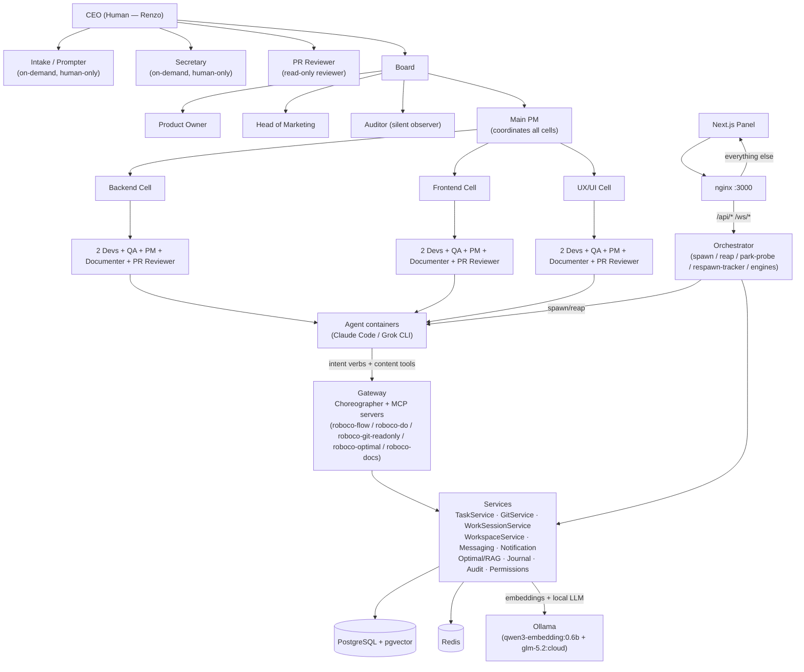
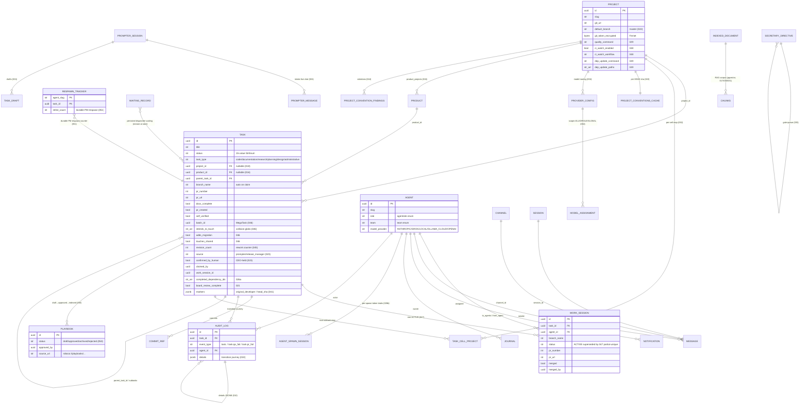
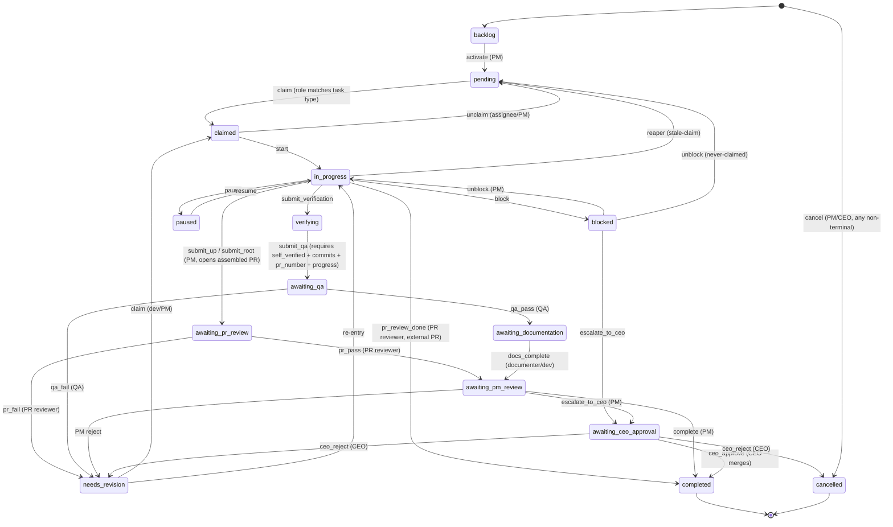
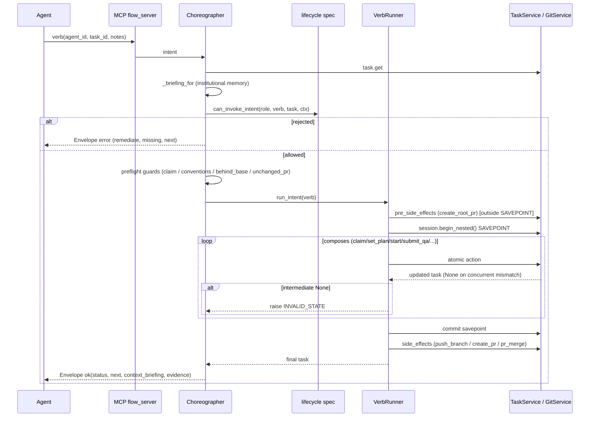
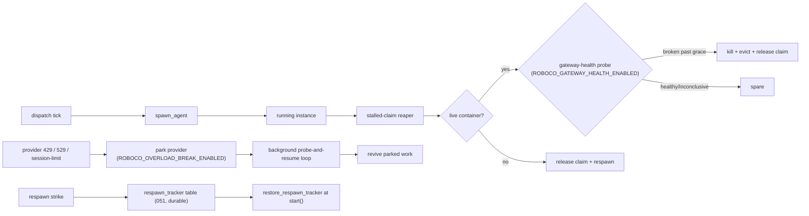
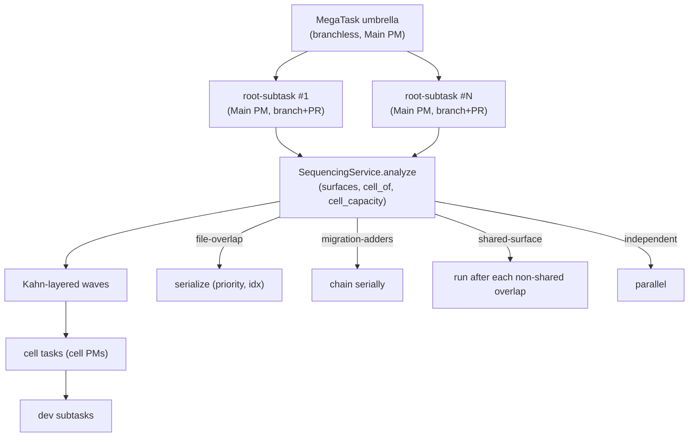
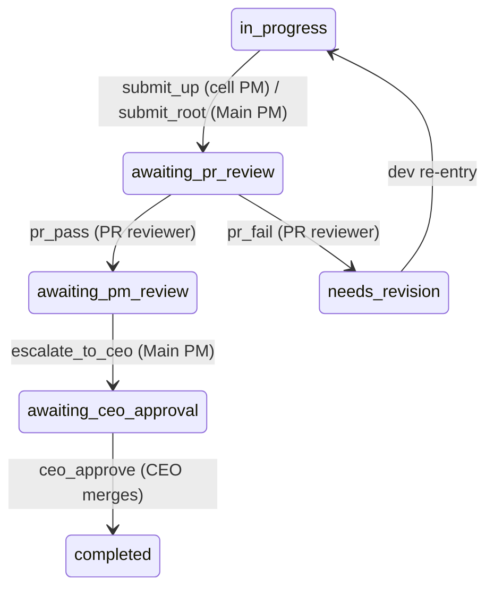
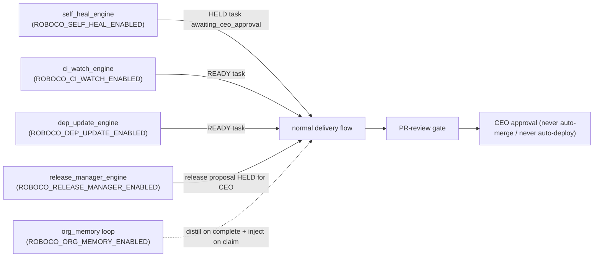

# RoboCo — The Complete Map (2026-06-29)

> Scope: full codebase, baseline `fd10cc862`..HEAD. The CEO suspects recent changes may have broken the system. This is the exhaustive record + drift/regression audit, built from 31 per-slice maps. Branch: `feature/metrics-granularity` (work merged into `master` via PRs #283 and #285), **NOT deployed**.
>
> Verified range figures: `git log --oneline fd10cc862c2020b3f639cdb686d427b0198a2441..HEAD` returns **2 commits** on `master` (`15effce0` "Chore: 141 Gaps fill-in (#283)" and `3aff6e04` "Chore: Close gaps (#285)"), but the bundled diff is enormous — **577 files changed, +36,653/-4,214 lines** (verified via `git diff --stat`). The two PRs squash months of per-fix work (F0xx audit gaps, F123 worktrees, sequencing, pr_fail loop-closers, model rename, etc.) into two merge commits, so the effective change surface is far larger than the commit count implies. Earlier per-fix commits (e202ce39, 250be5c2, a957e4fa, 82541077, cf7603f3, e52fd05d, 919aa7e2, 12621a36, 9927d248, c03e76c4, 2f322286, c34e978f, 3a4a3fe5, 53d60da3) are ancestors of `15effce0` and are the substance of the gap-fill.

## Table of Contents

**Chapters (this front matter):**
- System at a Glance
- Data Model ERD
- Task Lifecycle State Machine
- Cross-Cutting Flows
- What's Wrong — Drift & Regression Risks
- Verified Regression Risks *(appended by a later step)*
- Appendix: Git Log fd10cc862..HEAD

**Per-slice sections (concatenated after this front matter, in this order):**

1. foundation-lifecycle
2. foundation-batch-sequencing
3. foundation-policy-misc
4. foundation-conventions-identity
5. models
6. db-migrations
7. task-service
8. worksession-git
9. workspace
10. choreographer
11. pr-gate-review
12. gateway-support
13. orchestrator
14. runtime-providers
15. engines-heal-ciwatch-depupdate
16. release-manager
17. org-memory-playbooks
18. messaging-notification
19. a2a-audit-journal-permissions
20. conventions-service-validator
21. intake-secretary
22. product-strategy-research-pitch
23. metrics-observability
24. support-services
25. mcp-servers
26. api-core-websocket
27. api-routes-schemas
28. panel
29. deployment-tooling
30. tests
31. prompts-roles-taxonomy

---

## System at a Glance

```mermaid
flowchart TD
  RT["RoboCo"]
  RT --> LC["Lifecycle"]
  LC --> LC1["15 statuses"]
  LC --> LC2["about 30 intent verbs"]
  LC --> LC3["22 atomic actions"]
  LC --> LC4["spec gates and import validators"]
  RT --> GW["Gateway"]
  GW --> GW1["Choreographer"]
  GW --> GW2["VerbRunner SAVEPOINT"]
  GW --> GW3["MCP servers flow do git optimal docs"]
  GW --> GW4["role manifests"]
  RT --> OR["Orchestrator"]
  OR --> OR1["spawn and reap"]
  OR --> OR2["park-and-probe"]
  OR --> OR3["respawn-tracker durable"]
  OR --> OR4["gateway-health recovery"]
  RT --> SV["Services"]
  SV --> SV1["TaskService"]
  SV --> SV2["GitService"]
  SV --> SV3["WorkSessionService"]
  SV --> SV4["WorkspaceService"]
  SV --> SV5["Messaging"]
  SV --> SV6["Notification"]
  SV --> SV7["Optimal RAG"]
  SV --> SV8["Journal Audit Permissions"]
  RT --> EN["Engines"]
  EN --> EN1["self_heal"]
  EN --> EN2["ci_watch"]
  EN --> EN3["dep_update"]
  EN --> EN4["release_manager"]
  RT --> OM["OrgMemory"]
  OM --> OM1["distill learnings"]
  OM --> OM2["briefings injection"]
  OM --> OM3["playbooks"]
  RT --> CO["Comms"]
  CO --> CO1["channels"]
  CO --> CO2["A2A"]
  CO --> CO3["notifications dedup"]
  RT --> PA["Panel"]
  PA --> PA1["Next.js 16"]
  PA --> PA2["nginx"]
  PA --> PA3["WebSocket streams"]
  RT --> MG["Migrations"]
  MG --> MG1["001 to 054"]
  MG --> MG2["pgvector"]
  RT --> PR["Prompts"]
  PR --> PR1["roles"]
  PR --> PR2["taxonomy"]
  PR --> PR3["guard"]
```





---

## Data Model ERD

Synthesized from `models` + `db-migrations` (38 ORM tables in `roboco/db/tables.py`, migrations 001→054). Key fields shown on `Task`; relationships traced through the migration chain (single-active work_session via 047, batch/collision cols via 046, cell-project map via 052, respawn counter via 051, playbooks via 050, conventions cache via 043, observability `revision_count` + audit index via 045).



---

## Task Lifecycle State Machine

Synthesized from `foundation-lifecycle` (`_STATUS_TRANSITIONS` / `STATUS_GRAPH`). Role labels mark the allowed actor for each edge; the in-path PR-review gate (`awaiting_pr_review`) sits between PM `submit_up`/`submit_root` and `awaiting_pm_review`.



---

## Cross-Cutting Flows

### (a) Agent → MCP → Choreographer → Service → Envelope



### (b) Orchestrator dispatch / reap / park-probe / respawn durability



### (c) MegaTask sequencing



### (d) In-path PR-review gate



### (e) Default-off engines — each originates one task into the normal delivery flow (+ PR-review gate), never auto-merges, bounded by caps, held for CEO where applicable



---

## What's Wrong — Drift & Regression Risks

**Method.** Thirty-one per-slice maps were produced from the `fd10cc862..HEAD` tree. Each slice's `## Regression Risks` and `## Drift from CLAUDE.md` sections were extracted with `grep` (480 + 781 lines of raw evidence), then deduplicated and ranked across slices. The table below consolidates the top ~25 risks, critical/high first; the full per-slice risk tables follow in each slice section. A separate "Verified Regression Risks" chapter (appended by a later step) will adversarially verify the top 12 against the live code.

### Top Regression Risks (consolidated across 31 slices)

| # | Risk | Slice | File:Line | Claim | Severity |
|---|------|-------|-----------|-------|----------|
| 1 | `ceo_approve` skips work-session close | task-service | `roboco/services/task.py:5146` | `ceo_approve` calls `_remove_task_worktree_on_terminal` but NOT `_close_work_session_for_task` (only `complete()` does). CEO-approved root tasks leave the WorkSession row not marked closed → reporting/session-resolution drift. **FIXED post-snapshot: `536bbb64` added `_close_work_session_for_task(task, reason="ceo approved")` before worktree removal (task.py:5379).** | High |
| 2 | `fail_qa` route depends on unreliable `original_developer` marker | task-service | `roboco/services/task.py:4228` | Fast path reads the marker; if absent falls to `_resolve_revision_dev`. If both miss (no dev work session, e.g. parent-only edit) task is unassigned to pool → a PM may grab a dev task (the original 2026-06-27 loop). | High |
| 3 | `do`/`a2a` any-role token gate | api-routes-schemas | `roboco/api/routes/v1/do.py:43`, `a2a.py:114` | `require_any_authenticated_agent` only verifies HMAC + agent exists; does NOT assert role matches the verb's role family. A QA-signed token could call `do/commit`; a dev could call `a2a` admin paths. Service-layer scope is the sole guard → a missed service check = privilege escape. | High |
| 4 | 422 response echoes secrets | api-routes-schemas / api-core-websocket | `roboco/api/middleware.py:407` (resp body), `:434` | `_scrub_secrets` redacts only the **log** body; the JSON response still contains `body` with the caller's original `git_token`/`api_key`. A 422 returns the secret to the client (and any MITM/log of the response). | High |
| 5 | `pr_merge` project_id scoping assumes non-None | choreographer | `roboco/services/gateway/choreographer/_verb_runner.py:263` | `project_id=task.project_id` — if a coordination/umbrella task reaches `pr_merge` with `project_id=None`, the cross-repo collision guard silently matches nothing or None-keys the scoping; could merge the wrong PR or no-op. | High |
| 6 | `_submit_*_unchanged_pr_guard` fails open on resolver regression | choreographer | `roboco/services/gateway/choreographer/_impl.py:6175,6240` | Any future break in `_current_pr_head_sha` / `_project_slug_for` / `git.get_pr_head_sha` makes the pr_fail loop-stopper a no-op, re-opening the 2026-06-27 pr_fail re-submit loop silently. | High |
| 7 | Intermediate-None trailing-None contract | choreographer | `_verb_runner.py:89` + `_impl.py:1277,6358` | A verb that forgets the trailing-None guard None-derefs `t.status`; any NEW verb using `run_intent` with a possibly-None last action inherits the trap. **FIXED post-snapshot: `0e7674af` added `if task is not None:` guard before the side_effects loop (_verb_runner.py:107); trailing None now flows out without touching side effects.** | High |
| 8 | `has_cell_projects` threaded incorrectly breaks branchless exemption | foundation-batch-sequencing | `roboco/foundation/policy/batch.py:66` | `is_branchless_coordination` now requires callers to pass `has_cell_projects`. A call site that omits it (defaults False) for a cell-map root will NOT recognize it as branchless and will demand a branch/PR the root cannot supply — wedging that root in the git gate. Any new call site is a landmine. | High |
| 9 | Kanban admin-override drag skips lifecycle | panel | `panel/src/components/kanban/core/kanban-board.tsx:160` | A confirmed override routes through `useUpdateTask` (admin status-override), bypassing the in-band validator. `skippedPreconditions` is precision-over-recall — a careless confirm can complete a task with no PR / QA-bypass / docs-incomplete. | High |
| 10 | `create_all` schema drift — NOT NULL ORM-mapped columns break all DB tests | tests | `tests/conftest.py:182` | Schema built via `Base.metadata.create_all`, not alembic. A post-052 migration adding a NOT NULL ORM-mapped column without `server_default` breaks every `db_session` test. Conftest only backfills migration-006 cols. | High |
| 11 | Cycle-time SQL depends on audit-log event naming | metrics-observability | `roboco/services/metrics.py:554` | A future named audit event whose `to_status` resolves under `event_type='task.'\|\|to_status` could inject zero-length stages or skew dwell averages across every cycle-time/bottleneck panel. | High |
| 12 | Rework cost join on `agent_spawn_sessions.task_id` | metrics-observability | `roboco/services/metrics.py:742` | If spawn sessions stop populating `task_id` (orchestrator regression), rework cost silently drops to $0 — underreported CEO spend. | High |
| 13 | Release Redis mutex TTL shorter than worst-case execute | release-manager | `roboco/services/release_proposal.py:39` | `_RELEASE_LOCK_TTL_SECONDS=3000` (50min) but execute can run clone+gate+CI+publish ≈ 85min. TTL expires mid-execute → a second approve acquires and `rm -rf`s the in-flight clone, corrupting the release. **FIXED post-snapshot: `05616607`+`2759edf7` added a background `_heartbeat_loop` (`_RELEASE_LOCK_HEARTBEAT_SECONDS=60`) that refreshes the TTL while the lock is held; TTL is now a crash-backstop only and cannot expire under a live execute. Fencing token (compare-and-del Lua script) also prevents a stale first-finally from stealing a usurper's lock.** | High |
| 14 | Stream-bus handler failure leaves message pending → duplicate side effects | support-services | `roboco/events/stream_bus.py:338` | ACK only when all handlers succeed; `recover_pending` re-runs idle≥60s messages. Non-idempotent notification handlers can double-fire after a crash/restart. **FIXED post-snapshot: `e4ed970f` added per-`(event.id, handler)` SET-NX idempotency guard (`_run_handler_guarded`): successful handlers set a Redis key that blocks replay; failed handlers clear the key so replay re-runs them. Also added a dead-letter stream for undecodable poison pills and a periodic `_reclaim_loop` (every 60s).** | High |
| 15 | `resolve_for_agent` silently downgrades to Anthropic | support-services | `roboco/services/llm.py:124,193,205` | Decrypt failure / unreachable LOCAL / missing assignment all return the legacy Anthropic route instead of raising — a misconfigured Grok/Ollama fleet spawns against Anthropic with only a log warning. | High |
| 16 | LLM model rename breaks cached ollama deployments | deployment-tooling | `docker-compose.yaml:86` | `ollama-init` verify now greps for `glm-5.2` exactly. A NAS volume with only the old `glm-5:cloud` cached (no network) hits FATAL exit and blocks boot until the new model is pulled. | High |
| 17 | Gateway-health over-reap of live containers | orchestrator | `roboco/runtime/orchestrator.py:8689` | `_maybe_recover_broken_gateway` kills a live container past `gateway_health_grace_seconds`; a flaky false-broken probe streak could kill a healthy agent mid-long-edit. | Medium-High |
| 18 | Readopt liveness false-positive | orchestrator | `roboco/runtime/orchestrator.py:8547` | `_readopt_running_agents` registers ACTIVE for any running `roboco-agent-{slug}` container at startup, including a zombie from a prior orchestrator that already released the claim — blocks re-spawn until the stale container is noticed. | Medium |
| 19 | Stalled-claim reaper live-skip blind spot | orchestrator | `roboco/runtime/orchestrator.py:8750` | `_should_skip_live_reap` spares any live container that is neither grok-wedged nor gateway-broken; a Claude agent alive but stuck in a non-verb loop keeps its claim forever. | Medium |
| 20 | DB purpose-dedup gated to ack-required types only; `_persist_and_deliver` skips it entirely | messaging-notification | `roboco/services/notification.py:521`, `notification_delivery.py:875` | Task-handoff notifications (blocker/escalation/ceo-rejection) are not DB-deduped past the 60s Redis window — a retried `i_am_blocked`/`escalate` beyond 60s re-creates an unacked duplicate (the inbox-inflation + i_am_idle soft-block the DB dedup was added to prevent). | Medium |
| 21 | `acknowledge` publishes `NOTIFICATION_ACKED` directly, not via the transactional outbox | messaging-notification | `roboco/services/notification_delivery.py:451` | Same phantom-event class F107 fixed for `deliver`, left unfixed for the ACK path — a rollback after a successful ACK publish emits a phantom ACK. | Medium |
| 22 | A2A legacy notification suppressed by new loop-prone re-fire guard | a2a-audit-journal-permissions | `roboco/services/a2a.py:640` | Since `3aff6e04`, `send_a2a_notification` runs the 60s Redis guard for loop-prone types before creating the notification. A legitimate A2A peer notification re-sent within 60s (real state change, not a respawn loop) can be silently dropped. | Medium |
| 23 | `sync_branch` has no source-status gate — callable on terminal/paused/blocked tasks | foundation-lifecycle | `roboco/foundation/policy/lifecycle.py:1085` | `sync_branch` composes=() and is not in the special-case list, so `can_invoke_intent` only checks role + OWNERSHIP. A dev who owns a COMPLETED/CANCELLED task passes the spec gate; the rebase runs against a finished task's branch. | Medium |
| 24 | `_curate_playbook` explicit `session.commit` before index | gateway-support | `roboco/services/gateway/content_actions.py:847` | If the caller's session is in `PendingRollbackError` (prior mid-verb failure poisoned it), this commit raises and the whole curation verb 500s instead of a clean envelope. | Medium |
| 25 | Coverage omit list hides orchestrator/git/workspace regressions from the 80% gate | tests | `pyproject.toml:259` | `[tool.coverage.run].omit` excludes `orchestrator.py`, `git.py`, `workspace.py`, `mcp/*`, `agents/*`. A regression in the respawn-tracker upsert, pr_merge cross-repo scoping, or worktree routing will NOT fail `make quality`'s `--cov-fail-under=80`. | Medium |

> Additional notable Medium risks not deduplicated into the table above (see per-slice sections): `archive_playbook` behavior change (gateway-support); notify to prompter/secretary now refused (gateway-support); blocked task now blocks new claims (gateway-support); `apply_escalation` bypasses validator (task-service); branchless `ceo_reject` uses `admin_set_status` (task-service); `revision_count` bump is in audit helper only (task-service); `cancel` cascade swallows role violations (task-service); `_merge_with_retry` 405 → `MergeConflictError` (worksession-git); `close_pull_request` deletes branch on close by default (worksession-git); F123 worktree merge-sync runs in clone root not worktree (worksession-git); 1-cell map silently drops `product_id` (intake-secretary); malformed `project_id` in multi-cell map silently collapses shape (intake-secretary); collision-surface declaration is prompt-only not gate-enforced (prompts-roles-taxonomy); `submit_root` branch-keyed-vs-task_type-keyed prompt assertion (prompts-roles-taxonomy); `resolve_task_project_slug` cell_projects branch `AttributeError` (pr-gate-review); breaker substitution masks fixable rejection (mcp-servers); 404 synthesis assumes every route returns 200 (mcp-servers); intake composer SSE stuck (panel); panel token on live-chat bridges (panel); `/ws/system` ungated while siblings require panel token (api-core-websocket); cross-repo PR collision via `/api/work-sessions/{id}/pr/merge` (api-routes-schemas); orchestrator CEO gate vs release CEO gate divergence (api-routes-schemas); Grok directory mount widens RO exposure (runtime-providers); 6h `expires_at` default can burn the single-use refresh_token (runtime-providers); worktree `.venv` symlink self-heal depends on a later ensure (workspace); `ensure_worktree` reuses existing branch ref without validating base (workspace); `commit_and_push` RuntimeError unhandled by execute (release-manager); Redis outage fully blocks release approval (release-manager); `TranscriptionService` sync callbacks stall flush (support-services); `get_ready_buffers` unbounded growth (support-services); pitch partial-failure orphans GitHub repos (product-strategy-research-pitch); self-heal CEO notification spam (engines); ci_watch multi-workflow monorepo under-count (engines).

### Drift from CLAUDE.md (consolidated)

| Slice | Drift |
|-------|-------|
| foundation-lifecycle | `BLOCKED -> AWAITING_CEO_APPROVAL` via `escalate_to_ceo` is in the spec but missing from the doc's Role-Based Transitions table. Per-role verb table omits `i_am_idle` (stated only in prose). Doc undersells the enforcement shim (it owns `GitContext`/`validate_git_requirements`/SLA tables, not a pure view). |
| foundation-batch-sequencing | Doc omits the undeclared-surface same-assignee lane fallback (`a957e4fa`), the cell-map branchless shape, `is_valid_batch_shape`, `main_pm_cannot_own_code`, and edge kinds 2–4. |
| foundation-policy-misc | Doc does not mention `VERB_RETRY_LIMITS` / per-verb circuit breaker / `pm_respawn_max_tracing_resets`. Agent learnings role-exclusion lives in `notification_delivery`, not `journaling.py`. |
| foundation-conventions-identity | None material (additive `role_for_slug_or_none` helper). |
| models | `Role`/`Team` are aliases to `foundation.identity` (base.py:21–24), not defined in `base.py` — CLAUDE.md's "Role/Team in agent.py+base.py" is slightly stale. `Task` carries `cell_projects`/`batch_id`/`intends_to_touch`/`adds_migration`/`touches_shared` (task.py:171,217–228) that the "Data Models" prose omits (but the MegaTask section covers). No `AuditEvent` class (it's `AuditEventType`) and no `A2AEnvelope` in models (gateway `Envelope` lives in `services/gateway/`). |
| db-migrations | Doc says "52 migrations 001..052" — correct, but does not mention the two chained 026 files. No factual drift. |
| task-service | None material. |
| worksession-git | Doc undersell: commit header format and gateway merge-path description are documentation-undersell, not behavioral mismatch. |
| workspace | Doc's "fresh claim `git reset --hard`" narrative diverges from the post-F123 worktree model (by design) — doc drift to reconcile. |
| choreographer | Verb table omits `sync_branch` from the developer list (added since baseline). Otherwise matches. |
| pr-gate-review | None material. |
| gateway-support | Auditor surface doc under-states `notify_list`/`notify_get` + `channels` (additive, consistent with footnote). PM coordinator-skip lives in Choreographer not `claim_guards.py`. |
| orchestrator | None material (well-instrumented). |
| runtime-providers | `ClaudeCodeProvider` is dead reference code; its "default" label in CLAUDE.md is misleading. |
| engines-heal-ciwatch-depupdate | Minor framing: engines consume telemetry via `MultiProjectCITelemetrySource`, not `GitService` directly. Engine does not enforce `awaiting_ceo_approval` itself. |
| release-manager | None material. |
| org-memory-playbooks | None material. |
| messaging-notification | None material. |
| a2a-audit-journal-permissions | Doc lists `PermissionsService` (plural); actual class is `PermissionService` (singular). Legacy A2A-protocol path (`create_a2a_notification` / `TASK_ASSIGNED` re-spawn) undocumented. `AuditService.has_recent_tracing_gap` undocumented. |
| conventions-service-validator | None material (all doc claims match code). |
| intake-secretary | None material. |
| product-strategy-research-pitch | None material (slice unchanged). |
| metrics-observability | None material (slice unchanged). |
| support-services | None material (slice unchanged). |
| mcp-servers | Doc's server table is stale: lists 3 servers + omits many tools; intake/secretary/search are agent-facing MCP servers not listed. |
| api-core-websocket | No direct CLAUDE.md contradiction; the stale security docstring lives in `websocket.py` itself (describes old query-param model vs actual HMAC). |
| api-routes-schemas | None material; `post_pr_review` is additive, not contradictory. |
| panel | None material. |
| deployment-tooling | Doc omits panel/nginx from the compose services table; reverses panel/orchestrator build order in prose; `roboco-bootstrap = roboco.bootstrap:cli` console script points at a non-existent symbol; **Configuration section still documents `ROBOCO_LOCAL_LLM_MODEL=glm-5:cloud` while code now defaults to `glm-5.2:cloud`**; documented image set incomplete (grok-prompter/secretary/pr-reviewer images unlisted). |
| tests | None material. |
| prompts-roles-taxonomy | Stale agent count in `base.md` (22 vs CLAUDE.md's 25). |

### Assessment

The baseline→HEAD diff is unusual: only two commits appear on `master`'s first-parent line (`15effce0` and `3aff6e04`), but they bundle a **+36,653/-4,214 line, 577-file** change that squashes months of per-fix work — F0xx audit gaps, F123 per-task worktrees, sequencing S1/S2/S3, the pr_fail loop-closer, the model rename, the enum-gate fix, and the bash-guard `/app` venv protection. Read against the 2026-06-28 logic-gap audit (140 confirmed gaps, all resolved), the picture is not "the system is broken"; it is "a hardened system that absorbed a massive consolidation pass and, in doing so, opened several new seams."

**What clearly hardened.** The cross-repo PR-number collision that crashed `cell_pm_complete` is fixed with `project_id` scoping. The pr_fail re-submit loop is closed at three layers (head-sha capture, `submit_root`/`submit_up` unchanged-PR guards, a2a to owning PM). The single-active work-session defect is enforced both at the service layer and by migration 047's partial-unique index. The PM-respawn counter is now DB-durable (051) with an upsert race fix. The 60s Redis loop-prone re-fire guard and `VERB_RETRY_LIMITS` circuit breaker tame the notification/respawn storms. F123 per-task worktrees eliminated the coordinator-PM clone clobber and routed commit/conventions/rebase into the worktree. Sequencing S1/S2/S3 + the per-dev lane barrier (`82541077`) close the out-of-order-start wedge. The WS fan-out no longer back-pressures on a slow client, 422 logs no longer leak credentials, and the WS + HTTP panel-token gates close the operator-only invariant.

**What is genuinely new and wrong.** Five gaps appear that did not exist (or were not load-bearing) at the baseline. (1) `ceo_approve` is asymmetric with `complete()`: it removes the worktree but skips work-session close and the full completion hooks, so CEO-approved root tasks leave unclosed sessions and never get code-changes/decision RAG indexing — a reporting and corpus drift. (2) `fail_qa` routing still depends on the unreliable `original_developer` marker with a work-session fallback that has no guarantee a dev session exists; the 2026-06-27 dev-loop it was meant to close can still recur on a parent-only edit. (3) The `do`/`a2a` any-role token gate means the HMAC check never asserts the role matches the verb's role family — privilege escape is one missed service-scope check away. (4) The 422 response body still echoes `git_token`/`api_key` back to the client (`_scrub_secrets` only scrubs the log) — a real secret-leak surface. (5) Gateway-health recovery, while closing a real blind spot, can over-reap a live healthy container on a flaky false-broken probe streak — killing an agent mid-long-edit. None of these are crash bugs on the happy path; all are correctness/privilege/integrity drift that the happy path never exercises.

**Standing landmines the diff did not touch but the diff's blast radius now amplifies.** The enum-parity gate can false-green on an empty/mismatched `roboco` DB; `sa.Enum(create_type=False)` in 001 is a latent no-op on clean re-apply; missing pgvector aborts `init_db`; `has_cell_projects` is a sharp footgun for any new `is_branchless_coordination` call site; the release Redis mutex TTL (50min) is shorter than worst-case execute (~85min), re-opening the `rm -rf`-clone race it was added to prevent; the coverage omit list excludes the very modules that changed most (orchestrator/git/workspace), so a green `make quality` does not mean those hot paths are covered. The single-commit bundling of nearly every panel logic fix means a partial revert can drop several independent fixes at once.

**Verdict.** The system is **not at its prime, but it is not broken either — it is hardened-but-drifting.** The 159-commit-equivalent gap-fill closed more real race conditions and cross-repo collisions than any prior wave, and the core delivery flow (claim → plan → start → submit → QA → PR-gate → PM/CEO review → complete) is structurally sound and well-instrumented. But the consolidation pass introduced a small set of new integrity seams — the `ceo_approve` completion asymmetry, the `fail_qa` routing fragility, the any-role token gate, the 422 secret echo, and the gateway-health over-reap — that are worth fixing before the next deploy, and the standing landmines (enum-parity, pgvector, mutex TTL, coverage omissions) are worth arming against. The CEO's suspicion that recent changes "may have broken the system" is, on the evidence, **partially warranted at the edges and not warranted at the core**: no meltdown-class regression is present, but five correctness/privilege gaps and several standing landmines mean a deploy without addressing them carries real (if non-fatal) risk.

---

<!-- VERIFIED_RISKS: appended by a later step -->

## Appendix: Git Log fd10cc862..HEAD

`git -C /Users/renzof/Documents/GitHub/ZZZ/roboco-master/roboco log --oneline fd10cc862c2020b3f639cdb686d427b0198a2441..HEAD`:

```
3aff6e04 Chore: Close gaps (#285)
15effce0 Chore: 141 Gaps fill-in (#283)
```

Two commits on `master`'s first-parent line, bundling a **577-file, +36,653/-4,214** diff (`git diff --stat fd10cc862..HEAD`). The substance of the gap-fill is the per-fix commits squashed into `15effce0` (ancestors: `e202ce39`, `250be5c2`, `a957e4fa`, `82541077`, `cf7603f3`, `e52fd05d`, `919aa7e2`, `12621a36`, `9927d248`, `c03e76c4`, `2f322286`, `c34e978f`, `3a4a3fe5`, `53d60da3`, and the F123/F-fix wave). The `feature/metrics-granularity` branch is **NOT deployed**.

> Post-snapshot updates (since 2026-06-29, branch `chore/logical-gaps-element-sweep-fixes` + merged via PR #286 `536bbb64`): logical-gap sweep fixed ceo_approve work-session closure (Risk #1), verb_runner trailing-None side-effect guard (Risk #7), release-mutex heartbeat (Risk #13), and stream-bus idempotency guard + dead-letter (Risk #14). Two new migrations landed: `053_playbook_archived_attr` and `054_a2a_message_skill` (total now 001→054; ORM table count increased from 37 to 38). Chat-subsystem commits (`76ce53e3` MESSAGE_SENT wired end-to-end in websocket_bridge, `0065ecbb` session task_links, `2da72f3f` closed-session/reply_to guard, `77958c1e` read IDOR fixes, `5cb4e85f` secretary SSE hardening, `a1127daf` session-task endpoint fix) landed after the snapshot. A2A-routes hardening: `5bec3ec5` stamped authenticated caller slug as responder (spoof fix) and added PM-only gate on cancel_task. Hotfixes: `cfe725da` worktree clone-root recovery, `00513399` push_branch named-branch, `9faf2763`/`7be10057` VIRTUAL_ENV agent-image strip. Key sweep commits: `ec2e49af` pr_review_claim active_claimant_id, `d8a5bb48` a2a hierarchy gate + skill persist, `e4ed970f` stream-bus (see Risk #14), `0e7674af` verb_runner (see Risk #7), `05616607`+`2759edf7` release executor (see Risk #13), `ef33d56c` lifecycle-enforcement validators, `16b71be8` lifecycle 6-gap fix, `f90565ea` pr_gate MegaTask-root classification, `b49337e7` route-layer force/privileged-field gates, `115061f3` notification_delivery over-fetch fix.

---
## Delta 2026-07-02 — hotfix batch (PR #293 `0f1ed3cc` + local `8e5f84c4`)

Nine live-run fixes, all merged to `master` the same day (commits `81f448bb`, `011158db`, `9d10217c`, `7dff3237`, `1cf24ff1`, `569a6157`, `c1acbd5b`, `298751e6`, `53bb0420`, `4de81d92`, `a260f903`, `caecb816`, `fe9e5589`, `8e5f84c4`):

1. **Delegate MCP tool carries the collision surface** (`81f448bb`, `7dff3237`) — `roboco/mcp/flow_server.py` `delegate` gains `intends_to_touch` / `adds_migration` / `touches_shared` / `depends_on` and forwards them. The `TASK_AT_DELEGATE` gate (`roboco/foundation/policy/task_completeness.py`) required `intends_to_touch` on code delegations but the tool could not send it — fleet-wide `incomplete_input` delegation wall. Parity test locks plan-gate fields ⊆ tool params (`tests/unit/mcp/test_flow_server_delegate_surface_parity.py`).
2. **Assembly-integrity guard accepts squash-merged children** (`011158db`) — `roboco/services/git.py` (~L4035): when `git cherry` reports a child unmerged, a parent-branch commit carrying the child's `[taskid8]` prefix now proves it landed (squash = N patches → one commit, new patch-id). Markerless children stay flagged.
3. **Diff head prefers origin when local is behind** (`9d10217c`) — `roboco/services/git.py` `_resolve_head_ref` (~L4359): both refs exist + local strictly behind (`merge-base --is-ancestor`) → resolve `origin/<branch>`; local-ahead/diverged keep priority. Kills the stale-evidence false `pr_fail` on assembled PRs that advanced on origin.
4. **`GET /api/tasks/summary` + bounded list routes** (`1cf24ff1`, `c1acbd5b`, `298751e6`) — `roboco/api/routes/tasks.py` wires the previously-dead `TaskSummaryResponse` (`roboco/api/schemas/tasks.py`, now + `completed_at` / `board_review_complete`) into a trimmed route (default limit 500, cap 1000); eleven unbounded task list routes gain `limit` params; the `/tasks` status-only branch honors its limit.
5. **Panel request-flood/fat-payload fixes** (`569a6157`, `298751e6`) — `prefetch={false}` on all Links (sidebar, cards, queues), task list + CEO queue consume `/api/tasks/summary` (`panel/src/lib/api/tasks.ts` `TaskSummary`), logo/icon PNGs slimmed (446KB → 7KB), ReactQueryDevtools dev-only (`panel/src/components/providers.tsx`).
6. **Spawn manifest `workspace_path` follows the task's project** (`53bb0420`) — `roboco/runtime/orchestrator.py` `_build_manifest_for_agent(workspace_path=)` + new `_resolve_workspace_cwd`: manifest and container `-w` share one resolver (was hardcoded to the roboco-project workspace for every spawn).
7. **Respawn breaker catches status ping-pong** (`4de81d92`) — `roboco/foundation/policy/agent_loop.py` `pm_respawn_max_revisit_resets: int = 2` + orchestrator `_respawn_status_change_resets`: a never-seen status fully resets strikes; a REVISITED status gets a bounded reset budget (mirrors tracing_resets), after which strikes accrue. `seen_statuses` is in-memory only (rebuilds post-restart, can only under-gate).
8. **Unassigned-QA dispatch no longer pre-claims** (`a260f903`, `caecb816`) — orchestrator (~L10968): the transitioning pre-claim moved `awaiting_qa` → `claimed` before the agent existed, stranding `claim_review`/`pass_review` (both demand `awaiting_qa`). Now matches `_spawn_assigned_qa` / external-PR dispatch: spawn unclaimed, agent self-claims via `claim_review`.
9. **Team-match enforcement armed** (`fe9e5589`, `8e5f84c4`) — `roboco/foundation/policy/lifecycle.py`: `resume`/`unblock`/`activate` flip `needs_team_match=True`; new `_ORG_WIDE_ROLES` exemption (main_pm, CEO, PO, head_marketing, auditor, pr_reviewer) in `_check_team_match(…, role)`. `8e5f84c4` threads `agent_team` through all 27 gateway `Context` construction sites (`choreographer/_impl.py`, `doc.py`, `pr_gate.py`, `pr_review.py`, `qa.py`) so the gate actually receives the team — it had sat in its permissive fallback since shipping.

Slices touched: worksession-git (2, 3), choreographer/gateway-support (9), orchestrator (6, 7, 8), foundation-lifecycle (7, 9), mcp-servers (1), api-routes-schemas (4), panel (5). `docs/map/_complete_map.md` is the pre-delta concatenation — not regenerated.

---
## Delta 2026-07-02 (evening) — leak-fix batch (branch `fix/leak-fix-batch`)

The remaining live-run leak fixes from the S6/fb836f80 postmortems, TDD'd per item:

1. **Spawner attribution** — `roboco/runtime/orchestrator.py` `spawn_agent(spawned_by=)` → `_launch_spawn(spawned_by=)` stamps the dispatching loop's name into `agent.spawned` / `agent.spawn_failed` audit details (`"unspecified"` when absent). All ~29 call sites pass their loop name (orchestrator dispatchers by method name; `bootstrap`, `api.orchestrator.spawn`, `event.auditor_spawn`); `OrchestratorAccessProtocol.spawn_agent` (roboco/models/events.py) gains the kwarg. A whole-package AST sweep test (`tests/unit/runtime/test_spawn_attribution.py`) fails any future caller omitting it. `pyproject.toml` adds PLR0913 to the orchestrator's per-file ignores (spawn contract > 5 params, bundle refused). NOTE found in passing: `_safe_spawn` + `gateway_pre_spawn_check` (orchestrator ~L741/L1932, the trigger_filter dispatch-time cooldown) have NEVER had a caller — flagged to CEO, untouched under the freeze.
2. **Admin-complete merge-or-refuse** — `roboco/api/routes/tasks.py` `_apply_forced_status_override`: `status=completed` without `force` on a task whose work session records `pr_status == "open"` now refuses naming PR number/URL + the stranding consequence (checked before the generic hatch text). New `TaskService.open_pr_ref` (`roboco/services/task.py`, beside `_assert_pr_merged_for_complete`) is the lookup.
3. **Panel CEO-approve** — `panel/src/components/tasks/task-detail/task-header.tsx` `AWAITING_CEO_APPROVAL`: primary action now `ceo-approve` (CeoApproveDialog → `POST /ceo-approve`, notes ≥ 20); `approve-and-merge` only when `task.pr_number` (umbrellas 400'd `NO_PR`).
4. **Live-Redis test leakage killed** — `tests/unit/services/test_self_heal_originate_db.py` wrote `self_heal:notified:*` (2h TTL) and `tests/unit/gateway/test_i_am_blocked_rate_limited.py` wrote a NO-TTL `roboco:rate_limit:anthropic:state` "rate_limited" blob into live localhost Redis on every run (verified live, keys scrubbed). Both now patch `cfg.redis_host/redis_port` (redis_url is computed) to an unreachable port; engines' fail-open paths keep assertions intact. The one-off `test_self_heal_engine` full-run failure was NOT reproduced (adversarial orders, 5× dir loops, green full gate) — this leakage class + the 2026-07-02 corrupted-venv day remain the suspects.
5. **Phase1 smoke mock team** — `tests/integration/test_foundation_phase1_smoke.py` parent mock gains `team="backend"`; the armed team-match gate (delta above) rejected the auto-generated MagicMock team before the asserted `incomplete_input` (the sweep fixed 13 files; this integration file was outside the gateway/foundation/runtime subsets it ran).

6. **Gate green again: ten xenon C-ranks + global test-Redis isolation** — master CI red at the smoke test meant no gate (CI or local) had reached xenon since the team-match sweep; its inline `agent_team=…` kwarg had pushed 9 verb bodies to C(11-12) unseen (`_impl.py` i_am_done/resume/unclaim/submit_up/submit_root/complete/escalate_up/escalate_to_ceo, `qa.py` fail_review). New shared `actor_context_fields()` (`choreographer/_protocol.py`) computes `(actor_slug, agent_team)` once per verb; the admin-complete open-PR check is extracted to `_refuse_unforced_complete_with_open_pr` (routes/tasks.py). `tests/conftest.py` gains the autouse `_no_live_redis` fixture (root fix for the live-Redis leak class; notif_dedup purpose-dedupe keys were a third, self-expiring family).

7. **Dead spawn-cooldown path deleted (CEO-ratified)** — `_safe_spawn` + `gateway_pre_spawn_check` (orchestrator) + `roboco/services/gateway/trigger_filter.py` + both test files + the dead `spawn_cooldown_seconds`/`role_spawn_rate_per_minute` settings. Never called in repo history; superseded by provider parking (in `spawn_agent`), claim guards/reaper, the respawn circuit breaker, and the notification-spawn cooldown. Rule 4 (per-task cooldown) would have queue-stalled every stage handoff if wired. `GatewayTriggerTable` kept inert (drop = future migration decision).

Slices touched: orchestrator (1, 7), api-routes-schemas + taskservice (2), panel (3), choreographer/gateway-support (6, 7), tests (4, 5, 6, 7). `docs/map/_complete_map.md` still not regenerated.

---
## Delta 2026-07-02 (late) — CEO-ratified follow-ups (branch `fix/leak-fix-batch`)

1. **Dead spawn-cooldown path deleted** (see item 7 above; commit `78fa0f6f`).
2. **uv serialization in the Makefile** (`cf5043fe`) — `export UV_NO_SYNC := 1` + `sync` prerequisite on quality/quality-fast/gate: gate recipes never implicitly re-sync the venv (the recurring rich/pip/bandit corruption came from two uv writers racing one `.venv`).
3. **`_api_base()` in git.py** (`13b9c5d4`) — 15 hardcoded `https://api.github.com` PR/merge/branch sites now honor `settings.github_api_base_url` like the CI/open-PR sites already did (GHE/test override fix; enables the smoke harness's fake GitHub).
4. **CI split** (`db6b3088`) — ci.yml (backend `quality` only; FILE name kept — self-heal/ci-watch/release default to it), `panel-ci.yml` (panel job, `panel/**` paths), `e2e-smoke.yml` (new job). Panel-only reds now land on Panel CI, unwatched by the ci.yml-pinned engines.
5. **e2e smoke harness** — `tests/e2e_smoke/{conftest,harness,test_dev_lifecycle}.py` + `make e2e-smoke` (env-gated `ROBOCO_E2E_SMOKE=1`, skipped in the default suite). Harness: real routers/middleware on uvicorn over the ephemeral test DB (`settings.database_*` patched + `_DbHolder` reset), bare origin at `<tmp>/github.com/e2e-smoke/proj.git` (satisfies `_parse_git_url`, clones tokenless), fake GitHub REST router doing real squash-merges via an admin clone, `ScriptedAgent` reloading the real MCP modules per role. Scenario 1 (leaf dev arc → awaiting_pm_review) GREEN in ~5s. Learned seams scripted: post-claim tracing gap keeps the claim; note scopes are decision/learning/note/reflect/struggle (no 'progress'); i_am_done demands during-work+handoff+reflect+per-AC artifacts; pass_review demands learning note + ac_verdicts; A2A resolves roles from the STATIC agents_config registry (seed canonical slugs: be-dev-1/be-qa/be-doc/be-pm/main-pm).

Slices touched: worksession-git (3), orchestrator (1), deployment-tooling (2, 4), tests (5).
