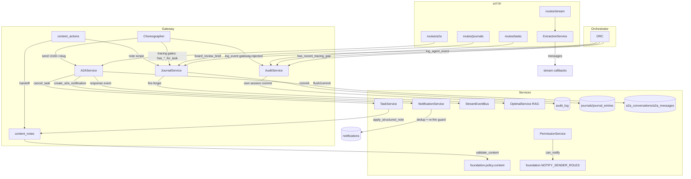

## Purpose
This slice is the agent-to-agent communication, audit forensics, journaling, structured-note persistence, message extraction, and role-based access-control backbone of RoboCo's service layer. A2AService builds Agent Cards and manages persistent slug-keyed A2A conversations/messages plus the legacy A2A-protocol task/notification path. AuditService best-effort persists security/lifecycle events to audit_log and backs the PM-respawn tracing-gap circuit breaker. JournalService owns agent journal CRUD, gateway scope→type entry writes, and fire-and-forget RAG indexing. content_notes is the single chokepoint that validates and persists structured task notes plus their derived TEXT mirrors. ExtractionService classifies raw LLM stream buffers into typed messages. PermissionService enforces notification/task/KB access from agents_config.

## Files

| Path | Role | LOC |
|---|---|---|
| roboco/services/a2a.py | A2A protocol + persistent conversation service: Agent Cards, task↔A2A conversion, legacy A2A task notifications, bidirectional response spawning, slug-keyed conversation/message CRUD, gateway send adapter, CEO admin/live-view surface (reply budget + org-wide read) | 1778 |
| roboco/services/audit.py | AuditService singleton: best-effort persist denial/lifecycle/agent events to audit_log, resolve actor role + slug→UUID at write time, tracing-gap query for respawn circuit breaker, recent-events query | 462 |
| roboco/services/journal.py | JournalService: journal/entry CRUD, gateway scope-string→JournalEntryType adapter, fire-and-forget RAG indexing (private excluded), tracing-gate existence checks, board review brief, growth analytics | 1029 |
| roboco/services/content_notes.py | Single chokepoint applying structured notes: validate via foundation ContentModel, store in notes_structured, regenerate derived TEXT mirror column (dev_notes/qa_notes/etc.) | 74 |
| roboco/services/extraction.py | ExtractionService + ExtractionPipeline: regex-pattern (and optional LLM/TOON) classification of raw agent LLM buffers into typed ExtractedMessages; transcription pipeline callback fan-out | 508 |
| roboco/services/permissions.py | PermissionService singleton + async helpers: notification scope (all/cell/board-chain), task-action and KB-action RBAC from agents_config; privileged/PM-role DB lookups | 425 |

## Key Symbols

| Name | Kind | File:Line | Responsibility |
|---|---|---|---|
| A2AService | class | roboco/services/a2a.py:55 | Service layer for A2A protocol ops and persistent agent conversations; takes an AsyncSession |
| get_service_endpoint | staticmethod | roboco/services/a2a.py:69 | Build outbound callback URL; dials loopback when host binds 0.0.0.0/:: to avoid bandit B104 |
| build_system_agent_card | staticmethod | roboco/services/a2a.py:87 | Return the system-level Agent Card served at /.well-known/agent.json |
| build_agent_card | method | roboco/services/a2a.py:144 | Resolve agent by UUID or slug and return its AgentCard (None if missing) |
| _agent_to_card | method | roboco/services/a2a.py:172 | Map an AgentTable row to an AgentCard with role-keyed skills + bearer security scheme |
| task_to_a2a | method | roboco/services/a2a.py:265 | Canonical RoboCo TaskTable→A2ATask conversion with status mapping and metadata |
| get_task | method | roboco/services/a2a.py:320 | Fetch task by UUID string and return A2ATask or None |
| list_tasks | method | roboco/services/a2a.py:345 | Paginated task listing with has_more detection (fetches page_size+1) |
| _status_value_of | staticmethod | roboco/services/a2a.py:383 | Extract task status as a comparable string (enum .value or str); factored from cancel_task for xenon complexity gate |
| _apply_cancel_note | method | roboco/services/a2a.py:387 | Append actor-attributed cancellation note to task.dev_notes and flush; factored from cancel_task |
| cancel_task | method | roboco/services/a2a.py:408 | Cancel task and cascade to descendants; now takes agent_role (threaded into TaskService.cancel role gate) and actor_slug (recorded in cancellation note); rejects terminal states |
| discover_agents | method | roboco/services/a2a.py:442 | List AgentCards filtered by role/team/skill_tag |
| get_team_from_agent | staticmethod | roboco/services/a2a.py:485 | Map agent slug to Team enum via agents_config.get_agent_team (defaults BACKEND) |
| resolve_target_agent | staticmethod | roboco/services/a2a.py:496 | Resolve target agent slug from metadata (explicit target_agent or skill-based routing) |
| extract_message_text | staticmethod | roboco/services/a2a.py:523 | Split first text part into (title, description, full_text) |
| update_task_with_message | staticmethod | roboco/services/a2a.py:540 | Append A2A-protocol message text to task.dev_notes (legacy A2A thread store, not gateway conversations) |
| resolve_creator_agent | method | roboco/services/a2a.py:563 | Resolve creator AgentTable from from_agent slug or fall back to first main_pm |
| create_a2a_notification | method | roboco/services/a2a.py:619 | Legacy A2A peer-to-peer notification (requires task_id); requires from_agent present and target_agent resolvable (raises ValueError with distinct messages if either missing); enforces hierarchy unconditionally via validate_a2a_access (A2AAccessDeniedError), then parse_priority, delegates to NotificationService.send_a2a_notification |
| update_task_from_message | method | roboco/services/a2a.py:657 | Append response message to existing A2A task and notify/spawn original requester (bidirectional) |
| _lookup_requester_slug | staticmethod | roboco/services/a2a.py:700 | Reverse-lookup agent slug from creator UUID via static AGENT_UUIDS map |
| _publish_a2a_response_event | staticmethod | roboco/services/a2a.py:711 | Publish TASK_ASSIGNED event to event bus to spawn/notify the original requester; swallows errors |
| _notify_original_requester | method | roboco/services/a2a.py:741 | If task.dev_notes carries 'A2A Request' marker, publish response event to requester (skips self-response) |
| _canonical_pair | staticmethod | roboco/services/a2a.py:779 | Return two agent slugs in lexically-sorted order (conversation uniqueness key) |
| get_or_create_conversation | method | roboco/services/a2a.py:784 | Validate A2A access (validate_a2a_access), canonical-order lookup or create A2AConversationTable row |
| get_conversation | method | roboco/services/a2a.py:850 | Fetch conversation by ID only if agent_slug is a participant |
| get_conversation_admin | method | roboco/services/a2a.py:952 | Wave-2 CEO live view: like get_conversation but WITHOUT the participant check — returns any conversation by id for the org-wide read; None only if it truly doesn't exist |
| list_conversations | method | roboco/services/a2a.py:881 | List conversation summaries for an agent with optional status/with_agent/task_id filters; per-conv last-message preview query (N+1) |
| list_conversations_admin | method | roboco/services/a2a.py:1063 | Wave-2 CEO live view: list conversations across every agent pair (no participant filter), most-recent-first; backs GET /chat/admin/conversations |
| list_admin_pairs | method | roboco/services/a2a.py:1101 | Wave-2c switchboard: every agents_config.A2A_ALLOWED_PAIRS entry joined with its representative conversation (most-recently-updated when >1) via one bulk tuple_(agent_a,agent_b).in_() query — never N+1; backs GET /chat/admin/pairs |
| close_conversation | method | roboco/services/a2a.py:962 | Mark conversation CLOSED with optional resolution; participant-only |
| _enforce_ceo_reply_budget | method | roboco/services/a2a.py:1177 | Wave-2 reply-then-wait budget on the CEO's inbox — the one stateful gate the stateless can_a2a_direct matrix can't see. An agent may message the CEO only inside a conversation the CEO itself opened, and only up to the CEO's own message count there (rejects once agent_count >= ceo_count); no-op for CEO-authored sends or non-CEO conversations |
| send_chat_message | method | roboco/services/a2a.py:1225 | Send message in conversation; nil-UUID guard; dedup unread identical (conv,sender,kind,content); calls _enforce_ceo_reply_budget before persisting; bump unread for other side; reads skill from opts and persists it on the message row (nullable) |
| get_messages | method | roboco/services/a2a.py:1337 | Paginated chronological message list for a participant |
| get_messages_admin | method | roboco/services/a2a.py:1375 | Wave-2 CEO live view: like get_messages but WITHOUT the participant check — reads any conversation's transcript; [] only if the conversation truly doesn't exist |
| mark_read | method | roboco/services/a2a.py:1410 | Zero agent's per-side unread counter and bulk UPDATE read_at on inbound unread messages |
| mark_all_read | method | roboco/services/a2a.py:1451 | Agent-keyed bulk mark_read across all conversations with unread for this agent; returns count cleared |
| get_inbox_summary | method | roboco/services/a2a.py:1492 | Aggregate total unread, conversations with unread, pending + unanswered requires_response counts |
| list_pairs | method | roboco/services/a2a.py:1553 | Group conversations into unique agent pairs with rollup counts/unread/last_activity for frontend |
| _conv_to_model | method | roboco/services/a2a.py:1603 | A2AConversationTable→A2AConversation Pydantic model |
| _msg_to_model | method | roboco/services/a2a.py:1621 | A2AMessageTable→A2AChatMessage Pydantic model; now maps skill field (migration 054 adds nullable skill column on a2a_messages) |
| _resolve_slug_from_id | method | roboco/services/a2a.py:1642 | Lookup agent slug from UUID; raise ValueError if missing (gateway send adapter) |
| _get_conversation_for_reply_to_ceo | method | roboco/services/a2a.py:1652 | Wave-2: resolve the conversation for an agent replying to the CEO by direct lookup (bypasses get_or_create_conversation's validate-first gate, which would deny even a legitimate reply) — an existing pair conversation's mere presence proves the CEO opened it, since agents can never create one |
| send | method | roboco/services/a2a.py:1684 | Gateway adapter: resolve both ends to slugs, get_or_create_conversation (or _get_conversation_for_reply_to_ceo when replying to "ceo") + send_chat_message; publishes A2A_MESSAGE_SENT via _publish_a2a_message_sent afterward |
| _publish_a2a_message_sent | staticmethod | roboco/services/a2a.py:1742 | Wave-2: best-effort publish of A2A_MESSAGE_SENT (conversation_id/message_id/task_id/from_agent/to_agent/skill/body_excerpt/timestamp) to the event bus for the operator live view; a bus outage is logged and never rolls back the already-persisted message |
| _AuditEvent | dataclass | roboco/services/audit.py:20 | Bundled fields for one audit row write (event_type, agent_id, target, severity, details) |
| _coerce_uuid | function | roboco/services/audit.py:36 | Best-effort coerce str/UUID to UUID; returns None for slugs/invalid |
| AuditService | class | roboco/services/audit.py:48 | SingletonService for audit logging; structured log + best-effort audit_log persistence |
| _persist | method | roboco/services/audit.py:77 | Write an audit row in its own session+commit; never propagate failures (observability must not block) |
| log_task_action_denial | method | roboco/services/audit.py:111 | Log a denied task action; resolves actual actor role from DB at write time over caller-supplied param; preserves non-UUID task_id sentinels (e.g. "N/A") in details["target_id_raw"] rather than silently coercing to NULL target_id |
| log_task_creation_denial | method | roboco/services/audit.py:163 | Log a pre-task-creation denial (no task row exists yet); records attempted payload under target_type="task_creation" with target_id=None — distinct from log_task_action_denial's NULL-target-id so role-escalation attempts are attributable |
| log_task_event | method | roboco/services/audit.py:204 | Log a task-lifecycle event (creation/transition) for TaskService chokepoint |
| log_event | method | roboco/services/audit.py:238 | Free-form generic audit event (e.g. gateway.rejected) for Choreographer forensics |
| log_agent_event | method | roboco/services/audit.py:273 | Log orchestrator agent event (spawned/stopped/stranded); resolves slug→UUID so agent_id is a real FK |
| _resolve_actor_role_from_db | method | roboco/services/audit.py:314 | Read agents.role for actor UUID at write time (DB authoritative over caller-supplied role) |
| _resolve_agent_id_by_slug | method | roboco/services/audit.py:302 | Static AGENT_UUIDS fast-path then DB lookup for slug→UUID; best-effort None on failure |
| has_recent_tracing_gap | method | roboco/services/audit.py:353 | Query audit_log for gateway.rejected/tracing_gap rows since cutoff; backs PM-respawn circuit breaker reset decision |
| get_recent_events | method | roboco/services/audit.py:399 | Fetch recent audit events as dicts (Auditor/CEO queries) with optional type/agent/severity filters |
| get_audit_service | function | roboco/services/audit.py:458 | Lazy singleton accessor for AuditService |
| JournalService | class | roboco/services/journal.py:64 | BaseService for journal/entry CRUD, gateway adapters, RAG indexing, tracing-gate existence checks |
| _get_optimal_service | method | roboco/services/journal.py:78 | Lazy-load OptimalService singleton (avoid circular import) |
| resolve_agent_id | method | roboco/services/journal.py:86 | Resolve UUID-or-slug string to agent UUID via repositories.resolve_agent_uuid |
| get_agent_slug | method | roboco/services/journal.py:102 | Reverse slug lookup via repositories.get_agent_slug |
| get_or_create_journal | method | roboco/services/journal.py:120 | Fetch or create a journal row for an agent (commits on create) |
| create_entry | method | roboco/services/journal.py:215 | Insert entry, bump journal metadata counters, commit; IntegrityError→rollback+None; schedule fire-and-forget RAG index |
| _schedule_rag_index | method | roboco/services/journal.py:324 | asyncio.create_task best-effort RAG index; skips private entries in shared JOURNALS index; strong-ref in _RAG_INDEX_TASKS |
| list_entries | method | roboco/services/journal.py:401 | Filtered/paginated entry listing (excludes private unless include_private) |
| board_review_brief | method | roboco/services/journal.py:455 | PO+HoM DECISION_LOG entries for a task (board handoff for CEO approval/intake redraft) |
| delete_entry | method | roboco/services/journal.py:494 | Delete entry and decrement journal counters (floored at 0) |
| add_task_reflection/add_decision_log/add_learning/add_struggle/add_general_entry | method | roboco/services/journal.py:532 | Convenience builders that get_or_create journal then create_entry via the journal model factories |
| get_growth_metrics | method | roboco/services/journal.py:702 | Compute learning/struggle/decision counts, resolution rate, learning frequency from entries_by_type + content scan |
| search_entries | method | roboco/services/journal.py:757 | Semantic RAG search over an agent's JOURNALS index; re-fetches entries and filters by owning journal |
| _has_entry_of_type | method | roboco/services/journal.py:835 | Existence check: agent has entry of type for task (backs tracing gates) |
| has_decision_for_task/latest_decision_at/has_note_for_task/has_learning_for_task/has_reflect_for_task/has_struggle_for_task | method | roboco/services/journal.py:854 | Per-type tracing-gate existence checks used by the Choreographer |
| has_recent_entry | method | roboco/services/journal.py:912 | Any entry within window (backs auditor i_am_idle session-scoped note obligation) |
| write_struggle/write_decision | method | roboco/services/journal.py:934 | Write-then-gate helpers deriving title from first content line for PM verbs |
| write_entry | method | roboco/services/journal.py:987 | Gateway adapter: scope string→JournalEntryType, get_or_create journal, create_entry |
| get_journal_service | function | roboco/services/journal.py:1027 | Factory: JournalService(db) |
| drain_rag_index_tasks | function | roboco/services/journal.py:51 | Test helper: await all in-flight background RAG index tasks |
| apply_structured_note | function | roboco/services/content_notes.py:57 | Validate payload via foundation ContentModel, store in notes_structured[content_type], regenerate TEXT mirror column; raises before any mutation |
| content_type_for_role | function | roboco/services/content_notes.py:45 | Map agent role to the note section content-type it authors via note(scope='handoff') |
| _MIRROR_COLUMN | module constant | roboco/services/content_notes.py:22 | content_type→derived TEXT mirror column (dev_notes/qa_notes/auditor_notes/doc_notes/pr_reviewer_notes/quick_context) |
| ExtractionService | class | roboco/services/extraction.py:134 | Pattern-based classifier turning raw agent LLM buffers into typed ExtractedMessages |
| extract | method | roboco/services/extraction.py:166 | Segment + classify content; emit ExtractedMessages with confidence + raw_excerpt |
| _segment_content | method | roboco/services/extraction.py:252 | Split on code blocks then double-newlines into paragraph segments |
| _classify_segment | method | roboco/services/extraction.py:280 | Score each MessageType by matched patterns; default REASONING@0.5 if none |
| _call_anthropic_with_retry | method | roboco/services/extraction.py:316 | Anthropic messages.create with MAX_RATE_LIMIT_RETRIES 429 backoff honoring Retry-After |
| extract_with_llm | method | roboco/services/extraction.py:361 | LLM/TOON classification (claude-3-haiku); falls back to pattern extract on any non-RateLimit error |
| ExtractionPipeline | class | roboco/services/extraction.py:459 | Wraps ExtractionService; process_buffer fans results to registered callbacks |
| PermissionService | class | roboco/services/permissions.py:130 | Singleton RBAC enforcement from agents_config: notifications, task actions, KB actions |
| can_send_notifications | method | roboco/services/permissions.py:255 | Whether role may call notify (foundation.NOTIFY_SENDER_ROLES) |
| can_notify | method | roboco/services/permissions.py:259 | Scope rules: all (main_pm/ceo), cell (cell_pm: PMs or same team), board-chain list, else False |
| can_perform_task_action | method | roboco/services/permissions.py:296 | CEO bypasses all; else TASK_PERMISSIONS with VIEW_OWN team restriction + VIEW_ALL fallback |
| can_perform_kb_action | method | roboco/services/permissions.py:333 | KB_PERMISSIONS role action check |
| check_all | method | roboco/services/permissions.py:357 | Comprehensive permission summary dict for an agent context |
| has_privileged_access | function | roboco/services/permissions.py:382 | Async DB check: agent role in PRIVILEGED_ROLES (CEO/Auditor/Main_PM); queries id OR slug |
| is_pm_role | function | roboco/services/permissions.py:410 | Async DB check: agent role in MANAGEMENT_ROLES (CEO/PO/CellPM/MainPM) |
| _get_notification_scope | function | roboco/services/permissions.py:106 | Return scope ('all'/'cell'/role list/[]) for a sender role |
| _get_agents_for_role_team | function | roboco/services/permissions.py:64 | All agent slugs matching a (role, team) pair from the precomputed lookup |

## Data Flow
CONTROL FLOW: (1) A2A — HTTP routes in roboco/api/routes/a2a.py construct A2AService(db) per request for card discovery, task get/list/cancel, conversation CRUD, message send, mark-read, inbox/pairs; the gateway Choreographer/content_actions use A2AService.send (UUID→slug resolved) for directed agent messaging. Legacy A2A-protocol path: create_a2a_notification requires a task_id, requires both from_agent and target_agent to be present/resolvable (raises distinct ValueError if either missing), enforces hierarchy unconditionally via validate_a2a_access (raises A2AAccessDeniedError), parses priority via foundation.policy.communications.parse_priority, then delegates to NotificationService.send_a2a_notification (which now runs the loop-prone 60s Redis re-fire guard). Bidirectional responses: update_task_from_message appends to dev_notes and, if dev_notes contains the 'A2A Request' marker, _notify_original_requester publishes a TASK_ASSIGNED event to the StreamEventBus to spawn the offline requester. CEO live view (wave 2/2c): every send() publishes A2A_MESSAGE_SENT (_publish_a2a_message_sent) which websocket_bridge forwards to /ws/system as an a2a.message frame for the panel's /a2a switchboard; the CEO-only /chat/admin/* routes (_require_ceo) read across all conversations via get_conversation_admin/list_conversations_admin/get_messages_admin/list_admin_pairs (no participant check) and reply_as_ceo chimes in via the normal send() path, which routes a reply-to-CEO through _get_conversation_for_reply_to_ceo and gates every non-CEO send to the CEO through _enforce_ceo_reply_budget. (2) Audit — TaskService (log_task_event at every transition chokepoint), task routes (log_task_action_denial on 403 for action denials; log_task_creation_denial on 403 for pre-task create denials — distinct target_type="task_creation" with no task_id), the orchestrator (log_agent_event on spawn/stop + has_recent_tracing_gap for the PM-respawn circuit breaker) and the Choreographer (log_event for gateway.rejected) all call get_audit_service(); _persist opens its own session+commit so audit writes never roll back the caller's transaction. (3) Journal — gateway content_actions.note → JournalService.write_entry (scope string→type via foundation SCOPE_TO_TYPE), and write_struggle/write_decision for PM write-then-gate verbs; create_entry commits the row then _schedule_rag_index fires asyncio.create_task (strong-ref in _RAG_INDEX_TASKS) that calls OptimalService.index_journal_entry (skipped for is_private) and record_learning for LEARNING entries; tracing-gate existence checks (has_decision_for_task/latest_decision_at/has_note_for_task/...) feed the Choreographer's gate decisions. (4) content_notes — TaskService._set_structured_note and gateway content_actions handoff path call apply_structured_note(task, content_type, payload); it validates via foundation.policy.content.validate_content BEFORE mutating, reassigns notes_structured (to flag the JSON column dirty), and writes render_markdown() into the derived TEXT mirror column. (5) Extraction — app lifespan builds ExtractionPipeline(ExtractionService()); stream route process_buffer → ExtractionService.extract (regex classify) → callbacks store/broadcast messages; extract_with_llm is the optional Anthropic/TOON path. (6) Permissions — notification/task/KB routes and gateway kb_authz call PermissionService methods synchronously (no DB) from an AgentContext; has_privileged_access/is_pm_role are async DB lookups used by route deps. DATA: inputs are AsyncSession + UUIDs/slugs/payloads; outputs are Pydantic models (A2ATask, A2AConversation, Journal, JournalEntry), audit rows, structured note columns, ExtractedMessage lists, and bool permission decisions.

## Mermaid


## Logical Tree
```
a2a-audit-journal-permissions
├── A2AService (a2a.py)
│   ├── Agent Card builders: build_system_agent_card, build_agent_card, _agent_to_card, discover_agents
│   ├── Task↔A2A conversion: task_to_a2a, get_task, list_tasks, cancel_task, _status_value_of, _apply_cancel_note
│   ├── Legacy A2A-protocol path: extract_message_text, update_task_with_message, create_a2a_notification, update_task_from_message, _notify_original_requester, _publish_a2a_response_event, resolve_creator_agent, resolve_target_agent
│   ├── Persistent conversations: get_or_create_conversation, get_conversation, list_conversations, close_conversation, _canonical_pair
│   ├── Chat messages: send_chat_message (dedup, _enforce_ceo_reply_budget), get_messages, mark_read, mark_all_read, get_inbox_summary, list_pairs
│   ├── CEO admin/live-view (wave 2/2c): get_conversation_admin, list_conversations_admin, list_admin_pairs, get_messages_admin, _get_conversation_for_reply_to_ceo, _publish_a2a_message_sent
│   ├── Conversions: _conv_to_model, _msg_to_model
│   └── Gateway adapter: send, _resolve_slug_from_id, get_team_from_agent
├── AuditService (audit.py)
│   ├── Persistence: _persist (own session), _coerce_uuid
│   ├── Writers: log_task_action_denial, log_task_creation_denial, log_task_event, log_event, log_agent_event
│   ├── Resolvers: _resolve_actor_role_from_db, _resolve_agent_id_by_slug
│   ├── Queries: has_recent_tracing_gap, get_recent_events
│   └── Singleton: _AuditServiceHolder, get_audit_service
├── JournalService (journal.py)
│   ├── Journal CRUD: get_or_create_journal, get_journal, get_journal_by_agent
│   ├── Entry CRUD: create_entry, get_entry, list_entries, delete_entry
│   ├── RAG indexing: _schedule_rag_index, _RAG_INDEX_TASKS, drain_rag_index_tasks
│   ├── Convenience builders: add_task_reflection, add_decision_log, add_learning, add_struggle, add_general_entry
│   ├── Analytics: get_journal_stats, get_growth_metrics, search_entries
│   ├── Tracing-gate checks: _has_entry_of_type, has_decision_for_task, latest_decision_at, has_note_for_task, has_learning_for_task, has_reflect_for_task, has_struggle_for_task, has_recent_entry
│   ├── Write-then-gate: write_struggle, write_decision
│   ├── Gateway adapter: write_entry (scope→type), _SCOPE_TO_TYPE
│   └── Board: board_review_brief
├── content_notes (content_notes.py)
│   ├── apply_structured_note (validate→persist→mirror)
│   ├── content_type_for_role
│   └── _MIRROR_COLUMN / _ROLE_TO_CONTENT_TYPE maps
├── ExtractionService / ExtractionPipeline (extraction.py)
│   ├── Pattern lists: REASONING/DIALOGUE/DECISION/ACTION/BLOCKER/TECHNICAL
│   ├── extract / _segment_content / _classify_segment / _compile_patterns
│   ├── LLM path: extract_with_llm, _call_anthropic_with_retry (TOON)
│   └── ExtractionPipeline.process_buffer + on_message callbacks
└── PermissionService + helpers (permissions.py)
    ├── Notification: can_send_notifications, can_notify, _can_role_send_notifications, _get_notification_scope, _BOARD_NOTIFY_TARGETS
    ├── Task/KB: can_perform_task_action, get_task_actions, can_perform_kb_action, get_kb_actions
    ├── Utility: get_permission_level, check_all
    └── Async DB: has_privileged_access, is_pm_role, PRIVILEGED_ROLES, MANAGEMENT_ROLES
```

## Dependencies
- Internal: roboco.agents_config (ALL_AGENTS, get_agent_skills, get_agent_team), roboco.config.settings (host, port, app_version, anthropic_api_key, pm_decision_window_seconds), roboco.db.tables (A2AConversationTable, A2AMessageTable, AgentTable, TaskTable, JournalTable, JournalEntryTable, AuditLogTable), roboco.db.base.get_session_factory, roboco.enforcement.validate_a2a_access, roboco.events (Event, EventType, get_event_bus), roboco.foundation.policy.communications (parse_priority, NOTIFY_SENDER_ROLES, ACK_REQUIRED_BY_TYPE), roboco.foundation.policy.content (ContentModel, validate_content), roboco.foundation.policy.journaling (SCOPE_TO_TYPE), roboco.foundation.identity (Role, PM_ROLES), roboco.models.a2a, models.audit, models.base, models.journal, models.message, models.extraction, models.optimal, models.permissions, roboco.seeds.initial_data.AGENT_UUIDS, roboco.services.base (SingletonService, BaseService), roboco.services.task.TaskService, roboco.services.notification.NotificationService, roboco.services.optimal.OptimalService / get_optimal_service, roboco.services.repositories (resolve_agent_uuid, get_agent_slug), roboco.services.exceptions (RateLimitError, MAX_RATE_LIMIT_RETRIES), roboco.llm.ToonAdapter, roboco.utils.converters (require_uuid, to_python_uuid)
- External: sqlalchemy (select, update, or_, and_, func, AsyncSession), structlog, anthropic (AsyncAnthropic, RateLimitError), asyncio, ipaddress, re, uuid, dataclasses, datetime

## Entry Points

| Name | File | Trigger |
|---|---|---|
| HTTP routes /api/a2a/* | roboco/api/routes/a2a.py | Agent card, task, conversation, message, inbox REST endpoints construct A2AService(db) per request |
| HTTP routes /api/a2a/chat/admin/* (CEO-only) | roboco/api/routes/a2a.py | Wave-2/2c: org-wide live view — list_admin_conversations, list_admin_pairs (switchboard), list_admin_chat_messages, reply_as_ceo — all gated by _require_ceo, delegating to A2AService.list_conversations_admin / list_admin_pairs / get_messages_admin / send |
| Gateway content_actions.note / handoff | roboco/services/gateway/content_actions.py | Agent note/dm verbs → JournalService.write_entry + content_type_for_role + apply_structured_note |
| Choreographer send | roboco/services/gateway/choreographer/ | Directed A2A verb → A2AService.send (UUID→slug) |
| Choreographer tracing gates | roboco/services/gateway/choreographer/ | i_will_work_on / delegate / submit gates query JournalService.has_*_for_task and latest_decision_at |
| TaskService transition chokepoint | roboco/services/task.py | Every status transition → AuditService.log_task_event + log_task_action_denial; structured note writes → apply_structured_note |
| Orchestrator spawn/stop + respawn breaker | roboco/runtime/orchestrator.py | Agent spawned/stopped/stranded → AuditService.log_agent_event; PM-respawn strike decision → has_recent_tracing_gap; board review → board_review_brief |
| HTTP routes /api/journals, /api/tasks board-review | roboco/api/routes/journals.py | Journal/entry/list/search/board-review-brief REST via get_journal_service(db) |
| HTTP route /api/stream process_buffer | roboco/api/routes/stream.py | Transcription buffer ready → ExtractionPipeline.process_buffer |
| FastAPI lifespan | roboco/api/app.py | App startup constructs ExtractionPipeline(ExtractionService()) on _AppServices |
| Route deps + notification/KB routes | roboco/api/deps.py | Per-request service bag wires A2A/Journal/Audit/Permission; routes call PermissionService + has_privileged_access/is_pm_role |
| CLI / direct module use | roboco/services/extraction.py | extract_with_llm runnable standalone (Anthropic key) |

## Gotchas
- a2a.send_chat_message dedup: suppresses an identical (conversation, sender, kind, content) message while a prior one is still unread — protects against respawn re-emits, but a genuinely repeated urgent message is also collapsed until the recipient reads. Keyed on content equality, so rewording defeats it (intended).
- a2a.get_or_create_conversation canonical ordering (_canonical_pair, lexically smaller first) is the uniqueness key; a non-canonical pair lookup will miss the existing row and create a duplicate. validate_a2a_access is enforced BEFORE the canonical swap.
- a2a.create_a2a_notification requires a task_id (raises ValueError without one), requires from_agent present (raises ValueError "requires a 'from_agent' in metadata") and target_agent resolvable (raises ValueError "could not resolve a target agent"), then enforces hierarchy unconditionally via validate_a2a_access (raises A2AAccessDeniedError + route_hint — no longer a bare ValueError indistinguishable from the missing-field errors); it does NOT create a conversation row — it goes through NotificationService, which now runs the 60s Redis loop-prone re-fire guard (all_recipients_recently_notified) that can silently drop a legitimate A2A notification.
- a2a._notify_original_requester only fires when task.dev_notes contains the literal 'A2A Request' marker; the marker is written by the legacy A2A-protocol path (update_task_with_message), NOT by the gateway conversation path, so gateway A2A messages never trigger requester re-spawn via this path.
- a2a.list_conversations runs an N+1 query (last-message preview per conversation); fine at low volume but unbounded by the 50-row limit can cost on heavy agents.
- a2a.mark_read zeroes the conv's per-side counter and bulk-updates read_at on inbound unread messages in the SAME session; if the caller never commits, the read state is lost.
- a2a._enforce_ceo_reply_budget is the only stateful check in an otherwise-stateless access model (can_a2a_direct blocks conversation *creation* unconditionally, not individual sends); it counts messages per conversation on every send, so a very long-running CEO thread pays an extra COUNT query pair per message.
- a2a._get_conversation_for_reply_to_ceo treats conversation existence itself as proof of CEO authorization (agents can never create a CEO conversation) — if that invariant is ever broken elsewhere (e.g. a future seed/migration inserting one directly), an agent could reply into a CEO thread it was never actually invited to.
- The CEO admin/live-view routes (get_conversation_admin, list_conversations_admin, get_messages_admin) intentionally skip the participant check that every non-admin read enforces; they are safe only because the routes themselves are behind _require_ceo — a missing or misapplied _require_ceo on any new admin route would expose every agent's A2A transcript.
- audit._persist opens its OWN session and commits independently — audit writes survive caller rollback (good) but mean audit rows can exist for operations that were later rolled back (forensic skew). Failures are logged, never raised.
- audit.log_task_action_denial resolves the actor's role from agents.role at write time, overriding the caller-supplied agent_role param (DB authoritative) — a stale caller param is silently replaced, which can surprise tests asserting the supplied role.
- audit.has_recent_tracing_gap filters details->>'reason' == 'tracing_gap' via JSONB; any row whose details JSON lacks that key or uses a different reason string is invisible to the circuit breaker (it will fall back to strike counting).
- journal.get_or_create_journal COMMITS on create (not flush) — calling it inside an outer unit-of-work will prematurely commit the outer transaction's pending state.
- journal.create_entry commits the entry then schedules RAG indexing fire-and-forget; on IntegrityError it rolls back and returns None (callers must handle None, not raise). The RAG index task holds a strong ref in _RAG_INDEX_TASKS; a RuntimeError when no event loop is running silently skips indexing.
- journal._schedule_rag_index SKIPS index_journal_entry for is_private entries (shared JOURNALS index would leak private reflections), but STILL records a private LEARNING via record_learning with shareable=False — two different sinks with two different privacy rules.
- journal.latest_decision_at backs the pm_decision_window_seconds windowed gate; the window is read by the Choreographer from settings, not enforced here — drift between this query and the choreographer's cutoff can admit or reject a decision based on clock skew.
- content_notes.apply_structured_note raises ContentValidationError BEFORE any mutation (no partial write), but it reassigns task.notes_structured = structured (a new dict) to flag the JSONB column dirty — in-place mutation of the existing dict would NOT mark it dirty and the write would be lost on commit.
- content_notes._MIRROR_COLUMN maps only 6 content types; a content type absent from the map is stored structured-only with NO TEXT mirror, so any legacy reader of the TEXT column sees stale/empty for that type.
- extraction._classify_segment defaults to REASONING@0.5 when no pattern matches — every unclassified utterance becomes 'reasoning', inflating reasoning counts.
- extraction.extract_with_llm hardcodes model='claude-3-haiku-20240307' (stale model id) and only falls back to pattern extract on non-RateLimit errors; a persistent 429 re-raises RateLimitError after MAX_RATE_LIMIT_RETRIES.
- permissions.can_perform_task_action CEO-bypasses ALL actions including team-scoped VIEW_OWN — the CEO operates across teams by design (panel), but any route gating through this helper lets the CEO through.
- permissions.has_privileged_access / is_pm_role query by (id == agent_id) OR (slug == str(agent_id)) because the CEO uses a UUID-style slug; passing a non-UUID slug that happens to collide with a slug column value can match the wrong row.


## Drift from CLAUDE.md
- CLAUDE.md Services table lists 'PermissionsService' (plural) as the RBAC service; the actual class is 'PermissionService' (singular) at roboco/services/permissions.py:130. The re-export PM_ROLES and the async helpers has_privileged_access/is_pm_role are not mentioned in CLAUDE.md.
- CLAUDE.md's notification table says notifications are 'sent by PMs/Board only'; permissions.py matches this (_can_role_send_notifications excludes AUDITOR) — no behavioral drift.
- CLAUDE.md describes the A2A/conversation surface only via the gateway Choreographer; it does not document the legacy A2A-protocol path (create_a2a_notification / update_task_with_message / dev_notes 'A2A Request' marker / TASK_ASSIGNED re-spawn) which still lives in A2AService.
- CLAUDE.md says journal 'note' write returns immediately and RAG indexing is fire-and-forget — journal.py:324 _schedule_rag_index matches this exactly (no drift). CLAUDE.md also says 'journal indexing excludes is_private reflections from the shared corpus' — journal.py:343 matches (skips index_journal_entry when is_private). No drift.
- CLAUDE.md does not mention AuditService.has_recent_tracing_gap (the PM-respawn circuit-breaker query) or that audit._persist uses its own session/commit — both are undocumented audit behaviors.


## Regression Risks

| Title | File:Line | Claim | Severity |
|---|---|---|---|
| A2A legacy notification suppressed by new loop-prone re-fire guard | roboco/services/a2a.py:640 | create_a2a_notification delegates to NotificationService.send_a2a_notification. Since 3aff6e04, send_a2a_notification runs all_recipients_recently_notified (60s Redis SET-NX) for loop-prone types before creating the notification. A legitimate A2A peer notification re-sent within 60s (e.g. after a real state change, not a respawn loop) can be silently dropped, so the target agent is never notified/spawned. The A2A path has no awareness of which notification_type it produces being loop-prone, and cannot bypass the guard. | medium |
| PrReviewContent schema change could invalidate stale structured-note payloads | roboco/services/content_notes.py:65 | 15effce0 added optional 'issues' and 'head_sha' fields to PrReviewContent (foundation.policy.content.models). apply_structured_note calls validate_content which routes to PrReviewContent. The new fields have defaults (empty list / None) so existing payloads still validate and existing TEXT mirrors regenerate unchanged (Issues section only appended when issues present). Low risk, but any code that round-trips notes_structured.pr_review and assumed the exact key set may now encounter new keys. | low |
| Journal fire-and-forget RAG index silent on no-event-loop | roboco/services/journal.py:367 | _schedule_rag_index catches RuntimeError (no running event loop) and returns silently — no indexing, no log. Unchanged since baseline, but if a caller (e.g. a sync test or a non-async lifespan hook) writes a journal entry outside a running loop, the entry is persisted with zero RAG indexing and no warning. Combined with the new private-learning dual-sink rule this is easy to mis-verify. | low |
| Audit actor-role override can mismatch test expectations | roboco/services/audit.py:126 | log_task_action_denial resolves actual role from agents.role and overrides the caller-supplied agent_role. If a test seeds an agent with a role but passes a different agent_role param and asserts the persisted details.agent_role, it will see the DB role, not the param. Unchanged since baseline but a known foot-gun for regression tests added in the 15effce0 gap-fill batch. | low |

## Changes Since Baseline

> Post-snapshot updates (since 2026-06-29):
> - **b49337e7** `[chore] route-layer force gate + privileged-field gate + pre-task audit attribution` — audit.py: added `log_task_creation_denial` (target_type="task_creation", no task_id) as distinct from `log_task_action_denial`; `log_task_action_denial` now preserves non-UUID task_id sentinels in `details["target_id_raw"]` instead of silently dropping to NULL.
> - **d8a5bb48** `[chore] a2a service hierarchy gate (typed, unconditional) + persist skill on message row` — a2a.py: `create_a2a_notification` hierarchy gate is now unconditional (raises distinct ValueError if from_agent missing or target unresolvable, then calls `validate_a2a_access` raising typed A2AAccessDeniedError + route_hint instead of bare ValueError); `send_chat_message` reads and persists `skill` from opts on the message row (migration 054 adds nullable skill column on a2a_messages); `_msg_to_model` maps skill field; `send()` docstring updated.
> - **5bec3ec5** `[chore] a2a-routes: authenticate send_message responder + gate cancel task (PM-only)` — a2a.py: `cancel_task` gains `agent_role` (threaded into TaskService.cancel role gate) and `actor_slug` (recorded in cancellation note) params; the route now requires PM/management auth and passes the authenticated slug.
> - **b3558d4e** `[chore] complexity: split 5 C-rank blocks to <=B for xenon gate` — a2a.py: `cancel_task` factored into helpers `_status_value_of` (line 383) and `_apply_cancel_note` (line 387); no behavior change.
> - **da563487** `Wave 2 features: A2A live view (CEO chime-in + reply budget) and prompter memory (#297)` — a2a.py grows by ~250 lines: adds the CEO admin/live-view surface (`get_conversation_admin`, `list_conversations_admin`, `get_messages_admin`, `_enforce_ceo_reply_budget`, `_get_conversation_for_reply_to_ceo`) and the `A2A_MESSAGE_SENT` publish (`_publish_a2a_message_sent`, called from `send`) for the operator's org-wide watch view; `roboco/models/events.py` adds `EventType.A2A_MESSAGE_SENT`; `websocket_bridge.py` adds `_handle_a2a_message_event` forwarding it to `/ws/system` as an `a2a.message` frame. `routes/a2a.py` adds the CEO-gated `/chat/admin/conversations`, `/chat/admin/conversations/{id}/messages`, `/chat/admin/conversations/{id}/reply` routes (`_require_ceo`).
> - **876e19b3** `A2A switchboard (pair cards), Secretary/PM task access + closed over-permission hole, MegaTask conventions fix (#298)` — a2a.py adds `list_admin_pairs` (the switchboard's one-bulk-query pair+conversation join over `agents_config.A2A_ALLOWED_PAIRS`); `routes/a2a.py` adds the CEO-gated `/chat/admin/pairs` route. This commit also tightened `roboco/api/routes/tasks.py` (`_pm_editor_scope` / `_enforce_pm_lighter_fields`, out of this slice) and gave `SecretaryService` its `edit` directive action — see `docs/map/intake-secretary.md`.

## Health
This slice is mature and internally consistent: the six services have clear separation of concerns (A2A transport/conversation, audit forensics, journal CRUD+RAG, note persistence chokepoint, stream extraction, RBAC), and the gateway/HTTP/orchestrator entry points map cleanly onto them. The code is defensive in the right places — audit._persist is best-effort with its own session, journal RAG indexing is fire-and-forget with a strong-ref guard, content_notes validates before mutating, and A2A conversation dedup prevents respawn re-emit storms. The main integrity concerns are cross-layer, not in-slice: (1) the new 60s Redis loop-prone notification re-fire guard (3aff6e04) sits between A2A's create_a2a_notification and delivery and can silently drop legitimate A2A notifications; (2) the legacy A2A-protocol path (dev_notes 'A2A Request' marker, TASK_ASSIGNED re-spawn) is undocumented in CLAUDE.md and coexists with the gateway conversation path, a known source of future confusion. No in-slice file changed since the fd10cc86 baseline, so there is no direct regression surface; the risks above are all dependency-mediated. Recommend a regression test that an A2A notification fired twice within 60s for genuinely different reasons still delivers.
