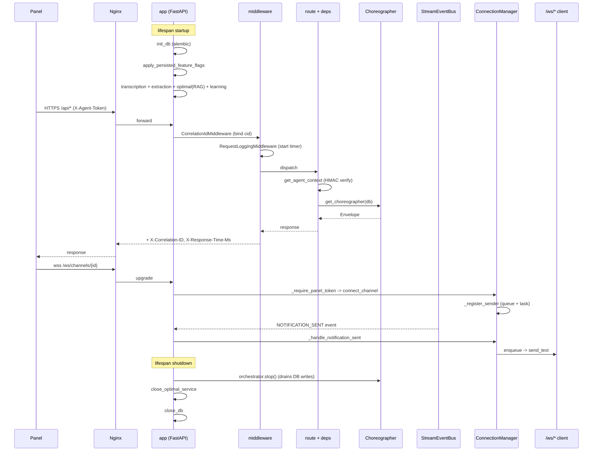

# RoboCo Slice Map — `api-core-websocket`

Slice key: `api-core-websocket` Repo root: `/Users/renzof/Documents/GitHub/ZZZ/roboco-master/roboco` Baseline commit: `fd10cc862c2020b3f639cdb686d427b0198a2441` Head: `15effce0` (2026-06-29, "Chore: 141 Gaps fill-in (#283)")

## Purpose

The FastAPI application shell, request pipeline, and real-time WebSocket fan-out layer for RoboCo. `app.py` builds the ASGI app, wires ~40 route routers, and runs the async lifespan (DB migrations, feature-flag overlay, transcription/extraction/RAG/learning service init, ordered shutdown). `middleware.py` adds correlation IDs, request logging, and a full exception-handler chain mapping domain/service/HTTP errors to structured JSON. `websocket.py` + `websocket_bridge.py` own the live panel streams (channels, agents, sessions, notifications, system) with per-connection bounded send queues and an event-bus bridge. `deps.py` is the dependency-injection spine: agent header auth, role-gate helpers, and Choreographer/ContentActions wiring. `utils/` provides route-layer error factories and get-or-404/ownership helpers. `middleware_docs.py` enforces the docs-path permission matrix. `roboco/security.py` (outside `api/` but wired here) supplies the optional fastapi-guard HTTP security layer: `apply_guard(app)` mounts `SecurityMiddleware` last — outermost — in `create_app`, and `guarded_lifespan(lifespan)` wraps the async lifespan, both gated by `ROBOCO_GUARD_ENABLED` (default off, byte-for-byte unchanged request path while off).

## Files

| Path | Role | approx LOC |
|------|------|-----------|
| `roboco/api/app.py` | FastAPI app factory + async lifespan (startup/shutdown ordering) | ~490 |
| `roboco/api/deps.py` | DI: agent header auth, role gates, Choreographer/ContentActions builders, pagination | ~611 |
| `roboco/api/middleware.py` | Correlation-id + request-logging middleware, exception handlers, 422 secret-scrub + UUID remediation | ~469 |
| `roboco/api/middleware_docs.py` | Docs-path access-control matrix (read/write per role/team/slug) | ~330 |
| `roboco/api/websocket.py` | WS routes + ConnectionManager with bounded per-connection send queues, panel-token gate, idle timeout | ~692 |
| `roboco/api/websocket_bridge.py` | Event-bus → WS forwarders (notifications, sessions, **messages**, agents, rate-limit, usage) | ~252 |
| `roboco/api/utils/__init__.py` | Re-export surface for error factories + resource helpers | ~43 |
| `roboco/api/utils/errors.py` | HTTPException factories + `handle_service_error` + `service_error_handler` decorator | ~214 |
| `roboco/api/utils/resources.py` | `get_or_404`, `get_by_field_or_404`, `require_ownership`/`require_recipient`/`require_membership` | ~180 |
| `roboco/api/__init__.py` | Deliberately does NOT re-export `app` (circular-import guard, documented) | ~14 |
| `roboco/security.py` | fastapi-guard 7.2.1 / guard-core 3.3.0 HTTP security layer: `SecurityMiddleware` + `guard_deco` (`SecurityDecorator`) singleton, gated by `ROBOCO_GUARD_ENABLED` (default off); wired into `create_app` via `apply_guard`/`guarded_lifespan` | ~407 |

## Key Symbols

| Name | Kind | File:Line | Responsibility |
|------|------|-----------|----------------|
| `lifespan` | async ctx mgr | app.py:82 | Startup: migrations, flag overlay, transcription/extraction/optimal/learning init; Shutdown: stop orchestrator BEFORE close_db, then close optimal, then DB |
| `create_app` | func | app.py:196 | Build FastAPI, add CORS + custom middleware, mount ~40 routers + ws_router at `/ws` |
| `app` | module attr | app.py:489 | The default ASGI instance (`roboco.api.app:app` entrypoint) |
| `_AppServices` | class | app.py:74 | Holder for transcription/extraction singletons set in lifespan |
| `DbSession` | type alias | deps.py:46 | `Annotated[AsyncSession, Depends(get_db)]` |
| `resolve_agent_id` | func | deps.py:49 | Resolve UUID-or-slug → UUID, 400 on miss |
| `_ServiceHolder` | class | deps.py:74 | Singleton store for PermissionService + orchestrator |
| `set_orchestrator`/`clear_orchestrator`/`get_orchestrator`/`get_orchestrator_or_none` | funcs | deps.py:91-119 | Global orchestrator accessors; `get_orchestrator` 503s when unset, `_or_none` used by shutdown |
| `get_current_agent_id`/`get_current_agent_slug`/`get_optional_agent_id` | funcs | deps.py:125-208 | Header-based agent identity (UUID or slug) |
| `_auth_required` | func | deps.py:211 | Reads `ROBOCO_AGENT_AUTH_REQUIRED` env |
| `_check_agent_auth_token` | func | deps.py:217 | HMAC token enforcement (required in prod, optional-but-verified in dev) |
| `require_panel_token` | func | deps.py:251 | CEO-HMAC gate for live-chat bridges (HTTP analog of WS gate) |
| `_resolve_agent_identity` | func | deps.py:277 | Returns `(agent_id, slug)`, special-casing `system` role |
| `_coerce_agent_role`/`_coerce_agent_team` | funcs | deps.py:298/324 | Parse role/team headers with DB fallback for role |
| `_header_trust_agent_context` | func | deps.py:340 | The original `get_agent_context` body verbatim (header-trust); the OFF-mode path, and also what a valid agent HMAC token delegates to when cloud auth is ON |
| `_slide_session_cookie` | func | deps.py:379 | Re-mints + re-sets the session cookie on every cookie-authenticated request — the sliding 30-day window (only inactivity past `cloud_auth_cookie_max_age` logs out) |
| `_cloud_auth_agent_context` | func | deps.py:390 | Dual-path enforcement when `cloud_auth_enabled`: a valid HMAC token (any role) delegates to `_header_trust_agent_context`; otherwise a non-CEO role claim is rejected outright, and the CEO must present a valid session cookie via `resolve_session_user` |
| `get_agent_context` | func | deps.py:452 | Builds `AgentContext` from X-Agent-* headers + token (+ the `roboco_session` cookie); byte-for-byte header-trust when `cloud_auth_enabled` is False, else delegates to `_cloud_auth_agent_context` |
| `require_pm_or_above`/`require_developer_or_above`/`require_cell_access` | funcs | deps.py:403/428/443 | Coarse role-gate guards (403) |
| `require_ceo_role` | func | deps.py:412 | Single CEO-check: raises 403 unless `role` is CEO; accepts `AgentRole`/`Role`/lowercase string; unifies orchestrator-router + release-handler CEO gates into one source of truth (`536bbb64`) |
| `require_channel_read`/`require_channel_write`/`require_notification_permission`/`require_task_action` | dep factories | deps.py:442/470/490/508 | PermissionService-backed dependency factories |
| `get_choreographer`/`get_content_actions` | funcs | deps.py:545/575 | Build Choreographer / ContentActions with all service deps + orchestrator/bus |
| `get_pagination` | func | deps.py:599 | Clamp limit 1-100, offset ≥0 |
| `CorrelationIdMiddleware` | class | middleware.py:54 | X-Correlation-ID in/out + structlog bind |
| `RequestLoggingMiddleware` | class | middleware.py:96 | Log request/response + `X-Response-Time-Ms` header |
| `get_status_code`/`roboco_exception_handler`/`service_exception_handler`/`rate_limit_exception_handler`/`generic_exception_handler`/`http_exception_handler`/`request_validation_handler` | funcs | middleware.py:143-441 | Exception → structured JSONResponse chain |
| `_SERVICE_ERROR_STATUS` | const | middleware.py:191 | Maps service exception types → HTTP status |
| `_uuid_field_remediation` | func | middleware.py:343 | Actionable hint when an agent sends an 8-char task prefix as UUID |
| `_SECRET_FIELD_NAMES`/`_scrub_secrets` | const/func | middleware.py:372/389 | Redact credential fields from 422 log bodies |
| `setup_middleware` | func | middleware.py:444 | Register exception handlers + middleware in order |
| `DOCS_PERMISSIONS` | const | middleware_docs.py:55 | Path-prefix → read/write role matrix |
| `check_docs_access`/`require_docs_access`/`get_allowed_docs_paths` | funcs | middleware_docs.py:222/265/303 | Docs path permission checks |
| `_fast_path_access_decision` | func | middleware_docs.py:203 | CEO/auditor/main_pm short-circuit |
| `ConnectionManager` | class | websocket.py:82 | Tracks all WS subscriptions + per-connection send queues |
| `_ClientConnection` | class | websocket.py:45 | Bounded outbound queue + sender task holder |
| `manager` | singleton | websocket.py:334 | Global ConnectionManager |
| `_require_panel_token` | func | websocket.py:61 | WS upgrade CEO-HMAC gate (returns False to close) |
| `validate_agent_exists` | func | websocket.py:337 | DB existence check for claimed agent_id |
| `_register_sender`/`_run_sender`/`_enqueue_or_send`/`_send_with_timeout` | methods | websocket.py:122/129/244/270 | Non-blocking fan-out plumbing |
| `connect_channel`/`connect_agent`/`connect_session`/`connect_notifications`/`connect_system` | methods | websocket.py:158-212 | Accept + register per stream type |
| `disconnect` | method | websocket.py:214 | Remove socket from all sets + cancel sender task |
| `broadcast_to_channel`/`broadcast_to_agent_watchers`/`broadcast_to_session`/`broadcast_system` | methods | websocket.py:283-322 | Fan-out enqueues |
| `channel_stream`/`agent_stream`/`session_stream`/`notification_stream`/`system_stream` | routes | websocket.py:360/428/493/556/608 | WS endpoints under `/ws` |
| `broadcast_agent_chunk`/`broadcast_notification` | funcs | websocket.py:650/665 | Helper broadcasters for external callers |
| `IDLE_TIMEOUT_SECONDS`/`MAX_SEND_QUEUE`/`SEND_TIMEOUT_SECONDS` | consts | websocket.py:35/41/42 | 90s / 256 / 10s tunables |
| `register_websocket_bridge_handlers`/`start_websocket_bridge` | funcs | websocket_bridge.py:169/203 | Subscribe bus handlers |
| `_handle_notification_sent`/`_handle_session_event`/`_handle_message_event`/`_handle_agent_event`/`_handle_rate_limit_event`/`_handle_usage_event` | funcs | websocket_bridge.py | Event-bus → WS forwarders (`_handle_message_event` fans `MESSAGE_SENT` to `/ws/sessions` + `/ws/channels` as a `message.new` frame) |
| `_RATE_LIMIT_WS_TYPES`/`_USAGE_WS_TYPES` | consts | websocket_bridge.py:18/23 | EventType → panel `type` string maps |
| `not_found`/`forbidden`/`unauthorized`/`validation_error`/`conflict`/`service_unavailable` | funcs | utils/errors.py:29-142 | HTTPException factories |
| `handle_service_error`/`service_error_handler` | func/deco | utils/errors.py:150/191 | ServiceError → HTTPException translation |
| `get_or_404`/`get_by_field_or_404` | funcs | utils/resources.py:17/59 | Generic get-or-404 helpers |
| `require_ownership`/`require_recipient`/`require_membership` | funcs | utils/resources.py:96/130/156 | Authorization checks |
| `apply_guard` | func | security.py:378 | Mounts `SecurityMiddleware` on `app` + sets `app.state.guard_decorator`; no-op unless `settings.guard_enabled` |
| `guarded_lifespan` | func | security.py:399 | Wraps `lifespan` with guard's `make_lifespan` (redis/geo/agent init) when armed; passthrough when off |
| `build_security_config` | func | security.py:329 | Assembles the global `SecurityConfig` from settings: passive_mode, fail_secure, enforce_https, WAF calibration fields |
| `security_config` / `guard_deco` | module singletons | security.py:374-375 | Built once at import (pure, no I/O); `guard_deco` is the `SecurityDecorator` route files decorate with `@guard_deco.<verb>` |
| `prompt_injection_validator`/`secret_exfil_validator`/`internal_ssrf_validator` | async funcs | security.py:116/128/139 | Custom `@guard_deco.custom_validation` content checks the signature WAF can't cover; each returns a generic 400 (no rule detail leaked) |
| `_WAF_FREETEXT_BODY_FIELDS` | const | security.py:211 | Top-level free-text body-field exclusion set (`excluded_detection_body_fields`) — the WAF calibration; includes free-form container fields (plan/risks/findings/section/payload/...) whose nested prose is stringified and scanned |

## Data Flow

**HTTP request**: nginx → ASGI `app` → `CorrelationIdMiddleware` (binds correlation_id + path/method to structlog) → `RequestLoggingMiddleware` (start timer) → route. Route resolves `CurrentAgentContext` via `get_agent_context` (headers + HMAC verify + identity/role/team resolution), plus service deps from `get_choreographer`/`get_content_actions`. When `ROBOCO_CLOUD_AUTH_ENABLED` is off (default) this is byte-for-byte the historical header-trust path (`_header_trust_agent_context`). When on, `_cloud_auth_agent_context` enforces a dual path: a request carrying a valid `X-Agent-Token` HMAC (any role — the agent fleet + the orchestrator's own `system` self-PATCH) is verified then delegated to the same header-trust resolution; a request with no valid token and a non-CEO role claim is rejected outright (closes the LAN header-spoof hole); the CEO alone may instead authenticate via the `roboco_session` cookie (`resolve_session_user`, `roboco.api.auth.session`), which is re-minted on every authenticated request (`_slide_session_cookie`) for a sliding 30-day window. On exception, the handler chain maps: `RequestValidationError` → 422 (scrubbed log + UUID remediation hint), `HTTPException` → standardized error code, `RobocoError` → domain status, `ServiceError` → parallel-hierarchy status, `RateLimitError` → 429 + `Retry-After`, `Exception` → 500. Response gains `X-Correlation-ID` + `X-Response-Time-Ms`. When `ROBOCO_GUARD_ENABLED` is on, `SecurityMiddleware` (mounted last in `create_app`, so outermost) runs before any of this: rate/size/WAF/custom-validator checks either block the request (enforce mode) or only log the detection (`guard_passive_mode`, the calibration posture) ahead of the correlation-id middleware; off by default, the whole path is unchanged.

**Lifespan startup**: `init_db` (alembic upgrade + create_all fallback) → `apply_persisted_feature_flags` (panel settings overlay, best-effort) → `TranscriptionService.start()` + `ExtractionPipeline` → `get_optimal_service()` (BLOCKS 30-90s for RAG) → `LearningPropagationService.initialize(optimal)`. `app.state.*` holds singletons. **Shutdown**: stop orchestrator (drains bg DB writes) → `close_optimal_service` → `close_db`. The orchestrator-stop-before-DB order is load-bearing.

**WebSocket**: panel → `wss://.../ws/{kind}/{id}` → `_require_panel_token` (CEO HMAC, except `/ws/system`) → query-param `agent_id`/`viewer_id` UUID parse (+ DB existence check for agent/session/notifications) → `manager.connect_*` accepts, registers in subscription set, spawns per-connection `_run_sender` task draining a bounded queue. Receive loop `await asyncio.wait_for(receive_text(), IDLE_TIMEOUT_SECONDS)`; "ping"→"pong"; timeout/disconnect → `finally disconnect`. **Broadcasts**: service code calls `manager.broadcast_to_*` → `_enqueue_or_send` per conn → either `conn.queue.put_nowait` (drop+warn on full) or legacy fire-and-forget `_send_with_timeout`. **Event-bus bridge**: `StreamEventBus` publishes `NOTIFICATION_SENT`/`SESSION_*`/`MESSAGE_SENT`/`AGENT_*`/`RATE_LIMIT_*`/`USAGE_SNAPSHOT` → `websocket_bridge` handlers → `manager.broadcast_*` → panel. `MESSAGE_SENT` (published best-effort by `send_message`) fans out to both `/ws/sessions/{id}` and `/ws/channels/{id}` as a `message.new` frame — the live transcript-update path.

## Mermaid



## Logical Tree

```
roboco/api/
├── __init__.py                  # no re-export of app (circular-import guard)
├── app.py
│   ├── _AppServices             # transcription/extraction holders
│   ├── lifespan()               # startup + shutdown ordering
│   └── create_app() -> app      # ~40 routers + ws_router at /ws
├── deps.py
│   ├── _ServiceHolder           # permission_service + orchestrator singletons
│   ├── agent identity (get_current_agent_id / slug / optional / context)
│   ├── _check_agent_auth_token / require_panel_token (HMAC)
│   ├── role gates (require_pm_or_above / developer_or_above / cell_access)
│   ├── permission dep factories (channel read/write, notification, task action)
│   ├── get_choreographer / get_content_actions
│   └── get_pagination
├── middleware.py
│   ├── CorrelationIdMiddleware
│   ├── RequestLoggingMiddleware
│   ├── exception handlers (RequestValidationError, HTTPException, RobocoError,
│   │                        ServiceError, RateLimitError, Exception)
│   ├── _scrub_secrets / _uuid_field_remediation
│   └── setup_middleware()
├── middleware_docs.py
│   ├── DOCS_PERMISSIONS matrix
│   ├── check_docs_access / require_docs_access
│   └── get_allowed_docs_paths
├── websocket.py
│   ├── _ClientConnection (queue + sender)
│   ├── _require_panel_token
│   ├── ConnectionManager (channel/agent/session/notification/system sets + senders)
│   ├── manager singleton
│   ├── validate_agent_exists
│   ├── routes: /channels/{id} /agents/{id} /sessions/{id}
│   │          /notifications/{id} /system
│   └── broadcast_agent_chunk / broadcast_notification helpers
├── websocket_bridge.py
│   ├── _handle_notification_sent / _handle_session_event / _handle_message_event / _handle_agent_event
│   ├── _handle_rate_limit_event / _handle_usage_event
│   └── register_websocket_bridge_handlers / start_websocket_bridge
└── utils/
    ├── __init__.py              # re-exports
    ├── errors.py                # HTTPException factories + service_error_handler
    └── resources.py             # get_or_404 + ownership/recipient/membership
```

## Dependencies

**Internal**: `roboco.config.settings`; `roboco.db.base` (init_db/close_db/get_db/get_session_factory); `roboco.db.tables.AgentTable`; `roboco.foundation.identity` (BOARD_ROLES/DEV_ROLES/PM_ROLES/Role); `roboco.models` (AgentRole/Team); `roboco.runtime.AgentOrchestrator`; `roboco.agents_config` (CEO_AGENT_ID, verify_agent_token, AGENT_ROLE_MAP/AGENT_TEAM_MAP, ALL_DOCS, _resolve_to_slug); `roboco.events` (Event/EventType/get_event_bus); `roboco.exceptions` (RobocoError tree); `roboco.services.base` (ServiceError tree); `roboco.services.exceptions.RateLimitError`; `roboco.services.{permissions,messaging,task,work_session,git,workspace,journal,a2a,product,notification,notification_delivery,audit,settings,extraction,learning,optimal,transcription}`; `roboco.services.gateway.{choreographer,content_actions,evidence_repo}`; `roboco.services.repositories` (resolve_agent_uuid/resolve_agent_identity); `roboco.api.schemas.{optimal.PaginationParams,common.ErrorCode}`; ~40 `roboco.api.routes.*` routers; `roboco.api.routes.v1.*` flow modules.

**External**: `fastapi` (FastAPI, APIRouter, WebSocket, HTTPException, Depends, Header, status), `starlette.middleware.base.BaseHTTPMiddleware`, `starlette` responses, `sqlalchemy` (select, async session), `structlog`, `pydantic` (via schemas), `asyncio`, `uuid`, `json`, `time`, `contextlib`. (`httpx` was REMOVED from websocket.py in the baseline→head diff — the self-call `validate_channel_access` is gone.)

## Entry Points

- `roboco.api.app:app` — the ASGI instance uvicorn/gunicorn serves; `create_app()` called at import.
- `lifespan` — FastAPI async context manager; runs on startup/shutdown.
- `setup_middleware(app)` — called from `create_app` after CORS.
- `register_websocket_bridge_handlers()` / `start_websocket_bridge()` — called by orchestrator/bootstrap after the event bus is up (NOT in `lifespan`; the lifespan does not register bridge handlers).
- WS routes — invoked by the panel via `wss://.../ws/{channels|agents|sessions|notifications|system}/...`, mounted at prefix `/ws` in `create_app`.
- `manager` singleton — imported directly by services and the bridge to broadcast.
- DI deps — resolved per-request by FastAPI (`get_agent_context`, `get_choreographer`, `get_content_actions`, `get_pagination`, `require_*` factories).
- `require_panel_token` — HTTP dep on the live intake/secretary chat bridges.

## Config Flags

- `ROBOCO_AGENT_AUTH_REQUIRED` — gates HMAC token enforcement (deps.py:211, websocket.py:71, middleware docstring app.py:94). Unset → header-trust/dev mode; set `true`/`1`/`yes` → strict.
- `ROBOCO_AGENT_AUTH_SECRET` — the HMAC secret consumed by `verify_agent_token` (read inside `roboco.agents_config`).
- `ROBOCO_CLOUD_AUTH_ENABLED` (+ `_EMAIL`/`_PASSWORD`/`_SECRET`/`_COOKIE_MAX_AGE`, default off) — `deps.get_agent_context`'s dual-path switch (`_cloud_auth_agent_context` vs byte-for-byte `_header_trust_agent_context`); the login/logout FastAPI Users router is mounted by `roboco.api.auth.routes.mount_cloud_auth` only when true, but `/api/auth/status` is always mounted (public probe for the panel's `proxy.ts`).
- `ROBOCO_DATABASE_*`, `ROBOCO_REDIS_*` — read transitively via `settings` / `init_db`.
- `settings.cors_origins` / `settings.cors_allow_credentials` — CORS middleware config (app.py:218).
- `settings.app_version` / `settings.environment` / `settings.debug` — logged at startup; docs/redoc URLs are unconditional (the `if settings.debug` is commented out, app.py:207-208).
- `settings.host` / `settings.port` — no longer used in websocket.py (the httpx self-call was removed); still referenced elsewhere.
- `ROBOCO_GUARD_ENABLED` / `_PASSIVE_MODE` / `_FAIL_SECURE` / `_TELEMETRY_ENABLED` / `_AGENT_API_KEY` / `_PROJECT_ID` / `_EMERGENCY` / `_EMERGENCY_WHITELIST` — read by `roboco/security.py`, wired into `create_app` via `apply_guard(app)` (app.py:234) + `guarded_lifespan(lifespan)` (app.py:212); `ROBOCO_ENVIRONMENT` additionally drives `enforce_https` (production only).
- Otherwise no direct ROBOCO_* feature flags live in this slice; the lifespan applies persisted flag overlays via `apply_persisted_feature_flags` but does not itself read individual subsystem flags.

## Gotchas

- **~~`/ws/system` was the only WS endpoint WITHOUT `_require_panel_token`~~ — RESOLVED (`536bbb64`)**: `/ws/system` now calls `_require_panel_token` before subscribing (websocket.py:621); all five `/ws/*` endpoints are consistently gated. In strict mode a missing token closes with `WS_1008_POLICY_VIOLATION`; a forged token is rejected even in dev mode.
- **`websocket.py` module docstring (lines 8-13) is STALE** — it claims WS "validates agent_id via query params and verify the agent exists in the database. In production, this should be enhanced with proper token-based authentication." Actual security is now the CEO HMAC panel token via `_require_panel_token`, and `validate_agent_exists` is only called on `/agents`, `/sessions`, `/notifications` (NOT `/channels`). The docstring misleads.
- **`get_choreographer` passes `stream_bus=None` when no orchestrator is set** (deps.py:557) — fine, but means the rate-limit park path is inert during the startup window before bootstrap sets the orchestrator.
- **`_check_agent_auth_token` dev mode**: a missing token is allowed; a presented-but-invalid token is rejected. The header-trust warning at app.py:94-102 is the only signal. In dev, any reachable client can act as any role (including `ceo`) by setting headers.
- **`_resolve_agent_identity` `system` role special-case** (deps.py:281) returns `UUID(x_agent_id)` with NO DB lookup. Combined with dev-mode no-auth, a caller can claim `role=system` with an arbitrary UUID and bypass agent resolution entirely. `ROBOCO_CLOUD_AUTH_ENABLED` does not add a DB lookup here either — it only requires that a `system`/any-role claim carry a *verified* HMAC token first (`_cloud_auth_agent_context` rejects any non-CEO role claim without one), so the identity-bypass itself is unchanged, just gated behind a valid signature.
- **`_coerce_agent_role` falls back to the DB role when the header isn't a valid enum** (deps.py:298). The X-Agent-Role header is therefore advisory when malformed — the authoritative role is the agent row's. Good for safety, but means a caller cannot escalate by header alone (the DB role wins).
- **`request_validation_handler` returns the UNSCRUBBED body to the client** (middleware.py:434). Only the server log is scrubbed (`_scrub_secrets`); the 422 response echoes whatever the client sent, including any secret fields. By design (the client sent them), but worth knowing.
- **`_run_sender` self-cancels on send error**: on a hard send error it calls `self.disconnect(ws)` which cancels `conn.sender` — the very task currently running (websocket.py:155). It returns immediately after, so the cancellation lands on an already-returning task; harmless in practice but a subtle self-cancel.
- **Lifespan shutdown order is load-bearing**: orchestrator.stop() MUST run before close_db (app.py:170-186). Reverting this order silently drops final audit-log rows + respawn_tracker upserts + agent-state finalizes. `stop()` is idempotent (bootstrap's finally re-calls it).
- **`ConnectionManager` sets are NOT mutated under a lock** — relies on asyncio single-threadedness. A broadcast iterating a set while `disconnect` mutates it is safe within one event loop, but `_run_sender`'s `disconnect(ws)` is called from a different task than the receive loop's `finally disconnect`, so two tasks can concurrently mutate the same set. `set.discard` is safe but iteration-during-mutation could raise `RuntimeError: Set changed size during iteration` in pathological cases.
- **`broadcast_notification` (websocket.py:665) bypasses the `broadcast_to_*` pattern** and reaches into `manager._enqueue_or_send` directly with a pre-serialized `data` string, while `broadcast_to_*` serialize inside. Inconsistent but works.
- **`roboco/api/__init__.py` deliberately does NOT re-export `app`** — importing `roboco.api.schemas.X` must not transitively load the FastAPI app + routes (circular-import cycle). The entrypoint imports `roboco.api.app:app` directly. Do not "helpfully" re-export here.
- **`docs_url`/`redoc_url` are unconditional** (app.py:207-208) — the `if settings.debug` gating is commented out, so `/docs` and `/redoc` are always served.
- **`apply_persisted_feature_flags` is best-effort** (app.py:115-121) — a DB failure logs a warning and continues with env defaults; startup is never blocked.
- **fastapi-guard is a genuine no-op when off** (`ROBOCO_GUARD_ENABLED` default `false`) — `apply_guard` returns before `add_middleware`, so `create_app`'s request path is byte-for-byte unchanged; the per-route `@guard_deco.*` decorators across ~21 route files are harmless because the decorator only takes effect once `app.state.guard_decorator` is set by `apply_guard` (security.py:388).
- **`excluded_detection_body_fields` is the only reliable WAF-calibration knob on guard 7.2.1** — the per-route `categories`/`enabled_detection_categories` config is bypassed for JSON bodies, and the body scanner excludes TOP-LEVEL keys only, scanning `str(value)` of every non-excluded field (the whole stringified subtree). A free-form container field (e.g. `plan`, `findings`) must therefore be excluded wholesale or its nested prose still trips the WAF.

## Drift from CLAUDE.md

- `CLAUDE.md` "WebSocket streams" section lists `/ws/channels/{id}`, `/ws/agents/{id}`, `/ws/sessions/{id}`, `/ws/notifications/{id}`, `/ws/system` — **matches** `websocket.py` routes. No drift.
- `CLAUDE.md` says `/ws/system` carries "the rate-limit lifecycle (`RATE_LIMIT_HIT` / `RATE_LIMIT_LIFTED`) and live usage (`USAGE_SNAPSHOT`)" — **matches** `websocket_bridge.py:138-166` (`_handle_rate_limit_event` + `_handle_usage_event`). No drift.
- `CLAUDE.md` says "To add a new live event: define an `EventType`, publish it to the bus, add a `_handle_*` forwarder in `websocket_bridge`, and consume it on the panel via the `useWebSocket(...)` hook" — **matches** the `_handle_*` pattern. No drift.
- `CLAUDE.md` "Startup Sequence" says "FastAPI lifespan indexes documents using Ollama (~30-60s)" — `app.py:137-147` initializes `OptimalService` (RAG) with a 30-90s blocking init and logs "OptimalService (RAG) initialized successfully"; the "indexes documents" framing is approximate but consistent. No material drift.
- `CLAUDE.md` does NOT document the `_require_panel_token` CEO-HMAC WS gate or the HTTP `require_panel_token` dep. The `websocket.py` module docstring (lines 8-13) describes the OLD query-param model, contradicting the actual HMAC-token implementation. The CLAUDE.md "Agent Gateway" section's "Agents do not call the API or per-domain MCP tools directly" is consistent with `/ws/*` being operator-only. **Drift: in-file docstring vs actual code (websocket.py:8-13); CLAUDE.md itself is silent on WS auth, so no CLAUDE.md contradiction.**
- `CLAUDE.md` "Orchestrator runtime-state durability" notes the respawn_tracker DB-durable writes are drained on `stop()` — `app.py:170-186` implements the required ordering (stop before close_db). Consistent.
- `CLAUDE.md` "Feature flags / company-in-a-box" says flags "toggle from the panel's Settings → Feature Flags card ... A toggle persists in the settings store and takes effect on the next backend restart" — `app.py:115-121` applies them in lifespan. Consistent.
- `CLAUDE.md` does not mention the `CorrelationIdMiddleware` / `RequestLoggingMiddleware` / exception-handler chain by name; `middleware.py` is the implementation of the implied "structured error" contract. No contradiction.
- `CLAUDE.md`'s "Feature flags / company-in-a-box" list of env-gated default-off subsystems does not mention `ROBOCO_GUARD_ENABLED` / the fastapi-guard HTTP security layer (`roboco/security.py`, wired here via `apply_guard`/`guarded_lifespan`); the doc is silent rather than contradictory.

Net: **no direct contradictions with CLAUDE.md**; the one stale security docstring lives in `websocket.py` itself.

## Changes Since Baseline

Only ONE commit in `fd10cc86..HEAD` touched this slice: `15effce0` "Chore: 141 Gaps fill-in (#283)" (2026-06-29).

Diff stat: `app.py +20`, `deps.py +44`, `middleware.py +49`, `websocket.py +309/-66` (net), `middleware_docs.py` / `websocket_bridge.py` / `utils/*` UNCHANGED.

> **Post-snapshot update (2026-07-01, chat-subsystem live-delivery work `76ce53e3`):** `websocket_bridge.py` is no longer unchanged — it gained `_handle_message_event` (forwards `EventType.MESSAGE_SENT` to `/ws/sessions/{id}` + `/ws/channels/{id}` as a `message.new` frame) and a `MESSAGE_SENT` subscription in `register_websocket_bridge_handlers`. This is the live transcript-update path that was previously dead (`send_message` never broadcast).

> **Post-snapshot update (2026-07-01, logical-gap sweep `536bbb64`):** `deps.py` gained `require_ceo_role` (deps.py:412) — single source-of-truth CEO-role check shared by the orchestrator router gate and the release handler, replacing two diverged inline comparisons. `websocket.py` gated `/ws/system` with `_require_panel_token` (websocket.py:621), closing the medium regression risk; all five `/ws/*` endpoints are now consistently gated.

> **Local branch (not on master, NOT deployed):** `feature/fastapi-guard-hardening` (6 fastapi-guard commits `896532a3`..`99ee666e`, branched off `ab69851d`, plus 2 unrelated bundled commits) adds `roboco/security.py` and wires it into this slice — `apply_guard(app)` mounts `SecurityMiddleware` last in `create_app` (app.py:234) and `guarded_lifespan(lifespan)` wraps the async lifespan (app.py:212), both gated by `ROBOCO_GUARD_ENABLED` (default off, byte-for-byte unchanged request path when off). Per-route `@guard_deco.*` decorators (rate_limit/max_request_size/content_type_filter/behavior_analysis/block_clouds/honeypot_detection/usage_monitor/suspicious_detection/custom_validation — 9 kinds) are applied across 21 route files outside this slice (api-routes-schemas + v1 flow/do). `build_security_config` also carries a WAF false-positive calibration: `excluded_detection_body_fields` (75 free-text top-level body fields, including container fields like plan/risks/findings/section/payload) plus `enable_penetration_detection=True`, dropping active-mode false positives on RoboCo's own code/SQL/diff/URL-bearing traffic to zero while leaving the three custom validators and the WAF on non-excluded (id/enum/slug/branch) fields fully in force. New tests: `tests/unit/test_security.py` (unit) + `tests/unit/test_security_middleware.py` (integration — mounts the real middleware end-to-end). Both NAS composes (`docker-compose.yml`/`.yaml`) arm the layer passive/log-only (`c496b677`, Phase 5) — see deployment-tooling.

Logic-touching changes in that commit, scoped to this slice:

| Change | File:Line | IMPACT |
|--------|-----------|--------|
| Lifespan shutdown now stops orchestrator BEFORE close_db (was: DB closed first, only bootstrap's finally stopped orchestrator) | app.py:170-186 | Final audit-log rows / respawn_tracker upserts / agent-state finalizes no longer silently dropped on shutdown. `get_orchestrator_or_none()` added so lifespan doesn't 503 when no orchestrator is wired (tests/skip_orchestrator). |
| `get_orchestrator_or_none` + `clear_orchestrator` added | deps.py:96-119 | New accessor for shutdown + test teardown; `get_orchestrator` still 503s. |
| `require_panel_token` HTTP dep added (CEO HMAC for live-chat bridges) | deps.py:251-274 | New gate; mirrors WS `_require_panel_token`. Browser EventSource can't set headers, so token-only. |
| `CEO_AGENT_ID` import added to deps.py | deps.py:18 | Required by `require_panel_token` + reused by WS gate. |
| `_SECRET_FIELD_NAMES` + `_scrub_secrets` added; 422 log scrubs credential fields | middleware.py:372-404, 426 | Plaintext GitHub PAT / provider API key / bearer tokens no longer dumped to structlog on a 422. Response body unchanged. |
| WS panel-token gate (`_require_panel_token`) added to channel/agent/session/notifications streams | websocket.py:61, 371/439/503/567 | `/ws/*` now CEO-HMAC-gated in prod; dev allows missing token but rejects forged. **`/ws/system` was NOT gated** (inconsistency). |
| Per-connection bounded send queue + sender task (`_ClientConnection`, `_register_sender`, `_run_sender`, `_enqueue_or_send`, `_send_with_timeout`) | websocket.py:45-156, 244-281 | Replaced `asyncio.gather(*[conn.send_text(data)])` with non-blocking enqueue. One slow client can no longer back-pressure the fan-out; full queue drops+warns. `_run_sender` reaps dead sockets on hard send error. |
| `IDLE_TIMEOUT_SECONDS` (90s) `asyncio.wait_for` on `receive_text` | websocket.py:35, 400/471/534/586/623 | Half-open sockets from dead containers no longer block the receive loop forever; `TimeoutError` → `finally disconnect`. |
| `httpx` self-call `validate_channel_access` REMOVED; `settings` import dropped from websocket.py | websocket.py (was) | The channel WS no longer makes an HTTP round-trip to `/api/permissions/check` on the local server (deadlocks/latency risk gone). Channel access now gated only by panel token. |
| `structlog` logger (`log`) replaced the old logger; `validate_agent_exists` kept for agent/session/notifications | websocket.py:30, 337 | Logging consistent with rest of API. |
| `system_stream` endpoint + `broadcast_system` + `connect_system` (already present pre-baseline) — the commit RETAINED the no-token path for `/ws/system` | websocket.py:208-212, 316-322, 608 | Operator stream stays ungated; rate-limit/usage telemetry reachable without panel token. |

`middleware_docs.py` and `utils/*` are byte-for-byte unchanged since baseline. `websocket_bridge.py` was unchanged at the snapshot but has since been edited by the chat-subsystem live-delivery work (the `_handle_message_event` forwarder + `MESSAGE_SENT` subscription — see the post-snapshot note above).

## Regression Risks

| Title | File:Line | Claim | Severity |
|-------|-----------|-------|----------|
| `/ws/system` ungated while siblings require panel token | websocket.py:608 | ~~The rate-limit/usage operator stream has no `_require_panel_token` call; if nginx does not edge-gate `/ws/system`, any reachable client gets RATE_LIMIT_HIT/LIFTED + USAGE_SNAPSHOT telemetry. The other four streams gate.~~ **RESOLVED (`536bbb64`)**: `/ws/system` now calls `_require_panel_token` (websocket.py:621); all five `/ws/*` endpoints are consistently gated. | ~~medium~~ resolved |
| `_run_sender` self-cancels its own task on send error | websocket.py:155 | `self.disconnect(ws)` pops `conn.sender` and calls `.cancel()` on the task currently running `_run_sender`. The immediate `return` mitigates, but a cancellation landing on a returning task is a subtle race; under heavy churn could mask a later send or trip a CancelledError in an `except Exception` handler. | low |
| Concurrent set mutation between sender-task `disconnect` and receive-loop `finally disconnect` | websocket.py:155 / 425 | Two tasks (sender + receive loop) can call `disconnect(ws)` on the same socket concurrently. `set.discard` is idempotent, but a `broadcast_to_*` iterating the same set on the loop thread during the sender-task's `disconnect` could raise `Set changed size during iteration`. Single-loop asyncio makes this rare but not impossible. | low |
| `validate_agent_exists` opens its own DB session via `async for db in get_db()` per WS upgrade | websocket.py:347 | Each `/agents`, `/sessions`, `/notifications` upgrade grabs a session just to confirm the viewer exists — extra session pressure under many concurrent panel connections; the check is also bypassable in dev (no token). | low |
| Lifespan shutdown hangs if `orchestrator.stop()` blocks | app.py:184 | The new stop-before-close-db order is correct, but a hung `stop()` now blocks `close_optimal_service` + `close_db` (wrapped in try/except, so a hang — not an exception — is the failure mode). Pre-baseline, a hung stop only affected bootstrap's finally. | low |
| 422 response body still echoes unscrubbed secrets | middleware.py:434 | `_scrub_secrets` only scrubs the LOG, not the response. A client sending a `git_token` that fails validation gets it back in the 422 `body` field. By design but a leak surface if logs/responses are captured. | low |
| `_resolve_agent_identity` `system` role bypasses DB lookup | deps.py:281 | `role=system` returns `UUID(x_agent_id)` with no DB check. In dev (no auth) a caller can claim `system` with any UUID and get an `AgentContext` for a non-existent agent. Auth-required mode still needs a valid HMAC, mitigating prod. | low |
| `_enqueue_or_send` legacy fallback creates unbounded fire-and-forget tasks | websocket.py:266 | For an unregistered socket (shouldn't happen since every `connect_*` registers), a `_send_with_timeout` task is spawned per message with no queue cap. Only the legacy path; held in `_pending_sends` for GC safety. | low |
| `broadcast_notification` double-iterates notification connections | websocket.py:665-691 | It reads `manager.notification_connections.get(agent_id)` then calls `manager._enqueue_or_send` per conn, bypassing the `broadcast_to_*` serializer. If a disconnect happens between the snapshot and the enqueue, the enqueue targets a dead socket whose sender was cancelled — `_enqueue_or_send` falls to the legacy fire-and-forget path. Low. | low |
| Channel WS no longer checks channel read permission | websocket.py:360-425 | The `validate_channel_access` httpx self-call was removed; channel access is now ONLY the panel token. A panel client can subscribe to ANY channel regardless of role. Acceptable (panel is operator), but a behavior change vs pre-baseline. | low |
| Stale module docstring misleads future edits | websocket.py:8-13 | Describes query-param agent validation as the security model; actual model is CEO HMAC. A future edit trusting the docstring could weaken the gate. | low |

## Health

This slice is the API spine and is in **good structural shape**. The baseline→head refactor (`15effce0`) materially hardened it: the WebSocket fan-out no longer back-pressures on a slow client (bounded per-connection queues + sender tasks), half-open sockets are reaped by an idle timeout, the lifespan shutdown ordering fix stops silent final-write drops, 422 logs no longer leak credentials, and the WS + HTTP panel-token gates close the operator-only invariant. Post-snapshot, `536bbb64` closed the remaining medium risk by gating `/ws/system` (all five `/ws/*` endpoints are now consistently gated) and added `require_ceo_role` as a single-source CEO check; `76ce53e3` wired the live message-delivery path (`_handle_message_event`). The event-bus bridge is clean and follows the documented `_handle_*` extension pattern. The main remaining integrity concerns are minor: the `websocket.py` module docstring is stale vs the HMAC implementation, and the concurrent-set-mutation window between the sender task's error-path `disconnect` and the receive loop's `finally disconnect` is theoretically present under asyncio single-threadedness. No logic-touching change since baseline looks broken; the regression risks above are edge-case and mostly low severity. The unchanged files (`middleware_docs.py`, `utils/*`) are stable; `websocket_bridge.py` gained `_handle_message_event` (`76ce53e3`). Recommended follow-ups: refresh the `websocket.py` docstring, and consider a lock or snapshot-iteration in `ConnectionManager` broadcast paths.