# Slice: api-routes-schemas

## Purpose
The FastAPI surface of RoboCo: every HTTP route under `roboco/api/routes/` (the operator/panel `api/*` CRUD + dashboard/orchestrator/a2a/live bridges) and the agent-gateway `api/v1/flow/*` (intent verbs) + `api/v1/do/*` (content tools), with Pydantic request/response schemas under `roboco/api/schemas/`. Routes are thin handlers that resolve services via `Depends` and return typed responses; all agent-gateway verbs funnel through the Choreographer.

## Files

| Path | Role |
|------|------|
| roboco/api/routes/health.py | Liveness/readiness (DB + Redis probes). |
| roboco/api/routes/agents.py | List/get agents. |
| roboco/api/routes/notifications.py | Notification list/ack/send. |
| roboco/api/routes/stream.py | Agent stream chunk/complete/extract + permissions. |
| roboco/api/routes/journals.py | Journal entries, search, growth stats. |
| roboco/api/routes/kanban.py | Per-team kanban boards + main-pm/board/stats. |
| roboco/api/routes/cockpit.py | Cockpit summary/signals. |
| roboco/api/routes/company_goals.py | Company goals get/put. |
| roboco/api/routes/settings.py | Settings + feature-flags get/set. |
| roboco/api/routes/dashboard.py | CEO/auditor/kanban/metrics/agents/activity dashboards. |
| roboco/api/routes/tasks.py | Task CRUD + lifecycle transitions (claim/start/verify/qa/complete...). |
| roboco/api/routes/work_session.py | Work-session list/commit/files/PR/merge/complete/abandon. |
| roboco/api/routes/git.py | Per-project git status/log/diff/commit/push/PR/rebase/branch-cleanup sweep. |
| roboco/api/routes/project.py | Project CRUD + workspace/sync/access + conventions. |
| roboco/api/routes/product.py | Product CRUD. |
| roboco/api/routes/optimal.py | RAG: kb/search, rag/query, mentor/ask, learnings, decisions, review. |
| roboco/api/routes/research.py | Web search/fetch. |
| roboco/api/routes/orchestrator.py | CEO-gated spawn/stop/resolve-wait/mark-waiting + status. |
| roboco/api/routes/a2a.py | Agent-to-agent inbox/conversations/tasks + SSE streams. |
| roboco/api/routes/prompter_live.py | Live Intake chat (start/stream/messages/confirm/confirm-batch). |
| roboco/api/routes/secretary.py | Company state + CEO directives confirm/reject. |
| roboco/api/routes/secretary_live.py | Live Secretary chat (start/stream/messages/stop/events). |
| roboco/api/routes/release.py | CEO-only release proposal approve/reject. |
| roboco/api/routes/playbooks.py | Playbook approve/reject/archive (Auditor/CEO). |
| roboco/api/routes/pitch.py | Pitch create/list/approve/reject. |
| roboco/api/routes/provider.py | Provider catalog + ollama/grok/self-hosted key + mode. |
| roboco/api/routes/usage.py | Token usage summary/time-series/by-agent/team/model/role/sessions, cache-efficiency, spawn-waste (per-role unproductive-spawn rate + respawn strikes). |
| roboco/api/routes/system.py | System-wide info. |
| roboco/api/routes/docs.py | Project docs write/read/list/delete. |
| roboco/api/routes/x.py | X (Twitter) engine — CEO-only: list/approve/reject held draft posts + set/status OAuth 1.0a credentials. |
| roboco/api/routes/roadmap.py | Board roadmap engine — CEO-only: list open cycles + per-item approve/reject. |
| roboco/api/routes/telegram.py | Telegram credentials CRUD (CEO-only, write-only) + `webapp_auth_router` — a separate public, pre-auth `POST /webapp-auth` mounted only when `telegram_miniapp_enabled` AND `cloud_auth_enabled` are both armed (`mount_telegram_miniapp_auth`); validates a Mini App's `initData` and mints the cloud-auth session cookie; adds its own unconditional `LoginRateLimiter`. |
| roboco/api/auth/ | Cloud auth (FastAPI Users, default off): `backend.py` (cookie transport + password-fingerprint-bound JWT strategy), `manager.py` (`UserManager` + DI chain), `session.py` (`resolve_session_user`, shared by the HTTP dual-path and the WS panel-token gate), `seed.py` (idempotent single seeded CEO login upsert), `routes.py` (always-public `/auth/status` + conditional login/logout mount), `login_limit.py` (`LoginRateLimiter` — per-IP POST rate limit, path-keyed via a `paths: tuple[str, ...]` set so `/login` and `telegram.py`'s `/webapp-auth` get independent buckets). |
| roboco/api/routes/v1/_role_dep.py | Per-role HMAC guards + `envelope_to_response` helper. |
| roboco/api/routes/v1/do.py | Content verbs `/api/v1/do/*` (commit/note/say/dm/evidence/playbook...). |
| roboco/api/routes/v1/flow_dev.py | Developer flow verbs. |
| roboco/api/routes/v1/flow_qa.py | QA flow verbs (claim/pass/fail_review). |
| roboco/api/routes/v1/flow_doc.py | Documenter flow verbs. |
| roboco/api/routes/v1/flow_cell_pm.py | Cell-PM flow verbs (delegate/submit_up/triage/complete...). |
| roboco/api/routes/v1/flow_main_pm.py | Main-PM flow verbs (submit_root/triage_all/escalate_to_ceo...). |
| roboco/api/routes/v1/flow_board.py | Board (product_owner/head_marketing) triage/escalate_to_ceo. |
| roboco/api/routes/v1/flow_auditor.py | Auditor triage/i_am_idle. |
| roboco/api/routes/v1/flow_pr_reviewer.py | PR-reviewer verbs incl. gate pr_pass/pr_fail. |
| roboco/api/schemas/*.py | Per-domain Pydantic request/response models (one per route file). |
| roboco/api/schemas/v1/flow.py | All flow-verb request bodies + `StrList` coercion validator. |
| roboco/api/schemas/v1/do.py | All do-verb request bodies. |

## Key Endpoints

| Method | Path | Handler (file) | Auth/Role |
|--------|------|----------------|-----------|
| GET | /api/health, /api/ready | health.py | none |
| GET | /api/dashboard/ceo | dashboard.py | agent context |
| GET | /api/dashboard/metrics/{cycle-time,bottlenecks,rework,scorecard/*,member/{id},member/ceo,members} | dashboard.py | agent context — `members` (no `{id}`) is the batch scorecard fetch replacing N per-agent calls |
| GET/POST/PATCH/DELETE | /api/tasks, /api/tasks/{id}/{claim,start,verify,submit-qa,pass-qa,fail-qa,complete,cancel,escalate-to-ceo} | tasks.py | agent context + `require_task_action` |
| GET | /api/tasks/summary?q= (list_tasks_summary) | tasks.py | agent context — trimmed list-view rows; server-side title/description/id-prefix search via `TaskService.search_tasks` when `q` is set (wave 1, `d1cf6ecb`) |
| GET/POST | /api/orchestrator/{status,agents/{id},waiting} ; /spawn,/stop,/resolve-wait,/mark-waiting | orchestrator.py | `_require_ceo` (HMAC) |
| POST | /api/a2a/{send,send-stream} ; /chat/conversations ; /tasks/{id}/cancel | a2a.py | `require_any_authenticated_agent` |
| GET/POST | /api/a2a/chat/admin/{conversations,pairs,conversations/{id}/messages,conversations/{id}/reply} | a2a.py | `_require_ceo` (org-wide live view + reply-as-CEO; wave 2 `da563487` / wave 2c `876e19b3`) |
| POST | /api/prompter/live, /live/{id}/{stream,status,messages,stop,confirm,confirm-batch} | prompter_live.py | `require_panel_token` (CEO HMAC) |
| GET | /api/prompter/live/{id}/search-tasks | prompter_live.py | session-aliveness check (no agent identity) — intake's `search_past_tasks` tool (wave 1, `d1cf6ecb`) |
| POST | /api/secretary/live, /live/{id}/{stream,messages,stop,events} ; /api/secretary/{state,directives} | secretary*.py | panel token / agent ctx |
| GET | /api/secretary/tasks?q= (search_tasks) | secretary.py | agent ctx, Secretary or CEO role — resolve a task NAME to id(s) for a directive (wave 1, `d1cf6ecb`) |
| GET/POST | /api/release/proposal, /proposal/approve, /proposal/reject | release.py | `_require_ceo` (agent.role==CEO) |
| GET/POST | /api/playbooks, /{id}/{approve,reject,archive} | playbooks.py | agent context (Auditor/CEO) |
| GET/POST | /api/x/posts, /posts/{id}/{approve,reject}, /credentials | x.py | `require_ceo_role` (agent context) |
| GET/POST | /api/roadmap/cycles, /cycles/{id}/items/{id}/{approve,reject} | roadmap.py | `require_ceo_role` (agent context) |
| GET/POST | /api/telegram/credentials | telegram.py | `require_ceo_role` (agent context) |
| POST | /api/telegram/webapp-auth | telegram.py | public, pre-auth — Telegram `initData` HMAC validation; mounted only when `telegram_miniapp_enabled` AND `cloud_auth_enabled` |
| GET | /api/telegram/today | telegram.py | `require_ceo_role` (agent context) + 30/60s rate limit — Mini App V4's "Today" brief, backed by `TgCockpitService.today()` (one DB round trip, see `docs/map/notification.md`) |
| GET/POST | /api/auth/status (always), /auth/login, /auth/logout (mounted only when `cloud_auth_enabled`) | auth/routes.py | none (status) / FastAPI Users cookie login |
| GET/POST/PUT/DELETE | /api/projects, /{id}/conventions, /workspace, /sync | project.py | agent context |
| POST | /api/git/branches/cleanup | git.py | agent context, PM/CEO role-gated like `/rebase`; rate-limit 5/60 — cursor-resumable stale-branch sweep, `GitBranchCleanupRequest`/`Response` (wave 2, open PR #548) |
| POST | /api/v1/flow/developer/{give_me_work,i_will_work_on,open_pr,i_am_done,unclaim,resume,sync_branch} | flow_dev.py | `require_dev` (role + HMAC) |
| POST | /api/v1/flow/qa/{claim_review,pass_review,fail_review} | flow_qa.py | `require_qa` |
| POST | /api/v1/flow/cell_pm/{delegate,submit_up,complete,triage,unblock,reassign} | flow_cell_pm.py | `require_cell_pm` |
| POST | /api/v1/flow/main_pm/{submit_root,triage_all,escalate_to_ceo,complete} | flow_main_pm.py | `require_main_pm` |
| POST | /api/v1/flow/pr_reviewer/{claim_pr_review,claim_gate_review,pr_pass,pr_fail,post_pr_review} | flow_pr_reviewer.py | `require_pr_reviewer` |
| POST | /api/v1/do/{commit,note,say,dm,notify,evidence,draft_playbook,approve_playbook,...} | do.py | `require_any_authenticated_agent` (HMAC, any role) |
| GET | /ws/{agents,notifications,system}/{id} | websocket.py | WS panel/HMAC token |

## Key Symbols

| Name | Kind | File:Line | Responsibility |
|------|------|-----------|----------------|
| `require_any_authenticated_agent` | dep | v1/_role_dep.py | HMAC-verify X-Agent-ID/role/team token; router-level guard on do + a2a. |
| `require_<role>` (require_dev/qa/...) | dep | v1/_role_dep.py | Per-role guard: HMAC + role assertion, applied as router dependency. |
| `envelope_to_response` | fn | v1/_role_dep.py | Convert Choreographer `Envelope` to JSON, set status from `envelope.status`. |
| `_check_agent_auth_token` | fn | api/deps.py:217 | Core HMAC verify; rejects invalid tokens even in dev; required-only in prod. |
| `require_panel_token` | dep | api/deps.py:251 | CEO-signed HMAC gate for live-chat bridges (HTTP analog of WS gate). |
| `CurrentAgentContext` | dep | api/deps.py:376 | Resolves agent from headers + HMAC, injects `AgentContext`. |
| `_require_ceo` | dep | routes/orchestrator.py:37 | Router-level CEO-HMAC guard on orchestrator control routes. |
| `_validated_agent_id` | fn | routes/orchestrator.py:99 | Path-injection guard (rejects empty/`.`/`..`/`/`/`\`/NUL) then normalizes via `_resolve_to_slug` — spawn/stop/status/resolve-wait/mark-waiting accept either a DB UUID or a slug and address the runtime container by the resolved slug; an unknown UUID passes through unchanged. |
| `setup_middleware` | fn | api/middleware.py | Register exception handlers (422 scrub, HTTP, RobocoError, generic). |
| `request_validation_handler` | fn | api/middleware.py:407 | Log 422 body (secrets scrubbed) + uuid remediate hint. |
| `_scrub_secrets` | fn | api/middleware.py:389 | Deep-redact known secret fields from logged 422 bodies. |
| `StrList` | type | schemas/v1/flow.py:20 | `list[str]` with `coerce_str_list` BeforeValidator (XML-nested LLM lists). |
| `Choreographer` | svc | services/gateway/choreographer.py | Composes service intents behind every flow verb. |
| `ContentActions` | svc | services/gateway/ | Composes do-verb content actions (commit/note/say/...). |
| `router` (do) | router | v1/do.py:38 | `/api/v1/do` router, `require_any_authenticated_agent` dep. |
| `router` (flow_dev) | router | v1/flow_dev.py:24 | `/api/v1/flow/developer` router, `require_dev` dep. |

## Data Flow
Request hits nginx (port 3000) -> FastAPI app (`api/app.py`) registers routers under `/api/*` plus `/api/v1/flow/*` and `/api/v1/do/*`. Middleware chain (CorrelationId -> RequestLogging) attaches a correlation ID and logs; exception handlers intercept 422/HTTP/RobocoError/generic. Router-level `Depends` resolves `DbSession` + agent context (HMAC-verified from `X-Agent-*` headers) and, on agent-gateway routes, the role guard. The thin handler pulls a service via `Depends` (TaskService, Choreographer, ContentActions, GitService, OptimalService, ReleaseProposalService...) and returns a typed Pydantic response; flow/do verbs return the Choreographer `Envelope` via `envelope_to_response`. SSE (`EventSourceResponse`) is used for live-chat streams and a2a send-stream.

## Mermaid

```mermaid
graph TD
  app[FastAPI app.py]
  app -->|/api/*| ops[Operator/Panel routes]
  app -->|/api/v1/flow/*| flow[Flow routers]
  app -->|/api/v1/do/*| do[do router]
  app -->|/ws/*| ws[websocket.py]
  ops --> tasks[tasks.py -> TaskService]
  ops --> dash[dashboard.py -> MetricsService]
  ops --> orch[orchestrator.py -> AgentOrchestrator CEO-gate]
  ops --> a2a[a2a.py -> A2AService SSE]
  ops --> livep[prompter_live.py -> PrompterService SSE panel-token]
  ops --> lives[secretary_live.py -> SecretaryService SSE]
  ops --> rel[release.py -> ReleaseProposalService CEO-gate]
  flow --> fdev[flow_dev -> Choreographer.give_me_work/i_will_work_on/...]
  flow --> fqa[flow_qa -> Choreographer.claim_review/pass/fail]
  flow --> fpm[flow_cell_pm/main_pm -> Choreographer.delegate/submit_up/submit_root]
  flow --> fpr[flow_pr_reviewer -> Choreographer.pr_pass/pr_fail]
  do --> doR[do.py -> ContentActions.commit/note/say/dm/evidence]
  flow -.->|HMAC role guard| _role_dep[_role_dep.py]
  do -.->|HMAC any-role guard| _role_dep
  orch -.->|HMAC CEO guard| deps[deps._require_ceo]
  livep -.->|panel HMAC| deps2[deps.require_panel_token]
  ws --> cm[ConnectionManager -> StreamEventBus]
```


## Logical Tree
```
roboco/api/
├── routes/
│   ├── operator-panel (api/*)
│   │   ├── health.py            liveness/readiness
│   │   ├── agents.py            agent list/get
│   │   ├── notifications.py     notification ack/send
│   │   ├── stream.py            agent stream chunks/extract
│   │   ├── journals.py          journal entries + growth
│   │   ├── kanban.py            kanban boards
│   │   ├── cockpit.py           cockpit summary/signals
│   │   ├── company_goals.py     company goals
│   │   ├── settings.py          settings + feature-flags
│   │   ├── dashboard.py         CEO/auditor/metrics dashboards
│   │   ├── tasks.py             task CRUD + lifecycle
│   │   ├── work_session.py      work-session/PR/merge
│   │   ├── git.py               per-project git ops
│   │   ├── project.py           project CRUD + conventions
│   │   ├── product.py           product CRUD
│   │   ├── optimal.py           RAG kb/query/mentor
│   │   ├── research.py          web search/fetch
│   │   ├── docs.py              project docs
│   │   ├── system.py            system info
│   │   └── usage.py             token usage
│   ├── ceo-gated / live bridges
│   │   ├── orchestrator.py      CEO spawn/stop/mark-waiting
│   │   ├── release.py           release proposal approve/reject
│   │   ├── playbooks.py         playbook curation
│   │   ├── pitch.py             pitch approve/reject
│   │   ├── x.py                 X engine post queue approve/reject + credentials
│   │   ├── roadmap.py           board roadmap cycle item approve/reject
│   │   ├── telegram.py          credentials CRUD + webapp-auth (Mini App initData → session cookie)
│   │   ├── a2a.py               agent-to-agent + SSE
│   │   ├── prompter_live.py     live Intake chat
│   │   ├── secretary.py         company state + directives
│   │   ├── secretary_live.py    live Secretary chat
│   │   └── provider.py          provider catalog/keys
│   └── v1/ (agent-gateway)
│       ├── _role_dep.py         HMAC role guards + envelope helper
│       ├── do.py                /api/v1/do/* content verbs
│       ├── flow_dev.py          developer flow verbs
│       ├── flow_qa.py           QA flow verbs
│       ├── flow_doc.py          documenter flow verbs
│       ├── flow_cell_pm.py      cell-PM flow verbs
│       ├── flow_main_pm.py      main-PM flow verbs
│       ├── flow_board.py        board flow verbs
│       ├── flow_auditor.py      auditor flow verbs
│       └── flow_pr_reviewer.py  PR-reviewer flow verbs
├── auth/ (cloud auth, default off — ROBOCO_CLOUD_AUTH_ENABLED)
│   ├── backend.py               cookie transport + password-fingerprint-bound JWT strategy
│   ├── manager.py                UserManager + get_user_db/get_user_manager DI chain
│   ├── session.py               resolve_session_user (shared HTTP + WS cookie validation)
│   ├── seed.py                  ensure_seed_user / ensure_seed_user_startup (single CEO row)
│   ├── routes.py                always-public /status + conditional login/logout mount
│   └── login_limit.py           LoginRateLimiter (per-IP POST limit; path-keyed, shared with telegram.py webapp-auth)
└── schemas/
    ├── *.py                     per-domain Pydantic models
    └── v1/
        ├── flow.py              flow-verb bodies + StrList
        └── do.py                do-verb bodies
```

## Dependencies
- FastAPI + sse-starlette (SSE), pydantic v2.
- `roboco/api/deps.py` — shared deps (DbSession, agent context, HMAC, orchestrator).
- `roboco/api/middleware.py` — exception handlers + correlation/log middleware.
- `roboco/services/*` — TaskService, GitService, OptimalService, AgentOrchestrator, Choreographer, ContentActions, ReleaseProposalService, PrompterService, SecretaryService, MetricsService, XPostService, XCredentialsService, RoadmapService, etc.
- `roboco/api/auth/*` (`auth_backend`, `get_user_manager`, `resolve_session_user`, `mount_cloud_auth`) — cloud auth, consumed by `deps.get_agent_context`'s dual-path and the WS panel-token gate.
- `roboco/foundation/identity.py` (`Role`) + `roboco/agents_config.py` (`verify_agent_token`, `CEO_AGENT_ID`).
- `roboco/api/websocket.py` + `websocket_bridge.py` (WS event forwarding).

## Entry Points
- `roboco/api/app.py` `create_app()` builds the FastAPI app, mounts all routers under `/api` (prefix) + `/ws` (WS router).
- `roboco/api/routes/v1/_role_dep.py` is imported by every flow router + do + a2a for HMAC/role guards and `envelope_to_response`.
- `roboco/api/routes/orchestrator.py` router constructed with `dependencies=[Depends(_require_ceo)]` (router-wide CEO gate).

## Config Flags
- Auth-gate mode: `_auth_required()` (env-driven; HMAC mandatory in prod-ish, optional in dev) — `api/deps.py`.
- Feature-flag routes are inert when their backing engine is off: `release.py` (ROBOCO_RELEASE_MANAGER_ENABLED), `prompter_live.py` MegaTask batch, `optimal.py` learnings (ROBOCO_ORG_MEMORY_ENABLED), `research.py` (ROBOCO_RESEARCH_ENABLED), `provider.py` grok/self-hosted (ROBOCO_GROK / self-hosted), CI-watch/dep-update originate elsewhere but surface via orchestrator/tasks.
- `telegram.py`'s `webapp_auth_router` doesn't merely no-op off — the route doesn't exist at all unless `telegram_miniapp_enabled` AND `cloud_auth_enabled` are both true (`mount_telegram_miniapp_auth`, called from `app.py`, mirrors `mount_cloud_auth`'s conditional mount).

## Gotchas
- `do` + `a2a` routers are token-only (any authenticated role), not role-asserted — any signed agent can call any content verb; service-layer scope is the only gate.
- `request_validation_handler` scrubs secrets from the **log** but the 422 **response body echoes the client's submission unchanged** (comment explicit) — secrets can still leak to the caller if the caller is not the legitimate owner.
- SSE live-chat bridges open one session per query/stream and rely on `require_panel_token` (CEO HMAC injected by nginx); a missing/invalid token in dev mode is tolerated (`_auth_required()` false) — prod must arm it.
- `StrList` BeforeValidator is load-bearing: without it the Claude SDK's XML-nested list input crashes `i_will_plan`/`delegate` with 422 (MegaTask memory Bug 3).
- `orchestrator.py` and `release.py` use two different `_require_ceo` implementations (HMAC header vs `agent.role==CEO` from context) — keep their semantics aligned.
- WS endpoints live on `/ws/*` (separate router in `websocket.py`), not under `/api`; the bridge subscribes to `StreamEventBus` and forwards per resource-id.
- `/api/tasks` PATCH is not a single admin surface: `_pm_editor_scope` (tasks.py:256) routes cell_pm/main_pm to a content-only allowlist (`_PM_LIGHTER_UPDATE_FIELDS`: title/description/acceptance_criteria/priority, zero status changes) enforced by `_enforce_pm_lighter_fields` (tasks.py:278), while CEO/Board/Auditor keep the unrestricted admin bypass; a cell_pm editing a task outside its own team 403s before the field check even runs.
- `GET /api/tasks/summary` and `GET /api/secretary/tasks` both call the same `TaskService.search_tasks` (ILIKE title/description + id-prefix) but through different auth (agent-context view-scope vs Secretary-or-CEO role check) and different response shapes (trimmed `TaskSummaryResponse` vs a hand-built dict list) — don't assume one route's pagination/limit semantics apply to the other.

## Drift from CLAUDE.md
- CLAUDE.md lists `pr_pass`/`pr_fail` under `pr_reviewer` verbs and the in-path gate; code matches (`flow_pr_reviewer.py` exposes `claim_gate_review`, `pr_pass`, `pr_fail`). No drift found.
- CLAUDE.md says agent comms use `dm`/`read_a2a`/`notify` via do_server (the channel/session `say`/`open_session`/`link_session` surface was removed in the comms-subsystem teardown); code matches. No drift.
- CLAUDE.md lists `sync_branch` as a developer verb; present in `flow_dev.py:125`. No drift.
- CLAUDE.md's verb table omits `flow_pr_reviewer.post_pr_review` (external PR comment) — present in code; additive, not contradictory.
- None material.

## Changes Since Baseline
`git log fd10cc86..HEAD -- roboco/api/routes/ roboco/api/schemas/`:
- `15effce0` Chore: 141 Gaps fill-in (#283) — broad route/schema hardening pass (the only logic-touching commit in range at the time this section was last refreshed).

> Post-snapshot: many further commits touch this slice (536bbb64, df87fcf0, a8cb2470, 0ca9d91b, cfde4369, 0f1ed3cc, 1c87a4e4, and the three below) — only the wave-1/2/2c ones relevant to this pass are itemized; a full re-audit of the intervening route/schema history is still owed.
> - `d1cf6ecb` Wave 1 (#295) — adds `GET /api/tasks/summary?q=` search (`TaskService.search_tasks`), `GET /api/prompter/live/{id}/search-tasks` (intake memory), `GET /api/secretary/tasks?q=` (Secretary task-by-name lookup), and the Secretary `edit` directive action.
> - `da563487` Wave 2 (#297) — adds the CEO-only `/api/a2a/chat/admin/{conversations,conversations/{id}/messages,conversations/{id}/reply}` routes (`_require_ceo`) for the A2A live view + reply-as-CEO.
> - `876e19b3` Wave 2c (#298) — adds `/api/a2a/chat/admin/pairs` (the switchboard, same `_require_ceo` gate); tightens `/api/tasks` PATCH so cell/main PM roles get a content-only field allowlist instead of the unrestricted CEO/Board/Auditor admin bypass (`_pm_editor_scope` / `_enforce_pm_lighter_fields`, `roboco/api/routes/tasks.py:256,278`) — closes an over-permission hole where PM identities could edit any-team tasks via the ASSIGN-holding bypass.
> - `637c75dc` (2026-07-17, PR #546, "wave-1 quick wins") fix(api): normalize agent UUID to slug at the orchestrator route boundary — `_validated_agent_id` now also calls `_resolve_to_slug` after its path-injection checks, so a caller-supplied DB UUID (e.g. from the panel) resolves to the canonical slug before spawn/stop/status/resolve-wait/mark-waiting address the runtime, fixing UUID-named containers and registry misses.
> - `496c24d1` (PR #548, "git hygiene", 2026-07-17) adds `POST /api/git/branches/cleanup` (PM/CEO role-gated like `/rebase`, rate-limit 5/60) + `GitBranchCleanupRequest`/`GitBranchCleanupResponse` schemas — cursor-resumable sweep of terminal tasks' remote+local branches, backing a confirm-dialog button on the panel Git page.
> - `82642bea`+`e16fb634`+`8d727785` (2026-07-18, PR #554, Telegram V3 Mini App) adds `POST /api/telegram/webapp-auth` (`webapp_auth_router`, mounted only when `telegram_miniapp_enabled` AND `cloud_auth_enabled` via `mount_telegram_miniapp_auth`) + `TelegramWebAppAuthRequest` schema, exchanging a validated Telegram `initData` payload for the same cloud-auth session cookie `/api/auth/login` mints (binds to the CEO's stored `chat_id`, audits `telegram.webapp.login`); generalizes `LoginRateLimiter` from a single `prefix` to a `paths: tuple[str, ...]` set (`roboco/api/auth/login_limit.py`) so `/webapp-auth` gets its own unconditional per-IP bucket, independent of the guard middleware's `rate_limit` decorator; the fix commit also rejects a far-future `initData.auth_date` (only ±60s clock-skew tolerated) and anchors the panel's `/tg` matcher exclusion.
> - `baa87d58` (2026-07-19, PR #576, Telegram Mini App V4) adds `GET /api/telegram/today` (`require_ceo_role` + 30/60s rate limit) backed by new `TgCockpitService` + the `TelegramTodayResponse`/`TodayNeedsYou`/`TodayFleet`/`TodaySpend`/`TodayVelocity`/`TodayShip` schema family in `api/schemas/telegram.py` — see `docs/map/notification.md` for the service, `docs/map/panel.md` for the cockpit's Today tab.
> - `461a6e1a`+`96401f4c`+`5f32d876` (2026-07-18/19, forge Phases 1-4, #571/#575/#581) — no new HTTP routes (the forge routing is internal to `GitService`), but `roboco/api/schemas/project.py`/`project_fields.py` gain `git_provider` (project CRUD schemas) and the shared `task_project_fields` helper the X/video routes now call — see `docs/map/worksession-git.md` and `docs/map/product-strategy-research-pitch.md`.
> - ("panel-perf-p3-p4") adds `GET /api/dashboard/metrics/members` (batch scorecard fetch) — see `docs/map/metrics-observability.md`.

## Regression Risks

| Title | File:Line | Claim | Severity |
|-------|-----------|-------|----------|
| do/a2a any-role token gate | v1/do.py:43, a2a.py:114 | `require_any_authenticated_agent` only verifies HMAC + that the agent exists; it does NOT assert the role matches the verb's intended role family — a QA-signed token could call `do/commit`, or any agent could call the participant-scoped `a2a` routes (send/conversations) for a pair it has no policy access to (only the gateway's `can_a2a_direct`/`validate_a2a_access` matrix, a service-layer check, stops it). Service-layer scope is the sole guard on these paths; a missed service check = privilege escape. **Correction:** the `/chat/admin/*` routes (org-wide live view + reply-as-CEO) are NOT on this gate — they carry their own router-level `_require_ceo` guard, added in wave 2 (`da563487`) and extended to `/chat/admin/pairs` in wave 2c (`876e19b3`); a non-CEO agent 403s before reaching the service layer on those. | High |
| 422 response echoes secrets | middleware.py:407 | `_scrub_secrets` redacts only the **log** body; the JSON response still contains `body` with the caller's original secret fields. A 422 on `git_token`/`api_key` returns the secret back to the client (and to any MITM/log of the response). | High |
| orchestrator CEO gate vs release CEO gate divergence | orchestrator.py:37 vs release.py:32 | Two independent `_require_ceo` implementations: orchestrator uses HMAC header verification, release uses `agent.role == CEO` from `CurrentAgentContext`. If one path's HMAC/context resolution drifts, the two CEO surfaces enforce different identities. | Medium |
| SSE transport errors swallowed | prompter_live.py:122, secretary_live.py:61, a2a.py:195 | `EventSourceResponse` streams run long-lived; a Choreographer/orchestrator raise mid-stream is caught by `contextlib` suppress but can drop the stream silently without a terminal event to the panel. | Medium |
| Cross-repo PR collision via /api/work-sessions/{id}/pr/merge | work_session.py:259 | PR merge by global `pr_number` (no project_id scoping in the route signature) — the same class of cross-repo collision already fixed in `cell_pm_complete` could recur if this endpoint is wired to merge. | Medium |
| Dashboard/metrics endpoints role-gating | dashboard.py:58+ | `/ceo`, `/auditor`, `/scorecard/*` rely on `CurrentAgentContext` but the route-level gating is weak (no explicit `require_pm_or_above`); a non-CEO agent calling `/dashboard/ceo` is filtered only by service-layer logic, not the router. | Medium |
| WS panel-token vs agent-token dual gate | websocket.py / deps.py | `/ws/*` endpoints use a WS-specific `_require_panel_token` for panel streams but agent-id keying for `/ws/agents/{id}`; mismatched HMAC secret rotation between the two could grant panel read of agent streams or vice-versa. | Low-Med |
| flow `i_will_plan` StrList crash recurrence | schemas/v1/flow.py:20 | If a new LLM-authored `list[str]` field is added to a flow schema without `StrList`, the SDK XML-nesting crash reappears (silent 422 loop). Reviewer-only by inspection. | Low-Med |

## Health
The route layer is thin, consistently organized (one router per domain, one schema file per router), and the agent-gateway HMAC guard is centralized in `_role_dep.py` + `deps.py`. Main risks are the any-role `do`/`a2a` gate (relies on service-layer scope), the 422 response echoing secrets, and the two divergent CEO guards — all addressable without structural change. SSE live-chat streams are the fragile transport path.