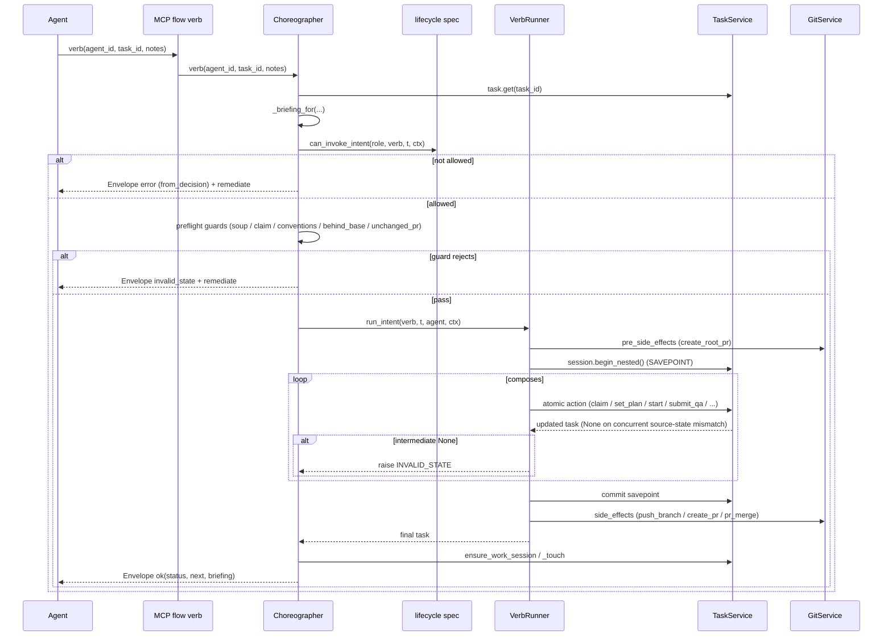

# Choreographer Slice Map

## Purpose
The Choreographer is the server-side composition layer that turns agent intent-verbs (`give_me_work`, `i_will_work_on`, `i_am_done`, `delegate`, `submit_up`, `submit_root`, `complete`, …) into ordered sequences of atomic TaskService / GitService actions. It owns the precondition gates the lifecycle spec does not model (concurrency invariants, tracing/progress gates, free-text soup, conventions, behind-base, unchanged-PR loop-stoppers) and wraps every composed mutation in a SAVEPOINT via `VerbRunner`. Every verb returns a standardized `Envelope` (`ok` / `error` + `next` + `remediate` + `context_briefing`).

## Files

| Path | Role |
|------|------|
| `roboco/services/gateway/choreographer/_impl.py` | The `_LegacyChoreographer` / `Choreographer` class — all verb bodies + guard helpers (~6.9k lines). |
| `roboco/services/gateway/choreographer/_protocol.py` | `ChoreographerHelpers` — TYPE_CHECKING-only stub of helpers role mixins call on `self`, so mypy sees typed signatures (runtime `object`). |
| `roboco/services/gateway/choreographer/_verb_runner.py` | `VerbRunner` — composed-actions runner; wraps `composes` in `session.begin_nested()` SAVEPOINT, runs `pre_side_effects` / `side_effects` outside. |

## Key Symbols (landmarks only)

| Name | Kind | File:Line | Responsibility |
|------|------|-----------|----------------|
| `Choreographer` | class | `_impl.py:339` | Composed entry point; deps-injected; exposes verbs + helpers. |
| `ChoreographerDeps` | dataclass | `_impl.py:207` | Dependency injection container (task, work_session, git, a2a, journal, audit, evidence_repo, messaging, product, orchestrator, stream_bus). |
| `_COORDINATOR_ROLES` | ClassVar | `_impl.py:914` | `{main_pm, cell_pm}` — exempt from `already_active`/`paused` claim guards + advisory lock. |
| `give_me_work` | async verb | `_impl.py:766` | Picks next task for agent + builds briefing (institutional memory injected here). |
| `_briefing_for` | async helper | `_impl.py:814` | Builds `context_briefing` (handoff, evidence, memory, AC coverage). |
| `_run_claim_guards` | async helper | `_impl.py:916` | already_active / paused / unmet_dependency (with re-check race narrowing) + `_lane_claim_guard`; `skip_dev_guards=False` param skips dev-only guards for pr_reviewer gate claims (claim_gate_review). |
| `_lane_claim_guard` | async helper | `_impl.py:977` | Out-of-order-start barrier: refuse code leaf behind an earlier open same-assignee sibling. Fail-closed on lookup error. |
| `_claim_plan_start_gate` | async helper | `_impl.py:1179` | spec gate → advisory claim lock (non-PM) → behavioral guards. |
| `_claim_plan_start_run` | async helper | `_impl.py:1251` | `runner.run_intent(verb)` + ensure_work_session + `_touch`. |
| `i_will_work_on` | async verb | `_impl.py:1326` | Dev claim+plan+start path; routes re-entry vs fresh claim. |
| `open_pr` | async verb | `_impl.py:1571` | Pre-flight + `run_intent("open_pr")` (push_branch + create_pr side effects). |
| `i_am_done` | async verb | `_impl.py:1771` | Dev pre-submit; runs `_i_am_done_gate` then `run_intent("i_am_done")`. |
| `_i_am_done_gate` | async helper | `_impl.py:1885` | Ordered gate chain: tracing → submit_qa fields → push → behind_base → quality → toolchain → conventions; then write AC status. |
| `_behind_base_gate` | async helper | `_impl.py:2154` | Refuse submit when branch behind its base (sibling PR merged); fail-open on git error. |
| `_toolchain_broken_guard` | async helper | `_impl.py:1939` | Block delivery gate when agent workspace can't run suite; `reviewer=True` for `pr_pass`. |
| `_conventions_guard` | async helper | `_impl.py:2043` | Run architectural-conventions validator; `block` finding refuses gate. |
| `_pm_task_type_error` | static method | `_impl.py:4752` | Reject a code/non-planning task_type delegated to a PM (cell or main); extracted from `_validate_assignee_task_type` to keep that dispatcher under complexity budget. |
| `i_am_blocked` | async verb | `_impl.py:3086` | Rate-limit parking vs generic block; `run_intent("i_am_blocked")`. |
| `_handle_rate_limited_parking` | async helper | `_impl.py:2983` | Park provider on 429/overload/session-limit. |
| `unclaim` | async verb | `_impl.py:3184` | Release claimed task → pending (optional reassign). |
| `reassign` | async verb | `_impl.py:3343` | Reassign task with `_validate_reassign`. |
| `resume` | async verb | `_impl.py:3422` | Resume paused/blocked task. |
| `sync_branch` | async verb | `_impl.py:3528` | Gate-level rebase verb (new since baseline). |
| `i_am_idle` | async verb | `_impl.py:3678` | Idle signal; auto-pause in_progress tasks; pending-assignment / PM review / auditor guards. |
| `i_will_plan` | async verb | `_impl.py:4071` | PM plan verb; `_pm_sub_tasks_gate` enforces substantive approach/sub_tasks. |
| `delegate` | async verb | `_impl.py:4173` | PM creates subtask; sizing, sibling-dedup, spine-cap, lifecycle guards; `_create_subtask_from_inputs`. |
| `submit_up` | async verb | `_impl.py:5348` | Cell PM opens cell→root PR + enters `awaiting_pr_review`; unchanged-PR guard. |
| `submit_root` | async verb | `_impl.py:6260` | Main PM opens root→master PR + enters gate; umbrella hard-reject + unchanged-PR guard. |
| `_submit_root_unchanged_pr_guard` | async helper | `_impl.py:6149` | Loop-stopper: refuse re-submit when PR head SHA == last `pr_fail` SHA. Fail-open on ambiguity. |
| `_current_pr_head_sha` | async helper | `_impl.py:6196` | Best-effort current PR head SHA via `_project_slug_for` + `git.get_pr_head_sha`. |
| `complete` | async verb | `_impl.py:6599` | Role-dispatch to `cell_pm_complete` / `main_pm_complete`; umbrella-in-progress bypasses spec gate. |
| `main_pm_complete` | async verb | `_impl.py:6496` | Main PM merge + escalate to CEO (never merges master itself). |
| `escalate_to_ceo` | async verb | `_impl.py:6844` | Escalate to `awaiting_ceo_approval`. |
| `VerbRunner.run_intent` | async method | `_verb_runner.py:37` | pre_side_effects → SAVEPOINT(composes) → side_effects; intermediate-None raises INVALID_STATE. |
| `VerbRunner._do_pr_merge` | async handler | `_verb_runner.py:257` | `pr_merge` with `project_id` scoping (cross-repo collision fix) + `resolve_parent_branch`. |
| `ChoreographerHelpers` | stub class | `_protocol.py:31` | TYPE_CHECKING-only typed view of `self` helpers for role mixins. |

## Data Flow
An MCP `flow/*` call hits the orchestrator → the role-specific gateway verb → `Choreographer.<verb>(agent_id, task_id, ...)`. The verb fetches the task (`self.task.get`), builds a briefing (`_briefing_for`), runs the spec gate (`spec.can_invoke_intent(role, verb, t, ctx)`) and any verb-specific preflight guards (free-text soup, claim guards, conventions, behind-base, unchanged-PR). On rejection it emits via `_emit_rejection` with `next`/`remediate`. On allow it calls `VerbRunner.run_intent(verb, t, agent, ctx)`: `pre_side_effects` (e.g. `create_root_pr` for `submit_root`) run OUTSIDE the SAVEPOINT; then `session.begin_nested()` wraps the composed atomic actions (`claim`/`set_plan`/`start`/`submit_qa`/…) re-fetching the task after each; then `side_effects` (push_branch / create_pr / pr_merge) run after the savepoint commits. An intermediate `None` from a composed action raises `INVALID_STATE` (concurrent transition); a trailing `None` flows out as the verb result. The verb wraps the final task in `Envelope.ok(status, next_hint, briefing)` with `.with_introspection(task, role)`.

## Mermaid


## Logical Tree
```
Choreographer (composed class, _impl.py)
├── Deps: task / work_session / git / a2a / journal / audit / evidence_repo / messaging / product / orchestrator / stream_bus
├── Verb bodies
│   ├── Dev: give_me_work, i_will_work_on, open_pr, i_am_done, i_am_blocked, unclaim, resume, sync_branch, i_am_idle
│   ├── PM:  i_will_plan, delegate, submit_up, submit_root, complete→{cell_pm_complete, main_pm_complete}, escalate_up, triage, triage_all, unblock, reassign, pm_give_me_work
│   └── Board/CEO: escalate_to_ceo
├── Guard helpers
│   ├── _run_claim_guards → already_active / paused / unmet_dependency / _lane_claim_guard
│   ├── _i_am_done_gate chain → tracing / submit_qa_fields / push / behind_base / quality / toolchain / conventions
│   ├── _submit_up_guard / _submit_up_unchanged_pr_guard / _submit_root_unchanged_pr_guard
│   ├── _guard_free_text / _free_text_soup / _soup_or_decision_env
│   └── _conventions_guard / _toolchain_broken_guard
└── VerbRunner (_verb_runner.py)
    ├── pre_side_effects → {create_root_pr}
    ├── composes (SAVEPOINT) → {claim, set_plan, start, submit_qa, qa_pass, qa_fail, docs_complete, complete, submit_pm_review, submit_for_review, pr_pass, pr_fail, escalate_to_ceo, block, unblock, resume, pr_review_done}
    └── side_effects → {push_branch, create_pr, create_root_pr, pr_merge}
```

## Dependencies
- **Internal services**: `TaskService`, `WorkSessionService`, `GitService`, `EvidenceRepo`/`evidence_builder`, `MessagingService`/a2a, `JournalService`, `AuditService`, `ProjectService`/product, orchestrator handle, `StreamEventBus`.
- **Policy (pure)**: `roboco.foundation.policy.lifecycle` (`can_invoke_intent`, `Context`, `Role`, `_INTENT_VERBS`), `foundation.policy.batch` (`is_batch_umbrella`), `foundation.policy.content` markers + `reject_trivial`.
- **Gateway helpers**: `claim_guards` (`already_active_guard`, `paused_tasks_guard`, `unmet_dependency_guard`), `merge_chain.resolve_parent_branch`, `envelope.Envelope`, `remediation` hints.
- **External**: `structlog`, `asyncpg` (via task_service session / SAVEPOINT), `redis` (rate-limit parking), `git`/`gh` CLI (via git_service).

## Entry Points
- MCP `roboco-flow` server → per-role verb methods (manifest-driven allowlist from `role_config.py`).
- Orchestrator `/api/v1/flow/*` REST endpoints → same `Choreographer` methods.
- Internal cross-verb calls (e.g. `complete` → `cell_pm_complete` / `main_pm_complete`; `_claim_plan_start_run` shared by `i_will_work_on` + `i_will_plan`).

## Config Flags
- `ROBOCO_TOOLCHAIN_MATCH_ENABLED` — gates `_toolchain_broken_guard` (default-off).
- `ROBOCO_CONVENTIONS_ENABLED` — gates `_conventions_guard` (default-off).
- `ROBOCO_OVERLOAD_BREAK_ENABLED` — rate-limit/overload parking path (default-on).
- `ROBOCO_ORG_MEMORY_ENABLED` — institutional-memory injection in `_briefing_for` (default-off).
- `ROBOCO_GATEWAY_HEALTH_ENABLED` — reaper gateway-health probe (default-on; not directly in choreographer but feeds the parking path).

## Gotchas
- The SAVEPOINT wraps only DB atomic actions; `pre_side_effects` (e.g. `create_root_pr`) run BEFORE the savepoint and are NOT rolled back if a later composed action raises — they are idempotent by contract.
- `side_effects` (push/create_pr/pr_merge) run AFTER savepoint commit and are idempotent + retryable; a crash between commit and side-effect leaves the PR uncreated (recovered by re-issue / `open_pr` parity).
- `VerbRunner` only raises on an INTERMEDIATE `None` composed action; a trailing `None` is the verb's own "no transition" result and each verb body must handle it (submit_root_finalize, _claim_plan_start_run do; a verb that forgets will None-deref).
- `_lane_claim_guard` fail-closed on lookup error — a DB hiccup rejects the claim (calls `release_dependency_blocked_claim`); acceptable but can briefly bounce a dev.
- `_submit_*_unchanged_pr_guard` FAILS OPEN on every ambiguous case (no recorded sha, no project slug, git error, closed PR) — only exact-unchanged is hard-blocked; a regression in `_current_pr_head_sha` resolver silently re-opens the loop.
- `complete` bypasses the spec gate for an in-progress batch umbrella (`_is_umbrella_in_progress`) and relies on `main_pm_complete`'s own guards — a mis-classified umbrella could skip the AWAITING_PM_REVIEW status constraint.

## Drift from CLAUDE.md
- CLAUDE.md verb table lists `submit_root` for `main_pm` and `submit_up` for `cell_pm` — matches code (`_impl.py:5348`, `6260`). No drift.
- CLAUDE.md: "PM coordinator concurrency … claim-time concurrency guards skipped for `_COORDINATOR_ROLES`" — matches (`_impl.py:939`, `1234`). No drift.
- CLAUDE.md verb surface omits `sync_branch` from the developer list — code has `sync_branch` at `_impl.py:3528` (added since baseline; memory note `project_sync_branch_tracing_gap.md` flags it). Minor doc drift.
- CLAUDE.md: "PR is created BEFORE QA review" — `i_am_done` gate chain pushes + creates PR context but the actual `create_pr` side-effect runs in `open_pr`/`submit_up`/`submit_root`, not `i_am_done`; consistent with the described flow. No drift.
- CLAUDE.md: "only the CEO merges master; Main PM ready root PR → awaiting_ceo_approval (does NOT merge)" — `main_pm_complete` escalates; `VerbRunner._do_pr_merge` exists for cell-level merges and `create_root_pr` opens but the root merge is CEO-gated. Consistent. No drift.

## Changes Since Baseline
`git log --oneline fd10cc862c2020b3f639cdb686d427b0198a2441..HEAD -- roboco/services/gateway/choreographer/` → 2 commits touching these files (+814/−89):

1. `15effce0` — 141 Gaps fill-in (#283): added out-of-order-start guards (`_lane_claim_guard`, `_behind_base_gate`, `sync_branch`), unchanged-PR loop-stoppers (`_submit_root_unchanged_pr_guard`, `_submit_up_unchanged_pr_guard`, `_current_pr_head_sha`), `project_id` scoping on `pr_merge` (cross-repo collision fix), umbrella-in-progress bypass in `complete`, `_submit_root_finalize` None-guard, reviewer flag on `_toolchain_broken_guard`.
2. `3aff6e04` — Close gaps (#285): follow-on touch-ups in the same areas (per-cell project map root-subtask support umbrella handling).

> Post-snapshot updates (since 2026-06-29):
> - `536bbb64` — logical-gaps sweep: `_run_claim_guards` gains `skip_dev_guards: bool = False` param (pr_reviewer `claim_gate_review` calls skip dev-only already_active/paused/lane guards; dependency guard still runs). `_pm_task_type_error` extracted as new `@staticmethod` on `Choreographer` (`_impl.py:4752`) from `_validate_assignee_task_type` — fixes Main PM omission from the PM-cannot-own-code delegate gate. `_submit_*_unchanged_pr_guard` now logs a `warning` on head_sha resolver failure so fail-open behavior is observable. Matching `skip_dev_guards` stub added to `_protocol.py`. `_impl.py` +78/−0 lines; `_protocol.py` +1 line.
> - `0e7674af` — verb_runner trailing-None side-effect guard + actor_agent_id threading: `run_intent` now skips the `side_effects` loop when the trailing composed action returns `None` (prevents `_do_push_branch(None)` / `_do_pr_merge(None)` AttributeError crash, converting it to a clean caller-handled `None`). `_do_push_branch`, `_do_create_pr`, `_do_create_root_pr`, and `_do_escalate_to_ceo` all forward `actor_agent_id=agent.id` into `git_service` / `task_service`. `main_pm_complete` escalate path in `_impl.py` also forwards `actor_agent_id`. `_verb_runner.py` +52/−8 lines; `_impl.py` +8/−2 lines.

## Regression Risks

| Title | File:Line | Claim | Severity |
|-------|-----------|-------|----------|
| Intermediate-None contract depends on every verb body handling trailing None | `_verb_runner.py:89` + `_impl.py:1277,6358` | A verb that forgets the trailing-None guard None-derefs `t.status`; submit_root + claim_plan_start handle it, but any NEW verb using `run_intent` with a possibly-None last action inherits the trap. **Side-effect crash path closed (0e7674af)**: `run_intent` now skips the `side_effects` loop on a trailing `None`, so `_do_push_branch(None)` no longer crashes. Verb bodies still need to handle `None` return for their own error messaging but will not AttributeError. Risk reduced: runner-level crash path fixed; verb-body None-deref in messaging remains a code-discipline risk. | High → Medium |
| `pr_merge` project_id scoping assumes `task.project_id` is non-None | `_verb_runner.py:263` | `project_id=task.project_id` — if a coordination/umbrella task ever reaches `pr_merge` with `project_id=None`, the cross-repo collision guard silently matches nothing or None-keys the scoping; could merge the wrong PR or no-op. | High |
| `_submit_*_unchanged_pr_guard` fails open on resolver regressions | `_impl.py:6175,6240` | Any future break in `_current_pr_head_sha` / `_project_slug_for` / `git.get_pr_head_sha` makes the loop-stopper a no-op, re-opening the 2026-06-27 pr_fail re-submit loop. **Partially mitigated (536bbb64)**: `_current_pr_head_sha` now emits a `structlog.warning` on resolver failure so the fail-open path is observable in logs; the underlying fail-open behavior is intentional and unchanged. | High |
| `_lane_claim_guard` calls `release_dependency_blocked_claim` on lookup error | `_impl.py:988,996` | Fail-closed path releases the claim before returning the error envelope; if the lookup error is transient the dev is bounced + work-session abandoned even though the lane was actually free. | Medium |
| `complete` umbrella-in-progress bypass skips the spec AWAITING_PM_REVIEW status check | `_impl.py:6657` | `_is_umbrella_in_progress` mis-classification (e.g. a non-batch branchless task with matching predicates) lets a non-awaiting_pm_review task reach `main_pm_complete`/`cell_pm_complete`. | Medium |
| `_run_claim_guards` dependency re-check narrows but does not close the race | `_impl.py:965-967` | The re-check returns None (skip release) when fresh read sees deps met, but the window between re-check and the caller's claim is still unlocked; a concurrent terminal transition there is benign (monotonic), but a non-monotonic future status could re-open. | Low |
| `submit_root` runs `create_root_pr` as a pre_side_effect OUTSIDE the savepoint | `_verb_runner.py:67` + `_impl.py:6339` | If a later composed `submit_for_review` raises, the root→master PR is already opened and NOT rolled back; re-issue is idempotent-by-contract but a non-idempotent future pre_side_effect would leak. | Medium |
| `_i_am_done_gate` writes AC criteria status AFTER all gates pass but BEFORE `run_intent` | `_impl.py:1910` | `_write_criteria_status` runs in the gate phase; if `run_intent("i_am_done")` then raises, the AC status rows persist for a task that did not transition — a stale write the next attempt must overwrite. | Low |

## Health
The slice is structurally sound: the SAVEPOINT boundary, intermediate-None INVALID_STATE guard, and role-exempt coordinator concurrency model are coherent and well-documented. The highest-temperature areas are the new (since baseline) fail-open loop-stoppers and fail-closed lane guard — both correct by design but tightly coupled to resolvers (`_current_pr_head_sha`, `has_earlier_incomplete_code_sibling`) whose regressions silently revert the protection. The 814-line delta is concentrated in guard additions rather than control-flow rewrites, so baseline behavior is largely preserved; the main residual risk is verb-body discipline around the trailing-None contract for any future verb.