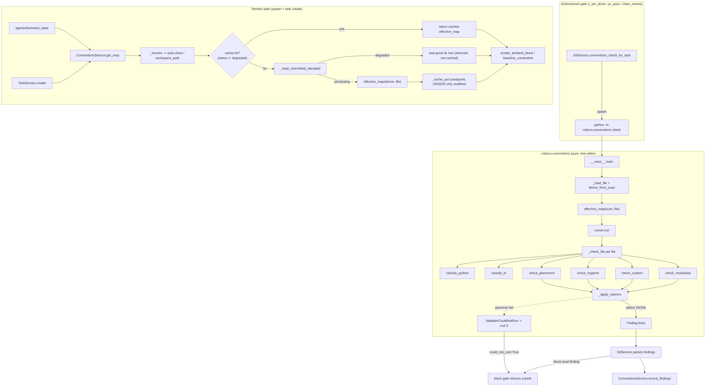

# Slice Map — conventions-service-validator

## Purpose

The per-project architectural-conventions standard for RoboCo: a service layer (`ConventionsService`) that builds, caches, renders, scaffolds, and restores the *effective* conventions map (auto-derived scan overlaid by the committed `.roboco/conventions.yml`), plus a standalone tree-sitter validator CLI (`python -m roboco.conventions`) that classifies each changed definition and flags forbidden placements, hygiene violations, custom-rule matches, and modularity smells. `DocsService` (in scope because it shares the `roboco-docs`/docs-MCP surface the standard's enforcement relies on) handles documentation file management with RAG dedup, team/path resolution, and repo commit. The standard is gated by `ROBOCO_CONVENTIONS_ENABLED` and enforced deterministically at `i_am_done` / `pr_pass` / `claim_review`.

## Files

| Path | Role | approx LOC |
|------|------|-----------:|
| `roboco/services/conventions.py` | `ConventionsService` — cache/render/scaffold/restore the effective conventions map; record + read findings | 448 |
| `roboco/services/docs.py` | `DocsService` — write/read/list/delete docs, RAG dedup, commit doc to repo, path-traversal containment | 737 |
| `roboco/conventions/__init__.py` | Package public API re-exports (`run`, `Finding`, `check_*`, `get_parser`, `GrammarUnavailable`, `ValidatorCouldNotRun`) | 30 |
| `roboco/conventions/__main__.py` | argparse CLI entrypoint (`check --root <dir> --files ...`), JSONL output, exit-0/exit-3 fail-loud | 69 |
| `roboco/conventions/runner.py` | `run()` orchestrator: per-file dispatch by suffix, waiver filtering, `ValidatorCouldNotRun` on grammar failure | 107 |
| `roboco/conventions/findings.py` | `Finding` frozen dataclass + `as_json()` (one JSONL line) | 27 |
| `roboco/conventions/grammars.py` | Lazy cached tree-sitter parser construction per language; `GrammarUnavailable` | 57 |
| `roboco/conventions/placement.py` | `check_placement` — map a file to its module, flag forbidden kinds (`no_<kind>s_in_<leaf>`) | 70 |
| `roboco/conventions/classify_python.py` | Python top-level definition classifier → `model`/`route`/`helper`/`other` | 101 |
| `roboco/conventions/classify_ts.py` | TypeScript/TSX top-level definition classifier → `model`/`route`/`component`/`other` | 159 |
| `roboco/conventions/hygiene.py` | `check_hygiene` — inline-comment + lint/type-suppression findings; sanctioned-code allowlist | 139 |
| `roboco/conventions/modularity.py` | `check_modularity` — cohesion (1 concern/file), thin routes, thin components, god class | 344 |
| `roboco/conventions/custom.py` | `check_custom` — project regex rules scoped by language with tsx→typescript dialect relation; `unrecognized_rule_languages` surfaces typo language tags | 85 |
| `roboco/conventions/scan.py` | `derive_from_scan` — infer modules/languages/rules from a repo; `render_yaml`; CLAUDE.md token lifting | 318 |

## Key Symbols

| Name | Kind | File:Line | Responsibility |
|------|------|-----------|----------------|
| `_is_unique_violation` | fn | `services/conventions.py:65` | Narrow `IntegrityError` to UNIQUE constraint (SQLSTATE 23505); non-unique errors are re-raised, not swallowed |
| `ConventionsService` | class | `services/conventions.py:82` | Cache/render/scaffold/restore a project's conventions standard |
| `ConventionsService.get_map` | method | `services/conventions.py:85` | Return effective standard for a project at its HEAD (cache-first; degraded rows not trusted from cache) |
| `ConventionsService.baseline_constraints` | method | `services/conventions.py:111` | Render block rules + module boundaries as per-task constraints |
| `ConventionsService.render_ambient_block` | method | `services/conventions.py:129` | Bounded `## Architectural Standard` prompt block (2000-char cap) |
| `ConventionsService.scaffold` | method | `services/conventions.py:171` | Open a PR adding the auto-scaffolded `.roboco/conventions.yml` |
| `ConventionsService.restore` | method | `services/conventions.py:180` | Open a PR re-committing the file from the last-good map (or a scan) |
| `ConventionsService.commit_standard` | method | `services/conventions.py:194` | Open a PR committing an externally-edited standard (panel save) |
| `ConventionsService.health` | method | `services/conventions.py:206` | Report live file status at HEAD + last-good commit SHA (reads file, not cache) |
| `ConventionsService.record_findings` | method | `services/conventions.py:230` | Replace a task's recorded findings (delete-then-insert); caller commits |
| `ConventionsService.recent_findings` | method | `services/conventions.py:257` | Recent findings across the project (panel feed) |
| `ConventionsService.resolve_workspace` | method | `services/conventions.py:300` | Ensure the project's read clone; None if unavailable (backfill path) |
| `ConventionsService._resolve` | method | `services/conventions.py:316` | Resolve repo root + HEAD sha; persist clone path + sha back onto project |
| `ConventionsService._head_sha_at` | method | `services/conventions.py:344` | `git rev-parse HEAD` in the clone (10s timeout), None if not a repo |
| `ConventionsService._read_committed_standard` | method | `services/conventions.py:362` | Read/parse `.roboco/conventions.yml` → `(standard, status)` |
| `ConventionsService._publish` | method | `services/conventions.py:379` | Open the conventions scaffold/restore PR via `GitService` |
| `ConventionsService._cache_get` | method | `services/conventions.py:411` | Read cached effective map row by `(project_id, commit_sha)` |
| `ConventionsService._cache_put` | method | `services/conventions.py:422` | Persist effective map in a savepoint (UNIQUE-violation-only swallow; non-unique IntegrityError re-raised) |
| `ConventionsService._latest_ok_row` / `_latest_ok_map` | method | `services/conventions.py:472` / `:486` | Most recent `status="ok"` cached row (degraded fallback source) |
| `ScaffoldResult` | dataclass | `services/conventions.py:47` | Outcome of a scaffold/restore: pr_number, branch, created |
| `ConventionsHealth` | dataclass | `services/conventions.py:56` | status, head_sha, last_ok_sha |
| `get_conventions_service` | fn | `services/conventions.py:493` | Construct `ConventionsService(session)` |
| `main` | fn | `conventions/__main__.py:57` | argparse CLI entrypoint; returns exit code |
| `_run_check` | fn | `conventions/__main__.py:42` | Load file+scan, build effective map, run validator, print JSONL |
| `_fail` | fn | `conventions/__main__.py:37` | Emit `{"error": ...}` on stderr + return exit 3 |
| `run` | fn | `conventions/runner.py:42` | Check a file list under root against a standard; prepends language-scope findings then applies waivers |
| `_language_scope_findings` | fn | `conventions/runner.py:55` | Emit warn findings for custom rules scoped to unrecognized languages (typo guard, #129) |
| `_check_file` | fn | `conventions/runner.py:78` | Read + classify + run all check families for one file |
| `_apply_waivers` | fn | `conventions/runner.py:103` | Drop findings whose `(path, rule)` is waived |
| `ValidatorCouldNotRun` | class | `conventions/runner.py:34` | Fail-loud signal (raised on grammar failure) |
| `Finding` | dataclass | `conventions/findings.py:13` | One violation; `as_json()` → compact JSONL |
| `get_parser` | fn | `conventions/grammars.py:48` | Cached tree-sitter parser per language |
| `GrammarUnavailable` | class | `conventions/grammars.py:16` | Raised when a grammar import fails |
| `check_placement` | fn | `conventions/placement.py:23` | Placement findings for defs in a file's module |
| `_module_for` | fn | `conventions/placement.py:37` | Most-specific module whose path is a directory prefix |
| `classify_definitions` (py) | fn | `conventions/classify_python.py:32` | Top-level Python defs → `(name, line, kind)` |
| `classify_definitions` (ts) | fn | `conventions/classify_ts.py:36` | Top-level TS/TSX defs → `(name, line, kind)` |
| `check_hygiene` | fn | `conventions/hygiene.py:58` | Inline-comment + suppression findings |
| `_suppression_allowed` | fn | `conventions/hygiene.py:89` | True iff only sanctioned codes (TC001/2/3, prop-decorator) |
| `check_modularity` | fn | `conventions/modularity.py:70` | Cohesion + thin routes + thin components + god class |
| `_check_cohesion` | fn | `conventions/modularity.py:96` | >1 core kind in a file → `modular_cohesion` finding |
| `_body_hits_db` | fn | `conventions/modularity.py:220` | Route body calls execute/scalars/select/... (thin_routes) |
| `_component_fetches` | fn | `conventions/modularity.py:300` | Component body calls fetch/axios (thin_components) |
| `unrecognized_rule_languages` | fn | `conventions/custom.py:37` | Return language tags on a `CustomRule` that the validator never reports — flags typos in the conventions file |
| `check_custom` | fn | `conventions/custom.py:56` | Project regex rule matches scoped by language |
| `_rule_applies` | fn | `conventions/custom.py:45` | Language scoping with tsx→typescript dialect relation |
| `derive_from_scan` | fn | `conventions/scan.py:100` | Infer modules/languages/rules/CLAUDE.md-lifted custom rules |
| `_seed_rules` | fn | `conventions/scan.py:142` | Seed hygiene + placement + modularity rules (stack-scoped) |
| `_lift_claude_md` | fn | `conventions/scan.py:223` | Lift imperative CLAUDE.md code-spans into warn custom rules |
| `render_yaml` | fn | `conventions/scan.py:304` | Render a standard to commented YAML (round-trips via parse_yaml) |
| `DocsService` | class | `services/docs.py:154` | Documentation file management |
| `DocsService.write_doc` | method | `services/docs.py:159` | Write/update a doc with RAG dedup + repo commit |
| `DocsService.read_doc` | method | `services/docs.py:468` | Read a doc (role-gated, path-contained) |
| `DocsService.list_docs` | method | `services/docs.py:504` | List docs (by task or by team filesystem scan) |
| `DocsService.delete_doc` | method | `services/docs.py:543` | Delete a doc (role-gated, path-contained) |
| `DocsService._commit_doc_to_repo` | method | `services/docs.py:245` | Best-effort commit the doc onto the task branch via `GitService` |
| `DocsService._find_similar_doc` | method | `services/docs.py:314` | RAG content-similarity dedup (≥0.75, same team) |
| `_resolve_contained_path` | fn | `services/docs.py:123` | Containment-prove `base / rel` (anti path-traversal, absolute-escape) |
| `_coerce_doc_ref` | fn | `services/docs.py:107` | Defensive DocRef coercion from str/dict/DocRef |
| `WriteDocInput` | dataclass | `services/docs.py:33` | Route DTO for write_doc |
| `get_docs_service` | fn | `services/docs.py:735` | Factory for `DocsService(session)` |

## Data Flow

**Validator (gate path).** `GitService.conventions_check_for_task` resolves the task's worktree + changed files and spawns `python -m roboco.conventions check --root <worktree> --files ...`. `__main__.main` parses args, `_load_file` reads `.roboco/conventions.yml` (or None), `derive_from_scan(root)` auto-derives the default standard, `effective_map(scan, file)` merges them. `runner.run` iterates files, dispatching by suffix (`.py`/`.ts`/`.tsx`); `_check_file` reads bytes, classifies via `classify_python`/`classify_ts` (tree-sitter), then runs `check_placement` + `check_hygiene` + `check_custom` + `check_modularity`. `_apply_waivers` drops waived findings. Each `Finding` is printed as one JSONL line on stdout. Exit 0 = ran (findings maybe empty); exit 3 = could not run (fail-loud). The caller parses stdout into `findings`, treats exit≠0/timeout as `could_not_run=True` (block gate refuses submit). The choreographer then calls `ConventionsService.record_findings` to persist them, and `block`-level findings refuse `i_am_done` / `pr_pass` with the offending `file:line` + fix hint.

**Service (render path).** On spawn (`_base.conventions_ambient_layer`) and on task create (`TaskService._baseline_constraints_for` — the auto-attached `## Constraints` section), `ConventionsService.get_map` is called. `_resolve` picks the read clone (via `resolve_workspace` → `WorkspaceService.ensure_read_clone`) or the legacy `workspace_path`, rev-parses the HEAD sha, and persists both back onto the project (the backfill). `_cache_get` returns a cached row if `status != "degraded"` (degraded rows are re-derived on every call); otherwise `_read_committed_standard` reads the committed file (status `ok`/`missing`/`degraded`). On `degraded`, the last-good `status="ok"` cached map is returned but NOT re-cached (so a repaired file is immediately visible on the next call). `effective_map(derive(root), file_standard)` builds the effective standard, cached via `_cache_put` (savepoint-guarded; UNIQUE-only IntegrityError swallowed). `render_ambient_block` / `baseline_constraints` render it into the prompt.

**Scaffold/restore (panel path).** `/api/projects/{id}/conventions/*` routes call `scaffold` / `restore` / `commit_standard`, which render YAML via `render_yaml` and open a PR through `GitService.open_conventions_pr` on the `chore/roboco-conventions-scaffold` branch. `health` reports status + last-good SHA; `recent_findings` feeds the panel.

**DocsService.** `write_doc` validates role (`WRITE_ROLES` = documenter/cell_pm) + doc_type + filename, RAG-searches for a similar existing doc (≥0.75 same team) → update or create under `/app/docs/{team}/{subfolder}/{filename}`, append a `DocRef` to `task.documents`, RAG-index, then best-effort commit the doc into the project workspace clone onto the task branch. `read_doc`/`delete_doc` are role-gated and path-contained via `_resolve_contained_path`. `list_docs` reads from `task.documents` (by task) or filesystem scan (by team).

## Mermaid



## Logical Tree

```
conventions-service-validator
├── roboco/services/conventions.py      # ConventionsService (cache/render/scaffold/restore/record)
│   ├── ScaffoldResult, ConventionsHealth (frozen dataclasses)
│   ├── _is_unique_violation (module-level helper — narrows IntegrityError to UNIQUE-only)
│   ├── get_map / baseline_constraints / render_ambient_block
│   ├── scaffold / restore / commit_standard / health
│   ├── record_findings / recent_findings
│   └── internals: _resolve, _head_sha_at, _read_committed_standard,
│       _publish, _cache_get/_cache_put (savepoint, UNIQUE-only swallow), _latest_ok_*
├── roboco/services/docs.py             # DocsService (docs CRUD + RAG + repo commit)
│   ├── WriteDocInput, TEAM_PATHS, TYPE_SUBFOLDERS, WRITE_ROLES, READ_ROLES
│   ├── _coerce_doc_ref, _resolve_contained_path (anti path-traversal)
│   ├── write_doc -> _find_similar_doc -> _create/_update -> _index_doc_in_rag
│   ├── _commit_doc_to_repo (best-effort git commit; returns "committed"/"skipped"/"failed")
│   └── read_doc / list_docs / delete_doc
└── roboco/conventions/                 # validator CLI (pure, tree-sitter)
    ├── __init__.py        # public re-exports
    ├── __main__.py        # argparse CLI, JSONL out, exit-3 fail-loud
    ├── runner.py          # run() orchestrator + language-scope findings + waiver filter
    ├── findings.py        # Finding dataclass + as_json
    ├── grammars.py        # lazy cached tree-sitter parsers
    ├── placement.py       # check_placement (module forbidden kinds)
    ├── classify_python.py # py defs -> model/route/helper/other
    ├── classify_ts.py     # ts/tsx defs -> model/route/component/other
    ├── hygiene.py         # inline comments + suppression markers + sanctioned codes
    ├── modularity.py      # cohesion + thin_routes + thin_components + god_class
    ├── custom.py          # project regex rules + tsx->typescript dialect + unrecognized_rule_languages
    └── scan.py            # derive_from_scan + render_yaml + CLAUDE.md lifting
```

## Dependencies

**Internal (roboco):**
- `roboco.foundation.policy.conventions.effective_map.effective_map` — overlay scan defaults with committed file (pure).
- `roboco.foundation.policy.conventions.models` — `ConventionsStandard`, `ConventionsParseError`, `Module`, `Rule`, `RuleLevel`, `DefinitionKind`, `CustomRule`, `Waiver`, `BUILTIN_RULES`.
- `roboco.db.tables` — `ProjectConventionsCacheTable`, `ProjectConventionFindingTable`, `ProjectTable`, `TaskTable`.
- `roboco.services.base.BaseService` (+ `NotFoundError`, `UnauthorizedError`, `ValidationError`).
- `roboco.services.git` — `get_git_service`, `conventions_check_for_task`, `open_conventions_pr`, `CONVENTIONS_SCAFFOLD_BRANCH`.
- `roboco.services.workspace.get_workspace_service` — `ensure_read_clone` (backfill path).
- `roboco.services.project.get_project_service` (docs repo-commit + conventions scaffold-on-create).
- `roboco.services.optimal.get_optimal_service` (RAG dedup + indexing).
- `roboco.models.task.DocRef`, `roboco.models.optimal.{IndexType,QueryContext}`.
- `roboco.agents_config.{get_agent_role,get_agent_team}` (docs role/team resolution).
- `roboco.seeds.initial_data.AGENT_UUIDS` (docs agent slug→UUID).
- `roboco.config.settings.conventions_enabled` (gate).

**External:**
- `tree_sitter`, `tree_sitter_python`, `tree_sitter_typescript` (grammars).
- `sqlalchemy` (async session, `select`/`delete`, `IntegrityError`, `begin_nested` savepoint).
- `pydantic` (`model_validate`/`model_dump`).
- `yaml` (scan render/parse).
- `argparse`, `subprocess`, `asyncio`, `json`, `re`, `os`, `pathlib`.

## Entry Points

- **CLI:** `python -m roboco.conventions check --root <repo> --files a b ...` (`__main__.main`, exit 0 ran / exit 3 could-not-run). Spawned as a subprocess by `GitService._run_conventions_validator` per gate evaluation.
- **Gate verbs (choreographer):** `i_am_done` (dev pre-submit) and `pr_pass` (in-path PR gate) call `GitService.conventions_check_for_task`; `claim_review` (QA) assembles findings into evidence. `block`-level findings refuse the transition. Routed via `_impl.py:2011` / `:2059` and `qa.py:187`.
- **Spawn ambient block:** `agents/factories/_base.conventions_ambient_layer` calls `render_ambient_block` per project at spawn (when flag on).
- **Task create:** `TaskService._baseline_constraints_for` (task.py:1003) calls `baseline_constraints` to auto-attach the `## Constraints` section.
- **Panel HTTP routes:** `/api/projects/{id}/conventions` (scaffold/save/ restore/health/findings) in `api/routes/project.py:480-541` → `scaffold`/`commit_standard`/`restore`/`health`/`recent_findings`.
- **Project create:** `ProjectService` (project.py:134) + `WorkspaceService` (workspace.py:946) call `scaffold` to seed the file on first project setup.
- **Docs MCP / HTTP:** `/api/docs` routes (`api/routes/docs.py`) → `write_doc`/`read_doc`/`list_docs`/`delete_doc`; `roboco-docs` MCP server wraps these for the `roboco-docs` tool mount (documenter / cell_pm write; board + delivery roles read).

## Config Flags

- `ROBOCO_CONVENTIONS_ENABLED` (`settings.conventions_enabled`) — master toggle. When off: `_baseline_constraints_for` returns `[]`, `conventions_ambient_layer` returns None, and the whole subsystem is inert. Default-off (per CLAUDE.md, armed in the NAS compose as part of the feature).
- (No other `ROBOCO_*` flag is read inside this slice. The validator CLI reads no env — the gate's fail-closed/fail-open policy lives in `GitService`, not here.)

## Gotchas

- **Savepoint vs bare flush (F042).** `_cache_put` runs the insert in `begin_nested()` and swallows `IntegrityError`. A bare `add`+`flush` here would poison the shared session and crash the rest of task creation (the task-create transaction rides the same session). Two task creates for the same project/HEAD can race to populate the cache — the loser's insert is dropped silently.
- **Backfill mutates the project row.** `_resolve` writes the clone path + rev-parsed sha back onto `project.workspace_path` / `project.head_commit` — a read path has a write side effect. A non-git legacy path keeps the persisted head_commit / "HEAD" (only a real rev-parse updates the cache key).
- **`get_map` degraded: no caching, re-derived on every call (FIXED 536bbb64).** A `degraded` cache row is not trusted on read (`cached.status != "degraded"` guard), and degraded results are never written to cache. `health()` reads the live file, not the cache, so an in-place repair is immediately visible.
- **Fail-closed vs fail-open in the gate (lives in `GitService`, not here).** Workspace/diff resolution errors and validator timeout/non-zero exit return `could_not_run=True` → block gate refuses submit. Branchless (no `branch_name`) and no-changed-files are fail-open (genuinely nothing to validate). The validator CLI itself mirrors this: exit 3 = could-not-run.
- **Precision over recall.** Classifiers abstain to `other` on anything ambiguous so a `block` gate can't false-positive-strand a task. `helper` is the catch-all kind → helper placement seeds at `warn`, not `block`.
- **Sanctioned suppression codes.** `no_lint_suppressions` allows `TC001`/`TC002`/`TC003`/`prop-decorator` only; a bare `noqa`/`type: ignore` (no code) is still a finding. TypeScript has no code grammar → never allowed. Comment nodes come from the AST so markers inside strings are not matched.
- **tsx dialect relation is one-directional.** A `typescript`-scoped custom rule fires on `.tsx`; a `tsx`-scoped rule does not fire on plain `.ts`. The scan reports `typescript` for `.tsx` (not `tsx`), but the validator tags `.tsx` as language `tsx` (JSX grammar).
- **Ambient block budget.** `render_ambient_block` truncates at a line boundary with a `+N more` pointer (never mid-line); reserve = header/footer + 80. `_AMBIENT_CHAR_CAP = 2000`; `_AMBIENT_TOTAL_CAP` (in `_base.py`) bounds the multi-project concatenation.
- **`_resolve_contained_path` rejects absolute paths.** `DOCS_BASE_PATH / rel` with an absolute `rel` evaluates to `rel` (pathlib resets on absolute right operand) — the old `".." in path` guard was bypassable by `/etc/passwd`. The new guard splits the raw string (not `Path.parts`, which collapses `.` on 3.13) and rejects `""`/`.`/`..`/empty segments, then resolve-and-contain.
- **`write_doc` path is now containment-checked end-to-end (FIXED 536bbb64).** `_create_new_doc` calls `_resolve_contained_path(DOCS_BASE_PATH, rel_path)` on the built `{team}/{subfolder}/{filename}` path before writing; `_update_existing_doc` calls it on the RAG-sourced `existing_path`. The substring guard on `filename` (rejects `/`, `\\`, `..`) is still the first-line check in `write_doc`, with containment as a second assertion.
- **`_commit_doc_to_repo` is best-effort but now surfaces its outcome (FIXED 536bbb64).** Returns `"committed"` / `"skipped"` / `"failed"` (instead of `None`); `write_doc` attaches this to `doc_ref.commit_status`. A git failure still does not abort the doc write to `/app/docs`, but the agent can see whether the doc landed in the repo or not.
- **RAG dedup is now filename-guarded (FIXED 536bbb64).** `write_doc` only calls `_update_existing_doc` when `Path(existing_path).name == req.filename`; a different filename forces a new file. A same-filename same-team similar-content match still overwrites (correct intent), but a topically-similar doc with a different name no longer collapses into it.
- **`_latest_ok_row` uses `derived_at.desc()`**, not `commit_sha` recency — the most recently *derived* ok row, which is the cache-population order, not necessarily the latest commit.
- **Validator runs against the worktree working tree (F123).** `git conventions_check_for_task` resolves the per-task worktree, not the clone root (which sits on the default branch) — running against the clone root false-passes on newly-added files.
- **CLAUDE.md token lifting is best-effort + capped.** `_lift_claude_md` lifts ≤25 imperative lines with a code-span, only tokens specific enough (separator, uppercase/digit, or ≥12 chars). A bare common word is not lifted.

## Drift from CLAUDE.md

- **CLAUDE.md** says the validator is `python -m roboco.conventions check --root <repo> --files <a> <b> ...`. **Actual** (`__main__.py:57-65`): matches exactly. No drift.
- **CLAUDE.md** says "Precision over recall … a validator that cannot run exits 3 so the gate blocks, never silently passes." **Actual** (`__main__.py:27`, `runner.py:29`): `ValidatorCouldNotRun` → `_fail` → exit 3. Matches. The *gate-level* fail-closed/fail-open split (resolution errors block, branchless / no-changed-files pass) lives in `GitService.conventions_check_for_task` (out of scope) and is consistent with the doc.
- **CLAUDE.md** says `thin_routes` doesn't count an explicit `db.commit()`. **Actual** (`modularity.py:40-55`): `_DB_METHODS` excludes `commit`/`flush`/`refresh` and includes `execute`/`scalar`/`scalars`/`add`/ `add_all`/`merge`/`query`. Matches.
- **CLAUDE.md** says the allowlist is "ruff `TC001`–`TC003`, pydantic `prop-decorator`". **Actual** (`hygiene.py:40`): `_ALLOWED_SUPPRESSION_CODES = {"TC001","TC002","TC003","prop-decorator"}`. Matches.
- **CLAUDE.md** says helper placement only **warns**. **Actual** (`scan.py:124-125`): `_SOFT_PLACEMENT_KINDS = {"helper"}` → `_SOFT_PLACEMENT_DEFAULT = "warn"`. Matches.
- **CLAUDE.md** says the cache is "per `(project, HEAD sha)` in `project_conventions_cache` (migration `043`)". **Actual** (`conventions.py:378-387`): keyed by `(project_id, commit_sha)` on `ProjectConventionsCacheTable`. Matches (migration number not verified in this slice).
- **CLAUDE.md** says `resolve_workspace` / `ensure_read_clone` is "pinned to the default branch's HEAD". **Actual** (`conventions.py:267-281`): delegates to `WorkspaceService.ensure_read_clone(project.slug)`; pinning happens inside `WorkspaceService` (out of scope) — not contradicted here.
- **CLAUDE.md** says the panel offers "Save / Restore" on the per-project Conventions tab. **Actual**: `commit_standard` (save) + `restore` (restore) exist and are wired in `api/routes/project.py`. Matches.
- **Drift: `docs.py` read/delete path traversal.** CLAUDE.md does not describe the docs path-traversal guard at all; the pre-`15effce0` code used a bypassable `".." in path` check. Now fixed via `_resolve_contained_path` — no doc claim to drift from, but worth noting the historical gap was real.
- **None.** No substantive contradiction between CLAUDE.md and the in-scope code was found.

## Changes Since Baseline

Baseline: `fd10cc862c2020b3f639cdb686d427b0198a2441`. One commit touched this slice: `15effce0` "Chore: 141 Gaps fill-in (#283)".

- **`roboco/conventions/custom.py`** — Added `_DIALECT_OF = {"tsx": "typescript"}` + `_rule_applies()`, replacing the bare `rule.languages and language not in rule.languages` check. **IMPACT:** a `typescript`-scoped custom rule now fires on `.tsx` files (previously it did not — a React+TS repo with a `typescript`-scoped rule silently skipped every `.tsx` file). One- directional: a `tsx`-scoped rule still does not fire on `.ts`.
- **`roboco/services/conventions.py` `_cache_put`** — Wrapped the cache insert in `begin_nested()` savepoint + `IntegrityError` swallow (F042). **IMPACT:** a concurrent duplicate cache insert (two task creates for the same project/HEAD) no longer poisons the shared session and crashes task creation. Previously a bare `add`+`flush` left the session in error state.
- **`roboco/services/docs.py`** — Replaced the `if ".." in path` guard in `read_doc` and `delete_doc` with `_resolve_contained_path` (empty/NUL/`.`/ `..`/empty-segment reject + resolve-and-contain). **IMPACT:** closes a path-traversal escape where an absolute `path` (`/etc/passwd`) bypassed the `..`-only check because `DOCS_BASE_PATH / "/etc/passwd"` evaluates to `/etc/passwd`. `read_doc` and `delete_doc` are now contained; `write_doc`'s `filename` guard is unchanged (still substring-based, no containment call).

No other logic-touching commits in the range.

> Post-snapshot updates (since 2026-06-29): **536bbb64** "Chore/all/logical gaps sweep (#286)" touched five files in this slice:
> - `conventions/custom.py` (+14 lines): added `_KNOWN_LANGUAGES` frozenset and `unrecognized_rule_languages()` — surfaces typo language tags on custom rules.
> - `conventions/runner.py` (+28 lines): imported `Finding` directly (not TYPE_CHECKING); added `_LANGUAGE_SCOPE_RULE`/`_LANGUAGE_SCOPE_FILE` constants and `_language_scope_findings()` helper; `run()` now prepends language-scope warn findings before per-file dispatch.
> - `conventions/modularity.py` (+2 lines): added `"stream"` and `"stream_scalars"` to `_DB_METHODS` (SA 2.0 streaming gap, #35).
> - `services/conventions.py` (+43 lines): added `_is_unique_violation()` (narrows `IntegrityError` catch to SQLSTATE 23505); `_cache_put` re-raises non-UNIQUE errors; `get_map` skips cache on `status=="degraded"` and no longer caches degraded results; `health()` reads the live file instead of the cache row.
> - `services/docs.py` (+37 lines): `write_doc` now only updates the similar RAG-found doc when the filename matches (`#35`); `_commit_doc_to_repo` returns `"committed"`/`"skipped"`/`"failed"` status surfaced on `doc_ref.commit_status` (#34); `_create_new_doc` and `_update_existing_doc` both call `_resolve_contained_path` on their resolved path (#33).

## Regression Risks

| Title | File:Line | Claim | Severity |
|-------|-----------|-------|----------|
| Custom-rule tsx dialect broadens firing surface | `conventions/custom.py:31-39` | A `typescript`-scoped custom rule now fires on `.tsx` files that it did not before; a React repo with a broad `typescript` rule (e.g. a CLAUDE.md-lifted `re.escape` token that happens to appear in `.tsx`) may newly block tasks that previously passed. | medium |
| Custom-rule dialect one-directional boundary | `conventions/custom.py:38-39` | `_DIALECT_OF` only maps `tsx→typescript`. If a future scan tags other dialects (e.g. `jsx`, `mts`), the family lookup silently returns None and a `typescript`-scoped rule stops firing on them — a quiet under-enforcement with no fail-loud signal. | low |
| ~~Cache put savepoint swallows all IntegrityError~~ | `services/conventions.py:451-465` | ~~The `except IntegrityError` swallows any integrity error, not only a duplicate-key.~~ **FIXED 536bbb64**: `_is_unique_violation` now narrows the catch to SQLSTATE 23505 only; any other IntegrityError (FK / NOT NULL / check constraint) is logged at ERROR and re-raised. The savepoint still rolls back only the failed insert, leaving the outer session usable. | low |
| Backfill writes project row on a read path | `services/conventions.py:303-307` | `_resolve` mutates `project.workspace_path`/`head_commit` during `get_map` (a read). If the caller's session is not the one that commits, the backfill is lost; if it is, a read has a write side effect that can race with a concurrent project update. | low |
| ~~Degraded fallback caches last-good as `degraded`~~ | `services/conventions.py:95-108` | ~~On a corrupted file, the last-good map is re-cached with `status="degraded"`.~~ **FIXED 536bbb64**: `get_map` now skips the cache when `status=="degraded"` (never pins a degraded row); `health()` re-reads the live file instead of consulting the cache, so an in-place repair is immediately visible. | low |
| ~~write_doc filename guard not containment-checked~~ | `services/docs.py:411-454` | ~~`write_doc` does NOT call `_resolve_contained_path` on the built path.~~ **FIXED 536bbb64**: `_create_new_doc` and `_update_existing_doc` both now call `_resolve_contained_path` on their resolved path before writing — the built `{team}/{subfolder}/{filename}` and the RAG-sourced `existing_path` are both containment-checked. | medium |
| _commit_doc_to_repo swallows all exceptions | `services/docs.py:295-320` | Broad `except Exception` catches all git failures. **REDUCED 536bbb64**: now returns `"committed"` / `"skipped"` / `"failed"` (instead of `None`); `write_doc` attaches the string to `doc_ref.commit_status` so the caller can surface it. The exception is still caught (the doc write must not fail), but the outcome is no longer invisible. | low |
| RAG dedup overwrites similar docs | `services/docs.py:221` | `_find_similar_doc` matches ≥0.75 content similarity in the same team. **REDUCED 536bbb64**: `write_doc` now only calls `_update_existing_doc` when the similar doc's filename exactly matches `req.filename` — a different filename always creates a new file. Still possible for same-filename, same-team, similar content to collapse silently. | low |
| ~~Modularity DB-method set excludes stream/stream_scalars~~ | `conventions/modularity.py:45-57` | ~~`await session.stream(...)` / `stream_scalars(...)` were missing from `_DB_METHODS` — thin-route false negative.~~ **FIXED 536bbb64**: `"stream"` and `"stream_scalars"` added to `_DB_METHODS`. Legacy `query` was already present. Other hypothetical future SA 2.0 constructs not in the set remain a low-severity under-enforcement non-issue. | low |
| Grammar import failure is fail-loud per-language | `conventions/grammars.py:43-45` | A missing `tree_sitter_typescript` import raises `GrammarUnavailable` → `ValidatorCouldNotRun` → exit 3 → block gate. Correct, but if the agent image is missing a grammar wheel, every TS task in that container is blocked until the image is fixed — a single missing dep halts all TS delivery. | low |

## Health

Integrity is solid and actively improving. The validator is pure, layered cleanly (scan → effective_map → runner → per-check-family), and obeys its fail-loud contract (exit 3 / `ValidatorCouldNotRun`) consistently; the service keeps the read path resilient (degraded → last-good uncached, missing → auto-derived, concurrent-cache → savepoint with UNIQUE-only swallow). The 15effce0 + 536bbb64 delta fixed five real defects (concurrent cache-poison F042; bypassable docs path-traversal on read/delete; IntegrityError over-swallow in `_cache_put`; degraded-row stickiness hiding in-place repairs; `stream`/`stream_scalars` thin-route false-negatives) and added a typo-language-scope warn signal and a repo-commit outcome surface on `doc_ref.commit_status`, with no guard dropped. Remaining risks are low-severity under-enforcement paths (dialect family lookup doesn't cover future `jsx`/`mts`, backfill write-side-effect on `get_map`, same-filename RAG dedup still collapses on content match, broad `except Exception` in `_commit_doc_to_repo` still catches) — all consistent with the "precision over recall" stance. The standard is default-off and gated. No blockers.