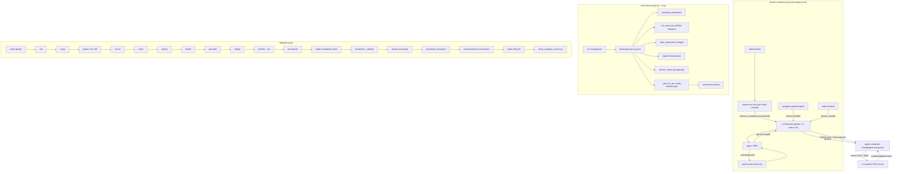

## Purpose
This slice is the packaging, build, and runtime-tooling layer of RoboCo: the Docker compose topologies (build-from-source and pre-built registry), per-service Dockerfiles (orchestrator + a family of agent role images extending a shared agent-base, plus the Next.js panel and nginx proxy), the uv/pnpm dependency manifests, the Makefile quality-gate and ops targets, the Pydantic-settings config (roboco/config.py) that every service reads, the bootstrap/CLI entrypoints that start the orchestrator, the structured-logging + exception hierarchy wired across the app, and the ops/CI helper scripts (lifecycle-artifact regeneration, postgres enum-parity verification, markdown reflow, runtime-state reset) and per-agent Claude/Grok hook scripts.

## Files

| Path | Role | LOC |
|---|---|---|
| docker-compose.yaml | Build-from-source compose: postgres/redis/ollama/ollama-init, 14 agent-*-image builders, orchestrator, panel, nginx, `roboco_data` DB-isolation network; NAS prod env vars + volume mounts | 556 |
| docker-compose.yml | Byte-identical copy of docker-compose.yaml (kept for the canonical name compose picks up by default) | 556 |
| docker-compose.registry.yml | Pull-and-run compose using pre-built GHCR/Docker Hub images (ROBOCO_REGISTRY + ROBOCO_VERSION); infra services byte-identical to build compose, agent-* services are one-shot pre-pulls, own `roboco_data` network | 334 |
| Makefile | Ops + quality targets: infra, dev/run/orchestrator, quality gate (ruff/mypy/pytest/xenon/radon/vulture/bandit/pip-audit/deptry/lint-imports/alembic/foundation-check), per-Python test matrix, docs, lifecycle regen | 548 |
| pyproject.toml | Project + dependency manifest: requires-python >=3.13,<3.15, deps, dev/docs extras, console scripts, ruff/mypy/pytest/coverage/vulture/bandit/radon/xenon/deptry/importlinter config | 451 |
| roboco/config.py | Pydantic Settings (env prefix ROBOCO_, cached via lru_cache); every tunable: DB, Redis, RAG, LLM/Ollama, workspaces, agent guardrails, gateway thresholds, autonomy-engine flags | 1022 |
| roboco/__init__.py | Package root: __version__ + re-exports settings, exceptions, logging helpers | 39 |
| roboco/bootstrap.py | Async bootstrap: DB init, Redis event bus, websocket bridge, orchestrator construction, uvicorn API server task, wait-for-ready poll, optional agent spawn, graceful shutdown | 161 |
| roboco/cli.py | argparse CLI wrapper around bootstrap.main / db-only; the ENTRYPOINT invoked by `python -m roboco.cli` | 59 |
| roboco/logging.py | structlog setup (dev ConsoleRenderer / prod JSONRenderer), secret-redaction processor, rotating file handler under /data/logs, LogContext context-manager | 252 |
| roboco/exceptions.py | Exception hierarchy (RobocoError base + NotFound/Validation/InvalidState/Permission/Auth/Task/TaskLifecycle/Agent/Notification/Service/Database/Git/MergeConflict/GitCommand/GitTimeout); includes TaskLifecycle transition hints and git-secret scrubbing | 497 |
| docker/orchestrator.Dockerfile | Multi-stage build: uv venv builder (python:3.13-slim) + runner with docker-cli/git/make/node/npm/pnpm, ENTRYPOINT python -m roboco.cli | 99 |
| docker/agent-base.Dockerfile | Shared agent runtime: uv venv + Node 22 + @anthropic-ai/claude-code, agent user, hook scripts, safe.directory *, ENTRYPOINT claude | 108 |
| docker/agent-pm.Dockerfile | PM agent — FROM roboco-agent-base, no extra tools (MCP-only) | 11 |
| docker/agent-dev-be.Dockerfile | Backend dev — adds postgresql-client + redis-tools on top of base | 18 |
| docker/agent-dev-fe.Dockerfile | Frontend dev — adds Playwright system deps + pnpm + chromium browser | 37 |
| docker/agent-qa-be.Dockerfile | Backend QA — adds postgresql-client on top of base | 18 |
| docker/agent-qa-fe.Dockerfile | Frontend QA — Playwright deps + pnpm + chromium | 36 |
| docker/agent-ux.Dockerfile | UX/UI agent — FROM base, no extra tools (placeholder for Figma/image tools) | 13 |
| docker/agent-doc.Dockerfile | Documenter — FROM base, no extra tools | 12 |
| docker/agent-prompter.Dockerfile | Intake (Prompter) — persistent Claude Agent SDK session, ENTRYPOINT python -m roboco.agent_sdk.intake_main | 17 |
| docker/agent-secretary.Dockerfile | Secretary — persistent Claude Agent SDK session with gated CEO-authority tools, ENTRYPOINT python -m roboco.agent_sdk.secretary_main | 19 |
| docker/agent-pr-reviewer.Dockerfile | PR Reviewer — FROM base, keeps claude entrypoint; read-only reviewer dispatched per review task | 16 |
| docker/agent-grok.Dockerfile | Grok runtime — base + official grok CLI 0.2.56 install, ENTRYPOINT grok-cli-agent-entrypoint.sh | 48 |
| docker/agent-grok-prompter.Dockerfile | Grok intake — FROM grok, ENTRYPOINT python -m roboco.agent_sdk.grok_intake_main, EXPOSE 9000 | 23 |
| docker/agent-grok-secretary.Dockerfile | Grok secretary — FROM grok, ENTRYPOINT python -m roboco.agent_sdk.grok_secretary_main, EXPOSE 9000 | 23 |
| docker/panel.Dockerfile | Multi-stage Next.js build (node:22-alpine, pnpm, shamefully-hoist), non-root nextjs runtime serving server.js on :3000 | 76 |
| docker/postgres-pgvector.Dockerfile | Example custom pgvector build (pg17) — currently unused; compose uses pgvector/pgvector:pg16 image directly | 15 |
| docker/nginx.conf | nginx default.conf template: /health /ready /api/ /ws/ -> orchestrator (with X-Agent-Token header), everything else -> panel | 67 |
| docker/postgres-init/01-create-extensions.sql | First-init SQL: CREATE EXTENSION IF NOT EXISTS vector + availability check (used by the pgvector image entrypoint) | 17 |
| docker/scripts/sdk-startup-hook.sh | Claude SessionStart hook: start SDK server on :9000 with UV_PROJECT_ENVIRONMENT=/app/.venv + --no-sync, reset budget, print briefing/precompact | 58 |
| docker/scripts/a2a-check-hook.sh | PostToolUse hook: poll SDK /inbox/count and remind the agent of pending A2A messages (always exits 0) | 30 |
| docker/scripts/bash-guard-hook.sh | PreToolUse Bash guard: deny compound shell git network ops, PR/merge bypass, credential exfil, and uv run --active / uv targeting /app/.venv (exit 2 to deny) | 354 |
| docker/scripts/post-tool-budget-hook.sh | PostToolUse: per-session budget counter + loop detector via SDK /budget/tool_called; halts on hard cap, denies on loop+halt | 85 |
| docker/scripts/usage-report-hook.sh | PostToolUse+Stop: fire-and-forget POST /usage/sync with the transcript_path so the SDK parses token usage | 36 |
| docker/scripts/stop-hook.sh | Stop hook: block ungraceful exits (exit 2 first time, role-specific terminal-verb reminder); auto-substitute after exceeding allowance | 71 |
| docker/scripts/user-prompt-hook.sh | UserPromptSubmit: prompt-injection guard (deny classic jailbreak patterns, exit 2) + budget nudge | 72 |
| docker/scripts/pre-compact-hook.sh | PreCompact: snapshot budget + terminal status to /tmp/roboco-precompact-<agent>.md for session resume | 48 |
| docker/scripts/session-end-hook.sh | SessionEnd: post a reflective journal post-mortem (tool count, halt/loop, last terminal tool) to the SDK | 49 |
| docker/scripts/fable-{stop-gate,bash-discipline,honesty-nudge,prompt-nudge,precompact}-hook.sh | 5 vendored fable-mode hook scripts (from `opus-fable-playbook` v0.1.3), installed only when `fable_mode_enabled`: Stop/SubagentStop turn-discipline gate, PreToolUse[Bash] read-tool discipline, PostToolUse[Bash] honesty nudge (the one also ported to grok), UserPromptSubmit shape-matched reminder, PreCompact survival-list injection; all fail-open | ~200 |
| docker/scripts/grok-cli-agent-entrypoint.sh | Grok runtime entrypoint: render ~/.grok/config.toml, prompt-guard, symlink auth.json from RO mount, grok_auth --check (exit 78 on stale), run grok -p streaming-json, capture usage, exit 75 on 429/quota | 112 |
| docker/scripts/tests/bash-guard-tests.sh | bash-guard-hook test harness: run_case allow/deny table incl. the new /app venv-protection cases | 7451 |
| scripts/build_lifecycle_artifacts.py | Deterministic regeneration of lifecycle artifacts (intent-verbs.md, status-transitions.md, panel/lib/lifecycle.json, per-role prompt fragments) from foundation.policy.lifecycle | 57 |
| scripts/regenerate_verb_tables.py | Regenerate agents/prompts/_generated/verbs.md + per-role verb tables from role_config ROLE_CONFIGS + Pydantic flow/do schemas (skips driver-based prompter/secretary) | 233 |
| scripts/verify_postgres_enums.py | Foundation drift gate: compare postgres agentrole/team enum labels to foundation identity; exit 0 on match/skip(unreachable or unmigrated), 1 on drift | 127 |
| scripts/reflow_md.py | Reflow hard-wrapped markdown prose to one line per paragraph (token-invariant safety check); --apply / --check modes for the CI gate | 214 |
| scripts/reset_runtime_state.sh | Host/container smoke-test reset: stop agent containers, run reset_runtime_state.sql, FLUSH Redis, optional FULL_RESET data wipe, per-workspace git hard-reset + stray-branch prune | 263 |
| scripts/reset_runtime_state.sql | Transactional DELETE of runtime tables (tasks/.../a2a_*) preserving agents/projects/alembic_version; resets agents.metrics | 159 |

## Key Symbols

| Name | Kind | File:Line | Responsibility |
|---|---|---|---|
| Settings | class | roboco/config.py:13 | Pydantic BaseSettings; all ROBOCO_ env-backed tunables + computed fields (database_url, redis_url, internal_api_url, rag_store_url) |
| get_settings | function | roboco/config.py:1015 | lru_cache-backed singleton factory returning the cached Settings instance |
| internal_api_url | property | roboco/config.py:57 | computed_field: service-to-service API base URL (api_url override or http://host:port/api, maps 0.0.0.0 to 127.0.0.1) |
| database_url | property | roboco/config.py:85 | computed_field: asyncpg connection URL |
| database_url_sync | property | roboco/config.py:93 | computed_field: sync psycopg URL for Alembic |
| redis_url | property | roboco/config.py:110 | computed_field: Redis connection URL (optional password) |
| _BootstrapHolder | class | roboco/bootstrap.py:27 | Module-level holder for the singleton AgentOrchestrator instance |
| _run_api_server | function | roboco/bootstrap.py:33 | Build a uvicorn.Config for roboco.api.app:app and serve it (no reload in prod/container) |
| _wait_for_api_ready | function | roboco/bootstrap.py:46 | Poll http://127.0.0.1:port/health until 200 (up to max_wait) so the orchestrator starts only after lifespan indexing completes |
| main | function | roboco/bootstrap.py:69 | Async entrypoint: bootstrap_database, init Redis event bus + handlers, websocket bridge, orchestrator, DI wiring, API task, ready poll, optional spawns, graceful shutdown |
| parse_args | function | roboco/cli.py:15 | argparse: --skip-db, --skip-orchestrator, --spawn, --db-only |
| cli | function | roboco/cli.py:41 | Console-script entry: dispatch db-only or full bootstrap via asyncio.run |
| add_app_context | function | roboco/logging.py:25 | structlog processor injecting app/version/environment into every event dict |
| _redact_secrets | function | roboco/logging.py:60 | Regex-replace GitHub PAT / bearer / embedded-URL-credential shapes with <REDACTED> |
| redact_event_dict | function | roboco/logging.py:70 | structlog processor running last; redacts every value in the event dict |
| setup_logging | function | roboco/logging.py:86 | Configure structlog (dev ConsoleRenderer / prod JSONRenderer), stdlib root logger, rotating file handler under /data/logs, quiet noisy libs |
| _resolve_log_dir | function | roboco/logging.py:169 | Resolve log dir: ROBOCO_LOG_DIR > /data/logs > ${ROBOCO_DATA_DIR:-./data}/logs > None |
| get_logger | function | roboco/logging.py:192 | Return a configured structlog BoundLogger |
| LogContext | class | roboco/logging.py:210 | Context manager binding/unbinding contextvars for scoped log context |
| log_operation | function | roboco/logging.py:231 | Build a structured-log context dict for an operation |
| RobocoError | class | roboco/exceptions.py:13 | Base exception with message/code/details and to_dict() for API responses |
| NotFoundError | class | roboco/exceptions.py:50 | Resource not found (code NOT_FOUND) |
| ValidationError | class | roboco/exceptions.py:77 | Input validation failure (code VALIDATION_ERROR) |
| InvalidStateError | class | roboco/exceptions.py:98 | Operation not allowed in current state (code INVALID_STATE) |
| PermissionDeniedError | class | roboco/exceptions.py:128 | Agent lacks permission (code PERMISSION_DENIED) |
| AuthenticationError | class | roboco/exceptions.py:151 | Auth required (code AUTHENTICATION_REQUIRED) |
| TaskError | class | roboco/exceptions.py:171 | Base task error (code TASK_ERROR), carries task_id |
| TaskLifecycleError | class | roboco/exceptions.py:191 | Invalid transition; _TRANSITION_HINTS table appends procedural tool-call hints for common footguns |
| AgentError | class | roboco/exceptions.py:273 | Base agent error carrying agent_id |
| NotificationError | class | roboco/exceptions.py:364 | Notification error base |
| ServiceError | class | roboco/exceptions.py:381 | External service error carrying service name |
| DatabaseError | class | roboco/exceptions.py:400 | Database operation failed |
| GitError | class | roboco/exceptions.py:424 | Base git operation error |
| _scrub_git_secrets | function | roboco/exceptions.py:439 | Redact creds a git command may echo into stderr (URL creds, Authorization basic, PATs) |
| MergeConflictError | class | roboco/exceptions.py:456 | PR merge refused for conflict; routes completion to conflict resolution |
| GitCommandError | class | roboco/exceptions.py:467 | git command failed; surfaces a secret-free stderr tail in .message |
| GitTimeoutError | class | roboco/exceptions.py:487 | git command timed out after Ns |
| write | function | scripts/build_lifecycle_artifacts.py:24 | mkdir -p + write_text, print relative path |
| main | function | scripts/build_lifecycle_artifacts.py:30 | Render intent-verbs.md, status-transitions.md, panel/lib/lifecycle.json, per-role lifecycle-{role}.md via foundation._generators |
| fetch_enum_values | function | scripts/verify_postgres_enums.py:26 | Query pg_enum for a type's labels |
| type_exists | function | scripts/verify_postgres_enums.py:40 | True iff a postgres enum type exists |
| should_skip_for_unmigrated | function | scripts/verify_postgres_enums.py:49 | Skip only when BOTH agentrole and team absent (DB not migrated); partial = drift |
| enum_drift | function | scripts/verify_postgres_enums.py:59 | Compare DB enum sets vs foundation Role/Team; return (has_drift, messages) |
| main | function | scripts/verify_postgres_enums.py:82 | Connect via asyncpg, fetch enums, skip-or-report drift against foundation identity (exit 0 skip/match, 1 drift) |
| reflow | function | scripts/reflow_md.py:141 | Token-invariant reflow of markdown prose (paragraphs, list items, front matter, code fences verbatim) |
| in_scope | function | scripts/reflow_md.py:162 | Skip SKIP_DIRS / EXCLUDE_PREFIXES (docs/internal, agents/prompts/_generated) / EXCLUDE_GLOBS |
| main | function | scripts/reflow_md.py:171 | Walk *.md, reflow, enforce token-invariant safety, --apply / --check (exit 1 on wrapped files) |
| _render_role_section | function | scripts/regenerate_verb_tables.py:138 | Render one role's flow + do verb tables from role_config + schemas |
| main | function | scripts/regenerate_verb_tables.py:181 | Write agents/prompts/_generated/verbs.md + per-role {role}.md, skipping driver-based prompter/secretary |
| _reset_workspace | function | scripts/reset_runtime_state.sh:177 | Per-clone git hard-reset to default branch + clean -fdx + delete stray feature branches (as owner) |
| _resolve_workspaces_root | function | scripts/reset_runtime_state.sh:154 | Resolve WORKSPACES_ROOT from env, then NAS /volume1/roboco/data/workspaces, then /data/workspaces |

## Data Flow
Compose brings up infra (postgres/redis/ollama + ollama-init verifying models) then the orchestrator image, whose ENTRYPOINT `python -m roboco.cli` calls `roboco.cli.cli` -> `asyncio.run(bootstrap.main(...))`. bootstrap.main reads `roboco.config.settings` (env-injected by compose), runs `bootstrap_database()` (Alembic/migrations via the sync URL), inits the Redis event bus, starts the websocket bridge, constructs `AgentOrchestrator`, sets it on the API deps, launches uvicorn on `roboco.api.app:app`, polls `/health`, then `orchestrator.start()`. The orchestrator spawns per-role agent containers from the agent-*-image family (or registry pre-builts when ROBOCO_AGENT_IMAGE_REGISTRY set); each agent container runs `claude` (or the grok-cli entrypoint / agent_sdk driver for prompter/secretary/grok-*), with host volumes (workspaces, manifests, briefings, grok-usage, logs, ~/.claude, ~/.grok) bind-mounted in. Inside an agent container, Claude Code's hook system calls the docker/scripts/* hooks, which POST to the in-container SDK server on :9000 (budget/terminal/usage/inbox); the usage-report + post-tool-budget hooks feed token/loop state back to the SDK, and stop-hook forces a terminal verb before exit. nginx (port 3000) proxies /api and /ws to the orchestrator with the CEO panel token injected, and everything else to the Next.js panel. The Makefile `quality`/`foundation-check` gates run offline (ruff/mypy/pytest/xenon/.../verify_postgres_enums/build_lifecycle_artifacts) and are the merge barrier. reset_runtime_state.sh/.sql wipe runtime rows between smoke runs while preserving org scaffolding.

## Mermaid


## Logical Tree
```
deployment-tooling
├─ Compose topologies
│  ├─ docker-compose.yaml / .yml (build-from-source)
│  │  ├─ infra: postgres, redis, ollama, ollama-init
│  │  ├─ agent-*-image builders (14, FROM docker/agent-*.Dockerfile)
│  │  ├─ orchestrator (build context=.)
│  │  ├─ panel (build)
│  │  └─ nginx (image) — single :3000 entry, ROBOCO_PANEL_AGENT_TOKEN envsubst
│  └─ docker-compose.registry.yml (pre-built images via ROBOCO_REGISTRY/ROBOCO_VERSION)
│     ├─ infra (byte-identical)
│     ├─ agent-* one-shot pre-pulls
│     ├─ orchestrator (image, ROBOCO_AGENT_IMAGE_REGISTRY/TAG)
│     └─ panel + nginx (image)
├─ Dockerfiles (docker/)
│  ├─ orchestrator.Dockerfile (builder + runner w/ docker-cli, git, make, node, pnpm, uv)
│  ├─ agent-base.Dockerfile (venv + Node22 + claude-code + hooks, USER agent)
│  │  └─ docker/scripts/*.sh (sdk-startup, a2a-check, bash-guard, post-tool-budget, usage-report, stop, user-prompt, pre-compact, session-end, + 5 default-off fable-*.sh gated by fable_mode_enabled)
│  ├─ role images FROM agent-base: pm, dev-be, dev-fe, qa-be, qa-fe, ux, doc, prompter, secretary, pr-reviewer
│  ├─ grok family: agent-grok.Dockerfile (+ grok CLI 0.2.56, grok-cli-agent-entrypoint.sh)
│  │  └─ agent-grok-prompter / agent-grok-secretary (FROM grok, agent_sdk drivers)
│  ├─ panel.Dockerfile (Next.js standalone, non-root nextjs)
│  ├─ postgres-pgvector.Dockerfile (example, unused)
│  ├─ nginx.conf (proxy template)
│  └─ postgres-init/01-create-extensions.sql
├─ Python runtime core
│  ├─ roboco/config.py (Settings + computed fields + get_settings lru_cache)
│  ├─ roboco/__init__.py (version + re-exports)
│  ├─ roboco/cli.py (argparse -> bootstrap.main / db-only)
│  ├─ roboco/bootstrap.py (DB+bus+orchestrator+uvicorn+ready-poll)
│  ├─ roboco/logging.py (structlog + secret redaction + file rotation + LogContext)
│  └─ roboco/exceptions.py (hierarchy + transition hints + git secret scrub)
├─ Build/quality manifest
│  └─ pyproject.toml (deps, dev/docs extras, ruff/mypy/pytest/coverage/vulture/bandit/radon/xenon/deptry/importlinter/roboco.commits)
├─ Makefile (infra, run, quality gate, per-Python test matrix, docs, lifecycle, foundation-check)
└─ Ops/CI scripts (scripts/)
   ├─ build_lifecycle_artifacts.py (render lifecycle artifacts)
   ├─ regenerate_verb_tables.py (per-role verb tables from schemas)
   ├─ verify_postgres_enums.py (foundation enum parity gate)
   ├─ reflow_md.py (markdown prose reflow CI gate)
   ├─ reset_runtime_state.sh + .sql (smoke-test state wipe + workspace git reset)
   └─ docker/scripts/tests/bash-guard-tests.sh (hook deny/allow table)
```

## Dependencies
- Internal: roboco.api.app, roboco.api.deps, roboco.api.websocket, roboco.api.websocket_bridge, roboco.db (bootstrap_database), roboco.events (init_event_bus, register_default_handlers, set_event_context), roboco.runtime (AgentOrchestrator, set_reasoning_stream_callback), roboco.services.notification.NotificationService, roboco.foundation._generators, roboco.foundation.policy.lifecycle.Role, roboco.foundation.identity (Role, Team), roboco.foundation._validate, roboco.foundation.policy.lifecycle, roboco.api.schemas.v1.flow / .do, roboco.services.gateway.role_config.ROLE_CONFIGS, roboco.agent_sdk (intake_main/secretary_main/grok_*_main referenced by Dockerfiles), roboco.llm.providers.grok_cli_config / grok_auth / grok_cli_usage (referenced by grok entrypoint), roboco.agent_sdk.prompt_guard, roboco.agents_config.issue_panel_token (Makefile panel-token)
- External: python>=3.13,<3.15, pydantic / pydantic-settings, fastapi / uvicorn[standard] / websockets / sse-starlette, sqlalchemy[asyncio] / asyncpg / alembic, redis / hiredis, anthropic / openai / tiktoken / claude-agent-sdk, mcp / tomli-w, httpx / python-multipart / python-jose[cryptography] / passlib[bcrypt] / tenacity / structlog, cryptography / packaging / pyyaml / tree-sitter(-python/-typescript), docker (compose, cli, daemon socket mount), nginx:alpine, pgvector/pgvector:pg16, ollama/ollama:latest, curlimages/curl:latest, redis:8-alpine, node:22-alpine (panel), python:3.13-slim-bookworm (orchestrator + agent-base), @anthropic-ai/claude-code, pnpm, Playwright, chromium, xAI grok CLI 0.2.56, uv (astral), ruff, mypy, pytest(-asyncio/-cov/-xdist), vulture, bandit, pip-audit, radon, xenon, deptry, import-linter, mkdocs-material, pymarkdownlnt, make, git, jq

## Entry Points

| Name | File | Trigger |
|---|---|---|
| python -m roboco.cli / roboco console script | roboco/cli.py | orchestrator container ENTRYPOINT (docker/orchestrator.Dockerfile:98); `make orchestrator`; `make dev`; `make db-init` (--db-only) |
| roboco-bootstrap console script | roboco/bootstrap.py | pyproject [project.scripts] alias (points at roboco.bootstrap:cli which does not exist — see drift) |
| uvicorn roboco.api.app:app | roboco/bootstrap.py | spawned as asyncio task inside bootstrap.main (make api / make run run it directly) |
| make quality / foundation-check / lifecycle | Makefile | CI merge gate + local pre-submit |
| scripts/build_lifecycle_artifacts.py | scripts/build_lifecycle_artifacts.py | make lifecycle (foundation-check runs it) |
| scripts/verify_postgres_enums.py | scripts/verify_postgres_enums.py | make foundation-check (final step) |
| scripts/reflow_md.py --check | scripts/reflow_md.py | make reflow-check / make quality |
| scripts/regenerate_verb_tables.py | scripts/regenerate_verb_tables.py | manual after role_config / schema change (not wired into make quality) |
| scripts/reset_runtime_state.sh | scripts/reset_runtime_state.sh | manual smoke-test reset (host or ssh into NAS) |
| docker compose up | docker-compose.yaml | operator deploy (build) or -f docker-compose.registry.yml up (pull) |

## Config Flags
- ROBOCO_DATABASE_HOST/PORT/USER/PASSWORD/NAME
- ROBOCO_REDIS_HOST/PORT/DB/PASSWORD
- ROBOCO_HOST/PORT/API_URL/CORS_ORIGINS/CORS_ALLOW_CREDENTIALS
- ROBOCO_ENCRYPTION_KEY (required by compose)
- ROBOCO_AGENT_AUTH_SECRET / ROBOCO_AGENT_AUTH_REQUIRED
- ROBOCO_ENVIRONMENT (development|staging|production; selects structlog renderer)
- ROBOCO_DEBUG
- ROBOCO_LOCAL_LLM_MODEL / ROBOCO_LOCAL_LLM_BASE_URL / ROBOCO_OLLAMA_BASE_URL / ROBOCO_DEFAULT_EMBEDDING_MODEL / ROBOCO_EMBEDDING_DIMENSIONS
- ROBOCO_RAG_CHUNK_STRATEGY/SIZE/OVERLAP/USE_HYDE/USE_HYBRID_SEARCH/AUTO_UPDATE_*
- ROBOCO_WORKSPACES_ROOT / ROBOCO_WORKSPACE_AUTO_CLONE / ROBOCO_WORKSPACE_CLONE_TIMEOUT / ROBOCO_WORKSPACE_REFRESH_FETCH_TIMEOUT_SECONDS / ROBOCO_WORKSPACE_INSTALL_DEV_DEPS / ROBOCO_WORKSPACE_DEP_INSTALL_TIMEOUT_SECONDS
- ROBOCO_AGENT_IMAGE_REGISTRY / ROBOCO_AGENT_IMAGE_TAG (registry vs local build)
- ROBOCO_HOST_PROJECT_DIR / ROBOCO_HOST_CLAUDE_DIR / ROBOCO_HOST_GROK_DIR / ROBOCO_HOST_DATA_DIR / ROBOCO_PUBLIC_BASE_URL
- ROBOCO_MANIFEST_HOST_DIR
- ROBOCO_CLAIM_STALE_SECONDS / ROBOCO_STALE_CLAIM_REAP_SECONDS / ROBOCO_PM_CLOSURE_RECENTLY_PAUSED_SECONDS / ROBOCO_GROK_IDLE_KILL_SECONDS / ROBOCO_GROK_MAX_COST_USD / ROBOCO_INTERACTIVE_IDLE_REAP_SECONDS / ROBOCO_CLAIMED_NO_AGENT_GRACE_SECONDS / ROBOCO_PM_DECISION_WINDOW_SECONDS
- ROBOCO_SPAWN_COOLDOWN_SECONDS / ROBOCO_ROLE_SPAWN_RATE_PER_MINUTE
- ROBOCO_TOOLCHAIN_MATCH_ENABLED
- ROBOCO_ROUTING_STRICT
- ROBOCO_OVERLOAD_BREAK_ENABLED
- ROBOCO_GATEWAY_HEALTH_ENABLED / ROBOCO_GATEWAY_HEALTH_GRACE_SECONDS
- ROBOCO_CONVENTIONS_ENABLED
- ROBOCO_GUARD_ENABLED / _PASSIVE_MODE / _FAIL_SECURE / _TELEMETRY_ENABLED / _AGENT_API_KEY / _PROJECT_ID / _EMERGENCY / _EMERGENCY_WHITELIST (fastapi-guard HTTP security layer, `roboco/security.py`; local branch `feature/fastapi-guard-hardening`, not on master)
- ROBOCO_RESEARCH_ENABLED / ROBOCO_RESEARCH_PROVIDER / ROBOCO_RESEARCH_API_KEY / ROBOCO_RESEARCH_*_QUOTA
- ROBOCO_PROVISIONING_ENABLED / ROBOCO_PROVISIONING_TOKEN / ROBOCO_PROVISIONING_ORG / ROBOCO_GITHUB_API_BASE_URL
- ROBOCO_STRATEGY_ENGINE_ENABLED / _INTERVAL_SECONDS / _STRANDED_BLOCKED_MINUTES
- ROBOCO_EXTERNAL_PR_ENABLED / _POLL_INTERVAL_SECONDS / _AUTHOR_ALLOWLIST / _REQUIRE_HUMAN_CONFIRM
- ROBOCO_INTERNAL_PR_ENABLED
- ROBOCO_SELF_HEAL_ENABLED / _ORIGINATE_ENABLED / _PROJECT_SLUG / _CI_WORKFLOW / _INTERVAL_SECONDS / _MAX_OPEN_TASKS / _MAX_PER_CYCLE / _NOTIFY_DEDUPE_SECONDS
- ROBOCO_CI_WATCH_ENABLED / _DEFAULT_WORKFLOW / _INTERVAL_SECONDS / _MAX_OPEN_TASKS / _MAX_PER_CYCLE
- ROBOCO_DEP_UPDATE_ENABLED / _INTERVAL_SECONDS / _MAX_OPEN_TASKS / _MAX_PER_CYCLE
- ROBOCO_RELEASE_MANAGER_ENABLED / _MIN_COMMITS / _INTERVAL_SECONDS / _CI_WORKFLOW
- ROBOCO_ORG_MEMORY_ENABLED / _TOP_K / _MIN_SCORE
- ROBOCO_SANDBOX_DB_ENABLED — sandboxed per-agent-spawn engine provisioner (`roboco/runtime/sandbox.py` + registry in `roboco/models/sandbox.py`); a project also needs its `sandbox_services` column set
- ROBOCO_DB_NETWORK_ISOLATED — set true only by the compose topology carrying the `roboco_data` data-only network; suppresses the legacy prod-creds gate-env injection
- ROBOCO_CLOUD_AUTH_ENABLED / _EMAIL / _PASSWORD / _SECRET / _COOKIE_MAX_AGE — FastAPI Users cookie login for the single seeded CEO; `Settings` fails loud at startup if armed with no secret
- ROBOCO_X_ENGINE_ENABLED / _MENTIONS_INTERVAL_SECONDS / _MENTIONS_MAX_PER_CYCLE / _MENTIONS_MIN_ENGAGEMENT / _MAX_OPEN_POSTS / ROBOCO_X_ACCOUNT_USER_ID / _REQUEST_TIMEOUT_SECONDS — the X (Twitter) engine; inert without stored OAuth 1.0a credentials regardless of the flag
- ROBOCO_ROADMAP_ENGINE_ENABLED / _INTERVAL_SECONDS (default 604800) / _MIN_ITEMS_PER_CYCLE / _MAX_ITEMS_PER_CYCLE — the board roadmap engine
- ROBOCO_X_FEATURE_SPOTLIGHT_ENABLED / _INTERVAL_SECONDS (default 259200/3d) — X-engine feature-spotlight sub-switch (requires ROBOCO_X_ENGINE_ENABLED also on), default off
- ROBOCO_FABLE_MODE_ENABLED — opus-fable-playbook adoption (doctrine layer in the composed prompt + 5 Claude-path hook scripts + 1 grok-path hook), default off; off = byte-for-byte unchanged spawn path
- ROBOCO_MINIO_ENDPOINT / _ACCESS_KEY / _SECRET_KEY / _BUCKET / _REGION — MinIO object storage (default-off; empty endpoint = disabled, media route falls back to `FileResponse`; when set, `video_renderer_client._save` PUTs each render to MinIO after the local write and `GET /api/video/posts/{id}/media` streams it via `StreamingResponse` over `minio_client.get_object_stream`, key = basename, `_require_ceo` kept so auth stays end-to-end — no presigned URLs; `S3Error` falls back to `FileResponse`); NAS compose runs `minio` + `minio-init` on the `data` network with a named `minio-data` volume, registry compose omits MinIO; see `docs/rag/architecture/minio-storage.md`
- ROBOCO_TRANSCRIPT_RETENTION_DAYS / ROBOCO_TRANSCRIPT_PRUNE_ENABLED / _INTERVAL_SECONDS
- ROBOCO_IMAGE_PRUNE_ENABLED / _INTERVAL_SECONDS
- ROBOCO_GIT_COMMAND_TIMEOUT_SECONDS / _COMMIT_TIMEOUT_SECONDS / _NETWORK_TIMEOUT_SECONDS
- ROBOCO_PROTECTED_GIT_URLS
- ROBOCO_AGENT_TOOL_CALL_WARN/HALT / ROBOCO_AGENT_LOOP_THRESHOLD/WINDOW / ROBOCO_AGENT_STOP_ATTEMPT_ALLOWANCE / ROBOCO_AGENT_SLA_* / ROBOCO_CLAUDE_STUCK_KILL_SECONDS
- ROBOCO_QA_NOTES_MIN_CHARS / DOCS / DEV / PR_REVIEWER / QUICK_CONTEXT_MIN_CHARS
- ROBOCO_COMMIT_SUBJECT_MIN_CHARS / COMMIT_BANNED_WORDS
- ROBOCO_LOG_DIR / ROBOCO_DATA_DIR (logging.py + compose volume resolution)
- ROBOCO_REGISTRY / ROBOCO_VERSION (registry compose image selection)
- ROBOCO_PANEL_AGENT_TOKEN / NGINX_ENVSUBST_FILTER (nginx)
- ROBOCO_AGENT_ROLE / ROBOCO_AGENT_ID / ROBOCO_SDK_PORT / ROBOCO_SDK_URL / ROBOCO_INITIAL_PROMPT / ROBOCO_AGENT_MODEL / ROBOCO_GROK_ARGS_FILE / ROBOCO_WORKSPACE / ROBOCO_MCP_CONFIG / ROBOCO_GUARD_SKIP_GIT (hook scripts)
- OLLAMA_API_KEY (compose)


## Gotchas
- docker-compose.yml and docker-compose.yaml are byte-identical duplicates maintained in lockstep — the registry compose comment explicitly warns to mirror service changes across both. Drift between them is a silent footgun.
- pyproject.toml requires-python is >=3.13,<3.15 but the Makefile test matrix and PYTHON_VERSIONS span 3.10–3.14 and DEFAULT_PYTHON=3.10; `make test-3.10` will build an image the project cannot actually install into (ruff target-version py313, mypy python_version=3.13). The matrix is stale relative to the floor.
- orchestrator.Dockerfile pins the builder to python:3.13-slim-bookworm and forces UV_PYTHON_PREFERENCE=only-system so the venv symlinks survive the COPY to the runner; switching the base image Python (e.g. to 3.14) without re-validating the uv-managed-python path would brick the runner.
- The orchestrator container runs as root (no USER directive) so it can chown cloned workspaces to uid 1000 and set git safe.directory '*'; agent-base runs as `agent` (created with useradd -m). Crossing the uid boundary (orchestrator root-owned repo in an agent container) is what safe.directory '*' papers over — removing it re-introduces 'dubious ownership'.
- ollama-init deliberately runs WITHOUT `set -e` and gates success on model PRESENCE (/api/tags grep), not on the pull succeeding — a degraded registry used to block the orchestrator's service_completed_successfully gate. Any 'fix' that adds set -e or makes the pull mandatory re-breaks cold caches.
- sdk-startup-hook sets UV_PROJECT_ENVIRONMENT=/app/.venv AND passes --no-sync because bare `uv run` from a workspace cwd re-syncs the image venv against the clone's drifted lock (multi-minute stall). The generated mcp-config.json must keep both in sync — changing one without the other re-stalls the SDK bring-up.
- bash-guard-hook denies `uv run --active` and any `uv run`/`uvx` targeting /app — VIRTUAL_ENV is no longer baked globally in the agent image (removed in 7be10057; was the be-dev-1 2026-06-29 root cause). With VIRTUAL_ENV absent, --active finds no active env and errors rather than retargeting /app/.venv; an explicit /app target still bricks the gateway venv. A bare `uv run` (workspace venv) is the only allowed form.
- grok-cli-agent-entrypoint symlinks ~/.grok/auth.json -> /home/agent/.grok-auth-ro/auth.json because a single-file bind mount pins the inode and the atomic auth.json refresh never reached a running container; the directory RO mount sees the host rename. Breaking the symlink (or a stale baked stub auth.json) makes grok hang at an interactive login prompt forever.
- grok exit codes are load-bearing: 78 = expired/missing auth (EX_CONFIG, refuse to start), 75 = 429/quota (EX_TEMPFAIL, orchestrator parks the provider). The orchestrator's _handle_stopped_container branches on these; reusing them for other semantics would misroute.
- logging._resolve_log_dir prefers /data/logs only if it OR its parent exists; on a host run with no /data it falls back to ./data/logs. A host-side `./logs` at repo root is NOT the same directory and would duplicate logs.
- verify_postgres_enums.py now embeds skip semantics (exit 0 on unreachable OR both-enum-types-absent) so the Makefile must NOT pipe it through `|| echo skipped` — that masks a real drift exit(1) as a skip. The baseline did exactly that; 15effce0 removed the `|| echo`.
- reset_runtime_state.sql DELETEs in a hand-ordered FK-safe array and guards each with information_schema EXISTS — a new runtime table referencing tasks/journals must be added to drop_order or the DELETE will FK-violate. A partial schema (some a2a_* absent) is tolerated by the IF EXISTS guard.
- reset_runtime_state.sh deletes every local branch except the resolved default (main/master/fallback) per workspace; if a workspace's default can't be resolved (no origin, no main, no master) it SKIPs rather than nukes — safe, but leaves stale branches that can collide with next-run branch creation.
- TaskLifecycleError._TRANSITION_HINTS is a hand-maintained (current_status,target_status)->hint map; adding a new lifecycle state/transition without a matching hint means weak models fall back to guessing the tool sequence (the exact failure the hints exist to prevent).
- ROBOCO_CLAIM_STALE_SECONDS and ROBOCO_STALE_CLAIM_REAP_SECONDS are intentionally distinct fields — claim_stale_seconds drives trigger_filter spawn queueing, stale_claim_reap_seconds drives the reaper's release. Splitting them opens a duplicate-spawn window; merging them delays spawn decisions. NAS compose raises both to 1800.
- pyproject [project.scripts] declares `roboco-bootstrap = roboco.bootstrap:cli` but roboco/bootstrap.py defines NO `cli` symbol (only `main`); the canonical entry is `roboco = roboco.cli:cli`. The bootstrap-script entry is dead/broken (see drift).
- The Dockerfiles COPY pyproject.toml uv.lock README.md into /app for the uv sync layer; a missing/stale uv.lock at build time breaks the --frozen sync. The Makefile's `make upgrade` re-locks but does not rebuild images.
- Both NAS composes (`docker-compose.yml`/`.yaml`) set `ROBOCO_GUARD_ENABLED=true` / `ROBOCO_GUARD_PASSIVE_MODE=true` / `ROBOCO_GUARD_FAIL_SECURE=false` — the fastapi-guard HTTP security layer runs in detect-and-log calibration mode on the NAS, never blocking; `docker-compose.registry.yml` does not set these three and stays off (`guard_enabled` default `false`). Flipping `_PASSIVE_MODE` to `false` to enforce is a deliberate later step, not part of this arming.
- Both NAS composes now also arm `ROBOCO_SANDBOX_DB_ENABLED` / `ROBOCO_DB_NETWORK_ISOLATED` / `ROBOCO_CLOUD_AUTH_ENABLED` / `ROBOCO_X_ENGINE_ENABLED` / `ROBOCO_ROADMAP_ENGINE_ENABLED` all `${VAR:-true}` (config default is `false` for every one), alongside the pre-existing `${VAR:-true}` flips for `ROBOCO_SELF_HEAL_ENABLED`, `ROBOCO_PROVISIONING_ENABLED`, `ROBOCO_TRANSCRIPT_PRUNE_ENABLED`, and `ROBOCO_ROUTING_STRICT` — this is a personal-deploy posture (override any via `.env`), not the published conservative default. `docker-compose.registry.yml` keeps `ROBOCO_SELF_HEAL_ENABLED:-false` (and does not set `SANDBOX_DB`/`CLOUD_AUTH`/`X_ENGINE`/`ROADMAP_ENGINE` at all, so they fall through to the config `False` default) — it arms only `ROBOCO_DB_NETWORK_ISOLATED:-true`, with its own `roboco_data` network in the `networks:` stanza, so the registry compose ships DB-isolated but otherwise conservative.
- Surface N (scanner honeytrap) is two-layered because nginx only proxies `/api|/ws|/health|/ready` to the orchestrator: `docker/nginx.conf` has a `location ~*` block that `return 444`s the classic root scanner paths (`/.env`, `/.git`, `/wp-login.php`, `/phpmyadmin`, `actuator`, `cgi-bin`, `vendor/`, …) at the edge before they reach the panel (anchored to scanner fingerprints; `/.well-known` + real routes untouched; always on), while `roboco/security.py`'s `_THREAT_BAN_CONFIG` gained `recon`/`sensitive_file`/`cms_probing` so `/api`-path probes that DO reach guard trip an adaptive per-IP redis auto-ban (active mode only; passive logs).


## Drift from CLAUDE.md
- CLAUDE.md lists `agent-base-image / agent-*-image` as 'Pre-built images spawned per agent' under the services table, but the build compose defines them as one-shot build-and-exit builder services (entrypoint echo) that merely tag the image; the orchestrator spawns containers FROM those images later. The 'Pre-built images spawned per agent' phrasing conflates the build step with the spawn step.
- CLAUDE.md's Docker compose services table omits the panel and nginx services that are present in both compose files (it only lists postgres/redis/ollama/ollama-init/agent images/orchestrator).
- CLAUDE.md states the orchestrator container 'Depends on all above' and the startup sequence shows `orchestrator -> panel -> nginx`, but compose has panel depend_on orchestrator and nginx depend_on panel+orchestrator — the panel/orchestrator build order is reversed in the prose vs the compose depends_on graph (orchestrator does NOT depend on panel/nginx).
- pyproject.toml [project.scripts] declares `roboco-bootstrap = "roboco.bootstrap:cli"` but roboco/bootstrap.py has no `cli` callable (only `main` and `__main__` that imports roboco.cli.cli). The documented console script would fail to resolve; only `roboco = "roboco.cli:cli"` is valid.
- CLAUDE.md (Configuration section) still documents `ROBOCO_LOCAL_LLM_MODEL=glm-5:cloud` while config.py and all three compose files now default to `glm-5.2:cloud` (changed in 15effce0). The doc and code are out of sync on the model name.
- CLAUDE.md lists the agent image family but not the grok-prompter / grok-secretary images or the pr-reviewer image that exist in compose; the documented image set is incomplete vs the 14 builder services actually declared.
- CLAUDE.md says healthcheck for the orchestrator is not listed (table shows '—' for agent images and panel), which matches compose (no healthcheck on orchestrator/panel/nginx), but the startup-sequence prose implies an orchestrator healthcheck-driven dependency that does not exist — depends_on uses postgres/redis/ollama/ollama-init/agent-base-image conditions, not the orchestrator's own /health (that is polled in-process by bootstrap._wait_for_api_ready).


## Changes Since Baseline

| SHA | Subject | Impact |
|---|---|---|
| 15effce0 | Chore: 141 Gaps fill-in (#283) — squash of megatask per-cell project map + multi-fix | Bumped version 0.13.0 -> 0.14.0 in pyproject.toml, roboco/__init__.py, config.app_version, and the agent_image_tag doc example; renamed the local LLM model glm-5:cloud -> glm-5.2:cloud in config.py default and in all three compose files' ollama-init pull/verify + ROBOCO_LOCAL_LLM_MODEL env; rewrote verify_postgres_enums.py to embed skip semantics (exit 0 on unreachable/unmigrated, 1 on drift) with new type_exists/should_skip_for_unmigrated/enum_drift helpers and removed the Makefile's masking `// echo skipped`; added two bash-guard-hook deny rules for `uv run --active` and any uv run/uvx targeting /app/.venv (with matching bash-guard-tests cases) to prevent the be-dev-1 venv-brick; updated grok-cli-agent-entrypoint.sh to symlink ~/.grok/auth.json from a read-only host directory mount (F005) so the atomic auth refresh reaches running containers. |

> Post-snapshot updates (since 2026-06-29): 7be10057 `[bug] agent image: stop baking VIRTUAL_ENV=/app/.venv` — removed `VIRTUAL_ENV=/app/.venv` from the global ENV in agent-base.Dockerfile; updated bash-guard-hook.sh comment/deny message to reflect that `--active` now errors (no active env) rather than retargeting /app/.venv. 536bbb64 `Chore/all/logical gaps sweep (#286)` — added `routing_strict` (ROBOCO_ROUTING_STRICT), `self_heal_notify_dedupe_seconds` (ROBOCO_SELF_HEAL_NOTIFY_DEDUPE_SECONDS), and `claude_stuck_kill_seconds` (ROBOCO_CLAUDE_STUCK_KILL_SECONDS) to config.py; minor type-annotation strip fix in scripts/regenerate_verb_tables.py. 2759edf7 `[B-REL] release executor` — added `release_ci_workflow` (ROBOCO_RELEASE_CI_WORKFLOW) to config.py, decoupled from self_heal_ci_workflow.

> **Local branch (not on master, NOT deployed):** `feature/fastapi-guard-hardening` landed `ROBOCO_GUARD_ENABLED` / `_PASSIVE_MODE` / `_FAIL_SECURE` / `_TELEMETRY_ENABLED` / `_AGENT_API_KEY` / `_PROJECT_ID` / `_EMERGENCY` / `_EMERGENCY_WHITELIST` in `config.py` (6 commits, `896532a3`..`99ee666e`) and set both NAS composes' `ROBOCO_GUARD_ENABLED=true` / `ROBOCO_GUARD_PASSIVE_MODE=true` / `ROBOCO_GUARD_FAIL_SECURE=false` (`c496b677`, Phase 5); `docker-compose.registry.yml` is untouched and stays off. See api-core-websocket for the `roboco/security.py` module + `create_app` wiring detail.

> **v0.18.0** (2026-07-04): Fable mode — `agent-base.Dockerfile` now `COPY`s 5 vendored `docker/scripts/fable-*.sh` hook scripts (stop-gate, bash-discipline, honesty-nudge, prompt-nudge, precompact), installed at spawn time only when `ROBOCO_FABLE_MODE_ENABLED` is set (default off; `session-start.sh` from the upstream `opus-fable-playbook` was deliberately not ported — redundant with the doctrine layer). X feature-spotlight adds `ROBOCO_X_FEATURE_SPOTLIGHT_ENABLED`/`_INTERVAL_SECONDS` to `config.py` as a sub-switch of the existing X-engine flag.

## Regression Risks

| Title | File:Line | Claim | Severity |
|---|---|---|---|
| LLM model rename breaks cached ollama deployments / stale env | docker-compose.yaml:86 | The ollama-init verify now greps for `glm-5.2` exactly. A NAS volume that only has the old `glm-5:cloud` model cached (no network, or a slow registry) will hit the FATAL exit and block the orchestrator's service_completed_successfully gate — whereas the old `glm-5` grep would have passed. Operators with a pre-existing cached `glm-5:cloud` and no pull will fail to boot until the new model is pulled. | high |
| verify_postgres_enums skip-on-unmigrated masks a real enum drift on a partially-migrated DB | scripts/verify_postgres_enums.py:49 | should_skip_for_unmigrated returns True only when BOTH agentrole and team are absent. A partial schema where one enum type exists and the other does not correctly falls through to enum_drift (exit 1). But if a future migration drops one type temporarily, a DB that previously had both now reports drift instead of skipping — the gate could fail CI on a transitional schema. Low likelihood but the behavior change (baseline exited 1 on any connection failure; now exits 0) shifts the failure mode from 'hard fail' to 'skip' for unreachable postgres, which a CI without a migrated DB used to surface as a real signal. | medium |
| bash-guard `uv run --active` deny may false-positive on legitimate workspace commands | docker/scripts/bash-guard-hook.sh:341 | The rule denies any `uv run` containing the literal `--active` token anywhere in the command. A command like `uv run --active pytest` is denied even if the agent's intent was a workspace venv (VIRTUAL_ENV is no longer image-baked — 7be10057 — so `--active` simply errors, but the deny still fires first). Conversely the second rule's regex for /app targets (cd /app, --project /app, --directory /app, UV_PROJECT_ENVIRONMENT=/app) could match a benign command that mentions /app in an unrelated argument (e.g. a path under /app/data). The deny is a hard exit 2 with no override. | medium |
| grok auth.json symlink assumes the host directory mount path | docker/scripts/grok-cli-agent-entrypoint.sh:44 | The entrypoint unconditionally `rm -f /home/agent/.grok/auth.json` then symlinks to /home/agent/.grok-auth-ro/auth.json. If the orchestrator's mount layout changes (e.g. the RO dir is not mounted at .grok-auth-ro, or a future image bakes a real auth.json that should not be replaced), the symlink breaks and grok_auth --check exits 78 on every spawn. The rm -f also removes any pre-baked stub with no fallback. | medium |
| Makefile foundation-check no longer tolerates verify_postgres_enums failure | Makefile:540 | The `// echo skipped` was removed, so any non-zero exit from verify_postgres_enums now fails the gate. Correct by design (drift must fail), but if the script's asyncpg connect raises an exception type not in (OSError, asyncpg.PostgresError) — e.g. a permissions error classified differently — the unhandled exception exits non-zero and fails CI where the baseline would have masked it as a skip. | low |
| Version 0.14.0 bump without a corresponding release tag / image build | pyproject.toml:3 | pyproject, __init__.py, and config.app_version all say 0.14.0 but the branch feature/metrics-granularity is NOT deployed and memory notes say metrics-granularity was stopped mid-Phase-1. If a registry image is built from this tree it will be tagged 0.14.0 while the deployed NAS is on 0.14.0-memory-but-actually-0.13-ish. The agent_image_tag doc example ('0.14.0') could mislead an operator into pulling an unbuilt tag. | low |

## Health
This slice is the load-bearing deployment surface and it is internally coherent: the compose topologies are kept in lockstep (with an explicit reminder), the Dockerfiles form a clean FROM-chain (agent-base -> role images -> grok variants), config.py is the single env-backed source of truth that bootstrap.py wires through, and the Makefile gate is comprehensive and deterministic. The main integrity concerns are (1) the byte-identical docker-compose.yml/.yaml pair that must be edited together or they silently drift, (2) the stale `roboco-bootstrap = roboco.bootstrap:cli` console script that points at a non-existent symbol, (3) the Makefile test matrix advertising Python 3.10-3.14 while pyproject requires >=3.13 (the 3.10/3.11/3.12 targets will fail to build), (4) the LLM model rename glm-5:cloud -> glm-5.2:cloud that will block boot on a NAS with only the old cached model, and (5) the CLAUDE.md configuration doc still referencing the old model name. The recent 15effce0 changes are well-scoped (version bump, model rename, enum-gate semantics fix, bash-guard /app venv protection, grok auth symlink) and each ships with matching tests or clear failure semantics, but the model-rename boot risk on cached deployments and the dead console-script entry are the items most likely to bite an operator. No state-machine holes or concurrency regressions were introduced in this slice by the baseline diff.
