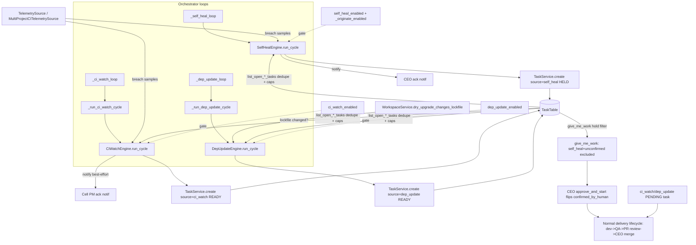

## Purpose
Three default-off background "engine" services that watch CI / dependencies and originate a single PENDING fix task into the normal delivery lifecycle, then stop. SelfHealEngine watches RoboCo's OWN repo CI and (behind a second opt-in) opens a CEO-held fix task; CiWatchEngine fans that out to every opted-in project; DepUpdateEngine probes whether a dependency upgrade would change lockfiles and opens an "update dependencies" task. All three are detect+originate only — none ever start, approve, merge, or deploy; they flush writes and the orchestrator loop owns the commit.

## Files

| Path | Role | LOC |
|---|---|---|
| /Users/renzof/Documents/GitHub/ZZZ/roboco-master/roboco/roboco/services/self_heal_engine.py | Single-repo self-heal: detect a regression in RoboCo's own CI via telemetry, notify CEO, optionally open a HELD PENDING fix task | 310 |
| /Users/renzof/Documents/GitHub/ZZZ/roboco-master/roboco/roboco/services/ci_watch_engine.py | Multi-repo CI-watch: for each opted-in project whose CI is red, open one READY-to-start PENDING fix task (deduped per git_url) and notify the cell PM | 190 |
| /Users/renzof/Documents/GitHub/ZZZ/roboco-master/roboco/roboco/services/dep_update_engine.py | Dependency-update bot: probe each opted-in project's lockfile for changes and open one READY-to-start PENDING update task per repo | 138 |
| /Users/renzof/Documents/GitHub/ZZZ/roboco-master/roboco/roboco/runtime/orchestrator.py | Owns the three background loops (_self_heal_loop, _ci_watch_loop, _dep_update_loop) that construct the engines, call run_cycle, and commit the session | 0 |
| /Users/renzof/Documents/GitHub/ZZZ/roboco-master/roboco/roboco/services/task.py | Provides SELF_HEAL/CI_WATCH/DEP_UPDATE source tags, list_open_*_tasks dedupe queries, extract_self_heal_fingerprint, and the give_me_work self-heal hold filter | 0 |
| /Users/renzof/Documents/GitHub/ZZZ/roboco-master/roboco/roboco/services/telemetry/source.py | TelemetrySource protocol + GitHubCITelemetrySource (single repo) + MultiProjectCITelemetrySource (fan-out) feeding breach samples to the engines | 0 |

## Key Symbols

| Name | Kind | File:Line | Responsibility |
|---|---|---|---|
| RegressionObservation | dataclass | /Users/renzof/Documents/GitHub/ZZZ/roboco-master/roboco/roboco/services/self_heal_engine.py:54 | Frozen record of one detected regression: fingerprint, signal/repo names, summary/detail/raw_ref |
| _fingerprint | function | /Users/renzof/Documents/GitHub/ZZZ/roboco-master/roboco/roboco/services/self_heal_engine.py:65 | Stable 16-char sha256 prefix of the signal name — the dedupe key for open self-heal fix tasks |
| _NOTIFY_DEDUPE_KEY_PREFIX | constant | /Users/renzof/Documents/GitHub/ZZZ/roboco-master/roboco/roboco/services/self_heal_engine.py:70 | Module-level Redis key prefix for per-fingerprint CEO-notify dedupe ("self_heal:notified:") |
| SelfHealEngine | class | /Users/renzof/Documents/GitHub/ZZZ/roboco-master/roboco/roboco/services/self_heal_engine.py:73 | Detect regressions in RoboCo's own repo, notify CEO, optionally originate a HELD fix task |
| SelfHealEngine.assess | method | /Users/renzof/Documents/GitHub/ZZZ/roboco-master/roboco/roboco/services/self_heal_engine.py:84 | Read telemetry samples, return RegressionObservations for breaches; pure, no side effects |
| SelfHealEngine.run_cycle | method | /Users/renzof/Documents/GitHub/ZZZ/roboco-master/roboco/roboco/services/self_heal_engine.py:103 | Gate on self_heal_enabled, assess, notify CEO per obs (deduped per fingerprint via Redis), optionally originate; returns observations; flushes, caller commits |
| SelfHealEngine._open_self_heal_task_ids_by_fp | method | /Users/renzof/Documents/GitHub/ZZZ/roboco-master/roboco/roboco/services/self_heal_engine.py:145 | Map each open self-heal task's fingerprint to its task id; best-effort (returns {} on DB error) — used to link CEO alert to fix task and corroborate notify dedupe |
| SelfHealEngine._already_notified | method | /Users/renzof/Documents/GitHub/ZZZ/roboco-master/roboco/roboco/services/self_heal_engine.py:166 | Fail-open Redis check: True when the fingerprint was CEO-notified this episode (a Redis outage returns False so the notify fires anyway) |
| SelfHealEngine._mark_notified | method | /Users/renzof/Documents/GitHub/ZZZ/roboco-master/roboco/roboco/services/self_heal_engine.py:184 | Record that this fingerprint was CEO-notified; sets a Redis key with self_heal_notify_dedupe_seconds TTL; best-effort (failure swallowed) |
| SelfHealEngine._dedupe_key | staticmethod | /Users/renzof/Documents/GitHub/ZZZ/roboco-master/roboco/roboco/services/self_heal_engine.py:207 | Build the Redis key _NOTIFY_DEDUPE_KEY_PREFIX + fingerprint |
| SelfHealEngine._originate | method | /Users/renzof/Documents/GitHub/ZZZ/roboco-master/roboco/roboco/services/self_heal_engine.py:210 | Open one PENDING HELD (confirmed_by_human=False) fix task per NEW regression, bounded by per-cycle/rolling caps + fingerprint dedupe |
| get_self_heal_engine | function | /Users/renzof/Documents/GitHub/ZZZ/roboco-master/roboco/roboco/services/self_heal_engine.py:306 | Factory: construct SelfHealEngine bound to a session with optional test source |
| _cell_pm_slug_for | function | /Users/renzof/Documents/GitHub/ZZZ/roboco-master/roboco/roboco/services/ci_watch_engine.py:45 | Resolve the cell-PM agent slug owning a team (e.g. Team.BACKEND -> 'be-pm'), or None |
| CiWatchEngine | class | /Users/renzof/Documents/GitHub/ZZZ/roboco-master/roboco/roboco/services/ci_watch_engine.py:53 | Open a fix task per opted-in project whose CI is red; never merges |
| CiWatchEngine.run_cycle | method | /Users/renzof/Documents/GitHub/ZZZ/roboco-master/roboco/roboco/services/ci_watch_engine.py:62 | Gate on ci_watch_enabled, fetch breaches for the watch set, originate fix tasks; returns opened tasks; flushes, caller commits |
| CiWatchEngine._originate | method | /Users/renzof/Documents/GitHub/ZZZ/roboco-master/roboco/roboco/services/ci_watch_engine.py:78 | Open one ci_watch fix task per NEW red repo bounded by caps; notify the cell PM best-effort per opened task |
| CiWatchEngine._notify_cell_pm | method | /Users/renzof/Documents/GitHub/ZZZ/roboco-master/roboco/roboco/services/ci_watch_engine.py:108 | Best-effort ack notification to the red project's cell PM; failure never rolls back origination |
| CiWatchEngine._should_open | method | /Users/renzof/Documents/GitHub/ZZZ/roboco-master/roboco/roboco/services/ci_watch_engine.py:136 | True when project resolves and has no open ci_watch task for its git_url (monorepo dedupe) |
| CiWatchEngine._open_fix_task | method | /Users/renzof/Documents/GitHub/ZZZ/roboco-master/roboco/roboco/services/ci_watch_engine.py:160 | Create the PENDING READY-to-start (confirmed_by_human=True) Main-PM coordination root fix task |
| get_ci_watch_engine | function | /Users/renzof/Documents/GitHub/ZZZ/roboco-master/roboco/roboco/services/ci_watch_engine.py:198 | Factory: construct CiWatchEngine bound to a session with optional test source |
| DepUpdateEngine | class | /Users/renzof/Documents/GitHub/ZZZ/roboco-master/roboco/roboco/services/dep_update_engine.py:39 | Open an update-dependencies task per opted-in project with lockfile changes available |
| DepUpdateEngine.run_cycle | method | /Users/renzof/Documents/GitHub/ZZZ/roboco-master/roboco/roboco/services/dep_update_engine.py:48 | Gate on dep_update_enabled, probe each project, open tasks bounded by caps; returns opened tasks; flushes, caller commits |
| DepUpdateEngine._eligible | method | /Users/renzof/Documents/GitHub/ZZZ/roboco-master/roboco/roboco/services/dep_update_engine.py:81 | Cheap checks (command set, id present, per-git_url dedupe) then expensive read-only lockfile probe; returns eligibility bool |
| DepUpdateEngine._open_task | method | /Users/renzof/Documents/GitHub/ZZZ/roboco-master/roboco/roboco/services/dep_update_engine.py:96 | Create the PENDING READY-to-start (confirmed_by_human=True) Main-PM coordination root dep-update task |
| get_dep_update_engine | function | /Users/renzof/Documents/GitHub/ZZZ/roboco-master/roboco/roboco/services/dep_update_engine.py:133 | Factory: construct DepUpdateEngine bound to a session with optional test workspace probe |

## Data Flow
Each engine is constructed per-cycle by its orchestrator loop inside a `get_db_context()` session. SelfHealEngine pulls breach samples from a TelemetrySource (GitHubCITelemetrySource for RoboCo's own repo); CiWatchEngine's MultiProjectCITelemetrySource.fetch(projects) takes the watch set the orchestrator loaded; DepUpdateEngine does NOT use telemetry — it calls WorkspaceService.dry_upgrade_changes_lockfile(project) (read-only probe in a throwaway clone). On a breach, each engine calls TaskService.list_open_*_tasks (optionally scoped by git_url for ci_watch/dep_update) to dedupe, checks per-cycle + rolling open-task caps against settings, resolves the target project (self_heal resolves by slug via ProjectService.get_by_slug; ci_watch/dep_update already have the project row), then calls TaskService.create(TaskCreateRequest) with the matching source tag (SELF_HEAL_SOURCE / CI_WATCH_SOURCE / DEP_UPDATE_SOURCE), team=MAIN_PM, assigned_to the main-pm agent UUID, status=PENDING. The self-heal task is HELD (confirmed_by_human=False) and carries a fingerprint via markers.set_self_heal_fingerprint so later cycles see it as already-open; ci_watch and dep_update tasks are READY (confirmed_by_human=True). Self-heal always notifies the CEO via NotificationService.send_ack_notification; ci_watch notifies the red project's cell PM best-effort; dep_update notifies no one. Each engine only flushes; the orchestrator loop commits. The created tasks then ride the normal delivery lifecycle — give_me_work offers ci_watch/dep_update tasks immediately, but excludes source=self_heal + confirmed_by_human=False tasks until the CEO's approve_and_start flips the flag (task.py line ~7304).

## Mermaid


## Logical Tree
```
engines-heal-ciwatch-depupdate
  SelfHealEngine (roboco/services/self_heal_engine.py)
    RegressionObservation (frozen dataclass: fingerprint, signal_name, repo_hint, summary, detail, raw_ref)
    _fingerprint(signal_name) -> 16-char sha256 prefix
    _NOTIFY_DEDUPE_KEY_PREFIX = "self_heal:notified:"
    __init__(session, source=None) -> binds TelemetrySource
    assess() -> [RegressionObservation] for breaches (pure)
    run_cycle() -> gates on self_heal_enabled; assess; notify CEO deduped per fingerprint via Redis; optionally _originate
    _open_self_heal_task_ids_by_fp() -> {fingerprint: task_id} for open self-heal tasks; best-effort
    _already_notified(fingerprint) -> bool; fail-open Redis check
    _mark_notified(fingerprint) -> set Redis key with notify_dedupe_seconds TTL; best-effort
    _dedupe_key(fingerprint) -> Redis key string
    _originate(observations) -> dedupe by fingerprint + caps; create HELD PENDING task; set_self_heal_fingerprint
    get_self_heal_engine(session, source=None)
  CiWatchEngine (roboco/services/ci_watch_engine.py)
    _cell_pm_slug_for(team) -> cell PM slug
    __init__(session, source=None) -> binds MultiProjectCITelemetrySource
    run_cycle(projects) -> gates on ci_watch_enabled; fetch breaches; _originate
    _originate(breaches, by_slug) -> per-repo dedupe + caps; _open_fix_task + _notify_cell_pm
    _notify_cell_pm(project, sample) -> best-effort ack to cell PM
    _should_open(task_svc, project) -> project resolves + no open task for git_url
    _open_fix_task(task_svc, project, sample) -> create READY PENDING Main-PM root
    get_ci_watch_engine(session, source=None)
  DepUpdateEngine (roboco/services/dep_update_engine.py)
    __init__(session, workspace=None) -> binds WorkspaceService
    run_cycle(projects) -> gates on dep_update_enabled; per-project probe; _open_task
    _eligible(task_svc, project) -> command set + id + git_url dedupe + dry_upgrade_changes_lockfile
    _open_task(task_svc, project) -> create READY PENDING Main-PM root
    get_dep_update_engine(session, workspace=None)
  Orchestrator loops (roboco/runtime/orchestrator.py)
    _self_heal_loop -> get_self_heal_engine(db).run_cycle() + db.commit()
    _ci_watch_loop -> _run_ci_watch_cycle -> _load_ci_watch_set (one per (repo, effective workflow)) + get_ci_watch_engine(db).run_cycle(watch_set) + db.commit()
    _dep_update_loop -> _run_dep_update_cycle -> _load_dep_update_set + get_dep_update_engine(db).run_cycle(projects) + db.commit()
```

## Dependencies
- Internal: roboco.config.settings, roboco.foundation.identity (AGENTS, Role), roboco.foundation.policy.content.markers (set_self_heal_fingerprint), roboco.models.base (Complexity, TaskNature, TaskStatus, TaskType, Team), roboco.services.base.BaseService, roboco.services.notification.NotificationService, roboco.services.project.get_project_service, roboco.services.task (TaskService, TaskCreateRequest, SELF_HEAL_SOURCE, CI_WATCH_SOURCE, DEP_UPDATE_SOURCE, extract_self_heal_fingerprint, get_task_service), roboco.services.telemetry (get_ci_telemetry_source), roboco.services.telemetry.source (get_multi_ci_telemetry_source), roboco.services.workspace.get_workspace_service (dry_upgrade_changes_lockfile), roboco.runtime.orchestrator (the three loops), roboco.db.get_db_context
- External: sqlalchemy.ext.asyncio.AsyncSession, asyncio, hashlib, dataclasses, typing

## Entry Points

| Name | File | Trigger |
|---|---|---|
| _self_heal_loop | /Users/renzof/Documents/GitHub/ZZZ/roboco-master/roboco/roboco/runtime/orchestrator.py | asyncio.create_task at orchestrator start() (line 1012); sleeps self_heal_interval_seconds, opens a DB session, calls SelfHealEngine.run_cycle, commits; early-returns when self_heal_enabled is False |
| _ci_watch_loop | /Users/renzof/Documents/GitHub/ZZZ/roboco-master/roboco/roboco/runtime/orchestrator.py | asyncio.create_task at orchestrator start() (line 1013); sleeps ci_watch_interval_seconds, runs _run_ci_watch_cycle (loads watch set, runs CiWatchEngine.run_cycle, commits); early-returns when ci_watch_enabled is False |
| _dep_update_loop | /Users/renzof/Documents/GitHub/ZZZ/roboco-master/roboco/roboco/runtime/orchestrator.py | asyncio.create_task at orchestrator start() (line 1014); sleeps dep_update_interval_seconds, runs _run_dep_update_cycle (loads eligible projects, runs DepUpdateEngine.run_cycle, commits); early-returns when dep_update_enabled is False |

## Config Flags
- ROBOCO_SELF_HEAL_ENABLED (self_heal_enabled) — master switch for the self-heal loop
- ROBOCO_SELF_HEAL_ORIGINATE_ENABLED (self_heal_originate_enabled) — second opt-in: actually open a fix task (notify-only otherwise)
- ROBOCO_SELF_HEAL_PROJECT_SLUG (self_heal_project_slug) — the single repo self-heal targets
- ROBOCO_SELF_HEAL_CI_WORKFLOW (self_heal_ci_workflow) — CI workflow name for the self-heal telemetry source
- ROBOCO_SELF_HEAL_INTERVAL_SECONDS (self_heal_interval_seconds) — loop period
- ROBOCO_SELF_HEAL_MAX_OPEN_TASKS (self_heal_max_open_tasks) — rolling open-task cap
- ROBOCO_SELF_HEAL_MAX_PER_CYCLE (self_heal_max_per_cycle) — per-cycle origination cap
- ROBOCO_SELF_HEAL_NOTIFY_DEDUPE_SECONDS (self_heal_notify_dedupe_seconds, default 7200) — per-fingerprint CEO-notify dedupe window; a regression that stays red notifies once per episode, not every tick; the key expires after this window so a recurrence notifies again; fail-open (Redis outage still lets the notify through)
- ROBOCO_CI_WATCH_ENABLED (ci_watch_enabled) — master switch for multi-repo CI-watch
- ROBOCO_CI_WATCH_DEFAULT_WORKFLOW (ci_watch_default_workflow) — fallback workflow when a project sets none
- ROBOCO_CI_WATCH_INTERVAL_SECONDS (ci_watch_interval_seconds)
- ROBOCO_CI_WATCH_MAX_OPEN_TASKS (ci_watch_max_open_tasks)
- ROBOCO_CI_WATCH_MAX_PER_CYCLE (ci_watch_max_per_cycle)
- ROBOCO_DEP_UPDATE_ENABLED (dep_update_enabled) — master switch for the dep-update bot
- ROBOCO_DEP_UPDATE_INTERVAL_SECONDS (dep_update_interval_seconds, default 604800 = weekly)
- ROBOCO_DEP_UPDATE_MAX_OPEN_TASKS (dep_update_max_open_tasks)
- ROBOCO_DEP_UPDATE_MAX_PER_CYCLE (dep_update_max_per_cycle)
- per-project projects.ci_watch_enabled / ci_watch_workflow / dep_update_command / assigned_cell (DB columns)


## Gotchas
- SelfHealEngine.run_cycle dedupes CEO notifications per fingerprint via Redis (_already_notified / _mark_notified): a regression that stays red across cycles pings the CEO once per episode, not every tick. The check fails open — a Redis outage returns False so the notify still fires (never a swallowed regression). The dedupe key TTL is self_heal_notify_dedupe_seconds (default 7200s), so a regression that clears and recurs within the window is not re-notified (expected: a cleared regression lifts the red signal and a new episode resets the key). The notification layer's purpose-dedup is now a belt-and-suspenders rather than the sole guard.
- SelfHealEngine._originate dedupes by the fingerprint carried in orchestration_markers (extract_self_heal_fingerprint); ci_watch and dep_update instead dedupe by git_url via list_open_*_tasks(git_url=...). The two mechanisms are independent — a self-heal task and a ci_watch task for the same repo are NOT deduped against each other (different source tags).
- Self-heal tasks are created HELD (confirmed_by_human=False) and excluded from give_me_work until the CEO approves; ci_watch and dep_update tasks are created READY (confirmed_by_human=True) and dispatch immediately. A wrong flag here would either strand a fix or auto-dispatch a held one.
- The engines only flush; the orchestrator loop commits. An exception between flush and commit (or a crashed loop iteration logged but swallowed at orchestrator.py 'cycle failed') loses the opened task rows — but they were already flushed into the session that is rolled back on the next get_db_context exit.
- CiWatchEngine._should_open now dedupes per (git_url, effective workflow): a same-workflow monorepo (several cell-projects on one repo) still collapses to one fix task, but two RED workflows of the same repo each get their own fix task (#44, fixed in 536bbb64). The effective workflow is ci_watch_workflow falling back to ci_watch_default_workflow; an empty-string ci_watch_workflow is treated as NULL via SQL NULLIF (d34bc1a7) so it correctly collapses to the default rather than opening a spurious second task.
- DepUpdateEngine._eligible orders cheap checks (command set, id, git_url dedupe) before the expensive dry_upgrade_changes_lockfile probe — but the per-cycle and rolling caps in run_cycle are checked BEFORE _eligible, so a project that fails eligibility still consumed a loop slot but did not consume a cap slot.
- _fingerprint hashes only signal_name (which 'already encodes the repo') — if two distinct regressions share a signal_name on the same repo they collide and the second is deduped away.
- Cell PM notification (ci_watch) is best-effort and catches Exception broadly; a notification failure logs a warning but never rolls back the already-flushed task, so a fix task can exist with no PM ping.
- _cell_pm_slug_for iterates _foundation.AGENTS.values() looking for role==CELL_PM and team==team; if the org config has no cell PM for an assigned_cell, the notification is silently skipped (pm_slug None -> return).
- SelfHealEngine.assess is pure but run_cycle constructs NotificationService() with no session — relies on NotificationService resolving its own session; if it ever needs the engine's session the wiring would break.


## Drift from CLAUDE.md
- CLAUDE.md says ci_watch 'reuses the exact hardened per-project GitService.get_latest_ci_conclusion' — the engines themselves do not call GitService; they consume breaches via MultiProjectCITelemetrySource.fetch(projects) in roboco/services/telemetry/source.py. The GitService call is inside the telemetry source, not in ci_watch_engine.py. Minor framing drift, not a code bug.
- CLAUDE.md says dep-update 'Detection is read-only ... WorkspaceService.dry_upgrade_changes_lockfile runs the project's dep_update_command in a throwaway clone of the read clone'. The engine calls self._workspace.dry_upgrade_changes_lockfile(project) but the engine file itself does not reference a 'read clone'; that detail lives in WorkspaceService. Accurate at the system level, not visible in this slice.
- CLAUDE.md states self-heal 'terminates at awaiting_ceo_approval'. The engine itself only creates a PENDING confirmed_by_human=False task; the awaiting_ceo_approval terminal is reached later by the normal lifecycle, not by any code in self_heal_engine.py. Consistent but the engine does not enforce the terminal state itself.


## Changes Since Baseline

| SHA | Subject | Impact |
|---|---|---|
| 15effce0 | Chore: 141 Gaps fill-in (#283) | Single commit touching all three engine files (self_heal +45/-, ci_watch 20 lines tweaked, dep_update 14 lines). Docstring/comment tightening and minor structural cleanup across the three engines — no behavior change to the originate/dedupe/cap logic. Diffstat: 46 insertions, 33 deletions across the three files. |

> Post-snapshot updates (since 2026-06-29):
> - **536bbb64** (Chore/all/logical gaps sweep, #286) — two behavior changes to engine files: (1) self_heal_engine.py: added per-fingerprint Redis CEO-notify dedupe (_NOTIFY_DEDUPE_KEY_PREFIX constant + _open_self_heal_task_ids_by_fp / _already_notified / _mark_notified / _dedupe_key methods); run_cycle now skips a CEO ping when the fingerprint was already notified this episode; also links the alert to the open fix task via task_id. LOC grew 227→310. (2) ci_watch_engine.py: _should_open now dedupes per (git_url, effective workflow) instead of just git_url — two red workflows of one monorepo each get their own fix task.
> - **d34bc1a7** ([chore] ci-watch/dep-update dedupe: normalize git_url + treat empty-string workflow as default, #148 #1267) — touched task.py and orchestrator.py (NOT the engine files directly): list_open_ci_watch_tasks and list_open_dep_update_tasks now normalize git_url via repo_key SQL mirror (regexp_replace/rtrim/lower) so URL accidentals (.git suffix, trailing slash, case) don't defeat the one-open-task-per-repo invariant; ci_watch workflow dedupe wraps with NULLIF so an empty-string ci_watch_workflow collapses to the default instead of opening a duplicate task every red cycle.

## Regression Risks

| Title | File:Line | Claim | Severity |
|---|---|---|---|
| ~~Self-heal CEO notification spam — no engine-level dedupe~~ **RESOLVED 536bbb64** | /Users/renzof/Documents/GitHub/ZZZ/roboco-master/roboco/roboco/services/self_heal_engine.py:103 | ~~run_cycle notifies the CEO for EVERY observation EVERY cycle while a regression stays red.~~ Fixed in 536bbb64 (logical-gaps sweep): run_cycle now dedupes per fingerprint via Redis (_already_notified / _mark_notified with self_heal_notify_dedupe_seconds TTL, default 7200s). A persistent red regression pings the CEO once per episode; the check fails open (Redis outage = notify fires anyway). | medium |
| ~~ci_watch per-(repo,workflow) collapse vs per-git_url dedupe under-counts multi-workflow monorepos~~ **RESOLVED 536bbb64** | /Users/renzof/Documents/GitHub/ZZZ/roboco-master/roboco/roboco/services/ci_watch_engine.py:137 | ~~_should_open dedupes by git_url only~~ Fixed in 536bbb64: _should_open now dedupes per (git_url, effective workflow), so two red workflows of one monorepo each get their own fix task. The d34bc1a7 companion normalizes git_url with repo_key in the DB query and adds NULLIF for empty-string workflows so the SQL matches Python truthiness collapse. | medium |
| Cap-check ordering in dep_update lets a non-eligible project consume a loop slot but not a cap slot | /Users/renzof/Documents/GitHub/ZZZ/roboco-master/roboco/roboco/services/dep_update_engine.py:60 | run_cycle checks per-cycle/rolling caps BEFORE _eligible; a project that fails eligibility (no lockfile change) does not increment open_count, so caps are only consumed by real originations. Correct, but means the expensive dry_upgrade_changes_lockfile probe runs on every eligible project each cycle regardless of how many tasks already opened this cycle until the cap is hit — minor wasted probe cost, not a correctness bug. | low |
| ci_watch cell-PM notify swallows all exceptions after task creation | /Users/renzof/Documents/GitHub/ZZZ/roboco-master/roboco/roboco/services/ci_watch_engine.py:129 | _notify_cell_pm catches Exception broadly and only logs a warning. A task is already flushed before the notify, so a notification failure leaves an orphan fix task with no PM ping. Best-effort by design, but the broad except could mask a persistent notification-service outage as a series of warnings. | low |
| Self-heal fingerprint collision on shared signal_name | /Users/renzof/Documents/GitHub/ZZZ/roboco-master/roboco/roboco/services/self_heal_engine.py:65 | _fingerprint hashes only signal_name. Two distinct regressions on the same repo with the same signal_name collide; the second is deduped away and never gets a fix task. Unlikely in practice but a latent correctness gap. | low |

## Health
All three engines are small, single-purpose, and follow a deliberately conservative pattern: gate on a default-off flag, read-only detect, bounded+deduped originate of one PENDING task, flush-only (caller commits), never start/approve/merge/deploy. The safety invariants (self_heal HELD behind CEO approve; ci_watch/dep_update READY but ride normal gates; per-git_url dedupe for monorepos; per-cycle + rolling caps) are intact and consistent with CLAUDE.md. Two medium risks present at baseline are now resolved: CEO notify spam (536bbb64 added Redis per-fingerprint dedupe) and multi-workflow monorepo under-count (536bbb64 changed _should_open to dedupe per (git_url, workflow); d34bc1a7 hardened the SQL to normalize git_url accidentals and treat empty-string workflow as NULL). Remaining standing risks are low-severity: fingerprint collision on shared signal_name, dep_update cap-check ordering (non-eligibles consume a loop slot not a cap slot), and ci_watch cell-PM notify swallowing all exceptions. Health is good.
