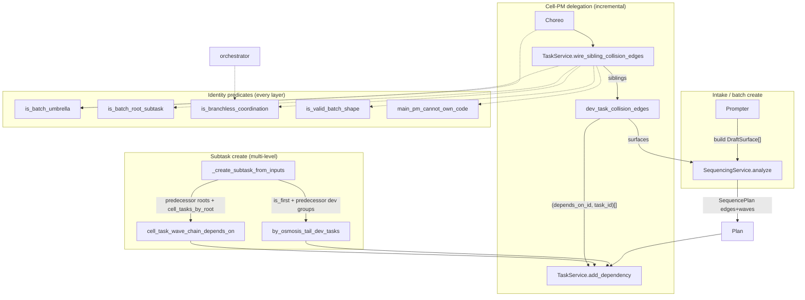

## Purpose
The pure policy + deterministic analyzer behind MegaTask (sequenced batch intake). batch.py is the single source of truth for umbrella/root-subtask identity and git-exemption predicates every layer consults. sequencing.models.py carries the DraftSurface/SequencePlan dataclasses. services/sequencing.py turns declared collision surfaces into a dependency DAG + Kahn-layered waves, and exposes the dev-task collision-DAG and multi-level (cell-task wave-chain + by-osmosis) edge helpers the choreographer wires through add_dependency.

## Files

| Path | Role | LOC |
|---|---|---|
| roboco/foundation/policy/batch.py | Pure identity + git-exemption predicates for MegaTask umbrellas/root-subtasks (branchless, shape guardrail, main_pm+code impossibility) | 153 |
| roboco/foundation/policy/sequencing/__init__.py | Re-export surface for the sequencing schema dataclasses | 18 |
| roboco/foundation/policy/sequencing/models.py | Pure dataclasses: DraftSurface (one task's collision surface), SequencePlan (edges+waves+warnings), SequencingError | 52 |
| roboco/services/sequencing.py | Deterministic collision-sequencing analyzer (SequencingService) + dev_task_collision_edges glue + multi-level edge helpers (cell_task_wave_chain_depends_on, by_osmosis_tail_dev_tasks) | 366 |

## Key Symbols

| Name | Kind | File:Line | Responsibility |
|---|---|---|---|
| is_batch_umbrella | function | roboco/foundation/policy/batch.py:21 | True when batch_id set AND parent_task_id None (the umbrella, top-level batch identity) |
| is_batch_root_subtask | function | roboco/foundation/policy/batch.py:33 | True when batch_id set AND parented (a batch item under the umbrella) |
| is_branchless_coordination | function | roboco/foundation/policy/batch.py:40 | True for a task that does no git of its own: product fan-out root, ad-hoc cell-map root, or MegaTask umbrella |
| is_valid_batch_shape | function | roboco/foundation/policy/batch.py:71 | Creation-time guardrail: a batch_id is valid only on umbrella (zero targets) or root-subtask (exactly one target) |
| main_pm_cannot_own_code | function | roboco/foundation/policy/batch.py:105 | True when team==main_pm AND task_type==code — the structural mismatch that caused the 2026-06-27 MegaTask meltdown |
| pm_cannot_own_code | function | roboco/foundation/policy/batch.py:129 | Broader guard: True when role is cell_pm OR main_pm AND task_type==code AND NOT is_issue_resolution — extends the main_pm guard to cell_pm and adds a deliberate carve-out for PMs resolving QA/review issues directly (needs_revision tasks); single source of truth for create/delegate/claim-spec gate |
| SequencingError | class | roboco/foundation/policy/sequencing/models.py:15 | ValueError raised when the collision graph has a cycle or an out-of-range edge |
| DraftSurface | class | roboco/foundation/policy/sequencing/models.py:21 | Dataclass: one proposed task's collision surface (idx, priority, intends_to_touch globs, adds_migration, touches_shared, project_id) |
| SequencePlan | class | roboco/foundation/policy/sequencing/models.py:40 | Dataclass: analyzer output — edges (a,b)=b depends on a, Kahn waves, non-blocking warnings |
| SequencingService | class | roboco/services/sequencing.py:41 | Pure collision-sequencing analyzer; analyze() is the only public entry point |
| SequencingService.analyze | method | roboco/services/sequencing.py:44 | Compute deduped edges (file-overlap + migration-chain + shared-last), toposort into waves, emit contention warnings |
| SequencingService._file_overlap_edges | method | roboco/services/sequencing.py:61 | Rule 1: overlapping same-repo, same-sharedness surfaces serialize, more-important (priority,idx) first; mixed sharedness left to rule 3 |
| SequencingService._migration_chain_edges | staticmethod | roboco/services/sequencing.py:78 | Rule 2: per-project, adds_migration drafts chain serially by (touches_shared, priority, idx) via pairwise |
| SequencingService._shared_last_edges | method | roboco/services/sequencing.py:97 | Rule 3: each touches_shared draft runs after every overlapping non-shared draft in the same repo |
| SequencingService._contention_warnings | staticmethod | roboco/services/sequencing.py:113 | Rule 4: per-wave per-cell count over capacity emits a warning string (never an edge) |
| SequencingService._toposort | method | roboco/services/sequencing.py:133 | Range-check edges, build graph, Kahn-layer into waves; raise SequencingError on cycle |
| SequencingService._check_edges_in_range | staticmethod | roboco/services/sequencing.py:139 | Raise SequencingError if any edge endpoint is outside 0..n-1 |
| SequencingService._build_graph | staticmethod | roboco/services/sequencing.py:147 | Build indegree array + adjacency dict from edges |
| SequencingService._kahn_layers | method | roboco/services/sequencing.py:158 | Repeatedly take sorted indeg==0 nodes as a wave, relax, until empty; cycle if no ready node |
| SequencingService._relax | staticmethod | roboco/services/sequencing.py:172 | Decrement indegree of neighbors of each ready node |
| SequencingService._order_edge | staticmethod | roboco/services/sequencing.py:179 | Return edge (first.idx, second.idx) with more-important (lower (priority,idx)) first |
| SequencingService._globs_overlap | staticmethod | roboco/services/sequencing.py:185 | True if any path pair overlaps by equality, fnmatch either direction, or directory-prefix containment |
| SequencingService._dedupe | staticmethod | roboco/services/sequencing.py:199 | Order-preserving dedupe of edges by set membership |
| _surfaced_siblings | function | roboco/services/sequencing.py:218 | Filter siblings to those with a project_id and at least one collision-surface field |
| _same_assignee_lane_edges | function | roboco/services/sequencing.py:233 | Undeclared-surface fallback extracted from dev_task_collision_edges (post-snapshot 536bbb64): chain each (project_id, assigned_to) lane by (priority, sequence); same stable sort ensures re-runs only add edges, never reverse; scoped to same-assignee so cross-dev parallel work is untouched |
| dev_task_collision_edges | function | roboco/services/sequencing.py:259 | Edge kind 3: turn a parent's surfaced siblings into (depends_on_id, task_id) pairs via SequencingService; undeclared-surface same-assignee lane fallback via _same_assignee_lane_edges |
| cell_task_wave_chain_depends_on | function | roboco/services/sequencing.py:328 | Edge kind 2: cell-task IDs a new cell-task should depend on (every cell-task under each predecessor root-subtask) |
| by_osmosis_tail_dev_tasks | function | roboco/services/sequencing.py:350 | Edge kind 4: tail (max-sequence) dev-task IDs under each predecessor cell-task, only for the first dev task (sequence 0) |

## Data Flow
Inputs arrive two ways. (1) Intake/batch-create: the Prompter builds DraftSurface objects from the proposed batch drafts (intends_to_touch globs, adds_migration, touches_shared, project_id), calls SequencingService().analyze(surfaces, cell_of, cell_capacity) to get a SequencePlan (edges+waves+warnings), then PrompterService.confirm_live_batch wires the kind-1 root-subtask wave-chain edges through TaskService.add_dependency. (2) Incremental delegation in the choreographer: after a cell-PM delegates a dev task, TaskService.wire_sibling_collision_edges (task.py:6206) gathers the parent's surfaced siblings and calls dev_task_collision_edges(siblings), which builds DraftSurfaces ordered by (priority, sequence), runs SequencingService.analyze with an empty cell_capacity (warnings suppressed), maps the resulting (a,b) edge indices back to sibling ids, and returns (depends_on_id, task_id) pairs the choreographer persists via add_dependency. If zero declared-surface edges are produced, dev_task_collision_edges falls back to chaining each same-(project_id, assignee) lane by (priority, sequence). Multi-level edges: cell_task_wave_chain_depends_on and by_osmosis_tail_dev_tasks are pure helpers called from TaskService._create_subtask_from_inputs (task.py:6232/6268) with predecessor root/cell/dev task objects gathered by the choreographer; their returned ids are wired through add_dependency. Identity predicates (batch.py) are called synchronously at every layer: TaskService.create/reassign/escalation/submit_root/complete, the orchestrator's _is_coordination_task, the git branch gate, and the choreographer's umbrella checks — all pass the task's batch_id/parent_task_id/project_id/product_id/has_cell_projects to the same pure functions so exemptions cannot drift between sites.

## Mermaid


## Logical Tree
```
foundation-batch-sequencing
  roboco/foundation/policy/batch.py (identity + git-exemption predicates)
    is_batch_umbrella
    is_batch_root_subtask
    is_branchless_coordination
      -> product fan-out (no project, has product)
      -> ad-hoc cell-map (no project, no product, has_cell_projects)
      -> umbrella (delegates to is_batch_umbrella)
    is_valid_batch_shape (creation-time guardrail)
      -> umbrella: targets == 0
      -> root-subtask: targets == 1
    main_pm_cannot_own_code
    pm_cannot_own_code (+ is_issue_resolution carve-out; covers cell_pm too)
  roboco/foundation/policy/sequencing/
    __init__.py (re-exports)
    models.py (pure schema)
      SequencingError
      DraftSurface (idx, priority, intends_to_touch, adds_migration, touches_shared, project_id)
      SequencePlan (edges, waves, warnings)
  roboco/services/sequencing.py (deterministic analyzer + glue)
    SequencingService
      analyze
      _file_overlap_edges (rule 1)
      _migration_chain_edges (rule 2)
      _shared_last_edges (rule 3)
      _contention_warnings (rule 4)
      _toposort / _check_edges_in_range / _build_graph / _kahn_layers / _relax
      _order_edge / _globs_overlap / _dedupe
    _surfaced_siblings
    _same_assignee_lane_edges (undeclared-surface fallback, extracted post-snapshot)
    dev_task_collision_edges (kind 3 + undeclared-surface same-assignee lane fallback via _same_assignee_lane_edges)
    cell_task_wave_chain_depends_on (kind 2)
    by_osmosis_tail_dev_tasks (kind 4)
```

## Dependencies
- Internal: roboco.models.base.TaskType, roboco.models.base.Team, roboco.foundation.policy.sequencing.models.DraftSurface, roboco.foundation.policy.sequencing.models.SequencePlan, roboco.foundation.policy.sequencing.models.SequencingError, roboco.services.task.TaskService.add_dependency, roboco.services.task.TaskService.wire_sibling_collision_edges, roboco.services.task.TaskService._create_subtask_from_inputs, roboco.services.prompter.PrompterService.confirm_live_batch, roboco.services.gateway.choreographer._impl, roboco.runtime.orchestrator._is_coordination_task, roboco.db.tables.TaskTable (batch_id / intends_to_touch / adds_migration / touches_shared / task_cell_projects columns, migration 046/052)
- External: collections.defaultdict, collections.abc.Callable, dataclasses.dataclass / field, fnmatch.fnmatch, itertools.pairwise, typing.TYPE_CHECKING

## Entry Points

| Name | File | Trigger |
|---|---|---|
| PrompterService.confirm_live_batch / _sequence_batch | roboco/services/prompter.py | POST /prompter/live/{session}/confirm-batch (CEO confirms a MegaTask review card); builds DraftSurfaces and calls SequencingService.analyze to wire kind-1 root-subtask edges |
| TaskService.wire_sibling_collision_edges | roboco/services/task.py:6206 | choreographer after each cell-PM dev-task delegate; calls dev_task_collision_edges and add_dependency |
| TaskService._create_subtask_from_inputs | roboco/services/task.py:6232/6268 | choreographer subtask creation; calls cell_task_wave_chain_depends_on (MAIN_PM parent) and by_osmosis_tail_dev_tasks (cell-team parent) |
| orchestrator._is_coordination_task | roboco/runtime/orchestrator.py:409 | spawn / dispatch tick; consults is_branchless_coordination |
| TaskService.create / reassign / submit_root / complete / escalation | roboco/services/task.py | gateway verbs (i_will_plan, delegate, submit_root, complete, escalate_up, reassign); consult is_batch_umbrella / is_valid_batch_shape / main_pm_cannot_own_code |

## Gotchas
- dev_task_collision_edges fallback is gated on ZERO declared-surface edges (sequencing.py:285 `if edges: return edges`). A batch with even one declared collision pair will NOT chain the same-assignee lane, so two undeclared-surface siblings delegated to one dev can still start out of order if a third sibling declared a surface. The fallback is all-or-nothing per parent.
- Stable ordering depends on `sequence` being append-only and never reused; if a sibling is deleted and its sequence number recycled, re-running dev_task_collision_edges could flip an existing pair into a reverse edge and cycle the DAG. The code trusts this invariant without enforcing it here.
- is_branchless_coordination trusts the creation-time is_valid_batch_shape invariant — a normal task cannot spoof the umbrella exemption by attaching a batch_id because create() rejects it. Any code path that sets batch_id WITHOUT going through is_valid_batch_shape (bulk SQL, a future migration backfill) would punch a hole in the branch gate.
- Rule 1 (_file_overlap_edges) skips mixed sharedness pairs (line 71) and hands them to rule 3; but rule 3 only emits an edge when the NON-shared draft overlaps the shared one. If two drafts overlap but neither touches_shared AND sharedness differs, no edge is emitted at all — but that case is impossible (sharedness differs means one is shared), so the skip is safe. Subtle: rule 1's `a.touches_shared != b.touches_shared` means two shared drafts DO collide under rule 1, only shared-vs-non-shared is deferred.
- Migration chain orders by (touches_shared, priority, idx) so non-shared migrations run before shared ones to avoid contradicting rule 3 into a cycle — this coupling between rules 2 and 3 is load-bearing; reordering the sort key would reintroduce cycles.
- SequencingService().analyze in dev_task_collision_edges is called with cell_capacity={} so no contention warnings are ever emitted from the dev-task path — only the intake path supplies real capacity. Don't expect dev-task wiring to surface cell contention.
- _globs_overlap uses fnmatch in BOTH directions plus prefix containment; a broad glob like `src/**` in one draft and `src/foo.py` in another will match — intentional over-serialization, but a too-broad intends_to_touch silently serializes the whole batch.
- Kahn layers sort ready nodes by index (sorted(i for i in remaining...)) so wave ordering is deterministic but NOT by priority — priority only affects edge direction, not intra-wave order. Callers that read wave[0] as 'most important' are wrong.
- by_osmosis_tail_dev_tasks returns [] for non-first dev tasks (sequence != 0); if a cell-task's first dev task is later deleted, the next dev task (now sequence 0 after re-index) does NOT get re-wired because the helper is only called at creation time. Stale edges are not refreshed.


## Drift from CLAUDE.md
- CLAUDE.md describes the sequencing rules as 'file-overlap serializes (more-important first by (priority, idx))' — matches code. But it does NOT mention the undeclared-surface same-assignee lane fallback added in a957e4fa (sequencing.py:292-309), a real behavior change since the baseline.
- CLAUDE.md's identity predicate list says is_branchless_coordination = '((no-project AND product) OR umbrella)'. The code ALSO admits an ad-hoc per-cell map root (no-project, no-product, has_cell_projects) added in c03e76c4 (batch.py:66-67). The doc omits the cell-map shape.
- CLAUDE.md does not mention is_valid_batch_shape or main_pm_cannot_own_code at all, though both are first-class predicates in batch.py (lines 71, 104) and are load-bearing guardrails (the latter is the 2026-06-27 meltdown fix).
- CLAUDE.md's sequencing section lists only the root-level DAG (kind 1). The code now wires kinds 2, 3, 4 (cell_task_wave_chain_depends_on, dev_task_collision_edges, by_osmosis_tail_dev_tasks) added in 12621a36 / 9927d248 — undocumented in CLAUDE.md.


## Changes Since Baseline

| SHA | Subject | Impact |
|---|---|---|
| c03e76c4 | feat(megatask): per-cell project map root-subtasks (multi-project, multi-cell) | Added has_cell_projects param to is_branchless_coordination + is_valid_batch_shape (batch.py:40-101); a root-subtask may target an ad-hoc per-cell project map as a third branchless-coordination shape; umbrella still must target zero. Batch predicates gained a parameter every call site must pass. |
| e202ce39 | Fix: Make main_pm + task_type=code impossible | Added main_pm_cannot_own_code predicate (batch.py:104-125) — the structural-mismatch guard behind the 2026-06-27 MegaTask meltdown; consulted at create/reassign/escalation/claim. |
| 12621a36 | [feature] wire dev-task collision DAG at cell-PM delegation (sequencing S2) | Added _surfaced_siblings + dev_task_collision_edges (sequencing.py:218-309) — turns a parent's surfaced siblings into (depends_on_id, task_id) pairs via SequencingService, wired incrementally after each delegate; stable (priority, sequence) sort keeps re-runs from flipping edges into reverse cycles. |
| 9927d248 | [feature] wire cell-task wave chain + by-osmosis edge (sequencing S3) | Added cell_task_wave_chain_depends_on (kind 2) + by_osmosis_tail_dev_tasks (kind 4) (sequencing.py:320-365) — multi-level edges wired from _create_subtask_from_inputs so a new wave's branch carries the previous wave's merged tail. |
| 3a4a3fe5 | [refactor] reduce xenon C-rank blocks to A (behavior-preserving) | Behavior-preserving refactor of sequencing.py to cut xenon complexity (split methods); no semantic change. |
| a957e4fa | [chore] sequencing: chain undeclared-surface same-assignee dev siblings + trim re-fire guard comments | dev_task_collision_edges now falls back (only with zero declared-surface edges) to chaining each same-(project_id, assignee) lane by (priority, sequence) — closes the out-of-order start wedge when a PM delegates two surface-less dev tasks to the same developer. |

> Post-snapshot updates (since 2026-06-29): three PR merges touched this slice.
> - **15effce0** "Chore: 141 Gaps fill-in (#283)" (2026-06-29 05:38) — bundled the per-cell project map feature; already captured above via its constituent commit SHAs (c03e76c4 / e202ce39 / 12621a36 / 9927d248 / 3a4a3fe5 / a957e4fa).
> - **3aff6e04** "Chore: Close gaps (#285)" (2026-06-29 11:32) — no change to batch.py or sequencing.py; panel / migration 052 enum fix / MegaTask verification fixes only.
> - **536bbb64** "Chore/all/logical gaps sweep (#286)" (2026-06-30 08:08) — two changes to this slice: (1) `pm_cannot_own_code(role, task_type, is_issue_resolution)` added to batch.py at line 129 — broader guard covering both PM roles with an is_issue_resolution carve-out, now the single source of truth for create/delegate/claim-spec gate; (2) the same-assignee lane fallback previously inline in `dev_task_collision_edges` was extracted to `_same_assignee_lane_edges` at sequencing.py:233, shifting `dev_task_collision_edges` to :259 and the multi-level helpers to :328/:350; (3) `.lower()` added to `main_pm_cannot_own_code` comparands, mitigating the casing regression risk.

## Regression Risks

| Title | File:Line | Claim | Severity |
|---|---|---|---|
| Fallback masks cross-cell same-assignee chain when one sibling declares a surface | roboco/services/sequencing.py:285 | The same-assignee lane fallback only runs when `if edges: return edges` is false — i.e. ZERO declared-surface edges. If a parent has 3 siblings where only one pair shares a declared surface, the fallback never runs, so two OTHER same-assignee surface-less siblings won't be chained and can start out of order. The all-or-nothing gate under-protects mixed batches. | medium |
| by_osmosis edge not refreshed when first dev task is deleted | roboco/services/sequencing.py:357 | by_osmosis_tail_dev_tasks returns [] for non-first dev tasks and is only called at creation time. If sequence-0 dev task is later deleted/cancelled, the new de-facto first dev task (now lowest sequence) is never re-wired with the predecessor tail, so its branch may be cut without the previous wave's merged tail — a silent merge-conflict risk on wave N>0. | medium |
| Rule 1 + rule 3 interaction can drop an edge for shared-vs-shared overlap | roboco/services/sequencing.py:71 | _file_overlap_edges only skips when `a.touches_shared != b.touches_shared` (mixed). Two shared drafts that overlap DO get a rule-1 edge ordered by (priority, idx) — but rule 3 emits NO edge between two shared drafts (line 103 skips `other.touches_shared`). If rule 1's (priority, idx) ordering contradicts another constraint the shared pair could be ordered against the grain. Currently safe because shared-vs-shared has no shared-last constraint, but a future rule 3 extension could silently cycle. | low |
| has_cell_projects threaded incorrectly at any call site breaks branchless exemption | roboco/foundation/policy/batch.py:66 | is_branchless_coordination now requires callers to pass has_cell_projects. A call site that omits it (defaults False) for a cell-map root will NOT recognize it as branchless and will demand a branch/PR the root cannot supply — wedging that root in the git gate. Verified sites: task.py:597, orchestrator.py:409. Any new call site is a landmine. | high |
| main_pm_cannot_own_code accepts both ORM enums and .value strings but not all str variants | roboco/foundation/policy/batch.py:124 | (post-snapshot mitigated) `.lower()` is now applied to both input values before comparison, so callers passing 'MAIN_PM' or 'CODE' (uppercase variants) no longer fail open. The risk was valid at snapshot time when the code lacked `.lower()`; the current code normalizes casing before the equality check. | low |
| dev_task_collision_edges stable sort assumes sequence is never recycled | roboco/services/sequencing.py:263 | Siblings are sorted by (priority, sequence) and edges mapped by current index. If a deleted sibling's sequence number is reused by a new sibling, a re-run could map an old edge's index to a different task id and emit a reverse edge, cycling the DAG. The invariant is assumed, not enforced here. | medium |
| cell_task_wave_chain_depends_on reads predecessor root ids from root.dependency_ids which also carry non-wave edges | roboco/services/sequencing.py:322 | The docstring claims it reads root.dependency_ids (kind-1 wave-chain edges) but the function itself takes predecessor_root_ids blindly — it trusts the caller to pass ONLY wave-chain predecessor ids. If the caller passes the full dependency_ids (which may include UX/product-fanout edges per the 9927d248 message), the new cell-task will depend on cell-tasks under non-wave predecessors, over-serializing across non-sequential roots. The choreographer must filter; the helper cannot. | medium |

## Health
This slice is in strong shape: it is pure (no DB, no services inside the policy/analyzer layer), well-documented, and the identity predicates are correctly factored as the single source of truth every layer consults. The deterministic analyzer is sound — cycle detection, edge range checks, and the rule ordering (file-overlap -> migration-chain -> shared-last, with the touches_shared sort key in rule 2 deliberately avoiding rule-3 cycles) are coherent. The main integrity risks are contract-style, not logic: the all-or-nothing gate on the same-assignee fallback (sequencing.py:285) under-protects mixed batches, the by-osmosis edge is not refreshed after a first-dev-task deletion, and is_branchless_coordination's new has_cell_projects parameter is a sharp footgun for any future call site that forgets to pass it (the branch gate fails open/closed depending on the default). The CLAUDE.md doc has drifted behind the code — it omits the cell-map branchless shape, is_valid_batch_shape, main_pm_cannot_own_code, and edge kinds 2-4 — but the code itself is internally consistent and the recent commits are TDD-backed with integration tests.
