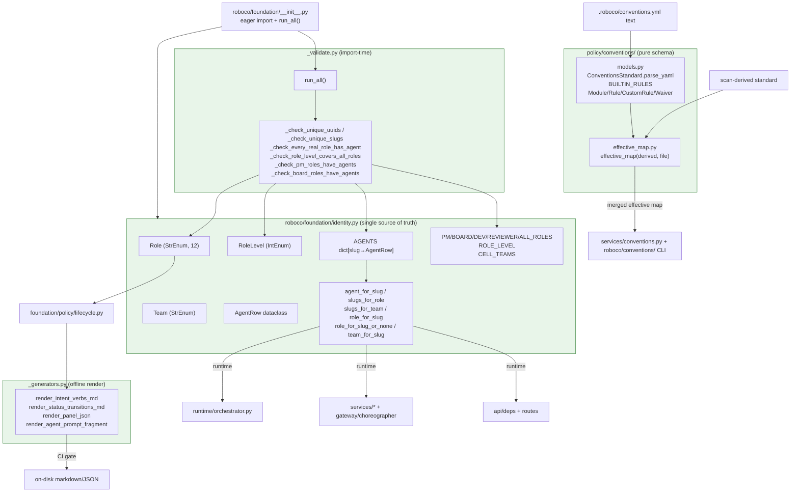

## Purpose
The pure, no-IO/no-DB foundation layer for RoboCo's identity model and the architectural-conventions standard schema. identity.py is the single source of truth for roles, teams, the AGENTS roster, role-sets, and slug/role/team lookups consumed by the orchestrator, services, and API. The conventions/ sub-package defines the YAML schema models (.roboco/conventions.yml), the org-default BUILTIN_RULES, and the effective-map merge (auto-derived scan defaults overlaid by the committed file). _validate.py runs cross-table integrity checks at import time (fail-fast: a misconfigured foundation blocks container start). _generators.py deterministically renders lifecycle artifacts (markdown/JSON/prompt fragments) consumed by the CI build-lifecycle-artifacts gate.

## Files

| Path | Role | LOC |
|---|---|---|
| roboco/foundation/policy/conventions/__init__.py | Package facade re-exporting BUILTIN_RULES, ConventionsParseError, ConventionsStandard, CustomRule, DefinitionKind, Module, Rule, RuleLevel, Waiver, effective_map. | 33 |
| roboco/foundation/policy/conventions/effective_map.py | Pure merge of auto-derived scan defaults with the committed conventions file into one ConventionsStandard (per-field precedence). | 65 |
| roboco/foundation/policy/conventions/models.py | Pydantic schema for the conventions standard: Module/Rule/CustomRule/Waiver/ConventionsStandard, BUILTIN_RULES, ConventionsParseError, parse_yaml entry point. | 131 |
| roboco/foundation/identity.py | Single source of truth for Role, Team, CELL_TEAMS, RoleLevel, AgentRow, the AGENTS roster, role-sets (PM/BOARD/DEV/REVIEWER/ALL), ROLE_LEVEL, and slug/role/team lookup helpers. | 317 |
| roboco/foundation/_validate.py | Import-time identity validators (unique UUIDs/slugs, every real role has an agent, ROLE_LEVEL covers all roles, PM/BOARD roles populated); run_all() entry. | 93 |
| roboco/foundation/_generators.py | Deterministic renderers of lifecycle intent-verb/status-transition markdown, panel JSON, and per-role prompt fragments from the lifecycle spec. | 145 |

## Key Symbols

| Name | Kind | File:Line | Responsibility |
|---|---|---|---|
| Role | StrEnum | roboco/foundation/identity.py:22 | The 12 canonical agent roles (developer, qa, documenter, cell_pm, main_pm, product_owner, head_marketing, auditor, pr_reviewer, prompter, secretary, ceo, system). |
| Team | StrEnum | roboco/foundation/identity.py:38 | Team enum (backend, frontend, ux_ui, board, main_pm, fullstack, marketing-legacy, system). |
| CELL_TEAMS | frozenset[Team] | roboco/foundation/identity.py:54 | The three delivery cells {BACKEND, FRONTEND, UX_UI} — distinct from the full Team enum; single source of truth for 'the cells' subset. |
| RoleLevel | IntEnum | roboco/foundation/identity.py:57 | Hierarchical authority levels (-1 SYSTEM, 0 INTAKE, 1 DEV, 2 QA, 3 DOCUMENTER, 4 CELL_PM, 5 MAIN_PM, 6 BOARD, 7 AUDITOR, 8 CEO) for 'X or above' checks. |
| AgentRow | dataclass(frozen=True) | roboco/foundation/identity.py:70 | Identity record for one agent: slug, role, team, uuid, is_human (True only for ceo). |
| _u | function | roboco/foundation/identity.py:81 | Shorthand UUID literal constructor for the AGENTS table. |
| AGENTS | dict[str,AgentRow] | roboco/foundation/identity.py:86 | The full agent roster: system sentinel, CEO, 3 cells (5 members each), main-pm, product-owner, head-marketing, auditor, intake-1, secretary-1, pr-reviewer-1, and 3 per-cell pr-reviewers. |
| PM_ROLES | frozenset[Role] | roboco/foundation/identity.py:251 | {CELL_PM, MAIN_PM} — roles allowed to plan/delegate/merge. |
| BOARD_ROLES | frozenset[Role] | roboco/foundation/identity.py:252 | {PRODUCT_OWNER, HEAD_MARKETING, AUDITOR} — board reviewers; intake/secretary/pr-reviewer deliberately excluded. |
| DEV_ROLES | frozenset[Role] | roboco/foundation/identity.py:255 | {DEVELOPER}. |
| REVIEWER_ROLES | frozenset[Role] | roboco/foundation/identity.py:256 | {PR_REVIEWER}. |
| ALL_ROLES | frozenset[Role] | roboco/foundation/identity.py:257 | frozenset(Role) — every role value. |
| ROLE_LEVEL | dict[Role,RoleLevel] | roboco/foundation/identity.py:262 | Per-role authority level; PR_REVIEWER=QA, PROMPTER=INTAKE, SECRETARY=BOARD, AUDITOR above MAIN_PM, CEO ceiling. |
| agent_for_slug | function | roboco/foundation/identity.py:279 | Return AgentRow for slug; raise KeyError on unknown (lists known slugs in message). |
| slugs_for_role | function | roboco/foundation/identity.py:286 | frozenset of slugs whose agent has a given role. |
| slugs_for_team | function | roboco/foundation/identity.py:291 | frozenset of slugs whose agent is on a given team. |
| role_for_slug | function | roboco/foundation/identity.py:296 | Shorthand role lookup; raises KeyError on unknown slug. |
| role_for_slug_or_none | function | roboco/foundation/identity.py:301 | Safe variant returning None for unknown/stale slug so dispatcher skip-guards don't crash the tick (added in 5bb13c84). |
| _HUMAN_ONLY_ROLES | frozenset[Role] | roboco/foundation/identity.py:315 | {CEO, PROMPTER, SECRETARY} — the three human-driven roles that are never containers; single source of truth for the human-only set consumed by is_human_only_role and is_spawnable_agent_slug. |
| is_human_only_role | function | roboco/foundation/identity.py:320 | True for the CEO / prompter / secretary human-driven roles; None (unresolvable slug) returns False. Prefer over bare `role in (CEO, ...)` checks to avoid the stale-None blind spot. |
| is_spawnable_agent_slug | function | roboco/foundation/identity.py:331 | True only when slug resolves to a known non-human agent role; False for an unresolvable/stale slug or a human-only role. Dispatcher may spawn a slug only when this returns True. |
| role_for_uuid_or_none | function | roboco/foundation/identity.py:347 | UUID→Role lookup over the AGENTS table; returns None for a non-seeded/stale UUID. Used by creation-time PM-vs-code guard where assigned_to is carried as UUID not slug. |
| team_for_slug | function | roboco/foundation/identity.py:365 | Shorthand team lookup; raises KeyError on unknown slug. |
| RuleLevel | Literal | roboco/foundation/policy/conventions/models.py:18 | 'warn' / 'block' — gate severity for a convention rule. |
| DefinitionKind | Literal | roboco/foundation/policy/conventions/models.py:19 | model / route / helper / business_logic / component / other — what a tree-sitter-classified definition is. |
| ConventionsParseError | class(ValueError) | roboco/foundation/policy/conventions/models.py:24 | Raised when .roboco/conventions.yml is malformed or fails schema validation; carries .reason. |
| BUILTIN_RULES | dict[str,RuleLevel] | roboco/foundation/policy/conventions/models.py:38 | Org-default hygiene rules seeded into every project: no_lint_suppressions=block, no_inline_comments=warn. Placement rules are NOT here (derived per-project). |
| _Base | BaseModel | roboco/foundation/policy/conventions/models.py:44 | Shared pydantic config: extra='ignore' for forward-compat with unknown YAML keys. |
| Module | BaseModel | roboco/foundation/policy/conventions/models.py:50 | One module boundary: path prefix, purpose, forbidden definition kinds. |
| Rule | BaseModel | roboco/foundation/policy/conventions/models.py:58 | A toggleable named rule and the level it fires at. |
| CustomRule | BaseModel | roboco/foundation/policy/conventions/models.py:65 | Project-specific regex rule: id, pattern, message, level, optional language scope. |
| Waiver | BaseModel | roboco/foundation/policy/conventions/models.py:75 | Accountable escape hatch: a (path, rule, reason) the gate must not flag. |
| ConventionsStandard | BaseModel | roboco/foundation/policy/conventions/models.py:83 | Parsed standard (raw file or merged effective map): version, languages, modules, rules, custom, waivers. |
| ConventionsStandard._name_rules_from_keys | field_validator | roboco/foundation/policy/conventions/models.py:93 | Inject mapping key as each rule's name; accepts both {name: {level:...}} YAML and pre-built Rule objects. |
| ConventionsStandard.parse_yaml | classmethod | roboco/foundation/policy/conventions/models.py:112 | Single entry point from raw file text to validated ConventionsStandard; raises ConventionsParseError on malformed YAML / non-mapping top level / ValidationError. |
| _merge_rules | function | roboco/foundation/policy/conventions/effective_map.py:22 | Merge rules: BUILTIN_RULES < derived < file (per key). |
| _merge_modules | function | roboco/foundation/policy/conventions/effective_map.py:34 | Merge modules: derived, file modules override by path, new paths appended in file order. |
| _union_languages | function | roboco/foundation/policy/conventions/effective_map.py:43 | Union languages preserving derived order then file-only extras. |
| effective_map | function | roboco/foundation/policy/conventions/effective_map.py:53 | Produce the merged ConventionsStandard: derived defaults overlaid by the committed file; version/custom/waivers come from the curated side (file if present else derived). |
| _SENTINEL_ROLES | frozenset[Role] | roboco/foundation/_validate.py:23 | {Role.SYSTEM} — excluded from 'every real role has an agent' check. |
| IdentityValidationError | class(RuntimeError) | roboco/foundation/_validate.py:26 | Raised at import time when identity tables are inconsistent. |
| _check_unique_uuids | function | roboco/foundation/_validate.py:30 | Fail if any two AgentRows share a UUID. |
| _check_unique_slugs | function | roboco/foundation/_validate.py:39 | Belt-and-suspenders duplicate-slug check (dict already guarantees uniqueness). |
| _check_every_real_role_has_agent | function | roboco/foundation/_validate.py:47 | Every Role except SYSTEM must have at least one agent in AGENTS. |
| _check_role_level_covers_all_roles | function | roboco/foundation/_validate.py:56 | ROLE_LEVEL must have an entry for every Role. |
| _check_pm_roles_have_agents | function | roboco/foundation/_validate.py:63 | Each role in PM_ROLES must have at least one agent. |
| _check_board_roles_have_agents | function | roboco/foundation/_validate.py:71 | Each role in BOARD_ROLES must have at least one agent. |
| _VALIDATORS | tuple | roboco/foundation/_validate.py:79 | Ordered tuple of the six identity validators run by run_all. |
| run_all | function | roboco/foundation/_validate.py:89 | Run every identity validator in order; first failure raises IdentityValidationError. |
| _composes_line | function | roboco/foundation/_generators.py:25 | Render the 'Composes' line for one intent verb. |
| _intent_verb_section | function | roboco/foundation/_generators.py:31 | Render a single intent-verb markdown section (name, description, allowed roles, composes, side effects, preconditions). |
| render_intent_verbs_md | function | roboco/foundation/_generators.py:51 | Render the full intent-verbs markdown doc, one section per verb sorted by name. |
| _transition_roles_str | function | roboco/foundation/_generators.py:59 | Render the roles column for a status transition ('any' if no constraint). |
| _transition_sort_key | function | roboco/foundation/_generators.py:65 | Sort key (source, target, action) for deterministic transition ordering. |
| render_status_transitions_md | function | roboco/foundation/_generators.py:69 | Render the status-transitions markdown table. |
| _intent_to_panel_dict | function | roboco/foundation/_generators.py:85 | Serialize one IntentSpec to the panel-UI dict shape. |
| _transition_to_panel_dict | function | roboco/foundation/_generators.py:96 | Serialize one StatusTransition to the panel-UI dict shape. |
| render_panel_json | function | roboco/foundation/_generators.py:106 | Deterministic JSON dump (intents + transitions + claim_rules) for the panel lifecycle visualizer. |
| render_agent_prompt_fragment | function | roboco/foundation/_generators.py:125 | Per-role prompt fragment listing the verbs the agent can call, injected into the system prompt so agent perception matches the gateway surface. |

## Data Flow
identity.py is loaded eagerly when `roboco.foundation` is imported (foundation/__init__.py line 10-26 re-exports its symbols; line 48-50 imports and invokes `_validate.run_all()`). At import, _validate.run_all() iterates _VALIDATORS, each reading identity.AGENTS / Role / ROLE_LEVEL / PM_ROLES / BOARD_ROLES and raising IdentityValidationError on any inconsistency — so a misconfigured foundation aborts container start before any service runs. At runtime, the orchestrator (runtime/orchestrator.py: line 2186, 10327, 10504, 10931), services (permissions, secretary, prompter, release_readiness, self_heal_engine, ci_watch_engine, dep_update_engine, release_manager_engine, gateway/choreographer), API deps/routes, models/base, and seeds/initial_data import Role/Team/AGENTS/role-sets/lookups from here. Adding an agent edits only identity.py; the validators then enforce roster integrity at next import. The conventions sub-package is imported by roboco/services/conventions.py (ConventionsService) and roboco/api/routes/project.py; raw `.roboco/conventions.yml` text flows through ConventionsStandard.parse_yaml (models.py:112) -> ConventionsStandard, then ConventionsService pairs it with a scan-derived standard and calls effective_map(effective_map.py:53) to produce the merged standard consumed by the validator CLI (roboco/conventions/) and the ambient/baseline prompt injection. _generators.py is offline: scripts/build_lifecycle_artifacts.py imports it and writes rendered markdown/JSON/per-role prompt fragments to disk; the CI gate `make lifecycle && git diff --exit-code` asserts the on-disk artifacts match the current lifecycle spec (which itself imports Role/Team from identity). No function in this slice performs IO or DB access — all are pure transforms over in-memory tables/specs.

## Mermaid


## Logical Tree
```
foundation-conventions-identity
├── roboco/foundation/identity.py  (single source of truth)
│   ├── Role (StrEnum: 12 roles incl. system sentinel)
│   ├── Team (StrEnum: backend/frontend/ux_ui/board/main_pm/fullstack/marketing/system)
│   ├── CELL_TEAMS (frozenset {BACKEND, FRONTEND, UX_UI})
│   ├── RoleLevel (IntEnum -1..8)
│   ├── AgentRow (frozen dataclass: slug, role, team, uuid, is_human)
│   ├── AGENTS (dict: 27 rows = system + ceo + 25 AI agents)
│   │   ├── system sentinel (zero UUID)
│   │   ├── ceo (human)
│   │   ├── backend cell (be-dev-1/2, be-qa, be-pm, be-doc, be-pr-reviewer)
│   │   ├── frontend cell (fe-dev-1/2, fe-qa, fe-pm, fe-doc, fe-pr-reviewer)
│   │   ├── ux_ui cell (ux-dev-1/2, ux-qa, ux-pm, ux-doc, ux-pr-reviewer)
│   │   └── board/main_pm (main-pm, product-owner, head-marketing, auditor, intake-1, secretary-1, pr-reviewer-1)
│   ├── Role-sets: PM_ROLES, BOARD_ROLES, DEV_ROLES, REVIEWER_ROLES, ALL_ROLES
│   ├── ROLE_LEVEL (dict Role→RoleLevel)
│   ├── Lookups: agent_for_slug, slugs_for_role, slugs_for_team, role_for_slug, role_for_slug_or_none, team_for_slug
│   ├── _HUMAN_ONLY_ROLES (frozenset: CEO, PROMPTER, SECRETARY)
│   └── Spawn guards: is_human_only_role, is_spawnable_agent_slug, role_for_uuid_or_none
├── roboco/foundation/_validate.py  (import-time integrity)
│   ├── _SENTINEL_ROLES = {SYSTEM}
│   ├── IdentityValidationError
│   ├── _check_unique_uuids
│   ├── _check_unique_slugs
│   ├── _check_every_real_role_has_agent
│   ├── _check_role_level_covers_all_roles
│   ├── _check_pm_roles_have_agents
│   ├── _check_board_roles_have_agents
│   ├── _VALIDATORS (ordered tuple)
│   └── run_all()
├── roboco/foundation/_generators.py  (offline deterministic render)
│   ├── _composes_line / _intent_verb_section
│   ├── render_intent_verbs_md
│   ├── _transition_roles_str / _transition_sort_key
│   ├── render_status_transitions_md
│   ├── _intent_to_panel_dict / _transition_to_panel_dict
│   ├── render_panel_json
│   └── render_agent_prompt_fragment
└── roboco/foundation/policy/conventions/  (pure schema + merge)
    ├── __init__.py  (re-exports)
    ├── models.py
    │   ├── RuleLevel / DefinitionKind (Literals)
    │   ├── ConventionsParseError
    │   ├── BUILTIN_RULES (no_lint_suppressions=block, no_inline_comments=warn)
    │   ├── _Base (extra=ignore)
    │   ├── Module / Rule / CustomRule / Waiver
    │   └── ConventionsStandard (+ _name_rules_from_keys validator, + parse_yaml classmethod)
    └── effective_map.py
        ├── _merge_rules (BUILTIN < derived < file)
        ├── _merge_modules (derived, file overrides by path)
        ├── _union_languages (derived order then file extras)
        └── effective_map (merged ConventionsStandard)
```

## Dependencies
- Internal: roboco.foundation.identity (re-exported by foundation/__init__.py and consumed by ~30 modules: orchestrator, services/permissions, services/secretary, services/prompter, services/release_readiness, services/self_heal_engine, services/ci_watch_engine, services/dep_update_engine, services/release_manager_engine, services/gateway/choreographer/_impl, services/gateway/content_actions, api/deps, api/routes/orchestrator, api/routes/pitch, api/routes/v1/_role_dep, api/schemas/product, api/schemas/pitch(?), models/base, models/product, models/pitch, seeds/initial_data, agents_config, foundation/policy/lifecycle, foundation/policy/communications, foundation/policy/journaling, foundation/policy/task_completeness, foundation/policy/content/models, enforcement/journal_perms, services/learning, services/pitch, services/product), roboco.foundation._validate (run_all invoked at foundation package import), roboco.foundation._generators (consumed by scripts/build_lifecycle_artifacts.py; reads roboco.foundation.policy.lifecycle._INTENT_VERBS/_STATUS_TRANSITIONS/CLAIM_RULES/IntentSpec/Role/StatusTransition), roboco.foundation.policy.conventions.{models,effective_map} (consumed by roboco/services/conventions.py ConventionsService, roboco/api/routes/project.py, and the roboco/conventions/ validator CLI)
- External: pydantic (BaseModel, ConfigDict, Field, ValidationError, field_validator), yaml (PyYAML safe_load / YAMLError), dataclasses (dataclass frozen=True), enum (IntEnum, StrEnum), uuid.UUID, collections.Counter, typing.Any/Literal, json (render_panel_json)

## Entry Points

| Name | File | Trigger |
|---|---|---|
| foundation package import → run_all() | roboco/foundation/__init__.py | import roboco.foundation (or any submodule) — line 48-50 imports and invokes _validate.run_all() at module load; first failing validator raises IdentityValidationError and blocks orchestrator start |
| identity lookups (agent_for_slug / role_for_slug / role_for_slug_or_none / slugs_for_role / slugs_for_team / team_for_slug) | roboco/foundation/identity.py | called throughout the dispatcher tick, claim/plan/escalate flows, notification routing, permissions checks, and seed bootstrap whenever a slug/role/team must be resolved |
| ConventionsStandard.parse_yaml(text) | roboco/foundation/policy/conventions/models.py | called by ConventionsService and the validator CLI when raw .roboco/conventions.yml text is loaded from the read clone |
| effective_map(derived, file) | roboco/foundation/policy/conventions/effective_map.py | called by ConventionsService to merge the scan-derived standard with the committed file into the effective map consumed by validator + ambient/baseline injection |
| render_intent_verbs_md / render_status_transitions_md / render_panel_json / render_agent_prompt_fragment | roboco/foundation/_generators.py | invoked by scripts/build_lifecycle_artifacts.py under the CI gate `make lifecycle && git diff --exit-code` to keep on-disk lifecycle artifacts byte-identical to the spec |

## Config Flags
- ROBOCO_CONVENTIONS_ENABLED (default-off) — gates the surrounding ConventionsService + validator gate enforcement (i_am_done / pr_pass block + ambient/baseline injection). The schema/effective_map in this slice are pure and always importable, but the gate that consumes them is flag-gated. No flag lives inside the slice itself.
- ROBOCO_ORG_MEMORY_ENABLED / ROBOCO_RELEASE_MANAGER_ENABLED / etc. — do NOT touch this slice; mentioned only to confirm they do not gate identity or conventions-schema behavior.


## Gotchas
- Import-time side effect: `import roboco.foundation` triggers _validate.run_all() which raises IdentityValidationError on any roster inconsistency — the orchestrator container will refuse to start. This is intentional fail-fast but means editing identity.py incorrectly has a blast radius across the whole app.
- role_for_slug raises KeyError on unknown slugs; role_for_slug_or_none returns None instead. The two coexist and callers must pick the right one. Dispatcher skip-guards MUST use the _or_none variant or a stale assignee/notification-target slug crashes the whole tick (this was the 5bb13c84 fix).
- role_for_slug_or_none returns None for a stale slug, and `None in (Role.CEO, Role.PROMPTER, Role.SECRETARY)` is False — so the human-only-role skip silently DOES NOT fire for a stale slug. By design (proceed rather than crash), but a stale slug that referred to a human role would not be blocked at this guard.
- ROLE_LEVEL maps PR_REVIEWER to QA (peer to QA in authority), SECRETARY to BOARD, and PROMPTER to INTAKE (0, lowest real-agent). Auditor (7) sits ABOVE MAIN_PM (5) because it reads everywhere. 'X or above' checks must respect this non-obvious ordering.
- BOARD_ROLES deliberately EXCLUDES intake-1 (PROMPTER), secretary-1 (SECRETARY), and pr-reviewer-1 / per-cell pr-reviewers (PR_REVIEWER) even though all are Team.BOARD — they are not board reviewers. Code that assumes 'board team == board reviewer role' is wrong.
- Team.MARKETING is legacy — kept for seed-data parity, no agent declares it. Team.SYSTEM only for the system sentinel. Team.FULLSTACK declared but no agent in AGENTS uses it.
- AGENTS is a module-level mutable dict. _check_unique_slugs comment notes dict uniqueness is guaranteed; the check exists only to catch accidental mutation. Mutating AGENTS at runtime would bypass validators (they ran once at import).
- ConventionsStandard._name_rules_from_keys is a mode='before' field_validator: it accepts both the YAML shape {name: {level: warn}} and pre-built Rule objects. Passing a dict of plain strings will NOT be rewritten and will surface as a ValidationError wrapped in ConventionsParseError.
- effective_map precedence: rules = BUILTIN < derived < file (per key); modules = derived with file override-by-path and new paths appended; version/custom/waivers = file's when a file is present ELSE derived (file is the curated replacement — an empty-file waivers list wins over derived's). derived normally has empty waivers/custom, so this is safe, but a derived scan that ever produces waivers would be shadowed by an empty file.
- _generators output is deterministic and CI-gated by `git diff --exit-code`; any spec change must be regenerated or CI fails. Two calls with the same spec produce the same bytes (sort_keys=True / sorted transitions).
- _validate_lifecycle.py lives in a SEPARATE module (not _validate.py) specifically to avoid an import cycle, because lifecycle.py imports from foundation at module load. Do not move lifecycle validators into _validate.py.
- CELL_TEAMS is a frozenset {BACKEND, FRONTEND, UX_UI} and is DISTINCT from the Team enum — 'the cells' subset. Code that iterates Team to find cells is wrong; use CELL_TEAMS.


## Drift from CLAUDE.md
- CLAUDE.md describes '25 AI agents + 1 human CEO' — AGENTS has 27 entries minus system sentinel minus ceo = 25 AI agents + 1 human CEO. Consistent (the 3 per-cell pr-reviewers bring the AI count to 25). No drift.
- CLAUDE.md verb-surface table lists pr_reviewer verbs (claim_pr_review, post_pr_review, claim_gate_review, pr_pass, pr_fail) and notes the per-cell gate reviewers — identity.py models this exactly with pr-reviewer-1 (global/root) plus be/fe/ux-pr-reviewer (per-cell, team-scoped). No drift.
- CLAUDE.md states the conventions schema lives in `roboco/foundation/policy/conventions/` (pure) and that BUILTIN_RULES are language-agnostic hygiene rules while placement rules are derived per-project — models.py:38 comment and effective_map.py confirm this exactly. No drift.
- CLAUDE.md does not mention role_for_slug_or_none (added 5bb13c84) — but it is an internal helper, not a user-facing surface, so silence is expected rather than drift.


## Changes Since Baseline

| SHA | Subject | Impact |
|---|---|---|
| 5bb13c84 | [F031] identity: role_for_slug_or_none so defensive skip-guards don't crash the dispatcher tick on stale slugs | Added role_for_slug_or_none(slug) returning None instead of raising KeyError on unknown/stale slugs; orchestrator call sites (lines 2186, 10327, 10504, 10931) switched from role_for_slug to the safe variant so a stale assignee or notification-target slug no longer crashes the dispatcher tick. Purely additive — role_for_slug and all other lookups unchanged. conventions/, _validate.py, _generators.py untouched since baseline. |

> Post-snapshot updates (since 2026-06-29): **15effce0** (Chore: 141 Gaps fill-in, PR#283, 2026-06-29) — `role_for_slug_or_none` arrived in this merge (the function attributed to 5bb13c84 in the snapshot history was squashed/rebased here); no other changes to the files in this slice. **536bbb64** (Chore/all/logical gaps sweep, PR#286, 2026-06-30) — four new symbols added to `identity.py`: `_HUMAN_ONLY_ROLES` frozenset (line 315), `is_human_only_role(role)` (line 320), `is_spawnable_agent_slug(slug)` (line 331), `role_for_uuid_or_none(agent_uuid)` (line 347); also updated `role_for_slug_or_none` docstring to reference the new helpers and the #49 guard-hole. `team_for_slug` shifted from line 314 to 365 due to the insertions. The stale-slug-bypasses-human-guard regression risk is resolved by `is_spawnable_agent_slug`. `_validate.py`, `_generators.py`, and `policy/conventions/` files were not touched by either commit.

## Regression Risks

| Title | File:Line | Claim | Severity |
|---|---|---|---|
| ~~Stale human-role slug silently bypasses human-only skip guard~~ **RESOLVED in 536bbb64** | roboco/foundation/identity.py:331 | After 5bb13c84, a bare `role_for_slug_or_none(slug) in (CEO, PROMPTER, SECRETARY)` treated a stale None as "not human" and proceeded to spawn. Fixed in 536bbb64: `is_spawnable_agent_slug(slug)` returns False for any stale/None slug (not just non-human-resolved ones), and all dispatch-skip call sites were updated to use it. The `_HUMAN_ONLY_ROLES` frozenset is the single authority consumed by both `is_human_only_role` and `is_spawnable_agent_slug`. | medium |
| role_for_slug_or_none introduces a None-handling contract callers must honour | roboco/foundation/identity.py:301 | The new function returns Role / None. Any future caller that does `role_for_slug_or_none(slug).value` or passes the result into a function typed Role (not Role/None) will hit AttributeError / TypeError on a stale slug. mypy may not catch call sites that annotate the local as Role. The docstring documents the None-as-'not human-only' convention but nothing enforces it. | low |
| Import-time validators raise on any future AGENTS edit that drops a role's last agent | roboco/foundation/_validate.py:47 | _check_every_real_role_has_agent / _check_pm_roles_have_agents / _check_board_roles_have_agents run at every import. Removing the last agent of a role (e.g. deleting the only secretary row) will raise IdentityValidationError and block container start. Not a regression from 5bb13c84 itself, but a landmine for any future edit to identity.py: the validators are unforgiving and give only a generic message. | low |

## Health
This slice is a pure, dependency-light foundation layer with no IO/DB and strong fail-fast integrity (six import-time validators abort container start on any roster inconsistency). The single change since baseline (5bb13c84) is purely additive — a new safe-lookup helper alongside the existing raising one — and does not alter any pre-existing symbol or behavior, so regression surface is small. The main latent risk is contractual: role_for_slug_or_none returns None and relies on every caller treating None as "not human-only / proceed", a convention enforced only by docstring and review, not by the type checker at use sites. The conventions sub-package is a clean schema + three-field merge with documented per-field precedence and a permissive (extra=ignore) base model for forward-compat. _generators is deterministic and CI-gated by byte-equality. Overall integrity is high; the slice is well-factored and the only watch item is keeping the role_for_slug vs role_for_slug_or_none discipline intact as new dispatcher call sites are added.
