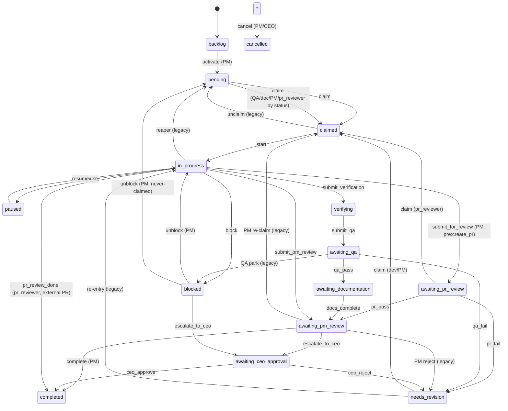

## Purpose
The canonical source of truth for RoboCo's task state machine, per-role action/verb permissions, claim rules, team-match rules, and self-review prevention. The spec module is pure data + lookups (no DB, no I/O); the enforcement package re-exports a backwards-compat view of the same tables plus the git-workflow gates, SLA keys, channel/A2A/journal/ownership access control. Import-time validators in _validate_lifecycle.py make a misconfigured spec fail fast at container start.

## Files

| Path | Role | LOC |
|---|---|---|
| /Users/renzof/Documents/GitHub/ZZZ/roboco-master/roboco/roboco/foundation/policy/lifecycle.py | Canonical lifecycle/permissions spec: Status, TaskType, Decision, Precondition, ActionSpec, IntentSpec, StatusTransition tables + can_invoke_action/intent lookups + CLAIM_RULES/ROLE_TEAM_RULES + PR_OPEN_STATES + UNMIGRATED debt set; import-time self-validates. | 1943 |
| /Users/renzof/Documents/GitHub/ZZZ/roboco-master/roboco/roboco/foundation/_validate_lifecycle.py | Import-time validators (BFS reachability, terminal exits, intent composition chains, claim-rule coverage, self_review symmetry, slug/team agreement, Status/TaskStatus ORM parity, UNMIGRATED subset); LifecycleSpecError aborts container start on a bad spec. | 356 |
| /Users/renzof/Documents/GitHub/ZZZ/roboco-master/roboco/roboco/enforcement/task_lifecycle.py | Backwards-compat shim over the spec: derives VALID_TRANSITIONS / ROLE_RESTRICTED_TRANSITIONS (merging _LEGACY_OPERATIONAL_EDGES + _LEGACY_ROLE_GATES), predicate helpers, SLA keys, GitContext + validate_git_requirements (doc-phase / CEO-escalation / claim-branch gates). | 441 |
| /Users/renzof/Documents/GitHub/ZZZ/roboco-master/roboco/roboco/enforcement/__init__.py | Package re-export aggregator: exposes task_lifecycle, channel_access, a2a_access, journal_perms, task_ownership public symbols under one namespace. | 87 |
| /Users/renzof/Documents/GitHub/ZZZ/roboco-master/roboco/roboco/enforcement/a2a_access.py | Agent-to-agent direct-message permission gate (delegates to roboco.agents_config.can_a2a_direct); A2AAccessDeniedError. | 91 |
| /Users/renzof/Documents/GitHub/ZZZ/roboco-master/roboco/roboco/enforcement/channel_access.py | Channel read/write/silent-observer access gate over CHANNEL_ACCESS table; ChannelAccessDeniedError. | 109 |
| /Users/renzof/Documents/GitHub/ZZZ/roboco-master/roboco/roboco/enforcement/journal_perms.py | Journal read permissions derived from foundation.policy.journaling ReadTier (ALL/ALL_CELLS/CELL_AND_PMS/CELL/OWN) + PROTECTED_JOURNALS; JournalAccessDeniedError. | 197 |
| /Users/renzof/Documents/GitHub/ZZZ/roboco-master/roboco/roboco/enforcement/task_ownership.py | Task ownership + reassign + view + self-review guard (can_review_task); TaskOwnershipError. | 118 |

## Key Symbols

| Name | Kind | File:Line | Responsibility |
|---|---|---|---|
| Status | StrEnum | /Users/renzof/Documents/GitHub/ZZZ/roboco-master/roboco/roboco/foundation/policy/lifecycle.py:40 | 15 task lifecycle statuses (backlog..cancelled) — the state machine alphabet. |
| TaskType | StrEnum | /Users/renzof/Documents/GitHub/ZZZ/roboco-master/roboco/roboco/foundation/policy/lifecycle.py:58 | 6 task types used by ActionSpec.allowed_task_types gating. |
| RejectionKind | Literal | /Users/renzof/Documents/GitHub/ZZZ/roboco-master/roboco/roboco/foundation/policy/lifecycle.py:67 | The 5 rejection flavors (not_authorized/invalid_state/tracing_gap/self_review/not_found) carried in Decision. |
| Decision | dataclass | /Users/renzof/Documents/GitHub/ZZZ/roboco-master/roboco/roboco/foundation/policy/lifecycle.py:76 | Frozen allow/reject result every consumer maps onto its envelope; invariants enforced in __post_init__; constructors allow()/reject()/tracing_gap(). |
| Precondition | dataclass | /Users/renzof/Documents/GitHub/ZZZ/roboco-master/roboco/roboco/foundation/policy/lifecycle.py:145 | Declarative gate-table row: a (task,agent,ctx)->bool predicate + remediate hint + missing_token + rejection_kind. |
| ActionSpec | dataclass | /Users/renzof/Documents/GitHub/ZZZ/roboco-master/roboco/roboco/foundation/policy/lifecycle.py:167 | Atomic action spec (allowed_roles, source_statuses, target_status, allowed_task_types, preconditions, self_review_block, needs_team_match). |
| IntentSpec | dataclass | /Users/renzof/Documents/GitHub/ZZZ/roboco-master/roboco/roboco/foundation/policy/lifecycle.py:187 | Gateway verb spec: composes tuple of action names, extra_preconditions, pre_side_effects/side_effects, next_hint callback. |
| StatusTransition | dataclass | /Users/renzof/Documents/GitHub/ZZZ/roboco-master/roboco/roboco/foundation/policy/lifecycle.py:212 | Row from STATUS_TRANSITIONS canon: source/target/triggering_by_action/role_constraint. |
| _STATUS_TRANSITIONS | tuple | /Users/renzof/Documents/GitHub/ZZZ/roboco-master/roboco/roboco/foundation/policy/lifecycle.py:231 | The canonical state-machine edge table (claim/start/block/qa/pr/complete/cancel/escalate/ceo edges incl. BLOCKED->PENDING and BLOCKED->AWAITING_CEO_APPROVAL). |
| _build_status_graph | function | /Users/renzof/Documents/GitHub/ZZZ/roboco-master/roboco/roboco/foundation/policy/lifecycle.py:374 | Derives source->frozenset(targets) view from _STATUS_TRANSITIONS. |
| STATUS_GRAPH | dict | /Users/renzof/Documents/GitHub/ZZZ/roboco-master/roboco/roboco/foundation/policy/lifecycle.py:382 | Derived state graph consumed by validators + enforcement shim. |
| _ATOMIC_ACTIONS | dict | /Users/renzof/Documents/GitHub/ZZZ/roboco-master/roboco/roboco/foundation/policy/lifecycle.py:414 | All 25 ActionSpecs (activate, claim, start, set_plan, block, unblock, pause, resume, submit_verification, submit_qa, qa_pass, qa_fail, pr_review_done, docs_complete, submit_for_review, pr_pass, pr_fail, complete, submit_pm_review, escalate_to_ceo, ceo_approve, ceo_reject, ceo_reject_to_pool, cancel, create_subtask). |
| CLAIM_RULES | dict | /Users/renzof/Documents/GitHub/ZZZ/roboco-master/roboco/roboco/foundation/policy/lifecycle.py:671 | Per-role claimable status sets; narrows the union claim ActionSpec.source_statuses. |
| ROLE_TEAM_RULES | dict | /Users/renzof/Documents/GitHub/ZZZ/roboco-master/roboco/roboco/foundation/policy/lifecycle.py:702 | Per-slug team binding (None=cross-cell/board) for needs_team_match enforcement. |
| _next_hint_pr_fail | function | /Users/renzof/Documents/GitHub/ZZZ/roboco-master/roboco/roboco/foundation/policy/lifecycle.py:789 | pr_fail next hint: steers Main-PM branch-bearing root to re-delegate (loop-breaker) vs dev-revise for cell/dev tasks. |
| Context | dataclass | /Users/renzof/Documents/GitHub/ZZZ/roboco-master/roboco/roboco/foundation/policy/lifecycle.py:849 | Caller-supplied per-request state (actor_id, plan, journal flags, original_developer_slug, notes, issues, files) fed to Precondition.check. |
| _p_non_terminal | function | /Users/renzof/Documents/GitHub/ZZZ/roboco-master/roboco/roboco/foundation/policy/lifecycle.py:894 | Precondition predicate: task not in COMPLETED/CANCELLED (F043 terminal-resurrection guard). |
| PRECONDITION_NON_TERMINAL | Precondition | /Users/renzof/Documents/GitHub/ZZZ/roboco-master/roboco/roboco/foundation/policy/lifecycle.py:942 | invalid_state precondition attached to escalate_up. |
| PR_OPEN_STATES | frozenset | /Users/renzof/Documents/GitHub/ZZZ/roboco-master/roboco/roboco/foundation/policy/lifecycle.py:963 | Lifecycle-owned canon of states a PR may be opened from (in_progress/verifying/awaiting_qa/awaiting_documentation/needs_revision); GitService derives its str set from this (F101). |
| PRECONDITION_PR_OPEN_STATE | Precondition | /Users/renzof/Documents/GitHub/ZZZ/roboco-master/roboco/roboco/foundation/policy/lifecycle.py:981 | invalid_state precondition attached to open_pr (parity with HTTP path). |
| _INTENT_VERBS | dict | /Users/renzof/Documents/GitHub/ZZZ/roboco-master/roboco/roboco/foundation/policy/lifecycle.py:994 | All ~30 gateway IntentSpecs (give_me_work, i_will_work_on, i_will_plan, delegate, open_pr, i_am_done, sync_branch, i_am_blocked, unclaim, reassign, resume, i_am_idle, claim_review, pass_review, fail_review, claim_pr_review, post_pr_review, claim_gate_review, pr_pass, pr_fail, claim_doc_task, i_documented, complete, escalate_up, escalate_to_ceo, submit_up, submit_root, unblock, triage, triage_all). |
| can_claim | function | /Users/renzof/Documents/GitHub/ZZZ/roboco-master/roboco/roboco/foundation/policy/lifecycle.py:1410 | Backward-compat wrapper around can_invoke_action('claim', ...). |
| _check_role_status_type | function | /Users/renzof/Documents/GitHub/ZZZ/roboco-master/roboco/roboco/foundation/policy/lifecycle.py:1427 | Role + source-status + task_type gate for an ActionSpec; returns rejection or None. |
| _check_self_review_and_preconditions | function | /Users/renzof/Documents/GitHub/ZZZ/roboco-master/roboco/roboco/foundation/policy/lifecycle.py:1469 | self_review_block check (original_developer_slug==actor_slug) + declarative precondition evaluation. |
| _check_claim_rules_narrow | function | /Users/renzof/Documents/GitHub/ZZZ/roboco-master/roboco/roboco/foundation/policy/lifecycle.py:1501 | Per-role CLAIM_RULES narrowing for the claim action; disambiguates not_authorized vs invalid_state. |
| can_invoke_action | function | /Users/renzof/Documents/GitHub/ZZZ/roboco-master/roboco/roboco/foundation/policy/lifecycle.py:1542 | Order-gated atomic action Decision: action exists -> role -> source status -> task_type -> self_review -> preconditions -> claim rules. |
| _check_intent_preconditions | function | /Users/renzof/Documents/GitHub/ZZZ/roboco-master/roboco/roboco/foundation/policy/lifecycle.py:1572 | Verb-level extra_preconditions gate; honors non-tracing rejection_kind (not_authorized/invalid_state) per F043 generalization. |
| can_invoke_intent | function | /Users/renzof/Documents/GitHub/ZZZ/roboco-master/roboco/roboco/foundation/policy/lifecycle.py:1604 | Verb Decision: role gate -> extra_preconditions -> FIRST composed action's can_invoke_action (or CLAIM_RULES narrowing for the claim_review/claim_doc_task/claim_gate_review special cases). |
| valid_next_verbs | function | /Users/renzof/Documents/GitHub/ZZZ/roboco-master/roboco/roboco/foundation/policy/lifecycle.py:1652 | Sorted list of verbs a role can state-applicably call on a task (preconditions evaluated lazily); used by envelope introspection. |
| composed_actions_for | function | /Users/renzof/Documents/GitHub/ZZZ/roboco-master/roboco/roboco/foundation/policy/lifecycle.py:1679 | Return the composes tuple for a verb (KeyError on unknown). |
| intents_for_role | function | /Users/renzof/Documents/GitHub/ZZZ/roboco-master/roboco/roboco/foundation/policy/lifecycle.py:1686 | Sorted tuple of verbs declared for a role; drives role_config.py MCP manifest build. |
| status_after | function | /Users/renzof/Documents/GitHub/ZZZ/roboco-master/roboco/roboco/foundation/policy/lifecycle.py:1696 | Post-action status or None (no transition / wrong source). |
| UNMIGRATED | frozenset | /Users/renzof/Documents/GitHub/ZZZ/roboco-master/roboco/roboco/foundation/policy/lifecycle.py:1710 | Known-debt set: legacy operational edges + role gates not yet absorbed into the spec (Phase 3 terminal invariant target = empty). |
| run_all_lifecycle_validators | function | /Users/renzof/Documents/GitHub/ZZZ/roboco-master/roboco/roboco/foundation/_validate_lifecycle.py:349 | Runs all 14 import-time validators; first failure raises LifecycleSpecError. (14th added: _check_status_enum_parity cross-checks spec.Status against models.base.TaskStatus at import.) |
| reachable_from | function | /Users/renzof/Documents/GitHub/ZZZ/roboco-master/roboco/roboco/foundation/_validate_lifecycle.py:40 | BFS over STATUS_GRAPH from a start status. |
| _check_status_reachability | function | /Users/renzof/Documents/GitHub/ZZZ/roboco-master/roboco/roboco/foundation/_validate_lifecycle.py:67 | Every non-BACKLOG status reachable from PENDING. |
| _check_terminal_exits | function | /Users/renzof/Documents/GitHub/ZZZ/roboco-master/roboco/roboco/foundation/_validate_lifecycle.py:81 | Every non-terminal status has a path to COMPLETED or CANCELLED. |
| _check_intent_chains | function | /Users/renzof/Documents/GitHub/ZZZ/roboco-master/roboco/roboco/foundation/_validate_lifecycle.py:113 | Adjacent composes actions chain (prev.target_status in next.source_statuses). |
| _check_self_review_symmetry | function | /Users/renzof/Documents/GitHub/ZZZ/roboco-master/roboco/roboco/foundation/_validate_lifecycle.py:162 | qa_pass/qa_fail/docs_complete/pr_pass/pr_fail agree on self_review_block. |
| _check_action_target_reachable_from_source | function | /Users/renzof/Documents/GitHub/ZZZ/roboco-master/roboco/roboco/foundation/_validate_lifecycle.py:203 | ActionSpec transitions present in STATUS_GRAPH[source]. |
| _check_unmigrated_is_subset | function | /Users/renzof/Documents/GitHub/ZZZ/roboco-master/roboco/roboco/foundation/_validate_lifecycle.py:256 | UNMIGRATED stays a subset of _KNOWN_UNMIGRATED_CONSUMERS. |
| validate_task_transition | function | /Users/renzof/Documents/GitHub/ZZZ/roboco-master/roboco/roboco/enforcement/task_lifecycle.py:187 | Legacy raising validator over VALID_TRANSITIONS + ROLE_RESTRICTED_TRANSITIONS (role gate only for transition-level pins). |
| can_agent_transition | function | /Users/renzof/Documents/GitHub/ZZZ/roboco-master/roboco/roboco/enforcement/task_lifecycle.py:225 | Non-raising variant of validate_task_transition. |
| is_terminal_state/is_waiting_state/is_active_state | function | /Users/renzof/Documents/GitHub/ZZZ/roboco-master/roboco/roboco/enforcement/task_lifecycle.py:242 | Hard-coded status-category predicates (NOT derived from the graph — drift risk). |
| ROLE_STATE_SLA_KEYS | dict | /Users/renzof/Documents/GitHub/ZZZ/roboco-master/roboco/roboco/enforcement/task_lifecycle.py:276 | (role,status)->settings-key map for stuck-task SLA sweep. |
| sla_seconds_for | function | /Users/renzof/Documents/GitHub/ZZZ/roboco-master/roboco/roboco/enforcement/task_lifecycle.py:285 | Resolve configured SLA seconds for (role,status) from settings. |
| GitContext | dataclass | /Users/renzof/Documents/GitHub/ZZZ/roboco-master/roboco/roboco/enforcement/task_lifecycle.py:316 | Git-state carrier (docs_complete/pr_created/pr_number/branch_name + is_coordination/is_external_review/is_umbrella exemption flags). |
| validate_git_requirements | function | /Users/renzof/Documents/GitHub/ZZZ/roboco-master/roboco/roboco/enforcement/task_lifecycle.py:342 | Doc-phase / CEO-escalation / claim-branch git gates; None short-circuits. |
| _LEGACY_OPERATIONAL_EDGES | dict | /Users/renzof/Documents/GitHub/ZZZ/roboco-master/roboco/roboco/enforcement/task_lifecycle.py:72 | Transitions the runtime exercises that the spec hasn't absorbed (unclaim/reaper/PM-self-complete/QA-direct/verifying-self-fail/PM-claim/revision-reentry). |
| _LEGACY_ROLE_GATES | dict | /Users/renzof/Documents/GitHub/ZZZ/roboco-master/roboco/roboco/enforcement/task_lifecycle.py:99 | Role pins for the legacy edges; UNION-merged with spec-derived ROLE_RESTRICTED_TRANSITIONS (overwrite once dropped pr_reviewer). |
| _build_role_restricted_transitions | function | /Users/renzof/Documents/GitHub/ZZZ/roboco-master/roboco/roboco/enforcement/task_lifecycle.py:156 | Merges spec role_constraint pins with _LEGACY_ROLE_GATES via union (not overwrite). |
| validate_a2a_access | function | /Users/renzof/Documents/GitHub/ZZZ/roboco-master/roboco/roboco/enforcement/a2a_access.py:38 | A2A direct-message gate (delegates to agents_config.can_a2a_direct). |
| validate_channel_access | function | /Users/renzof/Documents/GitHub/ZZZ/roboco-master/roboco/roboco/enforcement/channel_access.py:36 | Channel read/write access gate with wildcard + silent-observer read. |
| can_read_journal | function | /Users/renzof/Documents/GitHub/ZZZ/roboco-master/roboco/roboco/enforcement/journal_perms.py:121 | Journal read decision by ReadTier + protected-journal + same-cell/owner-is-pm rules. |
| validate_task_ownership | function | /Users/renzof/Documents/GitHub/ZZZ/roboco-master/roboco/roboco/enforcement/task_ownership.py:35 | Ownership/reassign/view gate; non-PM must be the assignee. |
| can_review_task | function | /Users/renzof/Documents/GitHub/ZZZ/roboco-master/roboco/roboco/enforcement/task_ownership.py:102 | Self-review prevention: agent_id != task_developed_by. |

## Data Flow
Inputs: a (role, verb_or_action, task, Context) tuple. The Choreographer (services/gateway/choreographer/_impl.py + per-verb modules qa/pr_review/pr_gate) builds a Context (actor_id, plan, original_developer_slug, journal flags) per request, resolves the task row, and calls can_invoke_intent(role, verb, task, ctx). Control flow inside can_invoke_intent: verb lookup -> role gate -> _check_intent_preconditions (extra_preconditions, honoring per-precondition rejection_kind) -> if composes non-empty, can_invoke_action on the FIRST composed action only (subsequent actions chained by the runner after state transitions); if composes empty + verb in {claim_review, claim_doc_task, claim_gate_review}, _check_claim_rules_narrow; else allow. can_invoke_action order: action exists -> _check_role_status_type (role/source-status/task_type) -> _check_self_review_and_preconditions -> _check_claim_rules_narrow for claim. Output: a frozen Decision (allow / reject(kind,...) / tracing_gap(missing,remediate)) mapped by envelope.py onto the gateway Envelope (status/error/remediate/missing) and by valid_next_verbs onto the envelope's current_state introspection. Side-export: role_config.py calls intents_for_role at import to build per-role MCP tool manifests; GitService imports PR_OPEN_STATES to derive its HTTP PR-create str set; task_lifecycle shim derives VALID_TRANSITIONS/ROLE_RESTRICTED_TRANSITIONS consumed by TaskService._validate_and_set_status; validate_git_requirements consumed by TaskService transition path; enforcement.__init__ re-exports channel/a2a/journal/ownership gates consumed by messaging/journal services. At module load the spec calls run_all_lifecycle_validators() which BFS-validates the graph + compositions + claim/team tables, aborting container start on inconsistency.

## Mermaid


## Logical Tree
```
foundation-lifecycle
├── roboco/foundation/policy/lifecycle.py (canonical spec)
│   ├── Enums: Status, TaskType, RejectionKind
│   ├── Dataclasses: Decision, Precondition, ActionSpec, IntentSpec, StatusTransition, Context
│   ├── _STATUS_TRANSITIONS (edge table) -> STATUS_GRAPH (derived)
│   ├── _ATOMIC_ACTIONS (22 ActionSpecs)
│   ├── CLAIM_RULES (per-role claimable statuses)
│   ├── ROLE_TEAM_RULES (per-slug team binding)
│   ├── Precondition predicates + PRECONDITION_* constants (PLAN/COMMITS/NO_PR/OWNERSHIP/NON_TERMINAL/PR_OPEN_STATE)
│   ├── PR_OPEN_STATES (canon)
│   ├── _INTENT_VERBS (~30 IntentSpecs) + _next_hint_* helpers
│   ├── Lookups: can_claim, can_invoke_action, can_invoke_intent, valid_next_verbs, composed_actions_for, intents_for_role, status_after
│   ├── Internal helpers: _check_role_status_type, _check_self_review_and_preconditions, _check_claim_rules_narrow, _check_intent_preconditions
│   └── UNMIGRATED / _KNOWN_UNMIGRATED_CONSUMERS (debt fence)
├── roboco/foundation/_validate_lifecycle.py (import-time validators)
│   ├── LifecycleSpecError
│   ├── reachable_from (BFS)
│   └── 13 _check_* validators -> run_all_lifecycle_validators
└── roboco/enforcement/ (backwards-compat + access control)
    ├── __init__.py (re-export aggregator)
    ├── task_lifecycle.py
    │   ├── _LEGACY_OPERATIONAL_EDGES / _LEGACY_ROLE_GATES
    │   ├── VALID_TRANSITIONS / ROLE_RESTRICTED_TRANSITIONS (derived, union-merged)
    │   ├── validate_task_transition / can_agent_transition / get_valid_transitions
    │   ├── is_terminal_state / is_waiting_state / is_active_state (hard-coded)
    │   ├── ROLE_STATE_SLA_KEYS / sla_seconds_for
    │   └── GitContext / GitRequirementError / validate_git_requirements / check_parallel_completion
    ├── a2a_access.py (A2A direct-message gate)
    ├── channel_access.py (channel read/write/silent gate)
    ├── journal_perms.py (ReadTier-based journal read gate)
    └── task_ownership.py (ownership + reassign + self-review)
```

## Dependencies
- Internal: roboco.foundation.identity (Role, Team), roboco.foundation.policy.journaling (ReadTier, ROLE_READ_TIERS, PROTECTED_JOURNALS), roboco.seeds.initial_data (AGENT_UUIDS, DEFAULT_AGENTS) for slug/team validators, roboco.agents_config (CHANNEL_ACCESS, can_a2a_direct, get_a2a_route_hint, get_agent_cell/role/team), roboco.config.settings (SLA key resolution), roboco.exceptions (RobocoError, TaskLifecycleError)
- External: dataclasses (frozen dataclasses), enum.StrEnum, collections.deque (BFS validator), itertools.pairwise (intent chain validator), typing (Literal, TYPE_CHECKING, Callable, Any)

## Entry Points

| Name | File | Trigger |
|---|---|---|
| import of roboco.foundation.policy.lifecycle | /Users/renzof/Documents/GitHub/ZZZ/roboco-master/roboco/roboco/foundation/policy/lifecycle.py | module load — fires run_all_lifecycle_validators() at the bottom; a bad spec aborts the orchestrator container start |
| Choreographer verb dispatch (can_invoke_intent) | /Users/renzof/Documents/GitHub/ZZZ/roboco-master/roboco/roboco/services/gateway/choreographer/_impl.py | every gateway flow verb call — role/verb/task/Context decision before any state mutation |
| role_config.py manifest build (intents_for_role) | /Users/renzof/Documents/GitHub/ZZZ/roboco-master/roboco/roboco/services/gateway/role_config.py | import — derives per-role MCP tool manifest from the spec |
| envelope introspection (valid_next_verbs) | /Users/renzof/Documents/GitHub/ZZZ/roboco-master/roboco/roboco/services/gateway/envelope.py | every Envelope populate — surfaces current_state + applicable verbs to the agent |
| TaskService transition (validate_task_transition / validate_git_requirements / VALID_TRANSITIONS) | /Users/renzof/Documents/GitHub/ZZZ/roboco-master/roboco/roboco/services/task.py | TaskService._validate_and_set_status on every status write |
| GitService HTTP PR-create (PR_OPEN_STATES) | /Users/renzof/Documents/GitHub/ZZZ/roboco-master/roboco/roboco/services/git.py | HTTP POST /api/v1/.../prs — derives its str-set gate from the lifecycle canon |
| stuck-task SLA sweep (sla_seconds_for / ROLE_STATE_SLA_KEYS) | /Users/renzof/Documents/GitHub/ZZZ/roboco-master/roboco/roboco/runtime/orchestrator.py | orchestrator sweep tick |

## Config Flags
- agent_sla_developer_in_progress
- agent_sla_developer_verifying
- agent_sla_qa_claimed
- agent_sla_documenter_claimed
- agent_sla_cell_pm_claimed (resolved by sla_seconds_for via roboco.config.settings) — no ROBOCO_* feature flag directly gates this slice; it is the always-on policy core


## Gotchas
- can_invoke_intent only checks the FIRST composed action's source-status; subsequent actions in a multi-step composition (e.g. i_will_work_on = claim,set_plan,start) are NOT pre-checked — the verb runner must execute them in order and rollback on mid-composition failure, or the task is left stranded (e.g. claimed but never started).
- verbs with composes=() and not in the claim_review/claim_doc_task/claim_gate_review special-case list have NO source-status gate at the spec layer — their entire gate is extra_preconditions + the handler. sync_branch, open_pr, unclaim, reassign, escalate_up, give_me_work, i_am_idle, triage, triage_all all rely on this. A new empty-composes verb that transitions state without a NON_TERMINAL/source-status precondition can resurrect a terminal task (the F043 class of bug).
- _check_intent_preconditions drops the `missing` list for non-tracing rejection kinds (not_authorized/invalid_state) — Decision.reject sets missing=[]. Agents doing exact-string checks on `missing` will not see tokens for ownership/terminal/PR-open-state failures.
- enforcement/task_lifecycle.is_terminal_state/is_waiting_state/is_active_state are hard-coded string sets, NOT derived from STATUS_GRAPH; they now partition the full Status enum (ef33d56c added awaiting_pr_review; a2d2ef47 added backlog+pending to is_waiting_state so the three predicates cover every Status member), and test_status_classification_covers_every_enum_member in tests/unit/enforcement/test_task_lifecycle.py asserts full coverage — a new Status member that falls through all three predicates will now fail the build instead of silently miscategorizing. The general drift risk (hard-coded vs graph-derived) remains.
- _build_role_restricted_transitions UNION-merges legacy role gates with spec pins; an earlier overwrite silently dropped pr_reviewer from (in_progress, completed). Any new spec role_constraint on an edge that also has a _LEGACY_ROLE_GATES entry must be tested for the union, not overwrite.
- UNMIGRATED must stay a subset of _KNOWN_UNMIGRATED_CONSUMERS or import fails — extending known debt requires editing both frozensets.
- Decision is frozen; the allowed=True path forbids missing/remediate, the allowed=False path forbids rejection_kind=None — building one outside the classmethods via direct __init__ is supported but the invariants are enforced in __post_init__.
- STATUS_GRAPH includes a self-loop-ish edge: cancel is generated for every non-terminal source, so every non-terminal status has CANCELLED as a target — validators pass because of this; removing the cancel generator without re-adding per-source edges would break _check_terminal_exits.
- the spec module imports Role/Team from foundation.identity and _validate_lifecycle at the BOTTOM (after table defs); validators defer-import the spec to break the cycle — pyproject PLC0415 exemption exists for this.
- BLOCKED has two unblock targets (IN_PROGRESS for previously-claimed, PENDING for never-claimed) — the ActionSpec.unblock source_statuses is just {BLOCKED} with target IN_PROGRESS; the BLOCKED->PENDING edge lives only in _STATUS_TRANSITIONS/STATUS_GRAPH and is exercised by the legacy shim, not by an ActionSpec.
- ROLE_TEAM_RULES is keyed by slug, not role — adding a new agent slug without a row means needs_team_match enforcement falls back to None (any team) for that slug silently.


## Drift from CLAUDE.md
- CLAUDE.md 'Role-Based Transitions' table lists escalate_to_ceo only from awaiting_pm_review; the spec also declares BLOCKED -> AWAITING_CEO_APPROVAL via escalate_to_ceo (lifecycle.py:334-339, ActionSpec source_statuses includes BLOCKED at line 615). The BLOCKED->AWAITING_CEO_APPROVAL edge is missing from the doc table.
- CLAUDE.md verb table for developer lists resume/unclaim but omits i_am_idle (every role gets i_am_idle per spec line 1150); the doc does state 'every role also gets i_am_idle' in prose, so this is partial drift — the per-role table column omits it.
- CLAUDE.md says 'roboco/enforcement/task_lifecycle.py is a backwards-compat shim over it' — true for the transition tables, but the shim ALSO owns GitContext/validate_git_requirements/SLA tables (not a pure view); the doc undersells the shim's owned symbols.
- enforcement/__init__.py __all__ does NOT export sla_seconds_for, check_parallel_completion, or ROLE_STATE_SLA_KEYS even though task_lifecycle.py's own __all__ does — consumers must import from the submodule, not the package. Not a CLAUDE.md drift but a surface inconsistency.


## Changes Since Baseline

| SHA | Subject | Impact |
|---|---|---|
| e202ce39 | Make main_pm + task_type=code impossible | In this slice: prose-only — added _next_hint_pr_fail (branch-aware re-delegate hint for Main-PM roots vs dev-revise for cell/dev) and rewrote submit_root description to 'branch-keyed not task_type-keyed'. The actual main_pm+code impossibility is enforced elsewhere (choreographer), not via ActionSpec.allowed_task_types here. |
| 250be5c2 | sync_branch dev verb — gate-level branch rebase (Phase B1) | Added IntentSpec sync_branch (dev-only, composes=(), extra_preconditions=OWNERSHIP, no DB transition) + _next_hint_synced helper. New empty-composes verb with no source-status gate; relies entirely on the handler's no-branch/protected-base guards. |
| 2f322286 | [F043] guard escalate_up against resurrecting terminal tasks | Added PRECONDITION_NON_TERMINAL (invalid_state) to escalate_up.extra_preconditions; generalized _check_intent_preconditions to honor any non-tracing rejection_kind (previously only not_authorized was special-cased, everything else was tracing_gap). Now invalid_state preconditions produce Decision.reject instead of tracing_gap. |
| c34e978f | [F101] enforce PR-open state gate on gateway open_pr | Added PR_OPEN_STATES frozenset (in_progress/verifying/awaiting_qa/awaiting_documentation/needs_revision) + PRECONDITION_PR_OPEN_STATE (invalid_state) inserted into open_pr.extra_preconditions between OWNERSHIP and COMMITS. Closes the gateway parity gap: open_pr (composes=()) previously had no source-status gate; now rejects claim/paused/blocked/terminal. |

> Post-snapshot updates (since 2026-06-29): 15effce0 + 536bbb64 (141-gap + logical-gap sweeps) added SYNC_BRANCH_STATES + PRECONDITION_SYNC_BRANCH_STATE to sync_branch.extra_preconditions (closes medium-risk source-status gap), PRECONDITION_ROOT_NOT_CODE to submit_root.extra_preconditions (closes low-risk spec/prose gap), and ceo_reject_to_pool ActionSpec (AWAITING_CEO_APPROVAL→PENDING CEO reject-to-pool path). 16b71be8 ([sweep] lifecycle: 6 gaps) fixed cancel CEO gate, claim_pr_review gate, needs_team_match enforcement, valid_next_verbs narrowing, pr_reviewer unclaim (unclaim.allowed_roles now includes Role.PR_REVIEWER), and complete side_effect ordering. ef33d56c ([chore] lifecycle-enforcement validators + status-class) dropped the spurious VERIFYING→awaiting_documentation legacy edge from _LEGACY_OPERATIONAL_EDGES, added awaiting_pr_review to is_waiting_state, and overhauled _check_status_enum_coverage from a tautology to a real bidirectional check + split _check_terminal_exits into COMPLETED-path + cancel-exit check + added new _check_status_enum_parity validator (spec.Status vs models.base.TaskStatus ORM parity). a2d2ef47 ([sweep] enforcement status-class partition) added backlog + pending to is_waiting_state completing the terminal/active/waiting partition + added the coverage-invariant test. b3558d4e ([chore] complexity) extracted _check_team_match helper from can_invoke_action (no behavior change).

## Regression Risks

| Title | File:Line | Claim | Severity |
|---|---|---|---|
| ~~sync_branch has no source-status gate — can be called on terminal/paused/blocked tasks~~ **RESOLVED** | /Users/renzof/Documents/GitHub/ZZZ/roboco-master/roboco/roboco/foundation/policy/lifecycle.py:1225 | FIXED post-snapshot (commits 536bbb64/15effce0): PRECONDITION_SYNC_BRANCH_STATE (rejection_kind=invalid_state) added to sync_branch.extra_preconditions; gates the verb to SYNC_BRANCH_STATES={claimed,in_progress,verifying,needs_revision}. Terminal, paused, and blocked tasks now receive Decision.reject(invalid_state). | medium |
| open_pr now rejects `claimed` — may break dev flows that open PR before start | /Users/renzof/Documents/GitHub/ZZZ/roboco-master/roboco/roboco/foundation/policy/lifecycle.py:963 | PR_OPEN_STATES excludes CLAIMED. The intent composition i_will_work_on (claim,set_plan,start) transitions claim->in_progress atomically, so the normal path is fine, but any path that opens a PR while still in CLAIMED (e.g. a dev who calls open_pr before i_will_work_on finishes, or a custom flow) now receives invalid_state instead of the previous silent accept. This is the intended F101 parity fix, but it is a behavior tightening — verify no caller relied on claim-state PR opens. | low |
| _check_intent_preconditions generalization may misroute existing not_authorized callers | /Users/renzof/Documents/GitHub/ZZZ/roboco-master/roboco/roboco/foundation/policy/lifecycle.py:1572 | Before F043, only not_authorized was special-cased and the message was first_missing.remediate. After generalization, ALL non-tracing rejection kinds (not_authorized, invalid_state) take the Decision.reject path with message=remediate. Behavior for not_authorized is unchanged (still remediate-as-message), but any caller that introspected rejection_kind=='tracing_gap' to mean 'a precondition failed' will now miss invalid_state/ownership failures. The envelope's missing[] field is also empty for these. Low-medium risk for consumers that branch on rejection_kind. | low |
| pr_fail hint now branches on team==MAIN_PM and branch_name — non-Main-PM branch-bearing tasks get dev-revise | /Users/renzof/Documents/GitHub/ZZZ/roboco-master/roboco/roboco/foundation/policy/lifecycle.py:789 | _next_hint_pr_fail returns the re-delegate hint only when team==MAIN_PM.value AND branch is set. A cell-PM coordination root with a branch (rare but possible) falls through to 'dev will revise', which is wrong for a PM-owned assembled PR. Low impact (hint text only, not a gate) but could mislead a cell PM into waiting instead of re-delegating. | low |
| ~~submit_root description claims 'branch-keyed, not task_type-keyed' but no allowed_task_types gate enforces it~~ **RESOLVED** | /Users/renzof/Documents/GitHub/ZZZ/roboco-master/roboco/roboco/foundation/policy/lifecycle.py:1502 | FIXED post-snapshot (commits 536bbb64/15effce0): PRECONDITION_ROOT_NOT_CODE (invalid_state, key="root_not_code") added to submit_root.extra_preconditions; rejects when task.task_type==CODE. The spec now enforces the constraint the prose described. Defense-in-depth vs the creation-path choreographer guard. | low |
| CLAIM_RULES lets PMs claim NEEDS_REVISION — combined with pr_fail reassign can create a PM/dev tug-of-war | /Users/renzof/Documents/GitHub/ZZZ/roboco-master/roboco/roboco/foundation/policy/lifecycle.py:687 | CELL_PM/MAIN_PM claim rules include NEEDS_REVISION (added so PM-owned coordination tasks have an actor after pr_fail/ceo_reject). give_me_work only offers assigned tasks, so normally safe, but a PM re-claiming a NEEDS_REVISION dev leaf (if misassigned) would bypass the dev-revise path. The comment documents this is scoped by the same mechanism as dev leaf-revision; risk is in assignment correctness upstream, not the spec itself. Low risk. | low |

## Health
The slice is structurally healthy and well-fenced: the spec is pure data + lookups with no I/O, frozen dataclasses enforce Decision invariants, 14 import-time validators (including the new Status/TaskStatus ORM-parity check) make a misconfigured spec fail fast at container start, and the enforcement shim clearly fences its _LEGACY_* additions (UNMIGRATED debt tracked, union-merge prevents the pr_reviewer-drop regression). Post-snapshot commits resolved the two open medium/low risks: sync_branch now has a source-status gate (PRECONDITION_SYNC_BRANCH_STATE) and submit_root now spec-enforces the not-code constraint (PRECONDITION_ROOT_NOT_CODE). The remaining integrity concerns are behavioral: (1) the empty-composes verb pattern (unclaim, reassign, escalate_up, give_me_work, i_am_idle, triage) still has NO source-status gate at the spec layer — each new empty-composes verb that touches state must add its own NON_TERMINAL/source-status precondition; (2) can_invoke_intent only pre-checks the FIRST composed action, leaving mid-composition rollback to the runner; (3) is_terminal_state/is_waiting_state/is_active_state are hard-coded string sets not derived from STATUS_GRAPH, though a build-time coverage test now catches any new Status member that falls through the partition. No active logic bugs found; the slice is the canonical source its consumers trust.
