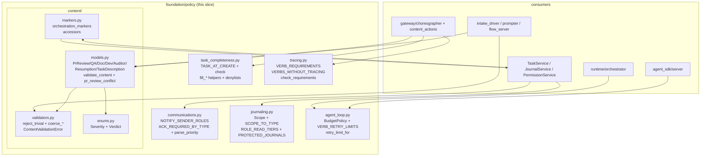

## Purpose
The "misc" foundation-policy slice holds the pure, service-agnostic rule catalogs that the gateway/services layer composes: notification/urgency rules (communications.py), journal scope + read-tier permissions (journaling.py), task completeness field rules + placeholder denylists (task_completeness.py), the verb→required-set tracing gate table (tracing.py), per-agent budget/loop/circuit-breaker thresholds (agent_loop.py), and the structured agent-content schema (content/ — typed PR-review/QA/doc/dev/auditor/resumption/task-description models with validators). It is data + validators, no I/O, no DB — the single source of truth that enforcement/services consume.

## Files

| Path | Role | LOC |
|---|---|---|
| roboco/foundation/policy/communications.py | Notification sender allowlist, NotificationType→requires_ack map, A2A priority parser | 280 |
| roboco/foundation/policy/journaling.py | Journal Scope enum, scope→JournalEntryType map, per-role journal ReadTier, protected-journal slugs | 77 |
| roboco/foundation/policy/task_completeness.py | Task field completeness rules + placeholder denylist + auto-fill helpers (team/priority/parent) | 299 |
| roboco/foundation/policy/tracing.py | Tracing-gate: Requirement enum, per-requirement checkers, VERB_REQUIREMENTS table, VERBS_WITHOUT_TRACING set, check_requirements entry | 416 |
| roboco/foundation/policy/agent_loop.py | Per-agent budget/loop policy defaults, per-verb retry caps, unlimited-retry verb set, retry_limit_for lookup | 108 |
| roboco/foundation/policy/content/__init__.py | Public surface re-export for the content schema package | 50 |
| roboco/foundation/policy/content/enums.py | Severity + Verdict controlled vocabularies for PR-review/QA content | 36 |
| roboco/foundation/policy/content/markers.py | Typed accessors for Task.orchestration_markers JSON column (original_developer, documenter, escalation, release report, transition notes, etc.) | 221 |
| roboco/foundation/policy/content/models.py | Pydantic content models (PrReviewContent, TaskDescription, ResumptionNote, DeveloperNote, QaNote, DocNote, AuditorNote) + CONTENT_MODELS registry + validate_content + pr_review_conflict + required_shape | 506 |
| roboco/foundation/policy/content/validators.py | Shared validation primitives: BANNED_PHRASES, reject_trivial, coerce_to_list, coerce_str_list, ContentValidationError | 159 |

## Key Symbols

| Name | Kind | File:Line | Responsibility |
|---|---|---|---|
| parse_priority | function | roboco/foundation/policy/communications.py:23 | Resolve a NotificationPriority from raw_priority string or legacy urgent flag; unknown→NORMAL |
| NOTIFY_SENDER_ROLES | constant | roboco/foundation/policy/communications.py:51 | frozenset of roles permitted to call notify() (CELL_PM, MAIN_PM, PRODUCT_OWNER, HEAD_MARKETING, CEO) |
| NO_COMMS_ROLES | constant | roboco/foundation/policy/communications.py:66 | frozenset of roles with NO agent-comms surface at all (PROMPTER, SECRETARY — human-only, own dedicated chat pages) — the canonical set both `content_actions.dm()`'s sender-side guard and `agents_config.can_a2a_direct`'s CEO-target-side check consume, so the two enforcement points can't drift apart. AUDITOR/PR_REVIEWER carry `dm`/`read_a2a` (CEO-reachable, reply-only) but are not in this set — the auditor's peer-silence is enforced separately in `can_a2a_direct`'s `from_role == "auditor"` branch |
| ACK_REQUIRED_BY_TYPE | constant | roboco/foundation/policy/communications.py:80 | NotificationType→requires_ack mapping (action-required vs informational) |
| ReescalationPolicy | dataclass | roboco/foundation/policy/communications.py:113 | Bundled `base_seconds`/`max_reescalations` — kept as one dataclass so `reescalation_decision` stays under the 5-arg lint ceiling |
| reescalation_decision | function | roboco/foundation/policy/communications.py:123 | Pure due/wait/capped verdict for one notification's re-escalation attempt: first fire at expiry, then exponential doubling from `base_seconds` capped at 24h between attempts; past `max_reescalations` always "capped" regardless of elapsed time |
| Scope | enum | roboco/foundation/policy/journaling.py:21 | Journal entry scope StrEnum (note/decision/reflect/learning/struggle) |
| SCOPE_TO_TYPE | constant | roboco/foundation/policy/journaling.py:32 | Scope→JournalEntryType single-source mapping |
| ReadTier | enum | roboco/foundation/policy/journaling.py:41 | Journal read-breadth StrEnum (own/cell/cell_and_pms/all_cells/all) |
| ROLE_READ_TIERS | constant | roboco/foundation/policy/journaling.py:51 | Per-role journal ReadTier mapping (auditor/ceo=ALL, developer/qa=CELL, etc.) |
| PROTECTED_JOURNALS | constant | roboco/foundation/policy/journaling.py:76 | frozenset of slugs whose journals only the agent themselves can read (ceo, auditor) |
| FieldRule | enum | roboco/foundation/policy/task_completeness.py:27 | Completeness field-rule StrEnum (non_empty_string/min_length/non_empty_list/explicitly_declared) |
| FieldRequirement | dataclass | roboco/foundation/policy/task_completeness.py:34 | Frozen (field, rule, value, hint) tuple describing one required field check |
| CompletenessSpec | dataclass | roboco/foundation/policy/task_completeness.py:42 | Named bundle of FieldRequirements for one lifecycle moment (e.g. task_at_create) |
| CompletenessResult | dataclass | roboco/foundation/policy/task_completeness.py:48 | Result of check(): passed bool + missing list + field_hints dict |
| TaskCompletenessError | exception | roboco/foundation/policy/task_completeness.py:55 | Service-layer exception carrying missing fields + hints |
| DENYLIST_AC_PHRASES | constant | roboco/foundation/policy/task_completeness.py:70 | frozenset of placeholder AC strings rejected as known evasions |
| DENYLIST_DESCRIPTION_PATTERNS | constant | roboco/foundation/policy/task_completeness.py:81 | Regex tuple of placeholder description patterns rejected |
| TASK_AT_CREATE | constant | roboco/foundation/policy/task_completeness.py:119 | CompletenessSpec for task creation (title/description/AC/task_type/nature/complexity/team) |
| _check_field | function | roboco/foundation/policy/task_completeness.py:170 | Dispatch a FieldRequirement to its rule checker |
| _matches_denylist_ac | function | roboco/foundation/policy/task_completeness.py:181 | True if any AC item is a denylisted placeholder phrase |
| _matches_denylist_description | function | roboco/foundation/policy/task_completeness.py:191 | True if description matches any denylist regex (case-insensitive full-match) |
| check | function | roboco/foundation/policy/task_completeness.py:202 | Run every requirement in a spec against a task; return CompletenessResult |
| fill_team_from_assignee | function | roboco/foundation/policy/task_completeness.py:243 | Auto-fill team from assigned_to slug (never overwriting explicit); returns new dict |
| fill_priority_from_parent | function | roboco/foundation/policy/task_completeness.py:262 | Auto-fill priority from parent task, default medium(2); sets __priority_inherited sentinel |
| fill_parent_from_active_task | function | roboco/foundation/policy/task_completeness.py:285 | Auto-fill parent_task_id from caller's active task on delegate |
| Requirement | enum | roboco/foundation/policy/tracing.py:23 | Tracing-gate requirement StrEnum (plan, commits, pr_open, journals, AC addressed, notes min chars, subtasks terminal, role note-sections) |
| GateContext | dataclass | roboco/foundation/policy/tracing.py:54 | Ambient inputs to the checker not on the Task model (journal presence flags, min-char thresholds) |
| GateResult | dataclass | roboco/foundation/policy/tracing.py:72 | Result of check_requirements: passed + missing list |
| _unaddressed_criteria | function | roboco/foundation/policy/tracing.py:131 | List acceptance criteria with no referencing_artifact_id in status rows |
| _check_acceptance_criteria | function | roboco/foundation/policy/tracing.py:142 | AC-addressed gate: reflect-note satisfies; else list unaddressed criteria |
| _check_subtasks_terminal | function | roboco/foundation/policy/tracing.py:201 | Read task._subtasks_all_terminal flag set by choreographer |
| _CHECKERS | constant | roboco/foundation/policy/tracing.py:209 | Requirement→Checker function dispatch table |
| check_requirements | function | roboco/foundation/policy/tracing.py:235 | Run a list of Requirements against task+ctx; return GateResult |
| VERB_REQUIREMENTS | constant | roboco/foundation/policy/tracing.py:253 | Verb→frozenset[Requirement] single source of truth (i_will_work_on, i_am_done, pass_review, pr_pass, submit_root, complete, etc.) |
| VERBS_WITHOUT_TRACING | constant | roboco/foundation/policy/tracing.py:374 | frozenset of verbs intentionally exempt from tracing (give_me_work, open_pr, sync_branch, claim_*, resume, unclaim, etc.) |
| requirements_for | function | roboco/foundation/policy/tracing.py:401 | Lookup required-set for a verb; raises KeyError on unknown verb |
| BudgetPolicy | dataclass | roboco/foundation/policy/agent_loop.py:23 | Per-agent runtime budget + loop policy defaults (tool call warn/halt, loop threshold/window/action, PM respawn caps, verb retry default) |
| DEFAULT_BUDGET | constant | roboco/foundation/policy/agent_loop.py:48 | Canonical BudgetPolicy instance consumers fall back to |
| VERB_RETRY_LIMITS | constant | roboco/foundation/policy/agent_loop.py:54 | Per-verb retry caps over 60s window keyed by MCP-exposed verb names (pass/fail, i_am_done, open_pr=5, etc.) |
| UNLIMITED_RETRY_VERBS | constant | roboco/foundation/policy/agent_loop.py:80 | frozenset of verbs exempt from the per-verb circuit breaker (discovery/claim verbs) |
| retry_limit_for | function | roboco/foundation/policy/agent_loop.py:97 | Return per-verb retry cap or None for unlimited; falls back to default for unknown |
| default_budget_usd_for | function | roboco/foundation/policy/agent_loop.py:99 | Per-`TaskType` default $ cap consulted only when a task's own `budget_usd` is null AND `ROBOCO_TASK_BUDGETS_ENABLED` is on |
| effective_task_budget_usd | function | roboco/foundation/policy/agent_loop.py:111 | A task's effective $ cap: its own `budget_usd` if set, else the `TaskType` default; the single resolver the orchestrator's budget sweep and the panel's budget-input validation both consult |
| Severity | enum | roboco/foundation/policy/content/enums.py:14 | PR-review finding severity ladder (blocker/major/minor/nit) |
| Verdict | enum | roboco/foundation/policy/content/enums.py:23 | Review outcome StrEnum (approved/changes_requested/passed/failed) |
| HasMarkers | protocol | roboco/foundation/policy/content/markers.py:19 | Protocol for anything carrying orchestration_markers column |
| get_marker | function | roboco/foundation/policy/content/markers.py:39 | Read a marker key from orchestration_markers (default on missing/non-dict) |
| set_marker | function | roboco/foundation/policy/content/markers.py:46 | Reassign orchestration_markers with key set (new dict so SQLAlchemy flags dirty) |
| clear_marker | function | roboco/foundation/policy/content/markers.py:53 | Remove a marker key, reassigning dict (or None when emptied) |
| get_original_developer | function | roboco/foundation/policy/content/markers.py:65 | Read original_developer marker as str/None |
| set_original_developer | function | roboco/foundation/policy/content/markers.py:70 | Write original_developer marker from agent_id |
| get_documenter | function | roboco/foundation/policy/content/markers.py:77 | Read documenter marker |
| set_documenter | function | roboco/foundation/policy/content/markers.py:82 | Write documenter marker |
| get_required_cells | function | roboco/foundation/policy/content/markers.py:89 | Read required_cells marker as list[str] |
| set_required_cells | function | roboco/foundation/policy/content/markers.py:94 | Write required_cells marker |
| get_self_heal_fingerprint | function | roboco/foundation/policy/content/markers.py:101 | Read self_heal fingerprint marker |
| set_self_heal_fingerprint | function | roboco/foundation/policy/content/markers.py:106 | Write self_heal fingerprint marker |
| get_release_report | function | roboco/foundation/policy/content/markers.py:113 | Read release_report marker as dict/None |
| set_release_report | function | roboco/foundation/policy/content/markers.py:118 | Write release_report marker |
| get_release_required_changes | function | roboco/foundation/policy/content/markers.py:122 | Read release_required_changes marker |
| set_release_required_changes | function | roboco/foundation/policy/content/markers.py:127 | Write release_required_changes marker |
| get_external_pr_head | function | roboco/foundation/policy/content/markers.py:134 | Read external_pr_head marker |
| set_external_pr_head | function | roboco/foundation/policy/content/markers.py:139 | Write external_pr_head marker |
| get_external_pr_supersede | function | roboco/foundation/policy/content/markers.py:146 | Read external_pr_supersede marker |
| set_external_pr_supersede | function | roboco/foundation/policy/content/markers.py:151 | Write external_pr_supersede marker |
| is_dismissed | function | roboco/foundation/policy/content/markers.py:158 | Bool read of dismissed marker |
| mark_dismissed | function | roboco/foundation/policy/content/markers.py:162 | Set dismissed=True marker |
| get_escalation | function | roboco/foundation/policy/content/markers.py:173 | Read escalation marker as {from,to,reason}/None |
| set_escalation | function | roboco/foundation/policy/content/markers.py:178 | Write escalation marker from from_slug/to_slug/reason |
| get_approve_and_start_notes | function | roboco/foundation/policy/content/markers.py:190 | Read CEO approve-and-start notes marker |
| set_approve_and_start_notes | function | roboco/foundation/policy/content/markers.py:195 | Write approve-and-start notes marker |
| TRANSITION_NOTES | constant | roboco/foundation/policy/content/markers.py:205 | Marker key for lifecycle transition notes dict |
| get_transition_note | function | roboco/foundation/policy/content/markers.py:208 | Read one transition note by event name |
| set_transition_note | function | roboco/foundation/policy/content/markers.py:216 | Write one transition note keyed by event |
| _Base | class | roboco/foundation/policy/content/models.py:40 | Pydantic base: extra=ignore, validate_assignment=True |
| _Content | class | roboco/foundation/policy/content/models.py:46 | Content base class declaring render_markdown() contract |
| Finding | class | roboco/foundation/policy/content/models.py:76 | One PR-review finding (file/line/severity/criterion/expected/actual) with trivial-rejection |
| WorkUnit | class | roboco/foundation/policy/content/models.py:92 | One cell's slice of a task description (cell team/summary/items); rejects non-cell teams |
| AcVerdict | class | roboco/foundation/policy/content/models.py:127 | One acceptance-criterion verdict (criterion/status/how) |
| PrReviewContent | class | roboco/foundation/policy/content/models.py:145 | PR-review comment/verdict model (summary/findings/issues/verdict/head_sha) with markdown render |
| pr_review_conflict | function | roboco/foundation/policy/content/models.py:211 | Return (message,remediate) when APPROVE/REQUEST_CHANGES event contradicts findings, else None |
| TaskDescription | class | roboco/foundation/policy/content/models.py:251 | Well-formed task description (objective/what_this_builds/the_work/notes/constraints/AC) shared by PM delegate + Intake |
| ResumptionNote | class | roboco/foundation/policy/content/models.py:313 | Human handoff in quick_context (done/next/where_to_look) |
| DeveloperNote | class | roboco/foundation/policy/content/models.py:337 | Developer task note (summary/changes/risks/follow_ups) |
| QaNote | class | roboco/foundation/policy/content/models.py:366 | QA review note (summary/ac_verdicts/verdict restricted to passed/failed) |
| DocNote | class | roboco/foundation/policy/content/models.py:403 | Documenter note (summary/documented/skipped) |
| AuditorNote | class | roboco/foundation/policy/content/models.py:429 | Auditor confidential observation (summary/concerns/severity info/watch/risk) |
| CONTENT_MODELS | constant | roboco/foundation/policy/content/models.py:460 | Registry mapping content-type key to model class (pr_review/task_description/resumption/developer/qa/doc/auditor) |
| validate_content | function | roboco/foundation/policy/content/models.py:471 | Validate payload against model for content_type; passthrough if already instance; raise ContentValidationError on failure |
| required_shape | function | roboco/foundation/policy/content/models.py:496 | Return {field:type-hint} map for a content type for remediation hints |
| BANNED_PHRASES | constant | roboco/foundation/policy/content/validators.py:22 | frozenset of placeholder tokens never acceptable as a whole field value |
| ContentValidationError | exception | roboco/foundation/policy/content/validators.py:45 | Public gateway-facing exception carrying (field, reason) |
| _all_tokens_filler | function | roboco/foundation/policy/content/validators.py:58 | True when every whitespace token (sans punctuation) is a placeholder |
| reject_trivial | function | roboco/foundation/policy/content/validators.py:74 | Trim value or raise ValueError if empty/short/placeholder; composes with Pydantic validators |
| coerce_to_list | function | roboco/foundation/policy/content/validators.py:92 | Wrap lone scalar/dict into one-element list; pass list/None through |
| coerce_str_list | function | roboco/foundation/policy/content/validators.py:137 | Flatten LLM list-of-strings field (XML-ish $text wrappers) to flat list[str] |
| _extract_strs | function | roboco/foundation/policy/content/validators.py:113 | Pull every string out of one list element, recursing through wrappers |
| _extract_strs_from_dict | function | roboco/foundation/policy/content/validators.py:128 | Resolve dict element to strings via first recognized text key else bare string values |

## Data Flow
This slice is pure policy/data: no I/O, no DB, no async. Control flows IN from the gateway/services layer at call sites. (1) communications.py: notification_delivery.py / notification.py import ACK_REQUIRED_BY_TYPE; agents_config.py / services/permissions.py / gateway/content_actions.py import NOTIFY_SENDER_ROLES for the notify-sender allowlist; a2a.py imports parse_priority to resolve A2A urgency tristate; `agents_config.py`'s `_check_ceo_a2a` (consulted from `can_a2a_direct`'s CEO branch) and `gateway/content_actions.py`'s `_NO_COMMS_ROLES` (the `dm()` sender-side guard, now `frozenset(r.value for r in NO_COMMS_ROLES)` instead of an independently hand-maintained literal) both import NO_COMMS_ROLES. (2) journaling.py: JournalService + enforcement/journal_perms.py import SCOPE_TO_TYPE, ROLE_READ_TIERS, PROTECTED_JOURNALS; gateway content_actions imports Scope for the note scope validation. (3) task_completeness.py: TaskService.create / PrompterService.create_task_from_draft / choreographer._impl._create_subtask_from_inputs call check(TASK_AT_CREATE, task) and the fill_* helpers; on failure raise TaskCompletenessError → gateway returns Envelope.incomplete_input with field_hints. (4) tracing.py: choreographer/_impl.py, qa.py, doc.py, pr_gate.py, pr_review.py call requirements_for(verb) then check_requirements(task=..., requirements=..., ctx=GateContext(...)) before allowing a state transition; failure → Envelope.tracing_gap with missing list. The parity test test_every_intent_verb_has_a_tracing_decision asserts every intent verb is in either VERB_REQUIREMENTS or VERBS_WITHOUT_TRACING. (5) agent_loop.py: agent_sdk/server.py reads DEFAULT_BUDGET thresholds (env-overridable) and retry_limit_for(verb); orchestrator.py reads pm_respawn_max_unproductive + pm_respawn_max_tracing_resets for the respawn circuit breaker. (6) content/: gateway content_actions / choreographer / prompter / intake_driver / flow_server call validate_content(content_type, payload) → model instance → render_markdown() written to Task note columns + PR comment bodies; pr_review_conflict guards the GitHub review event against findings; markers.py accessors are called across task.py, orchestrator, self_heal_engine, release_proposal, release_manager_engine to read/write orchestration_markers. coerce_str_list is applied at the intake/flow boundary (intake_driver, flow_server, flow schemas, prompter) BEFORE payloads reach the models, so models only need coerce_to_list as a backstop.

## Mermaid


## Logical Tree
```
foundation/policy (misc slice)
  communications.py
    parse_priority()
    NOTIFY_SENDER_ROLES
    ACK_REQUIRED_BY_TYPE
  journaling.py
    Scope (note/decision/reflect/learning/struggle)
    SCOPE_TO_TYPE
    ReadTier (own/cell/cell_and_pms/all_cells/all)
    ROLE_READ_TIERS
    PROTECTED_JOURNALS
  task_completeness.py
    FieldRule / FieldRequirement / CompletenessSpec / CompletenessResult
    TaskCompletenessError
    DENYLIST_AC_PHRASES / DENYLIST_DESCRIPTION_PATTERNS
    TASK_AT_CREATE
    rule checkers (_check_*)
    check()
    fill_team_from_assignee / fill_priority_from_parent / fill_parent_from_active_task
  tracing.py
    Requirement (enum)
    GateContext / GateResult
    per-requirement checkers (_check_*)
    _CHECKERS dispatch
    check_requirements()
    VERB_REQUIREMENTS (i_will_work_on, i_will_plan, delegate, i_am_done, pass_review, fail_review, post_pr_review, pr_pass, pr_fail, i_documented, submit_up, submit_root, complete, unblock, escalate_up, escalate_to_ceo, i_am_blocked)
    VERBS_WITHOUT_TRACING
    requirements_for()
  agent_loop.py
    BudgetPolicy (dataclass) + DEFAULT_BUDGET
    VERB_RETRY_LIMITS
    UNLIMITED_RETRY_VERBS
    retry_limit_for()
  content/
    __init__.py (re-exports)
    enums.py: Severity, Verdict
    markers.py: HasMarkers, get/set/clear_marker, typed accessors per marker key, TRANSITION_NOTES
    models.py: _Base, _Content, Finding, WorkUnit, AcVerdict, PrReviewContent (+head_sha), pr_review_conflict, TaskDescription, ResumptionNote, DeveloperNote, QaNote, DocNote, AuditorNote, CONTENT_MODELS, validate_content, required_shape
    validators.py: BANNED_PHRASES, ContentValidationError, _all_tokens_filler, reject_trivial, coerce_to_list, coerce_str_list, _extract_strs, _extract_strs_from_dict
```

## Dependencies
- Internal: roboco.foundation.identity (Role, Team, CELL_TEAMS, team_for_slug), roboco.models.base (NotificationPriority, NotificationType, JournalEntryType)
- External: pydantic (BaseModel, ConfigDict, Field, ValidationError, ValidationInfo, field_validator), dataclasses (dataclass, field), enum (StrEnum), typing (Any, Literal, Protocol), collections.abc (Callable), re, string, contextlib

## Entry Points

| Name | File | Trigger |
|---|---|---|
| check (task_completeness) | roboco/foundation/policy/task_completeness.py:202 | Called by TaskService.create / PrompterService.create_task_from_draft / choreographer._impl._create_subtask_from_inputs at task construction |
| check_requirements (tracing) | roboco/foundation/policy/tracing.py:235 | Called by gateway choreographer (_impl/qa/doc/pr_gate/pr_review) before each gated verb's state transition |
| requirements_for (tracing) | roboco/foundation/policy/tracing.py:401 | Called by choreographer to resolve a verb's required-set; parity test iterates every intent verb |
| validate_content | roboco/foundation/policy/content/models.py:471 | Called by gateway content_actions / choreographer / prompter / intake_driver / flow_server when an agent submits a structured-content payload |
| retry_limit_for (agent_loop) | roboco/foundation/policy/agent_loop.py:97 | Called by agent_sdk/server per-verb circuit breaker on /verb/attempted |
| parse_priority (communications) | roboco/foundation/policy/communications.py:23 | Called by services/a2a.py + notification_delivery on A2A urgency resolution |
| markers accessors | roboco/foundation/policy/content/markers.py | Called by task.py, orchestrator, self_heal_engine, release_proposal, release_manager_engine whenever reading/writing orchestration_markers |

## Config Flags
- ROBOCO_AGENT_TOOL_CALL_WARN (consumed by agent_sdk, defaults from BudgetPolicy.tool_call_warn_at=100)
- ROBOCO_AGENT_TOOL_CALL_HALT (defaults tool_call_halt_at=300; raised from 150 — the prior cap repeatedly halted legitimate multi-file work mid-task)
- ROBOCO_AGENT_LOOP_THRESHOLD (defaults loop_threshold=3)
- ROBOCO_AGENT_LOOP_WINDOW (defaults loop_window=10)
- ROBOCO_AGENT_LOOP_ACTION (defaults loop_action='halt')
- ROBOCO_PM_RESPAWN_MAX_UNPRODUCTIVE (defaults pm_respawn_max_unproductive=3)
- ROBOCO_PM_RESPAWN_MAX_TRACING_RESETS (defaults pm_respawn_max_tracing_resets=3)
- Note: BudgetPolicy holds canonical defaults; env overrides applied at consumer layer (agent_sdk/orchestrator), not in this slice


## Gotchas
- markers.py: set_marker REASSIGNS the dict (task.orchestration_markers = {...}) rather than mutating in place — a plain JSON column does not detect in-place mutation, so any caller that does om[key]=v directly bypasses SQLAlchemy dirty tracking. The accessors are the only safe write surface.
- markers.py clear_marker sets the column to None when the dict empties (line 59: `markers or None`); callers that later get_marker on None get the default — fine, but a read expecting an empty dict will get None instead.
- agent_loop.py VERB_RETRY_LIMITS is keyed by the MCP-EXPOSED verb names 'pass'/'fail', while tracing.VERB_REQUIREMENTS keys the same verbs as 'pass_review'/'fail_review' (IntentSpec internal names). The docstring flags this mismatch — a future change that renames one side without the other silently disables the circuit breaker for QA handoffs.
- tracing.py _check_journal_decision_at_claim reuses the journal_decision_present flag with no timing enforcement — the '_at_claim' timing is the caller's responsibility. A PM that records the decision AFTER i_will_plan would still pass the gate if the flag is set by the time check_requirements runs (write-then-gate ordering assumed, not verified).
- tracing.py _check_subtasks_terminal reads task._subtasks_all_terminal, a synthetic attribute the choreographer must set from a DB query before calling check_requirements. Forgetting to set it makes the gate fail with 'subtasks_terminal' (safe direction, but a false negative that blocks a legitimate submit).
- task_completeness.py check() uses getattr(task, req.field, None) — works for Pydantic models, dataclasses, and SimpleNamespace in tests, but a Task ORM row that hasn't refreshed a relationship may return None for a populated field, producing a false 'missing'.
- task_completeness.py _matches_denylist_description uses re.fullmatch on the lowercased STRIPPED text — a description like 'See Title.' (with trailing period) strips to 'see title.' and matches ^see title$; but 'See title for details' does NOT match (fullmatch), so the denylist only catches the exact placeholder, not prose containing it. Intentional, but easy to misread as a bypass.
- content/models.py PrReviewContent.head_sha is optional and stored in a JSON column (no migration) — render_markdown does NOT emit it; it is machine-only. A reader expecting the SHA in the rendered pr_reviewer_notes will not find it.
- content/validators.py reject_trivial raises ValueError (not ContentValidationError) so it composes inside Pydantic field validators; validate_content converts the aggregated ValidationError back to ContentValidationError. Calling reject_trivial outside a Pydantic validator context yields a bare ValueError, not the gateway-facing exception.
- content/models.py models use coerce_to_list (backstop) but NOT coerce_str_list; the SDK $text-wrapper flattening is done at the intake/flow boundary (intake_driver/flow_server/prompter). A caller that bypasses the intake boundary and hands a raw SDK-parsed list-of-dicts directly to validate_content will hit Pydantic str-coercion failure on dict items.
- journaling.py ROLE_READ_TIERS gives SECRETARY ReadTier.ALL (reads everything to advise the CEO) — broader than the panel/UI implies for a 'human-only chief-of-staff'; a code path that assumed secretary is isolated would leak every agent's journal to the secretary role.


## Drift from CLAUDE.md
- CLAUDE.md 'Agent learnings (note scope=learning) broadcast as knowledge-share notifications only to other agents — the human/human-driven roles (CEO, prompter, secretary) are excluded' is enforced in notification_delivery, NOT in this slice's journaling.py — journaling.py defines Scope.LEARNING but places no role exclusion on writing it. No drift in this slice, just noting the exclusion lives elsewhere.
- CLAUDE.md verb-surface table lists pr_reviewer verbs as 'claim_pr_review, post_pr_review, claim_gate_review, pr_pass, pr_fail'. tracing.VERB_REQUIREMENTS includes exactly post_pr_review/pr_pass/pr_fail with requirements; claim_* are in VERBS_WITHOUT_TRACING. Consistent — no drift.
- CLAUDE.md does not mention agent_loop.py VERB_RETRY_LIMITS / per-verb circuit breaker / pm_respawn_max_tracing_resets at all — additive, not drift, but the doc's 'Self-Healing & Feature Flags' and verb-surface sections under-document the circuit breaker that this slice owns.


## Changes Since Baseline

| SHA | Subject | Impact |
|---|---|---|
| 53d60da3 | Bunch of runtime fixes for MegaTask and other issues | Added coerce_str_list + _extract_strs to validators.py — new helper that flattens LLM XML-ish $text-wrapped list-of-strings fields to flat list[str] at the intake boundary (used by intake_driver/flow_server/prompter); prevents asyncpg DataError on VARCHAR[] and str(dict) in markdown |
| e202ce39 | Make main_pm + task_type=code impossible | Added PrReviewContent.issues (additive list[str] slot) + _coerce_issues validator + '## Issues' section in render_markdown — lets the in-path gate record free-text change-requests distinctly from structured findings |
| e52fd05d | submit_root: hard unchanged-PR gate stops the pr_fail re-submit loop | Added PrReviewContent.head_sha (optional str, JSON col → no migration) — captured on pr_fail so submit_root can hard-refuse a byte-identical re-submit; render_markdown does not emit it (machine-only) |
| cf7603f3 | register sync_branch in VERBS_WITHOUT_TRACING | Added 'sync_branch' to VERBS_WITHOUT_TRACING in tracing.py — fixes the parity-test failure (sync_branch is a git-only rebase+force-push with inline preconditions, mirrors open_pr); no tracing requirement |
| 3a4a3fe5 | reduce xenon C-rank blocks to A (behavior-preserving) | Extracted _extract_strs_from_dict helper from inline logic in validators._extract_strs — pure move-and-call refactor, no control flow / return values / side effects changed |

> Post-snapshot updates (since 2026-06-29): a squash-merge commit landed on this slice. `15effce0` (Chore: 141 Gaps fill-in, 2026-06-29) squash-merged the pre-snapshot baseline commits (53d60da3/e202ce39/e52fd05d/cf7603f3/3a4a3fe5) into a single PR — those hashes no longer exist in history but their effects are fully reflected in the Key Symbols above (coerce_str_list/PrReviewContent.issues+head_sha/sync_branch in VERBS_WITHOUT_TRACING). No other symbols in this slice changed.
>
> `1d5a8e84` (#652, "exponential backoff + CAS claim for expired-unacked re-escalation"): adds `ReescalationPolicy` + `reescalation_decision` (communications.py:113/123) — the pure due/wait/capped decision `NotificationDeliveryService._maybe_reescalate` (`docs/map/notification.md`) consults before ever attempting a re-escalation delivery.
>
> `7c8453e2` (#654, "per-task and per-project cost budgets"): adds `default_budget_usd_for`/`effective_task_budget_usd` (agent_loop.py:99/111) — the per-`TaskType` fallback + single resolver consumed by the orchestrator's budget sweep and `claim_guards.project_budget_exceeded_guard` (`docs/map/gateway-support.md`).
>
> `56b6693e` ("security-hygiene-sweep"): adds `NO_COMMS_ROLES` (communications.py:66) — the four no-agent-comms-surface roles (auditor/pr_reviewer/prompter/secretary), extracted as the single canonical set two previously-independent hand-maintained literals now both derive from: `content_actions.py`'s `_NO_COMMS_ROLES` (the `dm()` sender-side guard) and a new `agents_config.py` helper, `_check_ceo_a2a` (called from `can_a2a_direct`'s CEO branch — previously an unconditional `True` for any CEO-initiated target; the "one asymmetric rule" now itself refuses a no-comms target). A downstream consequence with no separate code edit: `agents_config.py`'s statically-derived `A2A_ALLOWED_PAIRS` shrank 93→88 (`ceo` group 23→18).

## Regression Risks

| Title | File:Line | Claim | Severity |
|---|---|---|---|
| PrReviewContent.issues changes rendered pr_reviewer_notes markdown shape | roboco/foundation/policy/content/models.py:199 | e202ce39 added an '## Issues' section to render_markdown whenever issues is non-empty. Downstream readers/parsers of pr_reviewer_notes (or notes_structured.pr_review markdown mirror) that did not expect a second H2 section after Findings could mis-parse; the section ordering is Findings → Issues → Verdict, and a reader that took the first H2 as the body could drop the issues list. | medium |
| VERB_RETRY_LIMITS keyed by 'pass'/'fail' but tracing uses 'pass_review'/'fail_review' | roboco/foundation/policy/agent_loop.py:65 | The circuit-breaker keys ('pass','fail') are the MCP-exposed verb names, while VERB_REQUIREMENTS keys the same verbs as 'pass_review'/'fail_review'. The docstring flags this, but a future rename on either side without the other silently disables the per-verb retry cap for QA handoffs — the agent could retry-storm pass/fail without ever hitting circuit_open. No regression today, but a loaded footgun. | low |
| _extract_strs_from_dict refactor could change dict-without-text-key behavior | roboco/foundation/policy/content/validators.py:128 | 3a4a3fe5 extracted the inline dict-fallback into _extract_strs_from_dict. Behavior is intended to be identical, but the extracted helper now returns the bare-string-values list for ANY dict lacking a _TEXT_KEYS match — including a dict whose only values are non-str (returns []). Previously the same inline logic ran; verbatim move, so no real regression, but the helper is now reusable and a new caller could feed it a dict expecting different semantics. | low |
| sync_branch added to VERBS_WITHOUT_TRACING but not to VERB_RETRY_LIMITS | roboco/foundation/policy/tracing.py:396 | cf7603f3 registered sync_branch as tracing-exempt (correct, mirrors open_pr). sync_branch is also absent from VERB_RETRY_LIMITS and UNLIMITED_RETRY_VERBS in agent_loop.py, so retry_limit_for('sync_branch') falls back to DEFAULT_BUDGET.verb_retry_max_per_minute=3. open_pr has an explicit cap of 5 in VERB_RETRY_LIMITS. A network-flaky sync_branch (force-push) could hit the tighter default cap of 3/min and circuit_open sooner than open_pr — inconsistent with the 'mirror open_pr' intent stated in the commit. | low |
| PrReviewContent.head_sha optional field not surfaced in required_shape hints | roboco/foundation/policy/content/models.py:167 | e52fd05d added head_sha as an optional field. required_shape() (line 496) iterates model_fields and emits a type hint for EVERY field, so head_sha now appears in remediation shape hints for 'pr_review' even though it is machine-set by pr_gate, not agent-supplied. An agent receiving a remediation envelope that lists head_sha could attempt to set it, which is not the intended agent write-path. Minor confusion risk. | low |

## Health
This slice is in good shape: it is pure data + validators with no I/O or concurrency of its own, well-documented intent at each site, and a parity test guarding the tracing table against drift. The recent changes are small, additive, and mostly behavior-preserving. The main latent risk is a naming-convention footgun (agent_loop 'pass'/'fail' keys vs tracing 'pass_review'/'fail_review'; sync_branch missing from VERB_RETRY_LIMITS) — not an active bug today, but one rename away from silently degrading. The markers accessors correctly handle SQLAlchemy dirty tracking via dict reassignment, and the content models correctly delegate SDK-wrapper flattening to the intake boundary via coerce_str_list. No active regressions observed in the slice itself.
