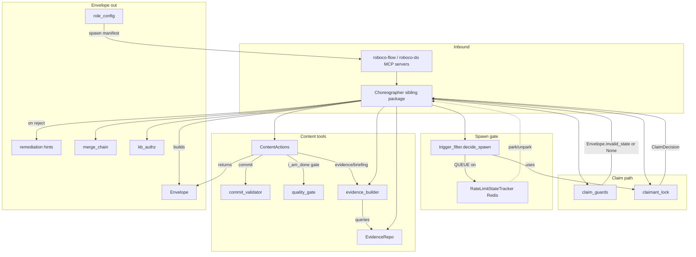

## Purpose
The support layer of the agent gateway: pure/cheap components the Choreographer composes into intent-verb sequences. Envelope is the wire contract; claim_guards/claimant_lock/trigger_filter gate concurrency and spawn decisions; content_actions smart-wraps the do-tools (commit/note/dm/notify/evidence/progress/pr_update/playbook/pitch); evidence_builder/evidence_repo assemble briefings; role_config is the per-role verb/tool manifest source; rate_limit_tracker persists provider park state in Redis; quality_gate runs the pre-submit fast checks; merge_chain resolves PR targets; commit_validator/remediation/kb_authz are small policy shims. None of these own the verb state machine — they are invoked BY the Choreographer and the MCP route handlers.

## Files

| Path | Role | LOC |
|---|---|---|
| roboco/services/gateway/__init__.py | Package marker + __all__ re-export list of the gateway submodules. | 24 |
| roboco/services/gateway/envelope.py | Canonical Envelope dataclass every verb returns; ok/error factory methods + introspection + as_dict wire serializer. | 278 |
| roboco/services/gateway/claim_guards.py | Pre-mutation claim-time predicates: already_active, paused, unmet-dependency; first non-None short-circuits claim. | 112 |
| roboco/services/gateway/claimant_lock.py | Pure single-claimant acquire decision + heartbeat staleness test; caller owns DB writes. | 49 |
| roboco/services/gateway/trigger_filter.py | Pure spawn-gating decision (stale/provider-rate/claimant/cooldown/role-rate) for (task,trigger) pairs. | 130 |
| roboco/services/gateway/commit_validator.py | Commit-message subject gate: length, banned single-words, conventional-commits soft hint. | 101 |
| roboco/services/gateway/content_actions.py | ContentActions: smart-wrapped do-tools (commit/note/dm/notify/evidence/progress/pr_update/playbook/pitch/inbox) with RBAC, ownership, anti-soup, heartbeat refresh. | 1873 |
| roboco/services/gateway/evidence_builder.py | Pure assembly of EvidencePayload + context_briefing + task_handoff (incl. pr_review verdict) + role-shaped memory query. | 221 |
| roboco/services/gateway/evidence_repo.py | Capped DB queries for context_briefing: unread a2a/mentions/notifications, team activity, blockers, journal highlights, company goals, similar_memory. | 364 |
| roboco/services/gateway/kb_authz.py | KB/docs authorization -> Envelope.not_authorized with role-list remediate hint. | 91 |
| roboco/services/gateway/merge_chain.py | Branch-depth + parent-branch resolution by string surgery and via the parent task's real branch_name (cross-team safe). | 111 |
| roboco/services/gateway/quality_gate.py | run_quality_commands: execute project fast checks in workspace, fail-closed on real failure, fail-open on infra, reap timeout zombies. | 101 |
| roboco/services/gateway/rate_limit_tracker.py | RateLimitStateTracker: Redis JSON blob per provider; atomic Lua activate-merge (preserves probe_failures), probe-failure increment/reset; list_rate_limited_providers scan. | 243 |
| roboco/services/gateway/remediation.py | Concrete single-sentence remediation hint strings for tracing-gap/invalid-state rejections. | 100 |
| roboco/services/gateway/role_config.py | ROLE_CONFIGS: per-role flow_tools/do_tools/allows_write/allows_subagent/description; flow tools derived from lifecycle.intents_for_role. | 273 |

## Key Symbols

| Name | Kind | File:Line | Responsibility |
|---|---|---|---|
| Envelope | dataclass | roboco/services/gateway/envelope.py:22 | Canonical gateway response; fields status/task_id/next/evidence/context_briefing/error/message/remediate/missing/field_hints/correlation_id/current_state/valid_next_verbs. |
| Envelope.ok | classmethod | roboco/services/gateway/envelope.py:52 | Success envelope factory requiring status + next. |
| Envelope._missing_message | staticmethod | roboco/services/gateway/envelope.py:70 | Build non-null human-readable message for tracing_gap/incomplete_input so audit log + agent see the full picture. |
| Envelope.tracing_gap | classmethod | roboco/services/gateway/envelope.py:85 | Rejection for missing required tracing tokens. |
| Envelope.incomplete_input | classmethod | roboco/services/gateway/envelope.py:101 | Structured under-filled-input rejection carrying field_hints answer-key (spec 5.2.1). |
| Envelope.invalid_state | classmethod | roboco/services/gateway/envelope.py:125 | State-machine rejection with remediate hint. |
| Envelope.not_authorized | classmethod | roboco/services/gateway/envelope.py:140 | RBAC denial with remediate. |
| Envelope.not_found | classmethod | roboco/services/gateway/envelope.py:155 | 404-style rejection. |
| Envelope.circuit_open | classmethod | roboco/services/gateway/envelope.py:159 | Per-verb retry circuit-breaker tripped signal (wired by agent_sdk runtime, not gateway). |
| Envelope.from_decision | classmethod | roboco/services/gateway/envelope.py:186 | Map a lifecycle.spec rejection Decision onto the right envelope flavor; raises on allow Decision. |
| Envelope.with_introspection | method | roboco/services/gateway/envelope.py:230 | Populate current_state + valid_next_verbs from task+role; best-effort, never raises (catches MissingGreenlet on expired ORM). |
| Envelope.as_dict | method | roboco/services/gateway/envelope.py:257 | Wire-format dict; drops None fields except error; always emits error/correlation_id/current_state/valid_next_verbs. |
| already_active_guard | function | roboco/services/gateway/claim_guards.py:35 | Reject claim if agent has any active (claimed/in_progress/verifying/blocked) task other than target. |
| paused_tasks_guard | function | roboco/services/gateway/claim_guards.py:61 | Reject claim if agent has a paused task other than target (PM re-entry on own paused umbrella exempt). |
| unmet_dependency_guard | function | roboco/services/gateway/claim_guards.py:86 | Reject claim while task has non-terminal depends_on; holds pre-assigned dev at claim verb. |
| ClaimDecision | enum | roboco/services/gateway/claimant_lock.py:18 | GRANTED / GRANTED_AFTER_STALE_RELEASE / BLOCKED_OTHER_ACTIVE. |
| is_stale | function | roboco/services/gateway/claimant_lock.py:24 | True when no heartbeat or heartbeat older than threshold_seconds. |
| try_acquire | function | roboco/services/gateway/claimant_lock.py:35 | Decide whether agent may acquire/refresh claim on task (pure; caller persists). |
| TriggerKind | enum | roboco/services/gateway/trigger_filter.py:17 | a2a / notification / scan / escalation. |
| SpawnDecision | enum | roboco/services/gateway/trigger_filter.py:24 | SPAWN / QUEUE / DROP. |
| decide_spawn | function | roboco/services/gateway/trigger_filter.py:84 | Apply 5 ordered rules (stale>provider-rate>claimant>cooldown>role-rate) returning a Decision. |
| _stale_trigger_decision | function | roboco/services/gateway/trigger_filter.py:68 | DROP for terminal task or stale a2a code_review trigger; else None. |
| validate_commit_message | function | roboco/services/gateway/commit_validator.py:48 | Validate commit subject: empty/length/banned-word/conventional-shape soft hint. |
| ValidationResult | dataclass | roboco/services/gateway/commit_validator.py:40 | ok/reason/hint/remediate outcome of commit message validation. |
| ContentActionsDeps | dataclass | roboco/services/gateway/content_actions.py:282 | Bundled service deps: task/git/a2a/journal/workspace/notifications + notification_delivery + evidence_repo. |
| ContentActions | class | roboco/services/gateway/content_actions.py:329 | Smart-wrapped do-tools; validates input, auto-injects task_id, calls service, returns Envelope. |
| ContentActions.commit | method | roboco/services/gateway/content_actions.py:462 | Validate msg, RBAC (developer/documenter only), active-task + active-claimant gates, git commit, add progress, heartbeat. |
| ContentActions.note | method | roboco/services/gateway/content_actions.py:593 | Route scope=handoff to section write; else journal note with soup-guard + structured normalize + ownership. |
| ContentActions._write_journal_note | method | roboco/services/gateway/content_actions.py:661 | Validate+persist journal entry for note/decision/reflect/learning/struggle; tolerant of thin notes. |
| ContentActions._record_section_handoff | method | roboco/services/gateway/content_actions.py:862 | Write role-specific note SECTION (dev_notes/quick_context/etc.) via record_section_note + journal trail. |
| ContentActions.draft_playbook | method | roboco/services/gateway/content_actions.py:718 | Delivery roles draft a curated playbook; ConflictError -> invalid_state. |
| ContentActions.approve_playbook | method | roboco/services/gateway/content_actions.py:767 | Auditor approves draft -> approved + indexed. |
| ContentActions.reject_playbook | method | roboco/services/gateway/content_actions.py:773 | Auditor rejects playbook -> archived with reason. |
| ContentActions.archive_playbook | method | roboco/services/gateway/content_actions.py:784 | Auditor archives an approved playbook -> retired. |
| ContentActions._curate_playbook | method | roboco/services/gateway/content_actions.py:792 | Shared Auditor-only curation; commit status BEFORE RAG index/unindex; ConflictError->invalid_state. |
| ContentActions.pitch | method | roboco/services/gateway/content_actions.py:935 | Board (PO/Head Marketing) proposes a product; validates cells, ConflictError/ValidationError->invalid_state. |
| ContentActions.propose_feature_spotlight | method | roboco/services/gateway/content_actions.py:1238 | Head-of-Marketing-only (`_FEATURE_SPOTLIGHT_ROLES`); validates feature_slug/title/body, checks `XEngine.is_feature_seen`, calls `XEngine.materialize_feature_spotlight` (creates a held X-post draft + completes the caller's exploration task). |
| ContentActions.dm | method | roboco/services/gateway/content_actions.py:1080 | A2A direct message; requires task_id; no-comms RBAC; A2AAccessDenied->not_authorized. |
| ContentActions.notify | method | roboco/services/gateway/content_actions.py:1150 | Formal ack-required notification (PMs/Board only); rejects bad priority, no-comms sender, disallowed recipient. |
| ContentActions._reject_disallowed_recipient | method | roboco/services/gateway/content_actions.py:1230 | Reject notify to prompter/secretary (no ack path) then defer to CEO-dependency-notify check. |
| ContentActions._reject_ceo_dependency_notify | method | roboco/services/gateway/content_actions.py:1268 | Reject CEO notify about an open dependency block (noise). |
| ContentActions._dependency_block_reason | method | roboco/services/gateway/content_actions.py:1294 | Return reason string if task_id waiting on unfinished deps, else None. |
| ContentActions.evidence | method | roboco/services/gateway/content_actions.py:1324 | Inspect task PR diff/commits/files; allowed for assignee/unassigned/board-co-review/dependency; builds EvidencePayload. |
| ContentActions._is_caller_dependency | method | roboco/services/gateway/content_actions.py:1313 | True when task is a dependency of a task the caller is assigned to (read-only evidence exemption). |
| ContentActions.progress | method | roboco/services/gateway/content_actions.py:1424 | Append progress update; plan_step marks checklist; ownership+active-claim+active-status gate. |
| ContentActions.notify_list | method | roboco/services/gateway/content_actions.py:1607 | Read agent notification inbox via NotificationDeliveryService. |
| ContentActions.notify_get | method | roboco/services/gateway/content_actions.py:1649 | Read one notification + mark read. |
| ContentActions.notify_ack | method | roboco/services/gateway/content_actions.py:1818 | Acknowledge a notification; non-recipient -> not_authorized. |
| ContentActions.read_messages | method | roboco/services/gateway/content_actions.py:1852 | Mark all caller's unread A2A DMs as read (clears i_am_idle soft-block). |
| ContentActions.read_a2a | method | roboco/services/gateway/content_actions.py:1846 | Return caller's unread incoming A2A message bodies (content, not just the counter), then clear them; excludes the caller's own sends. |
| ContentActions.pr_update | method | roboco/services/gateway/content_actions.py:1737 | Update existing PR title/body/reviewers; authorized for assignee/main_pm/cell_pm on team. |
| ContentActions._pr_update_is_authorized | staticmethod | roboco/services/gateway/content_actions.py:1718 | True iff caller is assignee, main_pm, or cell_pm on matching team. |
| ContentActions._active_claim_violation | method | roboco/services/gateway/content_actions.py:379 | Refuse write when caller is not active_claimant (board co-reviewer exempt). |
| ContentActions._verify_explicit_task_ownership | method | roboco/services/gateway/content_actions.py:565 | Gate Set D: refuse content posts on tasks caller doesn't own; stale assigned_to falls through to active-claim check. |
| ContentActions._board_may_co_review | method | roboco/services/gateway/content_actions.py:552 | True iff board role posting to a board/coordination task. |
| ContentActions._touch_heartbeat | method | roboco/services/gateway/content_actions.py:365 | Best-effort heartbeat refresh on content-write success (suppress exceptions). |
| ContentActions._reject_soup | staticmethod | roboco/services/gateway/content_actions.py:398 | Universal anti-soup guard; returns invalid_state Envelope (never raw 422, would trip circuit breaker). |
| ContentActions._reject_structured_soup | classmethod | roboco/services/gateway/content_actions.py:418 | Soup-guard scope's narrative sub-fields when agent filled them; omitted fields keep placeholder. |
| _merge_resumption_fields | function | roboco/services/gateway/content_actions.py:39 | Fold top-level done/next/where_to_look into handoff section without overwriting supplied keys (fixes minimax section={} meltdown). |
| _normalize_structured | function | roboco/services/gateway/content_actions.py:224 | Tolerant copy of structured for decision/reflect: scalar->list wrap, missing narrative fields default to placeholder. |
| _render_journal_content | function | roboco/services/gateway/content_actions.py:166 | Build journal entry body with markdown sections for decision/reflect scopes. |
| _strip_task_prefix | function | roboco/services/gateway/content_actions.py:1870 | Strip any [task-id] prefix the agent supplied; gateway re-adds canonical. |
| EvidencePayload | dataclass | roboco/services/gateway/evidence_builder.py:19 | Task-scoped evidence: pr/commits/files/dev_summary/journal/acceptance/convention_findings. |
| BriefingInputs | dataclass | roboco/services/gateway/evidence_builder.py:38 | Agent-scoped briefing inputs (a2a/mentions/notifications/gaps/activity/blockers/handoff/goals). |
| build_evidence_for_task | function | roboco/services/gateway/evidence_builder.py:58 | Compose EvidencePayload from Task model + supplemental data. |
| build_task_handoff | function | roboco/services/gateway/evidence_builder.py:110 | Compact prior-work digest for briefed task; None when no prior work; surfaces pr_review verdict. |
| _extract_pr_review | function | roboco/services/gateway/evidence_builder.py:163 | Pull canonical pr_review slot from notes_structured; well-typed fields only; None when absent/malformed. |
| build_context_briefing | function | roboco/services/gateway/evidence_builder.py:194 | Compose context_briefing dict; caps each list at BRIEFING_LIST_CAP=10. |
| shape_memory_query | function | roboco/services/gateway/evidence_builder.py:208 | Role-shape the institutional-memory query (dev=implementation, PM=decomposition, qa=defects, doc=patterns). |
| EvidenceRepo | class | roboco/services/gateway/evidence_repo.py:18 | Capped DB queries for briefing assembly (single AsyncSession). |
| EvidenceRepo.company_goals | method | roboco/services/gateway/evidence_repo.py:22 | Singleton charter lookup; None when empty so briefing stays token-light. |
| EvidenceRepo.list_unread_a2a | method | roboco/services/gateway/evidence_repo.py:53 | Open A2A conversations with unread messages keyed by agent slug. |
| EvidenceRepo.list_unread_mentions | method | roboco/services/gateway/evidence_repo.py:101 | Unacked MENTION-type notifications (acked_by is the read signal). |
| EvidenceRepo.list_pending_notifications | method | roboco/services/gateway/evidence_repo.py:143 | Unacked, unexpired notifications addressed to agent. |
| EvidenceRepo.task_metadata_gaps | method | roboco/services/gateway/evidence_repo.py:188 | Human-readable gaps (no acceptance criteria / no description). |
| EvidenceRepo.recent_team_activity | method | roboco/services/gateway/evidence_repo.py:204 | Recently-updated tasks in agent's team (lane awareness). |
| EvidenceRepo.blockers_in_lane | method | roboco/services/gateway/evidence_repo.py:238 | Blocked tasks in agent's team. |
| EvidenceRepo.journal_highlights_for_task | method | roboco/services/gateway/evidence_repo.py:272 | Task's upstream handoff journal entries (decision/reflection/general, oldest first, cap 50). |
| EvidenceRepo.similar_memory | method | roboco/services/gateway/evidence_repo.py:323 | Top-K institutional memory (lessons+playbooks) above min_score; best-effort returns [] on failure. |
| authorize_kb_action | function | roboco/services/gateway/kb_authz.py:46 | Verdict on a KB action: None=allowed, else Envelope.not_authorized naming allowed roles. |
| docs_denial_envelope | function | roboco/services/gateway/kb_authz.py:68 | Wrap DocsService denial as Envelope.not_authorized with role-appropriate remediate. |
| branch_depth | function | roboco/services/gateway/merge_chain.py:27 | Number of --separated hierarchy segments; master=0; raises on invalid branch. |
| parent_branch_for | function | roboco/services/gateway/merge_chain.py:37 | Merge target by string surgery (same-team only); root->master. |
| resolve_parent_branch | coroutine | roboco/services/gateway/merge_chain.py:62 | Cross-team-safe base/target: parent task's real branch_name; branchless parent falls back to project default branch. |
| _project_default_branch | coroutine | roboco/services/gateway/merge_chain.py:97 | Resolve task's project head rung via a TaskService resolver when present, else `roboco.models.env_branches.head_branch(task.project)` (the env-ladder head rung, shimmed from `default_branch` when no ladder is declared); None when unresolvable so the caller falls back to string derivation. |
| GateResult | dataclass | roboco/services/gateway/quality_gate.py:27 | passed/skipped/failures/output + summary + output_excerpt properties. |
| run_quality_commands | coroutine | roboco/services/gateway/quality_gate.py:50 | Run each (name,command) in workspace, aggregate; runs all (no short-circuit). |
| _run_one | coroutine | roboco/services/gateway/quality_gate.py:75 | Run one command via shell; timeout kills+reaps zombie, returns 124; None returncode fails closed (1). |
| RateLimitStateTracker | class | roboco/services/gateway/rate_limit_tracker.py:88 | Per-provider Redis JSON state: rate_limited/kind/activated_at/retry_after/affected_agents/probe_failures. |
| RateLimitStateTracker.activate | coroutine | roboco/services/gateway/rate_limit_tracker.py:134 | Mark provider parked (rate_limited/overloaded); Lua atomic merge (_ACTIVATE_RATE_LIMIT) carries over previous probe_failures count so a re-park cannot reset the give-up counter. |
| RateLimitStateTracker.clear | coroutine | roboco/services/gateway/rate_limit_tracker.py:165 | Delete provider state key. |
| RateLimitStateTracker.is_rate_limited | coroutine | roboco/services/gateway/rate_limit_tracker.py:170 | True if provider currently rate-limited. |
| RateLimitStateTracker.get_state | coroutine | roboco/services/gateway/rate_limit_tracker.py:175 | Stored state dict or {}. |
| RateLimitStateTracker.increment_probe_failures | coroutine | roboco/services/gateway/rate_limit_tracker.py:185 | Atomic Lua increment of probe_failures only (other episode fields survive). |
| RateLimitStateTracker.reset_probe_failures | coroutine | roboco/services/gateway/rate_limit_tracker.py:201 | Atomic Lua reset of probe_failures to 0. |
| RateLimitStateTracker.list_rate_limited_providers | classmethod | roboco/services/gateway/rate_limit_tracker.py:214 | SCAN all roboco:rate_limit:*:state keys, return (provider,state) for rate-limited ones; empty on Redis error. |
| hint_for_missing_progress | function | roboco/services/gateway/remediation.py:11 | Hint: make a commit before i_am_done. |
| hint_for_missing_reflect | function | roboco/services/gateway/remediation.py:18 | Hint: call note(scope='reflect',...). |
| hint_for_unaddressed_acceptance_criteria | function | roboco/services/gateway/remediation.py:25 | Hint: every AC needs a referencing artifact. |
| hint_for_missing_journal_decision | function | roboco/services/gateway/remediation.py:36 | Hint: call note(scope='decision',...) before complete. |
| hint_for_missing_journal_learning | function | roboco/services/gateway/remediation.py:43 | Hint: call note(scope='learning',...) before pass/fail. |
| hint_for_missing_qa_notes | function | roboco/services/gateway/remediation.py:50 | Hint: qa_notes must be >=80 chars. |
| hint_for_evidence_not_inspected | function | roboco/services/gateway/remediation.py:57 | Hint: call evidence(task_id) before pass/fail. |
| hint_for_short_doc_notes | function | roboco/services/gateway/remediation.py:61 | Hint: i_documented requires notes>=min_chars. |
| hint_for_missing_doc_files | function | roboco/services/gateway/remediation.py:69 | Hint: i_documented(files=[...]) requires >=1 path. |
| hint_for_short_dev_notes | function | roboco/services/gateway/remediation.py:76 | Hint: dev_notes under min_chars; use note(scope='handoff',...). |
| hint_for_short_pr_reviewer_notes | function | roboco/services/gateway/remediation.py:85 | Hint: PR reviewer note must be >=min_chars. |
| hint_for_short_quick_context | function | roboco/services/gateway/remediation.py:93 | Hint: quick_context under min_chars; pass done/next as top-level string args. |
| RoleConfig | dataclass | roboco/services/gateway/role_config.py:22 | Static per-role config: flow_tools/do_tools/allows_write/allows_subagent/description. |
| ROLE_CONFIGS | dict | roboco/services/gateway/role_config.py:166 | Map of all 11 roles to their RoleConfig. |
| get_role_config | function | roboco/services/gateway/role_config.py:268 | Lookup role config; KeyError on unknown role. |

## Data Flow
Inbound: MCP servers (roboco-flow/roboco-do) receive agent tool calls, delegate to the Choreographer (sibling choreographer/ package), which calls into this slice. Claim verbs invoke claim_guards.already_active_guard/paused_tasks_guard/unmet_dependency_guard + claimant_lock.try_acquire (caller resolves unmet ids + persists active_claimant_id/last_heartbeat_at). Spawn ticks invoke trigger_filter.decide_spawn with counts the caller queried from gateway_triggers; rate-limit park/unpark routes through RateLimitStateTracker (Redis). The do-tools route through ContentActions: commit -> commit_validator + git.commit + task.add_progress + heartbeat; note -> journal.write_entry or record_section_note; dm/notify -> a2a/notifications with no-comms + ownership gates; evidence -> workspace.fetch_branch_for_inspection + git.diff + evidence_repo.journal_highlights_for_task + build_evidence_for_task. Briefing assembly: Choreographer queries EvidenceRepo (unread a2a/mentions/notifications, team activity, blockers, journal highlights, company_goals, similar_memory), packs into BriefingInputs, evidence_builder.build_context_briefing + build_task_handoff shape it, and the Envelope carries context_briefing. i_am_done pre-submit runs quality_gate.run_quality_commands in the dev workspace; merge steps call merge_chain.resolve_parent_branch. Outbound: every verb returns an Envelope; route handler stamps correlation_id and calls as_dict for the wire. remediation.py strings are injected into Envelope.remediate by the Choreographer on tracing-gap/invalid-state rejections. role_config feeds the spawn manifest builder (tool-manifest.json) and MCP tool registration. kb_authz is consulted by docs/optimal routes.

## Mermaid


## Logical Tree
```
gateway-support
  envelope.py
    Envelope (dataclass)
      ok / tracing_gap / incomplete_input / invalid_state / not_authorized / not_found / circuit_open / from_decision
      with_introspection (best-effort, never raises)
      as_dict (wire serializer)
  claim_guards.py
    _ACTIVE_BLOCKING_STATUSES = {claimed, in_progress, verifying, blocked}
    already_active_guard
    paused_tasks_guard (target excluded)
    unmet_dependency_guard
  claimant_lock.py
    ClaimDecision (GRANTED / GRANTED_AFTER_STALE_RELEASE / BLOCKED_OTHER_ACTIVE)
    is_stale
    try_acquire
  trigger_filter.py
    TriggerKind / SpawnDecision / Decision / SpawnConfig / TriggerContext
    _stale_trigger_decision
    decide_spawn (5 ordered rules)
  commit_validator.py
    ValidationResult
    validate_commit_message
  content_actions.py
    helpers: _merge_resumption_fields, _render_journal_content, _normalize_structured, _strip_task_prefix, _reject_soup, _ownership_violation, _not_active_claimant, _coerce_pitch_cells
    role frozensets: _COMMIT_ALLOWED_ROLES, _NOTIFY_ALLOWED_ROLES, _NO_COMMS_ROLES, _PITCH_ROLES, _DRAFT/_CURATE_PLAYBOOK_ROLES, _FEATURE_SPOTLIGHT_ROLES
    ContentActionsDeps
    ContentActions
      commit / note / _write_journal_note / _record_section_handoff
      draft_playbook / approve_playbook / reject_playbook / archive_playbook / _curate_playbook
      pitch / propose_feature_spotlight / dm / notify / _reject_disallowed_recipient / _reject_ceo_dependency_notify / _dependency_block_reason
      evidence / _is_caller_dependency / _active_claim_violation / _verify_explicit_task_ownership / _board_may_co_review
      progress
      notify_list / notify_get / notify_ack / read_messages / read_a2a
      pr_update / _pr_update_is_authorized
  evidence_builder.py
    EvidencePayload / BriefingInputs
    build_evidence_for_task / build_task_handoff / _extract_pr_review / _has_prior_work
    build_context_briefing / shape_memory_query
  evidence_repo.py
    EvidenceRepo
      company_goals / list_unread_a2a / list_unread_mentions / list_pending_notifications
      task_metadata_gaps / recent_team_activity / blockers_in_lane
      journal_highlights_for_task / similar_memory
  kb_authz.py
    authorize_kb_action / docs_denial_envelope
  merge_chain.py
    branch_depth / parent_branch_for / resolve_parent_branch / _project_default_branch
  quality_gate.py
    GateResult / run_quality_commands / _run_one
  rate_limit_tracker.py
    _INCREMENT_PROBE_FAILURES / _RESET_PROBE_FAILURES / _ACTIVATE_RATE_LIMIT (Lua)
    RateLimitStateTracker
      activate / clear / is_rate_limited / get_state / increment_probe_failures / reset_probe_failures
      list_rate_limited_providers / _read_rate_limited_entry
  remediation.py
    hint_for_* (12 hint functions)
  role_config.py
    RoleConfig / ROLE_CONFIGS / get_role_config
    _DEV/_QA/_DOC/_CELL_PM/_MAIN_PM/_BOARD/_AUDITOR/_PR_REVIEWER/_PROMPTER/_SECRETARY flow+do tuples
```

## Entry Points

| Name | File | Trigger |
|---|---|---|
| Choreographer verb composition | roboco/services/gateway/choreographer/ | every agent flow/do verb call composes these helpers; the choreographer owns the state machine, this slice is the support layer |
| claim verbs (give_me_work / i_will_work_on / i_will_plan / claim_review / claim_doc_task) | roboco/services/gateway/claim_guards.py | Choreographer runs claim_guards + claimant_lock.try_acquire before any task-status mutation |
| do-tool verbs (commit/note/dm/notify/evidence/progress/pr_update/draft_playbook/pitch/...) | roboco/services/gateway/content_actions.py | roboco-do MCP server -> Choreographer -> ContentActions method |
| orchestrator spawn tick | roboco/services/gateway/trigger_filter.py | per dispatch tick the orchestrator calls decide_spawn for each (task,trigger) |
| provider park/unpark + probe loop | roboco/services/gateway/rate_limit_tracker.py | i_am_blocked(rate_limited) -> activate; background probe loop -> increment/reset/clear |
| i_am_done pre-submit gate | roboco/services/gateway/quality_gate.py | Choreographer runs run_quality_commands in dev workspace before accepting submit |
| spawn manifest build | roboco/services/gateway/role_config.py | orchestrator builds /app/tool-manifest.json from ROLE_CONFIGS at agent spawn |
| docs/optimal HTTP routes | roboco/services/gateway/kb_authz.py | api.routes.docs / api.routes.optimal call authorize_kb_action / docs_denial_envelope |
| PR open/merge target resolution | roboco/services/gateway/merge_chain.py | GitService PR ops + Choreographer submit_up/submit_root resolve base branch |
| briefing assembly | roboco/services/gateway/evidence_repo.py | every verb response that carries context_briefing queries EvidenceRepo then evidence_builder shapes it |

## Config Flags
- ROBOCO_OVERLOAD_BREAK_ENABLED (provider overload parks like a 429; tracker stores kind='overloaded')
- ROBOCO_GATEWAY_HEALTH_ENABLED (reaper probes gateway; orthogonal to this slice but tracker feeds park state)
- ROBOCO_GATEWAY_HEALTH_GRACE_SECONDS
- ROBOCO_RELEASE_MANAGER_ENABLED / ROBOCO_ORG_MEMORY_ENABLED (similar memory path gated; similar_memory best-effort returns [] when off/failing)
- ROBOCO_ORG_MEMORY_TOP_K / ROBOCO_ORG_MEMORY_MIN_SCORE (shape_memory_query + similar_memory flooring)
- ROBOCO_CONVENTIONS_ENABLED (convention_findings in EvidencePayload; empty when off)
- settings.commit_subject_min_chars / settings.commit_banned_words (commit_validator overrides)
- settings.redis_url (RateLimitStateTracker key prefix + list_rate_limited_providers scan)
- SpawnConfig.cooldown_seconds / role_rate_per_minute / claim_stale_seconds (trigger_filter tunables, caller-supplied)
- _GATE_TIMEOUT_SECONDS=600 / _OUTPUT_EXCERPT_CHARS=2000 (quality_gate module constants)
- BRIEFING_LIST_CAP=10 (evidence_builder/repo list caps)


## Gotchas
- claimant_lock is pure: it never writes tasks.active_claimant_id / last_heartbeat_at. The Choreographer persists the decision. Two callers acting on the same task must serialize via DB row write, not via this module.
- claim_guards._ACTIVE_BLOCKING_STATUSES now includes 'blocked' (changed in 15effce0). A dev with a genuinely blocked task can no longer claim a new one until they pause/unclaim. Intended fix but a behavior change agents must learn.
- claim_guards and claimant_lock have NO PM-coordinator exclusion; _COORDINATOR_ROLES skip lives in the Choreographer's _run_claim_guards, NOT here. Importing these predicates elsewhere bypasses the PM exemption.
- trigger_filter.decide_spawn rule order is load-bearing: stale > provider-rate > claimant > cooldown > role-rate. Reordering changes which QUEUE reason wins and which gates never get re-evaluated.
- RateLimitStateTracker.activate is now itself a Lua atomic merge (_ACTIVATE_RATE_LIMIT): it refreshes episode metadata (kind/activated_at/retry_after/affected_agents) while carrying over the previous probe_failures count, so a re-park can no longer wipe an in-flight increment. The race between increment and activate is now closed — all three operations are server-side Lua EVALs and are indivisible w.r.t. each other.
- RateLimitStateTracker.list_rate_limited_providers swallows ALL exceptions and returns []; a Redis outage looks identical to 'nothing rate-limited' — callers must not treat [] as 'healthy'.
- quality_gate._run_one previously used `proc.returncode or 0` which turned a None returncode into 0 (passing an unknown-status gate). Now fixed to fail closed (return 1). The 124 timeout code is distinct from a real non-zero exit.
- content_actions._curate_playbook explicitly `await self.task.session.commit()` before RAG index/unindex to gate the corpus. A PendingRollbackError (caller's session already rolled back) is now caught and returned as a clean Envelope.invalid_state with a re-fetch/retry remediate — the verb no longer 500s on a poisoned session, and an uncommitted playbook cannot fall through to the index. A caller that already committed gets a harmless double-commit (no-op).
- content_actions.archive_playbook previously routed through the reject action with reason='archived' (a bug fixed in 15effce0); it now calls svc.archive. Any test still asserting the old reject-on-archive behavior will fail.
- _merge_resumption_fields fills missing done/next/where_to_look from top-level args WITHOUT overwriting supplied keys. A model that passes section={'done': X} AND done='Y' keeps X — the nested section wins. Tests asserting top-level overrides nested are wrong.
- Envelope.with_introspection catches ALL exceptions (including sqlalchemy MissingGreenlet on an expired async session post-rollback) and degrades to valid_next_verbs=[]. Introspection is best-effort and never raises — do not rely on current_state being populated on error paths.
- evidence_repo.list_unread_mentions / list_pending_notifications use PostgreSQL array `.contains([agent_id])` on to_agents / acked_by. Performance + correctness depend on those being GIN-indexed JSON/ARRAY columns; a missing index makes the per-verb briefing query slow.
- merge_chain.parent_branch_for reuses the child's own team segment for the parent — WRONG across a cell->root team boundary (feature/backend/... -> feature/main_pm/...). resolve_parent_branch reads the parent task's real branch_name and is the cross-team-safe path; only fall back to string derivation when no parent / no project.
- commit_validator length check runs BEFORE banned-word check, so a 3-char banned word like 'wip' is caught as 'shorter than 20' not 'banned'. Tests asserting the banned-word reason for short messages are wrong (the docstring notes this).
- ContentActions._reject_soup returns an Envelope (never raises / never a raw 422) precisely because a 422 trips the do-server circuit breaker. Any new validation path must follow the same pattern.


## Drift from CLAUDE.md
- CLAUDE.md: 'pr_reviewer ... no agent comms' — content_actions._NO_COMMS_ROLES enforces this at the handler (defence-in-depth), matching the doc. No drift.
- CLAUDE.md: 'Auditor is restricted to note (scope=reflect) + evidence, plus approve_playbook/reject_playbook/archive_playbook'. role_config._AUDITOR_DO also adds notify_list/notify_get (read-only inbox). This is an additive expansion beyond the doc's literal 'note + evidence' but is consistent with the doc's 'Wave 1 receivers get inbox read' footnote; arguably doc under-states the surface. Not a code drift.
- CLAUDE.md: 'The note/journal write returns as soon as the entry is persisted; RAG indexing (Ollama embedding) runs fire-and-forget'. content_actions._curate_playbook instead does an EXPLICIT await self.task.session.commit() before svc.index_approved / unindex_playbook — commit-before-index is intentional (gates the corpus). Not drift but a deliberate exception to the fire-and-forget pattern for the playbook curation path.
- CLAUDE.md: claim-time concurrency guards 'are skipped for the coordinator PM roles (_COORDINATOR_ROLES = {main_pm, cell_pm}, consulted in _run_claim_guards)'. That skip lives in the Choreographer, NOT in claim_guards.py (this slice). The predicates in this slice have no PM exclusion — importing them directly elsewhere would re-introduce the PM self-block. By design, but the module boundary is easy to misread.


## Changes Since Baseline

| SHA | Subject | Impact |
|---|---|---|
| 15effce0 | Chore: 141 Gaps fill-in (#283) — single commit touching this slice | claim_guards: added 'blocked' to _ACTIVE_BLOCKING_STATUSES so a dev holding a blocked task can't claim a second one (previously excluded -> held two in_progress). |
| 15effce0 | quality_gate: reap timeout zombie + fail-closed on None returncode | _run_one now awaits proc.wait() after kill (no lingering zombie/FD leak) and returns 1 (fail closed) when proc.returncode is None instead of `or 0` (which falsely passed the gate on unknown exit). |
| 15effce0 | rate_limit_tracker: atomic Lua increment/reset of probe_failures | increment/reset_probe_failures moved from non-atomic get_state->mutate->set to server-side Lua EVAL mutating ONLY probe_failures; a concurrent activate() re-park can no longer clobber a stale blob over the fresh episode metadata. |
| 15effce0 | content_actions: top-level done/next/where_to_look resumption fields + _merge_resumption_fields | note(scope='handoff') now accepts top-level done/next/where_to_look string args folded into section without overwriting supplied keys — fixes the minimax section={} -> 'done Field required' PM respawn-loop meltdown. |
| 15effce0 | content_actions: _NO_COMMS_ROLES defence-in-depth expanded to pr_reviewer + prompter + secretary | say/dm now refuse auditor, pr_reviewer, prompter, secretary (previously only auditor). New _no_comms_remediate role-specific hints. |
| 15effce0 | content_actions: notify rejects prompter/secretary recipients via _reject_disallowed_recipient | notify() to a human-only role (no agent ack path) now returns not_authorized; previously an ack-required signal could sit permanently unacked and suppress later same-purpose notifications via the dedup query. |
| 15effce0 | content_actions: archive_playbook fixed + _curate_playbook commit-before-index + ConflictError handling | archive_playbook now calls svc.archive (previously mis-routed through reject with reason='archived'); _curate_playbook commits the status change BEFORE RAG index/unindex so a rolled-back txn can't drop a playbook in the corpus; ConflictError (status-precondition) returns invalid_state not 500. |
| 15effce0 | evidence_builder: surface pr_review verdict in task_handoff via _extract_pr_review | build_task_handoff now reads notes_structured.pr_review and includes verdict/summary/issues/head_sha so a respawned PM doesn't re-submit the same PR blind; _has_prior_work extended to count pr_review as a prior-work signal. |
| 15effce0 | remediation: hint_for_short_quick_context now points to top-level done/next string args | Hint text updated to 'pass done and next as top-level string args, not nested in section' to match the new _merge_resumption_fields contract. |

> Post-snapshot updates (since 2026-06-29): commit 536bbb64 ("Chore/all/logical gaps sweep #286") touched content_actions.py and rate_limit_tracker.py in this slice. (1) rate_limit_tracker: activate() is now a Lua atomic merge (_ACTIVATE_RATE_LIMIT) that carries over the previous probe_failures count — the increment-vs-activate race is closed. (2) content_actions: _curate_playbook wraps the gating session.commit() in try/except PendingRollbackError; a poisoned session now returns a clean Envelope.invalid_state instead of 500-ing, and an uncommitted playbook cannot fall through to the RAG index.
>
> **v0.18.0** (2026-07-04): X feature-spotlight adds `ContentActions.propose_feature_spotlight` (content_actions.py:1238) + `_FEATURE_SPOTLIGHT_ROLES = frozenset({"head_marketing"})` (line 313), mirroring `pitch`'s Board-gated-verb shape. **Gap found (static read, not live-verified):** this verb has no wrapper function or `_TOOLS` entry in `roboco/mcp/do_server.py` (unlike `propose_roadmap`, which has both), so `_register_tools()`'s manifest∩`_TOOLS` intersection never exposes it to a spawned Head-of-Marketing agent despite the role-config grant — see mcp-servers.md Regression Risks.
>
> **`56b6693e`** ("security-hygiene-sweep"): `content_actions.py:113`'s `_NO_COMMS_ROLES` (the `dm()` sender-side guard listed in the frozenset table above) changes from an independently hand-maintained literal to `frozenset(r.value for r in _comms.NO_COMMS_ROLES)` — derived from the new canonical `roboco.foundation.policy.communications.NO_COMMS_ROLES` (see `docs/map/foundation-policy-misc.md`), the SAME set `agents_config.py`'s CEO-target A2A check now also consumes, so the two enforcement points can't drift apart. No behavior change (the role set — auditor/pr_reviewer/prompter/secretary — is identical); this is a single-source-of-truth refactor.

## Regression Risks

| Title | File:Line | Claim | Severity |
|---|---|---|---|
| blocked task now blocks new claims | roboco/services/gateway/claim_guards.py:31 | Adding 'blocked' to _ACTIVE_BLOCKING_STATUSES means a dev whose task is externally blocked can no longer claim a parallel task until they pause/unclaim. If a downstream flow expected a blocked dev to pick up other work (e.g. a PM delegating to a blocked-but-capable dev), that dev is now hard-refused. The comment says it's intended (blocked still owns the task), but any orchestration path that relied on the old exclusion will silently QUEUE. | medium |
| archive_playbook behavior change: was reject, now archive | roboco/services/gateway/content_actions.py:784 | archive_playbook previously routed through _curate_playbook with action='reject' and reason='archived' (a latent bug). It now calls svc.archive and status='playbook_archived'. Any caller/test asserting the archived playbook landed in the rejected/archived-with-reason state will fail, and the unindex_playbook branch now runs for archive (previously archive went through reject which may not have unindexed). | medium |
| ~~_curate_playbook explicit session.commit before index~~ **RESOLVED 536bbb64** | roboco/services/gateway/content_actions.py:847 | ~~New `await self.task.session.commit()` runs before svc.index_approved/unindex_playbook. If the caller's session is already in a PendingRollbackError state (e.g. a prior mid-verb failure poisoned it), this commit raises and the whole curation verb 500s instead of returning a clean envelope.~~ Fixed: PendingRollbackError is now caught; verb returns a clean invalid_state and skips the index. Double-commit (no-op) risk unchanged. | ~~medium~~ resolved |
| notify to prompter/secretary now refused | roboco/services/gateway/content_actions.py:1251 | _reject_disallowed_recipient now hard-refuses notify() to prompter/secretary. If any existing PM/Board flow legitimately notified the prompter or secretary (e.g. a Board broadcast loop that iterates all roles), those sends now return not_authorized and the notification never lands. The CEO is explicitly excluded from this rule (acks via panel), but prompter/secretary are not. | medium |
| quality_gate None-returncode now fails the gate | roboco/services/gateway/quality_gate.py:95 | Previously `proc.returncode or 0` let an unknown exit status PASS the gate (false green). Now None -> return 1 (fail closed). A workspace where the process is terminated out-of-band (e.g. OOM killer, signal) will now BLOCK i_am_done where it previously passed. Correct, but if the dev environment has a flaky signal-delivery issue, submits that used to succeed will now fail with no clear remediation. | low |
| _merge_resumption_fields nested-section-wins may surprise | roboco/services/gateway/content_actions.py:60 | If a model passes BOTH section={'done': X} AND done='Y', the nested section wins (X kept, Y ignored). A caller/test that expected the top-level done to override the nested section, or that passed both expecting union semantics, gets the section's value. The 'without overwriting' direction is documented but easy to misread. | low |
| ~~Lua increment vs activate race still exists~~ **RESOLVED 536bbb64** | roboco/services/gateway/rate_limit_tracker.py:68 | ~~increment/reset_probe_failures are atomic vs each other, but activate() is a plain SET that overwrites the whole blob. A probe-failure increment that races an activate (re-park) can still be overwritten by the fresh activate blob (probe_failures reset to 0).~~ Fixed: activate() now routes through _ACTIVATE_RATE_LIMIT Lua merge which carries over the previous probe_failures count; the race between increment and activate is closed. | ~~low~~ resolved |
| evidence_builder pr_review surface adds a new prior-work trigger | roboco/services/gateway/evidence_builder.py:159 | _has_prior_work now returns True when pr_review is not None, so a task with only a prior pr_fail verdict (no commits/acceptance/PR) now produces a non-None handoff. A briefing consumer that assumed handoff non-None implied committable prior work may now render a handoff with only a pr_review block. Cosmetic, but changes the handoff-non-null invariant. | low |

## Health
This slice is a mature, well-documented support layer with clear seams (pure helpers vs DB-touching services vs the wire Envelope). The single baseline-to-HEAD commit (15effce0) is a coherent set of bug fixes and defence-in-depth expansions: the blocked-task claim guard, the quality_gate zombie-reap + fail-closed fix, the atomic Lua probe-counter, the top-level resumption fields, the expanded no-comms gate, the prompter/secretary notify refusal, and the archive_playbook bug fix with commit-before-index ordering. The main integrity concerns are behavioral, not structural: the blocked-claim change and the prompter/secretary notify refusal are intended but could break orchestration paths that relied on the old permissiveness; the archive_playbook fix changes the archived-playbook observable state; and the rate_limit race window is narrowed (increment-vs-increment atomic) but not closed (increment-vs-activate still overwrites). The Envelope contract is stable and the introspection path correctly degrades. Regression risk is moderate and concentrated in content_actions.py and the two claim/spawn guards, all of which have clear test coverage expectations per the commit message.
