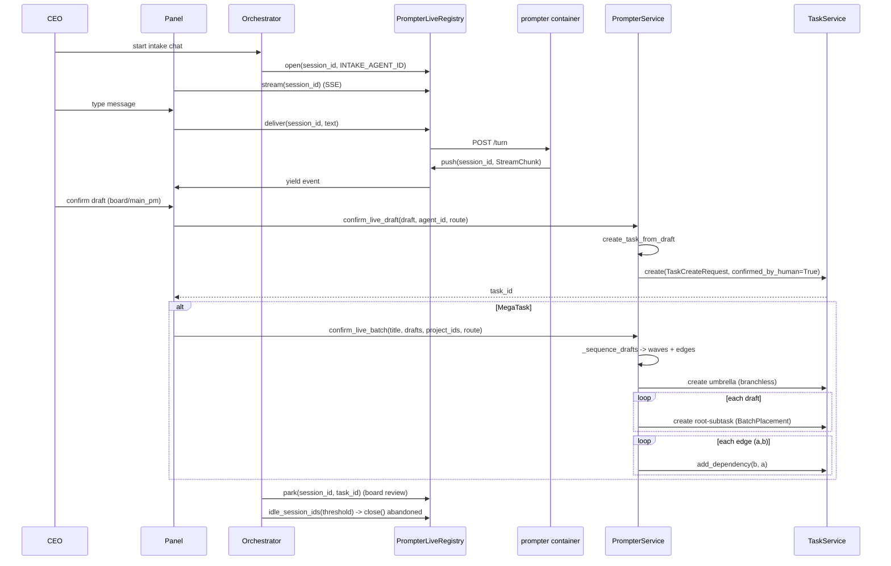
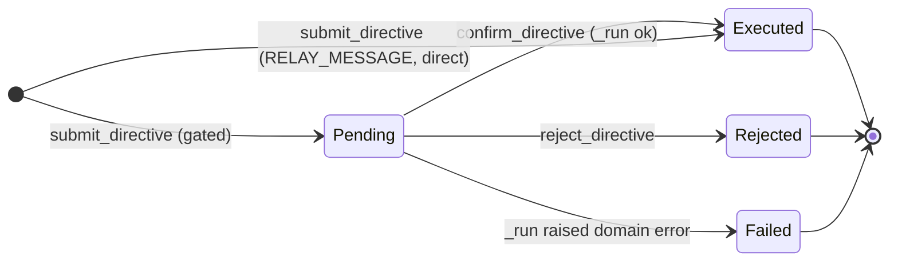

## Purpose
The CEO-facing intake and chief-of-staff slice. PrompterService turns a confirmed live-intake structured draft (or a MegaTask batch of drafts) into real Task rows, routing ownership/team and sequencing collision-free waves. PrompterLiveRegistry is the in-process bridge that relays a live chat between a spawned prompter/secretary container and the panel (SSE stream + turn delivery + park/idle lifecycle). SecretaryService reads company state and executes or gates the CEO's directives (relay/announce/charter/pitch/task-control), recording every directive auditably.

## Files

| Path | Role | LOC |
|---|---|---|
| roboco/services/prompter.py | PrompterService: create tasks from confirmed intake drafts (single + MegaTask batch), route owning team, sequence drafts into waves; plus pure description/readiness helpers, the wave-1/2 prompter-memory history-digest builders, and compact task-search row rendering | 1313 |
| roboco/services/prompter_live.py | PrompterLiveRegistry: process-wide singleton bridging live intake/secretary chat between panel (SSE) and spawned container (HTTP turn), with open/close/park/idle-reap lifecycle | 234 |
| roboco/services/secretary.py | SecretaryService: read company state + submit/confirm/reject gated CEO directives (relay/announce/charter/pitch/task-control incl. wave-1 full-content `edit` + claim-aware reassignment), persisted in secretary_directives | 418 |

## Key Symbols

| Name | Kind | File:Line | Responsibility |
|---|---|---|---|
| ReadinessTag | dataclass | roboco/services/prompter.py:71 | Parsed contents of an assistant turn's trailing roboco-meta JSON block (covered, ready, scale) |
| BatchPlacement | dataclass | roboco/services/prompter.py:80 | Where a draft sits in a MegaTask batch (parent_task_id, batch_id, sequence, team_override) |
| PrompterService | class | roboco/services/prompter.py:97 | Create tasks from confirmed intake drafts; pure draft/description helpers + DB-backed create |
| PrompterService._session | property | roboco/services/prompter.py:108 | Return the AsyncSession or raise ServiceError if constructed without one |
| PrompterService._assignee_is_board | method | roboco/services/prompter.py:118 | True if agent_id is a board/advisory role (PO / HoM / Auditor) |
| PrompterService._validate_draft_target | staticmethod | roboco/services/prompter.py:125 | A draft targets exactly one of project/product/per-cell-map, or none for an umbrella |
| PrompterService._resolve_owning_team | method | roboco/services/prompter.py:163 | Route owning team: team_override wins; if no product: multi-cell map (≥2 cells) -> MAIN_PM else lead cell; if product: board assignee -> BOARD else MAIN_PM (product/board routing checked BEFORE multi-cell force) |
| PrompterService._validate_and_coerce_draft | method | roboco/services/prompter.py:196 | Validate title+AC, coerce list fields (acceptance_criteria/what_this_builds/notes/the_work[].items) to list[str] in place |
| PrompterService._resolve_draft_assignee | method | roboco/services/prompter.py:243 | Explicit confirm-button assignment wins; else fall back to draft.assigned_to UUID |
| PrompterService._coerce_pm_code_to_planning | method | roboco/services/prompter.py:256 | Coerce code->planning when owner is a coordination PM role; two layers: team-based (main_pm_cannot_own_code) then assignee-based (pm_cannot_own_code); issue-resolution carve-out never applies for new intake tasks |
| PrompterService.create_task_from_draft | method | roboco/services/prompter.py:293 | Operate on a _copy_draft copy (caller never mutated), compose description, validate target, coerce enums, route team, coerce PM+code->planning via _coerce_pm_code_to_planning, persist via TaskService.create |
| PrompterService.confirm_live_draft | method | roboco/services/prompter.py:368 | Confirm a live-intake single draft -> create at PENDING assigned to product-owner (board) or main-pm route; return task id |
| PrompterService._sequence_drafts | method | roboco/services/prompter.py:419 | Build DraftSurface list and run SequencingService.analyze into waves; SequencingError -> ValidationError 400 |
| PrompterService.preview_batch | method | roboco/services/prompter.py:459 | Compute MegaTask waves+warnings WITHOUT creating (panel pre-confirm preview) |
| PrompterService._validate_batch_scope | staticmethod | roboco/services/prompter.py:473 | Each draft targets scoped repos via cell map or top-level project_id; union across drafts spans >=2 distinct projects |
| PrompterService.confirm_live_batch | method | roboco/services/prompter.py:524 | Create MegaTask umbrella + N sequenced root-subtasks, wire dependency edges; return umbrella_id/root_ids/waves/warnings |
| PrompterService.update_live_draft | method | roboco/services/prompter.py:628 | Apply a board-informed re-draft to an existing task in place; route via approve_and_start or re-board (clear board_review_complete) |
| PrompterService._resolve_uuid_field | staticmethod | roboco/services/prompter.py:676 | Parse draft_data[key] as UUID; None if absent, ValidationError if malformed |
| PrompterService._lead_cell_team | staticmethod | roboco/services/prompter.py:690 | Owner of a single-cell task: first valid Team in the_work, else default |
| PrompterService._coerce_draft_enums | staticmethod | roboco/services/prompter.py:704 | Coerce team/task_type/nature/complexity to valid enums; default on invalid/missing so confirm never hard-fails |
| PrompterService._coerce_priority | staticmethod | roboco/services/prompter.py:734 | Coerce priority (word or number) to int 0-3, default 2 |
| parse_readiness | function | roboco/services/prompter.py:786 | Split assistant reply into (clean_text, ReadinessTag) from trailing roboco-meta JSON fence |
| _as_work_entry | function | roboco/services/prompter.py:818 | Normalize a the_work entry (bare string -> {team:str}) so .get works on all entries |
| _cell_teams | function | roboco/services/prompter.py:835 | Distinct cell team values present in the_work, in order |
| _draft_cell_map | function | roboco/services/prompter.py:846 | Per-cell (team, project_id) map from the_work entries; de-duped by team; the multi-cell MegaTask root-subtask seam |
| derive_scale | function | roboco/services/prompter.py:882 | 'multi' when >1 cell participates, else 'single' |
| _clean_list | function | roboco/services/prompter.py:947 | coerce_str_list wrapper: trimmed non-empty string items, extracting dict-wrapped text |
| _copy_draft | function | roboco/services/prompter.py:956 | Shallow copy of draft dict with the_work unit dicts also copied, so _validate_and_coerce_draft cannot mutate the caller's dict |
| _text | function | roboco/services/prompter.py:896 | Trimmed string from a possibly-missing scalar |
| _bullets | function | roboco/services/prompter.py:901 | Render a markdown bullet list |
| _cell_label | function | roboco/services/prompter.py:906 | Display label for a team value |
| _render_work_entry | function | roboco/services/prompter.py:911 | Render one cell's slice: bold heading + summary + deliverable bullets |
| _render_the_work | function | roboco/services/prompter.py:926 | Render The Work section, prepending a board-led lead line when multi-cell |
| _section | function | roboco/services/prompter.py:938 | Append a markdown section when its body is non-empty |
| format_board_briefing | function | roboco/services/prompter.py:944 | Render board review entries into a markdown briefing to seed a re-draft intake session |
| compose_redraft_message | function | roboco/services/prompter.py:969 | Seed message for a re-draft session: current draft + board feedback |
| compose_description | function | roboco/services/prompter.py:985 | Deterministically build the markdown description from structured fields; fall back to model description if too sparse (<20 chars) |
| _compose_umbrella_draft | function | roboco/services/prompter.py:1015 | Build the branchless umbrella draft from batch + wave plan; task_type=planning |
| get_prompter_service | function | roboco/services/prompter.py:1059 | Factory: construct PrompterService with optional db session |
| LiveIntakeSession | dataclass | roboco/services/prompter_live.py:39 | One live chat: session_id, agent_id, asyncio queue, closed flag, parked task_id, last_activity timestamp |
| PrompterLiveRegistry | class | roboco/services/prompter_live.py:58 | Tracks live intake/secretary sessions; bridges panel<->container via push/stream/deliver; lifecycle open/close/park |
| PrompterLiveRegistry.open | method | roboco/services/prompter_live.py:68 | Register a live session; idempotent (returns existing un-closed session instead of orphaning its SSE queue) |
| PrompterLiveRegistry.get | method | roboco/services/prompter_live.py:88 | Return the session or None |
| PrompterLiveRegistry.is_alive | method | roboco/services/prompter_live.py:91 | True when a live un-closed session exists (panel reload reconnect decision) |
| PrompterLiveRegistry.close | method | roboco/services/prompter_live.py:101 | End a session: pop, mark closed, push _CLOSE sentinel to unblock the SSE stream |
| PrompterLiveRegistry.close_by_agent | method | roboco/services/prompter_live.py:110 | Close every live session bound to agent_id (forced kill); optional final error event; returns closed ids |
| PrompterLiveRegistry.park | method | roboco/services/prompter_live.py:129 | Mark session parked awaiting board review of task_id (keeps it alive for in-context re-draft) |
| PrompterLiveRegistry.find_by_task | method | roboco/services/prompter_live.py:148 | Return the live un-closed session parked for task_id, if any |
| PrompterLiveRegistry.push | method | roboco/services/prompter_live.py:157 | Queue one agent event for SSE; bump last_activity; False if no/gone session |
| PrompterLiveRegistry.idle_session_ids | method | roboco/services/prompter_live.py:166 | Return (session_id, agent_id) idle past threshold; excludes closed and board-parked sessions |
| PrompterLiveRegistry.stream | method | roboco/services/prompter_live.py:185 | Async generator yielding queued events until _CLOSE sentinel |
| PrompterLiveRegistry.deliver | method | roboco/services/prompter_live.py:198 | POST the human's text to the container's /turn receiver; bump last_activity; debug-log transient failures |
| get_live_registry | function | roboco/services/prompter_live.py:230 | Process-wide singleton accessor (lazily instantiates PrompterLiveRegistry) |
| SecretaryService | class | roboco/services/secretary.py:54 | Read company state + execute/queue CEO directives; BaseService subclass bound to a session |
| SecretaryService.read_company_state | method | roboco/services/secretary.py:63 | Aggregate goals + task counts + proposed pitches + pending directives for the CEO dashboard |
| SecretaryService.read_task | method | roboco/services/secretary.py:79 | Read a single task's id/title/status/team/assignee/description or NotFoundError |
| SecretaryService.get_directive | method | roboco/services/secretary.py:96 | Fetch a directive row by id or None |
| SecretaryService.list_directives | method | roboco/services/secretary.py:104 | List directives ordered by requested_at desc, optional status filter |
| SecretaryService.submit_directive | method | roboco/services/secretary.py:115 | Validate payload; persist row; if gated -> notify CEO pending + return; else run immediately |
| SecretaryService.confirm_directive | method | roboco/services/secretary.py:134 | CEO confirms a pending directive: set decided_by, run it |
| SecretaryService.reject_directive | method | roboco/services/secretary.py:142 | CEO rejects a pending directive: REJECTED + decided_by/at + result reason |
| SecretaryService.to_dict | staticmethod | roboco/services/secretary.py:153 | Serialize a directive row to a dict for API response |
| SecretaryService._pending_or_raise | method | roboco/services/secretary.py:171 | Fetch directive; NotFoundError if missing, ConflictError if not PENDING |
| SecretaryService._validate_payload | staticmethod | roboco/services/secretary.py:182 | Require the per-kind payload keys from _REQUIRED_PAYLOAD else ValidationError |
| SecretaryService._run | method | roboco/services/secretary.py:188 | Execute a directive: set result, EXECUTED on success, FAILED+error message on caught domain errors |
| SecretaryService._execute | method | roboco/services/secretary.py:246 | Dispatch by kind: relay/announce deliver via notification, update_charter upsert, approve_pitch approve+provision, else _control_task |
| SecretaryService._EDITABLE_TASK_FIELDS | ClassVar[frozenset] | roboco/services/secretary.py:278 | Wave-1: the full content-field allowlist the Secretary may edit on CEO confirmation (title/description/acceptance_criteria/priority/team/estimated_complexity/nature/assigned_to) — status is deliberately excluded (its own audited start/cancel/override path); git fields (branch/PR) are never editable |
| SecretaryService._control_task | method | roboco/services/secretary.py:302 | Task control action dispatch: **edit** (wave-1, full content surface via _edit_task), start (approve_and_start), cancel, or override status with CEO as actor |
| SecretaryService._edit_task | method | roboco/services/secretary.py:325 | Wave-1: apply the Secretary's edit — allowlisted content fields go through TaskService.update after enum coercion (team/estimated_complexity/nature); assigned_to is popped out and routed through claim-aware reassignment (_reassign_task) instead of a plain field set |
| SecretaryService._reassign_task | method | roboco/services/secretary.py:362 | Route an edit's reassignment through claim-aware paths: reassign_active_claim (reseeds heartbeat) when the task is claimed/in_progress, else the general reassign (review-state handoffs, or explicit unassign) — never a naive setattr on assigned_to |
| SecretaryService._resolve_assignee | method | roboco/services/secretary.py:384 | Resolve an edit's assigned_to to a UUID: accepts None (unassign), a UUID string, or an agent slug (same convention as the CEO chat's REST PATCH path) |
| SecretaryService._notify_ceo_pending | method | roboco/services/secretary.py:403 | Send an ack notification to the CEO that a gated directive awaits confirmation |
| get_secretary_service | function | roboco/services/secretary.py:416 | Factory: construct SecretaryService bound to a session |
| build_history_digest | function | roboco/services/prompter.py:1221 | Wave-1/2 prompter memory: render a chronological digest of recent tasks (top `limit`, reversed to oldest-first for a timeline read) into markdown bullet lines; empty input -> "" |
| project_history_digest | function | roboco/services/prompter.py:1236 | One project's rendered history digest via `TaskService.list_recent_for_project`; None if the project has no tasks |
| history_digest_layer | function | roboco/services/prompter.py:1253 | Ambient task-history-digest block for the in-scope project(s), one sub-block per project (headed by slug when >1 — the MegaTask case); None when no in-scope project has any tasks (no empty-header noise) |
| compact_task_rows | function | roboco/services/prompter.py:1286 | Render TaskTable rows into the compact id/title/status/team/priority dicts returned by the intake `search_past_tasks` HTTP route |
| TaskService.list_recent_for_project | method | roboco/services/task.py:6361 | Recent non-cancelled tasks for a project ordered by coalesce(completed_at, updated_at, created_at) desc — backs the prompter's per-project history digest so a just-touched task surfaces ahead of an old completed one; CANCELLED tasks are excluded (abandoned work is not precedent) |
| TaskService.search_tasks | method | roboco/services/task.py:6384 | Case-insensitive ILIKE search over title/description + id-prefix match; backs the panel's task search bar (GET /tasks/summary?q=), the Secretary's task-by-name lookup (GET /secretary/tasks?q=), and the intake `search_past_tasks` tool |
| search_past_tasks (route) | route | roboco/api/routes/prompter_live.py:376 | GET /live/{session}/search-tasks: session-aliveness-gated (mirrors /events' trust boundary — the intake container has no agent identity) bounded compact search calling TaskService.search_tasks + compact_task_rows |
| query_past_tasks / format_search_results | function | roboco/mcp/intake_server.py:108,145 | Shared HTTP-call + bounding + rendering logic for `search_past_tasks`, module-level so both the grok MCP tool and the Claude SDK in-process tool call the exact same implementation |
| search_past_tasks (grok MCP tool) | mcp tool | roboco/mcp/intake_server.py:161 | Grok-CLI intake's "have we done something like this before?" tool; reads ROBOCO_PROMPTER_SESSION_ID, delegates to query_past_tasks + format_search_results |
| _search_past_tasks (Claude SDK in-process tool) | tool | roboco/agent_sdk/intake_driver.py:512 | Claude SDK driver's in-process parity tool for the same feature — imports query_past_tasks/format_search_results from intake_server.py directly (one implementation, both runtimes) |

## Data Flow
Intake: the orchestrator spawns a prompter container and calls PrompterLiveRegistry.open(session_id, INTAKE_AGENT_ID); the panel SSE endpoint calls stream() and the message endpoint calls deliver() -> POST http://roboco-agent-{agent_id}:{SDK_PORT}/turn. The container driver POSTs normalized StreamChunks to the relay push() endpoint. When the agent emits a roboco-meta fence, parse_readiness extracts ReadinessTag (covered/ready/scale) used by the orchestrator to decide proposal readiness. The CEO confirms via panel: confirm_live_draft (single) or confirm_live_batch (MegaTask) -> PrompterService.create_task_from_draft -> TaskService.create (DB). For a batch, _sequence_drafts (pure SequencingService.analyze) computes waves/edges, the umbrella is created branchless via _compose_umbrella_draft, N root-subtasks are created with BatchPlacement(parent=umbrella, batch_id, sequence=wave_index), then TaskService.add_dependency wires each edge (b depends on a). preview_batch returns the same waves without creating. update_live_draft applies board feedback to an existing task (update + approve_and_start or re-board). On board review, registry.park(session_id, task_id) keeps the chat alive; find_by_task recovers it for the re-draft injection. Idle sweep: orchestrator calls idle_session_ids(threshold) and close()s abandoned chats; close_by_agent fires on forced kill. Secretary: routes /api/secretary/* call read_company_state/read_task/submit_directive/confirm_directive/reject_directive -> SecretaryService -> TaskService/CompanyGoalsService/PitchService/NotificationService (relay/announce deliver via notification to the target agent(s)); gated kinds (UPDATE_CHARTER/CONTROL_TASK/APPROVE_PITCH/ANNOUNCE) persist PENDING + notify CEO, then confirm_directive runs _execute with the CEO as actor; RELAY_MESSAGE runs immediately. A CONTROL_TASK directive's payload["action"] fans out inside _control_task: "edit" (wave-1) is the new full-content path — _edit_task applies the allowlisted fields via TaskService.update after enum coercion, and pops assigned_to for claim-aware reassignment (_reassign_task) rather than a plain field set; "start"/"cancel"/"override" are the pre-existing status-only actions. The CEO refers to tasks by NAME in the Secretary chat, so GET /api/secretary/tasks?q= (TaskService.search_tasks) resolves a name to a concrete id before a directive targets it. Prompter memory (wave 1/2): at intake spawn, the orchestrator's `_resolve_history_digest_ambient` calls `history_digest_layer`, which fans out `project_history_digest` per in-scope project — each pulling `TaskService.list_recent_for_project` and rendering it via `build_history_digest` — into one ambient "Recent tasks" block injected into the spawn prompt; mid-conversation, the intake agent's `search_past_tasks` tool (routed through `query_past_tasks`/`format_search_results` in roboco/mcp/intake_server.py, shared byte-for-byte with the Claude SDK's in-process `_search_past_tasks` tool in roboco/agent_sdk/intake_driver.py) hits GET /live/{session}/search-tasks -> TaskService.search_tasks -> compact_task_rows.

## Mermaid




## Logical Tree
```
intake-secretary
  PrompterService (roboco/services/prompter.py)
    Draft validation & coercion
      _validate_and_coerce_draft
      _validate_draft_target (project/product/cell-map/umbrella)
      _coerce_draft_enums (team/task_type/nature/complexity)
      _coerce_priority
      _resolve_uuid_field
      _resolve_draft_assignee
    Team routing
      _resolve_owning_team
      _assignee_is_board
      _lead_cell_team
    Task creation
      create_task_from_draft (single + placement)
      confirm_live_draft (board / main_pm route)
      update_live_draft (re-draft in place)
    MegaTask batch
      _sequence_drafts -> SequencingService.analyze
      preview_batch (no-create preview)
      _validate_batch_scope (>=2 distinct projects, in-scope)
      confirm_live_batch (umbrella + N root-subtasks + edges)
      _compose_umbrella_draft
    Pure helpers
      parse_readiness, compose_description, format_board_briefing, compose_redraft_message
      _as_work_entry, _cell_teams, _draft_cell_map, derive_scale, _clean_list, _text, _bullets, _cell_label, _render_work_entry, _render_the_work, _section
    Prompter memory (wave 1/2): build_history_digest, project_history_digest, history_digest_layer, compact_task_rows
    Dataclasses: ReadinessTag, BatchPlacement
  PrompterLiveRegistry (roboco/services/prompter_live.py)
    LiveIntakeSession dataclass (queue, closed, task_id, last_activity)
    Lifecycle: open, get, is_alive, close, close_by_agent, park, find_by_task
    Agent->panel: push, stream, idle_session_ids
    Panel->agent: deliver (POST /turn)
    Singleton: _RegistryHolder, get_live_registry
  SecretaryService (roboco/services/secretary.py)
    Reads: read_company_state, read_task
    Directives: get_directive, list_directives, submit_directive, confirm_directive, reject_directive, to_dict
    Internals: _pending_or_raise, _validate_payload, _run, _execute, _control_task, _notify_ceo_pending
    Task edit (wave-1): _EDITABLE_TASK_FIELDS, _edit_task, _reassign_task (claim-aware), _resolve_assignee (uuid-or-slug)
```

## Dependencies
- Internal: roboco.services.task.get_task_service / TaskService, roboco.services.sequencing.SequencingService, roboco.services.company_goals.get_company_goals_service, roboco.services.pitch.get_pitch_service, roboco.services.notification.NotificationService, roboco.services.base.BaseService/NotFoundError/ConflictError/ValidationError/ServiceError, roboco.db.tables.AgentTable/TaskTable/SecretaryDirectiveTable, roboco.foundation.identity.CELL_TEAMS/AGENTS/role_for_uuid_or_none, roboco.foundation.policy.batch.is_batch_umbrella/main_pm_cannot_own_code/pm_cannot_own_code, roboco.foundation.policy.content.validators.coerce_str_list, roboco.foundation.policy.sequencing.models.DraftSurface/SequencePlan/SequencingError, roboco.foundation.policy.lifecycle (TaskStatus source), roboco.models.base (AgentRole/Complexity/TaskNature/TaskStatus/TaskType/Team), roboco.models.product.ProductCellMapping, roboco.models.task.TaskCreateRequest, roboco.models.secretary (DirectiveKind/DirectiveStatus/GATED_KINDS), roboco.seeds.initial_data.AGENT_UUIDS, roboco.utils.converters.require_uuid
- External: sqlalchemy (select, AsyncSession), structlog, httpx, asyncio, contextlib, json, re, dataclasses, uuid, datetime

## Entry Points

| Name | File | Trigger |
|---|---|---|
| POST /api/prompter/live/{session}/confirm-draft (confirm_live_draft) | roboco/api/routes/prompter_live.py | panel confirm button -> PrompterService.confirm_live_draft |
| POST /api/prompter/live/{session}/confirm-batch (confirm_live_batch) | roboco/api/routes/prompter_live.py | panel MegaTask confirm -> PrompterService.confirm_live_batch |
| GET /api/prompter/live/preview-batch (preview_batch) | roboco/api/routes/prompter_live.py | panel pre-confirm preview -> PrompterService.preview_batch |
| POST /api/prompter/live/{session}/redraft (update_live_draft) | roboco/api/routes/prompter_live.py | panel re-draft confirm -> PrompterService.update_live_draft |
| relay push/stream/deliver/is_alive endpoints | roboco/api/routes/prompter_live.py + secretary_live.py | panel SSE + message POST over PrompterLiveRegistry |
| orchestrator live-intake spawn/reap/idle hooks | roboco/runtime/orchestrator.py | _spawn_intake_container / _spawn_secretary_container / idle-reap sweep / board-review park / close_by_agent on kill |
| GET /api/prompter/live/{session}/search-tasks (search_past_tasks) | roboco/api/routes/prompter_live.py | Intake agent's `search_past_tasks` tool -> TaskService.search_tasks + compact_task_rows; session-aliveness-gated |
| POST /api/secretary/state, /task, /directive, /directive/{id}/confirm\|reject | roboco/api/routes/secretary.py | Secretary panel surface -> SecretaryService reads + directive lifecycle |
| GET /api/secretary/tasks?q= (search_tasks) | roboco/api/routes/secretary.py | Secretary or CEO resolves a task NAME to concrete id(s) -> TaskService.search_tasks, for targeting a `control_task` directive |

## Config Flags
- ROBOCO_WORKSPACE_AUTO_CLONE / ROBOCO_WORKSPACE_CLONE_TIMEOUT (intake multi-repo clone scope: _clone_intake_scope, indirectly via orchestrator)
- ROBOCO_SELF_HEAL_ORIGINATE_ENABLED etc. do NOT gate this slice
- No direct ROBOCO_* flag in these three files; intake is a core capability (not feature-flagged), secretary is always-on; MegaTask is additive core, not gated


## Gotchas
- PrompterLiveRegistry.open is deliberately idempotent: a second open for an un-closed session returns the existing one instead of swapping the queue, because stream() captures the queue once and a fresh queue would strand the browser SSE on the old one while events push to the new one.
- Registry is a process-wide singleton held on _RegistryHolder (not a `global`); orchestrator is single-process and holds container state in memory — the relay is in-process only, not cross-process.
- deliver() logs transient POST failures at DEBUG (not ERROR) because the opening-message delivery retries until the container receiver is up; callers surface real failure (the /messages route 404s, _deliver_when_ready warns once after N tries).
- park() keeps a session alive (opposite of close) so board feedback can be injected in-context for an in-place re-draft; idle_session_ids explicitly excludes task_id-set (parked) sessions from idle reaping.
- TaskService is imported lazily inside create_task_from_draft / confirm_live_batch / update_live_draft to avoid circular imports.
- PM + code is structurally impossible: intake coerces code->planning via `_coerce_pm_code_to_planning`, which has two layers — team-based (main_pm_cannot_own_code) and assignee-based (pm_cannot_own_code for any PM assignee on a cell team). The umbrella is task_type=planning. TaskService.create is the backstop for non-intake HTTP paths.
- AGENTS['ceo'].uuid is captured at import time as _CEO_ID in secretary.py — CEO identity is a fixed seed uuid, not a DB lookup.
- _draft_cell_map de-dupes by team (first mapping wins) because task_cell_projects is unique per (task, team); a second the_work entry for the same cell is silently dropped.
- _compose_umbrella_draft produces a draft with NO project_id/product_id (branchless); _validate_draft_target's umbrella branch hard-rejects any target on it.
- Secretary _run catches ConflictError/NotFoundError/ValidationError/ValueError/KeyError -> FAILED with `error: {exc}` in result; any other exception propagates (no rollback of the flush).
- GATED_KINDS = {UPDATE_CHARTER, CONTROL_TASK, APPROVE_PITCH, ANNOUNCE}; only RELAY_MESSAGE runs immediately on submit_directive — ANNOUNCE is gated (needs CEO confirm), despite being a 'post a message' shape.
- compose_description falls back to the raw model description if the composed body is < _MIN_DESCRIPTION_LEN (20) chars — so a too-sparse structured draft still clears the schema minimum.
- SecretaryService._edit_task never touches status — _EDITABLE_TASK_FIELDS deliberately excludes it (status rides the separate audited start/cancel/override actions), so an "edit" directive that also needs a status change requires a second CONTROL_TASK directive.
- SecretaryService._reassign_task branches on the task's CURRENT status at call time: claimed/in_progress goes through reassign_active_claim (reseeds the heartbeat so the new assignee isn't immediately stale to the reaper), everything else falls through to the general reassign — a caller relying on one code path for both is testing the wrong branch depending on task state.
- history_digest_layer / build_history_digest return None / "" respectively on no data — a brand-new project or a board-level (no-project) spawn injects nothing into the ambient prompt (no empty "Recent tasks" header noise), which also means there is no explicit signal in the prompt that the digest was even attempted.
- search_past_tasks (both the grok MCP tool and the Claude SDK in-process tool) reads ROBOCO_PROMPTER_SESSION_ID from the environment and calls the session-scoped HTTP route — a tool call with no live session (or a session the registry has already closed) returns a plain string error, not an exception, so a stale intake container can call it silently forever without a hard failure surfacing.


## Changes Since Baseline

| SHA | Subject | Impact |
|---|---|---|
| 15effce0 | feat(megatask): per-cell project map root-subtasks (multi-project, multi-cell) + main_pm+code impossibility + re-draft/batch hardening | Only commit touching this slice since baseline (prompter.py +228/-55; prompter_live.py and secretary.py unchanged). Adds the ad-hoc per-cell project map as a third draft target shape: _draft_cell_map, _MULTI_CELL_MIN, has_cell_projects param on _validate_draft_target, cell_projects on TaskCreateRequest, _validate_batch_scope counting per-cell pids. Adds main_pm_cannot_own_code coercion (code->planning) and switches umbrella task_type CODE->PLANNING. Extracts _validate_and_coerce_draft (coerces list fields via coerce_str_list) and _resolve_draft_assignee. Adds _as_work_entry to tolerate bare-string the_work entries. Changes _clean_list to use coerce_str_list (extracts dict-wrapped text instead of str(dict)). |

> Post-snapshot updates (since 2026-06-29): 536bbb64 (Chore/all/logical gaps sweep, PR#286, 2026-06-30) touched prompter.py only (prompter_live.py and secretary.py still unchanged). Key changes: (1) fixes Risk #1 — 1-cell map branch now conditioned on `resolved_project_id is None and resolved_product_id is None` so a top-level target is no longer silently dropped; (2) fixes Risk #2 — `_draft_cell_map` now raises `ValidationError` on a malformed project_id instead of silently continuing; (3) fixes Risk #4 — `create_task_from_draft` calls `_copy_draft` first so `_validate_and_coerce_draft` never mutates the caller's dict; (4) fixes Risk #5 — product/board routing is now checked BEFORE the multi-cell map force (multi-cell is inside the `if resolved_product_id is None:` branch); (5) extracts code->planning coercion into `_coerce_pm_code_to_planning`, extending it to cover PM assignees on any team (via the new `pm_cannot_own_code` helper imported from `roboco.foundation.policy.batch`); (6) adds `_copy_draft` module-level function. LOC grew from ~1066 to 1142.
>
> `d1cf6ecb` Wave 1: PR-gate turn cut, task search, trace timestamps, Secretary edits + e2e scenarios 2–3 (#295) — secretary.py gains the full `edit` action (`_EDITABLE_TASK_FIELDS`, `_edit_task`, `_reassign_task`, `_resolve_assignee`) on `_control_task`; prompter.py gains the prompter-memory digest builders (`build_history_digest`, `project_history_digest`, `history_digest_layer`, `compact_task_rows`) plus the `TaskService.list_recent_for_project` / `search_tasks` backing queries; adds the `GET /live/{session}/search-tasks` route and the `search_past_tasks` MCP tool + Claude-SDK in-process parity tool. First commit to touch secretary.py since baseline.
>
> `da563487` Wave 2 features: A2A live view (CEO chime-in + reply budget) and prompter memory (#297) / `876e19b3` A2A switchboard + Secretary/PM task access + closed over-permission hole (#298) — no further changes to prompter.py/prompter_live.py/secretary.py beyond wave 1 above; these two commits' Secretary/PM-access work landed in `roboco/api/routes/tasks.py` (`_pm_editor_scope` / `_enforce_pm_lighter_fields`, closing the PM-role unrestricted-admin hole — out of this slice, see `docs/map/api-routes-schemas.md`) and their A2A work is entirely in `docs/map/a2a-audit-journal-permissions.md`.
>
> **"prompter-memory" (wave 2 tweak)**: `TaskService.list_recent_for_project` (task.py:6361) now excludes `TaskStatus.CANCELLED` — abandoned work is no longer precedent an intake agent's history digest treats as shipped or in-flight. Companion prompt guidance: `agents/prompts/roles/prompter.md` gains a `## Task history — don't propose what's already been done` section instructing the agent to check the ambient `## Task History` digest and the `search_past_tasks` tool before drafting — avoid duplicates (name a shipped/in-flight precedent by short id instead of quietly re-drafting it), cite precedent in a follow-up task's `notes`/`what_this_builds`, and let MegaTask sequencing be informed by (not overridden by) observed staging patterns. Informational only — the sequencing analyzer (`SequencingService`) keeps ownership of actual ordering.

## Regression Risks

| Title | File:Line | Claim | Severity |
|---|---|---|---|
| ~~1-cell map silently drops product_id and top-level project_id~~ **RESOLVED 536bbb64** | roboco/services/prompter.py:346 | ~~When _draft_cell_map returns exactly 1 entry, create_task_from_draft overwrites resolved_project_id with cell_map[0][1] and forces resolved_product_id=None.~~ Fixed: the 1-cell branch is now guarded by `resolved_project_id is None and resolved_product_id is None`; a top-level target is preserved over a redundant 1-cell map. | ~~medium~~ fixed |
| ~~Invalid project_id in a multi-cell map silently collapses the shape~~ **RESOLVED 536bbb64** | roboco/services/prompter.py:926 | ~~_draft_cell_map skips any the_work entry whose project_id fails UUID(str(pid)) (try/except continues).~~ Fixed: _draft_cell_map now raises `ValidationError` (clean 400) for a present-but-malformed project_id instead of silently continuing; the human is prompted to re-enter it. | ~~medium~~ fixed |
| Umbrella target gate is a behavior tightening that could reject previously-tolerated drafts | roboco/services/prompter.py:139 | The rewritten _validate_draft_target now hard-rejects an umbrella (is_batch_umbrella) that carries ANY target (project/product/cell-map). Before this commit an umbrella with only a project_id (no product_id) would not raise. Internal _compose_umbrella_draft never sets a project_id so the happy path is safe, but any external caller that builds a BatchPlacement(is_umbrella=True) draft with a stray project_id now gets a ValidationError instead of silent acceptance. | low |
| _clean_list semantics changed: dict-wrapped items now extracted instead of str(dict) | roboco/services/prompter.py:887 | _clean_list now delegates to coerce_str_list, which extracts text from dict-wrapped items (e.g. {'$text': ...}) instead of rendering `str(dict)`. This changes the rendered description text for any draft whose list fields contain dict-wrapped items. If coerce_str_list returns an unexpected shape for a non-string non-dict item (e.g. a list-of-lists), the rendered bullets / intended_to_touch / batch-scope counting could differ from the prior behavior. | low |
| ~~_validate_and_coerce_draft mutates the caller's draft dict in place~~ **RESOLVED 536bbb64** | roboco/services/prompter.py:207 | ~~_validate_and_coerce_draft overwrites draft_data fields in place; create_task_from_draft and confirm_live_batch callers were guarded by dict() copies but update_live_draft was not.~~ Fixed: create_task_from_draft now calls `_copy_draft(draft_data)` first (deep-copies the_work unit dicts too); the remaining concern for update_live_draft (no _validate_and_coerce_draft call) is unchanged. | ~~medium~~ partially fixed |
| ~~Multi-cell map team routing precedes product/board routing~~ **RESOLVED 536bbb64** | roboco/services/prompter.py:163 | ~~_resolve_owning_team checked multi-cell before product/board.~~ Fixed: product/board routing is now checked first (`if resolved_product_id is None:` gates the multi-cell path); a product draft with a ≥2-cell the_work map stays on the board-review path as required. The representation limit (product + cell-map not simultaneously expressible) is intentional, not a bug. | ~~low~~ fixed |

## Health
The slice is coherent and well-defended. prompter_live.py remains unchanged since baseline and reads as a clean, focused singleton with correct lifecycle semantics (idempotent open, sentinel-based stream close, park-vs-close distinction). prompter.py and secretary.py both changed in wave 1 (`d1cf6ecb`): prompter.py gained the per-cell MegaTask map shape, the main_pm+code->planning coercion that closes the 2026-06-27 meltdown class, AND the prompter-memory digest builders (history digest + compact task search) — its validation is stricter and coercion is robust against LLM-emitted shapes (bare-string the_work, dict-wrapped list items, word-valued priority). secretary.py gained a genuinely new capability (the full-content `edit` directive action with claim-aware reassignment), its first change since baseline; the split between the allowlisted content fields and the status-only start/cancel/override actions is clean and the reassignment logic correctly branches on claim state. The main integrity concerns are two pre-existing silent-collapse paths in the cell-map handling: a 1-cell map silently drops product_id/top-level project_id, and a malformed project_id in a multi-cell map silently collapses the shape to single-cell — neither raises, so an LLM producing a slightly-off draft will create a mis-shaped task instead of a clean 400. The update_live_draft path skips the new _validate_and_coerce_draft guard, so re-drafts are not protected against empty-after-coercion AC. No drift from CLAUDE.md was found; the MegaTask umbrella is branchless/planning, ANNOUNCE is gated, and single-task intake is preserved. Overall the slice is healthy but the silent-collapse edges warrant a hardening pass to convert them into ValidationErrors.
