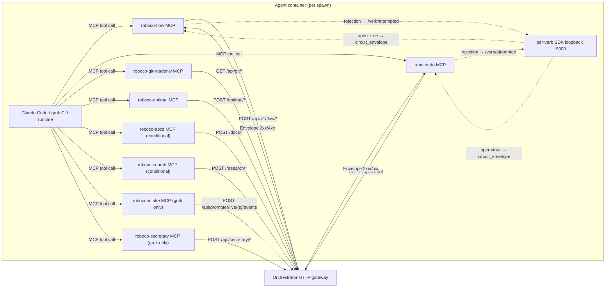

# RoboCo Slice Map — `mcp-servers`

Scope: `roboco/mcp/` (every server file + `schemas/` + `utils.py`). Repo root: `/Users/renzof/Documents/GitHub/ZZZ/roboco-master/roboco`.

## Purpose

The `roboco/mcp` package is the agent-side MCP gateway: a set of `FastMCP` server processes that run **inside each agent container** and expose the RoboCo intent-verb / content-tool / RAG / docs / git-readonly / intake / secretary / web-research surfaces to the Claude Code or grok-CLI runtime as MCP tools. They are thin bridges — every tool either POSTs to the orchestrator's HTTP gateway (`/api/v1/flow/*`, `/api/v1/do/*`, `/api/git/*`, `/optimal/*`, `/docs/*`, `/research/*`, `/api/secretary/*`, `/api/prompter/live/*`) or, for the flow/do path, additionally forwards rejections to a per-container SDK loopback (`ROBOCO_SDK_URL`) that runs the per-verb circuit breaker. The orchestrator (not the MCP layer) is the authority for role scoping, state transitions, and git-side effects; the MCP layer only shapes calls, classifies rejections, and substitutes `circuit_open` envelopes when the breaker trips.

## Files

| Path | Role | approx LOC |
|------|------|------------|
| `roboco/mcp/__init__.py` | Package docstring only — deliberately import-free so `python -m roboco.mcp.<name>` does not pull sibling modules (esp. `optimal_server`'s pgvector/ollama stack, ~6s startup). | 23 |
| `roboco/mcp/utils.py` | Shared HTTP helpers: `_get_agent_headers`, `format_error_response`, `ApiResponse`, `ApiClient` (async httpx wrapper). Used by `optimal_server`, `docs_server`, `search_server`. | 383 |
| `roboco/mcp/schemas/__init__.py` | Pydantic input models. After Phase-4 T9 deletions only `WriteDocInput` remains. | 35 |
| `roboco/mcp/flow_server.py` | `roboco-flow` MCP server — intent verbs (lifecycle). Manifest-scoped registration, role-scoped path `/api/v1/flow/<route>/<verb>`, per-verb circuit breaker + 404-route synthesis. | 1028 |
| `roboco/mcp/do_server.py` | `roboco-do` MCP server — content tools (commit, note, pitch, propose_roadmap, dm, notify, evidence, progress, playbook curation, pr_update). Manifest-scoped; fixed `/api/v1/do/<verb>` path; mirror circuit breaker. | 976 |
| `roboco/mcp/optimal_server.py` | `roboco-optimal` MCP server — RAG / KB / mentor / error / decision / standards / learnings / index-mgmt / proactive-context. Factory `create_optimal_mcp_server(agent_id)`; calls `/optimal/*`. | 1102 |
| `roboco/mcp/docs_server.py` | `roboco-docs` MCP server — docs write/read/list/delete via `/docs/*`. Factory `create_docs_mcp_server(agent_id)`. RAG-based dedup on write. | 251 |
| `roboco/mcp/git_readonly.py` | `roboco-git-readonly` MCP server — four read-only git views (status/log/diff/branch list) via `/api/git/*`. No breaker, no manifest. | 123 |
| `roboco/mcp/intake_server.py` | `roboco-intake` MCP server — grok intake path only: `propose_draft` / `propose_batch` POST directly to the prompter-live relay. | 215 |
| `roboco/mcp/secretary_server.py` | `roboco-secretary` MCP server — grok secretary path only: `read_company_state` / `read_task` / `submit_directive`, delegating to `agent_sdk.secretary_driver`. | 64 |
| `roboco/mcp/search_server.py` | `roboco-search` MCP server — `web_search` / `web_fetch` via `/research/*` (provider key stays server-side). Factory `create_search_mcp_server(agent_id)`. | 130 |

(Excluded: `__pycache__/`, `.DS_Store`.)

## Key Symbols

| Name | Kind | File:Line | Responsibility |
|------|------|-----------|----------------|
| `mcp` (flow) | `FastMCP` | `flow_server.py:252` | Server instance `roboco-flow`; tools registered onto it at import time. |
| `mcp` (do) | `FastMCP` | `do_server.py:220` | Server instance `roboco-do`. |
| `mcp` (git-readonly) | `FastMCP` | `git_readonly.py:31` | Server instance `roboco-git-readonly`. |
| `mcp` (intake) | `FastMCP` | `intake_server.py:32` | Server instance `roboco-intake`. |
| `mcp` (secretary) | `FastMCP` | `secretary_server.py:30` | Server instance `roboco-secretary`. |
| `StrList` | type alias | `flow_server.py:39` | `Annotated[list[str], BeforeValidator(coerce_str_list)]` — tolerates Claude SDK's nested XML-ish tool-input shapes before MCP validation rejects. |
| `_CIRCUIT_REJECTION_KINDS` | frozenset | `flow_server.py:66`, `do_server.py:50` | The 4 breaker-counted kinds: `tracing_gap`, `invalid_state`, `not_authorized`, `incomplete_input`. |
| `_DICT_ERROR_CODE_MAP` | dict | `flow_server.py:89`, `do_server.py:73` | Exact code→kind map for known RobocoError codes (e.g. `AUTHENTICATION_REQUIRED`→`not_authorized`). Unknown codes fall through to a substring branch for forward-compat. Added in 536bbb64 to fix AUTHENTICATION_REQUIRED mis-routing (#161). |
| `_classify_dict_error_code` | func | `flow_server.py:110`, `do_server.py:94` | Map a dict-shaped `error.code` to a counted breaker kind: consults `_DICT_ERROR_CODE_MAP` first (exact), then substring fallback for unknown codes; NOT_FOUND → None. |
| `_remediate_for_kind` | func | `flow_server.py:130`, `do_server.py:150` | Synthesize a directed recovery hint string for each counted kind (not_found / incomplete_input / not_authorized / invalid_state). Used by `_normalize_exception_envelope`. |
| `_normalize_exception_envelope` | func | `flow_server.py:164`, `do_server.py:180` | Lift a dict-`error` exception-handler body or 422 `detail` list into Envelope wire format (string kind + message + remediate + missing). Returns None when payload is already a valid Envelope. Added in 0d714b6c (#232). |
| `_classify_rejection` | func | `flow_server.py:216`, `do_server.py:114` | Classify all 3 rejection shapes (string kind / dict error / 422 `detail`) → counted kind or None. Guards the `dict in frozenset` `TypeError`. |
| `_build_headers` | func | `flow_server.py:256`, `do_server.py:224` | Per-call headers: `X-Agent-ID`, `X-Agent-Role`, fresh `X-Correlation-ID` (UUID per MCP call). |
| `_post` (flow) | func | `flow_server.py:272` | POST to orchestrator; normalize exception bodies via `_normalize_exception_envelope`; synthesize `invalid_state` on bare 404 missing route; `not_found` on descriptive 404 detail; `transport_error` on non-JSON; forward rejection to breaker. |
| `_post` (do) | func | `do_server.py:238` | Mirror of flow `_post` for content tools. |
| `_verb_from_path` | func | `flow_server.py:384`, `do_server.py:339` | Extract verb name from path for breaker reporting. |
| `_record_and_check_circuit` | func | `flow_server.py:394`, `do_server.py:349` | Forward a rejection to `SDK_URL/verb/attempted`; if SDK says `open`, replace the payload with `circuit_envelope` (dict-copied, original nested as `inner`, task_id/correlation_id lifted to top level). Best-effort (fail-open). |
| `_ROLE_TO_ROUTE_PREFIX` | dict | `flow_server.py:476` | Maps `product_owner`/`head_marketing` → `board` route segment; every other role passes through unchanged. |
| `_role_path` | func | `flow_server.py:483` | Build `/api/v1/flow/<route>/<verb>` path. |
| `_TOOLS` (flow) | dict | `flow_server.py:879` | Verb name → Python impl map (27 verbs). `pass`/`fail` keys bridge the `pass_review`/`fail_review` IntentSpec names. |
| `_INTENT_TO_PUBLIC` | dict | `flow_server.py:929` | `pass_review`→`pass`, `fail_review`→`fail` — fixes the dogfood gap where QA tools were silently dropped. |
| `_load_manifest_flow_tools` | func | `flow_server.py:935` | Read `/app/tool-manifest.json` `flow_tools`; None if missing/unreadable. |
| `_register_tools` (flow) | func | `flow_server.py:965` | Raise `RuntimeError` if manifest missing and `ROBOCO_ALLOW_FULL_TOOLSET` not set; if set, registers full tool set as dev/test escape hatch. |
| `_REGISTERED_TOOLS` (flow) | var | `flow_server.py:1024` | Import-time registration side effect. |
| `_TOOLS` (do) | dict | `do_server.py:863` | Tool name → impl map (21 content tools, incl. `propose_roadmap`). |
| `_load_manifest_do_tools` | func | `do_server.py:866` | Read manifest `do_tools` list. |
| `_register_tools` (do) | func | `do_server.py:896` | Manifest-scoped registration; raise `RuntimeError` if manifest missing (unless `ROBOCO_ALLOW_FULL_TOOLSET` set). |
| `give_me_work` … `i_am_idle` | verb funcs | `flow_server.py:491–625` | Dev verbs. |
| `claim_review` / `pass_review` / `fail_review` | verb funcs | `flow_server.py:628–653` | QA verbs (registered as `pass`/`fail`). |
| `claim_pr_review` / `post_pr_review` / `claim_gate_review` / `pr_pass` / `pr_fail` | verb funcs | `flow_server.py:656–876` | PR-reviewer verbs (inbound + in-path gate). |
| `i_will_plan` / `delegate` / `submit_up` / `submit_root` | verb funcs | `flow_server.py:759–856` | PM coordination verbs. |
| `note` | verb func | `do_server.py:428` | Journal entry + handoff section writer (top-level `done`/`next` strings — the meltdown-#1 fix). |
| `commit` / `dm` / `notify` / `evidence` | verb funcs | `do_server.py:423–598` | Core content tools. |
| `propose_roadmap` | verb func | `do_server.py:531` | Product Owner (board-roadmap-only, `_PRODUCT_OWNER_DO`): propose a themed roadmap cycle (goal + 3-7 item drafts) exactly once per exploration task. |
| `draft_playbook` / `approve_playbook` / `reject_playbook` / `archive_playbook` | verb funcs | `do_server.py:600–644` | Playbook curation (delivery + Auditor). |
| `progress` / `notify_list` / `notify_get` / `notify_ack` / `pr_update` / `read_messages` | verb funcs | `do_server.py:646–840` | Wave-1 parity content tools. |
| `create_optimal_mcp_server` | factory | `optimal_server.py:1068` | Build `roboco-optimal-{agent_id}` server; registers 8 tool groups. |
| `roboco_kb_search` / `roboco_rag_query` / `roboco_kb_stats` | tools | `optimal_server.py:70–213` | Search / RAG / stats. |
| `roboco_ask_mentor` | tool | `optimal_server.py:371` | Primary conversational RAG tool (65s timeout). |
| `roboco_search_error` / `roboco_record_error_solution` | tools | `optimal_server.py:439–535` | Error-pattern memory. |
| `roboco_check_decision` / `roboco_record_decision` | tools | `optimal_server.py:542–625` | Decision memory (`RecordDecisionInput` pydantic model at L33). |
| `roboco_get_standards` / `roboco_validate_action` / `roboco_review_code` | tools | `optimal_server.py:632–765` | Standards + validation. |
| `roboco_record_learning` / `roboco_search_learnings` | tools | `optimal_server.py:772–875` | Learnings. |
| `roboco_clear_index` / `roboco_reindex_all` / `roboco_index_status` | tools | `optimal_server.py:882–993` | Index admin. |
| `roboco_get_proactive_context` | tool | `optimal_server.py:1000` | Stored-then-fresh proactive context for a task. |
| `normalize_index_types` | func | `optimal_server.py:53` | Map legacy `docs` alias → `documentation` before route's `IndexType(...)` conversion. |
| `create_docs_mcp_server` | factory | `docs_server.py:160` | Build `roboco-docs-{agent_id}` server (write/read/list/delete). |
| `WriteDocInput` | pydantic | `schemas/__init__.py:12` | Docs write input (task_id, filename, doc_type, title, content). |
| `roboco_git_status` / `roboco_git_log` / `roboco_git_diff` / `roboco_git_branch_list` | tools | `git_readonly.py:45–119` | Read-only git views via `/api/git/*`. |
| `propose_draft` / `propose_batch` | tools | `intake_server.py:104–215` | Grok intake: POST draft/batch to prompter-live relay; `propose_batch` drops malformed (no string `title` or `name`) entries via `_normalize_batch_drafts` and refuses empty batches. |
| `post_draft` / `post_batch` / `_post_event` | funcs | `intake_server.py:41–102` | Relay POST helpers (never raise; unit-testable with `httpx.MockTransport`). `_post_event` now captures relay response body under `detail` on non-success so the grok agent sees the real reason (0d714b6c). |
| `_draft_title` | func | `intake_server.py:135` | Extract a string title from a batch draft dict, accepting `title` or `name` key; returns None if neither is a string. |
| `_normalize_batch_drafts` | func | `intake_server.py:146` | Filter + normalize MegaTask batch drafts: drops title-less/name-less entries, normalizes name-only drafts onto `title` key. Returns `(well_formed, dropped_count)`. |
| `read_company_state` / `read_task` / `submit_directive` | tools | `secretary_server.py:33–60` | Secretary CEO-authority tools; delegate to `agent_sdk.secretary_driver`. |
| `ApiClient` | class | `utils.py:115` | Async httpx client with agent headers, base URL `settings.internal_api_url`, `get/post/put/patch/delete` + `*_or_error` tuples. |
| `ApiResponse` | class | `utils.py:82` | Response wrapper (`ok`, `status_code`, `json`, `text`, `is_status`). |
| `_get_agent_headers` | func | `utils.py:27` | `X-Agent-ID`/`X-Agent-Role`/`X-Agent-Team`/`X-Agent-Token` (HMAC token from `ROBOCO_AGENT_TOKEN`). |
| `format_error_response` | func | `utils.py:52` | Wraps `roboco.api.schemas.common.error_response`. |
| `create_search_mcp_server` | factory | `search_server.py:83` | `roboco-search-{agent_id}` with `web_search`/`web_fetch`. |

## Data Flow

Every server is launched as its own subprocess (`uv run --no-sync python -m roboco.mcp.<name> [agent_id]`) by the orchestrator's `_generate_mcp_config` (for flow/do/git-readonly/optimal/docs/search) or by the grok intake/secretary mains (for intake/secretary). At import time the flow/do servers read `/app/tool-manifest.json` (env `ROBOCO_TOOL_MANIFEST_PATH`) and register only the verbs/tools listed for the role — refusing to start if the manifest is missing, unless `ROBOCO_ALLOW_FULL_TOOLSET` is set (dev/test only; the all-tools fallback was the original bug that let PMs see dev verbs and 404). The optimal/docs/search/intake/secretary/git-readonly servers register their full tool surface unconditionally (role gating is server-side at the route).

When an agent calls a tool:

1. **flow/do** — `_post` builds headers (fresh `X-Correlation-ID` per call), POSTs the JSON body to the orchestrator at `/api/v1/flow/<route>/<verb>` or `/api/v1/do/<verb>`. On 404 (a manifest-advertised verb with no matching route) it synthesizes an `invalid_state` Envelope so the agent gets a `remediate` hint instead of a raw `detail` body. On non-JSON body it synthesizes `transport_error`. Otherwise the Envelope is surfaced as-is (success or rejection).
2. **breaker path** — `_classify_rejection` determines whether the envelope is a counted rejection (string kind / dict `error.code` / 422 `detail` list). If counted, `_record_and_check_circuit` POSTs to the local SDK at `ROBOCO_SDK_URL/verb/attempted` (2s timeout). If the SDK returns `open=true`, the original rejection is **replaced** by the SDK's `circuit_envelope` before returning to the agent — stopping retry storms. SDK unreachable → fail-open (return original payload + log).
3. **optimal/docs/search** — `ApiClient` (async httpx) calls the orchestrator's `/optimal/*`, `/docs/*`, `/research/*` routes with `X-Agent-*` headers; shapes the response into a tool-specific dict (status, results, hints).
4. **git-readonly** — `_get` does a synchronous httpx GET to `/api/git/*` with `X-Agent-ID`/`X-Agent-Role`; `raise_for_status` propagates HTTP errors.
5. **intake** — `propose_draft`/`propose_batch` POST directly to `/api/prompter/live/{session}/events` (the prompter-live relay) because grok's `streaming-json` output does not surface tool-call events. Returns a human-readable string (not an Envelope).
6. **secretary** — the three tools delegate to `agent_sdk.secretary_driver._do_*` helpers (shared with the Claude SDK path) and `json.dumps` the result.

## Mermaid



## Logical Tree

```
roboco/mcp/
├── __init__.py              # import-free package docstring (avoid sibling-load startup tax)
├── utils.py
│   ├── _get_agent_headers() # X-Agent-ID/Role/Team/Token (HMAC)
│   ├── format_error_response()
│   ├── ApiResponse          # ok / status_code / json / text / is_status
│   └── ApiClient            # async httpx; get/post/put/patch/delete + *_or_error
├── schemas/__init__.py
│   └── WriteDocInput        # only survivor of Phase-4 T9 deletions
├── flow_server.py           # roboco-flow (intent verbs)
│   ├── StrList              # BeforeValidator(coerce_str_list) — SDK XML-ish input
│   ├── _CIRCUIT_REJECTION_KINDS / _DICT_ERROR_CODE_MAP / _classify_dict_error_code / _classify_rejection
│   ├── _remediate_for_kind / _normalize_exception_envelope
│   ├── _build_headers / _post / _verb_from_path / _record_and_check_circuit
│   ├── _ROLE_TO_ROUTE_PREFIX (PO/HM → board) / _role_path
│   ├── dev verbs: give_me_work, i_will_work_on, open_pr, i_am_done, i_am_blocked, unclaim, reassign, resume, sync_branch, i_am_idle
│   ├── QA verbs: claim_review, pass_review(→pass), fail_review(→fail)
│   ├── PR-reviewer verbs: claim_pr_review, post_pr_review, claim_gate_review, pr_pass, pr_fail
│   ├── Doc verbs: claim_doc_task, i_documented
│   ├── PM verbs: triage, triage_all, unblock, complete, escalate_up, i_will_plan, delegate, submit_up, submit_root
│   ├── Board/Main-PM: escalate_to_ceo
│   ├── _TOOLS / _INTENT_TO_PUBLIC
│   └── _load_manifest_flow_tools / _register_tools (fails loud if no manifest; ROBOCO_ALLOW_FULL_TOOLSET escape hatch)
├── do_server.py             # roboco-do (content tools)
│   ├── mirror breaker machinery (_CIRCUIT_REJECTION_KINDS, _DICT_ERROR_CODE_MAP, _classify_*, _remediate_for_kind, _normalize_exception_envelope, _record_and_check_circuit)
│   ├── commit, note (handoff done/next), pitch, propose_roadmap, dm, notify, evidence
│   ├── progress, notify_list/get/ack, pr_update, read_messages
│   ├── draft_playbook, approve_playbook, reject_playbook, archive_playbook
│   └── _TOOLS / _load_manifest_do_tools / _register_tools (fails loud; ROBOCO_ALLOW_FULL_TOOLSET escape hatch)
├── optimal_server.py        # roboco-optimal (RAG/KB)
│   ├── RecordDecisionInput, normalize_index_types (docs→documentation)
│   ├── _register_search_tools (kb_search, rag_query, kb_stats)
│   ├── _register_indexing_tools (index_code, index_docs)
│   ├── _register_utility_tools (tokens_estimate)
│   ├── _register_mentor_tools (ask_mentor)
│   ├── _register_error_tools (search_error, record_error_solution)
│   ├── _register_decision_tools (check_decision, record_decision)
│   ├── _register_standards_tools (get_standards, validate_action, review_code)
│   ├── _register_learning_tools (record_learning, search_learnings)
│   ├── _register_index_management_tools (clear_index, reindex_all, index_status)
│   ├── _register_proactive_tools (get_proactive_context)
│   └── create_optimal_mcp_server(agent_id)
├── docs_server.py           # roboco-docs
│   ├── _handle_write/read/list/delete
│   └── create_docs_mcp_server(agent_id)
├── git_readonly.py          # roboco-git-readonly (4 read-only tools)
├── intake_server.py         # roboco-intake (grok only)
│   ├── _post_event / post_draft / post_batch
│   ├── _draft_title / _normalize_batch_drafts  # title-or-name filter + name→title normalization
│   └── propose_draft / propose_batch (MegaTask)
├── secretary_server.py      # roboco-secretary (grok only; delegates to secretary_driver)
└── search_server.py         # roboco-search (web research, Board+PM)
    ├── _handle_search / _handle_fetch
    └── create_search_mcp_server(agent_id)
```

## Dependencies

**Internal (roboco):**
- `roboco.config.settings` — `internal_api_url` (utils), `research_enabled` (orchestrator mount gate).
- `roboco.agents_config` — `get_agent_role`, `get_agent_team` (utils headers).
- `roboco.api.schemas.common.error_response` (utils `format_error_response`).
- `roboco.foundation.policy.content.validators.coerce_str_list` (flow `StrList`).
- `roboco.agent_sdk.secretary_driver` — `_do_read_state` / `_do_read_task` / `_do_submit_directive` (secretary server).
- `roboco.mcp.schemas.WriteDocInput` (docs server).
- `roboco.mcp.utils.ApiClient` / `format_error_response` (optimal, docs, search).

**External:**
- `mcp.server.fastmcp.FastMCP` — MCP server framework (all servers).
- `pydantic` (`BaseModel`, `Field`, `BeforeValidator`, `Annotated`) — input validation.
- `httpx` — sync (flow/do/git-readonly) + async (utils ApiClient, intake) HTTP.
- `structlog` — logging (flow/do).
- `fastapi.status` — HTTP status constants (optimal).

**Downstream consumers:**
- `roboco.runtime.orchestrator._generate_mcp_config` — mounts flow/do/git-readonly/optimal (always), docs (docs_roles), search (research_roles + `research_enabled`).
- `roboco.agent_sdk.grok_intake_main` / `grok_secretary_main` — mount intake/secretary for the grok path.
- `roboco.runtime.spawn_manifest` — writes `/app/tool-manifest.json` (the `flow_tools`/`do_tools` lists the flow/do servers read at import).

## Entry Points

- `python -m roboco.mcp.flow_server` — `mcp.run()` at `flow_server.py:1028`. Env required: `ROBOCO_AGENT_ID`, `ROBOCO_AGENT_ROLE`; reads `ROBOCO_ORCHESTRATOR_URL`, `ROBOCO_SDK_URL`, `ROBOCO_TOOL_MANIFEST_PATH`.
- `python -m roboco.mcp.do_server` — `mcp.run()` at `do_server.py:954`. Same env as flow.
- `python -m roboco.mcp.git_readonly` — `mcp.run()` at `git_readonly.py:123`. Env: `ROBOCO_AGENT_ID`, `ROBOCO_AGENT_ROLE`, `ROBOCO_ORCHESTRATOR_URL`.
- `python -m roboco.mcp.optimal_server <agent_id>` — `server.run()` at `optimal_server.py:1102`. Positional `agent_id` arg.
- `python -m roboco.mcp.docs_server <agent_id>` — `server.run()` at `docs_server.py:251`.
- `python -m roboco.mcp.search_server <agent_id>` — `server.run()` at `search_server.py:130`.
- `python -m roboco.mcp.intake_server` — `mcp.run()` at `intake_server.py:215`. Env: `ROBOCO_API_URL`, `ROBOCO_PROMPTER_SESSION_ID`. Mounted by `grok_intake_main`, NOT by the orchestrator.
- `python -m roboco.mcp.secretary_server` — `mcp.run()` at `secretary_server.py:64`. Env: `ROBOCO_API_URL`, `ROBOCO_AGENT_ID`, `ROBOCO_AGENT_ROLE`, `ROBOCO_AGENT_TOKEN`. Mounted by `grok_secretary_main`, NOT by the orchestrator.

Invocation is one subprocess per agent container (the orchestrator writes `roboco-mcp-{agent_id}.json` into `/app/mcp-configs` and the runtime launches each `mcpServers` entry with `uv run --no-sync` pinned to `/app/.venv`).

## Config Flags

Env vars read in this slice (all `ROBOCO_*`):

| Flag / env | Where | Purpose |
|------------|-------|---------|
| `ROBOCO_AGENT_ID` | flow, do, git-readonly (required) | Agent identity for `X-Agent-ID` header + role-path. |
| `ROBOCO_AGENT_ROLE` | flow, do, git-readonly (required) | Role for `X-Agent-Role` + flow route prefix. |
| `ROBOCO_AGENT_TOKEN` | utils `_get_agent_headers` | HMAC agent token injected by orchestrator at spawn; sent as `X-Agent-Token`. |
| `ROBOCO_ORCHESTRATOR_URL` | flow, do, git-readonly | Orchestrator base URL (default `http://roboco-orchestrator:8000`). |
| `ROBOCO_SDK_URL` | flow, do | Per-container SDK loopback for the breaker (default `http://localhost:9000`). |
| `ROBOCO_TOOL_MANIFEST_PATH` | flow, do | Path to the spawn manifest (default `/app/tool-manifest.json`). |
| `ROBOCO_API_URL` | intake, secretary | Orchestrator base URL for the grok-path servers. |
| `ROBOCO_PROMPTER_SESSION_ID` | intake | The live intake session id; without it `propose_draft`/`propose_batch` return a no-op string. |
| `ROBOCO_PROJECT_SLUG` / `ROBOCO_BRANCH` | set by orchestrator into `mcp_env` (consumed indirectly by `/api/git/*`) | Git context. |
| `settings.research_enabled` | orchestrator mount gate for `roboco-search` (not read inside the slice) | Web-research server armed only when true AND role in research_roles. |
| `settings.internal_api_url` | utils `ApiClient.base_url` | Base URL for optimal/docs/search async calls. |
| `ROBOCO_ALLOW_FULL_TOOLSET` | flow `_register_tools`, do `_register_tools` | Dev/test escape hatch: when set, a missing manifest registers the full tool set instead of raising `RuntimeError`. Never set in production — the full-toolset path was the original bug this policy replaced. |

No default-off feature flag is armed *inside* this slice; the only flag-gated server here is `roboco-search` (gated upstream by `ROBOCO_RESEARCH_ENABLED` in the orchestrator mount).

## Gotchas

- **Import-free `__init__.py` is load-bearing.** Re-exporting server factories here would force `optimal_server` (pgvector/ollama stack, ~6s) to load on every `python -m roboco.mcp.<name>` and time out the MCP init — symptom: "roboco-flow/do tools never register".
- **flow/do refuse to start without the manifest** unless `ROBOCO_ALLOW_FULL_TOOLSET` is set. A missing `/app/tool-manifest.json` raises `RuntimeError` at import (production path). Previously the fallback registered all verbs, letting PMs call dev verbs at wrong URLs (404 storm). Local test runs without the bind mount can either set `ROBOCO_TOOL_MANIFEST_PATH` to a real file or set `ROBOCO_ALLOW_FULL_TOOLSET` to skip the hard-fail; the latter must never reach production containers.
- **`pass`/`fail` are Python keywords.** The IntentSpec layer uses `pass_review`/`fail_review`; the MCP layer exposes the public names `pass`/`fail`. `_INTENT_TO_PUBLIC` bridges the two. Forgetting this bridge silently drops QA tools from the palette (the dogfood bug that motivated it).
- **Dict-shaped `error` crashes a naive breaker.** `error in frozenset` raises `TypeError: unhashable type: 'dict'` when FastAPI exception handlers return `error` as a dict. `_classify_rejection` uses `isinstance` checks first — never a `dict in frozenset` membership test.
- **404 handling has three cases (updated 536bbb64).** (1) Bare default FastAPI 404 (`{"detail": "Not Found"}`) → missing route, synthesized as `invalid_state` with a wiring-gap remediate. (2) 404 carrying an `error` field → surfaced as-is (proxy re-status edge case). (3) 404 with a *descriptive* `detail` string → surfaced as `not_found` with a re-fetch remediate (#61). Previously only cases 1 and 2 existed and a descriptive 404 was mis-synthesized as `invalid_state`.
- **`StrList` is not just cosmetic.** A bare `list[str]` annotation hard-rejects the Claude SDK's nested `[[["…"]]]` / `[{item: {$text}}]` tool-input shapes at MCP validation *before* the verb body runs — surfacing as a confusing `1 validation error for i_will_planArguments…`. The `BeforeValidator` flattens first.
- **Breaker is fail-open.** SDK unreachable/slow/malformed → return the original rejection. The breaker is a safety net only; it must never break the gateway path. `_SDK_TIMEOUT=2.0` is tight by design.
- **`note(scope='handoff')` top-level `done`/`next` are the load-bearing fields for PM resumption.** Passing an empty `section={}` used to crash the minimax PMs (`done Field required` → `note circuit_open` → tracing gate blocked `delegate`). The MCP signature now has `done`/`next` as discrete string params. Do not pass `section={}`.
- **`propose_batch` filters and refuses empty batches.** Drafts without a string `title` OR `name` are dropped (via `_draft_title`); a `name`-only draft is normalized onto `title` before posting; if all are dropped it returns an error string instead of POSTing (would silently vanish on the panel side). `dropped` count is sent to the relay. Previously only `title` was accepted — `name`-only drafts were silently dropped even if well-formed (536bbb64).
- **intake/secretary are NOT mounted by the orchestrator.** They are mounted by `grok_intake_main`/`grok_secretary_main` for the grok path only. The orchestrator's `_generate_mcp_config` only knows flow/do/git-readonly/optimal/docs/search.
- **`optimal_server` positional `agent_id` is mandatory.** `python -m roboco.mcp.optimal_server` with no arg prints usage and exits 1. Same for docs/search.
- **`normalize_index_types`** maps the legacy `docs` alias to `documentation` before the route's `IndexType(...)` conversion — without it agents passing `index_types=["docs"]` get a 400.
- **git-readonly uses `raise_for_status`.** Unlike flow/do (which surface 4xx Envelopes), git-readonly propagates HTTP errors as exceptions. A non-200 from `/api/git/*` surfaces to the agent as a transport error, not an Envelope.
- **`X-Correlation-ID` is minted per MCP call** in flow/do (not per session). The orchestrator's `CorrelationIdMiddleware` accepts it as the inbound id and binds structlog + audit row to it.

## Drift from CLAUDE.md

CLAUDE.md "MCP servers running per agent container" table lists 5 servers (`roboco-flow`, `roboco-do`, `roboco-git-readonly`, `roboco-optimal`, `roboco-docs`). The actual `roboco/mcp/` directory contains **8** server modules:

- `roboco/mcp/intake_server.py` (roboco-intake) — omitted from the CLAUDE.md table. Mounted by `grok_intake_main` for the grok intake path, not by `_generate_mcp_config`.
- `roboco/mcp/secretary_server.py` (roboco-secretary) — omitted from the CLAUDE.md table. Mounted by `grok_secretary_main` for the grok secretary path.
- `roboco/mcp/search_server.py` (roboco-search) — omitted from the CLAUDE.md table. Mounted by `_generate_mcp_config` (orchestrator.py:2915) only when `settings.research_enabled` AND role in `(cell_pm, main_pm, product_owner, head_marketing)`.

CLAUDE.md "roboco-optimal" row says the server exposes `roboco_ask_mentor`, `roboco_kb_search` only. The actual `optimal_server.py` registers **18** tools (search/rag/stats/index_code/index_docs/tokens_estimate/ask_mentor/search_error/record_error_solution/check_decision/record_decision/get_standards/validate_action/review_code/record_learning/search_learnings/clear_index/reindex_all/index_status/get_proactive_context). Understatement, not contradiction.

CLAUDE.md "roboco-do" row lists `commit, note, say, dm, evidence` and (in the Agent Gateway section) `draft_playbook` for delivery roles + `approve_playbook`/`reject_playbook`/`archive_playbook` for the Auditor. The actual `do_server.py` `do_tools` registry also contains `pitch`, `propose_roadmap` (Product Owner only), `progress`, `notify`, `notify_list`, `notify_get`, `notify_ack`, `pr_update`, `read_messages`, `read_a2a` — none mentioned in CLAUDE.md (`do_tools` is 18 entries, not the 5 named). Understatement.

CLAUDE.md says the `note`/journal write "returns as soon as the entry is persisted; RAG indexing runs fire-and-forget." The MCP `note` tool itself is synchronous w.r.t. the orchestrator (a single POST); the fire-and-forget behavior is server-side, not visible in this slice — consistent, not drift.

No contradicted claims found in this slice; the drift is omission (3 servers, ~13 do-tools, ~16 optimal tools not listed).

## Changes Since Baseline

Baseline: `fd10cc862c2020b3f639cdb686d427b0198a2441`. Commands:

```
git log --oneline fd10cc862c..HEAD -- roboco/mcp/
git diff --stat   fd10cc862c..HEAD -- roboco/mcp/
```

Diff stat: `do_server.py +140/-? `, `flow_server.py +172/-?`, `intake_server.py +20/-?` (3 files, +298/-34).

Only **one** commit touched this slice since baseline:

- **`15effce0` — "Chore: 141 Gaps fill-in (#283)"** (merged PR, 2026-06-29). IMPACT on this slice:
  - **`flow_server.py`**: added `StrList` (`BeforeValidator(coerce_str_list)`) so the Claude SDK's nested XML-ish tool-input shapes flatten before MCP validation; added `_MISSING_ROUTE_STATUS` 404 handling that synthesizes an `invalid_state` Envelope for manifest-registered verbs whose HTTP route is missing; added `_classify_dict_error_code` + `_classify_rejection` so dict-shaped `error` (FastAPI exception handlers) and 422 `detail`-list rejections count toward the per-verb circuit breaker (previously bypassed → unbounded retries); guarded against `TypeError: unhashable type: 'dict'`.
  - **`do_server.py`**: mirrored the same breaker machinery (the dogfood gap: `note(scope='decision')` had looped 8× returning `incomplete_input` with no breaker) + the same 404 missing-route synthesis.
  - **`intake_server.py`**: docstring-only change — `propose_draft`/`propose_batch` tool descriptions now declare the per-cell `project_id` on `the_work[]` entries (MegaTask multi-cell fan-out). No logic change in intake.

No other commits in this slice since baseline.

> Post-snapshot updates (since 2026-06-29):
>
> - **`536bbb64` — "Chore/all/logical gaps sweep (#286)"** (merged 2026-06-30). IMPACT on this slice:
>   - **`flow_server.py` + `do_server.py`**: added `_DICT_ERROR_CODE_MAP` (exact code→kind map, replacing pure-substring classification; closes AUTHENTICATION_REQUIRED mis-routing #161); added descriptive-404 carve-out in `_post` (surfaced as `not_found` instead of `invalid_state` for real resource-not-found 404s, #61); the circuit_open substitution now dict-copies the SDK envelope and nests the original rejection as `inner` (#60); `_register_tools` now accepts `ROBOCO_ALLOW_FULL_TOOLSET` as a dev/test escape hatch instead of always raising `RuntimeError` (#162).
>   - **`intake_server.py`**: `propose_batch` now accepts `name` as a fallback for `title` (via new `_draft_title` / `_normalize_batch_drafts` helpers); `name`-only drafts are normalized onto `title` before posting rather than silently dropped (#163).
>   - **`docs_server.py`**: `_handle_write` now surfaces a `commit_status == "failed"` outcome in the tool return string, telling the documenter to warn the cell PM when the doc could not be committed to the project repo (#34).
>
> - **`0d714b6c` — "[chore] mcp-servers: normalize exception bodies to Envelope + lift task_id/correlation_id on circuit_open"** (committed 2026-06-30). IMPACT on this slice:
>   - **`flow_server.py` + `do_server.py`**: added `_remediate_for_kind` and `_normalize_exception_envelope`; the non-404 JSON path in `_post` now normalizes dict-`error` exception-handler bodies and 422 `detail` lists into the Envelope wire format so agents get `remediate`/`next` instead of raw exception bodies (#232); `_record_and_check_circuit` lifts `task_id`/`correlation_id` from the original rejection onto the circuit_open envelope top level (#359).
>   - **`intake_server.py`**: `_post_event` captures relay response body under `detail` on non-success so the grok intake agent sees the real failure reason instead of an opaque `http_422` token (#57).

## Regression Risks

| Title | File:Line | Claim | Severity |
|-------|-----------|-------|----------|
| Breaker substitution could mask a real, fixable rejection | `flow_server.py:394`, `do_server.py:349` | **Partially mitigated (536bbb64):** the circuit_open envelope is now a dict-copy of the SDK's envelope with the original rejection nested as `inner` (preserving its kind/message/remediate). The agent sees `circuit_open` at the top level but the underlying rejection survives for ops debugging. The core risk remains: if the breaker trips on a mis-counted storm, the agent stops instead of retrying. | medium |
| Dict-error classification substring fallback → mis-routing risk for unknown codes | `flow_server.py:110`, `do_server.py:94` | **Partially mitigated (536bbb64):** `_classify_dict_error_code` now consults `_DICT_ERROR_CODE_MAP` first (exact match for all known RobocoError codes, closing the AUTHENTICATION_REQUIRED mis-routing bug #161). Only codes NOT in the map fall through to the substring branch. A novel code that accidentally contains `DENIED`/`AUTH`/`PERMISSION` but is semantically different would still mis-route. Risk is now confined to future unknown codes only. | low |
| 404 synthesis assumptions | `flow_server.py:272`, `do_server.py:238` | **Partially mitigated (536bbb64 #61):** a third 404 case was added: a 404 with a *descriptive* `detail` string (not the bare FastAPI default `"Not Found"`) is now surfaced as `not_found`, not `invalid_state`. Residual risk: a future route that returns a bare 404 with no `detail`/`error` field for a real resource-not-found would still synthesize `invalid_state`. The two carve-outs (`error` field → as-is; descriptive `detail` → `not_found`) cover the known cases. | low |
| `_register_tools` raises at import if manifest missing — local dev breakage | `flow_server.py:965`, `do_server.py:896` | **Mitigated (536bbb64):** `ROBOCO_ALLOW_FULL_TOOLSET` env var added as a dev/test escape hatch that bypasses the `RuntimeError` and registers the full tool set. Production behaviour is unchanged (ROBOCO_ALLOW_FULL_TOOLSET is not set in the orchestrator manifest). The mitigant must not leak into production containers. | low |
| `propose_batch` well-formed filter could silently drop intended drafts | `intake_server.py:146` | **Partially mitigated (536bbb64 #163):** `_draft_title` now accepts `name` as a fallback for `title`, and `_normalize_batch_drafts` normalizes `name`-only drafts onto `title` before posting. Residual risk: a draft using a different key (e.g. `label`) is still dropped silently; the `dropped` count is sent but the CEO may not notice. | low |
| Breaker SDK timeout (2s) may be too tight under load | `flow_server.py:55`, `do_server.py:37` | `_SDK_TIMEOUT=2.0` for the loopback `/verb/attempted` POST. Under container CPU contention the SDK could exceed 2s and the breaker fails open (returns original payload) — re-introducing the unbounded-retry condition the breaker was added to stop. Fail-open is safe but defeats the protection. | low |
| Circuit-breaker forwarding does not pass `task_id` for content tools that lack one | `do_server.py:379` | `body.get("task_id")` is sent to the SDK. Several do-tools (`read_messages`, `notify_list`) have no `task_id` — the breaker records `task_id=None`, so the per-verb (not per-task) breaker still works, but any future per-task breaker logic would mis-attribute these. | low |

## Health

The slice is coherent and well-defended: the flow/do servers share a near-identical, heavily-commented breaker/404-synthesis contract (with the duplication acknowledged in comments as a deliberate mirror), the manifest-gated registration is fail-loud and blocks the off-role-verb class, and the `StrList` / dict-error / 404 fixes added in `15effce0` close real observed retry-storm and validation-rejection loops. The main integrity concerns are (a) the duplicated breaker logic across flow/do is a drift hazard — a future change to `_CIRCUIT_REJECTION_KINDS` or classification must be applied in both files or the two servers diverge; (b) CLAUDE.md's server table is stale (3 servers + many tools unlisted), which could mislead a reader into thinking intake/secretary/search are not agent-facing MCP servers; (c) the breaker's fail-open posture is correct but means the protection is only as good as the SDK loopback staying responsive within 2s. No correctness bugs observed; the slice is fit for purpose.