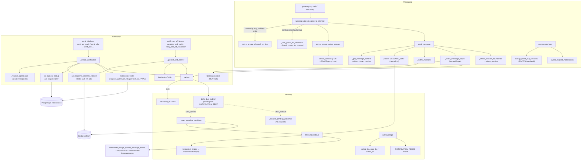

## Purpose
This slice implements RoboCo's communication + formal-notification backbone: MessagingService manages channels/groups/sessions/messages (with keyset pagination, session lifecycle, per-task threading, and session-task linking), NotificationService is the typed notification factory (blocker, QA-ready, A2A, board-review, ack), NotificationDeliveryService handles delivery (transactional-outbox bus publish), ACK tracking, expiry sweeps, and PM/CEO task-handoff notifications, and notification_dedup is a bounded Redis SET-NX re-fire guard for loop-prone notification types. Together they turn lifecycle events into both a durable DB record and a real-time push, with multiple dedup layers (Redis re-fire window + DB purpose-dedup) to keep agent inboxes from flooding under coordinator loops.

## Files

| Path | Role | LOC |
|---|---|---|
| roboco/services/messaging.py | Channel/Group/Session/Message CRUD, session-task linking, gateway post_to_channel adapter, message keyset pagination, session sweeper | 2040 |
| roboco/services/notification.py | Typed notification factory (blocker/QA/docs/handoff/A2A/board-review/ack) with slug→UUID recipient resolution, DB purpose-dedup + Redis re-fire guard, owns its own DB context and commit | 574 |
| roboco/services/notification_dedup.py | Bounded Redis SET-NX re-fire guard for loop-prone notification types (TASK_ASSIGNMENT/REVIEW_REQUEST/DOCUMENTATION_REQUEST/BROADCAST); 60s TTL, fail-open | 91 |
| roboco/services/notification_delivery.py | Delivery (transactional-outbox deferred bus publish), ACK/read tracking, expiry sweep, PM/CEO task-handoff notifications (notify_pm_of_block, escalate_and_notify, etc.), API-facing list/CRUD | 1034 |

## Data Flow
Two create-and-deliver paths exist. (A) NotificationService._create_notification (notification.py) opens its OWN get_db_context, resolves sender + recipients to UUIDs via _resolve_agent_uuid, runs the Redis re-fire guard (all_recipients_recently_notified), then DB purpose-dedup (ack-required types only, same sender+type+task+overlapping recipients not yet acked), builds NotificationTable with requires_ack from ACK_REQUIRED_BY_TYPE, flushes, calls NotificationDeliveryService.deliver (which defers NOTIFICATION_SENT bus events to after_commit), and finally commits — the commit triggers the deferred bus drain. (B) NotificationDeliveryService._persist_and_deliver (notification_delivery.py) is used by the task-handoff helpers (notify_pm_of_block, escalate_and_notify, etc.): it runs inside the CALLER's open transaction, applies only the Redis re-fire guard (no DB purpose-dedup), adds+flushes+delivers, and leaves the commit to the caller (api/routes/tasks.py). MessagingService._notify_mentions builds MENTION notifications inline and calls deliver directly within the caller's transaction. On the messaging side, send_message (called directly by routes and via the gateway post_to_channel adapter) resolves session/group/channel (transparently redirecting to the active session if the requested one closed — and reply_to is validated against the EFFECTIVE session, not the requested one), validates channel write access, inserts the MessageTable, bumps stats, publishes EventType.MESSAGE_SENT to the StreamEventBus (best-effort — a bus outage never rolls back the durable row), fires _notify_mentions, kicks a fire-and-forget RAG index task, and closes the session if boundaries are exceeded. Sweeper loops in the orchestrator call sweep_timed_out_sessions (TOCTOU re-check) and sweep_expired_notifications periodically. Real-time push: send_message's MESSAGE_SENT is forwarded by websocket_bridge._handle_message_event as a message.new frame to /ws/sessions/{id} AND /ws/channels/{id} (the live transcript-update path — previously send_message never broadcast); separately, deliver defers per-recipient NOTIFICATION_SENT events; the after_commit listener schedules _drain_pending_publishes which publishes to the StreamEventBus; websocket_bridge forwards to /ws/notifications/{id} sockets. ACKs flow acknowledge → acked_by/read_by mutation + NOTIFICATION_ACKED event.

## Mermaid


## Logical Tree
```
messaging-notification
├── messaging.py (MessagingService)
│   ├── Channel ops
│   │   ├── create_channel (slug uniqueness)
│   │   ├── get_channel / get_channel_or_raise / get_channel_with_groups_or_raise
│   │   ├── list_channels_paginated (accessible slugs + total)
│   │   ├── update_channel_fields (allowlist setattr)
│   │   ├── add/remove_channel_member_or_raise
│   │   ├── get_channel_by_slug (#-strip) / get_channel_by_slug_or_raise
│   │   └── get_or_create_channel_by_slug (seed auto-create, savepoint race-safe)
│   ├── Group ops
│   │   ├── create_group / get_group / list_groups_in_channel
│   │   ├── _lock_group (SELECT FOR UPDATE + populate_existing)
│   │   ├── _default_group_for_channel
│   │   ├── _task_group_name / _task_group_for_channel
│   ├── Session ops
│   │   ├── _resolve_session_timeout (configurable default)
│   │   ├── create_session (lock group, reuse active, flush-before-link)
│   │   ├── get_session / get_session_or_raise
│   │   ├── get_session_with_links / get_session_with_links_or_raise (eager-load task_links + task in one query)
│   │   ├── require_group_read_access / require_session_read_access (read IDOR guard: channel member / silent observer / privileged)
│   │   ├── get_session_with_links_for_agent (with-links + require_group_read_access check)
│   │   ├── _session_still_timed_out (TOCTOU re-check)
│   │   ├── sweep_timed_out_sessions
│   │   ├── close_session / close_session_or_raise
│   │   ├── list_group_sessions_for_agent (auth)
│   │   ├── create_session_with_access_check (+ proactive context)
│   │   ├── _inject_proactive_context (fire-and-forget)
│   │   └── get_or_create_active_session
│   ├── Session-task links
│   │   ├── link_session_to_task (idempotent, primary uniqueness)
│   │   ├── unlink_session_from_task
│   │   ├── get_sessions_for_task / get_primary_session_for_task / get_tasks_for_session
│   │   ├── propagate_sessions_to_subtask
│   │   ├── _walk_task_ancestors (cycle-safe)
│   │   ├── _primary_session_link_for_task
│   │   ├── _resolve_group_from_parent_tasks / _find_ancestor_session_on_channel
│   │   ├── _resolve_group_for_session / _build_session_request
│   │   ├── _link_tasks_to_session / _link_tasks_to_existing_session
│   │   └── create_session_for_tasks (PM op, reuse ancestor session)
│   ├── Message ops
│   │   ├── _get_message_context (closed-session redirect)
│   │   ├── _validate_reply_target / _update_message_stats
│   │   ├── _notify_mentions (MENTION notifications)
│   │   ├── _index_message_async (RAG fire-and-forget)
│   │   ├── _assert_content (blank / >10000 chars)
│   │   ├── send_message
│   │   ├── get_message / get_message_or_raise / get_messages (keyset)
│   │   ├── list_messages_for_session (keyset, 404)
│   │   ├── MessageCursor (timestamp, id tie-break)
│   │   ├── edit_message / edit_message_or_raise
│   │   ├── delete_message (soft) / delete_message_or_raise (hard)
│   │   └── _check_session_boundaries
│   └── post_to_channel (gateway say adapter)
├── notification.py (NotificationService)
│   ├── _resolve_agent_uuid (slug/UUID → UUID; 'system' seed)
│   ├── send_blocker / send_stuck_agent / send_qa_ready / send_docs_ready
│   ├── send_handoff / send_qa_failed / send_board_review_complete
│   ├── send_external_pr_reviewed / send_ack / send_a2a (tristate priority)
│   ├── _notification_type_label / _resolve_recipients
│   └── _create_notification (own DB context, re-fire guard, DB dedup, requires_ack, commit)
├── notification_dedup.py
│   ├── _LOOP_PRONE_TYPES (4 types)
│   ├── _DEDUP_TTL_SECONDS (60)
│   ├── _key (type:from:recipient:task)
│   └── all_recipients_recently_notified (per-recipient SET-NX, fail-open)
└── notification_delivery.py (NotificationDeliveryService)
    ├── Transactional outbox (F107)
    │   ├── defer_bus_publish (enqueue + register listeners)
    │   ├── _schedule_pending_publishes (after_commit → loop.create_task)
    │   ├── _drain_pending_publishes (best-effort publish)
    │   └── _discard_pending_publishes (after_rollback)
    ├── EscalationError / EscalationOutcome / BlockerDetails
    ├── deliver (delivered_at in-tx, defer per-recipient events)
    ├── get_notification / _notification_is_fully_acked / _log_expired_notification
    ├── sweep_expired_notifications (log stale unacked)
    ├── get_pending_for_agent / get_unacknowledged_for_agent / get_notification_count
    ├── acknowledge / mark_read / bulk_acknowledge / get_ack_status / get_delivery_summary
    ├── Task-handoff notifications
    │   ├── notify_pm_of_block / notify_pm_of_docs_complete / notify_pm_of_review_submission
    │   ├── notify_assignee_of_unblock / notify_assignee_of_ceo_rejection
    │   ├── escalate_and_notify (EscalationError/EscalationOutcome)
    │   ├── notify_ceo_of_escalation
    │   └── _persist_and_deliver (re-fire guard only, caller commits)
    ├── Recipient helpers: _resolve_team_pm / _resolve_pm_for_agent_or_team / _get_agent_by_id/slug / _get_ceo_agent
    └── API-facing: list_system_notifications / list_for_agent / get_for_recipient_and_mark_read / acknowledge_for_recipient / mark_read_for_recipient
```

## Dependencies
- Internal: roboco.config.settings (session_idle_timeout_seconds, redis_url), roboco.db.tables (ChannelTable, GroupTable, MessageTable, NotificationTable, SessionTable, SessionTaskTable, AgentTable, TaskTable), roboco.db.base.get_db_context, roboco.enforcement.validate_channel_access / ChannelAccessDeniedError, roboco.events (Event, EventType, get_event_bus), roboco.foundation.policy.communications.ACK_REQUIRED_BY_TYPE, roboco.models.base (MessageType, NotificationPriority, NotificationType, SessionStatus, AgentRole, ChannelType), roboco.models.messaging (Channel/Group/Message/SessionCreateRequest), roboco.models.session (SessionForTasksCreate, SessionTaskRelationshipType), roboco.models.notification.CreateNotificationParams, roboco.models.optimal.IndexConversationParams, roboco.seeds.DEFAULT_CHANNELS, roboco.services.base (BaseService, ConflictError, NotFoundError), roboco.services.optimal.get_optimal_service, roboco.services.proactive.get_proactive_service, roboco.services.permissions.has_privileged_access, roboco.services.repositories.get_agent_slug, roboco.agents_config (get_escalation_target, get_pm_for_agent, get_pm_for_team), roboco.utils.converters (require_uuid, to_python_uuid)
- External: sqlalchemy (select, and_, or_, func, event, joinedload, selectinload, with_for_update, IntegrityError, AsyncSession), redis.asyncio (from_url, set NX EX, aclose), asyncio (create_task, get_running_loop), structlog, datetime (UTC, datetime, timedelta), uuid.UUID, dataclasses

## Entry Points

| Name | File | Trigger |
|---|---|---|
| post_to_channel | roboco/services/messaging.py | gateway `say` content verb (content_actions.py) + secretary.py directive broadcast |
| send_message | roboco/services/messaging.py | API POST /api/sessions/{id}/messages + post_to_channel adapter |
| create_session_for_tasks | roboco/services/messaging.py | gateway `i_will_plan` / delegate PM op (content_actions.py) |
| sweep_timed_out_sessions | roboco/services/messaging.py | orchestrator periodic loop (orchestrator.py:5771) |
| NotificationService.send_*_notification | roboco/services/notification.py | TaskService / orchestrator lifecycle transitions (blocker, qa-ready, docs, a2a, board-review) |
| NotificationService.send_ack_notification | roboco/services/notification.py | gateway `notify` content verb (PM/Board only) |
| NotificationDeliveryService.notify_pm_of_block / escalate_and_notify / notify_ceo_of_escalation | roboco/services/notification_delivery.py | api/routes/tasks.py i_am_blocked / escalate / ceo-approval routes |
| NotificationDeliveryService.acknowledge / list_for_agent / get_for_recipient_and_mark_read | roboco/services/notification_delivery.py | api/routes/notifications.py ACK + list endpoints |
| sweep_expired_notifications | roboco/services/notification_delivery.py | orchestrator periodic loop (orchestrator.py:5780) |

## Config Flags
- ROBOCO_SESSION_IDLE_TIMEOUT_SECONDS (settings.session_idle_timeout_seconds) — default session idle timeout used by _resolve_session_timeout (messaging.py)
- settings.redis_url — Redis URL used by notification_dedup for the SET-NX re-fire guard (derived from ROBOCO_REDIS_HOST/_PORT)


## Gotchas
- Two notification create paths with DIFFERENT dedup strength: NotificationService._create_notification runs BOTH the Redis re-fire guard AND the DB purpose-dedup; NotificationDeliveryService._persist_and_deliver (task-handoff helpers) runs ONLY the Redis re-fire guard and explicitly skips DB purpose-dedup. A reworded BLOCKER_ESCALATION from the handoff path within 60s is suppressed by Redis, but beyond 60s a duplicate can be re-created since there is no DB dedup on that path.
- notification_dedup fail-open: a Redis error returns False (never suppress) — correct for not dropping notifications, but a sustained Redis outage re-opens the per-tick re-fire storm the guard was added to stop.
- notification_dedup.all_recipients_recently_notified has a side effect: it SET-NX-marks recipients NOT yet notified, so the FIRST call for a fresh recipient returns False (delivers) but acquires the key; a concurrent second call within 60s for the same recipient then returns True (suppresses). The marking happens even on the call that decides to deliver — so a suppressed 'all already held' verdict requires every recipient to have been marked by a prior call. Partial-fresh mixed-recipient calls deliver and mark the fresh ones.
- NotificationService._create_notification opens its OWN get_db_context and commits (line 568), while NotificationDeliveryService._persist_and_deliver operates in the CALLER's transaction and does NOT commit. Mixing the two in one outer transaction would double-commit / cross-session.
- MessagingService.create_session flushes the new SessionTable BEFORE assigning group.active_session_id because active_session_id is a plain scalar FK with no relationship — assigning session.id pre-flush persists NULL and re-opens a new session every post (load-bearing ordering, documented L495-499).
- _lock_group uses SELECT FOR UPDATE with populate_existing to serialize concurrent active-session creation; without it two concurrent posts both miss active_session_id and orphan the loser's session as forever-ACTIVE.
- _session_still_timed_out closes a TOCTOU: the sweeper's candidate SELECT may be stale by the time close runs; a message that refreshed last_activity_at in between must not be closed. sweep_timed_out_sessions depends on this re-check.
- get_or_create_channel_by_slug handles the concurrent-auto-create race via a savepoint (begin_nested) + IntegrityError catch + re-fetch; a conflict that produced no row on re-fetch is re-raised (not masked as None).
- requires_ack is now set from ACK_REQUIRED_BY_TYPE (notification.py L555) rather than the column default True; MENTION/KNOWLEDGE_SHARE/BROADCAST etc. are False. MessagingService._notify_mentions explicitly sets requires_ack=False for MENTION (L1501) — consistent with the map but set inline.
- DB purpose-dedup query uses NotificationTable.to_agents.overlap(to_agents_uuids) AND ~acked_by.contains(to_agents_uuids) — overlap matches ANY recipient; a notification to [A,B] with A acked but B not is NOT suppressed for a new send to [A,B] because acked_by does not contain [A,B] (contains is element-wise). The dedup is per-(sender,type,task) not per-recipient, so a third recipient C added on resend goes through.
- defer_bus_publish registers after_commit/after_rollback listeners keyed on session.info[_DRAIN_REGISTERED_KEY]; listeners are bound to sync_session and accumulate only once per AsyncSession instance. A session reused across multiple commit cycles will re-register only once (guard), but the pending queue is popped each commit — if a second deliver happens after the first commit in the same session, the listeners are already registered and the new events append and fire on the next commit.
- acknowledge publishes NOTIFICATION_ACKED directly to the bus (NOT deferred via after_commit) — unlike deliver. An ACK that is rolled back after publish could emit a phantom ACK event. The ACK path does not use the transactional outbox.
- list_system_notifications filters pending_ack_only POST-fetch because 'not fully acked' is not SQL-friendly on PostgreSQL array columns. For pending_ack_only=True the SQL `limit` is NOT applied — applying it before the Python filter let a window of newer fully-acked rows mask older unacked ones the operator still needs to act on (correctness bug fixed in 115061f3); the full ack-required set is fetched ordered newest-first, Python-filtered to unacked, then sliced to `limit`. The non-pending branch retains the SQL limit.
- get_notification_count loads ALL notifications for an agent into memory (no SQL count) to compute total/unread/pending_ack — O(n) per call, no pagination.
- send_message content cap is 10_000 chars (_MAX_MSG_CHARS); blank/whitespace-only content raises EMPTY_MESSAGE.


## Drift from CLAUDE.md
- CLAUDE.md does not describe the notification_dedup Redis re-fire guard, the transactional-outbox (defer_bus_publish / F107) in notification_delivery, or the DB purpose-dedup in NotificationService — all are real, load-bearing behavior added since the baseline and not reflected in the doc's Services table or Communication Model section.
- CLAUDE.md's Services table lists MessagingService as 'Channels, sessions, messages' and NotificationService as 'Formal notifications' but does not mention NotificationDeliveryService at all, nor that NotificationService owns its own DB context+commit while NotificationDeliveryService runs in the caller's txn.
- CLAUDE.md Communication Model says 'Notifications = formal signals (require acknowledgment, sent by PMs/Board only)' — actual code: requires_ack is False for TASK_ASSIGNMENT/REVIEW_REQUEST/DOCUMENTATION_REQUEST/BROADCAST/KNOWLEDGE_SHARE/MENTION/A2A_REQUEST (ACK_REQUIRED_BY_TYPE), so most notification types do NOT require ack; and Notifications can be sent by 'system' (orchestrator-generated) not only PMs/Board.
- CLAUDE.md mentions `roboco/services/messaging.py`, `notification.py` but not `notification_dedup.py` or `notification_delivery.py` in the Services table.


## Changes Since Baseline

| SHA | Subject | Impact |
|---|---|---|
| 15effce0 | Chore: 141 Gaps fill-in (#283) — added MessageCursor keyset pagination, _lock_group FOR UPDATE, _session_still_timed_out TOCTOU re-check, requires_ack from ACK_REQUIRED_BY_TYPE, DB purpose-dedup gated to ack-required types, re-fire guard + notification_dedup.py (new file), transactional-outbox defer_bus_publish in notification_delivery, content blank/length asserts, per-task group threading | Major hardening: session creation race fixed (FOR UPDATE), session sweeper TOCTOU closed, message pagination no longer skips equal-timestamp rows, notifications no longer flood inboxes (Redis re-fire + DB dedup scoped), phantom WebSocket pushes eliminated (deferred bus publish), MENTION/BROADCAST no longer inflate unacked sets (requires_ack=False) |
| 3aff6e04 | Chore: Close gaps (#285) — follow-on gap closure touching the same four files | Refinement of the #283 changes (exact hunks not isolated per-file in this merge commit; consolidated the dedup/outbox/cursor/lock behavior above) |

> Post-snapshot updates (since 2026-06-29): 76ce53e3 wired MESSAGE_SENT end-to-end (EventType, best-effort bus publish in send_message, bridge _handle_message_event forwarding to /ws/sessions+/ws/channels, panel useSessionStream subscription — the live-transcript path was dead before this); 0065ecbb added get_session_with_links/_or_raise (eager-loads task_links+task in one query) and session_to_response_with_links so GET /sessions/{id} returns task_links populated; 2da72f3f fixed reply_to validation to check against the EFFECTIVE (possibly-redirected) session instead of req.session_id, and guards the panel composer on a closed session; 77958c1e added require_group_read_access/require_session_read_access/get_session_with_links_for_agent to close read IDOR on GET /groups/{id}, GET /sessions/{id}, GET /sessions/{id}/tasks, GET /messages (any agent could read any private channel's transcripts), and fixed three doubled-404 messages; 115061f3 fixed list_system_notifications pending_ack_only correctness: SQL limit is now dropped for that branch so newer fully-acked rows can't mask older unacked ones (see Gotcha update above); 536bbb64 is the logical-gap sweep merge commit that bundled several of these.

## Regression Risks

| Title | File:Line | Claim | Severity |
|---|---|---|---|
| DB purpose-dedup now gated to ack-required types only — informational duplicates no longer suppressed | roboco/services/notification.py:521 | is_ack_required = ACK_REQUIRED_BY_TYPE.get(params.notification_type, True); the DB dup_q is only run when is_ack_required. REVIEW_REQUEST/DOCUMENTATION_REQUEST/TASK_ASSIGNMENT are ack-required=False, so they skip DB dedup and rely SOLELY on the 60s Redis window. Beyond 60s, a coordinator can re-fire the same REVIEW_REQUEST every tick and each one persists (the original bug the dedup was meant to stop). The Redis guard coalesces within 60s but a tick interval >60s re-opens the flood. Severity medium because the Redis guard covers the common per-tick storm. | medium |
| _persist_and_deliver skips DB purpose-dedup entirely — task-handoff duplicates not DB-deduped | roboco/services/notification_delivery.py:875 | _persist_and_deliver applies only all_recipients_recently_notified (Redis) and then add+flush+deliver with no DB dup_q. notify_pm_of_block / escalate_and_notify / notify_assignee_of_unblock can each be re-triggered (e.g. a retried i_am_blocked, a re-issued escalate) and, past the 60s Redis window, create a second BLOCKER_ESCALATION for the same (sender, type, task) while the first is unacked — exactly the inbox inflation + i_am_idle soft-block the DB dedup was added to prevent on the other path. Two paths for the same notification type with different dedup strength is a real hole. | medium |
| acknowledge publishes NOTIFICATION_ACKED directly, not via the transactional outbox | roboco/services/notification_delivery.py:451 | deliver was migrated to defer_bus_publish (after_commit) to kill phantom pushes, but acknowledge still does `await bus.publish(...)` inside the open transaction before the caller commits. A rollback after a successful ACK publish emits a phantom NOTIFICATION_ACKED for an ACK that didn't persist — the same class of bug F107 fixed for deliver, left unfixed for the ACK path. | medium |
| all_recipients_recently_notified marks recipients as a side effect on the deciding call | roboco/services/notification_dedup.py:78 | The function SET-NX-marks each fresh recipient while computing the verdict, so the call that DECIDES TO DELIVER also acquires keys for the fresh recipients. A subsequent resend within 60s then sees all-held and suppresses — intended — but it means the very first notification in a window consumes the TTL for recipients who genuinely received it, and a legit follow-up to a subset within 60s is suppressed if all of that subset were marked by the prior send. For BROADCAST this can drop a legitimately re-targeted broadcast within the window. | low |
| create_session reuses ANY active session without verifying it belongs to the same scope/task | roboco/services/messaging.py:480 | Under the group lock, if group.active_session_id is set and that session.status == ACTIVE, create_session returns it verbatim — regardless of the req.scope or task context of the new request. Two unrelated PM ops targeting the same group (e.g. different tasks threaded into the default group via post_to_channel with task_id=None) will share one session/scope. The per-task threading in post_to_channel mitigates this only when task_id is supplied; the default-group path does not. | low |
| get_notification_count loads all agent notifications into memory | roboco/services/notification_delivery.py:379 | base_query selects all NotificationTable rows where to_agents contains agent_id with no limit, then counts in Python. For a long-running agent this row count grows unbounded; called via get_delivery_summary on the panel it is an O(n) DB read per dashboard load. Not a correctness regression from the baseline but the slice's new dedup reduces new-row growth, masking the unbounded-scan risk. | low |
| defer_bus_publish listener registration tied to session.info on the AsyncSession — session reuse hazard | roboco/services/notification_delivery.py:116 | _DRAIN_REGISTERED_KEY is set once per AsyncSession and the SQLAlchemy event.listens_for(sync_session, ...) is bound to sync_session. If an AsyncSession is reused for multiple independent transactions (connection-pool recycling), the listener stays registered and fires _schedule_pending_publishes on every subsequent commit even when no new events were deferred — _schedule_pending_publishes pops an empty queue and no-ops, so it is benign, but the listener is never removed and accumulates on the sync_session for the session's lifetime. A long-lived sync_session with many AsyncSession wraps could accumulate listeners. | low |

## Health
This slice is substantially hardened since the baseline: the session-creation race (FOR UPDATE + flush-before-link), the sweeper TOCTOU, the message keyset pagination tie-break, the transactional-outbox for delivery (F107), the Redis re-fire guard, and the ACK_REQUIRED_BY_TYPE-driven requires_ack are all real, well-documented fixes that close prior meltdowns. The main integrity gap is dedup-path fragmentation: NotificationService._create_notification runs two dedup layers (Redis + DB purpose-dedup) while NotificationDeliveryService._persist_and_deliver runs only the Redis layer, so the task-handoff notifications (blocker/escalation/ceo-rejection) are not protected by DB purpose-dedup past the 60s Redis window — a retried i_am_blocked or escalate beyond 60s can re-create an unacked duplicate, the exact inbox-inflation + i_am_idle soft-block the DB dedup was added to prevent. A secondary consistency gap is that acknowledge publishes NOTIFICATION_ACKED directly to the bus instead of through the deferred outbox, leaving the same phantom-event class F107 fixed for deliver. Neither is a crash bug; both are correctness drift between two paths that should behave identically. Code quality is high (terse comments, clear docstrings, explicit race handling), and the slice is well-covered by the orchestrator sweeper integration and route-level callers.
