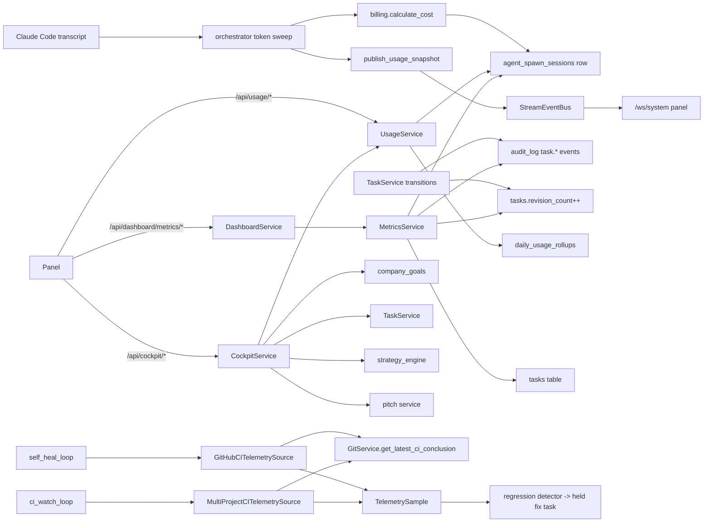

# RoboCo Map — `metrics-observability` slice

## Purpose

The metrics & observability slice is the read-only measurement layer of RoboCo: it turns task/audit-log/spawn-session state into the numbers the panel renders and the CEO/Auditor act on. `MetricsService` reconstructs delivery flow (cycle-time, bottlenecks, rework, scorecards) from the audit-log transition journey plus `tasks.revision_count`; `UsageService` aggregates per-agent/per-team/per-model token spend and projections from `agent_spawn_sessions` / `daily_usage_rollups`; `DashboardService` adds auditor flags/reports (in-memory) and CEO overview aggregations; `CockpitService` fuses goals + delivery + spend + strategy signals into one CEO summary; `telemetry/source.py` reads CI health for self-heal / multi-repo CI-watch; `billing/pricing.py` is the provider-aware per-token cost function every cost field is derived from.

## Files

| Path | Role | approx LOC |
|---|---|---|
| `roboco/services/metrics.py` | `MetricsService` — velocity, blockers, team/agent metrics, health, cycle-time/bottleneck/rework/scorecard observability | 1521 |
| `roboco/services/dashboard.py` | `DashboardService` — auditor flags/reports (in-memory singleton), CEO overview, audit queue, agent status, recent activity | 457 |
| `roboco/services/cockpit.py` | `CockpitService` — read-only CEO "is the business winning?" summary (goals+delivery+spend+signals) | 97 |
| `roboco/services/usage.py` | `UsageService` — token usage summary, time-series, by-agent/team/model, projection, cache efficiency, today summary, recent sessions | 478 |
| `roboco/services/usage_events.py` | `UsageSnapshot` dataclass + `publish_usage_snapshot` — publishes USAGE_SNAPSHOT to the StreamEventBus | 52 |
| `roboco/services/telemetry/__init__.py` | Re-export of CI telemetry source symbols | 18 |
| `roboco/services/telemetry/source.py` | `TelemetrySample` + `TelemetrySource` protocol + `GitHubCITelemetrySource` (self-heal) + `MultiProjectCITelemetrySource` (CI-watch) | 212 |
| `roboco/billing/__init__.py` | Re-export `calculate_cost`, `CostResult`, `calculate_cost_result` | 8 |
| `roboco/billing/pricing.py` | `calculate_cost` / `calculate_cost_result` / `CostResult` — provider-aware per-token USD pricing (Anthropic + Grok priced; local/Ollama $0); `CostResult` exposes `unpriced` flag for unpriced-Anthropic detection | 199 |

## Key Symbols

| Name | Kind | File:Line | Responsibility |
|---|---|---|---|
| `MetricsService` | class | metrics.py:91 | All delivery/velocity/health/observability aggregations |
| `MetricsService.get_velocity` | method | metrics.py:108 | Period completed/created counts, avg completion hours, completion rate |
| `MetricsService._blocked_since_map` | method | metrics.py:176 | Queries `audit_log` for `task.blocked` events to build `{task_id: blocked_at}` map; fixes the `updated_at` heuristic (#67) |
| `MetricsService.get_blocker_metrics` | method | metrics.py:208 | Active blockers, avg/longest blocked hours, blockers by team |
| `MetricsService.get_team_metrics` | method | metrics.py:229 | Per-team active/completed/blocked + doc-coverage (dev_notes proxy) |
| `MetricsService.get_all_team_metrics` | method | metrics.py:322 | Loop over BACKEND/FRONTEND/UX_UI |
| `MetricsService.get_agent_metrics` | method | metrics.py:333 | Per-agent weekly completed, avg hours, messages |
| `MetricsService.get_health_status` | method | metrics.py:487 | ok/slow/critical from blocked ratio + stale-active heuristic |
| `MetricsService._determine_health_status` | method | metrics.py:451 | Threshold logic (CRITICAL_BLOCKED_RATIO=0.3, SLOW=0.15, STALE=5) |
| `MetricsService.get_cycle_time_by_stage` | method | metrics.py:529 | Per-stage dwell reconstructed from `audit_log` `task.<status>` events via LEAD window; excludes named qa_fail/pr_fail |
| `MetricsService.get_bottleneck_distribution` | method | metrics.py:587 | Cumulative dwell per stage + live parked counts + active blockers |
| `MetricsService.get_rework_metrics` | method | metrics.py:747 | Overall/team/agent rework rate + rework cost from spawn sessions |
| `MetricsService._rework_by_agent` | method | metrics.py:646 | Owner bounce-rate + reviewer-attributed `qa_fails`/`pr_fails`/`pm_rejects`/`ceo_rejects` from audit_log — one aggregated `GROUP BY (agent_id, event_type)` query over all 4 named events (`_REWORK_EVENT_TYPES`/`_REWORK_EVENT_TO_FIELD`), widened from the original qa/pr-only pair. See `docs/map/review-findings.md`. |
| `MetricsService.get_task_metrics` | method | metrics.py:~881 | Per-task `qa_fails`/`pr_fails`/`pm_rejects`/`ceo_rejects` (one aggregated audit_log query) + `findings_open`/`findings_total` (a second query against `ReviewFindingsRepository.list_for_task`, counted in Python from the fetched rows). |
| `MetricsService._rework_cost` | method | metrics.py:720 | Sum of `estimated_cost_usd` over spawn sessions of reworked tasks |
| `MetricsService.get_scorecard` | method | metrics.py:795 | Fused per-agent or per-cell scorecard (completed, cycle, rework, tokens, cost) |
| `MetricsService.get_member_scorecard` | method | metrics.py:1178 | Single-agent `MemberScorecard` (FPY, effort-throughput, utilization) — 3 DB queries, now delegates the assembly logic to `_assemble_member_scorecard` |
| `MetricsService._assemble_member_scorecard` | method | metrics.py:1128 | Shared builder extracted from the old `get_member_scorecard` body so the single-agent and batch paths derive identically (no duplicated logic) |
| `MetricsService.get_all_member_scorecards` | method | metrics.py:1301 | Batch replacement for N×`get_member_scorecard` calls — the whole non-CEO/non-SYSTEM roster (optionally team-filtered) in a **fixed 3 queries total**, not 3-per-agent: (1) agent list, (2) one `GROUP BY agent_slug` rollup via `_rollup_sums_by_agent`, (3) one `GROUP BY task_id` live-overlay query via `_live_inflight_overlay_by_agent`. Closes the "~20 agents = ~40 extra queries per panel Members-tab poll" N+1 the scorecards-tab previously incurred. |
| `MetricsService._rollup_sums_by_agent` | method | metrics.py:1200 | `SELECT agent_slug, SUM(...) ... GROUP BY agent_slug` over `MemberPerformanceDailyTable` for the whole agent-id list in one query, replacing a per-agent `_rollup_sums` call |
| `MetricsService._live_inflight_overlay_by_agent` | method | metrics.py:1232 | One `TaskTable` lookup for all non-terminal tasks assigned to the agent-id list, then one grouped `AgentSpawnSessionTable` query for their open sessions, aggregated back into a per-agent dict in Python |
| `MetricsService._tokens_cost_for` | method | metrics.py:768 | Sum tokens+cost from spawn sessions for an agent slug or team |
| `MetricsService._avg_cycle_hours` | method | metrics.py:869 | Avg started→completed hours for completed tasks |
| `_as_hours` | func | metrics.py:47 | Coerce SQL epoch aggregate to rounded float (avoids Decimal→JSON string crash) |
| `ACTIVE_STATUSES` | const | metrics.py:61 | CLAIMED/IN_PROGRESS/VERIFYING/AWAITING_QA (BLOCKED excluded — note) |
| `DashboardService` | class | dashboard.py:58 | Auditor flags/reports + CEO overview + agent/activity feeds |
| `_DashboardStorageHolder` | class | dashboard.py:35 | Process-singleton in-memory flag/report store |
| `get_storage` / `reset_storage` | func | dashboard.py:41/48 | Singleton accessor + test reset |
| `DashboardService.create_flag/get_flags/resolve_flag` | methods | dashboard.py:87/102/124 | Auditor flag CRUD over in-memory store |
| `DashboardService.create_report/send_report` | methods | dashboard.py:146/184 | Auditor report CRUD + send marking |
| `DashboardService.get_audit_queue` | method | dashboard.py:241 | Blocked + awaiting-QA tasks as queue items |
| `DashboardService.get_team_health_list` | method | dashboard.py:279 | Health for BACKEND/FRONTEND/UX_UI/BOARD |
| `DashboardService.get_key_metrics` | method | dashboard.py:299 | Velocity + doc coverage + blockers summary |
| `DashboardService.get_all_agent_status` | method | dashboard.py:365 | Agent counts by status + per-agent snapshot |
| `DashboardService.get_recent_activity` | method | dashboard.py:398 | Merged messages+task_updates feed, sorted desc |
| `CockpitService` | class | cockpit.py:36 | Read-only CEO summary + lightweight signals slice |
| `CockpitService.summary` | method | cockpit.py:41 | goals+counts+delivery+spend+projection+pitches+signals, `basis="proxy"` |
| `CockpitService.signals` | method | cockpit.py:81 | Strategy-engine signals only (lightweight panel slice) |
| `UsageService` | class | usage.py:70 | Token usage analytics over spawn sessions + rollups |
| `UsageService.get_summary` | method | usage.py:77 | Period totals + trend_pct vs previous period |
| `UsageService.get_time_series` | method | usage.py:166 | Hourly (24h) / daily (7d/30d) buckets |
| `UsageService._aggregate_by` | method | usage.py:237 | Shared group-by for agent/team/model with pct_of_total |
| `UsageService.get_by_agent/get_by_team/get_by_model` | methods | usage.py:304/310/314 | Dimension breakdowns |
| `UsageService.get_projection` | method | usage.py:322 | 7-day avg daily cost × 30 projected monthly |
| `UsageService.get_cache_efficiency` | method | usage.py:359 | cache_hit_rate + cost_saved (sonnet baseline pricing) |
| `UsageService.get_today_summary` | method | usage.py:420 | Today's tokens/cost from `daily_usage_rollups` |
| `UsageService.get_recent_sessions` | method | usage.py:461 | Raw per-session rows for the dashboard table |
| `_parse_period` | func | usage.py:55 | "24h"/"7d"/"30d" → (start_dt, hours); defaults 24h |
| `_row_tokens` / `_session_row` | func | usage.py:24/38 | Null-coalescing token extraction + session row shaping |
| `UsageSnapshot` | dataclass | usage_events.py:22 | Aggregate token/cost payload for USAGE_SNAPSHOT events |
| `UsageSnapshot.event_data` | method | usage_events.py:36 | Render + timestamp-stamp event payload |
| `publish_usage_snapshot` | func | usage_events.py:47 | Publish USAGE_SNAPSHOT to StreamEventBus (lazy Event import) |
| `TelemetrySample` | dataclass | telemetry/source.py:39 | Normalized health reading; `is_breach` = value ≥ threshold |
| `TelemetrySource` | protocol | telemetry/source.py:63 | Pull-based read-only `fetch()` contract |
| `GitHubCITelemetrySource` | class | telemetry/source.py:70 | Self-heal: latest CI run for `self_heal_project_slug` |
| `MultiProjectCITelemetrySource` | class | telemetry/source.py:130 | CI-watch: per-project samples, isolated failures |
| `MultiProjectCITelemetrySource._sample_for` | method | telemetry/source.py:166 | One project's sample, None on unreadable signal |
| `FAILURE_CONCLUSIONS` | const | telemetry/source.py:36 | `{failure, timed_out, startup_failure}` |
| `get_ci_telemetry_source` / `get_multi_ci_telemetry_source` | func | telemetry/source.py:125/207 | Factory constructors |
| `CostResult` | dataclass | billing/pricing.py:96 | Frozen result carrying `cost_usd`, `unpriced` (True when Anthropic model has no pricing entry), `is_anthropic`; lets callers distinguish intentional-$0 (local) from missed-pricing (Anthropic) |
| `calculate_cost` | func | billing/pricing.py:113 | Thin float wrapper over `calculate_cost_result` — returns `cost_usd` only; kept for existing callers (orchestrator, grok_cli_usage) |
| `calculate_cost_result` | func | billing/pricing.py:135 | Full provider-aware cost calculation returning `CostResult`; authoritative for `unpriced` attribution |
| `_lookup_prices` | func | billing/pricing.py:80 | Substring pricing-table lookup, longest fragment wins |
| `_is_anthropic_model` | func | billing/pricing.py:75 | Claude/opus/sonnet/haiku fragment detection (warn gate) |
| `_PRICING` | const | billing/pricing.py:49 | Per-model (input/output/cache_read/cache_write) USD/1M table |

## Data Flow

Two upstreams feed this slice: (1) the **orchestrator token sweep** (`runtime/orchestrator.py` ~line 5270) reads each active agent's Claude Code transcript via the SDK `/usage/sync`, calls `billing.calculate_cost`, persists a `AgentSpawnSessionTable` row (and a `TokenUsageSnapshotTable` row), then accumulates per-agent totals and publishes a `USAGE_SNAPSHOT` event via `usage_events.publish_usage_snapshot` → `StreamEventBus` → `websocket_bridge` → `/ws/system` panel clients. (2) **task lifecycle transitions** write generic `task.<status>` and named `task.qa_fail`/`task.pr_fail`/`task.request_changes`/`task.ceo_reject` events to `audit_log` and increment `tasks.revision_count` at the single `TaskService._emit_status_transition_audit` chokepoint (the latter two named events are new — the revision-findings ledger, `docs/map/review-findings.md`).

Downstream, the panel hits the API routes: `/api/usage/*` (summary, time-series, by-agent/team/model, projection, cache-efficiency, sessions) → `UsageService`; `/api/dashboard/metrics/{velocity,blockers,team,communication,health,agent,cycle-time,bottlenecks,rework,scorecard/agent,scorecard/team}` and `/api/dashboard/{auditor,ceo,...}` → `DashboardService` + `MetricsService`; `/api/cockpit/{summary,signals}` → `CockpitService`. `MetricsService.get_cycle_time_by_stage` runs a raw SQL window over `audit_log` filtering `event_type = 'task.' || to_status` to exclude named events, deriving per-stage dwell. Rework joins `tasks.revision_count > 0` to completed tasks and `agent_spawn_sessions.task_id` for cost. Telemetry flows separately: the self-heal loop and ci-watch loop construct their source, call `fetch()`, and feed `TelemetrySample`s to their engine's regression detector, which originates a held fix task on a breach.

## Mermaid



## Logical Tree

```
metrics-observability
├── roboco/billing/
│   ├── __init__.py            # re-export calculate_cost
│   └── pricing.py             # _PRICING table, _lookup_prices, calculate_cost, _is_anthropic_model
├── roboco/services/
│   ├── metrics.py             # MetricsService (velocity/blockers/team/agent/comm/health/observability)
│   ├── dashboard.py           # DashboardService + _DashboardStorageHolder (flags/reports/CEO/queue)
│   ├── cockpit.py             # CockpitService (summary/signals)
│   ├── usage.py               # UsageService (summary/series/by-dim/projection/cache/today/sessions)
│   ├── usage_events.py        # UsageSnapshot + publish_usage_snapshot
│   └── telemetry/
│       ├── __init__.py        # re-exports
│       └── source.py          # TelemetrySample, TelemetrySource, GitHubCITelemetrySource, MultiProjectCITelemetrySource
```

## Dependencies

**Internal (roboco):**
- `roboco.db.tables` — `AgentSpawnSessionTable`, `DailyUsageRollupTable`, `AgentTable`, `AuditLogTable`, `TaskTable`, `NotificationTable`
- `roboco.models.base` — `TaskStatus`, `Team`, `AgentStatus`
- `roboco.models.metrics` — all metric result schemas (VelocityMetrics, StageTiming, ReworkReport, Scorecard, …)
- `roboco.models.dashboard` — `FlagData`, `ReportData`, `DashboardStorage`, `CreateFlagParams`, …
- `roboco.models.events` — `Event`, `EventType` (lazy import in usage_events)
- `roboco.events.stream_bus` — `StreamEventBus` (TYPE_CHECKING only)
- `roboco.services.base` — `BaseService`
- `roboco.services.git` — `GitService.get_latest_ci_conclusion` (telemetry)
- `roboco.services.company_goals`, `pitch`, `strategy_engine`, `task` (cockpit)
- `roboco.config` — `settings` (telemetry)
- `roboco.logging` — `get_logger` (telemetry)
- `roboco.utils.converters` — `to_python_uuid`, `require_uuid`

**External:**
- `sqlalchemy` (func, select, and_, text, func.extract/date_trunc/percentile_cont)
- `sqlalchemy.ext.asyncio` — `AsyncSession`
- `structlog` (pricing logger)
- `datetime`, `uuid`, `dataclasses`, `typing`

## Entry Points

- **HTTP routes** (`roboco/api/routes/usage.py`): `/api/usage/{summary,time-series,by-agent,by-team,by-model,projection,cache-efficiency,sessions}` → `get_usage_service`.
- **HTTP routes** (`roboco/api/routes/dashboard.py`): `/api/dashboard/auditor*`, `/api/dashboard/ceo*`, `/api/dashboard/kanban/*`, `/api/dashboard/agents/status`, `/api/dashboard/activity/recent`, `/api/dashboard/metrics/{velocity,blockers,team/{team},communication,health,agent/{id},cycle-time,bottlenecks,rework,scorecard/agent/{id},scorecard/team/{team}}` → `get_dashboard_service` + `get_metrics_service`. Auditor/CEO routes gated by `_require_auditor_or_ceo`. `GET /api/dashboard/metrics/member/{agent_id}` (dashboard.py:617, `get_member_scorecard`) and `GET /api/dashboard/metrics/member/ceo` (dashboard.py:606, declared first — route-order matters, a literal path segment must win over the `{agent_id}` path param) back the panel Members tab's per-row card. `GET /api/dashboard/metrics/members` (dashboard.py:634, `get_all_member_scorecards`, optional `team`/`days` query params) is the new batch fetch replacing N per-row calls — see `MetricsService.get_all_member_scorecards` above.
- **HTTP routes** (`roboco/api/routes/cockpit.py`): `/api/cockpit/{summary,signals}` → `get_cockpit_service`.
- **Orchestrator loop tick**: `runtime/orchestrator.py` token sweep (~line 5270) → `calculate_cost` + `publish_usage_snapshot`; runs per dispatch tick on active agents.
- **Self-heal / CI-watch loop ticks**: `services/self_heal_engine.py` and `services/ci_watch_engine.py` construct their telemetry source and call `fetch()` each cycle; armed by their respective ROBOCO_* flags.
- **Grok usage path**: `llm/providers/grok_cli_usage.py` calls `calculate_cost` per grok session (line 110).
- **Lifespan/CLI**: none directly; this slice is pulled on-demand by routes/loops.

## Config Flags

No flags live *inside* this slice's files, but the slice's behavior is gated/parameterized by flags held in `roboco/config.py` and consumed here:

- `settings.self_heal_project_slug` (`ROBOCO_SELF_HEAL_PROJECT_SLUG`) — empty → `GitHubCITelemetrySource.fetch` returns no samples (telemetry/source.py:83).
- `settings.self_heal_ci_workflow` (`ROBOCO_SELF_HEAL_CI_WORKFLOW`) — workflow filter for self-heal CI lookup (source.py:86).
- `settings.ci_watch_default_workflow` (`ROBOCO_CI_WATCH_DEFAULT_WORKFLOW`) — fallback workflow for `MultiProjectCITelemetrySource` (source.py:152).
- `projects.ci_watch_enabled` (DB column, migration 048) — per-project opt-in read by the CI-watch engine that drives `MultiProjectCITelemetrySource`.
- `ROBOCO_SELF_HEAL_ENABLED` / `ROBOCO_CI_WATCH_ENABLED` — arm the loops that call these sources (held in config, consumed by engines, not by source.py itself).
- Cockpit indirectly honors `ROBOCO_STRATEGY_ENGINE_ENABLED` / `ROBOCO_PROVISIONING_*` via the strategy/pitch services it composes.

## Gotchas

- **`usage.get_summary` docstring fixed (536bbb64).** The old docstring falsely claimed rollup-based reads. It was corrected in commit 536bbb64 (#66): `get_summary` is documented as summing raw `agent_spawn_sessions` rows (sub-day precise); `daily_usage_rollups` is the day-grain snapshot written by the sweeper and read by `get_today_summary`; the two can diverge for "today" until the sweeper catches up.
- **`ACTIVE_STATUSES` excludes BLOCKED in team metrics but `get_health_status` includes it.** metrics.py:61 comment documents this; `get_team_metrics` (line 234) uses `ACTIVE_STATUSES` (no BLOCKED) while `get_health_status` (line 497) uses a local list including BLOCKED. The blocked-task ratio therefore only appears in health, not in team "active_tasks".
- **Doc-coverage is a `dev_notes`-not-None proxy.** `get_team_metrics` (metrics.py:300) counts completed tasks with non-null `dev_notes` as "documented" — a simplified heuristic, not real documentation-phase completion.
- **Blocked-hours heuristic improved (536bbb64).** `get_blocker_metrics` now calls `_blocked_since_map` (metrics.py:176) to read the `task.blocked` audit row (indexed on `target_id/event_type/timestamp`) as the authoritative "blocked since" timestamp (#67). Falls back to `updated_at or created_at` only when no audit row exists. The over-count on non-blocking updates is fixed for tasks that have a proper audit trail.
- **`_as_hours` is load-bearing for JSON.** metrics.py:47 — `EXTRACT(epoch …)` returns `Decimal` on PG14+ via asyncpg, which serializes to a JSON *string* and crashes the panel's `value.toFixed(...)`. Any new "hours" field must go through it.
- **Cycle-time SQL excludes named events by string equality.** metrics.py:554 `a.event_type = 'task.' || (a.details->>'to_status')` keeps only generic transitions. If a future named event's `to_status` matches a status name AND is stored without the `task.` prefix convention, it could inject zero-length stages. Relies on the audit-log event-type naming convention being upheld.
- **Rework cost uses `agent_spawn_sessions.task_id` join.** metrics.py:742 — only spawn sessions linked to the reworked task's id contribute; sessions missing the task_id link (e.g. early orchestrator bug) undercount cost.
- **`DashboardService` flag/report store is an in-memory process singleton** (`_DashboardStorageHolder`, dashboard.py:35) — not DB-backed, not replicated, lost on restart. Flags/reports are ephemeral; do not treat as durable state.
- **`DashboardService.get_reports` slicing** (`return result[-limit:]`, dashboard.py:178) returns the *last* `limit` in insertion order but the list is dict-ordered (insertion), not time-ordered — fine while insertion == creation order, but fragile if reports are ever added out of order.
- **Pricing substring match, longest-wins** (pricing.py:78). A model name containing both `sonnet` and a longer fragment (e.g. `claude-3-5-sonnet`) resolves to the longest fragment entry; the table includes both full names and short aliases (`opus`, `sonnet`, `haiku`) so accidental double-match is handled by longest-wins.
- **Unpriced Anthropic model warns + returns 0.0** (pricing.py:185) — real spend silently counted as $0 in cost panels until the table is updated, because orchestrator callers use the `calculate_cost` thin wrapper (not `calculate_cost_result`). `CostResult.unpriced=True` is now available from `calculate_cost_result` to distinguish this case, but no caller wires it yet. Unpriced non-Anthropic (Ollama/local) is intentionally $0 with no warning.
- **Cache-efficiency uses hardcoded sonnet pricing** (usage.py:401-404, `_FULL_INPUT_PRICE=3.00`, `_CACHE_READ_PRICE=0.30`) for the savings estimate regardless of the actual model mix — an aggregate approximation, not per-model.
- **`publish_usage_snapshot` lazy-imports `Event`/`EventType`** (usage_events.py:49) to avoid a circular import — callers must keep the bus passed in, not a module-level reference.
- **`MultiProjectCITelemetrySource.fetch` swallows per-project exceptions** (source.py:172) — one bad project never aborts the sweep, but also never surfaces beyond a warning log; a persistently failing project silently contributes no sample (treated as "unknown", not "green" — correct, but invisible).
- **`CockpitService.summary` `basis="proxy"`** (cockpit.py:57) — every payload is stamped proxy; the over_budget flag is only meaningful once the CEO greenlights real launch.

## Drift from CLAUDE.md

- **billing/pricing.py: Grok is priced, not just "Anthropic priced; local/Ollama $0".** CLAUDE.md "Cost uses provider-aware pricing in `roboco/billing/pricing.py` (Anthropic priced; local/Ollama intentionally `$0`)." omits that xAI Grok (`grok-build`) is now in the pricing table (pricing.py:63) as a priced non-Anthropic model. Minor incompleteness; behavior is a superset of the claim.
- **`CockpitService` is undocumented in CLAUDE.md.** `roboco/services/cockpit.py` and `/api/cockpit/{summary,signals}` are a real CEO-facing read-only aggregation surface not mentioned anywhere in CLAUDE.md's Services table or route inventory.
- **`UsageService.get_today_summary` / `daily_usage_rollups` rollup path** is not described in CLAUDE.md (which only mentions `agent_spawn_sessions` → `daily_usage_rollups` → dashboard at a high level). The old docstring-level claim that `get_summary` used rollups was fixed in 536bbb64 (#66) — CLAUDE.md doesn't assert that, so no direct contradiction.
- **`usage_events.py` / `USAGE_SNAPSHOT`** matches CLAUDE.md's "token sweep also publishes `USAGE_SNAPSHOT` to `/ws/system`" — no drift.
- **`telemetry/source.py` `MultiProjectCITelemetrySource`** matches CLAUDE.md's "Multi-repo CI-watch" section — no drift.
- All `/dashboard/metrics/{cycle-time,bottlenecks,rework,scorecard/agent/{id},scorecard/team/{team}}` endpoints exist as documented — no drift.

## Changes Since Baseline

`git log --oneline fd10cc862c2020b3f639cdb686d427b0198a2441..HEAD -- <scope>` and `git diff --stat` over `roboco/services/metrics.py roboco/services/dashboard.py roboco/services/cockpit.py roboco/services/usage.py roboco/services/usage_events.py roboco/services/telemetry/ roboco/billing/` both return **empty** — no logic-touching commits to this slice since the baseline. The slice is unchanged at HEAD relative to fd10cc86 (see the post-snapshot entry below for the one uncommitted change since).

> Post-snapshot updates (since 2026-06-29): commit **536bbb64** ("Chore/all/logical gaps sweep #286") touched `billing/pricing.py`, `billing/__init__.py`, `services/metrics.py`, and `services/usage.py`. Changes: (1) `CostResult` dataclass + `calculate_cost_result` function added to `pricing.py`; `calculate_cost` refactored to a thin wrapper; `__init__.py` now re-exports all three. (2) `_blocked_since_map` helper added to `MetricsService` — reads `task.blocked` audit row as authoritative "blocked since" (#67); `get_blocker_metrics` uses it with `updated_at` fallback. (3) `get_summary` docstring corrected — no longer falsely claims rollup reads (#66). (4) `metrics._blocked_since_map` extracted as a xenon complexity refactor (no behavior change beyond the audit-row fix).
>
> (uncommitted, branch `feature/findings-ledger`, 2026-07-11) Revision-findings ledger: `services/metrics.py` and `models/metrics.py` are touched for the first time since baseline — `_rework_by_agent`/`get_task_metrics` widen from 2 to 4 named rework events (`pm_rejects`/`ceo_rejects` join `qa_fails`/`pr_fails`) and `get_task_metrics` gains `findings_open`/`findings_total`; `AgentReworkRate`/`TaskMetrics` (models/metrics.py) gain the matching fields, all defaulted for back-compat. See `docs/map/review-findings.md`.
>
> **"panel-perf-p3-p4"** (2026-07-19): closes the "scorecards N+1" gap — the panel Members tab previously fired one `GET /dashboard/metrics/member/{id}` (3 DB queries) per agent on every poll (~20 agents ≈ 40 extra queries per poll). `MetricsService.get_all_member_scorecards` (metrics.py:1301) returns the whole roster's `MemberScorecard` list in a **fixed 3 queries total**: agent list, one `GROUP BY agent_slug` rollup (`_rollup_sums_by_agent`), one `GROUP BY task_id` live-overlay (`_live_inflight_overlay_by_agent`) — both new grouped-query helpers replacing what used to be N separate `_rollup_sums`/overlay calls. The single-agent `get_member_scorecard` path is behaviorally untouched, just refactored to share `_assemble_member_scorecard` with the new batch path so the FPY/effort-throughput/utilization derivation logic can't drift between the two. New route `GET /api/dashboard/metrics/members` (dashboard.py:634, optional `team`/`days`); panel's `scorecards-tab.tsx` now calls `useAllMemberScorecards()` once instead of `useMemberScorecard` per row (`panel/src/hooks/use-observability.ts` + `lib/api/observability.ts`, both new client-side pairings) — see `docs/map/panel.md`.

## Regression Risks

Because the slice is unchanged since baseline, there are no *recent* changes within the slice that plausibly broke behavior. The risks below are standing landmines (pre-existing) that a future change to upstream data could trip; severity reflects blast radius if triggered.

| Title | File:Line | Claim | Severity |
|---|---|---|---|
| Cycle-time SQL depends on audit-log event-type naming convention | metrics.py:554 | A future named audit event whose `to_status` resolves under `event_type = 'task.' \|\| to_status` could inject zero-length stages or skew dwell averages across every cycle-time/bottleneck panel. | high |
| Rework cost join on `agent_spawn_sessions.task_id` | metrics.py:742 | If spawn sessions stop populating `task_id` (orchestrator regression), rework cost silently drops to $0 with no warning — underreported CEO spend. | high |
| Unpriced Anthropic model silently $0 — partially mitigated | billing/pricing.py:169 | `CostResult.unpriced=True` is now returned by `calculate_cost_result` for a missing Anthropic model, but both the orchestrator (orchestrator.py:5209) and `grok_cli_usage.py` still call the `calculate_cost` thin-float wrapper — cost panels still show $0. Risk remains until callers switch to `calculate_cost_result`. | medium |
| `get_summary` docstring/code mismatch on rollups | usage.py:77 | **RESOLVED (536bbb64 #66)**: docstring was corrected to accurately describe that `get_summary` reads raw `agent_spawn_sessions`, not `daily_usage_rollups`. | low |
| Blocked-hours heuristic uses `updated_at`/`created_at` | metrics.py:176 | **RESOLVED (536bbb64 #67)**: `_blocked_since_map` now reads the `task.blocked` audit row as primary source; falls back to `updated_at/created_at` only when no audit row. | low |
| `DashboardService` flag/report store is in-memory singleton | dashboard.py:35 | Flags/reports vanish on orchestrator restart and are not replicated across instances; an operator relying on them as durable audit trail loses data. | medium |
| `ACTIVE_STATUSES` excludes BLOCKED in team metrics | metrics.py:61 | `get_team_metrics.active_tasks` undercounts vs `get_health_status.active_tasks` for the same team — two panel cards can show different "active" numbers. | low |
| Cache-efficiency hardcoded sonnet pricing | usage.py:401 | `cost_saved_by_cache_usd` is an aggregate approximation that diverges from real per-model savings; misleading if shown next to real cost figures. | low |
| `MultiProjectCITelemetrySource` swallows per-project errors | telemetry/source.py:172 | A persistently failing project silently contributes no sample (correct "unknown" semantics) but is invisible beyond a warning log — could mask a config/token rot. | low |

## Health

The slice is internally coherent and well-documented at the method level; the observability reconstruction (cycle-time/bottleneck/rework) is correctly designed around the audit-log event-naming contract and `revision_count` chokepoint, and the provider-aware pricing is sound. The main integrity concerns are coupling, not correctness: cycle-time and rework-cost are tightly bound to upstream audit-log event naming and `agent_spawn_sessions.task_id` population, so any drift there silently degrades panels without an in-slice guard. The in-memory `DashboardService` store is the clearest remaining local hygiene debt (the `get_summary` docstring mismatch and blocked-hours heuristic were resolved in 536bbb64). Commit 536bbb64 also adds `CostResult.unpriced` attribution — the mitigation for the silent-$0 risk — though orchestrator callers haven't switched to `calculate_cost_result` yet. The standing landmines above (especially cycle-time SQL naming convention and rework-cost task_id join) warrant upstream-contract tests.