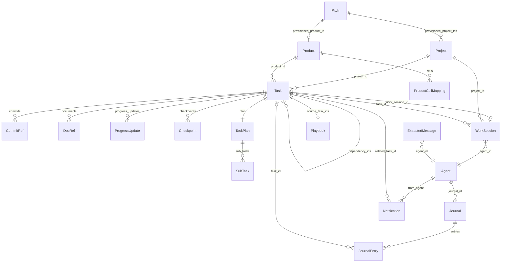

# models slice

## Purpose

The Pydantic/dataclass domain surface of RoboCo — the typed contract the API, services, orchestrator, and agent runtimes all speak. These are **not** the ORM tables (`roboco/db/tables.py` owns persistence); models here are request/response schemas, domain aggregates, runtime DTOs, and enums that get crossed into SQLAlchemy rows by the service layer. Validation (`RobocoBase`: `extra="forbid"`, `validate_assignment`, `use_enum_values`) lives here, and several files (`agents.py`, `runtime.py`, `optimal.py`, `metrics.py`, `llm.py`, `audit.py`, `dashboard.py`, `transcription.py`, `extraction.py`, `permissions.py`) are pure dataclasses/StrEnums with no Pydantic model at all — runtime value types the orchestrator and services pass around.

## Files

| Path | Role | approx LOC |
|------|------|------------|
| `__init__.py` | Public re-export surface (`Agent`, `Task`, `Notification`, `Journal`, `CommitRef`, enums, `get_column_config`, …) | 149 |
| `base.py` | All shared StrEnums (`TaskStatus`, `TaskType`, `AgentStatus`, `ModelProvider`, `JournalEntryType`, …) + `RobocoBase`/`TimestampMixin` + `AgentRole`/`Team` aliases to `foundation.identity` | 275 |
| `task.py` | `Task` aggregate + `CommitRef`/`DocRef`/`ProgressUpdate`/`Checkpoint`/`SubTask`/`TaskPlan` + `TaskCreate`/`TaskUpdate`/`TaskCreateRequest` | 502 |
| `a2a.py` | A2A protocol wire models (`AgentCard`, `A2ATask`, `A2AMessage`, parts) + persistent conversation models (`A2AConversation`, `A2AChatMessage`) + state mappers | 592 |
| `agents.py` | Agent **runtime** domain types — per-role phase enums (`DevTaskPhase`, `QATaskPhase`, `CellPMPhase`, …), `AgentConfig`/`AgentState`, `TaskContext`/`ReviewContext`/`DocContext`, `AuditFlag`/`AuditReport` | 405 |
| `journal.py` | `Journal`/`JournalEntry` + 5 factory param dataclasses + `create_*_entry` factories + `JournalStats`/`GrowthMetrics` | 374 |
| `permissions.py` | `PermissionLevel` IntEnum, `ROLE_LEVELS` (built from `agents_config`), `AgentContext`, `COMMUNICATION_MATRIX`, `TASK_PERMISSIONS`, `KB_PERMISSIONS` | 284 |
| `optimal.py` | RAG domain types — `IndexType`, `SearchResult`/`SearchOutcome`/`RAGResponse`, `ErrorPattern`/`Decision`/`Standard`, `MentorResponse`, `CodeReviewResult` | 275 |
| `metrics.py` | `VelocityMetrics`/`BlockerMetrics`/`TeamMetrics`/`AgentMetrics` + v0.10.0 observability: `StageTiming`/`StageBottleneck`/`BottleneckReport`/`AgentReworkRate`/`ReworkReport`/`Scorecard` | 249 |
| `events.py` | `EventType` StrEnum + `Event` dataclass (JSON round-trip) + `NotificationServiceProtocol`/`OrchestratorAccessProtocol`/`EventContext` DI container | 199 |
| `handoff.py` | `DocumenterHandoff` + `CodeSample`/`DocumentationItem`/`ConversationRef` + `HandoffCreate` (RESERVED — see file header) | 202 |
| `project.py` | `Project` + `BranchReason` + `ProjectCreate`/`ProjectUpdate` (CI-watch, dep-update, quality_command fields) | 178 |
| `agent.py` | `Agent` API model + `ModelConfig`/`AgentPermissions`/`AgentMetrics` + `AgentCreate`/`AgentUpdate` | 172 |
| `kanban.py` | `KanbanBoard`/`KanbanColumn`/`KanbanCard`/`KanbanSwimlane` + per-role column configs + `get_column_config` | 159 |
| `llm_catalog.py` | `CatalogEntry` + `MODEL_CATALOG`/`MODEL_CATALOG_BY_NAME`/`provider_type_for_model` + `OLLAMA_ROLE_DEFAULTS`/`OLLAMA_DEFAULT_MODEL` (Settings dropdown source of truth) | 132 |
| `message.py` | `ExtractedMessage` + `RawStream` | 137 |
| `runtime.py` | Orchestrator runtime types — `OrchestratorAgentState`, `SpawnGitContext`, `OrchestratorAgentConfig`, `AgentInstance`, `WaitingRecord`, `MODEL_MAP`, `ROLE_MODEL_MAP` | 128 |
| `transcription.py` | `StreamBuffer` (flush heuristic) + `TranscriptionConfig` | 119 |
| `llm.py` | `LLMUsage`/`ToonConfig`/`EncodedBlock`/`ToonMetrics` (token + TOON serialization metrics) | 118 |
| `notification.py` | `Notification` + `NotificationCreate` + `CreateNotificationParams` | 117 |
| `work_session.py` | `WorkSession` + `WorkSessionStatus` + `WorkSessionCreate`/`WorkSessionUpdate` | 117 |
| `pitch.py` | `Pitch` + `PitchStatus` + `PitchCreate` (Board proposal → provisioning) | 73 |
| `extraction.py` | `ExtractionContext`/`ExtractionResult`/`ExtractionConfig` | 68 |
| `product.py` | `Product` + `ProductCellMapping` (cell→Project map; validator enforces cell-only) + create/update DTOs | 69 |
| `playbook.py` | `Playbook` + `PlaybookCreate`/`PlaybookUpdate` (curated procedure; `from_attributes` for ORM load) | 58 |
| `audit.py` | `AuditEventType` StrEnum + `PermissionDenialContext`/`StateTransitionDenialContext` dataclasses | 58 |
| `dashboard.py` | `FlagData`/`ReportData`/`TeamHealthData`/`AuditQueueItem`/`CreateFlagParams`/`DashboardStorage` | 96 |
| `secretary.py` | `DirectiveKind`/`DirectiveStatus` StrEnums + `GATED_KINDS` frozenset | 41 |
| `README.md` | Architecture doc for the models package | ~250 |

## Key Symbols

| Name | Kind | File:Line | Responsibility |
|------|------|-----------|----------------|
| `Task` | Pydantic model | task.py:132 | Atomic unit of work; carries status, branch, PR, batch surface, ACs, gateway lock, structured notes |
| `TaskStatus` | StrEnum | base.py:31 | 15-state lifecycle (backlog→pending→claimed→…→completed/cancelled) |
| `TaskType` | StrEnum | base.py:63 | code/documentation/research/planning/design/administrative |
| `TaskNature` | StrEnum | base.py:74 | technical/non_technical |
| `CommitRef` | Pydantic model | task.py:31 | Git commit reference (hash/message/timestamp/author) |
| `DocRef` | Pydantic model | task.py:42 | Document reference with version + author trail |
| `TaskPlan` | Pydantic model | task.py:109 | Approach + ordered `SubTask`s + risks/open_questions |
| `TaskCreate` | Pydantic schema | task.py:350 | Request schema; `_exactly_one_target` validator (project_id / product_id / cell_projects) |
| `TaskCreateRequest` | dataclass | task.py:456 | Service-layer create params mirroring `TASK_AT_CREATE` (no silent defaults) |
| `Agent` | Pydantic model | agent.py:79 | API agent model (role, team, model config, permissions, metrics, journal_id) |
| `AgentRole` | alias | base.py:23 | `= identity.Role` — canonical Role enum lives in `foundation/identity` |
| `Team` | alias | base.py:24 | `= identity.Team` — canonical Team enum lives in `foundation/identity` |
| `ModelProvider` | StrEnum | base.py:197 | anthropic/ollama_cloud/openai/local/grok |
| `ModelConfig` | Pydantic model | agent.py:27 | provider + name + fallback + temperature + max_tokens |
| `AgentPermissions` | Pydantic model | agent.py:45 | can_notify |
| `WorkSession` | Pydantic model | work_session.py:25 | Branch/PR/merge tracking for a (project, task, agent) work episode |
| `WorkSessionStatus` | StrEnum | work_session.py:17 | active/completed/abandoned |
| `Project` | Pydantic model | project.py:47 | Git repo config + CI/dep-update/`sandbox_services` opt-ins + `assigned_cell` |
| `BranchReason` | StrEnum | project.py:18 | feature/bug/chore/docs/hotfix (branch-name prefixes) |
| `ExtractedMessage` | Pydantic model | message.py:51 | Stored message with embedding, edit_history, mentions, task_id |
| `MessageType` | StrEnum | base.py:128 | reasoning/dialogue/decision/action/blocker/technical |
| `RawStream` | Pydantic model | message.py:32 | Ephemeral WebSocket chunk payload |
| `Notification` | Pydantic model | notification.py:26 | Formal signal requiring ACK; from/to_agents, acked_by, acked_at |
| `NotificationType` | StrEnum | base.py:139 | task_assignment/priority_change/blocker_escalation/review_request/…/a2a_request |
| `Journal` | Pydantic model | journal.py:75 | Agent's personal journal; entries_by_type, latest_summary |
| `JournalEntry` | Pydantic model | journal.py:25 | Reflection/learning/struggle/decision entry with embedding + `is_private` |
| `JournalEntryType` | StrEnum | base.py:172 | task_reflection/decision_log/learning/struggle/general |
| `Playbook` | Pydantic model | playbook.py:17 | Curated procedure (draft→approved/archived); `from_attributes` for ORM load |
| `PlaybookStatus` | StrEnum | base.py:112 | draft/approved/archived |
| `AuditEventType` | StrEnum | audit.py:13 | permission_denied/unauthorized_access/role_changed/pm_override/… |
| `A2ATask` | Pydantic model | a2a.py:265 | A2A protocol work unit (maps to internal TaskTable) |
| `A2AMessage` | Pydantic model | a2a.py:212 | A2A communication turn with `Part` union (text/file/data/artifact) |
| `AgentCard` | Pydantic model | a2a.py:103 | A2A agent discovery card (published at /.well-known/agent.json) |
| `A2AConversation` | Pydantic model | a2a.py:468 | Persistent agent-pair conversation (canonical agent_a<agent_b ordering) |
| `A2AChatMessage` | Pydantic model | a2a.py:512 | Stored A2A chat message (distinct from wire `A2AMessage`) |
| `A2ATaskState` | StrEnum | a2a.py:28 | submitted/working/completed/failed/cancelled/input_required/rejected/auth_required |
| `Event` | dataclass | events.py:81 | Event bus envelope with JSON round-trip + correlation_id |
| `EventType` | StrEnum | events.py:18 | task.*/session.*/message.*/agent.*/notification.*/rate_limit.*/usage.snapshot |
| `OrchestratorAgentState` | StrEnum | runtime.py:15 | offline/starting/active/waiting_short/waiting_long/idle/stopping |
| `AgentInstance` | dataclass | runtime.py:70 | Running Claude Code container record + `usage_session_id` |
| `SpawnGitContext` | dataclass | runtime.py:28 | Git context for spawn (project_slug, branch, `task_short_id` for worktree) |
| `MODEL_MAP` | dict | runtime.py:106 | short-name→full Claude id (opus→claude-opus-4-6, sonnet→claude-sonnet-5, haiku→…) |
| `ROLE_MODEL_MAP` | dict | runtime.py:114 | per-role default tier: developer/cell_pm/main_pm→sonnet, qa/documenter→haiku, pr_reviewer/auditor/board/ceo→opus (qa→haiku, main_pm→sonnet, pr_reviewer→opus are the cost-tuned defaults) |
| `ROLE_EFFORT_MAP` | dict | runtime.py | per-role `CLAUDE_CODE_EFFORT_LEVEL` override injected at spawn; **empty/inert by default** (opt-in per role after verifying the level moves usage) |
| `MODEL_CATALOG` | tuple | llm_catalog.py:67 | Settings-dropdown source of truth; Anthropic entries derived from `MODEL_MAP` |
| `OLLAMA_ROLE_DEFAULTS` | dict | llm_catalog.py:107 | Per-role model for "pure Ollama" mode |
| `PermissionLevel` | IntEnum | permissions.py:15 | CEO=0/BOARD=1/MAIN_PM=2/CELL_PM=3/CELL_MEMBER=4/AUDITOR=99 |
| `COMMUNICATION_MATRIX` | dict | permissions.py:83 | Who can directly communicate with whom (role→role set) |
| `IndexType` | StrEnum | optimal.py:13 | code/documentation/conversations/journals/errors/standards/decisions/reviews/learnings/playbooks |
| `SearchResult` | dataclass | optimal.py:32 | RAG hit (content/source/score/index_type/metadata) |
| `RAGResponse` | dataclass | optimal.py:58 | RAG answer + citations + per-index stats |
| `BottleneckReport` | dataclass | metrics.py:160 | Cumulative dwell + parked-now per lifecycle stage |
| `ReworkReport` | dataclass | metrics.py:205 | Bounce rate to needs_revision by team/agent + rework_cost_usd |
| `Scorecard` | dataclass | metrics.py:227 | Fused per-agent/per-cell delivery scorecard |
| `Product` | Pydantic model | product.py:38 | Groups per-cell Project mapping for a repo topology |
| `ProductCellMapping` | Pydantic model | product.py:13 | One cell→Project assignment; validator enforces cell-only `Team` |
| `Pitch` | Pydantic model | pitch.py:43 | Board-authored product proposal → provisioning |
| `DirectiveKind` | StrEnum | secretary.py:13 | relay_message/update_charter/control_task/approve_pitch/announce |
| `GATED_KINDS` | frozenset | secretary.py:34 | High-impact directives that bounce back for CEO confirmation |
| `KanbanBoard` | Pydantic model | kanban.py:79 | Board view with columns/swimlanes; `get_column_config` per board_type |
| `DocumenterHandoff` | Pydantic model | handoff.py:69 | Dev→Doc handoff (RESERVED — not yet wired in service layer) |
| `RobocoBase` | Pydantic BaseModel | base.py:238 | Base config: `extra="forbid"`, `validate_assignment`, `use_enum_values` |
| `TimestampMixin` | Pydantic model | base.py:271 | `created_at`/`updated_at` mixin |
| `AgentConfig` | Pydantic model | agents.py:27 | Runtime agent config (distinct from API `Agent`); convenience `provider`/`model` props |
| `LLMUsage` | dataclass | llm.py:34 | Token accounting incl. cache creation/read |
| `StreamBuffer` | dataclass | transcription.py:13 | Stream accumulator with flush heuristic |

## Data Flow

API request bodies → Pydantic `*Create`/`*Update` schemas (validation boundary, `extra="forbid"`) → route handlers → services. Services translate between these models and the SQLAlchemy ORM tables in `roboco/db/tables.py` (e.g. `TaskTable`, `WorkSessionTable`, `ProjectTable`, `NotificationTable`, `JournalTable`, `JournalEntryTable`, `AgentTable`, `PlaybookTable`, `ProductTable`, `PitchTable`): the ORM row is the persistence shape; the Pydantic model is the contract shape. Several ORM tables load back into a model via `model_config = ConfigDict(from_attributes=True)` (`Playbook` at playbook.py:20, `Product`/`ProductCellMapping` via `RobocoBase`). Runtime-only DTOs (`AgentInstance`, `WaitingRecord`, `SpawnGitContext`, `Event`, `ExtractionResult`, `StreamBuffer`, the metrics/observability dataclasses, `AuditFlag`/`AuditReport`) never touch the DB directly — they are orchestrator/service in-process values. Enum parity between model and ORM is enforced by the test gate (`enum` columns in `tables.py` reference the same `StrEnum` classes from `base.py`/`foundation.identity`). `agent.py` `Agent` is the API/persistence model; `agents.py` `AgentConfig` is the runtime analogue used by the agent implementations — the comment at agents.py:7 calls this split out explicitly. Validation lives almost entirely on the Pydantic schemas (`min_length`, `ge`/`le`, `pattern`, `model_validator`); the dataclass models are intentionally validation-light.

## Mermaid



## Logical Tree

```
models/
├── tasks
│   ├── task.py            Task, TaskCreate, TaskUpdate, TaskCreateRequest, CommitRef, DocRef, ProgressUpdate, Checkpoint, SubTask, TaskPlan
│   ├── kanban.py          KanbanBoard, KanbanCard, KanbanColumn, KanbanSwimlane, column configs
│   ├── handoff.py         DocumenterHandoff, CodeSample, DocumentationItem, ConversationRef, HandoffCreate
│   └── product.py         Product, ProductCellMapping, ProductCreate, ProductUpdate
├── agents
│   ├── agent.py           Agent, AgentCreate, AgentUpdate, ModelConfig, AgentPermissions, AgentMetrics
│   ├── agents.py          AgentConfig, AgentState, DevTaskPhase/QATaskPhase/CellPMPhase/MainPMPhase/DocTaskPhase/ProductOwnerPhase/HeadMarketingPhase/AuditorPhase, TaskContext/ReviewContext/DocContext, AuditFlag, AuditReport
│   └── permissions.py     PermissionLevel, ROLE_LEVELS, AgentContext, COMMUNICATION_MATRIX, TASK_PERMISSIONS, KB_PERMISSIONS
├── comms
│   ├── message.py         ExtractedMessage, RawStream
│   ├── notification.py    Notification, NotificationCreate, CreateNotificationParams
│   ├── a2a.py             AgentCard, A2ATask, A2AMessage, parts, A2AConversation, A2AChatMessage, state mappers
│   ├── extraction.py      ExtractionContext, ExtractionResult, ExtractionConfig
│   └── transcription.py   StreamBuffer, TranscriptionConfig
├── git / work-session
│   ├── work_session.py    WorkSession, WorkSessionStatus, WorkSessionCreate, WorkSessionUpdate
│   └── project.py         Project, BranchReason, ProjectCreate, ProjectUpdate
├── journal / audit
│   ├── journal.py         Journal, JournalEntry, JournalEntryCreate, factory params, create_*_entry, JournalStats, GrowthMetrics
│   ├── audit.py           AuditEventType, PermissionDenialContext, StateTransitionDenialContext
│   └── dashboard.py       FlagData, ReportData, TeamHealthData, AuditQueueItem, DashboardStorage
├── llm
│   ├── llm.py             LLMUsage, ToonConfig, EncodedBlock, ToonMetrics
│   ├── llm_catalog.py     CatalogEntry, MODEL_CATALOG, provider_type_for_model, OLLAMA_ROLE_DEFAULTS, OLLAMA_DEFAULT_MODEL
│   └── runtime.py         OrchestratorAgentState, SpawnGitContext, OrchestratorAgentConfig, AgentInstance, WaitingRecord, MODEL_MAP, ROLE_MODEL_MAP
├── metrics
│   └── metrics.py         VelocityMetrics, BlockerMetrics, TeamMetrics, AgentMetrics, StageTiming, StageBottleneck, BottleneckReport, AgentReworkRate, TeamReworkRate, ReworkReport, Scorecard
├── optimal (RAG)
│   └── optimal.py         IndexType, SearchResult, SearchOutcome, RAGResponse, QueryContext, ErrorPattern, Decision, Standard, MentorResponse, CodeReviewResult, ValidationResult
├── events
│   └── events.py          EventType, Event, NotificationServiceProtocol, OrchestratorAccessProtocol, EventContext
├── company / strategy
│   ├── pitch.py           Pitch, PitchStatus, PitchCreate
│   ├── secretary.py       DirectiveKind, DirectiveStatus, GATED_KINDS
│   └── playbook.py        Playbook, PlaybookCreate, PlaybookUpdate
└── base
    └── base.py            RobocoBase, TimestampMixin, all shared StrEnums, AgentRole/Team aliases, Annotated ID types
```

## Dependencies

- **Pydantic** (`BaseModel`, `ConfigDict`, `Field`, `model_validator`, `field_validator`) — every `RobocoBase` subclass.
- **stdlib** `dataclasses`, `enum.StrEnum`, `datetime`, `uuid`, `typing` — the pure-dataclass files.
- **`roboco.foundation.identity`** — `base.py:21` imports `identity` and aliases `AgentRole = identity.Role`, `Team = identity.Team`. `product.py` and `pitch.py` import `CELL_TEAMS`/`Team` directly from `foundation.identity`.
- **`roboco.agents_config`** — `permissions.py:11` imports `ROLE_PERMISSION_LEVELS` to build `ROLE_LEVELS` at import time.
- **`roboco.models.runtime`** — `llm_catalog.py:22` imports `MODEL_MAP` to derive Anthropic catalog entries.
- **`roboco.models.message`** — `extraction.py:12` imports `ExtractedMessage`.
- **`roboco.models.product`** — `task.py:24` imports `ProductCellMapping` (the `cell_projects` field).
- Internal cross-imports are otherwise minimal; `__init__.py` is the single aggregation point.

## Entry Points

- `from roboco.models import …` — the canonical import surface (`__init__.py` re-exports the API/Pydantic models + enums + `get_column_config`).
- Direct module imports for the dataclass-only files: `from roboco.models.runtime import AgentInstance, WaitingRecord, MODEL_MAP`, `from roboco.models.events import Event, EventType`, `from roboco.models.metrics import BottleneckReport, ReworkReport, Scorecard`, `from roboco.models.optimal import SearchResult, RAGResponse`, `from roboco.models.agents import AgentConfig, DevTaskPhase`, `from roboco.models.llm_catalog import MODEL_CATALOG, provider_type_for_model`.
- `roboco.models.base` — import `RobocoBase`, `TimestampMixin`, and any shared enum when building a new model.

## Config Flags

None — pure models, no flags. (The `Project` model *carries* opt-in fields `ci_watch_enabled`, `dep_update_command`, `dep_update_paths`, `sandbox_services` (project.py:142, validated against `VALID_SANDBOX_SERVICES` — sandboxed dev DB/Redis/Mongo, gated by `ROBOCO_SANDBOX_DB_ENABLED` elsewhere) that other layers gate on, and `llm_catalog` carries the "pure Ollama" defaults, but the models package itself reads no env / toggles nothing.) `VALID_SANDBOX_SERVICES` is now derived from the `SANDBOX_ENGINES` registry in `roboco/models/sandbox.py` (was a hardcoded `{"postgres","redis"}` set) — mongo is just another registry entry, no new migration (rides existing 057) and no new feature flag.

## Gotchas

- `AgentRole` and `Team` are **not defined in `models/base.py`** — they are `identity.Role` / `identity.Team` aliased at base.py:23–24. The comment says "Removed in Phase 4 housekeeping after every consumer is migrated." SQLAlchemy `sa.Enum(AgentRole, name="agentrole")` still works because Python identity is preserved. New code should import from `roboco.foundation.identity` directly.
- `ProductCellMapping` deliberately overrides `use_enum_values=False` (product.py:22) so `team` stays a real `Team` enum for `is`-checks and the validator's `.value` error — the only model that deviates from `RobocoBase`'s `use_enum_values=True`.
- `Task` mutations are not done on the model; `task.py:337` directs callers to `TaskService` (`claim`, `start`, `block`, `complete`, …). Same pattern for `Notification`, `Journal`, `WorkSession` — service-owned state.
- `TaskCreate` has **no silent defaults** for `task_type` / `nature` / `estimated_complexity` (task.py:350 docstring) — mirrors `foundation.policy.task_completeness.TASK_AT_CREATE`. The 2026-05-08 trace of agents omitting `task_type` and deadlocking the lifecycle is the reason.
- `TaskCreate._exactly_one_target` (task.py:405) enforces exactly one of `project_id` / `product_id` / `cell_projects`. Old callers passing `cell_projects` alongside either of the others now fail.
- The "one active WorkSession per task" invariant is **not** in the model — it's a DB partial-unique index (migration 047) + service-layer guard. The model alone won't stop you constructing two active `WorkSession`s.
- `handoff.py` is **RESERVED** (file header, handoff.py:7) — `DocumenterHandoff`/`HandoffStatus` are defined but not wired into the service layer; current flow uses `dev_notes` + `handoff_summary` on `Task`.
- `a2a.py` has two parallel model families: the **wire/protocol** models (`AgentCard`, `A2ATask`, `A2AMessage`, parts — A2A spec) and the **persistent** models (`A2AConversation`, `A2AChatMessage`, `A2AInboxSummary` — DB storage). `A2AMessage` (wire) ≠ `A2AChatMessage` (stored). `task_status_to_a2a_state` / `a2a_state_to_task_status` bridge RoboCo `TaskStatus` ↔ `A2ATaskState` (lossy — many states collapse to `WORKING`).
- `agents.py` `AgentState` (agents.py:81) is a **different** class from the API `Agent.status`/`AgentStatus` enum — runtime vs persistence. Same for `AgentConfig` vs `Agent`.
- `events.py` carries a `TYPE_CHECKING` import of `WaitingRecord` from `roboco.runtime.orchestrator` — a rare upward reference, kept out of runtime by the `Protocol` seam.
- `permissions.py` `ROLE_LEVELS` is built at import time from `agents_config.ROLE_PERMISSION_LEVELS`; entries that don't parse are silently skipped (`except (ValueError, KeyError): pass` at permissions.py:35).
- `llm_catalog.py` Anthropic entries are **derived from `runtime.MODEL_MAP`** — bumping a Claude id there updates the catalog automatically. Ollama Cloud entries are hand-maintained.
- `Playbook` uses `from_attributes=True` (playbook.py:20) to load from the ORM `PlaybookTable`; most other models do not (they're constructed explicitly).

## Drift from CLAUDE.md

- CLAUDE.md "Agent/Role/Team/ModelProvider in agent.py+base.py" — `Role` and `Team` are no longer *defined* in `base.py`; they are aliases to `roboco/foundation/identity.py` (base.py:21–24). The CLAUDE.md note about `ModelProvider` (`ANTHROPIC`/`GROK`/`LOCAL`/`OLLAMA_CLOUD`/`OPENAI` reserved) matches base.py:197–218 exactly.
- CLAUDE.md lists the `Task` model key fields (`task_type`, `project_id`, `branch_name`, `work_session_id`, `pr_number`, `pr_url`, `docs_complete`, `pr_created`, `commits: list[CommitRef]`) — all present on `Task` (task.py:163–255). CLAUDE.md does **not** mention `cell_projects` (task.py:179) or `batch_id`/`intends_to_touch`/`adds_migration`/`touches_shared` (task.py:225–236), which the MegaTask/sequencing sections elsewhere in CLAUDE.md do cover — so the model is ahead of the "Data Models" prose but consistent with the MegaTask section.
- CLAUDE.md "A task has at most one active WorkSession" — enforced by DB partial-unique index (migration 047) + service layer, not by the `WorkSession` model itself (work_session.py has no such constraint). Consistent with CLAUDE.md's "enforced both at the service layer and by a DB partial-unique index".
- The slice prompt named `AuditEvent` and `A2AEnvelope` as landmarks; the actual symbols are `AuditEventType` (audit.py:13, no `AuditEvent` class) and there is no `A2AEnvelope` in `a2a.py` (the gateway `Envelope` lives in `services/gateway/`, not here). Listed the real landmarks instead.
- Otherwise: `TaskStatus` 15-state enum, `TaskType` 6 values, `NotificationType`/`JournalEntryType` all match CLAUDE.md verbatim.
- v0.17.0 delta: the three new ORM tables backing cloud auth + the X engine (`UserTable`, `XCredentialsTable`, `XSeenMentionTable` — migrations 058/059) have **no Pydantic counterpart in this package** — cloud auth's `UserTable` is consumed directly by `fastapi_users`/`roboco.api.auth.*` and the X engine's two tables are read/written directly off the ORM row by `roboco.services.x_*`. They are documented as ORM `Key Symbols` in `db-migrations.md`, not here, consistent with this file's own Purpose statement ("these are not the ORM tables").

## Changes Since Baseline

Range `fd10cc862c2020b3f639cdb686d427b0198a2441..HEAD`, `git log -- roboco/models/` → 2 commits (both the same MegaTask per-cell project-map feature, PRs #283/#285). `git diff --stat`:

```
 roboco/models/llm_catalog.py | 30 +++++++++++++++---------------
 roboco/models/runtime.py     |  6 ++++++
 roboco/models/task.py        | 36 ++++++++++++++++++++++++++++++------
 3 files changed, 51 insertions(+), 21 deletions(-)
```

Logic-touching commits:

- **15effce0 / 3aff6e04 — "Chore: 141 Gaps fill-in (#283)" / "Chore: Close gaps (#285)"** (MegaTask per-cell project map + Ollama catalog refresh)
  - `task.py`: added `cell_projects: list[ProductCellMapping]` field to `Task` (task.py:171), `TaskCreate` (task.py:390), and `TaskCreateRequest` (task.py:482); imported `ProductCellMapping` from `product.py`; renamed `_project_or_product` → `_exactly_one_target` and widened from 2-way (`project_id`/`product_id`) to 3-way (`+ cell_projects`) with `sum(targets) != 1` rejection. Impact: a MegaTask root-subtask can now target an ad-hoc per-cell project map; old callers passing neither target still fail; callers passing `cell_projects` alongside another target now fail (previously silently passed because `cell_projects` didn't exist).
  - `runtime.py`: `SpawnGitContext` gained `task_short_id: str | None = None` (runtime.py:38) — the per-task worktree id the agent must edit in; branchless coordination roots leave it `None`. Impact: additive, backward-compatible.
  - `llm_catalog.py`: `glm-5.1:cloud` → `glm-5.2:cloud` in `MODEL_CATALOG` and `OLLAMA_ROLE_DEFAULTS`; role defaults reshuffled (`developer` minimax-m3 → kimi-k2.7-code, `cell_pm`/`main_pm`/`auditor` kimi-k2.6 → kimi-k2.7-code, `product_owner`/`head_marketing`/`ceo` kimi-k2.6 → glm-5.2, `documenter` glm-5.1 → kimi-k2.7-code); `OLLAMA_DEFAULT_MODEL` minimax-m3 → kimi-k2.7-code. Impact: catalog/UI labels + "pure Ollama" mode defaults only — **persisted `model_assignments` DB rows are not touched** (spawn model = persisted DB row, per the standing memory note), so an existing fleet doesn't silently switch models; only new "pure Ollama" provisioning picks the new defaults.

> Post-snapshot updates (since 2026-06-29): 4 additional commits touched `roboco/models/`.
> - **c71f9b3b** `[chore] logical-gaps: kanban board column coverage + status-class fixes` — `kanban.py`: `DEV_COLUMNS` expanded from 7 to 15 entries (all `TaskStatus` values now covered); `QA_COLUMNS` dropped the `VERIFYING→"In Review"` entry (VERIFYING is the dev's self-check, not a QA state); `PM_COLUMNS` widened to include all gate/revision/paused/cancelled/backlog columns. No model API surface change; internal column configs only.
> - **d8a5bb48** `[chore] logical-gaps: a2a service hierarchy gate + persist skill on message row` — `a2a.py`: `A2AChatMessage` gained `skill: str | None` field (migration 054 adds the DB column). The `send()` verb now persists which capability the A2A is about so the receiver and inbox can surface it.
> - **536bbb64** `[chore] logical-gaps sweep (#286)` — `task.py`: `DocRef` gained `commit_status: str | None` (whether the doc reached the project repo: `committed`/`skipped`/`failed`); this 8-line insertion shifts all subsequent task.py line numbers by +8 vs the baseline annotations above. `playbook.py`: `Playbook` gained `archived_by: UUID | None` and `archived_at: datetime | None` to support the archive curation path.
> - **76ce53e3** `[fix] chat: wire live message delivery end-to-end (MESSAGE_SENT)` — `events.py`: added `EventType.MESSAGE_SENT = "message.sent"`; the bridge forwarded it to `/ws/sessions/{id}` and `/ws/channels/{id}` subscribers. **Now removed** by the comms-subsystem teardown (`docs/internal/specs/2026-07-03-comms-teardown-trace.md`) — the `/ws/sessions`/`/ws/channels` bridge and the tables it served are gone; `EventType.MESSAGE_SENT` itself is left as a dead/inert enum member, not deleted.

## Regression Risks

| Title | File:Line | Claim | Severity |
|-------|-----------|-------|----------|
| `TaskCreate._exactly_one_target` 3-way validator | task.py:405 | Tests/clients asserting the old 2-way error message ("a task needs either a project_id… or a product_id…") will fail against the new message ("a task needs exactly one target: … or cell_projects …"). Any caller that constructed a `TaskCreate` with both `project_id` and `product_id` was already rejected; callers passing `cell_projects` + another target are newly rejected. | Medium |
| `Task.cell_projects` requires migration 052 | task.py:179 | The `cell_projects` field exists on the model regardless of DB state, but persistence (`TaskTable.cell_projects` relationship + `task_cell_projects` table) needs migration 052. On a DB where 052 hasn't run, `TaskService.create` with a non-empty `cell_projects` will fail at insert. | Medium |
| `SpawnGitContext.task_short_id` consumer parity | runtime.py:38 | The field is additive with a `None` default, but every spawn-path consumer that should route the agent into the per-task worktree must read it; a missed consumer silently falls back to the clone root (the old behavior). | Low |
| Ollama catalog defaults vs persisted assignments | llm_catalog.py:107 | `OLLAMA_ROLE_DEFAULTS` / `OLLAMA_DEFAULT_MODEL` changed, but spawn reads persisted `model_assignments` rows — so the defaults only apply when no row exists. An operator who deletes the `model_assignments` rows (the documented "kill stale fleet model" procedure) will now get kimi-k2.7-code / glm-5.2 instead of minimax-m3 / kimi-k2.6. Verify the new tags actually work on the Ollama Cloud plan before relying on this. | Low |
| `ProductCellMapping` import cycle risk | task.py:24 | `task.py` now imports from `product.py` at module load. `product.py` imports only from `foundation.identity` and `base.py` — no cycle today, but a future `product.py` → `task.py` import would create one. | Low |
| `AgentRole`/`Team` alias removal pending | base.py:21–24 | The aliases to `foundation.identity` are a migration shim ("Removed in Phase 4 housekeeping"). Consumers still importing `AgentRole`/`Team` from `roboco.models.base` will break when the shim is removed. | Low |

## Health

The models package is coherent and well-layered: a single `RobocoBase` config drives consistency, enums are centralized in `base.py` (with the `AgentRole`/`Team` alias-to-`foundation.identity` migration clearly commented), and the API/Pydantic vs runtime/dataclass split is explicit (`agent.py` vs `agents.py`, with a docstring calling it out). The recent MegaTask per-cell-map change is small, additive, and validator-guarded; the main follow-on risk is migration 052 parity and test assertions on the renamed validator message — both mechanical. Two long-standing cleanliness items linger: `handoff.py` is a reserved-but-unwired model (file header says so), and several files (`dashboard.py`, `transcription.py`, `extraction.py`) are pure dataclasses that read as service-layer DTOs rather than domain models — harmless but slightly muddies the "models = typed contract surface" framing. Enum parity with the ORM (`tables.py`) is enforced by the test gate. No blocking issues; the package is in good shape.