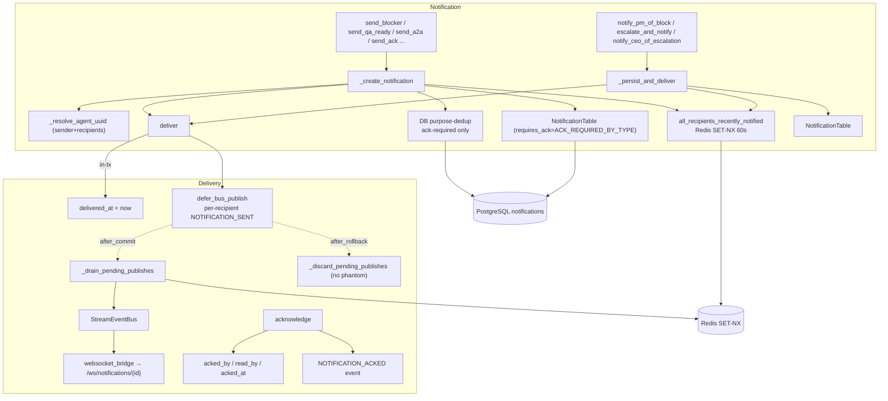

## Purpose
This slice implements RoboCo's formal-notification backbone: NotificationService is the typed notification factory (blocker, QA-ready, A2A, board-review, ack), NotificationDeliveryService handles delivery (transactional-outbox bus publish), ACK tracking, expiry sweeps, PM/CEO task-handoff notifications, and the best-effort Telegram DM bridge (`_notify_telegram`), and notification_dedup is a bounded Redis SET-NX re-fire guard for loop-prone notification types. Together they turn lifecycle events into both a durable DB record and a real-time push, with multiple dedup layers (Redis re-fire window + DB purpose-dedup) to keep agent inboxes from flooding under coordinator loops. Ack-required notifications now also carry a TTL: `_create_notification` stamps `expires_at` (`settings.notification_ack_ttl_hours`, default 48) so the previously dead-on-arrival `sweep_expired_notifications` query finally matches rows. The Telegram side has grown into a full two-way cockpit: V1 (outbound-only DMs on escalation/completion) plus V2's `TelegramInboundEngine` (`telegram_inbound.py`) — a poll loop that turns the CEO's Telegram replies/button-taps into the same CEO-gated service calls the HTTP routes make; V3 (the Mini App sign-in) is a pure HTTP route + validator, mapped in `api-routes-schemas.md` / `support-services.md` / `panel.md`; **V4** adds `TgCockpitService` (`tg_cockpit.py`, backing the Mini App's "Today" brief) and `telegram_bridge.py` (bridging `/secretary`/`/newtask` chat commands into the same live-chat runtimes the panel drives) — both are in this slice's files now.

## Files

| Path | Role | LOC |
|---|---|---|
| roboco/services/notification.py | Typed notification factory (blocker/QA/docs/handoff/A2A/board-review/ack) with slug→UUID recipient resolution, DB purpose-dedup + Redis re-fire guard, owns its own DB context and commit | 943 |
| roboco/services/notification_dedup.py | Bounded Redis SET-NX re-fire guard for loop-prone notification types (TASK_ASSIGNMENT/REVIEW_REQUEST/DOCUMENTATION_REQUEST/BROADCAST); 60s TTL, fail-open | 91 |
| roboco/services/notification_delivery.py | Delivery (transactional-outbox deferred bus publish), ACK/read tracking, expiry sweep, PM/CEO task-handoff notifications (notify_pm_of_block, escalate_and_notify, etc.), API-facing list/CRUD, `_notify_telegram` best-effort CEO DM fan-out (V2: `actionable=True` on escalation attaches an Approve/Reject/Open inline keyboard) | 1305 |
| roboco/services/telegram_client.py | Bot API client ABC + `NullTelegramClient` (unconfigured, never egresses) + `LiveTelegramClient`: `send_message` (reply_markup/reply_to_message_id), V2 additions `get_updates` (long-poll), `answer_callback_query`, `edit_message_reply_markup`, `edit_message_text` | 247 |
| roboco/services/telegram_credentials.py | Singleton Fernet-encrypted `bot_token`/`chat_id` CRUD (mirrors `x_credentials.py`); decrypts server-side only, API returns `has_credentials` only | 109 |
| roboco/services/telegram_inbound.py | V2: `TelegramInboundEngine` — getUpdates poll cycle (offset persisted as `telegram_last_update_id` in system_settings), chat-id AND sender-id authorization, `BOT_COMMANDS` registry driving both `/help` and a once-per-process `setMyCommands` sync, `/status`/`/queue`/`/task`/`/agents`/`/usage`/`/blocked`/`/secretary`/`/newtask`/`/end` command router, `apv|rej:<kind>:<id8>` callback codec, force_reply reject/approve-notes state machine (in-memory `_PENDING_REPLIES`, TTL), per-kind dispatch to the SAME service methods the CEO-gated HTTP routes call (task/release/xpost/video/roadmap), `via=telegram` audit rows | 1295 |
| roboco/services/tg_cockpit.py | V4: `TgCockpitService` — DB-only, one-round-trip aggregate for the Mini App home screen (`today()`) and the bot's `/agents` command (`fleet()`); no live GitHub calls, no orchestrator singleton | 217 |
| roboco/services/telegram_bridge.py | V4: bridges `/secretary`/`/newtask` Telegram chat into the SAME in-process live-chat runtimes the panel drives — a per-chat consumer task drains `PrompterLiveRegistry.stream`, forwards `turn_end`/`draft`/`batch`/`error` events as Telegram messages, and routes a `draft` event's Send-to-Board confirm through `PrompterService.confirm_live_draft` + registry `park` | 291 |

## Data Flow
Two create-and-deliver paths exist. (A) NotificationService._create_notification (notification.py) opens its OWN get_db_context, resolves sender + recipients to UUIDs via _resolve_agent_uuid, runs the Redis re-fire guard (all_recipients_recently_notified), then DB purpose-dedup (ack-required types only, same sender+type+task+overlapping recipients not yet acked), builds NotificationTable with requires_ack from ACK_REQUIRED_BY_TYPE, flushes, calls NotificationDeliveryService.deliver (which defers NOTIFICATION_SENT bus events to after_commit), and finally commits — the commit triggers the deferred bus drain. (B) NotificationDeliveryService._persist_and_deliver (notification_delivery.py) is used by the task-handoff helpers (notify_pm_of_block, escalate_and_notify, etc.): it runs inside the CALLER's open transaction, applies only the Redis re-fire guard (no DB purpose-dedup), adds+flushes+delivers, and leaves the commit to the caller (api/routes/tasks.py). Sweeper loops in the orchestrator call sweep_expired_notifications periodically. Real-time push: deliver defers per-recipient NOTIFICATION_SENT events; the after_commit listener schedules _drain_pending_publishes which publishes to the StreamEventBus; websocket_bridge forwards to /ws/notifications/{id} sockets. ACKs flow acknowledge → acked_by/read_by mutation + NOTIFICATION_ACKED event.

## Mermaid


## Logical Tree
```
notification
├── notification.py (NotificationService)
│   ├── _resolve_agent_uuid (slug/UUID → UUID; 'system' seed)
│   ├── send_blocker / send_stuck_agent / send_qa_ready / send_docs_ready
│   ├── send_handoff / send_qa_failed / send_board_review_complete
│   ├── send_external_pr_reviewed / send_ack / send_a2a (tristate priority; `requires_ack` kwarg overrides the A2A_REQUEST type default of False — only the A2A CEO-DM wake path sets it True)
│   ├── _notification_type_label / _resolve_recipients
│   └── _create_notification (own DB context, re-fire guard, DB dedup, requires_ack, commit)
├── notification_dedup.py
│   ├── _LOOP_PRONE_TYPES (4 types)
│   ├── _DEDUP_TTL_SECONDS (60)
│   ├── _key (type:from:recipient:task)
│   └── all_recipients_recently_notified (per-recipient SET-NX, fail-open)
└── notification_delivery.py (NotificationDeliveryService)
    ├── Transactional outbox (F107)
    │   ├── defer_bus_publish (enqueue + register listeners)
    │   ├── _schedule_pending_publishes (after_commit → loop.create_task)
    │   ├── _drain_pending_publishes (best-effort publish)
    │   └── _discard_pending_publishes (after_rollback)
    ├── EscalationError / EscalationOutcome / BlockerDetails
    ├── deliver (delivered_at in-tx, defer per-recipient events)
    ├── get_notification / _notification_is_fully_acked / _log_expired_notification
    ├── sweep_expired_notifications (log stale unacked)
    ├── get_pending_for_agent / get_unacknowledged_for_agent / get_notification_count
    ├── acknowledge / mark_read / bulk_acknowledge / get_ack_status / get_delivery_summary
    ├── Task-handoff / audit-bridge notifications
    │   ├── notify_pm_of_block / notify_pm_of_docs_complete / notify_pm_of_review_submission
    │   ├── notify_assignee_of_unblock / notify_assignee_of_ceo_rejection
    │   ├── escalate_and_notify (EscalationError/EscalationOutcome)
    │   ├── notify_ceo_of_escalation
    │   ├── notify_auditor_of_rework (ALERT to the auditor agent on needs_revision)
    │   └── _persist_and_deliver (re-fire guard only, caller commits)
    ├── Recipient helpers: _resolve_team_pm / _resolve_pm_for_agent_or_team / _get_agent_by_id/slug / _get_ceo_agent / _get_auditor_agent
    ├── API-facing: list_system_notifications / list_for_agent / get_for_recipient_and_mark_read / acknowledge_for_recipient / mark_read_for_recipient
    └── _notify_telegram (best-effort CEO DM; actionable=True on escalation attaches build_action_keyboard)
telegram_client.py (TelegramClient ABC / NullTelegramClient / LiveTelegramClient)
├── V1: send_message (reply_markup, reply_to_message_id)
└── V2: get_updates (long-poll) / answer_callback_query / edit_message_reply_markup / edit_message_text
telegram_inbound.py (TelegramInboundEngine, V2)
├── run_cycle (getUpdates offset cursor, dispatch each update, advance+persist offset)
├── _handle_message (chat+sender auth, force_reply pending-consume, command dispatch)
├── _dispatch_command (/status /queue /task /help)
├── _handle_callback (chat+sender auth, parse_callback, needs_reply branch → _prompt_for_reply, else _dispatch_approve)
├── _dispatch_approve / _dispatch_reject (per-kind handler dict: task/release/xpost/video/roadmap)
│   └── each handler calls the SAME service method the CEO-gated HTTP route calls; _mark_audit stamps a via=telegram AuditLogTable row
└── _finish_action (clears the buttoned message's keyboard, stamps the outcome)
```

## Dependencies
- Internal: roboco.config.settings (redis_url), roboco.db.tables (NotificationTable, AgentTable, TaskTable), roboco.db.base.get_db_context, roboco.events (Event, EventType, get_event_bus), roboco.foundation.policy.communications.ACK_REQUIRED_BY_TYPE, roboco.models.base (NotificationPriority, NotificationType, AgentRole), roboco.models.notification.CreateNotificationParams, roboco.services.base (BaseService, ConflictError, NotFoundError), roboco.services.permissions.has_privileged_access, roboco.services.repositories.get_agent_slug, roboco.agents_config (get_escalation_target, get_pm_for_agent, get_pm_for_team), roboco.utils.converters (require_uuid, to_python_uuid)
- External: sqlalchemy (select, and_, or_, func, event, joinedload, selectinload, with_for_update, IntegrityError, AsyncSession), redis.asyncio (from_url, set NX EX, aclose), asyncio (create_task, get_running_loop), structlog, datetime (UTC, datetime, timedelta), uuid.UUID, dataclasses
- telegram_inbound.py additionally imports: roboco.services.release_proposal (dispatch_approve, get_release_proposal_service, TaskAlreadyCompletedError), roboco.services.roadmap_service, roboco.services.task.get_task_service, roboco.services.telegram_credentials, roboco.services.tiktok_client/tiktok_credentials, roboco.services.video_post_service (VideoPostService, TaskAlreadyCompletedError, VideoCaptionTooLongError), roboco.services.x_credentials, roboco.services.x_post_service (TaskAlreadyCompletedError, XPostBodyTooLongError), roboco.services.x_video_client, roboco.foundation.policy.content.validators.reject_trivial, roboco.seeds.initial_data.AGENT_UUIDS

## Entry Points

| Name | File | Trigger |
|---|---|---|
| NotificationService.send_*_notification | roboco/services/notification.py | TaskService / orchestrator lifecycle transitions (blocker, qa-ready, docs, a2a, board-review) |
| NotificationService.send_ack_notification | roboco/services/notification.py | gateway `notify` content verb (PM/Board only) |
| NotificationDeliveryService.notify_pm_of_block / escalate_and_notify / notify_ceo_of_escalation / notify_auditor_of_rework | roboco/services/notification_delivery.py | api/routes/tasks.py i_am_blocked / escalate / ceo-approval routes; TaskService._alert_auditor_of_rework at QA-fail / rework chokepoints |
| NotificationDeliveryService.acknowledge / list_for_agent / get_for_recipient_and_mark_read | roboco/services/notification_delivery.py | api/routes/notifications.py ACK + list endpoints |
| sweep_expired_notifications | roboco/services/notification_delivery.py | orchestrator periodic loop (orchestrator.py:5780) |
| TelegramInboundEngine.run_cycle | roboco/services/telegram_inbound.py | orchestrator `_telegram_poll_loop` (default off, `telegram_enabled` AND `telegram_inbound_enabled`) |

## Config Flags
- settings.redis_url — Redis URL used by notification_dedup for the SET-NX re-fire guard (derived from ROBOCO_REDIS_HOST/_PORT)
- `ROBOCO_NOTIFICATION_ACK_TTL_HOURS` (default `48`, `ge=0`) — hours until an ack-required notification's `expires_at` is stamped at creation (`_create_notification`, config.py:270); consumed by `NotificationDeliveryService.sweep_expired_notifications`'s re-escalation. `0` disables stamping entirely (`expires_at` stays `NULL`, legacy behavior — never expires). Only ack-required notifications (per `ACK_REQUIRED_BY_TYPE`) get a deadline; informational ones never do regardless of this setting.
- `telegram_enabled` (default off) — V1 master switch; `_notify_telegram` no-ops without it AND stored credentials.
- `telegram_inbound_enabled` (default off, sub-switch on top of `telegram_enabled`) — V2: arms `TelegramInboundEngine.run_cycle` (the poll loop) and makes escalation DMs carry an actionable keyboard; with it off the bot only sends, never listens, and any inline button on an old message is inert.
- `telegram_poll_interval_seconds` (5.0) / `telegram_poll_timeout_seconds` (25, Bot API long-poll `timeout`) / `telegram_max_updates_per_cycle` (50) / `telegram_pending_reply_ttl_seconds` (300) — V2 poll-loop tuning.


## Gotchas
- Two notification create paths with DIFFERENT dedup strength: NotificationService._create_notification runs BOTH the Redis re-fire guard AND the DB purpose-dedup; NotificationDeliveryService._persist_and_deliver (task-handoff helpers) runs ONLY the Redis re-fire guard and explicitly skips DB purpose-dedup. A reworded BLOCKER_ESCALATION from the handoff path within 60s is suppressed by Redis, but beyond 60s a duplicate can be re-created since there is no DB dedup on that path.
- notification_dedup fail-open: a Redis error returns False (never suppress) — correct for not dropping notifications, but a sustained Redis outage re-opens the per-tick re-fire storm the guard was added to stop.
- notification_dedup.all_recipients_recently_notified has a side effect: it SET-NX-marks recipients NOT yet notified, so the FIRST call for a fresh recipient returns False (delivers) but acquires the key; a concurrent second call within 60s for the same recipient then returns True (suppresses). The marking happens even on the call that decides to deliver — so a suppressed 'all already held' verdict requires every recipient to have been marked by a prior call. Partial-fresh mixed-recipient calls deliver and mark the fresh ones.
- NotificationService._create_notification opens its OWN get_db_context and commits (line 568), while NotificationDeliveryService._persist_and_deliver operates in the CALLER's transaction and does NOT commit. Mixing the two in one outer transaction would double-commit / cross-session.
- requires_ack is set from ACK_REQUIRED_BY_TYPE (notification.py L555) rather than the column default True; MENTION/KNOWLEDGE_SHARE/BROADCAST etc. are False. `CreateNotificationParams.requires_ack` (default None) wins over the type default when a caller sets it — today only `send_a2a_notification`'s `requires_ack` kwarg (default False, `A2AService`'s CEO-DM wake path passes True) threads through to it; every other typed `send_*` helper leaves it unset and gets the type-default behavior unchanged.
- DB purpose-dedup query uses NotificationTable.to_agents.overlap(to_agents_uuids) AND ~acked_by.contains(to_agents_uuids) — overlap matches ANY recipient; a notification to [A,B] with A acked but B not is NOT suppressed for a new send to [A,B] because acked_by does not contain [A,B] (contains is element-wise). The dedup is per-(sender,type,task) not per-recipient, so a third recipient C added on resend goes through.
- defer_bus_publish registers after_commit/after_rollback listeners keyed on session.info[_DRAIN_REGISTERED_KEY]; listeners are bound to sync_session and accumulate only once per AsyncSession instance. A session reused across multiple commit cycles will re-register only once (guard), but the pending queue is popped each commit — if a second deliver happens after the first commit in the same session, the listeners are already registered and the new events append and fire on the next commit.
- acknowledge publishes NOTIFICATION_ACKED directly to the bus (NOT deferred via after_commit) — unlike deliver. An ACK that is rolled back after publish could emit a phantom ACK event. The ACK path does not use the transactional outbox.
- list_system_notifications filters pending_ack_only POST-fetch because 'not fully acked' is not SQL-friendly on PostgreSQL array columns. For pending_ack_only=True the SQL `limit` is NOT applied — applying it before the Python filter let a window of newer fully-acked rows mask older unacked ones the operator still needs to act on (correctness bug fixed in 115061f3); the full ack-required set is fetched ordered newest-first, Python-filtered to unacked, then sliced to `limit`. The non-pending branch retains the SQL limit.
- get_notification_count loads ALL notifications for an agent into memory (no SQL count) to compute total/unread/pending_ack — O(n) per call, no pagination.
- `TelegramInboundEngine._PENDING_REPLIES` (a force_reply prompt awaiting the CEO's free-text reply) is a per-process, in-memory dict keyed by `(chat_id, prompt_message_id)` — not durable. An orchestrator restart drops any in-flight prompt; the CEO just taps the button again. TTL-swept both lazily (on the next prompt) and on expiry at consume-time.
- `_authorized_chat` (chat id must equal the stored credentials' chat id) is the ONLY identity check a Telegram update carries — there is no agent/session token — so it stands in for every CEO-gated route's `require_ceo_role`. `_authorized_sender` (added in the same wave that added `_authorized_chat`'s callers) is defense-in-depth on top of it: when the update carries a `from` user, its id must ALSO equal the chat id (the supported deployment is a private 1:1 chat); a present-but-mismatched sender is refused, an absent one keeps chat-id-only behavior.
- The getUpdates offset cursor reuses the existing `system_settings` KV store (`telegram_last_update_id`, validated as a non-negative int) rather than a new table/migration — a restart resumes from the last-committed offset instead of replaying processed updates.
- `_dispatch_approve`'s `_approve_release` handler must pre-check the proposal's terminal state itself before calling `dispatch_approve` — that function fires the ~40min release execute as a background task and returns immediately with nothing to inspect, so a stale Approve on an already-rejected/published proposal would otherwise report a false "dispatched" success while the service's own guard silently no-ops it.


## Drift from CLAUDE.md
- CLAUDE.md does not describe the notification_dedup Redis re-fire guard, the transactional-outbox (defer_bus_publish / F107) in notification_delivery, or the DB purpose-dedup in NotificationService — all are real, load-bearing behavior added since the baseline and not reflected in the doc's Services table.
- CLAUDE.md's Services table lists NotificationService as 'Formal notifications' but does not mention NotificationDeliveryService at all, nor that NotificationService owns its own DB context+commit while NotificationDeliveryService runs in the caller's txn.
- CLAUDE.md no longer describes notification ack semantics after the channels/groups/discussion-sessions/messages teardown removed the Communication Model section — for the record: requires_ack is False for TASK_ASSIGNMENT/REVIEW_REQUEST/DOCUMENTATION_REQUEST/BROADCAST/KNOWLEDGE_SHARE/MENTION/A2A_REQUEST (ACK_REQUIRED_BY_TYPE), so most notification types do NOT require ack; and notifications can be sent by 'system' (orchestrator-generated), not only PMs/Board.
- CLAUDE.md mentions `roboco/services/notification.py` in the Services table but not `notification_dedup.py` or `notification_delivery.py`.


## Changes Since Baseline

| SHA | Subject | Impact |
|---|---|---|
| 15effce0 | Chore: 141 Gaps fill-in (#283) — added requires_ack from ACK_REQUIRED_BY_TYPE, DB purpose-dedup gated to ack-required types, re-fire guard + notification_dedup.py (new file), transactional-outbox defer_bus_publish in notification_delivery | Major hardening: notifications no longer flood inboxes (Redis re-fire + DB dedup scoped), phantom WebSocket pushes eliminated (deferred bus publish), MENTION/BROADCAST no longer inflate unacked sets (requires_ack=False) |
| 3aff6e04 | Chore: Close gaps (#285) — follow-on gap closure touching notification.py / notification_dedup.py / notification_delivery.py | Refinement of the #283 changes (exact hunks not isolated per-file in this merge commit; consolidated the dedup/outbox behavior above) |

> Post-snapshot updates (since 2026-06-29): 115061f3 fixed list_system_notifications pending_ack_only correctness: SQL limit is now dropped for that branch so newer fully-acked rows can't mask older unacked ones (see Gotcha update above). `61e00832` (PR #492) added `notify_auditor_of_rework()` and `_get_auditor_agent()` to power the reactive auditor dispatch path: HIGH-priority ALERT notifications addressed to the auditor agent are emitted when a task enters `needs_revision` via QA/PR/PM rework chokepoints. **Wave 3** (2026-07-17, PR #547): `CreateNotificationParams` gains `requires_ack: bool | None = None`, consulted in `_create_notification` ahead of the `ACK_REQUIRED_BY_TYPE` default; `send_a2a_notification` gains a `requires_ack: bool = False` kwarg (plus an `str | None` `task_id`, for a conversational DM with no task behind it) that threads through — the only caller passing True is `A2AService._maybe_wake_ceo_recipient` (docs/map/a2a-audit-journal-permissions.md), so its wake row is finally visible to the orchestrator's `_dispatch_a2a_work` `pending_ack_only` poll.
> `cd978d11`+fixes (2026-07-18, wave-13): Telegram sends are HTML-styled — `_esc` (text nodes) / `_esc_attr` (href attributes) escaping discipline, balance-aware `_truncate`, `parse_mode`/`disable_link_preview` on the client; new `notify_ceo_of_queue_item` pushes a styled keyboard DM at each held-draft origination (release/x/video engines + `propose_roadmap`), sharing `telegram_inbound.render_queue_item_text`.
> `3b9fd0e0`+`11915f36` (PR #551, Telegram V2): `3b9fd0e0` adds `telegram_inbound.py` (new file, `TelegramInboundEngine`), extends `telegram_client.py` with `get_updates`/`answer_callback_query`/`edit_message_reply_markup`/`edit_message_text`, adds `actionable=True` to `_notify_telegram` (escalation only) so the DM carries an Approve/Reject/Open keyboard, and wires the orchestrator's `_telegram_poll_loop`. `11915f36` closes a live-reproduced approve-after-reject hole reachable via a stale Telegram button (or the pre-existing HTTP routes for X/video): `ReleaseProposalService.approve()` now refuses CANCELLED (`already_rejected`) and COMPLETED (`already_published`) proposals via a new `_approve_precheck`, `.reject()` refuses COMPLETED by raising a new `TaskAlreadyCompletedError`, and `XPostService`/`VideoPostService.approve()` each add a CANCELLED pre-lock-and-under-lock guard returning `already_rejected`. Also adds `_authorized_sender` (chat-id auth is defense-in-depth'd with a sender-id check) and widens `_resolve_task`'s search limit 10→50 so a genuine id-prefix hit can't be pushed out by newer title/description matches.
> `baa87d58`+`c7605b0d` (2026-07-19, PR #576 + #582, Telegram Mini App V4): new `tg_cockpit.py` — `TgCockpitService.today()` (tg_cockpit.py:59) assembles `needs_you`/`fleet`/`spend`/`velocity`/`ship` in one DB-only round trip backing `GET /api/telegram/today` (`api/routes/telegram.py:89`, `require_ceo_role` + 30/60s rate limit); `TgCockpitService.fleet()` (tg_cockpit.py:110) is shared verbatim by the bot's new `/agents` command. New `telegram_bridge.py` — `BridgeSession` (per-chat, in-memory) lifecycle via `start_secretary`/`start_intake`, a sole-consumer `_consume` task draining `PrompterLiveRegistry.stream`, `_forward_event` turning `turn_end`/`draft`/`batch`/`error` stream events into Telegram messages, and `mark_parked`/`discard_draft` routing a draft's Send-to-Board confirm through `PrompterService.confirm_live_draft(route="board")` + registry `park`; `sweep_idle()` reuses `settings.interactive_idle_reap_seconds` and skips parked sessions. `telegram_inbound.py` gains `BOT_COMMANDS` (a single registry driving both `/help`'s `_HELP_TEXT` and a once-per-process `client.set_my_commands` sync via `TelegramInboundEngine._ensure_commands_menu`, called from `run_cycle()`) plus `/agents` (`_render_agents`, calls `TgCockpitService.fleet()`), `/usage` (`_render_usage`, `UsageService.get_today_summary`), `/blocked` (`_render_blocked`, capped `awaiting_ceo_approval`+`blocked` lists with deep-linked rows), and `/secretary`/`/newtask`/`/end` (dispatch straight into `telegram_bridge.py`). `telegram_client.py` gains `set_my_commands` (`LiveTelegramClient`, best-effort `httpx.HTTPError`-suppressed) + a `NullTelegramClient` no-op. No orchestrator wiring changed — `_telegram_poll_loop`/`_run_telegram_poll_cycle` are byte-for-byte unchanged; the bridge's idle sweep and the commands sync both run *inside* the existing `run_cycle()` tick. New response schemas in `api/schemas/telegram.py`: `TodayTaskItem`/`TodayNeedsYou`/`TodayFleetAgent`/`TodayFleet`/`TodaySpend` (gains `series`/`delta_pct` in the `c7605b0d` follow-up)/`TodayVelocity` (new in `c7605b0d`)/`TodayShip`/`TelegramTodayResponse`.
> `56b6693e` ("security-hygiene-sweep"): root-causes a previously dead-on-arrival sweep — `NotificationDeliveryService.sweep_expired_notifications` already ran a real `expires_at < now()` query, but `NotificationService._create_notification` never WROTE `expires_at`, so the query always matched zero rows and every ack-required notification was effectively immortal. `_create_notification` now computes `requires_ack` up front (same derivation as before) and, when ack-required AND `settings.notification_ack_ttl_hours > 0`, stamps `expires_at = now() + timedelta(hours=notification_ack_ttl_hours)` (default 48h) on the `NotificationTable` row; `0` leaves `expires_at` `NULL` (never expires). Informational notifications never get a deadline regardless of the setting.

## Regression Risks

| Title | File:Line | Claim | Severity |
|---|---|---|---|
| DB purpose-dedup now gated to ack-required types only — informational duplicates no longer suppressed | roboco/services/notification.py:521 | is_ack_required = ACK_REQUIRED_BY_TYPE.get(params.notification_type, True); the DB dup_q is only run when is_ack_required. REVIEW_REQUEST/DOCUMENTATION_REQUEST/TASK_ASSIGNMENT are ack-required=False, so they skip DB dedup and rely SOLELY on the 60s Redis window. Beyond 60s, a coordinator can re-fire the same REVIEW_REQUEST every tick and each one persists (the original bug the dedup was meant to stop). The Redis guard coalesces within 60s but a tick interval >60s re-opens the flood. Severity medium because the Redis guard covers the common per-tick storm. | medium |
| _persist_and_deliver skips DB purpose-dedup entirely — task-handoff duplicates not DB-deduped | roboco/services/notification_delivery.py:875 | _persist_and_deliver applies only all_recipients_recently_notified (Redis) and then add+flush+deliver with no DB dup_q. notify_pm_of_block / escalate_and_notify / notify_assignee_of_unblock can each be re-triggered (e.g. a retried i_am_blocked, a re-issued escalate) and, past the 60s Redis window, create a second BLOCKER_ESCALATION for the same (sender, type, task) while the first is unacked — exactly the inbox inflation + i_am_idle soft-block the DB dedup was added to prevent on the other path. Two paths for the same notification type with different dedup strength is a real hole. | medium |
| acknowledge publishes NOTIFICATION_ACKED directly, not via the transactional outbox | roboco/services/notification_delivery.py:451 | deliver was migrated to defer_bus_publish (after_commit) to kill phantom pushes, but acknowledge still does `await bus.publish(...)` inside the open transaction before the caller commits. A rollback after a successful ACK publish emits a phantom NOTIFICATION_ACKED for an ACK that didn't persist — the same class of bug F107 fixed for deliver, left unfixed for the ACK path. | medium |
| all_recipients_recently_notified marks recipients as a side effect on the deciding call | roboco/services/notification_dedup.py:78 | The function SET-NX-marks each fresh recipient while computing the verdict, so the call that DECIDES TO DELIVER also acquires keys for the fresh recipients. A subsequent resend within 60s then sees all-held and suppresses — intended — but it means the very first notification in a window consumes the TTL for recipients who genuinely received it, and a legit follow-up to a subset within 60s is suppressed if all of that subset were marked by the prior send. For BROADCAST this can drop a legitimately re-targeted broadcast within the window. | low |
| get_notification_count loads all agent notifications into memory | roboco/services/notification_delivery.py:379 | base_query selects all NotificationTable rows where to_agents contains agent_id with no limit, then counts in Python. For a long-running agent this row count grows unbounded; called via get_delivery_summary on the panel it is an O(n) DB read per dashboard load. Not a correctness regression from the baseline but the slice's new dedup reduces new-row growth, masking the unbounded-scan risk. | low |
| defer_bus_publish listener registration tied to session.info on the AsyncSession — session reuse hazard | roboco/services/notification_delivery.py:116 | _DRAIN_REGISTERED_KEY is set once per AsyncSession and the SQLAlchemy event.listens_for(sync_session, ...) is bound to sync_session. If an AsyncSession is reused for multiple independent transactions (connection-pool recycling), the listener stays registered and fires _schedule_pending_publishes on every subsequent commit even when no new events were deferred — _schedule_pending_publishes pops an empty queue and no-ops, so it is benign, but the listener is never removed and accumulates on the sync_session for the session's lifetime. A long-lived sync_session with many AsyncSession wraps could accumulate listeners. | low |
| `notify_auditor_of_rework` is best-effort and not deduplicated beyond the Redis re-fire guard | roboco/services/notification_delivery.py:937 | Delivery failures are swallowed and logged by the TaskService caller so the needs_revision transition never blocks. ALERT is ack-required, so each unacked rework event persists until the auditor acks it; repeated QA/PR/PM rejects on the same task emit one ALERT per transition. | low |

## Health
This slice is substantially hardened since the baseline: the transactional-outbox for delivery (F107), the Redis re-fire guard, and the ACK_REQUIRED_BY_TYPE-driven requires_ack are all real, well-documented fixes that close prior meltdowns. The main integrity gap is dedup-path fragmentation: NotificationService._create_notification runs two dedup layers (Redis + DB purpose-dedup) while NotificationDeliveryService._persist_and_deliver runs only the Redis layer, so the task-handoff notifications (blocker/escalation/ceo-rejection) are not protected by DB purpose-dedup past the 60s Redis window — a retried i_am_blocked or escalate beyond 60s can re-create an unacked duplicate, the exact inbox-inflation + i_am_idle soft-block the DB dedup was added to prevent. A secondary consistency gap is that acknowledge publishes NOTIFICATION_ACKED directly to the bus instead of through the deferred outbox, leaving the same phantom-event class F107 fixed for deliver. Neither is a crash bug; both are correctness drift between two paths that should behave identically. Code quality is high (terse comments, clear docstrings, explicit race handling), and the slice is well-covered by the orchestrator sweeper integration and route-level callers.
