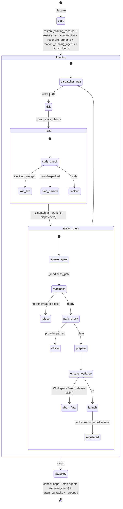

## Purpose
The AgentOrchestrator is the runtime brain of RoboCo: it owns the per-agent Docker container lifecycle, the per-tick dispatcher that matches tasks to agents, the stale-claim reaper, the provider rate-limit/overload park-and-probe recovery loop, and the default-off background engines (self-heal, CI-watch, dep-update, release-manager, strategy, external-PR poll, X-engine mentions poll, board roadmap engine, video render loop). It claims tasks on behalf of agents before spawning, injects briefings/manifests/git context at spawn time, provisions a per-spawn sandbox (postgres/redis/mongo via the engine registry) when opted in, captures per-session token usage, and persists durable runtime state (WaitingRecord, respawn_tracker) across restarts.

## Files

| Path | Role | LOC |
|---|---|---|
| /Users/renzof/Documents/GitHub/ZZZ/roboco-master/roboco/roboco/runtime/orchestrator.py | Single 11485-line module: module helpers + the AgentOrchestrator class — container lifecycle, dispatchers, reaper, provider-parking, interactive intake/secretary spawns, background engine loops, token/cost capture, durable-state restore. | 11485 |

## Key Symbols

| Name | Kind | File:Line | Responsibility |
|---|---|---|---|
| _system_api_headers | function | roboco/runtime/orchestrator.py:127 | System-identity headers (X-Agent-ID/Role/Token) for the orchestrator's internal self-API calls so silent recovery ops pass auth-required. |
| _is_coordination_task | function | roboco/runtime/orchestrator.py:395 | True for branchless tasks (product fan-out, ad-hoc cell map, MegaTask umbrella) via is_branchless_coordination; gates git-exemption sites. |
| _branch_is_expected | function | roboco/runtime/orchestrator.py:428 | True iff a code task should already have a branch_name (claimed/in_progress/verifying, non-coordination); gates the missing-branch readiness/stuck condition. |
| _agent_worktree_path | function | roboco/runtime/orchestrator.py:473 | Per-task worktree path under the clone root (F123) so parallel roots/tasks never clobber one shared checkout. |
| _agent_cwd_path | function | roboco/runtime/orchestrator.py:487 | ONE formula for the container cwd + Edit/Write allowlist scope (worktree when branch present, else clone root) so -w and the allowlist never drift. |
| _build_manifest_for_agent | function | roboco/runtime/orchestrator.py:560 | Write the per-role gateway SpawnManifest JSON to disk and return the host bind-mount path; None for non-gateway roles. |
| gateway_pre_spawn_check | function | roboco/runtime/orchestrator.py:687 | Consult trigger_filter spawn-cooldown + provider rate-limit tracker; returns spawn/queue/drop, degrades to spawn on any error. |
| AgentReadinessError | class | roboco/runtime/orchestrator.py:796 | Raised when spawn_agent refuses (task not ready / human role / worktree fatal); caller logs and moves on. |
| _SpawnAbortedDuringShutdown | class | roboco/runtime/orchestrator.py:804 | Signals a non-blocking intake/secretary spawn completed docker run after shutdown began; raiser already removed the container. |
| AgentOrchestrator.__init__ | method | roboco/runtime/orchestrator.py:830 | Initialize instance/waiting/bg-task registries, locks (dispatch, supersede, intake/secretary spawn, respawn-persist), TTLs from settings, grok backoff state. |
| AgentOrchestrator.start | method | roboco/runtime/orchestrator.py:972 | Ensure agent image, restore WaitingRecord + respawn_tracker, reconcile orphan claims, readopt running containers, launch all background loops. |
| AgentOrchestrator.stop | method | roboco/runtime/orchestrator.py:1057 | Idempotent shutdown: cancel loops, stop agents (release_claim=True, skip provider-parked), drain bg writes, set _stopped. |
| AgentOrchestrator._drain_bg_tasks | method | roboco/runtime/orchestrator.py:1031 | Bounded wait for fire-and-forget bg writes to commit before exit; cancels past _SHUTDOWN_DRAIN_TIMEOUT_SECONDS. |
| AgentOrchestrator._ensure_agent_image | method | roboco/runtime/orchestrator.py:1110 | Build/pull base + role-specialized agent Docker images; idempotent; registry-mode pulls pre-built images. |
| AgentOrchestrator._get_role_permissions | method | roboco/runtime/orchestrator.py:1313 | Build the Edit/Write/Read allowlist scoped to the agent's cwd (worktree or clone root) and cell workspace for documenters. |
| AgentOrchestrator._fable_hook_groups | method | roboco/runtime/orchestrator.py:1414 | Default-off (`fable_mode_enabled`) Claude-path hook groups for 5 vendored fable-mode scripts (stop-gate/bash-discipline/honesty-nudge/prompt-nudge/precompact); appended AFTER RoboCo's own per-event hooks inside `_generate_agent_settings`. |
| AgentOrchestrator._task_git_context | method | roboco/runtime/orchestrator.py:1685 | Build SpawnGitContext from a task payload; sets task_short_id (first 8 chars) only when a branch exists. |
| AgentOrchestrator._safe_spawn | method | roboco/runtime/orchestrator.py:1816 | Build SpawnInputs and delegate to the resolved AgentProvider (grok) or built-in _spawn_container path. |
| AgentOrchestrator._prepare_agent_spawn | method | roboco/runtime/orchestrator.py:1930 | Resolve project/team/cwd, ensure worktree, generate settings/permissions, write briefing + MCP config, compose prompt, ensure image, register STARTING instance. |
| AgentOrchestrator._ensure_worktree_before_spawn | method | roboco/runtime/orchestrator.py:2001 | Idempotently re-attach a pruned task worktree before -w lands on it; fatal WorkspaceError releases claim + aborts, transient aborts without release. |
| AgentOrchestrator.spawn_agent | method | roboco/runtime/orchestrator.py:2141 | Chokepoint spawn entry: validate path-segment, refuse human-only roles, readiness gate, resolve git context, provider-park pre-check, TOCTOU re-check, prepare + launch. |
| AgentOrchestrator._resolve_host_paths | method | roboco/runtime/orchestrator.py:2297 | Compute host bind-mount paths for containerized vs host runtime (docs/workspaces/claude/mcp/grok-usage/prompt/settings/briefing). |
| AgentOrchestrator._spawn_container | method | roboco/runtime/orchestrator.py:2664 | Run the Claude Code SDK container via docker with all mounts/env/manifest/cwd args; returns container id. |
| AgentOrchestrator._generate_mcp_config | method | roboco/runtime/orchestrator.py:2779 | Write the per-agent MCP servers config (flow/do/git-readonly/optimal/docs) to disk and return the path; delegates the role-scoped extras to `_append_role_scoped_mcp_servers`. |
| AgentOrchestrator._append_role_scoped_mcp_servers | method | roboco/runtime/orchestrator.py:3541 | Registers `roboco-docs` (documenter/PM/board roles), `roboco-search` (Board+PM roles, `research_enabled`), and `playwright` (`fe-qa`/`ux-qa` ONLY — role-gated via `agent_role == "qa"` + team in `{frontend, ux_ui}`, not image-gated, so `ux-dev` never sees it despite sharing `agent-ux`'s image) — `command: /app/scripts/playwright-mcp-entrypoint.sh`, no args (the wrapper resolves the image's own baked `chromium-headless-shell`). Split out of `_generate_mcp_config` to keep it under the xenon complexity budget. |
| AgentOrchestrator._generate_composed_prompt | method | roboco/runtime/orchestrator.py:2946 | Compose the spawn prompt (identity + task briefing + ambient conventions block + tool-load block) via compose_prompt. |
| AgentOrchestrator._resolve_conventions_ambient | method | roboco/runtime/orchestrator.py:2998 | Resolve the in-scope projects for the ambient architectural-conventions block (single repo / product / ad-hoc cell map). |
| AgentOrchestrator._readiness_gate | method | roboco/runtime/orchestrator.py:3104 | Pre-flight refusal: missing project/cell-map, missing AC, role/status mismatch, missing git token, bad task shape, unmet dependencies. |
| AgentOrchestrator._write_agent_briefing | method | roboco/runtime/orchestrator.py:3431 | Fetch task + institutional memory + workflow state and render the per-agent briefing markdown at the cwd path. |
| AgentOrchestrator.start_intake_session | method | roboco/runtime/orchestrator.py:3612 | Open the intake relay + schedule the guarded spawn of the single persistent intake container. |
| AgentOrchestrator._spawn_intake_container | method | roboco/runtime/orchestrator.py:3715 | Spawn the intake container under _intake_spawn_lock: clone intake scope, build cmd, run, abort-if-shutdown, register instance, record usage session. |
| AgentOrchestrator._spawn_secretary_container | method | roboco/runtime/orchestrator.py:3918 | Spawn the secretary container under _secretary_spawn_lock with authenticated identity env; same abort-if-shutdown shape as intake. |
| AgentOrchestrator._reap_idle_interactive_sessions | method | roboco/runtime/orchestrator.py:4038 | Reap idle intake/secretary containers past interactive_idle_reap_seconds. |
| AgentOrchestrator._clone_intake_scope | method | roboco/runtime/orchestrator.py:4137 | Clone the intake chat's project/product/multi-project scope into the intake workspace; returns cwd + cloned slug list. |
| AgentOrchestrator.stop_agent | method | roboco/runtime/orchestrator.py:4412 | Stop a container; release_claim=True hands the claimed task back to the pool now (skips provider-parked); finalizes usage session. |
| AgentOrchestrator._release_stopped_agent_claim | method | roboco/runtime/orchestrator.py:4517 | Idempotent unclaim_for_reaper on a stopped agent's task; best-effort, reaper backstops. |
| AgentOrchestrator._persist_respawn_record | method | roboco/runtime/orchestrator.py:4658 | Atomic ON CONFLICT DO UPDATE upsert of one respawn_tracker row under _respawn_persist_lock so commits land in logical schedule order. |
| AgentOrchestrator._record_spawn_session | method | roboco/runtime/orchestrator.py:4804 | Insert an agent_spawn_sessions row + pin its id on the instance for usage attribution. |
| AgentOrchestrator._finalize_spawn_session | method | roboco/runtime/orchestrator.py:5059 | Resolve final token usage (Claude transcript or grok usage.json), update the spawn session row, publish USAGE_SNAPSHOT, evict instance. |
| AgentOrchestrator._sweep_token_snapshots | method | roboco/runtime/orchestrator.py:5262 | Periodic live-usage snapshot sweep across active agents; finalizes stopped ones; budget-exceeded termination. |
| AgentOrchestrator._enforce_grok_cost_budget | method | roboco/runtime/orchestrator.py:4952 | Kill live grok containers whose captured cost exceeds grok_max_cost_usd; release_claim=True. |
| AgentOrchestrator.restore_waiting_records | method | roboco/runtime/orchestrator.py:5479 | Repopulate _waiting_records from the WaitingRecordTable at startup. |
| AgentOrchestrator.restore_respawn_tracker | method | roboco/runtime/orchestrator.py:5561 | Repopulate _pm_respawn_tracker from respawn_tracker rows, re-stamping last_check/last_status to live values, evicting terminal/missing rows. |
| AgentOrchestrator._partition_respawn_rows | method | roboco/runtime/orchestrator.py:5515 | Split restored respawn rows into restorable vs evict (terminal/missing task). |
| AgentOrchestrator.resolve_wait | method | roboco/runtime/orchestrator.py:5606 | Resume a waiting agent: respawn FIRST then tear down the record only once a container launched (keeps record through a provider re-park bail). |
| AgentOrchestrator._health_loop | method | roboco/runtime/orchestrator.py:5728 | Periodic _check_health pass over all instances. |
| AgentOrchestrator._sweeper_loop | method | roboco/runtime/orchestrator.py:5739 | Periodic _run_sweep: superseded PRs, dangling images, transcript retention, budget exceeded. |
| AgentOrchestrator._check_health | method | roboco/runtime/orchestrator.py:6256 | Per-agent docker inspect; on exit, route through _maybe_park_for_exit_error / _crash_retry_or_escalate / _handle_stopped_container. |
| AgentOrchestrator._inspect_container_state | method | roboco/runtime/orchestrator.py:6014 | docker inspect with _DOCKER_INSPECT_TIMEOUT_SECONDS; returns (is_running, exit_code); per-agent failure skips that agent. |
| AgentOrchestrator._resolve_container_id | method | roboco/runtime/orchestrator.py:6047 | Resolve a container id by name for re-adoption so _check_health sees the real id. |
| AgentOrchestrator._probe_gateway_health | method | roboco/runtime/orchestrator.py:6077 | Out-of-band docker exec gateway-venv import probe for broken-but-alive agents; timed via _DOCKER_EXEC_TIMEOUT_SECONDS. |
| AgentOrchestrator._maybe_park_for_exit_error | method | roboco/runtime/orchestrator.py:6115 | Detect session-limit/overload markers in dead container output + transcript tail; park provider instead of crash-retrying. |
| AgentOrchestrator._maybe_recover_broken_gateway | method | roboco/runtime/orchestrator.py:8689 | Kill + evict a broken-but-alive agent past gateway_health_grace_seconds so it falls through to release + respawn. |
| AgentOrchestrator._strategy_engine_loop | method | roboco/runtime/orchestrator.py:6360 | Default-off strategy engine tick loop (gated by strategy_engine_enabled). |
| AgentOrchestrator._external_pr_poll_loop | method | roboco/runtime/orchestrator.py:6383 | Poll inbound external PRs for review (external_pr_enabled / internal_pr_enabled). |
| AgentOrchestrator._self_heal_loop | method | roboco/runtime/orchestrator.py:6411 | Single-repo self-heal CI-watch tick loop (self_heal_enabled). |
| AgentOrchestrator._ci_watch_loop | method | roboco/runtime/orchestrator.py:6446 | Multi-repo CI-watch tick loop (ci_watch_enabled); _load_ci_watch_set one per (repo, workflow). |
| AgentOrchestrator._dep_update_loop | method | roboco/runtime/orchestrator.py:6534 | Dependency-update bot tick loop (dep_update_enabled); _load_dep_update_set one per (repo, command). |
| AgentOrchestrator._release_manager_loop | method | roboco/runtime/orchestrator.py:6576 | Gated release-manager readiness sweep tick loop (release_manager_enabled). |
| AgentOrchestrator._projects_one_per_key | method | roboco/runtime/orchestrator.py:6665 | Collapse projects to one canonical (by slug) per distinct key (repo / (repo,workflow) / (repo,command)). |
| AgentOrchestrator._rate_limit_probe_loop | method | roboco/runtime/orchestrator.py:6926 | Probe parked providers every 30s; resume waiting agents on success; orphan-provider fallback for untracker-listed parks. |
| AgentOrchestrator._provider_spawn_parked | method | roboco/runtime/orchestrator.py:7016 | True when the provider is currently rate-limited/overloaded parked (spawn short-circuit). |
| AgentOrchestrator._park_provider_unavailable | method | roboco/runtime/orchestrator.py:7172 | Park an agent + provider: stop container, register rate_limit_lifted WaitingRecord, persist it, activate tracker. |
| AgentOrchestrator._park_grok_rate_limited | method | roboco/runtime/orchestrator.py:7233 | Park a grok agent on xAI 429 (exit 75) with exponential re-park backoff within one episode. |
| AgentOrchestrator._park_grok_auth_unavailable | method | roboco/runtime/orchestrator.py:7268 | Park a grok agent on missing/expired auth token (exit 78). |
| AgentOrchestrator._on_probe_failure | method | roboco/runtime/orchestrator.py:7350 | Count failed probes; CEO-notify once at threshold; past _PROBE_GIVE_UP_THRESHOLD fall back to time-expiry optimism (clear park + resume). |
| AgentOrchestrator._readopt_running_agents | method | roboco/runtime/orchestrator.py:8547 | At startup, re-adopt surviving containers into _instances as ACTIVE with real container ids; inert when nothing runs. |
| AgentOrchestrator._should_skip_live_reap | method | roboco/runtime/orchestrator.py:8750 | Spare a live container from reaping UNLESS wedged (grok) or gateway-broken past grace (those kill+evict). |
| AgentOrchestrator._assignee_is_provider_parked | method | roboco/runtime/orchestrator.py:8527 | True if a task's assignee is provider-parked; reaper skips it so the claim survives for probe-resume. |
| AgentOrchestrator._reap_with_service | method | roboco/runtime/orchestrator.py:8770 | Inner stale-claim reaper: skip live (unless wedged/broken), skip provider-parked, unclaim_for_reaper the rest. |
| AgentOrchestrator._sandbox_available_services | method | roboco/runtime/orchestrator.py:2223 | On-demand model (2026-07-08): availability probe only — which services this spawn's project opted into (`sandbox_db_enabled` + `sandbox_services`); `[]` if off/not-opted, byte-for-byte legacy path. No provisioning happens here anymore (see `ensure_sandbox`), so a spawn never fails on sandbox infra. |
| AgentOrchestrator.ensure_sandbox | method | roboco/runtime/orchestrator.py:2251 | On-demand model: idempotent provision called by the `request_sandbox` do-verb. Cache hit (`_sandbox_info`, keyed by agent slug) covering the requested services returns the same creds; a miss provisions via `SandboxProvisioner.provision` (pre-clear tears down stale same-named containers) and caches the result. Evicted at teardown and by the janitor sweep; in-memory only — an orchestrator restart forgets it (next call re-provisions). |
| AgentOrchestrator._append_sandbox_marker_env | staticmethod | roboco/runtime/orchestrator.py:2846 | On-demand model: replaces the old eager `_append_sandbox_env` — injects only a cheap informational marker (`ROBOCO_SANDBOX_SERVICES_AVAILABLE=<csv>`), never creds, naming the services `request_sandbox()` will provision on demand. Called INSTEAD OF `_append_gate_env` for an opted-in project's spawn. |
| AgentOrchestrator._sandbox_janitor_sweep | method | roboco/runtime/orchestrator.py:9426 | Best-effort: remove sandbox containers whose owner agent is gone; rides the reaper tick, error-isolated. |
| AgentOrchestrator._x_mentions_poll_loop | method | roboco/runtime/orchestrator.py:7431 | Default-off X-engine mentions-poll tick loop (`x_engine_enabled`); release-post drafts are event-driven, not from this loop. |
| AgentOrchestrator._run_x_mentions_cycle | method | roboco/runtime/orchestrator.py:7453 | One mentions-poll pass: `get_x_engine(db).run_cycle()` + commit; testable without the sleep. |
| AgentOrchestrator._x_feature_spotlight_loop | method | roboco/runtime/orchestrator.py:7571 | Default-off X-engine feature-spotlight tick loop (`x_engine_enabled` AND `x_feature_spotlight_enabled`); opens one held Head-of-Marketing exploration task per `x_feature_spotlight_interval_seconds` (default 3d). |
| AgentOrchestrator._run_x_feature_spotlight_cycle | method | roboco/runtime/orchestrator.py:7591 | One feature-spotlight pass: `get_x_engine(db).open_feature_spotlight_exploration()` + commit; testable without the sleep. |
| AgentOrchestrator._roadmap_engine_loop | method | roboco/runtime/orchestrator.py:7462 | Default-off board roadmap-engine tick loop (`roadmap_engine_enabled`); opens one held exploration cycle per interval. |
| AgentOrchestrator._run_roadmap_engine_cycle | method | roboco/runtime/orchestrator.py:7484 | One roadmap-engine pass: `get_roadmap_engine(db).run_cycle()` + commit; testable without the sleep. |
| AgentOrchestrator._dispatch_roadmap_exploration | method | roboco/runtime/orchestrator.py:10284 | One-shot Product-Owner spawn to author a themed roadmap cycle; bypasses the two-reviewer board-review-pair machinery (PO-solo in v1). |
| AgentOrchestrator._dispatch_feature_spotlight_exploration | method | roboco/runtime/orchestrator.py:10424 | One-shot Head-of-Marketing spawn to investigate + call `propose_feature_spotlight` once; `_dispatch_pm_work` routes `source=x_feature_exploration` to it before the generic board-review check, mirroring the roadmap source's own early branch. |
| AgentOrchestrator._build_feature_spotlight_prompt | method | roboco/runtime/orchestrator.py:12827 | Render the one-shot feature-spotlight exploration prompt (investigate CHANGELOG/flags/docs/charter/KB, call `propose_feature_spotlight` once, then `i_am_idle`). |
| AgentOrchestrator._dispatch_all_work | method | roboco/runtime/orchestrator.py:10906 | Reset tick-handled set, reap stale claims, enforce grok budget, run all 18 dispatchers (added `vault_curation_work`) under one httpx client with per-dispatcher isolation. |
| AgentOrchestrator._dispatch_vault_curation_work | method | roboco/runtime/orchestrator.py:12057 | Obsidian-vault root-completion hook (`obsidian_vault_enabled`): reads `TaskService.list_completed_roots_pending_vault_curation` and spawns the Auditor once per candidate via `_maybe_spawn_vault_curation`. Owns only this trigger — distinct from `_dispatch_audit_work`'s scheduled sweeps. |
| AgentOrchestrator._maybe_spawn_vault_curation | method | roboco/runtime/orchestrator.py:12080 | One-shot Auditor spawn for one completed root: `_board_dispatched` in-memory one-shot guard + a durable `vault_curation_dispatched` marker (survives a restart) before spawning WITHOUT a bound task_id (mirrors `_dispatch_audit_work`'s alert spawn — the root is already `completed`, binding would trip the readiness gate) — the task id is named in the prompt, `curate_vault` takes it as an explicit argument. |
| AgentOrchestrator._vault_intake_loop | method | roboco/runtime/orchestrator.py:8106 | Default-off tick loop (BOTH `obsidian_vault_enabled` AND `vault_intake_enabled`); calls `_run_vault_intake_cycle` → `VaultIntakeEngine.run_cycle()` every `vault_intake_interval_seconds`. |
| AgentOrchestrator._vault_janitor_loop | method | roboco/runtime/orchestrator.py:8142 | V2: gated on `obsidian_vault_enabled` alone; ticks hourly (`JANITOR_LOOP_INTERVAL_SECONDS`, no config knob) calling `_run_vault_janitor_cycle` → `VaultJanitor.run_cycle()`, which itself only does real work when a `RoboCo/_meta/.janitor_state.json` state file says a sweep/report is actually due. |
| AgentOrchestrator._vault_kb_loop | method | roboco/runtime/orchestrator.py:8174 | V2: gated on BOTH `obsidian_vault_enabled` AND `vault_kb_enabled`; ticks every `vault_kb_interval_seconds` (default 900) calling `_run_vault_kb_cycle` → `VaultKBEngine.run_cycle()`, embedding changed `RoboCo/Notes` notes into `IndexType.VAULT_NOTES`. |
| AgentOrchestrator._pending_claim_blocked | method | roboco/runtime/orchestrator.py:11586 | Dispatch-time probe reusing `TaskService.is_pending_claim_blocked` (the exact claim-gate predicate — dependency OR sequence) so `_route_unassigned_pm_task` (called from `_dispatch_pm_work` per PENDING coordination-root task) can filter a doomed later-wave/sequence-held task before attempting the raw claim, instead of one failed claim per tick. Fails open (False) on any lookup error — the claim attempt itself is the safety net. |
| AgentOrchestrator._pm_respawn_should_gate | method | roboco/runtime/orchestrator.py:8915 | Per-(slug,task) respawn circuit breaker; tracing_gap rule-following resets (bounded) + durable persist; CEO notify once when tripped. |
| AgentOrchestrator._handle_pm_assigned_task | method | roboco/runtime/orchestrator.py:9084 | Spawn/respawn the PM for an assigned coordination root subject to the respawn gate. |
| AgentOrchestrator._AUTO_SUBMIT_VERB_BY_ROLE | ClassVar[dict] | roboco/runtime/orchestrator.py:10650 | Wave-1 PR-gate turn cut: maps cell_pm -> (cell_pm, submit_up) and main_pm -> (main_pm, submit_root), the flow route+verb that assembles the parent's PR for each coordinator role. |
| AgentOrchestrator._auto_submit_target | method | roboco/runtime/orchestrator.py:10655 | Resolve (role, route, verb, pm_uuid) for an auto-submittable parent; None when the parent is branchless coordination (no PR to assemble), the role has no submit verb, or no PM identity resolves. Unconditional otherwise — no flag (the `pr_gate_auto_submit_enabled` kill-switch was removed post-0.19.0). |
| AgentOrchestrator._try_auto_submit | method | roboco/runtime/orchestrator.py:10677 | PR-gate turn cut: run the owning PM's submit_up/submit_root verb system-side via the internal flow API (no PM spawn) when every child of an assembled parent is terminal; True on gate acceptance (fires `task.auto_submitted` audit + `_mark_task_handled`), False on ANY refusal (branchless parent, unmapped role, gate rejection, or transport error) so the caller falls back to the classic PM closure spawn with the refusal reason threaded into its prompt. |
| AgentOrchestrator._closure_handled_without_pm | method | roboco/runtime/orchestrator.py:10740 | Recover an auto-paused/blocked parent's status first (so the next actor lands on an actionable in_progress parent), then try `_try_auto_submit`; True skips the PM closure spawn entirely. |
| AgentOrchestrator._maybe_spawn_pm_closure | method | roboco/runtime/orchestrator.py:10768 | If this parent task is ready for closure, try the system-side submit turn cut first (`_closure_handled_without_pm`); only spawn its PM when that declines (debounced via _is_recently_paused). |
| AgentOrchestrator._dispatch_dev_work | method | roboco/runtime/orchestrator.py:9733 | Fetch pending/needs_revision/in_progress/claimed code tasks and route each through _dev_dispatch_one. |
| AgentOrchestrator._dev_dispatch_one | method | roboco/runtime/orchestrator.py:9861 | Per-task dev dispatch: HITL skip, role/type mismatch guard, existing-owner respawn or pending spawn. |
| AgentOrchestrator._spawn_pending_dev | method | roboco/runtime/orchestrator.py:9800 | Validate + spawn a dev for a pre-assigned pending task; applies the per-dev lane barrier _blocked_by_earlier_lane_sibling. |
| AgentOrchestrator._blocked_by_earlier_sibling | method | roboco/runtime/orchestrator.py:10183 | MERGE barrier: hold a higher-sequence same-team sibling's review/merge until earlier siblings land (shared cell branch ordering). |
| AgentOrchestrator._blocked_by_earlier_lane_sibling | method | roboco/runtime/orchestrator.py:10234 | Per-dev LANE barrier: hold a dev's higher-sequence code leaf until its own lower-sequence code siblings under the same parent are terminal. |
| AgentOrchestrator._dispatch_pm_review_work | method | roboco/runtime/orchestrator.py:10299 | Dispatch awaiting_pm_review to cell/main PM; applies _blocked_by_earlier_sibling; human-role skip + respawn gate. |
| AgentOrchestrator._dispatch_a2a_work | method | roboco/runtime/orchestrator.py:10904 | Spawn targets of unacknowledged a2a_request notifications; skips human-only roles (CEO/prompter/secretary). |
| AgentOrchestrator._dispatch_audit_work | method | roboco/runtime/orchestrator.py:12948 | Spawn the auditor when an unacknowledged HIGH-priority ALERT notification is targeted at the auditor role (reactive dispatch path). |
| AgentOrchestrator._build_dev_prompt | method | roboco/runtime/orchestrator.py:11053 | Render the dev spawn prompt with workflow state + instructions. |
| is_unattributed_delivery_spawn | function | roboco/runtime/orchestrator.py:415 | True when a delivery-role (developer/qa/documenter) spawn carries no task_id; warns on unattributed usage without noise from intentionally taskless roles. |
| AgentOrchestrator._flush_respawn_tracker | method | roboco/runtime/orchestrator.py:1105 | Unbounded flush of the full in-memory PM-respawn snapshot called after `_drain_bg_tasks` in `stop()` so a deadline-cancelled fire-and-forget persist can't leave the durable count lagging. |
| AgentOrchestrator._confirm_resume_liveness | method | roboco/runtime/orchestrator.py:5798 | Tears down a resumed agent's WaitingRecord only after confirming the container is still alive past `_resume_confirm_delay` (30s); a container that dies immediately keeps its record for the probe-resume orphan fallback. |
| AgentOrchestrator._new_strategy_loop_state | method | roboco/runtime/orchestrator.py:6538 | Factory for `_StrategyLoopState` (consecutive-failure tracking for `_strategy_engine_loop`). |
| AgentOrchestrator._strategy_engine_cycle | method | roboco/runtime/orchestrator.py:6541 | One strategy-engine pass; resets the failure counter on success and CEO-notifies once per failure episode past `_STRATEGY_FAIL_CEO_NOTIFY_THRESHOLD`. |
| AgentOrchestrator._notify_strategy_engine_failure | method | roboco/runtime/orchestrator.py:6568 | Send one CEO alert that the strategy engine is persistently failing. |
| AgentOrchestrator._repo_key | method | roboco/runtime/orchestrator.py:6839 | Normalized repo identity (delegates to `converters.repo_key`): strips `.git`, trailing slash, lowercases — shared by the poll-set collapse and the DB dedupe queries so ci-watch/dep-update use one normalization. |
| AgentOrchestrator._agent_holds_live_claim | method | roboco/runtime/orchestrator.py:8755 | True when a slug owns a non-terminal task; used by `_readopt_running_agents` to skip zombie containers whose claim was already released. |
| AgentOrchestrator._stuck_claude_slug | method | roboco/runtime/orchestrator.py:8953 | Slug of an ACTIVE non-GROK container holding a task with heartbeat stale past `claude_stuck_kill_seconds`; None when not eligible. |
| AgentOrchestrator._maybe_kill_stuck_claude | method | roboco/runtime/orchestrator.py:8988 | Kill + evict a stuck non-GROK container past `claude_stuck_kill_seconds` so the reaper can release its task; called from `_should_skip_live_reap`. |

## Data Flow
Inputs: the dispatcher loop polls the orchestrator's own HTTP API (httpx AsyncClient with _system_api_headers) for tasks by status (pending/awaiting_qa/blocked/awaiting_pm_review/...) and for notifications (a2a_request/escalation/approval/audit); it also reads Docker state (docker inspect/exec/run) and Redis (RateLimitStateTracker) and the DB (TaskTable, WaitingRecordTable, RespawnTrackerTable, GatewayTriggerTable, agent_spawn_sessions, daily_usage_rollups) via get_session_factory / get_db_context. Control: _dispatcher_loop ticks every dispatcher_interval (30s) or on _dispatch_wake.set() from API routes (trigger_dispatch). Each tick: _reap_stale_claims -> _enforce_grok_cost_budget -> 17 dispatchers in order, each fetching tasks and calling spawn_agent (or _spawn_assigned_qa / _spawn_pending_dev / etc.). spawn_agent: readiness gate -> resolve git context -> provider-park pre-check (cheap, via _resolve_agent_route + _provider_spawn_parked) -> self._lock TOCTOU re-check -> _prepare_agent_spawn (writes settings/permissions/briefing/MCP config/manifest, ensures worktree via WorkspaceService.ensure_worktree_for_resume, ensures image) -> _launch_spawn -> _safe_spawn -> _spawn_container (docker run) or provider (grok). Outputs: registered AgentInstance in _instances, agent_spawn_sessions row pinned for usage, audit_log agent.spawned event, container running with mounted manifest + briefing + cwd at the worktree. On container exit: _check_health reads docker inspect, _maybe_park_for_exit_error parks the provider on session-limit/overload markers (registering a rate_limit_lifted WaitingRecord + persisting it + activating the tracker), else _crash_retry_or_escalate / _handle_stopped_container; _finalize_spawn_session resolves tokens from the Claude transcript (/usage/sync) or grok usage.json, updates daily_usage_rollups, publishes USAGE_SNAPSHOT to /ws/system. Recovery: _rate_limit_probe_loop probes parked providers every 30s, on success _on_probe_success clears the tracker + resume waiting agents via resolve_wait (respawn FIRST, delete record only after a real launch). Durable state: _persist_respawn_record / _persist_waiting_record write through to DB under _respawn_persist_lock; restore_*_at startup repopulates the in-memory registries. Callers: the FastAPI lifespan (roboco/api/bootstrap) constructs and starts/stops the singleton; API routes call trigger_dispatch, spawn_agent, stop_agent, start_intake_session, spawn_secretary_session, supersede_external_pr, get_status_summary.

## Mermaid

## Logical Tree
- AgentOrchestrator
  - Startup (`start`): restore WaitingRecord + respawn_tracker → reconcile orphan claims → `_readopt_running_agents` → launch background loops
  - Dispatch: `_dispatch_all_work` (reap → grok budget → 18 dispatchers under one httpx client) ticked by `_dispatcher_loop` (30s or `_dispatch_wake.set()`); includes `_dispatch_audit_work` for reactive auditor ALERTs
  - Spawn: `spawn_agent` chokepoint → `_readiness_gate` → provider-park pre-check → `_prepare_agent_spawn` (worktree/permissions/briefing/MCP/manifest) → `_safe_spawn` → `_spawn_container` or GrokCliProvider
  - Health/reaper: `_check_health` (docker inspect) → `_maybe_park_for_exit_error` | `_crash_retry_or_escalate` | `_handle_stopped_container`; `_reap_stale_claims` via `_should_skip_live_reap` + `_maybe_recover_broken_gateway`
  - Rate-limit/overload park-and-probe: `_park_provider_unavailable` (+ grok 75/78 variants) → `_rate_limit_probe_loop` (30s) → `_on_probe_success`/`_on_probe_failure` → `resolve_wait`
  - Gateway-health: `_probe_gateway_health` → `_gateway_broken_past_grace` → `_maybe_recover_broken_gateway` (kill+evict)
  - Respawn tracker: `_pm_respawn_should_gate` → `_persist_respawn_record` (durable upsert) + `restore_respawn_tracker` at startup
  - PM closure / PR-gate turn cut: `_maybe_spawn_pm_closure` → `_closure_handled_without_pm` (recover paused/blocked status) → `_try_auto_submit` (system-side submit_up/submit_root via `_AUTO_SUBMIT_VERB_BY_ROLE`, unconditional — no flag); only a gate refusal falls through to an actual PM spawn, with the refusal reason threaded into its prompt
  - Default-off loops: `_self_heal_loop`, `_ci_watch_loop`, `_dep_update_loop`, `_release_manager_loop`, `_strategy_engine_loop`, `_external_pr_poll_loop`, `_x_mentions_poll_loop`, `_roadmap_engine_loop`
  - Interactive: `start_intake_session` / `_spawn_intake_container` / `_spawn_secretary_container` / `_reap_idle_interactive_sessions`
  - Shutdown (`stop`): cancel loops → `stop_agent(release_claim=True)` (skip provider-parked) → `_drain_bg_tasks` → `_stopped`

## Dependencies
- Internal: `roboco.config.settings`; `roboco.db.base.get_session_factory`; tables `RespawnTrackerTable`, `WaitingRecordTable`, `TaskTable`, `GatewayTriggerTable`, `agent_spawn_sessions`, `daily_usage_rollups`; `roboco.events.get_event_bus`; `roboco.llm.providers` (`ClaudeCodeProvider`, `GrokCliProvider`, `grok_auth`); `roboco.services.gateway` (`RateLimitStateTracker`, `role_config`, `claim_guards`); `WorkspaceService`, `TaskService`, `GitService`, `ConventionsService`, `SequencingService`, `CiWatchEngine`, `DepUpdateEngine`, `ReleaseManagerEngine`, `ReleaseReadinessService`, `MemoryDistiller`; `roboco.runtime.sandbox.SandboxProvisioner`; `roboco.services.x_engine.get_x_engine`; `roboco.services.roadmap_engine.get_roadmap_engine`; `roboco.runtime.compose_prompt`; `AGENT_IMAGES`.
- External: Docker daemon (inspect/exec/run/rm); Redis; PostgreSQL+pgvector; Ollama; Claude Code SDK container image; grok CLI + `~/.grok/auth.json`; the orchestrator's own HTTP API (`/tasks`, `/notifications`, `/audit`) via httpx with `_system_api_headers`.

## Entry Points
- FastAPI lifespan start → `AgentOrchestrator.start()` (bootstrap constructs singleton).
- FastAPI lifespan shutdown → `stop()` (idempotent; bootstrap `finally` re-calls as safety net).
- `_dispatcher_loop` tick (30s or `_dispatch_wake.set()` from API `trigger_dispatch`), including `_dispatch_audit_work` for reactive auditor ALERTs.
- `_health_loop` (per-instance inspect), `_sweeper_loop` (superseded PRs, dangling images, transcript retention, grok budget), `_rate_limit_probe_loop` (30s).
- Default-off loop ticks: self-heal / ci-watch / dep-update / release-manager / strategy / external-PR poll.
- API routes: `spawn_agent`, `stop_agent`, `start_intake_session`, `spawn_secretary_session`, `supersede_external_pr`, `get_status_summary`.

## Config Flags
- `ROBOCO_OVERLOAD_BREAK_ENABLED` (default-on) — park on 529/500/503 + Claude session-limit 429.
- `ROBOCO_GATEWAY_HEALTH_ENABLED` (default-on) — broken-gateway probe + kill past grace.
- `ROBOCO_SELF_HEAL_ENABLED` + `ROBOCO_SELF_HEAL_ORIGINATE_ENABLED` — single-repo CI-watch loop.
- `ROBOCO_CI_WATCH_ENABLED` (+ `_INTERVAL_SECONDS` / `_MAX_OPEN_TASKS` / `_MAX_PER_CYCLE` / `_DEFAULT_WORKFLOW`) — multi-repo CI-watch.
- `ROBOCO_DEP_UPDATE_ENABLED` (+ `_INTERVAL_SECONDS` default 604800) — dependency-update bot.
- `ROBOCO_RELEASE_MANAGER_ENABLED` (+ `_MIN_COMMITS` / `_INTERVAL_SECONDS`) — gated release manager.
- `ROBOCO_STRATEGY_ENGINE_ENABLED`, `ROBOCO_RESEARCH_ENABLED`, `ROBOCO_EXTERNAL_PR_REVIEW_ENABLED` / `ROBOCO_INTERNAL_PR_REVIEW_ENABLED` — strategy / research / external-PR poll.
- `ROBOCO_GROK_MAX_COST_USD` — grok budget kill-switch; `_GROK_RATE_LIMIT_EXIT_CODE=75`, `_GROK_AUTH_EXIT_CODE=78`, `_PROBE_GIVE_UP_THRESHOLD=30`.
- `ROBOCO_CLAUDE_STUCK_KILL_SECONDS` (default 3600, min 600) — heartbeat-stale kill threshold for non-GROK agents; controls `_maybe_kill_stuck_claude`.
- `ROBOCO_DISPATCHER_INTERVAL_SECONDS` (30), `ROBOCO_INTERACTIVE_IDLE_REAP_SECONDS`, `ROBOCO_GROK_*` backoff constants.
- `ROBOCO_SANDBOX_DB_ENABLED` (default off) — master switch for the sandboxed per-agent test DB/Redis/Mongo. On-demand model (2026-07-08): nothing is provisioned at spawn — `_sandbox_available_services` only probes+names the project's opted-in set (marker env), and `ensure_sandbox` provisions idempotently when an agent calls the `request_sandbox` do-verb (`ContentActions.request_sandbox`, gateway/content_actions.py). Teardown (`_sandbox_janitor_sweep` + every container-removal path) is unchanged. A project participates only when its `sandbox_services` column is also set. The service set is the `SANDBOX_ENGINES` registry (postgres / redis / mongo); adding an engine needs no orchestrator or env-emitter change.
- `ROBOCO_DB_NETWORK_ISOLATED` (default off; set by the compose topology that carries the `roboco_data` network) — suppresses the legacy `_append_gate_env` prod-creds injection when postgres/redis are unreachable from the agent mesh.
- `ROBOCO_CLOUD_AUTH_ENABLED` (+ `_EMAIL`/`_PASSWORD`/`_SECRET`/`_COOKIE_MAX_AGE`, default off) — cloud auth master switch; read by `roboco.api.deps.get_agent_context`/`roboco.api.auth.*`, not the orchestrator itself, but gates whether a spawned agent's own HMAC-token identity path is the sole non-CEO auth route.
- `ROBOCO_X_ENGINE_ENABLED` (+ `_mentions_interval_seconds` / `_mentions_max_per_cycle` / `_mentions_min_engagement` / `_max_open_posts` / `_account_user_id` / `_request_timeout_seconds`, default off) — gates `_x_mentions_poll_loop`.
- `ROBOCO_ROADMAP_ENGINE_ENABLED` (+ `_interval_seconds` default 604800 / `_min_items_per_cycle` / `_max_items_per_cycle`, default off) — gates `_roadmap_engine_loop`.
- `ROBOCO_X_FEATURE_SPOTLIGHT_ENABLED` (+ `_interval_seconds` default 259200/3d, default off, sub-switch of `x_engine_enabled`) — gates `_x_feature_spotlight_loop`.
- `ROBOCO_FABLE_MODE_ENABLED` (default off) — gates `_fable_hook_groups` (Claude-path hook install) and, via `roboco/agents/factories/_base.py`, the `fable_doctrine_layer` prompt layer; off = byte-for-byte unchanged spawn path.
- No flag — the PR-gate turn cut is unconditional: when every child of an assembled parent is terminal, `_try_auto_submit` always runs the owning PM's submit_up/submit_root gate system-side instead of spawning the PM for that turn; a gate rejection (freshness/integrity/AC-coverage/race) falls back to the classic PM closure spawn (the sole safety net), with the reason threaded into the PM's closure prompt. The `pr_gate_auto_submit_enabled` kill-switch that gated this through 0.19.0 has been removed.
- `ROBOCO_OBSIDIAN_VAULT_ENABLED` (default off; both compose files set `true`) — gates `_dispatch_vault_curation_work` (the vault-curation Auditor-spawn trigger), `_vault_intake_loop`'s outer check, and (V2) `_vault_janitor_loop`'s sole gate. `ROBOCO_VAULT_INTAKE_ENABLED` (default off; both compose files set `true`) — the `_vault_intake_loop`'s own switch, consulted only when the vault master switch is also on. V2: `ROBOCO_VAULT_ARCHIVE_DAYS` (default 30) / `ROBOCO_VAULT_REPORT_ENABLED` (default true) tune the janitor's archival pass and weekly report, both folded into `_vault_janitor_loop` with no separate loop. `ROBOCO_VAULT_KB_ENABLED` (+ `_KB_DIRS` default `RoboCo/Notes` / `_KB_INTERVAL_SECONDS` default 900, default off; NAS compose sets it `true`, registry compose leaves it `false`) — the second, independent switch `_vault_kb_loop` checks alongside the vault master switch.
- No flag — `_pending_claim_blocked` (the dependency/sequence claim-gate prefilter) is unconditional, mirroring `TaskService.claim`'s own always-on sequence gate; it is a pure dispatch-time optimization (fails open on lookup error) with no behavior change vs. attempting and failing the claim.

## Gotchas
- Respawn-tracker rows are restored at startup and re-stamped to live values; terminal/missing-task rows are evicted, so a stale row can't gate a fresh task. The upsert is race-free but fire-and-forget persists are ordered by `_respawn_persist_lock` acquisition (= schedule order); a stale persist resolving after a fresh one would otherwise re-burn the strike threshold on restart.
- `_instances` is reconciled-from-Docker at startup (`_readopt_running_agents`), NOT persisted — a surviving container is re-adopted as ACTIVE with its real container id so `_check_health` (which skips `container_id is None`) sees it.
- Session-limit 429 parking reads the Claude Code SDK **transcript tail**, not docker logs — `_maybe_park_for_exit_error` detects the marker in the dead container output + transcript; docker logs alone miss it.
- Grok exit 78 (auth missing/expired) parks with `kind="auth_missing"`; `grok_auth.refresh_if_stale` mints a fresh token per dispatch tick, and the entrypoint backstop refuses start instead of hanging at an interactive login prompt.
- Human-only roles (CEO/prompter/secretary) are never spawned: `spawn_agent` refuses and `_dispatch_a2a_work` skips notification targets that are human roles — a2a requests to them are silently dropped (no delivery lifecycle).
- Fire-and-forget `_bg_tasks` (respawn_tracker upserts, audit rows) are drained at shutdown under `_SHUTDOWN_DRAIN_TIMEOUT_SECONDS`; past the deadline they're cancelled, so a cancelled persist degrades to in-memory-only (can only suppress a spawn, never manufacture one).
- Budget-kill (`_enforce_grok_cost_budget`) finalizes the spawn session BEFORE popping the instance so captured usage/cost isn't lost; the reaper then releases the freed claim.
- `_should_skip_live_reap` short-circuits like the original `and`: when not live, none of the three kill checks is awaited. The three kill paths are: `_maybe_kill_wedged_grok` (grok idle TTL), `_maybe_kill_stuck_claude` (non-GROK agent stuck past `claude_stuck_kill_seconds`, default 3600s), and `_maybe_recover_broken_gateway`. A Claude agent stuck in a genuine verb loop (still firing gateway verbs, so heartbeat advances) remains spared — the stuck-claude TTL only catches heartbeat-stale containers.
- `_try_auto_submit` posts to the internal flow API AS the owning PM (`X-Agent-ID`/`X-Agent-Role` headers set to the PM's own identity) — it is not a privilege escalation since the PM already owns that verb, but it means an `auto_submitted` gate action is indistinguishable in the PM's own audit trail from one it issued itself; the `task.auto_submitted` audit event (fired only from `_try_auto_submit`) is the sole marker that the PM turn was skipped.
- `_auto_submit_target` requires BOTH `branch_name` and `project_id` on the parent — a MegaTask umbrella (branchless coordination) always fails this check and falls through to the classic PM closure spawn, which is correct (an umbrella assembles no PR) but means the turn cut never applies to the top of a MegaTask tree, only its root-subtasks.

## Drift from CLAUDE.md
- None material. The orchestrator runs the six default-off loops CLAUDE.md lists (self-heal, CI-watch, dep-update, release-manager, strategy, external-PR poll); `ROBOCO_ORG_MEMORY_ENABLED` has no orchestrator loop (capture/retrieval live in `TaskService`/`EvidenceRepo`, by design). Respawn-tracker durability (migration 051), `_instances` reconciled-from-Docker, and the park-and-probe shape all match the prose.

## Changes Since Baseline
`git log fd10cc862c..HEAD -- roboco/runtime/orchestrator.py` (+1370/-361):
- `15effce0` Chore: 141 Gaps fill-in (#283) — bulk gap closure; orchestrator touchups across spawn/readiness/dispatch paths.
- `3aff6e04` Chore: Close gaps (#285) — MegaTask per-cell project map: `_ambient_projects_for_task` + `_resolve_subtask_project` fan-out generalized to first-distinct-project-of-map-or-product; multi-cell root-subtask intake/cloning wired.

> Post-snapshot updates (since 2026-06-29):
> - `536bbb64` Chore/all/logical gaps sweep (#286) — Cluster O hardening: `_confirm_resume_liveness` fixes the park/probe revival race (#71); `_flush_respawn_tracker` called unbounded after `_drain_bg_tasks` in `stop()` to fix re-burn on restart (#74); `_maybe_kill_stuck_claude` + `_stuck_claude_slug` + `_agent_holds_live_claim` added to kill non-GROK agents stuck past `claude_stuck_kill_seconds` (#73); `_should_skip_live_reap` now chains three kill checks (grok-wedged, stuck-claude, gateway-broken); `_strategy_engine_loop` refactored into `_strategy_engine_cycle` + `_notify_strategy_engine_failure` with consecutive-failure CEO alert (#193); `is_unattributed_delivery_spawn` + `_TASKLESS_SPAWN_SUSPECT_ROLES` warn on delivery-role spawns with no task_id (#11); `_repo_key` delegates to `converters.repo_key` for git_url normalization; `spawn_agent` human-role guard uses `is_human_only_role()` from foundation.identity; `_ensure_worktree_before_spawn` now heals a vanished clone root via `WorkspaceService._is_workspace_healthy` + `ensure_workspace` before `ensure_worktree_self_heal`.
> - `d34bc1a7` ci-watch/dep-update dedupe: `_repo_key` normalizes git_url (strip `.git`, trailing slash, lowercase) and empty-string workflow treated as default so the DB dedupe and the orchestrator poll-set collapse agree.
> - `7be10057` Agent image: stop baking `VIRTUAL_ENV=/app/.venv` — comment in `_generate_mcp_config` updated to drop the stale VIRTUAL_ENV reference.
> - `6b441e42` Converters: `InvalidIdentifierError` now caught explicitly in `_release_stopped_agent_claim` with a structured warning log instead of a silent broad-except return.
> - `d1cf6ecb` Wave 1: PR-gate turn cut, task search, trace timestamps, Secretary edits + e2e scenarios 2–3 (#295) — adds `config.pr_gate_auto_submit_enabled` (default True) + `_AUTO_SUBMIT_VERB_BY_ROLE` / `_auto_submit_target` / `_try_auto_submit` / `_closure_handled_without_pm`, wired into `_maybe_spawn_pm_closure` so an assembled, all-children-terminal parent is submitted to the PR gate system-side instead of always spawning the PM for that turn; fires a new `task.auto_submitted` audit event.
> - **v0.18.0** (2026-07-04): Fable mode — `_fable_hook_groups` (orchestrator.py:1414) appends 5 vendored hook scripts after RoboCo's own inside `_generate_agent_settings`, gated by `fable_mode_enabled` (default off). X feature-spotlight — `_x_feature_spotlight_loop`/`_run_x_feature_spotlight_cycle` (mirrors `_x_mentions_poll_loop`'s shape) + `_dispatch_feature_spotlight_exploration`/`_build_feature_spotlight_prompt` (mirrors the roadmap engine's one-shot board-solo dispatch) open a held Head-of-Marketing exploration task every `x_feature_spotlight_interval_seconds`, gated by `x_feature_spotlight_enabled` (sub-switch of `x_engine_enabled`, both default off).

## Regression Risks

| Title | File:Line | Claim | Severity |
|---|---|---|---|
| ~~Park/probe revival race~~ | orchestrator.py:5798 | ~~`resolve_wait` respawns FIRST and deletes the WaitingRecord only after a real launch; if the respawn succeeds but the container dies immediately the record is gone and the task strands until the reaper's TTL.~~ **FIXED (536bbb64)**: `_confirm_resume_liveness` keeps the record past the launch and tears it down only once the agent is confirmed alive past 30s; a dead container keeps its record for the probe-resume orphan fallback. | ~~medium~~ resolved |
| Gateway-health over-reap of live containers | orchestrator.py:8689 | `_maybe_recover_broken_gateway` kills a live container past `gateway_health_grace_seconds`; a transient-but-recurring probe miss (None clears the mark, but a flaky false-broken streak) could kill a healthy agent mid-long-edit. | medium-high |
| ~~Readopt liveness false-positive~~ | orchestrator.py:8796 | ~~`_readopt_running_agents` registers ACTIVE for any running `roboco-agent-{slug}` container at startup, including a zombie from a prior orchestrator that already released the claim — blocks re-spawn until the stale container is noticed.~~ **FIXED (536bbb64)**: `_agent_holds_live_claim` is now called for each running container; a container whose slug holds no non-terminal task is identified as a zombie and skipped (not registered ACTIVE) so the spawn gate can immediately re-dispatch. | ~~medium~~ resolved |
| ~~Stalled-claim reaper live-skip blind spot~~ | orchestrator.py:9078 | ~~`_should_skip_live_reap` spares any live container that is neither grok-wedged nor gateway-broken; a Claude agent alive but stuck in a non-verb loop keeps its claim forever.~~ **MITIGATED (536bbb64)**: `_maybe_kill_stuck_claude` added as a third kill check — a non-GROK container with heartbeat stale past `claude_stuck_kill_seconds` (default 3600s) is now killed + evicted. Residual: a Claude agent stuck in a long verb loop (heartbeat still advancing via gateway calls) remains spared. | ~~medium~~ low |
| ~~Budget-kill / shutdown claim release timing~~ | orchestrator.py:1105 | ~~`stop()` calls `stop_agent(release_claim=True)` for every instance then `_drain_bg_tasks`; a respawn persist cancelled by the drain deadline leaves the durable count lagging in-memory (re-burn on next restart).~~ **FIXED (536bbb64)**: `_flush_respawn_tracker` is called unbounded AFTER the bounded drain in `stop()`, so a drain-cancelled persist is overwritten by the flush before the process exits. | ~~medium~~ resolved |
| Fire-and-forget _bg_tasks persist ordering | orchestrator.py:4658 | `_persist_respawn_record` upsert is race-free but commits land in lock-acquisition order; if the lock isn't the first await at a future edit, a stale count could again win the durable row. | low |
| Grok re-park retry_after back-off reset | orchestrator.py:7233 | `_park_grok_rate_limited` resets `_grok_repark_count` to 0 after a 25-min episode gap; a single slow re-park keeps the default 60s cycle — recovery latency is fine, but a borderline gap can flatten backoff mid-window. | low |
| Human-only-role spawn skip drops a2a | orchestrator.py:10904 | `_dispatch_a2a_work` skips human-only notification targets; a future a2a request that expects a human-side action (CEO sign-off relay) is silently dropped, not surfaced. | medium |
| Respawn-tracker durable restore evicts too eagerly | orchestrator.py:5561 | `restore_respawn_tracker` evicts rows whose task is terminal/missing; a task that transitioned terminal mid-restart (race) drops its strike count, so a still-wedged PM respawns from 0. | low |
| Reaper live-skip falls back to Docker on registry miss | orchestrator.py:8597 | `_assignee_container_running` returns False on any inspect error (no docker binary / test ctx), so in a real-Docker failure the reaper releases a live agent's claim — mitigated by the instance-registry authoritative path. | low |

## Health
The orchestrator is the most behaviour-critical module in RoboCo and it shows: every race-prone path (respawn-tracker upsert, park-and-probe resume, readopt liveness, broken-gateway kill) carries an explicit docstring naming the live incident it prevents and the failure mode it degrades to, and the durable-state paths mirror the hardened WaitingRecord pattern (best-effort, can only suppress a spawn). Post-536bbb64, four previously medium risks are resolved: the park/probe revival race, the readopt zombie registration, the shutdown respawn-tracker re-burn, and the non-GROK stuck-agent blind spot (now caught by `_maybe_kill_stuck_claude` past 3600s). The residual exposure is the strategy-engine failure alert threshold (a misconfigured assess() could still silently fail for up to _STRATEGY_FAIL_CEO_NOTIFY_THRESHOLD ticks before surfacing) and the restart-window race where a terminal transition landing mid-restore drops a strike count. Net: integrity is high and well-instrumented.
