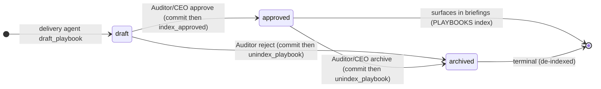
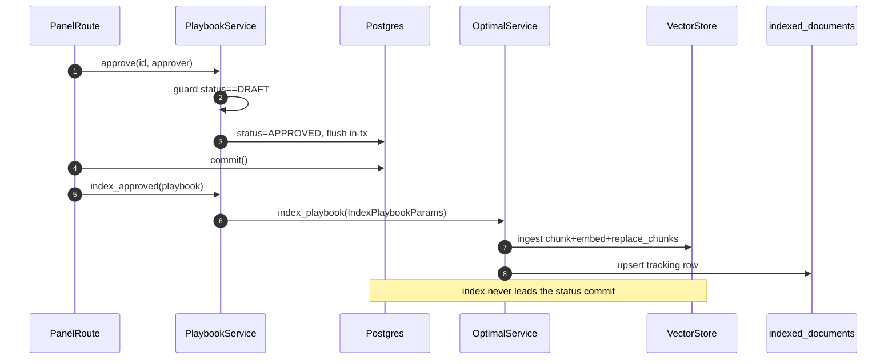
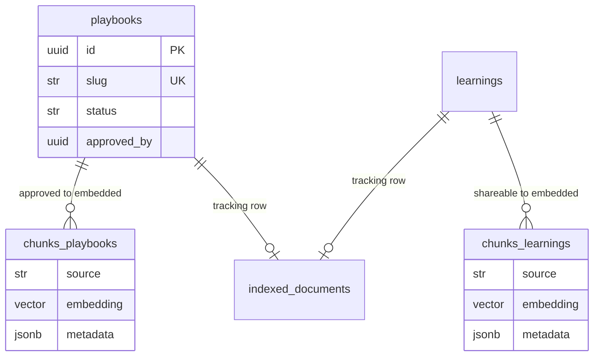

## Purpose
The organizational-memory + playbooks slice: captures cross-agent learnings and curated playbooks, embeds them into the LEARNINGS and PLAYBOOKS pgvector RAG indexes via the OptimalService plugin architecture, and re-injects the top-K most relevant past lessons/playbooks into every agent briefing (the keystone retrieve step). Distillation at task completion runs on the local LLM only; playbook curation (draft/approve/reject/archive) is a status state-machine whose RAG index writes are split from the DB status commit so the corpus never leads the status transaction.

## Files

| Path | Role | LOC |
|---|---|---|
| roboco/services/memory_distiller.py | Local-LLM distiller: turns a completed task into one <=120-word Problem/Approach/Gotcha lesson (best-effort, returns None on failure) | 98 |
| roboco/services/playbook.py | PlaybookService: draft + Auditor curation state machine (draft/approve/reject/archive) + post-commit RAG index/de-index orchestration | 256 |
| roboco/services/learning.py | LearningPropagationService: record a learning, index it, notify same-scope non-human agents, scope-filtered retrieval (legacy pre-distiller capture path) | 525 |
| roboco/services/optimal.py | OptimalService: plugin-based RAG hub over pgvector; owns index_playbook/unindex_playbook/record_learning/search/search_learnings and the singleton accessor | 2044 |
| roboco/services/optimal_brain/indexes/base.py | BaseIndexPlugin ABC: chunk/filter/embed/store pipeline, hybrid search, 429-retried ask(); atomic replace_chunks reingest semantics | 1173 |
| roboco/services/optimal_brain/indexes/learnings.py | LearningsIndexPlugin: record/search cross-agent learnings; forces shareable=True on shared retrieval so private reflections never leak into briefings | 251 |
| roboco/services/optimal_brain/indexes/playbooks.py | PlaybooksIndexPlugin: index approved playbooks (title+when-to-use+procedure) and delete_playbook de-index | 97 |
| roboco/services/optimal_brain/indexes/__init__.py | Plugin registry exports (LearningsIndexPlugin, PlaybooksIndexPlugin, etc.) | 35 |
| roboco/services/optimal_brain/vector_store.py | VectorStore: asyncpg pool over chunks_<index> pgvector tables; add_chunks/delete_by_source/replace_chunks(hybrid_search) | 521 |
| roboco/services/repositories/base.py | BaseRepository: generic CRUD mixin used by IndexedDocumentRepository | 281 |
| roboco/services/repositories/indexed_document.py | IndexedDocumentRepository: upsert/get/delete_by_source for the indexed_documents tracking table (used by playbook de-index) | 128 |
| roboco/services/repositories/query_helpers.py | Generic SQLAlchemy query helpers (pagination/status/team/agent/timestamp filters, slug resolution) — not slice-specific | 264 |

## Key Symbols

| Name | Kind | File:Line | Responsibility |
|---|---|---|---|
| LessonInput | dataclass | roboco/services/memory_distiller.py:25 | Completed-task facts (title, ACs, dev/qa notes, commit messages) fed to the distiller |
| _build_prompt | function | roboco/services/memory_distiller.py:40 | Render the fixed Problem/Approach/Gotcha <=120-word distillation prompt |
| _chat | function | roboco/services/memory_distiller.py:62 | One OpenAI-compatible call to the local LLM (glm-5.2:cloud); None on non-success/empty |
| MemoryDistiller.distill | method | roboco/services/memory_distiller.py:87 | Return a <=120-word lesson or None (NONE sentinel, failure, or over-limit truncation) |
| _slugify | function | roboco/services/playbook.py:35 | Derive a unique <=80-char slug from the playbook title |
| PlaybookService.draft | method | roboco/services/playbook.py:45 | Create a DRAFT playbook; savepoint-isolates the insert to convert slug-UNIQUE TOCTOU into a clean ConflictError |
| PlaybookService.approve | method | roboco/services/playbook.py:89 | Auditor: draft->approved + stamps approver/at; flushes status ONLY (caller commits then index_approved) |
| PlaybookService.archive | method | roboco/services/playbook.py:113 | Auditor: approved->archived (retire); flushes status ONLY, caller commits then unindex_playbook |
| PlaybookService.index_approved | method | roboco/services/playbook.py:138 | Post-commit: embed the approved playbook into PLAYBOOKS index; org_memory_enabled-gated, best-effort |
| PlaybookService.reject | method | roboco/services/playbook.py:173 | Auditor: draft->archived with a reason; flushes status ONLY, caller commits then unindex_playbook |
| PlaybookService.unindex_playbook | method | roboco/services/playbook.py:195 | Post-commit: de-index a rejected/archived playbook from PLAYBOOKS; org_memory_enabled-gated, best-effort, idempotent |
| PlaybookService._get_by_slug | method | roboco/services/playbook.py:238 | Fast-path UX pre-check for slug uniqueness (DB constraint is the real guard) |
| LearningScope | enum | roboco/services/learning.py:32 | Visibility scope: PERSONAL/TEAM/CELL/ORG |
| LearningType | enum | roboco/services/learning.py:41 | Learning category: SOLUTION/PATTERN/GOTCHA/INSIGHT/REVIEW_FEEDBACK |
| LearningPropagationService.record_learning | method | roboco/services/learning.py:122 | Index the learning + create same-scope non-human notifications (skips notifications for PERSONAL) |
| LearningPropagationService._index_learning | method | roboco/services/learning.py:189 | Bridge to OptimalService.record_learning with shareable = scope != PERSONAL; passes team=None |
| LearningPropagationService._create_notifications | method | roboco/services/learning.py:205 | Open a DB session, query non-author non-human agents in scope, create formal KNOWLEDGE_SHARE notifications |
| LearningPropagationService.get_learnings_for_agent | method | roboco/services/learning.py:303 | Role-shaped search_learnings + post-filter by scope visibility (personal/team) |
| LearningPropagationService.search_similar_learnings | method | roboco/services/learning.py:484 | Similar-learnings search via OptimalService.search over LEARNINGS index |
| get_learning_service | function | roboco/services/learning.py:521 | Process-wide singleton accessor for LearningPropagationService |
| PLUGIN_REGISTRY | dict | roboco/services/optimal.py:139 | IndexType -> plugin class map (includes LEARNINGS, PLAYBOOKS) |
| OptimalService.initialize | method | roboco/services/optimal.py:183 | Graceful-degradation init of all plugins; starts background auto-index + periodic tasks |
| OptimalService.close | method | roboco/services/optimal.py:563 | Cancel _indexing_task FIRST, then periodic task, then close plugins (prevent writes to closed plugins) |
| OptimalService._get_plugin | method | roboco/services/optimal.py:593 | Typed plugin lookup with a clear RuntimeError when missing/uninitialized |
| OptimalService.index_playbook | method | roboco/services/optimal.py:859 | Embed an approved playbook + write the indexed_documents tracking row |
| OptimalService.unindex_playbook | method | roboco/services/optimal.py:889 | Delete playbook chunks from vector store AND drop tracking row; both steps best-effort/idempotent |
| OptimalService.record_learning | method | roboco/services/optimal.py:1061 | Embed a learning via LearningsIndexPlugin + write tracking row (source learn-{md5(full content)}) |
| OptimalService.search | method | roboco/services/optimal.py:1145 | Embed-once fan-out: concurrent hybrid search across selected indexes; used by similar_memory |
| OptimalService._aggregate_citations | method | roboco/services/optimal.py:1221 | Embed once + concurrent per-index search into an aggregation buffer for RAG query() |
| OptimalService.search_learnings | method | roboco/services/optimal.py:1507 | LEARNINGS-only search with optional category/team filter (shareable_only=True default) |
| get_optimal_service | function | roboco/services/optimal.py:2017 | Lock-guarded singleton: publish instance only after initialize() completes |
| BaseIndexPlugin.ingest | method | roboco/services/optimal_brain/indexes/base.py:351 | Validate -> metadata -> source URI -> chunk/filter/embed/store pipeline |
| BaseIndexPlugin._chunk_filter_embed_store | method | roboco/services/optimal_brain/indexes/base.py:429 | Chunk + quality-filter + embed + atomic replace_chunks/add_chunks; returns stored count |
| BaseIndexPlugin._citations_to_results | method | roboco/services/optimal_brain/indexes/base.py:772 | Apply exact-match metadata filters to citations and cap to top_k SearchResults |
| BaseIndexPlugin.search_with_embedding | method | roboco/services/optimal_brain/indexes/base.py:808 | Pre-computed-embedding hybrid search entry; LearningsIndexPlugin overrides to force shareable |
| BaseIndexPlugin.search | method | roboco/services/optimal_brain/indexes/base.py:852 | Embed-then-search_with_embedding convenience entry |
| BaseIndexPlugin.ask | method | roboco/services/optimal_brain/indexes/base.py:893 | Per-index RAG Q&A with 15s search timeout + 429-retried LLM synthesis |
| LearningsIndexPlugin.search_with_embedding | method | roboco/services/optimal_brain/indexes/learnings.py:44 | Force shareable=True filter unless include_private opt-in; prevents private reflections leaking into briefings |
| LearningsIndexPlugin.search | method | roboco/services/optimal_brain/indexes/learnings.py:75 | Embed-then-search that threads include_private to search_with_embedding |
| LearningsIndexPlugin.record_learning | method | roboco/services/optimal_brain/indexes/learnings.py:124 | Build lrn-{md5(content[:100])} doc_id + enriched content; ingest with category/role/team/shareable metadata |
| LearningsIndexPlugin.search_learnings | method | roboco/services/optimal_brain/indexes/learnings.py:174 | Category/team-filtered search; include_private=not shareable_only to thread the shareable default |
| IndexPlaybookParams | dataclass | roboco/services/optimal_brain/indexes/playbooks.py:18 | Params for indexing an approved playbook (id/title/problem/procedure/tags/team/scope) |
| PlaybooksIndexPlugin.index_playbook | method | roboco/services/optimal_brain/indexes/playbooks.py:55 | Embed title + when-to-use + procedure + tags; metadata status=approved |
| PlaybooksIndexPlugin.delete_playbook | method | roboco/services/optimal_brain/indexes/playbooks.py:73 | Delete a playbook's chunks by source URI (idempotent no-op when none match) |
| PlaybooksIndexPlugin.search_playbooks | method | roboco/services/optimal_brain/indexes/playbooks.py:86 | Optional team-scoped search over approved playbooks |
| VectorStore.replace_chunks | method | roboco/services/optimal_brain/vector_store.py:239 | Atomic single-connection single-tx DELETE+INSERT replacing a source's chunks (closes concurrent reindex duplicate race) |
| VectorStore.delete_by_source | method | roboco/services/optimal_brain/vector_store.py:225 | Delete every chunk row for a source URI (idempotent) |
| VectorStore.hybrid_search | method | roboco/services/optimal_brain/vector_store.py:342 | pgvector + full-text hybrid retrieval returning Citation rows |
| IndexedDocumentRepository.delete_by_source | method | roboco/services/repositories/indexed_document.py:103 | Drop the indexed_documents tracking row by (index_type, source_hash); idempotent bool return |
| IndexedDocumentRepository.upsert_batch | method | roboco/services/repositories/indexed_document.py:22 | Bulk upsert tracking rows keyed by (index_type, source_hash) |

## Data Flow
CAPTURE (task completion): TaskService._extract_completion_learnings (task.py:2837) is fire-and-forget on completion. With org_memory_enabled it calls _completion_learnings_for (task.py:2798) which runs MemoryDistiller().distill(LessonInput(...)) against the local LLM (memory_distiller.py) to produce ONE <=120-word lesson, else falls back to the legacy raw-notes _collect_completion_learnings. The lesson goes to LearningPropagationService.record_learning (learning.py:122) -> _index_learning -> OptimalService.record_learning (optimal.py:1061) -> LearningsIndexPlugin.record_learning (learnings.py:124), which embeds via the shared qwen3 embedder and stores chunks in the chunks_learnings pgvector table with metadata {category, agent_role, shareable, ...}. _create_notifications (learning.py:205) opens a separate DB session and creates formal KNOWLEDGE_SHARE notifications for same-scope non-author, non-human agents (CEO/prompter/secretary excluded via _HUMAN_ONLY_ROLES).

PLAYBOOK CURATION: A delivery agent calls the draft_playbook content verb (do_server -> v1/do.py -> content_actions.draft_playbook -> PlaybookService.draft) which writes a DRAFT row with a slug-unique constraint (savepoint TOCTOU guard). The Auditor (gateway verb) or Auditor/CEO (panel route /api/playbooks) calls approve/reject/archive. The status flush and the RAG index write are deliberately split: approve() flushes status ONLY; the caller (api/routes/playbooks.py or content_actions._curate_playbook) commits the DB transaction FIRST, then calls index_approved() which -> OptimalService.index_playbook -> PlaybooksIndexPlugin.index_playbook -> BaseIndexPlugin.ingest -> chunk/embed/store in chunks_playbooks (+ a tracking row in indexed_documents). reject/archive similarly commit then call unindex_playbook -> OptimalService.unindex_playbook -> delete_playbook (vector store) + IndexedDocumentRepository.delete_by_source (tracking row).

RETRIEVE (keystone briefing): Choreographer._briefing_for (_impl.py:814) is called on give_me_work/claim/done/qa/doc/pr_review/board routes. It calls _institutional_memory (_impl.py:877) which, when org_memory_enabled and a task is in hand, shapes a role-shaped query via shape_memory_query (evidence_builder.py) and calls EvidenceRepo.similar_memory (evidence_repo.py:323). similar_memory runs OptimalService.search over [LEARNINGS, PLAYBOOKS] indexes (embed-once, concurrent hybrid search), filters results by min_score, and returns top-K {kind, summary, source, score} items injected as briefing['institutional_memory']. LearningsIndexPlugin.search_with_embedding forces shareable=True so private reflections never surface. Memory is best-effort: any RAG/embed failure returns [] so the briefing path never breaks.

## Mermaid






## Logical Tree
```
org-memory-playbooks
  Capture (completion)
    MemoryDistiller (local LLM only)
      LessonInput -> _build_prompt -> _chat -> distill (<=120w or None)
    TaskService._completion_learnings_for [external, task.py]
      org_memory_enabled ? distill : legacy raw capture
    LearningPropagationService
      record_learning -> _index_learning -> OptimalService.record_learning
      _create_notifications (KNOWLEDGE_SHARE, non-human, scope-filtered)
  Playbook curation state machine (PlaybookService)
    draft (slug UNIQUE + savepoint TOCTOU guard)
    approve (draft->approved; commit-then-index)
    reject (draft->archived; commit-then-unindex)
    archive (approved->archived; commit-then-unindex)
    index_approved / unindex_playbook (post-commit, org_memory-gated)
  RAG hub (OptimalService + plugins)
    PLUGIN_REGISTRY: LEARNINGS, PLAYBOOKS, ...
    BaseIndexPlugin: ingest / search / ask / replace_chunks
    LearningsIndexPlugin: forces shareable=True on shared retrieval
    PlaybooksIndexPlugin: index_playbook / delete_playbook
    VectorStore: chunks_<index> pgvector tables; replace_chunks atomic
    IndexedDocumentRepository: tracking-row upsert / delete_by_source
  Retrieve (keystone briefing) [external callers]
    Choreographer._briefing_for -> _institutional_memory
    shape_memory_query (role-shaped)
    EvidenceRepo.similar_memory -> OptimalService.search([LEARNINGS,PLAYBOOKS])
    -> briefing['institutional_memory'] (top-K, min_score-floored)
```

## Dependencies
- Internal: roboco.config.settings (org_memory_enabled, org_memory_top_k, org_memory_min_score, local_llm_*, default_embedding_model, embedding_dimensions, rag_*), roboco.db.tables.PlaybookTable / IndexedDocumentTable, roboco.db.get_db_context, roboco.models.base.PlaybookStatus, roboco.models.optimal.IndexType / SearchResult / SearchOutcome / QueryContext, roboco.models.playbook.PlaybookCreate / Playbook, roboco.services.base.BaseService / ConflictError / NotFoundError, roboco.services.exceptions (RateLimitError, parse_retry_after_header, HTTP_TOO_MANY_REQUESTS, MAX_RATE_LIMIT_RETRIES), roboco.services.optimal_brain.text_chunker (TextChunker, Chunk, Citation, Document), roboco.services.optimal_brain.shared_embedder.get_shared_embedder, roboco.services.gateway.evidence_repo.EvidenceRepo.similar_memory, roboco.services.gateway.evidence_builder.shape_memory_query, roboco.services.gateway.choreographer._impl._briefing_for / _institutional_memory, roboco.services.gateway.content_actions (draft/approve/reject/archive_playbook), roboco.services.task.TaskService._completion_learnings_for / _extract_completion_learnings, roboco.foundation.identity.Role, roboco.api.routes.playbooks (panel route), roboco.mcp.do_server (draft/approve/reject/archive_playbook verbs)
- External: httpx (local LLM chat + RAG synthesis), structlog, sqlalchemy (select, delete, func, IntegrityError, AsyncSession), asyncpg (VectorStore pool + transaction), pgvector (vector column), dataclasses / enum / hashlib / re / asyncio

## Entry Points

| Name | File | Trigger |
|---|---|---|
| draft_playbook verb | roboco/services/gateway/content_actions.py | Agent content verb via do_server -> POST /api/v1/do/draft_playbook (delivery roles only) |
| approve/reject/archive_playbook verbs | roboco/services/gateway/content_actions.py | Auditor content verb via do_server -> POST /api/v1/do/{approve,reject,archive}_playbook |
| GET/POST /api/playbooks[/{id}/{approve,reject,archive}] | roboco/api/routes/playbooks.py | Panel review-queue HTTP (Auditor or CEO only) |
| _extract_completion_learnings | roboco/services/task.py | Fire-and-forget on task completion (TaskService complete/ceo_approve path) |
| _briefing_for / _institutional_memory | roboco/services/gateway/choreographer/_impl.py | Every choreographer verb that builds a context_briefing (give_me_work, claim, done, qa, doc, pr_review, board) |
| OptimalService.initialize / get_optimal_service | roboco/services/optimal.py | FastAPI lifespan startup; first RAG caller (lazy singleton) |
| OptimalService.close | roboco/services/optimal.py | FastAPI lifespan shutdown (cancels indexing + periodic tasks, closes plugins) |

## Config Flags
- ROBOCO_ORG_MEMORY_ENABLED (default off) — gates the whole loop: distill-vs-legacy capture, index_approved/unindex_playbook no-op when off, _institutional_memory returns [] when off
- ROBOCO_ORG_MEMORY_TOP_K (default 3, 1..10) — max institutional-memory items injected into a briefing
- ROBOCO_ORG_MEMORY_MIN_SCORE (default 0.6, 0..1) — cosine-similarity floor; below it nothing is injected
- ROBOCO_LOCAL_LLM_MODEL (default glm-5.2:cloud) + ROBOCO_LOCAL_LLM_BASE_URL — the distiller + RAG synthesis LLM endpoint
- ROBOCO_DEFAULT_EMBEDDING_MODEL (default qwen3-embedding:0.6b) + ROBOCO_EMBEDDING_DIMENSIONS — embedder for LEARNINGS/PLAYBOOKS chunks
- ROBOCO_RAG_CHUNK_STRATEGY / ROBOCO_RAG_CHUNK_SIZE / ROBOCO_RAG_CHUNK_OVERLAP / ROBOCO_RAG_PERSIST_DIR / ROBOCO_RAG_STORE_URL — chunking + store DSN
- ROBOCO_DATABASE_* (VectorStore.store_url derived) — required; missing store_url raises at plugin initialize()


## Gotchas
- Index-vs-status ordering is a hard contract: approve()/reject()/archive() flush status ONLY; the caller MUST commit the DB tx BEFORE calling index_approved()/unindex_playbook(). The vector store writes through its own auto-committing pool connection, so indexing before commit would durably land (or drop) a playbook in the corpus even if the status tx rolled back. Both the panel route and content_actions honour this; any new caller must too.
- archive() and reject() previously overwrote approved_by/approved_at — FIXED in 536bbb64: migration 053 added archived_by/archived_at columns; archive() now writes archived_by/archived_at at playbook.py:132-133 and reject() likewise at playbook.py:189-190, leaving approved_by/approved_at intact.
- Learning doc-id / source-URI mismatch: FIXED in 536bbb64. OptimalService.record_learning now derives source = f"roboco://learnings/{doc_id}" from the plugin's returned doc_id (optimal.py:1078) instead of independently computing learn-{md5(full content)}, so the tracking row and chunk rows share the same source URI.
- LearningPropagationService._index_learning always passes team=None, so team-scoped search_learnings(team=...) will never match auto-captured completion learnings (learnings.py:199).
- LearningsIndexPlugin.search_with_embedding forces shareable=True via exact equality on metadata. This relies on the stored metadata value being a JSON bool that round-trips to Python True; a learning indexed with a string 'true' would be filtered out. Currently safe (prepare_metadata sets a Python bool) but brittle if metadata serialization changes.
- BaseIndexPlugin._citations_to_results applies filters as exact equality on every key-value pair. The forced shareable=True filter is therefore exact-match; any NULL/missing shareable metadata (older rows) would be excluded from briefings after the fix.
- replace_chunks on a re-ingest: the embedder-failure case (non-empty chunks list but no usable embeddings returned) is now guarded at vector_store.py:272 — the wipe is skipped and existing rows are preserved (FIXED in 536bbb64). The deliberate-clear case (empty chunks list) still deletes, by design.
- PlaybooksIndexPlugin inherits BaseIndexPlugin.replace_on_reingest=True; re-indexing an already-approved playbook (e.g. approve twice via different paths) atomically replaces chunks. approve() now guards status==DRAFT so a double-approve is blocked before reaching index.
- draft()'s _get_by_slug pre-check is a UX fast-path, NOT the guard: two concurrent same-title drafts both miss it and the loser hits the slug UNIQUE constraint — handled by the savepoint + IntegrityError->ConflictError conversion. Don't rely on the pre-check for uniqueness.
- _HUMAN_ONLY_ROLES (CEO, prompter, secretary) are excluded as learning notification recipients (learning.py:27), resolved from the foundation Role enum at import time. CLAUDE.md states agent learnings exclude human/human-driven roles — code matches.
- OptimalService is a process-wide singleton published only after initialize() completes under a lock; a half-built instance is never observable. But the singleton is event-loop-bound — calling get_optimal_service() from a different loop raises 'bound to a different event loop' (noted at optimal.py:2010).


## Drift from CLAUDE.md
- CLAUDE.md says institutional memory is injected 'on claim'. Code injects it on EVERY _briefing_for call that carries a task (give_me_work, i_will_plan, claim, done, qa, doc, pr_review, board, submit_up) — broader than 'on claim' (choreographer/_impl.py:814-875, called from ~30 sites). The _institutional_memory guard is only `org_memory_enabled and task is not None`, not claim-specific.
- CLAUDE.md's verb-surface table lists Auditor verbs as only `triage` (read-only) in the role table, while the prose below it lists Auditor `approve_playbook`/`reject_playbook`/`archive_playbook` curation. The gateway enforces _CURATE_PLAYBOOK_ROLES={'auditor'} (content_actions.py:310) — auditor-only via the verb path — while the panel route allows Auditor OR CEO (_CURATOR_ROLES in api/routes/playbooks.py:21). The Auditor/CEO split is documented for /api/playbooks but the verb path is auditor-only, which is consistent with the prose but not reflected in the verb table row.


## Changes Since Baseline

| SHA | Subject | Impact |
|---|---|---|
| 15effce0 | [feature] org-memory/playbooks curation + retrieval hardening (bundled in 141-Gaps fill-in PR #283) | playbook.py: split status flush from RAG index write — approve() no longer indexes inline; added archive() (approved->archived) + public index_approved()/unindex_playbook(); added status==DRAFT precondition guards on approve/reject; savepoint-isolated draft insert to convert slug-UNIQUE TOCTOU into ConflictError. |
| 15effce0 | [fix] learnings: force shareable=True on shared retrieval | learnings.py: overrode search_with_embedding/search to force shareable=True unless include_private opt-in; threaded include_private=not shareable_only through search_learnings. Prevents private (shareable=False) reflections leaking into cross-agent briefings via OptimalService.search. |
| 15effce0 | [fix] playbook de-index path | optimal.py added OptimalService.unindex_playbook (delete chunks + tracking row, best-effort); playbooks.py added PlaybooksIndexPlugin.delete_playbook; repositories/indexed_document.py added IndexedDocumentRepository.delete_by_source. reject/archive now actually remove a previously-approved playbook from the corpus. |
| 15effce0 | [fix] atomic reindex (F108) | base.py replaced separate delete_by_source + add_chunks with VectorStore.replace_chunks (single connection, single tx) for replace_on_reingest plugins — closes concurrent-reindex duplicate-chunk race; failed insert now reverts the delete. |
| 15effce0 | [fix] OptimalService.close() ordering | optimal.py: close() now cancels the startup _indexing_task FIRST (can be mid-flight writing through plugins) before the periodic task and plugin close — prevents writes against closed plugins. |
| 15effce0 | [chore] glm-5 -> glm-5.2:cloud | memory_distiller.py docstring + IndexConfig.llm_model default bumped from glm-5:cloud to glm-5.2:cloud (matches the fleet LLM bump). No behavior change beyond the model name. |

> Post-snapshot updates (since 2026-06-29): commit 536bbb64 (Chore/all/logical gaps sweep, PR #286) touched three files in this slice: (1) roboco/services/playbook.py — archive() and reject() now write archived_by/archived_at (new columns, migration 053) instead of overwriting approved_by/approved_at; content_actions._curate_playbook wraps the gating session.commit() in a PendingRollbackError guard (#55) so a poisoned session returns a clean invalid_state and never falls through to index an uncommitted playbook. (2) roboco/services/optimal.py — record_learning reuses the plugin's returned doc_id for the tracking-row source URI, closing the lrn-/learn- mismatch (#182/#183). (3) roboco/services/optimal_brain/vector_store.py — replace_chunks skips the wipe when chunks is non-empty but all lack embeddings (#181), preserving existing rows on embedder failure.

## Regression Risks

| Title | File:Line | Claim | Severity |
|---|---|---|---|
| ~~archive() overwrites the original approver attribution~~ **FIXED 536bbb64** | roboco/services/playbook.py:132 | Migration 053 added archived_by/archived_at; archive() (line 132-133) and reject() (line 189-190) now write those columns, leaving approved_by/approved_at intact. | medium |
| approve() index write contract is now caller-owned — a missed call silently skips indexing | roboco/services/playbook.py:109 | Before baseline, approve() called _index_approved inline. Now approve() flushes status ONLY and the caller must commit then call index_approved(). If any caller (current or future) calls approve() without the commit+index_approved pair, the playbook is APPROVED in DB but NEVER embedded — it will not surface in briefings. Today only api/routes/playbooks.py and content_actions._curate_playbook call it (both correct), but the contract is a footgun. | medium |
| unindex_playbook returns early on vector-store failure, leaving tracking row stale | roboco/services/optimal.py:909 | On a vector-store delete exception, unindex_playbook logs + `return`s before dropping the indexed_documents tracking row. If the VS delete partially succeeded (some chunks gone) but raised, the tracking row lingers referencing a partially-deleted source — inconsistent index/tracking state. Best-effort by design, but the divergence is silent. | low |
| ~~Learnings tracking-row source URI never matches the embedded chunk source URI~~ **FIXED 536bbb64** | roboco/services/optimal.py:1078 | record_learning now reuses the plugin's returned doc_id: source = f"roboco://learnings/{doc_id}" — tracking row and chunk rows share the same URI. | low |
| replace_chunks wipes a source when a re-ingest produces zero embedded chunks | roboco/services/optimal_brain/indexes/base.py:475 | **Embedder-failure case FIXED 536bbb64** (vector_store.py:272): when chunks is non-empty but no records have embeddings, replace_chunks now returns early, preserving existing rows. The deliberate-clear case (empty chunks list) still deletes by design. | low |
| Forced shareable=True filter excludes any learning whose metadata lacks a shareable key | roboco/services/optimal_brain/indexes/learnings.py:70 | _citations_to_results applies filters as chunk_meta.get(k) == v. With forced shareable=True, any older learning chunk whose metadata has no 'shareable' key (get returns None) is excluded from briefings. If pre-fix rows exist without the shareable metadata field, they stop surfacing after this change — a silent recall regression for legacy learnings. | low |
| close() awaits a cancelled _indexing_task that may be mid-DB-write | roboco/services/optimal.py:571 | close() now cancels _indexing_task and awaits it (suppressing CancelledError). If the indexing task is mid-flight inside an asyncpg executemany/transaction at shutdown, cancellation can leave a partial chunk insert. Shutdown-only, best-effort, and the new ordering is strictly better than the old close-then-write-to-closed-plugin race it fixes — but the cancellation mid-write is new surface. | low |

## Health
The slice is coherent and has been further hardened by PR #286 (536bbb64): archive()/reject() provenance loss and the learnings tracking-row/chunk source-URI mismatch are both fixed, and the embedder-failure wipe in replace_chunks is now guarded. The main residual risks are (a) the caller-owned commit-then-index contract on approve/reject/archive — a future caller that forgets index_approved silently produces an un-indexed approved playbook (the poisoned-session guard in content_actions is a step forward but the footgun remains for any new caller); (b) the forced shareable=True filter silently excluding older learning rows that lack the metadata key. The org_memory_enabled gate is consistently applied at every entry (distill, index_approved, unindex_playbook, _institutional_memory), so the whole loop is inert when off. Best-effort semantics are uniformly observed: every RAG/embed failure returns []/None and never blocks completion or the briefing. No critical regressions found.
