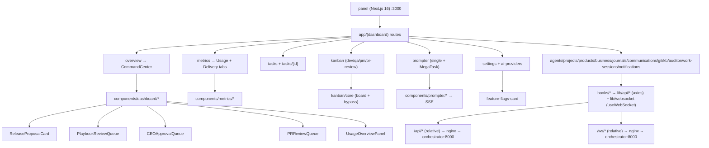

# Panel — RoboCo Control Panel Map

## Purpose
The Next.js 16 control panel (`panel/`, package `roboco-panel` v0.14.0) is the single operator UI for the human CEO: it drives intake/prompter chats, task/kanban management, agent observability, metrics, release approval, playbook curation, and feature-flag arming. It is served internally on port 3000 behind the nginx reverse proxy and talks to the orchestrator exclusively over relative `/api` + `/ws` URLs.

## Files / Structure

| Path | Role |
|---|---|
| `panel/package.json` | Deps: Next 16.1.1, React 19.2, TanStack Query 5.90, Radix UI, Tailwind 4, zustand 5, recharts 3, dnd-kit 6/10, axios, react-hook-form, zod 4 |
| `panel/src/app/layout.tsx` | Root layout (providers, theme, fonts) |
| `panel/src/app/(dashboard)/layout.tsx` | Dashboard shell: sidebar + header + connection status |
| `panel/src/app/(dashboard)/overview/page.tsx` | Overview = `<CommandCenter/>` |
| `panel/src/app/(dashboard)/metrics/page.tsx` | Metrics page: Usage + Delivery tabs, summary/donut/charts |
| `panel/src/app/(dashboard)/tasks/page.tsx` + `tasks/[taskId]/page.tsx` | Task list + task detail (tabbed) |
| `panel/src/app/(dashboard)/kanban/page.tsx` | Operator kanban (dev/qa/pm/pr-review views) |
| `panel/src/app/(dashboard)/prompter/page.tsx` | Intake chat (single + MegaTask batch scope) |
| `panel/src/app/(dashboard)/settings/page.tsx` + `settings/ai-providers/page.tsx` | Settings: feature flags, AI routing, transcript retention, self-hosted |
| `panel/src/app/(dashboard)/{agents,projects,products,business,journals,communications,git,knowledge-base,auditor,work-sessions,notifications}/page.tsx` | Per-domain pages |
| `panel/src/app/(dashboard)/communications/[sessionId]/page.tsx` | Per-session chat view: live transcript (useSessionStream on `/ws/sessions/{id}`), closed-session read-only notice, redirect toast on stale-send |
| `panel/src/components/dashboard/` | Overview cards: command-center, key-metrics, release-proposal, playbook-review-queue, ceo-approval-queue, pr-review-queue, usage-overview, team-health, active-blockers, auditor-alerts, strategy-signals, quick-actions, recent-activity |
| `panel/src/components/metrics/` | delivery-tab, usage-time-series-chart, agent/team-usage-chart, model-usage-donut, sessions-table |
| `panel/src/components/kanban/{core,shared,views}/` | core: kanban-board/column/card + bypass-preconditions; views: dev/qa/pm/pr-review kanban |
| `panel/src/components/prompter/` | intake-form, chat-messages, chat-composer, draft-proposal-card, batch-review-card, success-card, board-review-sent-card |
| `panel/src/components/tasks/` + `tasks/task-detail/` | task-table, create/edit-task-dialog, task-filters, acceptance-criteria-editor, dependency-selector, task-detail tabs (overview/plan/progress/commits/sessions/notes/dependencies) |
| `panel/src/components/settings/` | feature-flags-card, ai-routing-card, transcript-retention-card, self-hosted-section |
| `panel/src/components/conventions/conventions-tab.tsx` | Per-project architecture map + health (in edit-project dialog) |
| `panel/src/components/projects/`, `agents/`, `business/`, `auditor/`, `knowledge-base/`, `communications/`, `git/`, `journals/`, `work-sessions/`, `notifications/`, `rate-limit/`, `layout/`, `ui/` | Per-domain component groups; `ui/` = Radix-based primitives (dialog, table, tabs, select, switch, required-notes-dialog, sonner toaster, markdown) |
| `panel/src/hooks/use-websocket.ts` | Shared `useWebSocket<T>(path, handlers?, isSystem?)` hook (auto-reconnect, heartbeat) |
| `panel/src/hooks/use-{tasks,agents,projects,products,usage,prompter,secretary,dashboard,git,journals,channels,notifications,knowledge-base,observability,work-sessions,providers,rate-limit-{sync,websocket}}.ts` | TanStack Query + zustand data hooks |
| `panel/src/lib/api/*.ts` | Per-domain axios clients (`client.ts` shared instance; `release.ts`, `playbooks.ts`, `prompter-live.ts`, `tasks.ts`, `settings.ts`, `usage.ts`, `cockpit.ts`, `a2a.ts`, …) |
| `panel/src/lib/websocket/connection.ts` | `WebSocketConnection` class + `getWebSocketUrl` |
| `panel/src/store/{rate-limit-store,notifications-store,usage-store,ui-store}.ts` + `lib/stores/` | zustand stores (`lib/stores/` now exports `scroll-restoration-store` only; `ui-store` is sole-canonical under `src/store/`) |
| `panel/src/types/` | Shared TS types (index, rate-limits, git) |
| `panel/src/lib/{constants,utils,agent-definitions,agent-utils,repo-url,mock-data}.ts` | `API_URL="/api"`, `WS_URL="/ws"`, `CEO_AGENT_ID/ROLE`, helpers |
| `panel/vitest.config.ts`, `panel/src/test/setup.ts`, `**/__tests__/` | Vitest + jsdom; coverage via @vitest/coverage-v8 |

## Key Surfaces

| Surface | File | What it does |
|---|---|---|
| Overview / Command Center | `components/dashboard/command-center.tsx` | Composes key-metrics, usage-overview, ceo-approval-queue, pr-review-queue, release-proposal, playbook-review-queue, active-blockers, auditor-alerts, strategy-signals, team-health, recent-activity, quick-actions |
| Metrics — Usage | `app/(dashboard)/metrics/page.tsx` + `components/metrics/*` | Summary, time-series, agent/team/model donut, sessions table, projection, cache efficiency; live via `/ws/system` USAGE_SNAPSHOT |
| Metrics — Delivery | `components/metrics/delivery-tab.tsx` | Cycle-time, bottlenecks, rework, scorecards (read-only `/dashboard/metrics/*`) |
| Release Proposal | `components/dashboard/release-proposal-card.tsx` | CEO approve/reject-with-changes on held `release_manager` proposal; fail-closed executor; hidden on 404, retry on real error |
| Playbook Review Queue | `components/dashboard/playbook-review-queue.tsx` | Auditor/CEO approve/reject drafted playbooks; hidden when no drafts |
| CEO Approval Queue | `components/dashboard/ceo-approval-queue.tsx` | Tasks in `awaiting_ceo_approval` awaiting CEO verdict |
| PR Review Queue | `components/dashboard/pr-review-queue.tsx` | Inbound external/fork PRs + in-path gate PRs for the reviewer |
| Feature Flags | `components/settings/feature-flags-card.tsx` | Toggles persisted to settings store; takes effect on next backend restart |
| Intake / MegaTask | `app/(dashboard)/prompter/page.tsx` + `components/prompter/*` | Live SSE chat with spawned Claude/Grok intake agent; single-project, product, or multi-project (`project_ids`) MegaTask → `propose_batch` → `confirm-batch` |
| Project Settings / Conventions | `components/projects/edit-project-dialog.tsx` + `components/conventions/conventions-tab.tsx` | Per-project `.roboco/conventions.yml` map + health; Save / Restore via PR |
| Usage Dashboard | `components/dashboard/usage-overview-panel.tsx` + `hooks/use-usage.ts` | Token/cost totals; live WS snapshot with HTTP-polling fallback |
| Kanban | `components/kanban/{core,views}/*` | dnd-kit drag board; dev/qa/pm/pr-review views; drag routes through admin status-override with bypass-precondition prompt |
| Task Detail | `components/tasks/task-detail/*` | Tabbed: overview, plan, progress, commits, sessions, notes, dependencies, AC, action dialogs |
| AI Providers | `app/(dashboard)/settings/ai-providers/page.tsx` + `components/settings/ai-routing-card.tsx` | Per-slug/role/global model routing |

## Key Symbols

| Name | Kind | File | Responsibility |
|---|---|---|---|
| `useWebSocket<T>` | hook | `hooks/use-websocket.ts` | Single shared WS per path; auto-reconnect, heartbeat, message dispatch |
| `useSessionStream` | hook | `hooks/use-websocket.ts` | Subscribes `/ws/sessions/{id}`; filters `message.new` frames; added post-snapshot (76ce53e3) to drive live transcript refresh in the session detail page |
| `WebSocketConnection` | class | `lib/websocket/connection.ts` | Low-level WS lifecycle; `getWebSocketUrl` builds `/ws/<path>` |
| `api` (axios instance) | const | `lib/api/client.ts` | Shared client; baseURL `API_URL`, injects `X-Agent-ID/Role=CEO`, rate-limit retry (3) |
| `releaseApi` | module | `lib/api/release.ts` | `getProposal/approve/reject`; 404→null, non-404 rethrow |
| `prompterLiveApi` | module | `lib/api/prompter-live.ts` | `start/streamUrl/messages/confirm/confirmBatch`; EventSource SSE |
| `usePrompter` | hook | `hooks/use-prompter.ts` | Intake state machine: SSE refs, draft/batch extraction, turn lifecycle |
| `useRateLimitWebsocket` | hook | `hooks/use-rate-limit-websocket.ts` | Single `/ws/system` subscriber; dispatches RATE_LIMIT_* + USAGE_SNAPSHOT; clears usage on disconnect |
| `useUsageStore` | store | `store/usage-store.ts` | zustand: live usage snapshot, wsState, polling fallback |
| `skippedPreconditions` | fn | `components/kanban/core/bypass-preconditions.ts` | Lists material lifecycle preconditions a drag would skip (PR/docs/subtasks-terminal) |
| `KanbanBoard` | comp | `components/kanban/core/kanban-board.tsx` | dnd-kit board; routes drag→`useUpdateTask` (admin override) or in-band lifecycle verb; notes dialog for pass-qa/fail-qa/complete |
| `ReleaseProposalCard` | comp | `components/dashboard/release-proposal-card.tsx` | Approve/reject-with-changes dialog; ≥10 char reject reason |
| `PlaybookReviewQueue` | comp | `components/dashboard/playbook-review-queue.tsx` | Approve/reject-with-reason (≥4 char) drafts |
| `RequiredNotesDialog` | comp | `components/ui/required-notes-dialog.tsx` | Reusable notes-gated confirm; submit disabled on empty/whitespace |
| `CommandCenter` | comp | `components/dashboard/command-center.tsx` | Overview page body; composes all dashboard cards |
| `DeliveryTabContent` | comp | `components/metrics/delivery-tab.tsx` | Cycle-time/bottleneck/rework/scorecard panels |

## Data Flow
Browser → nginx :3000 → (panel Next.js server for pages; `/api/*` and `/ws/*` proxied to `orchestrator:8000`). All client calls use relative URLs: `API_URL="/api"` (axios `baseURL`) and `WS_URL="/ws"` (`getWebSocketUrl`) — no CORS because the browser sees one origin. The shared axios client injects `X-Agent-ID=<CEO_AGENT_ID>` + `X-Agent-Role=CEO_ROLE` headers for API authorization. Live events flow: orchestrator `StreamEventBus` → `websocket_bridge` → per-resource `/ws/{agents,channels,sessions,notifications,system}` sockets → panel `useWebSocket` hooks → zustand stores / TanStack Query cache. Usage snapshots (`USAGE_SNAPSHOT`) and rate-limit lifecycle (`RATE_LIMIT_HIT/LIFTED`) arrive on the single shared `/ws/system` stream mounted in providers; on any non-`connected` state the usage store clears its snapshot so the panel falls back to HTTP-polling summary until a fresh frame lands.

## Mermaid


## Logical Tree
```
panel/ (Next.js 16, package roboco-panel v0.14.0)
├── src/app/
│   ├── layout.tsx                          (root layout: providers, theme, fonts)
│   └── (dashboard)/
│       ├── layout.tsx                      (dashboard shell: sidebar + header + connection status)
│       ├── overview/page.tsx               (→ <CommandCenter/>)
│       ├── metrics/page.tsx                (Usage + Delivery tabs)
│       ├── tasks/page.tsx + tasks/[taskId]/page.tsx
│       ├── kanban/page.tsx                 (dev/qa/pm/pr-review views)
│       ├── prompter/page.tsx               (intake chat: single + MegaTask batch)
│       ├── settings/page.tsx + settings/ai-providers/page.tsx
│       ├── {agents,projects,products,business,journals,communications,git,knowledge-base,auditor,work-sessions,notifications}/page.tsx
│       └── communications/[sessionId]/page.tsx  (per-session chat view; live via useSessionStream)
├── src/components/
│   ├── dashboard/                          (command-center, key-metrics, release-proposal, playbook-review-queue, ceo-approval-queue, pr-review-queue, usage-overview, team-health, active-blockers, auditor-alerts, strategy-signals, quick-actions, recent-activity)
│   ├── metrics/                            (delivery-tab, usage-time-series-chart, agent/team-usage-chart, model-usage-donut, sessions-table)
│   ├── kanban/
│   │   ├── core/                           (kanban-board/column/card + bypass-preconditions)
│   │   ├── shared/
│   │   └── views/                          (dev/qa/pm/pr-review kanban)
│   ├── prompter/                           (intake-form, chat-messages, chat-composer, draft-proposal-card, batch-review-card, success-card, board-review-sent-card)
│   ├── tasks/ + tasks/task-detail/         (task-table, create/edit-task-dialog, task-filters, acceptance-criteria-editor, dependency-selector; detail tabs: overview/plan/progress/commits/sessions/notes/dependencies)
│   ├── settings/                           (feature-flags-card, ai-routing-card, transcript-retention-card, self-hosted-section)
│   ├── conventions/conventions-tab.tsx     (per-project architecture map + health)
│   ├── projects/ agents/ business/ auditor/ knowledge-base/ communications/ git/ journals/ work-sessions/ notifications/ rate-limit/ layout/
│   └── ui/                                 (Radix-based primitives: dialog, table, tabs, select, switch, required-notes-dialog, sonner toaster, markdown)
├── src/hooks/
│   ├── use-websocket.ts                    (shared useWebSocket<T>: auto-reconnect, heartbeat)
│   └── use-{tasks,agents,projects,products,usage,prompter,secretary,dashboard,git,journals,channels,notifications,knowledge-base,observability,work-sessions,providers,rate-limit-{sync,websocket}}.ts
├── src/lib/
│   ├── api/*.ts                            (per-domain axios clients; client.ts shared instance; release, playbooks, prompter-live, tasks, settings, usage, cockpit, a2a, …)
│   ├── websocket/connection.ts             (WebSocketConnection + getWebSocketUrl)
│   ├── stores/                             (scroll-restoration-store only; ui-store is sole-canonical in src/store/)
│   └── {constants,utils,agent-definitions,agent-utils,repo-url,mock-data}.ts
├── src/store/                              (rate-limit-store, notifications-store, usage-store, ui-store)
├── src/types/                              (shared TS types: index, rate-limits, git)
├── vitest.config.ts + src/test/setup.ts    (Vitest + jsdom; coverage via @vitest/coverage-v8)
└── package.json                            (Next 16.1.1, React 19.2, TanStack Query 5.90, Radix UI, Tailwind 4, zustand 5, recharts 3, dnd-kit 6/10, axios, react-hook-form, zod 4)
```

## Dependencies
- **Next.js 16.1.1** (App Router, `(dashboard)` route group) + React 19.2
- **Tailwind 4** + `@tailwindcss/typography` + `tw-animate-css`
- **Radix UI** primitives (dialog, dropdown, select, tabs, switch, tooltip, popover, …) wrapped in `components/ui/*`
- **TanStack React Query 5.90** for server state; **zustand 5** for client stores (usage, rate-limit, notifications, ui)
- **axios 1.13** shared client; **react-hook-form 7** + **zod 4** + `@hookform/resolvers` for forms
- **@dnd-kit/core + sortable + utilities** for kanban drag
- **recharts 3** for usage charts; **react-markdown 9** + remark-gfm for markdown render
- **sonner** toasts; **next-themes** dark mode; **date-fns**; **lucide-react** icons
- **Vitest 4** + jsdom + @testing-library for tests; **pnpm 10.25** package manager

## Entry Points
- **nginx :3000** single external entry; routes `/api/*`+`/ws/*`→orchestrator:8000, else→panel:3000
- **App Router** `src/app/layout.tsx` → `(dashboard)/layout.tsx` → per-page `page.tsx`
- `pnpm dev` (next dev), `pnpm build` + `pnpm start` (production), `pnpm test` (vitest)

## Config Flags
`feature-flags-card.tsx` persists toggles to the settings store (effective on next backend restart); unset → env/config default. Toggles include:
- `external_pr_enabled` / `internal_pr_enabled` — PR review surfaces
- `research_enabled` — Board/PM web research
- `strategy_engine_enabled` — strategy artifacts
- `self_heal_enabled` + `self_heal_originate_enabled` — own-repo CI self-heal (+ originate)
- `provisioning_enabled` — pitch→project auto-provisioning
- `toolchain_match_enabled` — agent runtime toolchain match
- `conventions_enabled` — architectural-conventions standard
- `gateway_health_enabled` — gateway-health recovery
- `ci_watch_enabled` — multi-repo CI-watch
- `dep_update_enabled` — dependency-update bot
- `release_manager_enabled` — gated release manager
- `org_memory_enabled` — organizational memory loop

## Gotchas
- **Relative URLs only** (`/api`, `/ws`); overriding `NEXT_PUBLIC_API_URL`/`NEXT_PUBLIC_WS_URL` to an absolute URL reintroduces CORS — leave defaults.
- **`/ws/system` is a single shared instance** mounted once in providers; a second `useWebSocket("/system")` would open a second socket. `getWebSocketUrl` already supplies `/ws`, so pass only the path (passing `/ws/system` doubled to `/ws/ws/system` — now fixed and commented).
- **Usage snapshot cleared on any non-`connected` state** so a reconnect can't render the prior session's totals as live; panel falls back to HTTP polling summary during the gap.
- **Intake composer SSE** uses `EventSource` (no custom headers — auth is server-side via session id); a transport-level `error` event loop-reconnects a dead session — guard kept in `use-prompter.ts` (a stale localStorage payload or malformed frame could still surface a phantom draft).
- **Secretary live chat (`use-secretary.ts`)** now mirrors that intake-composer resilience (post-2026-06-30): a transport-level SSE `error` resets the `streaming` spinner + surfaces a notice (no permanent "thinking…" hang), `send` is blocked while a reply is streaming (no mid-reply clobber), and the chat persists to `localStorage` and reconnects on reload (status-alive gated). The session view (`useSessionStream` from `use-websocket.ts`) also subscribes `/ws/sessions/{id}` for live `message.new` frames — there is no separate `use-session-stream.ts` file.
- **MegaTask intake card** historically had crash/disappears bugs (list[str] nest, depth ValueError→500); confirm-batch path is the multi-project branch (`project_ids`).
- **Kanban drag = admin status-override** which bypasses the in-band lifecycle validator; `skippedPreconditions` only warns on what the panel can detect (PR/docs/subtasks-terminal) — precision over recall, an empty list does NOT mean the move is safe, only that nothing detectable is skipped.
- ~~`ui-store` exists under both `store/ui-store.ts` and `lib/stores/ui-store.ts`~~ — **FIXED** (536bbb64): `lib/stores/ui-store.ts` was removed and replaced with `scroll-restoration-store.ts`; `store/ui-store.ts` is now the sole canonical location.

## Drift from CLAUDE.md
- CLAUDE.md says panel lives at `roboco/panel/` inside this repo — confirmed (no longer a separate `roboco-panel` project). No drift.
- CLAUDE.md lists `/ws/system` events (`RATE_LIMIT_HIT/LIFTED`, `USAGE_SNAPSHOT`) — matches `use-rate-limit-websocket.ts`. No drift.
- CLAUDE.md names the release-proposal card `release-proposal-card.tsx` and routes `/api/release/proposal{,/approve,/reject}` — matches. No drift.
- CLAUDE.md names `playbook-review-queue.tsx` + `/api/playbooks` Auditor/CEO routes — matches. No drift.
- CLAUDE.md feature-flag list matches `feature-flags-card.tsx` FLAG_DESCRIPTIONS keys. No drift.
- **None.**

## Changes Since Baseline
`git log --oneline fd10cc862c2020b3f639cdb686d427b0198a2441..HEAD -- panel/`:
- `15effce0` Chore: 141 Gaps fill-in (#283) — the only panel-touching commit in range; broad fill-in pass (release-proposal error-surface fix, kanban bypass-precondition prompt, usage-snapshot clear-on-disconnect, `/ws/system` doubled-path fix, required-notes dialog, SSE loop-reconnect guard). Single commit, large surface — high regression-blast-radius.

> Post-snapshot updates (since 2026-06-29): five panel-touching commits landed on `chore/logical-gaps-element-sweep-fixes` / merge #286.
> - `536bbb64` Chore/all/logical gaps sweep (#286) — kanban sends `force: true` for hatch states (COMPLETED/AWAITING_QA/AWAITING_PM_REVIEW); `TaskUpdate` gains `{ force?: boolean }`; `lib/stores/ui-store.ts` removed, replaced by `scroll-restoration-store.ts`; `lib/stores/index.ts` re-exports scroll-restoration only; `prompter-live.ts` comment hardened to treat session id as bearer credential.
> - `aba57359` lifecycle artifacts: `panel/lib/lifecycle.json` regenerated to match spec.
> - `76ce53e3` chat: live MESSAGE_SENT delivery — adds `useSessionStream` to `use-websocket.ts`; new `communications/[sessionId]/page.tsx` session detail route consumes it; backend adds `EventType.MESSAGE_SENT`, bridge `_handle_message_event`, `messaging.send_message` bus publish.
> - `0065ecbb` chat: session task_links in one read — `sessionsApi` drops `getTasksForSession`; `use-channels.ts` `useSession` relies on the single populated response; adds `use-session.test.tsx`.
> - `2da72f3f` chat: closed-session guard + reply_to validation — `communications/[sessionId]/page.tsx` renders read-only notice for closed sessions; stale-send toasts rather than silently vanishing.
> - `5cb4e85f` secretary: stuck-spinner + mid-reply + reload hardening (`use-secretary.ts`, `secretary-tab.tsx`); adds `use-secretary.test.tsx`.
> - `a1127daf` chat: `linkTask`/`unlinkTask` corrected to real backend routes; phantom `updateTaskLink` removed from `sessions.ts`.

## Regression Risks

| Title | File:Line | Claim | Severity |
|---|---|---|---|
| Release-proposal silent hide on non-404 error | `components/dashboard/release-proposal-card.tsx:120` | A genuine 500/network error from `/api/release/proposal` collapsing onto `!proposal` would hide the card silently; the fix surfaces an error+retry card, but `releaseApi.getProposal` must keep mapping only 404→null — any other null-return path reintroduces the blind spot | High |
| Approve dialog notes-required labeling | `components/dashboard/release-proposal-card.tsx:60` | Approve path needs no notes (executor is fail-closed), reject requires ≥10 chars; if the shared `RequiredNotesDialog` is ever reused for approve it would mislabel the CEO action as requiring a reason | Medium |
| Stale usage snapshot on `/ws/system` leave | `hooks/use-rate-limit-websocket.ts:71` | Snapshot is cleared on `state !== "connected"` but only via this single effect; if a future second subscriber or an unmount-without-state-change path skips the effect, the prior session's totals/cost could render as live | Medium |
| Kanban admin-override drag skips lifecycle | `components/kanban/core/kanban-board.tsx:160` | A confirmed override routes through `useUpdateTask` (admin status-override), bypassing the in-band validator; `skippedPreconditions` is precision-over-recall — an empty list does not guarantee safety, and a careless confirm can still complete a task with no PR / QA-bypass / docs-incomplete | High |
| Intake composer SSE stuck | `hooks/use-prompter.ts:678` | `EventSource` auto-reconnects on transport error; the guard stops loop-reconnecting a dead session, but a server that drops without closing the SSE leaves `isSending=true` until `turn_end` arrives — the composer can appear stuck mid-send | Medium |
| Panel token on live-chat bridges | `lib/api/prompter-live.ts:89` | `EventSource` cannot send custom headers, so the live-intake SSE carries no `X-Agent-*` auth headers — auth relies entirely on the session id being unguessable; any session-id leakage grants stream access | Medium |
| ~~Duplicate `ui-store` paths~~ **FIXED** | `store/ui-store.ts` vs `lib/stores/ui-store.ts` | RESOLVED (536bbb64): `lib/stores/ui-store.ts` removed; `lib/stores/` now exports `scroll-restoration-store` only; `store/ui-store.ts` is sole canonical | Low |
| Single-commit 141-gaps fill-in blast radius | `15effce0` (#283) | All panel regression-relevant fixes landed in one commit; a partial revert to fix one surface can drop the others (release error card, kanban prompt, usage clear, `/ws/system` path fix) | High |

## Health
The panel is a mature, well-structured Next.js 16 App-Router app: clean domain folders, TanStack Query for server state, zustand for client state, a single shared `/ws/system` subscriber, and recent hardening around the high-stakes CEO surfaces (release proposal, playbook queue, kanban override, usage snapshot). The chief fragility is concentration: nearly every logic-relevant fix since the baseline landed in one 141-gaps fill-in commit, so any partial revert risks re-opening several independent blinds spots at once. The `ui-store` duplicate was resolved (536bbb64); the remaining standing hygiene item is the kanban admin-override bypass (no-PR / QA-skip / docs-incomplete moves can still be confirmed).