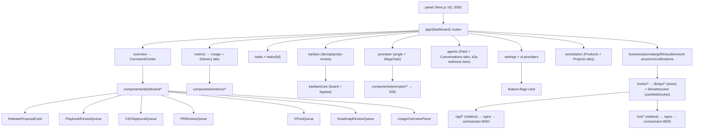

# Panel — RoboCo Control Panel Map

## Purpose
The Next.js 16 control panel (`panel/`, package `roboco-panel` v0.14.0) is the single operator UI for the human CEO: it drives intake/prompter chats, task/kanban management, agent observability, metrics, release approval, playbook curation, and feature-flag arming. It is served internally on port 3000 behind the nginx reverse proxy and talks to the orchestrator exclusively over relative `/api` + `/ws` URLs.

## Files / Structure

| Path | Role |
|---|---|
| `panel/package.json` | Deps: Next 16.1.1, React 19.2, TanStack Query 5.90, Radix UI, Tailwind 4, zustand 5, recharts 3, dnd-kit 6/10, axios, react-hook-form, zod 4 |
| `panel/src/app/layout.tsx` | Root layout (providers, theme, fonts) |
| `panel/src/app/(dashboard)/layout.tsx` | Dashboard shell: sidebar + header + connection status |
| `panel/src/app/(dashboard)/overview/page.tsx` | Overview = `<CommandCenter/>` |
| `panel/src/app/(dashboard)/metrics/page.tsx` | Metrics page: Usage + Delivery tabs, summary/donut/charts |
| `panel/src/app/(dashboard)/tasks/page.tsx` + `tasks/[taskId]/page.tsx` | Task list + task detail (tabbed) |
| `panel/src/app/(dashboard)/kanban/page.tsx` | Operator kanban (dev/qa/pm/pr-review views) |
| `panel/src/app/(dashboard)/prompter/page.tsx` | Intake chat (single + MegaTask batch scope) |
| `panel/src/app/(dashboard)/agents/page.tsx` | Agents hub: Fleet (roster/spawn/status, default) + Conversations tabs via `?tab=fleet\|conversations` — `AgentsFleetView` (fleet roster/spawn/activity) and `A2AView` (org-wide switchboard/list + transcript + CEO reply composer + "New DM" dialog, live via `/ws/system` `a2a.message` frames — a pure lift of the old standalone `/a2a` page body) |
| `panel/src/app/(dashboard)/a2a/page.tsx` | Redirect shim → `/agents?tab=conversations` (A2A folded into the Agents hub's Conversations tab, wave 9) — kept so old bookmarks/links still resolve |
| `panel/src/app/(dashboard)/settings/page.tsx` + `settings/ai-providers/page.tsx` | Settings: feature flags, AI routing, transcript retention, self-hosted |
| `panel/src/app/(dashboard)/workstation/page.tsx` | Workstation: Products + Projects merged as URL-param tabs (`?tab=products\|projects`, Products first); `products/page.tsx` and `projects/page.tsx` are now server-component redirects to it |
| `panel/src/app/(dashboard)/{business,journals,git,knowledge-base,auditor,work-sessions,notifications}/page.tsx` | Per-domain pages |
| `panel/src/app/(auth)/login/page.tsx` | Cloud-auth login form (email/password → `useLogin` → `/auth/login`); only reachable/relevant once `proxy.ts` starts gating the `(dashboard)` group |
| `panel/src/app/(tg)/layout.tsx` + `(tg)/tg/page.tsx` | Telegram Mini App cockpit at `/tg`: slim shell (no sidebar/header, `next/script` loads the Telegram WebApp bridge `afterInteractive`) + bootstrap page that resolves `window.Telegram.WebApp`, POSTs its `initData` to `/telegram/webapp-auth` unconditionally, then renders the tabbed cockpit (or an "Open from Telegram" / error state) |
| `panel/src/proxy.ts` | Next 16's rename of `middleware.ts`: probes `/auth/status` (docker-internal orchestrator URL, fails open to "off" on any error/timeout) and redirects to `/login` when cloud auth is on and no session cookie is present; matcher excludes `tg(?:/|$)` — the Mini App authenticates via Telegram `initData`, not the password cookie, so it must never be redirected to `/login` |
| `panel/src/components/dashboard/` | Overview cards: command-center, key-metrics, release-proposal, playbook-review-queue, ceo-approval-queue, pr-review-queue, usage-overview, team-health, active-blockers, auditor-alerts, strategy-signals, quick-actions, recent-activity, `x-post-queue.tsx`, `roadmap-review-queue.tsx` |
| `panel/src/components/metrics/` | delivery-tab, usage-time-series-chart, agent/team-usage-chart, model-usage-donut, sessions-table |
| `panel/src/components/kanban/{core,shared,views}/` | core: kanban-board/column/card + bypass-preconditions; views: dev/qa/pm/pr-review kanban |
| `panel/src/components/prompter/` | intake-form, chat-messages, chat-composer, draft-proposal-card, batch-review-card, success-card, board-review-sent-card |
| `panel/src/components/a2a/` | a2a-view.tsx (`A2AView` — the Conversations tab's full body, a pure lift of the old standalone `/a2a` page; owns the `?dm=` quick-action latch, see Gotchas), a2a-switchboard (org-chart pair cards, 45s pulse fade) + a2a-switchboard-utils (pairKey/grouping/pulse), a2a-pair-card, a2a-conversation-list (classic fallback), a2a-transcript, a2a-reply-composer (CEO chime-in on a watched conversation), a2a-new-dm-dialog (CEO opens a fresh 1:1, or preselects a validated `?dm=` deep-link target; exports `EXCLUDE_NON_DM_ROLES` so `tg-chat-tab.tsx`'s compose picker shares the same non-DM-capable-role exclusion instead of drifting out of sync), a2a-direct-composer (CEO's own thread, no task link required), a2a-utils |
| `panel/src/components/tasks/` + `tasks/task-detail/` | task-table, create/edit-task-dialog, task-filters, acceptance-criteria-editor, dependency-selector, task-detail tabs (overview/plan/progress/commits/sessions/notes/dependencies/**findings**), `mobile-task-board.tsx` (read-only, grouped-by-status phone board for the `/tg` cockpit) |
| `panel/src/components/tg/` | The `/tg` cockpit's own tabs: `tg-tab-bar.tsx` (4-tab bottom nav, page-state-controlled), `tg-approvals-tab.tsx` (stacks the existing held-artifact queue cards), `tg-inbox-tab.tsx` (notifications + ack), `tg-board-tab.tsx` (wraps `mobile-task-board.tsx`), `tg-chat-tab.tsx` (A2A conversation list / compose / polled thread, phone-scoped rebuild of the Agents hub's Conversations tab) |
| `panel/src/lib/telegram/webapp.ts` | Thin typed wrapper over the global `window.Telegram.WebApp` (`ready`/`expand`/`initData`); `waitForTelegramWebApp` polls (100ms, 1.5s timeout) for the CDN script since it loads `afterInteractive` |
| `panel/src/components/settings/` | feature-flags-card, ai-routing-card, transcript-retention-card, self-hosted-section, `x-credentials-card.tsx` (write-only OAuth 1.0a secrets, mounted in `settings/page.tsx`) |
| `panel/src/components/conventions/conventions-tab.tsx` | Per-project architecture map + health (in edit-project dialog) |
| `panel/src/components/projects/`, `products/`, `agents/`, `business/`, `auditor/`, `knowledge-base/`, `git/`, `journals/`, `work-sessions/`, `notifications/`, `rate-limit/`, `layout/`, `ui/` | Per-domain component groups (`projects/` and `products/` each export a `*-view.tsx` consumed by `workstation/page.tsx`; `agents/` similarly exports `agents-fleet-view.tsx` (`AgentsFleetView`) consumed by `agents/page.tsx`'s Fleet tab, plus `agent-card.tsx`'s DM quick-action button); `ui/` = Radix-based primitives (dialog, table, tabs, select, switch, required-notes-dialog, sonner toaster, markdown) |
| `panel/src/hooks/use-websocket.ts` | Shared `useWebSocket<T>(path, handlers?, isSystem?)` hook (auto-reconnect, heartbeat) |
| `panel/src/hooks/use-{tasks,agents,projects,products,usage,prompter,secretary,dashboard,git,journals,notifications,knowledge-base,observability,work-sessions,providers,rate-limit-{sync,websocket}}.ts` | TanStack Query + zustand data hooks |
| `panel/src/hooks/use-a2a-live.ts` | `useA2AConversations` / `useA2AAdminPairs` / `useA2AMessages` (TanStack Query over `a2aApi`) + `useReplyAsCeo` / `useCreateCeoConversation` / `useSendCeoMessage` mutations; `a2aLiveKeys` query-key namespace |
| `panel/src/lib/api/*.ts` | Per-domain axios clients (`client.ts` shared instance; `release.ts`, `playbooks.ts`, `prompter-live.ts`, `tasks.ts`, `settings.ts`, `usage.ts`, `cockpit.ts`, `a2a.ts`, `auth.ts` (status/login/logout), `x.ts` (post queue + credentials), `roadmap.ts` (cycles + item approve/reject), …) |
| `panel/src/lib/websocket/connection.ts` | `WebSocketConnection` class + `getWebSocketUrl` |
| `panel/src/store/{rate-limit-store,notifications-store,usage-store,ui-store}.ts` + `lib/stores/` | zustand stores (`lib/stores/` now exports `scroll-restoration-store` only; `ui-store` is sole-canonical under `src/store/`) |
| `panel/src/types/` | Shared TS types (index, rate-limits, git) |
| `panel/src/lib/{constants,utils,agent-definitions,agent-utils,repo-url,mock-data}.ts` | `API_URL="/api"`, `WS_URL="/ws"`, `CEO_AGENT_ID/ROLE`, helpers |
| `panel/vitest.config.ts`, `panel/src/test/setup.ts`, `**/__tests__/` | Vitest + jsdom; coverage via @vitest/coverage-v8 |

## Key Surfaces

| Surface | File | What it does |
|---|---|---|
| Overview / Command Center | `components/dashboard/command-center.tsx` | Composes key-metrics, usage-overview, ceo-approval-queue, pr-review-queue, release-proposal, playbook-review-queue, active-blockers, auditor-alerts, strategy-signals, team-health, recent-activity, quick-actions |
| Metrics — Usage | `app/(dashboard)/metrics/page.tsx` + `components/metrics/*` | Summary, time-series, agent/team/model donut, sessions table, projection, cache efficiency; live via `/ws/system` USAGE_SNAPSHOT |
| Metrics — Delivery | `components/metrics/delivery-tab.tsx` | Cycle-time, bottlenecks, rework (now incl. "PM rejects"/"CEO rejects" columns alongside QA/PR-fail counts — see `docs/map/review-findings.md`), scorecards (read-only `/dashboard/metrics/*`) |
| Findings tab | `components/tasks/task-detail/tab-findings.tsx` | Per-round revision-findings ledger view: origin/status summary badges, severity/status badges, file:line, collapsible evidence, truncation footer; backed by `GET /api/tasks/{id}/findings` via `useTaskFindings`. A `bounced xN` chip (`task.revision_count`) surfaces on the task header alongside it. |
| Release Proposal | `components/dashboard/release-proposal-card.tsx` | CEO approve/reject-with-changes on held `release_manager` proposal; fail-closed executor; hidden on 404, retry on real error |
| Playbook Review Queue | `components/dashboard/playbook-review-queue.tsx` | Auditor/CEO approve/reject drafted playbooks; hidden when no drafts |
| CEO Approval Queue | `components/dashboard/ceo-approval-queue.tsx` | Tasks in `awaiting_ceo_approval` awaiting CEO verdict |
| PR Review Queue | `components/dashboard/pr-review-queue.tsx` | Inbound external/fork PRs + in-path gate PRs for the reviewer |
| X Post Queue | `components/dashboard/x-post-queue.tsx` | CEO edit/approve (posts to X)/reject on held release-post + mention-reply drafts; hidden when empty |
| Roadmap Review Queue | `components/dashboard/roadmap-review-queue.tsx` | CEO per-item approve (materializes BACKLOG task)/reject on the Product Owner's held roadmap cycle; hidden until authored |
| Feature Flags | `components/settings/feature-flags-card.tsx` | Toggles persisted to settings store; takes effect on next backend restart |
| Intake / MegaTask | `app/(dashboard)/prompter/page.tsx` + `components/prompter/*` | Live SSE chat with spawned Claude/Grok intake agent; single-project, product, or multi-project (`project_ids`) MegaTask → `propose_batch` → `confirm-batch` |
| Agents — Fleet | `app/(dashboard)/agents/page.tsx` (`?tab=fleet`, default) + `components/agents/agents-fleet-view.tsx` + `components/agents/*` | Full agent roster grouped into Leadership/Backend/Frontend/UX-UI/Support grids: live state, spawn/stop controls, activity-stream link, token usage. Each card's DM button (hidden for `EXCLUDE_NON_DM_ROLES`) deep-links `/agents?tab=conversations&dm=<agent id>` into the Conversations tab |
| Agents — Conversations (switchboard + reply + New DM) | `app/(dashboard)/agents/page.tsx` (`?tab=conversations`) + `components/a2a/a2a-view.tsx` + `components/a2a/*` | CEO watches every agent-to-agent conversation live: default org-chart switchboard (pair cards grouped by cell/PM-chain/board, pulsing on fresh `a2a.message` frames) or the classic conversation list; drill-in shows the transcript + a reply composer that lets the CEO chime into a watched thread as itself (task-linked conversations only). "New DM" opens a fresh CEO-owned 1:1 with any DM-capable agent (no task link needed) — either from the dialog's own picker or preselected from a validated `?dm=` deep link off the Fleet tab; the recipient is woken via the a2a_request dispatch path if offline, and the CEO's own threads render with `A2ADirectComposer` instead of the reply composer. `/a2a` redirects here |
| Workstation | `app/(dashboard)/workstation/page.tsx` + `components/{products,projects}/*-view.tsx` | Products + Projects as one sidebar entry, tab-switched via `?tab=`; Projects' q/cell/inactive filters are local `useState`, not URL params (scroll-bounce prevention) |
| Project Settings / Conventions | `components/projects/edit-project-dialog.tsx` + `components/conventions/conventions-tab.tsx` | Per-project `.roboco/conventions.yml` map + health; Save / Restore via PR |
| Usage Dashboard | `components/dashboard/usage-overview-panel.tsx` + `hooks/use-usage.ts` | Token/cost totals; live WS snapshot with HTTP-polling fallback |
| Git | `app/(dashboard)/git/page.tsx` | Repository / Work Sessions tabs (business-page tab idiom, `?tab=`); `GitBrowser` (status/branches/log/diff + actions incl. confirm-gated "Clean Up Stale Branches") and `WorkSessionsView` (active sessions, search/status filter kept LOCAL not in URL params); old `/work-sessions` route now redirects to `/git?tab=sessions` |
| Kanban | `components/kanban/{core,views}/*` | dnd-kit drag board; dev/qa/pm/pr-review views; drag routes through admin status-override with bypass-precondition prompt |
| Task Detail | `components/tasks/task-detail/*` | Tabbed: overview, plan, progress, commits, sessions, notes, dependencies, **findings**, AC, action dialogs |
| AI Providers | `app/(dashboard)/settings/ai-providers/page.tsx` + `components/settings/ai-routing-card.tsx` | Per-slug/role/global model routing |
| Telegram Mini App | `app/(tg)/tg/page.tsx` + `components/tg/*` | The CEO's phone cockpit, outside the `(dashboard)` shell: 4 tabs (Approvals — the held-artifact queues restacked; Inbox — notifications + ack; Board — `mobile-task-board.tsx` read-only grouped-by-status; Chat — A2A conversation list/compose/thread, polled not WS). Bootstraps via Telegram `initData` → `/telegram/webapp-auth`, requires both `telegram_miniapp_enabled` and `cloud_auth_enabled` armed server-side |

## Key Symbols

| Name | Kind | File | Responsibility |
|---|---|---|---|
| `useWebSocket<T>` | hook | `hooks/use-websocket.ts` | Single shared WS per path; auto-reconnect, heartbeat, message dispatch |
| `WebSocketConnection` | class | `lib/websocket/connection.ts` | Low-level WS lifecycle; `getWebSocketUrl` builds `/ws/<path>` |
| `api` (axios instance) | const | `lib/api/client.ts` | Shared client; baseURL `API_URL`, DEFAULTS (not forces, since wave 3) `X-Agent-ID/Role=CEO` via `has()`/`set()` — a caller-set header (e.g. the CEO-DM composer's literal `"ceo"` slug, needed verbatim by its route) wins; rate-limit retry (3) |
| `releaseApi` | module | `lib/api/release.ts` | `getProposal/approve/reject`; 404→null, non-404 rethrow |
| `authApi` | module | `lib/api/auth.ts` | `status/login/logout`; `status` always available (public probe), `login` posts an OAuth2 form body (FastAPI Users cookie route, not JSON) |
| `useLogin`/`useAuthStatus`/`useLogout` | hooks | `hooks/use-auth.ts` | TanStack Query wrappers over `authApi`; login page + `proxy.ts`-gated flows |
| `xApi` | module | `lib/api/x.ts` | `listPosts/approve/reject/getCredentialsStatus/setCredentials`; credentials are write-only (never returned) |
| `roadmapApi` | module | `lib/api/roadmap.ts` | `listCycles/approveItem/rejectItem` |
| `prompterLiveApi` | module | `lib/api/prompter-live.ts` | `start/streamUrl/messages/confirm/confirmBatch`; EventSource SSE |
| `usePrompter` | hook | `hooks/use-prompter.ts` | Intake state machine: SSE refs, draft/batch extraction, turn lifecycle |
| `useRateLimitWebsocket` | hook | `hooks/use-rate-limit-websocket.ts` | Single `/ws/system` subscriber; dispatches RATE_LIMIT_* + USAGE_SNAPSHOT; clears usage on disconnect |
| `useA2ALiveStream` | hook | `hooks/use-websocket.ts` | Second `/ws/system` consumer (same shared connection): filters `a2a.message` frames, exposes `lastMessage`/`a2aMessages`/`isConnected` for the Conversations tab's invalidate-on-frame + switchboard pulses |
| `useA2AAdminPairs` / `useA2AConversations` / `useA2AMessages` | hooks | `hooks/use-a2a-live.ts` | TanStack Query wrappers over `a2aApi.listAdminPairs/listAdminConversations/listAdminMessages`; 30s `staleTime`, invalidated by `a2a.message` frames; `useA2AMessages` takes an optional `{ refetchInterval }` (default off — the desktop Conversations tab relies on WS invalidation) that `tg-chat-tab.tsx` sets to ~10s since the `/tg` cockpit has no WS wiring |
| `useReplyAsCeo` | hook | `hooks/use-a2a-live.ts` | Mutation wrapping `a2aApi.replyAsCeo`; invalidates the conversation list + the watched transcript's messages on success |
| `A2AView` | comp | `components/a2a/a2a-view.tsx` | Conversations tab body — pure lift of the old standalone `/a2a` page (switchboard/list, transcript, reply/direct composer, New DM); owns the `?dm=` quick-action latch (`dmParam`/`prevDmParam` render-phase state, re-arms once `dm` is stripped) and the `?conversation=` selection, both now targeting `/agents` instead of `/a2a` |
| `AgentsFleetView` | comp | `components/agents/agents-fleet-view.tsx` | Fleet tab body — pure lift of the old standalone `/agents` page (roster grids, orchestrator status, spawn/stop controls); `AgentCard`'s DM button pushes the `?dm=` deep link the Conversations tab's latch consumes |
| DM quick-action (`?dm=` deep link) | logic | `components/agents/agent-card.tsx` + `components/a2a/a2a-view.tsx` + `components/a2a/a2a-new-dm-dialog.tsx` | `AgentCard`'s DM button (hidden for `EXCLUDE_NON_DM_ROLES`) pushes `/agents?tab=conversations&dm=<agent id>`; `A2AViewContent` latches it open once per distinct value then strips `dm` from the URL, re-arming (`prevDmParam` reset to `null`) so a repeated identical deep link still fires instead of being silently swallowed by a stale latch; `A2ANewDmDialog` only preselects the target once it resolves against the live roster and passes `EXCLUDE_NON_DM_ROLES` — the deep link is untrusted URL input, never trusted blindly |
| `A2ASwitchboard` / `A2APairCard` | comp | `components/a2a/a2a-switchboard.tsx` + `a2a-pair-card.tsx` | Org-chart pair cards grouped into sections (cell/PM-chain/board/cross-team) via `groupPairsBySection`; each card pulses for `PAIR_PULSE_FADE_MS` (45s) after a matching live frame |
| `A2AReplyComposer` | comp | `components/a2a/a2a-reply-composer.tsx` | CEO chime-in box on a selected WATCHED conversation; disabled when it has no linked task (A2A sends require one) |
| `A2ANewDmDialog` | comp | `components/a2a/a2a-new-dm-dialog.tsx` | CEO-voiced "start a fresh 1:1" entry point; `AgentSelector` with `excludeRoles` dropping self + non-`read_a2a` roles (auditor/pr_reviewer/prompter/secretary); `useCreateCeoConversation` opens the thread and sends the first message in one call. A controlled `open`/`onOpenChange` pair plus `initialTarget` let the Fleet tab's DM quick-action drive it externally — `initialTarget` only preselects once validated against the live roster + the same exclusion (untrusted `?dm=` input, never trusted blindly) |
| `A2ADirectComposer` | comp | `components/a2a/a2a-direct-composer.tsx` | Composer for a conversation the CEO itself owns (`agent_a`/`agent_b === "ceo"`); posts via `useSendCeoMessage`/the plain per-conversation send route, NOT the interject-as-ceo route `A2AReplyComposer` uses — no task link required |
| `useCreateCeoConversation` / `useSendCeoMessage` | hooks | `hooks/use-a2a-live.ts` | Mutations wrapping `a2aApi.createConversation`/`sendCeoMessage`; both force `X-Agent-ID: "ceo"` (literal slug, not the UUID) on the request and invalidate the conversation list (+ that conversation's messages for the send) |
| `useUsageStore` | store | `store/usage-store.ts` | zustand: live usage snapshot, wsState, polling fallback |
| `skippedPreconditions` | fn | `components/kanban/core/bypass-preconditions.ts` | Lists material lifecycle preconditions a drag would skip (PR/docs/subtasks-terminal) |
| `KanbanBoard` | comp | `components/kanban/core/kanban-board.tsx` | dnd-kit board; routes drag→`useUpdateTask` (admin override) or in-band lifecycle verb; notes dialog for pass-qa/fail-qa/complete |
| `ReleaseProposalCard` | comp | `components/dashboard/release-proposal-card.tsx` | Approve/reject-with-changes dialog; ≥10 char reject reason |
| `PlaybookReviewQueue` | comp | `components/dashboard/playbook-review-queue.tsx` | Approve/reject-with-reason (≥4 char) drafts |
| `XPostQueue` | comp | `components/dashboard/x-post-queue.tsx` | Editable draft body + 280-char counter; approve (posts), reject-with-reason (≥4 char); hidden when empty |
| `RoadmapReviewQueue` | comp | `components/dashboard/roadmap-review-queue.tsx` | Per-item approve/reject within a held cycle card; reject requires ≥4 char reason |
| `XCredentialsCard` | comp | `components/settings/x-credentials-card.tsx` | Write-only entry of the 4 OAuth 1.0a secrets; set-all-4 or clear-all-4 |
| `RequiredNotesDialog` | comp | `components/ui/required-notes-dialog.tsx` | Reusable notes-gated confirm; submit disabled on empty/whitespace |
| `CommandCenter` | comp | `components/dashboard/command-center.tsx` | Overview page body; composes all dashboard cards |
| `DeliveryTabContent` | comp | `components/metrics/delivery-tab.tsx` | Cycle-time/bottleneck/rework/scorecard panels |
| `GitActionsPanel` | comp | `components/git/git-actions-panel.tsx` | Commit/push/PR/rebase actions + destructive-confirm "Clean Up Stale Branches" (`AlertDialog`) |
| `useCleanupBranches` / `handleCleanupBranches` | hook | `hooks/use-git.ts` / `hooks/use-git-browser.ts` | Mutation over `POST /git/branches/cleanup`; the browser hook tracks a per-project cursor ref so a repeat click resumes a truncated sweep instead of re-scanning the first window |
| `WorkSessionsView` | comp | `components/work-sessions/work-sessions-view.tsx` | Git page's "Work Sessions" tab body; search/status filters are LOCAL `useState`, not URL params |
| `SessionTrendChart` | comp | `components/work-sessions/session-trend-chart.tsx` | Active-session start-time histogram (hourly/daily bucketing); honestly labeled active-only, no history beyond `GET /work-sessions` |
| `CostTrendChart` / `SpendTrendChart` | comp | `components/dashboard/cost-trend-chart.tsx` / `components/business/spend-trend-chart.tsx` | Daily-spend area charts off `GET /usage/time-series`; 7d on Overview (`CommandCenter`), 30d on the Business scorecard (`CompanyScorecardCard`) |

## Data Flow
Browser → nginx :3000 → (panel Next.js server for pages; `/api/*` and `/ws/*` proxied to `orchestrator:8000`). All client calls use relative URLs: `API_URL="/api"` (axios `baseURL`) and `WS_URL="/ws"` (`getWebSocketUrl`) — no CORS because the browser sees one origin. When cloud auth is armed (`ROBOCO_CLOUD_AUTH_ENABLED`), every navigation to a `(dashboard)` route first runs `proxy.ts` (Next 16's rename of `middleware.ts`), which probes `/auth/status` directly against the docker-internal orchestrator URL (not through nginx) and redirects to `/login` when no `roboco_session` cookie is present; a probe failure/timeout fails OPEN to "cloud auth off" so a slow/unreachable backend never blocks navigation. The login page (`(auth)/login/page.tsx`) posts credentials via `authApi.login` (OAuth2 form body, FastAPI Users' cookie route) and the session cookie rides back on the response. The shared axios client DEFAULTS `X-Agent-ID=<CEO_AGENT_ID>` + `X-Agent-Role=CEO_ROLE` headers for API authorization — `has()`/`set()`, not a flat overwrite, so a call that already set its own headers (the CEO-DM composer's `X-Agent-ID: "ceo"`, needed literally by its route) keeps them. Live events flow: orchestrator `StreamEventBus` → `websocket_bridge` → per-resource `/ws/{agents,notifications,system}` sockets → panel `useWebSocket` hooks → zustand stores / TanStack Query cache. Usage snapshots (`USAGE_SNAPSHOT`) and rate-limit lifecycle (`RATE_LIMIT_HIT/LIFTED`) arrive on the single shared `/ws/system` stream mounted in providers; on any non-`connected` state the usage store clears its snapshot so the panel falls back to HTTP-polling summary until a fresh frame lands. The Agents hub's Conversations tab (`useA2ALiveStream`) is a second, independent consumer of that same shared `/ws/system` connection (not a new socket): every persisted A2A message publishes an `a2a.message` frame, which the tab uses purely to invalidate-on-frame (REST via `a2aApi` stays the source of truth for full message bodies, since the frame's excerpt is capped) and to drive the switchboard's 45s pulse fade on the matching pair card.

## Mermaid


## Logical Tree
```
panel/ (Next.js 16, package roboco-panel v0.14.0)
├── src/app/
│   ├── layout.tsx                          (root layout: providers, theme, fonts)
│   ├── (auth)/login/page.tsx               (cloud-auth login form; gated by proxy.ts)
│   ├── (tg)/
│   │   ├── layout.tsx                      (slim shell, no sidebar/header; loads Telegram WebApp bridge script)
│   │   └── tg/page.tsx                     (bootstrap: initData → /telegram/webapp-auth, then 4-tab cockpit)
│   └── (dashboard)/
│       ├── layout.tsx                      (dashboard shell: sidebar + header + connection status)
│       ├── overview/page.tsx               (→ <CommandCenter/>)
│       ├── metrics/page.tsx                (Usage + Delivery tabs)
│       ├── tasks/page.tsx + tasks/[taskId]/page.tsx
│       ├── kanban/page.tsx                 (dev/qa/pm/pr-review views)
│       ├── prompter/page.tsx               (intake chat: single + MegaTask batch)
│       ├── agents/page.tsx                 (Agents hub: Fleet + Conversations tabs; a2a/page.tsx now redirects here)
│       ├── a2a/page.tsx                    (redirect → /agents?tab=conversations)
│       ├── settings/page.tsx + settings/ai-providers/page.tsx
│       ├── workstation/page.tsx            (Products + Projects tabs; projects/, products/ page.tsx now redirect here)
│       └── {business,journals,git,knowledge-base,auditor,work-sessions,notifications}/page.tsx
├── src/components/
│   ├── dashboard/                          (command-center, key-metrics, release-proposal, playbook-review-queue, ceo-approval-queue, pr-review-queue, x-post-queue, roadmap-review-queue, usage-overview, team-health, active-blockers, auditor-alerts, strategy-signals, quick-actions, recent-activity)
│   ├── metrics/                            (delivery-tab, usage-time-series-chart, agent/team-usage-chart, model-usage-donut, sessions-table)
│   ├── kanban/
│   │   ├── core/                           (kanban-board/column/card + bypass-preconditions)
│   │   ├── shared/
│   │   └── views/                          (dev/qa/pm/pr-review kanban)
│   ├── prompter/                           (intake-form, chat-messages, chat-composer, draft-proposal-card, batch-review-card, success-card, board-review-sent-card)
│   ├── a2a/                                (a2a-view.tsx = Conversations tab body, pure lift of the old /a2a page; a2a-switchboard + a2a-switchboard-utils, a2a-pair-card, a2a-conversation-list, a2a-transcript, a2a-reply-composer, a2a-new-dm-dialog, a2a-direct-composer, a2a-utils)
│   ├── tasks/ + tasks/task-detail/         (task-table, create/edit-task-dialog, task-filters, acceptance-criteria-editor, dependency-selector; detail tabs: overview/plan/progress/commits/sessions/notes/dependencies/findings; mobile-task-board.tsx for /tg)
│   ├── tg/                                 (tg-tab-bar, tg-approvals-tab, tg-inbox-tab, tg-board-tab, tg-chat-tab — the /tg cockpit's own tabs)
│   ├── settings/                           (feature-flags-card, ai-routing-card, transcript-retention-card, self-hosted-section, x-credentials-card)
│   ├── conventions/conventions-tab.tsx     (per-project architecture map + health)
│   ├── projects/projects-view.tsx, products/products-view.tsx (Workstation tab panes)
│   ├── agents/agents-fleet-view.tsx        (Fleet tab body; agent-card.tsx owns the DM quick-action button)
│   ├── projects/ products/ agents/ business/ auditor/ knowledge-base/ git/ journals/ work-sessions/ notifications/ rate-limit/ layout/
│   └── ui/                                 (Radix-based primitives: dialog, table, tabs, select, switch, required-notes-dialog, sonner toaster, markdown)
├── src/hooks/
│   ├── use-websocket.ts                    (shared useWebSocket<T>: auto-reconnect, heartbeat)
│   └── use-{tasks,agents,projects,products,usage,prompter,secretary,dashboard,git,journals,notifications,knowledge-base,observability,work-sessions,providers,rate-limit-{sync,websocket}}.ts
├── src/lib/
│   ├── api/*.ts                            (per-domain axios clients; client.ts shared instance; release, playbooks, prompter-live, tasks, settings, usage, cockpit, a2a, auth, x, roadmap, …)
│   ├── websocket/connection.ts             (WebSocketConnection + getWebSocketUrl)
│   ├── telegram/webapp.ts                  (window.Telegram.WebApp wrapper + waitForTelegramWebApp poll)
│   ├── stores/                             (scroll-restoration-store only; ui-store is sole-canonical in src/store/)
│   └── {constants,utils,agent-definitions,agent-utils,repo-url,mock-data}.ts
├── src/proxy.ts                            (Next 16 rename of middleware.ts: gates (dashboard) behind cloud auth)
├── src/store/                              (rate-limit-store, notifications-store, usage-store, ui-store)
├── src/types/                              (shared TS types: index, rate-limits, git)
├── vitest.config.ts + src/test/setup.ts    (Vitest + jsdom; coverage via @vitest/coverage-v8)
└── package.json                            (Next 16.1.1, React 19.2, TanStack Query 5.90, Radix UI, Tailwind 4, zustand 5, recharts 3, dnd-kit 6/10, axios, react-hook-form, zod 4)
```

## Dependencies
- **Next.js 16.1.1** (App Router, `(dashboard)` route group) + React 19.2
- **Tailwind 4** + `@tailwindcss/typography` + `tw-animate-css`
- **Radix UI** primitives (dialog, dropdown, select, tabs, switch, tooltip, popover, …) wrapped in `components/ui/*`
- **TanStack React Query 5.90** for server state; **zustand 5** for client stores (usage, rate-limit, notifications, ui)
- **axios 1.13** shared client; **react-hook-form 7** + **zod 4** + `@hookform/resolvers` for forms
- **@dnd-kit/core + sortable + utilities** for kanban drag
- **recharts 3** for usage charts; **react-markdown 9** + remark-gfm for markdown render
- **sonner** toasts; **next-themes** dark mode; **date-fns**; **lucide-react** icons
- **Vitest 4** + jsdom + @testing-library for tests; **pnpm 10.25** package manager

## Entry Points
- **nginx :3000** single external entry; routes `/api/*`+`/ws/*`→orchestrator:8000, else→panel:3000
- **App Router** `src/app/layout.tsx` → `(dashboard)/layout.tsx` → per-page `page.tsx`
- `pnpm dev` (next dev), `pnpm build` + `pnpm start` (production), `pnpm test` (vitest)

## Config Flags
`feature-flags-card.tsx` persists toggles to the settings store (effective on next backend restart); unset → env/config default. Toggles include:
- `external_pr_enabled` / `internal_pr_enabled` — PR review surfaces
- `research_enabled` — Board/PM web research
- `strategy_engine_enabled` — strategy artifacts
- `self_heal_enabled` + `self_heal_originate_enabled` — own-repo CI self-heal (+ originate)
- `provisioning_enabled` — pitch→project auto-provisioning
- `toolchain_match_enabled` — agent runtime toolchain match
- `conventions_enabled` — architectural-conventions standard
- `gateway_health_enabled` — gateway-health recovery
- `ci_watch_enabled` — multi-repo CI-watch
- `dep_update_enabled` — dependency-update bot
- `release_manager_enabled` — gated release manager
- `org_memory_enabled` — organizational memory loop
- `sandbox_db_enabled` — sandboxed per-agent test DB/Redis/Mongo (engine registry)
- `x_engine_enabled` — X (Twitter) engine (release-post + mention-reply drafts, all CEO-held)
- `roadmap_engine_enabled` — board roadmap engine (weekly Product-Owner-authored cycle)
- `routing_strict` — fail-closed model routing (refuse to silently downgrade to the legacy Anthropic path on a disabled provider)
- `telegram_enabled` — Telegram CEO-DM bridge (V1, outbound-only; pre-existing, previously missing from this list)
- `telegram_inbound_enabled` — Telegram V2 sub-switch (on top of `telegram_enabled`): poll for commands/button-taps and make escalation DMs actionable

Deliberately **not** on this card (compose/env-coupled, unsafe for a runtime toggle): `ROBOCO_CLOUD_AUTH_ENABLED`, `ROBOCO_DB_NETWORK_ISOLATED`, and `ROBOCO_TELEGRAM_MINIAPP_ENABLED` (Mini App sign-in — same TLS coupling as cloud auth, which it also requires).

## Gotchas
- **Relative URLs only** (`/api`, `/ws`); overriding `NEXT_PUBLIC_API_URL`/`NEXT_PUBLIC_WS_URL` to an absolute URL reintroduces CORS — leave defaults.
- **`/ws/system` is a single shared instance** mounted once in providers; a second `useWebSocket("/system")` would open a second socket. `getWebSocketUrl` already supplies `/ws`, so pass only the path (passing `/ws/system` doubled to `/ws/ws/system` — now fixed and commented).
- **Usage snapshot cleared on any non-`connected` state** so a reconnect can't render the prior session's totals as live; panel falls back to HTTP polling summary during the gap.
- **Intake composer SSE** uses `EventSource` (no custom headers — auth is server-side via session id); a transport-level `error` event loop-reconnects a dead session — guard kept in `use-prompter.ts` (a stale localStorage payload or malformed frame could still surface a phantom draft).
- **Secretary live chat (`use-secretary.ts`)** now mirrors that intake-composer resilience (post-2026-06-30): a transport-level SSE `error` resets the `streaming` spinner + surfaces a notice (no permanent "thinking…" hang), `send` is blocked while a reply is streaming (no mid-reply clobber), and the chat persists to `localStorage` and reconnects on reload (status-alive gated).
- **MegaTask intake card** historically had crash/disappears bugs (list[str] nest, depth ValueError→500); confirm-batch path is the multi-project branch (`project_ids`).
- **Kanban drag = admin status-override** which bypasses the in-band lifecycle validator; `skippedPreconditions` only warns on what the panel can detect (PR/docs/subtasks-terminal) — precision over recall, an empty list does NOT mean the move is safe, only that nothing detectable is skipped.
- ~~`ui-store` exists under both `store/ui-store.ts` and `lib/stores/ui-store.ts`~~ — **FIXED** (536bbb64): `lib/stores/ui-store.ts` was removed and replaced with `scroll-restoration-store.ts`; `store/ui-store.ts` is now the sole canonical location.
- **`proxy.ts` is Next.js 16's renamed `middleware.ts`** — same file-convention contract (default export + `config.matcher`), just relocated/renamed terminology (it never ran in true Edge middleware). A reader searching the repo for `middleware.ts` will find nothing; the gate lives at `src/proxy.ts`.
- **`proxy.ts` fails OPEN, not closed** — a slow/unreachable orchestrator on the `/auth/status` probe (1500ms timeout) is treated as "cloud auth off," so the dashboard stays reachable rather than the CEO getting locked out by a transient backend hiccup. This is the deliberately safe default (off is what every deploy starts on) but means a genuinely-armed deployment with a flaky orchestrator could intermittently skip the login gate.
- **`proxy.ts`'s `/tg` exclusion must be anchored** (`tg(?:/|$)`, not a bare `tg`) — an unanchored `tg` in the negative-lookahead matcher would also skip gating on any unrelated route that merely starts with "tg", not just the Mini App; fixed same-PR (8d727785) alongside the initData far-future rejection.
- **`/tg`'s bootstrap POSTs `initData` to `/telegram/webapp-auth` on every mount**, not just cold loads — there's no client-readable signal (the session cookie is httponly) to know a warm reload already has a valid cookie, so `tg/page.tsx` always re-validates; the route is idempotent (re-mints the same cookie) so this is cheap by design, not an oversight.
- **X Post Queue / Roadmap Review Queue hide when empty**, mirroring the release-proposal + playbook queues — a CEO who doesn't see the card has no signal that the underlying engine is even armed; both need `refetchInterval: 30000` to surface a newly-originated draft/cycle without a manual refresh.
- **Conversations tab activity is A2A-only by design**: `latestPulseTimestamps` (switchboard-utils) derives pulses purely from `a2a.message` frames on `/ws/system`, never from the verb/flow traffic sharing that same stream — a CEO ruling, not an oversight, so don't "fix" the switchboard to also light up on ordinary gateway verbs.
- **A2A reply composer is read-only on a task-less conversation**: the backend's `reply_as_ceo` route 400s exactly when the watched conversation has no `task_id` (A2A sends always ride the gateway `send` path, which requires one) — the panel pre-empts that bounce with an explanatory message instead of letting the POST fail. Conversation `status` does NOT gate the composer; the CEO's reply lands in its own direct thread with the participant, not into the watched conversation.
- **Switchboard "peeked pair" state**: a pair with `conversation_id: null` (never talked) has nothing to select via `?conversation=`, so `a2a-view.tsx` tracks it separately (`peekedPair`) and renders its own empty state — don't conflate this with the ordinary `selectedId` empty-state path when touching the drill-in panel.
- **`?dm=` deep-link target is validated, not trusted**: `A2ANewDmDialog`'s `preselectable` check resolves `initialTarget` against the live roster (`useAgentDefinitions`) AND requires the role pass `EXCLUDE_NON_DM_ROLES` — an unknown agent id, an excluded role (auditor/pr_reviewer/prompter/secretary/CEO), or a still-loading roster opens the dialog un-preselected rather than trusting whatever `?dm=` claims.
- **DM latch is one-shot-with-re-arm, not fire-once-forever**: `A2AViewContent` compares `dmParam` against a `prevDmParam` render-phase snapshot to open the dialog on a NEW value, then an effect strips `dm` from the URL; once stripped, `prevDmParam` resets to `null` so a second, identical `?dm=<same agent>` deep link (re-click the same card's DM button, a re-pasted URL) still re-opens the dialog instead of silently no-op'ing against the stale latch.
- **`a2aApi.createConversation`/`sendCeoMessage` must pass `X-Agent-ID: "ceo"` explicitly** (via axios per-call `headers`) — the backend routes they hit resolve the caller's identity from that raw header rather than a DB lookup, so the client's *default* `CEO_AGENT_ID` (a UUID) would persist as `agent_a`/`from_agent` and break every downstream `"ceo"`-string check (reply-budget gate, reply-composer recipient exclusion, admin pairing). `client.ts`'s interceptor uses `has()`/`set()` (case-insensitive) specifically so this per-call override isn't clobbered — `AxiosHeaders` bracket access is case-sensitive and would have silently lost a lowercase key.
- **`A2ANewDmDialog`'s `AgentSelector` uses `excludeRoles`**, a new prop that drops roles from the roster before grouping (not just filters within a group) — used here to exclude the CEO itself plus every role without `read_a2a` on its manifest (auditor, pr_reviewer, prompter, secretary), since a DM to one of them would be a black hole no one ever reads.
- **Every URL param write forks `ScrollRestoration`'s route key and force-scrolls `<main>` to top** — `WorkSessionsView`'s search/status filters learned this the hard way (a per-keystroke `q=` param bounced the page) and moved to local `useState`; the Git page's own `?tab=` switch is fine since it's a deliberate, infrequent navigation, not per-keystroke. Don't route per-keystroke or high-frequency filter state through `router.replace`/`push` on this page.
- **Workstation's `ProjectsView` filters (q/cell/inactive) are local `useState`, not URL params** — deliberate: any URL write forks `ScrollRestoration`'s route key and force-scrolls `<main>` to top. Trade-off disclosed: a filtered Projects view is no longer a shareable/bookmarkable link (only `?tab=` rides the URL). `/products` and `/projects` are now redirect shims to `/workstation?tab=...`, so old bookmarks/links still resolve.

## Drift from CLAUDE.md
- CLAUDE.md says panel lives at `roboco/panel/` inside this repo — confirmed (no longer a separate `roboco-panel` project). No drift.
- CLAUDE.md lists `/ws/system` events (`RATE_LIMIT_HIT/LIFTED`, `USAGE_SNAPSHOT`) — matches `use-rate-limit-websocket.ts`. No drift.
- CLAUDE.md names the release-proposal card `release-proposal-card.tsx` and routes `/api/release/proposal{,/approve,/reject}` — matches. No drift.
- CLAUDE.md names `playbook-review-queue.tsx` + `/api/playbooks` Auditor/CEO routes — matches. No drift.
- CLAUDE.md feature-flag list matches `feature-flags-card.tsx` FLAG_DESCRIPTIONS keys. No drift.
- **None.**

## Changes Since Baseline
`git log --oneline fd10cc862c2020b3f639cdb686d427b0198a2441..HEAD -- panel/`:
- `15effce0` Chore: 141 Gaps fill-in (#283) — the only panel-touching commit in range; broad fill-in pass (release-proposal error-surface fix, kanban bypass-precondition prompt, usage-snapshot clear-on-disconnect, `/ws/system` doubled-path fix, required-notes dialog, SSE loop-reconnect guard). Single commit, large surface — high regression-blast-radius.

> Post-snapshot updates (since 2026-06-29): five panel-touching commits landed on `chore/logical-gaps-element-sweep-fixes` / merge #286.
> - `536bbb64` Chore/all/logical gaps sweep (#286) — kanban sends `force: true` for hatch states (COMPLETED/AWAITING_QA/AWAITING_PM_REVIEW); `TaskUpdate` gains `{ force?: boolean }`; `lib/stores/ui-store.ts` removed, replaced by `scroll-restoration-store.ts`; `lib/stores/index.ts` re-exports scroll-restoration only; `prompter-live.ts` comment hardened to treat session id as bearer credential.
> - `aba57359` lifecycle artifacts: `panel/lib/lifecycle.json` regenerated to match spec.
> - `76ce53e3` chat: live MESSAGE_SENT delivery — adds `useSessionStream` to `use-websocket.ts`; new `communications/[sessionId]/page.tsx` session detail route consumes it; backend adds `EventType.MESSAGE_SENT`, bridge `_handle_message_event`, `messaging.send_message` bus publish.
> - `0065ecbb` chat: session task_links in one read — `sessionsApi` drops `getTasksForSession`; `use-channels.ts` (since removed in the comms teardown) `useSession` relies on the single populated response; adds `use-session.test.tsx`.
> - `2da72f3f` chat: closed-session guard + reply_to validation — `communications/[sessionId]/page.tsx` renders read-only notice for closed sessions; stale-send toasts rather than silently vanishing.
> - `5cb4e85f` secretary: stuck-spinner + mid-reply + reload hardening (`use-secretary.ts`, `secretary-tab.tsx`); adds `use-secretary.test.tsx`.
> - `a1127daf` chat: `linkTask`/`unlinkTask` corrected to real backend routes; phantom `updateTaskLink` removed from `sessions.ts`.
> - `da563487` Wave 2: A2A live view (#297) — new `app/(dashboard)/a2a/page.tsx` (classic list view + transcript + `A2AReplyComposer`), `hooks/use-a2a-live.ts`, `lib/api/a2a.ts` admin client, `useA2ALiveStream` added to `use-websocket.ts`. Backend pairs with `EventType.A2A_MESSAGE_SENT` + `websocket_bridge._handle_a2a_message_event`.
> - `876e19b3` A2A switchboard (#298) — `page.tsx` gains the switchboard/list view toggle (default switchboard) + `peekedPair` state; new `components/a2a/{a2a-switchboard,a2a-switchboard-utils,a2a-pair-card}.tsx`; `useA2AAdminPairs` added to `use-a2a-live.ts`.
> - `a7147702` feat(panel): full mobile responsiveness pass — touches the A2A page's single-visible-pane layout (`h-dvh`, back affordance) among other routes.
> - (uncommitted, branch `feature/findings-ledger`, 2026-07-11) Revision-findings ledger: new `tab-findings.tsx` (7th task-detail tab, `useTaskFindings` → `GET /tasks/{id}/findings`), a `bounced xN` chip on `task-header.tsx` (`revision_count`), and "PM rejects"/"CEO rejects" columns on `delivery-tab.tsx`'s rework table. See `docs/map/review-findings.md`.
> - `abf4b35f` (2026-07-17, PR #546, "wave-1 quick wins") — notifications page resolves `from_agent` via `getAgentDisplayName` (was `notification.from_agent.slice(0, 8)`, a raw UUID prefix); metrics charts (usage time-series, agent/team usage, model donut) gained a "no data" empty state alongside the existing loading skeleton.
> - `ca07c83f` + `40b1a586` (2026-07-17, PR #546) — scroll-bounce fix: `scroll-restoration.tsx`'s route key now strips UI-only params before comparing (`UI_ONLY_PARAMS=["expanded"]`, exported `buildRouteKey`) so a tasks-page row expand/collapse no longer forks/resets the saved scroll position; new floating `ScrollJumpButtons` (`components/scroll-jump-buttons.tsx`, mounted as a `<main>` sibling in `(dashboard)/layout.tsx`) re-observes `<main>`'s children via `MutationObserver` across a Suspense fallback→content swap so the `ResizeObserver` never watches a detached fallback node; the dead, unfiltered duplicate `hooks/use-scroll-restoration.ts` was deleted; `agent-utils.ts` `AGENT_NAMES` gains `system: "System"` for backend-authored notifications/events.
> - `d83104e9` + `9a08cb3e` (2026-07-17, PR #546) — `ai-routing-card.tsx` confirm/toast copy now reads "Role/global routing now on … — per-agent pins kept" (was "All agents now on … Clears any overrides"), matching the backend fix that mode switches no longer wipe the whole `model_assignments` table — see `docs/map/support-services.md`.
> - **Wave 3** (2026-07-17, branch `feature/wave-3-a2a-ceo`, PR #547) — CEO New-DM composer: `a2a-new-dm-dialog.tsx` (opens a fresh CEO-owned 1:1, `AgentSelector`'s new `excludeRoles` prop) + `a2a-direct-composer.tsx` (posts in a CEO-owned thread, no task link needed) wired into `page.tsx`'s composer-selection branch (CEO-owned thread → direct composer; task-linked watched thread → reply composer; else read-only). `use-a2a-live.ts` adds `useCreateCeoConversation`/`useSendCeoMessage`; `lib/api/a2a.ts` adds `createConversation`/`sendCeoMessage` (both force `X-Agent-ID: "ceo"` per-call). `client.ts`'s header injection changed from an unconditional overwrite to a `has()`/`set()` default so a per-call override survives. Backend: `A2AService._maybe_wake_ceo_recipient` wakes an offline `read_a2a`-capable recipient of a CEO DM via the `a2a_request` dispatch path — see `docs/map/a2a-audit-journal-permissions.md`. Same branch also scrubbed "message the CEO" recipes from `docs/rag`/`agents/prompts` (agents are never taught to DM the CEO — reply-only).
> - (open PR #548, branch `feature/wave-2-hygiene-charts`, 2026-07-17) Wave 2 hygiene + charts: `/work-sessions` route now redirects to `/git?tab=sessions` (moved under Git as a "Work Sessions" tab, `git-page.tsx` gains a `Tabs`); `GitActionsPanel` gains a confirm-gated "Clean Up Stale Branches" button (`useCleanupBranches`, cursor-resumable); `WorkSessionsView`'s filters moved from URL params to local state (ScrollRestoration bounce fix); new `SessionTrendChart` / `CostTrendChart` / `SpendTrendChart`.
> - `dd4cb7f1` Wave 4: Workstation page (PR #549, 2026-07-17) — Products + Projects merged into one `/workstation?tab=` page (Products first); content extracted byte-faithfully into `components/products/products-view.tsx` + `components/projects/projects-view.tsx`; `products/page.tsx` + `projects/page.tsx` become redirect shims; the two sidebar entries collapse into one "Workstation" entry (`Briefcase` icon); `task-metadata.tsx`'s project-card link retargets to `/workstation?tab=projects`; `ProjectsView`'s q/cell/inactive filters move from URL params to local `useState` (scroll-bounce prevention, trades away shareable filtered-view links).
> - `e16fb634`+`8d727785` (2026-07-18, PR #554, Telegram V3 Mini App) — new `(tg)` route group (`layout.tsx` + `tg/page.tsx`) and `components/tg/{tg-tab-bar,tg-approvals-tab,tg-inbox-tab,tg-board-tab,tg-chat-tab}.tsx`; new `components/tasks/mobile-task-board.tsx` (read-only, grouped-by-status) and `lib/telegram/webapp.ts` (WebApp bridge + `waitForTelegramWebApp` poll); `a2a-new-dm-dialog.tsx` exports `EXCLUDE_NON_DM_ROLES` for `tg-chat-tab.tsx` to reuse; `use-a2a-live.ts`'s `useA2AMessages` gains an optional `refetchInterval` (the cockpit polls instead of using WS); `proxy.ts` matcher excludes `tg(?:/|$)` (anchored in the fix commit — see Gotchas). Backend companion: `POST /api/telegram/webapp-auth` — see `docs/map/api-routes-schemas.md`.
> - `431cb2ae`+`70e53bc1` (2026-07-18, branch `feature/wave-9-agents-hub`, PR #558) — Agents hub: `/agents` gains Fleet + Conversations tabs (`?tab=`, Fleet default). The entire former `/a2a` page body moves into `components/a2a/a2a-view.tsx` (`A2AView`, a pure lift — its own `?conversation=` param keeps working, every writer now targets `/agents` preserving the rest of the query string) and a new `components/agents/agents-fleet-view.tsx` (`AgentsFleetView`) holds the old `/agents` roster body; `a2a/page.tsx` becomes a redirect shim → `/agents?tab=conversations`; the sidebar's standalone A2A nav entry is removed (folded into "Agents"). `AgentCard` gains a DM quick-action button (hidden for `EXCLUDE_NON_DM_ROLES`) pushing `/agents?tab=conversations&dm=<agent id>`; `A2AViewContent` latches the `?dm=` param open once per distinct value and strips it from the URL. Follow-up fix (`70e53bc1`): the deep-linked target was being trusted blindly — `A2ANewDmDialog` now only preselects it once validated against the live roster + `EXCLUDE_NON_DM_ROLES`, and the latch re-arms once `dm` clears so a repeated identical deep link still fires.

## Regression Risks

| Title | File:Line | Claim | Severity |
|---|---|---|---|
| Release-proposal silent hide on non-404 error | `components/dashboard/release-proposal-card.tsx:120` | A genuine 500/network error from `/api/release/proposal` collapsing onto `!proposal` would hide the card silently; the fix surfaces an error+retry card, but `releaseApi.getProposal` must keep mapping only 404→null — any other null-return path reintroduces the blind spot | High |
| Approve dialog notes-required labeling | `components/dashboard/release-proposal-card.tsx:60` | Approve path needs no notes (executor is fail-closed), reject requires ≥10 chars; if the shared `RequiredNotesDialog` is ever reused for approve it would mislabel the CEO action as requiring a reason | Medium |
| Stale usage snapshot on `/ws/system` leave | `hooks/use-rate-limit-websocket.ts:71` | Snapshot is cleared on `state !== "connected"` but only via this single effect; if a future second subscriber or an unmount-without-state-change path skips the effect, the prior session's totals/cost could render as live | Medium |
| Kanban admin-override drag skips lifecycle | `components/kanban/core/kanban-board.tsx:160` | A confirmed override routes through `useUpdateTask` (admin status-override), bypassing the in-band validator; `skippedPreconditions` is precision-over-recall — an empty list does not guarantee safety, and a careless confirm can still complete a task with no PR / QA-bypass / docs-incomplete | High |
| Intake composer SSE stuck | `hooks/use-prompter.ts:678` | `EventSource` auto-reconnects on transport error; the guard stops loop-reconnecting a dead session, but a server that drops without closing the SSE leaves `isSending=true` until `turn_end` arrives — the composer can appear stuck mid-send | Medium |
| Panel token on live-chat bridges | `lib/api/prompter-live.ts:89` | `EventSource` cannot send custom headers, so the live-intake SSE carries no `X-Agent-*` auth headers — auth relies entirely on the session id being unguessable; any session-id leakage grants stream access | Medium |
| ~~Duplicate `ui-store` paths~~ **FIXED** | `store/ui-store.ts` vs `lib/stores/ui-store.ts` | RESOLVED (536bbb64): `lib/stores/ui-store.ts` removed; `lib/stores/` now exports `scroll-restoration-store` only; `store/ui-store.ts` is sole canonical | Low |
| Single-commit 141-gaps fill-in blast radius | `15effce0` (#283) | All panel regression-relevant fixes landed in one commit; a partial revert to fix one surface can drop the others (release error card, kanban prompt, usage clear, `/ws/system` path fix) | High |

## Health
The panel is a mature, well-structured Next.js 16 App-Router app: clean domain folders, TanStack Query for server state, zustand for client state, a single shared `/ws/system` subscriber, and recent hardening around the high-stakes CEO surfaces (release proposal, playbook queue, kanban override, usage snapshot). The chief fragility is concentration: nearly every logic-relevant fix since the baseline landed in one 141-gaps fill-in commit, so any partial revert risks re-opening several independent blinds spots at once. The `ui-store` duplicate was resolved (536bbb64); the remaining standing hygiene item is the kanban admin-override bypass (no-PR / QA-skip / docs-incomplete moves can still be confirmed).