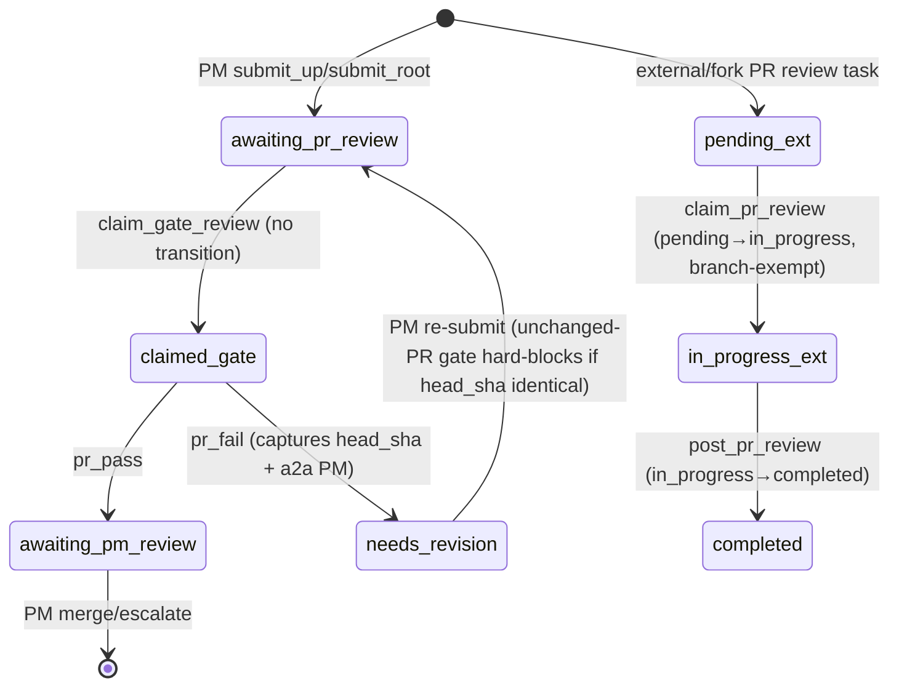

## Purpose
The two choreographer mixins that implement the PR-reviewer's two distinct surfaces: the in-path assembled-PR gate (PRGateMixin: claim_gate_review / pr_pass / pr_fail between a PM's submit and merge) and the inbound external/fork PR review (PRReviewerMixin: claim_pr_review / post_pr_review, read-only, posts one change-request and completes). Both are mixed into the composed Choreographer and route through the spec gate + verb runner, returning standardized Envelopes.

## Files

| Path | Role | LOC |
|---|---|---|
| /Users/renzof/Documents/GitHub/ZZZ/roboco-master/roboco/roboco/services/gateway/choreographer/pr_gate.py | PRGateMixin — in-path assembled-PR gate verbs (claim_gate_review, pr_pass, pr_fail) and their helpers | 626 |
| /Users/renzof/Documents/GitHub/ZZZ/roboco-master/roboco/roboco/services/gateway/choreographer/pr_review.py | PRReviewerMixin — inbound external/fork PR review verbs (claim_pr_review, post_pr_review) + module-level resolve_task_project_slug | 601 |

## Key Symbols

| Name | Kind | File:Line | Responsibility |
|---|---|---|---|
| PRGateMixin | class | roboco/services/gateway/choreographer/pr_gate.py:40 | Mixin: in-path assembled-PR gate verbs (claim_gate_review/pr_pass/pr_fail) + helpers; inherits ChoreographerHelpers only under TYPE_CHECKING |
| PRGateMixin.claim_gate_review | method | roboco/services/gateway/choreographer/pr_gate.py:43 | Reviewer claims an awaiting_pr_review task without transitioning it (status stays awaiting_pr_review); returns assembled PR diff inline as evidence |
| PRGateMixin.pr_pass | method | roboco/services/gateway/choreographer/pr_gate.py:115 | Pass the assembled PR: awaiting_pr_review → awaiting_pm_review; delegates to _gate_decision |
| PRGateMixin.pr_fail | method | roboco/services/gateway/choreographer/pr_gate.py:123 | Fail the assembled PR with concrete issues → needs_revision; rejects empty issues list, formats issues into notes, delegates to _gate_decision |
| PRGateMixin._gate_preflight | method | roboco/services/gateway/choreographer/pr_gate.py:148 | Ownership + role + spec gate (with self_review_block via actor_slug/original_developer_slug) + free-text soup guard for pr_pass/pr_fail; returns rejection Envelope or (t,agent,role_str,briefing,spec_ctx) |
| PRGateMixin._record_gate_verdict_for | method | roboco/services/gateway/choreographer/pr_gate.py:229 | Author the canonical pr_review verdict note before the transition; on pr_fail also capture the assembled PR head SHA for the unchanged-PR gate; on pr_pass with ci_note, stamp the ci_status field into the verdict with evidence the CI guard ran |
| PRGateMixin._post_gate_review | method | roboco/services/gateway/choreographer/pr_gate.py:245 | Post the gate verdict to the PR itself (best-effort, after the DB transition); resolves reviewer slug |
| PRGateMixin._deliver_pr_fail_to_owner | method | roboco/services/gateway/choreographer/pr_gate.py:253 | a2a the pr_fail change-requests to the owning PM (best-effort) with a Main-PM-root steer to re-delegate not re-submit; closes the blind re-submit loop |
| PRGateMixin._gate_decision | method | roboco/services/gateway/choreographer/pr_gate.py:292 | Shared body for pr_pass/pr_fail: preflight + tracing + pr_pass blocked guards + record verdict + run_intent + None-guard for concurrent transition + post-PR + a2a on fail |
| PRGateMixin._pr_pass_blocked | method | roboco/services/gateway/choreographer/pr_gate.py:373 | Refuse pr_pass on a broken toolchain, block-level convention violation, or non-green CI on the assembled PR's head commit; returns (rejection_envelope, ci_note). Both toolchain and conventions guards inert when their flags are off; CI guard fails open on configuration gaps |
| PRGateMixin._ci_status_guard | method | roboco/services/gateway/choreographer/pr_gate.py:520 | Refuse pr_pass unless CI on the assembled PR's head commit is green. Failing/pending/unscheduled/error CI blocks with reviewer-aware remediation pointing at pr_fail; a project with no CI configured passes through cleanly with an evidence stamp |
| PRGateMixin._resolve_ci_status | method | roboco/services/gateway/choreographer/pr_gate.py:480 | Best-effort CI-status lookup for the assembled PR's head commit; returns None on any configuration gap or lookup failure so the guard fails open |
| PRGateMixin._record_gate_verdict | method | roboco/services/gateway/choreographer/pr_gate.py:403 | Persist the gate verdict as the canonical pr_review structured note (passed/failed), with issues slot for pr_fail, head_sha stamp for pr_fail, and ci_status evidence on pr_pass; best-effort (ContentValidationError logged not raised) |
| PRGateMixin._capture_pr_head_sha | method | roboco/services/gateway/choreographer/pr_gate.py:468 | Best-effort capture of the assembled PR head SHA at pr_fail time via _project_slug_for + git.get_pr_head_sha; returns None on any failure (fail-open) |
| PRGateMixin._post_gate_review_to_pr | method | roboco/services/gateway/choreographer/pr_gate.py:502 | Post APPROVE/REQUEST_CHANGES on cell→root PRs; always COMMENT on root→master (only CEO merges master); best-effort |
| PRGateMixin._gate_role_or_rejection | method | roboco/services/gateway/choreographer/pr_gate.py:545 | Parse the role enum from role_str or return a not_authorized rejection Envelope |
| PRGateMixin._gate_tracing | method | roboco/services/gateway/choreographer/pr_gate.py:569 | Tracing gate for pr_pass/pr_fail: requires journal:learning entry + substantive pr_reviewer_notes (notes threaded via SimpleNamespace shim) |
| PRGateMixin._re_stamp_pr_fail_head_sha_if_advanced | method | roboco/services/gateway/choreographer/pr_gate.py:255 | Re-capture the PR head SHA AFTER the transition commits and re-stamp the verdict note only if it advanced past the pre-transition capture (#189 fix for stale-SHA false-allow loop) |
| PRGateMixin._gate_review_event_verdict | staticmethod | roboco/services/gateway/choreographer/pr_gate.py:555 | Map gate verb → (review event, verdict label): pr_pass → APPROVE/PASSED, pr_fail → REQUEST_CHANGES/CHANGES REQUESTED — both downgraded to COMMENT on root→master (is_root) |
| PRGateMixin._gate_review_body | staticmethod | roboco/services/gateway/choreographer/pr_gate.py:568 | Render the gate-review comment body posted to the assembled PR (includes CEO-only footer for root→master PRs) |
| PRGateMixin._build_gate_review_evidence | method | roboco/services/gateway/choreographer/pr_gate.py:697 | Inline evidence for claim_gate_review: assembled branch diff + pr_number/pr_url + acceptance_criteria + is_assembled_pr |
| PRReviewerMixin | class | roboco/services/gateway/choreographer/pr_review.py:44 | Mixin: inbound external/fork PR review verbs (claim_pr_review/post_pr_review) + helpers; read-only, never checks out contributor code |
| PRReviewerMixin.claim_pr_review | method | roboco/services/gateway/choreographer/pr_review.py:47 | Reviewer claims an external-PR review task (pending→in_progress via task.pr_review_claim, branch-gate exempt); returns contributor diff inline read-only |
| PRReviewerMixin._build_pr_review_content | staticmethod | roboco/services/gateway/choreographer/pr_review.py:124 | Validate summary+findings+event into a PrReviewContent via validate_content, or return an invalid_state Envelope |
| PRReviewerMixin._resolve_post_body | method | roboco/services/gateway/choreographer/pr_review.py:149 | Resolve the GitHub comment body: canonical render when findings given (and stored structured), else free-text body; Envelope on malformed findings |
| PRReviewerMixin._is_hand_formatted_verdict | staticmethod | roboco/services/gateway/choreographer/pr_review.py:163 | True when a free-text body carries verdict/section markdown headers (## summary/issues/verdict/findings) the system would otherwise generate |
| PRReviewerMixin._post_review_side_effects | method | roboco/services/gateway/choreographer/pr_review.py:180 | Post the review to GitHub + send external-pr-reviewed CEO notification (both best-effort, after DB transition) |
| PRReviewerMixin.post_pr_review | method | roboco/services/gateway/choreographer/pr_review.py:211 | Post ONE change-request to the PR and finish the review task (in_progress→completed); content gates pre-side-effect, side-effects post-transition |
| PRReviewerMixin._post_pr_review_preflight | method | roboco/services/gateway/choreographer/pr_review.py:290 | Pre-runner guards for post_pr_review: non-empty body, role, spec gate, tracing gate; returns (agent,role_str,briefing,spec_ctx) or rejection |
| PRReviewerMixin._verdict_consistency_gate | method | roboco/services/gateway/choreographer/pr_review.py:343 | Reject a self-contradicting (event, findings) pair via pr_review_conflict pure invariant; runs before any side effect |
| PRReviewerMixin._post_pr_review_content_gates | method | roboco/services/gateway/choreographer/pr_review.py:376 | Folded content gates: verdict consistency then no-hand-formatted-body guard (only when no findings); returns first rejection or None |
| PRReviewerMixin._resolve_role | method | roboco/services/gateway/choreographer/pr_review.py:442 | Parse role enum or return not_authorized rejection Envelope |
| PRReviewerMixin._runner_failure | method | roboco/services/gateway/choreographer/pr_review.py:466 | Shared rejection envelope for a verb-runner failure |
| PRReviewerMixin._build_pr_review_evidence | method | roboco/services/gateway/choreographer/pr_review.py:488 | Inline evidence for claim_pr_review: PR unified diff via git.get_pr_diff (read-only) + pr_number/pr_url + is_external_pr |
| PRReviewerMixin._pr_review_tracing_gate | method | roboco/services/gateway/choreographer/pr_review.py:501 | Tracing gate for post_pr_review: journal:learning entry + substantive pr_reviewer_notes (body threaded via SimpleNamespace shim) |
| PRReviewerMixin._project_slug_for | method | roboco/services/gateway/choreographer/pr_review.py:545 | Resolve project slug for a task; delegates to module-level resolve_task_project_slug |
| resolve_task_project_slug | function | roboco/services/gateway/choreographer/pr_review.py:555 | Module-level slug resolver shared with _impl.py unchanged-PR gate: project_id → product first distinct project → cell_projects first distinct project |

## Data Flow
Both mixins are composed into the Choreographer and invoked by the flow MCP server (roboco-flow) when a pr_reviewer agent calls a verb. Inputs: reviewer_agent_id + task_id (+ notes/issues for verdicts, + body/event/findings for post_pr_review). Each verb fetches the task (self.task.get), resolves the agent role (self.task.agent_for), builds a briefing (self._briefing_for), runs the spec gate (spec_module.can_invoke_intent) and claim guards (self._run_claim_guards), then either calls a service claim (self.task.pr_gate_claim / pr_review_claim — claim WITHOUT transition for the gate, pending→in_progress for external) or the verb runner (self._verb_runner().run_intent) for the transition. Gate verdicts are authored as structured pr_review notes (apply_structured_note) BEFORE the transition and posted to the GitHub PR AFTER (self.git.post_pr_review); pr_fail also captures the PR head SHA (self.git.get_pr_head_sha) and a2a's the owning PM (self.a2a.send). Outputs: standardized Envelope (ok with status/next/evidence/context_briefing, or error with remediate). Callers: the flow verb dispatcher + HTTP routes /api/v1/flow/pr_reviewer/*. Callees: TaskService (get/agent_for/pr_gate_claim/pr_review_claim), JournalService (has_learning_for_task), GitService (diff/get_pr_diff/get_pr_head_sha/post_pr_review), NotificationService, A2AService, ProjectService/ProductService (via resolve_task_project_slug), foundation policy (lifecycle.can_invoke_intent, tracing.check_requirements, content.validate_content/markers).

## Mermaid


## Logical Tree
```
pr-gate-review slice
├── PRGateMixin (in-path assembled-PR gate)
│   ├── claim_gate_review — claim without transition + assembled diff evidence
│   ├── pr_pass — awaiting_pr_review → awaiting_pm_review
│   ├── pr_fail — awaiting_pr_review → needs_revision (issues required)
│   └── helpers
│       ├── _gate_decision — shared body (preflight→tracing→blocked→record→run_intent→None-guard→post→a2a)
│       ├── _gate_preflight — ownership/role/spec-gate (self_review_block) + soup guard
│       ├── _gate_tracing — journal:learning + pr_reviewer_notes min chars
│       ├── _pr_pass_blocked — toolchain-broken + conventions block + CI-status guards (returns rejection, ci_note)
│       ├── _ci_status_guard — refuse pr_pass on failing/pending/unscheduled/error CI with retryable frames
│       ├── _resolve_ci_status — best-effort GitHub check-runs lookup for PR head SHA (fails open)
│       ├── _record_gate_verdict_for / _record_gate_verdict — structured pr_review note (+ issues + head_sha + ci_status)
│       ├── _re_stamp_pr_fail_head_sha_if_advanced — re-capture head SHA post-transition and re-stamp verdict note if advanced (#189)
│       ├── _capture_pr_head_sha — best-effort PR head SHA for unchanged-PR gate
│       ├── _post_gate_review / _post_gate_review_to_pr — PR review post (COMMENT on root→master or MegaTask root-subtask)
│       ├── _gate_review_event_verdict / _gate_review_body — static helpers for post_gate_review_to_pr (extracted in 536bbb64)
│       ├── _deliver_pr_fail_to_owner — a2a change-requests to owning PM (+ Main-PM-root steer)
│       ├── _gate_role_or_rejection — role enum parse
│       └── _build_gate_review_evidence — assembled diff + AC
└── PRReviewerMixin (inbound external/fork PR review)
    ├── claim_pr_review — pending→in_progress (branch-exempt) + read-only diff evidence
    ├── post_pr_review — in_progress→completed, one change-request
    └── helpers
        ├── _post_pr_review_preflight — non-empty body/role/spec-gate/tracing
        ├── _post_pr_review_content_gates — verdict consistency + no-hand-format
        ├── _verdict_consistency_gate — pr_review_conflict pure invariant
        ├── _is_hand_formatted_verdict — detect ## headers in free-text body
        ├── _resolve_post_body — canonical render vs free-text
        ├── _build_pr_review_content — validate_content into PrReviewContent
        ├── _post_review_side_effects — GitHub post + CEO notify
        ├── _pr_review_tracing_gate — journal:learning + notes min chars
        ├── _resolve_role / _runner_failure / _build_pr_review_evidence
        ├── _project_slug_for — delegates to module resolver
        └── resolve_task_project_slug (module-level, shared with _impl.py) — project_id → product → cell_projects
```

## Entry Points

| Name | File | Trigger |
|---|---|---|
| claim_gate_review | roboco/services/gateway/choreographer/pr_gate.py | pr_reviewer agent calls flow verb claim_gate_review(task_id) via roboco-flow MCP / POST /api/v1/flow/pr_reviewer/claim_gate_review on an awaiting_pr_review assembled-PR task |
| pr_pass | roboco/services/gateway/choreographer/pr_gate.py | pr_reviewer calls pr_pass(task_id, notes) via roboco-flow / HTTP route after claim_gate_review |
| pr_fail | roboco/services/gateway/choreographer/pr_gate.py | pr_reviewer calls pr_fail(task_id, issues=[...]) via roboco-flow / HTTP route after claim_gate_review |
| claim_pr_review | roboco/services/gateway/choreographer/pr_review.py | pr_reviewer calls claim_pr_review(task_id) via roboco-flow / HTTP route on a pending external/fork-PR review task |
| post_pr_review | roboco/services/gateway/choreographer/pr_review.py | pr_reviewer calls post_pr_review(task_id, body, event, findings?) via roboco-flow / HTTP route to post one change-request and complete |

## Config Flags
- ROBOCO_TOOLCHAIN_MATCH_ENABLED (gates _toolchain_broken_guard in _pr_pass_blocked — inert when off)
- ROBOCO_CONVENTIONS_ENABLED (gates _conventions_guard in _pr_pass_blocked — inert when off)
- ROBOCO_PR_REVIEWER_NOTES_MIN_CHARS / settings.pr_reviewer_notes_min_chars (tracing gate substantive-note threshold for pr_pass/pr_fail/post_pr_review)
- CI-status guard is always armed when the toolchain can reach get_pr_ci_status via git service; fails open on any configuration gap or lookup failure so a misconfigured project's CI is silently not enforced (never blocks pr_pass)


## Gotchas
- self_review_block is dormant by design: markers.get_original_developer is never set on assembled coordination tasks (only on dev-leaf tasks at QA/doc claim), and GatewayAgentView carries no slug so actor_slug was previously always None. The fix sets actor_slug=str(reviewer_agent_id) so the gate is wired, but it only fires if the marker were ever set to the reviewer's UUID — currently never. Don't assume the self-review defense is active in production today.
- pr_fail captures the PR head SHA BEFORE the DB transition commits (_record_gate_verdict_for runs before run_intent). If the branch advances between capture and transition the recorded SHA is stale, but the unchanged-PR gate in submit_root fails open on stale/missing SHA — only the exact-unchanged case is hard-blocked.
- _gate_decision guards t is None after run_intent: a concurrent cancel or racing reviewer between the precondition gate and the runner's final action makes run_intent return None; without this guard the post-PR/a2a dereferences would crash. Any future reorder must preserve this check.
- _post_gate_review_to_pr always posts COMMENT (not APPROVE/REQUEST_CHANGES) on a root→master PR because only the CEO merges master. A root→master PR is now identified by `is_root = parent_task_id is None OR is_batch_root_subtask(batch_id, parent_task_id)` — so a MegaTask root-subtask (which has a parent = the umbrella but opens its own root→master PR) also gets COMMENT, not APPROVE. A non-batch cell-PM coordination root keeps batch_id=None so it remains a cell→root PR (APPROVE/REQUEST_CHANGES). Added in f90565ea.
- resolve_task_project_slug cell_projects branch sorts by m.team.value — assumes every cell_map mapping has a non-None team with a .value; a malformed mapping would raise AttributeError (uncaught) and bubble out of the slug resolver (which callers tolerate as best-effort None only if wrapped — _capture_pr_head_sha wraps it, _post_gate_review_to_pr does NOT wrap the slug call).
- _is_hand_formatted_verdict (UPDATED in 536bbb64 #188): previously a plain lower-case substring match that would false-refuse a body quoting a PR's own ## headers (e.g. `> ## Summary`); now uses a regex anchored to line-start (`^[ \t]*## ...`, re.MULTILINE) so a quoted/indented header or a mid-prose mention does not trip the guard. The remaining false-positive window: a reviewer deliberately writing `## Summary` at the start of a line in their free-text body (with findings=[]) — intentionally refused, steering them to the structured-findings path.
- _record_gate_verdict for pr_fail with issues now writes a templated summary ('In-path PR-review gate requested changes - N issue(s) listed below.') instead of the full notes into the structured note's summary field; the full issues text lives in the issues slot. The GitHub PR post and a2a still use the raw notes string. Readers of notes_structured.pr_review.summary no longer get the verbatim issues.
- claim_gate_review does NOT transition the task (status stays awaiting_pr_review) — this is intentional so pr_pass/pr_fail's source-status still matches. A reviewer who claims but never decides leaves the task assigned but still awaiting_pr_review; the stale-claim reaper path is the recovery.
- PRReviewerMixin.post_pr_review runs content gates BEFORE _resolve_post_body, but _resolve_post_body itself can return an Envelope (malformed findings) which is then handled — the verdict_consistency_gate already ran on the (event, findings) pair, so a malformed-findings Envelope is a distinct later failure.
- resolve_task_project_slug was extracted to module-level specifically so _impl.py's _LegacyChoreographer (which does NOT inherit ChoreographerHelpers) can reach it; the mixin method _project_slug_for is now a one-line delegate. Changing the resolver signature would break both the mixin and the _impl.py unchanged-PR gate.


## Drift from CLAUDE.md
- CLAUDE.md verb table lists pr_reviewer verbs as 'claim_pr_review, post_pr_review (inbound external/fork PRs), claim_gate_review, pr_pass, pr_fail (in-path assembled-PR gate)' — matches the code exactly. No drift.
- CLAUDE.md says the pr_reviewer 'posts its change-request on the PR itself (no agent comms)'. The code now ALSO a2a's pr_fail change-requests to the owning PM (_deliver_pr_fail_to_owner) — an additive agent-comms side effect NOT reflected in CLAUDE.md's 'no agent comms' claim for the in-path gate. This is intentional (closes the blind re-submit loop) but the doc still says no agent comms.
- CLAUDE.md does not mention the pr_fail head_sha capture / unchanged-PR submit_root gate (the 2026-06-27 pr_fail loop fix) anywhere — it's a live behavioral guarantee absent from the doc.


## Changes Since Baseline

| SHA | Subject | Impact |
|---|---|---|
| 15effce0 | Chore: 141 Gaps fill-in (#283) — pr_gate.py: wire self_review_block for pr_pass/pr_fail | _gate_preflight spec_ctx now passes actor_slug=str(reviewer_agent_id) and original_developer_slug=markers.get_original_developer(t) instead of agent.slug (always None for GatewayAgentView). Self-review defense is now wired, though dormant because the marker is never set on assembled coordination tasks. |
| 15effce0 | Chore: 141 Gaps fill-in (#283) — pr_gate.py: capture pr_fail head_sha into verdict note | New _record_gate_verdict_for + _capture_pr_head_sha stamp the assembled PR head SHA into notes_structured.pr_review.head_sha on pr_fail, feeding the submit_root unchanged-PR hard-block gate. Fail-open on any capture failure. |
| 15effce0 | Chore: 141 Gaps fill-in (#283) — pr_gate.py: a2a pr_fail to owning PM + Main-PM-root steer | New _deliver_pr_fail_to_owner sends the pr_fail change-requests to the assigned PM via a2a (best-effort) with a steer for Main-PM branch-bearing roots to re-delegate not re-submit. Closes the blind re-submit loop (PR #138). |
| 15effce0 | Chore: 141 Gaps fill-in (#283) — pr_gate.py: None-guard after run_intent for concurrent transition | _gate_decision now checks t is None after runner.run_intent and returns a clean invalid_state envelope instead of dereffing None → 500. Covers concurrent cancel / racing reviewer between precondition gate and final action. |
| 15effce0 | Chore: 141 Gaps fill-in (#283) — pr_gate.py: _toolchain_broken_guard now reviewer=True | _pr_pass_blocked passes reviewer=True to _toolchain_broken_guard (signature widened to distinguish reviewer context). pr_pass still refused on broken toolchain; pr_fail unaffected. |
| 15effce0 | Chore: 141 Gaps fill-in (#283) — pr_gate.py: structured verdict note carries issues + head_sha | _record_gate_verdict payload now includes issues list for pr_fail and head_sha; summary for pr_fail-with-issues is a templated sentence instead of the full notes (dedup on the Task Details card). |
| 15effce0 | Chore: 141 Gaps fill-in (#283) — pr_review.py: extract module-level resolve_task_project_slug + cell_projects fallback | _project_slug_for delegates to new module-level resolve_task_project_slug (shared with _impl.py unchanged-PR gate); adds a third fallback branch for ad-hoc per-cell-map root-subtasks (migration 052) so the gate verdict reaches the PR in the mapped repo. |
| 15effce0 | Chore: 141 Gaps fill-in (#283) — pr_review.py: hand-formatted-verdict body guard | New _is_hand_formatted_verdict + _post_pr_review_content_gates refuse a free-text body carrying ## summary/issues/verdict/findings headers when findings is empty, steering the reviewer to the structured-findings path. Observed live: a duplicated self-formatted verdict posted to a contributor's PR. |
| 15effce0 | Chore: 141 Gaps fill-in (#283) — pr_review.py: fold content gates into one helper | post_pr_review now calls _post_pr_review_content_gates (verdict consistency + no-hand-format) instead of only _verdict_consistency_gate; keeps the verb body under the return-count lint ceiling. |

> Post-snapshot updates (since 2026-06-29): two commits touched this slice.
> - **536bbb64** (Chore/all/logical gaps sweep #286, 2026-06-30): pr_gate.py — (a) `_post_gate_review_to_pr` wraps slug-resolution in try/except so a malformed cell_map mapping can no longer 500 the reviewer after a committed gate transition (#82 FIXED); (b) `_is_hand_formatted_verdict` regex anchored to line-start so quoted/indented PR headers no longer false-refuse post_pr_review (#188 FIXED); (c) `_re_stamp_pr_fail_head_sha_if_advanced` new method — re-captures head SHA after the transition commits and re-stamps the verdict note only if it advanced, closing the stale-SHA false-allow window (#189 FIXED); (d) `claim_gate_review` passes `skip_dev_guards=True` to `_run_claim_guards` so already_active/paused/lane guards never block a pr_reviewer from claiming a gate review (#192 FIXED); (e) two new static helpers extracted from `_post_gate_review_to_pr`: `_gate_review_event_verdict` and `_gate_review_body`. The unchanged-PR guard's fail-open slug/git error now logs a warning so a regression cannot silently disable the loop-stopper (#5/#222).
> - **f90565ea** ([sweep] pr_gate: classify MegaTask root-subtask as root #608, 2026-06-30): `_post_gate_review_to_pr` now uses `is_batch_root_subtask` (imported from `roboco.foundation.policy.batch`) in addition to `parent_task_id is None` to identify root→master PRs. A MegaTask root-subtask (parent=umbrella, batch_id set) opens its own root→master PR but previously got APPROVE/REQUEST_CHANGES instead of COMMENT — fix prevents a single-approval branch-protection rule from allowing a non-CEO merge.

## Regression Risks

| Title | File:Line | Claim | Severity |
|---|---|---|---|
| CI-status guard reads GitHub check-runs only, not legacy commit-status API | roboco/services/gateway/choreographer/pr_gate.py:520 | _ci_status_guard and get_pr_ci_status read only the check-runs API endpoint. A repo whose only CI signal is the legacy commit-status API would show zero check-runs and be classified as no_ci_configured (passes through). Noted as ponytail-comment in git.py with the upgrade path if a project ever needs it. | low |
| CI-status guard fails open on project/token/head-sha resolution gaps | roboco/services/gateway/choreographer/pr_gate.py:480 | _resolve_ci_status returns None on any unresolvable configuration gap (missing project, git_url, token, or PR head SHA), so the guard never blocks pr_pass on a misconfigured project. By design: network-isolation or stale-config should not wedge the gate. A deliberately misconfigured project's CI is silently not enforced. | low |
|---|---|---|---|
| self_review_block could fire if a reviewer is also the original developer | roboco/services/gateway/choreographer/pr_gate.py:202 | actor_slug=str(reviewer_agent_id) + original_developer_slug=markers.get_original_developer(t). The comment asserts dormancy because the marker is never set on assembled coordination tasks. If a future change sets the marker on an assembled task (or a reviewer UUID coincides with the recorded dev UUID), pr_pass/pr_fail would be refused as self-review with no remediate path. The defense is correctly wired but unguarded by a test asserting dormancy. | low |
| ~~resolve_task_project_slug cell_projects branch can raise AttributeError on malformed mapping~~ **FIXED 536bbb64 #82** | roboco/services/gateway/choreographer/pr_review.py:594 | ~~sorted(cell_map, key=lambda m: m.team.value) assumes every mapping has a non-None team with .value. _capture_pr_head_sha wraps the slug call in try/except (fail-open), but _post_gate_review_to_pr calls self._project_slug_for(t) WITHOUT a try/except — a malformed cell_map mapping would raise and abort the verdict PR post (best-effort but the exception escapes the helper, caught only by the outer try in _post_gate_review_to_pr's git.post_pr_review call, NOT the slug resolution).~~ _post_gate_review_to_pr now wraps the slug-resolve call in its own try/except (mirrors _capture_pr_head_sha) — a malformed mapping logs and returns, no longer 500s the reviewer after the committed gate transition. The underlying AttributeError possibility in resolve_task_project_slug remains but is contained. | medium |
| ~~_is_hand_formatted_verdict false-positive on summaries quoting PR-added headers~~ **FIXED 536bbb64 #188** | roboco/services/gateway/choreographer/pr_review.py:174 | ~~Substring match on '## summary'/'## issues'/'## verdict'/'## findings' in lowercased body. A reviewer summarizing a PR that itself adds a '## Summary' section (quoting it in the body) with findings=[] would be falsely refused.~~ Regex now anchored to line-start (^[ \t]*## ..., re.MULTILINE) — quoted headers (> ## Summary) and mid-prose mentions no longer trip the guard. | low |
| ~~pr_fail head_sha captured before transition may be stale vs the committed verdict~~ **FIXED 536bbb64 #189** | roboco/services/gateway/choreographer/pr_gate.py:240 | ~~_record_gate_verdict_for awaits _capture_pr_head_sha (GitHub pulls API) then writes the note, all before run_intent commits the transition. If the assembled PR advances between capture and the transition commit, the recorded SHA no longer matches the PR head at the moment of needs_revision.~~ New `_re_stamp_pr_fail_head_sha_if_advanced` re-captures the SHA after run_intent commits and re-stamps the note only if it advanced; no-advance is a single write. Fail-open: a re-capture failure leaves the pre-transition SHA in place. | low |
| Structured pr_review summary no longer contains verbatim issues for pr_fail | roboco/services/gateway/choreographer/pr_gate.py:444 | _record_gate_verdict now writes a templated summary for pr_fail-with-issues instead of the full notes. Any consumer that parsed notes_structured.pr_review.summary for the change-request text (rather than .issues) now gets a generic sentence. The a2a body and GitHub PR post still use raw notes, but briefing/mirror readers of the summary field lose the verbatim issues. | low |
| _deliver_pr_fail_to_owner a2a to assigned PM may target the wrong agent after a reassign | roboco/services/gateway/choreographer/pr_gate.py:267 | a2a.send to_agent=t.assigned_to at the moment pr_fail runs. If the task was reassigned between claim_gate_review and pr_fail, the change-requests go to the new assignee, not the reviewer who claimed it. Best-effort and the assigned PM is the intended recipient, but a just-reassigned PM with no context receives raw review issues. | low |
| ~~claim_gate_review runs _run_claim_guards but the gate task is not a normal claim~~ **FIXED 536bbb64 #192** | roboco/services/gateway/choreographer/pr_gate.py:84 | ~~_run_claim_guards is invoked for claim_gate_review (which does NOT transition). If a claim guard (e.g. already_active / lane barrier) rejects, the reviewer cannot claim the gate review.~~ `_run_claim_guards` is now called with `skip_dev_guards=True` — the already_active, paused, and lane barriers are skipped for claim_gate_review; only the dependency guard is kept. A pr_reviewer with another active task is no longer blocked from claiming a gate review. | low |

## Health
The slice is well-structured and defensively hardened. Both mixins follow the established choreographer pattern (TYPE_CHECKING-only base, spec gate + tracing gate + verb runner, best-effort side-effects after the DB transition, standardized Envelopes). The 15effce0 changes are coherent: the pr_fail loop is closed at three layers (head_sha capture + submit_root hard-block, a2a to owning PM, Main-PM-root steer), the concurrent-transition None-guard plugs a real crash, and the external-PR hand-format guard addresses an observed live defect. Post-snapshot (536bbb64 + f90565ea) hardening: the slug-resolution AttributeError in _post_gate_review_to_pr is now contained by try/except (#82 FIXED), the hand-format guard is now regex-anchored-to-line-start instead of substring (#188 FIXED), the stale-SHA false-allow window is closed by the post-transition re-stamp (#189 FIXED), the pr_reviewer active-task guard is skipped for claim_gate_review (#192 FIXED), and MegaTask root-subtasks correctly get COMMENT on their root→master PR. The main remaining latent concern is the self_review_block dormancy (correctly wired, no test asserting dormancy — low, no known path to activate). Coverage and tracing parity with QA's pass_review/fail_review is maintained.
