# Slice Map — product-strategy-research-pitch

## Purpose

The product / strategy / research / pitch slice covers the "company layer" above the delivery lifecycle: registering the git repositories agents work on (`Project`), mapping cells to repos within a product (`Product`), rendering role-specific kanban views (`Kanban`), the singleton company charter (`CompanyGoals`), the dormant goal-drift watcher (`StrategyEngine`), the pluggable web-search capability for Board/PM agents (`Research` + `ResearchQuota`), Board pitches with CEO-approve → auto-provision (`Pitch`), and the single GitHub repo-creation service that backs provisioning (`GitHubProvisioning`). Together these are the CEO/Board-facing surface that originates work and feeds it into the normal delivery lifecycle, plus the per-cell routing keystone that the gateway delegate path consults at runtime.

## Files

| Path | Role | approx LOC |
|------|------|------------|
| `roboco/services/project.py` | CRUD + git-token encryption + cell access control for Projects (git repos) | 604 |
| `roboco/services/product.py` | Product CRUD + per-cell `project_for` routing resolver + idempotent cell-map replace | 152 |
| `roboco/services/kanban.py` | Role-specific kanban board views (dev/qa/documenter/pm/main-pm/board) from task data | 587 |
| `roboco/services/company_goals.py` | CRUD for the singleton company charter (north star + objectives + constraints + policy) | 83 |
| `roboco/services/strategy_engine.py` | Dormant "engine 2": assesses company state vs goals, notify-only to CEO | 111 |
| `roboco/services/research.py` | Pluggable web-search/fetch — provider adapters (Tavily/Brave/Exa/Null) + clamping service | 431 |
| `roboco/services/research_quota.py` | Per-agent UTC-daily Redis quota counter for research calls (fail-open) | 78 |
| `roboco/services/pitch.py` | Board pitch CRUD + CEO approve → provision repos/Projects(+Product) + seed Main-PM task | 274 |
| `roboco/services/github_provisioning.py` | The only service that CREATES GitHub repos (POST `/orgs/{org}/repos`) | 174 |
| `roboco/services/roadmap_engine.py` | Dormant weekly engine: originates ONE held roadmap-exploration task for the Product Owner (default off) | 111 |
| `roboco/services/roadmap_service.py` | CEO's per-item approve/reject glue over a held roadmap cycle; approve materializes a BACKLOG task | 211 |
| `roboco/api/routes/roadmap.py` | CEO-only routes: list open cycles, approve/reject one item | 124 |
| `roboco/services/x_engine.py` | Dormant "engine 4": drafts X (Twitter) release posts (event hook), mention replies (poll), and — new — feature-spotlight explorations (dormant interval, spawns Head of Marketing), ALL held for CEO approval (default off) | 463 |
| `roboco/services/x_post_service.py` | CEO's approve/reject over a held X draft; approve posts via a Redis single-flight lock, idempotent | 223 |
| `roboco/services/x_client.py` | OAuth 1.0a HMAC-SHA1 X API client (`LiveXClient`) + `NullXClient` (no creds, never egresses) + `build_x_client` factory | 318 |
| `roboco/services/x_credentials.py` | Singleton Fernet-encrypted OAuth 1.0a credential CRUD; decrypts server-side only | 140 |
| `roboco/api/routes/x.py` | CEO-only routes: list open X posts, approve/reject one draft | 164 |
| `roboco/api/schemas/x.py` | `XPostResponse` + `XMentionRefModel` / `XFeatureRefModel` response shapes | 73 |

## Key Symbols

| Name | Kind | File:Line | Responsibility |
|------|------|-----------|----------------|
| `ProjectService` | class | project.py:23 | Project CRUD, slug lookup, cell listing, workspace path, git-token encrypt/decrypt, agent access control |
| `ProjectService._assert_git_url_allowed` | method | project.py:40 | Reject `git_url` matching a protected/denylisted repo |
| `ProjectService.create` | method | project.py:56 | Register project, encrypt token, best-effort conventions scaffold |
| `ProjectService._maybe_scaffold_conventions` | method | project.py:126 | Lazy-imports conventions service; scaffold hiccup is non-fatal |
| `ProjectService.update` | method | project.py:166 | Selective field apply; empty-string `git_token` clears, None leaves unchanged |
| `ProjectService.delete` | method | project.py:226 | Abandons ACTIVE work sessions first; optional on-disk workspace cleanup; DB RESTRICT on tasks |
| `ProjectService.get_decrypted_token` / `_by_slug` | method | project.py:441 / 471 | On-demand Fernet decrypt of git token (never cached) |
| `ProjectService.check_agent_access` | method | project.py:559 | Cell membership + optional `allowed_agents` allowlist |
| `get_project_service` | factory | project.py:602 | Session-bound constructor |
| `ProductService` | class | product.py:15 | Product CRUD + cell→project routing |
| `ProductService.project_for` | method | product.py:87 | **Per-cell routing keystone** — resolve Project for (product, team); None → caller falls back to parent task's project |
| `ProductService.distinct_project_ids` | method | product.py:103 | Distinct repos a product spans (one Main-PM integration branch each) |
| `ProductService._replace_cells` | method | product.py:122 | Idempotent full cell-map replace via cascade collection; flushes DELETEs before INSERTs to avoid `uq_product_projects_product_team` 409 |
| `get_product_service` | factory | product.py:150 | Session-bound constructor |
| `KanbanService` | class | kanban.py:30 | Role-specific board generation with optional swimlanes |
| `KanbanService._load_subtask_counts` | method | kanban.py:47 | Batch-count direct children per parent in ONE grouped query (fixes the always-0 stub; #198) |
| `KanbanService._task_to_card` | method | kanban.py:61 | Task → KanbanCard; accepts optional `subtask_counts` dict for real subtask counts |
| `KanbanService.get_dev_board` | method | kanban.py:117 | Dev cell board with optional priority/assignee swimlanes |
| `KanbanService.get_qa_board` / `get_documenter_board` / `get_pm_board` | method | kanban.py:335 / 366 / 400 | Role-filtered flat boards |
| `KanbanService.get_main_pm_board` / `_flat` | method | kanban.py:419 / 435 | Cross-cell view (team swimlanes / team columns) |
| `KanbanService.get_board_kanban` | method | kanban.py:538 | Board roadmap (P0/P1 only) |
| `KanbanService.get_board_stats` | method | kanban.py:558 | Status-count aggregation |
| `CompanyGoalsService` | class | company_goals.py:35 | Singleton charter CRUD |
| `SINGLETON_ID` | constant | company_goals.py:23 | Fixed UUID 0…0 — charter is one row |
| `CompanyGoalsService.get` / `upsert` | method | company_goals.py:38 / 44 | Partial-key upsert; caller commits |
| `StrategyEngine` | class | strategy_engine.py:47 | Assess company state vs goals |
| `StrategyEngine.assess` | method | strategy_engine.py:52 | Pure read; emits `idle` + `stranded_blocked` observations |
| `StrategyEngine.run_cycle` | method | strategy_engine.py:92 | No-op unless flag on; assess + notify CEO (notify-only, never spends/builds) |
| `StrategyObservation` | dataclass | strategy_engine.py:38 | Frozen (kind, summary, detail) |
| `ResearchService` | class | research.py:337 | Provider-agnostic entry point; clamps result/char caps |
| `SearchProvider` | ABC | research.py:80 | Adapter base: shared/owned httpx client, `_request_json`, abstract `search`, default-unsupported `fetch` |
| `TavilyProvider` / `BraveProvider` / `ExaProvider` | class | research.py:162 / 212 / 242 | Concrete adapters (Brave has no `fetch`) |
| `NullProvider` | class | research.py:288 | Graceful stub — empty results, `configured=False`, never raises |
| `build_provider` | func | research.py:317 | Select adapter by name; NullProvider when no key or unknown name |
| `get_research_service` | factory | research.py:391 | Build service from settings (provider + caps) |
| `SearchHit` / `SearchOutcome` / `FetchOutcome` | dataclass | research.py:45 / 55 / 65 | Normalised result shapes |
| `ResearchError` / `ResearchUnsupportedError` | exception | research.py:32 / 36 | Provider failure vs unsupported-op (route maps 502 vs 501) |
| `ResearchQuotaTracker` | class | research_quota.py:34 | Per-agent/day Redis `INCR` counter, 24h expiry, fail-open |
| `ResearchQuotaTracker.check_and_consume` | method | research_quota.py:51 | Atomic INCR-then-compare; over-limit still bumps counter |
| `QuotaStatus` | dataclass | research_quota.py:24 | (allowed, used, limit, day) |
| `PitchService` | class | pitch.py:56 | Pitch CRUD + approve/reject |
| `PitchService.approve` | method | pitch.py:109 | Provision repos → register topology → seed Main-PM task; idempotent on re-approval |
| `PitchService._provision_repos` | method | pitch.py:163 | One repo per target cell (multi-cell suffixes cell); reuses existing Project by slug |
| `PitchService._register_topology` | method | pitch.py:201 | Multi-cell → Product (reuse existing by slug + refresh cell map); single-cell → seed project only |
| `PitchService._seed_main_pm_task` | method | pitch.py:234 | Creates PENDING Main-PM CODE task (`source="pitch"`, `confirmed_by_human=True`) |
| `PitchService._proposed_or_raise` | method | pitch.py:152 | 404 if missing, 409 if not `proposed` (no re-deciding) |
| `GitHubProvisioningService` | class | github_provisioning.py:45 | Create private repos in configured org |
| `GitHubProvisioningService.enabled` | prop | github_provisioning.py:67 | True only when master switch + token + org all set |
| `GitHubProvisioningService.create_repo` | method | github_provisioning.py:81 | POST `/orgs/{org}/repos` with `auto_init=true`; handles GitHub 422 "already exists" idempotently via `_fetch_existing_repo` (#83/#84) |
| `GitHubProvisioningService._fetch_existing_repo` | method | github_provisioning.py:140 | GET `org/name` and reconstruct `ProvisionedRepo` — called on 422 to reuse an orphaned repo from a rolled-back prior approval |
| `_GITHUB_REPO_EXISTS_STATUS` | constant | github_provisioning.py:42 | `422` — GitHub's "name already exists" status sentinel |
| `ProvisionedRepo` / `ProvisioningError` / `ProvisioningDisabledError` | dataclass/exc | github_provisioning.py:32 / 23 / 27 | Result + error types |
| `RoadmapEngine` | class | roadmap_engine.py:49 | Dormant "engine 3": mirrors the release-manager "detect → originate a CEO-gated artifact → hold" shape, but the artifact is a cycle the PO *authors*, not a report the engine assembles |
| `RoadmapEngine.run_cycle` | method | roadmap_engine.py:54 | No-op unless `roadmap_engine_enabled`, a cycle is already open (`list_open_roadmap_cycles`), or the RoboCo project isn't resolvable; else opens ONE held PENDING exploration task assigned to the Product Owner |
| `RoadmapService` | class | roadmap_service.py:50 | List / approve / reject items within the open roadmap cycle(s) |
| `RoadmapService.approve_item` | method | roadmap_service.py:59 | Materialize one proposed item as a BACKLOG task via `PrompterService.create_task_from_draft`; idempotent per item |
| `RoadmapService.reject_item` | method | roadmap_service.py:108 | Record the CEO's reason; idempotent; an already-approved item cannot be rejected |
| `RoadmapService._find_item` | method | roadmap_service.py:146 | Resolve (exploration task, deep-copied cycle payload, one item) — deep copy so mutation doesn't poison SQLAlchemy's dirty-check before `markers.set_roadmap_cycle` reassigns |
| `RoadmapService._maybe_complete_cycle` | staticmethod | roadmap_service.py:202 | Completes the exploration task once every item on it is terminal (approved/rejected) |
| `RoadmapItemResult` | dataclass | roadmap_service.py:37 | Outcome of one approve/reject call (status/item_id/materialized_task_id/detail) |
| `get_roadmap_engine` / `get_roadmap_service` | factory | roadmap_engine.py:109 / roadmap_service.py:209 | Session-bound constructors |
| `XEngine` | class | x_engine.py:150 | Dormant "engine 4": mirrors the release-manager "detect → originate a CEO-gated artifact → hold" shape across THREE responsibilities — release posts, mention replies, feature spotlights |
| `XEngine._voice_guide` | method | x_engine.py:173 | Baseline house-voice constant (`_HOM_VOICE`) plus the CEO's `company_goals.brand_voice` sample when set — feeds release/reply prompts AND is the mechanism the HoM identity file points to for its own drafting |
| `XEngine.draft_release_post` | method | x_engine.py:192 | Event-driven hook (called from `ReleaseProposalService.approve`'s publish-success branch); local-model-drafted, deduped per version, capped by `x_max_open_posts` |
| `XEngine.run_cycle` | method | x_engine.py:255 | Periodic mentions poll; no-op unless `x_engine_enabled` AND `x_replies_enabled`; filters bot-like/low-engagement mentions, dedupes by mention id (`XSeenMentionTable`) |
| `XEngine.open_feature_spotlight_exploration` | method | x_engine.py:337 | No-ops unless `x_engine_enabled` AND `x_feature_spotlight_enabled`, no creds, a cycle already open, the open-post cap reached, or project unresolvable; else opens ONE held PENDING exploration task for the Head of Marketing (`source=x_feature_exploration`) carrying a `x_seen_features` marker snapshot |
| `XEngine.materialize_feature_spotlight` | method | x_engine.py:433 | Called from the `propose_feature_spotlight` do-tool: marks the feature slug seen (`XSeenFeatureTable`), creates the held draft (`source=x_feature`, identical shape to a release/reply draft), completes the exploration task |
| `XPostService.approve` | method | x_post_service.py:77 | The ONLY caller of `x_client.post_tweet`; Redis single-flight lock, re-reads task under lock, idempotent on an already-posted draft |
| `XPostService.reject` | method | x_post_service.py:180 | Records the CEO's reason; cancels the held draft |
| `XClient` / `NullXClient` / `LiveXClient` | ABC/class | x_client.py:150 / 166 / 186 | `NullXClient.configured` is False (no creds) — drafting still runs (content nobody can post is a no-op upstream), just never originates; `LiveXClient` signs OAuth 1.0a HMAC-SHA1 |
| `build_x_client` | factory | x_client.py:306 | Returns `LiveXClient` when credentials decrypt, else `NullXClient` |
| `XCredentialsService.set_credentials` / `.get_decrypted` | method | x_credentials.py:61 / 116 | All-or-nothing Fernet-encrypted singleton credential set/clear; decrypts server-side only, never exposed to agents |
| `get_x_engine` | factory | x_engine.py:461 | Session-bound constructor (optional injected `XClient` for tests) |

## Data Flow

Two distinct flows originate work into the delivery lifecycle:

**Pitch flow (CEO-driven origination).** A Board member creates a pitch (`PitchService.create` → `PitchTable` status `proposed`). The CEO approves via `POST /api/pitch/{id}/approve` → `PitchService.approve`. Approval calls `GitHubProvisioningService.create_repo` once per target cell (repo name `{slug}-{cell}` when multi-cell, else `{slug}`), then `ProjectService.create` to register each repo as a Project (git token stored from `settings.provisioning_token`). For multi-cell pitches, `ProductService.create` registers a Product with the cell→project map; for single-cell, the lone project is the seed. `_seed_main_pm_task` then creates a PENDING Main-PM CODE task (`source="pitch"`, `confirmed_by_human=True`) assigned to `main-pm`, which the normal dispatcher picks up. The pitch row moves to `provisioned` with `provisioned_product_id` / `provisioned_project_ids` / `seed_task_id` recorded.

**Strategy flow (dormant watcher).** `Orchestrator._strategy_engine_loop` (created at startup) returns immediately unless `strategy_engine_enabled`; otherwise each `strategy_engine_interval_seconds` it opens a DB context and calls `StrategyEngine.run_cycle` → `assess`. `assess` reads `TaskService.list_in_progress_or_claimed` and `list_long_running_blocked` against `CompanyGoalsService.get()`; if idle-with-goals or stranded-blocked, it sends the CEO an ack-notification via `NotificationService.send_ack_notification`. Notify-only — never originates work.

**Research flow (on-demand agent capability).** A Board/PM agent calls the `roboco-search` MCP tool (mounted only when `research_enabled` and role is research-eligible, orchestrator line 2914) → `/api/research/{search,fetch}` route. The route enforces the per-agent daily quota via the module-level `ResearchQuotaTracker` singleton (Redis INCR, fail-open), then calls `get_research_service()` → `ResearchService.search/fetch` → selected provider adapter. Result count and char size are clamped to `research_max_results` / `research_fetch_max_chars`. The provider key lives only server-side; the agent never egresses.

**Routing flow (runtime keystone).** `ProductService.project_for(product_id, team)` is called from the gateway delegate path to resolve which Project a cell works on within a product; None falls back to the parent task's project.

**Roadmap flow (dormant weekly originator, default off).** `Orchestrator._roadmap_engine_loop` returns immediately unless `roadmap_engine_enabled`; otherwise each `roadmap_interval_seconds` (default weekly) it opens a DB context and calls `RoadmapEngine.run_cycle`, which no-ops if a roadmap-source task is already open or the RoboCo project isn't resolvable, else opens ONE held PENDING exploration task (`source=board_roadmap`, `confirmed_by_human=False`) assigned to the Product Owner. The normal board one-shot dispatch (`_dispatch_roadmap_exploration`) spawns the PO, who explores the charter/releases/metrics/projects and calls the `propose_roadmap` do-tool exactly once with a themed goal + 3-7 item drafts (persisted as an `orchestration_markers` payload). The CEO reviews the cycle in the panel's Roadmap Review Queue and approves/rejects each item individually via `/api/roadmap/cycles/{id}/items/{id}/{approve,reject}` → `RoadmapService`; an approved item materializes as a BACKLOG task (`source=roadmap`) through `PrompterService.create_task_from_draft` — nothing auto-starts, normal PM activation takes it from BACKLOG. Once every item is terminal, the exploration task itself completes.

**X (Twitter) flow (three originators, one held queue, default off).** Unlike every other engine on this page, `XEngine` never spawns an agent for release posts or mention replies — `draft_release_post` (event hook off `ReleaseProposalService.approve`'s publish-success branch) and `run_cycle` (periodic mentions poll, `Orchestrator._x_mentions_poll_loop`) both draft via a raw local-model chat completion, never a cloud LLM. The feature-spotlight half is the exception: `Orchestrator._x_feature_spotlight_loop` (dormant unless BOTH `x_engine_enabled` AND `x_feature_spotlight_enabled`) opens a DB context each `x_feature_spotlight_interval_seconds` and calls `XEngine.open_feature_spotlight_exploration`, which no-ops on the usual guards (creds, one-open-cycle dedup, the shared `x_max_open_posts` cap, project resolvability) or else opens ONE held PENDING exploration task (`source=x_feature_exploration`) assigned to the Head of Marketing, carrying a snapshot of already-covered feature slugs (`x_seen_features` marker). The board dispatcher's `_dispatch_pm_work` special-cases this source (mirroring `ROADMAP_SOURCE`) to call `_dispatch_feature_spotlight_exploration`, a one-shot spawn of the real Head-of-Marketing agent (full read tools) who investigates CHANGELOG.md/feature-flags/docs/map/charter/KB and calls the `propose_feature_spotlight` do-tool exactly once; that verb materializes a brand-new held draft task (`source=x_feature`) and completes the exploration task as a side effect — a deliberate asymmetry from `propose_roadmap`, which instead writes a marker onto the SAME task and leaves it open. Every draft from all three paths — release, reply, spotlight — lands in the identical held-task shape (`TaskTable`, `confirmed_by_human=False`, `assigned_to=secretary-1`, body in `orchestration_markers.x_draft_body`) rendered by the panel's X Post Queue and acted on only by `XPostService.approve`/`.reject`; nothing here ever calls `x_client.post_tweet` itself. `XEngine._voice_guide` (a live `CompanyGoalsService.get()` read, never hardcoded) feeds a baseline house-voice constant plus the CEO's optional `brand_voice` charter sample into every one of the two local-model prompts, and the Head of Marketing's own identity prompt points it at the same charter field for its cloud-LLM-authored spotlight body.

**Read-only views.** `KanbanService` builds role-specific boards from `TaskTable` queries on demand for the kanban API; `CompanyGoalsService.get` is read by the briefing injector into every agent's `context_briefing`.

## Mermaid

```mermaid
flowchart TD
    Board[Board member] -->|create| Pitch[PitchService.create]
    CEO -->|approve /api/pitch/:id/approve| Approve[PitchService.approve]
    Approve --> Prov[GitHubProvisioningService.create_repo]
    Prov --> GH[(GitHub org repos)]
    Approve --> ProjReg[ProjectService.create per cell]
    Approve --> Topo{_register_topology}
    Topo -->|multi-cell| ProdCreate[ProductService.create]
    Topo -->|single-cell| SeedProj[seed_project_id]
    Approve --> Seed[_seed_main_pm_task]
    Seed --> MainPmTask[PENDING Main-PM task source=pitch]
    MainPmTask --> Dispatcher[normal delivery lifecycle]

    subgraph StrategyLoop[dormant — strategy_engine_enabled]
        Loop[Orchestrator._strategy_engine_loop] -->|interval| Cycle[StrategyEngine.run_cycle]
        Cycle --> Assess[assess]
        Assess --> Goals[(CompanyGoalsService.get)]
        Assess --> Tasks[(TaskService list_in_progress / long_running_blocked)]
        Assess -->|notify-only| NotifyCEO[CEO notification]
    end

    subgraph ResearchFlow[on-demand — research_enabled]
        Agent[Board/PM agent] -->|roboco-search MCP| Route[/api/research/]
        Route --> Quota[ResearchQuotaTracker.check_and_consume]
        Quota --> Redis[(Redis INCR/day)]
        Route --> RS[ResearchService]
        RS --> Prov2{"Tavily|Brave|Exa|Null"}
        Prov2 -->|provider API| Web[(Web)]
    end

    subgraph RoadmapLoop[dormant — roadmap_engine_enabled]
        RLoop[Orchestrator._roadmap_engine_loop] -->|interval, default weekly| RCycle[RoadmapEngine.run_cycle]
        RCycle -->|held PENDING task| PO[Product Owner spawn]
        PO -->|propose_roadmap do-tool| Payload[(orchestration_markers cycle payload)]
        CEO -->|approve/reject per item /api/roadmap| RSvc[RoadmapService]
        RSvc -->|approve| Backlog[BACKLOG task via PrompterService]
        RSvc -->|all items terminal| Complete[exploration task completes]
    end

    subgraph XEngineFlow[dormant — x_engine_enabled]
        RelHook[ReleaseProposalService.approve publish] --> XDraftRelease[XEngine.draft_release_post]
        XMentLoop[Orchestrator._x_mentions_poll_loop] -->|interval| XRunCycle[XEngine.run_cycle]
        XDraftRelease --> XChat[local-model chat, _voice_guide]
        XRunCycle --> XChat
        XSpotLoop["Orchestrator._x_feature_spotlight_loop (x_feature_spotlight_enabled)"] -->|interval, default 3d| XOpen[XEngine.open_feature_spotlight_exploration]
        XOpen -->|held PENDING task| HoM[Head of Marketing spawn]
        HoM -->|propose_feature_spotlight do-tool| XMat[XEngine.materialize_feature_spotlight]
        XMat --> XQueue[(held X post/reply/feature draft)]
        XDraftRelease --> XQueue
        XRunCycle --> XQueue
        CEO -->|approve/reject /api/x/posts| XSvc[XPostService]
        XSvc -->|approve, single-flight lock| Tweet[(x_client.post_tweet)]
    end
```



## Logical Tree

```
product-strategy-research-pitch
├── project.py — ProjectService
│   ├── CRUD (create/get/get_by_slug/get_or_raise/update/delete)
│   ├── _assert_git_url_allowed (protected denylist)
│   ├── _maybe_scaffold_conventions (flag-gated, non-fatal)
│   ├── queries (list_all / list_by_cell)
│   ├── workspace (set_workspace_path / update_sync_state)
│   ├── git token (get_decrypted_token / _by_slug) — Fernet, on-demand
│   └── access control (add/remove_allowed_agent / check_agent_access)
├── product.py — ProductService
│   ├── CRUD
│   ├── project_for (per-cell routing keystone)
│   ├── distinct_project_ids (Main-PM integration-branch set)
│   └── _replace_cells (idempotent map replace, DELETE-before-INSERT flush)
├── kanban.py — KanbanService
│   ├── _load_subtask_counts (batch child-count query, fixes always-0 stub)
│   ├── _task_to_card (accepts subtask_counts map)
│   ├── dev board (flat / swimlane by priority|assignee)
│   ├── qa / documenter / pm boards (flat, status-filtered; qa excludes VERIFYING; documenter scoped to task_type=documentation)
│   ├── main-pm board (cross-cell swimlane / flat team columns + Coordination column)
│   ├── board roadmap (P0/P1)
│   └── board stats
├── company_goals.py — CompanyGoalsService (singleton SINGLETON_ID)
│   ├── get (empty defaults if unset)
│   └── upsert (partial-key)
├── strategy_engine.py — StrategyEngine (dormant)
│   ├── assess (idle + stranded_blocked observations)
│   └── run_cycle (flag-gated, notify-only)
├── research.py
│   ├── SearchProvider ABC + Tavily/Brave/Exa/Null adapters
│   ├── ResearchService (clamping entry point)
│   ├── build_provider / get_research_service
│   └── helpers (_as_float / _truncated_fetch)
├── research_quota.py — ResearchQuotaTracker (Redis, fail-open)
│   └── check_and_consume (INCR-then-compare)
├── pitch.py — PitchService
│   ├── CRUD + list_pitches
│   ├── reject / approve
│   ├── _provision_repos (idempotent on re-approval)
│   ├── _register_topology (Product vs seed-project)
│   └── _seed_main_pm_task (PENDING Main-PM task)
├── github_provisioning.py — GitHubProvisioningService
│   ├── enabled (master+token+org)
│   └── create_repo (POST /orgs/{org}/repos, auto_init)
├── roadmap_engine.py — RoadmapEngine (dormant, roadmap_engine_enabled)
│   └── run_cycle (one held exploration task for the Product Owner; one-open-cycle dedup)
├── roadmap_service.py — RoadmapService
│   ├── list_open_cycles
│   ├── approve_item (materialize BACKLOG task, idempotent)
│   ├── reject_item (record reason, idempotent)
│   └── _maybe_complete_cycle (completes exploration task once all items terminal)
├── x_engine.py — XEngine (dormant, x_engine_enabled)
│   ├── _voice_guide (baseline + CEO brand_voice charter sample, live DB read)
│   ├── draft_release_post (event hook; local-model; dedup per version)
│   ├── run_cycle (mentions poll; x_replies_enabled sub-switch; bot/engagement filter)
│   ├── open_feature_spotlight_exploration (x_feature_spotlight_enabled sub-switch; one-open-cycle dedup; seen-features marker)
│   ├── materialize_feature_spotlight (called from propose_feature_spotlight; marks seen, holds draft, completes exploration)
│   └── _originate_post (shared held-task origination, all three sources)
├── x_post_service.py — XPostService
│   ├── approve (single-flight lock, idempotent, only caller of x_client.post_tweet)
│   └── reject (record reason, cancel draft)
├── x_client.py — XClient ABC / NullXClient / LiveXClient
│   └── build_x_client (creds present → LiveXClient, else NullXClient)
└── x_credentials.py — XCredentialsService (singleton, Fernet-encrypted)
    ├── set_credentials (all-or-nothing)
    └── get_decrypted (server-side only)
```

## Dependencies

**Internal (roboco):**
- `roboco.config.settings` — all flags/caps (every file).
- `roboco.services.base.BaseService` — `Project/Product/Kanban/CompanyGoals/Strategy/Pitch` (log + session).
- `roboco.db.tables` — `ProjectTable`, `ProductTable`, `ProductProjectTable`, `TaskTable`, `AgentTable`, `CompanyGoalsTable`, `PitchTable`, `WorkSessionTable`.
- `roboco.models.*` — `ProjectCreate/Update`, `ProductCreate/Update/ProductCellMapping`, `TaskCreateRequest`, `PitchCreate/PitchStatus`, `base` (Team/TaskStatus/TaskType/Complexity/TaskNature), `kanban`.
- `roboco.foundation.identity.Team` (product), `roboco.foundation.policy…` indirectly via task.
- `roboco.utils.crypto` — `encrypt_token`/`decrypt_token`/`EncryptionError` (project).
- `roboco.utils.converters` — `require_uuid`/`to_python_uuid` (kanban, pitch).
- `roboco.services.conventions` — lazy-imported in `ProjectService._maybe_scaffold_conventions`.
- `roboco.services.work_session` — lazy in `ProjectService.delete`.
- `roboco.services.workspace` — lazy in `ProjectService.delete` (delete_workspaces).
- `roboco.services.task` — `StrategyEngine` (`list_in_progress_or_claimed`, `list_long_running_blocked`), `PitchService._seed_main_pm_task`; `RoadmapEngine`/`RoadmapService` (`ROADMAP_SOURCE`/`ROADMAP_ITEM_SOURCE`, `list_open_roadmap_cycles`, `TaskCreateRequest`).
- `roboco.services.prompter` — `RoadmapService._materialize` lazy-imports `get_prompter_service` (`create_task_from_draft`, the same confirmed-by-CEO-approval path pitch items use).
- `roboco.foundation.policy.content.markers` — `RoadmapService`/`api/routes/roadmap.py` (`get_roadmap_cycle`/`set_roadmap_cycle`, the cycle payload persisted on `orchestration_markers`).
- `roboco.foundation.identity` — `RoadmapEngine._originate` (`AGENTS["product-owner"]`/`AGENTS["system"]`).
- `roboco.services.agent` — `PitchService` (`get_by_slug("main-pm")`).
- `roboco.services.notification` — `StrategyEngine.run_cycle`.
- `roboco.services.github_provisioning` — `PitchService.approve`.
- `roboco.services.project` / `product` — `PitchService`.
- `roboco.runtime.orchestrator` — runs `_strategy_engine_loop` + `_roadmap_engine_loop`/`_dispatch_roadmap_exploration`; mounts `roboco-search` MCP when `research_enabled`.

**External:**
- `sqlalchemy` (async ext) — all DB-backed services.
- `httpx` — research providers + GitHub provisioning (async client, owned-or-injected).
- `redis.asyncio` — `ResearchQuotaTracker`.
- `pydantic` (via models) — `ProjectCreate/Update` etc.
- Provider HTTP APIs: Tavily, Brave Search, Exa, GitHub REST.

## Entry Points

- **Routes (`roboco/api/routes/`):**
  - `project.py` — Project CRUD endpoints → `get_project_service`.
  - `product.py` — Product CRUD endpoints → `get_product_service`.
  - `kanban.py` — 7 board endpoints (dev/qa/documenter/pm/main-pm/main-pm-flat/board + stats) → `get_kanban_service`.
  - `company_goals.py` — `GET /api/company-goals`, `PUT /api/company-goals` (CEO) → `get_company_goals_service`.
  - `pitch.py` — pitch CRUD + `POST /api/pitch/{id}/approve` (CEO) + `/reject` → `get_pitch_service`.
  - `research.py` — `POST /api/research/search`, `/fetch` → `get_research_service` + module-level `ResearchQuotaTracker`.
  - `prompter_live.py` — `get_project_service` for project lookup during intake.
  - `dashboard.py` — `get_product_service` / `get_project_service` for dashboard views.
  - `roadmap.py` — `GET /api/roadmap/cycles`, `POST /cycles/{id}/items/{id}/{approve,reject}` (CEO-only) → `get_roadmap_service`.
  - `x.py` — `GET /api/x/posts`, `POST /posts/{id}/{approve,reject}` (CEO-only) → `get_x_post_service`.
- **Orchestrator loop tick:** `_strategy_engine_loop` (orchestrator.py:6360) — created at `start()` (line 1010), cancelled in shutdown (line 1075); ticks every `strategy_engine_interval_seconds`, calls `StrategyEngine.run_cycle`. `_roadmap_engine_loop` (orchestrator.py:7462) — same lifecycle shape, ticks every `roadmap_interval_seconds` (default weekly), calls `RoadmapEngine.run_cycle`; `_dispatch_roadmap_exploration` (orchestrator.py:10284) spawns the Product Owner once per open exploration task. `_x_mentions_poll_loop` (orchestrator.py:7509) ticks every `x_mentions_interval_seconds`, calls `XEngine.run_cycle`. `_x_feature_spotlight_loop` (orchestrator.py:7571) — same lifecycle shape, dormant unless BOTH `x_engine_enabled` AND `x_feature_spotlight_enabled`, ticks every `x_feature_spotlight_interval_seconds` (default 3 days), calls `XEngine.open_feature_spotlight_exploration`; `_dispatch_feature_spotlight_exploration` (orchestrator.py:10424) spawns the Head of Marketing once per open exploration task — `_dispatch_pm_work` routes `source=x_feature_exploration` to it BEFORE the generic `_BOARD_AGENTS` check (mirroring the roadmap source's own early branch), so it never falls into the two-reviewer board-review gate.
- **MCP mount (orchestrator spawn):** `roboco-search` MCP mounted into Board/PM agent containers only when `research_enabled` (orchestrator.py:2914); the MCP server calls the `/api/research/*` routes.
- **Service-to-service:** `ProjectService` called by `WorkspaceService`, `GitService`, `PitchService`, `task`, `docs`, `cockpit`, `secretary`, gateway choreographer; `ProductService.project_for` called from gateway delegate path; `CompanyGoalsService.get` called by briefing injector.
- **No CLI / lifespan entry points** for this slice.

## Config Flags

| Flag | Default | File:Line | Effect |
|------|---------|-----------|--------|
| `ROBOCO_CONVENTIONS_ENABLED` | `False` | config.py:227 | `ProjectService.create` best-effort scaffolds `.roboco/conventions.yml` PR; inert when off |
| `ROBOCO_RESEARCH_ENABLED` | `True` | config.py:245 | Mounts `roboco-search` MCP into Board/PM containers (orchestrator:2914) |
| `ROBOCO_RESEARCH_PROVIDER` | `tavily` | config.py:252 | `tavily`/`brave`/`exa`/`null` adapter selection |
| `ROBOCO_RESEARCH_API_KEY` | `None` | config.py:262 | Server-side only; unset → `NullProvider` |
| `ROBOCO_RESEARCH_MAX_RESULTS` | `5` | config.py:269 | Hard cap on `web_search` results (1–20) |
| `ROBOCO_RESEARCH_FETCH_MAX_CHARS` | `20000` | config.py:275 | Hard cap on `web_fetch` extracted chars |
| `ROBOCO_RESEARCH_TIMEOUT_SECONDS` | `15.0` | config.py:280 | Outbound provider HTTP timeout |
| `ROBOCO_RESEARCH_DAILY_QUOTA_PER_AGENT` | `50` | config.py:286 | Per-agent/day call ceiling (Redis, fail-open) |
| `ROBOCO_PROVISIONING_ENABLED` | `True` | config.py:309 | Pitch auto-provisioning master switch (still inert without token+org) |
| `ROBOCO_PROVISIONING_TOKEN` | `""` | config.py:316 | GitHub PAT for repo creation (server-side only) |
| `ROBOCO_PROVISIONING_ORG` | `""` | config.py:323 | GitHub org where repos are provisioned |
| `ROBOCO_GITHUB_API_BASE_URL` | `https://api.github.com` | config.py:327 | Override for GitHub Enterprise |
| `ROBOCO_PROVISIONING_TIMEOUT_SECONDS` | `30.0` | config.py:331 | Outbound GitHub provisioning timeout |
| `ROBOCO_PROVISIONING_REPO_PRIVATE` | `True` | config.py:336 | Whether provisioned repos are private |
| `ROBOCO_STRATEGY_ENGINE_ENABLED` | `False` | config.py:348 | Master switch — loop never starts when off |
| `ROBOCO_STRATEGY_ENGINE_INTERVAL_SECONDS` | `1800` | config.py:354 | Seconds between strategy assessment passes |
| `ROBOCO_STRATEGY_STRANDED_BLOCKED_MINUTES` | `120` | config.py:360 | Blocked-task threshold for "stranded" observation |
| `ROBOCO_PROTECTED_GIT_URLS` | `[]` | config.py:770 | Denylist — `ProjectService` rejects `git_url` containing any entry |
| `ROBOCO_ENCRYPTION_KEY` | `""` | config.py:295 | Fernet key for git-token encrypt/decrypt |
| `ROBOCO_ROADMAP_ENGINE_ENABLED` | `False` | config.py:865 | Master switch — `_roadmap_engine_loop` never opens an exploration cycle when off |
| `ROBOCO_ROADMAP_INTERVAL_SECONDS` | `604800` | config.py:875 | Seconds between roadmap-exploration cycles (default weekly) |
| `ROBOCO_ROADMAP_MIN_ITEMS_PER_CYCLE` | `3` | config.py:880 | Minimum item drafts `propose_roadmap` must submit for a themed cycle |
| `ROBOCO_ROADMAP_MAX_ITEMS_PER_CYCLE` | `7` | config.py:885 | Maximum item drafts per cycle |

## Gotchas

- **~~Pitch partial-failure orphans GitHub repos~~ — RESOLVED (536bbb64).** `GitHubProvisioningService.create_repo` now treats a GitHub 422 "name already exists" response as an idempotent signal: it calls `_fetch_existing_repo` and returns the existing repo's `ProvisionedRepo` instead of erroring. Combined with the Project-by-slug and Product-by-slug reuse already in place, re-approval is now idempotent end-to-end — no manual intervention needed. The initial partial failure still leaves an orphaned GitHub repo, but the re-approval path recovers it automatically.
- **`ResearchQuotaTracker` INCRs before the limit check (research_quota.py:65).** An over-limit call still increments the counter (documented as fine for a ceiling). It also fails open on any Redis error (`allowed=True`) — research must not break because the cache is down. The route-level `_quota_tracker` is a module-level singleton sharing one Redis connection across requests.
- **`ProductService._replace_cells` flushes DELETEs before INSERTs (product.py:143).** This is load-bearing: SQLAlchemy otherwise orders INSERTs before DELETEs for the same table, which would collide the new `(product_id, team)` rows with not-yet-deleted old ones on `uq_product_projects_product_team` and 409 on any re-mapping of a team. Refactoring away the intermediate flush reintroduces the 409.
- **~~`KanbanService._task_to_card` hardcodes `subtask_count = 0`~~ — FIXED (c71f9b3b / 536bbb64).** The new `_load_subtask_counts` method (kanban.py:47) batch-counts direct children per parent in a single grouped SQL query and passes the result map into each `_task_to_card` call; `has_subtasks` and `subtask_count` now reflect real data.
- **~~`KanbanService.get_main_pm_board_flat` drops non-backend/frontend/ux_ui tasks silently~~ — FIXED (536bbb64 / b3558d4e).** A "Coordination" column (kanban.py:480) now catches non-cell-team tasks (Main PM, Board, fullstack, system, …). The column routing uses a dict-dispatch (status-key wins over team-key, fallback `"coordination"`) so no card is built and discarded.
- **`ProjectService.delete` is gated by DB RESTRICT on tasks (project.py:282).** Callers must cancel tasks first or the DB raises IntegrityError (route maps to 409). Active work sessions are abandoned first; `delete_workspaces=True` does `shutil.rmtree` on resolved paths — destructive, opt-in, best-effort.
- **~~`ProjectService.update` skips None-set fields~~ — FIXED (536bbb64).** `git_token` semantics unchanged (empty string clears, `None` leaves unchanged). All other fields now use `model_dump(exclude_unset=True, exclude={"git_token"})` — `exclude_none=True` was removed (#197), so a field the caller explicitly sets to `None` now clears the stored value instead of being silently skipped.
- **Strategy loop sleeps a full interval before the first cycle (orchestrator.py:6375).** `await asyncio.sleep(interval)` runs before the first `run_cycle`, so on startup there is a guaranteed `strategy_engine_interval_seconds` delay before the first assessment.
- **`StrategyEngine.run_cycle` catches nothing itself; the orchestrator wraps each cycle in `except Exception` (orchestrator.py:6380).** A failing `assess` is logged and retried forever on the next tick — the CEO is never notified that the engine itself is broken.
- **`build_provider` returns `NullProvider` for an unknown provider name (research.py:326- 328).** A typo in `ROBOCO_RESEARCH_PROVIDER` (validated by pydantic pattern, so unlikely) would silently degrade to empty results rather than erroring.
- **`GitHubProvisioningService.enabled` requires master + token + org (github_provisioning.py:64).** `provisioning_enabled` defaults `True`, so the flag alone is not enough — an operator who toggles the flag without setting token/org still gets `enabled=False` and `approve` raises `ProvisioningDisabledError`.
- **`PitchService._seed_main_pm_task` requires a `main-pm` agent row (pitch.py:241-243).** If the agent slug is missing it raises `ValidationError` after provisioning has already happened — another partial-failure window (repos + Product created, no seed task).

## Drift from CLAUDE.md

- **Research provider set vs CLAUDE.md.** CLAUDE.md's "Technology Stack" / feature-flags section lists web research under `ROBOCO_RESEARCH_ENABLED` only; it does not enumerate the provider adapters (`tavily`/`brave`/`exa`/`null`) or the per-agent daily quota (`ROBOCO_RESEARCH_DAILY_QUOTA_PER_AGENT`, default 50). Code: config.py:252/286, research.py:310. Not a contradiction — an omission in the doc.
- **CLAUDE.md says the strategy engine "never spends, builds, or auto-approves" and is default-OFF.** Code matches exactly (`strategy_engine_enabled` default `False`, config.py:348; `run_cycle` notify-only, strategy_engine.py:92-106). No drift.
- **CLAUDE.md says pitch provisioning is gated by `ROBOCO_PROVISIONING_*`.** Code matches (`provisioning_enabled` + `_token` + `_org` + `_repo_private` + `_timeout_seconds`, config.py:309-336; `GitHubProvisioningService.enabled` requires all three, github_provisioning.py:64). No drift.
- **CLAUDE.md does not mention `ProductService.project_for` as the per-cell routing keystone**, though it does describe product cell-routing as a feature. Code: product.py:87, called from the gateway delegate path. Doc omission, not contradiction.
- **CLAUDE.md does not mention `ROBOCO_PROTECTED_GIT_URLS`** (the project denylist, config.py:770, project.py:40). Doc omission.
- **CLAUDE.md's service table does not list `KanbanService`, `CompanyGoalsService`, `StrategyEngine`, `ResearchService`, `PitchService`, `GitHubProvisioningService`.** The CLAUDE.md "Services" table is explicitly a non-exhaustive "Core services" list, so this is an acknowledged omission rather than drift.
- **No contradictions between CLAUDE.md claims and actual code were found in this slice.** All documented flags, defaults, and behaviors (default-off strategy engine, server-side- only keys, notify-only engine, pitch→provision→normal-lifecycle, CEO-only approve) match the code.

## Changes Since Baseline

`git log --oneline fd10cc862c2020b3f639cdb686d427b0198a2441..HEAD -- <slice files>` and `git diff --stat` for the nine in-scope files both return **empty** — no commit between the baseline (`fd10cc86` "Update ci.yml") and HEAD (`3aff6e04` "Chore: Close gaps (#285)") touched any file in this slice. The two commits ahead of baseline (`15effce0` "141 Gaps fill-in (#283)", `3aff6e04` "Chore: Close gaps (#285)") modified other files only.

**No logic-touching commits to list. Impact: none — this slice is byte-for-byte unchanged since the baseline.**

> Post-snapshot updates (since 2026-06-29): three commits landed on this slice's files.
> - `536bbb64` (Chore/all/logical gaps sweep #286, 2026-06-30): `github_provisioning.py` — added `_GITHUB_REPO_EXISTS_STATUS = 422` sentinel and `_fetch_existing_repo` method; `create_repo` now handles 422 "already exists" idempotently, resolving the orphaned-repo partial-failure risk (#83/#84). `pitch.py` docstring updated to reflect new idempotency guarantee. `project.py` `update()` — removed `exclude_none=True` from `model_dump` so explicit-None fields now clear stored values (#197).
> - `c71f9b3b` ([chore] logical-gaps: kanban board column coverage + status-class fixes, 2026-06-30): `kanban.py` — added `_load_subtask_counts` batch query; `_task_to_card` now takes a `subtask_counts` dict and populates real subtask counts (#198). Added "Other" fallback column in `_build_columns` to prevent any task-card from being built-then-discarded. `get_qa_board`: removed `VERIFYING` from QA statuses (dev self-verification, not a QA state). `get_documenter_board`: added `task_type == DOCUMENTATION` filter. `get_main_pm_board_flat`: broadened status filter to include `PENDING`/`CLAIMED`/`COMPLETED` and added proper column routing (incoming/distributed/done). Added "Coordination" column for non-cell-team tasks (#196).
> - `b3558d4e` ([chore] complexity: split 5 C-rank blocks to <=B, 2026-06-30): `kanban.py` `get_main_pm_board_flat` — refactored if/elif routing to a dict-dispatch (`status_col` + `team_col` maps) for xenon complexity gate; no functional change.

## Regression Risks

No commit since `fd10cc86` modified any file in this slice, so there are **no recent-change regressions** to flag. The table below lists *standing* structural risks already present in the code (not introduced by recent changes) that a future change in this slice or a caller could trip.

| Title | File:Line | Claim | Severity |
|-------|-----------|-------|----------|
| ~~Pitch partial-failure orphans GitHub repos~~ **RESOLVED 536bbb64** | pitch.py / github_provisioning.py | `create_repo` now handles GitHub 422 "already exists" by fetching the existing repo; re-approval is idempotent end-to-end. Initial partial failure still orphans the repo on GitHub, but re-approval recovers it automatically. | ~~medium~~ |
| Seed-task failure after provisioning | pitch.py:241-243 | `_seed_main_pm_task` raises `ValidationError` if `main-pm` agent is missing — after repos + Product are already created. Another partial-failure window with no rollback. | medium |
| Strategy engine failure is silent | orchestrator.py:6380, strategy_engine.py:92 | A failing `assess` is caught by the orchestrator's broad `except Exception`, logged, and retried next tick; the CEO is never notified that the engine is broken — looks dormant while actually erroring. | low |
| Quota INCR-then-compare + fail-open | research_quota.py:51-73 | Over-limit calls still bump the counter (documented); Redis outage fails open (`allowed=True`), so a quota bypass during a Redis outage is by design. | low |
| `_replace_cells` flush ordering is load-bearing | product.py:135-143 | The intermediate `flush()` (DELETEs before INSERTs) prevents a 409 on `uq_product_projects_product_team`. Refactoring it away reintroduces the unique-constraint collision on any team re-mapping. | low |
| ~~Flat main-PM board drops non-cell teams~~ **RESOLVED 536bbb64/b3558d4e** | kanban.py | Added "Coordination" column; dict-dispatch routing ensures all tasks are placed. | ~~low~~ |
| ~~`ProjectService.update` skips None-set fields~~ **RESOLVED 536bbb64** | project.py | `exclude_none=True` removed from `model_dump`; explicit-None fields now clear stored values (#197). | ~~low~~ |
| ~~`subtask_count` always 0 in kanban cards~~ **RESOLVED c71f9b3b/536bbb64** | kanban.py | `_load_subtask_counts` batch-loads real child counts; `_task_to_card` uses them. | ~~low~~ |

## Health

This slice is internally coherent and consistent with CLAUDE.md: every documented flag, default, and behavior matches the code, and the two slices-of-flow (CEO-driven pitch origination into the normal lifecycle; dormant notify-only strategy watcher) are cleanly separated and default-safe. The services follow a uniform `BaseService` + session-bound factory pattern, provider/research quotas fail open where cost-control (not security) is the goal, and the provisioning path is inert without token+org. The pitch approval path's external-side-effect non-atomicity remains (GitHub repo creation cannot roll back with the DB transaction), but re-approval is now idempotent end-to-end: `create_repo` handles GitHub 422 "already exists" by fetching the existing repo, and Project/Product rows are reused by slug, so a CEO re-approving after a partial failure recovers cleanly. The remaining open risk is `_seed_main_pm_task` failing after repos are already created (missing `main-pm` agent row). Post-snapshot three commits updated this slice's files, resolving four standing risks (kanban subtask counts, flat-board dropped cards, `project.update` None-field skip, and the pitch re-approval collision).