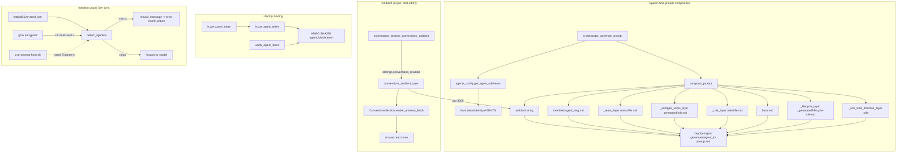

## Purpose
This slice is the prompt-composition pipeline and the role/team/permission taxonomy that feeds it. At agent spawn the orchestrator resolves an agent's role+team from the canonical foundation-derived maps in agents_config.py, then compose_prompt layers (in order) a tool-load directive, the autogenerated lifecycle verb surface, the universal base rules, the role prompt, the autogenerated per-role verb-signature table, the team prompt, the agent identity, and an optional architectural-conventions ambient block — writing the result to a per-agent .md file the runtime mounts. A separate prompt-injection guard (prompt_guard.py) denies poisoned incoming turns at the interactive input boundary for both Claude-SDK and Grok sessions, mirroring the bash UserPromptSubmit hook. agents_config.py is also the MCP-layer permission taxonomy (HMAC agent tokens, role/team helpers, escalation chain, channel ACLs, A2A routing) that gates tool visibility and identity-binding at spawn.

## Files

| Path | Role | LOC |
|---|---|---|
| roboco/agents/factories/_base.py | Layered prompt composer: loads/concatenates tool-directive + lifecycle + base + role + autogen-verbs + team + identity + ambient layers; exports PROMPTS_BASE_PATH, role/team/builtin-tool maps, compose_prompt, conventions_ambient_layer, make_slug | 298 |
| roboco/agents/factories/__init__.py | One-line re-export shim pointing to _base | 1 |
| roboco/agents_config.py | 691-line MCP-layer permission/taxonomy module: HMAC agent-token issue/verify, role+team+cell maps derived from foundation, escalation chain, channel ACL derivation, ROLE_PERMISSION_LEVELS, ROLE_SKILLS, A2A routing helpers | 691 |
| roboco/agent_sdk/prompt_guard.py | Reusable Python port of the bash injection guard: _PATTERNS regex list, detect_injection, refusal_message, CLI main (exit 1 on injection) for the grok entrypoint | 93 |
| agents/prompts/base.md | Universal base layer: identity separation, gateway-verb-only action, envelope shapes, missing-key cheatsheet, resume-from-briefing, charter alignment, channel/todo rules, ground rules | 93 |
| agents/prompts/roles/developer.md | Developer role prompt: implement-only identity, verb table (give_me_work/i_will_work_on/commit/open_pr/i_am_done/sync_branch/...), workspace path, behind-base -> sync_branch guidance, conventions waiver path | 25176 |
| agents/prompts/roles/qa.md | QA role prompt: review-only identity, claim_review/pass/fail/i_am_blocked verbs, ac_verdicts per criterion, circuit-breaker guidance | 13355 |
| agents/prompts/roles/documenter.md | Documenter role prompt: docs-on-same-branch identity, claim_doc_task/commit/i_documented/i_am_blocked verbs, circuit-breaker guidance | 10739 |
| agents/prompts/roles/cell_pm.md | Cell PM role prompt: coordinator identity, i_will_plan/delegate/complete/submit_up/unblock verbs, AC coverage gate, collision-surface declaration (intends_to_touch/adds_migration/touches_shared/depends_on), behind-base escalation | 35682 |
| agents/prompts/roles/main_pm.md | Main PM role prompt: org-level coordinator, delegate/complete/submit_root/triage_all/unblock/escalate_to_ceo verbs, upstream-handoff precondition, branch-bearing vs branchless root gate | 32363 |
| agents/prompts/roles/pr_reviewer.md | PR Reviewer role prompt: external-PR review (claim_pr_review/post_pr_review) + in-path gate (claim_gate_review/pr_pass/pr_fail), trust gate, conventions strictness | 8129 |
| agents/prompts/roles/board.md | Board role prompt (PO/HoM/Auditor): strategic overseer, triage/escalate_to_ceo, no unblock verb, Auditor silent | 12253 |
| agents/prompts/roles/prompter.md | Intake interviewer role prompt: CEO-only chat, propose_draft/propose_batch, MegaTask batch + per-cell-project-map drafting, root-subtask coordination-level AC guidance | 13825 |
| agents/prompts/roles/secretary.md | Secretary role prompt: CEO chief-of-staff, gated-action confirm protocol, reading-free/prepare-direct/high-impact-bounce discipline | 4338 |
| agents/prompts/teams/backend.md | Backend team layer: channels, Python/FastAPI/Postgres stack, teammates, uv quality commands | 983 |
| agents/prompts/teams/frontend.md | Frontend team layer: channels, TS/Next.js stack, pnpm quality commands | 976 |
| agents/prompts/teams/ux_ui.md | UX/UI team layer: channels, design-system focus areas, teammates | 1009 |
| agents/prompts/identities/ | 19 per-agent identity files (be-dev-1/2, fe-dev-1/2, ux-dev-1/2, be/fe/ux -qa/-doc/-pm, main-pm, product-owner, head-marketing, auditor): YAML id/name/role/team/cell/reports_to + scope blurb; loaded by slug | 0 |
| agents/prompts/_generated/lifecycle-developer.md | Autogenerated lifecycle verb list for developer (regenerated from lifecycle spec by make lifecycle); lists sync_branch etc. | 1498 |
| agents/prompts/_generated/lifecycle-main_pm.md | Autogenerated lifecycle verbs for main_pm; submit_root now branch-keyed not task_type-keyed | 2034 |
| agents/prompts/_generated/lifecycle-cell_pm.md | Autogenerated lifecycle verbs for cell_pm | 1839 |
| agents/prompts/_generated/lifecycle-qa.md | Autogenerated lifecycle verbs for qa | 818 |
| agents/prompts/_generated/lifecycle-documenter.md | Autogenerated lifecycle verbs for documenter | 736 |
| agents/prompts/_generated/lifecycle-pr_reviewer.md | Autogenerated lifecycle verbs for pr_reviewer | 1071 |
| agents/prompts/_generated/lifecycle-product_owner.md | Autogenerated lifecycle verbs for product_owner | 421 |
| agents/prompts/_generated/lifecycle-head_marketing.md | Autogenerated lifecycle verbs for head_marketing | 422 |
| agents/prompts/_generated/lifecycle-auditor.md | Autogenerated lifecycle verbs for auditor (triage + i_am_idle) | 325 |
| agents/prompts/_generated/lifecycle-prompter.md | Autogenerated lifecycle verbs for prompter (i_am_idle only — driver-based) | 275 |
| agents/prompts/_generated/lifecycle-secretary.md | Autogenerated lifecycle verbs for secretary (i_am_idle only — driver-based) | 276 |
| agents/prompts/_generated/lifecycle-ceo.md | Autogenerated lifecycle verbs for ceo (empty — human, not spawned) | 181 |
| agents/prompts/_generated/lifecycle-system.md | Autogenerated lifecycle verbs for system sentinel (empty) | 184 |
| agents/prompts/_generated/developer.md | Per-role autogenerated verb-signature table (Flow + Content tools) for developer, regenerated by scripts/regenerate_verb_tables.py from Pydantic schemas + role_config | 2384 |
| agents/prompts/_generated/qa.md | Per-role autogenerated verb-signature table for qa (pass_review ac_verdicts carries BeforeValidator) | 2040 |
| agents/prompts/_generated/documenter.md | Per-role autogenerated verb-signature table for documenter | 2083 |
| agents/prompts/_generated/cell_pm.md | Per-role autogenerated verb-signature table for cell_pm; delegate signature includes intends_to_touch/adds_migration/touches_shared/depends_on | 3270 |
| agents/prompts/_generated/main_pm.md | Per-role autogenerated verb-signature table for main_pm; delegate signature includes collision-surface fields | 3316 |
| agents/prompts/_generated/pr_reviewer.md | Per-role autogenerated verb-signature table for pr_reviewer (claim_gate_review/pr_pass/pr_fail + claim_pr_review/post_pr_review) | 1461 |
| agents/prompts/_generated/product_owner.md | Per-role autogenerated verb-signature table for product_owner (triage/escalate_to_ceo + pitch/notify/open_session) | 1765 |
| agents/prompts/_generated/head_marketing.md | Per-role autogenerated verb-signature table for head_marketing | 1765 |
| agents/prompts/_generated/auditor.md | Per-role autogenerated verb-signature table for auditor (triage/i_am_idle + note/evidence + approve/reject/archive_playbook) | 1273 |
| agents/prompts/_generated/verbs.md | Aggregate reference doc of all per-role verb shapes (NOT injected at spawn; _base.py loads the per-role file instead); notes driver-based roles omitted | 18302 |

## Key Symbols

| Name | Kind | File:Line | Responsibility |
|---|---|---|---|
| _get_prompts_base_path | function | roboco/agents/factories/_base.py:17 | Resolve project_root/agents/prompts/ from this file's location with a cwd-relative fallback |
| PROMPTS_BASE_PATH | constant | roboco/agents/factories/_base.py:37 | Module-level cached prompts base path used by default in compose_prompt |
| _load_layer | function | roboco/agents/factories/_base.py:40 | Read a prompt layer file, return '' if missing (graceful fallback) |
| _ROLE_LAYER_MAP | dict | roboco/agents/factories/_base.py:55 | Maps role string -> roles/*.md filename; board roles all share board.md; prompter/secretary/pr_reviewer have own files |
| _TEAM_LAYER_MAP | dict | roboco/agents/factories/_base.py:77 | Maps team string (backend/frontend/ux_ui) -> teams/*.md filename |
| _role_layer | function | roboco/agents/factories/_base.py:84 | Load the role-specific prompt layer or None if role unknown |
| _team_layer | function | roboco/agents/factories/_base.py:93 | Load the team prompt layer or None if unset/unknown |
| _autogen_verbs_layer | function | roboco/agents/factories/_base.py:104 | Load _generated/<role>.md autogenerated verb-signature table for the role |
| _BUILTIN_TOOLS_COMMON | tuple | roboco/agents/factories/_base.py:127 | Built-in Claude Code tools every role gets: Read,Bash,Grep,Glob,TodoWrite |
| _BUILTIN_TOOLS_AUTHORS | tuple | roboco/agents/factories/_base.py:134 | Authors set (developer/documenter) adds Edit,Write to the common set |
| _ROLE_BUILTIN_TOOLS | dict | roboco/agents/factories/_base.py:136 | Per-role builtin-tool grant map; non-authors get common-only |
| _tool_load_directive_layer | function | roboco/agents/factories/_base.py:149 | Build top-of-prompt 'your tools are ready' block; steers away from ToolSearch and shell-redirect rewrites |
| _lifecycle_layer | function | roboco/agents/factories/_base.py:187 | Load _generated/lifecycle-<role>.md canonical verb-surface fragment (from lifecycle spec, CI-gated) |
| compose_prompt | function | roboco/agents/factories/_base.py:203 | Compose the full system prompt by concatenating tool-directive, lifecycle, base, role, autogen-verbs, team, identity, ambient layers with '---' separators, skipping empty layers |
| _AMBIENT_TOTAL_CAP | constant | roboco/agents/factories/_base.py:256 | 3000-char cap on the concatenated conventions ambient block |
| conventions_ambient_layer | async function | roboco/agents/factories/_base.py:259 | Render per-project architectural-standard ambient block(s), multi-project headed, capped; None when conventions off / no projects |
| make_slug | function | roboco/agents/factories/_base.py:296 | Lowercase + dash slug helper |
| _AUTH_SECRET_ENV | constant | roboco/agents_config.py:42 | Env var name ROBOCO_AGENT_AUTH_SECRET for the HMAC signing key |
| _auth_secret | function | roboco/agents_config.py:45 | Return HMAC secret bytes or None when unset |
| _signing_payload | function | roboco/agents_config.py:51 | Canonical lowercase stripped agent_id:role:team HMAC message |
| issue_agent_token | function | roboco/agents_config.py:61 | Mint hex HMAC-SHA256 token binding agent identity to role+team; returns UNSIGNED sentinel if secret unset |
| verify_agent_token | function | roboco/agents_config.py:79 | Constant-time HMAC verification; fail-closed on unset secret / UNSIGNED |
| issue_panel_token | function | roboco/agents_config.py:94 | Mint the CEO-identity token the panel presents (signed for CEO_AGENT_ID/ceo/empty team) |
| _UUID_TO_SLUG | dict | roboco/agents_config.py:109 | Reverse map UUID->slug from AGENT_UUIDS seeds |
| _resolve_to_slug | function | roboco/agents_config.py:114 | Resolve UUID or slug input to slug |
| AGENT_ROLE_MAP | dict | roboco/agents_config.py:127 | slug->role.value for every non-SYSTEM agent (derived from foundation.AGENTS) |
| AGENT_TEAM_MAP | dict | roboco/agents_config.py:133 | slug->team.value derived from foundation |
| CELL_MEMBERS | dict | roboco/agents_config.py:139 | team.value -> sorted slug list per cell |
| ALL_AGENTS | list | roboco/agents_config.py:146 | All agent slugs |
| BOARD_MEMBERS | list | roboco/agents_config.py:149 | product-owner, head-marketing, auditor |
| ALL_DOCS | list | roboco/agents_config.py:152 | Cross-cell documenter slugs for docs workspace perms |
| TASK_CREATOR_ROLES | frozenset | roboco/agents_config.py:159 | Roles that can call task.create (cell_pm, main_pm, product_owner, head_marketing, ceo) |
| ESCALATION_CHAIN | dict | roboco/agents_config.py:170 | slug -> escalation target slug (dev/qa/doc -> cell PM -> main-pm -> product-owner -> ceo) |
| get_agent_role | function | roboco/agents_config.py:204 | Role string for an agent (UUID or slug); 'unknown' if missing |
| get_agent_team | function | roboco/agents_config.py:210 | Team string for an agent or None |
| get_agent_cell | function | roboco/agents_config.py:216 | Alias of get_agent_team |
| get_cell_members | function | roboco/agents_config.py:221 | Slugs for a cell |
| is_pm | function | roboco/agents_config.py:226 | cell_pm or main_pm predicate |
| is_board_member | function | roboco/agents_config.py:232 | Board membership predicate by slug |
| is_management | function | roboco/agents_config.py:237 | PM/Board/CEO predicate |
| is_ceo | function | roboco/agents_config.py:250 | CEO predicate (full permission bypass) |
| can_send_notifications | function | roboco/agents_config.py:255 | Role in foundation NOTIFY_SENDER_ROLES |
| can_create_tasks | function | roboco/agents_config.py:263 | Role in TASK_CREATOR_ROLES |
| can_assign_tasks | function | roboco/agents_config.py:269 | Same set as can_create_tasks |
| _CANCEL_ROLES | set | roboco/agents_config.py:276 | Roles that may cancel (cell_pm/main_pm/product_owner/head_marketing — NOT ceo/auditor) |
| can_cancel_tasks | function | roboco/agents_config.py:284 | Role in _CANCEL_ROLES |
| get_escalation_target | function | roboco/agents_config.py:290 | Next escalation slug from ESCALATION_CHAIN |
| get_pm_for_team | function | roboco/agents_config.py:295 | Cell PM slug for a team |
| get_pm_for_agent | function | roboco/agents_config.py:305 | Responsible PM: cell PM for members, main-pm for cell PMs, product-owner for main PM |
| _TEAM_SCOPED_ROLES | frozenset | roboco/agents_config.py:346 | Cell-member roles (dev/qa/doc/cell_pm) subject to team_scope filtering in channel ACL; re-exported from foundation.policy.communications.TEAM_SCOPED_ROLES (was inline-defined; deduped in 536bbb64) |
| _slugs_for_role_set | function | roboco/agents_config.py:355 | Expand a role-set to sorted slugs honoring optional team_scope; excludes system sentinel |
| CHANNEL_ACCESS | dict | roboco/agents_config.py:381 | slug -> {read,write,silent} slug lists derived from foundation.policy.communications.CHANNELS |
| ROLE_PERMISSION_LEVELS | dict | roboco/agents_config.py:404 | Single source of truth role->permission-level (CEO/BOARD/AUDITOR/MAIN_PM/CELL_PM/CELL_MEMBER) used by PermissionService |
| VALID_NOTIFICATION_TYPES | frozenset | roboco/agents_config.py:425 | Valid NotificationType values |
| VALID_NOTIFICATION_PRIORITIES | frozenset | roboco/agents_config.py:428 | Valid NotificationPriority values |
| ROLE_SKILLS | dict | roboco/agents_config.py:438 | Role -> A2A skill descriptor list for Agent Cards |
| get_agent_skills | function | roboco/agents_config.py:566 | A2A skills for an agent by role |
| _BOARD_ROLES | frozenset | roboco/agents_config.py:584 | Foundation board roles (PO/HoM/Auditor; main_pm intentionally excluded) |
| _MAIN_PM_TARGETS | frozenset | roboco/agents_config.py:585 | Roles a main PM may A2A directly |
| _check_cell_pm_a2a | function | roboco/agents_config.py:590 | A2A permission for cell PM (own cell / other PMs / main-pm allowed; board escalated) |
| _check_cell_member_a2a | function | roboco/agents_config.py:604 | A2A permission for cell members (same-cell allowed; cross-cell via PMs) |
| _check_main_pm_a2a | function | roboco/agents_config.py:624 | A2A permission for main PM (_MAIN_PM_TARGETS allowed) |
| can_a2a_direct | function | roboco/agents_config.py:632 | (allowed, error) for direct A2A from one agent to another; routes CEO via notify, board/main_pm/cell-member via handlers |
| get_a2a_route_hint | function | roboco/agents_config.py:670 | Human-readable routing hint for an A2A message |
| _PATTERNS | list | roboco/agent_sdk/prompt_guard.py:28 | Five (regex, reason) injection patterns: ignore-previous, role-override, fake role prefix, control-token mimicry, fake executive-order |
| detect_injection | function | roboco/agent_sdk/prompt_guard.py:63 | Return deny reason if text matches an injection pattern (lowercased), else None |
| refusal_message | function | roboco/agent_sdk/prompt_guard.py:72 | Guidance string shown on denial (mirrors bash hook text) |
| main | function | roboco/agent_sdk/prompt_guard.py:82 | CLI entry: exit 1 if argv[1] is an injection (used by grok entrypoint) |

## Data Flow
Spawn-time composition (synchronous, per agent): orchestrator._generate_prompt(role/team/agent_id, ambient) calls agents_config.get_agent_role/get_agent_team to resolve the canonical strings from foundation-derived AGENT_ROLE_MAP/AGENT_TEAM_MAP, converts to AgentRole/Team enums, then calls compose_prompt. compose_prompt resolves prompts_path (PROMPTS_BASE_PATH = project_root/agents/prompts) and builds an ordered list: _tool_load_directive_layer(role) (inline), _lifecycle_layer (reads _generated/lifecycle-<role>.md), base.md, _role_layer (roles/<file>.md via _ROLE_LAYER_MAP), _autogen_verbs_layer (_generated/<role>.md), _team_layer (teams/<file>.md via _TEAM_LAYER_MAP, None for board/main-pm), identities/<agent_slug>.md, then the optional ambient string. Empty/None layers are dropped; the rest are joined with "\n\n---\n\n". The composed string is written to /app/prompts-generated/<agent_id>-prompt.md (container) or $TMPDIR/roboco-prompts/ (host) and the path returned to the spawn path that mounts it as the agent's system prompt.

Ambient resolution (async, best-effort): orchestrator._resolve_conventions_ambient gates on settings.conventions_enabled, opens a DB session, resolves in-scope projects (single project_slug for delivery roles, or per-cell projects from a task's product_id for PO/Intake), and calls conventions_ambient_layer -> ConventionsService.render_ambient_block per project (ensuring a read clone), multi-project-headed, capped to 3000 chars. Any exception is caught and returns None so a compose is never blocked by conventions.

Identity binding at spawn: agents_config.issue_agent_token(agent_id, role, team) HMAC-signs the canonical lowercase agent_id:role:team with ROBOCO_AGENT_AUTH_SECRET and the orchestrator injects the token into the agent env; verify_agent_token (called server-side on X-Agent-Token headers) fail-closes on unset secret or UNSIGNED. The panel gets issue_panel_token() signed for the CEO identity.

Injection guard (runtime, per turn): IntakeDriver.send_turn calls detect_injection(text) before sending to the model; on a match it emits an error chunk with refusal_message(reason) and returns without forwarding. The grok one-shot entrypoint runs `python -m roboco.agent_sdk.prompt_guard <text>` and refuses start (exit 1) on a match. The same five patterns run in docker/scripts/user-prompt-hook.sh for non-SDK Claude sessions.

Callers: orchestrator.py:2971 (compose_prompt), orchestrator.py:3018/3029 (conventions_ambient_layer), intake_driver.py:374-377 (detect_injection/refusal_message). Callees from this slice: roboco.foundation.identity (AGENTS/Role/Team/slugs_for_team), roboco.foundation.policy.communications (CHANNELS/NOTIFY_SENDER_ROLES), roboco.seeds.initial_data (AGENT_UUIDS/CEO_AGENT_ID), roboco.services.conventions (get_conventions_service), roboco.config.settings, roboco.models.base (NotificationType/Priority).

## Mermaid


## Logical Tree
```
prompts-roles-taxonomy slice
├── Prompt composition (roboco/agents/factories/)
│   ├── _base.py
│   │   ├── PROMPTS_BASE_PATH resolver
│   │   ├── _load_layer (file -> str|'')
│   │   ├── Layer maps: _ROLE_LAYER_MAP, _TEAM_LAYER_MAP
│   │   ├── Layer loaders: _role_layer, _team_layer, _autogen_verbs_layer, _lifecycle_layer
│   │   ├── Builtin-tool grant: _BUILTIN_TOOLS_COMMON/AUTHORS, _ROLE_BUILTIN_TOOLS, _tool_load_directive_layer
│   │   ├── compose_prompt (ordered join with '---')
│   │   └── conventions_ambient_layer (async, multi-project, 3000-char cap) + _AMBIENT_TOTAL_CAP
│   └── __init__.py (shim)
├── Permission taxonomy (roboco/agents_config.py)
│   ├── HMAC token layer: _auth_secret, _signing_payload, issue_agent_token, verify_agent_token, issue_panel_token
│   ├── UUID<->slug: _UUID_TO_SLUG, _resolve_to_slug
│   ├── Derived maps: AGENT_ROLE_MAP, AGENT_TEAM_MAP, CELL_MEMBERS, ALL_AGENTS, BOARD_MEMBERS, ALL_DOCS
│   ├── Role sets: TASK_CREATOR_ROLES, _CANCEL_ROLES, ROLE_PERMISSION_LEVELS, _BOARD_ROLES, _MAIN_PM_TARGETS, _TEAM_SCOPED_ROLES
│   ├── Escalation: ESCALATION_CHAIN, get_escalation_target, get_pm_for_team, get_pm_for_agent
│   ├── Helpers: get_agent_role/team/cell, get_cell_members, is_pm/board_member/management/ceo, can_send_notifications/create/assign/cancel_tasks
│   ├── Channel ACL: _slugs_for_role_set, CHANNEL_ACCESS (from foundation.communications.CHANNELS)
│   ├── Notification enums: VALID_NOTIFICATION_TYPES/PRIORITIES
│   ├── A2A skills: ROLE_SKILLS, get_agent_skills
│   └── A2A routing: _check_cell_pm/cell_member/main_pm_a2a, can_a2a_direct, get_a2a_route_hint
├── Injection guard (roboco/agent_sdk/prompt_guard.py)
│   ├── _PATTERNS (5 regexes mirroring user-prompt-hook.sh)
│   ├── detect_injection, refusal_message
│   └── main (CLI for grok entrypoint)
└── Prompt corpus (agents/prompts/)
    ├── base.md (universal rules)
    ├── roles/ (9 files: developer, qa, documenter, cell_pm, main_pm, pr_reviewer, board, prompter, secretary)
    ├── teams/ (3 files: backend, frontend, ux_ui)
    ├── identities/ (19 per-agent YAML+blurb files)
    └── _generated/ (regenerated artifacts)
        ├── lifecycle-<role>.md (x14; from lifecycle spec via make lifecycle; CI-gated no-drift)
        ├── <role>.md verb-signature tables (x12; from schemas + role_config via regenerate_verb_tables.py)
        └── verbs.md (aggregate reference doc; NOT injected at spawn)
```

## Dependencies
- Internal: roboco.foundation.identity (AGENTS, Role, Team, CELL_TEAMS, BOARD_ROLES, slugs_for_team), roboco.foundation.policy.communications (CHANNELS, NOTIFY_SENDER_ROLES, TEAM_SCOPED_ROLES), roboco.seeds.initial_data (AGENT_UUIDS, CEO_AGENT_ID), roboco.models.base (AgentRole, Team, NotificationType, NotificationPriority), roboco.config.settings (conventions_enabled), roboco.services.conventions (get_conventions_service, ConventionsService.render_ambient_block/resolve_workspace), roboco.db.base (get_session_factory), roboco.db.tables (ProjectTable), roboco.runtime.orchestrator (_generate_prompt, _resolve_conventions_ambient, _resolve_ambient_projects), roboco.agent_sdk.intake_driver (IntakeDriver.send_turn consumer), scripts/regenerate_verb_tables.py (regenerates _generated/<role>.md + verbs.md), scripts/build_lifecycle_artifacts.py (regenerates _generated/lifecycle-<role>.md; make lifecycle), docker/scripts/user-prompt-hook.sh (canonical bash guard mirrored by prompt_guard.py), roboco.api.schemas.v1 (Pydantic verb schemas the autogen tables derive from), roboco.services.gateway.role_config (role->verb config the autogen tables derive from)
- External: pathlib.Path, hmac / hashlib (HMAC-SHA256 tokens), os.environ (ROBOCO_AGENT_AUTH_SECRET), re (injection regexes), sys (prompt_guard CLI), sqlalchemy.ext.asyncio.AsyncSession (ambient layer), typing.Final, argparse-less sys.argv CLI

## Entry Points

| Name | File | Trigger |
|---|---|---|
| orchestrator._generate_prompt | roboco/runtime/orchestrator.py | Called per agent spawn to compose + write the system-prompt .md file; calls compose_prompt (line 2971) |
| orchestrator._resolve_conventions_ambient | roboco/runtime/orchestrator.py | Async, called from the spawn path before _generate_prompt to resolve the optional ambient block; calls conventions_ambient_layer (line 3029) |
| IntakeDriver.send_turn | roboco/agent_sdk/intake_driver.py | Per interactive turn (Intake/Secretary Claude-SDK and Grok sessions); calls detect_injection before forwarding to the model (line 374) |
| python -m roboco.agent_sdk.prompt_guard | roboco/agent_sdk/prompt_guard.py | CLI invoked by the grok one-shot entrypoint on ROBOCO_INITIAL_PROMPT; exit 1 denies start |
| make lifecycle | scripts/build_lifecycle_artifacts.py | Developer/CI target regenerating _generated/lifecycle-*.md; CI gates on git diff --exit-code |
| scripts/regenerate_verb_tables.py | scripts/regenerate_verb_tables.py | Developer target regenerating _generated/<role>.md + verbs.md after role_config/schema changes |

## Config Flags
- ROBOCO_AGENT_AUTH_SECRET (env) — HMAC signing secret for agent/panel tokens; unset => verify_agent_token fail-closes (rejects every token), issue_*_token returns UNSIGNED
- ROBOCO_CONVENTIONS_ENABLED — gates whether conventions_ambient_layer resolves + injects the architectural-standard ambient block; off => compose_prompt omits the ambient layer entirely
- ROBOCO_SDK_URL (env, default http://localhost:9000) — used by the bash user-prompt-hook.sh (sister guard), not prompt_guard.py directly
- ROBOCO_INITIAL_PROMPT (env) — the one-shot prompt the grok entrypoint hands to prompt_guard CLI main
- PROJECT_HOST_PATH (orchestrator) — selects container (/app/prompts-generated) vs host ($TMPDIR/roboco-prompts) output dir for composed prompts


## Gotchas
- Layer ORDER matters and is load-bearing: tool-directive FIRST, then lifecycle, then base, then role, then autogen-verbs, then team, then identity, then ambient. The lifecycle fragment is intentionally before base so the agent reads its allowed verb surface before any other instruction. Reordering would change model attention priority.
- Empty/missing layers are silently dropped (compose_prompt skips falsy layers). An unknown role yields _role_layer=None AND _autogen_verbs_layer=None AND _lifecycle_layer=None — the agent would still spawn with just tool-directive + base + identity + ambient, missing its entire role+verb surface. The orchestrator guards upstream (raises ValueError on unknown role), but a typo in _ROLE_LAYER_MAP silently degrades to a roleless prompt rather than failing.
- _ROLE_LAYER_MAP maps all three board roles (product_owner/head_marketing/auditor) to the SAME board.md file. The per-role distinction (PO vs HoM vs Auditor) comes only from the identity file + the _generated/<role>.md verb table, not from the role layer. A board role missing its identity file would lose its role-specific scope.
- verbs.md is the aggregate reference doc but is NOT injected at spawn — _base.py loads the per-role _generated/<role>.md file instead. Editing verbs.md has zero prompt effect; it is a documentation/CI artifact only. The per-role files are the load-bearing ones.
- Identity YAML files carry a stale `role:` label (e.g. main-pm.md says `role: pm`, product-owner.md says `role: board`) that does NOT match the AgentRole enum values (main_pm/product_owner). The composition pipeline ignores this field entirely (loads identity by slug only); the real role comes from agents_config.AGENT_ROLE_MAP. Do not trust the identity YAML role label for enforcement.
- Board members (product_owner/head_marketing/auditor) have team=None, so _team_layer returns None for them — they get no team layer. main-pm likewise. Only cell members (dev/qa/doc/cell_pm) get a team layer.
- The autogen verb tables (_generated/<role>.md) and lifecycle fragments are REGENERATED artifacts (make lifecycle / regenerate_verb_tables.py) gated on CI (git diff --exit-code). Hand-editing them is futile and will fail CI; change the source (lifecycle spec / Pydantic schemas / role_config) and regenerate.
- prompt_guard.py mirrors user-prompt-hook.sh patterns but is a separate implementation. The two must be kept in sync manually — there is no shared source. Drift between them means Claude (bash hook) and Grok/SDK (Python guard) apply different deny rules.
- detect_injection lowercases the text and uses loose anchoring (^|[\s>]) so injected content mid-message is caught, but the regexes are intentionally narrow (5 patterns). False negatives are expected by design — this is a classic-jailbreak denylist, not a comprehensive classifier; content that doesn't match still reaches the model.
- conventions_ambient_layer is best-effort and wraps the whole resolution in a try/except in the orchestrator (_resolve_conventions_ambient). A conventions resolution failure degrades silently to no ambient layer — a compose is never blocked by conventions. This means a conventions regression could quietly stop injecting the standard with no error surface.
- _AMBIENT_TOTAL_CAP (3000) truncates the ambient block with a trailing ellipsis. A large multi-project spawn (PO spanning several cells) can have its architectural standard silently truncated mid-block, leaving the agent with a partial standard.
- HMAC token verification fail-closes when ROBOCO_AGENT_AUTH_SECRET is unset — every agent token is rejected. issue_agent_token returns the literal sentinel 'UNSIGNED' which verify_agent_token also rejects. Deploying without the secret bricks all agent API auth (by design).


## Drift from CLAUDE.md
- CLAUDE.md Project Overview states '25 AI agents + 1 human CEO', but agents/prompts/base.md line 3 says '22 AI agents + 1 human CEO'. The base prompt agent count is stale relative to CLAUDE.md (memory notes a 20->22 update on 2026-06-16; CLAUDE.md later moved to 25). A spawned agent reads '22' in its system prompt while the org chart it sees has 25.
- CLAUDE.md's verb-surface table lists `i_am_blocked` for the qa and documenter roles. The role prompts qa.md and documenter.md ONLY added the i_am_blocked verb row in commit 15effce0 (this slice's baseline diff) — before that the role prompts omitted it even though the gateway accepted it. The prompts are now aligned, but the documenter.md circuit-breaker section previously explicitly said 'you don't have an i_am_blocked verb', which was false vs the gateway and vs CLAUDE.md. Fixed in 15effce0.
- CLAUDE.md says the lifecycle is defined in roboco/foundation/policy/lifecycle.py with a shim at roboco/enforcement/task_lifecycle.py. _base.py:_lifecycle_layer (line 187-200) docstring says the lifecycle fragment is regenerated from `roboco/lifecycle/spec.py` by `make lifecycle`. The actual source path the regenerator uses is roboco/lifecycle/spec.py (per the docstring), which is not mentioned in CLAUDE.md's lifecycle section — minor doc-path drift, not behavioral.
- CLAUDE.md describes the prompt composition as 'base + role + team + identity prompts' and an ambient 'Architectural Standard' block at spawn. The actual compose_prompt order (line 239-248) is tool-directive + lifecycle + base + role + autogen-verbs + team + identity + ambient — i.e. THREE additional layers (tool-directive, lifecycle, autogen-verbs) not named in CLAUDE.md's composition description. CLAUDE.md undersells the actual layer stack.
- Identity files declare `role: pm` / `role: board` (e.g. identities/main-pm.md, identities/product-owner.md) which do not match the canonical AgentRole enum values (main_pm, cell_pm, product_owner, head_marketing, auditor) that CLAUDE.md and agents_config use. The pipeline ignores this label so it is cosmetic, but it is inconsistent with the canonical taxonomy CLAUDE.md documents.


## Changes Since Baseline

| SHA | Subject | Impact |
|---|---|---|
| 15effce0 | Chore: 141 Gaps fill-in (#283) — sole commit touching this slice since fd10cc86 | Prompt-surface alignment with gateway/spec: (1) developer.md + lifecycle-developer.md + verbs.md add the new sync_branch verb and rewrite the behind-base guidance on developer/cell_pm/main_pm to point devs at sync_branch instead of i_am_blocked/escalate_up (cell/root integration branches still escalate). (2) qa.md and documenter.md add the i_am_blocked verb row and rewrite the circuit-breaker section to use i_am_blocked instead of 'you don't have an i_am_blocked verb -> unclaim' — corrects a false prompt claim. (3) cell_pm.md delegate signature + verbs.md add the collision-surface fields intends_to_touch/adds_migration/touches_shared/depends_on and a new 'Collision surface' section instructing the PM to declare them on every code subtask so siblings sequence. (4) pr_reviewer.md adds the in-path gate verbs claim_gate_review/pr_pass/pr_fail + an 'In-path gate review' section. (5) prompter.md adds MegaTask root-subtask coordination-level AC guidance (task_type=planning, coordination-level ACs). (6) lifecycle-main_pm.md submit_root description changes from 'Only for code roots' to 'branch-bearing roots; gate is branch-keyed not task_type-keyed'. (7) note verb schema in all autogen tables gains done/next/where_to_look top-level string params; pass_review ac_verdicts and delegate covers_parent_criteria/intends_to_touch now show BeforeValidator in the signature. |

> Post-snapshot updates (since 2026-06-29): **536bbb64** (Chore/all/logical gaps sweep #286) — (a) agents_config.py: `_TEAM_SCOPED_ROLES` deduped: was inline-defined, now re-exported as `_comms.TEAM_SCOPED_ROLES` from `foundation.policy.communications` (values unchanged: dev/qa/doc/cell_pm); (b) _generated/cell_pm.md, main_pm.md, qa.md, verbs.md: BeforeValidator repr cleaned from delegate/pass_review signatures — now renders `list[str] | None = None` instead of the memory-address-bearing BeforeValidator literal; (c) lifecycle spec: `PRECONDITION_ROOT_NOT_CODE` added to `submit_root` extra_preconditions, backing the branch-keyed / planning-typed claim the prompt asserts. **aba57359** ([chore] lifecycle artifacts regenerate, foundation-check) — lifecycle-cell_pm.md, lifecycle-developer.md, lifecycle-documenter.md, lifecycle-main_pm.md, lifecycle-qa.md: `unclaim` description expanded with "A PR reviewer who claimed an external/gate review and cannot finish releases the claim here rather than wedging the lane"; lifecycle-cell_pm.md + lifecycle-main_pm.md: `complete` description clarified "The merge runs BEFORE the complete transition" ordering.

## Regression Risks

| Title | File:Line | Claim | Severity |
|---|---|---|---|
| Collision-surface declaration is prompt-only, not gate-enforced | agents/prompts/roles/cell_pm.md:141 | The new 'Collision surface' section tells the cell PM to fill intends_to_touch/adds_migration/touches_shared on every code subtask so the analyzer can sequence colliding siblings, but the section explicitly says 'leave it empty only for a research/design subtask' — there is no documented gate that REFUSES a code delegate with empty intends_to_touch. If a PM omits it on a code subtask, two siblings editing the same file run in parallel and collide (the exact 2026-06-27 out-of-order break this was added to prevent). The protection hinges on agent compliance with prompt prose, not a hard gate. | medium |
| sync_branch guidance contradicting the i_am_done gate for behind-base branches | agents/prompts/roles/developer.md:126 | developer.md now says 'call sync_branch as soon as roboco_git_status shows your branch behind, OR when i_am_done refuses with your branch is N behind'. If the i_am_done gate's behind-base check and sync_branch's rebase disagree on what 'base' means (e.g. base resolved from the recorded branch vs the parent task's head), a dev could sync_branch successfully and still hit the i_am_done behind-base refusal, looping. The prompt assumes both use the same base resolution; a divergence there would trap the dev. No fallback to i_am_blocked is offered anymore (the prompt explicitly forbids it for a plain behind-base condition), removing the previous escape hatch. | medium |
| ~~documenter/qa circuit-breaker now directs to i_am_blocked — verify the verb is actually granted to those roles~~ **VERIFIED OK** | agents/prompts/roles/documenter.md:100 | The circuit-breaker section was rewritten from 'you don't have an i_am_blocked verb -> unclaim' to 'i_am_blocked(task_id, reason=...) to escalate'. This relies on i_am_blocked being genuinely callable by qa and documenter at the gateway. The autogen verbs.md shows i_am_blocked for qa but the documenter section in verbs.md (and _generated/documenter.md) must also list it — if the role_config does not grant i_am_blocked to documenter, the new prompt guidance sends the agent to a verb that will return not_authorized, trapping them on a circuit_open with no documented fallback (the old unclaim-only path was removed). **Verified 2026-07-01: lifecycle spec `i_am_blocked.allowed_roles = frozenset(_DEV_ROLES | _QA_ROLES | _DOC_ROLES)` — documenter IS granted this verb at baseline and post-snapshot; not a live risk.** | high |
| ~~submit_root description changed from code-root to branch-bearing-root semantics~~ **RESOLVED (536bbb64)** | agents/prompts/_generated/lifecycle-main_pm.md:14 | The lifecycle fragment now says submit_root is 'For branch-bearing roots' and 'The gate is branch-keyed, not task_type-keyed — a Main-PM root is planning-typed, never code'. If the gateway's submit_root implementation still keys off task_type=code (the old contract), a planning-typed branch-bearing root would be rejected by the gate while the prompt tells the Main PM to call submit_root on it — a loop. The prompt now asserts a behavior the gateway must match; mismatch breaks Main-PM root submission. **Fixed 2026-06-30: 536bbb64 added `PRECONDITION_ROOT_NOT_CODE` (`_p_root_not_code`: checks `task_type != code`) to `submit_root.extra_preconditions` in the lifecycle spec, and the spec description was updated to match; prompt and gateway are now aligned.** | high |
| note schema advertises done/next/where_to_look the gateway must accept | agents/prompts/_generated/developer.md:25 | All autogen verb tables now show note(...) with done/next/where_to_look top-level params. If the Pydantic note schema (the regenerator source) was updated but the gateway's note handler / DB journal model does not persist these fields, agents will pass them, the schema accepts them, but they are silently dropped — the handoff/quick_context fields the meltdown #1 fix intended to surface top-level would never reach downstream briefings. The prompt advertises params that may be no-ops at the persistence layer. | medium |
| ~~BeforeValidator rendering in verb signatures leaks into the prompt~~ **RESOLVED (536bbb64)** | agents/prompts/_generated/verbs.md:58 | The regenerated verb tables now render `BeforeValidator(func=<function coerce_str_list at 0x109dbdee0>, json_schema_input_type=PydanticUndefined)` literally into the agent's system prompt for pass_review.ac_verdicts, delegate.covers_parent_criteria and delegate.intends_to_touch. This is a memory-address-bearing repr of an internal Pydantic validator injected into every qa/cell_pm/main_pm prompt. It is noise the model must parse around and the address is non-deterministic across runs, which could in principle perturb caching/reprompt determinism. Not a correctness bug but a prompt-hygiene regression introduced by the regenerator. **Fixed 2026-06-30: 536bbb64 cleaned the regenerated tables; all three fields now render `list[str] | None = None`.** | low |
| cell_pm.md behind-base guidance split between dev sync_branch and cell-branch escalate_up | agents/prompts/roles/cell_pm.md:178 | The rewritten behind-base section tells the PM to direct devs to sync_branch for their leaf but to escalate_up for the cell integration branch. If a PM mis-classifies a behind-base condition (tells a dev to escalate_up instead of sync_branch, or calls escalate_up on a dev's leaf), the dev waits on a platform action that won't come (sync_branch is the dev's own verb). The split is correct but easy to misapply; a misroute strands the dev. | low |

## Health
The composition pipeline is well-structured and deterministic: a single ordered join over gracefully-degrading layers, with CI-gated autogenerated artifacts (lifecycle + verb tables) that cannot silently drift from the spec, and a clean separation between the prompt corpus (markdown), the taxonomy (agents_config.py, derived from foundation so it cannot drift from the org chart), and the guard (prompt_guard.py, mirroring the bash hook). The main open integrity risks are (a) the prompt-only enforcement of the new collision-surface declaration on delegate — the 2026-06-27 out-of-order break this was added to fix can still recur if a PM omits intends_to_touch on a code subtask; (b) the stale agent-count in base.md (22 vs CLAUDE.md's 25) and the cosmetic but inconsistent `role:` labels in identity YAML. Previously flagged risks (b/c as of 2026-06-29 snapshot) have been closed: documenter/qa i_am_blocked is confirmed granted by the lifecycle spec (_DEV_ROLES|_QA_ROLES|_DOC_ROLES), and submit_root's branch-keyed claim is now backed by PRECONDITION_ROOT_NOT_CODE in the spec gate (536bbb64). BeforeValidator repr in prompt tables also cleaned (536bbb64).
