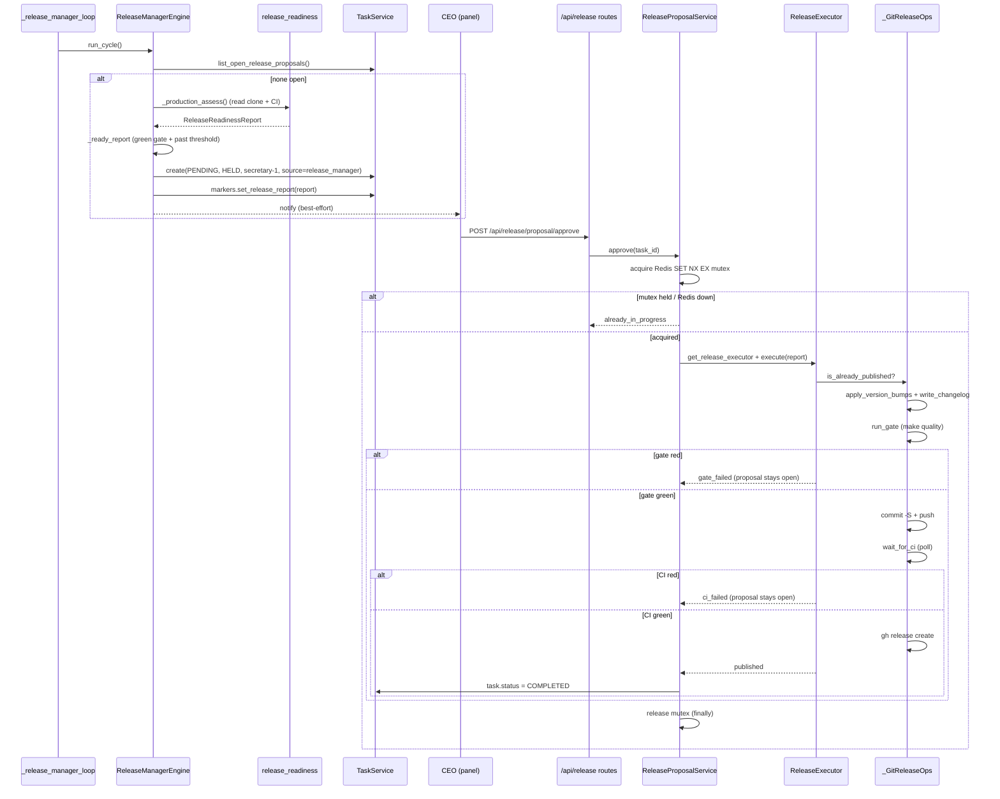

## Purpose
The gated release manager: a default-off background loop that deterministically assesses RoboCo's own repo (diff-since-tag → conventional-commit classification → semver bump → readiness gaps) and originates ONE held release PROPOSAL task for the CEO; the CEO's panel approve/reject routes call a fail-closed ReleaseExecutor that bumps versions, runs `make quality`, commits `chore(release): X.Y.Z`, waits for green release-commit CI, and `gh release create`s — aborting before commit on a red gate and before publish on red CI. It never auto-merges or auto-deploys; the CEO is the only actor who can trigger a publish.

**Env-ladder era.** Release ops now target the project's env-ladder **prod rung** (`roboco.models.env_branches.prod_branch`) instead of the raw `projects.default_branch` column — a project with no declared ladder resolves to the same value via the read-time shim, so single-branch projects are unaffected. Before bumping, the executor runs a **full-chain promotion** (`promote_env_chain`) that merges every rung between head and prod, in order, into the prod checkout — the release commits + tags the promoted state, not just prod's own prior tip — and aborts fail-closed (`promotion_failed`) before any bump on a fetch/merge conflict. `release_readiness` diffs `prod..head` (falling back to `last_tag..HEAD` when the prod rung can't be resolved) and cross-checks the last tag against the prod tip (`_tag_drift_gaps`) to flag a hotfix that landed on prod outside the ladder.

## Files

| Path | Role | LOC |
|---|---|---|
| roboco/services/release_executor.py | Fail-closed bump→gate→commit/push→CI→publish orchestrator with a Protocol seam (ReleaseOps) over a writable token-authenticated clone (_GitReleaseOps); idempotent on already-published versions; half-landed (publish_failed) retry skips re-bump/re-commit. | 490 |
| roboco/services/release_proposal.py | CEO approve/reject glue over the single held proposal task; approve runs `_approve_precheck` then dispatches the ~40min executor as a background asyncio task (returns 202 immediately); heartbeat-guarded Redis fencing-token mutex; closes proposal on published OR already_published; approve refuses a CANCELLED (`already_rejected`) or COMPLETED (`already_published`) proposal before ever touching the lock; reject records required changes and keeps it held, raising `TaskAlreadyCompletedError` if the proposal already published. | 547 |
| roboco/services/release_readiness.py | Pure conventional-commit classification + semver-derivation primitives + the git/filesystem snapshot gatherer + the assess() report builder; serializes/deserializes the report for JSONB storage on the proposal task. | 572 |
| roboco/services/release_manager_engine.py | Default-off detection loop: per interval, if no proposal is open and the gate is green and changes past threshold, originate ONE PENDING HELD Secretary-owned proposal carrying the readiness report; never publishes. | 239 |

## Key Symbols

| Name | Kind | File:Line | Responsibility |
|---|---|---|---|
| ReleaseResult | dataclass | roboco/services/release_executor.py:36 | Frozen outcome of an execute attempt: status (published/gate_failed/ci_failed/commit_failed/publish_failed/already_published/already_in_progress/lock_lost/redis_unavailable), version, files_changed, commit_sha, release_url, detail. |
| ReleaseOps | Protocol | roboco/services/release_executor.py:48 | Side-effecting release steps (is_already_published, release_commit_sha, apply_version_bumps, write_changelog_entry, run_gate, commit_and_push, wait_for_ci, publish_release) injected so the fail-closed ordering is unit-testable. |
| ReleaseExecutor | class | roboco/services/release_executor.py:70 | Orchestrates the fail-closed release pipeline over a ReleaseOps, aborting on any red step and returning a ReleaseResult. |
| ReleaseExecutor.execute | method | roboco/services/release_executor.py:76 | Bump→gate→commit/push→CI→publish; short-circuits on already_published; detects half-landed (publish_failed) retry via release_commit_sha and rejoins CI→publish tail without re-bumping; returns gate_failed/ci_failed/commit_failed/publish_failed ReleaseResult on red steps. |
| _await_proc | function | roboco/services/release_executor.py:208 | Communicate with a subprocess under a deadline; on timeout kill() the child, await proc.wait() to reap it (no zombie), and return non-zero rc so fail-closed branches fire instead of hanging the release loop. |
| _ReleaseContext | dataclass | roboco/services/release_executor.py:259 | Writable-clone coordinates: slug, prod_branch (the env-ladder prod-rung target, resolved via `roboco.models.env_branches.prod_branch`), root Path, git_url, git_prefix, ci_workflow, env_chain (the head→…→just-below-prod rung branches to promote; empty for a degenerate head==prod ladder). |
| _GitReleaseOps.promote_env_chain | method | roboco/services/release_executor.py:364 | Full-chain promotion: fetch origin, then merge (`--no-edit`) each `env_chain` branch into the prod checkout in head-first order before the bump; fail-closed RuntimeError on a fetch or merge-conflict; no-op for an empty chain (degenerate ladder). |
| _GitReleaseOps | class | roboco/services/release_executor.py:238 | Production ReleaseOps on a fresh token-authenticated writable clone: real git/make/gh with per-step subprocess deadlines. |
| _GitReleaseOps._git | method | roboco/services/release_executor.py:249 | Run a git -C <root> command under _GIT_OP_TIMEOUT_SECONDS, returning (rc, stdout). |
| _GitReleaseOps.is_already_published | method | roboco/services/release_executor.py:260 | git ls-remote --tags origin v<version>; true if the tag already exists (idempotency guard). |
| _GitReleaseOps.release_commit_sha | method | roboco/services/release_executor.py:264 | Half-landed detection: if the clone's working version == target version AND a `chore(release): {version}` commit appears in the recent log, return its sha (publish_failed retry → skip re-bump); else None. |
| _GitReleaseOps._current_version | method | roboco/services/release_executor.py:287 | Read the version string out of pyproject.toml (the old value for the bump replace). |
| _GitReleaseOps.apply_version_bumps | method | roboco/services/release_executor.py:292 | Replace old version with new across the bump plan, skipping CHANGELOG.md and bumping uv.lock only in the roboco package block. |
| _GitReleaseOps.write_changelog_entry | method | roboco/services/release_executor.py:315 | Insert the drafted CHANGELOG entry above the first released version heading. |
| _GitReleaseOps.run_gate | method | roboco/services/release_executor.py:320 | Run `make quality` in the clone under _RELEASE_GATE_TIMEOUT_SECONDS; return rc==0. |
| _GitReleaseOps.commit_and_push | method | roboco/services/release_executor.py:336 | git add -A, commit -S chore(release): <version>, rev-parse HEAD, push HEAD:default_branch; raises RuntimeError on add/commit/push failure. |
| _GitReleaseOps.wait_for_ci | method | roboco/services/release_executor.py:359 | Poll GitService.get_latest_ci_conclusion for the slug up to 80×30s (~40min), requiring head_sha match + success conclusion. |
| _GitReleaseOps.publish_release | method | roboco/services/release_executor.py:378 | gh release create v<version> --target default_branch; raises RuntimeError on non-zero rc (caught by execute → publish_failed), returns the release URL. |
| _bump_uv_lock | function | roboco/services/release_executor.py:407 | Bump only the roboco package version block inside uv.lock so a same-versioned dependency is not clobbered. |
| _insert_changelog_entry | function | roboco/services/release_executor.py:415 | Insert the new entry above the first ## [<version>] heading (Keep a Changelog format). |
| _resolve_release_ci_workflow | function | roboco/services/release_executor.py:427 | Return settings.release_ci_workflow or "ci.yml" — decoupled from self_heal_ci_workflow; never returns None or empty, so the release gate always scopes to a named workflow. |
| get_release_executor | function | roboco/services/release_executor.py:441 | Build a ReleaseExecutor over a fresh writable clone: resolve the RoboCo project, decrypt token, inject into URL, _prepare_release_clone; ci_workflow set from _resolve_release_ci_workflow(). |
| _prepare_release_clone | function | roboco/services/release_executor.py:467 | rm -rf and re-clone the release clone at workspaces_root/_release/<slug> on the default branch. |
| _run | function | roboco/services/release_executor.py:483 | Run a subprocess under _CLONE_TIMEOUT_SECONDS via _await_proc (used by _prepare_release_clone). |
| ReleaseLockUnavailable | exception | roboco/services/release_proposal.py:40 | Distinct from "lock is held" — Redis itself is unreachable (infra failure, not a concurrent approve). Both paths are fail-closed but the error surface differs. |
| TaskAlreadyCompletedError | exception | roboco/services/release_proposal.py:49 | Raised by `reject()` when the proposal is already COMPLETED (published) — a stale reject (e.g. a queued Telegram button on a proposal a concurrent approve already shipped) can't cancel a release that already happened. |
| ReleaseProposalService | class | roboco/services/release_proposal.py:77 | Find/approve/reject the single open release proposal; approve dispatches the executor as a background asyncio task (202), with a heartbeat-guarded fencing-token Redis mutex. |
| ReleaseProposalService.open_proposal | method | roboco/services/release_proposal.py:98 | Return the first non-terminal release_manager-source task or None. |
| ReleaseProposalService._approve_precheck | method | roboco/services/release_proposal.py:103 | Resolve the proposal + stored report, or a canned refusal: CANCELLED (the CEO already rejected it) returns an `already_rejected` ReleaseResult, COMPLETED (already published) returns `already_published` — both WITHOUT ever touching the Redis lock/executor. Split out of `approve()` to keep its own return-count bounded as more terminal-state guards are added. |
| ReleaseProposalService.approve | method | roboco/services/release_proposal.py:165 | Runs `_approve_precheck` first (returns its canned refusal on a terminal-state proposal); otherwise acquires the Redis fencing-token mutex (raises ReleaseLockUnavailable on Redis outage → returns redis_unavailable; returns already_in_progress if lock held); runs executor as asyncio.Task guarded by a heartbeat; marks COMPLETED on published OR already_published; returns lock_lost if heartbeat cancels execute on TTL expiry. |
| ReleaseProposalService._finalize_release_lock | method | roboco/services/release_proposal.py:191 | finally-block: cancel heartbeat/execute tasks and compare-and-del the release mutex. |
| ReleaseProposalService._acquire_release_lock | method | roboco/services/release_proposal.py:207 | SET NX EX the release mutex with a fencing-token value; returns token if acquired, None if held (concurrent approve); raises ReleaseLockUnavailable if Redis is unreachable (caller surfaces redis_unavailable, not already_in_progress). |
| ReleaseProposalService._release_release_lock | method | roboco/services/release_proposal.py:230 | Compare-and-del the release mutex via Lua CAS — only deletes if the key still holds our fencing token, so a late first-finally can't delete a usurper's lock. |
| ReleaseProposalService._heartbeat_release_lock | method | roboco/services/release_proposal.py:241 | Compare-and-expire the release mutex (Lua); returns True if we still own it. |
| ReleaseProposalService._heartbeat_loop | method | roboco/services/release_proposal.py:256 | Refreshes lock TTL while execute is running; if the lock is no longer ours (>TTL Redis outage let it expire), sets lock_lost and cancels execute fail-closed. |
| ReleaseProposalService.reject | method | roboco/services/release_proposal.py:414 | Record the CEO's required_changes marker on the proposal; keep it held for revision. Raises TaskAlreadyCompletedError when the proposal is already COMPLETED (published) — a stale reject can't lie about an already-public release's real state. |
| get_release_proposal_service | function | roboco/services/release_proposal.py:442 | Construct a ReleaseProposalService bound to a session. |
| dispatch_approve | function | roboco/services/release_proposal.py:538 | Spawn the ~40min release execute as a background asyncio.Task (registered in _INFLIGHT_APPROVES) so the HTTP route returns 202 immediately; done-callback removes the entry. |
| _run_approve_background | function | roboco/services/release_proposal.py:490 | Run approve() in a background task with a fresh session (the request session closes on the 202 response); commits on success, rolls back and logs on failure. |
| CommitInfo | dataclass | roboco/services/release_readiness.py:89 | One commit since the last release tag: sha, subject, body, pr_number, labels. |
| ClassifiedChange | dataclass | roboco/services/release_readiness.py:100 | A commit annotated with normalized kind, breaking flag, summary, needs_manual_classification. |
| _has_breaking_label | function | roboco/services/release_readiness.py:111 | True if any PR label is in the breaking-label set. |
| _classify_one | function | roboco/services/release_readiness.py:115 | Classify a commit by conventional-commit prefix, then PR-label fallback, then needs_manual_classification. |
| classify_changes | function | roboco/services/release_readiness.py:152 | Map classify_one over a list of commits. |
| derive_bump | function | roboco/services/release_readiness.py:157 | Reduce the change set to a semver bump: breaking→major, feat→minor, else patch. |
| next_version | function | roboco/services/release_readiness.py:166 | Apply a bump to a MAJOR.MINOR.PATCH string (leading v ok). |
| Gap | dataclass | roboco/services/release_readiness.py:176 | One readiness shortfall (category, detail) the CEO must see before approving. |
| ReleaseRepoSnapshot | dataclass | roboco/services/release_readiness.py:185 | Raw read-only release facts: version, last_tag, commits, version-ref files, canonical bump files, changelog, migrations, CI conclusion, agent counts, verb-tables-stale flag. |
| ReleaseReadinessReport | dataclass | roboco/services/release_readiness.py:207 | The deterministic CEO-reviewable proposal: proposed_version, bump_kind, change_summary, drafted_changelog, version_bump_plan, gaps, migration_notes, gate_state. |
| _is_documented | function | roboco/services/release_readiness.py:221 | True if a change's PR number or summary text appears in the CHANGELOG. |
| _draft_changelog | function | roboco/services/release_readiness.py:228 | Build a Keep-a-Changelog ## [version] - date block with Added/Changed/Fixed/Security sections. |
| _changelog_gaps | function | roboco/services/release_readiness.py:246 | Flag feat/fix/security/perf/refactor changes not present in the CHANGELOG. |
| _version_ref_gaps | function | roboco/services/release_readiness.py:259 | Flag files embedding the current version but not in the canonical bump plan. |
| _docs_drift_gaps | function | roboco/services/release_readiness.py:271 | Flag declared-vs-actual agent-count mismatch and stale verb-surface tables. |
| _migration_gaps_and_notes | function | roboco/services/release_readiness.py:291 | Emit migration run-notes for new migrations and a gap if there is >1 alembic head. |
| _gate_state | function | roboco/services/release_readiness.py:312 | Map a CI conclusion to green/unknown/red. |
| assess | function | roboco/services/release_readiness.py:320 | Turn a snapshot into a gap-flagged ReleaseReadinessReport (classify → derive bump → next version → assemble gaps → draft changelog). |
| _run_git | function | roboco/services/release_readiness.py:365 | Synchronous git subprocess helper (capture stdout, no check). |
| _pyproject_version | function | roboco/services/release_readiness.py:375 | Read the version out of pyproject.toml. |
| _last_tag | function | roboco/services/release_readiness.py:381 | git describe --tags --abbrev=0 (most recent tag) or None. |
| _commits_since | function | roboco/services/release_readiness.py:386 | git log <tag>..HEAD with record/field separators; parse into CommitInfo with PR-number extraction. |
| _tracked_files_with_version | function | roboco/services/release_readiness.py:408 | git grep -lF <version> excluding tests/ — files embedding the version string. |
| _canonical_bump_files | function | roboco/services/release_readiness.py:415 | Derive the bump set from the previous chore(release): commit's files (subject-filtered), falling back to the version-ref scan on first release. |
| _new_migrations | function | roboco/services/release_readiness.py:447 | git diff --name-only --diff-filter=A <tag>..HEAD -- alembic/versions/. |
| _migration_head_count | function | roboco/services/release_readiness.py:464 | Parse alembic/versions/*.py revision/down_revision lines; count unreferenced heads. |
| _declared_agent_count | function | roboco/services/release_readiness.py:484 | Regex the 'N AI agents' declaration out of roboco/__init__.py. |
| _actual_agent_count | function | roboco/services/release_readiness.py:493 | Count non-system/non-ceo rows in foundation.identity.AGENTS (best-effort). |
| gather_snapshot | function | roboco/services/release_readiness.py:505 | Build a ReleaseRepoSnapshot from a real checkout (read-only); verb_tables_stale left False (regen would write). |
| _read_changelog | function | roboco/services/release_readiness.py:534 | Read CHANGELOG.md or '' on OSError. |
| report_to_dict | function | roboco/services/release_readiness.py:541 | Serialize a report to a plain dict for JSONB marker storage. |
| report_from_dict | function | roboco/services/release_readiness.py:557 | Rebuild a report from its stored dict (inverse of report_to_dict). |
| ReleaseAssessor | type alias | roboco/services/release_manager_engine.py:58 | Callable[[], Awaitable[ReleaseReadinessReport / None]] — injectable assessor (default production, tests synthetic). |
| _roboco_slug | function | roboco/services/release_manager_engine.py:61 | The registered project that IS RoboCo itself (self_heal_project_slug or 'roboco-api'). |
| _past_threshold | function | roboco/services/release_manager_engine.py:66 | True when commit count >= release_min_commits OR bump is non-patch OR any security change. |
| _proposal_description | function | roboco/services/release_manager_engine.py:75 | Human-readable proposal body: version, bump, change count, gate, drafted CHANGELOG, gaps, migrations. |
| ReleaseManagerEngine | class | roboco/services/release_manager_engine.py:95 | Detect release-readiness and originate ONE CEO-gated held proposal; never publishes. |
| ReleaseManagerEngine.run_cycle | method | roboco/services/release_manager_engine.py:106 | No-op unless enabled; if no proposal open, ready_report, resolve project, originate. |
| ReleaseManagerEngine._ready_report | method | roboco/services/release_manager_engine.py:130 | Assess; return report only when gate is green and past threshold, else None. |
| ReleaseManagerEngine._originate | method | roboco/services/release_manager_engine.py:149 | Create a PENDING HELD Secretary-owned ADMINISTRATIVE task with the report marker; notify CEO. |
| ReleaseManagerEngine._notify_ceo | method | roboco/services/release_manager_engine.py:188 | Best-effort ack-notification to the CEO summarizing the proposal (never blocks origination). |
| ReleaseManagerEngine._production_assess | method | roboco/services/release_manager_engine.py:206 | Real path: ensure read clone, fetch CI conclusion, gather_snapshot, assess; None on any resolution failure. |
| get_release_manager_engine | function | roboco/services/release_manager_engine.py:234 | Build a ReleaseManagerEngine with optional injected assessor. |

## Data Flow
DETECT loop: the orchestrator spawns `_release_manager_loop` (an asyncio task started in `start()`) which, when `release_manager_enabled`, sleeps `release_manager_interval_seconds` then calls `_run_release_manager_cycle` → opens a DB session → `get_release_manager_engine(db).run_cycle()`. `run_cycle` short-circuits if disabled, if `TaskService.list_open_release_proposals()` already returns one (dedup by `source='release_manager'` + non-terminal status), or if `_ready_report()` returns None. `_ready_report` calls the injected assessor (default `_production_assess`): resolve the RoboCo project by `self_heal_project_slug`, `WorkspaceService.ensure_read_clone` (pinned to the **head** rung's HEAD), `GitService.get_latest_ci_conclusion`, then best-effort fetch the project's **prod** rung into that head-pinned read clone (`_ensure_prod_fetched` — a no-op when prod==head; a fetch failure degrades to the `last_tag..HEAD` baseline rather than aborting) so `origin/<prod>` resolves, then `gather_snapshot(read_clone_root, master_ci_conclusion, prod_branch=prod_for_snapshot)` + `assess(snapshot, today)`. `assess` runs `classify_changes` → `derive_bump` → `next_version` → assembles gaps (changelog, version_ref, docs_drift, migration, classification, gate). If green + past threshold, `_originate` creates a PENDING HELD `RELEASE_MANAGER_SOURCE` task owned by `secretary-1` via `TaskService.create(TaskCreateRequest(..., confirmed_by_human=False))`, stores the report dict via `markers.set_release_report`, flushes, and best-effort notifies the CEO. The orchestrator cycle commits the session.

CEO ACT path: `GET /api/release/proposal` (CEO-only) → `ReleaseProposalService.open_proposal()` → `list_open_release_proposals()[0]`. `POST /proposal/approve` (returns 202 immediately): route calls `dispatch_approve(task_id, session_factory)` which spawns `_run_approve_background` as a background asyncio.Task (the request session closes at the 202 return; the background task opens a fresh session). In `approve(task_id)`: loads the task, verifies `source == RELEASE_MANAGER_SOURCE`, reads `markers.get_release_report`; acquires Redis fencing-token mutex (`SET NX EX 3000`) — raises `ReleaseLockUnavailable` on Redis outage → returns `redis_unavailable`; returns `already_in_progress` if lock is held. Then: `get_release_executor(session)` → `executor.execute(report)` run as `asyncio.Task` while a `_heartbeat_loop` task refreshes the TTL every 60s (cancels execute and returns `lock_lost` if the lock is no longer ours). `get_release_executor` resolves the project + token, clones at the **prod rung** (`roboco.models.env_branches.prod_branch`) — not the raw `default_branch` column — computes `env_chain` via `promotion_chain(project)` (the head→…→just-below-prod rungs to promote; empty for a degenerate head==prod ladder), and injects the token as a per-call `http.extraheader` (never into argv); `ci_workflow` is set from `_resolve_release_ci_workflow()` (not self_heal_ci_workflow). `execute`: `is_already_published` (ls-remote tag); `release_commit_sha` (half-landed check — if prior release commit on branch, skip re-bump and rejoin CI→publish tail); else `_run_fresh_release`: `promote_env_chain` (fetch origin + merge each `env_chain` branch into the prod checkout head-first; a fetch/merge failure aborts fail-closed with `promotion_failed` before any bump) → `apply_version_bumps` (replace old version across plan, uv.lock scoped) + `write_changelog_entry` → `run_gate` (make quality, 1800s) → `commit_and_push` (add -A, commit -S, push HEAD:prod_branch; RuntimeError → `commit_failed`) → `wait_for_ci` (poll GitService 80×30s, scoped to release_ci_workflow) → `publish_release` (REST POST to the GitHub releases API — the orchestrator image ships no `gh` binary; RuntimeError → `publish_failed`). On `published` OR `already_published`, the proposal task is set COMPLETED + flushed, and the publish-success path then hands the release to the best-effort post-publish hooks: `_draft_x_post(report)`, `_draft_video(report)`, and `_draft_docs_update(report)`. Each hook catches `Exception` broadly and logs a warning so a drafting/origination failure never affects the already-succeeded release. `_draft_docs_update` invokes `DocsSyncEngine.originate_docs_update(version=report.proposed_version, changelog=report.drafted_changelog)`; if `ROBOCO_DOCS_SYNC_ENABLED` is on and `roboco-website` is registered, exactly one PENDING Main-PM docs-update task is created for that release tag. On gate/CI/commit/publish failure a ReleaseResult is returned and the proposal stays open. The background task commits the session on success, rolls back on failure. The panel polls `GET /proposal` for the final status. `POST /proposal/reject` → `svc.reject(task_id, required_changes)` writes `markers.set_release_required_changes` and keeps the task held.

## Mermaid


## Logical Tree
```
release-manager slice
├── release_manager_engine.py  (detect loop, default-off)
│   ├── ReleaseManagerEngine
│   │   ├── run_cycle            (gate + dedup + originate)
│   │   ├── _ready_report        (assess → green + threshold filter)
│   │   ├── _originate           (create HELD proposal task + report marker + CEO notify)
│   │   └── _production_assess   (read clone + CI conclusion + gather_snapshot + assess)
│   ├── _past_threshold          (commit floor OR non-patch OR security)
│   └── _proposal_description    (human-readable proposal body)
├── release_readiness.py  (pure readiness + git snapshot)
│   ├── primitives
│   │   ├── classify_changes / _classify_one   (conventional-commit + label fallback)
│   │   ├── derive_bump                         (breaking>feat>patch)
│   │   └── next_version                        (semver apply)
│   ├── report builder
│   │   ├── assess                              (snapshot → gaps + drafted changelog + plan)
│   │   ├── _changelog_gaps / _version_ref_gaps / _docs_drift_gaps / _migration_gaps_and_notes / _gate_state
│   │   └── _draft_changelog
│   ├── gather_snapshot                         (read-only git + filesystem I/O)
│   │   ├── _pyproject_version / _last_tag / _commits_since
│   │   ├── _tracked_files_with_version         (excludes tests/)
│   │   ├── _canonical_bump_files               (prev chore(release): files, subject-filtered, first-release fallback)
│   │   ├── _new_migrations / _migration_head_count
│   │   └── _declared_agent_count / _actual_agent_count
│   └── report_to_dict / report_from_dict       (JSONB marker ser/de)
├── release_proposal.py  (CEO approve/reject glue)
│   └── ReleaseProposalService
│       ├── open_proposal
│       ├── approve               (Redis mutex → executor → COMPLETED on publish)
│       │   ├── _acquire_release_lock   (SET NX EX, fail-closed)
│       │   └── _release_release_lock   (DEL, best-effort)
│       └── reject                (record required_changes, keep held)
└── release_executor.py  (fail-closed publish pipeline)
    ├── ReleaseExecutor.execute   (bump→gate→commit→CI→publish, abort on red)
    ├── ReleaseOps Protocol        (test seam)
    ├── _GitReleaseOps             (production: real git/make/gh with deadlines)
    │   ├── is_already_published / apply_version_bumps / write_changelog_entry
    │   ├── run_gate / commit_and_push / wait_for_ci / publish_release
    │   └── _bump_uv_lock / _insert_changelog_entry helpers
    ├── _await_proc                (subprocess deadline + kill-on-timeout)
    └── get_release_executor / _prepare_release_clone  (writable clone bootstrap)
```

## Dependencies
- Internal: roboco.config.settings (release_manager_enabled, release_min_commits, release_manager_interval_seconds, self_heal_project_slug, self_heal_ci_workflow, workspaces_root, redis_url), roboco.models.env_branches (head_branch, prod_branch, promotion_chain — the env-ladder resolvers backing the release clone/commit/tag target, the full-chain promotion, and the readiness diff baseline), roboco.services.task.TaskService / TaskCreateRequest / RELEASE_MANAGER_SOURCE / get_task_service, roboco.services.project.ProjectService / get_project_service, roboco.services.workspace.WorkspaceService / get_workspace_service / ensure_read_clone / _inject_token_into_url, roboco.services.git.GitService / get_git_service / get_latest_ci_conclusion, roboco.services.notification.NotificationService.send_ack_notification, roboco.services.base.BaseService, roboco.foundation.identity.AGENTS (secretary-1, system), roboco.foundation.policy.content.markers (get_release_report, set_release_report, set_release_required_changes, get_release_required_changes), roboco.models.base (TaskStatus, TaskType, Team, Complexity, TaskNature, AgentRole), roboco.db.tables.TaskTable, roboco.api.routes.release (CEO-only routes), roboco.api.schemas.release, roboco.runtime.orchestrator._release_manager_loop / _run_release_manager_cycle
- External: asyncio (subprocess, wait_for, sleep), subprocess (sync git in release_readiness), pathlib.Path, re, dataclasses, structlog, redis.asyncio, sqlalchemy.ext.asyncio.AsyncSession, fastapi (routes)

## Entry Points

| Name | File | Trigger |
|---|---|---|
| _release_manager_loop | roboco/runtime/orchestrator.py | asyncio task created in Orchestrator.start() (line 1063); sleeps release_manager_interval_seconds then _run_release_manager_cycle → get_release_manager_engine(db).run_cycle() |
| GET /api/release/proposal | roboco/api/routes/release.py | CEO panel fetch of the held proposal (CEO-only, 404 when none); panel polls this to get final status after a 202 approve |
| POST /api/release/proposal/approve | roboco/api/routes/release.py | CEO panel approve → dispatch_approve → background _run_approve_background → ReleaseProposalService.approve → ReleaseExecutor.execute (returns 202 immediately; panel polls GET /proposal for outcome) |
| POST /api/release/proposal/reject | roboco/api/routes/release.py | CEO panel reject-with-changes → ReleaseProposalService.reject (keep held) |

## Config Flags
- ROBOCO_RELEASE_MANAGER_ENABLED (release_manager_enabled, default False) — master switch; when off the loop returns immediately and no proposal is ever originated
- ROBOCO_RELEASE_MIN_COMMITS (release_min_commits, default 8, min 1) — commit floor for the _past_threshold gate
- ROBOCO_RELEASE_MANAGER_INTERVAL_SECONDS (release_manager_interval_seconds, default 3600, min 60) — sleep between assessment passes
- ROBOCO_SELF_HEAL_PROJECT_SLUG (self_heal_project_slug) — reused as the 'this project IS RoboCo' pointer (default 'roboco-api')
- ROBOCO_RELEASE_CI_WORKFLOW (release_ci_workflow, default "ci.yml") — dedicated workflow name for the release fail-closed CI gate; decoupled from ROBOCO_SELF_HEAL_CI_WORKFLOW (which allows empty-string for single-workflow repos — inheriting that would degrade the release gate to the unreliable all-workflows mode); empty or unset falls back to "ci.yml", never None
- ROBOCO_SELF_HEAL_CI_WORKFLOW (self_heal_ci_workflow) — reused as the read-clone CI conclusion in release_manager_engine._production_assess (NOT the executor's release-commit CI gate — that uses ROBOCO_RELEASE_CI_WORKFLOW)
- ROBOCO_WORKSPACES_ROOT (workspaces_root) — base for the read clone and the _release/<slug> writable clone
- ROBOCO_REDIS_URL (redis_url) — the approve-mutex backing store


## Gotchas
- [FIXED 05616607+2759edf7] Redis mutex TTL (3000s = 50min) was shorter than the worst-case execute path — RESOLVED by a heartbeat loop (_heartbeat_loop) that calls _heartbeat_release_lock (compare-and-expire Lua) every 60s to refresh the TTL while execute owns the lock. The TTL is now a crash backstop, not a hard ceiling. If the heartbeat detects lock-loss (an extended Redis outage let the TTL expire), it cancels execute fail-closed (lock_lost result) so a concurrent approve can't rm -rf the in-flight clone.
- [FIXED 05616607] _acquire_release_lock formerly returned None on Redis outage causing approve to return already_in_progress — RESOLVED: now raises ReleaseLockUnavailable so approve returns a distinct redis_unavailable result. The CEO knows to fix Redis rather than waiting on a phantom concurrent approve. Still fail-closed (execute never runs).
- [FIXED 2759edf7] _GitReleaseOps.commit_and_push raised RuntimeError that execute did NOT catch → 500. RESOLVED: execute now wraps commit_and_push in try/except RuntimeError and returns a structured commit_failed ReleaseResult. Similarly publish_release RuntimeError now returns publish_failed instead of propagating.
- [FIXED 2759edf7] _await_proc on timeout called proc.kill() but never awaited proc.wait() — zombie risk. RESOLVED: _await_proc now awaits proc.wait() after kill(), and contextlib.suppress(ProcessLookupError) handles already-exited children.
- [FIXED 0bf6c848] The ~40min synchronous HTTP approve blocked the server and 504'd at any proxy. RESOLVED: POST /proposal/approve now returns 202 immediately and dispatches the execute as a background asyncio.Task (dispatch_approve → _run_approve_background with a fresh session). The panel polls GET /proposal for the final status.
- [FIXED 05616607] approve formerly marked COMPLETED only on status=="published" — a retry that finds the tag already published (prior publish whose route 504'd left proposal non-terminal) left it wedged open. RESOLVED: both "published" and "already_published" now close the proposal.
- _canonical_bump_files first-release fallback now returns _tracked_files_with_version (which excludes tests/). Before the change it returned [], so _version_ref_gaps would flag every version-ref file on first release; now the fallback makes planned==tracked so first-release version_ref gaps are silently empty. Intended, but means the first-release gap report is weaker than subsequent releases.
- _canonical_bump_files uses `git log --grep ^chore(release):` then filters by subject prefix; if a real release commit's subject was ever not exactly `chore(release): X.Y.Z` (e.g. a merge-commit subject), it would be skipped and a stale/false bump set used.
- [FIXED 2759edf7] wait_for_ci formerly inherited self_heal_ci_workflow which allows empty/None, risking an all-workflows-mode conclusion on a multi-workflow repo. RESOLVED: the executor now calls _resolve_release_ci_workflow() which always returns a non-empty named workflow (ROBOCO_RELEASE_CI_WORKFLOW or "ci.yml" fallback), so wait_for_ci always scopes the CI poll to a specific workflow.
- The proposal is created with status=PENDING and confirmed_by_human=False but the release-manager loop NEVER cancels it on a subsequent cycle — list_open_release_proposals dedups by non-terminal status, so a stale PENDING proposal blocks all future proposals until the CEO acts. There is no expiry/reaper for an abandoned proposal.
- apply_version_bumps does a naive str.replace(old, new) on every non-uv.lock, non-CHANGELOG file in the plan. If the current version string appears as a substring of an unrelated value in any bump file (e.g. a comment, a path), it gets clobbered. The bump plan is derived from the previous release commit's files, so this is bounded but not surgical.
- _prepare_release_clone rm -rf's workspaces_root/_release/<slug> with no locking at the filesystem level — the Redis mutex is the only guard, and it is per-proposal-task, not per-clone-path. Two different proposals for the same slug (impossible while dedup holds, but dedup is by source+non-terminal, so a CANCELLED + new PENDING could overlap) would race the rm -rf.
- `_approve_precheck`'s two refusals (already_rejected / already_published) exist because a live-reproduced hole let a stale approve resurrect a proposal the CEO had already rejected or that a concurrent approve had already published — the callback surface that made this reachable is Telegram's inline Approve button, which targets a proposal by id regardless of its current status (a stale, still-clickable button in an old chat message), but the same hole was equally reachable by replaying the HTTP route, so the fix is in the service, not the Telegram layer.

## Changes Since Baseline

| SHA | Subject | Impact |
|---|---|---|
| 15effce0 | Chore: 141 Gaps fill-in (#283) — release_executor.py | Added per-subprocess deadlines via _await_proc (git 300s, gate 1800s, publish 300s, clone 600s) with kill-on-timeout returning rc=124 so fail-closed branches fire instead of hanging the release loop. commit_and_push now checks add/commit rc and raises RuntimeError on failure (previously fire-and-forget: a failed commit would still push the pre-bump base as the release). |
| 15effce0 | Chore: 141 Gaps fill-in (#283) — release_proposal.py | Added a Redis SET-NX-EX mutex keyed by proposal id around approve() (F013) — a concurrent approve/double-click returns already_in_progress instead of racing on the rm -rf'd writable clone. Fail-closed on Redis outage (treated as held). Proposal still only COMPLETED on status==published. |
| 15effce0 | Chore: 141 Gaps fill-in (#283) — release_readiness.py | _canonical_bump_files signature changed to take `version`; the git-log grep now filters candidates by subject prefix `chore(release):` (was matching any body line that referenced the type, shadowing the real release commit). First-release fallback changed from returning [] to returning the version-ref scan, so the first release now has a real bump plan and no spurious version_ref gaps. |

> Post-snapshot updates (since 2026-06-29):
> - 536bbb64 Chore/all/logical gaps sweep (#286) — PR merge carrying the sweep commits below.
> - 2759edf7 [B-REL] release executor: idempotent half-landed retry + commit-scoped CI + decoupled workflow — adds `release_commit_sha` to ReleaseOps/`_GitReleaseOps` for half-landed (publish_failed) retry detection (reuse existing release commit, skip re-bump); execute now catches commit_and_push RuntimeError → `commit_failed` and publish_release RuntimeError → `publish_failed`; `_await_proc` now awaits `proc.wait()` after kill (zombie fix); decoupled release CI gate from self_heal_ci_workflow via new `_resolve_release_ci_workflow()` / `settings.release_ci_workflow` (`ROBOCO_RELEASE_CI_WORKFLOW`, default "ci.yml").
> - 05616607 [chore] logical-gaps: release-proposal already_published closes proposal + heartbeat-lock-loss cancels execute — adds `ReleaseLockUnavailable` exception (Redis outage → `redis_unavailable` result, not `already_in_progress`); fencing-token compare-and-del (`_RELEASE_LOCK_RELEASE_SCRIPT` Lua) + compare-and-expire heartbeat (`_RELEASE_LOCK_HEARTBEAT_SCRIPT` Lua, `_heartbeat_loop`, `_heartbeat_release_lock`); `lock_lost` result when heartbeat detects TTL expiry and cancels execute fail-closed; `_finalize_release_lock` finally helper; approve now closes proposal on `already_published` in addition to `published`.
> - 0bf6c848 [chore] logical-gaps: release approve async dispatch (202) — adds `dispatch_approve` + `_run_approve_background` + `_INFLIGHT_APPROVES` registry; POST /proposal/approve returns 202 immediately; the ~40min execute runs in a background asyncio.Task with a fresh session; panel polls GET /proposal for final status.
> - b3558d4e [chore] complexity: split 5 C-rank blocks to <=B for the xenon gate — refactored large methods in executor/proposal for xenon compliance; no behavior change.
> - 8621d01d / fe9940de / d80dfb8b (#534, env-branches ladder) — replaces `default_branch`-keyed release targeting: `_ReleaseContext` gains `prod_branch` (renamed from `default_branch`) + `env_chain`; `get_release_executor` resolves the clone/commit/tag target via `roboco.models.env_branches.prod_branch` and computes `env_chain` via `promotion_chain`; `_GitReleaseOps` gains `promote_env_chain` (fetch + head-first merge of `env_chain` into the prod checkout, fail-closed `promotion_failed` on conflict), run as the first step of `_run_fresh_release`, before any version bump; `release_readiness.gather_snapshot` takes an optional `prod_branch` and diffs `prod..head` (falling back to `last_tag..HEAD` when unset) with a new `_tag_drift_gaps` check (last-tag sha vs. prod tip); `release_manager_engine._production_assess` best-effort fetches the prod rung into the head-pinned read clone before gathering the snapshot. A project with no declared ladder is unaffected (the shim resolves prod_branch/head_branch to the same `default_branch` value).
> - `11915f36` (PR #551, Telegram V2 security follow-up) — `_approve_precheck` (new) makes `approve()` refuse a CANCELLED proposal (`already_rejected`) or a COMPLETED one (`already_published`) BEFORE touching the Redis lock/executor; `reject()` now raises the new `TaskAlreadyCompletedError` on a COMPLETED proposal instead of silently cancelling an already-public release. Closes a live-reproduced approve-after-reject hole reachable via a stale Telegram Approve button (or a replayed HTTP call).

## Regression Risks

| Title | File:Line | Claim | Severity |
|---|---|---|---|
| [RESOLVED 05616607+2759edf7] Redis mutex TTL shorter than worst-case execute — concurrent approve can race the rm -rf clone | roboco/services/release_proposal.py:52 | RESOLVED: heartbeat loop (_heartbeat_loop) refreshes TTL every 60s via compare-and-expire Lua while execute is running; the 3000s TTL is now a crash backstop. On lock-loss (extended Redis outage let TTL expire) the heartbeat cancels execute fail-closed and approve returns lock_lost — a concurrent approve therefore cannot rm -rf the in-flight clone. | high |
| [RESOLVED 2759edf7] commit_and_push RuntimeError unhandled by execute → 500 instead of structured ReleaseResult | roboco/services/release_executor.py:336 | RESOLVED: execute now wraps commit_and_push in try/except RuntimeError and returns commit_failed; publish_release RuntimeError returns publish_failed. All failure paths now surface as structured ReleaseResult, not 500s. | medium |
| [RESOLVED 05616607] Redis outage fully blocks release approval (fail-closed = treat as held) | roboco/services/release_proposal.py:207 | RESOLVED: _acquire_release_lock raises ReleaseLockUnavailable on any Redis exception; approve returns redis_unavailable (distinguished from already_in_progress so the CEO knows to fix Redis rather than waiting). Still fail-closed — execute never runs without the mutex. | medium |
| _canonical_bump_files first-release fallback silences version_ref gaps | roboco/services/release_readiness.py:444 | On first release (no prior chore(release): commit) the bump plan equals _tracked_files_with_version, so _version_ref_gaps emits zero gaps. The CEO no longer sees 'these files hold the version but are not in the bump plan' on the first release — weaker readiness signal, intentional by design (comment explains). | low |
| [RESOLVED 2759edf7] _await_proc leaves zombie on timeout (kill without wait) | roboco/services/release_executor.py:214 | RESOLVED: _await_proc now awaits proc.wait() after proc.kill(); contextlib.suppress(ProcessLookupError) handles already-exited children. | low |

## Health
The slice is well-structured: deterministic correctness lives in pure primitives (release_readiness) with a Protocol seam (ReleaseOps) making the fail-closed ordering unit-testable, and the detect→originate→hold→CEO-approve→publish separation is clean and matches CLAUDE.md. Post-snapshot hardening rounds (2759edf7, 05616607, 0bf6c848) resolved all four previously-flagged regression risks: (1) the Redis mutex TTL race is closed by a heartbeat loop that keeps the TTL refreshed and aborts execute fail-closed on lock-loss; (2) commit_and_push/publish_release RuntimeErrors are now caught by execute and returned as structured commit_failed/publish_failed results (no 500); (3) Redis outage now returns redis_unavailable (not already_in_progress) so the CEO knows to fix Redis; (4) the zombie-on-timeout is fixed by awaiting proc.wait(). The approve route is now async-202 with a background dispatcher (dispatch_approve). The half-landed (publish_failed) retry path (release_commit_sha) closes the prior gap where a second CEO approve re-inserted the changelog entry and created a duplicate release commit. The release CI gate is decoupled from self_heal_ci_workflow via a dedicated settings.release_ci_workflow. One low-severity known-by-design item remains: first-release version_ref gap suppression (intentional). release_manager_engine.py and release_readiness.py are unchanged since 15effce0.
