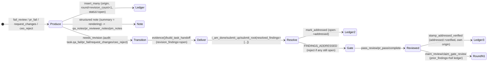

# RoboCo Map — `review-findings` slice

## Purpose

The revision-findings ledger: the structured replacement for prose-only QA/PR-gate/PM/CEO bounce feedback. Before this slice, a rejection was an `issues: list[str]` flattened into free text (or, for `request_changes`/`ceo_reject`, not even that — a raw `dev_notes` append the next developer handoff note silently overwrote). Now all four failure producers (`fail_review`, `pr_fail`, `request_changes`, `ceo_reject`) validate structured `Finding`s, persist one append-only row per finding to `task_review_findings` (migration 071), render a deterministic per-finding summary into the existing note-mirror columns (`qa_notes`/`pr_reviewer_notes`/the new `pm_notes`), and deliver the open ledger to every downstream consumer — the bounced dev's `evidence()`, a round-2+ reviewer's `claim_review`/`claim_gate_review`, the orchestrator's respawn prompts, the panel's Findings tab, metrics, and vault task notes. Always-on — no feature flag, this is core delivery lifecycle.

## Files

| Path | Role | LOC |
|---|---|---|
| `alembic/versions/071_review_findings.py` | Migration: `task_review_findings` table + `tasks.pm_notes` column | 81 |
| `roboco/db/tables.py` | `TaskReviewFindingTable` ORM class + `TaskTable.pm_notes` column | (slice ~60 lines within a shared file) |
| `roboco/services/repositories/review_findings.py` | `ReviewFindingsRepository` — insert/list/aggregate/mark_addressed/mark_verified/mark_waived | 164 |
| `roboco/foundation/policy/content/enums.py` | `Severity` StrEnum (`blocker`/`major`/`minor`/`nit`) | 35 |
| `roboco/foundation/policy/content/models.py` | `Finding` (extended: `fix`/`evidence`, caps, repo-relative `file`), `QaNote.findings`, new `PmReviewContent` ("pm_review"), `validate_findings` | 614 (whole content-model file) |
| `roboco/services/content_notes.py` | `_MIRROR_COLUMN["pm_review"] = "pm_notes"` | (1-line addition within a shared file) |
| `roboco/services/gateway/choreographer/findings.py` | Shared producer helpers: shim, count guard, criterion check, ledger insert/render, verify-stamp | 256 |
| `roboco/services/gateway/choreographer/qa.py` | `fail_review` — QA-origin producer | (slice within a shared file) |
| `roboco/services/gateway/choreographer/pr_gate.py` | `pr_fail` — pr_gate-origin producer; `pr_pass` — verify-stamp | (slice within a shared file) |
| `roboco/services/gateway/choreographer/_impl.py` | `request_changes` — pm-origin producer; `i_am_done`/`submit_up`/`submit_root` — `resolved_findings` resolution; `complete` — verify-stamp | (slice within a shared file) |
| `roboco/services/task.py` | `ceo_reject` — ceo-origin producer + reason validation; `ceo_approve` — best-effort verify-stamp; `_audit_events_for` — `task.request_changes`/`task.ceo_reject`; `qa_fail`/`request_changes` dev_notes-append removal | (slice within an 8.7k-line file) |
| `roboco/foundation/policy/tracing.py` | `Requirement.FINDINGS_ADDRESSED`, `GateContext.open_finding_ids`, `_check_findings_addressed` | (slice within a shared file) |
| `roboco/services/gateway/evidence_builder.py` | `EvidencePayload.revision_findings`/`.prior_findings`, `build_task_handoff` findings, `render_findings`, `_extract_qa_review`/`_extract_pm_review` | 393 |
| `roboco/services/gateway/remediation.py` | `hint_for_open_findings` | 111 |
| `roboco/runtime/orchestrator.py` | `REVISION_REQUIRED` prompt findings block, PM triage "bounced" block, `_open_findings_prompt_block`/`_revision_bounced_block` | (slice within a shared file) |
| `roboco/mcp/flow_server.py` | MCP param wiring: `findings`/`resolved_findings` on the 6 affected tools | (slice within a shared file) |
| `roboco/api/schemas/v1/flow.py` | `ResolvedFindingInput`; `findings`/`resolved_findings` fields on the flow request schemas | (slice within a shared file) |
| `roboco/api/routes/tasks.py` | `GET /{task_id}/findings` route | (slice within a shared file) |
| `roboco/api/schemas/tasks.py` | `TaskFindingResponse`/`TaskFindingsSummaryRow`/`TaskFindingsResponse`; `TaskResponse.revision_count`/`.pm_notes` | 1035 (whole schema file) |
| `roboco/services/metrics.py` | `_REWORK_EVENT_TYPES`/`_REWORK_EVENT_TO_FIELD`, `pm_rejects`/`ceo_rejects` on `AgentReworkRate`, `findings_open`/`findings_total` on `get_task_metrics` | (slice within a shared file) |
| `roboco/models/metrics.py` | `AgentReworkRate`/`TaskMetrics` gain `pm_rejects`/`ceo_rejects`(/`findings_open`/`findings_total`) | (slice within a shared file) |
| `roboco/services/vault_assembly.py` | `_resolve_findings` — fail-open findings fetch for `TaskNoteData` | (slice within a shared file) |
| `roboco/services/vault_writer.py` | `FindingRow`, `_FINDINGS_CAP=20`, `_findings_section` — task note `## Findings` | (slice within a shared file) |
| `panel/src/components/tasks/task-detail/tab-findings.tsx` | `TabFindings` — per-round findings view | 169 |
| `panel/src/components/tasks/task-detail/task-header.tsx` | `bounced xN` chip (`revision_count`) | (slice within a shared file) |
| `panel/src/components/tasks/task-detail/task-tabs.tsx` | "Findings" tab wiring | (slice within a shared file) |
| `panel/src/hooks/use-tasks.ts` / `panel/src/lib/api/tasks.ts` | `useTaskFindings` / `tasksApi.getFindings` | (slice within shared files) |
| `panel/src/components/metrics/delivery-tab.tsx` | "PM rejects"/"CEO rejects" rework columns | (slice within a shared file) |

## Key Symbols

| Name | Kind | File:Line | Responsibility |
|---|---|---|---|
| `TaskReviewFindingTable` | ORM class | `roboco/db/tables.py` | The append-only ledger row: `task_id`, `origin`, `round`, `author_slug`, `file`/`line`/`severity`/`criterion`/`expected`/`actual`/`fix`/`evidence`, `status`, `addressed_by_commit`, `resolution_note`. `origin`/`severity`/`status` are plain `String` columns, not a native Postgres enum. |
| `Finding` | Pydantic model | `roboco/foundation/policy/content/models.py:92` | One structured finding, shared by `post_pr_review` (external PRs) and the four internal producers. Caps: `file` ≤300 (repo-relative, no `..`), `line` ≥1, `expected`/`actual` ≤300, `fix` ≤500, `evidence` ≤2000. `criterion` has **no Pydantic `max_length`** despite the DB column being `String(500)` — see Regression Risks. |
| `PmReviewContent` | Pydantic model | `roboco/foundation/policy/content/models.py` | New content type `"pm_review"` (`summary` + `findings`, no separate `verdict` — the transition to `needs_revision` IS the verdict); mirrors to the new `tasks.pm_notes` column via `_MIRROR_COLUMN`. |
| `ReviewFindingsRepository` | class | `roboco/services/repositories/review_findings.py:32` | `insert_many` (append rows, one flush, no independent commit), `list_for_task` (default cap 500, newest round first), `status_counts_for_task` (SQL `GROUP BY (origin, status)`, whole ledger — independent of the 500 cap), `mark_addressed` (8-char-prefix match against OPEN rows, no-op on 0 or >1 matches, never raises), `mark_verified` (bulk, by full id), `mark_waived` (exists, unwired — no verb calls it). |
| `findings_count_guard` / `findings_count_hint` | functions | `roboco/services/gateway/choreographer/findings.py:98,115` | Hard-reject `Envelope` above `FINDINGS_HARD_CAP=10`; non-blocking hint above `FINDINGS_NUDGE_COUNT=5`. |
| `issues_to_findings` / `merge_findings_and_issues` | functions | `roboco/services/gateway/choreographer/findings.py:57,81` | Legacy `issues: list[str]` shim → file-less `severity=major` findings (deprecation-logged); merges with any `findings` sent in the same call rather than one silently dropping the other. |
| `next_round` | function | `roboco/services/gateway/choreographer/findings.py:43` | `(task.revision_count or 0) + 1`, read BEFORE the transition — the round a finding written during this call belongs to. |
| `unknown_finding_criteria` / `criterion_mismatch_rejection` | functions | `roboco/services/gateway/choreographer/findings.py:127,147` | A supplied `criterion` must match an `acceptance_criteria_ids` entry or exact AC text, or the call is rejected. |
| `insert_and_render` / `render_findings_summary` / `render_finding_line` | functions | `roboco/services/gateway/choreographer/findings.py:186,176,163` | Ledger insert chokepoint (all 3 choreographer producers share it) + the deterministic `[F-id8] file:line (severity) — expected → actual → fix` rendering used for both the structured note's `summary` and the A2A body. |
| `stamp_addressed_verified` | function | `roboco/services/gateway/choreographer/findings.py:243` | Bulk-promotes `addressed→verified` for one `origin` on a task; not best-effort except at the `ceo_approve` call site. |
| `fail_review` | async verb | `roboco/services/gateway/choreographer/qa.py` | QA-origin producer: `(qa_agent_id, task_id, issues=None, findings=None)`. |
| `pr_fail` | async verb | `roboco/services/gateway/choreographer/pr_gate.py` | pr_gate-origin producer, same shape; findings insert happens before `_record_gate_verdict_for` so the verdict note reads real ledger ids. |
| `request_changes` | async verb | `roboco/services/gateway/choreographer/_impl.py` | pm-origin producer, same shape; writes `PmReviewContent` → `pm_notes`. |
| `ceo_reject` | method | `roboco/services/task.py` | ceo-origin producer — NOT a choreographer verb (no gateway wrapper; the CEO-approval route calls `TaskService.ceo_reject` directly). Validates `reason` via `reject_trivial` (previously an uncaught Pydantic `ValidationError` → 500 on empty/trivial input) and converts it into one `severity=blocker` Finding. |
| `_bump_coordination_ceo_reject` | method | `roboco/services/task.py` | Manually bumps `revision_count` + inserts a `task.ceo_reject` audit row for a branchless-coordination reject, since that path routes to `PENDING` via `admin_set_status` and never reaches the normal `_emit_status_transition_audit` chokepoint. |
| `_audit_events_for` | staticmethod | `roboco/services/task.py:997` | Gains `task.request_changes` (agent_role `cell_pm`/`main_pm`) and `task.ceo_reject` (agent_role `ceo`) branches alongside the existing `task.qa_fail`/`task.pr_fail`. |
| `Requirement.FINDINGS_ADDRESSED` / `_check_findings_addressed` | enum + checker | `roboco/foundation/policy/tracing.py` | `VERB_REQUIREMENTS["i_am_done"/"submit_up"/"submit_root"]` gain this — every still-OPEN finding id (computed by the choreographer AFTER applying this call's `resolved_findings`) must be resolved or the call rejects. |
| `EvidencePayload.revision_findings` / `.prior_findings` | fields | `roboco/services/gateway/evidence_builder.py` | Open findings (any consumer) vs the FULL ledger (`claim_review`/`claim_gate_review` only, for round-2+ review). Both omitted from `as_dict()` when empty. |
| `build_task_handoff` / `_extract_qa_review` / `_extract_pm_review` | functions | `roboco/services/gateway/evidence_builder.py` | `open_findings` param renders into `handoff["revision_findings"]`; `_extract_qa_review`/`_extract_pm_review` are new siblings of `_extract_pr_review`, each surfacing `{findings_count, verdict?, summary?}` from `notes_structured`. |
| `hint_for_open_findings` | function | `roboco/services/gateway/remediation.py:36` | Builds the `i_am_done(resolved_findings=[...])` remediation string naming every still-open `[F-id8]`. |
| `_open_findings_prompt_block` / `_revision_bounced_block` | functions | `roboco/runtime/orchestrator.py` | Capped-10 open-findings render for the `REVISION_REQUIRED` dev prompt and the PM triage "bounced" block; fails open to `""` on any DB error. |
| `GET /{task_id}/findings` | route | `roboco/api/routes/tasks.py` | `list_for_task` (cap 500) + `status_counts_for_task` (SQL aggregate, whole ledger) → `TaskFindingsResponse{findings, summary, total, truncated}`. No role restriction beyond an authenticated agent context. |
| `TabFindings` | React component | `panel/src/components/tasks/task-detail/tab-findings.tsx` | Per-round grouping, origin summary badges, severity/status badges, file:line, collapsible evidence, truncation footer. |

## Data Flow

**Producing a finding.** A reviewer/PM/CEO calls their fail verb with `findings: list[dict]` (or the deprecated `issues: list[str]` shim). The verb validates the merged list against `Finding` (`validate_findings`), runs the count guard (hard-reject >10, hint >5) and the criterion-match check, computes `round = revision_count + 1`, inserts one row per finding via `ReviewFindingsRepository.insert_many` (same transaction, no independent commit), renders the deterministic summary, writes the origin's structured note (`QaNote`/`PrReviewContent`/`PmReviewContent`) which mirrors into `qa_notes`/`pr_reviewer_notes`/`pm_notes`, then runs the normal transition to `needs_revision` — which is where `_emit_status_transition_audit` bumps `revision_count` for real and emits the rejector-attributed audit event (`task.qa_fail`/`task.pr_fail`/`task.request_changes`/`task.ceo_reject`). `ceo_reject` on a branchless coordination root is the one path that bypasses this chokepoint (routes via `admin_set_status`), so it manually mirrors the bump + audit emit.

**Resolving a finding.** The bounced dev/PM calls `i_am_done`/`submit_up`/`submit_root` with `resolved_findings: list[{finding_id, commit?, note?}]`. Each entry is applied via `ReviewFindingsRepository.mark_addressed` (8-char-prefix match against currently-OPEN rows, no-op on zero/ambiguous match) BEFORE the tracing gate re-reads still-open ids (write-then-gate) — any id left open rejects the call, naming it. A subsequent same-origin pass (`pass_review`/`pr_pass`/`complete`) bulk-verifies (`addressed→verified`) every `addressed` row of its own origin in the same transaction (not best-effort — a stamp failure fails the verb); `ceo_approve` does the equivalent for `origin=ceo`, but best-effort.

**Delivery.** Every read path that already existed grew a findings slot: the generic `evidence()` do-tool and `i_am_done`'s pre-transition evidence both carry `revision_findings` (open only); `claim_review`/`claim_gate_review` additionally carry `prior_findings` (the full ledger, so a round-2+ reviewer checks prior findings instead of re-deriving them). The orchestrator's respawn path renders open findings inline into the `REVISION_REQUIRED` dev prompt and a "bounced" block prepended to PM triage prompts. The panel's `GET /{task_id}/findings` route backs a dedicated Findings tab plus a `bounced xN` header chip. `MetricsService` extends its rework-by-agent aggregation to the two new audit events and adds a second, separate query for per-task findings counts. Vault task notes render a capped `## Findings` section, fail-open on any fetch error.

## Mermaid



## Logical Tree

```
review-findings slice
├── Data model
│   ├── task_review_findings (migration 071) + tasks.pm_notes
│   ├── TaskReviewFindingTable (db/tables.py)
│   └── Finding (extended: fix/evidence/caps) + QaNote.findings + PmReviewContent ("pm_review") + validate_findings
├── Repository
│   └── ReviewFindingsRepository (insert_many/list_for_task/status_counts_for_task/mark_addressed/mark_verified/mark_waived[unwired])
├── Shared producer helpers (choreographer/findings.py)
│   ├── issues_to_findings / merge_findings_and_issues (shim)
│   ├── findings_count_guard (hard cap 10) / findings_count_hint (nudge 5)
│   ├── unknown_finding_criteria / criterion_mismatch_rejection
│   ├── next_round / insert_and_render / render_findings_summary / render_finding_line
│   └── open_findings_for_task / full_ledger_for_task / stamp_addressed_verified
├── Producers
│   ├── fail_review (qa.py, origin=qa)
│   ├── pr_fail (pr_gate.py, origin=pr_gate)
│   ├── request_changes (_impl.py, origin=pm) -> pm_notes
│   └── ceo_reject (task.py, origin=ceo) -> reason validation + coordination-root bump
├── Resolution
│   ├── i_am_done / submit_up / submit_root (resolved_findings)
│   ├── Requirement.FINDINGS_ADDRESSED (tracing.py)
│   └── pass_review / pr_pass / complete (verify-stamp own origin) + ceo_approve (best-effort)
├── Delivery
│   ├── evidence() / build_task_handoff (revision_findings)
│   ├── claim_review / claim_gate_review (prior_findings)
│   ├── orchestrator REVISION_REQUIRED + PM triage bounced block
│   ├── A2A fail bodies (shared rendering)
│   ├── GET /api/tasks/{id}/findings -> panel Findings tab + bounced xN chip
│   ├── MetricsService (pm_rejects/ceo_rejects + findings_open/findings_total)
│   └── vault task note ## Findings section (capped 20, fail-open)
```

## Dependencies

- `roboco.foundation.policy.content` — `Finding`, `Severity`, `QaNote`, `PrReviewContent`, `PmReviewContent`, `validate_findings`, `CONTENT_MODELS`
- `roboco.services.content_notes` — `apply_structured_note` + `_MIRROR_COLUMN`
- `roboco.services.repositories.base` — `BaseRepository`
- `roboco.foundation.policy.tracing` — `Requirement`, `GateContext`, `VERB_REQUIREMENTS`
- `roboco.services.gateway.envelope` — `Envelope`
- `roboco.services.gateway.evidence_builder` — `BRIEFING_LIST_CAP`
- `roboco.db.tables` — `TaskReviewFindingTable`, `TaskTable.pm_notes`
- Consumed by: `roboco.services.metrics` (`MetricsService`), `roboco.services.vault_assembly`/`vault_writer`, `roboco.runtime.orchestrator`, `roboco.mcp.flow_server`, `roboco.api.routes.tasks`/`v1.flow_*`, the panel's `task-detail`/`metrics` components

## Entry Points

| Name | File | Trigger |
|---|---|---|
| `fail_review` | `choreographer/qa.py` | QA calls `fail(task_id, findings=[...])` via `roboco-flow` MCP / HTTP |
| `pr_fail` | `choreographer/pr_gate.py` | PR reviewer calls `pr_fail(task_id, findings=[...])` on a claimed gate review |
| `request_changes` | `choreographer/_impl.py` | Cell/Main PM calls `request_changes(task_id, findings=[...])` on an `awaiting_pm_review` task |
| `ceo_reject` (`TaskService` method, no verb) | `roboco/services/task.py` | CEO-approval-chain route on `awaiting_ceo_approval` |
| `i_am_done` / `submit_up` / `submit_root` | `choreographer/_impl.py` | Dev/PM resolves findings via `resolved_findings=[...]` on resubmit |
| `GET /api/tasks/{id}/findings` | `roboco/api/routes/tasks.py` | Panel's `useTaskFindings` hook, any authenticated agent context |

## Config Flags

None — always-on, core lifecycle (no `ROBOCO_*` gate). The only tunables are compile-time constants: `FINDINGS_NUDGE_COUNT=5` / `FINDINGS_HARD_CAP=10` (`choreographer/findings.py`), the per-field char caps on `Finding` (`content/models.py`), and `_FINDINGS_CAP=20` (vault section, `vault_writer.py`).

## Gotchas

- `Finding.criterion` has **no Pydantic `max_length`** despite the DB column being `String(500)` — a criterion string over 500 chars passes model validation and only fails (or silently truncates, depending on the driver) at the DB layer, not as a clean `ContentValidationError`. Every other Finding field's cap is enforced at both layers; this one isn't.
- `mark_waived` is a fully-implemented repository method with no caller anywhere in the tree — the `waived` status is unreachable through any verb or route today. A deliberate release-scoped gap (per the design spec), not an oversight, but worth remembering before assuming a finding can ever leave `open`/`addressed`/`verified` in production.
- The `issues=[...]` shim and `findings=[...]` are **merged**, not mutually exclusive — a caller sending both gets every concern from both lists (subject to the same combined count guard), not one silently dropping the other (an explicit fix over the naive "prefer findings" approach).
- `round` is computed as `revision_count + 1` and read BEFORE the transition, because `_emit_status_transition_audit` only bumps `revision_count` on ENTRY into `needs_revision` — computing it after the transition would read the wrong (already-bumped) value on a second bounce. `ceo_reject`'s branchless-coordination path computes this manually since it never crosses that chokepoint.
- `ceo_reject` is not a choreographer verb — it has no `roboco-flow` MCP wrapper; it's called directly by the CEO-approval-chain route against `TaskService`. Searching `choreographer/_impl.py` for it will find nothing.
- `stamp_addressed_verified` is NOT best-effort at three of its four call sites (`pass_review`, `pr_pass`, `complete`) — a repository error there fails the whole verb before the transition runs. Only the `ceo_approve` call site wraps it in try/except (logged, swallowed) since CEO approval shouldn't hinge on a cosmetic ledger-stamp failure.
- `_open_finding_ids` (the choreographer helper feeding `GateContext.open_finding_ids`) fails open — a DB lookup error returns `()` (nothing open), never blocking the resubmit on an infrastructure hiccup, but also indistinguishable from "no findings were ever filed."

## Drift from CLAUDE.md

None as of this doc's authoring — CLAUDE.md was updated in the same pass to add the "Revision findings ledger" section and correct the `request_changes` role-transition-table row that previously said "concrete issues."

## Related

- `docs/map/task-service.md` — `ceo_reject`, `_audit_events_for`
- `docs/map/pr-gate-review.md` — `pr_fail` findings wiring, gate evidence, verify-stamp
- `docs/map/metrics-observability.md` — rework-by-agent event widening, per-task findings counts
- `docs/map/vault.md` — task note `## Findings` section
- `docs/map/panel.md` — Findings tab, `bounced xN` chip, findings route
- `docs/internal/specs/2026-07-11-revision-findings-ledger.md` — the design spec this slice implements

## Health

The slice is a clean, well-centralized refactor: one shared helper module (`choreographer/findings.py`) is the single chokepoint for validation/capping/rendering/insertion across all three choreographer-level producers, and `ceo_reject` (the one producer outside the choreographer) mirrors the same primitives by hand rather than drifting to its own shape. The append-only ledger design (contrast the overwrite-in-place `notes_structured` it supplements) genuinely fixes the "rounds erase each other" defect the design spec named, and the write-then-gate resolution flow (`resolved_findings` applied before `FINDINGS_ADDRESSED` re-reads) is a sound pattern already proven by the AC-coverage gate it mirrors. The two real gaps — `criterion`'s missing char cap and `mark_waived`'s unwired status — are both small, named, and low-severity (the first is defense-in-depth the DB column still bounds in practice; the second is a deliberate release-scoped deferral, not a broken feature). Best-effort posture is applied precisely where it should be (vault fetch, `ceo_approve` stamp) and withheld where a silent failure would be worse (the three same-transaction verify-stamps).
