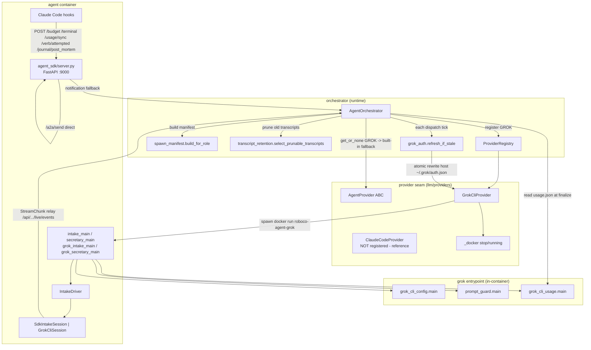
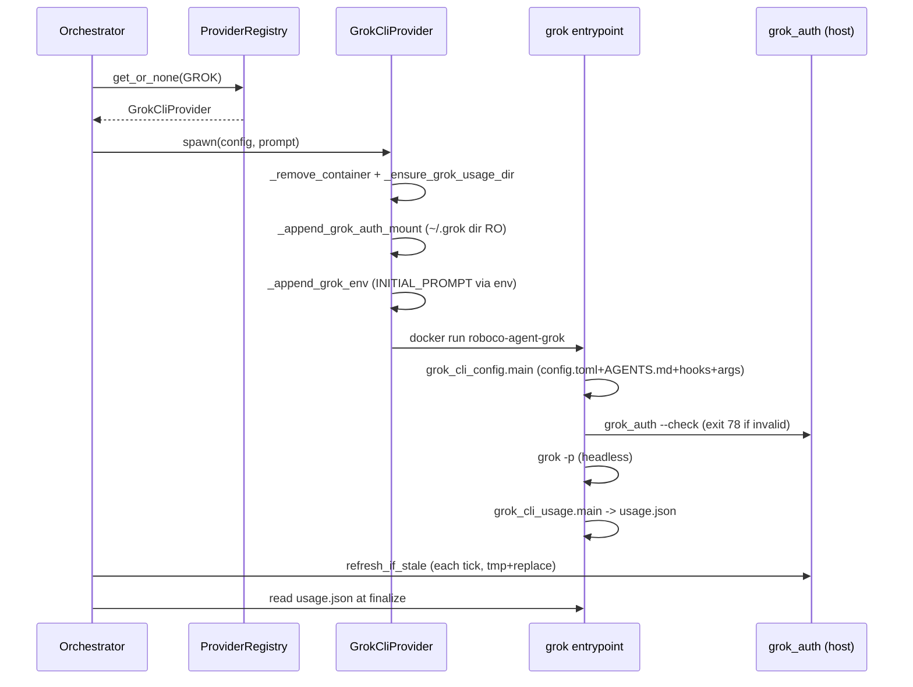

## Purpose
This slice is the agent-runtime + LLM-provider seam plus the in-container agent SDK. The provider layer (roboco/llm/providers/) abstracts how agents are spawned/stopped/health-checked/removed across LLM backends (Claude Code default, Grok CLI) behind an AgentProvider ABC + ProviderRegistry, with a Grok auth-token refresh loop keeping the SuperGrok credential live. The agent SDK (roboco/agent_sdk/) is the FastAPI sidecar running inside every agent container handling A2A messaging, tool-budget/loop/verb-circuit breakers, token-usage capture, and the interactive intake/secretary chat drivers (Claude SDK + Grok CLI). The runtime helpers (spawn_manifest, streaming, transcript_retention) build the per-role tool manifest, wire reasoning-stream callbacks, and select old agent transcripts to prune.

## Files

| Path | Role | LOC |
|---|---|---|
| roboco/runtime/__init__.py | Re-exports AgentInstance/AgentOrchestrator/AgentState + streaming callback helpers | 23 |
| roboco/runtime/spawn_manifest.py | Builds the per-role /app/tool-manifest.json (allowed verbs/tools, env) from role_config | 85 |
| roboco/runtime/streaming.py | Global reasoning-stream callback holder+setter for live UI streaming | 53 |
| roboco/runtime/transcript_retention.py | Pure selector of agent-owned old Claude transcripts to prune (never operator dirs) | 74 |
| roboco/runtime/sandbox.py | `SandboxProvisioner` — throwaway per-agent-spawn engine sibling containers (postgres/redis/mongo via the `SANDBOX_ENGINES` registry in `roboco/models/sandbox.py`, orchestrator-side, never docker-in-agent); generic `_provision_engine` per engine, provision/teardown/janitor_sweep, standalone + unit-testable via an injected `DockerRunner` | 344 |
| roboco/models/sandbox.py | Pure engine registry — `SandboxEngine` ABC + `_PostgresEngine` (`postgres:16-alpine`) / `_RedisEngine` (`redis:8-alpine`) / `_MongoEngine` (`mongo:8`, mongosh readiness probe, auth db `admin`); `SandboxConnection` / `SandboxInfo` (with `emit_env`); `SANDBOX_ENGINES` + `VALID_SANDBOX_SERVICES` (derived). Adding an engine = one class + one registry line — no provisioner or env-emitter branch. Lives in the models layer so `roboco/models/project.py` can derive the allowlist without importing the runtime layer. | 232 |
| roboco/llm/__init__.py | Re-exports ToonAdapter/ToonMetrics singletons | 17 |
| roboco/llm/metrics.py | Singleton holder for TOON token-savings metrics | 21 |
| roboco/llm/toon_adapter.py | TOON serialization adapter for token-efficient LLM communication (JSON fallback) | 188 |
| roboco/llm/providers/__init__.py | Provider package exports: AgentProvider, providers, registry, errors | 28 |
| roboco/llm/providers/base.py | AgentProvider ABC + SpawnResult/ProviderError defining the lifecycle contract | 92 |
| roboco/llm/providers/registry.py | ProviderRegistry mapping ModelProvider -> AgentProvider instance | 73 |
| roboco/llm/providers/claude_code.py | ClaudeCodeProvider: delegates spawn/remove to orchestrator, stop/health to docker helpers (reference adapter, NOT registered) | 92 |
| roboco/llm/providers/_docker.py | Shared async docker stop/kill/inspect-running helpers for providers | 42 |
| roboco/llm/providers/grok.py | GrokCliProvider: spawns roboco-agent-grok container, mounts ~/.grok dir + usage dir + grok env | 236 |
| roboco/llm/providers/grok_auth.py | SuperGrok token refresh-token grant loop + --check backstop CLI; atomic auth.json rewrite | 317 |
| roboco/llm/providers/grok_cli_config.py | Entrypoint renderer: mcp-config -> ~/.grok/config.toml, per-role grok flags, AGENTS.md, bash-guard hook, + default-off fable-mode honesty-nudge hook | 317 |
| roboco/llm/providers/grok_cli_usage.py | Capture token usage from grok sessions/updates.jsonl -> usage.json (notional cost) | 201 |
| roboco/agent_sdk/__init__.py | Package docstring only | 10 |
| roboco/agent_sdk/models.py | Pydantic models: A2A messages, budget/terminal/verb-circuit/token-usage request+status | 258 |
| roboco/agent_sdk/prompt_guard.py | Prompt-injection detector (5 patterns) + CLI for grok entrypoint turn scan | 93 |
| roboco/agent_sdk/transcript_usage.py | Sum Claude Code JSONL transcript token usage, dedup by message.id | 84 |
| roboco/agent_sdk/server.py | FastAPI SDK sidecar (port 9000): A2A send/receive/inbox, budget/loop/verb-circuit, token usage, post-mortem | 889 |
| roboco/agent_sdk/intake_driver.py | IntakeDriver chat loop + SDK message normalization + draft/batch coercion + SDK options (Claude) | 581 |
| roboco/agent_sdk/intake_main.py | Claude intake (prompter) container entrypoint: POST /turn receiver + relay sink + driver | 163 |
| roboco/agent_sdk/secretary_driver.py | Secretary SDK options + CEO-authority tools (read_company_state/read_task/submit_directive) | 199 |
| roboco/agent_sdk/secretary_main.py | Claude secretary container entrypoint: receiver + relay + driver wiring | 109 |
| roboco/agent_sdk/grok_cli_session.py | GrokCliSession: per-turn headless grok -p, resume session id, stream-json -> StreamChunk, watchdog | 337 |
| roboco/agent_sdk/grok_intake_main.py | Grok intake container entrypoint: render roboco-intake MCP config + GrokCliSession driver | 134 |
| roboco/agent_sdk/grok_secretary_main.py | Grok secretary container entrypoint: render roboco-secretary MCP config + GrokCliSession driver | 128 |

## Key Symbols

| Name | Kind | File:Line | Responsibility |
|---|---|---|---|
| SpawnInputs | dataclass | roboco/runtime/spawn_manifest.py:24 | Caller-supplied inputs (agent_id, role, team, workspace, model, extra_env) for manifest build |
| SpawnManifest | dataclass | roboco/runtime/spawn_manifest.py:36 | The tool manifest written to /app/tool-manifest.json (flow/do/read/write tools, bash, subagent, env) |
| build_for_role | function | roboco/runtime/spawn_manifest.py:57 | Compose role_config + agent inputs into a SpawnManifest (write_tools gated by allows_write, bash always allowed) |
| write_manifest | function | roboco/runtime/spawn_manifest.py:82 | Serialize SpawnManifest to JSON at a path (mkdir parents) |
| set_reasoning_stream_callback | function | roboco/runtime/streaming.py:22 | Set the global reasoning-stream callback (wired at bootstrap to WebSocket broadcast) |
| stream_reasoning | function | roboco/runtime/streaming.py:39 | Stream a reasoning chunk to the registered callback if any |
| is_agent_owned_dir | function | roboco/runtime/transcript_retention.py:23 | True if a ~/.claude/projects subdir was written by a spawned agent (-app or encoded workspaces root prefix, boundary-aware) |
| select_prunable_transcripts | function | roboco/runtime/transcript_retention.py:59 | Pure selector of agent-owned *.jsonl transcripts older than cutoff_epoch (never operator dirs) |
| SandboxProvisioner | class | roboco/runtime/sandbox.py:90 | Per-agent-spawn throwaway engine provisioner (iterates `SANDBOX_ENGINES`); `provision`/`teardown`/`janitor_sweep`, docker plumbing is an injected `DockerRunner` callable. Engine specs live in `roboco/models/sandbox.py` (`SandboxEngine` ABC + `_PostgresEngine`/`_RedisEngine`/`_MongoEngine`) |
| ToonAdapter | class | roboco/llm/toon_adapter.py:33 | TOON serialization adapter: encode/decode with JSON fallback, prompt formatting, token-savings estimate |
| get_toon_adapter | function | roboco/llm/toon_adapter.py:184 | Singleton ToonAdapter accessor |
| SpawnResult | dataclass | roboco/llm/providers/base.py:26 | Provider spawn result: instance_id, initial agent_state, extra metadata |
| ProviderError | class | roboco/llm/providers/base.py:41 | Typed exception for provider lifecycle failures (message, agent_id, cause) |
| AgentProvider | ABC | roboco/llm/providers/base.py:62 | Abstract lifecycle: spawn/stop/health_check/remove for one LLM backend |
| ProviderNotRegisteredError | class | roboco/llm/providers/registry.py:27 | LookupError when no provider registered for a ModelProvider |
| ProviderRegistry | class | roboco/llm/providers/registry.py:38 | ModelProvider -> AgentProvider map; register/get/get_or_none/is_registered/unregister |
| ProviderRegistry.get_or_none | method | roboco/llm/providers/registry.py:55 | Return provider or None (orchestrator uses this to decide built-in fallback) |
| ClaudeCodeProvider | class | roboco/llm/providers/claude_code.py:49 | Delegate spawn/remove to orchestrator _spawn_container/_remove_container, stop/health to docker helpers (reference adapter, NOT registered) |
| stop_container | function | roboco/llm/providers/_docker.py:16 | docker stop/kill a container by name (graceful SIGTERM vs SIGKILL) |
| container_running | function | roboco/llm/providers/_docker.py:31 | docker inspect --format State.Running -> bool |
| GrokCliProvider | class | roboco/llm/providers/grok.py:103 | Spawn roboco-agent-grok container: reuse shared mount/auth/git assembly, blank provider fields, add grok auth+usage mounts+env |
| GrokCliProvider.spawn | method | roboco/llm/providers/grok.py:110 | Remove old container, ensure usage dir, build docker run args, launch subprocess, return SpawnResult |
| GrokCliProvider._append_grok_auth_mount | staticmethod | roboco/llm/providers/grok.py:161 | Mount host ~/.grok DIRECTORY RO to /home/agent/.grok-auth-ro (dir, not file, so tmp+rename refresh propagates); warn if auth.json missing |
| GrokCliProvider._append_usage_mount | staticmethod | roboco/llm/providers/grok.py:193 | Mount per-agent data dir so entrypoint writes usage.json orchestrator reads at finalize |
| GrokCliProvider._append_grok_env | method | roboco/llm/providers/grok.py:205 | Append ROBOCO_AGENT_ID/MODEL/MCP_CONFIG/INITIAL_PROMPT/GROK_USAGE_FILE env to docker run |
| refresh_if_stale | function | roboco/llm/providers/grok_auth.py:307 | Mint fresh access token from refresh_token grant if expiry within skew; acquires _refresh_lock then delegates to _recheck_or_refresh to prevent concurrent double-rotation; returns fresh/refreshed/missing/no_refresh_token/failed (best-effort, never raises) |
| _recheck_or_refresh | function | roboco/llm/providers/grok_auth.py:283 | Locked body of refresh_if_stale: re-load bundle + re-check staleness inside _refresh_lock, then call _do_refresh if still stale (prevents concurrent double-rotation of the single-use refresh grant, #94) |
| _atomic_write | function | roboco/llm/providers/grok_auth.py:138 | Rewrite auth.json atomically (tmp+replace) with direct-write fallback so a rotated single-use refresh_token is never lost (F006) |
| _exp_from_access_token | function | roboco/llm/providers/grok_auth.py:183 | Decode JWT exp claim from the access token for when xAI omits expires_in |
| _apply_refreshed_token | function | roboco/llm/providers/grok_auth.py:210 | Write new access_token/rotated refresh_token/expires_at into creds (JWT exp fallback, 6h last resort) |
| seconds_until_expiry | function | roboco/llm/providers/grok_auth.py:106 | Seconds until access token expires (parses grok nanosecond ISO expires_at), None if unreadable |
| is_valid | function | roboco/llm/providers/grok_auth.py:122 | True when token exists and has >skew_seconds life left (used by --check backstop) |
| default_auth_path | function | roboco/llm/providers/grok_auth.py:62 | GROK_HOME or ~/.grok/auth.json path |
| grok_cli_args_for_role | function | roboco/llm/providers/grok_cli_config.py:188 | Per-role grok -p flags: --always-approve, --disallowed-tools (subagent/shell/edit by role), --disable-web-search, --max-turns, --deny git/destructive, --effort override |
| render_config_toml | function | roboco/llm/providers/grok_cli_config.py:128 | Translate Claude Code mcpServers block into grok [mcp_servers] TOML |
| write_agents_md | function | roboco/llm/providers/grok_cli_config.py:232 | Install mounted role blueprint as ~/.grok/AGENTS.md (grok's headless global system prompt) |
| write_grok_hooks | function | roboco/llm/providers/grok_cli_config.py:276 | Install bash-guard PreToolUse JSON hook into ~/.grok/hooks (ROBOCO_GUARD_SKIP_GIT=1) |
| bash_guard_hook_config | function | roboco/llm/providers/grok_cli_config.py:251 | Build the grok hooks JSON for the bash-guard (matcher Bash, exit 2 deny) |
| grok_cli_config.main | function | roboco/llm/providers/grok_cli_config.py:293 | Entrypoint: write config.toml + AGENTS.md + hooks + per-role args file |
| fable_honesty_nudge_hook_config | function | roboco/llm/providers/grok_cli_config.py:308 | Build the grok PostToolUse hooks JSON for the fable-mode honesty-nudge script; hook path env-overridable via ROBOCO_FABLE_HONESTY_NUDGE_HOOK |
| write_grok_fable_hooks | function | roboco/llm/providers/grok_cli_config.py:329 | Default-off (`fable_mode_enabled`): install the honesty-nudge hook JSON into ~/.grok/hooks; no-ops if the flag is off or the script file is missing — the only fable-mode hook ported to grok (a grok PreToolUse/Stop deny cancels the whole run, unlike Claude Code, so only the never-denying PostToolUse honesty-nudge is safe to port) |
| total_tokens_from_updates | function | roboco/llm/providers/grok_cli_usage.py:46 | Max cumulative totalTokens across a grok updates.jsonl (params.update._meta / params._meta / top-level fallback) |
| capture_session_usage | function | roboco/llm/providers/grok_cli_usage.py:115 | Write usage.json (model, total_tokens, cost_usd) for one grok session; reusable per-turn by interactive driver |
| session_id_from_run_log | function | roboco/llm/providers/grok_cli_usage.py:153 | Read grok-generated sessionId from --output-format json or streaming-json run log (grok -p ignores -s) |
| grok_cli_usage.main | function | roboco/llm/providers/grok_cli_usage.py:182 | Entrypoint: write usage.json for the run (cwd/model/session_id from env) |
| A2AMessage | model | roboco/agent_sdk/models.py:22 | A2A message: from/to agent, task_id, skill, content, priority, acked |
| BudgetStatus | model | roboco/agent_sdk/models.py:82 | Per-session budget state: total, by_tool, warn/halt/loop flags + thresholds + loop_action |
| VerbAttemptRequest | model | roboco/agent_sdk/models.py:148 | Per-verb rejection record (verb, task_id, rejection_kind) posted by response-handling layer |
| VerbCircuitStatus | model | roboco/agent_sdk/models.py:174 | Breaker state for (verb, task_id): attempts, limit, window, open, circuit_envelope |
| TranscriptSyncRequest | model | roboco/agent_sdk/models.py:246 | POST /usage/sync payload: transcript_path (SDK parses JSONL for token totals) |
| detect_injection | function | roboco/agent_sdk/prompt_guard.py:63 | Return deny reason if text matches one of 5 injection patterns (ignore-previous, role override, fake prefix, control tokens, fake escalation) else None |
| prompt_guard.main | function | roboco/agent_sdk/prompt_guard.py:82 | CLI for grok entrypoint: exit 1 if argv[1] is an injection |
| sum_transcript_usage | function | roboco/agent_sdk/transcript_usage.py:57 | Sum per-message token usage across a Claude Code JSONL transcript, dedup by message.id (returns input/output/cache_read/cache_write) |
| load_tool_manifest | function | roboco/agent_sdk/server.py:64 | Load /app/tool-manifest.json when ROBOCO_GATEWAY_ENABLED (call-time env read, never raises) |
| receive_message | endpoint | roboco/agent_sdk/server.py:127 | POST /a2a/receive: queue A2A message by priority + persist to DB via main API |
| send_message | endpoint | roboco/agent_sdk/server.py:194 | POST /a2a/send: direct HTTP to target container, fall back to notification via main API on offline |
| poll_inbox | endpoint | roboco/agent_sdk/server.py:296 | GET /inbox/poll: consume urgent-then-normal messages up to limit |
| _SessionState | class | roboco/agent_sdk/server.py:406 | In-memory per-session state: tool counts, recent hashes/tools, verb_attempts deques, token totals, transcript fingerprint; reset() |
| _record_verb_attempt | function | roboco/agent_sdk/server.py:487 | Append monotonic timestamp to (verb, task_id) deque + prune 60s window (rejections only) |
| _check_verb_circuit | function | roboco/agent_sdk/server.py:517 | Return Envelope.circuit_open dict if attempts >= retry_limit_for(verb), else None |
| verb_attempted | endpoint | roboco/agent_sdk/server.py:545 | POST /verb/attempted: record rejection (if counted kind) + return breaker state + circuit_envelope when open |
| budget_tool_called | endpoint | roboco/agent_sdk/server.py:593 | POST /budget/tool_called: strip MCP prefix, record tool+args_hash, return BudgetStatus |
| terminal_stop_attempt | endpoint | roboco/agent_sdk/server.py:651 | POST /terminal/stop_attempt: increment stop_attempts, return TerminalStatus (hook decides substitute) |
| terminal_force_substitute | endpoint | roboco/agent_sdk/server.py:664 | Fire-and-forget POST /api/tasks/auto-substitute on ungraceful stop |
| _contained_transcript_path | function | roboco/agent_sdk/server.py:756 | Validate transcript_path is .jsonl under the transcript root (path-traversal guard for unauthenticated /usage/sync) |
| usage_sync | endpoint | roboco/agent_sdk/server.py:778 | POST /usage/sync: parse Claude transcript, SET cumulative token totals absolutely (fingerprint short-circuit, idempotent) |
| journal_post_mortem | endpoint | roboco/agent_sdk/server.py:822 | POST /journal/post_mortem: SessionEnd hook post-mortem, pad to min-length, flush to /api/journals/me/entries |
| StreamChunk | dataclass | roboco/agent_sdk/intake_driver.py:45 | One normalized panel-facing event (text/thinking/tool_use/tool_result/turn_end/system/draft/batch/error) |
| _coerce_draft | function | roboco/agent_sdk/intake_driver.py:82 | Coerce raw draft to dict with string title; flatten list-shaped spec fields to prevent panel/VARCHAR[] crash |
| _coerce_spec_fields | function | roboco/agent_sdk/intake_driver.py:110 | Wrap the_work to list, flatten acceptance_criteria/what_this_builds/notes + the_work[].items to list[str] |
| _batch_from_tool_input | function | roboco/agent_sdk/intake_driver.py:165 | Pull MegaTask batch from propose_batch tool input; returns drafts+title+dropped count or None |
| normalize | function | roboco/agent_sdk/intake_driver.py:273 | Map one claude-agent-sdk message (StreamEvent/AssistantMessage/ResultMessage/SystemMessage) to StreamChunk list (duck-typed) |
| IntakeDriver | class | roboco/agent_sdk/intake_driver.py:327 | Owns the chat loop: open session, pull human messages, run turns, emit chunks until shutdown |
| IntakeDriver._run_turn | method | roboco/agent_sdk/intake_driver.py:359 | Injection-guard the turn, stream session.send chunks to sink, log tool calls/draft, error chunk on failure |
| build_intake_options | function | roboco/agent_sdk/intake_driver.py:418 | Build locked-down ClaudeAgentOptions: strict_mcp_config, setting_sources=[], propose_draft/propose_batch MCP tools, can_use_tool gate |
| SdkIntakeSession | class | roboco/agent_sdk/intake_driver.py:554 | IntakeSession backed by real ClaudeSDKClient (connect/disconnect, send runs one turn yielding normalized chunks) |
| build_receiver | function | roboco/agent_sdk/intake_main.py:82 | In-container FastAPI receiver: POST /turn enqueues human message, GET /health |
| make_relay_sink | function | roboco/agent_sdk/intake_main.py:59 | EventSink that POSTs each StreamChunk to /api/prompter/live/{session}/events |
| intake_main.main | function | roboco/agent_sdk/intake_main.py:98 | Wire receiver + IntakeDriver + SdkIntakeSession, run uvicorn concurrently for chat lifetime |
| build_secretary_options | function | roboco/agent_sdk/secretary_driver.py:105 | ClaudeAgentOptions for Secretary with read_company_state/read_task/submit_directive MCP tools + gate |
| _do_submit_directive | function | roboco/agent_sdk/secretary_driver.py:86 | POST /api/secretary/directives with kind+payload (backend gates high-impact kinds for CEO confirm) |
| _call_backend | function | roboco/agent_sdk/secretary_driver.py:47 | Call /api/secretary{path} with HMAC agent auth headers; never raises (returns error dict) |
| secretary_main.main | function | roboco/agent_sdk/secretary_main.py:59 | Wire receiver + IntakeDriver + SdkIntakeSession (secretary options), run for chat lifetime |
| GrokCliSession | class | roboco/agent_sdk/grok_cli_session.py:164 | IntakeSession over per-turn headless grok -p; resume captured session id; stream-json -> StreamChunk; per-turn watchdog |
| GrokCliSession.send | method | roboco/agent_sdk/grok_cli_session.py:230 | Run one grok -p turn: spawn, concurrently drain stderr, yield chunks, finalize error+turn_end on failure/timeout |
| _StreamAssembler | class | roboco/agent_sdk/grok_cli_session.py:85 | Map grok streaming-json events (thought/text/end) to StreamChunks; coalesce thinking; hold session_id/stop_reason/saw_end |
| _classify_failure | function | roboco/agent_sdk/grok_cli_session.py:152 | Human-readable error for a turn without end event (rate-limit detection from stderr markers) |
| grok_intake_main._render_grok_config | function | roboco/agent_sdk/grok_intake_main.py:47 | Write ~/.grok/config.toml wiring roboco-intake MCP server (uv run -m roboco.mcp.intake_server) |
| grok_secretary_main._render_grok_config | function | roboco/agent_sdk/grok_secretary_main.py:42 | Write ~/.grok/config.toml wiring roboco-secretary MCP server with HMAC agent token env |

## Data Flow
At spawn time the orchestrator calls build_for_role (spawn_manifest) + write_manifest to drop /app/tool-manifest.json into the agent container, resolves a provider via ProviderRegistry (only GROK registered; ANTHROPIC/OLLAMA_CLOUD/LOCAL fall back to the built-in _spawn_container), and for GROK calls GrokCliProvider.spawn which reuses the orchestrator's mount/auth/git assembly, blanks provider routing fields, mounts the host ~/.grok directory RO + per-agent usage dir, and launches the roboco-agent-grok image. The grok entrypoint then runs grok_cli_config.main (mcp-config -> config.toml, AGENTS.md, bash-guard hook, per-role args file) and prompt_guard.main scans ROBOCO_INITIAL_PROMPT; after the run grok_cli_usage.main writes usage.json the orchestrator reads at finalize. The orchestrator's dispatch tick calls grok_auth.refresh_if_stale on the host auth.json (atomic tmp+replace with direct-write fallback, JWT-exp decode) so the RO directory mount sees the refreshed credential; on an expired-token exit-78 the orchestrator parks the agent and revives it once refreshed.

Inside every agent container the agent_sdk server (FastAPI on port 9000) is the sidecar hooks and the orchestrator call: PreToolUse/PostToolUse/Stop/SessionEnd hooks hit /budget/tool_called, /terminal/tool_recorded, /terminal/stop_attempt, /usage/sync (path-validated transcript -> sum_transcript_usage -> SET cumulative totals), /verb/attempted (60s sliding-window per-(verb,task_id) circuit breaker returning Envelope.circuit_open when over retry_limit_for), /journal/post_mortem. A2A: /a2a/send POSTs to the target container's /a2a/receive directly, falling back to a main-API notification on offline; /inbox/poll consumes urgent-then-normal. Budget/terminal/verb/token state is in-process (_SessionState singleton), reset on /budget/reset at spawn, lost on container restart.

Interactive intake (prompter) and secretary containers run intake_main/secretary_main (Claude) or grok_intake_main/grok_secretary_main (Grok): a POST /turn receiver enqueues human messages, IntakeDriver.run pulls them, injection-guards each turn (prompt_guard.detect_injection), runs one session turn (SdkIntakeSession over ClaudeSDKClient, or GrokCliSession over per-turn headless grok -p resuming one session id), normalizes SDK/streaming-json events to StreamChunk, and a relay sink POSTs each chunk to /api/prompter|secretary/live/{id}/events -> panel SSE. propose_draft/propose_batch tool calls become draft/batch chunks (canonical path); a fenced roboco-draft block is the fallback. Secretary's submit_directive calls /api/secretary/directives (backend gates high-impact kinds for CEO confirmation). Token usage from grok is captured per-turn via capture_session_usage (cumulative session total, last write wins).

The streaming.py callback is set once at bootstrap (websocket_bridge) and invoked by the agent reasoning path to broadcast chunks to /ws/agents/{id}. transcript_retention.select_prunable_transcripts is invoked by the orchestrator's cleanup loop against ~/.claude/projects to delete agent-owned old transcripts (never the operator's own session dirs).

## Mermaid




## Logical Tree
```
runtime-providers
  roboco/runtime
    spawn_manifest.py — SpawnInputs / SpawnManifest / build_for_role / write_manifest
    streaming.py — ReasoningStreamCallback holder + stream_reasoning
    transcript_retention.py — is_agent_owned_dir / select_prunable_transcripts (pure)
    orchestrator.py (out of scope, host) — owns ProviderRegistry + grok_auth refresh loop
  roboco/llm
    metrics.py — ToonMetrics singleton
    toon_adapter.py — ToonAdapter encode/decode/format + get_toon_adapter
    providers/
      base.py — AgentProvider ABC, SpawnResult, ProviderError
      registry.py — ProviderRegistry (ModelProvider -> AgentProvider)
      claude_code.py — ClaudeCodeProvider (delegates to orchestrator; NOT registered)
      _docker.py — stop_container / container_running
      grok.py — GrokCliProvider (spawn/stop/health/remove, auth+usage mounts)
      grok_auth.py — refresh_if_stale / is_valid / _atomic_write / JWT exp decode / --check CLI
      grok_cli_config.py — render_config_toml / grok_cli_args_for_role / write_agents_md / write_grok_hooks / entrypoint main
      grok_cli_usage.py — total_tokens_from_updates / capture_session_usage / session_id_from_run_log / entrypoint main
  roboco/agent_sdk
    models.py — A2A / Budget / Terminal / VerbCircuit / TokenUsage pydantic models
    prompt_guard.py — detect_injection (5 patterns) + CLI
    transcript_usage.py — sum_transcript_usage (dedup by message.id)
    server.py — FastAPI sidecar: A2A, inbox, budget/loop, verb-circuit, terminal, token usage, post-mortem
    intake_driver.py — IntakeDriver loop + normalize + draft/batch coercion + build_intake_options + SdkIntakeSession
    intake_main.py — Claude intake container entrypoint (receiver + relay + driver)
    secretary_driver.py — build_secretary_options + CEO-authority tools (_do_*)
    secretary_main.py — Claude secretary container entrypoint
    grok_cli_session.py — GrokCliSession (per-turn grok -p, resume sid, _StreamAssembler, watchdog)
    grok_intake_main.py — Grok intake container entrypoint (render roboco-intake MCP)
    grok_secretary_main.py — Grok secretary container entrypoint (render roboco-secretary MCP)
```

## Dependencies
- Internal: roboco.services.gateway.role_config (spawn_manifest, grok_cli_config), roboco.models.base.ModelProvider (registry, grok), roboco.models.runtime.OrchestratorAgentConfig (providers base/grok/claude_code), roboco.models.llm.ToonConfig/ToonMetrics (toon_adapter, metrics), roboco.foundation.policy.agent_loop (server budget defaults, retry_limit_for), roboco.foundation.policy.content.validators.coerce_str_list (intake_driver), roboco.services.gateway.envelope.Envelope (server verb circuit), roboco.agents_config.get_agent_role (grok_cli_config, grok_cli_session), roboco.billing.pricing.calculate_cost (grok_cli_usage), roboco.runtime.orchestrator.AgentOrchestrator (host: registry, refresh, manifest, transcript prune)
- External: fastapi, uvicorn, pydantic, httpx, structlog, tomli_w, toon, claude_agent_sdk (lazy import in intake_driver/secretary_driver), asyncio, docker CLI (subprocess), grok CLI (subprocess), httpx (grok_auth OIDC token POST)

## Entry Points

| Name | File | Trigger |
|---|---|---|
| agent_sdk.server __main__ | roboco/agent_sdk/server.py | python -m roboco.agent_sdk.server — uvicorn FastAPI sidecar on ROBOCO_SDK_PORT (9000) inside every agent container |
| intake_main | roboco/agent_sdk/intake_main.py | agent-prompter container command (Claude intake live session) |
| secretary_main | roboco/agent_sdk/secretary_main.py | secretary container command (Claude live session) |
| grok_intake_main | roboco/agent_sdk/grok_intake_main.py | grok intake container command |
| grok_secretary_main | roboco/agent_sdk/grok_secretary_main.py | grok secretary container command |
| grok_cli_config __main__ | roboco/llm/providers/grok_cli_config.py | grok agent entrypoint render step (config.toml + AGENTS.md + hooks + args file) |
| grok_cli_usage __main__ | roboco/llm/providers/grok_cli_usage.py | grok agent entrypoint post-run usage capture |
| grok_auth __main__ | roboco/llm/providers/grok_auth.py | --check backstop in agent entrypoint (exit 1 if invalid); bare = orchestrator refresh-if-stale |
| prompt_guard __main__ | roboco/agent_sdk/prompt_guard.py | grok entrypoint scans ROBOCO_INITIAL_PROMPT (exit 1 on injection) |
| GrokCliProvider.spawn | roboco/llm/providers/grok.py | orchestrator _provider_for(GROK) at spawn via ProviderRegistry (orchestrator.py:2638) |
| build_for_role / write_manifest | roboco/runtime/spawn_manifest.py | orchestrator at agent spawn writes /app/tool-manifest.json |
| refresh_if_stale | roboco/llm/providers/grok_auth.py | orchestrator dispatch tick (once per tick) mints fresh SuperGrok token |
| select_prunable_transcripts | roboco/runtime/transcript_retention.py | orchestrator transcript-cleanup loop against ~/.claude/projects |
| set_reasoning_stream_callback / stream_reasoning | roboco/runtime/streaming.py | bootstrap wires WebSocket broadcast; agent reasoning path invokes stream_reasoning |

## Config Flags
- ROBOCO_GATEWAY_ENABLED (server.load_tool_manifest — gates manifest load)
- ROBOCO_TOOL_MANIFEST_PATH (server — default /app/tool-manifest.json)
- ROBOCO_AGENT_ID / ROBOCO_API_URL / ROBOCO_SDK_PORT / ROBOCO_SDK_BIND_HOST (server + entrypoints)
- ROBOCO_TRANSCRIPT_DIR (server._transcript_root — default ~/.claude/projects)
- ROBOCO_AGENT_TOOL_CALL_WARN / ROBOCO_AGENT_TOOL_CALL_HALT (budget warn/halt thresholds)
- ROBOCO_AGENT_LOOP_THRESHOLD / ROBOCO_AGENT_LOOP_WINDOW / ROBOCO_AGENT_LOOP_ACTION (loop breaker; warn|halt)
- ROBOCO_AGENT_STOP_ATTEMPT_ALLOWANCE (terminal stop allowance before auto-substitute)
- ROBOCO_GROK_AGENT_IMAGE / ROBOCO_GROK_CLI_MODEL (grok.py image+model override)
- ROBOCO_HOST_GROK_DIR (grok.py host ~/.grok mount source for SuperGrok auth)
- ROBOCO_GROK_AUTH_REFRESH_SKEW (grok_auth.py refresh window, default 1800s)
- GROK_HOME (grok_auth.default_auth_path + grok_cli_usage grok_home)
- ROBOCO_SYSTEM_PROMPT / ROBOCO_BASH_GUARD_HOOK / ROBOCO_GROK_ARGS_FILE / ROBOCO_GROK_MAX_TURNS (grok_cli_config entrypoint)
- ROBOCO_GROK_REASONING_EFFORT (grok_cli_config fleet-wide effort override; default/full/none/empty = model default)
- ROBOCO_GROK_USAGE_FILE / ROBOCO_GROK_RUN_CWD / ROBOCO_GROK_RUN_LOG / ROBOCO_AGENT_SESSION_ID / ROBOCO_AGENT_MODEL (grok_cli_usage entrypoint)
- ROBOCO_GROK_TURN_TIMEOUT_SECONDS (grok_cli_session per-turn watchdog, default 600)
- ROBOCO_PROMPTER_SESSION_ID / ROBOCO_SECRETARY_SESSION_ID / ROBOCO_WORKSPACE / CLAUDE_CODE_SUBAGENT_MODEL (intake/secretary entrypoints)
- ROBOCO_AGENT_ROLE / ROBOCO_AGENT_TOKEN (secretary_driver HMAC auth, server, grok_cli_session role resolve)


## Gotchas
- grok_auth F006: a rotated refresh_token is SINGLE-USE — xAI invalidates the old one the instant it issues the new one. If _atomic_write's tmp+replace AND the direct-write fallback both fail, the file keeps the now-dead old refresh_token and the credential is permanently lost on the next refresh. The direct-write fallback mitigates but does not eliminate the risk.
- grok_auth._apply_refreshed_token else-branch: when xAI omits expires_in AND the JWT exp is unreadable, expires_at defaults to 6h. If the real TTL is longer, the refresh loop will re-rotate the single-use refresh_token every tick past (6h - skew), burning the credential. Only triggers on the rare double-miss.
- grok.py mounts the WHOLE host ~/.grok directory RO (not just auth.json) to /home/agent/.grok-auth-ro. A malicious grok agent container could read the orchestrator's other grok state (sessions/, config.toml). Relies on entrypoint symlinking only auth.json + container sandboxing.
- ProviderRegistry registers ONLY GROK (orchestrator.py:2638). ClaudeCodeProvider exists but is NEVER registered — registry.get(ANTHROPIC) raises ProviderNotRegisteredError. ANTHROPIC/OLLAMA_CLOUD/LOCAL fall through to the built-in _spawn_container path via get_or_none returning None. ClaudeCodeProvider is effectively dead reference code.
- agent_sdk/server.py all budget/verb-circuit/terminal/token state is in-process (_SessionState singleton), reset by /budget/reset at spawn, LOST on container restart. Verb-circuit window uses time.monotonic() (not wall clock) — safe from system-time drift but not inspectable across restarts.
- server.py /usage/sync is unauthenticated + container-internal; _contained_transcript_path now guards path-traversal (.jsonl suffix + resolve under transcript root). A legitimately symlinked transcript pointing outside the root is now REJECTED — usage_sync silently returns the current snapshot (no update) rather than failing loud.
- server.py _create_notification_fallback hardcodes X-Agent-Role: developer ('SDK doesn't know role'). A non-developer agent's offline-fallback notification is mislabeled as developer role to the main API.
- server.py _persist_received_message creates the conversation with target_agent = msg.from_agent (the SENDER). From the receiver's perspective the 'target' of the conversation it stores is who it's talking to = the sender — looks inverted vs the wire model's to_agent; easy to misread.
- transcript_usage.py dedup is by message.id; a usage line whose message.id is None (parsed but absent) is counted on EVERY such line (no dedup). Claude Code normally emits ids, but a malformed transcript could over-count.
- intake_driver._coerce_draft now mutates drafts: non-array the_work is wrapped to a list, and non-array/non-string values are dropped to []. A draft with the_work: null (agent mid-spec) becomes the_work: [] — downstream 'has work?' presence checks see an empty list, not null.
- spawn_manifest.bash_allowed is hardcoded True for every role ('bash-guard hook still applies server-side'). Readers trusting the manifest's bash_allowed flag are misled — the real gate is the hook, not this field.
- grok_cli_session MUST drain stderr concurrently with stdout (asyncio.create_task(proc.stderr.read())) — a sequential drain deadlocks once grok writes >64KB to stderr while stdout is still open. The watchdog kills the proc on timeout but a SIGKILL-resistant grok could still hang proc.wait().
- streaming.py _CallbackHolder is module-global mutable, set once at bootstrap — not thread-safe, but the async runtime is single-threaded so fine in practice.
- grok_cli_config: --always-approve is REQUIRED for headless runs (without it grok cancels the first tool call). Safety holds via --disallowed-tools (removes tools) + --deny (hard-blocks patterns) regardless of approval.
- grok_cli_config denies git mutation via native --deny (graceful, run continues) but exfil categories via the bash-guard PreToolUse hook (which CANCELS the run on deny) — deliberate split: a reflexive git op must not drop a task, but an exfil attempt should hard-cancel.
- grok -p ignores -s (requested session id); the real session id is read back from the run log's end event (session_id_from_run_log) and reused via -r on subsequent turns to persist conversation context.


## Drift from CLAUDE.md
- CLAUDE.md: 'the host ~/.grok/auth.json is mounted read-only into each agent (GrokCliProvider._append_grok_auth_mount...)'. ACTUAL (roboco/llm/providers/grok.py:161-191, changed in 15effce0): the whole ~/.grok DIRECTORY is mounted RO to /home/agent/.grok-auth-ro, NOT the single auth.json file — changed because a single-file bind mount pins the inode so the orchestrator's atomic tmp+rename refresh never reached running containers (they hung at grok's login prompt after ~6h). The entrypoint symlinks ~/.grok/auth.json at the RO dir mount.
- CLAUDE.md lists 'ClaudeCodeProvider (default)' alongside GrokCliProvider in the provider seam, implying it is the registered default. ACTUAL (roboco/runtime/orchestrator.py:2638-2645): the orchestrator registers ONLY ModelProvider.GROK; ClaudeCodeProvider is never registered and registry.get(ANTHROPIC) raises ProviderNotRegisteredError. ANTHROPIC/OLLAMA_CLOUD/LOCAL fall back to the built-in _spawn_container via get_or_none -> None. ClaudeCodeProvider is a reference adapter delegating to the orchestrator's own methods. (CLAUDE.md's separate statement that 'when no dedicated provider is registered it falls back to the built-in Claude Code spawn' is consistent with this — the 'default' label is the drift.)
- CLAUDE.md: grok CLI model 'grok-build'. ACTUAL (roboco/llm/providers/grok.py:50 _GROK_CLI_MODEL) = 'grok-build'. No drift.
- CLAUDE.md: 'per-agent token/cost capture from the grok session store' — matches grok_cli_usage.capture_session_usage reading ~/.grok/sessions/<encoded-cwd>/<sid>/updates.jsonl. No drift.


## Changes Since Baseline

| SHA | Subject | Impact |
|---|---|---|
| 15effce0 | Chore: 141 Gaps fill-in (#283) — only commit touching this slice since fd10cc86 | Four files changed. grok_auth.py: F006 fix — _atomic_write now has a direct-write fallback so a rotated single-use refresh_token is never lost; added _exp_from_access_token (JWT exp decode) so a fresh token isn't left with stale expires_at when xAI omits expires_in (was: silently kept old expires_at -> is_valid/--check forever rejected + re-rotation burn). grok.py: auth mount changed from single auth.json FILE to whole ~/.grok DIRECTORY (inode-pinning fix so tmp+rename refresh propagates to running containers); missing auth.json now logs a loud warning instead of silently not mounting. server.py: /usage/sync now validates transcript_path via _contained_transcript_path (.jsonl + must resolve under transcript root) — closes unauthenticated arbitrary-file stat/read. intake_driver.py: _coerce_draft/_coerce_spec_fields now flatten XML-ish list fields (acceptance_criteria/what_this_builds/notes + the_work[].items) to list[str] so a non-array never crashes the panel/VARCHAR[] insert; propose_draft/propose_batch tool descriptions updated to declare per-cell project_id (MegaTask multi-cell). |

> Post-snapshot updates (since 2026-06-29): 536bbb64 (Chore/all/logical gaps sweep #286) — grok_auth.py: added module-level `_refresh_lock = threading.Lock()` (line 48) and new `_recheck_or_refresh` helper (line 283); `refresh_if_stale` now acquires `_refresh_lock` before the grant POST and delegates to `_recheck_or_refresh` inside the lock so a concurrent caller that waited finds the already-refreshed token and returns `fresh` instead of re-POSTing the now-dead single-use refresh grant (#94). All other commits touching roboco/runtime/ in this window only modified orchestrator.py (out-of-scope for this slice).
>
> **v0.18.0** (2026-07-04): Fable mode's grok side — `fable_honesty_nudge_hook_config`/`write_grok_fable_hooks` (grok_cli_config.py:308-345), gated by `fable_mode_enabled` (default off). Deliberately narrower than the Claude path's 5 hooks: only the never-denying PostToolUse honesty-nudge is ported, because a grok `PreToolUse`/`Stop` hook deny cancels the entire run (verified live) — the same asymmetry this file's Gotchas section already documents for the bash-guard's git-deny-vs-exfil-cancel split.

## Regression Risks

| Title | File:Line | Claim | Severity |
|---|---|---|---|
| Grok directory mount widens RO exposure to host ~/.grok | roboco/llm/providers/grok.py:178 | Mounting the whole ~/.grok dir RO (changed from single auth.json) exposes the orchestrator's other grok state — sessions/, config.toml — to every grok agent container. A sandboxed-but-curious/malicious agent could read sibling session transcripts or config. Previously only auth.json was reachable. Mitigated only by container sandboxing + entrypoint symlink, not by the mount itself. | medium |
| 6h expires_at default could burn the single-use refresh_token | roboco/llm/providers/grok_auth.py:230 | _apply_refreshed_token's new else-branch defaults expires_at to now+6h when xAI omits expires_in AND JWT exp is unreadable. If the real access-token TTL is longer than 6h, the refresh loop will re-rotate the single-use refresh_token every tick past (6h - skew). Re-rotating a single-use refresh_token burns the credential (F006). Rare double-miss, but catastrophic when it hits. | medium |
| _atomic_write leaves stale .refresh.tmp on tmp.replace failure | roboco/llm/providers/grok_auth.py:144 | If tmp.write_text succeeds but tmp.replace raises, the code falls through to the direct write on auth_path WITHOUT cleaning up the tmp file. The next refresh overwrites the same tmp path (auth.json.refresh.tmp) so it does not accumulate across cycles, but a one-time leftover persists on disk. Cosmetic, not data-loss. | low |
| /usage/sync path guard may reject legit symlinked transcripts | roboco/agent_sdk/server.py:770 | _contained_transcript_path rejects any transcript whose resolved path is not under the resolved transcript root. A legitimately symlinked transcript dir under ~/.claude/projects pointing outside (e.g. a shared NAS location) now returns HTTP 400 and usage_sync silently returns the current snapshot — token usage for that agent stops updating without a loud failure. | low |
| _coerce_draft drops null/non-array the_work to [] | roboco/agent_sdk/intake_driver.py:116 | New coercion wraps non-list the_work via _coerce_to_list, which returns [] for numbers/bools/None. A draft the agent emitted mid-spec with the_work: null now arrives downstream as the_work: [] (empty list) instead of null/absent. Downstream 'has work?' presence checks that distinguish null from empty may now see an empty list and behave differently (e.g. treat an incomplete draft as a zero-work draft). | low |
| Missing auth.json now logs warning but still spawns doomed container | roboco/llm/providers/grok.py:185 | When ~/.grok/auth.json is absent, _append_grok_auth_mount now only logs a warning (was: silently skipped the mount). The spawn still proceeds and the container exits 78 at the entrypoint --check. Behavior of the spawn path is unchanged, but an operator who does not tail logs will still diagnose a later exit-78; the warning is only useful if someone reads it. | low |

## Health
This slice is coherent and well-factored: the provider ABC + registry cleanly isolates the Grok backend while the Anthropic/Ollama/LOCAL paths stay on the built-in spawn (additive seam, no destabilization), and the agent_sdk sidecar centralizes budget/loop/verb-circuit/token state that hooks share. The single baseline-to-HEAD commit (15effce0) landed three genuine hardening fixes — the F006 refresh_token-loss guard with direct-write fallback, the JWT-exp decode so a refreshed token isn't forever rejected, and the /usage/sync path-traversal guard — plus the grok directory-mount fix that resolves the inode-pinning hang. The main integrity concerns are operational rather than structural: the grok directory mount widens RO exposure to host grok state, the 6h expires_at default can burn the single-use refresh_token on the rare double-miss, the in-process SDK state is lost on every container restart (by design, but means verb-circuit/budget counters reset), and ClaudeCodeProvider is dead reference code whose 'default' label in CLAUDE.md is misleading. Interactive intake/secretary parity between Claude and Grok is real (shared IntakeDriver, only the SessionFactory differs). No obviously broken logic was introduced; the regression risks are edge-case behavior shifts, not holes. Recommend re-running the grok auth refresh test against a token that omits expires_in to confirm the JWT-exp path, and a /usage/sync test with a symlinked transcript to confirm the new guard fails loud where appropriate.
