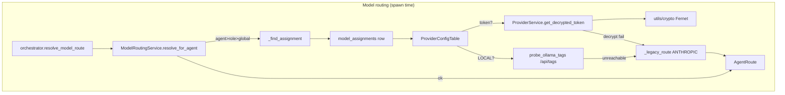
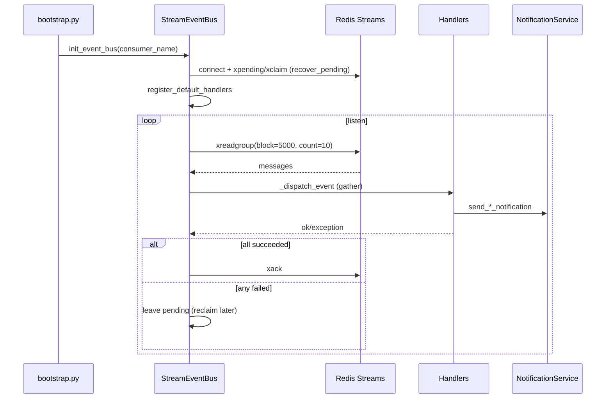
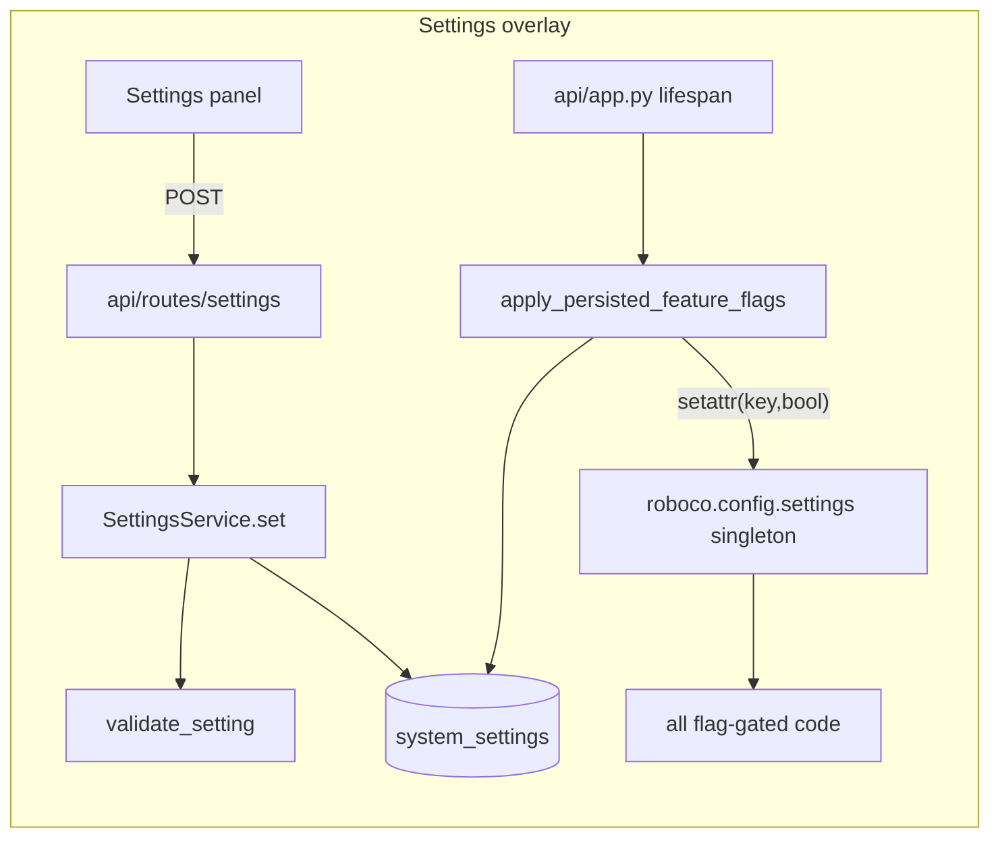

# RoboCo Slice Map — `support-services`

Slice key: `support-services` Repo root: `/Users/renzof/Documents/GitHub/ZZZ/roboco-master/roboco` Scope: `roboco/services/{agent,health,settings,toolchain,provider,llm,proactive,transcription,base,exceptions}.py`, `roboco/events/`, `roboco/seeds/`, `roboco/utils/`

## Purpose

Cross-cutting support layer beneath the delivery services: the service-base/error hierarchy every service inherits, Fernet crypto + UUID converters, the Redis-Streams event bus + workflow trigger handlers, the static seed data that bootstraps agents, infrastructure health probes, the runtime-editable settings/feature-flag store, agent-record lookups, per-project Python interpreter resolution, provider-config CRUD + per-agent model routing, proactive knowledge injection, and raw-stream transcription buffering. None of these own the task lifecycle; they are the plumbing the lifecycle services, orchestrator, and API routes compose on top.

## Files

| Path | Role | approx LOC |
|---|---|---|
| `roboco/services/base.py` | `BaseService` (session-bound) + `SingletonService` + `SingletonHolder[T]` + `ServiceError` hierarchy (NotFound/Validation/Conflict/Unauthorized/ServiceUnavailable) | 226 |
| `roboco/services/exceptions.py` | LLM-provider rate-limit exception + `Retry-After` parser + retry constants | 81 |
| `roboco/services/agent.py` | Thin read-side `AgentService` over `AgentTable` (list/get by uuid/slug/raise) | 74 |
| `roboco/services/health.py` | `check_database` / `check_redis` infrastructure probes backing `/health` | 32 |
| `roboco/services/settings.py` | `SettingsService` CRUD over `system_settings` + `FEATURE_FLAGS` registry + startup overlay onto `roboco.config.settings` | 165 |
| `roboco/services/toolchain.py` | Pure resolver: target project's Python interpreter from `pyproject.toml` / `.python-version` | 117 |
| `roboco/services/provider.py` | `ProviderService` CRUD for `provider_configs` rows + Fernet-encrypted token tri-state updates | 229 |
| `roboco/services/llm.py` | `ModelRoutingService`: resolve (provider, model) per agent spawn; assignment CRUD; mode apply (anthropic/grok/ollama/self_hosted/mix); Ollama probe | 599 |
| `roboco/services/proactive.py` | `ProactiveKnowledgeService`: assemble RAG context packages on task-claim / session-start | 542 |
| `roboco/services/transcription.py` | `TranscriptionService`: buffer raw LLM stream chunks into extractable segments | 278 |
| `roboco/events/__init__.py` | Public re-exports for the event system | 41 |
| `roboco/events/bus.py` | Backward-compat shim: `EventBus = StreamEventBus`, `get_event_bus`, `init_event_bus` | 57 |
| `roboco/events/handlers.py` | Workflow trigger handlers (task status → notifications, QA result, blocker, question, auditor spawn) + `register_default_handlers` | 419 |
| `roboco/events/stream_bus.py` | `StreamEventBus`: Redis Streams durable event bus with consumer groups, ACK, pending recovery, periodic reclaim loop, dead-letter for undecodable messages | 604 |
| `roboco/seeds/__init__.py` | Re-exports seed constants | 25 |
| `roboco/seeds/initial_data.py` | Static seed data (agents) derived from `foundation` catalogs | 332 |
| `roboco/utils/__init__.py` | Re-exports crypto + converter helpers | 23 |
| `roboco/utils/converters.py` | `InvalidIdentifierError` + `require_uuid` / `to_python_uuid` / `to_python_uuid_list` + `repo_key` | 99 |
| `roboco/utils/crypto.py` | Fernet `encrypt_token` / `decrypt_token` / `is_encryption_configured` + `EncryptionError` | 111 |

## Key Symbols

| Name | Kind | File:Line | Responsibility |
|---|---|---|---|
| `BaseService` | class | `services/base.py:116` | Session-bound service base; holds `self.session` + `self.log` (structlog bound to `service_name`) |
| `SingletonService` | class | `services/base.py:154` | Stateless singleton base with logger only |
| `SingletonHolder[T]` | generic class | `services/base.py:184` | PEP-695 generic singleton holder (get/set/clear/is_initialized) |
| `ServiceError` | class | `services/base.py:25` | Base service exception with `message` + `details` |
| `NotFoundError` | class | `services/base.py:34` | 404-bound; carries `resource_type` / `resource_id` |
| `ConflictError` | class | `services/base.py:64` | 409-bound; carries `resource_type` |
| `ValidationError` | class | `services/base.py:51` | 400-bound; carries `field` |
| `RateLimitError` | class | `services/exceptions.py:31` | Raised after all 429 retries exhausted; carries `provider` + `retry_after` |
| `parse_retry_after_header` | func | `services/exceptions.py:65` | Numeric `Retry-After` → float seconds (HTTP-date unsupported) |
| `MAX_RATE_LIMIT_RETRIES` | const | `services/exceptions.py:20` | `= 5` |
| `AgentService` | class | `services/agent.py:19` | Read-only agent queries (list/get_by_uuid/get_by_slug/get_by_uuid_or_slug_or_raise) |
| `check_database` | func | `services/health.py:14` | Opens a DB context, `SELECT 1`, returns `(msg, ok)` |
| `check_redis` | func | `services/health.py:24` | `redis.from_url(settings.redis_url).ping()` then close |
| `SettingsService` | class | `services/settings.py:83` | KV CRUD on `system_settings` (get/get_int/get_bool/set/all); `set` validates + flushes, caller commits |
| `FEATURE_FLAGS` | tuple | `services/settings.py:46` | Panel-tunable flag registry `(key, label)`; maps to `Settings` bool attrs of same name |
| `validate_setting` | func | `services/settings.py:75` | Reject unknown keys + run per-key validator |
| `apply_persisted_feature_flags` | func | `services/settings.py:146` | Startup overlay: stored flag value → `setattr(settings, key, bool)`; returns overridden keys |
| `feature_flag_effective_values` | func | `services/settings.py:131` | Stored override else env default; backs Settings panel card |
| `SettingValidationError` | class | `services/settings.py:22` | Unknown/invalid setting on write |
| `resolve_target_python` | func | `services/toolchain.py:103` | Returns `ResolvedPython(version, source)` or None; honors `.python-version` only if it satisfies `requires-python` |
| `satisfies` | func | `services/toolchain.py:48` | PEP 440 membership test (empty specifier = any) |
| `ResolvedPython` | dataclass | `services/toolchain.py:40` | Frozen `(version, source)` result |
| `ProviderService` | class | `services/provider.py:61` | CRUD for `provider_configs`; tri-state token update; 409 on delete-with-assignments |
| `ProviderCreate` / `ProviderUpdate` | dataclasses | `services/provider.py:32,43` | Service-boundary shapes; `ProviderUpdate.auth_token` tri-state + `clear_auth_token` |
| `get_decrypted_token` | method | `services/provider.py:211` | Decrypt provider token or None; raises `EncryptionError` on bad key |
| `ModelRoutingService` | class | `services/llm.py:119` | Per-agent route resolution + assignment CRUD + mode apply |
| `AgentRoute` | dataclass | `services/llm.py:95` | Frozen resolved route `(provider_id, type, base_url, auth_token, model_name)`; None base_url/token = Anthropic default |
| `resolve_for_agent` | method | `services/llm.py:124` | Precedence ladder agent>role>global; never raises — downgrades to legacy Anthropic path |
| `probe_ollama_tags` | func | `services/llm.py:63` | `{base_url}/api/tags` probe; never raises, returns `([], error)` |
| `upsert_assignment` | method | `services/llm.py:241` | Insert-or-update by `(scope, scope_value)`; routes non-catalog names to LOCAL; auto-enables LOCAL provider |
| `apply_mode` | method | `services/llm.py:418` | Wipe role/global rows (AGENT_SLUG pins preserved) + set GLOBAL for anthropic/grok/ollama/self_hosted; per-agent map for mix |
| `derive_mode` | method | `services/llm.py:314` | Settings UI label from current assignments |
| `set_ollama_api_key` / `set_grok_api_key` | methods | `services/llm.py:340,360` | Encrypt+enable / clear+disable on the seeded provider row |
| `ProactiveKnowledgeService` | class | `services/proactive.py:90` | Builds `ContextPackage` from multiple RAG indexes on claim/session |
| `ContextPackage` | dataclass | `services/proactive.py:27` | Aggregates similar_tasks/learnings/code_patterns/standards/decisions/known_issues + summary |
| `on_task_claimed` / `on_session_started` | methods | `services/proactive.py:116,201` | Best-effort multi-index search; each source wrapped in try/except |
| `get_proactive_service` | func | `services/proactive.py:534` | Singleton holder; lazy-inits with `OptimalService` |
| `TranscriptionService` | class | `services/transcription.py:28` | Per-(agent,session) `StreamBuffer` map; periodic flush task; callback registration |
| `process_chunk` | method | `services/transcription.py:120` | Append chunk, return buffer if ready-for-extraction else None |
| `_periodic_flush` | method | `services/transcription.py:225` | Background loop: sleep `flush_interval_seconds`, yield ready buffers to callbacks |
| `StreamEventBus` | class | `events/stream_bus.py:35` | Redis Streams bus: `xadd` trim, `xreadgroup` block=5000, ACK-on-success, `xclaim` recovery, periodic `_reclaim_loop`, dead-letter for undecodable messages |
| `DEAD_LETTER_STREAM` | class attr | `events/stream_bus.py:51` | `"roboco:stream:dead-letter"` — undecodable messages are parked here before ACK for operator inspection |
| `publish` / `publish_task_event` | methods | `events/stream_bus.py:152,191` | `xadd` to category-grouped stream, returns message id |
| `recover_pending` | method | `events/stream_bus.py:534` | `xpending_range` + `xclaim` idle≥60s messages; called at startup and periodically by `_reclaim_loop` |
| `_reclaim_loop` | method | `events/stream_bus.py:253` | Background task spawned alongside `_listen_loop`; re-runs `recover_pending` every 60s so runtime handler failures are retried without waiting for a restart |
| `_handle_message` | method | `events/stream_bus.py:434` | Decode (poison-pill: dead-letter+ACK on `Event.from_json` failure) → dispatch → ACK iff all handlers succeeded (else stays pending for reclaim) |
| `_dead_letter` | method | `events/stream_bus.py:403` | Best-effort write to `DEAD_LETTER_STREAM`; never blocks ACK on publish failure |
| `get_stream_event_bus` / `init_stream_event_bus` | funcs | `events/stream_bus.py:577,584` | Singleton + connect + optional startup pending recovery |
| `handle_task_status_change` | func | `events/handlers.py:141` | Routes task.* events to PM/QA/Documenter/developer notifications |
| `handle_auditor_spawn` | func | `events/handlers.py:332` | One-shot auditor spawn on blocked/cancelled/awaiting_ceo_approval; failures swallowed |
| `register_default_handlers` | func | `events/handlers.py:372` | Subscribes all default handlers on the bus |
| `set_event_context` / `get_event_context` | funcs | `events/handlers.py:26,37` | DI of `notification_service` + `orchestrator` into module-global `_context` |
| `DEFAULT_AGENTS` | const | `seeds/initial_data.py:156` | Composed from `foundation.AGENTS` + presentation names; system sentinel appended literally (team=None) |
| `AGENT_UUIDS` / `CEO_AGENT_ID` | consts | `seeds/initial_data.py:83,173` | String-keyed UUID map for legacy consumers |
| `encrypt_token` / `decrypt_token` | funcs | `utils/crypto.py:40,67` | Fernet symmetric encrypt/decrypt; `EncryptionError` on empty/bad key |
| `is_encryption_configured` | func | `utils/crypto.py:102` | True iff `settings.encryption_key` yields a valid Fernet |
| `InvalidIdentifierError` | class | `utils/converters.py:11` | `ValueError` subclass raised by `require_uuid` on None or unparseable input; typed so callers can distinguish a bad identifier instead of broad-catching (#25) |
| `require_uuid` | func | `utils/converters.py:21` | Coerce to `UUID`, raise `InvalidIdentifierError` (a `ValueError` subclass) on None or bad input |
| `repo_key` | func | `utils/converters.py:47` | Normalize a git URL to a case/`.git`-suffix/trailing-slash insensitive key for ci_watch/dep_update dedupe (#1267) |
| `to_python_uuid` / `to_python_uuid_list` | funcs | `utils/converters.py:61,81` | None-safe SQLAlchemy UUID coercion |

## Data Flow

**Spawn routing.** The orchestrator (`runtime/orchestrator.py:3294`) opens a DB session, calls `get_model_routing_service(db).resolve_for_agent(agent_slug)`. `ModelRoutingService` walks `model_assignments` (AGENT_SLUG → ROLE → GLOBAL), joins the `provider_configs` row, decrypts any token via `ProviderService.get_decrypted_token` (Fernet from `utils/crypto`), probes LOCAL providers via `probe_ollama_tags`, and returns an `AgentRoute`. On any failure (decrypt, unreachable server, missing row) it falls back to `_legacy_route` (role → `MODEL_MAP` short name, Anthropic, mounted `~/.claude`). The orchestrator injects `ANTHROPIC_*`/base_url/auth env into the container only when the route is non-Anthropic.

**Settings/flags.** At FastAPI lifespan (`api/app.py:117`), `apply_persisted_feature_flags(db)` reads each `FEATURE_FLAGS` key from `system_settings` and `setattr`s the live `roboco.config.settings` singleton so the rest of the app reads panel choices; an unset key keeps the env default. The Settings panel reads effective values via `feature_flag_effective_values` and writes via `SettingsService.set` (validates → upsert → flush; route commits).

**Events.** `bootstrap.py:92` calls `init_event_bus()` → `init_stream_event_bus` → `connect()` + `recover_pending()` (reclaims idle ≥60s messages from crashed consumers via `xclaim`). `register_default_handlers` subscribes task/session/handoff/QA/blocker/question/auditor handlers. Publishers call `bus.publish(Event)` → `xadd` to `roboco:stream:{category}` (trimmed to 10000). `start_listening` spawns both `_listen_loop` and `_reclaim_loop`; the reclaim loop re-runs `recover_pending` every 60s so a runtime handler failure is retried without waiting for a restart. `_listen_loop` blocks on `xreadgroup` (count=10, block=5000); `_handle_message` first tries `Event.from_json` in its own try/except — an undecodable payload (unknown `EventType`, bad UUID/timestamp, malformed JSON) is dead-lettered to `DEAD_LETTER_STREAM` then ACKed so a poison pill never wedges the stream. Successfully decoded events are dispatched via `asyncio.gather` with a per-(event.id, handler) SET-NX idempotency guard (`_run_handler_guarded`), and the message is ACKed only if every handler succeeded — failed handlers leave the message pending for the reclaim loop. `_run_handler_guarded` catches `BaseException` (including `asyncio.CancelledError`) so a mid-flight cancellation clears the idempotency marker and allows replay. Handlers use the injected `_context` (notification_service + orchestrator).

**Proactive injection.** `TaskService.claim_task` (`services/task.py:2548`) lazily calls `get_proactive_service()`, which singleton-inits with `OptimalService`. `on_task_claimed` runs five best-effort RAG searches (similar tasks, learnings, standards, decisions, known issues), each in its own try/except, builds a `ContextPackage` + summary. The `code_patterns` field is retained in `ContextPackage` for API/schema back-compat but is always empty — `_find_code_patterns` was removed. `api/routes/optimal.py:1255` exposes `get_context_for_task`/`get_context_for_session` which own DB lookups so routes don't query directly.

**Transcription.** `api/app.py:124` constructs `TranscriptionService()` at lifespan; `ExtractionService` (`services/extraction.py`) composes it. `process_chunk` appends to the per-(agent,connection) `StreamBuffer`; when `is_ready_for_extraction` (min chars / idle threshold / max chars) it returns the buffer for extraction. A `_periodic_flush` background task wakes every `flush_interval_seconds` and pushes ready buffers to registered callbacks.

**Seeds.** `db/seed.py` iterates `DEFAULT_AGENTS` to populate the DB on bootstrap; `foundation/_validate_lifecycle.py:237` validates against `DEFAULT_AGENTS`. It derives from `foundation.AGENTS` so adding an agent is a single foundation edit.

**Toolchain.** `WorkspaceService` (`services/workspace.py:1308`) calls `resolve_target_python(workspace)` to pick the interpreter for `uv --python` when provisioning a target project's clone.

**Health.** `api/routes/health.py:41` calls `check_database()` + `check_redis()` for `/health`.

## Mermaid







## Logical Tree

```
support-services
├── services/
│   ├── base.py            # BaseService / SingletonService / SingletonHolder[T] / ServiceError*
│   ├── exceptions.py      # RateLimitError + Retry-After parser
│   ├── agent.py           # AgentService (read-only)
│   ├── health.py          # check_database / check_redis
│   ├── settings.py        # SettingsService + FEATURE_FLAGS + startup overlay
│   ├── toolchain.py       # resolve_target_python (pure)
│   ├── provider.py        # ProviderService (provider_configs CRUD + Fernet tokens)
│   ├── llm.py             # ModelRoutingService (spawn routing + modes + Ollama probe)
│   ├── proactive.py       # ProactiveKnowledgeService (RAG context packages)
│   └── transcription.py   # TranscriptionService (stream buffering)
├── events/
│   ├── __init__.py        # public re-exports
│   ├── bus.py             # EventBus = StreamEventBus (compat shim)
│   ├── handlers.py        # workflow trigger handlers + register_default_handlers
│   └── stream_bus.py      # Redis Streams durable bus (xadd/xreadgroup/xack/xclaim)
├── seeds/
│   ├── __init__.py
│   └── initial_data.py    # DEFAULT_AGENTS from foundation
└── utils/
    ├── __init__.py
    ├── converters.py      # UUID coercion
    └── crypto.py          # Fernet encrypt/decrypt
```

## Dependencies

**Internal (downstream):**
- `roboco.config.settings` (encryption key, redis_url, feature-flag defaults) — `crypto`, `stream_bus`, `health`, `settings`
- `roboco.db.tables` (`AgentTable`, `ProviderConfigTable`, `ModelAssignmentTable`, `SystemSettingTable`, `TaskTable`) — `agent`, `provider`, `llm`, `settings`, `proactive`
- `roboco.db.base.get_db_context` — `health`, `proactive`
- `roboco.models.base` (`AgentRole`, `Team`, `ModelProvider`, `AssignmentScope`) — `agent`, `provider`, `llm`
- `roboco.models.events` (`Event`, `EventType`, `EventContext`, protocols) — `events/*`
- `roboco.models.llm_catalog` (`MODEL_CATALOG_BY_NAME`, `OLLAMA_DEFAULT_MODEL`) — `llm`
- `roboco.models.runtime` (`MODEL_MAP`, `ROLE_MODEL_MAP`) — `llm`
- `roboco.models.optimal` (`IndexType`, `QueryContext`, `SearchResult`) — `proactive`
- `roboco.models.message.RawStream`, `roboco.models.transcription.*` — `transcription`
- `roboco.agents_config.get_agent_role` — `llm`
- `roboco.foundation.identity` — `seeds`
- `roboco.services.optimal.get_optimal_service` — `proactive` (lazy)
- `roboco.logging.get_logger` — `crypto`

**External:**
- `sqlalchemy` / `sqlalchemy.ext.asyncio` — ORM sessions
- `redis.asyncio` — streams bus, health probe
- `cryptography.fernet` — token encryption
- `httpx` — Ollama probe
- `structlog` — logging everywhere
- `packaging` (`Version`, `SpecifierSet`) — `toolchain`
- `tomllib` — `toolchain` pyproject parse

## Entry Points

| Symbol | Invoked from | Trigger |
|---|---|---|
| `apply_persisted_feature_flags` | `api/app.py:117` | FastAPI lifespan (after DB ready) |
| `get_settings_service` | `api/routes/settings.py`, `runtime/orchestrator.py:5910` | `GET/POST /api/settings`; orchestrator transcript-retention read |
| `get_model_routing_service().resolve_for_agent` | `runtime/orchestrator.py:3301` | Each agent spawn |
| `ModelRoutingService.*` assignment/mode ops | `api/routes/provider.py` | `GET/POST/DELETE /api/providers/*` |
| `ProviderService.*` | `api/routes/provider.py` | provider CRUD routes |
| `get_agent_service` | `api/routes/agents.py`, `services/task.py`, `services/pitch.py` | `/api/agents`; task/pitch main-pm lookup |
| `check_database` / `check_redis` | `api/routes/health.py:41` | `GET /health` |
| `resolve_target_python` | `services/workspace.py:1308` | Workspace provisioning (clone/claim) |
| `init_event_bus` / `register_default_handlers` / `set_event_context` | `bootstrap.py:92-96` | App bootstrap |
| `bus.publish` / `publish_task_event` | services, orchestrator, websocket_bridge | Status transitions, live events |
| `get_proactive_service` | `services/task.py:2548`, `api/routes/optimal.py:1257` | claim_task, `/api/optimal/context` |
| `TranscriptionService` | `api/app.py:124`, `services/extraction.py` | Lifespan construct; extraction pipeline |
| `DEFAULT_AGENTS` | `db/seed.py`, `foundation/_validate_lifecycle.py` | DB bootstrap + lifecycle validation |
| `encrypt_token` / `decrypt_token` | `provider`, `llm` (via ProviderService), ProjectService | Token persist / read |

## Config Flags

Panel-tunable flags defined in `services/settings.py:46` `FEATURE_FLAGS` (stored override → `roboco.config.settings.<key>` at startup; env default when unset):

| Key | Label | Env counterpart |
|---|---|---|
| `external_pr_enabled` | External-PR review | `ROBOCO_EXTERNAL_PR_ENABLED` |
| `internal_pr_enabled` | Internal-PR safety reviewer | `ROBOCO_INTERNAL_PR_ENABLED` |
| `research_enabled` | Web research (Board + PM) | `ROBOCO_RESEARCH_ENABLED` |
| `strategy_engine_enabled` | Strategy engine | `ROBOCO_STRATEGY_ENGINE_ENABLED` |
| `self_heal_enabled` | Self-healing (detect + notify) | `ROBOCO_SELF_HEAL_ENABLED` |
| `self_heal_originate_enabled` | Self-healing — open fix tasks | `ROBOCO_SELF_HEAL_ORIGINATE_ENABLED` |
| `provisioning_enabled` | Pitch auto-provisioning | `ROBOCO_PROVISIONING_ENABLED` |
| `toolchain_match_enabled` | Agent runtime toolchain matching | `ROBOCO_TOOLCHAIN_MATCH_ENABLED` |
| `conventions_enabled` | Architectural conventions standard | `ROBOCO_CONVENTIONS_ENABLED` |
| `rag_auto_update_enabled` | RAG auto-update | `ROBOCO_RAG_AUTO_UPDATE_ENABLED` |
| `transcript_prune_enabled` | Transcript pruning | `ROBOCO_TRANSCRIPT_PRUNE_ENABLED` |
| `gateway_health_enabled` | Gateway-health recovery | `ROBOCO_GATEWAY_HEALTH_ENABLED` |
| `ci_watch_enabled` | Multi-repo CI-watch | `ROBOCO_CI_WATCH_ENABLED` |
| `dep_update_enabled` | Dependency-update bot | `ROBOCO_DEP_UPDATE_ENABLED` |
| `release_manager_enabled` | Gated release manager | `ROBOCO_RELEASE_MANAGER_ENABLED` |
| `docs_sync_enabled` | Docs-divergence sync (release → docs-update task) | `ROBOCO_DOCS_SYNC_ENABLED` |
| `org_memory_enabled` | Organizational memory loop | `ROBOCO_ORG_MEMORY_ENABLED` |
| `sandbox_db_enabled` | Sandboxed per-agent test DB/Redis/Mongo (engine registry) | `ROBOCO_SANDBOX_DB_ENABLED` |
| `x_engine_enabled` | X (Twitter) engine | `ROBOCO_X_ENGINE_ENABLED` |
| `roadmap_engine_enabled` | Board roadmap engine | `ROBOCO_ROADMAP_ENGINE_ENABLED` |

Cloud auth (`ROBOCO_CLOUD_AUTH_ENABLED`) and DB network isolation (`ROBOCO_DB_NETWORK_ISOLATED`) are deliberately **not** in `FEATURE_FLAGS` — both are compose/env-coupled (cookie/TLS posture and the `networks:` topology respectively) and unsafe for a runtime toggle to flip mid-session; they stay pure env vars, not panel-tunable settings.

Other settings read here: `transcript_retention_days` (int, ≥1; read by orchestrator at `runtime/orchestrator.py:5910`). Non-flag config consumed: `settings.redis_url` (`health`, `stream_bus`), `settings.encryption_key` (`crypto`).

## Gotchas

- **`resolve_for_agent` never raises for a normal agent** (`llm.py:124`) — decrypt failures, unreachable LOCAL servers, and missing agents all downgrade to the legacy Anthropic path. A misconfigured provider therefore silently spawns against Anthropic instead of erroring; check orchestrator logs for "falling back to legacy path" / "Self-hosted server unreachable".
- **Mix-mode self-hosted models auto-enable the LOCAL provider** (`llm.py:285`) — `upsert_assignment` flips the LOCAL provider row to `enabled=True` whenever an assignment resolves to LOCAL. A prior observation (47392) flagged that this enabling only happens on upsert, not on a bare GLOBAL assignment path — verify the LOCAL row is enabled before relying on self-hosted routing.
- **`probe_ollama_tags` leaks raw exception text** into the returned error string (`llm.py:92`, observation 47334) — the generic `except Exception` branch puts `str(exc)` in the user-facing message. Minor info-disclosure surface.
- **`SingletonHolder[T]` uses PEP 695 generic syntax** (`base.py:184`) — requires Python 3.13+. CLAUDE.md pins 3.13 so this is fine, but it will syntax-error on 3.12 tooling/linters.
- **`apply_persisted_feature_flags` mutates the live `settings` singleton via `setattr`** (`settings.py:163`) — a toggle takes effect only on next restart (documented), and the in-process `settings` object is shared; concurrent reads during the overlay are not synchronized but the overlay runs once at lifespan before serving.
- **`StreamEventBus` ACKs only when every handler succeeded** (`stream_bus.py`) — a single failing handler leaves the message pending; `_reclaim_loop` re-runs `recover_pending` every 60s so the retry fires at runtime without waiting for a restart. Undecodable messages (poison pills) are now dead-lettered then ACKed immediately and never left pending. A per-(event.id, handler) SET-NX guard (`_run_handler_guarded`) makes replay safe for already-succeeded handlers, but the guard is best-effort (fail-open without Redis). Handlers must still be idempotent.
- **`recover_pending` runs at startup and periodically** (`bootstrap.py` via `init_event_bus`; `_reclaim_loop` every 60s at runtime) — on restart or after a runtime handler failure, pending messages are reprocessed under the idempotency guard.
- **`TranscriptionService._periodic_flush` callbacks are sync `Callable`** (`transcription.py:57`) invoked inside an async loop without `await` — a blocking callback stalls the flush task. The `register_callback` signature is `Callable[[StreamBuffer], None]`, not a coroutine.
- **`TranscriptionService.get_ready_buffers` is declared `AsyncIterator` but `yield`s inside an `async for` over a dict** (`transcription.py:208`) — it works but never removes buffers; callers must `flush_buffer` after extraction or buffers accumulate forever (only `_flush_all` on shutdown clears them).
- **`ProactiveKnowledgeService._find_code_patterns` was removed** (`proactive.py`) — the dead method, its call in `build_context_package`, the `"Found N code patterns"` summary line, and the count were all deleted. `ContextPackage.code_patterns` is retained as an always-empty field for API/schema back-compat (serialized in `to_dict`; docstring marks it deprecated). Do not rely on it being populated.
- **`ProactiveKnowledgeService` singleton lazy-inits `OptimalService`** (`proactive.py:537`) — the first `get_proactive_service()` call triggers `get_optimal_service()` which may do embedding-model setup; call it early or expect latency on first claim.
- **Seeds `system` sentinel is appended literally with `team=None`** (`seeds/initial_data.py:144`) — the postgres `team` enum has no `system` value, so seeding it through the normal path would fail. Don't add `system` to `_AGENT_PRESENTATION` expecting it to flow through `_build_default_agents`.
- **`require_uuid` raises `InvalidIdentifierError` (a `ValueError` subclass), not `NotFoundError`** (`utils/converters.py:38`) — callers in `llm.py` use it on `provider.id` which is a PK and never None in practice, but a None would surface as a 500-class error not a 404. The typed subclass allows callers to handle a bad identifier distinctly from other exceptions; existing `except ValueError` handlers are unaffected.
- **`encrypt_token` rejects empty strings** (`crypto.py:53`) — the provider/project token convention is `""` = clear to NULL, handled at the service layer (`_apply_auth_token_change` checks `clear_auth_token`/`not data.auth_token` before calling encrypt); never pass `""` directly to `encrypt_token`.
- **`check_redis` opens a fresh client each call and closes it** (`health.py:27`) — fine for a health probe, but don't reuse the pattern for hot paths.

## Drift from CLAUDE.md

- **`services/settings.py:46` `FEATURE_FLAGS`** includes `rag_auto_update_enabled` ("RAG auto-update") and `transcript_prune_enabled` ("Transcript pruning") which are **NOT** listed in the CLAUDE.md "Feature Flags / company-in-a-box" enumeration (that list names web research, strategy engine, pitch provisioning, external/internal PR review, toolchain match, conventions, gateway-health, multi-repo CI-watch, dependency-update bot, gated release manager, organizational memory loop, and the self-heal flags). Two flags exist in code with no CLAUDE.md mention.
- **`services/proactive.py`** (`ProactiveKnowledgeService`) — an entire service that injects RAG context on task-claim / session-start — is **not mentioned anywhere in CLAUDE.md**. The org-memory loop (`ROBOCO_ORG_MEMORY_ENABLED`, `_briefing_for` institutional_memory) is documented, but that is a separate, newer system; `proactive.py` predates and overlaps with it yet remains present and wired (`task.py:2548`, `optimal.py:1257`).
- **`services/transcription.py`** (`TranscriptionService`) — the raw-LLM-stream buffering layer between WebSocket and the extraction pipeline — is **not mentioned in CLAUDE.md**. CLAUDE.md documents WebSocket streams and the extraction target (ExtractedMessages) but not the transcription buffer service.
- **`services/llm.py:316` `derive_mode`** returns `"grok"` for a single GLOBAL GROK assignment; CLAUDE.md's provider table lists `GROK` as a `ModelProvider` and documents the Grok CLI provider, and `apply_mode` supports `"grok"` — consistent. No drift here, noted for completeness.
- **`events/handlers.py:332` `handle_auditor_spawn`** spawns the auditor on `TASK_BLOCKED`/`TASK_CANCELLED`/`TASK_AWAITING_CEO_APPROVAL`; CLAUDE.md says "The Auditor sees all" and is a "silent observer" but does not describe the event-driven one-shot spawn on exceptional lifecycle events. Minor doc gap, not a contradiction.
- Otherwise the slice is consistent with CLAUDE.md: agent count (25 AI + 1 CEO) matches `DEFAULT_AGENTS`; `ModelProvider` enum usage matches; feature-flag overlay-on-restart contract matches; Redis-Streams event bus matches the "publish it to the bus" guidance; toolchain matching matches `ROBOCO_TOOLCHAIN_MATCH_ENABLED`.

## Changes Since Baseline

Baseline: `fd10cc862c2020b3f639cdb686d427b0198a2441`. Range `fd10cc86..HEAD` (3aff6e04) contains only 2 commits (`15effce0` "Chore: 141 Gaps fill-in (#283)", `3aff6e04` "Chore: Close gaps (#285)"), and **neither touches any file in this slice** (`git diff --stat fd10cc86..HEAD -- <scope>` is empty; `git log --oneline` against the scope is empty).

No logic-touching commits to list — IMPACT: none.

> Post-snapshot updates (since 2026-06-29): five commits touched this slice after the baseline was cut.
> - `e4ed970f` [chore] stream-bus: poison-pill ACK + dead-letter (`DEAD_LETTER_STREAM`, `_dead_letter`), periodic `_reclaim_loop` spawned alongside `_listen_loop`, `_run_handler_guarded` catches `BaseException` for cancelled-handler marker cleanup (3 gaps).
> - `6b441e42` [chore] converters: `InvalidIdentifierError(ValueError)` introduced; `require_uuid` now raises it for both None and unparseable input; `repo_key` git-URL normalizer added; orchestrator reaper now logs the typed error instead of silently swallowing it.
> - `321e68d7` [sweep] proactive: `_find_code_patterns` method, its call, summary line, and count removed; `ContextPackage.code_patterns` field retained (always-empty, back-compat).
> - `536bbb64` Chore/all/logical-gaps-sweep (#286) — merge commit pulling the above into the branch.
> - `d83104e9` (2026-07-17, PR #546, "wave-1 quick wins") fix(llm): provider mode switches preserve per-agent model pins — `_apply_anthropic`/`_apply_grok`/`_apply_ollama`/`_apply_self_hosted` now delete only ROLE/GLOBAL `model_assignments` rows (`scope != AGENT_SLUG`) instead of wiping the whole table, so an AGENT_SLUG pin survives a mode switch; `OLLAMA_ROLE_DEFAULTS` removed from `llm_catalog.py` as dead code (it was never consulted by routing — see `models.md`).

## Regression Risks

No files in this slice changed between `fd10cc86` and `HEAD`, so there are no *recent* regressions introduced by the diff. The risks below are **standing** landmines in the current code (not newly introduced), listed because they are the places a future change would plausibly break behavior:

| Title | File:Line | Claim | Severity |
|---|---|---|---|
| Handler failure leaves Redis stream message pending → duplicate side effects on reclaim | `events/stream_bus.py` | ACK only when *all* handlers succeed; `_reclaim_loop` now re-runs `recover_pending` every 60s at runtime (not just on restart). Undecodable payloads are dead-lettered + ACKed immediately (poison-pill fix). Non-idempotent notification handlers can still double-fire on reclaim — `_run_handler_guarded` idempotency marker mitigates but requires Redis availability. | high |
| `resolve_for_agent` silently downgrades to Anthropic on any provider error | `services/llm.py:124,193,205` | Decrypt failure / unreachable LOCAL / missing assignment all return the legacy Anthropic route instead of raising — a misconfigured Grok/Ollama/self-hosted fleet spawns against Anthropic with only a log warning. | high |
| Mix-mode self-hosted assignment enables LOCAL only on upsert path | `services/llm.py:285` | `upsert_assignment` flips LOCAL `enabled=True`, but a pre-existing GLOBAL LOCAL assignment whose provider row was disabled will not be re-enabled until an upsert touches it — `resolve_for_agent` then skips it (`enabled` check at `llm.py:134`) and falls back to Anthropic. | medium |
| `probe_ollama_tags` leaks raw exception text into error string | `services/llm.py:86-92` | Generic `except Exception` puts `str(exc)` in the returned error, surfaced to the panel/UI — minor info disclosure. | low |
| `TranscriptionService` sync callbacks can stall the flush task | `services/transcription.py:57,233` | `register_callback` takes a sync `Callable` invoked without `await` inside the async `_periodic_flush`; a blocking callback blocks all buffer flushing. | medium |
| `get_ready_buffers` never removes buffers → unbounded growth | `services/transcription.py:208` | Iterates and yields ready buffers without clearing; only `_flush_all` (shutdown) clears. A long-running orchestrator with many sessions accumulates buffers unless callers `flush_buffer` after extraction. | medium |
| `apply_persisted_feature_flags` mutates shared `settings` singleton unsynchronized | `services/settings.py:163` | Runs once at lifespan (safe), but any future caller that re-invokes it mid-serve could race concurrent flag reads. | low |
| ~~`ProactiveKnowledgeService._find_code_patterns` vestigial~~ | `services/proactive.py` | **FIXED** (321e68d7): method removed; `ContextPackage.code_patterns` retained as always-empty for back-compat. | ~~low~~ |
| `require_uuid` raises untyped `ValueError` not `NotFoundError` | `utils/converters.py:38` | **FIXED** (6b441e42): now raises `InvalidIdentifierError(ValueError)` — typed, backward-compatible. A None/bad identifier still surfaces as a 500-class error (not 404), but callers can now handle it distinctly. | low |

## Health

This slice is a mature, mostly-stable support layer: the service-base/error hierarchy and crypto/UUID helpers are well-factored and widely reused; the Redis-Streams event bus is correctly durable (consumer groups, ACK-on-success, pending recovery) with the one real caveat that handler idempotency is the caller's job. Post-snapshot commits improved the bus (poison-pill dead-letter + periodic reclaim loop + `BaseException` marker cleanup), typed the UUID error surface (`InvalidIdentifierError`), and removed the vestigial `_find_code_patterns` call from `ProactiveKnowledgeService`. `TranscriptionService` (sync-callback + unbounded-buffer risks) remains the softest spot. Model routing's fail-safe-quietly design is intentional (a stalled spawn is worse than a wrong provider) but shifts diagnosis to logs. Overall integrity: solid, with `TranscriptionService` the one service worth either finishing or marking clearly as legacy.