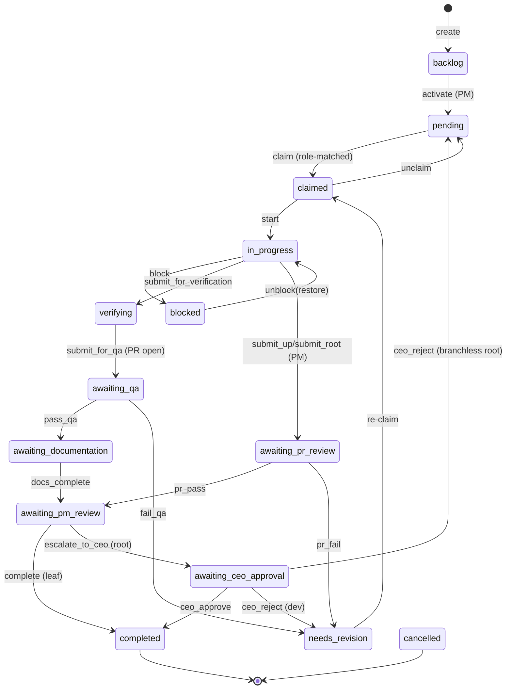

# task-service slice

## Purpose
`TaskService` is the authoritative owner of the task lifecycle: CRUD, hierarchical create (incl. MegaTask umbrella + root-subtasks), claim/locking, every status transition, completion/CEO approval/cancellation, dependency DAG wiring, rework routing, and completion-time learning capture. All status writes funnel through `_validate_and_set_status` + `_emit_status_transition_audit` so the audit journey and the `revision_count` rework counter stay in lockstep with real task state.

## Files

| Path | Role |
|------|------|
| `roboco/services/task.py` | Single 8.7k-line service module implementing TaskService + a few internal dataclass containers (`_CompletionSnapshot`, `SoftBlockInput`, `SoftBlockInfo`, `GatewayAgentView`). |

## Key Symbols

| Name | Kind | File:Line | Responsibility |
|------|------|-----------|----------------|
| `_validate_and_set_status` | method | task.py:548 | Single chokepoint: validate transition + git requirements, set status, poke dispatcher, emit audit. |
| `_emit_status_transition_audit` | method | task.py:652 | Write `task.<status>` audit row in caller session; bump `revision_count` on entry into `needs_revision`. |
| `create` | method | task.py:864 | New task; depth/batch/AC validation; branchless/umbrella flags; baseline constraints attachment. |
| `_attach_baseline_constraints` | method | task.py:971 | Append conventions baseline constraints to task prompt (gated `conventions_enabled`). |
| `activate` | method | task.py:1577 | `backlog→pending` (PM only); batch-shape guard. |
| `_ensure_branch_for_task` | method | task.py:1675 | Branch resolution for claim; `""` for branchless/umbrella. |
| `_auto_create_branch` | method | task.py:1833 | Cut hierarchical branch + per-task worktree add (F123). |
| `_remove_task_worktree` | method | task.py:1913 | Low-level worktree removal by task id. |
| `admin_set_status` | method | task.py:2060 | Privileged override (bypass validator); restores pre-block owner; still emits audit. Post-#2176: the blocked→pending/in_progress restore path now attributes the audit row to the admin actor (not the restored owner) and emits a `task.admin_override` row (`forced=False, restore=True`) independent of the `force` flag. |
| `_restore_block_ownership` | method | task.py:8526 | Factored out of `_apply_pre_block_restore` (b3558d4e complexity split): applies snapshotted status/owner restore (branchless in_progress→pending divert), returns `(pre_status, restored_status, restored_owner)`. |
| `_emit_admin_override_audit` | method | task.py:8555 | Factored out of `_apply_pre_block_restore`: writes `task.admin_override` audit row for admin-triggered blocked restores (`forced=False, restore=True`). |
| `claim` | method | task.py:3112 | `FOR UPDATE` lock + `_validate_claim_preconditions` + `_finalize_claim`; calls `_validate_and_set_status(claimed)`. |
| `_validate_claim_preconditions` | method | task.py:2883 | Per-claim validator chain: status, `_claim_blocked_by_sequencing` (dependency + sequence), team, pre-assignment theft, self-review. |
| `_claim_blocked_by_sequence` | method | task.py:2805 | Strict sibling-sequence gate: a PENDING/`needs_revision` task with parent + effective `sequence` (`COALESCE(sequence, 0)`) N is held while any same-parent sibling with a strictly lower effective sequence is non-terminal — assignee-blind, independent of `dependency_ids`. Ties run parallel; cancelled siblings never block. |
| `_claim_blocked_by_dependencies` | method | task.py:2781 | `unmet_dependency` TIMING gate: refuses claim while any `dependency_ids` entry is non-terminal. |
| `is_pending_claim_blocked` | method | task.py:2864 | Read-only wrapper over `_claim_blocked_by_sequencing` (dependency OR sequence) so the orchestrator dispatcher can filter a doomed claim before attempting it (`_pending_claim_blocked` in orchestrator.py). |
| `stamp_wave_sequence` | method | task.py:7452 | Stamps a freshly delegated subtask's `sequence` as `1 + max(sequence of each same-parent dependency target)`, or `0` when independent — so independent siblings tie (parallel under the sequence gate) while colliding/ordered work ascends. Runs POST-wiring (after the collision DAG / cross-cell edges land); PM-authored sequences are never rewritten. |
| `_apply_dependency_lineage` / `_merge_one_dependency` | method | task.py:2308 / 2337 | Claim-time content assist (not a gate): merges each same-repo dependency's landed work into a freshly cut branch when it lies outside the branch's own ancestor chain (`GitService.merge_dependency_lineage`); a real conflict aborts the merge and stamps a `dependency_lineage_conflict` transition note instead of failing the claim. |
| `_finalize_claim` | method | task.py:2925 | Work-session create/inherit, branch cut, proactive-context injection. |
| `_inject_proactive_context` | method | task.py:3154 | Briefing injection at claim (institutional memory when `org_memory_enabled`). |
| `_completion_learnings_for` | method | task.py:2798 | Distill one lesson (ON) vs legacy raw capture (OFF). |
| `_extract_completion_learnings` | method | task.py:2837 | Fire-and-forget learning record + RAG indexing. |
| `start` | method | task.py:3354 | `claimed→in_progress`. |
| `unclaim_for_agent` / `_force_unclaim_to_pending` | method | task.py:3579 / 3507 | Release claim to pool; abandon stale work session. |
| `block` / `soft_block` / `unblock` | method | task.py:3760 / 3823 / 3897 | Snapshot pre-block owner; restore on unblock. |
| `submit_for_qa` | method | task.py:4065 | `verifying→awaiting_qa`; clears claimed_by (passes explicit audit_agent_id). |
| `pass_qa` / `fail_qa` | method | task.py:4112 / 4187 | QA verdict; `fail_qa` routes back to original dev (marker → work-session fallback). |
| `_resolve_revision_dev` | method | task.py:4301 | Work-session fallback when `original_developer` marker missing. |
| `docs_complete` | method | task.py:4336 | `awaiting_documentation→awaiting_pm_review` (parallel completion). |
| `submit_for_pm_review` / `complete` | method | task.py:4690 / 4882 | PM review submit + completion / CEO escalation chain. |
| `_apply_complete_approval_chain` | method | task.py:4811 | Leaf→completed vs root→awaiting_ceo_approval. |
| `_assert_pr_merged_for_complete` | method | task.py:4845 | PR-merged gate before `complete`. |
| `apply_escalation` | method | task.py:4942 | `in_progress→blocked` direct status set + audit emit (bypasses validator by design). |
| `escalate_to_ceo` | method | task.py:5064 | `awaiting_pm_review→awaiting_ceo_approval`; gained `actor_agent_id: UUID | None = None` param (stamped as `audit_agent_id` so the transition row attributes to the specific PM/Board agent, not just the role). |
| `ceo_approve` | method | task.py:5146 | CEO merges then approves; `awaiting_ceo_approval→completed`. |
| `ceo_reject` | method | task.py:5414 | Reject → `needs_revision` (dev) or `pending` (branchless root via admin_set_status). |
| `_remove_task_worktree_on_terminal` | method | task.py:5601 | Best-effort worktree cleanup on complete/ceo_approve; no-op for branchless. |
| `cancel` | method | task.py:5644 | Cascade-cancel descendants through the validator. |
| `reassign` / `reassign_active_claim` | method | task.py:7657 / 7807 | Reassignment with Board/Main-PM diversion guards. |
| `pr_pass` / `pr_fail` | method | task.py:8100 / 8137 | In-path PR-review gate verdicts. |

## Data Flow
Request → `TaskService` loads `TaskTable` (`get`/`_load_task_or_raise`) → validates role/transition (`validate_task_transition`) + git reqs (`validate_git_requirements`, branchless/umbrella/external-review exempt) → mutates columns → `_emit_status_transition_audit` writes `AuditLogTable` row + bumps `revision_count` in the same session → pokes orchestrator `trigger_dispatch()` → fires fire-and-forget background tasks (RAG indexing, learning distillation, worktree cleanup, work-session close). Terminal states trigger `_unblock_dependents` to revive waiting tasks.

## Mermaid

## Logical Tree
- TaskService
  - State core: `_validate_and_set_status`, `_emit_status_transition_audit`, `admin_set_status`, `_restore_block_ownership`, `_emit_admin_override_audit`
  - Create/shape: `create`, `_validate_parent_depth`, `_validate_batch_membership`, `activate`
  - Branch/worktree: `_ensure_branch_for_task`, `_auto_create_branch`, `_remove_task_worktree*`
  - Claim: `claim`, `_validate_claim_preconditions`, `_claim_blocked_by_sequence`, `_claim_blocked_by_dependencies`, `_finalize_claim`, `_apply_dependency_lineage`, `_inject_proactive_context`, `acquire_*_lock`
  - Lifecycle verbs: `start`, `block*`, `unblock`, `pause`, `resume`, `submit_for_qa`, `pass_qa`, `fail_qa`, `docs_complete`, `submit_for_pm_review`
  - Completion: `complete`, `_apply_complete_approval_chain`, `ceo_approve`, `ceo_reject`, `cancel`
  - Rework routing: `fail_qa`, `_resolve_revision_dev`, `ceo_reject`
  - Learning/indexing: `_completion_learnings_for`, `_extract_completion_learnings`, `_trigger_completion_hooks`, `_index_*_background`
  - Dependencies/sequencing: `add_dependency`, `wire_sibling_collision_dag`, `wire_cell_task_wave_chain`, `_unblock_dependents`
  - Reassign/escalate: `reassign*`, `escalate*`, `_maybe_divert_*`
  - PR gate: `pr_gate_claim`, `submit_for_review`, `pr_pass`, `pr_fail`
  - Queries: `list_*`, `count_*`, `*_ac_coverage`, `all_subtasks_terminal`

## Dependencies
- `roboco.foundation.policy.lifecycle` (transitions, role restrictions, git requirements, `is_branchless_coordination`, `is_batch_umbrella`)
- `roboco.foundation.policy.batch` / `sequencing` (batch predicates, sibling DAG)
- `roboco.services.work_session` (close/abandon), `roboco.services.workspace`, `roboco.services.learning`, `roboco.services.memory_distiller`
- `roboco.services.conventions` (`_attach_baseline_constraints`)
- `roboco.db.tables` (`TaskTable`, `AuditLogTable`, `WorkSessionTable`, `ProjectTable`)
- `roboco.api.deps.get_orchestrator` (lazy; dispatch poke), `roboco.config.settings`
- Markers / `extract_original_developer` helpers

## Entry Points
- `TaskService.create` / `create_subtask` — task creation (orchestrator intake, batch confirm, gateway delegate).
- `TaskService.claim` — gateway `give_me_work` / `i_will_work_on` / `claim_review` / `claim_doc_task`.
- Lifecycle verbs (`start`, `submit_for_qa`, `pass_qa`/`fail_qa`, `docs_complete`, `submit_for_pm_review`, `complete`, `cancel`, `pr_pass`/`pr_fail`, `escalate_*`, `ceo_approve`/`ceo_reject`) — all gateway flow verbs.
- `admin_set_status` — operator PATCH + orchestrator auto-recover.
- `wire_*` / `add_dependency` — `SequencingService` / `BatchPlacement`.

## Config Flags
- `ROBOCO_ORG_MEMORY_ENABLED` — `_completion_learnings_for` swaps raw capture for one distilled lesson (task.py:2810).
- `ROBOCO_CONVENTIONS_ENABLED` — `_attach_baseline_constraints` skipped when off (task.py:1000).
- (Indirect, via called services) `ROBOCO_SELF_HEAL_*`, `ROBOCO_CI_WATCH_*`, `ROBOCO_DEP_UPDATE_*`, `ROBOCO_RELEASE_MANAGER_*` gate the `list_open_*`/`list_open_release_proposals` query paths.

## Gotchas
- `_emit_status_transition_audit` writes the audit row in the CALLER's session — callers that clear `claimed_by` before transitioning MUST pass `audit_agent_id` or the row lands unattributed (task.py:688).
- `apply_escalation` (task.py:4942) sets `task.status` directly and calls `_emit_status_transition_audit` deliberately bypassing the strict validator (blocked is a terminal-ish hold) — only audited privileged-style path besides `admin_set_status`.
- `fail_qa` accepts `claimed`/`in_progress` (QA is mid-review); the `original_developer` marker is unreliable — the work-session fallback (`_resolve_revision_dev`) is load-bearing (task.py:4248).
- Branchless/umbrella/external-review tasks are exempt from the branch gate inside `GitContext` (task.py:597-611); umbrella is also exempt from the `awaiting_pm_review→awaiting_ceo_approval` pr_number gate.
- `complete()` requires PR merged (`_assert_pr_merged_for_complete`) EXCEPT branchless roots; `ceo_approve` separately checks `work_session.pr_status=="merged"` and refuses otherwise.
- Background indexing/learning/cleanup tasks are tracked on `self._background_tasks` and are best-effort — a failure never blocks the transition.
- The sequence gate (`_claim_blocked_by_sequence`) is enforced ONLY in `_validate_claim_preconditions`, i.e. inside `claim` itself — both the gateway claim verbs AND the orchestrator's raw dispatch claim cross it because they both funnel through `TaskService.claim`, unlike the pre-#382 dependency gate which briefly lived only on the gateway side. Any future claim path that bypasses `TaskService.claim` (a raw `admin_set_status`, for instance) does NOT get sequence enforcement.
- `_apply_dependency_lineage` is scoped to SAME-REPO dependencies only (`dep_task.project_id != ctx.project.id` short-circuits) — a cross-repo dependency edge (e.g. a MegaTask root-subtask in another project) has no shared git history to merge and is silently skipped; the dependency TIMING gate still holds the claim regardless of repo.

## Drift from CLAUDE.md
- CLAUDE.md states ceo_reject "~4779 skips _validate_and_set_status in branchless path". Actual: branchless branch of `ceo_reject` is at task.py:5488 and routes through `admin_set_status` (which DOES emit audit at task.py:2100). The non-branchless branch DOES call `_validate_and_set_status` (task.py:5461). No audit gap — the line reference is stale.
- CLAUDE.md "PR is created BEFORE QA review" — `submit_for_qa` enforces `pr_number` via `validate_git_requirements` (consistent, no drift).
- CLAUDE.md verb table lists `pr_reviewer` `pr_pass`/`pr_fail` — present at task.py:8100/8137 (consistent).

## Changes Since Baseline
`git log fd10cc86..HEAD -- roboco/services/task.py`:
- `15effce0` Chore: 141 Gaps fill-in (#283) — bulk gap closure; transition audit chokepoint + `revision_count` centralization (task.py:685-706), branchless/umbrella git-context exemptions, fail_qa work-session fallback, ceo_reject branchless routing.
- `3aff6e04` Chore: Close gaps (#285) — follow-on gap close (worktree-on-terminal cleanup F123 Phase C, escalation audit emit, rework routing hardening).

> Post-snapshot updates (since 2026-06-29): `20f1f9ba` admin_set_status: thread actor_id/actor_role into `_apply_pre_block_restore`; blocked→pending/in_progress restore now attributes the audit row to the admin actor (not the restored owner) and emits a `task.admin_override` row (forced=False, restore=True) independent of the force flag. `b3558d4e` complexity: extract `_restore_block_ownership` (line 8526) + `_emit_admin_override_audit` (line 8555) from `_apply_pre_block_restore` — no behavior change, splits a C-rank block for the xenon gate. `0e7674af` escalate_to_ceo gains `actor_agent_id: UUID | None = None` param stamped as audit_agent_id; push_branch / create_pr / create_root_pr / escalate_to_ceo side-effect handlers in the verb runner now forward actor_agent_id (was dropped, causing wrong workspace or role-only audit attribution). `8f3f4236` (#452) "sequence is the bar" — adds `_claim_blocked_by_sequence` + `_validate_claim_preconditions` wiring, `stamp_wave_sequence` (replacing a raw per-sibling delegation ordinal), and migration 069 (`tasks.parent_task_id` index, the sibling probe's hot path). `f2834cf5` (#466) adds `_apply_dependency_lineage`/`_merge_one_dependency`, called from `_create_branch_in_project` right after a fresh branch cut.

## Regression Risks

| Title | File:Line | Claim | Severity |
|-------|-----------|-------|----------|
| `ceo_approve` skips work-session close | task.py:5146 | `ceo_approve` calls `_remove_task_worktree_on_terminal` but NOT `_close_work_session_for_task` (only `complete()` at 4934 does). Approved-via-CEO tasks leave the WorkSession row not marked `completed`/closed → reporting/session-resolution drift. | High |
| `ceo_approve` skips full completion hooks | task.py:5200-5210 | Only fires `_extract_completion_learnings` manually; skips `_trigger_completion_hooks` so code-changes RAG indexing + decision indexing never run for CEO-approved (root) tasks. | Medium |
| `apply_escalation` bypasses validator | task.py:4942 | Sets `task.status` directly then emits audit; a caller passing a wrong target status would skip `validate_task_transition`/git-req checks. Relies on call-site discipline. | Medium |
| `fail_qa` route depends on unreliable marker | task.py:4228-4272 | Fast path reads `original_developer` marker; if absent, falls to `_resolve_revision_dev`. If both miss (no dev work session, e.g. parent-only edit) task is unassigned to pool → PM may grab a dev task (the original 2026-06-27 loop). | High |
| Branchless `ceo_reject` uses `admin_set_status` | task.py:5488 | Bypasses strict validator (intended) but `awaiting_ceo_approval→pending` is not in `VALID_TRANSITIONS`; any future tightening of admin override could wedge coordination-root rejection. | Medium |
| `revision_count` bump is in audit helper only | task.py:702-706 | Any future transition path that sets `task.status` directly WITHOUT calling `_emit_status_transition_audit` (mirroring `apply_escalation`'s pattern) would silently skip the rework counter — metric drift. | Medium |
| `_remove_task_worktree_on_terminal` silent-fail | task.py:5614-5627 | Cleanup failure is logged-warning only; on recurring FS/permission error worktrees leak indefinitely with no operator signal beyond logs. | Low |
| Concurrent mid-verb state change | task.py:548 | `_validate_and_set_status` does not re-fetch the task after validation; a concurrent committer could flip status between load and set, producing an invalid edge that the validator already passed. Mitigated upstream by verb-runner savepoints, not here. | Medium |
| `cancel` cascade swallows role violations | task.py:5679-5690 | Descendants that fail role validation are skipped (warning), so a cancel can leave non-terminal descendants orphaned in `awaiting_ceo_approval` (only CEO may cancel those). | Medium |
| `submit_for_qa` clears `claimed_by` before transition | task.py:568-572, 4065 | Relies on `audit_agent_id` being passed to attribute the row to the dev; if a future caller forgets, the `awaiting_qa` audit row lands `agent_id=NULL`. | Low |

## Health
`TaskService` is the most load-bearing service and the most hardened: the audit chokepoint, `revision_count` centralization, branchless/umbrella exemptions, and worktree-on-terminal cleanup all landed in the two recent gap-closure commits. The residual risk is concentrated in the two CEO-path asymmetries (`ceo_approve` not closing the work session / not running the full completion hooks) and in `fail_qa`/`ceo_reject` rework routing, which depends on the unreliable `original_developer` marker and a work-session fallback that has no guarantee a developer session exists.