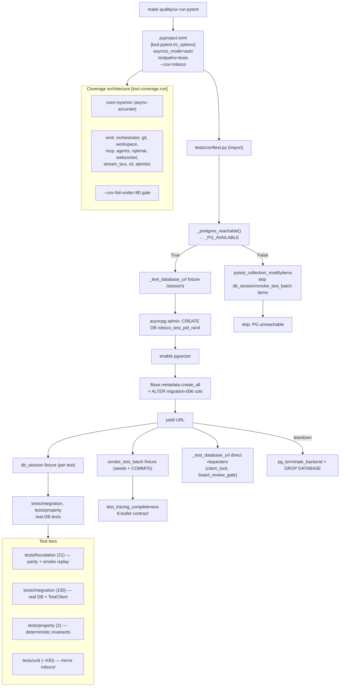

# tests slice

## Purpose
The pytest test suite for RoboCo: 571 test_*.py files across tests/foundation, tests/integration (+services/+v1), tests/property, and tests/unit (mirroring the roboco/ package layout). This slice covers the test INFRASTRUCTURE only — the two conftest.py layers, the JSON smoke-trace fixture, the two standalone shell smoke scripts, the pyproject pytest/coverage config, and the Makefile gates — plus the categorical structure of the 571 test files (NOT every individual test, per the slice scope). The suite is async-first (pytest-asyncio auto mode), coverage-gated at 80% via sys.monitoring, and DB tests run against an ephemeral real Postgres+pgvector DB created per session.

## Files

| Path | Role | LOC |
|---|---|---|
| tests/conftest.py | Top-level conftest: provisions ephemeral Postgres+pgvector test DB, db_session + smoke_test_batch fixtures, skip-when-PG-unreachable hook | 510 |
| tests/unit/services/optimal_brain/conftest.py | Single-line docstring conftest for optimal_brain unit tests (no fixtures) | 1 |
| tests/__init__.py | Empty package marker (all 14 tests/*/__init__.py are empty) | 0 |
| tests/fixtures/2026-05-08-smoke-trace.json | Synthesized 11-bug smoke trace fixture consumed by test_lifecycle_smoke_replay; pins (verb,role,task setup,expected envelope) per bug with a replay_kind taxonomy | 194 |
| tests/integration/test_bash_guard_message.sh | Standalone bash smoke: asserts docker/scripts/bash-guard-hook.sh denial blocks are <=3 lines (token-budget guard) | 43 |
| tests/integration/test_stop_hook_verb_names.sh | Standalone bash smoke: asserts stop-hook.sh + bash-guard-hook.sh list only current gateway verbs (no pre-gateway legacy verb names) | 36 |
| pyproject.toml | [tool.pytest.ini_options] (asyncio_mode=auto, testpaths, cov addopts) + [tool.coverage.run] (sysmon core, omit list) — the coverage-architecture source of truth | 450 |
| Makefile | quality/quality-fast/panel-gate/test/test-3.10..3.14 targets wiring pytest+ruff+mypy+xenon+vulture into the merge gate | 547 |
| tests/foundation/ | 21 structural/parity tests: agents_config parity, lifecycle consumer/generator parity, role-set parity, seed-orchestrator parity, tracing-verb parity, route-guard consolidation, smoke replay, lifecycle spec, pr_review_gate, identity, communications, journaling, cell_teams, agent_loop, validate, task_completeness |  |
| tests/integration/ | 100 real-DB + FastAPI integration tests: full lifecycle real DB (_StubGit), task_service_*, *_routes, migrations 013-049, sequencing, conventions e2e, metrics, release, ci_watch, dep_update, prompter_live, secretary |  |
| tests/integration/services/ | 9 autonomy-engine integration tests: ci_watch_engine/notify/source, dep_update_engine/probe/source, external_pr_repo_dedup, project_autonomy_update, active_task_owns_branch_scoping |  |
| tests/integration/v1/ | 1 FastAPI TestClient e2e (test_full_pending_to_completed) exercising all six v1 routers via stateful mocked Choreographer/ContentActions through the full hand-off chain |  |
| tests/property/ | 2 deterministic property tests (no hypothesis dep): state-machine invariants (orphan/terminal/reachability/random-walk) + tracing-completeness over smoke_test_batch |  |
| tests/unit/ | ~430 unit tests mirroring roboco/: agents, api (+routes/+schemas), billing, config, conventions, db, enforcement, events, foundation/policy, gateway (105), llm, mcp_servers, migrations, models, runtime (64), scripts, services (120), templates, utils |  |
| tests/unit/gateway/ | 105 Choreographer/verb-runner unit tests — the largest single cluster: every intent verb's guards, envelopes, evidence, claim locks, lane barrier, pr gate, conventions gate, content actions |  |
| tests/unit/runtime/ | 64 orchestrator unit tests: spawn/manifest/cwd/worktree, reaper, respawn persistence, rate-limit/overload sweeps, ci_watch/dep_update/release/self_heal loops, no_spawn_human_roles, per_dev_lane_queue, readopt_running_agents |  |
| tests/unit/services/ | 120 service unit tests: task, git (+worktree), workspace, work_session, release_executor/readiness/manager, sequencing, conventions, playbook, notification, rate_limit_tracker, optimal_brain/ (10) |  |
| tests/e2e_smoke/ | Scripted-agent smoke tests against the live in-process orchestrator; separate from the default pytest collection (run by the PR/NAS smoke gate) |  |
| tests/e2e_smoke/harness.py | E2E harness: E2EStack app + orchestrator client + per-test agent manifests; used by the e2e_smoke tier | ~520 |

## E2E smoke harness

The `tests/e2e_smoke/` tier runs scripted agents against a real in-process FastAPI app and orchestrator. It is **not** collected by the default `uv run pytest` invocation; it is exercised separately by the PR gate / NAS smoke run. The harness in `tests/e2e_smoke/harness.py` builds an `E2EStack`, mounts the orchestrator client, and gives each test a per-agent manifest.

Recent harness hardening for the auditor-revival slice (PR #498, task `8323cd50`):

- `tests/conftest.py` now catches a missing `pgvector` extension when creating the ephemeral test database and continues with a warning. The core schema does not require it and the e2e smoke suite does not exercise RAG, so lightweight Postgres sandboxes can run the suite without the pgvector package.
- `tests/e2e_smoke/harness.py` clears any host-supplied `ROBOCO_AGENT_TOKEN` from the environment before a `ScriptedAgent` re-imports `roboco.mcp.flow_server`. The host agent may carry a real token for the test runner's identity; that token does not match the ephemeral test agent IDs and causes `401 Unauthorized` when flow_server forwards it.
- `tests/e2e_smoke/test_auditor_triggers.py` exercises both scheduled and reactive auditor dispatch through a `_fresh_orchestrator` helper. Because the helper constructs `AgentOrchestrator` via `__new__` to bypass normal initialization, it must manually initialize the private attributes `_instances` and `_last_audit_spawn_at` that `_is_agent_active` and `_dispatch_audit_work` read. The two tests are intentionally **synchronous** (no `@pytest.mark.asyncio`) because the harness already enters an async loop via `run_db`; the test body uses `asyncio.run` on an inner coroutine. Internal API calls use the raw `_SYSTEM_API_HEADERS` (system identity only) rather than the production `_system_api_headers` helper, because dev mode rejects an `UNSIGNED` `X-Agent-Token`. Settings are patched at `api_url` (the input to the computed `internal_api_url` property), and notifications are matched with `NotificationType.ALERT` instead of the string `"ALERT"`.

## Key Symbols

| Name | Kind | File:Line | Responsibility |
|---|---|---|---|
| _TEST_DB_HOST/_TEST_DB_PORT/_TEST_DB_USER/_TEST_DB_PASSWORD/_TEST_DB_ADMIN_DB | module constants | tests/conftest.py:84 | Env-overridable Postgres test endpoint discovery; defaults host=localhost port=15432 user=roboco password=roboco admin-db=postgres (changed from :5432/$USER since baseline) |
| _postgres_reachable | function | tests/conftest.py:91 | TCP-probe the configured Postgres endpoint with a 1s timeout; returns False on OSError |
| _PG_AVAILABLE | module constant | tests/conftest.py:114 | Module-level liveness flag computed once at import; gates fixture self-skip + collection-time skip marking |
| _warn_if_pg_unavailable | function | tests/conftest.py:101 | Added in 536bbb64: emits a `warnings.warn` at import time when PG is unreachable, so an all-skips green run surfaces a visible warning instead of passing silently; tested by tests/unit/test_conftest_db_unreachable_warning.py |
| _build_url | function | tests/conftest.py:108 | Build a postgresql+asyncpg:// URL with optional password for a given database name |
| _test_database_url | fixture (session, async) | tests/conftest.py:118 | Session-scoped: CREATE DATABASE roboco_test_<pid>_<rand>, enable pgvector, Base.metadata.create_all + manually ADD COLUMN acceptance_criteria_status/qa_evidence_inspected (migration 006, not on ORM), yield URL, DROP DATABASE on teardown (force-terminate stragglers first); self-skips if PG unreachable |
| db_session | fixture (function, async) | tests/conftest.py:222 | Per-test AsyncSession bound to the ephemeral DB; no pool_pre_ping (avoids un-awaited cancel RuntimeWarning); rollback + dispose on teardown |
| smoke_test_batch | fixture (function, async) | tests/conftest.py:247 | Seeds 1 project + system agent + dev/qa/pm agents + 1 COMPLETED task + 3 audit_log rows + 3 journals/entries (reflect/learning/decision) + raw-SQL sets migration-006 columns; the only fixture that COMMITs; yields [task_id] |
| pytest_collection_modifyitems | hook | tests/conftest.py:490 | Collection-time skip marker for any item whose fixturenames intersect {db_session, smoke_test_batch} when _PG_AVAILABLE is False — does NOT cover _test_database_url direct requesters |

## Data Flow
pytest invocation (make quality/make test/uv run pytest) reads [tool.pytest.ini_options] in pyproject.toml: asyncio_mode=auto makes every async def test_ run on the asyncio loop, testpaths=["tests"] scopes collection, addopts="--cov=roboco --cov-report=term-missing" attaches coverage with core=sysmon. At import time tests/conftest.py probes Postgres via _postgres_reachable() and sets _PG_AVAILABLE. The session fixture _test_database_url opens an asyncpg admin connection, CREATEs an ephemeral DB roboco_test_<pid>_<rand>, enables pgvector, builds schema via Base.metadata.create_all (NOT alembic — sidesteps documented drift in migration 001 enum casing and 008 nonexistent agents.skills), manually ALTERs the migration-006 columns the ORM doesn't map, yields the URL, and DROPs the DB on session teardown. Per-test, db_session builds a fresh engine+AsyncSession against that URL, yields it, rolls back + disposes. smoke_test_batch seeds a full tracing-contract-compliant completed task (committing). pytest_collection_modifyitems marks db_session/smoke_test_batch requesters as skipped when PG is down. Coverage flows: sys.monitoring core counts async-aware line coverage, the omit list excludes infra-bound modules (orchestrator.py, git.py, workspace.py, mcp/*, agents/*, optimal.py, etc.) from the 80% --cov-fail-under gate, deferring their coverage to NAS smoke runs. The shell scripts are NOT invoked by pytest — they are standalone smoke scripts run manually/CI against docker/scripts/*.sh. The JSON fixture is loaded by tests/foundation/test_lifecycle_smoke_replay.py via _load_fixture() and dispatched per record by replay_kind into spec.Decision assertions.

## Mermaid


## Logical Tree
```
tests/
├── __init__.py (empty package marker)
├── conftest.py  [TOP-LEVEL — DB provisioning, db_session, smoke_test_batch, skip hook]
├── fixtures/
│   └── 2026-05-08-smoke-trace.json  [11 synthesized bug records, replay_kind taxonomy]
├── e2e_smoke/  (scripted-agent smoke tests against live orchestrator; not collected by default pytest run)
│   ├── harness.py  [E2EStack + orchestrator client + per-test agent manifests]
│   ├── arcs.py  [seed helpers for company/project/task]
│   └── test_auditor_triggers.py  [scheduled + reactive auditor dispatch smoke tests]
├── foundation/  (21 tests — structural/parity gates)
│   ├── test_lifecycle_smoke_replay.py  [consumes the JSON fixture, dispatch by replay_kind]
│   ├── test_lifecycle_spec.py/test_lifecycle_generators.py/test_lifecycle_consumer_parity.py
│   ├── test_agents_config_parity.py/test_role_set_parity.py/test_seed_orchestrator_parity.py
│   ├── test_tracing_verb_parity.py/test_tracing.py
│   ├── test_route_guard_consolidation.py/test_role_reexport.py
│   ├── test_pr_review_gate.py/test_task_completeness.py/test_validate.py
│   ├── test_identity.py/test_cell_teams.py/test_agent_loop.py
│   └── test_communications.py/test_communications_consumers.py/test_journaling.py/test_journaling_consumers.py
├── integration/  (100 + 9 services + 1 v1)
│   ├── _StubGit pattern (test_full_lifecycle_real_db, test_lifecycle_real_db)
│   ├── test_foundation_phase1..4_smoke.py  [tiered package-layout gates]
│   ├── test_migration_013/014/016/028 + batch_intake/ci_watch/dep_update/observability
│   ├── test_*_routes.py (agents, dashboard, docs, git, journal, kanban, notifications, pitch, product, project, release, research, secretary, stream, tasks, work_session, orchestrator, prompter_live)
│   ├── test_task_service_*  [basics, transitions, lifecycle_misc, misc, background, no_silent_fallback, route_orchestration]
│   ├── services/  [ci_watch_engine/notify/source, dep_update_engine/probe/source, external_pr_repo_dedup, project_autonomy_update, active_task_owns_branch_scoping]
│   ├── v1/test_full_pending_to_completed.py  [TestClient e2e, all 6 v1 routers, stateful mocks]
│   ├── test_bash_guard_message.sh  [standalone smoke]
│   └── test_stop_hook_verb_names.sh  [standalone smoke]
├── property/  (2 — deterministic, no hypothesis)
│   ├── test_state_machine_invariants.py  [6 invariants: orphan/terminal/reachability/random-walk/self-loop]
│   └── test_tracing_completeness.py  [6-bullet tracing contract over smoke_test_batch]
├── e2e_smoke/  (scripted-agent lifecycle smoke — env-gated)
│   ├── conftest.py  [collection gate: skips unless ROBOCO_E2E_SMOKE=1]
│   ├── harness.py  [in-process API, ephemeral Postgres, bare git origin, fake GitHub REST]
│   ├── arcs.py  [canonical-company seeding + dev/qa/pm/reviewer lifecycle helpers]
│   ├── test_dev_lifecycle.py  [scenario 1: leaf dev arc → awaiting_pm_review]
│   ├── test_pm_merge_chain.py  [scenarios 2/2b: PR-gate turn cut + serial root merges]
│   ├── test_root_ceo_chain.py  [scenario 3: pr_fail → rework → real approve-and-merge]
│   ├── test_megatask_umbrella.py  [scenario 4: MegaTask sequencing + umbrella closure]
│   ├── test_notification_coordination_events.py  [DB-truth checks for restored coordination-event ALERTs]
│   ├── test_auditor_triggers.py  [scheduled sweep + reactive QA-fail alert paths spawn auditor]
│   ├── test_auth_gate_coverage.py, test_background_engines.py, test_data_integrity.py, test_feature_spotlight.py, test_flow_verb_timeout.py, test_git_workflow.py, test_sandbox_image_tags.py, test_sandbox_on_demand.py, test_state_machine.py, test_video_pipeline.py  [other e2e smoke scenarios]
│   └── test_bash_guard_message.sh / test_stop_hook_verb_names.sh  [NOT here — these live in tests/integration/]
└── unit/  (~430 — mirrors roboco/)
    ├── test_* (11 top-level: agents_config, bootstrap, config_properties, enum_migration_parity, exceptions, logging, no_deleted_tool_names, notification_dedup, notification_dedup_refire, notification_delivery_refire, toolchain_flag)
    ├── agent_sdk/ (11) — grok_cli/intake/secretary/manifest/prompt_guard/usage_sync/verb_circuit_breaker
    ├── agents/ (4) — autogen_prompt_layer, briefing_cluster, conventions_ambient_injection, tool_load_directive
    ├── api/ (30) + routes/ (3) + routes/v1/ (11) + schemas/ (2) + schemas/v1/ (1) — middleware, deps, errors, websocket_*, schemas, v1 flow router tests
    ├── billing/ (1) — pricing
    ├── config/ (5) — ci_watch/conventions/dep_update/org_memory/release_manager flag tests
    ├── conventions/ (10) — classify_python/ts, cli, cli_smoke, custom, hygiene, modularity, placement, runner, scan
    ├── db/ (1) — respawn_tracker_table
    ├── enforcement/ (4) — a2a_access, journal_perms, task_lifecycle, task_ownership
    ├── events/ (2) — bus, handlers
    ├── foundation/policy/ (2) + content/ (6) + conventions/ (3) — pure policy models
    ├── gateway/ (105) — Choreographer/verb-runner guard + envelope + evidence surface
    ├── llm/ (4) + providers/ (3) — metrics_holder, probe_ollama_tags, providers, toon_adapter, grok_auth/cli_config/cli_usage
    ├── mcp_servers/ (10) — flow/do/search/intake/secretary servers, circuit breakers, envelope_on_4xx, intent_public_mapping
    ├── migrations/ (1) — structured_content_backfill
    ├── models/ (7) — events, journal, llm, misc, product, task_create_completeness, transcription
    ├── runtime/ (64) — orchestrator spawn/reaper/loops; per_dev_lane_queue, respawn_persistence, readopt_running_agents, gateway_health
    ├── scripts/ (2) — bash_guard, verify_postgres_enums
    ├── services/ (120) + optimal_brain/ (10 + conftest) — task, git (+worktree family), workspace, work_session, release_*, sequencing, conventions, playbook, notification, rate_limit, optimal_brain
    ├── templates/ (2) — pr_internal, pr_root
    └── utils/ (2) — converters, crypto
```

## Dependencies
- Internal: roboco.db.tables (AgentTable, AuditLogTable, JournalEntryTable, JournalTable, ProjectTable, TaskTable), roboco.db.base.Base (metadata.create_all), roboco.models.base (AgentRole, AgentStatus, TaskStatus, TaskType, Team, Complexity, JournalEntryType, TaskNature), roboco.foundation.policy.lifecycle (VALID_TRANSITIONS, get_valid_transitions, is_terminal_state, can_invoke_intent, intents_for_role, _INTENT_VERBS), roboco.foundation.policy.tracing (VERB_REQUIREMENTS, VERBS_WITHOUT_TRACING), roboco.foundation.identity/roboco.foundation.AGENTS, roboco.enforcement.task_lifecycle (shim), roboco.agents_config (_BOARD_ROLES, TASK_CREATOR_ROLES, AGENT_ROLE_MAP, AGENT_TEAM_MAP), roboco.runtime.orchestrator.AgentOrchestrator, roboco.api.deps/roboco.api.routes.v1.*/roboco.services.gateway.envelope.Envelope, scripts/verify_postgres_enums.py (loaded via importlib.util), docker/scripts/bash-guard-hook.sh + docker/scripts/stop-hook.sh (shell smoke targets)
- External: pytest, pytest-asyncio, pytest-cov, pytest-xdist, asyncpg, sqlalchemy[asyncio] (create_async_engine, async_sessionmaker, AsyncSession, text, select), fastapi.testclient.TestClient, unittest.mock (AsyncMock, MagicMock, patch), hypothesis NOT a dependency (property tests are deterministic)

## Entry Points

| Name | File | Trigger |
|---|---|---|
| make quality | Makefile | developer/CI merge gate — runs ruff format-check + ruff check + mypy roboco/ tests/ + pytest -q --cov=roboco --cov-report=term-missing --cov-fail-under=80 + xenon + vulture |
| make quality-fast | Makefile | pre-submit fast gate — ruff + mypy + pytest -q -x --no-cov (no coverage threshold) |
| make e2e-smoke | Makefile | scripted-agent lifecycle smoke — `ROBOCO_E2E_SMOKE=1 uv run pytest tests/e2e_smoke -q --no-cov`; needs test Postgres + git on PATH |
| make gate (panel-gate) | Makefile | panel pnpm lint + typecheck + vitest |
| make test/test-3.10..3.14/test-all | Makefile | docker compose run roboco pytest -v --cov=. across Python versions |
| uv run pytest | pyproject.toml | direct invocation — auto-applies addopts (--cov=roboco --cov-report=term-missing), testpaths=tests, asyncio_mode=auto |
| tests/integration/test_bash_guard_message.sh | tests/integration/test_bash_guard_message.sh | standalone bash smoke (NOT pytest-collected); run manually/CI to assert bash-guard denial <=3 lines |
| tests/integration/test_stop_hook_verb_names.sh | tests/integration/test_stop_hook_verb_names.sh | standalone bash smoke (NOT pytest-collected); asserts no pre-gateway legacy verb names in stop/bash hooks |

## Config Flags
- ROBOCO_TEST_DB_HOST (default localhost)
- ROBOCO_TEST_DB_PORT (default 15432; was 5432 at baseline)
- ROBOCO_TEST_DB_USER (default roboco; was $USER at baseline)
- ROBOCO_TEST_DB_PASSWORD (default roboco; was empty at baseline)
- ROBOCO_TEST_DB_ADMIN_DB (default postgres)
- ROBOCO_AGENT_AUTH_SECRET/ROBOCO_AGENT_AUTH_REQUIRED/ROBOCO_AGENT_ID/ROBOCO_AGENT_ROLE/ROBOCO_AGENT_TOKEN/ROBOCO_AGENT_SESSION_ID/ROBOCO_AGENT_MODEL (gateway auth context set by tests via monkeypatch)
- ROBOCO_TOOL_MANIFEST_PATH/ROBOCO_ORCHESTRATOR_URL/ROBOCO_API_URL/ROBOCO_SDK_URL/ROBOCO_PUBLIC_BASE_URL/ROBOCO_MCP_CONFIG (agent-container env stubbed in unit tests)
- ROBOCO_GROK_REASONING_EFFORT/ROBOCO_GROK_TURN_TIMEOUT_SECONDS/ROBOCO_GROK_USAGE_FILE/ROBOCO_GROK_RUN_LOG/ROBOCO_GROK_RUN_CWD (grok provider tests)
- ROBOCO_GATEWAY_ENABLED/ROBOCO_GUARD_SKIP_GIT (gateway/guard toggles exercised in runtime+gateway tests)
- ROBOCO_CI_WATCH_ENABLED (tests/unit/config/test_ci_watch_flag.py + integration/services/test_ci_watch_*)
- ROBOCO_DEP_UPDATE_ENABLED (tests/unit/config/test_dep_update_flag.py + integration/services/test_dep_update_*)
- ROBOCO_CONVENTIONS_ENABLED (tests/unit/config/test_conventions_flag.py + conventions/* + gateway conventions-gate tests)
- ROBOCO_ORG_MEMORY_ENABLED/ROBOCO_ORG_MEMORY_TOP_K (tests/unit/config/test_org_memory_flag.py + gateway/test_briefing_memory.py)
- ROBOCO_RELEASE_MANAGER_ENABLED/ROBOCO_RELEASE_MIN_COMMITS (tests/unit/config/test_release_manager_flag.py + release_* service/runtime tests)
- ROBOCO_TOOLCHAIN_MATCH_ENABLED (tests/unit/test_toolchain_flag.py + runtime/test_toolchain_guard.py)
- ROBOCO_AGENT_LOOP_THRESHOLD/ROBOCO_AGENT_LOOP_WINDOW/ROBOCO_AGENT_TOOL_CALL_HALT/ROBOCO_AGENT_TOOL_CALL_WARN (agent_loop unit tests)
- ROBOCO_TRANSCRIPT_DIR/ROBOCO_LOG_DIR/ROBOCO_DATA_DIR/ROBOCO_WORKSPACE/ROBOCO_ENCRYPTION_KEY/ROBOCO_PROMPTER_SESSION_ID/ROBOCO_SECRETARY_SESSION_ID/ROBOCO_INITIAL_PROMPT/ROBOCO_GIT_AGENT/ROBOCO_TEST_MARKER (misc env stubs)


## Gotchas
- conftest uses Base.metadata.create_all, NOT alembic upgrade head, by design — migration 001's agentrole enum uses lowercase values while the ORM StrEnum binds uppercase NAMES, and migration 008 UPDATEs a nonexistent agents.skills column. A fresh alembic upgrade head would fail today. Any new migration that adds a NOT NULL column without a server_default AND is mapped on the ORM will break create_all for EVERY db_session test.
- Migration-006 columns acceptance_criteria_status + qa_evidence_inspected are deliberately NOT mapped on TaskTable; conftest adds them via raw ALTER and smoke_test_batch sets them via raw SQL. Any test reading them must use raw SQL (text()), not the ORM.
- smoke_test_batch is the ONLY fixture that calls db_session.commit() (line 477). Its data persists for the test lifetime; db_session teardown rollback is a no-op against committed rows. Safe because the whole DB is dropped at session end.
- pytest_collection_modifyitems only skips items whose fixturenames intersect {db_session, smoke_test_batch}. Tests that request _test_database_url DIRECTLY (test_claim_lock_serialization, test_board_review_gate_timeline_real_db) are NOT covered by the collection skip — they rely on the fixture's own internal pytest.skip(). If _test_database_url's internal skip is ever removed, those tests will hard-fail with connection errors instead of skipping when PG is down.
- _test_database_url force-terminates straggler backends (pg_terminate_backend) before DROP DATABASE — needed because asyncpg pool connections can outlive the engine.dispose() race; a flaky DROP could leak `roboco_test_<pid>_<rand>` DBs.
- Coverage core=sysmon is Python 3.12+ only; the legacy pytrace core under-counts async routes ~30% on 3.13. Running the suite on <3.12 would silently mis-measure coverage.
- The omit list excludes roboco/runtime/orchestrator.py, git.py, workspace.py, mcp/*, agents/*, optimal.py from the 80% gate — these are covered by NAS smoke runs, NOT unit coverage. A regression in those modules will not fail make quality.
- Property tests are NOT hypothesis-driven (hypothesis is not a dependency); they use deterministic exhaustive enumeration + a bounded random walk seeded by stdlib random. A state-machine hole could hide if the random walk doesn't exercise the violating path.
- The JSON fixture is a SYNTHESIS, not a verbatim trace — the original /tmp/audit-trace.txt was wiped. replay_kind classifies each record; schema_only_skip/audit_only_skip/behavioral_skip records are NOT re-asserted at the spec layer (documented gaps).
- The two .sh smoke scripts are NOT collected by pytest (no pytest collection of .sh); they must be invoked directly. They are not referenced in Makefile or .github/ workflows — likely run manually or in an unwired CI step.
- _test_database_url is session-scoped with loop_scope=session; db_session is function-scoped with asyncio_default_fixture_loop_scope=function (pyproject). Mixing session+function loop scopes is supported but a session-scoped async fixture holds one event loop for the whole session.
- conftest default port 15432 points at Docker's roboco-postgres (down on a bare-metal dev box). Per project memory the local-PG workflow is ROBOCO_TEST_DB_PORT=55432 ROBOCO_TEST_DB_USER=renzof ROBOCO_TEST_DB_PASSWORD= — without these env vars, ALL db_session tests silently skip on a non-Docker dev machine.
- `tests/e2e_smoke/test_auditor_triggers.py` tests are sync wrappers around an async helper. The two auditor-trigger smoke tests are plain `def` tests that call `asyncio.run()` on an inner coroutine, because the harness already starts an async loop via `run_db`. Marking them with `@pytest.mark.asyncio` would conflict with that nested loop.
- `tests/conftest.py` now tolerates a missing `pgvector` extension. `_test_database_url` catches `CREATE EXTENSION IF NOT EXISTS vector` failures and warns instead of failing. This lets the suite run in lightweight sandboxes, but it also means a sandbox with missing pgvector will pass with a warning rather than failing loudly.
- `tests/e2e_smoke/harness.py` clears host `ROBOCO_AGENT_TOKEN` before scripted agents load `flow_server`. A `ScriptedAgent` pops `ROBOCO_AGENT_TOKEN` from `os.environ` before re-importing `roboco.mcp.flow_server`. Without this, a real host token is forwarded for an ephemeral test agent identity and causes 401s. Any new harness path that imports `flow_server` inside a scripted agent must do the same.


## Drift from CLAUDE.md
- CLAUDE.md MEMORY note says 'conftest defaults roboco@localhost:15432' and that :5432 has the roboco role but NO pgvector, and :55432 is the local test PG. The conftest.py code (line 84-87) defaults to host=localhost port=15432 user=roboco password=roboco — matches the Docker-default claim, but CLAUDE.md's body text never documents the ROBOCO_TEST_DB_* env knobs or the create_all-vs-alembic drift; that lives only in the conftest docstring.
- CLAUDE.md states coverage target 80% — matches Makefile --cov-fail-under=80. No drift.
- CLAUDE.md does not mention the coverage omit list (orchestrator.py, git.py, workspace.py, mcp/*, agents/*, optimal.py, websocket.py, stream_bus.py, cli.py, alembic/*) — so an 80% green gate does NOT actually cover the orchestrator/runtime/git surface, which CLAUDE.md implies is tested. The omit list is a conftest/pyproject-level architectural fact absent from CLAUDE.md.
- CLAUDE.md does not mention that the property tests are deterministic (no hypothesis) or that the bash smoke scripts are outside pytest — not a contradiction, just undocumented scope.


## Changes Since Baseline

| SHA | Subject | Impact |
|---|---|---|
| 15effce0 | Chore: 141 Gaps fill-in (#283) | 165 test files changed (+17360/-276). Added 82 new test files including the worktree-routing/claim-rollback/cancel-cleanup, respawn_persistence, per_dev_lane_queue, notification_dedup_refire/delivery_refire, rate_limit_tracker_atomic, release_proposal_concurrency/readiness_first_release/executor_commit_fail_closed/subprocess_timeout, playbook_index_ordering/slug_race/unindex, main_pm_code_guard, task_assignment_invariants, workspace_uv_python_install_dir/uv_resolves_clone_venv/worktree_lifecycle/worktree_paths, sequencing expansion, git_resolve_git_dir/token_decryption_log, messaging_channel/session_race. Modified tests/conftest.py: test-DB default port 5432->15432, user $USER->roboco, password empty->roboco (so the integration suite runs out-of-the-box against Docker postgres). Tightened sequencing, task, work_session, pr_merge_concurrency, self_heal_originate_db, notification_dedup tests. |
| 3aff6e04 | Chore: Close gaps (#285) | 21 test files changed (+2889/-132). MegaTask per-cell project map root-subtask tests (batch shape, branch creation, intake cell-map), pr_gate_notifies_pm/records_verdict/hand_format_guard/structured/verdict_consistency/self_review narrowed, schemas_v1_flow StrList coercion, content_models isinstance narrowing, channel_access auditor cases, grok_spawn auth-mount absence, fail_qa work-session fallback exclusion, ceo_reject coordination/umbrella routing + handoff journal, task_service_basics second-active-session rejection, ci_watch/dep_update source parity, tracing-verb parity table realignment after new verbs. No conftest change in this commit. |

> Post-snapshot updates (since 2026-06-29):
> - **536bbb64** Chore/all/logical gaps sweep (#286): 169 files changed; 13 new test files added (tests/unit/gateway/test_claim_gate_review_guards.py, test_verb_runner_midverb_invalid_state.py; tests/unit/runtime/test_spawn_session_attribution.py, test_strategy_engine_loop.py; tests/unit/mcp_servers/test_classify_dict_error_code.py, test_register_tools_override.py; tests/unit/llm/test_routing_downgrade.py; tests/unit/services/test_transcription_flush.py; tests/unit/conventions/test_custom_languages.py; tests/unit/api/test_deps_ceo_gate.py; tests/unit/test_conftest_db_unreachable_warning.py, test_migration_graph_integrity.py, test_regenerate_verb_tables.py). conftest.py gained `_warn_if_pg_unavailable` (import-time warning when PG unreachable — see Key Symbols and Regression Risks). 79 existing test files also modified (coverage expansion, mypy-type tightening, behavior corrections).
> - **b49337e7** logical-gaps route-layer force/privileged-field gate: added tests/integration/test_tasks_route_privileged_fields.py.
> - **115061f3** notification_delivery over-fetch fix: added tests/integration/test_notification_system_list.py.
> - **321e68d7** proactive dead-code sweep: added tests/unit/services/test_proactive_code_patterns_dead.py.
> - **9b29c071** migration 052 unique constraint: added tests/integration/test_task_cell_projects_unique.py.
> - **49526f55** test-suite quality gate unblock: fixed 12 mypy errors across 5 test files + 2 behavior corrections (child task state for cascade-cancel assertion; test_a2a_message_auth mocked to DB-free path).
> - **76ce53e3** chat MESSAGE_SENT fix: test_websocket_bridge.py gained 3 new test functions for `_handle_message_event` (skips missing ids, skips invalid uuid, broadcasts to session+channel).
> - **77958c1e** chat session/group/message read IDOR fix: test_messaging_service.py extended with `_make_agent` helper + IDOR access-control test coverage for get_session/get_group/list_messages.
> - **1f129199** auditor-trigger e2e smoke test: added `tests/e2e_smoke/test_auditor_triggers.py` exercising scheduled sweep and reactive QA-fail alert paths end-to-end, plus harness mount of `/api/notifications` so `_dispatch_audit_work` can poll ALERT rows.
> - **babffe0a** fix(e2e_smoke): repair auditor-trigger smoke tests and harden harness (#498): fixed `tests/e2e_smoke/test_auditor_triggers.py` so scheduled/reactive auditor-trigger tests reach their spawn assertions, hardened `tests/conftest.py` to tolerate missing pgvector, and cleared leaked `ROBOCO_AGENT_TOKEN` in `tests/e2e_smoke/harness.py` before scripted agents load `flow_server`. See the E2E smoke harness section above for the exact patterns.

## Regression Risks

| Title | File:Line | Claim | Severity |
|---|---|---|---|
| conftest DB-default change silently skips all DB tests on non-Docker dev boxes | tests/conftest.py:85 | Default port changed 5432->15432 (Docker roboco-postgres). On a bare-metal dev box without Docker, _postgres_reachable() returns False and EVERY db_session/smoke_test_batch test skips — a developer can see a green run with zero real-DB coverage and not notice. **Partially mitigated in 536bbb64**: `_warn_if_pg_unavailable` now emits a `warnings.warn` at import time when PG is unreachable, so the all-skips run surfaces a visible pytest warning. The per-test skip itself is unchanged. Previously (5432/$USER) it errored loudly with InvalidPasswordError, surfacing the misconfiguration. | medium |
| _test_database_url direct requesters bypass the collection-time skip | tests/conftest.py:506 | pytest_collection_modifyitems only adds the skip marker for fixturenames in {db_session, smoke_test_batch}. test_claim_lock_serialization and test_board_review_gate_timeline_real_db request _test_database_url directly; they skip only because the fixture self-skips at line 126. If a refactor removes that internal skip (e.g. moving provisioning into a different fixture), these tests will hard-fail with connection errors instead of skipping when PG is unreachable. | low |
| create_all schema drift — new NOT NULL ORM-mapped columns break all DB tests | tests/conftest.py:182 | Schema is built via Base.metadata.create_all, not alembic. Any new migration (post-052) adding a NOT NULL column WITHOUT a server_default that IS mapped on the ORM will make create_all fail for every db_session test, since create_all emits the column with no default. The conftest only manually backfills the two migration-006 columns; it does not replay later migrations. The 141-gaps commit added migrations 046-052 (batch/ci_watch/dep_update/playbook/respawn_tracker/cell_projects); if any of those columns is NOT NULL without default and ORM-mapped, db_session tests break. | high |
| smoke_test_batch commits but db_session teardown only rolls back — cross-test leakage within a session | tests/conftest.py:477 | smoke_test_batch calls db_session.commit() (the only fixture that commits). db_session teardown does session.rollback() which is a no-op against already-committed rows. Because the DB is session-scoped and dropped at end, this is safe ONLY if no other test in the same session re-uses the committed rows expecting a clean state. A test that requests db_session AFTER smoke_test_batch in the same session could see residual committed rows if the seeding fixture ran in the same DB. Function-scoped fixtures re-seed each call, but the commit breaks the per-test isolation invariant the rollback teardown assumes. | medium |
| Coverage omit list hides orchestrator/git/workspace regressions from the 80% gate | pyproject.toml:259 | [tool.coverage.run].omit excludes roboco/runtime/orchestrator.py, services/git.py, services/workspace.py, mcp/*, agents/*, optimal.py, websocket.py, stream_bus.py, cli.py. A regression in any of these (e.g. the respawn-tracker upsert race, the pr_merge cross-repo scoping, the worktree routing) will NOT fail make quality's --cov-fail-under=80 gate. The 141-gaps and Close-gaps commits added many runtime/git tests, but the modules remain omitted, so coverage is measured only on the non-omitted surface. | medium |
| Property random-walk seed is not pinned — state-machine holes can hide | tests/property/test_state_machine_invariants.py:95 | test_random_walks_stay_within_declared_states uses stdlib random without an explicit seed. A state-machine transition added by the gap-fill commits that violates an invariant on a rarely-walked path could pass CI on most runs and fail intermittently. Without hypothesis and without a fixed seed, the walk coverage is non-deterministic. | low |
| JSON smoke-trace fixture is a synthesis — skip-classified bugs are not re-asserted | tests/fixtures/2026-05-08-smoke-trace.json:1 | 3 of 11 records are *_skip (schema_only_skip, audit_only_skip, behavioral_skip) and are documented NOT re-asserted at the spec layer in test_lifecycle_smoke_replay. A regression in the bug those records document (e.g. delegate.task_type default, the audit-layer fix) would not be caught by the smoke-replay test; it relies on other tests covering those layers. If those other tests were removed, the regression window re-opens silently. | low |
| Shell smoke scripts are not wired into any CI/Makefile target | tests/integration/test_stop_hook_verb_names.sh:1 | test_bash_guard_message.sh and test_stop_hook_verb_names.sh are not referenced in Makefile or .github/workflows. They guard against pre-gateway legacy verb names leaking back into stop-hook.sh/bash-guard-hook.sh and against denial-message bloat. A regression (re-introducing an old verb name, or an 8-line denial) would not be caught by make quality or pytest; the scripts must be run manually. | low |
| Missing pgvector is now a warning, not a failure | tests/conftest.py:189 | `_test_database_url` catches `CREATE EXTENSION IF NOT EXISTS vector` failures. A sandbox that accidentally omits pgvector will green-run the e2e smoke suite with a warning, so a regression in pgvector-dependent code could pass locally and only fail in CI. | low |
| Host `ROBOCO_AGENT_TOKEN` can leak into scripted-agent calls | tests/e2e_smoke/harness.py:476 | The harness clears the token before loading `flow_server`, but any new scripted-agent bootstrap path that forgets this step will forward the test runner's real token and get 401s for ephemeral agent IDs. | low |
| `_fresh_orchestrator` bypasses `__init__` and must stay in sync with private attributes | tests/e2e_smoke/test_auditor_triggers.py:115 | The helper constructs `AgentOrchestrator` via `__new__` and manually sets `_instances` and `_last_audit_spawn_at`. A refactor of `AgentOrchestrator.__init__` that adds new instance attributes read by `_dispatch_audit_work` will break the smoke tests silently until the helper is updated. | low |

## Health
The test slice is structurally healthy and well-tiered (foundation parity/integration real-DB/property invariants/unit mirror), with a single load-bearing conftest that honestly documents its own drift from the alembic chain. The 571-file suite is async-first and coverage-gated, but two architectural facts temper confidence: (1) the coverage omit list excludes the orchestrator, git, workspace, mcp, and agents surface from the 80% gate, so make quality green does NOT mean those hot paths are covered — their regressions are deferred to NAS smoke runs; (2) the conftest builds schema via Base.metadata.create_all, which is correct today but creates a standing trap for any future NOT NULL ORM-mapped migration column. The since-baseline gap-fill commits added substantial real coverage (worktree lifecycle, respawn persistence, lane barrier, sequencing, release executor fail-closed, rate-limit atomicity), and the conftest DB-default change (5432/$USER -> 15432/roboco) fixed a real out-of-the-box failure mode but introduced silent-skip behavior on non-Docker dev boxes. The property tests lack hypothesis and a pinned seed, and the JSON smoke fixture is a synthesis with 3/11 records not re-asserted — both are documented limitations, not defects. Overall the slice is solid for a merge gate but should be supplemented by the NAS smoke run before any deploy claim, and the shell smoke scripts need wiring into CI to actually guard what they assert.
