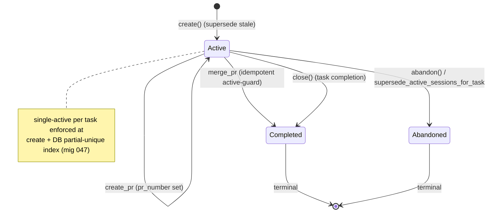
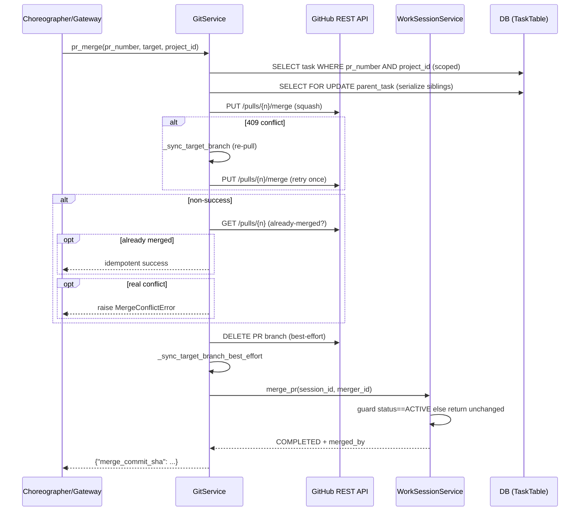

# RoboCo Slice Map — `worksession-git`

Scope key: `worksession-git` Repo root: `/Users/renzof/Documents/GitHub/ZZZ/roboco-master/roboco` Files in scope:
- `roboco/services/work_session.py`
- `roboco/services/git.py`
- `roboco/templates/git/` (`__init__.py`, `branch.py`, `commit.py`, `constants.py`, `pr_internal.py`, `pr_root.py`)

## Purpose

This slice is the git substrate every delivery agent works on. `GitService` runs all git subprocesses (status/commit/branch/push/rebase), mints branches + commit messages + PR bodies from templates, and drives the GitHub REST API for PR create/merge/close. `WorkSessionService` persists the per-claim row that links an agent to a task's branch/commits/PR and enforces the single-active-per-task invariant. The `roboco/templates/git/` package is the pure rendering layer for branch names, commit messages, and internal/root PR bodies. Together they are the boundary between the task lifecycle and the actual git history on disk + GitHub.

## Files

| Path | Role | approx LOC |
|------|------|------------|
| `roboco/services/work_session.py` | WorkSession CRUD, commit/file tracking, PR-lifecycle record, single-active invariant | 685 |
| `roboco/services/git.py` | Git subprocess execution, branch/commit/PR/rebase/merge/sync, GitHub REST API, conventions validator runner | 4596 |
| `roboco/templates/git/__init__.py` | Package re-exports for branch/commit/PR templates | 48 |
| `roboco/templates/git/branch.py` | Hierarchical branch name builder + root-task resolver | 131 |
| `roboco/templates/git/constants.py` | `BRANCH_TYPES`, `COMMIT_TYPES`, `MAX_TASK_DEPTH`, length constants | 52 |
| `roboco/templates/git/commit.py` | `CommitContext` + `build_commit_message` (traceability links) | 114 |
| `roboco/templates/git/pr_internal.py` | Internal (subtask→parent) PR title/body builder | 140 |
| `roboco/templates/git/pr_root.py` | Root (→master, CEO-level) PR title/body builder with task tree | 245 |

## Key Symbols

| Name | Kind | File:Line | Responsibility |
|------|------|-----------|----------------|
| `WorkSessionService` | class | work_session.py:29 | Session lifecycle + single-active invariant |
| `WorkSessionService.create` | method | work_session.py:50 | Validate project/task, refuse duplicate, supersede stale ACTIVE, insert row |
| `WorkSessionService.get_active_for_task` | method | work_session.py:184 | Most-recent ACTIVE row (resilient to dup-rows defect) |
| `WorkSessionService.supersede_active_sessions_for_task` | method | work_session.py:247 | ABANDON every other ACTIVE session for a task (single-active) |
| `WorkSessionService.add_commit` | method | work_session.py:363 | Append dedup'd commit SHA to session.commits |
| `WorkSessionService.create_pr` | method | work_session.py:427 | Record pr_number/pr_url/pr_created_at |
| `WorkSessionService.merge_pr` | method | work_session.py:488 | Record merge + COMPLETED; idempotent active-guard (F062) |
| `WorkSessionService.close` | method | work_session.py:618 | Idempotent COMPLETED on task completion |
| `WorkSessionService.abandon` | method | work_session.py:577 | ABANDONED + ended_at (non-active → warning + None) |
| `WorkSessionService.has_unpushed_commits` | method | work_session.py:662 | PR-existence proxy for unpushed commit detection |
| `WorkSessionService.task_team_for_session` | method | work_session.py:147 | Return the task's team (cell) for a given session; used by route layer's PM cell-ownership check on `merge_pr` |
| `get_work_session_service` | factory | work_session.py:682 | Construct service from AsyncSession |
| `GitService` | class | git.py:234 | All git operations + GitHub API |
| `_GIT_EXECUTOR` | module const | git.py:116 | Dedicated ThreadPoolExecutor for git subprocesses (16 workers) |
| `resolve_git_dir` | func | git.py:129 | Resolve `.git` dir for clone OR linked worktree |
| `_remove_stale_git_locks` | func | git.py:156 | Best-effort clear orphaned `.git/**/*.lock` after timeout SIGKILL |
| `_select_ci_head_run` | func | git.py:220 | Pick CI run matching current HEAD (anti-stale-green) |
| `GitService._run_git` | method | git.py:247 | Run git subprocess in dedicated pool, token header, chown-back, lock cleanup |
| `GitService._token_for_project` | method | git.py:344 | Decrypted project PAT (logs loudly on key-rotation failure) |
| `GitService.get_workspace` | method | git.py:387 | Resolve/clone agent workspace (auto_clone aware) |
| `GitService.get_status` | method | git.py:499 | Porcelain status + ahead/behind |
| `GitService._classify_porcelain` | static | git.py:439 | Split porcelain into staged/unstaged/untracked (column-safe) |
| `GitService._parse_git_url` | static | git.py:557 | Extract (owner,repo) from tokened/https/ssh GitHub URL |
| `GitService.create_commit` | method | git.py:640 | Stage + commit with template message + worktree ensure |
| `GitService._worktree_for_task` | static | git.py:747 | Per-task worktree path `{clone_root}/.worktrees/{task_id[:8]}` (F123) |
| `GitService._ensure_worktree_for_commit` | method | git.py:756 | Re-attach a pruned worktree before cwd-dependent op |
| `GitService._assert_on_task_branch` | method | git.py:771 | Recover drifted clone onto task branch (never discards work) |
| `GitService.commit_for_task` | method | git.py:875 | Agent-facing commit verb backing the `commit` content tool |
| `GitService.create_branch` | method | git.py:989 | Build branch name, fetch base, `worktree add` (F123), push -u |
| `GitService.create_branch_for_task` | method | git.py:1188 | Resolve workspace/team, create branch, commit DB |
| `GitService.checkout_branch_for_agent` | method | git.py:1276 | Allowlist-bounded checkout for agent verb |
| `GitService.push_for_task` | method | git.py:1428 | Push the task's recorded branch by name (clone-checkout-independent) |
| `GitService.push_task_branch` | method | git.py:1467 | Gateway branch-keyed push |
| `GitService.create_pull_request` | method | git.py:2132 | Open PR via GitHub API (legacy project-scoped) |
| `GitService.create_pr_for_task` | method | git.py:2639 | Agent-facing open_pr verb |
| `GitService.update_pr_for_task` | method | git.py:2506 | Patch PR title/body; 404→typed GitError |
| `GitService.get_pr_head_sha` | method | git.py:2451 | PR head SHA for pr_fail re-submit loop guard (fail-open) |
| `GitService.get_latest_ci_conclusion` | method | git.py:1929 | Per-project CI signal (unknown never false-green) |
| `GitService.get_pr_ci_status` | method | git.py:2662 | CI status of a PR's current head commit for the in-path pr_pass gate; returns {state, failing_checks?, head_sha} or None on config gaps (fail-open) |
| `GitService._ci_status_prereqs` | method | git.py:2698 | Resolve (owner, repo, auth headers, head_sha) for CI-status lookup or None on any gap |
| `GitService._fetch_check_runs` | method | git.py:2730 | GET check-runs for head_sha; None on any API failure |
| `GitService._classify_check_runs` | method | git.py:2770 | State classification: success/failure/pending from check-run conclusions list |
| `GitService._classify_zero_check_runs` | method | git.py:2790 | State classification when zero check-runs exist: pending_not_scheduled or no_ci_configured (depends on workflow count) |
| `GitService.list_open_prs` | method | git.py:1844 | Normalized open-PR list |
| `GitService.post_pr_review` | method | git.py:2329 | Post reviewer comments via GitHub API |
| `GitService.merge_pull_request` | method | git.py:2914 | GitHub merge API + method fallback + already-merged disambiguation |
| `GitService.merge_pr_for_task` | method | git.py:3046 | Role-gated merge + recorded-PR verification + auto-complete |
| `GitService._assert_merge_role` | method | git.py:2989 | PM/CEO approval-chain role gate |
| `GitService.pr_merge` | method | git.py:3616 | Gateway merge: project_id-scoped, parent row lock, 409 retry, CEO-only default guard |
| `GitService._merge_with_retry` | method | git.py:3555 | Single 409 retry + already-merged disambiguation → MergeConflictError |
| `GitService._lock_parent_task_for_merge` | method | git.py:3503 | SELECT FOR UPDATE on parent task (sibling merge serialization) |
| `GitService._resolve_merger_id` | static | git.py:3530 | merged_by attribution: actor→assigned→created→UUID(0) |
| `GitService.rebase_onto_base` | method | git.py:3733 | Rebase primitive: rebased/superseded/conflicts classification |
| `GitService.rebase_pr_for_task` | method | git.py:3792 | PR-keyed rebase via PR refs (project_id scoped) |
| `GitService.sync_task_branch` | method | git.py:3847 | Task-keyed rebase through dev `sync_branch` verb (pre-PR) |
| `GitService.is_behind_base` | method | git.py:3889 | `(behind, ahead)` counts for i_am_done submit gate |
| `GitService.close_pull_request` | method | git.py:3940 | Close superseded PR + optional comment + branch cleanup (idempotent) |
| `GitService._delete_remote_branch_best_effort` | method | git.py:3608 | Best-effort remote delete; skips main/master/develop + open-dependent-PR branches; returns `bool` (issued vs skipped/failed) |
| `GitService.delete_task_branch` | method | git.py:3671 | Cancel-path remote branch delete; chokepoint for the environment-ladder skip (`effective_environments`) so a task's `branch_name` can never collide-delete a ladder rung; returns `bool` |
| `GitService.cleanup_stale_branches` | method | git.py:3711 | `POST /git/branches/cleanup` backing sweep: terminal (completed/cancelled) tasks' branches, remote (`delete_task_branch`) + local force-delete in the assignee's clone; capped 200/call, cursor-resumable |
| `GitService._stale_branch_window` | method | git.py:3777 | One deterministic `ORDER BY id` window of sweep candidates; ladder rungs excluded from results but still advance the cursor |
| `GitService._cleanup_one_stale_branch` | method | git.py:3810 | Per-branch remote+local delete for one sweep candidate; raises on unexpected failure so the caller's try/except counts it as an error |
| `GitService.pr_target` | method | git.py:4021 | Return PR base branch (project_id scoped) |
| `GitService.create_pr` | method | git.py:3418 | Branch-keyed open PR (gateway path; ensures base on remote) |
| `GitService._record_pr_atomically` | method | git.py:2601 | Atomic pr_number/url write to task |
| `GitService.run_pre_submit_quality_gate` | method | git.py:3208 | `make quality` gate before submit |
| `GitService.conventions_check_for_task` | method | git.py:4368 | Run conventions validator on changed files (fail-closed) |
| `GitService._run_conventions_validator` | method | git.py:4408 | Subprocess `python -m roboco.conventions` with 120s cap |
| `GitService.open_conventions_pr` | method | git.py:4456 | Scaffold `.roboco/conventions.yml` on a branch + open PR |
| `GitService.diff` / `list_changed_files` / `read_file_at_branch` | methods | git.py:4192/4225/4259 | Read-only git queries (gateway + routes) |
| `GitService.commit` | method | git.py:4286 | Gateway content-verb commit (branch-keyed) |
| `get_git_service` | factory | git.py:4594 | Construct GitService from AsyncSession |
| `build_branch_name` | func | templates/git/branch.py:37 | `{type}/{team}/{root}--{sub}--...` up to MAX_TASK_DEPTH |
| `get_root_task_id` | func | templates/git/branch.py:97 | Walk parent chain to root |
| `BranchNameError` | exc | templates/git/branch.py:33 | Bad type / missing task / over-depth |
| `build_commit_message` | func | templates/git/commit.py:63 | Rich commit msg with task/root/agent/session links |
| `CommitContext` | dataclass | templates/git/commit.py:34 | Validated commit-message input |
| `build_pr_body_internal` / `build_pr_title_internal` | funcs | templates/git/pr_internal.py:75/130 | Subtask→parent PR rendering |
| `build_pr_body_root` / `build_pr_title_root` | funcs | templates/git/pr_root.py:167/235 | Root PR rendering with task tree + AC checklist |
| `MAX_TASK_DEPTH` | const | templates/git/constants.py:45 | 4 (umbrella→root→cell→dev) |
| `BRANCH_TYPES` / `COMMIT_TYPES` | consts | templates/git/constants.py:10/21 | Allowed prefixes |

## Data Flow

A developer claims a task → the orchestrator/choreographer calls `create_branch_for_task` → `build_branch_name` walks the task parent chain (`TaskService.get`) up to `MAX_TASK_DEPTH=4`, joins `--`-separated 8-char UUID prefixes, and yields `{type}/{team}/{root}--{sub}--...`. `create_branch` fetches only the needed refs from origin, runs `git worktree add` under `{clone_root}/.worktrees/{task_id[:8]}` (F123 per-task isolation), force-pushes the branch with `-u`, and stores `branch_name` on the task. A `WorkSession` row is created (`WorkSessionService.create`), first superseding any other agent's stale ACTIVE session on that task.

The agent commits via the `commit` content verb → `GitService.commit` (or `commit_for_task` route), which ensures the worktree is attached, asserts the workspace is on the task branch (recovering a drifted clone), stages, runs `build_commit_message` (`CommitContext` → header + metadata + links), commits, then best-effort links the SHA to the task + work session (`_link_commit_to_task`). Every `_run_git` call re-chowns the tree to the agent uid and clears orphaned lock files on timeout.

`open_pr` → `create_pr` resolves the task by branch name, ensures the parent branch exists on origin, POSTs the PR via GitHub REST, and atomically records `pr_number`/`pr_url` on the task (`_record_pr_atomically`) and work session (`create_pr`). PR title/body come from `task.title`/`task.description` for gateway PRs; the rich `build_pr_body_root`/`_internal` templates are used by the older `create_pull_request` path.

Merge: a cell PM `complete`/`submit_up` → `pr_merge` (gateway) scopes the task lookup by `project_id` (cross-repo PR-number collision guard), takes a `SELECT FOR UPDATE` lock on the parent task, calls `_merge_with_retry` (squash; on 409 re-syncs target + retries once; on 405 disambiguates already-merged vs real conflict → `MergeConflictError`), deletes the PR branch, syncs the local target, and records the merge on the work session (`merge_pr`, idempotent). The CEO-only root→master merge goes through `merge_pr_for_task` (role-gated, recorded-PR verification) → `merge_pull_request`. The CEO-merge never targets the default branch via `pr_merge` (the `target == default_branch` guard refuses it) — `default_branch` here is `_project_default_branch`, which now resolves via `roboco.models.env_branches.head_branch(project)` (the env-ladder head rung) rather than reading `project.default_branch` directly; a project with no declared ladder resolves to the same value via the read-time shim.

Behind-base recovery: `is_behind_base` feeds the `i_am_done` submit gate; on a non-zero behind, the dev calls `sync_branch` → `sync_task_branch` → `rebase_onto_base` (rebased/superseded/conflicts). On a merge conflict, the choreographer calls `rebase_pr_for_task`, then either re-merges or `close_pull_request`s a superseded PR. `get_pr_head_sha` feeds the `submit_root` re-submit loop guard.

## Mermaid





## Logical Tree

```
roboco/
├── services/
│   ├── work_session.py
│   │   └── WorkSessionService (BaseService)
│   │       ├── create / get / get_or_raise / update
│   │       ├── get_active_for_task(_and_agent)
│   │       ├── supersede_active_sessions_for_task   # single-active invariant
│   │       ├── list_by_agent / list_by_project / list_active_sessions
│   │       ├── add_commit / add_files_modified
│   │       ├── create_pr / update_pr_status / merge_pr
│   │       ├── complete / abandon / close
│   │       └── files_changed / has_unpushed_commits  # gateway backfill
│   └── git.py
│       ├── _GIT_EXECUTOR (ThreadPoolExecutor, 16)
│       ├── resolve_git_dir / _remove_stale_git_locks / _select_ci_head_run
│       └── GitService (BaseService)
│           ├── _run_git (token, timeout, chown, lock-cleanup)
│           ├── _token_for_project / _token_for_workspace / get_workspace
│           ├── status: get_status / get_current_branch / _classify_porcelain / _ahead_behind
│           ├── commit: create_commit / commit_for_task / commit (gateway) / _link_commit_to_task
│           ├── worktree (F123): _worktree_for_task / _ensure_worktree_for_commit / _assert_on_task_branch
│           ├── branch: create_branch / create_branch_for_task / create_branch_from_pr_head / checkout*
│           ├── push/pull/fetch/rebase: push_for_task / push_task_branch / pull / fetch / rebase
│           ├── PR context: _build_root_pr_context / _build_internal_pr_context / _generate_pr_title_body
│           ├── PR list/find: _find_existing_pr / list_open_prs / _fetch_open_prs / _normalize_open_pr
│           ├── PR create: create_pull_request / create_pr_for_task / create_pr (branch-keyed)
│           ├── PR update/review: update_pr_for_task / post_pr_review / _patch_pr_title_body
│           ├── PR read: get_pr_diff / get_pr_head_sha / pr_target
│           ├── CI: get_latest_ci_conclusion / _get_ci_runs_response / _fetch_latest_ci_run
│           ├── merge: merge_pull_request / merge_pr_for_task / pr_merge / _merge_with_retry
│           │            _assert_merge_role / _lock_parent_task_for_merge / _resolve_merger_id
│           │            _pr_is_merged / _auto_complete_on_merge / _first_allowed_merge_method
│           ├── branch cleanup: _delete_remote_branch_best_effort / _delete_pr_branch_best_effort
│           │            delete_task_branch / _branch_has_open_dependents
│           │            cleanup_stale_branches / _stale_branch_window / _cleanup_one_stale_branch (sweep)
│           ├── rebase/sync: rebase_onto_base / rebase_pr_for_task / sync_task_branch / is_behind_base
│           ├── close: close_pull_request
│           ├── quality: run_pre_submit_quality_gate / toolchain_status_for_task / _fast_gate_commands
│           ├── conventions: conventions_check_for_task / _run_conventions_validator / open_conventions_pr
│           ├── read-only: diff / list_changed_files / read_file_at_branch / _ref_exists / _resolve_diff_base
│           └── helpers: _task_for_branch / _project_for_task / _workspace_for_branch / _token_for_branch ...
└── templates/git/
    ├── __init__.py            # re-exports
    ├── constants.py           # BRANCH_TYPES / COMMIT_TYPES / MAX_TASK_DEPTH=4
    ├── branch.py              # build_branch_name / get_root_task_id / BranchNameError
    ├── commit.py              # CommitContext / build_commit_message / CommitMessageError
    ├── pr_internal.py         # InternalPRContext / build_pr_body_internal / build_pr_title_internal
    └── pr_root.py             # RootPRContext / SubtaskInfo / build_pr_body_root / build_pr_title_root
```

## Dependencies

Internal:
- `roboco.config.settings` (timeouts, URLs, workspace root, auto_clone)
- `roboco.exceptions` (`GitCommandError`, `GitError`, `GitTimeoutError`, `MergeConflictError`)
- `roboco.foundation.policy.lifecycle` (role/intent parity)
- `roboco.models.base` (`AgentRole`, `TaskStatus`)
- `roboco.models.work_session` (`WorkSessionCreate/Update/Status`)
- `roboco.db.tables` (`ProjectTable`, `TaskTable`, `WorkSessionTable`)
- `roboco.services.base` (`BaseService`, `NotFoundError`, `ConflictError`, `ValidationError`, `UnauthorizedError`, `ServiceError`)
- `roboco.services.project` / `roboco.services.task` / `roboco.services.workspace` (composed for clone/workspace/branch resolution)
- `roboco.services.gateway.quality_gate` (`GateResult`, `run_quality_commands`)
- `roboco.templates.git` (all template builders)
- `roboco.utils.converters.require_uuid`, `roboco.utils.crypto.EncryptionError`
- `roboco.api.schemas.git` (TYPE_CHECKING only — runtime duck-typed)

External:
- `sqlalchemy` / `sqlalchemy.ext.asyncio`
- `httpx` (GitHub REST API)
- `asyncio`, `subprocess`, `concurrent.futures.ThreadPoolExecutor`
- `dataclasses`, `pathlib`, `uuid`, `base64`, `re`, `json`, `time`, `os`, `sys`

## Entry Points

- **HTTP routes** (`roboco/api/routes/git.py`): `get_status`, `log`, `diff`, `commit_for_task`, `push_for_task`, `create_branch_for_task`, `checkout_branch_for_agent`, `create_pr_for_task`, `merge_pr_for_task`, `pull`, `fetch`, `rebase`, `cleanup_stale_branches` (`POST /git/branches/cleanup`, PM/CEO role-gated like `/rebase`, rate-limit 5/60) — all construct via `get_git_service(db)`.
- **HTTP routes** (`roboco/api/routes/tasks.py:253`): `get_git_service` for task-scoped git.
- **Gateway Choreographer** (`roboco/services/gateway/choreographer/`):
  - `_verb_runner._do_pr_merge` → `pr_merge`
  - `_impl` → `conventions_check_for_task` (i_am_done + pr_pass gates), `is_behind_base` (submit gate), `sync_task_branch` (sync_branch verb), `pr_merge` / `rebase_pr_for_task` / `close_pull_request` (merge-conflict resolution), `get_pr_head_sha` (submit_root re-submit guard)
  - `pr_gate.py` → `get_pr_head_sha`
  - `qa.py` → `conventions_check_for_task`
- **WorkspaceService** calls `ensure_worktree` / `ensure_worktree_for_resume` (F123).
- **Lifespan/CLI**: none direct; `git_service` is constructed per-request via `deps.py` (`git=GitService(db_session)`).

## Config Flags

| Flag / setting | Source | Used for |
|----------------|--------|----------|
| `ROBOCO_GIT_EXECUTOR_WORKERS` (env, default 16) | `os.environ` at git.py:117 | Dedicated git subprocess pool size |
| `settings.git_command_timeout_seconds` | config.py:728 | Default `_run_git` timeout |
| `settings.git_commit_timeout_seconds` | config.py:737 | Staging/commit large changeset timeout |
| `settings.git_network_timeout_seconds` | config.py:748 | fetch/pull/push/ls-remote timeout |
| `settings.workspaces_root` | config.py:603 | Workspace path root (token derivation) |
| `settings.workspace_auto_clone` | config.py:607 | `get_workspace` auto-clone branch |
| `settings.public_base_url` | config.py:827 | Commit/PR template link base (`+ /api`) |
| `settings.internal_api_url` | config.py:57 | Internal PR body link base |
| `settings.github_api_base_url` | config.py:327 | GitHub REST API base (PR/CI/review) |
| `settings.release_ci_workflow` | config.py:597 | Named workflow file (e.g. `ci.yml`) used by the release CI gate in `get_latest_ci_conclusion`; always resolves a named workflow so the gate never degrades to the imprecise all-workflows mode |

Module-level tunables (not env): `_SLOW_GIT_OP_MS=5000`, `_CI_RUN_WINDOW=20`, `_CI_FETCH_ATTEMPTS=3`, `_CI_FETCH_BACKOFF_SECONDS=0.5`, `_CI_RETRYABLE_STATUS`, `_CONVENTIONS_VALIDATOR_TIMEOUT_SECONDS=120`, `_GH_UNPROCESSABLE=422`, `_HTTP_NOT_FOUND=404`, `_HTTP_CONFLICT=409`.

## Gotchas

- **Token transport split**: git-over-HTTPS uses HTTP **Basic** (`x-access-token:...`) via `http.extraheader` (git.py:289); the GitHub REST API uses **Bearer**. Swapping them causes silent credential-prompt failures.
- **`pr_number` is NOT repo-scoped in `tasks.pr_number`** — every gateway merge/close path (`pr_merge`, `close_pull_request`, `pr_target`, `rebase_pr_for_task`) requires `project_id` to scope the task lookup. The route `merge_pr_for_task` instead verifies `data.pr_number == task.pr_number` (recorded PR is source of truth).
- **`get_active_for_task` returns the most-recent ACTIVE row**, not `scalar_one_or_none` — the historical duplicate-ACTIVE defect would otherwise raise `MultipleResultsFound`. The invariant is also enforced at `create` and by a DB partial-unique index (migration 047).
- **`merge_pr` idempotency guard (F062)**: a terminal session is returned unchanged; `complete`/`abandon` on a non-active session return `None` (warning). `close` returns the session unchanged. Behavior differs between these three on terminal state — `merge_pr`/`close` are silent, `complete`/`abandon` warn-and-None.
- **F123 per-task worktrees**: commit/checkout/rebase/conventions MUST run inside `{clone_root}/.worktrees/{task_id[:8]}`, not the clone root (which sits on the default branch). `_worktree_for_task` + `_ensure_worktree_for_commit` are the seam; forgetting them makes checkout fail with "already checked out at '<worktree>'" or false-passes the conventions validator.
- **`create_branch` runs `reset --hard` on a no-commit branch** in the worktree (git.py:1104) — safe because `unique == 0`, but a branch carrying real work is left as-is. The fresh-claim path only; resume short-circuits before it.
- **`_run_git` re-chowns the tree** after every op (root → agent uid 1000); without it the agent's next commit fails with "unable to append to .git/logs/refs/...".
- **Porcelain parsing** uses `splitlines()` not `strip().split("\n")` — strip eats the leading space on ` D file` and false-stages deletions.
- **`get_current_branch` raises on detached HEAD** instead of returning `""` — the empty string used to leak "(HEAD detached at ...)" into `checkout -b`.
- **`MAX_TASK_DEPTH=4`** (was 3) — MegaTask's umbrella→root→cell→dev needs 4; validator rejects a child whose depth would *reach* MAX_TASK_DEPTH, so 4 permits dev at depth 3.
- **Branch name uses 8-char UUID prefix** (`_SHORT_ID_LEN=8`), not full UUID — full UUIDs produced 140-char branch names.
- **`rebase_onto_base` force-pushes with `--force-with-lease`** only the head branch; never touches base. `superseded` (unique==0) means close-without-merge.
- **`is_behind_base` raises on git failure**; the i_am_done gate fail-opens on the raised error so a flaky fetch can't strand the task.
- **Conventions validator fails closed** (`could_not_run=True` blocks submit) on resolution error / timeout / non-zero exit; branchless + no-changed-files fail open.
- **`_assert_on_task_branch` never discards work** — it does `checkout`, not `reset --hard`, to preserve a resumed agent's unpushed commits.
- **CEO-only master merge**: `pr_merge` refuses `target == default_branch` for agents; only `merge_pr_for_task` (CEO role-gated from `awaiting_ceo_approval`) may merge to master. `default_branch` resolves through the env-ladder head rung (`_project_default_branch` → `head_branch(project)`), not the raw `projects.default_branch` column.
- **`cleanup_stale_branches` cursor is required, not optional**: task rows never change as a side effect of the sweep (unlike, say, a queue that drains), so a repeat call with no `after_cursor` re-scans the identical first 200-row window forever instead of progressing. `_stale_branch_window` still advances the cursor past ladder-rung rows even though they're excluded from `candidates`, so `truncated` can't false-negative when a rung lands inside the window.
- **Local branch delete in the sweep is always `force=True`** (`-D`) regardless of completed vs cancelled — a completed task's PR was squash-merged, so its local ref is never an ancestor of base and a "safe" `-d` would refuse every single candidate.

## Drift from CLAUDE.md

- **CLAUDE.md "WorkSessionService" table** claims the service handles "Git session management, PR lifecycle" — accurate. No drift.
- **CLAUDE.md says** `ROBOCO_WORKSPACE_CLONE_TIMEOUT=300` is a WorkspaceService config; not referenced in this slice (lives in `workspace.py`). No drift in scope.
- **CLAUDE.md verb table** lists `sync_branch` for developers and `/rebase` for PM/CEO. The code matches: `sync_task_branch` is the dev path, `rebase_pr_for_task` the PR-keyed path. No drift.
- **CLAUDE.md** states "A task has at most one active WorkSession ... enforced both at the service layer and by a DB partial-unique index (migration 047)." Code matches (`supersede_active_sessions_for_task` + `get_active_for_task` resilient return). No drift.
- **CLAUDE.md** "PR is created BEFORE QA review" — `create_pr`/`create_pr_for_task` only sets `pr_number`; QA pass requires it. Matches.
- **Minor doc vs code**: CLAUDE.md commit-format example is `[{task-id[:8]}] {message}` (single ID), but `build_commit_message` (templates/git/commit.py:80) emits `[{root_short}:{task_short}] {type}({scope}): {desc}` — a richer two-ID header. The doc undersells the actual format; not a bug, but the template header is not the literal `[{task-id[:8]}]` the doc shows.
- **CLAUDE.md** lists `merge_pull_request`-style PM merges; the agent-facing path is now `pr_merge` (gateway) with parent-row locking + 409 retry, which the doc does not describe. Additive (the route `merge_pr_for_task` still exists) — doc is incomplete rather than wrong.

## Changes Since Baseline

Baseline: `fd10cc862c2020b3f639cdb686d427b0198a2441` (master tip before the metrics-granularity branch). Diff stat: `git.py +614/-107`-ish, `work_session.py +11`, `branch.py +9/-`, `constants.py +12/-`. Commits touching these files: `15effce0` (#283 "141 Gaps fill-in"), `3aff6e04` (#285 "Close gaps").

| Commit | IMPACT (one line) |
|--------|-------------------|
| `15effce0` (141 Gaps fill-in) | Added `resolve_git_dir` + worktree-aware `_remove_stale_git_locks`; added F123 `_worktree_for_task`/`_ensure_worktree_for_commit` and routed commit/checkout/rebase/conventions into the per-task worktree; added `get_pr_head_sha` (pr_fail re-submit guard); added `sync_task_branch` + `is_behind_base` (dev sync_branch verb + i_am_done behind gate); added `rebase_onto_base`/`rebase_pr_for_task` (merge-conflict resolver); added `close_pull_request` (superseded-PR close); added `pr_merge` with `project_id` scoping + parent-row lock + 409 retry + CEO-only default-branch guard + already-merged disambiguation; added `_merge_with_retry`/`_pr_is_merged`/`_resolve_merger_id`/`_lock_parent_task_for_merge`; added conventions validator runner (`conventions_check_for_task`/`_run_conventions_validator`/`open_conventions_pr`); raised `MAX_TASK_DEPTH` 3→4 (MegaTask depth-cap fix); `WorkSessionService.merge_pr` idempotent active-guard (F062). |
| `3aff6e04` (Close gaps) | Same mega-commit (the PR body is identical — #285 is the merge closure of the #283 batch); the in-scope file deltas are the same set of additions. No additional logic change to these files beyond what #283 listed. |

> Post-snapshot updates (since 2026-06-29): `536bbb64` (Chore/all/logical gaps sweep #286 — closed regression risks #108 and #109 in this slice: `_merge_with_retry` now falls back to a permitted merge method on 405 via `_first_allowed_merge_method` before raising `MergeConflictError`; `close_pull_request` default flipped to `delete_branch=False`, choreographer caller now passes `delete_branch=True` explicitly). `00513399` ([bug] push_branch — `push_branch(branch_name)` now passes `branch=branch_name` to `self.push()` so the gateway `open_pr` path pushes the actual named task branch rather than the clone root's current checkout; fixes the "No commits between" 422 → `i_am_blocked` wedge observed in the F123 per-worktree model). `2759edf7` ([B-REL] release executor — added `_CiRunQuery` dataclass at git.py:241 to bundle per-project CI-fetch inputs; `get_latest_ci_conclusion` and `_fetch_latest_ci_run` now accept an optional `head_sha` so the release CI gate polls a specific release commit's own run rather than branch-latest; `settings.release_ci_workflow` config flag added). `69071030` ([chore] work-session-routes — added `WorkSessionService.task_team_for_session` helper (route layer PM cell-ownership check for `merge_pr`); route layer now stamps `merged_by` from the authenticated caller rather than the request body — `WorkSessionService.merge_pr` signature is unchanged, but `MergePRRequest` schema dropped `merged_by` field).
>
> (open PR #548, branch `feature/wave-2-hygiene-charts`, 2026-07-17) Local branch refs stop leaking alongside remote ones: `delete_task_branch` now also skips environment-ladder rungs (previously only the remote-delete's own main/master/develop guard existed) and returns `bool`; new `cleanup_stale_branches` + `_stale_branch_window` + `_cleanup_one_stale_branch` back a PM/CEO-only `POST /git/branches/cleanup` sweep of terminal tasks' remote+local branches, exposed as a confirm-dialog button on the panel Git page. See `docs/map/task-service.md` for the paired per-task reap at cancel/completion and `docs/map/workspace.md` for the new `WorkspaceService.delete_local_branch` primitive both routes share.

## Regression Risks

| Title | File:Line | Claim | Severity |
|-------|-----------|-------|----------|
| `merge_pr` idempotent guard silently drops retried merge attribution | work_session.py:517 | A retried merge after a successful-but-unconfirmed GitHub merge returns the *existing* COMPLETED row unchanged, so the retry's `merged_by`/`pr_merged_at` are NOT updated. Correct for audit-trail integrity, but a caller that relied on `merge_pr` returning a freshly-updated row (e.g. reading `pr_merged_at` as "now") now gets the original timestamp. Low risk but a behavior change worth a regression test. | low |
| `pr_merge` CEO-only guard refuses default-branch target | git.py:3671 | If a non-root PR's target legitimately resolves to the repo default branch (e.g. a mis-configured `default_branch` or a single-branch repo), `pr_merge` now hard-fails with `UnauthorizedError`. Any cell that previously merged a leaf PR into master via this path (shouldn't happen per policy, but the route existed) is now blocked. Since the env-branches ladder (#534) the comparison target is the env-ladder **head** rung (`_project_default_branch` → `head_branch(project)`), not necessarily prod — a project that declares head != prod has this guard protect the head rung, not the CEO's actual prod branch. | medium |
| `pr_merge` parent-row `SELECT FOR UPDATE` can deadlock | git.py:3503/3683 | Two PMs merging sibling subtasks of *different* parents that share an ancestor, under并发 lock ordering, could deadlock if lock acquisition order diverges. Lock is only on the immediate parent, so risk is bounded, but a deadlock surfaces as a rollback (not a clean 409 retry). | medium |
| `create_branch` `reset --hard` on zero-commit branch inside worktree | git.py:1104 | If `rev-list --count {base_ref}..{branch_name}` returns `0` for a branch that actually carries work (e.g. base_ref mis-resolved to a ref that already contains the work), the worktree is hard-reset and uncommitted work in the worktree is lost. The `unique==0` check is the only guard; a stale `base_ref` could trip it. | medium |
| F123 worktree routing — commit/conventions/rebase run in worktree, merge sync runs in clone root | git.py:3696/3785 | `pr_merge` calls `_sync_target_branch_best_effort(workspace,...)` with the clone-root workspace (from `get_workspace`), not the per-task worktree. If the target branch is checked out in a worktree, the sync's `checkout` of target in the clone root fails ("already checked out"). Best-effort swallows it, but the local target ref may stay stale for the next sibling merge. | medium |
| ~~`_merge_with_retry` retries on 409 only; 405 falls through to already-merged check then `MergeConflictError`~~ | git.py:3597 | **FIXED** (`536bbb64` #108) — `_merge_with_retry` now falls back to a permitted merge method (via `_first_allowed_merge_method`, exclude='squash') on 405 before raising `MergeConflictError`, mirroring the CEO `merge_pull_request` path. A 405 with no permitted fallback or a second 405 still falls through to disambiguation/`MergeConflictError`. | ~~medium~~ resolved |
| `is_behind_base` raises on fetch failure; gate fail-opens | git.py:3922/3938 | A flaky origin fetch makes `is_behind_base` raise; the i_am_done gate catches it and fail-opens, letting a behind branch submit. The merge layer's own behind check is the backstop, but a genuinely-behind branch can reach QA. Documented, but a regression in the "gate is authoritative" expectation. | low |
| `MAX_TASK_DEPTH` 3→4 changes branch-name length + validation | constants.py:45 / branch.py:71 | Any pre-existing task hierarchy at depth 4 that was previously rejected now builds a 4-segment branch name; tasks created under the old cap that stored a shorter branch are unaffected, but new subtasks of a previously-maxed tree now cut branches where they couldn't before — could surface latent assumptions in downstream consumers parsing branch names. | low |
| ~~`close_pull_request` deletes branch on close by default~~ | git.py:4005 | **FIXED** (`536bbb64` #109) — default flipped to `delete_branch=False` (opt-in deletion); the choreographer supersede caller now passes `delete_branch=True` explicitly when it wants deletion, matching the orchestrator supersede path. A superseded PR's branch is preserved by default. | ~~medium~~ resolved |
| Conventions validator fail-closed on resolution error | git.py:4392 | A workspace resolution failure (missing clone, diff error) returns `could_not_run=True`, which the block-gate treats as a hard refuse. A transient workspace/clone issue can now block `i_am_done`/`pr_pass` where previously the gate would have passed. Intentional but a new stranding vector. | low |
| `get_pr_head_sha` fail-open returns None on any error | git.py:2496 | The `submit_root` re-submit loop guard only hard-blocks on an *exact* unchanged head SHA; any GitHub error / closed PR returns None and the guard passes, so a flaky API call lets a weak coordinator re-submit the same failed PR. Documented fail-open, but a regression vs. a strict gate. | low |

## Health

Integrity is **good and actively hardened**. The slice carries the scars of multiple live meltdowns (single-active work-session defect, pr_fail re-submit loop, cell_pm merge block<->unblock, MegaTask depth cap, cross-repo PR-number collision) and each is closed with a deterministic guard plus a comment explaining the failure mode. The F123 per-task-worktree routing is consistently threaded through commit/checkout/rebase/conventions, and the merge path has layered defenses (parent-row lock, 409 retry, already-merged disambiguation, CEO-only master guard). Two formerly-medium risks in the merge path have since been closed: `_merge_with_retry` now has the 405 method-fallback that `merge_pull_request` has (`536bbb64`), and `close_pull_request` now defaults to `delete_branch=False` (`536bbb64`). The remaining residual risk is **`pr_merge`'s post-merge target sync** running in the clone root (not the worktree) and best-effort-swallowing a checkout conflict — the local target ref may stay stale for the next sibling merge. Test coverage of the work-session lifecycle is solid; the newer `pr_merge`/`sync_task_branch`/`rebase_onto_base`/`close_pull_request` quartet deserves the most scrutiny on any future change. No outright bugs found; the drift vs CLAUDE.md is documentation undersell (commit header format, gateway merge-path description), not behavioral mismatch.