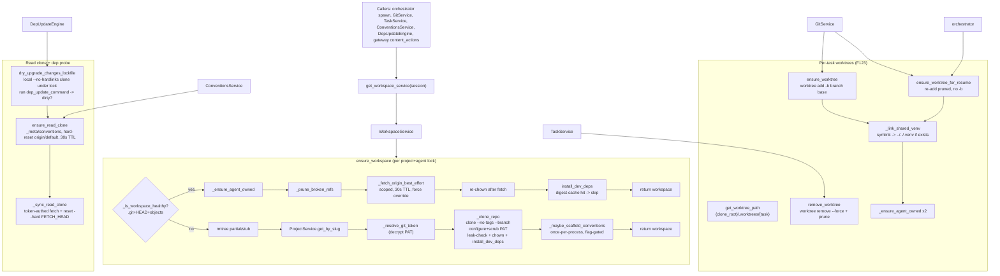

# workspace slice

## Purpose
WorkspaceService manages the per-agent git clone layout under {workspaces_root}/{project}/{team}/{agent}/, plus the F123 per-task linked worktrees under {clone_root}/.worktrees/{task}/. It clones, refresh-fetches, repairs ownership, installs dev deps, scaffolds the conventions standard on first clone, maintains a project-level read clone for the conventions engine, and runs the read-only dep-upgrade probe. It is the filesystem/git-clone substrate every agent spawn and every git verb eventually lands on.

## Files

| Path | Role | LOC |
|---|---|---|
| /Users/renzof/Documents/GitHub/ZZZ/roboco-master/roboco/roboco/services/workspace.py | WorkspaceService + helpers: clone/own/refresh/install deps, per-task worktrees, read clone, dep-upgrade probe | 1757 |

## Key Symbols

| Name | Kind | File:Line | Responsibility |
|---|---|---|---|
| _chown_entry | function | roboco/services/workspace.py:84 | Chown one entry to (AGENT_UID, AGID); return True on success or already-correct |
| _make_owner_and_group_rw | function | roboco/services/workspace.py:95 | Best-effort chmod ensuring owner+group rw (+x for dirs) for ACL-inheriting NAS volumes |
| _own_and_grant_rw | function | roboco/services/workspace.py:122 | Chown + grant rw on one entry; return 1 if chown failed |
| _iter_ownable_entries | function | roboco/services/workspace.py:129 | Yield workspace root + every entry, pruning heavy gitignored trees (_PRUNE_DIRS) so os.walk stays fast |
| _ensure_agent_owned | function | roboco/services/workspace.py:145 | Chown + group-write the whole working tree (pruned) so uid-1000 agent can read+write .git and sources |
| _resolve_clone_root | function | roboco/services/workspace.py:184 | Given a worktree path, return its clone root (parent.parent when under .worktrees/); pure path logic |
| _uv_subprocess_env | function | roboco/services/workspace.py:198 | Env for orchestrator-side uv subprocess: pin UV_PYTHON_INSTALL_DIR to <clone_root>/.uv-python so fetched CPython lands on the mount; also pops VIRTUAL_ENV and UV_PROJECT_ENVIRONMENT to drop the image-baked /app/.venv pin (9faf2763) |
| _monotonic | function | roboco/services/workspace.py:223 | Thin wrapper over time.monotonic so tests can patch it without breaking asyncio's own clock |
| _ensure_lock_for | function | roboco/services/workspace.py:244 | Return (lazy-create) the per (project_slug, agent_slug) asyncio.Lock serializing ensure_workspace/concurrent clones |
| _inject_token_into_url | function | roboco/services/workspace.py:254 | Embed a GitHub PAT into an HTTPS git URL for clone/fetch auth; pass-through for SSH and already-tokenized URLs |
| WorkspaceError | class | roboco/services/workspace.py:283 | Exception raised on workspace/clone/worktree failures |
| _lockfile_digest | function | roboco/services/workspace.py:306 | SHA-256 over present lockfiles (uv.lock/pnpm-lock.yaml/package-lock.json/package.json) for idempotent dev-deps install |
| _detect_dep_commands | function | roboco/services/workspace.py:332 | Detect ecosystem + return (label, argv) install commands: uv sync --extra dev (optionally --python X), pnpm/npm |
| WorkspaceService | class | roboco/services/workspace.py:374 | Service: per-agent workspace path math, clone/own/refresh, worktrees, read clone, dep probe, dev-deps install |
| WorkspaceService.get_workspace_path | method | roboco/services/workspace.py:399 | Compute {root}/{project}/{team}/{agent}/ path; raise if team is None |
| WorkspaceService.get_clone_root_path | method | roboco/services/workspace.py:433 | Same as get_workspace_path; named separately to express clone-root vs worktree intent |
| WorkspaceService.get_worktree_path | method | roboco/services/workspace.py:447 | Per-task worktree path {clone_root}/.worktrees/{task_short_id}; raise on empty id |
| WorkspaceService._clone_root_default_branch | staticmethod | roboco/services/workspace.py:486 | Read origin/HEAD to get the default branch name ("main"); returns "" when unresolvable (cfe725da) |
| WorkspaceService._park_clone_root_off_branch | staticmethod | roboco/services/workspace.py:501 | Restore F123 invariant before worktree add: if clone root HEAD is the task branch, move back to default branch or detach so the branch ref is free for the worktree (cfe725da) |
| WorkspaceService._worktree_git | staticmethod | roboco/services/workspace.py:469 | Run git -C <clone_root> <args> capturing output, check optional |
| WorkspaceService._link_shared_venv | staticmethod | roboco/services/workspace.py:534 | Symlink worktree/.venv -> ../../.venv only if clone-root .venv exists; idempotent via lexists guard |
| WorkspaceService.ensure_worktree | method | roboco/services/workspace.py:555 | git worktree add -b <branch> <base> (or reuse existing branch); calls _park_clone_root_off_branch first; link venv; chown worktree + clone root |
| WorkspaceService.ensure_worktree_for_resume | method | roboco/services/workspace.py:591 | Re-add a pruned worktree on resume (no -b; branch ref survives); calls _park_clone_root_off_branch first; idempotent; link venv + chown |
| WorkspaceService._fetch_branch_ref | method | roboco/services/workspace.py:613 | Token-aware git fetch origin <branch> into clone_root; best-effort (never raises); used by ensure_worktree_self_heal (536bbb64) |
| WorkspaceService.ensure_worktree_self_heal | method | roboco/services/workspace.py:671 | Orchestrator spawn-time chokepoint: re-attaches a per-task worktree after clone vanished (redeploy/disk loss); fetches branch ref from origin when the local ref is absent after a re-clone, then delegates to ensure_worktree (536bbb64) |
| WorkspaceService.remove_worktree | method | roboco/services/workspace.py:733 | Best-effort git worktree remove --force + prune; no-op if gone (cancel/terminal/reaper evict) |
| WorkspaceService.resolve_workspace | method | roboco/services/workspace.py:745 | Look up agent (UUID or slug) -> team+slug -> workspace path; default team BACKEND |
| WorkspaceService._lookup_agent_or_raise | method | roboco/services/workspace.py:787 | Find agent by UUID or slug; raise WorkspaceError if missing |
| WorkspaceService._is_workspace_healthy | staticmethod | roboco/services/workspace.py:806 | True only if .git exists AND has HEAD + objects/ (rejects stub clones) |
| WorkspaceService._prune_broken_refs | staticmethod | roboco/services/workspace.py:816 | Delete .bak ref debris + loose refs whose content is neither sha nor symref before a fetch; best-effort |
| WorkspaceService._fetch_origin_best_effort | staticmethod | roboco/services/workspace.py:854 | Scoped credential-less git fetch of current+default branch with 30s TTL; downgrades expected auth-fail to DEBUG |
| WorkspaceService._resolve_git_token | staticmethod | roboco/services/workspace.py:947 | Decrypt project git token; raise WorkspaceError on decrypt failure or HTTPS-with-no-token |
| WorkspaceService.ensure_workspace | method | roboco/services/workspace.py:969 | Idempotent ensure: healthy short-circuit (own+fetch+install_deps) or rmtree partial then clone+scaffold; per (project,agent) lock |
| WorkspaceService._maybe_scaffold_conventions | method | roboco/services/workspace.py:1101 | Flag-gated once-per-process scaffold of .roboco/conventions.yml on a project's first clone; swallows all failures |
| WorkspaceService.ensure_read_clone | method | roboco/services/workspace.py:1133 | Ensure project-level read clone at {root}/{project}/_meta/conventions, hard-reset to `origin/<head_branch>` (the env-ladder head rung via `roboco.models.env_branches.head_branch`, shimmed from `default_branch` when no ladder is declared); 30s TTL fetch |
| WorkspaceService._read_clone_token | staticmethod | roboco/services/workspace.py:1184 | Decrypt project token for read-clone refresh; return None on failure (public repos ok) |
| WorkspaceService._sync_read_clone | staticmethod | roboco/services/workspace.py:1200 | Token-authed fetch + checkout + reset --hard FETCH_HEAD on the read clone; best-effort |
| WorkspaceService._clone_repo | method | roboco/services/workspace.py:1239 | git clone --branch --no-tags (no --single-branch) + configure identity/fileMode + scrub PAT + leak-check + chown + install_dev_deps; rmtree on any failure |
| WorkspaceService.install_dev_deps | method | roboco/services/workspace.py:1424 | Idempotent dev-deps install via lockfile digest marker; runs detected cmds, chowns results, records toolchain marker |
| WorkspaceService._resolve_toolchain_target | staticmethod | roboco/services/workspace.py:1478 | Return target Python version when toolchain_match_enabled, else None |
| WorkspaceService._record_toolchain | method | roboco/services/workspace.py:1486 | Run pytest --collect-only smoke under target python and write .git/.roboco-toolchain marker JSON |
| WorkspaceService._run_toolchain_smoke | staticmethod | roboco/services/workspace.py:1504 | Return ok/broken/unknown from pytest collect-only under the target interpreter (precision over recall) |
| WorkspaceService.read_toolchain_status | staticmethod | roboco/services/workspace.py:1546 | Read (python, status) from the toolchain marker; (None,None) when absent/unreadable |
| WorkspaceService._dep_install_cache_hit | staticmethod | roboco/services/workspace.py:1562 | True when stored digest equals current lockfile digest (skip install) |
| WorkspaceService._run_dep_install | staticmethod | roboco/services/workspace.py:1575 | Run one install command in a thread; swallow FileNotFoundError/timeout/OSError; return True only on exit 0 |
| WorkspaceService.dry_upgrade_changes_lockfile | method | roboco/services/workspace.py:1634 | Read-only dep-upgrade probe: local --no-hardlinks clone of read clone under lock, run dep_update_command, report dirty lockfile paths; fail-safe False |
| WorkspaceService._clone_local_into | staticmethod | roboco/services/workspace.py:1692 | git clone --local --no-hardlinks of read clone into throwaway dir (independent copy) |
| WorkspaceService._probe_lockfile_on_clone | staticmethod | roboco/services/workspace.py:1716 | Run upgrade via shlex.split (no shell) + git status --porcelain on lock paths; False on non-zero |
| WorkspaceService.workspace_exists | method | roboco/services/workspace.py:1752 | Bool: workspace resolved and .git exists |
| WorkspaceService.list_workspaces | method | roboco/services/workspace.py:1764 | Scan {root}/{project}/*/* for dirs containing .git; return info dicts |
| WorkspaceService._resolve_branch_to_project_slug | method | roboco/services/workspace.py:1797 | Look up task by branch_name -> project slug; raise if no task or project missing |
| WorkspaceService.fetch_branch_for_inspection | method | roboco/services/workspace.py:1823 | Ensure workspace for QA/Doc/PM, git fetch origin <branch> with token http.extraheader; re-chown; return workspace path |
| WorkspaceService.delete_workspace | method | roboco/services/workspace.py:1897 | rmtree the resolved workspace; True if deleted, False if absent |
| get_workspace_service | function | roboco/services/workspace.py:1930 | Factory: WorkspaceService(session) |

## Data Flow
Inputs: an AsyncSession, a project_slug, an agent_id (UUID or slug), optionally a git_url/default_branch/force. The orchestrator, GitService, TaskService, conventions service, dep_update_engine, and gateway content_actions all obtain a WorkspaceService via get_workspace_service(session) (or WorkspaceService(db) directly in the spawn path). Control flow on ensure_workspace: _lookup_agent_or_raise -> get_workspace_path -> acquire per-(project,agent) asyncio.Lock -> if _is_workspace_healthy (.git+HEAD+objects): _ensure_agent_owned (to_thread), prune broken refs, scoped _fetch_origin_best_effort (30s TTL, force override), re-chown, install_dev_deps (digest-cache hit short-circuits), return. Else: rmtree any partial/stub dir, ProjectService.get_by_slug, resolve the clone target branch via `head_branch(project)` (the env-ladder head rung — `roboco.models.env_branches`, shimmed from `default_branch` when no ladder is declared), _resolve_git_token (decrypt PAT; raise on HTTPS-with-no-token), _clone_repo (git clone --branch --no-tags, configure identity/fileMode, scrub PAT from remote URL, _assert_no_pat_leak scanning .git/** for ghp_/github_pat_/x-access-token, chown, install_dev_deps), _maybe_scaffold_conventions (once-per-process, flag-gated). Per-task worktree path: get_clone_root_path + get_worktree_path (.worktrees/{task_short_id}); ensure_worktree runs git worktree add -b <branch> <base> (or reuses an existing branch ref), _link_shared_venv (symlink to clone-root .venv only if it exists), chowns both worktree and clone root. GitService.create_branch calls ensure_worktree; commit/rebase paths call ensure_worktree_for_resume via GitService._ensure_worktree_for_commit; the orchestrator's _ensure_worktree_before_spawn calls ensure_worktree_self_heal (post-536bbb64) which first fetches the branch ref from origin if the local ref is absent after a re-clone, then delegates to ensure_worktree; TaskService.complete/cancel call remove_worktree. ensure_read_clone is called by ConventionsService for the project-level read clone at _meta/conventions, hard-reset to origin/default. dry_upgrade_changes_lockfile (dep_update_engine) clones the read clone --local --no-hardlinks into a throwaway under the read-clone lock, runs dep_update_command, and checks git status --porcelain on lockfile paths. Outputs: workspace Path (and side effects: on-disk clone/worktree, .venv symlink, .git/.roboco-dep-install + .git/.roboco-toolchain markers, root-owned refs re-chowned to agent uid). All git/subprocess work runs via asyncio.to_thread; tokens are injected only transiently into argv (never written to .git/config) and scrubbed post-clone.

## Mermaid


## Logical Tree
```
WorkspaceService slice
+-- Module-level helpers
|   +-- _chown_entry / _make_owner_and_group_rw / _own_and_grant_rw
|   +-- _iter_ownable_entries (prunes _PRUNE_DIRS)
|   +-- _ensure_agent_owned (whole-tree chown+chmod, best-effort)
|   +-- _resolve_clone_root (worktree -> clone root path logic)
|   +-- _uv_subprocess_env (UV_PYTHON_INSTALL_DIR pin)
|   +-- _monotonic (test-patchable clock)
|   +-- _ensure_lock_for (per project+agent asyncio.Lock)
|   +-- _inject_token_into_url (PAT into HTTPS URL)
|   +-- _lockfile_digest / _detect_dep_commands
|   +-- markers: _DEP_INSTALL_MARKER, _TOOLCHAIN_MARKER
+-- WorkspaceError
+-- WorkspaceService
|   +-- Path math: get_workspace_path / get_clone_root_path / get_worktree_path
|   +-- Worktree ops: _clone_root_default_branch / _park_clone_root_off_branch / _worktree_git / _link_shared_venv / ensure_worktree / ensure_worktree_for_resume / _fetch_branch_ref / ensure_worktree_self_heal / remove_worktree
|   +-- Agent lookup: resolve_workspace / _lookup_agent_or_raise
|   +-- Health + refs: _is_workspace_healthy / _prune_broken_refs / _fetch_origin_best_effort
|   +-- Token: _resolve_git_token / _read_clone_token
|   +-- Clone + ensure: ensure_workspace / _clone_repo / _maybe_scaffold_conventions
|   +-- Read clone: ensure_read_clone / _sync_read_clone
|   +-- Dev deps + toolchain: install_dev_deps / _resolve_toolchain_target / _record_toolchain / _run_toolchain_smoke / read_toolchain_status / _dep_install_cache_hit / _run_dep_install
|   +-- Dep-update probe: dry_upgrade_changes_lockfile / _clone_local_into / _probe_lockfile_on_clone
|   +-- Misc: workspace_exists / list_workspaces / _resolve_branch_to_project_slug / fetch_branch_for_inspection / delete_workspace
+-- get_workspace_service (factory)
```

## Dependencies
- Internal: roboco.config.settings, roboco.db.tables.AgentTable, roboco.db.tables.TaskTable, roboco.logging.get_logger, roboco.models.base.Team, roboco.models.env_branches.head_branch (env-ladder head-rung resolver backing the clone target in ensure_workspace and ensure_read_clone), roboco.services.toolchain.resolve_target_python, roboco.services.project.get_project_service / ProjectService, roboco.services.conventions.get_conventions_service / ConventionsService, roboco.utils.crypto.EncryptionError, roboco.db.base.get_db_context (orchestrator spawn path)
- External: asyncio, contextlib, json, math, os, re, shlex, shutil, subprocess, tempfile, time, pathlib.Path, uuid.UUID, collections.abc.Iterator, sqlalchemy.ext.asyncio.AsyncSession, sqlalchemy.select, hashlib (lazy in _lockfile_digest), stat (lazy in _make_owner_and_group_rw), base64 (lazy in fetch_branch_for_inspection)

## Entry Points

| Name | File | Trigger |
|---|---|---|
| ensure_workspace | roboco/services/workspace.py | GitService.create_branch_for_task / push / PR ops; orchestrator spawn ensure; gateway content_actions; called transitively by many verbs |
| ensure_worktree | roboco/services/workspace.py | GitService.create_branch_for_task on fresh claim (worktree add -b <branch> <base>) |
| ensure_worktree_for_resume | roboco/services/workspace.py | GitService._ensure_worktree_for_commit (commit/rebase paths) |
| ensure_worktree_self_heal | roboco/services/workspace.py | orchestrator._ensure_worktree_before_spawn before -w container launch (replaces the former ensure_worktree_for_resume call there; handles vanished clones + missing branch refs) |
| remove_worktree | roboco/services/workspace.py | TaskService terminal/cancel paths + claim-rollback (mid-claim failure) |
| ensure_read_clone | roboco/services/workspace.py | ConventionsService.scaffold/effective-map reads (project-level conventions metadata) |
| dry_upgrade_changes_lockfile | roboco/services/workspace.py | DepUpdateEngine periodic probe loop |
| fetch_branch_for_inspection | roboco/services/workspace.py | gateway content_actions (QA/Documenter/PM need to read a dev branch) |
| read_toolchain_status | roboco/services/workspace.py | GitService spawn-time toolchain runnability check |
| list_workspaces / workspace_exists / delete_workspace | roboco/services/workspace.py | admin API routes / project service maintenance |

## Config Flags
- ROBOCO_WORKSPACES_ROOT (settings.workspaces_root; default /data/workspaces)
- ROBOCO_WORKSPACE_AUTO_CLONE (settings.workspace_auto_clone; default true)
- ROBOCO_WORKSPACE_CLONE_TIMEOUT (settings.workspace_clone_timeout; default 300s) - bounds git clone + fetch_branch_for_inspection fetch
- ROBOCO_WORKSPACE_REFRESH_FETCH_TIMEOUT_SECONDS (settings.workspace_refresh_fetch_timeout_seconds; default 60s) - bounds the healthy-clone scoped refresh fetch
- ROBOCO_WORKSPACE_INSTALL_DEV_DEPS (settings.workspace_install_dev_deps; default true) - gates post-clone dev-dep install
- ROBOCO_WORKSPACE_DEP_INSTALL_TIMEOUT_SECONDS (settings.workspace_dep_install_timeout_seconds; default 600s) - bounds uv sync / pnpm install / toolchain smoke / dep-upgrade probe
- ROBOCO_TOOLCHAIN_MATCH_ENABLED (settings.toolchain_match_enabled; default off) - gates provisioning against the target project's declared Python + the runnability smoke marker
- ROBOCO_CONVENTIONS_ENABLED (settings.conventions_enabled; default off) - gates the first-clone conventions scaffold PR
- ROBOCO_AGENT_UID / ROBOCO_AGENT_GID (env; default 1000/1000) - the agent container user the workspace is chowned to


## Gotchas
- The per-(project,agent) asyncio.Lock (_ENSURE_WORKSPACE_LOCKS) is process-local only. Across orchestrator processes (or restarts) two coroutines can still race the .git-exists check; the rmtree-partial-then-clone path assumes single-process serialization.
- _is_workspace_healthy requires .git + HEAD + objects/ — a stub clone from a failed `git clone` (only FETCH_HEAD) is intentionally rejected and re-cloned. A regression that loosens this check re-mounts agents on broken clones.
- _fetch_origin_best_effort is credential-LESS (token was scrubbed from .git/config by _clone_repo). For PRIVATE repos the refresh fetch silently fails (downgraded to DEBUG) and the workspace stays at clone-time refs until the next token-bearing operation (create_branch / fetch_branch_for_inspection). Stale-base risk for private repos.
- _ensure_agent_owned is called TWICE in the healthy path (before and after the fetch) because the root-side fetch writes root-owned pack/refs under .git/objects and .git/refs — skipping the second chown leaves the agent unable to update refs.
- 30s TTL fetch caches (_fetch_cache instance attr, _read_clone_synced module attr) are keyed by str(workspace); a Path that resolves to the same dir via a different route (worktree vs clone root) would not share a cache entry.
- _link_shared_venv only symlinks if clone_root/.venv EXISTS (F-fix 0f7d6929). On the very first claim, install_dev_deps provisions the venv AFTER ensure_worktree already ran — the worktree add path can run before .venv exists, so the symlink is skipped and a later ensure (resume/commit) self-heals it. If no later ensure fires, uv re-syncs a worktree-local venv (the bug the F-fix mitigated but did not fully close — recovery of an already-clobbered worktree venv is out of scope).
- _PRUNE_DIRS excludes .venv/node_modules from the chown walk for speed, but .uv-python is intentionally NOT pruned (so the fetched CPython is chowned). If .uv-python grows huge on a monorepo, the walk slows.
- _clone_repo does NOT pass --single-branch: agents/QA/doc must fetch peer feature branches. A regression adding --single-branch would silently break `checkout origin/feature/...`.
- _assert_no_pat_leak scans .git/** for ghp_/github_pat_/x-access-token bytes and rm-trees the workspace on any hit. Binary pack files are read as bytes; a coincidental byte sequence in a blob is unlikely but theoretically possible — false positives destroy the workspace.
- Both clone-failure except branches (CalledProcessError, TimeoutExpired) rmtree the workspace before raising (F063 bb94e6ba). If rmtree itself fails (busy mount), the half-configured clone with the PAT in .git/config could survive — the leak-check did not run.
- _maybe_scaffold_conventions uses a process-wide _SCAFFOLD_ATTEMPTED set: the scaffold is attempted at most once per project per orchestrator process. A first-clone failure is never retried within the same process lifetime.
- dry_upgrade_changes_lockfile holds the read-clone lock only for the local clone step, then releases it before the upgrade runs. The tiny gap between ensure_read_clone releasing and the probe re-acquiring is safe only because any concurrent _sync_read_clone completes under the lock first — a future change that interleaves could race.
- get_workspace_path raises WorkspaceError if team is None rather than producing a literal 'None' segment; resolve_workspace falls back to Team.BACKEND when agent.team is falsy — agents missing a team silently land under backend/.
- fetch_branch_for_inspection reuses workspace_clone_timeout (300s) for a single-branch fetch, not the shorter refresh timeout — a hung remote blocks the QA/Doc verb for 5 minutes.


## Drift from CLAUDE.md
- CLAUDE.md (Git Credentials / Token flow) says 'HTTPS URLs require tokens - attempting to clone without a token will raise WorkspaceError' — matches _resolve_git_token (line 787). No drift.
- CLAUDE.md (Multi-Agent Workspace Structure) says a Python workspace runs `uv sync --extra dev` (not plain `uv sync`) so the dev extra is present — matches _detect_dep_commands (line 359). No drift.
- CLAUDE.md (Work Sessions / fresh claim) says a fresh claim git-resets the workspace to a clean tree (`git reset --hard`) before checking out the new branch. ACTUAL code: F123 (67107f8a) replaced that reset+checkout with per-task `git worktree add` under {clone_root}/.worktrees/{task}/ — the reset --hard no longer runs on fresh claim. This is a real drift between the doc narrative and the post-F123 code.
- CLAUDE.md (Architectural Conventions Standard) says the read clone is pinned to the default branch's HEAD via WorkspaceService.ensure_read_clone — matches (line 958). No drift.
- CLAUDE.md (Dependency-update bot) says WorkspaceService.dry_upgrade_changes_lockfile runs dep_update_command in a throwaway clone of the READ CLONE and the read clone is never mutated — matches (line 1459). No drift.


## Changes Since Baseline

| SHA | Subject | Impact |
|---|---|---|
| bb94e6ba | [F063] workspace._clone_repo: rmtree half-configured clone on failure | Both clone-failure except branches (CalledProcessError, TimeoutExpired) now shutil.rmtree the workspace before raising WorkspaceError, so a half-configured clone with the PAT still in .git/config cannot survive and be re-mounted by the next ensure_workspace health short-circuit. |
| c3057bb3 | Updated domain | Trivial: git config user.email domain bump in _clone_repo's _configure_git (now {slug}@roboco.tech). No behavior change beyond commit author email. |
| 1a773e45 | [F116] hold the read-clone lock across the dep-probe local clone | dry_upgrade_changes_lockfile split into _clone_local_into (run UNDER the _meta-conventions lock) + _probe_lockfile_on_clone (lock-free on the independent copy), closing a race where a concurrent ensure_read_clone hard-reset could mutate the read clone mid-clone. |
| 3441e371 | [sweep] strip Fxxx audit-ID tokens + trim bloated comments/docstrings | Comment/docstring prose only — no code-line edits in workspace.py. Reduced narrative bulk; no behavioral change. |
| 67107f8a | [F123] per-task git worktrees — coordinator PM roots no longer clobber each other | Major: added get_clone_root_path/get_worktree_path/ensure_worktree/ensure_worktree_for_resume/remove_worktree/_link_shared_venv/_worktree_git + _resolve_clone_root + _uv_subprocess_env worktree-awareness. Replaced the fresh-claim `git reset --hard` + `checkout -b` with `git worktree add` under {clone_root}/.worktrees/{task}/ so a coordinator PM holding multiple in_progress roots no longer clobbers one root's working tree by checking out another's branch. .venv symlinked from worktree to clone root; .uv-python gitignored. |
| 0f7d6929 | [F-fix] gate the worktree .venv symlink on the clone-root venv existing | _link_shared_venv now no-ops when clone_root/.venv does not yet exist (instead of dangling a symlink), so uv no longer errors or silently re-syncs a worktree-local venv in the near-zero gap before install_dev_deps provisions the clone-root venv. A later ensure self-heals the link. |

> Post-snapshot updates (since 2026-06-29): 5 commits touched workspace.py. (1) 9faf2763 [hotfix] strip VIRTUAL_ENV + UV_PROJECT_ENVIRONMENT from _uv_subprocess_env so workspace uv calls stop warning about the image-baked /app/.venv pin. (2) cfe725da [hotfix] worktree: clone root left on the task branch caused fatal "already checked out" on every worktree add re-dispatch — added _clone_root_default_branch + _park_clone_root_off_branch; ensure_worktree and ensure_worktree_for_resume now call _park_clone_root_off_branch before the add to restore the F123 invariant. (3) 536bbb64 (logical-gap sweep PR#286) added _fetch_branch_ref + ensure_worktree_self_heal: the orchestrator's _ensure_worktree_before_spawn now calls ensure_worktree_self_heal instead of bare ensure_worktree_for_resume so a vanished clone (redeploy/disk loss) that left no local branch ref recovers the pushed commits from origin before re-attaching. (4) 3aff6e04 and 15effce0 (gap-fill PRs #285/#283) contributed earlier worktree + dep-probe plumbing (the _clone_local_into / _probe_lockfile_on_clone split already captured in the baseline).
>
> Further post-snapshot update (#534, env-branches ladder): `ensure_workspace`'s fresh-clone branch and `ensure_read_clone` both resolve their target branch via `roboco.models.env_branches.head_branch(project)` — the env-ladder's head rung — instead of reading `project.default_branch` directly. A project with no declared ladder resolves to the identical `default_branch` value via the read-time shim, so this is behavior-preserving until the CEO declares a real ladder in the panel.

## Regression Risks

| Title | File:Line | Claim | Severity |
|---|---|---|---|
| Worktree .venv symlink self-heal depends on a later ensure firing | roboco/services/workspace.py:534 | ensure_worktree (fresh claim) runs _link_shared_venv BEFORE install_dev_deps provisions clone_root/.venv, so the symlink is skipped on the first claim. The shared-venv optimization only self-heals if a later ensure (resume/commit via _ensure_worktree_for_commit) re-runs _link_shared_venv. If the agent commits via a path that does not re-invoke ensure and uv re-syncs a worktree-local .venv first, the lexists guard prevents replacing the real dir and the worktree is stuck with a duplicated venv. The F-fix mitigated the dangling-symlink case but did not close the already-clobbered-venv recovery (explicitly out of scope per commit msg). | medium |
| ensure_worktree reuses an existing branch ref without validating it points at base | roboco/services/workspace.py:570 | When branch_exists is True (re-claim after rollback) ensure_worktree runs `worktree add <worktree> <branch>` with no -b and no base. If the surviving branch ref was left at an unexpected commit (e.g. a prior partial rebase, or a force-pushed-and-locally-stale ref), the worktree is created at that commit, not at the intended base. The caller (GitService.create_branch_for_task) assumes a fresh branch at base; a stale ref could spawn the agent on the wrong HEAD. | medium |
| ensure_worktree_for_resume silently re-adds a worktree whose branch was force-updated remotely | roboco/services/workspace.py:591 | On resume via GitService._ensure_worktree_for_commit, ensure_worktree_for_resume re-adds the worktree from the surviving local branch ref (no fetch, no base). If the branch was force-pushed remotely while the agent was down and the local ref is stale, the agent resumes on the old commits with no warning. NOTE: the orchestrator spawn path (cfe725da/536bbb64) now calls ensure_worktree_self_heal instead, which fetches the branch ref from origin before re-attaching — the spawn path is resolved. The GitService commit path still uses ensure_worktree_for_resume without a fetch. | medium |
| PAT-leak scan cannot run if .git was wiped by a prior failed rmtree | roboco/services/workspace.py:1391 | _assert_no_pat_leak (line 1352) guards on `git_dir.exists()` and returns early if not. If a catastrophic clone left .git partially absent but the auth URL written elsewhere (e.g. into .git/config before .git/objects was created), the early return means the leak check is skipped. Combined with the F063 rmtree-on-failure this is low risk, but a rmtree that fails silently (ignore_errors=True at line 1382 only triggers on leak detection, not on the failure branches) could leave a tokenized .git/config. | low |
| dry_upgrade probe lock gap could race a future interleaved sync | roboco/services/workspace.py:1673 | The dep-update probe acquires the _meta-conventions lock only around _clone_local_into (line 1676) and releases it before _probe_lockfile_on_clone (line 1679). The commit msg argues this is safe because any concurrent _sync_read_clone completes under the lock first. This holds ONLY because _sync_read_clone is the sole other holder; if a future change adds a third concurrent mutator of the read clone that interleaves between the release and re-acquire (none today), the local clone could read a half-mutated source. Fragile invariant documented only in the commit, not enforced. | low |
| _fetch_origin_best_effort TTL cache not shared between clone root and worktree paths | roboco/services/workspace.py:1038 | _fetch_cache is keyed by str(workspace) on the instance. ensure_workspace is called with the clone-root path, but a worktree-path caller (none currently call ensure_workspace directly with a worktree path, but _resolve_clone_root exists to support worktree-aware uv env) would get a separate cache entry. Not a current bug, but a future worktree-aware ensure_workspace call could double-fetch. | low |
| _ensure_agent_owned walk excludes .venv/node_modules but agent may need to write them | roboco/services/workspace.py:67 | _PRUNE_DIRS skips .venv, node_modules, .next etc. from the chown walk for speed. The agent normally owns these (it created them) and the symlinked worktree .venv points to the clone-root .venv which IS walked (it is not under a pruned name at clone root). But a worktree-local .venv created by uv when the symlink was missing (regression risk #1) would NOT be chowned, leaving the agent unable to write into it. Edge case, low severity. | low |

## Health
WorkspaceService is a mature, heavily-instrumented slice with strong defensive hygiene: per-(project,agent) asyncio locks, partial-clone detection + rmtree, a real .git+HEAD+objects health check, scoped + TTL-cached refresh fetches, PAT injection that is never persisted to .git/config, a belt-and-suspenders leak scan that destroys the workspace on any hit, idempotent lockfile-digest-gated dev-deps install, and F123 per-task worktrees that eliminated the coordinator-PM clobber. The F063 + F116 + F123 + F-fix wave closed real deploy-blocker races (PAT leak on half-configured clone, read-clone mid-clone race, root-clobber, dangling venv symlink). Residual risk is concentrated in the worktree venv-symlink timing (first-claim skip depends on a later ensure to self-heal), the resume path reusing a possibly-stale local branch ref without a freshness check, and the process-local (not cross-process) ensure-workspace lock. The slice diverges from CLAUDE.md's "fresh claim git reset --hard" narrative — by design, post-F123 — and that doc drift should be reconciled. Overall integrity is high; the regression risks are edge-case rather than core-path.
