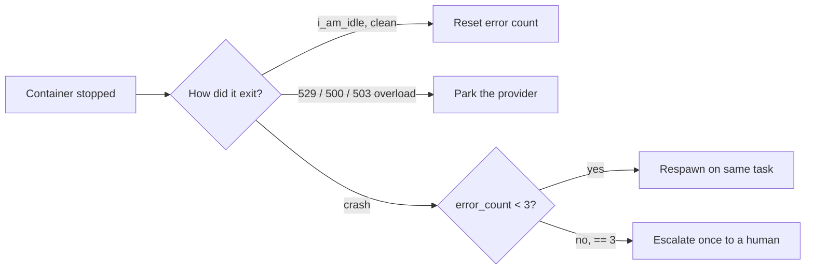

# What keeps a run alive

A long delivery run spans hundreds of spawned containers, and the things that can interrupt one — a model crash, a provider rate limit, a transient overload — are normal, not exceptional. RoboCo is built so none of those quietly kills the work or burns your tokens crash-looping. Two mechanisms do the heavy lifting: **crash auto-retry then escalate**, and **provider park-and-probe**. Both run server-side in the orchestrator, the same way on every backend.

## Crash: auto-retry, then escalate once

When an agent container stops, the orchestrator inspects how it exited:

- **A clean exit** (the agent called `i_am_idle` — it ran out of work) resets that agent's error count. Nothing to do.
- **A provider overload** (see below) parks the provider instead of treating it as a crash.
- **A genuine crash** goes to retry-or-escalate.

On a real crash the orchestrator bumps the agent's error count and **respawns it on the same task** — up to a cap of **3** retries. At exactly the cap it escalates **once** to a human notification (the agent is stranded), then stays quiet so a hard failure can't spam you. The respawn is cold (a fresh container), but it picks the task back up, so a one-off crash is invisible in practice.

## Rate limits & overloads: park, probe, resume

When a provider pushes back, retrying immediately just burns tokens against a wall. So instead of crash-looping, RoboCo **parks** that provider and queues its work:

- A **rate limit (HTTP 429)** parks the provider. The agent reports `i_am_blocked(reason="rate_limited")`, the spawn gate stops launching new work for that provider, and a background loop probes for recovery.
- A **persistent overload (HTTP 529 / 500 / 503)** parks the same way. The model SDK already retries genuinely transient blips; a *persistent* overload is detected from the dead container's log markers and parked rather than crash-retried straight back into the overload. This is gated by `ROBOCO_OVERLOAD_BREAK_ENABLED`, which is **on by default**.
- A **Claude session limit** — the org's rolling 5-hour usage window — parks the same way. Hitting it terminates the agent container with a 429 before the agent can report it, so RoboCo detects it from the dead container's exit (like an overload) and parks the provider instead of crash-respawning the whole fleet straight back into the limit; the queued work auto-revives when the window resets. Also covered by `ROBOCO_OVERLOAD_BREAK_ENABLED`.

The crucial property: **work is queued, never dropped.** Parked tasks wait; the background probe-and-resume loop requires a real `2xx` from the provider before it lifts the park and revives the parked agents. When the provider recovers, the queued work flows again on its own — you don't restart anything.

!!! info "The amber banner"
    While a provider is parked you'll see an amber banner across the panel: a per-provider countdown, how many agents are affected, and "operations paused — resuming automatically." It clears itself when the provider recovers. An empty banner means nothing is parked. The banner is driven live over the `/ws/system` WebSocket and re-syncs over HTTP if the socket drops — so a quiet provider reads as *paused, resuming*, not as a hang.

!!! tip "Parked is not stuck"
    If a run goes quiet, check the banner before assuming something broke. A parked provider with a counting-down timer is RoboCo waiting out a rate limit on purpose. The work is held and will resume — there's nothing for you to do.

## Next

- These guardrails are part of the broader [agent gateway](../company/agent-gateway.md) — agents are structurally constrained, not trusted to behave.
- [Choosing a provider](./provider-routing.md) and [running on Grok](./grok.md).
