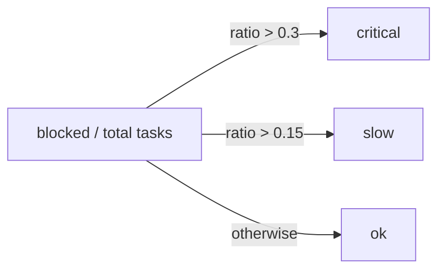

# Health & metrics

Two different questions an operator asks: *is the system up?* and *is the workforce productive?* RoboCo answers the first with two HTTP probes, and the second with an operational Metrics view. Neither has anything to do with token cost — for spend, see [cost & usage](./cost-and-usage.md).

## Liveness and readiness probes

The orchestrator exposes two probes behind nginx (so they're reachable at `localhost:3000/api/...`, or directly on the orchestrator):

| Endpoint | Checks | Returns |
|----------|--------|---------|
| `GET /api/health` | The process is up | Always `200` with `{ status: "ok", version, environment }` once the app is serving |
| `GET /api/ready` | Database (`SELECT 1`) **and** Redis (`PING`) | `200` with `{ status, database, redis }`; `status` is `ok` only when both pass, otherwise `degraded` |

```bash
curl -s http://localhost:3000/api/health
curl -s http://localhost:3000/api/ready
```

!!! info "Readiness is the one to watch"
    `/api/health` is a liveness probe — it stays `200` as long as the process answers, so it can't tell you a dependency is down. `/api/ready` is the real readiness signal: it actively pings Postgres and Redis and reports `degraded` (still HTTP `200`, but `status: "degraded"` with the failing dependency's error in the `database`/`redis` field) when either is unreachable. Point your uptime monitor at `/api/ready` and alert on `degraded`.

!!! note "Startup ordering"
    The app-level root `/health` used during container startup is additionally gated on the in-house RAG engine being operational, which is why the orchestrator can take a minute to report healthy after a cold start while it indexes documents. See [deployment](../deploy/deployment.md) for the full startup sequence.

## The Metrics → Performance view

The **Metrics** page has a **Performance** tab driven by tasks, messages, and notifications — your read on whether work is actually flowing. See the panel walkthrough in [Metrics](../panel/metrics.md).

What it surfaces:

| Group | Metrics |
|-------|---------|
| Velocity | Tasks completed vs created, average completion time (hours), completion rate |
| Blockers | Active blockers, average and longest blocked time, blockers by team |
| Team & agent | Per-team and per-agent performance |
| Communication | Message/notification volume |

### The ok / slow / critical health signal

Org and per-team health roll up to a single status driven mainly by the **blocked-task ratio**:



A team with more than 30% of its tasks blocked reads **critical**; over 15% reads **slow**; below that, **ok**. A heuristic also flags a team sitting on stale active tasks with zero completions. When you see **slow** or **critical**, the Blockers panel tells you where the work is jammed and which team owns it — chase the longest-blocked tasks first.

!!! tip "Health is about flow, not errors"
    This status is computed from task state, not exceptions or crashes. A green org-health with a `degraded` `/api/ready` means the infrastructure is wobbling even though the backlog looks healthy — watch both signals, they answer different questions.

## Next

- Walk the panel surface in [Metrics](../panel/metrics.md) and [the command center](../panel/command-center.md).
- For token spend and the cost dashboard, see [cost & usage](./cost-and-usage.md).
- For the startup sequence and what each container needs, see [deployment](../deploy/deployment.md).
