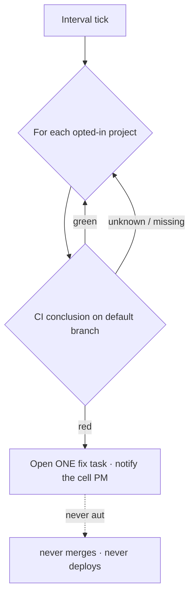
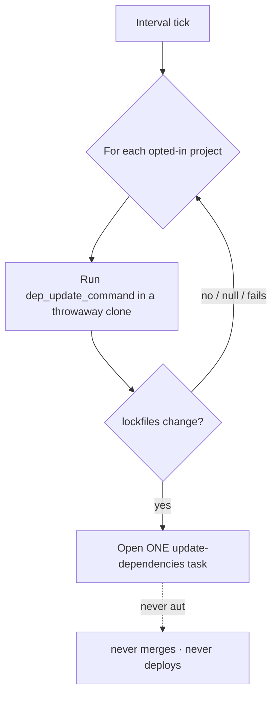

# Autonomous maintenance

RoboCo can keep your projects healthy on their own schedule: it can watch each opted-in project's CI and open a fix task when it goes red, and it can periodically check whether a dependency upgrade would change a project's lockfiles and open an "update dependencies" task when it would. Both are per-project, both are **off by default**, and **neither ever auto-merges** — every task they open rides the normal `dev → QA → PR review → CEO merge` pipeline, exactly like any other task.

These two engines generalize the [self-healing CI loop](self-heal.md), which watches only RoboCo's own repository. Multi-repo CI-watch extends the same idea to *any* project you opt in.

## Multi-repo CI-watch

CI-watch assesses each opted-in project's CI on its default branch. On a red conclusion it opens **one** fix task into that project and notifies that project's cell PM. It never starts that task, never merges it, and never deploys.

### What it does

On each pass (`ROBOCO_CI_WATCH_INTERVAL_SECONDS`, default 1800s) the engine checks each opted-in project's latest CI conclusion on its default branch. On a red conclusion it opens one fix task into that project and notifies the project's cell PM. The pass is resilient by construction:

- A **missing CI signal** is treated as "unknown", never a false green — an absent run never masks a real failure.
- One repo's **GitHub error never aborts the sweep** — the engine moves on to the next project.
- Origination is **bounded and deduped per repo**: a monorepo's cell-projects share one fix task, and the caps below stop a flapping CI from flooding the backlog.



!!! danger "It never merges or deploys"
    A CI-watch fix task is an ordinary task. It flows through the normal delivery lifecycle — QA, the in-path PR-review gate, and your merge — exactly like work you create yourself. The engine never approves, merges, or deploys on its own.

### Bounds on origination

| Setting | Default | Meaning |
|---------|---------|---------|
| `ROBOCO_CI_WATCH_MAX_PER_CYCLE` | `1` | Most fix tasks the sweep may open in one cycle. |
| `ROBOCO_CI_WATCH_MAX_OPEN_TASKS` | `3` | Rolling cap on concurrently-open CI-watch fix tasks per repo; the engine originates nothing more while this many are still open. |

### Enable it

=== "Panel"

    **Settings → Feature Flags** carries the global **"Multi-repo CI-watch"** toggle. Then opt each project in from the **edit-project dialog → "Autonomous Maintenance" section**: turn on `ci_watch_enabled` and optionally set `ci_watch_workflow` (the workflow file to scope the CI signal to, default `ci.yml`).

    !!! note "Takes effect on the next backend restart"
        The feature flag persists in the settings store and applies on the **next backend restart**. The per-project fields apply on the next sweep.

=== "Environment"

    ```bash
    ROBOCO_CI_WATCH_ENABLED=true                 # global switch
    # ROBOCO_CI_WATCH_INTERVAL_SECONDS=1800      # default
    # ROBOCO_CI_WATCH_MAX_OPEN_TASKS=3           # default
    # ROBOCO_CI_WATCH_MAX_PER_CYCLE=1            # default
    ```

    The per-project opt-in (`ci_watch_enabled`, `ci_watch_workflow`) lives on the project, not in env — set it in the edit-project dialog.

## Dependency-update bot

The dependency-update bot periodically checks whether a dependency upgrade would change a project's lockfiles and, if so, opens **one** "update dependencies" task into that project. Detection is read-only: nothing in the real repo is ever mutated.

### What it does

On each pass (`ROBOCO_DEP_UPDATE_INTERVAL_SECONDS`, default 604800s — weekly) the bot runs the project's `dep_update_command` (e.g. `uv lock --upgrade` / `pnpm update`) in a **throwaway clone** and diffs the lockfiles. If the lockfiles would change it opens one "update dependencies" task; otherwise it opens nothing.

- Detection is **read-only**: the command runs in a throwaway clone and only the lockfiles are diffed. The real repo is never mutated — nothing is committed or pushed.
- It is **fail-safe**: a null `dep_update_command` or a command that fails opens nothing.
- Origination is **bounded and deduped per repo**, with the caps below.



!!! danger "It never merges or deploys"
    The update-dependencies task is an ordinary task — QA, the in-path PR-review gate, and your merge all apply. The bot only ever *detects* and *opens*; it never commits, pushes, merges, or deploys.

### Bounds on origination

| Setting | Default | Meaning |
|---------|---------|---------|
| `ROBOCO_DEP_UPDATE_MAX_PER_CYCLE` | `1` | Most update-dependencies tasks the bot may open in one cycle. |
| `ROBOCO_DEP_UPDATE_MAX_OPEN_TASKS` | `3` | Rolling cap on concurrently-open update-dependencies tasks per repo. |

### Enable it

=== "Panel"

    **Settings → Feature Flags** carries the global **"Dependency-update bot"** toggle. Then opt each project in from the **edit-project dialog → "Autonomous Maintenance" section**: set `dep_update_command` (e.g. `uv lock --upgrade` / `pnpm update`) and optionally `dep_update_paths` (comma-separated lockfile paths to watch; defaults to inferring `uv.lock` / `pnpm-lock.yaml`).

    !!! note "Takes effect on the next backend restart"
        The feature flag persists in the settings store and applies on the **next backend restart**. The per-project fields apply on the next sweep.

=== "Environment"

    ```bash
    ROBOCO_DEP_UPDATE_ENABLED=true                  # global switch
    # ROBOCO_DEP_UPDATE_INTERVAL_SECONDS=604800     # default (weekly)
    # ROBOCO_DEP_UPDATE_MAX_OPEN_TASKS=3            # default
    # ROBOCO_DEP_UPDATE_MAX_PER_CYCLE=1             # default
    ```

    The per-project opt-in (`dep_update_command`, `dep_update_paths`) lives on the project, not in env — set it in the edit-project dialog.

## What changes when each is on

- With CI-watch on, a background sweep polls each opted-in project's CI on the configured interval; on a red conclusion a fix task appears in that project's backlog (bounded by the caps above) and its cell PM is notified. With the global flag off, nothing polls.
- With the dependency-update bot on, a background sweep checks each opted-in project's lockfiles on the configured interval; when an upgrade would change them, an update-dependencies task appears. With the global flag off, nothing runs and no throwaway clone is made.

## Next

→ [Self-healing CI](self-heal.md) for the single-repo loop these generalize · [Task lifecycle](../company/task-lifecycle.md) for what an opened task does once you start it · [Environment reference](../deploy/env-reference.md) for the full env list · back to [Optional subsystems](index.md).
